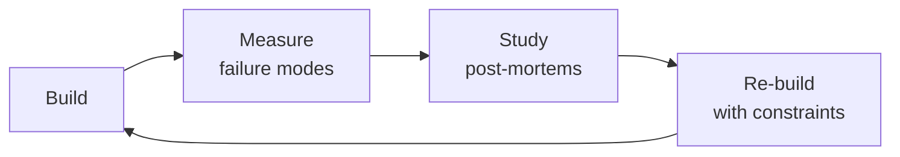

# Monorepo Manager

Veteran's playbook for designing, configuring, and optimizing monorepo architectures at scale. Covers every major tool in the JS/TS ecosystem — Turborepo, Nx, pnpm workspaces, Bazel, Lerna, and Rush — plus repository structure, build orchestration, dependency governance, CI/CD, versioning, and polyrepo migration.

## Route the Request
<!-- QUICK: 30s -- pick your path, skip the rest -->

What are you trying to do?
├── Choose monorepo tooling (Turborepo/Nx/pnpm workspaces/Bazel/Lerna/Rush) → Start at "Workspace Configuration" then "Build Orchestration" under Sub-Skills
├── Design repository structure → Go to "Workspace Configuration" under Sub-Skills
├── Set up build orchestration → Jump to "Build Orchestration" under Sub-Skills
├── Enforce dependency governance → Go to "Dependency Governance" and "Package Boundary Enforcement" under Sub-Skills
├── Optimize CI/CD for monorepo → Jump to "CI/CD for Monorepos" under Sub-Skills
├── Set up versioning strategy → Go to "Versioning & Release" under Sub-Skills
├── Migrate from polyrepo → Jump to "Polyrepo Migration" under references/
├── Need CI/CD pipeline setup first → Route to `ci-cd-builder`
├── Need backend service structure defined → Route to `backend-developer`
├── Need frontend architecture decided → Route to `frontend-developer`
├── Need infrastructure provisioning → Route to `devops-engineer`
└── Don't know where to start? → Start at "Workspace Configuration"

**Do not read the entire skill.** Follow the route above and read only the sections it points to.

## Ground Rules — Read Before Anything Else

These rules apply to *every* response this skill produces.

- **Never adopt a monorepo without understanding the tooling cost.** The benefits are real but so is the CI, caching, and governance overhead.
- **Build caching is not optional — without it, CI times explode.** Remote caching (Turborepo, Nx Cloud, or custom S3) is table stakes.
- **Dependency boundaries must be explicit, not accidental.** Every package should declare what it depends on and what depends on it.
- **Migrating to a monorepo takes weeks, not days.** Tooling setup, CI rework, developer retraining, and history preservation are non-trivial.
- **Always enforce package boundaries in CI.** A circular dependency that compiles locally will break in production.
- **Admit what you don't know.** If a tool (Bazel, Rush) is new territory, research before recommending.


## The Expert's Mindset

Masters of monorepo manager don't just build — they build **the right thing, at the right time, with the right trade-offs**. They think in systems, not tasks.

| Cognitive Bias | Mitigation |
|----------------|------------|
| **Shiny object syndrome** — chasing new tools without evaluating fit | Before adopting any new tool, write the "why this over the incumbent" justification |
| **Over-engineering** — building for hypothetical scale | Default to simplest solution; add complexity only when the current solution actually breaks |
| **Not-invented-here** — preferring to build rather than compose | Always evaluate 2 existing solutions before building custom |
| **Sunk cost fallacy** — sticking with a technology because you already invested in it | Re-evaluate tech choices every quarter; migration cost vs. staying cost |

### What Masters Know That Others Don't
- The **failure modes** of every component in their stack — not just the happy path
- When **not** to use their favorite tool (every tool has a misuse zone)
- That **data/model quality decays over time** — monitoring is not optional, it's foundational

### When to Break Your Own Rules
- **Move fast on reversible decisions.** Data format? Hard to change. Dashboard layout? Easy. Know the difference.
- **Skip the abstraction until the third use case.** Two is coincidence, three is a pattern.
## Operating at Different Levels

| Level | Scope | You... |
|-------|-------|--------|
| **L1** | Single component/module | Implement a well-defined piece following established patterns |
| **L2** | Feature or service | Design and build a complete feature; make tech choices within team conventions |
| **L3** | System or product area | Define architecture for a product area; set team tech standards; mentor L1-L2 |
| **L4** | Multiple systems / platform | Define org-wide architecture patterns; make build-vs-buy decisions; influence industry practice |
| **L5** | Industry / ecosystem | Create new architectural patterns adopted across the industry; redefine what's possible |

**Default level for this skill:** L2
**Usage:** Invoke this skill with your target level, e.g., "as an L3 monorepo manager, design..."

For full level definitions, see `skills/00-framework/skill-levels/SKILL.md`.

## When to Use

- You are choosing a monorepo tool (Turborepo vs. Nx vs. Bazel vs. pnpm workspaces) and need a comparison matrix
- You need to configure build orchestration — task pipelines, caching, parallel execution, and affected detection
- Your monorepo CI is slow and you need to set up remote caching, incremental builds, and matrix-based pipelines
- You are enforcing dependency governance — version consistency, hoisting rules, and peer dependency resolution
- You need to detect and prevent circular dependencies or enforce package boundary rules between modules
- You are setting up versioning and release workflows with Changesets, independent versioning, and changelog generation
- You are migrating from polyrepo to monorepo and need a strategy for history preservation and gradual adoption
- Your monorepo has grown to 50+ packages and you need to refactor the structure, tooling, or dependency graph


### Cross-skills Integration

| Step | Skill | What it produces |
|------|-------|------------------|
| **Before** | system-architect | Software architecture, module boundaries, dependency graph, technology stack decisions |
| **This** | monorepo-manager | Repository structure, build orchestration config, dependency governance rules, CI/CD pipeline |
| **After** | ci-cd-builder | Optimized CI pipelines with caching, affected detection, and parallel builds |

Common chains:
- **Chain**: system-architect → monorepo-manager → ci-cd-builder — Architect defines module boundaries; monorepo manager implements them in tooling; CI/CD builder optimizes the pipeline.
- **Chain**: devops-engineer → monorepo-manager → frontend-developer — DevOps provisions infrastructure; monorepo manager configures the workspace; frontend dev benefits from shared tooling and fast builds.

## Sub-Skills
<!-- QUICK: 30s -- table of deeper dives by topic -->
When the agent identifies a specific monorepo need, drill into the relevant sub-skill rather than reading the full SKILL.md. Each sub-skill has dedicated references, tooling, and checklists.

| Sub-Skill | What It Covers | Quick Command |
|-----------|---------------|---------------|
| **Workspace Configuration** | pnpm workspaces, Yarn workspaces, npm workspaces — `pnpm-workspace.yaml`, hoisting, `workspace:*` protocol | `pnpm list --depth=0 --recursive` |
| **Build Orchestration** | Turborepo `turbo.json` pipelines, Nx task graph, `dependsOn` topology, parallel execution limits | `npx turbo run build --dry-run=json` |
| **Dependency Governance** | Hoisting strategies, syncpack/manypkg enforcement, `pnpm.overrides`, peer dependency resolution, deduplication | `npx syncpack list-mismatches` |
| **Package Boundary Enforcement** | `@nx/enforce-module-boundaries`, ESLint `import/no-restricted-paths`, TypeScript path aliases, circular dependency detection with `dpdm`/`madge` | `npx dpdm --circular --tree=false src/**/*.ts` |
| **CI/CD for Monorepos** | Affected detection (`--filter=[main...HEAD]`), remote caching (Vercel, S3, Nx Cloud), GitHub Actions matrix builds, cache warm/restore | `npx turbo run build --filter=[main...HEAD]` |
| **Versioning & Release** | Changesets workflow, independent vs fixed versioning, `semantic-release` monorepo setup, changelog generation | `npx changeset version` |
| **Monorepo Migration** | Polyrepo → monorepo strategy, `git filter-repo` for history preservation, `git subtree`, gradual adoption risk mitigation | `git filter-repo --path packages/my-lib --to-subdirectory-filter packages/my-lib` |

> **Token-saving rule:** Load sub-skill references on demand. If <!-- DEEP: 10+min -->
debugging cache misses → only read the build orchestration section. If setting up CI → only read the CI/CD section.

## Tool Selection & Decision Matrix

### Comparison Across 8 Dimensions

| Tool | Build Speed | Caching Capability | Task Graph | Plugin Ecosystem | Learning Curve (1–10) | Community Size | Enterprise Readiness | Best For |
|------|-------------|-------------------|------------|------------------|-----------------------|----------------|---------------------|----------|
| **Turborepo** | Very Fast | Local + Remote (Vercel, S3) | Auto via `dependsOn` | Minimal (growing) | 3 | Very Large | Good | JS/TS teams wanting fast setup + remote cache |
| **Nx** | Fast | Local + Remote (Nx Cloud) | Advanced (explicit + implicit) | Extensive (200+) | 6 | Large | Excellent | Large monorepos needing generators, boundaries, DTE |
| **pnpm workspaces** | N/A (install only) | None (no build cache) | None (no orchestrator) | N/A | 2 | Very Large | Partial | Package management only; pair with Turborepo/Nx |
| **Bazel** | Fastest (hermetic) | Local + Remote + RE | Full DAG | Polyglot (Java, Go, TS, etc.) | 9 | Medium | Excellent | Polyglot repos, large scale, strict hermeticity |
| **Lerna** | Slow (legacy) | None (native) | Basic (`--since`) | Minimal | 3 | Large (legacy) | Low | Publishing + changelogs when paired with Turborepo/Nx |
| **Rush** | Fast | Local + Remote (Rush Cloud) | Custom (Rush plugins) | Moderate | 7 | Medium | Excellent | Enterprise .NET/TS monorepos needing policy enforcement |

### Decision Tree

```
Is your codebase 100% JavaScript/TypeScript?
├── Yes
│   ├── Fewer than 10 packages, simple dependency graph?
│   │   ├── Yes → pnpm workspaces alone (no build orchestrator needed)
│   │   └── No → Want the simplest setup with fast caching?
│   │       ├── Yes → Turborepo + pnpm workspaces
│   │       └── No → Need code generation, module boundaries, distributed builds?
│   │           ├── Yes → Nx + pnpm workspaces
│   │           └── No → Vercel ecosystem? → Turborepo
│   └── No (polyglot: Java + Go + TS + Python)
│       ├── Need hermetic builds and remote execution?
│       │   ├── Yes → Bazel
│       │   └── No → Nx (supports multiple languages via executors)
│
Is your org > 500 engineers, strict dependency governance required?
├── Yes → Rush (Microsoft-scale policy enforcement)
└── No → Use Turborepo or Nx

Are you migrating from Lerna?
├── Keep Lerna for publish/changelog, add Turborepo for builds
└── Full migration → Remove Lerna, use Turborepo + changesets
```

### When pnpm Workspaces Alone Is Enough

- **Small monorepos** (3–8 packages) with shallow dependency graphs
- **No need for caching** — build times are already < 30 seconds
- **No CI optimization needed** — full rebuilds are fast enough
- **Simple run scripts** — `pnpm --filter` and `pnpm -r` suffice
- **Example**: design system monorepo with 6 icon/component/theme packages

### When You Need More Than pnpm Workspaces

- Build times > 2 minutes locally or > 10 minutes in CI
- Packages share dependencies that cause rebuild cascades
- Need remote caching so CI and devs don't duplicate builds
- Need task orchestration (build deps before consumers, parallel tests)
- Need code generation for packages, components, configs
- Need dependency boundary enforcement (apps → libs, not libs → apps)
- **Rule of thumb**: if you're writing shell scripts to orchestrate build order, you need Turborepo or Nx.

## Repository Structure

### Structural Patterns

| Pattern | Layout | When to Use |
|---------|--------|-------------|
| **Package-first** | `packages/*` | Small–medium repos, simple ownership. Turborepo's default model. |
| **Domain-first** | `teams/core/`, `teams/billing/`, `teams/shared/` | Large orgs with clear team ownership. Each team owns their domain subtree. |
| **Hybrid (most common)** | `apps/*`, `packages/*`, `tools/*` | Teams of all sizes. Separates deployables (apps) from libraries (packages) from tooling (tools). |

### Hybrid Structure — Deep Dive

```
my-monorepo/
├── apps/
│   ├── web/                # Next.js app
│   │   └── package.json    # "name": "@myorg/web"
│   ├── api/                # Express/Fastify API
│   │   └── package.json    # "name": "@myorg/api"
│   └── mobile/             # React Native app
│       └── package.json
├── packages/
│   ├── ui/                 # Shared UI component library
│   │   └── package.json    # "name": "@myorg/ui"
│   ├── utils/              # Shared utility functions
│   │   └── package.json    # "name": "@myorg/utils"
│   ├── types/              # Shared TypeScript types/interfaces
│   │   └── package.json    # "name": "@myorg/types"
│   └── config/
│       ├── typescript-config/
│       ├── eslint-config/
│       ├── prettier-config/
│       └── jest-config/
├── tools/
│   ├── generators/         # Plop or custom code generators
│   └── scripts/            # CI helper scripts
├── pnpm-workspace.yaml
├── turbo.json
├── package.json            # Root — only dev tooling
└── .github/workflows/
```

### Package Entry Points — The `exports` Field

Do NOT rely on `main` + `module` alone. Use the `exports` field for proper encapsulation:

```jsonc
// packages/ui/package.json
{
  "name": "@myorg/ui",
  "type": "module",
  "main": "./dist/index.js",
  "module": "./dist/index.mjs",
  "types": "./dist/index.d.ts",
  "exports": {
    ".": {
      "import": "./dist/index.mjs",
      "require": "./dist/index.js",
      "types": "./dist/index.d.ts"
    },
    "./button": {
      "import": "./dist/button/index.mjs",
      "require": "./dist/button/index.js",
      "types": "./dist/button/index.d.ts"
    },
    "./styles.css": "./dist/styles.css"
  },
  // Anything NOT in exports is private — consumers cannot deep-import it
  "files": ["dist"],
  "publishConfig": {
    "access": "public"
  }
}
```

### Barrel Exports — Public API Surface

```typescript
// packages/ui/src/index.ts — public barrel
export { Button } from './button';
export { Card } from './card';
export { ThemeProvider } from './theme';
// NOT exported: internal hooks, utils, types — these are implementation details

// packages/ui/src/index.test.ts — barrel test ensures nothing is broken
import * as publicApi from './index';
describe('@myorg/ui public API', () => {
  it('should export Button', () => expect(publicApi.Button).toBeDefined());
  it('should export Card', () => expect(publicApi.Card).toBeDefined());
});
```

### Shared Config Packages

```jsonc
// packages/config/typescript-config/package.json
{
  "name": "@myorg/typescript-config",
  "version": "0.0.0",
  "private": true,
  "files": ["./base.json", "./nextjs.json", "./react-library.json"]
}
```

- **`@myorg/typescript-config/base.json`**: `strict: true`, `exactOptionalPropertyTypes: true`, `noUncheckedIndexedAccess: true`
- **`@myorg/typescript-config/nextjs.json`**: extends `base.json`, adds `"module": "ESNext"`, `"jsx": "preserve"`
- **`@myorg/eslint-config`**: extends `eslint-config-next`, `eslint-config-prettier`, with `@nx/enforce-module-boundaries` rule
- **`@myorg/prettier-config`**: single `module.exports = { semi: true, singleQuote: true, trailingComma: 'all' }`
- **`@myorg/jest-config`**: `jest-preset.js` exporting `{ testEnvironment: 'node', transform: { '^.+\\.ts$': 'ts-jest' } }`

All packages extend these:

```jsonc
// apps/web/package.json
{
  "prettier": "@myorg/prettier-config",
  "jest": { "preset": "@myorg/jest-config" }
}
// tsconfig.json
{
  "extends": "@myorg/typescript-config/nextjs.json"
}
// .eslintrc.js
module.exports = {
  root: true,
  extends: ["@myorg/eslint-config/next"]
};
```

### Internal Libraries vs Published Packages

| Category | Private | Published | Example |
|----------|---------|-----------|---------|
| **Shared config** | ✅ private | ❌ | `@myorg/typescript-config` |
| **Internal types** | ✅ private | ❌ | `@myorg/types` |
| **Shared utils** | ✅ private (or published) | depends | `@myorg/utils` — publish if other orgs use it |
| **UI components** | ⚠️ start private, publish when mature | ✅ eventually | `@myorg/ui` → `@acme/ui` |
| **SaaS platform libs** | ✅ private | ❌ | Business logic, API client wrappers |

**Rule**: Keep a package private until an external consumer explicitly needs it. Publishing prematurely creates a maintenance contract. Use `"private": true` and `"publishConfig": { "access": "restricted" }` for internal-only packages.

## Decision Trees
<!-- QUICK: 30s -- follow the ASCII tree to your scenario -->
### 1. Monorepo Tool Selection
```
                     ┌────────────────────────┐
                     │ START: What's your     │
                     │ primary stack?         │
                     └───────────┬────────────┘
                                 │
          ┌──────────────────────┼──────────────────────┐
          │                      │                      │
    ┌─────▼──────┐       ┌───────▼───────┐       ┌──────▼──────────┐
    │ JavaScript │       │ Polyglot      │       │ Mobile + Web    │
    │ / Type-    │       │ (JS + Python  │       │ (React Native   │
    │ Script     │       │ + Go + etc.)  │       │ + Web)          │
    └─────┬──────┘       └───────┬───────┘       └──────┬──────────┘
          │                      │                      │
    ┌─────▼──────────┐   ┌───────▼───────┐       ┌──────▼──────────┐
    │ <15 packages?  │   │ Bazel or      │       │ Nx with         │
    └──┬─────────┬───┘   │ Pantsbuild.   │       │ @nx/react-native│
       │YES      │NO     │ Best for      │       │ + @nx/web.      │
  ┌────▼────┐ ┌──▼─────┐ │ multi-lang    │       │ Excellent       │
  │ pnpm    │ │ Turbore│ │ + monorepo.   │       │ React Native    │
  │ works-  │ │ po or  │ └───────────────┘       │ monorepo        │
  │ paces   │ │ Nx     │                         │ support.        │
  └─────────┘ └────────┘                         └─────────────────┘
```
**pnpm workspaces alone:** <15 packages, simple dependency graph, no build orchestration needed.  
**Turborepo:** JS/TS, need parallel task execution + caching. Lighter than Nx.  
**Nx:** JS/TS, need generators, plugin ecosystem, advanced affected detection, or mobile+web.  
**Bazel/Pants:** Polyglot (JS + Python + Go + Rust), large org, need reproducible builds.

### 2. Package Boundary Decision
```
                  ┌──────────────────────────┐
                  │ START: Will this package │
                  │ be consumed externally?  │
                  └───────────┬──────────────┘
                              │
                   ┌──────────▼──────────┐
                   │ YES → Publishable   │
                   │ package. Strict API │
                   │ via `exports` field.│
                   │ Semantic versioning │
                   │ with Changesets.    │
                   └─────────────────────┘
                   ┌──────────▼──────────┐
                   │ NO → Internal-only? │
                   └────┬───────────┬────┘
                        │YES        │NO
                   ┌────▼────┐ ┌───▼──────────┐
                   │ `"private│ │ Extract to   │
                   │ ": true` │ │ separate repo│
                   │ in       │ │ with its own │
                   │ package. │ │ CI/CD +      │
                   │ json.    │ │ release cycle│
                   │ No semver│ └──────────────┘
                   │ needed.  │
                   └──────────┘
```
**Published externally → strict `exports` field, semver, Changesets.**  
**Internal shared code → `"private": true`, no versioning overhead.**  
**Truly independent → separate repo. Don't force into monorepo if it ships independently.**

### 3. Versioning Strategy
```
                   ┌──────────────────────────┐
                   │ START: Are packages      │
                   │ coupled (always release  │
                   │ together)?               │
                   └───────────┬──────────────┘
                               │
                    ┌──────────▼──────────┐
                    │ YES → Fixed/Locked  │
                    │ versioning. Single  │
                    │ version bump for    │
                    │ all packages.        │
                    └─────────────────────┘
                    ┌──────────▼──────────┐
                    │ NO → Independent    │
                    │ versioning with     │
                    │ Changesets. Each    │
                    │ package versioned   │
                    │ by its own changes. │
                    └─────────────────────┘
```
**Fixed/Locked:** All packages share one version. Use when packages are tightly coupled (e.g., React + ReactDOM).  
**Independent with Changesets:** Each package versioned independently. Use when packages have different release cadences.

### 4. Migration Path: Polyrepo → Monorepo
```
                  ┌──────────────────────────┐
                  │ START: How many repos    │
                  │ are you merging?         │
                  └───────────┬──────────────┘
                              │
                   ┌──────────▼──────────┐
                   │ <5 repos, <500K     │
                   │ LOC total?          │
                   └────┬───────────┬────┘
                        │YES        │NO
                   ┌────▼────┐ ┌───▼──────────┐
                   │ Big-bang│ │ Gradual      │
                   │ merge   │ │ adoption:    │
                   │ over a  │ │ start with   │
                   │ weekend.│ │ shared config │
                   │ Use     │ │ + utilities. │
                   │ git-    │ │ Add packages │
                   │ subtree │ │ incrementally│
                   │ merge.  │ │ over weeks.  │
                   └─────────┘ └──────────────┘
```
**<5 repos → big-bang over a weekend.** Use subtree merge strategy to preserve history.  
**>5 repos or >500K LOC → gradual adoption.** Start with shared configs and utilities; add one repo at a time.

### 5. CI/CD Affected Detection
```
                   ┌──────────────────────────┐
                   │ START: PR changes files  │
                   │ in which packages?       │
                   └───────────┬──────────────┘
                               │
                    ┌──────────▼──────────┐
                    │ Run affected graph  │
                    │ detection (Nx       │
                    │ affected / Turborepo│
                    │ --filter)           │
                    └────┬───────────┬────┘
                         │           │
                    ┌────▼────┐ ┌───▼──────────┐
                    │ Root    │ │ Only changed │
                    │ config  │ │ packages +   │
                    │ changed?│ │ their         │
                    └──┬───┬──┘ │ dependents    │
                       │YES│NO  │ are built/    │
                  ┌────▼─┐┌▼────┐│ tested.      │
                  │ Build││Build│└──────────────┘
                  │ all  ││ only│
                  │pack- ││aff- │
                  │ ages ││ected│
                  └──────┘└─────┘
```
**Root config change (tsconfig/eslint/CI) → build ALL packages.**  
**Package-level change → build only changed + dependents. Dramatically reduces CI time.**

## Core Workflow
<!-- QUICK: 30s -- scan phase titles to understand the process -->
<!-- DEEP: 10+min -->
### Phase 1 (~15 min): Repository Setup and Tool Selection
1. Assess current state: number of packages, team size, build times, CI bottlenecks, polyglot requirements.
2. Choose toolchain using the Decision Matrix above: Turborepo (fastest setup) vs Nx (most features) vs Bazel (polyglot/hermetic).
3. Initialize workspace: `pnpm-workspace.yaml` with package globs, root `package.json` with dev tooling only.
4. Configure shared tooling: TypeScript base config, ESLint, Prettier, Jest/Vitest — all as shared packages.
5. Set up the repository structure: `apps/` for deployables, `packages/` for libraries, `tools/` for generators/scripts.

<!-- DEEP: 10+min -->
### Phase 2 (~20 min): Dependency Governance
1. Install dependencies at the correct level: framework/runtime deps in each package, dev tooling in root.
2. Configure `pnpm.overrides` or `resolutions` to force single versions of critical dependencies (React, TypeScript, etc.).
3. Run `syncpack` or `manypkg` to detect version mismatches across packages. Set up CI check.
4. Enable `strict-peer-dependencies` in `.npmrc` to catch peer dependency violations at install time.
5. Detect circular dependencies with `dpdm` or `madge`. Break cycles before they become entrenched.

<!-- DEEP: 10+min -->
### Phase 3 (~25 min): Build Orchestration and Caching
1. Design the task pipeline: `turbo.json` or `nx.json` with `dependsOn` topology (e.g., `build` depends on `^build`).
2. Configure remote caching: Vercel (Turborepo), Nx Cloud, or S3-backed custom cache. This is the #1 CI speedup.
3. Set up local caching: enable filesystem cache in CI with restore/save pattern. Use `--cache-dir` for CI isolation.
4. Define `outputs` per task: `.next/**`, `dist/**`, `coverage/**`. Without outputs defined, caching doesn't work.
5. Measure: `turbo run build --dry-run=json` or `nx graph` to verify task topology before committing.

<!-- DEEP: 10+min -->
### Phase 4 (~20 min): CI/CD Pipeline
1. Implement affected detection: `--filter=[base...HEAD]` in CI to only build/test changed packages.
2. Configure GitHub Actions matrix builds: spawn one job per affected package, converge for integration tests.
3. Set up cache warming: build `main` branch on push to warm the remote cache for all PRs.
4. Add dependency boundary checks: `@nx/enforce-module-boundaries` or ESLint `import/no-restricted-paths`.
5. Implement merge queue: require green CI on all affected packages before merge. No "skip CI" on monorepo PRs.

<!-- DEEP: 10+min -->
### Phase 5 (~15 min): Versioning and Release
1. Choose versioning strategy: independent (each package versions separately) vs fixed (all packages share one version).
2. Set up Changesets: `@changesets/cli` for changelog generation, version bumping, and publishing.
3. Configure release workflow: GitHub Action that runs `changeset version` on merge to main, creates Release PR.
4. Publish to registry: `changeset publish` with `--no-private` to skip non-publishable packages.
5. Automate changelog: link to PRs, categorize changes (feat/fix/breaking), notify affected teams.

## Build System & CI/CD

Deep dives on task orchestration, caching architecture, and CI/CD pipelines are in **[references/monorepo-tooling.md](references/monorepo-tooling.md)**:

| Section | What's Covered |
|---------|---------------|
| **Task Orchestration** | Turborepo pipeline config, Nx task executor, pnpm workspace protocols, parallel vs sequential execution strategies |
| **Caching Architecture** | Local + remote caching (Nx Cloud, Turborepo Remote Cache), hash computation (inputs/outputs), cache invalidation rules, what to cache/not cache |
| **CI/CD** | Affected detection (build only what changed), GitHub Actions pipeline with remote caching, remote cache strategies (S3, GCS), CI cache optimization, parallel pipeline strategies (fan-out per package) |

**Quick Reference:**
- **Local dev:** `turbo dev --filter=@myorg/web` — runs only web + dependencies
- **CI affected:** `turbo build --filter=[origin/main...HEAD]` — builds only changed packages
- **Remote cache:** Cut CI times 60-90% with shared read/write cache across CI runs

## Dependency Management & Package Architecture

Deep dives on dependency strategies, package boundaries, versioning, and migration are in **[references/monorepo-patterns.md](references/monorepo-patterns.md)**:

| Section | What's Covered |
|---------|---------------|
| **Dependency Management** | Hoisting strategies (auto vs strict), version consistency tools (syncpack, manypkg), peer dependency resolution, depcheck/audit commands |
| **Code Sharing & Boundaries** | Barrel exports pattern, package boundary enforcement (ESLint import rules, module tags), circular dependency detection (madge, dpdm) |
| **Version Management** | Independent vs fixed versioning, Changesets workflow with CLI commands, semantic-release in monorepos, release pipeline summary |
| **Migration Path** | Polyrepo→monorepo strategy, big-bang (subtree merge), gradual adoption step-by-step, git history preservation, risk mitigation |
| **Developer Experience** | Local dev setup, shared ESLint/TS config, VSCode workspace config, Git hooks (Husky + lint-staged), editor integration |

**Quick Reference:**
- **Hoisting:** `"hoist": true` in `.npmrc` unless you have conflicting peer deps
- **Version sync:** `syncpack list-mismatches` in CI — fail on any discrepancy
- **Circular deps:** `madge --circular packages/` — zero tolerance policy
- **New package:** `pnpm exec changeset` → describe change → commit → CI auto-opens Release PR
### Git Hooks — Husky + lint-staged

```bash
# Install
pnpm add -Dw husky lint-staged
pnpm exec husky init

# .husky/pre-commit
pnpm exec lint-staged

# .husky/commit-msg
pnpm exec -- commitlint --edit $1

# package.json
{
  "lint-staged": {
    "*.{ts,tsx}": [
      "eslint --fix",
      "prettier --write"
    ],
    "*.{json,md,yaml}": [
      "prettier --write"
    ]
  }
}

# commitlint.config.js
module.exports = {
  extends: ['@commitlint/config-conventional'],
  rules: {
    'scope-enum': [2, 'always', ['web', 'api', 'ui', 'utils', 'types', 'tools', 'release']],
  },
};
```


**What good looks like:** `npm run build -- --filter=[changed]` completes in under 3 minutes. Remote cache hit rate > 70%. CI pipeline runs only affected projects. Developer onboarding to add a new package is documented and takes < 30 minutes.

## Cross-Skill Coordination
<!-- QUICK: 30s -- table of who to talk to when -->
Monorepo management touches every development team. A monorepo tooling change affects everyone's daily workflow — coordination isn't optional.

### Decision Gates & Artifacts

- **Gate 1 — Infrastructure Ready:** Monorepo tooling requires CI/CD infrastructure and caching layers provisioned by `devops-engineer`. Artifact: infrastructure readiness checklist.
- **Gate 2 — CI/CD Pipeline Defined:** Build orchestration depends on pipeline configuration from `ci-cd-builder`. Artifact: turbo.json or nx.json with task pipelines.
- **Gate 3 — Project Structures Defined:** Workspace configuration requires backend and frontend project structures from `backend-developer` and `frontend-developer`. Artifact: workspace boundary map.
- **Gate 4 — Dependency Governance Enforced:** Package boundaries and dependency rules validated across all consumer teams. Artifact: dependency graph audit with zero circular deps.
- **Artifact:** Monorepo tooling selection rationale, workspace configuration (pnpm-workspace.yaml, turbo.json), dependency graph visualization.

| Coordinate With | When | What to Share/Ask |
|-----------------|------|-------------------|
| **All Frontend Teams** | Shared package updates, workspace changes, build config | Package version bumps, breaking changes in shared libs, workspace dependency rules |
| **All Backend Teams** | Shared service libraries, protobuf/gRPC schemas, database migrations | Shared library API changes, schema evolution, cross-service contract tests |
| **DevOps / Platform Team** | CI/CD pipeline, build caching, deployment orchestration | Build graph changes, cache invalidation rules, affected projects detection |
| **System Architect** | Repository boundaries, module extraction, dependency direction | Module ownership, dependency rules (e.g., no circular deps), extraction candidates |
| **CTO Advisor** | Monorepo vs polyrepo strategy, tooling investment | Tooling ROI, developer experience metrics, migration feasibility |
| **Security Reviewer** | Dependency scanning, vulnerability management, access control | CODEOWNERS rules, dependency audit strategy, secret detection scope |
| **QA Engineer** | Test orchestration, affected test detection, integration testing | Test dependency graph, affected test selection, cross-service integration test scope |
| **Developer Experience (DX)** | Local development setup, IDE integration, onboarding | Workspace setup time, hot reload experience, IDE project configuration |
| **Project Manager** | Migration timelines, team impact, rollout coordination | Sprint impact assessment, migration milestones, team communication plan |

### Communication Triggers — When to Proactively Notify

| Trigger | Notify | Why |
|---------|--------|-----|
| Shared package major version bump (breaking change) | All Teams, System Architect | All consumers must update; migration guide needed |
| Build cache invalidation (full rebuild required for all projects) | DevOps, All Teams | CI times spike 5-10x; communicate expected duration |
| New workspace or project added to monorepo | DevOps, QA, DX | CI pipeline update, CODEOWNERS, test suite registration |
| Dependency vulnerability in shared package (Critical/High) | Security Reviewer, All Consumer Teams | Patch + propagation timeline; all consumers affected |
| Monorepo tool migration (e.g., Lerna → Nx, Yarn → pnpm) | All Teams, DevOps, DX, CTO Advisor | Breaking workflow change; requires training and migration window |
| Circular dependency detected between workspaces | System Architect, Affected Teams | Architecture violation; refactor or dependency rule change needed |
| Build times increase by >50% for any pipeline | DevOps, DX, Engineering Leads | Developer productivity impact; build optimization investigation |
| Flaky test rate exceeds 5% in shared packages | QA, All Consumer Teams | CI trust eroding; test quarantine or fix required |

### Escalation Path

| Situation | Escalate To | Rationale |
|-----------|------------|-----------|
| Monorepo tooling causing >1 hour/day developer productivity loss | **CTO Advisor** + VP Engineering | Developer experience crisis; tooling investment or polyrepo evaluation |
| Tight coupling creating "distributed monolith" across packages | **System Architect** + CTO Advisor | Architecture degradation; bounded context enforcement needed |
| Build/deploy times exceeding business SLAs (e.g., >30 min to production) | **DevOps Lead** + CTO Advisor | CI/CD bottleneck; infrastructure or architecture investment needed |
| Proposal to split monorepo into polyrepo | **CTO Advisor** + System Architect + All Team Leads | Strategic architecture decision; 3-6 month migration impact |
| License compliance issue in shared dependency | **Legal Advisor** + Security Reviewer | Legal risk; may require dependency removal or legal review |


## Error Decoder
<!-- DEEP: 10+min -->

| Symptom | Root Cause | Fix | Lesson |
|---------|------------|-----|--------|
| CI build takes 45 minutes for a single-line comment change | No affected-project detection; every PR triggers full rebuild of all packages | Implement Turborepo `--filter=[main...HEAD]` or Nx affected commands; set up remote caching to share build artifacts across CI runs | If every change rebuilds everything your CI doesn't scale — implement affected-only detection before anything else |
| Two packages depend on conflicting major versions of React causing runtime errors | No version consistency enforcement; hoisting silently resolved to the wrong version | Use syncpack to enforce single versions across all packages; configure pnpm overrides for critical shared dependencies; run version consistency check in CI | Dependency hell isn't a theory in monorepos — enforce version consistency from day one or pay for it later |
| Every PR has merge conflicts in package.json files across the monorepo | Too many packages with overlapping ownership in a single repository; no CODEOWNERS | Split packages by team ownership domain; add CODEOWNERS per directory for clear ownership; use changesets to serialize version bumps | Merge conflicts in a monorepo signal ownership boundary violations — respect team domains |
| Critical security vulnerability requires patching 15 packages manually | Packages pinned dependencies without workspace protocol; no Renovate or Dependabot automation | Use `workspace:*` protocol for all cross-package dependencies; enable Renovate with auto-merge for patch-level security updates | Manual dependency patching doesn't scale past 5 packages — automate dependency updates or accept delayed security fixes |
| Junior developer accidentally imported from another app's internal module | No package boundary enforcement; any package can import from any other regardless of ownership | Enforce ESLint `import/no-restricted-paths` or Nx module boundary rules; define explicit dependency direction (apps can import libs but not other apps) | Trust is not a dependency governance strategy — enforce package boundaries programmatically in CI |

### Route to Other Skills

| If the Request Is About | Route To |
|--------------------------|----------|
| CI/CD pipeline setup, build caching, remote execution | `ci-cd-builder` |
| Shared library APIs, schema evolution, contract testing | `backend-developer` |
| Shared UI components, design system, workspace tooling | `frontend-developer` |
| CI/CD infrastructure, deployment orchestration | `devops-engineer` |
| Module boundaries, extraction candidates, dependency rules | `system-architect` |

## Proactive Triggers
<!-- QUICK: 30s — when to proactively notify stakeholders -->

| Trigger | Notify | Why |
|---------|--------|-----|
| Circular dependency detected by CI lint step | System Architect, Affected Package Owners | Build-breaking architecture violation; immediate refactor required |
| Build times increase >30% in any pipeline week-over-week | DevOps, DX, Engineering Leads | Developer productivity degradation; cache or pipeline investigation needed |
| Shared package release with breaking change (major version bump) | All Consumer Teams, System Architect | Migration guide needed; all consumers must update imports/APIs |
| Dependency version conflict between two workspaces (different React/TypeScript versions) | Affected Teams, DX | Runtime errors possible; syncpack override or version alignment required |
| Flaky test rate exceeds 5% in shared package test suite | QA, Package Owners | CI trust eroding; test quarantine, fix, or removal decision needed |
| Orphan package detected (zero consumers, zero imports) | Package Owner, System Architect | Unmaintained code in repo; removal or documentation of purpose required |
| Monorepo tool migration proposed (Lerna→Nx, Yarn→pnpm) | All Teams, DevOps, DX, CTO Advisor | 2-4 week migration window; training, CI reconfiguration, and workflow changes needed |

## Production Checklist
<!-- QUICK: 30s -- binary pass/fail items. All must pass. -->
- [ ] **[S1]**  **Monorepo tooling selected** with documented rationale (tool, package manager, versioning strategy)
- [ ] **[S2]**  **Package manager (pnpm) configured** with `pnpm-workspace.yaml`, `.npmrc` (`strict-peer-dependencies=true`), and hoisting strategy
- [ ] **[S3]**  **Pipeline configuration** (`turbo.json` or `nx.json`) with correct `dependsOn`, `outputs`, `inputs`, and `env` for every task
- [ ] **[S4]**  **Global dependencies** defined — `globalDependencies` (config files) and `globalEnv` (env vars) in turbo.json
- [ ] **[S5]**  **Shared config packages** exist and are active: `typescript-config`, `eslint-config`, `prettier-config`, `jest-config`
- [ ] **[S6]**  **Dependency boundaries enforced** via ESLint (`@nx/enforce-module-boundaries` or `import/no-restricted-paths`) — apps don't import other apps; libraries follow dependency direction
- [ ] **[S7]**  **Circular dependency detection running in CI** — `dpdm` or `madge` as a lint step; zero cycles allowed
- [ ] **[S8]**  **Affected-only CI operational** — PRs only rebuild/test changed packages and their dependents (Turborepo `--filter=[main...HEAD]` or Nx `affected`)
- [ ] **[S9]**  **Remote caching configured** and working across CI agents and developer machines (Vercel, Nx Cloud, or self-hosted S3)
- [ ] **[S10]**  **Dependency graph visualized and audited** — no circular deps, no orphans (packages with zero consumers), reasonable fan-out (< 15 consumers per package)
- [ ] **[S11]**  **Versioning strategy chosen** (independent via Changesets recommended) and fully automated in GitHub Actions
- [ ] **[S12]**  **Release pipeline automated**: changeset consumption → version PR → publish on merge (changesets/action)
- [ ] **[S13]**  **Dependency version consistency enforced** with `syncpack` or `manypkg` — no version mismatches for shared deps
- [ ] **[S14]**  **pnpm overrides / resolutions configured** for critical shared deps (React, Next, TypeScript) to enforce single versions
- [ ] **[S15]**  **Peer dependencies correctly declared** in all shared packages — especially React, React DOM, and framework-specific packages
- [ ] **[S16]**  **Code generation tooling configured** (Turborepo generators, Nx generators, or Plop) for new packages/components
- [ ] **[S17]**  **Root-level scripts provide unified commands**: `pnpm dev`, `pnpm build --filter=...`, `pnpm test`, `pnpm lint`
- [ ] **[S18]**  **CI parallelization**: matrix tests split per package with independent retry capability
- [ ] **[S19]**  **CI uses `fetch-depth: 0`** for proper affected detection on PRs
- [ ] **[S20]**  **PR concurrency configured**: `concurrency` + `cancel-in-progress: true` to cancel stale PR runs
- [ ] **[S21]**  **Git hooks active**: Husky + lint-staged pre-commit (lint/format), commitlint for commit message conventions
- [ ] **[S22]**  **VSCode workspace file** with recommended extensions, folder layout, and formatter settings committed
- [ ] **[S23]**  **`.gitignore` covers all build outputs**: `dist/`, `.next/`, `coverage/`, `node_modules/`, `.turbo/`, `.nx/`
- [ ] **[S24]**  **Secrets never committed**: `.env` ignored by `.gitignore`; use vault/secrets manager for environment variables
- [ ] **[S25]**  **Backup/migration plan documented**: if gradual migration, timeline and risk mitigation are written and shared with the team

## Scale Depth
<!-- QUICK: 30s -- find your team size column -->
### Solo (1 person) → Small (2-10) → Medium (10-50) → Enterprise (50+)

| Dimension | Solo | Small | Medium | Enterprise |
|-----------|------|-------|--------|------------|
| **Repo Structure** | Single repo, `src/` + `lib/` folders | pnpm workspaces + Turborepo, 3-15 packages | Nx/Turborepo + remote caching, 15-100 packages | Nx/Bazel + distributed CI, 100+ packages |
| **Build System** | No orchestration, just `pnpm build` | Turborepo with local caching | Remote caching (Nx Cloud/S3), affected-only CI | Distributed build agents, multi-region caching |
| **Dependency Mgmt** | Single `package.json` | pnpm + syncpack version enforcement | Renovate + automated dep updates | Custom package registry + dependency governance board |
| **Package Boundaries** | No enforcement needed | ESLint import rules | Nx module tags + lint rules | Automated boundary enforcement + architecture fitness functions |
| **Versioning** | `npm version patch` | Changesets with independent versioning | Automated release PRs + changelogs | Semantic-release per package + multi-channel releases |
| **CI/CD** | Build all on push | Affected-only builds | Remote cache + parallel pipelines | Distributed CI with Nx Cloud agents or BuildJet |
| **Developer Experience** | VS Code, single config | Shared ESLint/TS config | VSCode workspace + git hooks | Automated generator scripts for new packages |

### Transition Triggers

| From → To | Trigger | What to Change |
|-----------|---------|----------------|
| Solo → Small | 3+ packages sharing code, cross-package PRs weekly | Adopt pnpm workspaces + Turborepo, set up shared configs |
| Small → Medium | >10 packages, CI >15 min, >5 developers | Remote caching, affected-only CI, module boundary enforcement |
| Medium → Enterprise | >100 packages, multi-team, CI >30 min | Distributed CI, architecture governance, automated package scaffolding |

## What Good Looks Like

> When monorepo management is optimized, CI only builds and tests packages affected by each change, remote caching delivers sub-5-minute CI for most PRs, circular dependencies are caught at lint time with zero tolerance, package boundaries are enforced so teams own their domains without friction, dependency versions are kept consistent across all packages, and new developers scaffold a working dev environment in under 10 minutes — the monorepo is a force multiplier, not a bottleneck.

## Cost-Effective Decision Table

| Decision | Free/Cheap Option | Paid Upgrade | When to Upgrade |
|----------|------------------|--------------|-----------------|
| Package manager | pnpm workspaces (free) | — | pnpm is already the best free option |
| Build orchestration | Turborepo (free OSS) | Nx Cloud or Turborepo Remote Cache ($200-$500/mo) | >5 developers, >10 packages, CI times >15 min |
| Remote cache | Local-only or S3 bucket ($1-5/mo) | Vercel Remote Cache or Nx Cloud ($200/mo+) | >5 developers sharing cache or distributed CI |
| Dependency management | Renovate (free OSS) + syncpack (free) | — | Free options are sufficient for most teams |
| Code generation | Plop or Hygen (free OSS) | Nx generators (included) | Already using Nx; otherwise Plop is fine |
| CI parallelization | GitHub Actions matrix (free for public) | BuildJet ($0.004/min) or Nx Cloud agents | Private repos with >10 min CI or need distributed execution |
| Dependency graph visualization | `nx graph` or `turbo run build --graph` (free) | Nx Cloud dependency insights | Need historical trend data or team-level views |

**Annual monorepo tool budget:** MVP: $0 (don't use one). Growth: $0-3K (CI minutes). Scale: $5K-30K (remote cache + CI).

## When NOT to Use This Skill (Overkill)

- **Single repository with <3 packages**: A monorepo is the answer to multi-package coordination. With 1 repo, 1 package, there's nothing to coordinate. Use a normal repo structure.
- **Solo developer**: Monorepo tooling exists to coordinate teams. You are one person. You don't need Turborepo, Nx, workspace protocols, or dependency boundary enforcement.
- **Packages that evolve independently with different release cycles**: If package A releases weekly and package B releases quarterly, they don't benefit from atomic commits. Polyrepo with semver is better.
- **Mixed-language projects with no shared dependency graph**: If you have a Python service and a Go service that share nothing, monorepo gives you only the downsides (large clones, slow CI) without the benefits (shared code, atomic changes).
- **You're already successfully using a polyrepo**: Don't migrate for the sake of "modern best practice." If your polyrepo CI is fast, dependencies are versioned, and devs aren't frustrated, stay put.

## Token-Efficient Workflow

```
# Step 1: Monorepo health check
python3 scripts/monorepo_health.py --root . --output json
# Returns: {"packages": 12, "circular_deps": 0, "orphans": 1,
#           "avg_dep_depth": 2.1, "packages_no_tests": 3, "build_time_cold": 180}

# Step 2: Decision tree
# circular_deps > 0 → FIX IMMEDIATELY. This breaks builds.
# orphans > 0 → Identify and remove or document intentionally unused packages.
# avg_dep_depth > 3 → Refactor. Deep dependency chains slow builds and increase blast radius.
# build_time_cold > 300 → Invest in remote caching.

# Step 3: Quick fix — check what's affected by current change
npx turbo run build --filter=[main...HEAD] --dry-run=json | python3 -c "
import json, sys
data = json.load(sys.stdin)
print(f'Packages to build: {len(data[\"packages\"])}')
"

# Step 4: Verify cache hit rate
npx turbo run build --verbosity=1 2>&1 | grep -c "cache hit"
# Track: cache hit % should be >80% for developers after first build
```

**Principle:** `monorepo_health.py` analyzes package.json files and dependency graph, outputs JSON. Agent reads structured data, follows decision tree. Affected detection verified via Turborepo dry-run (exit code + JSON). Never reads individual package.json files into context.

## Best Practices
<!-- STANDARD: 3min -- rules extracted from production experience -->
1. **Don't adopt a monorepo before you have 3 packages:** `lib/` folder with relative imports works perfectly for 1-2 shared packages. A monorepo solves multi-package coordination — don't create the problem to justify the solution.
2. **Start with pnpm workspaces + Turborepo:** This is the 80/20 solution. You can always migrate to Nx/Bazel later if you outgrow it. Most teams never do.
3. **Affected-only builds are the killer feature:** Don't rebuild everything on every PR. `turbo build --filter=[origin/main...HEAD]` cuts CI time 60-90%.
4. **Enforce package boundaries from day 1:** ESLint `import/no-restricted-paths` or Nx module tags. Without enforcement, your monorepo becomes a spaghetti bowl where everything imports everything.
5. **Zero tolerance for circular dependencies:** Run `madge --circular packages/` in CI. Circular deps break tree-shaking, cause runtime errors, and make dependency graphs impossible to reason about.
6. **Hoist dependencies aggressively:** Set `"hoist": true` in `.npmrc`. Manual hoisting is error-prone. Only opt specific packages out when they have conflicting peer dependencies.
7. **Use Changesets for versioning:** Manual version bumps in monorepos are a nightmare. Changesets automate: `pnpm exec changeset` → describe change → CI opens Release PR.
8. **Remote caching pays for itself immediately:** If CI goes from 20 min to 5 min, that saves 15 min × developer × builds per day. At 5 developers, that's hours per day. S3 bucket caching costs <$5/mo.
9. **Shared configs, not shared codebases:** Extract ESLint/TS/Vite configs into shared packages. Consistent tooling across packages reduces cognitive load more than shared utility code ever will.
10. **Keep one package per team's ownership domain:** If Team A and Team B both modify the same package frequently, split it. Monorepo ≠ shared ownership of everything.

## Anti-Patterns
<!-- STANDARD: 3min — patterns that predictably fail -->

| Anti-Pattern | Why It Fails | Correct Approach |
|---|---|---|
| Every PR rebuilds all packages regardless of what changed | CI time grows linearly with package count; 50-package monorepo = 50-minute CI; developers context-switch | Implement affected-only detection: `turbo build --filter=[main...HEAD]` or `nx affected:build` |
| No package boundary enforcement — any package can import any other | Spaghetti dependency graph forms within weeks; circular deps emerge; impossible to extract or version packages | ESLint `import/no-restricted-paths` or Nx module tags from day 1; CI fails on boundary violations |
| Hoisting React/TypeScript to root and hoping for the best | Version conflicts surface as cryptic runtime errors; "works on my machine" bugs; peer dependency warnings ignored | Use syncpack to enforce single versions; pnpm overrides for critical deps; CI validates version consistency |
| Manual version bumps with `npm version` in each package | Inevitably forget one package; changelogs diverge; release order dependencies break | Changesets: `pnpm exec changeset` describes change → CI opens Release PR with all version bumps and changelogs |
| Skipping remote caching because "local cache is fast enough" | Each CI agent and developer rebuilds from scratch; cold builds dominate; cache misses cost minutes per build | S3 bucket remote cache costs <$5/month; 80%+ cache hit rate; pays for itself in developer time in days |
| One massive shared utility package that everything depends on | Deep dependency chains (A→util, B→A→util, C→B→A→util); changing util rebuilds everything; no ownership boundaries | Split utils by domain: `@org/dates`, `@org/strings`, `@org/api-client`; keep fan-out under 15 consumers per package |
| Adopting monorepo because "Google and Meta do it" without coordination problems | Monorepo solves multi-package coordination — if you don't have coordination problems, you don't need a monorepo | Evaluate: do you have >3 packages sharing code? Cross-package PRs weekly? Build order dependencies? If no, stay simple |
| Running `pnpm install` in CI from scratch every build | 2-5 minutes wasted per CI run on dependency installation; cache invalidation from lockfile changes only | Use `actions/cache` with `pnpm-lock.yaml` as cache key; `pnpm install --frozen-lockfile`; install step <30 seconds |

## Footguns
<!-- DEEP: 10+min — war stories from monorepo management at scale -->

| Footgun | What Happened | Root Cause | How to Prevent |
|---------|---------------|------------|----------------|
| Merged 47 repositories into a monorepo — `git clone` took 12 minutes, CI build time went from 4 minutes to 45 minutes because no one configured affected-files detection, and 3 teams threatened to fork back to polyrepo | A 150-person engineering org consolidated 47 repos into a monorepo using Turborepo in Q1 2024. Migration took 3 months. Day 1 post-migration: `git clone` took 12 minutes (up from 30 seconds). CI builds went from 4 minutes average to 45 minutes because the pipeline built ALL packages regardless of what changed. Two teams with low-touch packages (2 commits/week each) were waiting 45 minutes for CI. Three tech leads submitted proposals to revert to polyrepo. The platform team spent Q2 2024 implementing sparse checkout, affected-files detection, and remote caching before the monorepo became usable. | The team optimized for "everything in one place" without optimizing for "how do we build only what changed?" Turborepo was installed but `turbo.json` used `"**/*"` as inputs for every task — effectively disabling caching and affected-files detection. Git operations weren't considered — a 47-repo monorepo with full history is a massive clone. | **Monorepo migration is not complete when the code is merged — it's complete when CI is faster than before.** Before migration: (1) benchmark `git clone`, install, build, test for each repo, (2) set performance targets for the monorepo: clone <90s, install <60s, affected build <3min, (3) configure sparse checkout, shallow clone, and partial clone from day 1, (4) every `turbo.json` task must have precise `inputs` — never use `**/*`, (5) if any team's CI is slower post-migration, the migration is NOT done. The monorepo must make development faster, not just more centralized. |
| One package's `package.json` had `"react": "*"` — hoisted to root by pnpm, every app in the monorepo got React 19 alpha instead of React 18 LTS, 3 days of debugging "unexplained" crashes and broken SSR | A monorepo with 25 packages used pnpm workspaces with hoisting. In September 2024, a developer added a new internal package with `"react": "*"` in its `package.json`. Pnpm hoisted React 19.0.0-alpha.1 to the root `node_modules`. Every app — none of which had opted into React 19 — started using the alpha version. Server-side rendering broke with cryptic hydration errors. `useEffect` fired twice in development. Three teams spent 3 days debugging before someone ran `npm ls react` and discovered the version mismatch. The offending package wasn't even importing React — the dependency was a copy-paste artifact. | Unrestricted version ranges in a monorepo are time bombs. `"*"` means "give me the latest" — and the latest might be an alpha. Hoisting is powerful but dangerous: one package's bad dependency poisons every consumer. No CI check prevented incompatible version ranges. | **Lock down dependency versions in a monorepo with automation.** Use `syncpack` to enforce single versions of critical dependencies (React, TypeScript, Next.js) across all packages. Add a CI rule: any `package.json` with `"*"` or `">= "` fails the build. Run `pnpm why react` in CI to verify that only the intended version is resolved. For peer dependencies: use pnpm's `strictPeerDependencies=true` in `.npmrc` — if a package declares a peer dep but doesn't match the hoisted version, the install fails. Hoisting is powerful but must be policed. |
| No CODEOWNERS enforcement — any team could modify any package, a frontend team accidentally broke the shared auth library, blocked 8 teams from deploying for 2 days | A monorepo with 30 packages had no CODEOWNERS file. Any developer could approve PRs to any package. In March 2024, a frontend team refactored the shared `@org/auth` package to replace JWT parsing with a newer library. The PR was approved by another frontend developer. The change broke: token refresh logic (used by 5 backend services), session validation (used by the mobile API), and role-based access control (used by the admin dashboard). 8 teams couldn't deploy for 2 days while the auth team — who hadn't been notified of the change — diagnosed and reverted the refactor. | Shared packages are infrastructure, not just code. Without CODEOWNERS, there is no gate between "I changed my package" and "I changed everyone's package." The auth package had no test suite that covered the backend and mobile use cases. | **Every shared package gets CODEOWNERS and a cross-team test suite.** CODEOWNERS: `packages/auth/ @team-auth` — any PR to auth requires auth team approval. Critical shared packages (auth, logging, config, API client): require 2 approvals, one from the owning team and one from a consumer team. Add integration tests that cover ALL consumer use cases — if the mobile team depends on a specific token format, that format must be a test in the auth package. A change that breaks any consumer test cannot merge. |
| Turborepo cache inputs used `**/*` for every task — cache always missed, CI build repeated all tasks on every commit, CI costs hit $14K/month for what should have been $3K | A monorepo team configured Turborepo in May 2024. Every `turbo.json` task had `"inputs": ["**/*"]` — "rebuild if any file changes." Since every commit changed at least one file, the cache never hit. Every CI run rebuilt every package from scratch. CI costs (GitHub Actions minutes): $14K/month. Expected cost with proper caching: $3K/month. The team had enabled remote caching (S3 bucket) but the cache was never populated because inputs were too broad. The infra team flagged the cost anomaly in August — 3 months of unnecessary spend ($33K wasted). | The team copied `"**/*"` from a Turborepo tutorial without understanding that inputs define the cache key. "Any file change" means "never cache." The docs template should have been adapted to specify exactly which files matter (source code, config, not README changes). | **Every Turborepo input must be as narrow as possible.** For a build task: `"inputs": ["src/**", "tsconfig.json", "package.json"]` — not `**/*`. README changes shouldn't invalidate build caches. For a test task: `"inputs": ["src/**", "test/**", "jest.config.js"]`. For a lint task: `"inputs": ["src/**", ".eslintrc.js"]`. Validate cache effectiveness: `turbo run build --dry-run` shows what would be cached. If cache hit rate is <50% for the most common tasks, your inputs are too broad. Remote cache costs are negligible; CI compute costs from missed caches are not. |
| Monorepo without tooling standardization — 3 different test runners (Jest, Vitest, Mocha), 4 different TypeScript versions (4.9, 5.0, 5.1, 5.3), 2 different linter configs — impossible to enforce quality gates across packages | A 10-team monorepo started in January 2024 with "teams own their stack." By June: 3 test runners (Jest, Vitest, Mocha), 4 TypeScript versions (4.9 to 5.3), and 2 linter configs (ESLint 8 and ESLint 9 with flat config). The platform team tried to add a CI quality gate: "all tests must pass with coverage >80%." Couldn't implement it because each test runner had different output formats and configuration. TypeScript compilation at the root failed because packages used incompatible TS versions. A security team tried to add a package audit gate — blocked because different package managers resolved different dependency trees. | Monorepo without standardization defeats the purpose of having everything in one repo. The "team autonomy" argument was used to avoid the hard work of aligning on shared tooling. The platform team didn't set a migration deadline: "eventually we'll standardize." | **Tooling standardization is a monorepo requirement, not a nice-to-have.** Before merging packages: define the canonical test runner, TypeScript version, linter config, and build tool for the entire repo. Packages that can't migrate immediately get a 90-day exception with a documented migration plan. CI enforces that all packages use the canonical tooling. The value of a monorepo is proportional to the consistency of its tooling — inconsistent tooling in one repo is worse than consistent tooling in separate repos. |

## Calibration — How to Know Your Level
<!-- STANDARD: 3min — honest self-assessment -->

| You Know You're Stuck at L1 When... | You Know You've Reached L2 When... | You Know You're L3 When... |
|---|---|---|
| You can set up a monorepo with Turborepo or Nx but every CI run takes >20 minutes and you think "that's just how monorepos work" | You've migrated an org from polyrepo to monorepo and CI build times (for affected packages) are faster post-migration than the average polyrepo build time — and you have the before/after data | An engineering org with 200 developers and 80 packages asks "should we monorepo or stay polyrepo?" — you model the trade-offs with actual build times, coordination costs, and dependency graphs from their specific codebase, and your recommendation is validated by outcomes 12 months later |
| You treat monorepo tooling as "install Nx/Turborepo and we're done" — you haven't configured sparse checkout, affected-files detection, or remote caching | You've instrumented your monorepo's performance: clone time, install time, affected build time, full build time, cache hit rate, CI cost per PR — and you review these metrics monthly | A team says "the monorepo is killing our productivity — our CI takes 30 minutes for a README change" — you diagnose the root cause (overbroad inputs, missing affected-files config) and fix it within a week, reducing their CI time by 85% |
| You enforce conventions manually — you review PRs and comment "please use the shared ESLint config" — and the same violations appear next sprint | You enforce conventions automatically — CI fails on non-standard tooling, CODEOWNERS gates changes to shared packages, and dependency version mismatches are caught at PR time | You design a monorepo governance model that scales to 50+ packages and 15+ teams — your CODEOWNERS, CI gates, and package boundaries prevent cross-team breakage without becoming a bottleneck, and teams self-serve within the guardrails |

**The Litmus Test:** A company with 15 polyrepos and 80 developers asks you to design their monorepo strategy. You have 2 weeks to produce: (1) whether they should monorepo or not (with data, not opinion), (2) tooling selection with trade-offs, (3) migration plan with rollback strategy, (4) governance model for 15 teams. If your first instinct is "yes, monorepos are better," you're L1. Masters evaluate the specific coordination problems, code-sharing patterns, and build constraints before recommending — and sometimes recommend staying polyrepo.

## Deliberate Practice



| Level | Practice | Frequency |
|-------|----------|-----------|
| **Novice** | Rebuild an existing system from scratch, then compare your design with the original | Monthly |
| **Competent** | Add a new constraint (10x data, zero downtime, etc.) to a familiar design and re-architect | Quarterly |
| **Expert** | Design the same system under 3 conflicting constraint sets; write a decision record for each | Quarterly |
| **Master** | Teach a junior to design a system; your role is to ask questions, not give answers | Monthly |

**The One Highest-Leverage Activity:** Every quarter, take a system you built 6+ months ago and redesign it from scratch with what you know now. Write down what changed and why.

## References
<!-- QUICK: 30s -- links to deeper reading -->
- [Monorepo Tool Comparison — Deep Dive](./references/monorepo-tool-comparison.md)
- [Turborepo — Official Documentation](https://turbo.build/repo/docs)
- [Nx — Official Documentation](https://nx.dev/getting-started/intro)
- [pnpm — Workspace Documentation](https://pnpm.io/workspaces)
- [Changesets — Release Workflow](https://github.com/changesets/changesets)
- [Bazel — Build System](https://bazel.build/)
- [Rush — Microsoft's Monorepo Manager](https://rushjs.io/)
- [manypkg — Linting for Monorepo package.json Files](https://github.com/Thinkmill/manypkg)
- [syncpack — Consistent Dependency Versions](https://jamiemason.github.io/syncpack/)
- [Husky — Git Hooks](https://typicode.github.io/husky/)
- [lint-staged — Run Linters on Git Staged Files](https://github.com/okonet/lint-staged)
- [git-filter-repo — Git History Rewriting](https://github.com/newren/git-filter-repo)
- [dpdm — Dependency Tree Analyzer](https://github.com/acrazing/dpdm)
- [Madge — Dependency Graph Visualizer](https://github.com/pahen/madge)
- [Turborepo Remote Cache — Self-Hosted Server](https://github.com/ducktors/turborepo-remote-cache)
