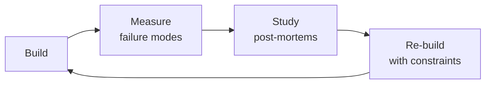

# Monorepo Manager
> **Portability target:** Spec-level (runs on Claude Code, Copilot, Gemini CLI, Codex, Cursor). No vendor-specific frontmatter fields.

Veteran's playbook for designing, configuring, and optimizing monorepo architectures at scale. Covers every major tool in the JS/TS ecosystem — Turborepo, Nx, pnpm workspaces, Bazel, Lerna, and Rush — plus repository structure, build orchestration, dependency governance, CI/CD, versioning, and polyrepo migration.

## Route the Request

<!-- QUICK: 30s -- auto-route first, then intent-route -->

### Auto-Route (No User Input Required)
Evaluate these file-system conditions in order. First match wins — jump immediately.

| # | Condition | Action |
|---|-----------|--------|
| A1 | `file_exists("pnpm-workspace.yaml")` OR `file_exists("lerna.json")` OR `file_exists("nx.json")` OR `file_exists("turbo.json")` OR `file_exists("rush.json")` OR `file_contains("package.json", "\"workspaces\"")` | This is your skill. Jump to **Core Workflow** — Phase 1. |
| A2 | `file_exists("turbo.json")` AND `file_contains("turbo.json", "\"dependsOn\"\|\"outputs\"\|\"inputs\"")` | Jump to **Sub-Skills** — Build Orchestration (pipeline config). |
| A3 | `file_exists("pnpm-workspace.yaml")` AND `file_contains("pnpm-workspace.yaml", "packages:")` AND NOT `file_exists("turbo.json\|nx.json")` | Jump to **Decision Trees** — Tool Selection (need build orchestrator). |
| A4 | `file_contains(".github/workflows/*.yml", "affected\|--filter=\|nx affected")` | Jump to **Sub-Skills** — CI/CD for Monorepos. |
| A5 | `file_exists(".changeset/config.json")` OR `file_contains("package.json", "\"@changesets/cli\"")` | Jump to **Sub-Skills** — Versioning & Release. |
| A6 | `file_contains("package.json", "\"syncpack\"\|\"manypkg\"\|\"check-dependency-version-consistency\"")` OR `file_contains(".eslintrc*", "import/no-restricted-paths\|\"@nx/enforce-module-boundaries\"")` | Jump to **Sub-Skills** — Dependency Governance & Package Boundary Enforcement. |
| A7 | `file_contains("*.yml", "git subtree\|git filter-repo\|git submodule\|polyrepo")` AND `file_contains("*.md", "monorepo\|mono.repo\|migrate")` | Jump to **Sub-Skills** — Monorepo Migration (polyrepo → monorepo). |
| A8 | `file_exists("WORKSPACE")` OR `file_exists("BUILD.bazel\|BUILD")` OR `file_contains("*", "bazel build\|bazel test")` | This is a Bazel monorepo — jump to **Tool Selection & Decision Matrix** — Bazel row. |

### Intent Route (Ask the User)
If no auto-route matched, use this intent tree:

```
What are you trying to do?
├── Choose monorepo tooling (Turborepo/Nx/pnpm/Bazel/Lerna/Rush) → Jump to "Tool Selection & Decision Matrix"
├── Design repository structure and package boundaries → Jump to "Sub-Skills" — Workspace Configuration
├── Set up build orchestration with caching and affected detection → Jump to "Sub-Skills" — Build Orchestration
├── Enforce dependency governance and prevent circular dependencies → Jump to "Sub-Skills" — Dependency Governance
├── Optimize CI/CD — affected-only builds, remote caching, parallel jobs → Jump to "Sub-Skills" — CI/CD for Monorepos
├── Set up versioning and release workflow with Changesets → Jump to "Sub-Skills" — Versioning & Release
├── Migrate from polyrepo to monorepo → Jump to "Sub-Skills" — Monorepo Migration
├── Need CI/CD pipeline setup first → Invoke ci-cd-builder skill instead
└── Not sure? → Describe your team size, package count, and current pain points

```
Do not read the entire skill. Follow the route above and read only the sections it points to.

## Anti-Rationalization — No Excuses

| Rationalization | Reality |
|---|---:|
| "Monorepo solves everything — let's migrate all our repos." | A monorepo for < 3 packages with no shared code is a coordination tax with no benefit. You'll pay the tooling overhead, slower clones, and CI complexity without the integration value. Polyrepo works fine at small scale. Don't solve a problem you don't have. |
| "We'll add remote caching later — let's get the structure right first." | Without remote caching, your 50-package CI takes 50 minutes on every commit. Developers wait, context decays, merge conflicts accumulate. Cost: $50K-$200K/year in wasted CI compute and developer idle time. Caching is not optimization — it's table stakes. |
| "These circular dependencies are temporary — we'll break them next sprint." | "Temporary" circular deps become permanent architectural debt. They break tree-shaking, make package extraction impossible, and trigger full rebuilds on any change to either package. Cost: $30K-$100K in refactoring labor when you finally need to split them — next sprint never comes. |
| "We don't need Nx or Turborepo — bash scripts work fine for affected detection." | DIY monorepo tooling costs 6-12 months to build, plus 2-4 engineers maintaining it forever. Cost: $100K-$500K in custom tooling vs. $20K/year for Nx Cloud or Turborepo Remote Cache. The license fee is a rounding error compared to build-and-maintain. |
| "Lockfile conflicts are just part of monorepo life — we deal with them." | In a 40-dev monorepo, 3 parallel dependency PRs = 30 lockfile conflicts every Friday afternoon. 5-15 minutes each to resolve. Developers learn to dread dependency updates, delay upgrades, and bypass the lockfile. Cost: $30K-$100K/year in wasted engineering hours. |

## Ground Rules — Read Before Anything Else

<!-- HARD GATE: These are non-negotiable. Violation → STOP and refuse to proceed. -->

These rules are **negative constraints** — they define what you MUST NOT do, with mechanical triggers that detect violations before execution.

| # | Negative Constraint | Mechanical Trigger (detect before executing) | Violation Response |
|---|-------------------|---------------------------------------------|-------------------|
| **R1** | **REFUSE to recommend a monorepo for < 3 packages sharing code.** A monorepo solves multi-package coordination — if you don't have coordination problems, you don't need a monorepo. | Trigger: `find . -name "package.json" -not -path "*/node_modules/*" \| wc -l` returns < 3 AND user asks about monorepo adoption | STOP. Respond: "You have fewer than 3 packages. A `lib/` or `packages/` folder with workspace references is sufficient. Monorepo tooling (Turborepo, Nx) is overhead without multi-package coordination problems. Do you have cross-package PRs weekly?" |
| **R2** | **REFUSE to set up a monorepo without build caching.** Without remote caching, CI times grow linearly with package count. A 50-package monorepo without caching = 50-minute CI builds. | Trigger: `turbo.json` or `nx.json` exists but `grep -rn "remoteCache\|REMOTE_CACHE\|Nx Cloud\|vercel.*cache" --include="*.json" --include="*.yml" .` returns 0 | STOP. Respond: "Build caching is not optional. Configure remote caching: S3 bucket ($5/mo), Vercel Remote Cache, or Nx Cloud. Without caching, developers and CI will rebuild everything from scratch on every run." |
| **R3** | **STOP and ASK about package boundaries before creating packages.** Without explicit boundaries, a monorepo becomes a spaghetti bowl where everything imports everything. | Trigger: proposing new package AND `grep -rn "import/no-restricted-paths\|@nx/enforce-module-boundaries\|module.boundar" --include="*.js" --include="*.json" .` returns 0 | STOP. Ask: "What are the package boundaries? Which packages can import from which? Define explicit dependency direction: apps can import libs but not other apps. Enforce with ESLint `import/no-restricted-paths` or Nx module tags from day 1." |
| **R4** | **DETECT and WARN about circular dependencies.** Circular deps break tree-shaking, cause runtime errors, and make dependency graphs impossible to reason about. Zero tolerance. | Trigger: `npx dpdm --circular --tree=false "packages/**/*.ts" 2>&1 \| grep -c "circle"` returns > 0 OR `npx madge --circular --extensions ts,tsx packages/` finds cycles | WARN: "Circular dependencies detected. Run `npx madge --circular --extensions ts,tsx packages/` to see them. Break cycles by extracting shared code to a lower-level package or inverting the dependency. Never merge circular deps." |
| **R5** | **DETECT and WARN about version mismatches for shared dependencies.** Two packages depending on conflicting React/TypeScript versions cause runtime errors that are nearly impossible to debug. | Trigger: `npx syncpack list-mismatches 2>&1 \| grep -c "✘"` returns > 0 OR `grep -rn "\"react\":\|\"typescript\":" packages/*/package.json \| awk -F: '{print $NF}' \| sort -u \| wc -l` returns > 1 for any shared dep | WARN: "Version mismatches found for shared dependencies. Run `npx syncpack fix-mismatches` to align versions. Add `npx syncpack list-mismatches` to CI lint step. Mismatched React versions cause 'works on my machine' bugs." |
| **R6** | **STOP and ASK before using wildcard workspace globs.** `packages/*` includes everything — test fixtures, build outputs, abandoned experiments. Every package in the workspace pays the install cost. | Trigger: `grep -rn "packages/\*\|\"packages/\*\"" pnpm-workspace.yaml\|package.json` returns a match with no `!packages/` exclusions | STOP. Ask: "Your workspace glob matches every directory. Are there test fixtures, build outputs, or abandoned packages included? Add exclusions: `!packages/e2e` and list packages explicitly if < 10." |
| **R7** | **REFUSE to migrate to a monorepo without benchmarking CI time before and after.** If migration makes CI slower for any team, the migration is NOT complete. Monorepo must make development faster, not just more centralized. | Trigger: monorepo migration proposed AND no CI benchmark data: `grep -rn "benchmark\|CI.time\|build.*before\|build.*after" migration-plan.md \| wc -l` returns 0 | STOP. Respond: "Benchmark before migration: `git clone`, install, build, test for each repo. Set targets for the monorepo: clone < 90s, install < 60s, affected build < 3min. Migration isn't done until CI is FASTER than before." |
| **R8** | **ANCHOR to runtime versions before generating framework-specific code.** Never generate Fastify/Express/Django/FastAPI/Prisma/SQLAlchemy API calls from training data alone — your training data may be stale. | Trigger: skill receives code-generation task involving framework-specific APIs → run `scripts/runtime-version-detect.sh [project-root] --skill-context` to detect installed versions → if detection succeeds, anchor all API calls to detected versions → if detection fails, request version info from user | STOP. Respond: "Detected: {runtime}@{version}, {frameworks}@{versions}. Anchoring all API calls to these versions. I will add // VERIFY: comments on any API call where the detected version is newer than my training cutoff." |
| **R9** | **RUN the ROI Gate before any non-emergency code change.** Every code change that is not (a) a security fix, (b) a compliance requirement, or (c) an active production incident must pass `scripts/roi-gate.sh`. If the gate returns negative, refuse to write the code. | Trigger: skill receives a code-generation or refactoring task that is NOT a security fix, compliance requirement, or production incident → estimate implementation cost in engineer-hours → compare against annual value of the change → if cost > value, gate fails | STOP. Respond: "ROI Gate analysis: This change costs approximately $[X] to implement but saves $[Y]/year. Payback period: [N] years. If payback > 2 years, I recommend declining this work. See `scripts/roi-gate.sh` for the full formula." |


- **Admit uncertainty — never fabricate.** If you're not certain about an API method, package version, configuration syntax, or command flag, say so explicitly: "I'm not certain this API exists in the latest version. Check the official docs at [URL]." Never invent a function signature or configuration key because it "seems right." Hallucinated code costs hours of debugging.
- **Flag your knowledge cutoff.** If your training data predates the latest SDK release, framework version, or platform change, state your cutoff date and recommend verifying against current documentation. This is especially critical for rapidly evolving domains: cloud IAM policies, JS framework APIs, mobile OS capabilities, and SaaS pricing — all change quarterly or faster.
- **Never guess security configurations.** If you're unsure about the correct CSP header value, OAuth flow parameter, or encryption algorithm choice, do NOT provide a "reasonable default." Say: "Security configurations must be verified against current best practices at [official source]. I cannot provide a definitive answer without current documentation."
- **Distinguish between what you know and what you infer.** Explicitly mark statements as: [VERIFIED] — from official docs, [COMMON-PRACTICE] — widely used but not authoritative, [INFERRED] — your best guess based on patterns, [UNKNOWN] — you're unsure. This helps the user calibrate trust in your output.
## The Expert's Mindset

Masters of monorepo manager don't just build — they build **the right thing, at the right time, with the right trade-offs**. They think in systems, not tasks.

| Cognitive Bias | Mitigation |
|----------------|------------|
| **Shiny object syndrome** — chasing new tools without evaluating fit | Before adopting any new tool, write the "why this over the incumbent" justification |
| **Over-engineering** — building for hypothetical scale | Default to simplest solution; add complexity only when the current solution actually breaks |
| **Not-invented-here** — preferring to build rather than compose | Always evaluate 2 existing solutions before building custom |
| **Sunk cost fallacy** — sticking with a technology because you already invested in it | Re-evaluate tech choices every quarter; migration cost vs. staying cost |

### What Masters Know That Others Don't
- The **failure modes** of every component in their stack — not just the happy path
- When **not** to use their favorite tool (every tool has a misuse zone)
- That **data/model quality decays over time** — monitoring is not optional, it's foundational

### When to Break Your Own Rules
- **Move fast on reversible decisions.** Data format? Hard to change. Dashboard layout? Easy. Know the difference.
- **Skip the abstraction until the third use case.** Two is coincidence, three is a pattern.

## Operating at Different Levels

| Level | Scope | You... |
|-------|-------|--------|
| **L1** | Single component/module | Implement a well-defined piece following established patterns |
| **L2** | Feature or service | Design and build a complete feature; make tech choices within team conventions |
| **L3** | System or product area | Define architecture for a product area; set team tech standards; mentor L1-L2 |
| **L4** | Multiple systems / platform | Define org-wide architecture patterns; make build-vs-buy decisions; influence industry practice |
| **L5** | Industry / ecosystem | Create new architectural patterns adopted across the industry; redefine what's possible |

**Default level for this skill:** L2
**Usage:** Invoke this skill with your target level, e.g., "as an L3 monorepo manager, design..."

For full level definitions, see `skills/00-framework/skill-levels/SKILL.md`.

## When to Use

- You are choosing a monorepo tool (Turborepo vs. Nx vs. Bazel vs. pnpm workspaces) and need a comparison matrix
- You need to configure build orchestration — task pipelines, caching, parallel execution, and affected detection
- Your monorepo CI is slow and you need to set up remote caching, incremental builds, and matrix-based pipelines
- You are enforcing dependency governance — version consistency, hoisting rules, and peer dependency resolution
- You need to detect and prevent circular dependencies or enforce package boundary rules between modules
- You are setting up versioning and release workflows with Changesets, independent versioning, and changelog generation
- You are migrating from polyrepo to monorepo and need a strategy for history preservation and gradual adoption
- Your monorepo has grown to 50+ packages and you need to refactor the structure, tooling, or dependency graph

### Cross-skills Integration

| Step | Skill | What it produces |
|------|-------|------------------|
| **Before** | system-architect | Software architecture, module boundaries, dependency graph, technology stack decisions |
| **This** | monorepo-manager | Repository structure, build orchestration config, dependency governance rules, CI/CD pipeline |
| **After** | ci-cd-builder | Optimized CI pipelines with caching, affected detection, and parallel builds |

Common chains:
- **Chain**: system-architect → monorepo-manager → ci-cd-builder — Architect defines module boundaries; monorepo manager implements them in tooling; CI/CD builder optimizes the pipeline.
- **Chain**: devops-engineer → monorepo-manager → frontend-developer — DevOps provisions infrastructure; monorepo manager configures the workspace; frontend dev benefits from shared tooling and fast builds.

## Decision Trees **(QUICK)**

<!-- QUICK: 30s -- follow the ASCII tree to your scenario -->
### 1. Monorepo Tool Selection

```
                     ┌────────────────────────┐
                     │ START: What's your     │
                     │ primary stack?         │
                     └───────────┬────────────┘
                                 │
          ┌──────────────────────┼──────────────────────┐
          │                      │                      │
    ┌─────▼──────┐       ┌───────▼───────┐       ┌──────▼──────────┐
    │ JavaScript │       │ Polyglot      │       │ Mobile + Web    │
    │ / Type-    │       │ (JS + Python  │       │ (React Native   │
    │ Script     │       │ + Go + etc.)  │       │ + Web)          │
    └─────┬──────┘       └───────┬───────┘       └──────┬──────────┘
          │                      │                      │
    ┌─────▼──────────┐   ┌───────▼───────┐       ┌──────▼──────────┐
    │ <15 packages?  │   │ Bazel or      │       │ Nx with         │
    └──┬─────────┬───┘   │ Pantsbuild.   │       │ @nx/react-native│
       │YES      │NO     │ Best for      │       │ + @nx/web.      │
  ┌────▼────┐ ┌──▼─────┐ │ multi-lang    │       │ Excellent       │
  │ pnpm    │ │ Turbore│ │ + monorepo.   │       │ React Native    │
  │ works-  │ │ po or  │ └───────────────┘       │ monorepo        │
  │ paces   │ │ Nx     │                         │ support.        │
  └─────────┘ └────────┘                         └─────────────────┘
```
**pnpm workspaces alone:** <15 packages, simple dependency graph, no build orchestration needed.
**Turborepo:** JS/TS, need parallel task execution + caching. Lighter than Nx.
**Nx:** JS/TS, need generators, plugin ecosystem, advanced affected detection, or mobile+web.
**Bazel/Pants:** Polyglot (JS + Python + Go + Rust), large org, need reproducible builds.

### 2. Package Boundary Decision

```
                  ┌──────────────────────────┐
                  │ START: Will this package │
                  │ be consumed externally?  │
                  └───────────┬──────────────┘
                              │
                   ┌──────────▼──────────┐
                   │ YES → Publishable   │
                   │ package. Strict API │
                   │ via `exports` field.│
                   │ Semantic versioning │
                   │ with Changesets.    │
                   └─────────────────────┘
                   ┌──────────▼──────────┐
                   │ NO → Internal-only? │
                   └────┬───────────┬────┘
                        │YES        │NO
                   ┌────▼────┐ ┌───▼──────────┐
                   │ `"private│ │ Extract to   │
                   │ ": true` │ │ separate repo│
                   │ in       │ │ with its own │
                   │ package. │ │ CI/CD +      │
                   │ json.    │ │ release cycle│
                   │ No semver│ └──────────────┘
                   │ needed.  │
                   └──────────┘
```
**Published externally → strict `exports` field, semver, Changesets.**
**Internal shared code → `"private": true`, no versioning overhead.**
**Truly independent → separate repo. Don't force into monorepo if it ships independently.**

### 3. Versioning Strategy

```
                   ┌──────────────────────────┐
                   │ START: Are packages      │
                   │ coupled (always release  │
                   │ together)?               │
                   └───────────┬──────────────┘
                               │
                    ┌──────────▼──────────┐
                    │ YES → Fixed/Locked  │
                    │ versioning. Single  │
                    │ version bump for    │
                    │ all packages.        │
                    └─────────────────────┘
                    ┌──────────▼──────────┐
                    │ NO → Independent    │
                    │ versioning with     │
                    │ Changesets. Each    │
                    │ package versioned   │
                    │ by its own changes. │
                    └─────────────────────┘
```
**Fixed/Locked:** All packages share one version. Use when packages are tightly coupled (e.g., React + ReactDOM).
**Independent with Changesets:** Each package versioned independently. Use when packages have different release cadences.

### 4. Migration Path: Polyrepo → Monorepo

```
                  ┌──────────────────────────┐
                  │ START: How many repos    │
                  │ are you merging?         │
                  └───────────┬──────────────┘
                              │
                   ┌──────────▼──────────┐
                   │ <5 repos, <500K     │
                   │ LOC total?          │
                   └────┬───────────┬────┘
                        │YES        │NO
                   ┌────▼────┐ ┌───▼──────────┐
                   │ Big-bang│ │ Gradual      │
                   │ merge   │ │ adoption:    │
                   │ over a  │ │ start with   │
                   │ weekend.│ │ shared config │
                   │ Use     │ │ + utilities. │
                   │ git-    │ │ Add packages │
                   │ subtree │ │ incrementally│
                   │ merge.  │ │ over weeks.  │
                   └─────────┘ └──────────────┘
```
**<5 repos → big-bang over a weekend.** Use subtree merge strategy to preserve history.
**>5 repos or >500K LOC → gradual adoption.** Start with shared configs and utilities; add one repo at a time.

### 5. CI/CD Affected Detection

```
                   ┌──────────────────────────┐
                   │ START: PR changes files  │
                   │ in which packages?       │
                   └───────────┬──────────────┘
                               │
                    ┌──────────▼──────────┐
                    │ Run affected graph  │
                    │ detection (Nx       │
                    │ affected / Turborepo│
                    │ --filter)           │
                    └────┬───────────┬────┘
                         │           │
                    ┌────▼────┐ ┌───▼──────────┐
                    │ Root    │ │ Only changed │
                    │ config  │ │ packages +   │
                    │ changed?│ │ their         │
                    └──┬───┬──┘ │ dependents    │
                       │YES│NO  │ are built/    │
                  ┌────▼─┐┌▼────┐│ tested.      │
                  │ Build││Build│└──────────────┘
                  │ all  ││ only│
                  │pack- ││aff- │
                  │ ages ││ected│
                  └──────┘└─────┘
```
**Root config change (tsconfig/eslint/CI) → build ALL packages.**
**Package-level change → build only changed + dependents. Dramatically reduces CI time.**

## Core Workflow **(STANDARD)**

<!-- QUICK: 30s -- scan phase titles to understand the process -->
<!-- DEEP: 10+min -->
### Phase 1 (~15 min): Repository Setup and Tool Selection
1. Assess current state: number of packages, team size, build times, CI bottlenecks, polyglot requirements.
2. Choose toolchain using the Decision Matrix above: Turborepo (fastest setup) vs Nx (most features) vs Bazel (polyglot/hermetic).
3. Initialize workspace: `pnpm-workspace.yaml` with package globs, root `package.json` with dev tooling only.
4. Configure shared tooling: TypeScript base config, ESLint, Prettier, Jest/Vitest — all as shared packages.
5. Set up the repository structure: `apps/` for deployables, `packages/` for libraries, `tools/` for generators/scripts.
  Complete when: Toolchain selected and initialized (pnpm-workspace.yaml configured), shared TypeScript/ESLint/Prettier/Jest configs in place, and repository structure (apps/packages/tools) created.

<!-- DEEP: 10+min -->
### Phase 2 (~20 min): Dependency Governance
1. Install dependencies at the correct level: framework/runtime deps in each package, dev tooling in root.
2. Configure `pnpm.overrides` or `resolutions` to force single versions of critical dependencies (React, TypeScript, etc.).
3. Run `syncpack` or `manypkg` to detect version mismatches across packages. Set up CI check.
4. Enable `strict-peer-dependencies` in `.npmrc` to catch peer dependency violations at install time.
5. Detect circular dependencies with `dpdm` or `madge`. Break cycles before they become entrenched.
  Complete when: All dependency versions synced (syncpack/manypkg passes), strict-peer-dependencies enabled, and zero circular dependencies detected (dpdm/madge clean).

<!-- DEEP: 10+min -->
### Phase 3 (~25 min): Build Orchestration and Caching
1. Design the task pipeline: `turbo.json` or `nx.json` with `dependsOn` topology (e.g., `build` depends on `^build`).
2. Configure remote caching: Vercel (Turborepo), Nx Cloud, or S3-backed custom cache. This is the #1 CI speedup.
3. Set up local caching: enable filesystem cache in CI with restore/save pattern. Use `--cache-dir` for CI isolation.
4. Define `outputs` per task: `.next/**`, `dist/**`, `coverage/**`. Without outputs defined, caching doesn't work.
5. Measure: `turbo run build --dry-run=json` or `nx graph` to verify task topology before committing.
  Complete when: Task pipeline configured with dependsOn topology, remote caching connected and verified, and task graph validates with no errors.

<!-- DEEP: 10+min -->
### Phase 4 (~20 min): CI/CD Pipeline
1. Implement affected detection: `--filter=[base...HEAD]` in CI to only build/test changed packages.
2. Configure GitHub Actions matrix builds: spawn one job per affected package, converge for integration tests.
3. Set up cache warming: build `main` branch on push to warm the remote cache for all PRs.
4. Add dependency boundary checks: `@nx/enforce-module-boundaries` or ESLint `import/no-restricted-paths`.
5. Implement merge queue: require green CI on all affected packages before merge. No "skip CI" on monorepo PRs.
  Complete when: Affected detection working in CI (verified by filter returning >0 projects), cache warming on main, dependency boundary rules enforced, and merge queue configured.

<!-- DEEP: 10+min -->
### Phase 5 (~15 min): Versioning and Release
1. Choose versioning strategy: independent (each package versions separately) vs fixed (all packages share one version).
2. Set up Changesets: `@changesets/cli` for changelog generation, version bumping, and publishing.
3. Configure release workflow: GitHub Action that runs `changeset version` on merge to main, creates Release PR.
4. Publish to registry: `changeset publish` with `--no-private` to skip non-publishable packages.
5. Automate changelog: link to PRs, categorize changes (feat/fix/breaking), notify affected teams.
  Complete when: Versioning strategy chosen (independent/fixed), Changesets configured with automated changelog generation, release workflow tested, and publishing pipeline operational.


## Error Decoder — War Stories from the Trenches

**(STANDARD)**

When this domain goes wrong, it goes wrong in predictable ways. Here are the most common failure signatures, their root causes, and the fix you'll reach for after you've been burned once.

| Symptom | Root Cause | Fix | Lesson |
|---------|-----------|-----|--------|
| `nx affected --base=main` reports "0 affected projects" — CI rebuilds, retests, and redeploys all 20 packages on every commit. CI queue backs up for 45 minutes per push. $12K/month in CI compute for a 10-person team | Affected detection depends on the comparison base. If `main` branch was force-pushed or rebased, `nx affected` can't find the diff and falls back to "everything." No CI check that verifies affected detection is actually working | Add a CI step that verifies affected detection: `nx affected:lint --base=HEAD~1` must return >0 projects. If it returns 0, fail the CI run — "detected 0 affected projects but this is a PR with changes. Affected detection may be broken." Use merge-base instead of branch name: `--base=$(git merge-base main HEAD)` | Affected detection that silently fails to "everything" is worse than no affected detection — it costs the same as a full rebuild but with false confidence. Verify it's working in CI, not just once during setup. The check: "did we actually detect the files we just changed?" |
| Circular dependency: `packages/auth` imports from `packages/ui`, which imports from `packages/auth`. Build succeeds locally (cached), fails in CI with "Cannot access before initialization." Error message doesn't mention circular dependency — it's a runtime crash in the bundled output | Circular dependency crept in during a refactor. No boundary enforcement at PR time. Build tools (esbuild, webpack) handle circular imports differently — it works in dev (loose mode) but fails in production (strict mode). Error appears as a runtime crash, not a build error | Enforce `eslint-plugin-import/no-cycle` with `maxDepth: 1`. Run `madge --circular packages/` in CI — fail on any cycle. Configure `dependency-cruiser` with rules: "no packages in group A may import from group B." Enforce from day one — retrofitting boundary rules onto a codebase with existing cycles is a $30K refactoring project | Circular dependencies are time bombs: they work until they don't. The failure is always in production, never in dev, because build tools handle cycles differently across environments. Detect circles at PR time — every month without detection adds technical debt that compounds exponentially |
| Remote caching (Turborepo/Nx Cloud) disabled for 3 months — nobody noticed because "builds still pass, just slower." CI costs $8K/month in redundant builds. A developer says "our builds are slow" and nobody connects it to the disabled cache | Remote cache was disabled during a CI pipeline migration and never re-enabled. No monitoring on cache hit rate — if it drops to 0%, no alert fires. The cost is invisible because CI bills are aggregated across the entire org — nobody owns the line item | Monitor cache hit rate as a KPI: alert if <70% for any pipeline. Dashboard: cache hit rate, build time trend, estimated cost savings. Ownership: the CI/platform team owns the CI budget and is incentivized to optimize it. Run a quarterly "cloud cost audit" that specifically flags CI compute as a line item — if it's $8K/month, someone will notice | Remote caching is the highest-ROI investment in monorepo tooling. Its absence is invisible because "slow builds" gets normalized. The cache hit rate KPI is the canary — if it drops, something is wrong and it's costing real money. Cache savings should be reported, not just enabled |
| Single version policy enforced via `pnpm.overrides`: React 18.3 forced on all packages. Legacy package `@company/legacy-dashboard` requires React 17 due to a dependency on `react-class-component` which was removed in React 18. Build fails, deployment blocked | Version override applied without testing against all consumers. The override forces everyone to the same version, but one package has a hard dependency on an older version. No per-package override mechanism — it's all-or-nothing | Implement version policy with exceptions: `pnpm.overrides` for the 95% of packages that can share, `package.json` overrides for the 5% that can't. Maintain a "version drift" report: which packages are not on the standard version and why? Review exceptions quarterly. Before forcing a version bump, run `pnpm why <package>` across all workspaces to find blockers | Single version policy is a goal, not an absolute law. The 5% of packages that can't upgrade will block deployment for the 95% that can. Exceptions with documented justifications and quarterly review maintain the policy without creating a deployment blockade |
| Monorepo has 15 packages → only 3 are actively maintained. 80% of code is dead packages that "someone might need." Every CI run rebuilds all 15. Dependency updates (Renovate) open PRs against dead packages weekly. Team spends 4 hours/week reviewing and closing bot PRs for code no one owns | No package ownership model. Dead packages remain because "removing a package is risky — someone might import it." No usage analytics — no one knows which packages are actually imported. Renovate configured to scan all packages in the workspace | Implement package ownership: every package has a CODEOWNERS entry. Track package usage: `nx graph` shows which packages depend on which. Remove any package with 0 dependents and 0 recent commits (90+ days). Configure Renovate to skip archived/deprecated packages. Run `depcheck` quarterly to find unused dependencies within active packages | Dead packages are not harmless — they consume CI time, generate noise PRs, and dilute the ownership model. A package with no maintainer and no dependents is just code that costs money to keep. Usage tracking makes removal decisions data-driven instead of fear-driven |

## Best Practices

1. **Affected-detection is a hard requirement, not an optimization.** Without `nx affected` or `turbo run --filter`, every commit rebuilds and retests every package. A 20-package monorepo with 40-min test suites burns $50K-$200K/year in wasted CI compute. Implement affected detection before the CI bill forces a polyrepo split.
2. **Remote caching pays for itself in the first month.** Turborepo Remote Cache or Nx Cloud eliminates redundant builds across CI runners and developer machines. A team of 20 developers rebuilding the same dependency graph 50 times/day saves 200+ hours of compute time per month. The license cost is a rounding error compared to the savings.
3. **Enforce dependency boundaries from day one.** Use `eslint-plugin-import` `no-restricted-imports`, `@nx/enforce-module-boundaries`, or `dependency-cruiser` to prevent circular dependencies and cross-boundary imports. A circular dependency between `packages/ui` and `packages/auth` becomes a $30K-$100K refactoring problem when you need to extract either package.
4. **Single version policy for shared dependencies.** Use `pnpm.overrides` or `resolutions` to force a single version of React, TypeScript, and other framework dependencies across all packages. Two different React versions in one bundle causes "Invalid hook call" errors with no stack trace. Run `syncpack list-mismatches` in CI and fail on any divergence.
5. **Workspace organization by deployable vs library.** `apps/` for deployables, `packages/` for shared libraries, `tools/` for generators and scripts. This convention enables tooling to distinguish between packages that need deployment and those that don't. Every new developer should understand the structure in under 5 minutes.
6. **CODEOWNERS granularity prevents review bottlenecks.** Never use `* @team-platform` at root — it means every README typo requires platform team review. Use directory-specific ownership: `packages/ui/** @team-design-system`, `packages/auth/** @team-security`. Allow escalation paths for cross-cutting changes.
7. **Git performance at scale requires proactive maintenance.** A monorepo with 500K+ files and 2M commits slows `git status` to 10+ seconds. Deploy `git maintenance start`, enable `core.fsmonitor` (Watchman), use `--filter=blob:none` partial clones, and configure shallow clones in CI. Git performance erosion steals 2-5 hours/week/developer.
8. **Merge queue for serializing dependency changes.** When 10 developers merge feature branches simultaneously, lockfile conflicts consume 10-20% of merge time. A merge queue serializes dependency changes, regenerates the lockfile on each merge, and eliminates parallel conflicts. Configure CI to regenerate and push fixup commits on lockfile conflicts.
9. **Lockfile merge strategy must be automated.** Never resolve lockfile conflicts manually — the result is non-deterministic builds. Use `git merge-file` strategy for JSON lockfiles, or configure CI to regenerate the lockfile from scratch on conflict. A manual lockfile merge that passes CI but fails in production is a multi-hour debugging session.
10. **Tool version alignment across all packages.** Enforce a single TypeScript/ESLint/Prettier version at the monorepo root. Use `syncpack` to ensure all `devDependencies` match. A package compiling with TS 5.4 generating declarations consumed by a package on TS 4.9 creates silent type mismatches that break external consumers.

## Error Recovery **(DEEP)**

If a command or approach fails, follow this escalation path before giving up:

| Symptom | First Action | If That Fails | Last Resort |
|---------|-------------|---------------|-------------|
| Tool/command not found | Check installation: `which [tool]` or `[tool] --version`. Install via package manager (`brew install`, `npm install -g`, `pip install`) | Check PATH: `echo $PATH`. Verify the tool binary is in a PATH directory. Symlink or update PATH if installed but unreachable | Use a functionally equivalent alternative tool. If `rg` is unavailable, use `grep -r`. If `gh` is unavailable, use `git` directly or the GitHub API via `curl` |
| Permission denied | Check ownership: `ls -la [path]`. Fix with `chmod` or `sudo` if appropriate. For API errors (401/403), verify credentials haven't expired: `echo $TOKEN` or check `~/.netrc` | Refresh credentials: re-authenticate with the service. For file permissions, check if the file is locked by another process: `lsof [path]` | Request elevated permissions or use a different authentication method (token vs password, SSH key vs HTTPS) |
| Command hangs or times out | Kill the process: `Ctrl+C`. Re-run with a timeout: `timeout 30 [command]` or `gtimeout` on macOS. Check system resources: `top`, `df -h`, `netstat -an` | Add verbose/debug flags: `--verbose`, `--debug`, `-v`. Check logs: `tail -f [logfile]`. Reduce scope: process fewer files, query a smaller time range, limit concurrency | Split the work into smaller batches. Implement a retry loop with exponential backoff (1s, 2s, 4s, 8s). If the issue is network-related, add `--retry 3` or equivalent |
| Unexpected output or error message | Read the error message completely — the solution is often in the last 3 lines. Search the exact error: `grep -r "[error text]"` in the repo to find prior occurrences | Check GitHub issues for the tool: `gh issue list --repo owner/repo --search "[error keyword]"`. Check Stack Overflow | Simplify the approach. If the complex one-liner fails, break it into 3 sequential commands. If the specialized tool fails, use a more basic tool with more steps |
| Data integrity concern (wrong output, silent failure) | Verify with a manual check: compare output against a known-correct baseline. Add assertions: `[command] | grep -q "[expected]" && echo "OK" || echo "FAIL"` | Run the operation on a smaller subset first. Compare checksums: `shasum`, `md5`. Check for silent truncation: `wc -l` before and after | Abort and flag for human review. Do not proceed past data integrity failures — the cost of propagating bad data exceeds the cost of delay |

**Hard failure boundary:** If 3 different approaches all fail, STOP. Do not iterate infinitely. Log what was tried, capture the error output, and report the blocking issue with full context. Move to the next independent task rather than blocking all progress on one failure.

## Cross-Skill Coordination

<!-- QUICK: 30s -- table of who to talk to when -->
Monorepo management touches every development team. A monorepo tooling change affects everyone's daily workflow — coordination isn't optional.

### Decision Gates & Artifacts

- **Gate 1 — Infrastructure Ready:** Monorepo tooling requires CI/CD infrastructure and caching layers provisioned by `devops-engineer`. Artifact: infrastructure readiness checklist.
- **Gate 2 — CI/CD Pipeline Defined:** Build orchestration depends on pipeline configuration from `ci-cd-builder`. Artifact: turbo.json or nx.json with task pipelines.
- **Gate 3 — Project Structures Defined:** Workspace configuration requires backend and frontend project structures from `backend-developer` and `frontend-developer`. Artifact: workspace boundary map.
- **Gate 4 — Dependency Governance Enforced:** Package boundaries and dependency rules validated across all consumer teams. Artifact: dependency graph audit with zero circular deps.
- **Artifact:** Monorepo tooling selection rationale, workspace configuration (pnpm-workspace.yaml, turbo.json), dependency graph visualization.

| Coordinate With | When | What to Share/Ask |
|-----------------|------|-------------------|
| **All Frontend Teams** | Shared package updates, workspace changes, build config | Package version bumps, breaking changes in shared libs, workspace dependency rules |
| **All Backend Teams** | Shared service libraries, protobuf/gRPC schemas, database migrations | Shared library API changes, schema evolution, cross-service contract tests |
| **DevOps / Platform Team** | CI/CD pipeline, build caching, deployment orchestration | Build graph changes, cache invalidation rules, affected projects detection |
| **System Architect** | Repository boundaries, module extraction, dependency direction | Module ownership, dependency rules (e.g., no circular deps), extraction candidates |
| **CTO Advisor** | Monorepo vs polyrepo strategy, tooling investment | Tooling ROI, developer experience metrics, migration feasibility |
| **Security Reviewer** | Dependency scanning, vulnerability management, access control | CODEOWNERS rules, dependency audit strategy, secret detection scope |
| **QA Engineer** | Test orchestration, affected test detection, integration testing | Test dependency graph, affected test selection, cross-service integration test scope |
| **Developer Experience (DX)** | Local development setup, IDE integration, onboarding | Workspace setup time, hot reload experience, IDE project configuration |
| **Project Manager** | Migration timelines, team impact, rollout coordination | Sprint impact assessment, migration milestones, team communication plan |

### Communication Triggers — When to Proactively Notify

| Trigger | Notify | Why |
|---------|--------|-----|
| Shared package major version bump (breaking change) | All Teams, System Architect | All consumers must update; migration guide needed |
| Build cache invalidation (full rebuild required for all projects) | DevOps, All Teams | CI times spike 5-10x; communicate expected duration |
| New workspace or project added to monorepo | DevOps, QA, DX | CI pipeline update, CODEOWNERS, test suite registration |
| Dependency vulnerability in shared package (Critical/High) | Security Reviewer, All Consumer Teams | Patch + propagation timeline; all consumers affected |
| Monorepo tool migration (e.g., Lerna → Nx, Yarn → pnpm) | All Teams, DevOps, DX, CTO Advisor | Breaking workflow change; requires training and migration window |
| Circular dependency detected between workspaces | System Architect, Affected Teams | Architecture violation; refactor or dependency rule change needed |
| Build times increase by >50% for any pipeline | DevOps, DX, Engineering Leads | Developer productivity impact; build optimization investigation |
| Flaky test rate exceeds 5% in shared packages | QA, All Consumer Teams | CI trust eroding; test quarantine or fix required |

### Escalation Path

| Situation | Escalate To | Rationale |
|-----------|------------|-----------|
| Monorepo tooling causing >1 hour/day developer productivity loss | **CTO Advisor** + VP Engineering | Developer experience crisis; tooling investment or polyrepo evaluation |
| Tight coupling creating "distributed monolith" across packages | **System Architect** + CTO Advisor | Architecture degradation; bounded context enforcement needed |
| Build/deploy times exceeding business SLAs (e.g., >30 min to production) | **DevOps Lead** + CTO Advisor | CI/CD bottleneck; infrastructure or architecture investment needed |
| Proposal to split monorepo into polyrepo | **CTO Advisor** + System Architect + All Team Leads | Strategic architecture decision; 3-6 month migration impact |
| License compliance issue in shared dependency | **Legal Advisor** + Security Reviewer | Legal risk; may require dependency removal or legal review |


| Upstream Skill | What You Receive | When to Involve |
|---|---|---|
| `system-architect` | System context, integration points, architectural constraints | Before specialized implementation — understand the system it fits into |


## Proactive Triggers

<!-- QUICK: 30s — when to proactively notify stakeholders -->

| Trigger | Notify | Why |
|---------|--------|-----|
| Circular dependency detected by CI lint step | System Architect, Affected Package Owners | Build-breaking architecture violation; immediate refactor required |
| Build times increase >30% in any pipeline week-over-week | DevOps, DX, Engineering Leads | Developer productivity degradation; cache or pipeline investigation needed |
| Shared package release with breaking change (major version bump) | All Consumer Teams, System Architect | Migration guide needed; all consumers must update imports/APIs |
| Dependency version conflict between two workspaces (different React/TypeScript versions) | Affected Teams, DX | Runtime errors possible; syncpack override or version alignment required |
| Flaky test rate exceeds 5% in shared package test suite | QA, Package Owners | CI trust eroding; test quarantine, fix, or removal decision needed |
| Orphan package detected (zero consumers, zero imports) | Package Owner, System Architect | Unmaintained code in repo; removal or documentation of purpose required |
| Monorepo tool migration proposed (Lerna→Nx, Yarn→pnpm) | All Teams, DevOps, DX, CTO Advisor | 2-4 week migration window; training, CI reconfiguration, and workflow changes needed |


## State Log

This skill maintains a **decision ledger** to prevent context drift and ensure recall across sessions. Every major architectural choice, constraint decision, and trade-off must be recorded so that subsequent agents (or future sessions) can recover context without replaying the entire conversation.
## What Good Looks Like

>

> See [references/what-good-looks-like.md](references/what-good-looks-like.md) for the full quality standard.

## Deliberate Practice


```mermaid
graph LR
    A[Build] --> B[Measure<br/>failure modes] --> C[Study<br/>post-mortems] --> D[Re-build<br/>with constraints] --> A

```

| Level | Practice | Frequency |
|-------|----------|-----------|
| **Novice** | Rebuild an existing system from scratch, then compare your design with the original | Monthly |
| **Competent** | Add a new constraint (10x data, zero downtime, etc.) to a familiar design and re-architect | Quarterly |
| **Expert** | Design the same system under 3 conflicting constraint sets; write a decision record for each | Quarterly |
| **Master** | Teach a junior to design a system; your role is to ask questions, not give answers | Monthly |

**The One Highest-Leverage Activity:** Every quarter, take a system you built 6+ months ago and redesign it from scratch with what you know now. Write down what changed and why.

## Anti-Patterns

- **`git clone` with full history** on a 5-year monorepo with 2M commits takes 45 minutes and 15GB. Every CI runner, every new hire, every `git bisect` pays this cost. Use shallow clones (`--depth=1`), file-system-level clones (reference repos), or `--filter=blob:none` (partial clone).
- **Turborepo/Nx cache invalidation** — `turbo run build --force` rebuilds everything. But without `--force`, Nx's computation hashing includes `package.json` dependencies and source files but NOT environment variables. If you change `NODE_ENV` from `development` to `production`, the hash doesn't change and stale builds are served from cache.
- **`CODEOWNERS` file at root** with `* @team-platform` means EVERY file change requires platform team review. A README typo fix in `docs/` triggers a required review from the platform team, creating a bottleneck. Use directory-specific ownership and allow `**` wildcards for broad ownership patterns.
- **Package version drift** — `packages/ui/package.json` depends on `react@18.2` and `packages/app/package.json` depends on `react@18.3`. The lockfile resolves both to one version, but CI installs might pick the other. Two React versions in one bundle causes "Invalid hook call" errors with no stack trace pointing to the root cause.
- **Affected graph `--base=main`** compares against the local `main` branch. If CI hasn't fetched `main` recently, the affected graph computes against stale `main`, missing files that changed since. Always `git fetch origin main --depth=1` before computing affected projects.
- **Monorepo CI time explosion — every commit runs all tests.** Without affected-detection (Nx/Turborepo), a 20-package monorepo with 40-min test suites burns 40 min × 50 commits/day × 250 days of CI runner time. **Total cost: $50K-$200K/year in wasted CI compute.** Implement `nx affected:test --base=HEAD~1` or `turbo run test --filter=[HEAD^1]` so only changed packages and their dependents are tested.
- **Wrong dependency boundaries create circular dependency sinkholes.** When `packages/ui` imports from `packages/auth` and `packages/auth` imports from `packages/ui`, every change to either package triggers a full rebuild and makes extraction impossible. **Total cost: $30K-$100K in refactoring labor when you eventually need to split them.** Enforce unidirectional dependency flow with `eslint-plugin-import` `no-restricted-imports` rules and `nx enforce-module-boundaries`.
- **Git performance degradation at scale.** A monorepo with 500K+ files and 2M commits slows `git status` to 10+ seconds and `git blame` to 30+ seconds — multiplied across 20 developers, this steals 2-5 hours/week/developer. **Total cost: $10K-$50K/year in lost developer productivity.** Deploy `git maintenance start` (incremental repack), enable `core.fsmonitor` (Watchman), and use Scalar or `--filter=tree:0` partial clones.
- **Monorepo without tooling investment.** Teams that DIY their monorepo tooling (custom bash scripts for affected detection, bespoke caching, manual changelog generation) spend 6-12 months building what Nx/Turborepo/Lerna provide out of the box — plus 2-4 engineers maintaining it forever. **Total cost: $100K-$500K in custom tooling build + maintenance vs. $20K/year for Nx Cloud or Turborepo Remote Cache.** Invest in established tooling from day one; the license cost is a rounding error compared to build-and-maintain.
- **Lockfile merge conflicts consuming 10-20% of developer merge time.** In a 40-developer monorepo with a single `pnpm-lock.yaml` or `yarn.lock`, every dependency addition or upgrade creates a merge conflict with every other parallel dependency change. A team of 10 merging 3 feature branches each on a Friday afternoon generates 30 lockfile conflicts — each taking 5-15 minutes to resolve by regenerating the lockfile from scratch. Developers learn to dread dependency PRs, delay upgrades, or bypass the lockfile entirely, introducing non-deterministic builds. **Total cost: $30K-$100K/year in wasted engineering hours on lockfile conflict resolution and CI failures from incorrect manual merges.** Use a tool that supports lockfile merge drivers (`git merge-file` strategy for JSON lockfiles), configure CI to regenerate the lockfile and push a fixup commit on conflict, or adopt a merge queue that serializes dependency changes to eliminate parallel conflicts entirely.
- **Shared dependency hoisting creating phantom runtime dependencies** — your monorepo uses `node_modules` hoisting to deduplicate `lodash` at the root. Package `admin-ui` imports `lodash` but doesn't declare it in its `package.json` — it works because the hoisted `lodash` is there at runtime. Six months later, a refactor removes `lodash` from `shared-utils` (the ONLY package that declared it). The hoisting collapses — `lodash` disappears from `node_modules`. `admin-ui` breaks in production with `Cannot find module 'lodash'` despite passing all CI checks (which used cached `node_modules` from before the refactor). The bug takes 3 hours to trace because CI was green and nothing in `admin-ui`'s own package.json changed. **Total cost: $20K-$80K per incident in debugging phantom dependencies, plus $50K-$200K in revenue loss if the break affects a customer-facing production path.** Fix: Enforce strict dependency boundaries with ESLint rules (`no-extraneous-dependencies`, `import/no-extraneous-dependencies`) or Nx module boundary rules; configure your package manager to use strict hoisting (`pnpm` with `hoist: false` or `yarn` with `nmHoistingLimits: workspaces`); run a production-mode install+start smoke test in CI (not just dev mode) to catch missing runtime dependencies.
- **CI pipeline parallelization hitting concurrency limits from monorepo scale** — each of your 20 packages has its own CI job. At 8 concurrent GitHub Actions runners (the default for most plans), jobs queue serially: package 9 waits for package 1, package 17 waits for package 9. Your CI pipeline takes 45 minutes because of queue time, not build time. Developers open PRs at 9 AM and get CI feedback at 9:45 AM — a 45-minute feedback loop. Over 8 PRs/day × 20 developers, that's 120 hours/month of developer waiting time. Three senior engineers ($150/hr) lose 30 hours/month each just waiting for CI — $13,500/month. **Total cost: $50K-$200K/year in developer idle time from CI queue delays, plus $20K-$50K/year in unnecessary CI runner costs from suboptimal parallelization.** Fix: Use affected-detection (`nx affected --target=test`) to only run jobs for changed packages; set up a self-hosted CI runner fleet with auto-scaling to handle peak loads; consolidate fast package tests into shared jobs that test multiple small packages together; negotiate increased runner concurrency with your CI provider for monorepo workloads.
- **Tool version drift across packages causing silent inconsistencies** — your monorepo standardizes on TypeScript 5.3, but `packages/legacy-dashboard` uses TypeScript 4.9 (pinned during a migration that was never completed) and `packages/experiments` uses TypeScript 5.4 (a developer updated it locally to use a new feature). The root `tsconfig.json` extends base settings, but each package compiles with its own version. `packages/app` compiles with TS 5.3 and generates declarations that reference features from TS 5.4 (via an import from `packages/experiments`). The declarations work in VSCode (which uses the workspace TS version) but fail when published to npm and consumed by an external project running TS 4.9. An external integration partner's CI breaks, delaying their release by 4 days and triggering a contract escalation clause. **Total cost: $30K-$100K per incident in cross-team debugging and partner relationship damage from inconsistent tool versions.** Fix: Enforce a single TypeScript version at the monorepo root with `package.json` `resolutions` or `overrides`; use `syncpack` to ensure all `devDependencies` match across packages; add a CI check that fails if any package declares a different version of a shared dev tool than the root; use `npx syncpack fix-mismatches` as a pre-commit hook to auto-correct drift.

## Gotchas

| Gotcha | Cost | Fix |
|--------|------|-----|
| Affected detection silently falls back to "all projects" — CI rebuilds and retests every package on every commit. CI costs balloon and queue times stretch to 45 minutes per push. Nobody notices the cache is broken because "builds still pass." | $50K-$200K/year in wasted CI compute for a 20-package monorepo with 10+ developers. A $12K/month CI bill that should be $3K/month burns $108K/year unnecessarily. | Add a CI step that verifies affected detection: `nx affected --base=HEAD~1` must return >0 projects. Monitor remote cache hit rate as a KPI — alert if <70%. |
| Circular dependency creeps in during a refactor — `packages/auth` imports from `packages/ui`, which imports from `packages/auth`. Build succeeds locally (cached), fails in production with "Cannot access before initialization." | $30K-$100K in refactoring costs to untangle entrenched circular dependencies discovered months after introduction. Each month without detection compounds the problem. | Enforce `eslint-plugin-import/no-cycle` with `maxDepth: 1` from day one. Run `madge --circular packages/` in CI — fail on any cycle. Retrofitting boundary rules is 5-10x more expensive. |
| Single version policy enforced uniformly — `pnpm.overrides` forces React 18.3 on all packages. One legacy package requires React 17 and blocks deployment for the entire monorepo. | $20K-$50K in blocked deployments when the 5% of packages that can't upgrade hold the 95% hostage. Each blocked deploy delays feature delivery across all teams. | Implement version policy with documented exceptions: overrides for 95% of packages, per-package overrides for the 5% that can't. Maintain a version drift report and review exceptions quarterly. |
| Dead packages consume CI time and generate noise PRs — 80% of packages are unmaintained but "someone might need them." Renovate opens weekly PRs against dead packages that nobody reviews. | $15K-$40K/year in review overhead from bot PRs against dead code, plus $30K-$80K/year in wasted CI compute rebuilding packages no one imports. | Implement package ownership with CODEOWNERS. Track usage with `nx graph`. Remove packages with 0 dependents and 0 recent commits (90+ days). Configure Renovate to skip archived/deprecated packages. |

## Verification

- [ ] `git clone --depth=1` — clone completes in < 2 minutes, repo size < 500MB
- [ ] Affected graph: `turbo run build --filter=[HEAD^1]` or `nx affected:build --base=HEAD~1` — only changed projects build
- [ ] Build cache: second build with no changes — `FULL TURBO` or `Nx Cloud` reports 100% cache hit rate
- [ ] CI pipeline: changed `packages/ui/` only runs `ui` tests, not `app` or `admin` tests
- [ ] Package consistency: `npx syncpack list-mismatches` — zero version mismatches across packages
- [ ] Lint all: `npm run lint` at root — zero errors, all packages pass

## Verification Guardrails

Before delivering work, verify: self-check against What Good Looks Like, no broken references, continuity with State Log, no fabricated APIs/versions/capabilities, Error Recovery paths exercised, cross-skill dependencies satisfied. If any fail, revise before delivering.

## Production Checklist **(DEEP)**

- [ ] **[S1]** Affected-detection operational: `nx affected:build --base=HEAD~1` or `turbo run build --filter=[HEAD^1]` builds only changed packages and their dependents. Verified with a test PR that changes a single package.
- [ ] **[S2]** Remote caching configured and warmed: main branch builds populate the remote cache. PR builds achieve >80% cache hit rate. Second build with no changes reports FULL TURBO or 100% Nx Cloud cache hit.
- [ ] **[S3]** Dependency boundaries enforced in CI: `eslint-plugin-import` `no-restricted-imports` or `@nx/enforce-module-boundaries` configured. Zero circular dependencies. CI fails on boundary violations.
- [ ] **[S4]** Single version policy enforced: `syncpack list-mismatches` returns zero mismatches in CI. `pnpm.overrides` or `resolutions` force single versions of React, TypeScript, and framework dependencies.
- [ ] **[S5]** Workspace structure follows convention: `apps/` for deployables, `packages/` for shared libraries, `tools/` for generators and scripts. `pnpm-workspace.yaml` with correct package globs.
- [ ] **[S6]** Git performance monitored: clone completes in <2 minutes, repo size <500MB with `--depth=1`. `git maintenance start` enabled. `core.fsmonitor` active. Partial clones configured for CI.
- [ ] **[S7]** Merge queue or lockfile merge strategy configured: CI regenerates lockfile on conflict. No manual lockfile merges. Developers never resolve lockfile conflicts by hand.
- [ ] **[S8]** Build caching outputs defined per task: `.next/**`, `dist/**`, `coverage/**` in `turbo.json` or `project.json`. Environment variable changes invalidate cache correctly.
- [ ] **[S9]** CI pipeline: changed `packages/ui/` only runs UI tests, not all packages. Matrix builds spawn one job per affected package. Integration tests run after all package-level tests pass.
- [ ] **[S10]** Versioning and release automated: Changesets configured with changelog generation. Release workflow creates PR on merge to main. Publishing to registry with `--no-private` flag.
- [ ] **[S11]** Tool version alignment: single TypeScript, ESLint, Prettier version at root. Pre-commit hook runs `syncpack fix-mismatches`. CI fails on version drift.
- [ ] **[S12]** Strict dependency hoisting: `pnpm` with `hoist: false` or appropriate limits. ESLint `no-extraneous-dependencies` catches phantom imports. Production-mode install + start smoke test in CI.

## References
- **Build System & CI/CD**: See [build-system-&-ci-cd.md](references/build-system-&-ci-cd.md)
- **Dependency Management & Package Architecture**: See [dependency-management-&-package-architecture.md](references/dependency-management-&-package-architecture.md)
- **Repository Structure**: See [repository-structure.md](references/repository-structure.md)
- **Tool Selection & Decision Matrix**: See [tool-selection-&-decision-matrix.md](references/tool-selection-&-decision-matrix.md)
