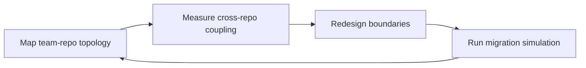

# Multirepo Designer
> **Portability target:** Spec-level (runs on Claude Code, Copilot, Gemini CLI, Codex, Cursor). No vendor-specific frontmatter fields.

Veteran architect's playbook for designing, governing, and operating multi-repository architectures at scale. Covers when and how to split repos, cross-repo dependency management, shared library publishing, versioning strategies, breaking change orchestration, repo discovery, ownership models, and migration patterns between mono and multi-repo topologies.

## Route the Request

<!-- QUICK: 30s -- auto-route first, then intent-route -->

### Auto-Route (No User Input Required)
Evaluate these file-system conditions in order. First match wins — jump immediately.

| # | Condition | Action |
|---|-----------|--------|
| A1 | `file_exists(".gitmodules")` OR `file_contains("Makefile|justfile", "trigger-downstream|cross-repo|sync-deps")` | Cross-repo coordination infrastructure detected. Jump to **Decision Trees** — Cross-Repo CI/CD Orchestration. |
| A2 | `file_contains(".github/workflows/*.yml", "repository_dispatch|workflow_call|reusable")` across >3 directories | Multi-repo CI orchestration in use. Jump to **Core Workflow** — Phase 3 (Cross-Repo CI/CD). |
| A3 | `file_exists("renovate.json") OR file_exists(".github/dependabot.yml")` AND `gh repo list --limit 50 --json name | jq length` > 10 | Cross-repo dependency automation active. Jump to **Decision Trees** — Shared Library Strategy. |
| A4 | `file_contains("*.md", "breaking.change|migration.guide|UPGRADING|CHANGELOG")` AND `file_contains("*.md", "deprecated|removed in|will be removed")` | Breaking change migration artifacts. Jump to **Core Workflow** — Phase 5 (Breaking Change Rollout). |
| A5 | `file_contains("CODEOWNERS|OWNERS", "*")` AND repo count > 5 | Repo ownership model defined. Jump to **Decision Trees** — Ownership & CODEOWNERS. |
| A6 | `file_contains("*.json|*.yaml|*.toml", ""name".*"@")` AND multiple repos publish to registry | Internal package publishing in use. Jump to **Core Workflow** — Phase 4 (Shared Library Publishing). |
| A7 | `file_contains("*", "git.filter-repo|git.subtree|mono.*to.*multi|split.*monorepo|multi.*to.*mono")` | Migration in progress or planned. Jump to **Decision Trees** — Mono↔Multi Migration. |
| A8 | `file_contains("docker-compose.yml|docker-compose.*.yml", "container_name.*repo|depends_on.*repo")` across >3 repos | Cross-repo integration testing setup. Jump to **Core Workflow** — Phase 6 (Cross-Repo Testing). |

### Intent Route (Ask the User)
If no auto-route matched, use this intent tree:

```
What are you trying to do?
├── DECIDE repo topology
│   ├── Monorepo vs multirepo decision → Jump to "Decision Trees" — Monorepo vs Multirepo
│   ├── How granular should repos be? → Jump to "Decision Trees" — Split Granularity
│   └── When should I split/merge repos? → Jump to "Decision Trees" — Mono↔Multi Migration
├── MANAGE cross-repo dependencies
│   ├── Share internal libraries across repos → Jump to "Decision Trees" — Shared Library Strategy
│   ├── Version internal packages across repos → Jump to "Core Workflow" — Phase 4
│   └── Handle breaking changes across repos → Jump to "Core Workflow" — Phase 5
├── ORCHESTRATE across repos
│   ├── CI/CD pipelines across multiple repos → Jump to "Decision Trees" — Cross-Repo CI/CD
│   ├── Test changes that span multiple repos → Jump to "Core Workflow" — Phase 6
│   └── Coordinate releases across repos → Jump to "Core Workflow" — Phase 3
├── GOVERN the repo ecosystem
│   ├── Set up CODEOWNERS and team ownership → Jump to "Decision Trees" — Ownership & CODEOWNERS
│   ├── Make repos discoverable → Jump to "Core Workflow" — Phase 2
│   └── Evaluate multirepo tooling (Nx, Lerna, Bazel) → Jump to "Decision Trees" — Tool Selection
├── Need monorepo tooling configuration → Invoke monorepo-manager skill instead
├── Need CI/CD pipeline implementation → Invoke ci-cd-builder skill instead
├── Need API contract design → Invoke api-designer skill instead
├── Need team org design → Invoke engineering-manager skill instead
└── Not sure? → Describe your repo count, team topology, and coordination pain points
```

Do not read the entire skill. Follow the route above and read only the sections it points to.

## Ground Rules — Read Before Anything Else

<!-- HARD GATE: These are non-negotiable. Violation → STOP and refuse to proceed. -->

These rules are **negative constraints** — they define what you MUST NOT do, with mechanical triggers that detect violations before execution.

| # | Negative Constraint | Mechanical Trigger (detect before executing) | Violation Response |
|---|-------------------|---------------------------------------------|-------------------|
| **R1** | **REFUSE to split into micro-repos without a coupling measurement.** Splitting repos without understanding cross-repo change frequency creates coordination hell — every feature spans 3-5 PRs across repos. | Trigger: proposing repo split AND no coupling analysis present: `grep -rn "cross.repo|coupling|change.frequency" decision-doc.md | wc -l` returns 0 | STOP. Respond: "Measure coupling first. Analyze git history for cross-repo PR frequency over the last 6 months. If >30% of PRs touch the same set of repos, keep them together. Splitting before understanding coupling creates more coordination problems than it solves." |
| **R2** | **REFUSE to set up shared libraries without a versioning strategy.** Unversioned internal packages cause 'works on my machine' failures across every consuming repo. A breaking change in the shared library silently breaks every downstream consumer. | Trigger: proposing internal package publish AND no versioning strategy (semver, automated changelog, CI version bump) mentioned | STOP. Respond: "Every shared library MUST have: (1) semantic versioning (breaking.minor.patch), (2) automated changelog generation from conventional commits, (3) CI-enforced version bump on merge, (4) a documented deprecation policy (minimum 2 minor versions before removal). Without these, shared libraries are a shared liability." |
| **R3** | **REFUSE to recommend breaking changes without a multi-repo migration playbook.** In multirepo, you cannot atomically update all consumers. A single breaking change without migration tooling creates cascading CI failures across 10+ repos. | Trigger: proposing breaking API/contract/schema change AND no migration plan with: (1) deprecation timeline, (2) automated migration tool/script, (3) consumer notification, (4) monitoring dashboard | STOP. Respond: "Breaking changes in multirepo need: (1) Add new interface alongside old — ship as minor, (2) Deprecate old with runtime warnings + migration guide — ship next minor, (3) Announce removal date with automated PRs to consumers — minimum 4-week window, (4) Monitor consumer adoption, (5) Remove old interface only after all consumers are on new version + 1 release buffer. Without automated migration tooling (codemods, upgrade scripts), each consumer manually ports — days of wasted engineering time." |
| **R4** | **DETECT and WARN about copy-paste dependency duplication.** When the same code exists in 3+ repos, any bug fix must be applied in 3+ places — and it won't be. The 3rd repo always gets forgotten, creating security and correctness drift. | Trigger: `grep -rn "shared|common|util|helper" —include="*.ts" —include="*.js" —include="*.go" —include="*.py"` across >2 repos detects identical function signatures | WARN: "Code duplication detected across [N] repos. Every bug fix or security patch must now be applied N times. Extract to a shared library when: (1) code is duplicated in ≥3 repos, (2) the duplicated code changes >2x/year, (3) the duplication surface >50 lines. Until extracted, add a comment at each duplicate site linking to the canonical source." |
| **R5** | **REFUSE to allow repos without CODEOWNERS.** Every repo without an owner is an orphan — no one reviews PRs, fixes CVEs, or maintains CI. Orphan repos accumulate security vulnerabilities and become the #1 vector for supply chain attacks. | Trigger: `gh repo list —limit 100 —json name | jq -r '.[].name' | while read r; do gh api repos/ORG/\ —jq '.name' 2>/dev/null; done` reveals repos without CODEOWNERS file | STOP. Respond: "Repos without CODEOWNERS detected: [list]. Every repo must have: (1) CODEOWNERS file with at least 2 owners, (2) documented team ownership in repo description, (3) CI check requiring CODEOWNERS review. Without this, no one is accountable for the repo's security, maintenance, or quality." |
| **R6** | **DETECT and WARN about version drift across repos.** When Repo A uses react@18.2, Repo B uses react@18.3, and the shared design-system uses react@17.0 — cross-repo integration tests pass locally but fail in CI because npm resolves different versions. | Trigger: `for f in */package.json; do jq -r '.dependencies.react // .devDependencies.react // empty' \; done | sort -u | wc -l` returns >1 for any framework-level dependency | WARN: "Version drift detected for [dependency]. Maintain a canonical version manifest in a shared config repo. Use Renovate or Dependabot with grouped updates across repos. Enforce version ranges with a lockstep policy: all repos must be within 1 minor version of each other for shared framework dependencies." |
| **R7** | **STOP and ASK before creating a new repo.** Every new repo adds: a CI pipeline to maintain, a CODEOWNERS file, dependency updates, security scanning, and onboarding docs. New repos should be the last resort, not the default. | Trigger: proposing a new repo AND no justification addressing: (1) why existing repos cannot absorb this code, (2) the CI/CD pipeline burden, (3) the ownership and maintenance plan | STOP. Ask: "Why can't this code live in an existing repo? What are the 3 specific problems that a new repo solves that adding to an existing repo would create? Every new repo is a 10-year commitment to CI, security, and maintenance. Justify the boundary with: independent deploy cadence, independent team ownership, and independent security classification." |
## The Expert's Mindset

Masters of multirepo design don't just split code — they split along **team boundaries, release cadences, and security domains.** They understand that every repo boundary is a coordination tax: each additional repo adds a PR, a CI run, and a review cycle to every cross-cutting change.

| Cognitive Bias | Mitigation |
|----------------|------------|
| **Splitting fever** — reflexively creating repos for every new project without evaluating the coupling cost | Before creating a new repo, calculate: cross-repo PRs this will generate per sprint x minutes per cross-repo PR x engineer count. If >2 hours/week/team, keep it together |
| **Monorepo nostalgia** — merging repos because "Google does it" without Google's $500M tooling investment | Evaluate: do you have the build caching, affected detection, and merge queue infrastructure that makes monorepos viable? If not, merging creates a slow monolith, not a fast monorepo |
| **Shared-library absolutism** — extracting every duplicated 10-line function into a package, creating dependency hell for trivial code | The cost of publishing + versioning + updating a shared package must be less than the cost of maintaining duplication. Threshold: <3 consumers, <50 lines, changes <1x/year -> keep duplicated |
| **Tool-as-strategy** — picking Nx or Bazel before deciding what problem you are solving | Always start with the problem: "Our 15 repos have 40% cross-repo PRs and CI takes 90 minutes." Then ask: "Does the tool solve THIS problem?" Don't let tool selection drive architecture |

### What Masters Know That Others Don't
- **Repo granularity is a function of team autonomy, not code size.** Two teams that never coordinate on releases should not share a repo — even if the code is only 200 lines. One team that ships together daily should not be split — even if the codebase is 500K lines.
- **Every shared library is a promise.** When you publish @org/design-system@2.0.0, you are promising every consumer that this API will be stable until 3.0.0. Breaking that promise costs every consumer hours of migration. The more consumers, the more conservative the API must be.
- **Cross-repo CI is the canary.** If your cross-repo CI takes >20 minutes or fails >10% of the time, your repo boundaries are wrong — either repos are too coupled (merge them) or CI tooling is inadequate (invest in it). Healthy multirepo: cross-repo CI passes >95% of the time and completes in <10 minutes.

### When to Break Your Own Rules
- **Ship the prototype as a new repo, then decide boundaries.** When exploring a new product idea, create a single new repo and move fast. Don't pre-optimize repo boundaries for code that might be thrown away. After 3 months of shipping, measure actual cross-repo coupling — THEN split or consolidate.
- **Skip the shared library for truly stable code.** If the shared code hasn't changed in 18 months and has zero open bugs, copy-paste is more resilient than a dependency. A copied function can't break your build when someone else upgrades it.
- **Accept temporary duplication during a migration.** When migrating from mono to multi, some code will exist in both the old monorepo and the new micro-repos during the transition window. That's OK — duplication is a temporary cost you pay for zero-downtime migration.

## Operating at Different Levels

| Level | Scope | Time Budget | Key Actions |
|-------|-------|-------------|-------------|
| **Quick** | Triage a repo boundary question | 5 minutes | Identify team topology, count cross-repo PR %, check CODEOWNERS coverage. Deliverable: one-line recommendation with top-3 risks. |
| **Standard** | Design a multi-repo architecture for a product area | 30 minutes | Map team-to-repo alignment, define shared library boundaries, design cross-repo CI orchestration, establish versioning strategy. Deliverable: boundary map + shared library catalog + CI orchestration diagram. |
| **Deep** | Full multi-repo strategy for an organization | 2-4 hours | Full coupling analysis from git history, team topology mapping, repo granularity heatmap, shared library lifecycle design, breaking change playbook, migration roadmap with cost estimates. Deliverable: architecture decision record + implementation plan. |

**Default level for this skill:** Standard (30min)

## When to Use

- You are deciding how to split a growing monorepo into independently deployable repos
- You need to design cross-repo dependency management: how repos discover, consume, and update shared libraries
- You are establishing versioning and release strategies for internal packages consumed by 5+ other repos
- You need to orchestrate CI/CD so that a change in Repo A triggers the right tests in Repos B, C, and D
- You are planning a breaking change in a shared library and need a migration playbook for 10+ consumer repos
- You are evaluating multirepo tooling: Nx distributed task execution, Lerna independent mode, Bazel cross-repo builds, pnpm workspace catalogs, Changesets for multi-package versioning
- You need to establish repo discoverability: how developers find the right repo, understand its purpose, and know who owns it
- You are designing CODEOWNERS, team ownership models, and contribution workflows across an org with 20+ repos
- You need a cross-repo testing strategy: contract tests, integration tests across repo boundaries, end-to-end tests spanning multiple services
- You are migrating from monorepo to multirepo (or reverse) and need a migration pattern that preserves velocity

### Cross-skills Integration

| Step | Skill | What it produces |
|------|-------|------------------|
| **Before** | monorepo-manager | Monorepo structure, build orchestration, dependency governance — the starting state for the split |
| **Before** | system-architect | Bounded context map, service topology, team boundaries — the architectural rationale for repo boundaries |
| **This** | multirepo-designer | Repo boundary design, cross-repo dependency management, shared library publishing, breaking change playbook |
| **After** | ci-cd-builder | Cross-repo CI pipelines with event-driven triggering, contract tests, and deployment orchestration |
| **After** | backend-developer | Service implementations within their designated repo boundaries with proper shared library consumption |
| **After** | fullstack-developer | Feature delivery across frontend and backend repos with coordinated release management |

Common chains:
- **Chain**: system-architect -> multirepo-designer -> ci-cd-builder — Architect defines bounded contexts; multirepo designer translates to repo boundaries; CI/CD builder orchestrates pipelines.
- **Chain**: monorepo-manager -> multirepo-designer -> backend-developer — Monorepo manager identifies extraction candidates; multirepo designer plans the split; backend developer implements services in new repos.

## Decision Trees

### 1. Monorepo vs Multirepo Decision

```
                         +---------------------------------+
                         | START: Do teams ship            |
                         | independently? (different       |
                         | release cadences, no shared     |
                         | deploy windows)                 |
                         +---------------+-----------------+
                                         |
                          +--------------v--------------+
                          | YES -> Independent releases.|
                          | Multirepo is the default.   |
                          | Teams should own their repos.|
                          | Check coupling next.        |
                          +--------------+--------------+
                                         |
                          +--------------v--------------+
                          | How often do these teams    |
                          | ship changes together?      |
                          | (>30% cross-repo PRs?)      |
                          +------+---------------+------+
                                 |               |
                          +------v------+ +------v------+
                          | <15% cross- | | >15% cross- |
                          | repo PRs -> | | repo PRs -> |
                          | Pure multi- | | Hybrid --   |
                          | repo. Each  | | group repos |
                          | repo fully  | | that ship   |
                          | autonomous. | | together    |
                          | No shared   | | into a mono-|
                          | release     | | repo cluster|
                          | train.      | | (Nx/Turbo). |
                          +-------------+ +------+------+
                                                 |
                                  +--------------v--------------+
                                  | Do repos need different     |
                                  | security classification?    |
                                  | (PCI, HIPAA, SOX, internal) |
                                  +------+---------------+------+
                                         |YES            |NO
                                  +------v------+ +------v------+
                                  | Separate    | | Can share   |
                                  | repos       | | monorepo    |
                                  | mandatory.  | | cluster.    |
                                  | Different   | | Same        |
                                  | access      | | security    |
                                  | controls    | | posture     |
                                  | per level.  | | allows co-  |
                                  +-------------+ | location.   |
                                                   +-------------+
```
**Multirepo wins when:** Teams ship independently, cross-repo PRs <15%, security boundaries differ, tech stacks diverge, or you have >50 engineers across >5 autonomous teams.
**Monorepo wins when:** Teams ship together weekly, cross-repo PRs >30%, single tech stack, shared security posture, <50 engineers.

### 2. Split Granularity Decision

```
                    +--------------------------------+
                    | START: What is the primary      |
                    | organizing principle for        |
                    | splitting?                      |
                    +---------------+----------------+
                                    |
          +-------------------------+-------------------------+
          |                         |                         |
+---------v---------+   +-----------v----------+   +---------v---------+
| By Domain          |   | By Team              |   | By Deployable     |
| (bounded context)  |   | (Conway alignment)   |   | Unit              |
+---------+----------+   +-----------+----------+   +---------+----------+
          |                          |                         |
+---------v----------+   +-----------v----------+   +---------v----------+
| Pro: Clear domain  |   | Pro: Matches org     |   | Pro: Maps 1:1 to   |
| boundaries. Good   |   | chart. Team owns     |   | deployment. Each    |
| for DDD shops.     |   | repo. Simple         |   | service has its own |
|                    |   | accountability.      |   | repo. Independent   |
| Con: Teams may     |   |                      |   | scaling.            |
| span domains ->    |   | Con: Team            |   |                     |
| cross-repo PRs.    |   | reorganizations      |   | Con: Shared code    |
|                    |   | break repo topology. |   | between services    |
|                    |   |                      |   | creates dependency  |
|                    |   |                      |   | webs.               |
+--------------------+   +----------------------+   +---------------------+

          +-------------------------+-------------------------+
          |                         |                         |
+---------v---------+   +-----------v----------+   +---------v---------+
| By Language/Stack  |   | By Release Cadence   |   | Hybrid (combine   |
| (polyglot orgs)    |   | (fast vs slow lanes) |   | 2+ principles)    |
+---------+----------+   +-----------+----------+   +---------+----------+
          |                          |                         |
+---------v----------+   +-----------v----------+   +---------v----------+
| Pro: Language-      |   | Pro: Fast-moving     |   | Pro: Flexible.      |
| native tooling.     |   | services not blocked |   | Use domain for     |
| Simple CI per       |   | by slow-moving ones. |   | core boundaries,   |
| language.           |   |                      |   | deployable unit    |
|                     |   | Con: Coupled         |   | for services.      |
| Con: Cross-language |   | domains may end up   |   |                     |
| code sharing is     |   | in different repos   |   | Con: Complexity.   |
| painful. SDKs per   |   | with mismatched      |   | Need to document   |
| language -> N repos.|   | cadences.            |   | the rationale for  |
+---------------------+   +----------------------+   | every boundary.    |
                                                     +--------------------+
```
**Rule of thumb:** One repo per deployable unit owned by exactly one team. Shared libraries are separate repos. Cross-cutting concerns (CI templates, lint config, shared types) live in a `platform-tooling` or `shared-config` repo.

### 3. Shared Library Strategy

```
                         +-----------------------------+
                         | START: How many repos will   |
                         | consume this shared code?    |
                         +-------------+---------------+
                                       |
                    +------------------+------------------+
                    |                  |                  |
              +-----v-----+      +-----v-----+      +-----v-----+
              | 1 consumer |      | 2-5       |      | 6+        |
              |            |      | consumers  |      | consumers |
              +-----+------+      +-----+------+      +-----+------+
                    |                  |                    |
              +-----v-----+      +-----v-----+      +-----v------+
              | Keep code |      | Extract   |      | Extract to |
              | in the    |      | to shared |      | shared     |
              | consuming |      | library   |      | library    |
              | repo. No  |      | repo with |      | repo with  |
              | extraction|      | internal  |      | published  |
              | overhead. |      | registry  |      | packages.  |
              +-----------+      | (npm,     |      | Strict API |
                                 | PyPI,     |      | via exports|
                                 | crates.io)|      | field.     |
                                 +-----+------+      +-----+------+
                                       |                    |
                                 +-----v-------------+ +---v----------+
                                 | Versioning:       | | Versioning:  |
                                 | Independent semver| | Independent  |
                                 | or lockstep with  | | semver.      |
                                 | consumers.        | | Never lock-  |
                                 |                   | | step --      |
                                 | Use Changesets for| | different    |
                                 | changelog +       | | consumers    |
                                 | version bumps.    | | have different|
                                 +-------------------+ | cadences.    |
                                                       +--------------+

                    +------------------+------------------+
                    |                  |                  |
              +-----v----------+ +-----v----------+ +-----v----------+
              | Breaking change | | Git Submodules?| | Vendoring?     |
              | frequency?     | |                 | |                |
              +-----+----------+ +-----+----------+ +-----+----------+
                    |                  |                    |
          +---------v---------+ +------v------+   +--------v-------+
          | >2 breaking       | | ONLY if you |   | ONLY if the    |
          | changes/year? ->  | | need exact  |   | code changes   |
          | Package API is    | | commit      |   | <1x/year AND   |
          | unstable. Don't   | | pinning AND |   | you cannot use |
          | share yet.        | | can afford  |   | a registry.    |
          | Stabilize first.  | | the DX pain.|   | Prefer registry|
          |                    | | Otherwise ->|   | over vendoring.|
          | <2 breaking       | | internal    |   |                 |
          | changes/year? ->  | | registry.   |   |                 |
          | Share with        | +-------------+   +----------------+
          | semver +          |
          | migration guides. |
          +-------------------+
```
**Internal Registry is the default for >=3 consumers.** Use npm private registry (Verdaccio, GitHub Packages, Artifactory), PyPI private index (DevPI, Artifactory), or language-native private registries. **Never** use git submodules for actively developed code — the DX cost exceeds the version-pinning benefit.

### 4. Cross-Repo CI/CD Orchestration

```
                    +----------------------------------+
                    | START: Does Repo A's change      |
                    | affect Repos B, C, D?            |
                    +---------------+------------------+
                                    |
                         +----------v----------+
                         | YES -> What kind of  |
                         | dependency?         |
                         +----------+----------+
                                    |
              +---------------------+---------------------+
              |                     |                     |
    +---------v---------+ +---------v---------+ +---------v---------+
    | Library dependency | | API contract       | | Schema/data       |
    | (Repo B imports    | | (Repo B calls     | | dependency        |
    |  @org/shared-lib)  | |  Repo A's API)   | | (Repo B reads     |
    +---------+----------+ +---------+----------+ |  Repo A's DB)    |
              |                     |              +---------+----------+
    +---------v----------+ +---------v----------+ +---------v----------+
    | CI Trigger:        | | CI Trigger:        | | CI Trigger:        |
    | Repo A publishes ->| | Contract test in   | | Schema compatibility|
    | webhook -> Renovate| | Repo B's CI runs  | | check in Repo B's  |
    | opens PR in Repo B | | against Repo A's  | | CI. Repo A runs    |
    | with version bump. | | staging. Alert if | | migration test     |
    | Repo B's CI runs  | | contract broken.  | | against Repo B's  |
    | full test suite    | |                    | | read patterns.     |
    | with new version.  | | Use: Pact,        | |                     |
    |                     | | OpenAPI diff,     | | Use: schema         |
    | Use: Renovate +    | | gRPC reflection.  | | compatibility       |
    | grouped PRs.       | |                    | | checks, migration   |
    +---------------------+ +--------------------+ | dry-run.            |
                                                   +---------------------+

              +---------------------+---------------------+
              |                     |                     |
    +---------v---------+ +---------v---------+ +---------v---------+
    | Shared config      | | No dependency     | | Unknown            |
    | (ESLint, TS config,| | (independent      | | dependency?        |
    |  CI templates)     | | services)         | |                    |
    +---------+----------+ +---------+----------+ +---------+----------+
              |                     |                       |
    +---------v----------+ +---------v----------+ +---------v----------+
    | CI Trigger:        | | No cross-repo CI   | |Build a dependency  |
    | Broadcast via      | | needed. Each repo  | | graph first. Use:  |
    | repository_dispatch| | tests independently| | nx graph across    |
    | to all consumer    | | in isolation.      | | repos, or manual   |
    | repos. Consumer CI | |                    | | dependency mapping |
    | validates with     | | Verify: consumer   | | with ADR.          |
    | updated config.    | | e2e tests still    | |                    |
    |                     | | pass against pinned| |                    |
    | Use: repo-to-repo  | | contract.          | |                    |
    | dispatch, shared   | +--------------------+ +--------------------+
    | workflow templates.|
    +--------------------+
```
**Golden rule for cross-repo CI:** Never let a downstream repo discover breakage from its own CI alone. The upstream repo MUST trigger downstream CI and get the results BEFORE merging. Otherwise, the upstream team merges, goes home, and the downstream team discovers the breakage the next morning.

### 5. Breaking Change Rollout Across Repos

```
                     +----------------------------------+
                     | START: You need to make a         |
                     | breaking change in a shared       |
                     | library consumed by N repos.      |
                     +---------------+------------------+
                                     |
                      +--------------v--------------+
                      | Can you do it non-breaking?  |
                      | (add new API, keep old)      |
                      +------+---------------+-------+
                             |YES            |NO
                      +------v------+ +------v----------+
                      | Do that     | | True breaking    |
                      | instead.    | | change required. |
                      | Ship new API| | Proceed with     |
                      | as minor,   | | migration plan.  |
                      | deprecate   | +------+-----------+
                      | old later.  |        |
                      +-------------+ +------v-------------------+
                                     | Step 1: ANNOUNCE         |
                                     | Publish deprecation      |
                                     | notice. Minimum 4-week   |
                                     | window before removal.   |
                                     | Add runtime warnings     |
                                     | in old API.              |
                                     +------+-------------------+
                                            |
                                     +------v-------------------+
                                     | Step 2: AUTOMATE        |
                                     | Write migration script   |
                                     | (codemod, upgrade tool). |
                                     | Test it against all N    |
                                     | consumer repos in CI.    |
                                     +------+-------------------+
                                            |
                                     +------v-------------------+
                                     | Step 3: OPEN PRs        |
                                     | Automatically open PRs   |
                                     | in all N consumer repos  |
                                     | with migration applied.  |
                                     | Track adoption dashboard.|
                                     | N > 20? Batch into      |
                                     | groups of 5 repos/day.   |
                                     +------+-------------------+
                                            |
                              +-------------+-------------+
                              |             |             |
                      +-------v------+ +-----v-----+ +---v--------+
                      | All consumers| | Some      | | No         |
                      | migrated? -> | | consumers | | consumers  |
                      | Ship removal | | migrated? | | migrated   |
                      | in next major| | Extend    | | after      |
                      | version.     | | deadline. | | deadline?  |
                      | Victory.     | | Escalate  | | Escalate   |
                      +--------------+ | to team   | | to eng     |
                                       | leads.    | | leadership.|
                                       | Never ship| | Create     |
                                       | removal   | | exception  |
                                       | while     | | plan.      |
                                       | consumers | +------------+
                                       | exist.    |
                                       +-----------+
```
**The 5-Phase Breaking Change Playbook:** (1) **Add** — ship new API alongside old as non-breaking minor release, (2) **Deprecate** — mark old API with @deprecated + migration guide in docs + runtime warnings, (3) **Automate** — build codemod/upgrade script tested against all consumers, (4) **Migrate** — open automated PRs to all consumer repos, track adoption, (5) **Remove** — remove old API only after 100% consumer adoption + 1 release buffer.


### 6. Ownership Model & REPO Discoverability

```
                    +-----------------------------------+
                    | START: How many repos in your     |
                    | organization?                     |
                    +---------------+-------------------+
                                    |
              +---------------------+---------------------+
              |                     |                     |
        +-----v-----+         +-----v-----+         +-----v-----+
        | <10 repos  |         | 10-50     |         | 50+ repos |
        |            |         | repos     |         |           |
        +-----+------+         +-----+------+         +-----+------+
              |                      |                      |
        +-----v------+         +-----v------+         +-----v------+
        | Simple      |         | Team-based  |         | Automated  |
        | CODEOWNERS  |         | CODEOWNERS  |         | catalog:   |
        | per repo.   |         | with shared |         | Backstage,  |
        | Manual      |         | ownership   |         | Compass, or |
        | discovery   |         | guidelines. |         | custom      |
        | via README  |         | Repo catalog|         | developer   |
        | is fine.    |         | (GitHub     |         | portal.     |
        |             |         | topics or   |         | Every repo  |
        |             |         | Backstage). |         | has:        |
        |             |         |             |         | description,|
        |             |         |             |         | team owner, |
        |             |         |             |         | status,     |
        |             |         |             |         | language,   |
        +-------------+         +------+------+         | tags.       |
                                       |                +------+------+
                                +------v------+                |
                                | Ownership   |         +------v------+
                                | model?      |         | Discovery  |
                                +---+-----+---+         | mechanism? |
                                    |     |             +---+-----+---+
                    +---------------+     +--------+        |     |
                    |                              |        |     |
              +-----v-----+                +-------v---+ +--v---+ +--v---+
              | Single-team|                | Shared    | |Search| |Portal|
              | ownership  |                | ownership | |index | |(Back-|
              +-----+------+                +------+----+ |by    | |stage,|
                    |                              |       |topic | |Com-  |
              +-----v------+               +-------v---+   |or    | |pass) |
              | One team   |               | Multiple  |   |tag   | +------+
              | = one repo |               | teams in  |   +------+
              | with 2+    |               | CODEOWNERS|
              | CODEOWNERS.|               | for cross-|
              | Clear      |               | cutting   |
              | escalation.|               | repos.    |
              |            |               | Rotation  |
              |            |               | duty or   |
              |            |               | on-call   |
              |            |               | for PR    |
              |            |               | reviews.  |
              +------------+               +-----------+
```
**Every repo must have:** (1) CODEOWNERS with >=2 individuals (no single point of failure), (2) a repo description explaining what it does and who owns it, (3) GitHub topics/tags for discoverability, (4) a status badge (active/maintenance/deprecated/experimental). At 50+ repos, invest in a developer portal (Backstage, Compass) for automated cataloging.

## Core Workflow

### Phase 1 (~15 min): Coupling Analysis & Team Topology Mapping
1. Map all teams to their repos. Draw Conway alignment: does each repo have one clear owner?
2. Analyze cross-repo PR frequency over last 6 months: `git log --oneline --all | grep -i "#[0-9]" | sort | uniq -c`
3. Identify hotspots: repos with >30% cross-repo PRs are candidates for merging. Repos with <5% are correctly isolated.
4. Measure shared code surface area: count duplicate function signatures, shared configuration files, copy-pasted CI templates.
5. Calculate the coordination tax: (cross-repo PRs per sprint) x (average minutes per cross-repo PR) x (engineer hourly rate).

### Phase 2 (~20 min): Repo Boundary Design
1. For each bounded context (from system-architect), define: one deployable repo per independently deployable unit.
2. Identify shared code: extract shared types, configs, and utilities into `@org/shared-lib` repos.
3. Define dependency direction: shared libs at the bottom (no upstream deps), domain services in the middle, application repos at the top.
4. Prevent circular dependencies: use dependency-cruiser or madge to validate no cycles across repo boundaries.
5. Document boundaries in an architecture decision record: rationale, coupling metrics, ownership assignment.

### Phase 3 (~25 min): Cross-Repo CI/CD Orchestration
1. For each cross-repo dependency, define the CI trigger: library publish -> Renovate PR; API change -> contract test; config change -> repository_dispatch.
2. Set up shared CI templates: GitHub reusable workflows, GitLab CI templates, or custom CI generators. One canonical pipeline per language.
3. Implement contract testing: Pact for HTTP APIs, OpenAPI diff for REST, gRPC reflection for protobuf, schema compatibility checks for databases.
4. Configure Renovate/Dependabot for cross-repo dependency updates with grouped PRs and auto-merge for patch versions.
5. Add a CI gate: any PR that changes a shared library exported API must trigger downstream CI and get green results BEFORE merge.

### Phase 4 (~20 min): Shared Library Publishing & Versioning
1. Choose versioning: independent semver for all shared libraries. Lockstep only if repos always deploy together.
2. Set up automated publishing: CI publishes to internal registry on merge to main. Version bump via Changesets or conventional commits.
3. Generate changelogs: categorize changes (breaking, feature, fix), link to PRs, notify consuming teams.
4. Enforce API stability: use `exports` field in package.json, TypeScript `isolatedModules`, or Go internal packages to prevent accidental public API exposure.
5. Set up deprecation tooling: runtime deprecation warnings with migration instructions, automated codemods for consumers.

### Phase 5 (~25 min): Breaking Change Rollout
1. Ship new API alongside old as non-breaking minor release.
2. Deprecate old API: @deprecated annotations, runtime warnings, migration guide with before/after examples.
3. Build automated migration: codemod tool (jscodeshift, comby, ast-grep) tested against all consumer repos.
4. Open automated PRs: batch-apply migration, verify CI passes, assign to CODEOWNERS for review.
5. Monitor adoption: dashboard tracking % consumers migrated, escalate laggards to team leads.
6. Remove old API only after 100% migration + 1 release buffer.

### Phase 6 (~20 min): Cross-Repo Testing Strategy
1. Unit tests: each repo tests its own code in isolation. No cross-repo dependencies in unit tests.
2. Contract tests: define explicit contracts between repos. Repo A publishes contracts, Repo B verifies them in CI.
3. Integration tests: spin up dependent services (Docker Compose, Testcontainers) for cross-repo integration testing.
4. End-to-end tests: test the full cross-repo flow in a staging environment. Run on every PR to shared libraries.
5. Test impact analysis: only run integration/e2e tests for repos affected by the change. Use dependency graph to determine affected repos.

## Cross-Skill Coordination

| Coordinate With | When | What to Share/Ask |
|-----------------|------|-------------------|
| **System Architect** | Before splitting repos or defining boundaries | Bounded context map, service topology, coupling analysis results, repo boundary rationale |
| **Monorepo Manager** | Before extracting from a monorepo or merging into one | Current monorepo structure, build graph, affected detection configuration, package boundaries |
| **CI/CD Builder** | When setting up cross-repo CI pipelines | Cross-repo dependency graph, required CI triggers for each dependency type, shared workflow templates |
| **Backend Developer** | When defining shared library APIs | API stability requirements, versioning strategy, deprecation windows, migration guides |
| **Fullstack Developer** | When coordinating frontend-backend repo boundaries | API contracts, contract test setup, coordinated release timing |
| **DevOps Engineer** | When setting up internal registries and cross-repo infrastructure | Internal registry requirements, CI runner provisioning, repository_dispatch webhook setup |
| **Platform Engineer** | When building repo discovery and developer portals | Repo metadata standards, catalog integration, CODEOWNERS automation |
| **QA Engineer** | When designing cross-repo testing | Contract test frameworks, integration test environments, test impact analysis |
| **Engineering Manager** | When defining team-to-repo ownership | Team topology, CODEOWNERS assignments, review SLAs, escalation paths |
| **CTO Advisor** | For strategic repo topology decisions | Build-vs-buy for multirepo tooling, migration cost estimates, org-wide repo standards |

### Escalation Path

| Situation | Escalate To | Rationale |
|-----------|------------|-----------|
| Cross-repo coupling >40% despite documented boundaries | **System Architect** + CTO Advisor | Architecture drift; bounded contexts are wrong or unenforced |
| Shared library breaking change blocks 5+ teams for >2 weeks | **CTO Advisor** + VP Engineering | Migration velocity crisis; broken change management process |
| Repo sprawl — >100 repos with no discoverability | **Platform Engineer** + CTO Advisor | Developer productivity crisis; developer portal investment needed |
| Cross-repo CI takes >30 minutes and fails >20% of the time | **DevOps Engineer** + CI/CD Builder | CI infrastructure inadequate; investment or repo topology change needed |
| 3+ teams cannot agree on repo boundaries for a shared domain | **System Architect** + Engineering Manager | Conway's Law violation; team topology and repo topology must be aligned |

## Proactive Triggers

| Trigger | Notify | Why |
|---------|--------|-----|
| Shared library major version bump (breaking change) published | All Consumer Teams, System Architect, CI/CD Builder | Migration window starts; automated PRs incoming; 4-week deadline for consumers |
| Cross-repo CI failure rate exceeds 10% for any dependency chain | DevOps, Affected Teams, CI/CD Builder | CI trust eroding; investigate contract drift, flaky tests, or infrastructure issues |
| New repo created without CODEOWNERS or team assignment | Platform Engineer, Engineering Manager | Orphan risk; repo must have owners within 48 hours or be archived |
| Dependency version drift detected across >5 repos for a framework dependency | All Consumer Teams, Platform Engineer | Runtime inconsistency risk; Renovate grouped update PR needed |
| Repo with zero commits in 6+ months (archival candidate) | Repo Owner, Engineering Manager | Maintenance burden; archive or document continued need |
| Cross-repo PR rate exceeds 30% for two repos that were supposed to be independent | System Architect, Affected Teams | Repo boundary failure; evaluate merge or extracted shared library |
| Internal package has >3 different major versions in use across consumer repos | All Consumer Teams, System Architect | Version fragmentation; standardize or accept migration debt |
| Breaking change migration progress stalls (<50% adoption after 2 weeks) | Team Leads, CTO Advisor | Blocked migration; investigate tools, docs, or competing priorities |
| CI runner concurrency exhausted due to cross-repo PR storm (Renovate opens 40+ PRs simultaneously) | DevOps, Platform Engineer | CI queue delays; batch Renovate updates or increase runner capacity |

## What Good Looks Like

### BEFORE (Anti-pattern)
> A 50-person engineering org with 30 repos. No CODEOWNERS on 12 repos. Shared utilities copy-pasted across 8 repos with independent bug fixes applied inconsistently. Breaking changes announced in Slack with "heads up, we changed the API." Cross-repo CI: each team discovers breakage when their own CI fails after merging from main. Renovate opens 30 unrelated PRs daily, overwhelming review capacity. New hires take 2 weeks to understand which repo does what. Version drift: 4 different React versions across 15 frontend repos.

### AFTER (Healthy Multirepo)
> **Repo boundaries aligned to team topology.** Each team owns 1-3 repos — all have CODEOWNERS with >=2 reviewers. Shared code lives in 5 internal packages published to a private npm registry with strict semver and automated changelogs. **Breaking changes follow a 5-phase playbook**: new API ships alongside old -> deprecation with runtime warnings -> automated codemod tested against all consumers -> automated PRs to all consumer repos -> old API removed only after 100% adoption. **Cross-repo CI**: upstream repo triggers downstream CI via repository_dispatch; contract tests gate merges; Renovate groups updates weekly into <=5 PRs per repo. **Repo discoverability**: Backstage catalog indexes all repos by team, language, and status. New hires find the right repo in <5 minutes. **Zero version drift**: Renovate with grouped updates enforces all repos stay within 1 minor version of each other for framework dependencies.

> See [references/what-good-looks-like.md](references/what-good-looks-like.md) for the full quality standard.

## Deliberate Practice



| Level | Practice | Frequency |
|-------|----------|-----------|
| **Novice** | Take a 10-repo org and map every cross-repo dependency. Write a one-page ADR recommending 3 boundary changes with rationale. | Monthly |
| **Competent** | Design the shared library publishing pipeline for a hypothetical org with 20 consumer repos. Include: versioning strategy, CI triggers, breaking change playbook, and onboarding docs. Compare with an existing open-source multi-package project (e.g., Babel, Jest). | Quarterly |
| **Expert** | Take your own org's repo topology. Run a full coupling analysis from 6 months of git history. Propose 3 alternative topologies (monorepo, pure multirepo, hybrid) with quantified trade-offs per topology: CI time, cross-repo PR count, onboarding time, and operational cost. | Quarterly |
| **Master** | Design a repo governance framework that survives team reorgs. Include: repo creation checklist, archival criteria, CODEOWNERS rotation policy, contribution SLAs, and automated drift detection. Socialize and iterate with engineering leadership. | Annually |

**The One Highest-Leverage Activity:** Every quarter, do a "repo boundary audit." Take your 3 most coupled repos (highest cross-repo PR %). Ask: "If we merged these, what would break? If we split these differently, what would improve?" Write down your conclusions — over a year, you'll build an intuition for healthy boundaries.

## Anti-Rationalization Table

| What They Say | What It Really Means | The Reframe |
|---------------|---------------------|-------------|
| "We'll extract it to a shared library later." | "We don't want to do the extraction work now, so we'll pay 10x later when it's duplicated 8 times and each copy has diverged." | Extract when duplication reaches 3 copies, not when it's convenient. The extraction cost grows linearly with duplication count, but the divergence cost grows exponentially. |
| "Let's just create a new repo — it's cleaner." | "I don't want to understand the existing repo structure well enough to find where this code should live." | Every new repo is a 10-year commitment to CI, security, and maintenance. The "cleaner" repo is clean for 2 weeks — then it accumulates its own tech debt, just in a different place. |
| "We'll handle breaking changes by telling everyone in Slack." | "We don't want to invest in migration tooling, so we'll externalize the cost onto every consumer team." | Slack is not a migration strategy. Every hour you save by not building a codemod, every consumer team spends 10 hours migrating manually. Multiply by N consumer teams. |
| "The monorepo tools will catch up to our scale." | "We're betting our entire development velocity on a tooling roadmap we don't control." | Evaluate tools on what exists today, not what's promised. If the current tooling can't handle your scale, split now and merge later if the tools improve. |
| "We don't need CODEOWNERS — everyone knows who owns what." | "When the person who 'knows' leaves, this repo becomes an orphan overnight with no documentation." | Tribal knowledge is a single point of failure. CODEOWNERS is the bus-factor insurance — it costs 2 minutes to set up and prevents days of confusion when someone leaves. |
| "Copy-paste is fine for now — it's just 20 lines." | "We're planting 20 seeds of divergence. In 18 months, those 20 lines will be 20 different implementations with 20 different bug fixes applied to 18 of them." | Copy-paste is only acceptable when: the code hasn't changed in 12+ months AND you've documented that it's intentionally duplicated with a link to the canonical source. Otherwise, it's latent technical debt. |
| "We'll add cross-repo CI later — let's just get the repos set up first." | "We're deferring the hard part. Without cross-repo CI, every downstream breakage is discovered by the downstream team, eroding trust across the org." | Cross-repo CI is not a nice-to-have — it's the feedback loop that makes multirepo viable. Without it, you're running blind. Each downstream breakage costs 2-4 hours of debugging across two teams. |

## Gotchas

- **Shared library major version bump without consumer migration tooling.** You publish `design-system@3.0.0` with 12 breaking changes. Two days later, 15 consumer repos have broken CI. Each team spends 4-8 hours manually updating imports, props, and theme tokens. Teams that are on PTO or focused on other priorities don't discover the breakage until their next deploy — 2 weeks later. **Total cost: $30K-$80K in wasted engineering hours across 15 teams, plus $10K-$50K in delayed feature delivery from blocked deploys.** Fix: Never ship a breaking change without an automated migration script (codemod) tested against ALL consumer repos in CI. Open automated PRs to every consumer repo simultaneously. Track adoption and escalate laggards.
- **Reproducible builds fail because internal packages resolve differently across repos.** Repo A pins `@org/shared-utils@1.2.3` in its lockfile. Repo B uses a caret range `^1.2.3` and gets `1.3.0` from the registry. CI in Repo A passes (uses lockfile), CI in Repo B passes (gets latest compatible), but when both deploy together, they load different versions of `shared-utils` into the same browser bundle. A subtle behavior change in 1.3.0 causes a production bug that takes 6 hours to root-cause because "it works on my machine" and both CIs were green. **Total cost: $20K-$60K per incident in debugging time, plus $50K-$200K in revenue impact if the bug affects a customer-facing production path.** Fix: Use Renovate with grouped PRs to keep all repos within the same minor version. Add a CI check that verifies all consumer repos resolve the same version of shared dependencies. For libraries with runtime side effects, use exact version pinning.
- **Cross-repo CI feedback loop exceeding 30 minutes.** Repo A merges a change to `shared-auth@2.1.0`. Renovate opens PRs in Repos B through J. Each CI takes 15 minutes. Repo B's CI fails — root cause: the shared-auth change broke JWT token parsing. The engineer who made the change has already started their next task. By the time they context-switch back, 45 minutes have passed. Over 200 such cross-repo changes per year, the cumulative context-switching cost alone is $50K-$150K in lost productivity. **Total cost: $40K-$100K/year in CI wait time + $50K-$150K/year in context-switching overhead = $90K-$250K/year total.** Fix: Run downstream CI BEFORE merging the upstream change — use PR-level cross-repo CI that gates the merge. Cache shared dependencies aggressively. Use npm/pip/gradle build caches. Target <10 minutes for cross-repo CI feedback.
- **org-wide Renovate/Dependabot opening 40+ PRs every Monday morning.** Every repo has Renovate configured independently. A new React 19 patch release triggers 15 PRs across 15 frontend repos. A new ESLint plugin version triggers 12 PRs. TypeScript 5.5 triggers 18 PRs. Total: 45 PRs every Monday. Developer review capacity: ~8 PRs/day across the team. Pile-up creates a 5-day review backlog. Critical security patches get buried in the noise. One CVE patch (lodash prototype pollution) sits unreviewed for 12 days because it's PR #37 in the queue. **Total cost: $30K-$80K/year in review overhead + $20K-$200K in security exposure from delayed CVE patches.** Fix: Group Renovate updates into weekly batches. Pin non-critical dependencies to auto-merge on CI green. Separate security patches into their own high-priority PR stream with SLA-based review requirements (<24 hours for critical, <72 hours for high). Limit open Renovate PRs to <=5 per repo at any time.
- **Git submodules silently pointing to wrong commits after git operations.** Team A uses `@org/core-lib` as a git submodule in 3 repos. A developer runs `git checkout feature-branch` — the submodule pointer stays on the old commit. They make changes, run tests (which pass — using the wrong submodule version), and merge. Production breaks because the submodule commit doesn't match what CI tested. This happens 2-3 times per quarter. Each incident takes 2-4 hours to diagnose because "it passed CI" and the submodule commit SHA looks correct (it's the commit that CI tested — it's just not the one the developer intended). **Total cost: $15K-$40K/year in debugging submodule state issues, plus $20K-$80K in production incidents from version mismatches.** Fix: Replace git submodules with internal package registry + version pinning. If submodules are unavoidable, add a CI check: `git submodule status --recursive | grep -v "^ "` (warns on dirty/unpinned submodules). Never merge if submodules are in detached HEAD state.
- **Multi-language shared library maintenance creating NxM compatibility matrix.** You have a shared protobuf/OpenAPI schema consumed by 3 Go services, 2 TypeScript frontends, 1 Python data pipeline, and 1 Rust performance service. Each language has its own client library repo generated from the schema. A schema change requires updating 7 repos — but the Go generator produces different default values than the TypeScript generator, and the Python generator handles optional fields differently than Rust. A field marked `optional` in proto3 generates `*string` in Go (nil-able), `string | undefined` in TypeScript, `Optional[str]` in Python (has a `.is_set()` method), and `Option<String>` in Rust. A null value flows through Go, hits the TypeScript frontend, and triggers a runtime crash because TypeScript didn't receive the field at all (not `undefined`, just absent). **Total cost: $100K-$500K/year in multi-language client maintenance, plus $50K-$200K/year in cross-language integration bugs.** Fix: Centralize schema ownership in one repo with language-agnostic tests (JSON schema validation, protobuf conformance tests). Generate all language clients from a single CI pipeline and publish simultaneously. Add cross-language integration tests that verify behavior parity for null handling, defaults, and edge cases across ALL generated clients.
- **Breaking change in a shared infra repo (Docker base image, Terraform module, CI template) cascading silently.** A platform engineer updates the base Docker image from `node:20-alpine` to `node:22-alpine` in the `shared-infra` repo. The change passes their own CI (which tests the image build, not the 25 downstream services using it). Three weeks later, the `payments-service` team does a routine deploy. Their build uses the new base image. Node 22 removed a deprecated crypto API that payments-service relied on. The service crashes in production during payment processing at 3 PM on a Friday. The payments team spends 4 hours debugging, never suspecting the base image change because "we didn't change anything." **Total cost: $60K-$150K in incident response and lost revenue during the outage, plus $30K-$80K in cross-team debugging to trace the root cause.** Fix: Shared infra changes must trigger smoke tests in ALL downstream repos BEFORE merge. Use repository_dispatch to fan out. Pinned versions with Renovate for base images (never `:latest` or `:alpine` without a digest). Add a "what changed" diff in every Renovate PR for shared infra.
- **Internal package abandoned because the original author left the company.** `@org/ml-utils@1.5.0` has 8 consumer repos and zero maintainers. The original author (a senior ML engineer) left 14 months ago. The package has 3 open CVEs, 12 stale dependabot PRs, and a blocking bug that prevents upgrading to Python 3.12. Every consumer team assumes "someone else" maintains it. When Python 3.11 goes EOL, all 8 consumer repos are blocked — but no team has the context or confidence to fix the package, because the test coverage is 23% and the codebase uses esoteric numpy patterns the author never documented. **Total cost: $80K-$200K in migration costs when 8 teams must either fork+fix or replace the abandoned package, plus $30K-$100K in delayed platform upgrades.** Fix: Every published internal package must have >=2 named maintainers from different teams (bus factor). Automate maintainer rotation via CODEOWNERS. Add a CI check: if the last commit to a shared package is >90 days old, flag for maintainer review. Run `npm audit` / `pip-audit` on all internal packages weekly and auto-assign CVEs to maintainers with SLAs.
- **Repo naming conventions degrading discoverability at 100+ repos.** Over 4 years, repos accumulate with inconsistent naming: `api-gateway`, `gateway-api`, `platform-gateway`, `gateway-v2`, `gateway-service`, `services-gateway`. New hires searching for "how to add a route to the gateway" find 6 repos and cannot determine which is canonical. They pick the wrong one, implement against a deprecated gateway, and discover their mistake during code review 3 days later. This happens ~15 times/year across different domains (auth, payments, search). **Total cost: $15K-$40K/year in misdirected engineering effort + $10K-$30K/year in onboarding friction for new hires.** Fix: Enforce a repo naming convention: `[team]-[domain]-[purpose]` or `[org]-[function]`. Example: `platform-api-gateway`, `auth-sso-service`, `data-ml-pipeline`. Add a repo description template: "Owned by [team]. [One-sentence purpose]. Status: [active|maintenance|deprecated]. Language: [primary]." Index all repos in a developer portal (Backstage, Compass) with search by team, language, and domain.
- **Monorepo-to-multirepo split without preserving git history.** You split a 3-year-old monorepo into 8 service repos using `cp -r` instead of `git filter-repo`. Every file shows "Initial commit" with today's date and your name as author. The original authors, commit messages explaining WHY code was written, and PR discussions are lost. Six months later, an engineer debugging a production issue in `billing-service` runs `git blame` — every line says "Initial commit, Migration Engineer, 2025-04-01." They can't trace the logic to the original PR, can't find the design discussion, and can't ask the original author (who left 18 months ago). A 2-hour debugging session becomes a 3-day archaeology project. **Total cost: $40K-$100K in lost historical context across all split repos, compounding every time someone needs to understand legacy code (~$5K-$10K per incident x dozens of incidents over the repos' lifetime).** Fix: Use `git filter-repo` with `--path` and `--path-rename` to extract directories into separate repos while preserving full commit history, authors, and dates. Validate with `git log --follow [key-file]` that history is intact. Never use `cp -r` + `git init` for repo splits. The history is the most valuable artifact — more valuable than the code itself.

## Verification

- [ ] Every repo has CODEOWNERS with >=2 individuals from the owning team
- [ ] Cross-repo coupling measured: `git log --all --oneline --since="6 months ago" | grep "cross-repo\|depends-on" | wc -l` — <15% of total PRs
- [ ] Shared libraries publish to internal registry with semver: `npm view @org/shared-lib versions` shows proper version history
- [ ] Breaking change playbook artifact exists: migration guide + codemod + consumer adoption dashboard
- [ ] Cross-repo CI: upstream PR triggers downstream CI, downstream green before upstream merges
- [ ] Zero submodules for actively developed code: `find . -name .gitmodules | xargs grep "url" | wc -l` == 0 or all submodules have justification in ADR
- [ ] Repo discoverability: new hire can find the correct repo for any domain in <5 minutes using search or catalog
- [ ] No orphan repos: `gh repo list --limit 200 --json name,updatedAt | jq '.[] | select(.updatedAt < "2024-01-01")'` returns zero unaccounted repos
- [ ] Version drift within tolerance: all consumer repos within 1 minor version of each other for shared framework dependencies
- [ ] Internal package maintainer bus factor >=2: every published package has >=2 named maintainers in CODEOWNERS

## References

- **Build System & Cross-Repo Orchestration**: See [references/build-system-cross-repo.md](references/build-system-cross-repo.md)
- **Breaking Change Management**: See [references/breaking-change-management.md](references/breaking-change-management.md)
- **Repo Governance & Ownership**: See [references/repo-governance-ownership.md](references/repo-governance-ownership.md)
- **Shared Library Publishing & Versioning**: See [references/shared-library-publishing.md](references/shared-library-publishing.md)
- **Tool Selection & Decision Matrix**: See [references/tool-selection-matrix.md](references/tool-selection-matrix.md)
- **Monolith Decomposition Patterns**: See [references/monolith-decomposition.md](references/monolith-decomposition.md)
- **Anti-Patterns Catalog**: See [references/anti-patterns.md](references/anti-patterns.md)
- **Calibration**: See [references/calibration.md](references/calibration.md)
- **Scale Depth: Solo -> Small -> Medium -> Enterprise**: See [references/scale-depth.md](references/scale-depth.md)
- **Footguns**: See [references/footguns.md](references/footguns.md)
- **Error Decoder**: See [references/error-decoder.md](references/error-decoder.md)
- **Sub-Skills**: See [references/sub-skills.md](references/sub-skills.md)
- **What Good Looks Like**: See [references/what-good-looks-like.md](references/what-good-looks-like.md)
