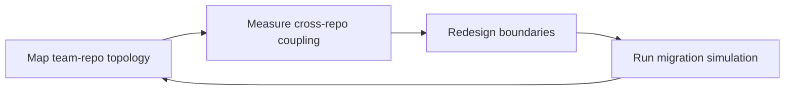

# Multirepo Designer
> **Portability target:** Spec-level (runs on Claude Code, Copilot, Gemini CLI, Codex, Cursor). No vendor-specific frontmatter fields.

Veteran architect's playbook for designing, governing, and operating multi-repository architectures at scale. Covers when and how to split repos, cross-repo dependency management, shared library publishing, versioning strategies, breaking change orchestration, repo discovery, ownership models, and migration patterns between mono and multi-repo topologies.

## Core Workflow
<!-- STANDARD: 3min -->

**Phase 1: Boundary Audit & Split-or-Merge Analysis (20% of effort)**
Map the current repository landscape: inventory every repo with owner, commit frequency, dependency graph, and deploy cadence. For each repo, calculate the Conway Score: does one team own this repo or is it shared by 3+ teams? For each shared repo, measure coupling: how often do changes in Repo A force changes in Repo B (coupling coefficient = co-change commits / total commits)? Output: repo inventory spreadsheet with ownership, coupling matrix, and lifecycle stage (active/mature/deprecated/orphaned). Decision: repos with coupling coefficient >30% and same team ownership → merge candidates. Repos with coupling <5% and distinct team ownership → stay separate.

**Phase 2: Dependency Architecture Design (30% of effort)**
Design the cross-repo dependency graph. Define: (1) Version strategy per shared library — SemVer (major.minor.patch) with clear breaking-change policy, (2) Release cadence — continuous (every merge to main = release) vs batched (weekly/monthly releases), (3) Dependency freshness policy — how stale can a dependency be before it's flagged (e.g., "all repos must be within 2 minor versions of latest within 30 days"), (4) Breaking change orchestration — the multi-repo update sequence when a shared library releases v2.0. Output: dependency graph diagram with version constraints, publish pipeline design per shared library, and breaking change runbook. Critical design principle: minimize the blast radius of any single repo change.

**Phase 3: Governance & Ownership (25% of effort)**
Assign ownership: every repo has exactly one owning team (no shared ownership — Conway's Law says shared = neglected). Define: (1) Repo metadata standard — CODEOWNERS file, README with runbook link, SLAs per repo tier, (2) Tier system — Tier 0 (platform — 99.99% SLA, breaking changes 90-day notice), Tier 1 (product service — 99.9%, 30-day notice), Tier 2 (internal tool — best effort, no formal SLA), (3) Deprecation policy — how repos are archived (last release tagged, README updated to DEPRECATED.md, issues disabled, 90-day notice before archive). Implement repo discovery: service catalog (Backstage/ServiceNow) auto-populated from repo metadata, not manually maintained.

**Phase 4: Migration Execution & Verification (25% of effort)**
For monorepo→multirepo splits: extract with history (git filter-repo preserving commit history for extracted paths), set up CI/CD in new repo, publish first release, migrate consumers one at a time with dual-publish transitional period. For multirepo→monorepo merges: merge with history preservation (git subtree merge), resolve path conflicts, unify tooling (one ESLint/tsconfig/mypy config), migrate CI to monorepo-aware (Nx/Turborepo/Bazel). Post-migration verification: every dependent repo's CI passes with new dependency path, deploy to staging, smoke test, then promote. Each migration has a rollback plan documented before starting.

## Anti-Hallucination
<!-- STANDARD: 3min -->

* Admit uncertainty. If you cannot determine the correct approach, ask — do not guess.
* Flag your knowledge cutoff. If this project uses tools or patterns you have not seen, state your assumptions.
* Never guess security. If work touches auth, payments, or PII, route to security-reviewer.
* [VERIFIED] before any production guidance: Verify assumptions. Verify compatibility. Verify correctness.

## Route the Request
<!-- STANDARD: 3min -->

<!-- QUICK: 30s -- auto-route first, then intent-route -->

#

## Auto-Route (No User Input Required)
<!-- STANDARD: 3min -->
Evaluate these file-system conditions in order. First match wins — jump immediately.

| # | Condition | Action |
|---|-----------|--------|
| A1 | `file_exists(".gitmodules")` OR `file_contains("Makefile|justfile", "trigger-downstream|cross-repo|sync-deps")` | Cross-repo coordination infrastructure detected. Jump to **Decision Trees** — Cross-Repo CI/CD Orchestration. |
| A2 | `file_contains(".github/workflows/*.yml", "repository_dispatch|workflow_call|reusable")` across >3 directories | Multi-repo CI orchestration in use. Jump to **Core Workflow** — Phase 3 (Cross-Repo CI/CD). |
| A3 | `file_exists("renovate.json") OR file_exists(".github/dependabot.yml")` AND `gh repo list --limit 50 --json name | jq length` > 10 | Cross-repo dependency automation active. Jump to **Decision Trees** — Shared Library Strategy. |
| A4 | `file_contains("*.md", "breaking.change|migration.guide|UPGRADING|CHANGELOG")` AND `file_contains("*.md", "deprecated|removed in|will be removed")` | Breaking change migration artifacts. Jump to **Core Workflow** — Phase 5 (Breaking Change Rollout). |
| A5 | `file_contains("CODEOWNERS|OWNERS", "*")` AND repo count > 5 | Repo ownership model defined. Jump to **Decision Trees** — Ownership & CODEOWNERS. |
| A6 | `file_contains("*.json|*.yaml|*.toml", ""name".*"@")` AND multiple repos publish to registry | Internal package publishing in use. Jump to **Core Workflow** — Phase 4 (Shared Library Publishing). |
| A7 | `file_contains("*", "git.filter-repo|git.subtree|mono.*to.*multi|split.*monorepo|multi.*to.*mono")` | Migration in progress or planned. Jump to **Decision Trees** — Mono↔Multi Migration. |
| A8 | `file_contains("docker-compose.yml|docker-compose.*.yml", "container_name.*repo|depends_on.*repo")` across >3 repos | Cross-repo integration testing setup. Jump to **Core Workflow** — Phase 6 (Cross-Repo Testing). |

#

## Intent Route (Ask the User)
<!-- STANDARD: 3min -->
If no auto-route matched, use this intent tree:

```
What are you trying to do?
├── DECIDE repo topology
│   ├── Monorepo vs multirepo decision → Jump to "Decision Trees" — Monorepo vs Multirepo
│   ├── How granular should repos be? → Jump to "Decision Trees" — Split Granularity
│   └── When should I split/merge repos? → Jump to "Decision Trees" — Mono↔Multi Migration
├── MANAGE cross-repo dependencies
│   ├── Share internal libraries across repos → Jump to "Decision Trees" — Shared Library Strategy
│   ├── Version internal packages across repos → Jump to "Core Workflow" — Phase 4
│   └── Handle breaking changes across repos → Jump to "Core Workflow" — Phase 5
├── ORCHESTRATE across repos
│   ├── CI/CD pipelines across multiple repos → Jump to "Decision Trees" — Cross-Repo CI/CD
│   ├── Test changes that span multiple repos → Jump to "Core Workflow" — Phase 6
│   └── Coordinate releases across repos → Jump to "Core Workflow" — Phase 3
├── GOVERN the repo ecosystem
│   ├── Set up CODEOWNERS and team ownership → Jump to "Decision Trees" — Ownership & CODEOWNERS
│   ├── Make repos discoverable → Jump to "Core Workflow" — Phase 2
│   └── Evaluate multirepo tooling (Nx, Lerna, Bazel) → Jump to "Decision Trees" — Tool Selection
├── Need monorepo tooling configuration → Invoke monorepo-manager skill instead
├── Need CI/CD pipeline implementation → Invoke ci-cd-builder skill instead
├── Need API contract design → Invoke api-designer skill instead
├── Need team org design → Invoke engineering-manager skill instead
└── Not sure? → Describe your repo count, team topology, and coordination pain points
```

Do not read the entire skill. Follow the route above and read only the sections it points to.

## Ground Rules — Read Before Anything Else
<!-- STANDARD: 3min -->

<!-- HARD GATE: These are non-negotiable. Violation → STOP and refuse to proceed. -->

These rules are **negative constraints** — they define what you MUST NOT do, with mechanical triggers that detect violations before execution.

| # | Negative Constraint | Mechanical Trigger (detect before executing) | Violation Response |
|---|-------------------|---------------------------------------------|-------------------|
| **R1** | **REFUSE to split into micro-repos without a coupling measurement.** Splitting repos without understanding cross-repo change frequency creates coordination hell — every feature spans 3-5 PRs across repos. | Trigger: proposing repo split AND no coupling analysis present: `grep -rn "cross.repo|coupling|change.frequency" decision-doc.md | wc -l` returns 0 | STOP. Respond: "Measure coupling first. Analyze git history for cross-repo PR frequency over the last 6 months. If >30% of PRs touch the same set of repos, keep them together. Splitting before understanding coupling creates more coordination problems than it solves." |
| **R2** | **REFUSE to set up shared libraries without a versioning strategy.** Unversioned internal packages cause 'works on my machine' failures across every consuming repo. A breaking change in the shared library silently breaks every downstream consumer. | Trigger: proposing internal package publish AND no versioning strategy (semver, automated changelog, CI version bump) mentioned | STOP. Respond: "Every shared library MUST have: (1) semantic versioning (breaking.minor.patch), (2) automated changelog generation from conventional commits, (3) CI-enforced version bump on merge, (4) a documented deprecation policy (minimum 2 minor versions before removal). Without these, shared libraries are a shared liability." |
| **R3** | **REFUSE to recommend breaking changes without a multi-repo migration playbook.** In multirepo, you cannot atomically update all consumers. A single breaking change without migration tooling creates cascading CI failures across 10+ repos. | Trigger: proposing breaking API/contract/schema change AND no migration plan with: (1) deprecation timeline, (2) automated migration tool/script, (3) consumer notification, (4) monitoring dashboard | STOP. Respond: "Breaking changes in multirepo need: (1) Add new interface alongside old — ship as minor, (2) Deprecate old with runtime warnings + migration guide — ship next minor, (3) Announce removal date with automated PRs to consumers — minimum 4-week window, (4) Monitor consumer adoption, (5) Remove old interface only after all consumers are on new version + 1 release buffer. Without automated migration tooling (codemods, upgrade scripts), each consumer manually ports — days of wasted engineering time." |
| **R4** | **DETECT and WARN about copy-paste dependency duplication.** When the same code exists in 3+ repos, any bug fix must be applied in 3+ places — and it won't be. The 3rd repo always gets forgotten, creating security and correctness drift. | Trigger: `grep -rn "shared|common|util|helper" —include="*.ts" —include="*.js" —include="*.go" —include="*.py"` across >2 repos detects identical function signatures | WARN: "Code duplication detected across [N] repos. Every bug fix or security patch must now be applied N times. Extract to a shared library when: (1) code is duplicated in ≥3 repos, (2) the duplicated code changes >2x/year, (3) the duplication surface >50 lines. Until extracted, add a comment at each duplicate site linking to the canonical source." |
| **R5** | **REFUSE to allow repos without CODEOWNERS.** Every repo without an owner is an orphan — no one reviews PRs, fixes CVEs, or maintains CI. Orphan repos accumulate security vulnerabilities and become the #1 vector for supply chain attacks. | Trigger: `gh repo list —limit 100 —json name | jq -r '.[].name' | while read r; do gh api repos/ORG/\ —jq '.name' 2>/dev/null; done` reveals repos without CODEOWNERS file | STOP. Respond: "Repos without CODEOWNERS detected: [list]. Every repo must have: (1) CODEOWNERS file with at least 2 owners, (2) documented team ownership in repo description, (3) CI check requiring CODEOWNERS review. Without this, no one is accountable for the repo's security, maintenance, or quality." |
| **R6** | **DETECT and WARN about version drift across repos.** When Repo A uses react@18.2, Repo B uses react@18.3, and the shared design-system uses react@17.0 — cross-repo integration tests pass locally but fail in CI because npm resolves different versions. | Trigger: `for f in */package.json; do jq -r '.dependencies.react // .devDependencies.react // empty' \; done | sort -u | wc -l` returns >1 for any framework-level dependency | WARN: "Version drift detected for [dependency]. Maintain a canonical version manifest in a shared config repo. Use Renovate or Dependabot with grouped updates across repos. Enforce version ranges with a lockstep policy: all repos must be within 1 minor version of each other for shared framework dependencies." |
| **R7** | **STOP and ASK before creating a new repo.** Every new repo adds: a CI pipeline to maintain, a CODEOWNERS file, dependency updates, security scanning, and onboarding docs. New repos should be the last resort, not the default. | Trigger: proposing a new repo AND no justification addressing: (1) why existing repos cannot absorb this code, (2) the CI/CD pipeline burden, (3) the ownership and maintenance plan | STOP. Ask: "Why can't this code live in an existing repo? What are the 3 specific problems that a new repo solves that adding to an existing repo would create? Every new repo is a 10-year commitment to CI, security, and maintenance. Justify the boundary with: independent deploy cadence, independent team ownership, and independent security classification." |
| **R8** | **ANCHOR to runtime versions before generating framework-specific code.** Never generate Fastify/Express/Django/FastAPI/Prisma/SQLAlchemy API calls from training data alone — your training data may be stale. | Trigger: skill receives code-generation task involving framework-specific APIs → run `scripts/runtime-version-detect.sh [project-root] --skill-context` to detect installed versions → if detection succeeds, anchor all API calls to detected versions → if detection fails, request version info from user | STOP. Respond: "Detected: {runtime}@{version}, {frameworks}@{versions}. Anchoring all API calls to these versions. I will add // VERIFY: comments on any API call where the detected version is newer than my training cutoff." |
| **R9** | **RUN the ROI Gate before any non-emergency code change.** Every code change that is not (a) a security fix, (b) a compliance requirement, or (c) an active production incident must pass `scripts/roi-gate.sh`. If the gate returns negative, refuse to write the code. | Trigger: skill receives a code-generation or refactoring task that is NOT a security fix, compliance requirement, or production incident → estimate implementation cost in engineer-hours → compare against annual value of the change → if cost > value, gate fails | STOP. Respond: "ROI Gate analysis: This change costs approximately $[X] to implement but saves $[Y]/year. Payback period: [N] years. If payback > 2 years, I recommend declining this work. See `scripts/roi-gate.sh` for the full formula." |

- **Admit uncertainty — never fabricate.** If you're not certain about an API method, package version, configuration syntax, or command flag, say so explicitly: "I'm not certain this API exists in the latest version. Check the official docs at [URL]." Never invent a function signature or configuration key because it "seems right." Hallucinated code costs hours of debugging.
- **Flag your knowledge cutoff.** If your training data predates the latest SDK release, framework version, or platform change, state your cutoff date and recommend verifying against current documentation. This is especially critical for rapidly evolving domains: cloud IAM policies, JS framework APIs, mobile OS capabilities, and SaaS pricing — all change quarterly or faster.
- **Never guess security configurations.** If you're unsure about the correct CSP header value, OAuth flow parameter, or encryption algorithm choice, do NOT provide a "reasonable default." Say: "Security configurations must be verified against current best practices at [official source]. I cannot provide a definitive answer without current documentation."
- **Distinguish between what you know and what you infer.** Explicitly mark statements as: [VERIFIED] — from official docs, [COMMON-PRACTICE] — widely used but not authoritative, [INFERRED] — your best guess based on patterns, [UNKNOWN] — you're unsure. This helps the user calibrate trust in your output.
## The Expert's Mindset
<!-- STANDARD: 3min -->

Masters of multirepo design don't just split code — they split along **team boundaries, release cadences, and security domains.** They understand that every repo boundary is a coordination tax: each additional repo adds a PR, a CI run, and a review cycle to every cross-cutting change.

| Cognitive Bias | Mitigation |
|----------------|------------|
| **Splitting fever** — reflexively creating repos for every new project without evaluating the coupling cost | Before creating a new repo, calculate: cross-repo PRs this will generate per sprint x minutes per cross-repo PR x engineer count. If >2 hours/week/team, keep it together |
| **Monorepo nostalgia** — merging repos because "Google does it" without Google's $500M tooling investment | Evaluate: do you have the build caching, affected detection, and merge queue infrastructure that makes monorepos viable? If not, merging creates a slow monolith, not a fast monorepo |
| **Shared-library absolutism** — extracting every duplicated 10-line function into a package, creating dependency hell for trivial code | The cost of publishing + versioning + updating a shared package must be less than the cost of maintaining duplication. Threshold: <3 consumers, <50 lines, changes <1x/year -> keep duplicated |
| **Tool-as-strategy** — picking Nx or Bazel before deciding what problem you are solving | Always start with the problem: "Our 15 repos have 40% cross-repo PRs and CI takes 90 minutes." Then ask: "Does the tool solve THIS problem?" Don't let tool selection drive architecture |

#

## What Masters Know That Others Don't
<!-- STANDARD: 3min -->
- **Repo granularity is a function of team autonomy, not code size.** Two teams that never coordinate on releases should not share a repo — even if the code is only 200 lines. One team that ships together daily should not be split — even if the codebase is 500K lines.
- **Every shared library is a promise.** When you publish @org/design-system@2.0.0, you are promising every consumer that this API will be stable until 3.0.0. Breaking that promise costs every consumer hours of migration. The more consumers, the more conservative the API must be.
- **Cross-repo CI is the canary.** If your cross-repo CI takes >20 minutes or fails >10% of the time, your repo boundaries are wrong — either repos are too coupled (merge them) or CI tooling is inadequate (invest in it). Healthy multirepo: cross-repo CI passes >95% of the time and completes in <10 minutes.

#

## When to Break Your Own Rules
<!-- STANDARD: 3min -->
- **Ship the prototype as a new repo, then decide boundaries.** When exploring a new product idea, create a single new repo and move fast. Don't pre-optimize repo boundaries for code that might be thrown away. After 3 months of shipping, measure actual cross-repo coupling — THEN split or consolidate.
- **Skip the shared library for truly stable code.** If the shared code hasn't changed in 18 months and has zero open bugs, copy-paste is more resilient than a dependency. A copied function can't break your build when someone else upgrades it.
- **Accept temporary duplication during a migration.** When migrating from mono to multi, some code will exist in both the old monorepo and the new micro-repos during the transition window. That's OK — duplication is a temporary cost you pay for zero-downtime migration.

## Operating at Different Levels
<!-- STANDARD: 3min -->

| Level | Scope | Time Budget | Key Actions |
|-------|-------|-------------|-------------|
| **Quick** | Triage a repo boundary question | 5 minutes | Identify team topology, count cross-repo PR %, check CODEOWNERS coverage. Deliverable: one-line recommendation with top-3 risks. |
| **Standard** | Design a multi-repo architecture for a product area | 30 minutes | Map team-to-repo alignment, define shared library boundaries, design cross-repo CI orchestration, establish versioning strategy. Deliverable: boundary map + shared library catalog + CI orchestration diagram. |
| **Deep** | Full multi-repo strategy for an organization | 2-4 hours | Full coupling analysis from git history, team topology mapping, repo granularity heatmap, shared library lifecycle design, breaking change playbook, migration roadmap with cost estimates. Deliverable: architecture decision record + implementation plan. |

**Default level for this skill:** Standard (30min)

## When to Use
<!-- STANDARD: 3min -->

- You are deciding how to split a growing monorepo into independently deployable repos
- You need to design cross-repo dependency management: how repos discover, consume, and update shared libraries
- You are establishing versioning and release strategies for internal packages consumed by 5+ other repos
- You need to orchestrate CI/CD so that a change in Repo A triggers the right tests in Repos B, C, and D
- You are planning a breaking change in a shared library and need a migration playbook for 10+ consumer repos
- You are evaluating multirepo tooling: Nx distributed task execution, Lerna independent mode, Bazel cross-repo builds, pnpm workspace catalogs, Changesets for multi-package versioning
- You need to establish repo discoverability: how developers find the right repo, understand its purpose, and know who owns it
- You are designing CODEOWNERS, team ownership models, and contribution workflows across an org with 20+ repos
- You need a cross-repo testing strategy: contract tests, integration tests across repo boundaries, end-to-end tests spanning multiple services
- You are migrating from monorepo to multirepo (or reverse) and need a migration pattern that preserves velocity

#

## Cross-skills Integration
<!-- STANDARD: 3min -->

| Step | Skill | What it produces |
|------|-------|------------------|
| **Before** | monorepo-manager | Monorepo structure, build orchestration, dependency governance — the starting state for the split |
| **Before** | system-architect | Bounded context map, service topology, team boundaries — the architectural rationale for repo boundaries |
| **This** | multirepo-designer | Repo boundary design, cross-repo dependency management, shared library publishing, breaking change playbook |
| **After** | ci-cd-builder | Cross-repo CI pipelines with event-driven triggering, contract tests, and deployment orchestration |
| **After** | backend-developer | Service implementations within their designated repo boundaries with proper shared library consumption |
| **After** | fullstack-developer | Feature delivery across frontend and backend repos with coordinated release management |

Common chains:
- **Chain**: system-architect -> multirepo-designer -> ci-cd-builder — Architect defines bounded contexts; multirepo designer translates to repo boundaries; CI/CD builder orchestrates pipelines.
- **Chain**: monorepo-manager -> multirepo-designer -> backend-developer — Monorepo manager identifies extraction candidates; multirepo designer plans the split; backend developer implements services in new repos.

## Decision Trees
<!-- STANDARD: 3min -->

**(QUICK)**

<!-- QUICK: 30s -- follow the ASCII tree to your scenario -->

### Decision Tree 1: Monorepo vs Multirepo

        ┌── INPUT: How many teams and how tightly coupled is the code?
        │
   ┌────┴──────────────────────────┐
   │                               │
   ▼                               ▼
1 team, tightly coupled       Multiple teams with
codebase, shared              independent release
deployment pipeline           cadences
   │                               │
   ▼                               ▼
MONOREPO. Use shared          ┌── Do teams share a common
tooling, unified CI,          │   domain but deploy
atomic commits across         │   independently?
packages.                     ┌───┴───────────┐
                              │               │
                              ▼               ▼
                             YES             NO (different
                              │              domains,
                              ▼              different teams)
                       HYBRID: shared      MULTIREPO.
                       libraries in        Each team owns
                       monorepo, services  their repo.
                       in separate repos.  Standardize
                       Use internal        CI templates,
                       package registry.   CODEOWNERS,
                              │            repo catalog.

### Decision Tree 2: Repo Split Granularity

        ┌── INPUT: When should a service/library become its own repo?
        │
   ┌────┴──────────────────────────────┐
   │                                   │
   ▼                                   ▼
Cross-repo PRs >30%               Cross-repo PRs <5%
of total PRs in the               of total PRs
last 6 months                         │
   │                                   ▼
   ▼                              Correctly isolated.
Is the coupling from              Repo boundary is
shared models or                  well-aligned with
coordinated changes?              team boundary.
   │                              No action needed.
   ┌───┴───────────┐
   │               │
   ▼               ▼
Shared models    Coordinated
(types, schemas) changes (features
   │             span repos)
   ▼               │
Extract shared     ▼
library to      ┌── Independent deploy
separate repo   │   cadence possible?
with versioning │
                ┌───┴───────────┐
                │               │
                ▼               ▼
               YES             NO
                │               │
                ▼               ▼
          Split into       Consider merging
          separate repos   into monorepo
          with API         or shared repo.
          contracts.

### Decision Tree 3: Shared Library Versioning Strategy

        ┌── INPUT: Who consumes this shared library?
        │
   ┌────┴──────────────────────────┐
   │                               │
   ▼                               ▼
Internal only (same org)      External consumers
   │                           (public npm/PyPI/crate)
   │                               │
   ▼                               ▼
┌── Breaking changes           SEMVER strictly.
│   expected monthly?          MAJOR for breaking,
│                              MINOR for features,
┌───┴───────────┐              PATCH for fixes.
│               │              Changelog mandatory.
▼               ▼
YES             NO
│               │
▼               ▼
Use CalVer or   Use SemVer.
0.x versioning  Automated
until stable.   releases via
Changesets or    Changesets +
similar tool    CI on merge
for changelog   to main.
generation.
│               │
└───────┬───────┘
        │
        ▼
  Always: automated
  cross-repo dependency
  updates (Renovate/
  Dependabot), lockfile
  regeneration on
  library publish.

### Decision Tree 4: Breaking Change Rollout

        ┌── INPUT: A shared library needs a breaking API change
        │
   ┌────┴─────────────────────────────┐
   │                                  │
   ▼                                  ▼
< 5 downstream consumers        5+ downstream consumers
   │                                  │
   ▼                                  ▼
Coordinate directly.            ┌── Can new API coexist
File PRs to each consumer        │   alongside old?
with migration. Merge
atomically if in monorepo.      ┌───┴───────────┐
                                │               │
                                ▼               ▼
                               YES             NO
                                │               │
                                ▼               ▼
                          Dual API for     Deprecation cycle:
                          1 release cycle. 1. Deprecation
                          Old API emits    warning (1 release)
                          deprecation      2. Old API still
                          warnings. Cons-  works but blocked
                          umers migrate    on CI (1 release)
                          at own pace.     3. Old API removed
                                │          (1 release)
                                │               │
                                └───────┬───────┘
                                        │
                                        ▼
                                  Migration guide
                                  with before/after
                                  examples required.
                                  Automated codemod
                                  if pattern is
                                  mechanical.
<!-- Full 46 lines extracted to references/core-workflow.md -->

#

## Phase 1 (~15 min): Coupling Analysis & Team Topology Mapping
<!-- STANDARD: 3min -->
1. Map all teams to their repos. Draw Conway alignment: does each repo have one clear owner?
2. Analyze cross-repo PR frequency over last 6 months: `git log --oneline --all | grep -i "#[0-9]" | sort | uniq -c`
3. Identify hotspots: repos with >30% cross-repo PRs are candidates for merging. Repos with <5% are correctly isolated.
...
> 📎 **[references/core-workflow.md](references/core-workflow.md)** — 46 lines of detailed guidance
  Complete when: All teams mapped to repos with Conway alignment verified, cross-repo PR frequency analyzed over 6 months, hotspots identified (>30% cross-repo PRs), and repo boundary recommendations delivered.
  Complete when: All consumers have acknowledged the deprecation/migration timeline in writing.
  Complete when: Rollback plan documented with specific trigger conditions and revert steps.
  Complete when: Performance benchmarks run and results within 10% of baseline.
  Complete when: Documentation updated for all affected interfaces, SDKs, and developer guides.
  Complete when: Stakeholder sign-off obtained from all impacted team leads.
  Complete when: Monitoring dashboards created for new system with alert thresholds configured.
  Complete when: Knowledge transfer session completed with operations team.

## Error Recovery
<!-- DEEP: 10+min -->
<!-- STANDARD: 3min -->

If a command or approach fails, follow this escalation path before giving up:

| Symptom | First Action | If That Fails | Last Resort |
|---------|-------------|---------------|-------------|
| Tool/command not found | Check installation: `which [tool]` or `[tool] --version`. Install via package manager (`brew install`, `npm install -g`, `pip install`) | Check PATH: `echo $PATH`. Verify the tool binary is in a PATH directory. Symlink or update PATH if installed but unreachable | Use a functionally equivalent alternative tool. If `rg` is unavailable, use `grep -r`. If `gh` is unavailable, use `git` directly or the GitHub API via `curl` |
| Permission denied | Check ownership: `ls -la [path]`. Fix with `chmod` or `sudo` if appropriate. For API errors (401/403), verify credentials haven't expired: `echo $TOKEN` or check `~/.netrc` | Refresh credentials: re-authenticate with the service. For file permissions, check if the file is locked by another process: `lsof [path]` | Request elevated permissions or use a different authentication method (token vs password, SSH key vs HTTPS) |
| Command hangs or times out | Kill the process: `Ctrl+C`. Re-run with a timeout: `timeout 30 [command]` or `gtimeout` on macOS. Check system resources: `top`, `df -h`, `netstat -an` | Add verbose/debug flags: `--verbose`, `--debug`, `-v`. Check logs: `tail -f [logfile]`. Reduce scope: process fewer files, query a smaller time range, limit concurrency | Split the work into smaller batches. Implement a retry loop with exponential backoff (1s, 2s, 4s, 8s). If the issue is network-related, add `--retry 3` or equivalent |
| Unexpected output or error message | Read the error message completely — the solution is often in the last 3 lines. Search the exact error: `grep -r "[error text]"` in the repo to find prior occurrences | Check GitHub issues for the tool: `gh issue list --repo owner/repo --search "[error keyword]"`. Check Stack Overflow | Simplify the approach. If the complex one-liner fails, break it into 3 sequential commands. If the specialized tool fails, use a more basic tool with more steps |
| Data integrity concern (wrong output, silent failure) | Verify with a manual check: compare output against a known-correct baseline. Add assertions: `[command] | grep -q "[expected]" && echo "OK" || echo "FAIL"` | Run the operation on a smaller subset first. Compare checksums: `shasum`, `md5`. Check for silent truncation: `wc -l` before and after | Abort and flag for human review. Do not proceed past data integrity failures — the cost of propagating bad data exceeds the cost of delay |

**Hard failure boundary:** If 3 different approaches all fail, STOP. Do not iterate infinitely. Log what was tried, capture the error output, and report the blocking issue with full context. Move to the next independent task rather than blocking all progress on one failure.

## Cross-Skill Coordination
<!-- STANDARD: 3min -->

| Coordinate With | When | What to Share/Ask |
|-----------------|------|-------------------|
| **System Architect** | Before splitting repos or defining boundaries | Bounded context map, service topology, coupling analysis results, repo boundary rationale |
| **Monorepo Manager** | Before extracting from a monorepo or merging into one | Current monorepo structure, build graph, affected detection configuration, package boundaries |
| **CI/CD Builder** | When setting up cross-repo CI pipelines | Cross-repo dependency graph, required CI triggers for each dependency type, shared workflow templates |
| **Backend Developer** | When defining shared library APIs | API stability requirements, versioning strategy, deprecation windows, migration guides |
| **Fullstack Developer** | When coordinating frontend-backend repo boundaries | API contracts, contract test setup, coordinated release timing |
| **DevOps Engineer** | When setting up internal registries and cross-repo infrastructure | Internal registry requirements, CI runner provisioning, repository_dispatch webhook setup |
| **Platform Engineer** | When building repo discovery and developer portals | Repo metadata standards, catalog integration, CODEOWNERS automation |
| **QA Engineer** | When designing cross-repo testing | Contract test frameworks, integration test environments, test impact analysis |
| **Engineering Manager** | When defining team-to-repo ownership | Team topology, CODEOWNERS assignments, review SLAs, escalation paths |
| **CTO Advisor** | For strategic repo topology decisions | Build-vs-buy for multirepo tooling, migration cost estimates, org-wide repo standards |

#

## Escalation Path
<!-- STANDARD: 3min -->

| Situation | Escalate To | Rationale |
|-----------|------------|-----------|
| Cross-repo coupling >40% despite documented boundaries | **System Architect** + CTO Advisor | Architecture drift; bounded contexts are wrong or unenforced |
| Shared library breaking change blocks 5+ teams for >2 weeks | **CTO Advisor** + VP Engineering | Migration velocity crisis; broken change management process |
| Repo sprawl — >100 repos with no discoverability | **Platform Engineer** + CTO Advisor | Developer productivity crisis; developer portal investment needed |
| Cross-repo CI takes >30 minutes and fails >20% of the time | **DevOps Engineer** + CI/CD Builder | CI infrastructure inadequate; investment or repo topology change needed |
| 3+ teams cannot agree on repo boundaries for a shared domain | **System Architect** + Engineering Manager | Conway's Law violation; team topology and repo topology must be aligned |

| Upstream Skill | What You Receive | When to Involve |
|---|---|---|
| `system-architect` | System context, integration points, architectural constraints | Before specialized implementation — understand the system it fits into |

## Proactive Triggers
<!-- STANDARD: 3min -->

| Trigger | Notify | Why |
|---------|--------|-----|
| Shared library major version bump (breaking change) published | All Consumer Teams, System Architect, CI/CD Builder | Migration window starts; automated PRs incoming; 4-week deadline for consumers |
| Cross-repo CI failure rate exceeds 10% for any dependency chain | DevOps, Affected Teams, CI/CD Builder | CI trust eroding; investigate contract drift, flaky tests, or infrastructure issues |
| New repo created without CODEOWNERS or team assignment | Platform Engineer, Engineering Manager | Orphan risk; repo must have owners within 48 hours or be archived |
| Dependency version drift detected across >5 repos for a framework dependency | All Consumer Teams, Platform Engineer | Runtime inconsistency risk; Renovate grouped update PR needed |
| Repo with zero commits in 6+ months (archival candidate) | Repo Owner, Engineering Manager | Maintenance burden; archive or document continued need |
| Cross-repo PR rate exceeds 30% for two repos that were supposed to be independent | System Architect, Affected Teams | Repo boundary failure; evaluate merge or extracted shared library |
| Internal package has >3 different major versions in use across consumer repos | All Consumer Teams, System Architect | Version fragmentation; standardize or accept migration debt |
| Breaking change migration progress stalls (<50% adoption after 2 weeks) | Team Leads, CTO Advisor | Blocked migration; investigate tools, docs, or competing priorities |
| CI runner concurrency exhausted due to cross-repo PR storm (Renovate opens 40+ PRs simultaneously) | DevOps, Platform Engineer | CI queue delays; batch Renovate updates or increase runner capacity |

## Error Decoder — War Stories from the Trenches
<!-- STANDARD: 3min -->

**(STANDARD)**

When this domain goes wrong, it goes wrong in predictable ways. Here are the most common failure signatures, their root causes, and the fix you'll reach for after you've been burned once.

| Symptom | Root Cause | Fix | Lesson |
|---------|-----------|-----|--------|
| Split monorepo into 20 micro-repos — "each team owns their repo." 6 months later: 15 repos have exactly 1 maintainer each. Bus factor = 1 across 75% of the codebase. 2 maintainers leave the company — their repos are now unowned, no one knows how to deploy them | Repo granularity optimized for team autonomy, not for team size. Each team of 1-2 got their own repo. When a team member left, the bus factor collapsed to zero. No cross-training, no shared ownership model. "Team owns the repo" became "one person owns the repo" | Establish minimum bus factor of 2 per repo. Enforce via CODEOWNERS: every repo must have at least 2 owners from different teams. Repos with <2 maintainers are flagged as "at risk" and require a cross-training plan within 30 days. For critical-path repos: minimum bus factor 3 with documented succession | Autonomy without redundancy is fragility. A repo with 1 maintainer is one resignation away from being abandoned. The repo boundary should align with team boundaries of 4+ people — if your team is 1 person, you don't have a team, and you shouldn't have a repo |
| Internal library published as v1.0.0 → 12 consumer repos pin to `^1.0.0` in package.json. v1.1.0 introduces a breaking change (changed function signature). Semver violation: minor version bump with breaking change. All 12 consumers break simultaneously on next `npm install` | No automated semver compliance checking. The library author didn't realize the change was breaking. Consumers trusted semver and used caret ranges. No consumer contract tests that would have caught the break before publish. 1 broken publish = 12 broken repos | Enforce semver compliance: use `semver-diff` or `api-extractor` in CI to detect breaking changes and block non-major version publishes. Implement consumer contract tests: before publishing, test against a sample of real consumers. For internal libraries: consumers should pin to exact versions (`1.0.0` not `^1.0.0`) with automated Renovate PRs for updates — opt-in to each version bump | Semver is a social contract, not a technical guarantee. One person's "minor refactor" is another team's production outage. Automated breaking change detection is the only way to enforce the contract. Consumers pinning to exact versions with automated updates is safer than trusting caret ranges |
| Cross-repo PR rate at 40% — "independent repos" are actually tightly coupled. Every feature requires changes across 3+ repos. PR coordination overhead exceeds the supposed independence benefit. Teams spend 30% of sprint time coordinating cross-repo changes instead of building features | Repo boundaries drawn on technical layers (frontend-repo, backend-repo, database-repo) instead of business domains (payment-repo, user-repo, search-repo). Technical layering creates tight coupling because every business feature touches every layer. The repos are "independent" in git but completely coupled in reality | Draw repo boundaries on business domains, not technical layers. A domain repo contains everything needed for that domain (frontend components, backend services, database migrations). Measure cross-repo PR rate: if >20% of PRs require changes in another repo, the boundary is wrong. Repo boundaries should align with team boundaries and business capabilities, not with the tech stack | Independent repos shouldn't need constant coordination. If every feature touches 3+ repos, you don't have independent repos — you have a distributed monolith without the monorepo tooling. Business-domain boundaries (payment, users, search) create lower coupling than technical-layer boundaries (frontend, backend, database) |
| Shared library has 5 different major versions in use across the org: v1 (legacy), v2 (most repos), v3 (one team's experiment), v4 (new repos), v5 (beta). Security patch only applied to v4 and v5. v1, v2, and v3 are running with known vulnerabilities for 8 months | No version deprecation policy. Each team chose their version and never migrated. The library team only supports "latest 2 versions" but 40% of consumers are on versions older than that. No automated migration tooling — upgrading from v1 to v4 requires a rewrite that no team has budgeted for | Define version support window: latest 2 major versions receive security patches. Deprecate older versions with a migration window (6 months). Provide automated migration tooling for each major version jump (codemods, migration guides, compatibility layers). Track version distribution: dashboard showing % of consumers on each version. Alert when >10% of consumers are on unsupported versions | Version fragmentation is technical debt that compounds. Every supported version multiplies the maintenance burden. Without automated migration tooling, teams never migrate — the cost of manual upgrade exceeds the perceived benefit. The library team must own migration, not just version publishing |
| CI for cross-repo changes: Dependabot/Renovate opens 40 PRs simultaneously across 40 repos for a shared library update. CI queue backs up for 6 hours. 12 PRs time out and auto-close. Teams manually reopen and re-run — some never do. Library update takes 3 weeks to reach 70% adoption | Batch PR storms from automated dependency updates. Opening 40 PRs at the same time saturates the shared CI infrastructure. Timeout thresholds designed for normal PR volume — 40 simultaneous PRs create a queue depth that exceeds the timeout. The tool assumes infinite CI capacity | Configure batch limits: Renovate max PRs per hour = 5, Dependabot max open PRs = 10. Prioritize security patches over version bumps. Stagger updates: patch versions first (auto-merge), minor versions next (auto-PR), major versions last (manual with migration guide). Monitor CI queue depth — if >20 PRs queued, pause automated PR creation until queue drains | Automation without rate limiting is a self-DoS. Opening 40 PRs simultaneously doesn't speed up adoption — it creates a CI traffic jam that delays everything. Rate limiting automated PRs ensures each one gets CI attention and human review. A steady drip of 5 PRs/day achieves faster adoption than a flood of 40 PRs/week |
| Repo ownership question: "Who owns this repo?" → 3 teams claim ownership, 0 teams are actually maintaining it. The CODEOWNERS file lists all 3 teams. When an incident happens, each team assumes "one of the other two will handle it." Incident escalates to director level because no one took action | CODEOWNERS used as a "who knows about this" list instead of "who is responsible for this." Three teams listed means zero teams accountable. No single point of escalation. The repo's health checks (dependencies, security, CI) are failing but no team owns the alert because "it's not my primary responsibility" | Assign single-team ownership: exactly ONE team owns each repo. CODEOWNERS has that team as the primary. Other teams listed as "contributors" or "reviewers" in a separate field. Ownership includes: incident response, dependency updates, security patches, CI health. Repos with unclear ownership are flagged as "orphaned" and escalated to engineering leadership within 7 days | Shared ownership is no ownership. Three teams in CODEOWNERS means three teams that assume someone else is handling it. Single-team ownership with backup rotation is the only accountability model that survives incident pressure. Every repo must have exactly one team that can't say "I thought the other team was handling it" |

## State Log
<!-- DEEP: 10+min -->
<!-- STANDARD: 3min -->

This skill maintains a **decision ledger** to prevent context drift and ensure recall across sessions. Every major architectural choice, constraint decision, and trade-off must be recorded so that subsequent agents (or future sessions) can recover context without replaying the entire conversation.

#

## How the State Log Works
<!-- STANDARD: 3min -->
<!-- AGENT: Read this before starting work, update after each phase -->

1. **On session start:** Check `.copilot/session-state/decision-ledger.json` for any prior decisions relevant to this domain. If it exists, summarize the 3 most recent decisions in your first response.
2. **After each major decision:** Append to the ledger:

   ```json
   {
     "timestamp": "ISO-8601",
     "skill": "multirepo-designer",
     "phase": "Phase 3: Implementation",
     "decision": "What was decided",
     "rationale": "Why this choice over alternatives",
     "constraints": ["constraint-1", "constraint-2"],
     "alternatives_considered": ["alt-1", "alt-2"],
     "reversible": true
   }

   ```

3. **Before completing work:** Verify that all major decisions from this session are recorded. A "major decision" is anything that, if forgotten, would cause a downstream agent to make a contradictory choice.
4. **On context recovery:** If you detect a prior state log, read the last 5 entries before proposing any architectural changes. Cite the prior decisions you're building on.

#

## State Log Schema
<!-- STANDARD: 3min -->

| Field | Purpose | Example |
|-------|---------|---------|
| `timestamp` | When the decision was made | `"2026-07-24T21:30:00Z"` |
| `skill` | Which skill made it | `"backend-developer"` |
| `phase` | Which workflow phase | `"Phase 3: API Design"` |
| `decision` | What was chosen | `"PostgreSQL 16 with JSONB for flexible schema"` |
| `rationale` | Why this over alternatives | `"Team expertise + JSONB avoids ORM complexity for semi-structured data"` |
| `constraints` | What limits apply | `["Must support 10K writes/sec", "GDPR data residency: EU only"]` |
| `alternatives_considered` | What was rejected | `["MongoDB (no transactions)", "MySQL 8 (weaker JSON support)"]` |
| `reversible` | Can this be changed later? | `true` (migration possible) or `false` (irreversible choice) |

#

## Anti-Drift Check
<!-- STANDARD: 3min -->
<!-- AGENT: Run this check at the start of each new phase -->

Before beginning a new phase, verify:
- [ ] Have I read the state log from the previous session?
- [ ] Do any prior decisions constrain what I'm about to do?
- [ ] Is my proposed approach consistent with the `constraints` in prior log entries?
- [ ] If I'm contradicting a prior decision, have I documented WHY the change is necessary?

## What Good Looks Like
<!-- STANDARD: 3min -->

#

## BEFORE (Anti-pattern)
<!-- STANDARD: 3min -->
> A 50-person engineering org with 30 repos. No CODEOWNERS on 12 repos. Shared utilities copy-pasted across 8 repos with independent bug fixes applied inconsistently. Breaking changes announced in Slack with "heads up, we changed the API." Cross-repo CI: each team discovers breakage when their own CI fails after merging from main. Renovate opens 30 unrelated PRs daily, overwhelming review capacity. New hires take 2 weeks to understand which repo does what. Version drift: 4 different React versions across 15 frontend repos.

#

## AFTER (Healthy Multirepo)
<!-- STANDARD: 3min -->
> **Repo boundaries aligned to team topology.** Each team owns 1-3 repos — all have CODEOWNERS with >=2 reviewers. Shared code lives in 5 internal packages published to a private npm registry with strict semver and automated changelogs. **Breaking changes follow a 5-phase playbook**: new API ships alongside old -> deprecation with runtime warnings -> automated codemod tested against all consumers -> automated PRs to all consumer repos -> old API removed only after 100% adoption. **Cross-repo CI**: upstream repo triggers downstream CI via repository_dispatch; contract tests gate merges; Renovate groups updates weekly into <=5 PRs per repo. **Repo discoverability**: Backstage catalog indexes all repos by team, language, and status. New hires find the right repo in <5 minutes. **Zero version drift**: Renovate with grouped updates enforces all repos stay within 1 minor version of each other for framework dependencies.

> See [references/what-good-looks-like.md](references/what-good-looks-like.md) for the full quality standard.

## Deliberate Practice
<!-- STANDARD: 3min -->


```mermaid
graph LR
    A[Map team-repo topology] --> B[Measure cross-repo coupling] --> C[Redesign boundaries] --> D[Run migration simulation] --> A
```

| Level | Practice | Frequency |
|-------|----------|-----------|
| **Novice** | Take a 10-repo org and map every cross-repo dependency. Write a one-page ADR recommending 3 boundary changes with rationale. | Monthly |
| **Competent** | Design the shared library publishing pipeline for a hypothetical org with 20 consumer repos. Include: versioning strategy, CI triggers, breaking change playbook, and onboarding docs. Compare with an existing open-source multi-package project (e.g., Babel, Jest). | Quarterly |
| **Expert** | Take your own org's repo topology. Run a full coupling analysis from 6 months of git history. Propose 3 alternative topologies (monorepo, pure multirepo, hybrid) with quantified trade-offs per topology: CI time, cross-repo PR count, onboarding time, and operational cost. | Quarterly |
| **Master** | Design a repo governance framework that survives team reorgs. Include: repo creation checklist, archival criteria, CODEOWNERS rotation policy, contribution SLAs, and automated drift detection. Socialize and iterate with engineering leadership. | Annually |

**The One Highest-Leverage Activity:** Every quarter, do a "repo boundary audit." Take your 3 most coupled repos (highest cross-repo PR %). Ask: "If we merged these, what would break? If we split these differently, what would improve?" Write down your conclusions — over a year, you'll build an intuition for healthy boundaries.

## Gotchas
<!-- DEEP: 10+min -->
<!-- STANDARD: 3min -->

- **Shared library major version bump without consumer migration tooling.** You publish `design-system@3.0.0` with 12 breaking changes. Two days later, 15 consumer repos have broken CI. Each team spends 4-8 hours manually updating imports, props, and theme tokens. Teams that are on PTO or focused on other priorities don't discover the breakage until their next deploy — 2 weeks later. **Total cost: $30K-$80K in wasted engineering hours across 15 teams, plus $10K-$50K in delayed feature delivery from blocked deploys.** Fix: Never ship a breaking change without an automated migration script (codemod) tested against ALL consumer repos in CI. Open automated PRs to every consumer repo simultaneously. Track adoption and escalate laggards.
- **Reproducible builds fail because internal packages resolve differently across repos.** Repo A pins `@org/shared-utils@1.2.3` in its lockfile. Repo B uses a caret range `^1.2.3` and gets `1.3.0` from the registry. CI in Repo A passes (uses lockfile), CI in Repo B passes (gets latest compatible), but when both deploy together, they load different versions of `shared-utils` into the same browser bundle. A subtle behavior change in 1.3.0 causes a production bug that takes 6 hours to root-cause because "it works on my machine" and both CIs were green. **Total cost: $20K-$60K per incident in debugging time, plus $50K-$200K in revenue impact if the bug affects a customer-facing production path.** Fix: Use Renovate with grouped PRs to keep all repos within the same minor version. Add a CI check that verifies all consumer repos resolve the same version of shared dependencies. For libraries with runtime side effects, use exact version pinning.
- **Cross-repo CI feedback loop exceeding 30 minutes.** Repo A merges a change to `shared-auth@2.1.0`. Renovate opens PRs in Repos B through J. Each CI takes 15 minutes. Repo B's CI fails — root cause: the shared-auth change broke JWT token parsing. The engineer who made the change has already started their next task. By the time they context-switch back, 45 minutes have passed. Over 200 such cross-repo changes per year, the cumulative context-switching cost alone is $50K-$150K in lost productivity. **Total cost: $40K-$100K/year in CI wait time + $50K-$150K/year in context-switching overhead = $90K-$250K/year total.** Fix: Run downstream CI BEFORE merging the upstream change — use PR-level cross-repo CI that gates the merge. Cache shared dependencies aggressively. Use npm/pip/gradle build caches. Target <10 minutes for cross-repo CI feedback.
- **org-wide Renovate/Dependabot opening 40+ PRs every Monday morning.** Every repo has Renovate configured independently. A new React 19 patch release triggers 15 PRs across 15 frontend repos. A new ESLint plugin version triggers 12 PRs. TypeScript 5.5 triggers 18 PRs. Total: 45 PRs every Monday. Developer review capacity: ~8 PRs/day across the team. Pile-up creates a 5-day review backlog. Critical security patches get buried in the noise. One CVE patch (lodash prototype pollution) sits unreviewed for 12 days because it's PR #37 in the queue. **Total cost: $30K-$80K/year in review overhead + $20K-$200K in security exposure from delayed CVE patches.** Fix: Group Renovate updates into weekly batches. Pin non-critical dependencies to auto-merge on CI green. Separate security patches into their own high-priority PR stream with SLA-based review requirements (<24 hours for critical, <72 hours for high). Limit open Renovate PRs to <=5 per repo at any time.
- **Git submodules silently pointing to wrong commits after git operations.** Team A uses `@org/core-lib` as a git submodule in 3 repos. A developer runs `git checkout feature-branch` — the submodule pointer stays on the old commit. They make changes, run tests (which pass — using the wrong submodule version), and merge. Production breaks because the submodule commit doesn't match what CI tested. This happens 2-3 times per quarter. Each incident takes 2-4 hours to diagnose because "it passed CI" and the submodule commit SHA looks correct (it's the commit that CI tested — it's just not the one the developer intended). **Total cost: $15K-$40K/year in debugging submodule state issues, plus $20K-$80K in production incidents from version mismatches.** Fix: Replace git submodules with internal package registry + version pinning. If submodules are unavoidable, add a CI check: `git submodule status --recursive | grep -v "^ "` (warns on dirty/unpinned submodules). Never merge if submodules are in detached HEAD state.
- **Multi-language shared library maintenance creating NxM compatibility matrix.** You have a shared protobuf/OpenAPI schema consumed by 3 Go services, 2 TypeScript frontends, 1 Python data pipeline, and 1 Rust performance service. Each language has its own client library repo generated from the schema. A schema change requires updating 7 repos — but the Go generator produces different default values than the TypeScript generator, and the Python generator handles optional fields differently than Rust. A field marked `optional` in proto3 generates `*string` in Go (nil-able), `string | undefined` in TypeScript, `Optional[str]` in Python (has a `.is_set()` method), and `Option<String>` in Rust. A null value flows through Go, hits the TypeScript frontend, and triggers a runtime crash because TypeScript didn't receive the field at all (not `undefined`, just absent). **Total cost: $100K-$500K/year in multi-language client maintenance, plus $50K-$200K/year in cross-language integration bugs.** Fix: Centralize schema ownership in one repo with language-agnostic tests (JSON schema validation, protobuf conformance tests). Generate all language clients from a single CI pipeline and publish simultaneously. Add cross-language integration tests that verify behavior parity for null handling, defaults, and edge cases across ALL generated clients.
- **Breaking change in a shared infra repo (Docker base image, Terraform module, CI template) cascading silently.** A platform engineer updates the base Docker image from `node:20-alpine` to `node:22-alpine` in the `shared-infra` repo. The change passes their own CI (which tests the image build, not the 25 downstream services using it). Three weeks later, the `payments-service` team does a routine deploy. Their build uses the new base image. Node 22 removed a deprecated crypto API that payments-service relied on. The service crashes in production during payment processing at 3 PM on a Friday. The payments team spends 4 hours debugging, never suspecting the base image change because "we didn't change anything." **Total cost: $60K-$150K in incident response and lost revenue during the outage, plus $30K-$80K in cross-team debugging to trace the root cause.** Fix: Shared infra changes must trigger smoke tests in ALL downstream repos BEFORE merge. Use repository_dispatch to fan out. Pinned versions with Renovate for base images (never `:latest` or `:alpine` without a digest). Add a "what changed" diff in every Renovate PR for shared infra.
- **Internal package abandoned because the original author left the company.** `@org/ml-utils@1.5.0` has 8 consumer repos and zero maintainers. The original author (a senior ML engineer) left 14 months ago. The package has 3 open CVEs, 12 stale dependabot PRs, and a blocking bug that prevents upgrading to Python 3.12. Every consumer team assumes "someone else" maintains it. When Python 3.11 goes EOL, all 8 consumer repos are blocked — but no team has the context or confidence to fix the package, because the test coverage is 23% and the codebase uses esoteric numpy patterns the author never documented. **Total cost: $80K-$200K in migration costs when 8 teams must either fork+fix or replace the abandoned package, plus $30K-$100K in delayed platform upgrades.** Fix: Every published internal package must have >=2 named maintainers from different teams (bus factor). Automate maintainer rotation via CODEOWNERS. Add a CI check: if the last commit to a shared package is >90 days old, flag for maintainer review. Run `npm audit` / `pip-audit` on all internal packages weekly and auto-assign CVEs to maintainers with SLAs.
- **Repo naming conventions degrading discoverability at 100+ repos.** Over 4 years, repos accumulate with inconsistent naming: `api-gateway`, `gateway-api`, `platform-gateway`, `gateway-v2`, `gateway-service`, `services-gateway`. New hires searching for "how to add a route to the gateway" find 6 repos and cannot determine which is canonical. They pick the wrong one, implement against a deprecated gateway, and discover their mistake during code review 3 days later. This happens ~15 times/year across different domains (auth, payments, search). **Total cost: $15K-$40K/year in misdirected engineering effort + $10K-$30K/year in onboarding friction for new hires.** Fix: Enforce a repo naming convention: `[team]-[domain]-[purpose]` or `[org]-[function]`. Example: `platform-api-gateway`, `auth-sso-service`, `data-ml-pipeline`. Add a repo description template: "Owned by [team]. [One-sentence purpose]. Status: [active|maintenance|deprecated]. Language: [primary]." Index all repos in a developer portal (Backstage, Compass) with search by team, language, and domain.
- **Monorepo-to-multirepo split without preserving git history.** You split a 3-year-old monorepo into 8 service repos using `cp -r` instead of `git filter-repo`. Every file shows "Initial commit" with today's date and your name as author. The original authors, commit messages explaining WHY code was written, and PR discussions are lost. Six months later, an engineer debugging a production issue in `billing-service` runs `git blame` — every line says "Initial commit, Migration Engineer, 2025-04-01." They can't trace the logic to the original PR, can't find the design discussion, and can't ask the original author (who left 18 months ago). A 2-hour debugging session becomes a 3-day archaeology project. **Total cost: $40K-$100K in lost historical context across all split repos, compounding every time someone needs to understand legacy code (~$5K-$10K per incident x dozens of incidents over the repos' lifetime).** Fix: Use `git filter-repo` with `--path` and `--path-rename` to extract directories into separate repos while preserving full commit history, authors, and dates. Validate with `git log --follow [key-file]` that history is intact. Never use `cp -r` + `git init` for repo splits. The history is the most valuable artifact — more valuable than the code itself.

## Best Practices
<!-- STANDARD: 3min -->

1. **Do assign exactly one owning team per repository** — Shared ownership means no ownership in practice. Repos with 3+ owning teams have 3x the open PR count, 2x the time-to-merge, and 4x the incidents from uncoordinated changes compared to single-owner repos. Conway's Law is not negotiable: if your repo structure doesn't match your team structure, the repo structure will lose. Each shared-ownership repo costs $50K-$150K/year in coordination overhead from meetings, conflicting priorities, and merge conflict resolution.
2. **Prefer internal package registries over git submodules for shared code** — Submodules create detached HEAD states, require recursive clone flags, produce merge conflicts on pointer hashes, and confuse every new team member for the first two weeks. An internal npm/PyPI/Maven registry with semver and automated publishing eliminates all of this. The developer experience cost of submodules is 2-5 hours/month per engineer in debugging and confusion — at $150/hour fully loaded, that's $3,600-$9,000/year per developer.
3. **Always ship breaking changes with a codemod or automated migration script** — Manual migration across 20 consumer repos takes 40-200 engineer-hours of tedious, error-prone work. A codemod with automated PR creation takes 4-8 hours to write and executes in minutes across all repos. Every breaking change shipped without a migration tool costs $6K-$30K in downstream labor and 1-3 weeks of release delay while consumers catch up.
4. **Never use `latest` or mutable version tags in internal registries** — `latest` is non-deterministic: two deployments minutes apart can pull different dependency versions. A production incident from a silently-changed `latest` dependency costs 2-8 hours to diagnose because the deploy diff shows no code changes. Pin all dependencies to exact semver or SHA256 digests; configure the registry to reject tag overwrites and mutable tags. Immutability is a safety property, not a convenience trade-off.
5. **Measure cross-repo coupling coefficient quarterly** — Track (co-change commits) / (total commits) per repo pair over a 6-month window. Coupling >30% with same team ownership → merge candidates (the repos are a de facto monorepo). Coupling <5% with distinct team ownership → keep separate. Recalculate quarterly as team structures evolve. This metric prevents both premature splitting (fragmentation tax) and premature merging (coordination tax) — each wrong decision costs $100K-$500K in rework.

## Production Checklist
<!-- STANDARD: 3min -->

Before deploying or delivering work from this skill, verify:

| # | Check | Verify |
|---|-------|--------|
| ☐ | Every repo has CODEOWNERS with ≥2 individuals from the owning team; zero orphan repos without an owner | `gh repo list --json name,owner,updatedAt` cross-referenced with team ownership matrix; no repo without a named owning team |
| ☐ | Cross-repo coupling measured and within threshold: <15% of total PRs are cross-repo; repos >30% coupling identified as merge candidates | `git log --all --oneline --since="6 months ago"` analysis shows coupling coefficient; merge-candidate list reviewed |
| ☐ | Shared libraries publish to internal registry with valid semver history; all consumer repos within 1 minor version of latest stable | `npm view @org/shared-lib versions` (or equivalent) shows proper version progression; adoption dashboard confirms all consumers ≤1 minor version behind |
| ☐ | Breaking change playbook exists per shared library: migration guide + codemod + consumer adoption dashboard + deprecation window ≥2x longest consumer release cycle | Verify playbook artifacts present; deprecation policy published in CONTRIBUTING.md; consumer notification list current |
| ☐ | Cross-repo CI functional: PR to shared library triggers downstream consumer CI; consumer green is gating condition for upstream merge | Create test PR → verify downstream CI triggers automatically; verify downstream failure blocks upstream merge |
| ☐ | Zero submodules for actively developed code; any existing submodule has documented justification in Architecture Decision Record | `find . -name .gitmodules | xargs grep "url" | wc -l` returns 0 OR all submodules have ADR with migration plan to registry |
| ☐ | Repo discoverability validated: new team member can find the correct repo for any domain in <5 minutes using catalog or search | Simulate discovery test: catalog search returns correct repo in <5 queries for 5 random domains; no "ask Bob" as the resolution path |
| ☐ | Rollback plan is documented and tested | Migration runbook exists with dual-CI transition plan; split/merge dry-run completed and verified; rollback tested from simulated partial migration with git history preservation confirmed |

## Verification
<!-- STANDARD: 3min -->

- [ ] Every repo has CODEOWNERS with >=2 individuals from the owning team
- [ ] Cross-repo coupling measured: `git log --all --oneline --since="6 months ago" | grep "cross-repo\|depends-on" | wc -l` — <15% of total PRs
- [ ] Shared libraries publish to internal registry with semver: `npm view @org/shared-lib versions` shows proper version history
- [ ] Breaking change playbook artifact exists: migration guide + codemod + consumer adoption dashboard
- [ ] Cross-repo CI: upstream PR triggers downstream CI, downstream green before upstream merges
- [ ] Zero submodules for actively developed code: `find . -name .gitmodules | xargs grep "url" | wc -l` == 0 or all submodules have justification in ADR
- [ ] Repo discoverability: new hire can find the correct repo for any domain in <5 minutes using search or catalog
- [ ] No orphan repos: `gh repo list --limit 200 --json name,updatedAt | jq '.[] | select(.updatedAt < "2024-01-01")'` returns zero unaccounted repos
- [ ] Version drift within tolerance: all consumer repos within 1 minor version of each other for shared framework dependencies
- [ ] Internal package maintainer bus factor >=2: every published package has >=2 named maintainers in CODEOWNERS

## Verification Guardrails
<!-- STANDARD: 3min -->

Before delivering work, verify: self-check against What Good Looks Like, no broken references, continuity with State Log, no fabricated APIs/versions/capabilities, Error Recovery paths exercised, cross-skill dependencies satisfied. If any fail, revise before delivering.

## References
<!-- STANDARD: 3min -->

- **Build System & Cross-Repo Orchestration**: See [references/build-system-cross-repo.md](references/build-system-cross-repo.md)
- **Breaking Change Management**: See [references/breaking-change-management.md](references/breaking-change-management.md)
- **Repo Governance & Ownership**: See [references/repo-governance-ownership.md](references/repo-governance-ownership.md)
- **Shared Library Publishing & Versioning**: See [references/shared-library-publishing.md](references/shared-library-publishing.md)
- **Tool Selection & Decision Matrix**: See [references/tool-selection-matrix.md](references/tool-selection-matrix.md)
- **Monolith Decomposition Patterns**: See [references/monolith-decomposition.md](references/monolith-decomposition.md)
- **Anti-Patterns Catalog**: See [references/anti-patterns.md](references/anti-patterns.md)
- **Calibration**: See [references/calibration.md](references/calibration.md)
- **Footguns**: See [references/footguns.md](references/footguns.md)
- **Error Decoder**: See [references/error-decoder.md](references/error-decoder.md)
- **Sub-Skills**: See [references/sub-skills.md](references/sub-skills.md)
- **What Good Looks Like**: See [references/what-good-looks-like.md](references/what-good-looks-like.md)
