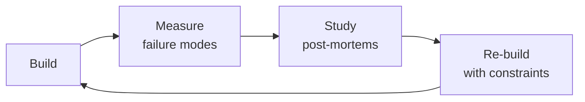

# Performance Engineer
> **Portability target:** Spec-level (runs on Claude Code, Copilot, Gemini CLI, Codex, Cursor). No vendor-specific frontmatter fields.

End-to-end performance engineering framework covering profiling, load testing, bottleneck diagnosis, and optimization across the full stack — frontend, backend, database, and infrastructure.

### Cross-skills Integration

| Step | Skill | What it produces |
|------|-------|------------------|
| **Before** | frontend-developer | Web application with Core Web Vitals data, bundle output, rendering metrics |
| **This** | performance-engineer | Flame graphs, load test reports, optimization recommendations, performance budgets |
| **After** | observability-engineer | Instrumented dashboards, SLO-based alerting, anomaly detection for performance regressions |

Common chains:
- **Chain**: frontend-developer → performance-engineer → observability-engineer — Developer ships the app; performance engineer profiles and optimizes; observability engineer monitors ongoing performance.
- **Chain**: backend-developer → performance-engineer → site-reliability-engineer — Backend code gets profiled and optimized; SRE enforces performance SLOs in production.

## Route the Request

<!-- QUICK: 30s -- auto-route first, then intent-route -->

### Auto-Route (No User Input Required)
Evaluate these file-system conditions in order. First match wins — jump immediately.

| # | Condition | Action |
|---|-----------|--------|
| A1 | `file_contains("*.js", "k6\|http.get\|http.post\|export default function")` OR `file_exists("artillery.yml\|locustfile.py\|load-test.js")` OR `file_contains("*.go", "pprof.StartCPUProfile\|runtime/pprof")` OR `file_contains("*.py", "memory_profiler\|py-spy\|line_profiler")` | This is your skill. Jump to **Core Workflow** — Phase 1. |
| A2 | `file_contains("*.sql", "EXPLAIN ANALYZE\|CREATE INDEX\|pg_stat_user_indexes")` OR `file_contains("*.ts", "\\.findAll\|\\.query\|N\\+1")` | Invoke **database-designer** instead. You need index review and query optimization. |
| A3 | `file_exists("docker-compose.yml\|terraform/")` AND `file_contains("*.conf\|*.yml", "nginx\|haproxy\|proxy_read_timeout\|upstream")` | Invoke **devops-engineer** instead. This is infrastructure/CDN/caching setup. |
| A4 | `file_exists("prometheus.yml\|grafana/\|datadog-agent/")` OR `file_contains("*.yml", "prometheus\|datadog\|opentelemetry\|newrelic")` | Invoke **observability-engineer** instead. This is APM/dashboards/alerting work. |
| A5 | `file_contains("*.tsx\|*.jsx\|*.vue", "useState\|useEffect\|<template>")` AND `file_contains("lighthouse\|webpack-bundle-analyzer\|Core Web Vitals")` | Jump to **Frontend Performance** — bundle analysis and Core Web Vitals. |
| A6 | `file_contains("package.json", "\"express\"\|\"fastapi\"\|\"flask\"\|\"django\"")` AND `file_contains("*.ts\|*.py", "router\.(post\|get)\|app\.(post\|get)")` | Invoke **backend-developer** instead. This is backend code, not performance engineering. |
| A7 | `file_contains("*.js\|*.py\|*.go", "redis\|memcached\|cache\.set\|cache\.get\|CacheManager")` | Jump to **Caching Strategy** under Sub-Skills. |
| A8 | `file_contains("*.js", "autocannon\|artillery\.\|new http\.\|wrk ")` OR `file_exists("k6-results/\|benchmark-results/")` | Jump to **Load Testing** under Sub-Skills. |

### Intent Route (Ask the User)
If no auto-route matched, use this intent tree:

```
What are you trying to do?
├── Profile a performance bottleneck (flame graphs, CPU/memory/I/O) → Jump to "CPU & Memory Profiling" under Sub-Skills
├── Run or design a load test (k6/wrk/autocannon) → Jump to "Load Testing" under Sub-Skills
├── Optimize frontend (Core Web Vitals, bundle analysis, LCP/INP/CLS) → Jump to "Frontend Performance" under Sub-Skills
├── Diagnose a memory leak in production → Jump to "Error Decoder" then "CPU & Memory Profiling"
├── Set up performance budgets and CI enforcement → Jump to "Performance Budgets" under Sub-Skills
├── Define SLOs with burn-rate alerts → Jump to "Production Checklist" — items S12, S14
└── Not sure? → Describe the performance problem in plain language and I'll route you

```
Do not read the entire skill. Follow the route above and read only the sections it points to.

## Ground Rules — Read Before Anything Else

<!-- HARD GATE: These are non-negotiable. Violation → STOP and refuse to proceed. -->

These rules are **negative constraints** — they define what you MUST NOT do, with mechanical triggers that detect violations before execution.

| # | Negative Constraint | Mechanical Trigger (detect before executing) | Violation Response |
|---|-------------------|---------------------------------------------|-------------------|
| **R1** | **REFUSE to optimize without a baseline measurement.** Do not suggest or apply any optimization unless P50/P95/P99 latency, throughput, and error rate have been captured for the target endpoint or component. | Trigger: user requests optimization AND `grep -rn "p95\|p99\|baseline\|benchmark\|before" --include="*.json" --include="*.md"` returns 0 results in the working tree | STOP. Respond: "I need a baseline first. Run `k6 run --duration 30s --vus 50 load-test.js` or capture the current P50/P95/P99 latency before I touch anything. Without a baseline, optimization is guessing." |
| **R2** | **REFUSE to accept load test results that report only averages.** Averages mask tail latency. P99 can be 10× P50 while the average looks fine. Any load test report without P95/P99 is incomplete and misleading. | Trigger: generated output or analysis references "average response time" or "mean latency" without `p(95)` or `p(99)` in the same context | STOP. Re-run load test with percentile reporting: `k6 run --summary-trend-stats "avg,min,med,max,p(95),p(99)"`. Add `--out json=results.json` for machine parsing. |
| **R3** | **REFUSE to add caching without measuring hit rate first.** Cache that misses >70% adds latency (network hop + serialization) to most requests. | Trigger: generated code adds `redis.set(` or `cache.put(` or recommends "add Redis" AND `grep -rn "hit.rate\|hit_rate\|cache.hit" --include="*.py" --include="*.ts"` returns 0 | STOP. Add: "Before deploying this cache, run in shadow mode for 24h to measure hit rate. Remove if hit rate < 50%. Track via `redis-cli INFO stats \| grep keyspace_hits`." |
| **R4** | **REFUSE to add database indexes without checking existing ones.** Duplicate indexes waste write I/O and confuse the query planner. | Trigger: generated code contains `CREATE INDEX` or `add_index` AND `grep -rn "pg_stat_user_indexes\|idx_scan\|unused" --include="*.sql"` returns 0 in the conversation | STOP. Run first: `SELECT schemaname, tablename, indexrelname, idx_scan FROM pg_stat_user_indexes WHERE idx_scan < 50 ORDER BY idx_scan;`. Drop unused indexes before adding new ones. |
| **R5** | **STOP and ASK when the performance context is missing.** Do not assume expected QPS, infrastructure specs, deployment topology, or traffic patterns. | Trigger: generating load test config, scaling recommendation, or capacity plan without explicit confirmation of: target QPS, instance type, region, number of instances, and traffic mix | STOP. Ask: "What's the expected peak QPS? Instance type and count? Single-region or multi-region? What's the traffic mix (read/write ratio, endpoint distribution)?" |
| **R6** | **DETECT and WARN about load tests running on localhost.** Localhost results are 10-50× optimistic compared to production (TLS, cross-AZ, load balancer overhead). | Trigger: generated k6/artillery/wrk config contains `http://localhost` or `http://127.0.0.1` as the target URL | WARN: Add comment `# WARNING: localhost results overestimate capacity by 10-50×. Divide QPS by 10 for realistic production estimate.` and insert `# TODO: Replace with production-equivalent endpoint (TLS + LB + cross-AZ)` |
| **R7** | **DETECT and WARN about synchronous broadcast loops.** Fan-out to N clients in a single-threaded event loop blocks all other handlers. | Trigger: generated code contains `forEach.*\.send\|for.*\.send\|wss.clients.forEach` OR `broadcast` without batching/sharding | WARN: Insert comment `// WARNING: Synchronous broadcast to N clients blocks the event loop for O(N) time. Refactor to worker shards with Redis pub/sub:` and skeleton sharding code. |

## The Expert's Mindset

Masters of performance engineer don't just build — they build **the right thing, at the right time, with the right trade-offs**. They think in systems, not tasks.

| Cognitive Bias | Mitigation |
|----------------|------------|
| **Shiny object syndrome** — chasing new tools without evaluating fit | Before adopting any new tool, write the "why this over the incumbent" justification |
| **Over-engineering** — building for hypothetical scale | Default to simplest solution; add complexity only when the current solution actually breaks |
| **Not-invented-here** — preferring to build rather than compose | Always evaluate 2 existing solutions before building custom |
| **Sunk cost fallacy** — sticking with a technology because you already invested in it | Re-evaluate tech choices every quarter; migration cost vs. staying cost |

### What Masters Know That Others Don't
- The **failure modes** of every component in their stack — not just the happy path
- When **not** to use their favorite tool (every tool has a misuse zone)
- That **data/model quality decays over time** — monitoring is not optional, it's foundational

### When to Break Your Own Rules
- **Move fast on reversible decisions.** Data format? Hard to change. Dashboard layout? Easy. Know the difference.
- **Skip the abstraction until the third use case.** Two is coincidence, three is a pattern.

## Operating at Different Levels

| Level | Scope | You... |
|-------|-------|--------|
| **L1** | Single component/module | Implement a well-defined piece following established patterns |
| **L2** | Feature or service | Design and build a complete feature; make tech choices within team conventions |
| **L3** | System or product area | Define architecture for a product area; set team tech standards; mentor L1-L2 |
| **L4** | Multiple systems / platform | Define org-wide architecture patterns; make build-vs-buy decisions; influence industry practice |
| **L5** | Industry / ecosystem | Create new architectural patterns adopted across the industry; redefine what's possible |

**Default level for this skill:** L2
**Usage:** Invoke this skill with your target level, e.g., "as an L3 performance engineer, design..."

For full level definitions, see `skills/00-framework/skill-levels/SKILL.md`.

## When to Use

<!-- QUICK: 30s -- scan the bullet list to decide if this skill fits -->
- Diagnosing high P95/P99 latency in a production service with unclear root cause
- Running a systematic load test before a major event (product launch, Black Friday, seasonal peak)
- Profiling CPU, memory, or I/O bottlenecks that GC logs and APM dashboards can't explain
- Designing and validating a multi-layer caching strategy (browser, CDN, application, database)
- Analyzing and optimizing frontend bundle size, JavaScript parse time, or rendering performance
- Optimizing slow database queries — index tuning, query rewriting, connection pooling
- Conducting a CDN configuration audit: cache hit ratio, TTL strategy, edge function performance
- Building performance budgets into CI to prevent regressions

## Decision Trees

<!-- QUICK: 30s -- follow the ASCII tree to your scenario -->
### 1. What to Optimize First

```
                     ┌───────────────────────┐
                     │ START: Where is the   │
                     │ bottleneck? (APM)     │
                     └───────────┬───────────┘
                                 │
          ┌──────────────────────┼──────────────────────┐
          │                      │                      │
    ┌─────▼──────┐       ┌───────▼───────┐       ┌──────▼──────┐
    │ DB time    │       │ App CPU >80%  │       │ Frontend    │
    │ >50% of    │       │ or GC pauses  │       │ LCP >2.5s  │
    │ latency    │       │ >100ms        │       │             │
    └─────┬──────┘       └───────┬───────┘       └──────┬──────┘
          │                      │                      │
    ┌─────▼──────┐       ┌───────▼───────┐       ┌──────▼──────────┐
    │ Database   │       │ CPU/Memory   │       │ Frontend        │
    │ Profiling  │       │ Profiling    │       │ Optimization    │
    │ → Indexes, │       │ → Flame      │       │ → Bundle split, │
    │ query      │       │ graph, GC    │       │ lazy load,      │
    │ rewrite    │       │ tune, heap   │       │ image optimize  │
    └────────────┘       └──────────────┘       └─────────────────┘
```
**DB time >50% → optimize queries and indexes.**  
**App CPU >80% or GC pauses >100ms → profile CPU/memory.**  
**Frontend LCP >2.5s → bundle analysis and rendering path optimization.**

### 2. Caching Strategy Selection

```
                   ┌──────────────────────────┐
                   │ START: What's the read   │
                   │ pattern?                 │
                   └───────────┬──────────────┘
                               │
              ┌────────────────┼────────────────┐
              │                │                │
        ┌─────▼──────┐  ┌──────▼──────┐  ┌──────▼──────┐
        │ Same data  │  │ User-       │  │ Highly      │
        │ for all    │  │ specific    │  │ volatile    │
        │ users      │  │ data        │  │ data        │
        └─────┬──────┘  └──────┬──────┘  └──────┬──────┘
              │                │                │
        ┌─────▼──────┐  ┌──────▼──────┐  ┌──────▼──────────┐
        │ CDN +      │  │ App cache   │  │ Don't cache.    │
        │ shared      │  │ (Redis)     │  │ Use read        │
        │ cache       │  │ with short  │  │ replicas +      │
        │ (long TTL)  │  │ TTL (30-    │  │ connection pool │
        │             │  │ 300s)       │  │ if read-heavy   │
        └─────────────┘  └─────────────┘  └─────────────────┘
```
**Shared data → CDN with long TTL + stale-while-revalidate.**  
**User-specific → application cache (Redis) with TTL 30-300s.**  
**Volatile data → don't cache; scale reads with replicas.**

### 3. Load Test Strategy

```
                   ┌──────────────────────────┐
                   │ START: What's the test   │
                   │ goal?                    │
                   └───────────┬──────────────┘
                               │
       ┌───────────────────────┼───────────────────────┐
       │                       │                       │
  ┌────▼────┐          ┌───────▼───────┐        ┌──────▼──────┐
  │ Find    │          │ Ensure system │        │ Verify      │
  │ capacity│          │ handles       │        │ performance │
  │ ceiling │          │ expected load │        │ after       │
  └────┬────┘          └───────┬───────┘        │ change      │
       │                       │                └──────┬──────┘
  ┌────▼────────┐     ┌───────▼───────┐        ┌──────▼──────┐
  │ Stress test │     │ Load test:    │        │ Benchmark:  │
  │ Ramp VUs    │     │ Expected peak │        │ 60s at      │
  │ until break │     │ VUs for 5-10  │        │ baseline VUs│
  │ point. Note │     │ min. P95 must │        │ Compare P95 │
  │ max TPS +   │     │ stay < target │        │ pre/post.   │
  │ failure mode│     │               │        │ Fail on     │
  └─────────────┘     └───────────────┘        │ regression  │
                                               └─────────────┘
```
**Capacity planning → stress test (ramp until failure).**  
**Pre-launch → load test at expected peak for 5-10 min.**  
**Per-change → benchmark 60s, compare P95 against baseline.**

### 4. When to Profile

```
                   ┌──────────────────────────┐
                   │ START: P95 latency       │
                   │ > target SLO?            │
                   └───────────┬──────────────┘
                               │
                    ┌──────────▼──────────┐
                    │ YES → Have you      │
                    │ checked APM?        │
                    └────┬───────────┬────┘
                         │NO         │YES
                    ┌────▼────┐ ┌───▼──────────┐
                    │ Install │ │ APM shows    │
                    │ APM     │ │ which layer? │
                    │ first   │ └──┬───────┬───┘
                    └─────────┘    │       │
                              ┌────▼──┐ ┌──▼────────┐
                              │ DB    │ │ App       │
                              └───┬───┘ └──┬────────┘
                          ┌───────▼──┐ ┌───▼───────────┐
                          │ EXPLAIN  │ │ CPU profiler   │
                          │ ANALYZE  │ │ (pprof/py-spy/ │
                          │ + index  │ │ async-profiler)│
                          │ tuning   │ │ → flame graph  │
                          └──────────┘ └────────────────┘
```
**No APM → install APM before profiling. You need to know WHERE to look.**  
**DB is slow → EXPLAIN ANALYZE before CPU profiling. 80% of slowness is queries.**  
**App is slow → flame graph to find the specific function burning CPU.**

### 5. When to Scale Horizontally

```
                    ┌──────────────────────────┐
                    │ START: Can you fix with  │
                    │ simpler means?           │
                    └───────────┬──────────────┘
                                │
        ┌───────────────────────┼───────────────────────┐
        │                       │                       │
  ┌─────▼──────┐        ┌───────▼───────┐        ┌──────▼──────┐
  │ Bigger     │        │ Add index /  │        │ Add Redis   │
  │ instance?  │        │ fix query?   │        │ cache?      │
  └─────┬──────┘        └───────┬───────┘        └──────┬──────┘
        │YES                    │YES                    │YES
  ┌─────▼──────┐        ┌───────▼───────┐        ┌──────▼──────────┐
  │ Vertical   │        │ Fix it.      │        │ Cache hot data. │
  │ scale      │        │ Cost: 1 dev- │        │ Measure hit      │
  │ first.     │        │ hour. Done.  │        │ rate. If >80%,  │
  │ Cost: 5 min│        └───────────────┘        │ you're done.    │
  └────────────┘                                 └─────────────────┘
        │NO (all exhausted)
  ┌─────▼──────────────────┐
  │ Scale horizontally:    │
  │ Add instances behind   │
  │ load balancer. Ensure  │
  │ stateless services.    │
  └────────────────────────┘
```
**Vertical scaling → always try first. Cheaper, simpler, 5 minutes.**  
**Query/index fix → second line of defense. One dev-hour for 10x improvement.**  
**Caching → third option. Add targeted cache, measure hit rate.**  
**Horizontal → only when all simpler options are exhausted.**

## Cross-Skill Coordination

<!-- QUICK: 30s -- table of who to talk to when -->
Performance is not a solo activity — it requires instrumentation from developers, infrastructure from DevOps, data from DBAs, and prioritization from product. A performance engineer without coordination is optimizing in a vacuum.

### Decision Gates & Artifacts

- **Gate 1 — Application Built:** Performance profiling requires a running application provided by `backend-developer`. Artifact: deployable application with APM instrumentation.
- **Gate 2 — Schema Optimized:** Database query optimization depends on schema design and index strategy from `database-designer`. Artifact: EXPLAIN ANALYZE output with index recommendations.
- **Gate 3 — Observability Instrumented:** Bottleneck identification requires APM dashboards, distributed tracing, and SLO instrumentation from `observability-engineer`. Artifact: APM dashboard URL with baseline metrics.
- **Gate 4 — Infrastructure Scaled:** Load testing and capacity planning require CDN, caching layers, and auto-scaling configured by `devops-engineer`. Artifact: infrastructure capacity report.
- **Artifact:** Flame graph output, load test report (P50/P95/P99 comparison), performance budget CI configuration, capacity plan with headroom.

| Coordinate With | When | What to Share/Ask |
|-----------------|------|-------------------|
| **Backend Developers** | Code-level profiling, query optimization, memory leaks | Flame graph results, hot path identification, N+1 query locations, memory allocation profiles |
| **Frontend Developers** | Bundle size, rendering performance, Core Web Vitals | Lighthouse/WebPageTest results, bundle analysis, LCP/INP optimization targets |
| **DBA / Database Team** | Query optimization, indexing, connection pooling | Slow query logs, EXPLAIN plans, index recommendations, connection pool sizing |
| **DevOps / Infrastructure** | CDN, caching layers, auto-scaling, resource allocation | Cache hit rates, CDN configuration, instance right-sizing, scaling trigger tuning |
| **System Architect** | Caching strategy, async processing, architecture bottlenecks | System bottleneck analysis, sync-to-async migration, caching architecture |
| **QA Engineer** | Load testing, stress testing, performance regression testing | k6/JMeter test scripts, baseline metrics, regression thresholds |
| **Security Reviewer** | Performance impact of security controls, WAF latency | WAF overhead, TLS termination cost, security scanning performance impact |
| **Product Strategist** | Performance vs feature prioritization, user-perceived latency | Performance impact on conversion/retention, business case for optimization investment |
| **Project Manager** | Performance work prioritization, optimization sprints | Performance debt backlog, optimization ROI estimates, engineering capacity |

### Communication Triggers — When to Proactively Notify

| Trigger | Notify | Why |
|---------|--------|-----|
| P99 latency increases >2x baseline in production | Backend Developers, DevOps, Project Manager | Degraded user experience; investigation may block release |
| Database CPU sustained >80% for >15 minutes | DBA, Backend Developers, DevOps | Imminent database overload; query optimization or scaling needed |
| Memory leak detected in production (heap growth without plateau) | Backend Developers, DevOps | OOM crash risk; restart mitigation + root cause fix |
| Load test reveals system breaks at <2x current peak traffic | System Architect, DevOps, Project Manager | Capacity risk; scaling or optimization before next growth phase |
| Cache hit rate drops below 70% | DevOps, Backend Developers | Cache strategy failing; increased database load imminent |
| Core Web Vitals score drops below "Good" threshold (LCP>2.5s, INP>200ms) | Frontend Developers, Product Strategist | SEO impact (Google ranking factor); user experience degradation |
| Bundle size increases >20% in single deploy | Frontend Developers | Progressive bloat; bundle split or lazy loading needed |
| N+1 query pattern discovered in critical user path | Backend Developers | Easy optimization win; batch loading or eager loading fix |

### Escalation Path

| Situation | Escalate To | Rationale |
|-----------|------------|-----------|
| Performance degradation causing revenue loss (checkout/payment path affected) | **CTO Advisor** + VP Engineering + Product Strategist | Revenue at risk; SEV-level incident response |
| Production outage caused by resource exhaustion (CPU/memory/connections) | **DevOps Lead** + CTO Advisor + Incident Commander | Production incident; immediate scaling or restart |
| Performance optimization blocked by product for >2 sprints (P99 >1s on critical path) | **CTO Advisor** + Product Strategist | Technical debt vs feature decision; executive trade-off |
| Architecture bottleneck requiring major refactor to resolve | **System Architect** + CTO Advisor | Multi-sprint investment; architecture decision required |
| Infrastructure cost from performance-inefficient architecture >30% of cloud bill | **CTO Advisor** + CFO/Finance | Cost optimization business case; infrastructure re-architecture |

### Route to Other Skills

| If the Request Is About | Route To |
|--------------------------|----------|
| Code-level profiling, query optimization, memory management | `backend-developer` |
| Schema design, index strategy, query plan analysis | `database-designer` |
| APM instrumentation, SLO dashboards, anomaly detection | `observability-engineer` |
| CDN, caching layers, auto-scaling, resource allocation | `devops-engineer` |
| SLO enforcement, capacity planning, incident response for perf regressions | `site-reliability-engineer` |

## Proactive Triggers

<!-- QUICK: 30s — when to proactively notify stakeholders -->

| Trigger | Notify | Why |
|---------|--------|-----|
| P99 latency spike >3x baseline on critical revenue path (checkout, payment) | CTO Advisor, Backend Developers, Product Strategist | Revenue-impacting degradation; war room investigation required |
| Database CPU sustained >85% for >10 minutes during normal traffic | DBA, Backend Developers, DevOps | Imminent overload; query optimization or read replica scaling needed before outage |
| Memory leak detected — heap grows monotonically without GC plateau | Backend Developers, DevOps | OOM crash risk within hours; restart mitigation + heap dump analysis for root cause |
| Core Web Vitals LCP exceeds 4.0s (> "Poor" threshold) on >10% of page loads | Frontend Developers, Product Strategist, SEO Specialist | Google ranking penalty imminent; user bounce rate increasing |
| Load test reveals capacity ceiling <3x current peak traffic | System Architect, DevOps, Project Manager | Insufficient headroom for growth or traffic spikes; scaling or optimization needed |
| Cache hit rate drops below 50% on critical cache layer | DevOps, Backend Developers | Cache strategy failing; database load doubling; cache warming or sizing re-evaluation |
| Performance CI regression gate fails on main branch | All Developers, DevOps | Performance regression shipped; immediate rollback or fix before next deploy |
| N+1 query pattern discovered on endpoint with >1K RPM | Backend Developers | Low-hanging optimization; batch loading or eager loading fix with high impact/effort ratio |

## Core Workflow

<!-- QUICK: 30s -- scan phase titles to understand the process -->
<!-- DEEP: 10+min -->
### Phase 1 (~15 min): Baseline & Instrumentation
**Input:** Production or production-like environment  
**Steps:** 1) Verify APM/RUM/Distributed tracing is active 2) Establish P50/P95/P99 latency, throughput, error rate per endpoint 3) Enable DB slow query logging and GC logging 4) Run Lighthouse for Core Web Vitals baseline  
**Output:** Instrumented system with numeric performance baseline per component

<!-- DEEP: 10+min -->
### Phase 2 (~30 min): Bottleneck Identification
**Input:** APM dashboards and baseline metrics  
**Steps:** 1) Identify endpoint with highest P95 latency × request volume (latency-budget impact) 2) Use APM to classify bottleneck: DB (time >50%), App CPU, Memory/GC, or I/O 3) Apply decision tree to select profiling tool 4) Run targeted profiler to isolate specific function/query  
**Output:** One confirmed performance bottleneck with root cause and fix plan

<!-- DEEP: 10+min -->
### Phase 3 (~20 min): Optimization & Verification
**Input:** Identified bottleneck with root cause  
**Steps:** 1) Apply fix: add index, rewrite query, tune GC, split bundle, add cache layer 2) Run benchmark: 60s load test comparing pre/post P95 3) Verify no regression on other endpoints 4) If improvement <20%, go back to Phase 2  
**Output:** Verified performance improvement with before/after metrics

<!-- DEEP: 10+min -->
### Phase 4 (~15 min): Hardening
**Input:** Verified optimization  
**Steps:** 1) Add performance budget in CI to prevent regression 2) Set SLO with burn-rate alert 3) Document root cause and fix in ADR 4) Add to load test suite so regression is caught automatically  
**Output:** Regression-proofed optimization with monitoring and alerting

<!-- DEEP: 10+min -->
### Phase 5 (~25 min): Capacity Planning
**Input:** Current capacity ceiling and growth projections  
**Steps:** 1) Run stress test to determine breaking point (max TPS, failure mode) 2) Calculate headroom: (ceiling − peak) / ceiling × 100 3) If headroom <50%, create scaling plan (vertical first, then horizontal) 4) Schedule next capacity review based on growth rate  
**Output:** Capacity plan with headroom percentage, scaling triggers, and timeline

## What Good Looks Like

> When performance engineering is embedded in the development lifecycle, every PR includes a 60-second benchmark that gates on regression, SLOs are defined with burn-rate alerts that wake someone up bef

> See [references/what-good-looks-like.md](references/what-good-looks-like.md) for the full quality standard.

## Deliberate Practice



| Level | Practice | Frequency |
|-------|----------|-----------|
| **Novice** | Rebuild an existing system from scratch, then compare your design with the original | Monthly |
| **Competent** | Add a new constraint (10x data, zero downtime, etc.) to a familiar design and re-architect | Quarterly |
| **Expert** | Design the same system under 3 conflicting constraint sets; write a decision record for each | Quarterly |
| **Master** | Teach a junior to design a system; your role is to ask questions, not give answers | Monthly |

**The One Highest-Leverage Activity:** Every quarter, take a system you built 6+ months ago and redesign it from scratch with what you know now. Write down what changed and why.

## Gotchas

- **`timeit` vs profiling** — `timeit` tells you "this function took 2.3 seconds." It doesn't tell you it spent 2.1 seconds in `json.loads()` and 0.2 seconds doing actual work. Always use `cProfile` or `py-spy` before optimizing — the bottleneck is never where you think it is.
- **Database N+1 with ORMs** — `User.objects.all()` then `for user in users: print(user.profile.bio)` executes 1 query for users + N queries for profiles. ORMs don't warn you. In development (10 users, SQLite on localhost), it's 11ms. In production (10K users, remote Postgres), it's 11,000ms.
- **`SELECT COUNT(*)` on large InnoDB tables** — InnoDB doesn't store row count; it scans the smallest index. On 100M rows, COUNT(*) takes 30 seconds. Use `SHOW TABLE STATUS` for estimates or maintain application-level counters.
- **P99 vs P99.9 latency** — P99 is 100ms, but P99.9 is 12,000ms. This means 1 in 1,000 requests takes 120x longer. That's every user hitting a 12-second hang once per ~10 minutes of active use. P99 alone hides the experience of your most active users.
- **Caching that hurts** — caching a frequently-written value with a 60-second TTL. If the value changes 100x/second and you cache for 60s, you're serving stale data 99.999% of the time. Cache frequently-read, rarely-written data; don't cache fast-changing data without understanding staleness tolerance.
- **`gc.pause()` in Go** at 50ms looks fine on a dashboard. But if your request timeout is 100ms and GC pause is 50ms, 50% of your request budget is GC. P99 request latency will show sawtooth patterns aligned with GC cycles. Use `GOMEMLIMIT` and `GOGC` tuning.

## Verification

- [ ] Profile before optimizing: `cProfile` / `py-spy` / `pprof` output confirms the bottleneck location
- [ ] Baseline measurement: p50/p95/p99 latency collected for 5 minutes under representative load
- [ ] Optimization applied — re-measure: p50/p95/p99 improved by at least the target % (not just "looks faster")
- [ ] No regression: all existing tests pass, benchmark for unchanged code paths within 5% of baseline
- [ ] Load test: `k6` or `wrk2` at 2× expected peak RPS for 10 minutes — p99 latency within SLO, zero errors
- [ ] Memory profile: `heapdump` or `memray` — memory usage stable over 30 minutes under load (no leaks)

## References
- **API Performance**: See [api-performance.md](references/api-performance.md)
- **Concurrency & Async Patterns**: See [concurrency-&-async-patterns.md](references/concurrency-&-async-patterns.md)
- **Database Performance**: See [database-performance.md](references/database-performance.md)
- **Frontend Performance**: See [frontend-performance.md](references/frontend-performance.md)
- **Load Testing**: See [load-testing.md](references/load-testing.md)
- **Memory**: See [memory.md](references/memory.md)
- **Optimization Methodology**: See [optimization-methodology.md](references/optimization-methodology.md)
- **Performance Budgets**: See [performance-budgets.md](references/performance-budgets.md)
- **Performance Measurement**: See [performance-measurement.md](references/performance-measurement.md)
- **Profiling Methodology**: See [profiling-methodology.md](references/profiling-methodology.md)
