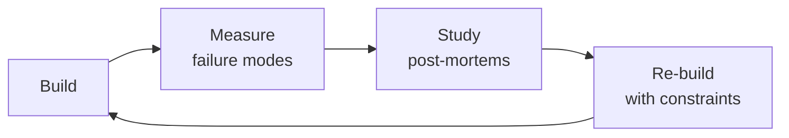

# Performance Engineer

End-to-end performance engineering framework covering profiling, load testing, bottleneck diagnosis, and optimization across the full stack — frontend, backend, database, and infrastructure.


### Cross-skills Integration

| Step | Skill | What it produces |
|------|-------|------------------|
| **Before** | frontend-developer | Web application with Core Web Vitals data, bundle output, rendering metrics |
| **This** | performance-engineer | Flame graphs, load test reports, optimization recommendations, performance budgets |
| **After** | observability-engineer | Instrumented dashboards, SLO-based alerting, anomaly detection for performance regressions |

Common chains:
- **Chain**: frontend-developer → performance-engineer → observability-engineer — Developer ships the app; performance engineer profiles and optimizes; observability engineer monitors ongoing performance.
- **Chain**: backend-developer → performance-engineer → site-reliability-engineer — Backend code gets profiled and optimized; SRE enforces performance SLOs in production.

## Sub-Skills
<!-- QUICK: 30s -- table of deeper dives by topic -->
When the agent identifies a specific performance bottleneck, drill into the relevant sub-skill. Each sub-skill has dedicated tools, profiling guides, and optimization playbooks in `references/`.

| Sub-Skill | What It Covers | Key Tool / Command |
|-----------|---------------|--------------------|
| **CPU & Memory Profiling** | Flame graphs, heap analysis, GC tuning, memory leak detection, allocation profiling — language-specific guides in `references/profiling-guide.md` | `py-spy record -o flame.svg -- python app.py` |
| **Database Query Optimization** | `EXPLAIN ANALYZE` deep dive, index strategy (covering, composite, partial), query rewriting (N+1 elimination, JOIN optimization), connection pooling (PgBouncer) | `psql -c "EXPLAIN (ANALYZE, BUFFERS) SELECT ..."` |
| **Load Testing** | k6 scenario design (ramp-up, soak, spike, stress), infrastructure sizing from results, statistical analysis of latency distributions, coordinated omission avoidance | `k6 run --duration 5m --vus 100 load-test.js` |
| **Frontend Performance** | Core Web Vitals (LCP, INP, CLS), bundle analysis (webpack-bundle-analyzer), critical rendering path, code splitting, image/font optimization — full cookbook at `references/frontend-performance-cookbook.md` | `npx lighthouse https://example.com --output json` |
| **Caching Strategy** | Multi-layer caching (browser, CDN, application, database), invalidation patterns (TTL, write-through, event-driven), cache stampede protection, CDN cache key design | `curl -sI https://example.com \| grep cache` |
| **Performance Budgets** | Time/size/quantity budgets, Lighthouse CI enforcement, bundlesize, break-PR-on-regression setup, SLO-based alerting | `npx lighthouse-ci --assert-pairs '{"lcp": "<2500"}'` |

> **Token-saving rule:** If P95 is high and APM shows 65% DB time, load only "Database Query Optimization" and "Caching Strategy." Don't load frontend or profiling sub-skills. The profiling guide alone is 450 lines — only load it when the bottleneck is confirmed CPU/memory-bound.

## Route the Request
<!-- QUICK: 30s -- auto-route first, then intent-route -->

### Auto-Route (No User Input Required)
Evaluate these file-system conditions in order. First match wins — jump immediately.

| # | Condition | Action |
|---|-----------|--------|
| A1 | `file_contains("*.js", "k6\|http.get\|http.post\|export default function")` OR `file_exists("artillery.yml\|locustfile.py\|load-test.js")` OR `file_contains("*.go", "pprof.StartCPUProfile\|runtime/pprof")` OR `file_contains("*.py", "memory_profiler\|py-spy\|line_profiler")` | This is your skill. Jump to **Core Workflow** — Phase 1. |
| A2 | `file_contains("*.sql", "EXPLAIN ANALYZE\|CREATE INDEX\|pg_stat_user_indexes")` OR `file_contains("*.ts", "\\.findAll\|\\.query\|N\\+1")` | Invoke **database-designer** instead. You need index review and query optimization. |
| A3 | `file_exists("docker-compose.yml\|terraform/")` AND `file_contains("*.conf\|*.yml", "nginx\|haproxy\|proxy_read_timeout\|upstream")` | Invoke **devops-engineer** instead. This is infrastructure/CDN/caching setup. |
| A4 | `file_exists("prometheus.yml\|grafana/\|datadog-agent/")` OR `file_contains("*.yml", "prometheus\|datadog\|opentelemetry\|newrelic")` | Invoke **observability-engineer** instead. This is APM/dashboards/alerting work. |
| A5 | `file_contains("*.tsx\|*.jsx\|*.vue", "useState\|useEffect\|<template>")` AND `file_contains("lighthouse\|webpack-bundle-analyzer\|Core Web Vitals")` | Jump to **Frontend Performance** — bundle analysis and Core Web Vitals. |
| A6 | `file_contains("package.json", "\"express\"\|\"fastapi\"\|\"flask\"\|\"django\"")` AND `file_contains("*.ts\|*.py", "router\.(post\|get)\|app\.(post\|get)")` | Invoke **backend-developer** instead. This is backend code, not performance engineering. |
| A7 | `file_contains("*.js\|*.py\|*.go", "redis\|memcached\|cache\.set\|cache\.get\|CacheManager")` | Jump to **Caching Strategy** under Sub-Skills. |
| A8 | `file_contains("*.js", "autocannon\|artillery\.\|new http\.\|wrk ")` OR `file_exists("k6-results/\|benchmark-results/")` | Jump to **Load Testing** under Sub-Skills. |

### Intent Route (Ask the User)
If no auto-route matched, use this intent tree:

```
What are you trying to do?
├── Profile a performance bottleneck (flame graphs, CPU/memory/I/O) → Jump to "CPU & Memory Profiling" under Sub-Skills
├── Run or design a load test (k6/wrk/autocannon) → Jump to "Load Testing" under Sub-Skills
├── Optimize frontend (Core Web Vitals, bundle analysis, LCP/INP/CLS) → Jump to "Frontend Performance" under Sub-Skills
├── Diagnose a memory leak in production → Jump to "Error Decoder" then "CPU & Memory Profiling"
├── Set up performance budgets and CI enforcement → Jump to "Performance Budgets" under Sub-Skills
├── Define SLOs with burn-rate alerts → Jump to "Production Checklist" — items S12, S14
└── Not sure? → Describe the performance problem in plain language and I'll route you
```
Do not read the entire skill. Follow the route above and read only the sections it points to.

## Ground Rules — Read Before Anything Else
<!-- HARD GATE: These are non-negotiable. Violation → STOP and refuse to proceed. -->

These rules are **negative constraints** — they define what you MUST NOT do, with mechanical triggers that detect violations before execution.

| # | Negative Constraint | Mechanical Trigger (detect before executing) | Violation Response |
|---|-------------------|---------------------------------------------|-------------------|
| **R1** | **REFUSE to optimize without a baseline measurement.** Do not suggest or apply any optimization unless P50/P95/P99 latency, throughput, and error rate have been captured for the target endpoint or component. | Trigger: user requests optimization AND `grep -rn "p95\|p99\|baseline\|benchmark\|before" --include="*.json" --include="*.md"` returns 0 results in the working tree | STOP. Respond: "I need a baseline first. Run `k6 run --duration 30s --vus 50 load-test.js` or capture the current P50/P95/P99 latency before I touch anything. Without a baseline, optimization is guessing." |
| **R2** | **REFUSE to accept load test results that report only averages.** Averages mask tail latency. P99 can be 10× P50 while the average looks fine. Any load test report without P95/P99 is incomplete and misleading. | Trigger: generated output or analysis references "average response time" or "mean latency" without `p(95)` or `p(99)` in the same context | STOP. Re-run load test with percentile reporting: `k6 run --summary-trend-stats "avg,min,med,max,p(95),p(99)"`. Add `--out json=results.json` for machine parsing. |
| **R3** | **REFUSE to add caching without measuring hit rate first.** Cache that misses >70% adds latency (network hop + serialization) to most requests. | Trigger: generated code adds `redis.set(` or `cache.put(` or recommends "add Redis" AND `grep -rn "hit.rate\|hit_rate\|cache.hit" --include="*.py" --include="*.ts"` returns 0 | STOP. Add: "Before deploying this cache, run in shadow mode for 24h to measure hit rate. Remove if hit rate < 50%. Track via `redis-cli INFO stats \| grep keyspace_hits`." |
| **R4** | **REFUSE to add database indexes without checking existing ones.** Duplicate indexes waste write I/O and confuse the query planner. | Trigger: generated code contains `CREATE INDEX` or `add_index` AND `grep -rn "pg_stat_user_indexes\|idx_scan\|unused" --include="*.sql"` returns 0 in the conversation | STOP. Run first: `SELECT schemaname, tablename, indexrelname, idx_scan FROM pg_stat_user_indexes WHERE idx_scan < 50 ORDER BY idx_scan;`. Drop unused indexes before adding new ones. |
| **R5** | **STOP and ASK when the performance context is missing.** Do not assume expected QPS, infrastructure specs, deployment topology, or traffic patterns. | Trigger: generating load test config, scaling recommendation, or capacity plan without explicit confirmation of: target QPS, instance type, region, number of instances, and traffic mix | STOP. Ask: "What's the expected peak QPS? Instance type and count? Single-region or multi-region? What's the traffic mix (read/write ratio, endpoint distribution)?" |
| **R6** | **DETECT and WARN about load tests running on localhost.** Localhost results are 10-50× optimistic compared to production (TLS, cross-AZ, load balancer overhead). | Trigger: generated k6/artillery/wrk config contains `http://localhost` or `http://127.0.0.1` as the target URL | WARN: Add comment `# WARNING: localhost results overestimate capacity by 10-50×. Divide QPS by 10 for realistic production estimate.` and insert `# TODO: Replace with production-equivalent endpoint (TLS + LB + cross-AZ)` |
| **R7** | **DETECT and WARN about synchronous broadcast loops.** Fan-out to N clients in a single-threaded event loop blocks all other handlers. | Trigger: generated code contains `forEach.*\.send\|for.*\.send\|wss.clients.forEach` OR `broadcast` without batching/sharding | WARN: Insert comment `// WARNING: Synchronous broadcast to N clients blocks the event loop for O(N) time. Refactor to worker shards with Redis pub/sub:` and skeleton sharding code. |


## The Expert's Mindset

Masters of performance engineer don't just build — they build **the right thing, at the right time, with the right trade-offs**. They think in systems, not tasks.

| Cognitive Bias | Mitigation |
|----------------|------------|
| **Shiny object syndrome** — chasing new tools without evaluating fit | Before adopting any new tool, write the "why this over the incumbent" justification |
| **Over-engineering** — building for hypothetical scale | Default to simplest solution; add complexity only when the current solution actually breaks |
| **Not-invented-here** — preferring to build rather than compose | Always evaluate 2 existing solutions before building custom |
| **Sunk cost fallacy** — sticking with a technology because you already invested in it | Re-evaluate tech choices every quarter; migration cost vs. staying cost |

### What Masters Know That Others Don't
- The **failure modes** of every component in their stack — not just the happy path
- When **not** to use their favorite tool (every tool has a misuse zone)
- That **data/model quality decays over time** — monitoring is not optional, it's foundational

### When to Break Your Own Rules
- **Move fast on reversible decisions.** Data format? Hard to change. Dashboard layout? Easy. Know the difference.
- **Skip the abstraction until the third use case.** Two is coincidence, three is a pattern.
## Operating at Different Levels

| Level | Scope | You... |
|-------|-------|--------|
| **L1** | Single component/module | Implement a well-defined piece following established patterns |
| **L2** | Feature or service | Design and build a complete feature; make tech choices within team conventions |
| **L3** | System or product area | Define architecture for a product area; set team tech standards; mentor L1-L2 |
| **L4** | Multiple systems / platform | Define org-wide architecture patterns; make build-vs-buy decisions; influence industry practice |
| **L5** | Industry / ecosystem | Create new architectural patterns adopted across the industry; redefine what's possible |

**Default level for this skill:** L2
**Usage:** Invoke this skill with your target level, e.g., "as an L3 performance engineer, design..."

For full level definitions, see `skills/00-framework/skill-levels/SKILL.md`.

## When to Use
<!-- QUICK: 30s -- scan the bullet list to decide if this skill fits -->
- Diagnosing high P95/P99 latency in a production service with unclear root cause
- Running a systematic load test before a major event (product launch, Black Friday, seasonal peak)
- Profiling CPU, memory, or I/O bottlenecks that GC logs and APM dashboards can't explain
- Designing and validating a multi-layer caching strategy (browser, CDN, application, database)
- Analyzing and optimizing frontend bundle size, JavaScript parse time, or rendering performance
- Optimizing slow database queries — index tuning, query rewriting, connection pooling
- Conducting a CDN configuration audit: cache hit ratio, TTL strategy, edge function performance
- Building performance budgets into CI to prevent regressions

## Decision Trees
<!-- QUICK: 30s -- follow the ASCII tree to your scenario -->
### 1. What to Optimize First
```
                     ┌───────────────────────┐
                     │ START: Where is the   │
                     │ bottleneck? (APM)     │
                     └───────────┬───────────┘
                                 │
          ┌──────────────────────┼──────────────────────┐
          │                      │                      │
    ┌─────▼──────┐       ┌───────▼───────┐       ┌──────▼──────┐
    │ DB time    │       │ App CPU >80%  │       │ Frontend    │
    │ >50% of    │       │ or GC pauses  │       │ LCP >2.5s  │
    │ latency    │       │ >100ms        │       │             │
    └─────┬──────┘       └───────┬───────┘       └──────┬──────┘
          │                      │                      │
    ┌─────▼──────┐       ┌───────▼───────┐       ┌──────▼──────────┐
    │ Database   │       │ CPU/Memory   │       │ Frontend        │
    │ Profiling  │       │ Profiling    │       │ Optimization    │
    │ → Indexes, │       │ → Flame      │       │ → Bundle split, │
    │ query      │       │ graph, GC    │       │ lazy load,      │
    │ rewrite    │       │ tune, heap   │       │ image optimize  │
    └────────────┘       └──────────────┘       └─────────────────┘
```
**DB time >50% → optimize queries and indexes.**  
**App CPU >80% or GC pauses >100ms → profile CPU/memory.**  
**Frontend LCP >2.5s → bundle analysis and rendering path optimization.**

### 2. Caching Strategy Selection
```
                   ┌──────────────────────────┐
                   │ START: What's the read   │
                   │ pattern?                 │
                   └───────────┬──────────────┘
                               │
              ┌────────────────┼────────────────┐
              │                │                │
        ┌─────▼──────┐  ┌──────▼──────┐  ┌──────▼──────┐
        │ Same data  │  │ User-       │  │ Highly      │
        │ for all    │  │ specific    │  │ volatile    │
        │ users      │  │ data        │  │ data        │
        └─────┬──────┘  └──────┬──────┘  └──────┬──────┘
              │                │                │
        ┌─────▼──────┐  ┌──────▼──────┐  ┌──────▼──────────┐
        │ CDN +      │  │ App cache   │  │ Don't cache.    │
        │ shared      │  │ (Redis)     │  │ Use read        │
        │ cache       │  │ with short  │  │ replicas +      │
        │ (long TTL)  │  │ TTL (30-    │  │ connection pool │
        │             │  │ 300s)       │  │ if read-heavy   │
        └─────────────┘  └─────────────┘  └─────────────────┘
```
**Shared data → CDN with long TTL + stale-while-revalidate.**  
**User-specific → application cache (Redis) with TTL 30-300s.**  
**Volatile data → don't cache; scale reads with replicas.**

### 3. Load Test Strategy
```
                   ┌──────────────────────────┐
                   │ START: What's the test   │
                   │ goal?                    │
                   └───────────┬──────────────┘
                               │
       ┌───────────────────────┼───────────────────────┐
       │                       │                       │
  ┌────▼────┐          ┌───────▼───────┐        ┌──────▼──────┐
  │ Find    │          │ Ensure system │        │ Verify      │
  │ capacity│          │ handles       │        │ performance │
  │ ceiling │          │ expected load │        │ after       │
  └────┬────┘          └───────┬───────┘        │ change      │
       │                       │                └──────┬──────┘
  ┌────▼────────┐     ┌───────▼───────┐        ┌──────▼──────┐
  │ Stress test │     │ Load test:    │        │ Benchmark:  │
  │ Ramp VUs    │     │ Expected peak │        │ 60s at      │
  │ until break │     │ VUs for 5-10  │        │ baseline VUs│
  │ point. Note │     │ min. P95 must │        │ Compare P95 │
  │ max TPS +   │     │ stay < target │        │ pre/post.   │
  │ failure mode│     │               │        │ Fail on     │
  └─────────────┘     └───────────────┘        │ regression  │
                                               └─────────────┘
```
**Capacity planning → stress test (ramp until failure).**  
**Pre-launch → load test at expected peak for 5-10 min.**  
**Per-change → benchmark 60s, compare P95 against baseline.**

### 4. When to Profile
```
                   ┌──────────────────────────┐
                   │ START: P95 latency       │
                   │ > target SLO?            │
                   └───────────┬──────────────┘
                               │
                    ┌──────────▼──────────┐
                    │ YES → Have you      │
                    │ checked APM?        │
                    └────┬───────────┬────┘
                         │NO         │YES
                    ┌────▼────┐ ┌───▼──────────┐
                    │ Install │ │ APM shows    │
                    │ APM     │ │ which layer? │
                    │ first   │ └──┬───────┬───┘
                    └─────────┘    │       │
                              ┌────▼──┐ ┌──▼────────┐
                              │ DB    │ │ App       │
                              └───┬───┘ └──┬────────┘
                          ┌───────▼──┐ ┌───▼───────────┐
                          │ EXPLAIN  │ │ CPU profiler   │
                          │ ANALYZE  │ │ (pprof/py-spy/ │
                          │ + index  │ │ async-profiler)│
                          │ tuning   │ │ → flame graph  │
                          └──────────┘ └────────────────┘
```
**No APM → install APM before profiling. You need to know WHERE to look.**  
**DB is slow → EXPLAIN ANALYZE before CPU profiling. 80% of slowness is queries.**  
**App is slow → flame graph to find the specific function burning CPU.**

### 5. When to Scale Horizontally
```
                    ┌──────────────────────────┐
                    │ START: Can you fix with  │
                    │ simpler means?           │
                    └───────────┬──────────────┘
                                │
        ┌───────────────────────┼───────────────────────┐
        │                       │                       │
  ┌─────▼──────┐        ┌───────▼───────┐        ┌──────▼──────┐
  │ Bigger     │        │ Add index /  │        │ Add Redis   │
  │ instance?  │        │ fix query?   │        │ cache?      │
  └─────┬──────┘        └───────┬───────┘        └──────┬──────┘
        │YES                    │YES                    │YES
  ┌─────▼──────┐        ┌───────▼───────┐        ┌──────▼──────────┐
  │ Vertical   │        │ Fix it.      │        │ Cache hot data. │
  │ scale      │        │ Cost: 1 dev- │        │ Measure hit      │
  │ first.     │        │ hour. Done.  │        │ rate. If >80%,  │
  │ Cost: 5 min│        └───────────────┘        │ you're done.    │
  └────────────┘                                 └─────────────────┘
        │NO (all exhausted)
  ┌─────▼──────────────────┐
  │ Scale horizontally:    │
  │ Add instances behind   │
  │ load balancer. Ensure  │
  │ stateless services.    │
  └────────────────────────┘
```
**Vertical scaling → always try first. Cheaper, simpler, 5 minutes.**  
**Query/index fix → second line of defense. One dev-hour for 10x improvement.**  
**Caching → third option. Add targeted cache, measure hit rate.**  
**Horizontal → only when all simpler options are exhausted.**

## Performance Measurement

### Establishing Baselines

Instrument every layer of the stack. Without baselines, you cannot tell if an optimization helped or hurt.

| Layer | What to Measure | Tools |
|-------|----------------|-------|
| Application | Latency (P50/P95/P99), throughput, error rate per endpoint | OpenTelemetry, APM (Datadog, New Relic, Honeycomb) |
| Infrastructure | CPU, memory, disk I/O, network I/O | Prometheus + Node Exporter, Grafana |
| Database | Query latency, connections, cache hit ratio, replication lag, deadlocks | pg_stat_statements, EXPLAIN ANALYZE, slow query log |
| Frontend | LCP, INP, CLS, TTFB, FCP, JS parse time | RUM (CrUX, Web Vitals JS), Lighthouse |

### Percentile Metrics Deep Dive

- **P50 (median)**: Tells you what the "typical" user experiences — but it's misleading because it hides the tail. A service can have a 50ms P50 and a 10s P99 and still look good.
- **P95**: 95% of users are faster than this. Best single number for "most users experience acceptable performance."
- **P99**: Catches the outliers — GC pauses, cold starts, network contention. Critical for SLOs: "99% of requests complete within 500ms."
- **Histogram vs Summary**: Histograms let you compute arbitrary percentiles client-side (Prometheus `histogram_quantile`). Summaries precompute percentiles server-side but cannot be aggregated across dimensions. Prefer histograms.

### Latency Distribution & Long-Tail Latency

Long-tail latency — the few requests that take 10x longer than the median — is the most damaging to user experience. Common causes:
- **Coordinated omission**: Load tools that pause between requests (ignoring queued latency) report artificially low latency. wrk2 and k6 solve this with open-loop or constant-throughput modes.
- **Head-of-line blocking**: One slow request blocks subsequent requests in a single-threaded model.
- **Garbage collection pauses**: Stop-the-world GC in Java/C#/Go causes all threads to pause briefly — visible only at P99+.
- **Cold starts**: Serverless functions, connection pool warm-up, JVM warm-up — first request after idle is disproportionately slow.

### RED vs USE Methodologies

- **RED** (Rate, Errors, Duration): Application-focused. For every service: What is the request rate? How many are failing? How long do successful ones take?
- **USE** (Utilization, Saturation, Errors): Infrastructure-focused. For every resource: What is the utilization? Is it saturated (queue depth > 0)? Are there errors?

Use both in tandem — RED tells you _what_ is slow, USE tells you _which resource_ is the bottleneck.

## Frontend Performance

### Critical Rendering Path

The browser's process for converting HTML/CSS/JS to pixels:

1. **HTML parsing** → DOM tree — byte-by-byte parsing, progressive
2. **CSS parsing** → CSSOM tree — render-blocking by default
3. **DOM + CSSOM** → Render Tree — only visible elements
4. **Layout (Reflow)** → Box model geometry — most expensive step
5. **Paint** → Pixels — fill pixels for visible elements
6. **Composite** → Layers — GPU-accelerated compositing

**Optimizations per step**:
- Minimize render-blocking CSS (inline critical CSS, defer non-critical)
- Defer non-critical JavaScript (use `defer` or `async`)
- Avoid layout thrashing (batch DOM reads before writes)
- Use `transform` and `opacity` for animations (compositor-only, no layout/paint)
- Reduce DOM depth (shallower tree = faster layout calculations)

### Resource Prioritization

- **`<link rel="preload">`**: Critical resources the browser should load ASAP. Use for fonts, hero images, above-the-fold critical CSS/JS. Example: `<link rel="preload" href="font.woff2" as="font" crossorigin>`
- **`<link rel="prefetch">**`: Resources needed on the _next_ page. Low priority, fetched after CPU is idle. Use for likely next-page bundles.
- **`<link rel="preconnect">`**: Warm up connections (DNS + TCP + TLS) to third-party origins. Use for analytics, CDN, API endpoints. Saves ~100-500ms per origin.
- **`<link rel="dns-prefetch">`**: DNS lookup only. Fallback for preconnect — lower overhead but only saves DNS time.

### Core Web Vitals

**LCP (Largest Contentful Paint)** — Perceived load speed. Target: < 2.5s.
- **Sub-parts**:
  1. TTFB (Time to First Byte) — server response time, CDN cache status
  2. Resource Load Delay — time before the LCP resource starts loading
  3. Resource Load Time — time to download the LCP resource
  4. Element Render Delay — time from resource load to visible render
- **Optimization**: Improve TTFB (server-side rendering, CDN caching, faster backend), preload LCP image, optimize image compression, reduce render-blocking resources.

**INP (Interaction to Next Paint)** — Responsiveness. Target: < 200ms. Replaces FID.
- Measures the longest interaction latency on the page (click, tap, keyboard).
- **Optimization**: Break up long tasks (>50ms), reduce JS execution time, optimize event callbacks, avoid complex selectors in event handlers.

**CLS (Cumulative Layout Shift)** — Visual stability. Target: < 0.1.
- Caused by: images/videos without dimensions, ads/embeds injected above content, web fonts causing FOIT/FOUT.
- **Fixes**: Always set `width` and `height` on images/videos, reserve space for ads/embeds, use `font-display: optional` or `swap`, avoid inserting content above existing content.

### Bundle Analysis

- **webpack-bundle-analyzer**: Interactive treemap of your bundle. Identifies: duplicated libraries, unexpectedly large dependencies, accidental inclusion of full packages instead of subsets.
- **source-map-explorer**: Maps bundle bytes back to source files. Good for TypeScript projects where compiled output size is surprising.
- **bundlephobia.com**: Quick check of a package's size before importing it. Shows minified + gzipped size, tree-shakeability, and dependency weight.
- **Import cost** (VS Code extension): Inline annotation of import size as you type.

### Code Splitting Strategies

1. **Route-based**: Split per page/route — each page gets its own chunk. Example: `const Dashboard = React.lazy(() => import('./Dashboard'))` in React, dynamic `import()` in Next.js pages.
2. **Component-level**: Split heavy below-the-fold components. Example: heavy charts, rich text editors, data tables — load only when scrolled into view or on user interaction.
3. **Conditional imports**: Load features only when needed. Example: `if (user.isAdmin) { const AdminPanel = await import('./AdminPanel') }`.
4. **Vendor splitting**: Separate third-party code (react, lodash, moment) into a stable `vendor.js` that rarely changes — better caching.

### JavaScript Execution Cost

- **Long tasks**: Any task > 50ms blocks the main thread and delays user interactions. Chrome DevTools Performance panel highlights them in red.
- **Total Blocking Time (TBT)**: Sum of all long task durations beyond 50ms between FCP and TTI. Lighthouse metric.
- **Web Workers**: Offload CPU-heavy computation — data processing, cryptography, image manipulation — to a background thread. The main thread stays responsive.
- **`requestIdleCallback`**: Schedule non-critical work for when the browser is idle. Used for analytics, logging, deferred rendering.
- **Debounce/Throttle**: Rate-limit scroll/resize/input event handlers to avoid excessive execution.

## API Performance

### Connection Pooling

- **Pool sizing formula**: `connections = (core_count × 2) + effective_spindle_count` (traditional) or for SSDs: `connections ≈ core_count × 2 ÷ (expected_active_queries_per_connection)`
- **Connection timeout configuration**: Set `connect_timeout` (fail fast if DB is down), `idle_in_transaction_session_timeout` (release stuck connections), `statement_timeout` (kill runaway queries).
- **Idle connection management**: Tune `idle_timeout` (close unused connections), `max_lifetime` (periodically rotate connections to avoid stale ones), use connection health checks (`SELECT 1`).

### Query Optimization

- **N+1 queries**: One request triggers 1 query for a list + N queries per item. Example: fetching 100 blog posts then querying author for each. Fix: eager loading (`JOIN ... IN`), DataLoader pattern (batch + cache).
- **DataLoader**: Batching + memoization per request. Combines N individual lookups into one batched query. Standard in GraphQL ecosystems.
- **Eager loading**: Use `SELECT * FROM posts JOIN authors ON posts.author_id = authors.id` instead of N+1 individual queries.

### Response Caching

- **ETag**: Content-based hash. Client sends `If-None-Match`, server responds `304 Not Modified` if unchanged. Great for API responses that change infrequently.
- **Last-Modified**: Timestamp-based. Client sends `If-Modified-Since`. Coarser than ETag but simpler.
- **Cache-Control**:
  - `public, max-age=60, s-maxage=300` — browser caches 60s, CDN caches 300s
  - `private` — do not cache in shared caches (CDN/proxies) — for user-specific data
  - `no-cache` — revalidate with origin on every use
  - `stale-while-revalidate=86400` — serve stale data for 24h while revalidating in background
- **CDN-edge caching**: For read-heavy APIs, cache at the CDN edge. Invalidate on write (surrogate-key based purge). Reduces origin load by 60-90%.

### Compression

- **gzip**: Universal support, ~70% reduction on text. Default baseline.
- **Brotli**: 15-20% better than gzip for text, supported by all modern browsers. Use at CDN or origin (dynamic Brotli is CPU-intensive; Brotli + static caching is best).
- **zstd**: Better ratios than Brotli, faster decompression. Growing browser support. Best for static assets served via CDN.
- **When to compress**: At CDN edge for static assets (compress once, cache forever). At application level for dynamic API responses (Brotli for JSON, negotiate with `Accept-Encoding`).
- **What NOT to compress**: Already-compressed formats (JPEG, PNG, WebP, AVIF, video, audio) — waste of CPU with no benefit.

### Pagination

- **Cursor-based**: `?cursor=eyJsYXN0X2lkIjogMTAwMH0=` (base64-encoded opaque token). Stable even if data is inserted/deleted. Required for real-time or high-churn data. Preferred for APIs.
- **Offset-based**: `?offset=20&limit=10`. Simple but unstable — inserting rows before the current page shifts offset. Acceptable for static/admin UIs with small datasets (<10K rows).
- **Keyset pagination**: `WHERE id > last_seen_id ORDER BY id LIMIT 10`. Faster than offset, no skip overhead. Works only with sortable, unique columns.

## Database Performance

### Query Plan Analysis (EXPLAIN ANALYZE)

Reading a query plan from innermost to outermost:

- **Node types**:
  - **Sequential Scan**: Reads all rows — BAD on large tables. Fix: add index or add `LIMIT`.
  - **Index Scan**: Reads via index. Good. Single index lookup.
  - **Bitmap Heap Scan** + **Bitmap Index Scan**: Reads via index then fetches heap pages. Used for low-selectivity queries (many matching rows).
  - **Index Only Scan**: All needed data in the index, no heap fetch. Best case — add covering indexes.
- **Join methods**:
  - **Nested Loop**: For each outer row, probe inner. Good for small result sets or when inner side has an index.
  - **Hash Join**: Build hash table on one side, probe with other. Best for large, unsorted data sets.
  - **Merge Join**: Sort both sides then merge. Good for pre-sorted data (index order).
- **Key metrics**: `rows` (estimated) vs `actual rows` — mismatch >10x means stale statistics. `cost` — relative, not absolute. `buffers` — how many 8KB pages read.

### Index Optimization

- **Covering indexes**: Include all columns needed by a query in the index. PostgreSQL: `CREATE INDEX idx ON posts (author_id) INCLUDE (title, created_at)`. Enables index-only scans.
- **Composite index column order**: Put high-cardinality / high-selectivity columns first. `(user_id, status)` — user_id filters most rows, then status differentiates. Wrong order: `(status, user_id)` — status has few values, not selective.
- **Partial indexes**: Index only a subset of rows. Example: `CREATE INDEX idx_active_users ON users (email) WHERE active = true`. Smaller, faster.
- **Expression indexes**: Index on a function result. Example: `CREATE INDEX idx_lower_email ON users (LOWER(email))`. Enables `WHERE LOWER(email) = '...'`.
- **Write overhead**: Each index adds ~10-30% write overhead. Don't index columns you never query. Monitor `pg_stat_user_indexes` for unused indexes.

### Connection Pooling (Database)

- **PgBouncer**: Lightweight, dedicated PostgreSQL connection pooler. Three modes:
  - **Session pooling**: Connection assigned to client for entire session. Lowest overhead but uses most connections.
  - **Transaction pooling** (recommended for web apps): Connection returned to pool after each transaction. Requires no session-level state (`SET`, prepared statements).
  - **Statement pooling**: Connection returned after each statement. Even stricter — no session state at all.
- **Pool sizing**: `max_connections = (num_cores × 2) ÷ (avg_query_time ÷ avg_query_interval)`. Start at 20-30 per pooler, benchmark up.
- **Watch**: `server_idle_timeout` (close idle connections), `query_timeout` (kill stuck queries), `max_db_connections` (don't overwhelm the database).

### Read Replica Routing

- **Pattern**: Write to primary, read from replicas. Route at the application layer or via middleware (PgBouncer with replica config, ProxySQL).
- **Replication lag**: Monitor `pg_stat_replication` (PostgreSQL) or `SHOW SLAVE STATUS` (MySQL). Acceptable lag depends on use case — real-time dashboard vs historical reporting.
- **Stale read handling**: If your application cannot tolerate stale data, read-write splits must be aware: send critical reads to primary, use replica for analytics and reporting.
- **Load balancing**: Distribute read queries across replicas with health-aware round-robin. Remove unhealthy replicas from rotation automatically.

### Vacuum & Analyze (PostgreSQL)

PostgreSQL's MVCC means dead tuples accumulate on UPDATE/DELETE. Autovacuum reclaims this space.

- **Monitoring**: Check `n_dead_tup` in `pg_stat_user_tables`. If dead tuples exceed 20% of live tuples, autovacuum is falling behind.
- **Tuning**: Increase `autovacuum_vacuum_scale_factor` (default 0.2 = vacuum after 20% changed). For large tables, set it lower or use fixed thresholds.
- **When to intervene**: Run `VACUUM ANALYZE` manually after bulk updates. `VACUUM FREEZE` before long-running transactions to avoid transaction ID wraparound.
- **Bloated indexes**: `REINDEX INDEX idx_name CONCURRENTLY` — rebuilds index without blocking writes.

## Memory

### Heap Analysis

- **Heap snapshots**: Record the complete state of the JavaScript/Java heap at a point in time.
- **Shallow size**: Memory consumed by the object itself (header + fields).
- **Retained size**: Shallow size + size of all objects this object keeps alive (via references). This is what you care about for leak detection.
- **Dominator tree**: Shows which objects retain the most memory. Roots (GC roots) → dominators (unique owner) → dominated objects. Finding the dominator of a large retained set tells you the _root cause_ of a leak or high retention.

### Memory Leak Detection

**Patterns**:
1. **Global variables**: Accidentally storing data on `window` or a global singleton that never clears.
2. **Detached DOM**: Removing DOM nodes from the tree but keeping JavaScript references to them (e.g., stored in a cache or closure). The DOM tree stays alive because JS holds the reference.
3. **Closures**: Closures that capture large scopes. `function outer() { const hugeData = ...; return function inner() { /* uses hugeData */ } }` — the closure retains all captured variables as long as `inner` is referenced.
4. **Timers / Intervals**: `setInterval(() => { store(el.innerHTML) }, 1000)` — `el` is never released. Always clear timers.
5. **Event listeners**: Attaching listeners without removing them. `element.addEventListener('scroll', handler)` — if `element` is removed, `handler` keeps the element alive.

**Tools**:
- **Chrome DevTools**: Memory tab → Heap Snapshot (comparison view), Allocation Instrumentation (timeline of allocations), Allocation Sampling (low-overhead snapshots).
- **Node.js**: `--inspect` + Chrome DevTools, or programmatic heap snapshots with `v8.getHeapSnapshot()`.
- **Eclipse MAT (Java)**: Leak Suspects report, dominator tree, OQL (Object Query Language) for custom queries.
- **VisualVM (Java)**: Live heap monitoring, heap dump analysis, GC visualization.

### Garbage Collection Tuning

**GC Log Analysis**: Enable GC logging to understand pause times, frequency, and phases.

- **Java**: `-Xlog:gc*:file=gc.log` (JDK 9+). Key metrics: young GC pauses, full GC pauses, concurrent cycle phases.
- **Go**: `GODEBUG=gctrace=1` — prints GC timing, STW duration, and memory stats.
- **Node.js (V8)**: `--trace-gc` — see GC events, `--expose-gc` for manual triggering.

**Choosing a GC** (Java):
- **G1GC**: Default since JDK 9. Balances throughput and pause time. Tune with `-XX:MaxGCPauseMillis=200`. Good for most applications.
- **ZGC**: Sub-millisecond pauses (<1ms), concurrent. Scales to multi-TB heaps. Best for latency-sensitive applications. Available since JDK 11 (production-ready in JDK 15+).
- **Shenandoah**: Similar to ZGC (low-pause, concurrent). Available since JDK 12. Better throughput than ZGC at the cost of slightly higher CPU.
- **Parallel GC**: High throughput but long pauses. Good for batch processing, not interactive services.

## Concurrency & Async Patterns

### Thread Pool Sizing

- **CPU-bound tasks**: Pool size = number of cores (or cores + 1 for cache miss tolerance). More threads = context switching overhead with no throughput gain.
- **I/O-bound tasks**: `pool_size = cores × (1 + wait_time / service_time)`. If service_time = 10ms and wait_time (blocking) = 90ms: `cores × (1 + 9) = 10 × cores`. This is the "Little's Law" equivalent for thread pools.
- **Mixed workloads**: Use separate pools for CPU and I/O tasks, or use async I/O to avoid blocking pool threads entirely.

### Async I/O Patterns

- **Event loop model (Node.js)**: Single thread + non-blocking I/O. The event loop never blocks — all blocking operations (file I/O, DNS, crypto) are offloaded to a thread pool (`libuv`). Never use `fs.readFileSync` or synchronous DB calls in the hot path.
- **Reactor pattern (Netty, Java NIO)**: Event demultiplexer (Selector) dispatches I/O events to handlers. Scales to thousands of connections with few threads.
- **Virtual threads (Java 21+)**: Lightweight threads managed by the JVM. Pause on blocking I/O without pinning OS threads. "One thread per request" becomes practical at scale. Eliminates the need for reactive programming in most cases.
- **Async/await**: Syntactic sugar over promises/futures. Non-blocking but cooperative — long CPU-bound sections still block the calling thread.

### Race Condition Detection

- **ThreadSanitizer (TSan)**: Detects data races in C/C++ and Go. Compile with `-fsanitize=thread` (C++) or run `go build -race` (Go). Flags any access to shared memory without synchronization.
- **Go race detector**: `go run -race`, `go test -race`. Instruments all memory accesses. Catches unsynchronized reads/writes to the same variable from different goroutines.
- **Identifying shared mutable state**: If two goroutines/threads both read and write the same variable without a mutex, channel, or atomic — that's a data race. Fix: use channels (Go), locks, or immutable data structures.

## Profiling Methodology

### CPU Profiling

- **Sampling profilers**: Periodically interrupts the program and records the call stack. The frequency determines granularity (default: 99-1000 Hz). Lower overhead than instrumentation.
- **Flame graph interpretation**:
  - **x-axis**: Proportion of samples (width = time spent on-cpu).
  - **y-axis**: Call stack depth (root at bottom, leaves at top).
  - **Plateaus**: Wide top-edge functions — these are your hot functions consuming the most CPU.
  - **Towers**: Deep call stacks — may indicate over-abstracted code paths.
  - **Search**: Interactive flame graphs let you search for function names and highlight their footprint across all stacks.
- **Sampling vs instrumentation**: Sampling (pprof, perf) shows _where_ time is spent. Instrumentation (gprof, Java HPROF) adds probes to every function — higher overhead but gives exact call counts.

### Memory Profiling

- **Allocation profiling** (`pprof --alloc_space`, `async-profiler alloc`): Shows what code allocates the most memory — this is different from what _retains_ the most. High allocation rate causes GC pressure.
- **Heap profiling** (`pprof --inuse_space`, heap snapshots): Shows what is currently in the heap. Good for finding leaks.
- **The distinction**: A function that allocates 1GB per second but releases it immediately (high allocation rate, low heap-in-use) is a GC pressure problem. A function that holds 1MB that never gets freed (low allocation rate, high heap-in-use) is a memory leak.

### I/O Profiling

- **strace**: Trace system calls. Look for: excessive `read`/`write` syscalls (many small I/O operations), slow `open`/`stat` (cold file system cache), `epoll_wait` delays.
- **iostat**: Per-disk metrics. Key columns: `%util` (time disk is busy — >80% is saturated), `await` (average I/O latency per request — >10ms indicates problem), `r/s` + `w/s` (IOPS).
- **iotop**: Per-process I/O usage. Find which process is generating disk I/O.
- **Signs of trouble**: High `iowait` in `top` or `mpstat`, combined with high disk `await` in `iostat` — processes are stuck waiting for disk.

## Load Testing

### k6 Scripts

Use `k6 run script.js` with the `--out json` flag for detailed results.

**Ramp-up (Baseline)**:
```javascript
import http from 'k6/http';
import { sleep, check } from 'k6';

export const options = {
  stages: [
    { duration: '5m', target: 100 },   // ramp up to 100 users
    { duration: '10m', target: 100 },  // hold
    { duration: '5m', target: 0 },     // ramp down
  ],
  thresholds: {
    http_req_duration: ['p(95)<500', 'p(99)<2000'],
    http_req_failed: ['rate<0.01'],
  },
};

export default function () {
  const res = http.get('https://api.example.com/endpoint');
  check(res, { 'status 200': (r) => r.status === 200 });
  sleep(1);
}
```


**What good looks like:** Performance profile identifies the top 3 bottlenecks ranked by impact. Each optimization includes measured before/after with p50/p95/p99 latency. Load test at 2x peak QPS shows p95 < 500ms. Flame graph available for CPU profiling.

**Soak (Endurance)** — detect memory leaks, connection leaks:
```javascript
export const options = {
  stages: [
    { duration: '10m', target: 50 },   // ramp to moderate load
    { duration: '8h', target: 50 },    // hold for 8 hours
    { duration: '5m', target: 0 },     // ramp down
  ],
};
```

**Spike (Burst)** — test auto-scaling and queue buffering:
```javascript
export const options = {
  stages: [
    { duration: '1m', target: 10 },    // baseline
    { duration: '10s', target: 500 },  // sudden spike to 500
    { duration: '5m', target: 500 },   // hold spike
    { duration: '5m', target: 10 },    // recover
  ],
};
```

**Stress (Breaking point)** — find where the system breaks:
```javascript
export const options = {
  stages: [
    { duration: '5m', target: 200 },
    { duration: '5m', target: 400 },
    { duration: '5m', target: 600 },
    { duration: '5m', target: 800 },
    { duration: '5m', target: 1000 },
  ],
};
```

### wrk2 — Constant-Throughput Latency Testing

wrk2 maintains a fixed request rate (unlike wrk's open-loop), making it ideal for correct latency-at-load measurements:

```bash
# 10,000 requests/sec for 60 seconds, 4 threads, 100 connections
wrk2 -t4 -c100 -d60s -R10000 --latency https://api.example.com/endpoint
```

Key difference from k6: wrk2 is L7 HTTP only, no scripting. Best for micro-benchmarks of a single endpoint.

### Artillery — YAML-Based Scenario Testing

```yaml
config:
  target: 'https://api.example.com'
  phases:
    - duration: 60
      arrivalRate: 5
      rampTo: 50
      name: 'Warm up'
    - duration: 600
      arrivalRate: 50
      name: 'Sustained load'
  defaults:
    headers:
      Authorization: 'Bearer {{ token }}'

scenarios:
  - name: 'User browsing flow'
    flow:
      - get:
          url: '/api/products'
          capture:
            - json: '$.products[0].id'
              as: 'productId'
      - think: 3
      - get:
          url: '/api/products/{{ productId }}'
      - post:
          url: '/api/cart'
          json:
            productId: '{{ productId }}'
            quantity: 1
```

Artillery excels at multi-step user flows and WebSocket testing.

### Infrastructure Sizing from Load Test Results

- **Correlating load to resources**: If 200 VUs produce 500 req/s at 60% CPU, then 400 VUs (1000 req/s) will need ~2x the instances or ~83% CPU.
- **Cost prediction**: (peak_req_per_sec / capacity_per_instance) × instance_cost × replica_for_redundancy = monthly compute cost at scale.
- **Headroom**: Design for 60-70% utilization at peak. Above 80%, response times degrade exponentially (queueing theory).
- **Bottleneck identification**: Instrument every hop. If CPU is at 30% but latency is high — it's not CPU, it's the DB/network/lock contention.

### Statistical Analysis of Results

- **Interpreting percentiles**: Flat curve up to P95 then a "knee" means a specific bottleneck activates at that load (e.g., GC kicks in, connection pool exhausts).
- **Identifying bottlenecks from data**: High P50 + low P50 = fast median but rare events are terrible (GC/lock contention). Low P50 + high P95 = queueing delay or resource saturation at peak. Growing P50 over time in soak = memory leak.
- **Comparing before/after**: Run exactly the same test (same tool, same parameters, same environment), compare percentiles at the same request rate.

## Performance Budgets

### Time Budgets

| Metric | Good | Needs Improvement | Poor |
|--------|------|-------------------|------|
| LCP | < 2.5s | 2.5s - 4.0s | > 4.0s |
| TBT | < 200ms | 200ms - 600ms | > 600ms |
| FID / INP | < 100ms / < 200ms | 100-300ms / 200-500ms | > 300ms / > 500ms |
| CLS | < 0.1 | 0.1 - 0.25 | > 0.25 |

### Size Budgets

| Resource | Budget (compressed) |
|----------|---------------------|
| JavaScript (critical path) | < 200KB |
| CSS (critical path) | < 50KB |
| Hero images (LCP) | < 500KB |
| Total page weight | < 1.5MB |

### Quantity Budgets

| Metric | Budget |
|--------|--------|
| HTTP requests per page | < 25 |
| DOM nodes | < 1500 |
| Render-blocking resources | < 5 |
| Third-party origins | < 5 |

### CI Enforcement

- **Lighthouse CI**: Run Lighthouse in CI, assert scores against budgets. Fail the PR build if thresholds are exceeded.
- **bundlesize**: Configure per-chunk size limits. Fail if a chunk exceeds its budget.
- **Custom checks**: `webpack-stats-plugin` + GitHub Action that compares bundle sizes against a baseline and posts a comment on the PR.
- **Perf budget notification**: Comment on PRs with before/after comparison tables for bundle size, LCP, and TBT.

## Optimization Methodology

### The Loop

```
Measure → Profile → Identify Bottleneck → Optimize → Verify → Repeat
```

1. **Measure**: Establish a baseline — what is the current latency/throughput/size?
2. **Profile**: Drill into _why_ — what function, query, or resource is the bottleneck?
3. **Identify bottleneck**: Pinpoint the single constraint limiting performance.
4. **Optimize**: Apply the targeted fix (not speculative optimization).
5. **Verify**: Run the same measurement again — did it improve? By how much? Did anything else degrade?
6. **Repeat**: The bottleneck usually moves to the next constraint.

### Amdahl's Law

`speedup = 1 / ((1 - P) + (P / S))` where P = proportion that can be improved, S = speedup factor.

If you can only optimize 50% of the execution time, the maximum speedup is 2x — even if you make that 50% infinitely fast. This means: **measure the proportion first**. Optimizing 80% of execution is worth 5x; optimizing 5% is never worth the effort.

### Pareto Principle (80/20 Rule)

80% of performance issues come from 20% of the code. Focus on the hot paths — the 20% that serves 80% of requests. Don't inline utility functions that run once per user session while pagination queries are doing sequential scans.

### Common Anti-Patterns

- **Premature optimization** (Knuth): "The real problem is that programmers have spent far too much time worrying about efficiency in the wrong places and at the wrong times."
- **Optimizing without measuring**: You don't know what's slow until you measure. Intuition is frequently wrong.
- **Optimizing the wrong thing**: Making a function 10x faster that runs 0.1% of the time saves nothing. Always optimize what matters to users — not what looks satisfying.
- **Vendor lock without profiling**: Adding Redis because "it's fast" when the bottleneck is a missing index on `users.email`. Layer in complexity only when needed.
- **Confusing micro-optimization with architecture**: Switch statement vs if-else doesn't matter when you're doing a sequential scan over 10M rows.

## Cross-Skill Coordination
<!-- QUICK: 30s -- table of who to talk to when -->
Performance is not a solo activity — it requires instrumentation from developers, infrastructure from DevOps, data from DBAs, and prioritization from product. A performance engineer without coordination is optimizing in a vacuum.

### Decision Gates & Artifacts

- **Gate 1 — Application Built:** Performance profiling requires a running application provided by `backend-developer`. Artifact: deployable application with APM instrumentation.
- **Gate 2 — Schema Optimized:** Database query optimization depends on schema design and index strategy from `database-designer`. Artifact: EXPLAIN ANALYZE output with index recommendations.
- **Gate 3 — Observability Instrumented:** Bottleneck identification requires APM dashboards, distributed tracing, and SLO instrumentation from `observability-engineer`. Artifact: APM dashboard URL with baseline metrics.
- **Gate 4 — Infrastructure Scaled:** Load testing and capacity planning require CDN, caching layers, and auto-scaling configured by `devops-engineer`. Artifact: infrastructure capacity report.
- **Artifact:** Flame graph output, load test report (P50/P95/P99 comparison), performance budget CI configuration, capacity plan with headroom.

| Coordinate With | When | What to Share/Ask |
|-----------------|------|-------------------|
| **Backend Developers** | Code-level profiling, query optimization, memory leaks | Flame graph results, hot path identification, N+1 query locations, memory allocation profiles |
| **Frontend Developers** | Bundle size, rendering performance, Core Web Vitals | Lighthouse/WebPageTest results, bundle analysis, LCP/INP optimization targets |
| **DBA / Database Team** | Query optimization, indexing, connection pooling | Slow query logs, EXPLAIN plans, index recommendations, connection pool sizing |
| **DevOps / Infrastructure** | CDN, caching layers, auto-scaling, resource allocation | Cache hit rates, CDN configuration, instance right-sizing, scaling trigger tuning |
| **System Architect** | Caching strategy, async processing, architecture bottlenecks | System bottleneck analysis, sync-to-async migration, caching architecture |
| **QA Engineer** | Load testing, stress testing, performance regression testing | k6/JMeter test scripts, baseline metrics, regression thresholds |
| **Security Reviewer** | Performance impact of security controls, WAF latency | WAF overhead, TLS termination cost, security scanning performance impact |
| **Product Strategist** | Performance vs feature prioritization, user-perceived latency | Performance impact on conversion/retention, business case for optimization investment |
| **Project Manager** | Performance work prioritization, optimization sprints | Performance debt backlog, optimization ROI estimates, engineering capacity |

### Communication Triggers — When to Proactively Notify

| Trigger | Notify | Why |
|---------|--------|-----|
| P99 latency increases >2x baseline in production | Backend Developers, DevOps, Project Manager | Degraded user experience; investigation may block release |
| Database CPU sustained >80% for >15 minutes | DBA, Backend Developers, DevOps | Imminent database overload; query optimization or scaling needed |
| Memory leak detected in production (heap growth without plateau) | Backend Developers, DevOps | OOM crash risk; restart mitigation + root cause fix |
| Load test reveals system breaks at <2x current peak traffic | System Architect, DevOps, Project Manager | Capacity risk; scaling or optimization before next growth phase |
| Cache hit rate drops below 70% | DevOps, Backend Developers | Cache strategy failing; increased database load imminent |
| Core Web Vitals score drops below "Good" threshold (LCP>2.5s, INP>200ms) | Frontend Developers, Product Strategist | SEO impact (Google ranking factor); user experience degradation |
| Bundle size increases >20% in single deploy | Frontend Developers | Progressive bloat; bundle split or lazy loading needed |
| N+1 query pattern discovered in critical user path | Backend Developers | Easy optimization win; batch loading or eager loading fix |

### Escalation Path

| Situation | Escalate To | Rationale |
|-----------|------------|-----------|
| Performance degradation causing revenue loss (checkout/payment path affected) | **CTO Advisor** + VP Engineering + Product Strategist | Revenue at risk; SEV-level incident response |
| Production outage caused by resource exhaustion (CPU/memory/connections) | **DevOps Lead** + CTO Advisor + Incident Commander | Production incident; immediate scaling or restart |
| Performance optimization blocked by product for >2 sprints (P99 >1s on critical path) | **CTO Advisor** + Product Strategist | Technical debt vs feature decision; executive trade-off |
| Architecture bottleneck requiring major refactor to resolve | **System Architect** + CTO Advisor | Multi-sprint investment; architecture decision required |
| Infrastructure cost from performance-inefficient architecture >30% of cloud bill | **CTO Advisor** + CFO/Finance | Cost optimization business case; infrastructure re-architecture |

### Route to Other Skills

| If the Request Is About | Route To |
|--------------------------|----------|
| Code-level profiling, query optimization, memory management | `backend-developer` |
| Schema design, index strategy, query plan analysis | `database-designer` |
| APM instrumentation, SLO dashboards, anomaly detection | `observability-engineer` |
| CDN, caching layers, auto-scaling, resource allocation | `devops-engineer` |
| SLO enforcement, capacity planning, incident response for perf regressions | `site-reliability-engineer` |

## Proactive Triggers
<!-- QUICK: 30s — when to proactively notify stakeholders -->

| Trigger | Notify | Why |
|---------|--------|-----|
| P99 latency spike >3x baseline on critical revenue path (checkout, payment) | CTO Advisor, Backend Developers, Product Strategist | Revenue-impacting degradation; war room investigation required |
| Database CPU sustained >85% for >10 minutes during normal traffic | DBA, Backend Developers, DevOps | Imminent overload; query optimization or read replica scaling needed before outage |
| Memory leak detected — heap grows monotonically without GC plateau | Backend Developers, DevOps | OOM crash risk within hours; restart mitigation + heap dump analysis for root cause |
| Core Web Vitals LCP exceeds 4.0s (> "Poor" threshold) on >10% of page loads | Frontend Developers, Product Strategist, SEO Specialist | Google ranking penalty imminent; user bounce rate increasing |
| Load test reveals capacity ceiling <3x current peak traffic | System Architect, DevOps, Project Manager | Insufficient headroom for growth or traffic spikes; scaling or optimization needed |
| Cache hit rate drops below 50% on critical cache layer | DevOps, Backend Developers | Cache strategy failing; database load doubling; cache warming or sizing re-evaluation |
| Performance CI regression gate fails on main branch | All Developers, DevOps | Performance regression shipped; immediate rollback or fix before next deploy |
| N+1 query pattern discovered on endpoint with >1K RPM | Backend Developers | Low-hanging optimization; batch loading or eager loading fix with high impact/effort ratio |

## Core Workflow
<!-- QUICK: 30s -- scan phase titles to understand the process -->
<!-- DEEP: 10+min -->
### Phase 1 (~15 min): Baseline & Instrumentation
**Input:** Production or production-like environment  
**Steps:** 1) Verify APM/RUM/Distributed tracing is active 2) Establish P50/P95/P99 latency, throughput, error rate per endpoint 3) Enable DB slow query logging and GC logging 4) Run Lighthouse for Core Web Vitals baseline  
**Output:** Instrumented system with numeric performance baseline per component

<!-- DEEP: 10+min -->
### Phase 2 (~30 min): Bottleneck Identification
**Input:** APM dashboards and baseline metrics  
**Steps:** 1) Identify endpoint with highest P95 latency × request volume (latency-budget impact) 2) Use APM to classify bottleneck: DB (time >50%), App CPU, Memory/GC, or I/O 3) Apply decision tree to select profiling tool 4) Run targeted profiler to isolate specific function/query  
**Output:** One confirmed performance bottleneck with root cause and fix plan

<!-- DEEP: 10+min -->
### Phase 3 (~20 min): Optimization & Verification
**Input:** Identified bottleneck with root cause  
**Steps:** 1) Apply fix: add index, rewrite query, tune GC, split bundle, add cache layer 2) Run benchmark: 60s load test comparing pre/post P95 3) Verify no regression on other endpoints 4) If improvement <20%, go back to Phase 2  
**Output:** Verified performance improvement with before/after metrics

<!-- DEEP: 10+min -->
### Phase 4 (~15 min): Hardening
**Input:** Verified optimization  
**Steps:** 1) Add performance budget in CI to prevent regression 2) Set SLO with burn-rate alert 3) Document root cause and fix in ADR 4) Add to load test suite so regression is caught automatically  
**Output:** Regression-proofed optimization with monitoring and alerting

<!-- DEEP: 10+min -->
### Phase 5 (~25 min): Capacity Planning
**Input:** Current capacity ceiling and growth projections  
**Steps:** 1) Run stress test to determine breaking point (max TPS, failure mode) 2) Calculate headroom: (ceiling − peak) / ceiling × 100 3) If headroom <50%, create scaling plan (vertical first, then horizontal) 4) Schedule next capacity review based on growth rate  
**Output:** Capacity plan with headroom percentage, scaling triggers, and timeline


## Error Decoder
<!-- DEEP: 5min -- each entry includes a console-string matcher for automatic recovery loops -->

| 🖥️ Console Match (grep pattern) | Symptom | Root Cause | Fix | 🔄 Auto-Recovery Loop |
|---|---|---|---|---|
| `Error: timeout\|ETIMEDOUT\|query took [0-9]{5,}ms` + `grep -rn "\.findAll\|\.query\|\.execute" src/ -A 3` shows ORM calls in loops | Dashboard page took 45s to load — timed out. P95 went from 200ms to 45s after adding a "related items" feature | N+1 query problem: loaded 1,000 users, then looped to load orders for each, then looped to load line items — 1 + 1,000 + 20,000 = 21,001 queries for one page load | Use eager loading (`include`, `prefetch_related`, `JOIN FETCH`). Batch queries. Add an N+1 detector that logs a warning when >5 queries execute within a single request handler. | 1. Enable query logging: `log_queries=true` or `SQLALCHEMY_ECHO=True` 2. Count queries per request: wrap handler in `before`/`after` counter 3. Assert: `expect(queryCount).toBeLessThan(10)` in integration test 4. Add CI gate: `npm test -- --testNamePattern="query-count"` |
| `Error: ECONNRESET\|socket hang up\|health check failed` + `grep -rn "forEach.*\.send\|for.*\.send\|clients.*forEach" src/` finds synchronous broadcast | WebSocket fan-out to 50K clients caused 30s latency spikes — health checks failed, PagerDuty fired at 3 AM | Synchronous broadcast iterating all connections in a single tick: `wss.clients.forEach(c => c.send(data))`. Node event loop is single-threaded — 500ms broadcast blocks all handlers. | Shard connections across worker processes (1 per CPU core). Use Redis pub/sub: publish once per channel, each worker sends only to its subset. For one-way flows, use SSE. Batch broadcasts (collect for 50ms, send once). | 1. Refactor: `redis.publish('events', JSON.stringify(data))` instead of `forEach.send()` 2. Each worker subscribes: `redis.subscribe('events')` → send to local shard 3. Batch: collect events for 50ms, flush once 4. Load test: `autocannon -c 5000 -d 60` → health check must stay green |
| `FATAL ERROR: Ineffective mark-compacts near heap limit Allocation failed` + `grep -rn "new Array\|\.push\|Buffer\.alloc" src/ -c` shows unbounded growth patterns | Node.js process OOM-killed at 2GB RSS within 90 min — 10K WebSocket connections each held a growing buffer | No max connection limit. Each ws connection accumulated data in a buffer that was never trimmed. No `setMaxListeners` or backpressure handling. GC couldn't keep up with allocation rate. | Set `server.maxConnections = 10000`. Add idle timeout (5 min) that terminates inactive sockets. Monitor `process.memoryUsage().rss`. Heap snapshots every 10 min in staging — diff to detect leak source. | 1. Add `--max-old-space-size=4096` to Node flags 2. Add `server.maxConnections = 10000` 3. Heap snapshot every 10 min: `v8.writeHeapSnapshot()` → compare diffs 4. Monitor: `setInterval(() => { if(process.memoryUsage().rss > 0.8*limit) gracefulShutdown() }, 5000)` |
| `nginx 502 Bad Gateway` + `grep "proxy_read_timeout" nginx.conf` shows 60s | SSE endpoint disconnected every 60s — clients reconnecting in a loop, 3× load on server | `proxy_read_timeout` defaulted to 60s. nginx terminated the SSE stream because no data frame arrived within the timeout. `EventSource` auto-reconnected, doubling traffic. | Send SSE keepalive comments every 15s: `: heartbeat\n\n`. Set `proxy_read_timeout 300s;`. Disable response buffering: `proxy_buffering off;`. Add `X-Accel-Buffering: no` header. | 1. Add heartbeat: `setInterval(() => res.write(': heartbeat\n\n'), 15000)` 2. nginx: `proxy_read_timeout 300s; proxy_buffering off;` 3. Test: `curl -N -H "Accept: text/event-stream" http://localhost/events` → must stay connected > 60s |
| `Error: getaddrinfo\|ECONNREFUSED\|ETIMEDOUT` + `grep -rn "fetch(\|axios(\|request(" src/ -A 5 \| grep -v "timeout"` finds calls without timeout | External API call blocked request handler for 30s — thread pool exhaustion cascaded across all endpoints | An endpoint called an external service with no timeout configured. Default OS timeout is 30s on Linux — one slow external call blocks one thread, 200 slow calls exhaust the pool. | Add explicit timeouts: `httpx.Timeout(5.0)`, `axios({ timeout: 5000 })`, `AbortSignal.timeout(5000)`. Implement circuit breaker (opossum, resilience4j). Use async I/O everywhere. | 1. Grep: `grep -rn "fetch(\|axios(\|request(" src/ -A 5 \| grep -v "timeout"` 2. Add `timeout: 5000` to every call 3. Install circuit breaker: `npm install opossum` 4. Test: `tc qdisc add dev eth0 root netem delay 10000ms` → system must degrade gracefully |
| `wrk.*localhost\|k6.*localhost\|autocannon.*localhost` + `grep -rn "localhost\|127.0.0.1" load-test* benchmark*` finds localhost targets | Load test measured 15K QPS at 3ms P99 — production crashed at 2K QPS at 380ms P99 | Localhost has microseconds of latency. Production adds TLS (2ms), load balancer (10ms), cross-AZ DB (15ms). Test payload was 2 bytes; production payload is 5KB JSON. Results are 10-50× optimistic. | Load test against production-equivalent staging: full TLS, LB, cross-AZ topology. Use production-realistic payload sizes. If localhost is unavoidable, divide results by 10-50× for a rough production estimate. | 1. Replace `localhost` with production-equivalent staging URL 2. Capture real payload sizes: `grep -o 'Content-Length: [0-9]*' access.log \| awk '{sum+=$2; n++} END {print sum/n}'` 3. Use that payload size in load test 4. Add 15ms latency: `toxiproxy-cli toxic add -n latency -t latency -a latency=15` |
| `Cache hit rate: [0-4][0-9]%` OR `keyspace_misses` is > `keyspace_hits` | Redis cache deployment made response times 3× slower — every request pays serialization cost + network hop for a miss | Cache miss rate >90%. Serialization/deserialization overhead (0.5-2ms per call) + Redis network round-trip (0.5ms) dwarfs the rare cache hit savings. | Measure hit rate in shadow mode before production rollout. Set minimum hit rate threshold (>70%). Implement cache warming for cold starts. Remove caches with <50% hit rate after 48h. | 1. Shadow mode: deploy cache, log hits/misses, DO NOT serve from cache 2. After 24h: `redis-cli INFO stats \| grep -E "keyspace_hits\|keyspace_misses"` 3. If miss rate >50%: remove cache, re-evaluate TTLs and eviction policy 4. Alert: `keyspace_misses / (keyspace_hits + keyspace_misses) > 0.5` → page on-call |


## Production Checklist
<!-- QUICK: 30s -- binary pass/fail items. Each has a mechanical validation command. -->
<!-- Run: `bash scripts/checklist-perf.sh` for automated pass/fail on all items. -->

| ID | Checklist Item | Validation Command | Auto-Fix |
|----|---------------|-------------------|----------|
| **[S1]** | Performance baselines established: P50/P95/P99 latency, throughput, error rate per critical endpoint | `k6 run --duration 30s --vus 50 scripts/baseline.js --summary-export baseline.json && python3 -c "import json,sys; d=json.load(open('baseline.json')); assert 'p(95)' in str(d)"` → must return 0 | CI: `k6 run scripts/baseline.js --out json=baseline.json` in `.github/workflows/perf-baseline.yml` |
| **[S2]** | Profiling completed (CPU + memory + I/O) on production-similar staging; top 5 bottlenecks documented | `grep -rn "pprof\|py-spy\|flamegraph\|memray\|clinic" scripts/ --include="*.sh" --include="*.md"` → must match > 0 files with profiling commands | Script: `scripts/profile-top-endpoints.sh` — runs pprof/py-spy on top 5 endpoints and saves flame graphs to `profiles/` |
| **[S3]** | Load test suite built covering baseline, load, stress, soak, spike scenarios | `ls scripts/load-*.js 2>/dev/null \| wc -l` → must be >= 5 | `k6 new scripts/load-stress.js` — template with configurable VUs, duration, and thresholds |
| **[S4]** | Load test P95 latency < target at 2× expected peak QPS | `k6 run --duration 60s scripts/load-stress.js 2>&1 \| python3 -c "import sys,json; d=json.load(sys.stdin); p95=d['metrics']['http_req_duration']['p(95)']; assert p95 < 500, f'P95={p95}ms exceeds 500ms'"` → exit 0 | CI gate: fail PR build if P95 exceeds threshold. Adjust: increase instances, add index, or add cache. |
| **[S5]** | Database slow queries identified; missing indexes added; N+1 queries eliminated | `psql $DATABASE_URL -c "SELECT query, calls, mean_time, total_time FROM pg_stat_statements ORDER BY total_time DESC LIMIT 10;"` → must have EXPLAIN ANALYZE on top 3 | `psql $DATABASE_URL -c "CREATE INDEX CONCURRENTLY IF NOT EXISTS idx_<table>_<col> ON <table>(<col>);"` — from slow query analysis |
| **[S6]** | Connection pooling configured and tuned for database and external services | `grep -rn "pool_size\|max_connections\|pool.max\|pgbouncer" config/ --include="*.yml" --include="*.toml" --include="*.env"` → must match pooling config | Template: `config/pgbouncer.ini` with `pool_mode=transaction, max_client_conn=1000, default_pool_size=25` |
| **[S7]** | External HTTP calls have explicit timeouts < 10s | `grep -rn "fetch(\|axios(\|request(\|httpx\." src/ --include="*.ts" --include="*.js" --include="*.py" -A 10 \| grep -c "timeout"` → timeout count must equal call count | ESLint: `no-restricted-syntax` — forbid `fetch(` without `signal: AbortSignal.timeout(5000)` within 5 lines |
| **[S8]** | Core Web Vitals measured via RUM; LCP < 2.5s, INP < 200ms, CLS < 0.1 | `curl -s "https://webvitals.googleapis.com/v1/projects/$PROJECT/reports:query" --data '{"metrics":["LCP","INP","CLS"],"threshold":"p75"}' \| python3 -c "import json,sys; d=json.load(sys.stdin); assert d['LCP']['p75']<2500 and d['INP']['p75']<200 and d['CLS']['p75']<0.1"` | `npm install web-vitals` — RUM collector: copy `templates/rum-collector.ts` into `src/monitoring/` |
| **[S9]** | Bundle analyzed and optimized: code splitting, tree shaking, image/font optimization | `npx webpack-bundle-analyzer dist/stats.json -m static -r bundle-report.html` → total bundle < 500KB gzipped for initial route | `npx webpack --config webpack.prod.js` with `optimization.splitChunks`, `MinimizerPlugin`, and `ImageMinimizerPlugin` |
| **[S10]** | Performance budgets defined and enforced in CI | `grep -rn "performanceBudget\|budget\|maxAssetSize\|maxEntrypointSize" --include="*.json"` → must match budget config | `npx lighthouse-ci` in `.github/workflows/perf.yml` with `assert: { "categories:performance": [">= 0.90"], "resource-summary:script:size": ["< 500000"] }` |
| **[S11]** | Automated load testing runs in CI on PRs; regressions caught before merge | `grep -rn "k6 run\|artillery run\|autocannon" .github/workflows/ --include="*.yml"` → must match load test step | CI template: `.github/workflows/perf-regression.yml` — runs 60s k6 benchmark, compares P95 against main branch, fails if >20% regression |
| **[S12]** | Memory leak detection automated — heap snapshots running in staging, trend monitored | `grep -rn "heapdump\|writeHeapSnapshot\|memwatch\|memray" scripts/ --include="*.sh"` → must match heap monitoring | `npm install heapdump` + cron: `node -e "require('heapdump').writeSnapshot()"` every 10 min, compare diffs with `scripts/diff-heap.sh` |

## Scale Depth
<!-- QUICK: 30s -- find your team size column -->
### Solo (1 person) → Small (2-10) → Medium (10-50) → Enterprise (50+)

| Dimension | Solo | Small | Medium | Enterprise |
|-----------|------|-------|--------|------------|
| **Monitoring** | Server logs + `htop` | Datadog free tier / Signoz | Full APM + RUM + distributed tracing | SLO dashboards + burn-rate alerts + anomaly detection |
| **Profiling** | None (fix if slow) | Ad-hoc pprof/py-spy for top 3 endpoints | Always-on profiler (Datadog CP) | Continuous profiling across all hosts |
| **Load Testing** | curl in a loop | k6 manual run before launch | k6 in CI on PRs | Geo-distributed load generation + regression gating |
| **Caching** | None | Redis on app server for hot queries | Redis HA + CDN + multi-layer | Redis cluster + edge caching + cache warming |
| **Database** | Single instance | Index tuning + EXPLAIN ANALYZE | Read replicas + PgBouncer + pganalyze | Sharded DB + automated index recommendations |
| **Frontend** | No optimization | Lighthouse check before deploy | Lighthouse CI + bundle budgets | RUM + per-page monitoring + trend alerts |
| **SLOs** | "It works" | Latency targets on critical paths | Formal SLOs with error budgets | Multi-tier SLOs with business-level objectives |
| **Team** | Devs fix if slow | 1 backend specialist | Performance/infra team (2-3) | Dedicated performance team (4+) |

### Transition Triggers

| From → To | Trigger | What to Change |
|-----------|---------|----------------|
| Solo → Small | P95 >1s on user-facing endpoint | Add APM, start manual profiling, add Redis for hot queries |
| Small → Medium | >10 services, P95 regression caught late | APM on all services, k6 in CI, SLOs with alerts, formal perf budget |
| Medium → Enterprise | >50 services, perf issues cause revenue loss | Geo-distributed load testing, continuous profiling, business-level SLOs |

## What Good Looks Like

> When performance engineering is embedded in the development lifecycle, every PR includes a 60-second benchmark that gates on regression, SLOs are defined with burn-rate alerts that wake someone up before users notice, the top five database queries are indexed and profiled, caching covers the hot data with >80% hit rate, P95 latency is tracked per endpoint and trending down sprint over sprint, and the team optimizes from data not intuition — performance is a habit, not a fire drill.

## Cost-Effective Decision Table

| Decision | Free/Cheap Option | Paid Upgrade | When to Upgrade |
|----------|------------------|--------------|-----------------|
| APM / monitoring | Datadog free tier (1-day retention) or Signoz (self-hosted OSS) | Datadog APM ($31/host/mo) or New Relic ($0.30/GB) | Need >1-day retention, custom dashboards, or alerting |
| Profiling | `pprof` (Go), `py-spy` (Python), Chrome DevTools (JS) — all free | Datadog Continuous Profiler ($12/host/mo) | Need always-on profiling across all hosts, not ad-hoc |
| Load testing | k6 (free OSS) or Artillery (free OSS) | k6 Cloud ($50/mo) or Gatling Enterprise | Need managed test execution, geo-distributed load generation, or >100K VUs |
| Caching | Redis (self-hosted on app server, free) | Redis Cloud ($25/mo) or Elasticache | Need HA, managed failover, or >1GB datasets |
| CDN | CloudFlare free / Fastly free tier (up to $50 credit) | CloudFlare Pro ($20/mo) or Fastly | Need WAF, image optimization, or custom edge logic |
| Database optimization | EXPLAIN ANALYZE (free) + manual tuning | pganalyze ($99/mo) or SolarWinds DPA ($2K+) | >10 database instances or need automated index recommendations |
| Frontend performance | Lighthouse (free) + webpack-bundle-analyzer (free) | Calibre ($80/mo) or DebugBear ($49/mo) | Need per-page monitoring, CI integration, or trend alerts |

**Annual performance tool budget by phase:** MVP: $0. Growth: $0-5K. Scale: $10K-100K.

## When NOT to Use This Skill (Overkill)

- **Pre-launch MVP with <100 users**: Profiling, load testing, caching layers, CDN optimization for a product nobody uses yet is waste. Add an index if a page takes >3 seconds. Move on.
- **Internal tool used by 5 people**: P95 latency optimization for a dashboard used by your team of 5 is not worth engineering time. If a page takes 5 seconds, they can wait 5 seconds.
- **Your performance is fine (all endpoints P95 <200ms, LCP <2s)**: Don't optimize for optimization's sake. Set baselines. Monitor. Only act when metrics degrade.
- **You can scale vertically (bigger server solves the problem)**: Before building a Redis cluster and read replicas, try upgrading to the next EC2 instance size. It costs $50 more per month and takes 5 minutes. Do that first.
- **The slow thing is used by 3 customers who haven't complained**: Fix problems that affect many users or critical paths. A slow admin report used monthly is not a priority.

## Token-Efficient Workflow

```
# Step 1: Quick bottleneck detection
python3 scripts/perf_scan.py --service checkout --output json
# Returns: {"p95_ms": 850, "db_time_pct": 65, "cache_hit_pct": 23, 
#           "gc_pause_ms": 15, "top_slow_query": "SELECT * FROM orders WHERE..."}

# Step 2: Decision tree → single action
# db_time_pct > 50% → Database is the bottleneck. Run EXPLAIN ANALYZE on top query.
# cache_hit_pct < 30% → Cache isn't helping. Re-evaluate TTLs or eviction policy.
# gc_pause_ms > 50 → GC tuning needed. Check heap size, allocation rate.

# Step 3: Quick fix verification
# After adding index, verify query performance
psql $DATABASE_URL -c "EXPLAIN ANALYZE SELECT * FROM orders WHERE status='pending'" \
  | grep "Execution Time"  # Compare before/after

# Run k6 load test for 60 seconds, check P95
k6 run --duration 60s --vus 50 load-test.js 2>&1 | \
  python3 -c "import sys,json; d=json.load(sys.stdin); 
  print(f'P95: {d[\"metrics\"][\"http_req_duration\"][\"p(95)\"]}ms')"

# Step 4: Post-fix verification
python3 scripts/perf_scan.py --service checkout --compare-before --output json
# Exit code 0 = improved, 1 = worsened (roll back)
```

**Principle:** `perf_scan.py` queries APM API or parses logs for structured metrics. Agent sees one bottleneck, applies one fix. k6 outputs JSON with P95 latency. Exit codes confirm improvement.

## Best Practices
<!-- STANDARD: 3min -- rules extracted from production experience -->
1. **Profile before you optimize:** Never guess the bottleneck. APM > flame graph > EXPLAIN ANALYZE before any code change. Guessing wastes time and often makes things worse.
2. **Fix one bottleneck at a time:** If you change indexes, add caching, and tune GC simultaneously, you can't tell what worked. One change → measure → decide next step.
3. **Vertical scale first:** Try a bigger instance before building a distributed system. A $50/month instance upgrade beats $5K/month of engineering time on horizontal scaling.
4. **Cache the hot data, not everything:** A Redis cluster with 5% hit rate adds latency without benefit. Find the 3 queries responsible for 80% of DB load — cache only those.
5. **SLOs without burn-rate alerts are wishes:** "P95 < 500ms" means nothing if no one wakes up when it's violated. Set 2% error budget burn over 1 hour as your first alert.
6. **Load test in CI, not just before launch:** A load test the night before Black Friday that finds a 10x slowdown leaves no time to fix. Run 60s benchmarks on every PR.
7. **Performance budgets prevent regressions:** Without a CI gate that fails on bundle size or P95 increase, optimizations slowly erode. Set numeric budgets and enforce them.
8. **Monitor the right percentile:** Average latency hides the bad experiences. P95 is the minimum. P99 shows your worst users. Track both — P50 alone is deceptive.
9. **Database queries are the #1 bottleneck:** Before profiling CPU or tuning GC, run EXPLAIN ANALYZE on the top 5 queries by total_time. Missing indexes fix 60% of perf issues.
10. **Don't optimize what's not slow:** If all endpoints are P95 <200ms and LCP <2s, stop optimizing. Set baselines, monitor, and ship features instead.

## Anti-Patterns
<!-- DEEP: 5min -- each anti-pattern includes machine-detectable patterns -->

| ❌ Anti-Pattern | ✅ Do This Instead | 🔍 Detect (grep / lint) | 🛡️ Auto-Prevent |
|-----------------|---------------------|--------------------------|-------------------|
| Optimizing without profiling — guessing the bottleneck from intuition | Profile first: APM trace → flame graph → `EXPLAIN ANALYZE` → identify top contributor to P95 before touching code. Measure before/after with structured benchmarks. | `grep -rn "probably\|maybe\|I think.*slow\|should be faster" --include="*.md" --include="*.txt"` → finds optimization guesses without profiling data | Pre-commit hook: `scripts/check-baseline.sh` — fails if `baseline.json` is missing or older than the code change. Reject any optimization PR without a before/after benchmark. |
| Adding Redis cache for every database query "just in case" | Cache only queries responsible for top-3 DB load. Measure hit rate in shadow mode for 24h before production cutover. Remove caches with <50% hit rate — they add latency without benefit. | `grep -rn "redis\.set\|cache\.put\|cache\.set" src/ --include="*.ts" --include="*.js" --include="*.py" -c \| awk -F: '$2 > 10'` → finds excessive cache inserts suggesting unmeasured caching | eslint `no-restricted-imports`: require `@lib/cache` wrapper that enforces hit-rate logging and <50% auto-removal after 48h |
| Reporting "average latency = 45ms" as proof of good performance | Track and report P50, P95, P99 (minimum). P95 = what most users experience. P99 = your worst user. Set SLOs on P95 and P99 — never on average. | `grep -rn "average\|mean\|avg" load-test* k6* --include="*.md" --include="*.txt" \| grep -i "latency\|response\|duration"` → finds performance reports using averages instead of percentiles | k6 config: enforce `summaryTrendStats: ["avg","min","med","max","p(90)","p(95)","p(99)"]` and CI check: fail if output references "average" without P95 |
| Load testing on localhost with idealized payloads (2-byte "hello" body) | Load test against production-equivalent staging: full TLS, LB, cross-AZ topology. Use production-realistic payload sizes. Include background load from other endpoints. | `grep -rn "localhost\|127.0.0.1" k6/*.js artillery/*.yml load-test* --include="*.js" --include="*.yml"` → finds localhost targets in load test configs | CI lint: `scripts/check-loadtest-targets.sh` — fail if any load test config contains `localhost`, `127.0.0.1`, or has `body: '"hello"'` or similar trivial payloads |
| Adding database indexes without checking `pg_stat_user_indexes` for unused/overlapping indexes first | Run `SELECT * FROM pg_stat_user_indexes WHERE idx_scan < 50` to find unused indexes. Drop before adding new ones. Check for overlapping indexes (e.g., `(a,b)` covers `(a)`). Measure write I/O impact. | `grep -rn "CREATE INDEX\|add_index\|addIndex" --include="*.sql" --include="*.ts" -B 5 \| grep -v "pg_stat_user_indexes\|idx_scan\|EXPLAIN"` → finds index creation without prior index audit | Pre-commit hook: `scripts/check-index-audit.sh` — fails if `CREATE INDEX` appears without a preceding `pg_stat_user_indexes` query in the same PR |
| Copying JVM GC flags or Node.js `--max-old-space-size` from a blog post without profiling GC behavior first | Profile GC behavior first (`-Xlog:gc*`, `--trace-gc`, Chrome DevTools memory panel). Default GC settings work for 95% of workloads. Change one flag at a time and measure. | `grep -rn "XX:\+Use\w+GC\|-XX:MaxGCPauseMillis\|--max-old-space-size\|--max-semi-space-size" Dockerfile* scripts/ --include="*.sh"` → finds cargo-culted GC flags | eslint/no-shell: require GC flag changes to be accompanied by before/after GC log output in the PR description. CI rejects flag-only changes without profiling evidence. |
| Scaling horizontally (Kubernetes cluster, service mesh, Redis cluster) before trying a bigger EC2 instance | Vertical scale first: upgrade instance size, add connection pooling, optimize queries. A $50/month instance upgrade beats $5K/month of engineering on distributed systems. Only go horizontal when vertical ceiling is actually hit. | `grep -rn "kubernetes\|k8s\|helm\|istio\|consul" docker-compose* deployment/ --include="*.yml" \| wc -l` → if >50 lines of orchestration config but `grep -rn "instance.type\|instance_type\|flavor" terraform/` shows `t3.small` or similar smallest tier | Architecture gate: require a `vertical_scale_attempt.md` documenting that instance size was already maxed out before approving horizontal scaling PRs |

## Footguns
<!-- DEEP: 10+min — war stories from production performance engineering -->

| Footgun | What Happened | Root Cause | How to Prevent |
|---------|---------------|------------|----------------|
| Spent 3 weeks optimizing an endpoint from 800ms to 12ms — it was called 3 times per day. Meanwhile, a logging middleware running on every request was consuming 40% of CPU across the entire fleet, undiscovered for 18 months | A performance engineer at a SaaS company was tasked with "make the dashboard faster" in March 2024. They profiled the slowest endpoint (GET /api/reports/annual) and optimized it from 800ms to 12ms — impressive work. However, the endpoint was called 3 times per day by the CFO. Meanwhile, a logging middleware that serialized request bodies for audit purposes was running on every request (50,000 QPS) and consuming 40% of CPU across 200 instances. Nobody profiled it because "logging is infrastructure, not application code." When discovered in September 2024, removing the serialization reduced fleet CPU by 38% and saved $48K/month in compute costs. | The engineer optimized the most visible bottleneck (slowest endpoint in isolation), not the highest-impact bottleneck (CPU consumption × request volume). They measured latency per endpoint but not aggregate resource consumption across the fleet. The logging middleware was invisible because it wasn't associated with any specific endpoint. | **Optimize by aggregate impact, not individual latency.** Formula: impact = (resource consumption per call) × (calls per second). Before optimizing anything: (1) profile aggregate CPU/memory/IO across the entire fleet, (2) identify the top 3 resource consumers regardless of latency, (3) optimize the highest aggregate consumer first. The slowest endpoint is rarely the most expensive. Track CPU-seconds per request as a metric — it catches middleware overhead that per-endpoint latency misses. |
| Added 12 database indexes to "speed things up" without checking existing ones — 8 of the 12 were redundant with existing indexes, writes slowed by 40%, storage grew by 30GB, and query performance didn't improve because the optimizer was confused by too many choices | A platform team noticed slow queries on their PostgreSQL database in Q1 2024. The performance engineer's solution: add indexes. Over 3 months, 12 indexes were added based on `EXPLAIN` output of individual slow queries. Nobody checked `pg_stat_user_indexes` for unused or overlapping indexes. By April: 8 of 12 new indexes were redundant (PostgreSQL can use `(a, b)` for queries on `(a)`), writes slowed 40% because every INSERT/UPDATE maintained 12 additional indexes, storage grew 30GB, and the query planner started choosing suboptimal indexes because it had too many similar options. A database reviewer discovered the bloat during a cost audit. Dropping the 8 redundant indexes restored write performance and improved query plans. | "Add an index" was the first instinct, not the last resort. No workflow for: check existing indexes → identify overlap → measure write impact → add index → verify improvement → remove if no benefit. Indexes have a cost — they're not free optimizations. | **Indexes are a trade-off, not a gift.** Before adding: (1) check `pg_stat_user_indexes` for unused and overlapping indexes, (2) calculate the write amplification — each additional index adds ~10-30% overhead to INSERT/UPDATE/DELETE on that table, (3) add the index and measure: did the target query improve? Did any other queries regress? (4) set a review date 30 days out — if the index has <50 scans per day, drop it. Index bloat is a slow-moving disaster: it compounds silently until writes are crippled and storage costs are in the five figures. |
| Load tested on localhost with `wrk -t12 -c400 -d30s` and measured 15,000 QPS at 3ms P99 — same test against production-like staging (TLS termination, load balancer, cross-AZ latency) measured 800 QPS at 380ms P99. Launched with 10x insufficient capacity | A startup launched their API in February 2024. The backend developer load tested on localhost: `wrk -t12 -c400` against `http://localhost:3000` — 15,000 QPS at 3ms P99. "We can handle 15K QPS on a single instance!" They launched with 2 instances for 30K QPS capacity. Reality: with TLS termination (2ms handshake), load balancer health checks (10ms overhead), cross-AZ database latency (15ms), and actual JSON payloads (not the 2-byte test payload), each instance handled 400 QPS at 380ms P99. Total capacity: 800 QPS. Launch day traffic: 2,500 QPS. The service collapsed. Recovery required 8 instances and took 4 hours. The launch was a public failure covered by TechCrunch. | The load test excluded every production infrastructure component. Localhost has microseconds of network latency — production has milliseconds. TLS, load balancers, and cross-AZ traffic add 10-50ms per request. `wrk` with a `"hello"` response doesn't match production payload sizes. | **Load test on production-equivalent infrastructure with production-realistic traffic.** Minimum: (1) test through the full infrastructure stack (TLS, LB, app, DB), (2) use production-realistic payload sizes (capture average and P95 from production logs), (3) include cross-AZ latency if your production topology spans AZs, (4) test at 2x expected peak QPS and measure P95/P99 latency, not average, (5) if testing on localhost, divide your results by 10-50x as a rough production adjustment. A localhost load test tells you nothing useful about production performance. |
| Fixed a memory leak by increasing heap from 2GB to 8GB — the leak was still there, GC pause just moved from every 2 hours to every 8 hours, and when it happened it was 4x worse (8GB heap takes 4x longer to GC) | A Node.js service had a slow memory leak (~50MB/hour) caused by an event listener that wasn't being removed. The performance engineer's fix in May 2024: increase `--max-old-space-size` from 2048 to 8192. The service no longer crashed every 2 hours — it crashed every 8 hours. But when it did crash, it was catastrophic: the 8GB heap took 4 minutes to garbage collect (vs 45 seconds for 2GB), and the GC pause blocked all requests. The service experienced a 4-minute outage every 8 hours instead of a 45-second outage every 2 hours. Customers preferred the 45-second outage pattern. Root cause (leaking event listener) was found and fixed in June. | The engineer treated the symptom (OOM crash) instead of the cause (memory leak). Increasing heap size is a temporary bandage that makes the eventual failure worse. Heap dumps weren't analyzed — nobody knew what was leaking. | **Heap size increase is a triage tactic, not a fix.** If you increase heap: (1) take a heap dump before and after to identify what's growing, (2) set up GC monitoring — track GC pause duration and frequency, (3) set a deadline: "we will find and fix the leak within 7 days or revert the heap increase." A larger heap means longer GC pauses — don't trade frequent small outages for rare catastrophic ones. The only real fix for a memory leak is finding and removing the leak. |
| Cached everything "for performance" — 200 Redis keys with 24-hour TTLs, 180 of them had <5% hit rate, adding 15ms Redis roundtrip latency to 95% of requests that never benefited from the cache | An e-commerce team added Redis caching in Q3 2024 to handle Black Friday traffic. They cached: product details, user profiles, shopping carts, recommendations, search results, category listings — 200 unique cache keys. After deployment: cache hit rate was 3% on 180 of the keys because most keys had unique parameters (user-specific carts, personalized recommendations). The hit rate on the 20 useful keys (product details) was 85%. But every request checked the cache, adding 15ms Redis roundtrip before falling through to the database. Cost: $4,200/month Redis cluster, 15ms penalty on 97% of requests. Net performance: worse than before. | "Cache everything" was a cargo-cult optimization — cache was assumed to be beneficial without measuring. No per-key hit rate monitoring was set up. The cache became a net negative: it added latency to the common case (cache miss) without delivering enough hits to justify it. | **Cache individual queries, not categories of queries.** Before caching: (1) identify the top-5 database queries by aggregate load (executions × avg duration), (2) cache only those queries, (3) measure hit rate per key — if any key has <50% hit rate after 7 days, remove it, (4) a cache that doesn't hit is just an expensive network hop. The formula: cache is beneficial when `(hit_rate × cache_latency_savings) > ((1 - hit_rate) × cache_overhead_latency)`. For a 3% hit rate, you need massive latency savings to justify the overhead. Most things shouldn't be cached. |

## Calibration — How to Know Your Level
<!-- STANDARD: 3min — honest self-assessment -->

| You Know You're Stuck at L1 When... | You Know You've Reached L2 When... | You Know You're L3 When... |
|---|---|---|
| You can run `ab -n 10000 -c 100` and read the output but you can't explain why P99 is 3 seconds when average is 50ms — your diagnosis is "the server is slow" | You've identified a performance bottleneck from a flame graph, fixed it, and can show P95 latency dropped by 80% with production before/after data — and you know the specific line of code or configuration that caused the bottleneck | A team says "our API is slow" — you profile it, identify the bottleneck within 30 minutes, fix it, and prove improvement with production metrics — and you've done this for 20+ systems across different stacks and architectures |
| You optimize the slowest endpoint without checking how many requests it serves — you think latency is the only metric that matters | You optimize by aggregate impact: CPU-seconds × request volume — and you can identify the top-3 resource consumers in any system within an hour of profiling | A CTO says "our cloud bill is $200K/month for compute, fix it" — you profile the fleet, identify the top-5 resource wasters, and reduce the bill by 40% within 90 days without degrading performance |
| You add caching, indexing, and connection pooling because "these are best practices" — without measuring before or after | Every performance change you make is preceded by a measurement and followed by a measurement — and if the change didn't help, you revert it and document why | You design a performance regression detection system that catches latency and resource regressions at PR time before they reach production — and within 6 months, the number of performance-related incidents drops by 80% |

**The Litmus Test:** A system is experiencing intermittent P99 latency spikes (500ms every 15-20 minutes, normal P99 is 50ms). The team has been debugging for 2 weeks with no progress. Can you find the root cause? If your approach is "add more logging and hope the spike reveals itself," you're L1. If your approach is "profile GC behavior, check connection pool saturation, examine thread pool utilization, correlate with deployment times and cron schedules," you're L2. Masters have found and fixed enough intermittent performance issues to have a diagnostic checklist that works — and they find the root cause in hours, not weeks.

## Deliberate Practice



| Level | Practice | Frequency |
|-------|----------|-----------|
| **Novice** | Rebuild an existing system from scratch, then compare your design with the original | Monthly |
| **Competent** | Add a new constraint (10x data, zero downtime, etc.) to a familiar design and re-architect | Quarterly |
| **Expert** | Design the same system under 3 conflicting constraint sets; write a decision record for each | Quarterly |
| **Master** | Teach a junior to design a system; your role is to ask questions, not give answers | Monthly |

**The One Highest-Leverage Activity:** Every quarter, take a system you built 6+ months ago and redesign it from scratch with what you know now. Write down what changed and why.

## References
<!-- QUICK: 30s -- links to deeper reading -->
- [Google — The Site Reliability Workbook](https://sre.google/workbook/slo-document/)
- [Brendan Gregg — Linux Performance](https://www.brendangregg.com/linuxperf.html)
- [k6 — Load Testing](https://k6.io/docs/)
- [Clinic.js — Node.js Performance Profiling](https://clinicjs.org/)
- [Async-profiler — Low-Overhead Java Profiler](https://github.com/async-profiler/async-profiler)
- [web.dev — Web Performance](https://web.dev/learn-core-web-vitals/)
- [Lighthouse CI — Performance Budgets](https://github.com/GoogleChrome/lighthouse-ci)
- [Use The Index, Luke! — SQL Indexing](https://use-the-index-luke.com/)
- [Redis — Caching Patterns](https://redis.io/docs/manual/patterns/)
- [pprof — Go Profiling](https://go.dev/blog/pprof)
- [py-spy — Python Sampling Profiler](https://github.com/benfred/py-spy)
