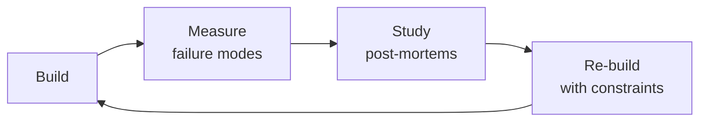

# Performance Engineer
> **Portability target:** Spec-level (runs on Claude Code, Copilot, Gemini CLI, Codex, Cursor). No vendor-specific frontmatter fields.

End-to-end performance engineering framework covering profiling, load testing, bottleneck diagnosis, and optimization across the full stack — frontend, backend, database, and infrastructure.

### Cross-skills Integration

| Step | Skill | What it produces |
|------|-------|------------------|
| **Before** | frontend-developer | Web application with Core Web Vitals data, bundle output, rendering metrics |
| **This** | performance-engineer | Flame graphs, load test reports, optimization recommendations, performance budgets |
| **After** | observability-engineer | Instrumented dashboards, SLO-based alerting, anomaly detection for performance regressions |

Common chains:
- **Chain**: frontend-developer → performance-engineer → observability-engineer — Developer ships the app; performance engineer profiles and optimizes; observability engineer monitors ongoing performance.
- **Chain**: backend-developer → performance-engineer → site-reliability-engineer — Backend code gets profiled and optimized; SRE enforces performance SLOs in production.

## Route the Request

<!-- QUICK: 30s -- auto-route first, then intent-route -->

### Auto-Route (No User Input Required)
Evaluate these file-system conditions in order. First match wins — jump immediately.

| # | Condition | Action |
|---|-----------|--------|
| A1 | `file_contains("*.js", "k6\|http.get\|http.post\|export default function")` OR `file_exists("artillery.yml\|locustfile.py\|load-test.js")` OR `file_contains("*.go", "pprof.StartCPUProfile\|runtime/pprof")` OR `file_contains("*.py", "memory_profiler\|py-spy\|line_profiler")` | This is your skill. Jump to **Core Workflow** — Phase 1. |
| A2 | `file_contains("*.sql", "EXPLAIN ANALYZE\|CREATE INDEX\|pg_stat_user_indexes")` OR `file_contains("*.ts", "\\.findAll\|\\.query\|N\\+1")` | Invoke **database-designer** instead. You need index review and query optimization. |
| A3 | `file_exists("docker-compose.yml\|terraform/")` AND `file_contains("*.conf\|*.yml", "nginx\|haproxy\|proxy_read_timeout\|upstream")` | Invoke **devops-engineer** instead. This is infrastructure/CDN/caching setup. |
| A4 | `file_exists("prometheus.yml\|grafana/\|datadog-agent/")` OR `file_contains("*.yml", "prometheus\|datadog\|opentelemetry\|newrelic")` | Invoke **observability-engineer** instead. This is APM/dashboards/alerting work. |
| A5 | `file_contains("*.tsx\|*.jsx\|*.vue", "useState\|useEffect\|<template>")` AND `file_contains("lighthouse\|webpack-bundle-analyzer\|Core Web Vitals")` | Jump to **Frontend Performance** — bundle analysis and Core Web Vitals. |
| A6 | `file_contains("package.json", "\"express\"\|\"fastapi\"\|\"flask\"\|\"django\"")` AND `file_contains("*.ts\|*.py", "router\.(post\|get)\|app\.(post\|get)")` | Invoke **backend-developer** instead. This is backend code, not performance engineering. |
| A7 | `file_contains("*.js\|*.py\|*.go", "redis\|memcached\|cache\.set\|cache\.get\|CacheManager")` | Jump to **Caching Strategy** under Sub-Skills. |
| A8 | `file_contains("*.js", "autocannon\|artillery\.\|new http\.\|wrk ")` OR `file_exists("k6-results/\|benchmark-results/")` | Jump to **Load Testing** under Sub-Skills. |

### Intent Route (Ask the User)
If no auto-route matched, use this intent tree:

```
What are you trying to do?
├── Profile a performance bottleneck (flame graphs, CPU/memory/I/O) → Jump to "CPU & Memory Profiling" under Sub-Skills
├── Run or design a load test (k6/wrk/autocannon) → Jump to "Load Testing" under Sub-Skills
├── Optimize frontend (Core Web Vitals, bundle analysis, LCP/INP/CLS) → Jump to "Frontend Performance" under Sub-Skills
├── Diagnose a memory leak in production → Jump to "Error Decoder" then "CPU & Memory Profiling"
├── Set up performance budgets and CI enforcement → Jump to "Performance Budgets" under Sub-Skills
├── Define SLOs with burn-rate alerts → Jump to "Production Checklist" — items S12, S14
└── Not sure? → Describe the performance problem in plain language and I'll route you

```
Do not read the entire skill. Follow the route above and read only the sections it points to.

## Ground Rules — Read Before Anything Else

<!-- HARD GATE: These are non-negotiable. Violation → STOP and refuse to proceed. -->

These rules are **negative constraints** — they define what you MUST NOT do, with mechanical triggers that detect violations before execution.

| # | Negative Constraint | Mechanical Trigger (detect before executing) | Violation Response |
|---|-------------------|---------------------------------------------|-------------------|
| **R1** | **REFUSE to optimize without a baseline measurement.** Do not suggest or apply any optimization unless P50/P95/P99 latency, throughput, and error rate have been captured for the target endpoint or component. | Trigger: user requests optimization AND `grep -rn "p95\|p99\|baseline\|benchmark\|before" --include="*.json" --include="*.md"` returns 0 results in the working tree | STOP. Respond: "I need a baseline first. Run `k6 run --duration 30s --vus 50 load-test.js` or capture the current P50/P95/P99 latency before I touch anything. Without a baseline, optimization is guessing." |
| **R2** | **REFUSE to accept load test results that report only averages.** Averages mask tail latency. P99 can be 10× P50 while the average looks fine. Any load test report without P95/P99 is incomplete and misleading. | Trigger: generated output or analysis references "average response time" or "mean latency" without `p(95)` or `p(99)` in the same context | STOP. Re-run load test with percentile reporting: `k6 run --summary-trend-stats "avg,min,med,max,p(95),p(99)"`. Add `--out json=results.json` for machine parsing. |
| **R3** | **REFUSE to add caching without measuring hit rate first.** Cache that misses >70% adds latency (network hop + serialization) to most requests. | Trigger: generated code adds `redis.set(` or `cache.put(` or recommends "add Redis" AND `grep -rn "hit.rate\|hit_rate\|cache.hit" --include="*.py" --include="*.ts"` returns 0 | STOP. Add: "Before deploying this cache, run in shadow mode for 24h to measure hit rate. Remove if hit rate < 50%. Track via `redis-cli INFO stats \| grep keyspace_hits`." |
| **R4** | **REFUSE to add database indexes without checking existing ones.** Duplicate indexes waste write I/O and confuse the query planner. | Trigger: generated code contains `CREATE INDEX` or `add_index` AND `grep -rn "pg_stat_user_indexes\|idx_scan\|unused" --include="*.sql"` returns 0 in the conversation | STOP. Run first: `SELECT schemaname, tablename, indexrelname, idx_scan FROM pg_stat_user_indexes WHERE idx_scan < 50 ORDER BY idx_scan;`. Drop unused indexes before adding new ones. |
| **R5** | **STOP and ASK when the performance context is missing.** Do not assume expected QPS, infrastructure specs, deployment topology, or traffic patterns. | Trigger: generating load test config, scaling recommendation, or capacity plan without explicit confirmation of: target QPS, instance type, region, number of instances, and traffic mix | STOP. Ask: "What's the expected peak QPS? Instance type and count? Single-region or multi-region? What's the traffic mix (read/write ratio, endpoint distribution)?" |
| **R6** | **DETECT and WARN about load tests running on localhost.** Localhost results are 10-50× optimistic compared to production (TLS, cross-AZ, load balancer overhead). | Trigger: generated k6/artillery/wrk config contains `http://localhost` or `http://127.0.0.1` as the target URL | WARN: Add comment `# WARNING: localhost results overestimate capacity by 10-50×. Divide QPS by 10 for realistic production estimate.` and insert `# TODO: Replace with production-equivalent endpoint (TLS + LB + cross-AZ)` |
| **R7** | **DETECT and WARN about synchronous broadcast loops.** Fan-out to N clients in a single-threaded event loop blocks all other handlers. | Trigger: generated code contains `forEach.*\.send\|for.*\.send\|wss.clients.forEach` OR `broadcast` without batching/sharding | WARN: Insert comment `// WARNING: Synchronous broadcast to N clients blocks the event loop for O(N) time. Refactor to worker shards with Redis pub/sub:` and skeleton sharding code. |
| **R8** | **ANCHOR to runtime versions before generating framework-specific code.** Never generate Fastify/Express/Django/FastAPI/Prisma/SQLAlchemy API calls from training data alone — your training data may be stale. | Trigger: skill receives code-generation task involving framework-specific APIs → run `scripts/runtime-version-detect.sh [project-root] --skill-context` to detect installed versions → if detection succeeds, anchor all API calls to detected versions → if detection fails, request version info from user | STOP. Respond: "Detected: {runtime}@{version}, {frameworks}@{versions}. Anchoring all API calls to these versions. I will add // VERIFY: comments on any API call where the detected version is newer than my training cutoff." |
| **R9** | **RUN the ROI Gate before any non-emergency code change.** Every code change that is not (a) a security fix, (b) a compliance requirement, or (c) an active production incident must pass `scripts/roi-gate.sh`. If the gate returns negative, refuse to write the code. | Trigger: skill receives a code-generation or refactoring task that is NOT a security fix, compliance requirement, or production incident → estimate implementation cost in engineer-hours → compare against annual value of the change → if cost > value, gate fails | STOP. Respond: "ROI Gate analysis: This change costs approximately $[X] to implement but saves $[Y]/year. Payback period: [N] years. If payback > 2 years, I recommend declining this work. See `scripts/roi-gate.sh` for the full formula." |


- **Admit uncertainty — never fabricate.** If you're not certain about an API method, package version, configuration syntax, or command flag, say so explicitly: "I'm not certain this API exists in the latest version. Check the official docs at [URL]." Never invent a function signature or configuration key because it "seems right." Hallucinated code costs hours of debugging.
- **Flag your knowledge cutoff.** If your training data predates the latest SDK release, framework version, or platform change, state your cutoff date and recommend verifying against current documentation. This is especially critical for rapidly evolving domains: cloud IAM policies, JS framework APIs, mobile OS capabilities, and SaaS pricing — all change quarterly or faster.
- **Never guess security configurations.** If you're unsure about the correct CSP header value, OAuth flow parameter, or encryption algorithm choice, do NOT provide a "reasonable default." Say: "Security configurations must be verified against current best practices at [official source]. I cannot provide a definitive answer without current documentation."
- **Distinguish between what you know and what you infer.** Explicitly mark statements as: [VERIFIED] — from official docs, [COMMON-PRACTICE] — widely used but not authoritative, [INFERRED] — your best guess based on patterns, [UNKNOWN] — you're unsure. This helps the user calibrate trust in your output.
## The Expert's Mindset

Masters of performance engineer don't just build — they build **the right thing, at the right time, with the right trade-offs**. They think in systems, not tasks.

| Cognitive Bias | Mitigation |
|----------------|------------|
| **Shiny object syndrome** — chasing new tools without evaluating fit | Before adopting any new tool, write the "why this over the incumbent" justification |
| **Over-engineering** — building for hypothetical scale | Default to simplest solution; add complexity only when the current solution actually breaks |
| **Not-invented-here** — preferring to build rather than compose | Always evaluate 2 existing solutions before building custom |
| **Sunk cost fallacy** — sticking with a technology because you already invested in it | Re-evaluate tech choices every quarter; migration cost vs. staying cost |

### What Masters Know That Others Don't
- The **failure modes** of every component in their stack — not just the happy path
- When **not** to use their favorite tool (every tool has a misuse zone)
- That **data/model quality decays over time** — monitoring is not optional, it's foundational

### When to Break Your Own Rules
- **Move fast on reversible decisions.** Data format? Hard to change. Dashboard layout? Easy. Know the difference.
- **Skip the abstraction until the third use case.** Two is coincidence, three is a pattern.

## Operating at Different Levels

| Level | Scope | You... |
|-------|-------|--------|
| **L1** | Single component/module | Implement a well-defined piece following established patterns |
| **L2** | Feature or service | Design and build a complete feature; make tech choices within team conventions |
| **L3** | System or product area | Define architecture for a product area; set team tech standards; mentor L1-L2 |
| **L4** | Multiple systems / platform | Define org-wide architecture patterns; make build-vs-buy decisions; influence industry practice |
| **L5** | Industry / ecosystem | Create new architectural patterns adopted across the industry; redefine what's possible |

**Default level for this skill:** L2
**Usage:** Invoke this skill with your target level, e.g., "as an L3 performance engineer, design..."

For full level definitions, see `skills/00-framework/skill-levels/SKILL.md`.

## When to Use

<!-- QUICK: 30s -- scan the bullet list to decide if this skill fits -->
- Diagnosing high P95/P99 latency in a production service with unclear root cause
- Running a systematic load test before a major event (product launch, Black Friday, seasonal peak)
- Profiling CPU, memory, or I/O bottlenecks that GC logs and APM dashboards can't explain
- Designing and validating a multi-layer caching strategy (browser, CDN, application, database)
- Analyzing and optimizing frontend bundle size, JavaScript parse time, or rendering performance
- Optimizing slow database queries — index tuning, query rewriting, connection pooling
- Conducting a CDN configuration audit: cache hit ratio, TTL strategy, edge function performance
- Building performance budgets into CI to prevent regressions

## Decision Trees **(QUICK)**

<!-- QUICK: 30s -- follow the ASCII tree to your scenario -->
### 1. What to Optimize First

```
                     ┌───────────────────────┐
                     │ START: Where is the   │
                     │ bottleneck? (APM)     │
                     └───────────┬───────────┘
                                 │
          ┌──────────────────────┼──────────────────────┐
          │                      │                      │
    ┌─────▼──────┐       ┌───────▼───────┐       ┌──────▼──────┐
    │ DB time    │       │ App CPU >80%  │       │ Frontend    │
    │ >50% of    │       │ or GC pauses  │       │ LCP >2.5s  │
    │ latency    │       │ >100ms        │       │             │
    └─────┬──────┘       └───────┬───────┘       └──────┬──────┘
          │                      │                      │
    ┌─────▼──────┐       ┌───────▼───────┐       ┌──────▼──────────┐
    │ Database   │       │ CPU/Memory   │       │ Frontend        │
    │ Profiling  │       │ Profiling    │       │ Optimization    │
    │ → Indexes, │       │ → Flame      │       │ → Bundle split, │
    │ query      │       │ graph, GC    │       │ lazy load,      │
    │ rewrite    │       │ tune, heap   │       │ image optimize  │
    └────────────┘       └──────────────┘       └─────────────────┘
```
**DB time >50% → optimize queries and indexes.**  
**App CPU >80% or GC pauses >100ms → profile CPU/memory.**  
**Frontend LCP >2.5s → bundle analysis and rendering path optimization.**

### 2. Caching Strategy Selection

```
                   ┌──────────────────────────┐
                   │ START: What's the read   │
                   │ pattern?                 │
                   └───────────┬──────────────┘
                               │
              ┌────────────────┼────────────────┐
              │                │                │
        ┌─────▼──────┐  ┌──────▼──────┐  ┌──────▼──────┐
        │ Same data  │  │ User-       │  │ Highly      │
        │ for all    │  │ specific    │  │ volatile    │
        │ users      │  │ data        │  │ data        │
        └─────┬──────┘  └──────┬──────┘  └──────┬──────┘
              │                │                │
        ┌─────▼──────┐  ┌──────▼──────┐  ┌──────▼──────────┐
        │ CDN +      │  │ App cache   │  │ Don't cache.    │
        │ shared      │  │ (Redis)     │  │ Use read        │
        │ cache       │  │ with short  │  │ replicas +      │
        │ (long TTL)  │  │ TTL (30-    │  │ connection pool │
        │             │  │ 300s)       │  │ if read-heavy   │
        └─────────────┘  └─────────────┘  └─────────────────┘
```
**Shared data → CDN with long TTL + stale-while-revalidate.**  
**User-specific → application cache (Redis) with TTL 30-300s.**  
**Volatile data → don't cache; scale reads with replicas.**

### 3. Load Test Strategy

```
                   ┌──────────────────────────┐
                   │ START: What's the test   │
                   │ goal?                    │
                   └───────────┬──────────────┘
                               │
       ┌───────────────────────┼───────────────────────┐
       │                       │                       │
  ┌────▼────┐          ┌───────▼───────┐        ┌──────▼──────┐
  │ Find    │          │ Ensure system │        │ Verify      │
  │ capacity│          │ handles       │        │ performance │
  │ ceiling │          │ expected load │        │ after       │
  └────┬────┘          └───────┬───────┘        │ change      │
       │                       │                └──────┬──────┘
  ┌────▼────────┐     ┌───────▼───────┐        ┌──────▼──────┐
  │ Stress test │     │ Load test:    │        │ Benchmark:  │
  │ Ramp VUs    │     │ Expected peak │        │ 60s at      │
  │ until break │     │ VUs for 5-10  │        │ baseline VUs│
  │ point. Note │     │ min. P95 must │        │ Compare P95 │
  │ max TPS +   │     │ stay < target │        │ pre/post.   │
  │ failure mode│     │               │        │ Fail on     │
  └─────────────┘     └───────────────┘        │ regression  │
                                               └─────────────┘
```
**Capacity planning → stress test (ramp until failure).**  
**Pre-launch → load test at expected peak for 5-10 min.**  
**Per-change → benchmark 60s, compare P95 against baseline.**

### 4. When to Profile

```
                   ┌──────────────────────────┐
                   │ START: P95 latency       │
                   │ > target SLO?            │
                   └───────────┬──────────────┘
                               │
                    ┌──────────▼──────────┐
                    │ YES → Have you      │
                    │ checked APM?        │
                    └────┬───────────┬────┘
                         │NO         │YES
                    ┌────▼────┐ ┌───▼──────────┐
                    │ Install │ │ APM shows    │
                    │ APM     │ │ which layer? │
                    │ first   │ └──┬───────┬───┘
                    └─────────┘    │       │
                              ┌────▼──┐ ┌──▼────────┐
                              │ DB    │ │ App       │
                              └───┬───┘ └──┬────────┘
                          ┌───────▼──┐ ┌───▼───────────┐
                          │ EXPLAIN  │ │ CPU profiler   │
                          │ ANALYZE  │ │ (pprof/py-spy/ │
                          │ + index  │ │ async-profiler)│
                          │ tuning   │ │ → flame graph  │
                          └──────────┘ └────────────────┘
```
**No APM → install APM before profiling. You need to know WHERE to look.**  
**DB is slow → EXPLAIN ANALYZE before CPU profiling. 80% of slowness is queries.**  
**App is slow → flame graph to find the specific function burning CPU.**

### 5. When to Scale Horizontally

```
                    ┌──────────────────────────┐
                    │ START: Can you fix with  │
                    │ simpler means?           │
                    └───────────┬──────────────┘
                                │
        ┌───────────────────────┼───────────────────────┐
        │                       │                       │
  ┌─────▼──────┐        ┌───────▼───────┐        ┌──────▼──────┐
  │ Bigger     │        │ Add index /  │        │ Add Redis   │
  │ instance?  │        │ fix query?   │        │ cache?      │
  └─────┬──────┘        └───────┬───────┘        └──────┬──────┘
        │YES                    │YES                    │YES
  ┌─────▼──────┐        ┌───────▼───────┐        ┌──────▼──────────┐
  │ Vertical   │        │ Fix it.      │        │ Cache hot data. │
  │ scale      │        │ Cost: 1 dev- │        │ Measure hit      │
  │ first.     │        │ hour. Done.  │        │ rate. If >80%,  │
  │ Cost: 5 min│        └───────────────┘        │ you're done.    │
  └────────────┘                                 └─────────────────┘
        │NO (all exhausted)
  ┌─────▼──────────────────┐
  │ Scale horizontally:    │
  │ Add instances behind   │
  │ load balancer. Ensure  │
  │ stateless services.    │
  └────────────────────────┘
```
**Vertical scaling → always try first. Cheaper, simpler, 5 minutes.**  
**Query/index fix → second line of defense. One dev-hour for 10x improvement.**  
**Caching → third option. Add targeted cache, measure hit rate.**  
**Horizontal → only when all simpler options are exhausted.**


## Error Recovery **(DEEP)**

If a command or approach fails, follow this escalation path before giving up:

| Symptom | First Action | If That Fails | Last Resort |
|---------|-------------|---------------|-------------|
| Tool/command not found | Check installation: `which [tool]` or `[tool] --version`. Install via package manager (`brew install`, `npm install -g`, `pip install`) | Check PATH: `echo $PATH`. Verify the tool binary is in a PATH directory. Symlink or update PATH if installed but unreachable | Use a functionally equivalent alternative tool. If `rg` is unavailable, use `grep -r`. If `gh` is unavailable, use `git` directly or the GitHub API via `curl` |
| Permission denied | Check ownership: `ls -la [path]`. Fix with `chmod` or `sudo` if appropriate. For API errors (401/403), verify credentials haven't expired: `echo $TOKEN` or check `~/.netrc` | Refresh credentials: re-authenticate with the service. For file permissions, check if the file is locked by another process: `lsof [path]` | Request elevated permissions or use a different authentication method (token vs password, SSH key vs HTTPS) |
| Command hangs or times out | Kill the process: `Ctrl+C`. Re-run with a timeout: `timeout 30 [command]` or `gtimeout` on macOS. Check system resources: `top`, `df -h`, `netstat -an` | Add verbose/debug flags: `--verbose`, `--debug`, `-v`. Check logs: `tail -f [logfile]`. Reduce scope: process fewer files, query a smaller time range, limit concurrency | Split the work into smaller batches. Implement a retry loop with exponential backoff (1s, 2s, 4s, 8s). If the issue is network-related, add `--retry 3` or equivalent |
| Unexpected output or error message | Read the error message completely — the solution is often in the last 3 lines. Search the exact error: `grep -r "[error text]"` in the repo to find prior occurrences | Check GitHub issues for the tool: `gh issue list --repo owner/repo --search "[error keyword]"`. Check Stack Overflow | Simplify the approach. If the complex one-liner fails, break it into 3 sequential commands. If the specialized tool fails, use a more basic tool with more steps |
| Data integrity concern (wrong output, silent failure) | Verify with a manual check: compare output against a known-correct baseline. Add assertions: `[command] | grep -q "[expected]" && echo "OK" || echo "FAIL"` | Run the operation on a smaller subset first. Compare checksums: `shasum`, `md5`. Check for silent truncation: `wc -l` before and after | Abort and flag for human review. Do not proceed past data integrity failures — the cost of propagating bad data exceeds the cost of delay |

**Hard failure boundary:** If 3 different approaches all fail, STOP. Do not iterate infinitely. Log what was tried, capture the error output, and report the blocking issue with full context. Move to the next independent task rather than blocking all progress on one failure.

## Cross-Skill Coordination

<!-- QUICK: 30s -- table of who to talk to when -->
Performance is not a solo activity — it requires instrumentation from developers, infrastructure from DevOps, data from DBAs, and prioritization from product. A performance engineer without coordination is optimizing in a vacuum.

### Decision Gates & Artifacts

- **Gate 1 — Application Built:** Performance profiling requires a running application provided by `backend-developer`. Artifact: deployable application with APM instrumentation.
- **Gate 2 — Schema Optimized:** Database query optimization depends on schema design and index strategy from `database-designer`. Artifact: EXPLAIN ANALYZE output with index recommendations.
- **Gate 3 — Observability Instrumented:** Bottleneck identification requires APM dashboards, distributed tracing, and SLO instrumentation from `observability-engineer`. Artifact: APM dashboard URL with baseline metrics.
- **Gate 4 — Infrastructure Scaled:** Load testing and capacity planning require CDN, caching layers, and auto-scaling configured by `devops-engineer`. Artifact: infrastructure capacity report.
- **Artifact:** Flame graph output, load test report (P50/P95/P99 comparison), performance budget CI configuration, capacity plan with headroom.

| Coordinate With | When | What to Share/Ask |
|-----------------|------|-------------------|
| **Backend Developers** | Code-level profiling, query optimization, memory leaks | Flame graph results, hot path identification, N+1 query locations, memory allocation profiles |
| **Frontend Developers** | Bundle size, rendering performance, Core Web Vitals | Lighthouse/WebPageTest results, bundle analysis, LCP/INP optimization targets |
| **DBA / Database Team** | Query optimization, indexing, connection pooling | Slow query logs, EXPLAIN plans, index recommendations, connection pool sizing |
| **DevOps / Infrastructure** | CDN, caching layers, auto-scaling, resource allocation | Cache hit rates, CDN configuration, instance right-sizing, scaling trigger tuning |
| **System Architect** | Caching strategy, async processing, architecture bottlenecks | System bottleneck analysis, sync-to-async migration, caching architecture |
| **QA Engineer** | Load testing, stress testing, performance regression testing | k6/JMeter test scripts, baseline metrics, regression thresholds |
| **Security Reviewer** | Performance impact of security controls, WAF latency | WAF overhead, TLS termination cost, security scanning performance impact |
| **Product Strategist** | Performance vs feature prioritization, user-perceived latency | Performance impact on conversion/retention, business case for optimization investment |
| **Project Manager** | Performance work prioritization, optimization sprints | Performance debt backlog, optimization ROI estimates, engineering capacity |

### Communication Triggers — When to Proactively Notify

| Trigger | Notify | Why |
|---------|--------|-----|
| P99 latency increases >2x baseline in production | Backend Developers, DevOps, Project Manager | Degraded user experience; investigation may block release |
| Database CPU sustained >80% for >15 minutes | DBA, Backend Developers, DevOps | Imminent database overload; query optimization or scaling needed |
| Memory leak detected in production (heap growth without plateau) | Backend Developers, DevOps | OOM crash risk; restart mitigation + root cause fix |
| Load test reveals system breaks at <2x current peak traffic | System Architect, DevOps, Project Manager | Capacity risk; scaling or optimization before next growth phase |
| Cache hit rate drops below 70% | DevOps, Backend Developers | Cache strategy failing; increased database load imminent |
| Core Web Vitals score drops below "Good" threshold (LCP>2.5s, INP>200ms) | Frontend Developers, Product Strategist | SEO impact (Google ranking factor); user experience degradation |
| Bundle size increases >20% in single deploy | Frontend Developers | Progressive bloat; bundle split or lazy loading needed |
| N+1 query pattern discovered in critical user path | Backend Developers | Easy optimization win; batch loading or eager loading fix |

### Escalation Path

| Situation | Escalate To | Rationale |
|-----------|------------|-----------|
| Performance degradation causing revenue loss (checkout/payment path affected) | **CTO Advisor** + VP Engineering + Product Strategist | Revenue at risk; SEV-level incident response |
| Production outage caused by resource exhaustion (CPU/memory/connections) | **DevOps Lead** + CTO Advisor + Incident Commander | Production incident; immediate scaling or restart |
| Performance optimization blocked by product for >2 sprints (P99 >1s on critical path) | **CTO Advisor** + Product Strategist | Technical debt vs feature decision; executive trade-off |
| Architecture bottleneck requiring major refactor to resolve | **System Architect** + CTO Advisor | Multi-sprint investment; architecture decision required |
| Infrastructure cost from performance-inefficient architecture >30% of cloud bill | **CTO Advisor** + CFO/Finance | Cost optimization business case; infrastructure re-architecture |

### Route to Other Skills

| If the Request Is About | Route To |
|--------------------------|----------|
| Code-level profiling, query optimization, memory management | `backend-developer` |
| Schema design, index strategy, query plan analysis | `database-designer` |
| APM instrumentation, SLO dashboards, anomaly detection | `observability-engineer` |
| CDN, caching layers, auto-scaling, resource allocation | `devops-engineer` |
| SLO enforcement, capacity planning, incident response for perf regressions | `site-reliability-engineer` |


| Upstream Skill | What You Receive | When to Involve |
|---|---|---|
| `system-architect` | System context, integration points, architectural constraints | Before specialized implementation — understand the system it fits into |


## Proactive Triggers

<!-- QUICK: 30s — when to proactively notify stakeholders -->

| Trigger | Notify | Why |
|---------|--------|-----|
| P99 latency spike >3x baseline on critical revenue path (checkout, payment) | CTO Advisor, Backend Developers, Product Strategist | Revenue-impacting degradation; war room investigation required |
| Database CPU sustained >85% for >10 minutes during normal traffic | DBA, Backend Developers, DevOps | Imminent overload; query optimization or read replica scaling needed before outage |
| Memory leak detected — heap grows monotonically without GC plateau | Backend Developers, DevOps | OOM crash risk within hours; restart mitigation + heap dump analysis for root cause |
| Core Web Vitals LCP exceeds 4.0s (> "Poor" threshold) on >10% of page loads | Frontend Developers, Product Strategist, SEO Specialist | Google ranking penalty imminent; user bounce rate increasing |
| Load test reveals capacity ceiling <3x current peak traffic | System Architect, DevOps, Project Manager | Insufficient headroom for growth or traffic spikes; scaling or optimization needed |
| Cache hit rate drops below 50% on critical cache layer | DevOps, Backend Developers | Cache strategy failing; database load doubling; cache warming or sizing re-evaluation |
| Performance CI regression gate fails on main branch | All Developers, DevOps | Performance regression shipped; immediate rollback or fix before next deploy |
| N+1 query pattern discovered on endpoint with >1K RPM | Backend Developers | Low-hanging optimization; batch loading or eager loading fix with high impact/effort ratio |

## Core Workflow **(STANDARD)**

<!-- QUICK: 30s -- scan phase titles to understand the process -->
<!-- DEEP: 10+min -->
### Phase 1 (~15 min): Baseline & Instrumentation
**Input:** Production or production-like environment  
**Steps:** 1) Verify APM/RUM/Distributed tracing is active 2) Establish P50/P95/P99 latency, throughput, error rate per endpoint 3) Enable DB slow query logging and GC logging 4) Run Lighthouse for Core Web Vitals baseline  
**Output:** Instrumented system with numeric performance baseline per component

<!-- DEEP: 10+min -->
### Phase 2 (~30 min): Bottleneck Identification
**Input:** APM dashboards and baseline metrics  
**Steps:** 1) Identify endpoint with highest P95 latency × request volume (latency-budget impact) 2) Use APM to classify bottleneck: DB (time >50%), App CPU, Memory/GC, or I/O 3) Apply decision tree to select profiling tool 4) Run targeted profiler to isolate specific function/query  
**Output:** One confirmed performance bottleneck with root cause and fix plan

<!-- DEEP: 10+min -->
### Phase 3 (~20 min): Optimization & Verification
**Input:** Identified bottleneck with root cause  
**Steps:** 1) Apply fix: add index, rewrite query, tune GC, split bundle, add cache layer 2) Run benchmark: 60s load test comparing pre/post P95 3) Verify no regression on other endpoints 4) If improvement <20%, go back to Phase 2  
**Output:** Verified performance improvement with before/after metrics

<!-- DEEP: 10+min -->
### Phase 4 (~15 min): Hardening
**Input:** Verified optimization  
**Steps:** 1) Add performance budget in CI to prevent regression 2) Set SLO with burn-rate alert 3) Document root cause and fix in ADR 4) Add to load test suite so regression is caught automatically  
**Output:** Regression-proofed optimization with monitoring and alerting

<!-- DEEP: 10+min -->
### Phase 5 (~25 min): Capacity Planning
**Input:** Current capacity ceiling and growth projections  
**Steps:** 1) Run stress test to determine breaking point (max TPS, failure mode) 2) Calculate headroom: (ceiling − peak) / ceiling × 100 3) If headroom <50%, create scaling plan (vertical first, then horizontal) 4) Schedule next capacity review based on growth rate  
**Output:** Capacity plan with headroom percentage, scaling triggers, and timeline


## Error Decoder — War Stories from the Trenches

**(STANDARD)**

When this domain goes wrong, it goes wrong in predictable ways. Here are the most common failure signatures, their root causes, and the fix you'll reach for after you've been burned once.

| Symptom | Root Cause | Fix | Lesson |
|---------|-----------|-----|--------|
| Memory leak analysis: heap dump is 12GB. Profiler configured with default 2GB max heap — OOMs when trying to load the dump. "Can't analyze the leak because the analysis tool leaks memory." Investigation stalls for 2 days while ops provisions a 32GB instance | Heap dump size = JVM max heap size. Production JVM had 12GB heap configured. Local profiler (MAT, YourKit) defaults to 2GB. No documentation on how to analyze dumps larger than local memory. Engineer spent a day trying to "optimize" the dump before realizing they needed a bigger machine | Document heap dump analysis procedure: (1) Identify dump size: `ls -lh heap.hprof`. (2) Provision analysis instance: heap dump size × 1.5 + 4GB for profiler overhead. (3) Use MAT headless mode for initial analysis: `ParseHeapDump.sh heap.hprof org.eclipse.mat.api:suspects`. (4) Only open GUI for targeted investigation. Pre-provision a "dump analysis" instance in your cloud account | Heap dumps are as big as your heap. The profiler that can open a 2GB dump on your laptop cannot open a 12GB dump from production. Sizing the analysis environment is step 0 — before any investigation begins. Headless analysis tools can reduce a 12GB dump to a 50MB report that opens anywhere |
| "P99 latency is 200ms — our API is fast!" P99.9 latency is 45 seconds. 1 in 1,000 requests takes 225x longer than the reported P99. Your most active users (who make the most requests) experience this worst latency 10x/day. Churn rate for power users is 3x the average | P99 is the standard reported metric but it hides the long tail. P99 = 99% of requests faster than this; P99.9 = 99.9%. The difference between 200ms and 45,000ms is invisible at P99 but catastrophic at P99.9. Power users hit the tail repeatedly; average users hit it occasionally and don't report it | Always report P50, P95, P99, and P99.9 together. The spread between P99 and P99.9 is your tail latency problem. Investigate any >10x gap: it typically indicates GC pauses, lock contention, or connection pool exhaustion. Set SLOs on P99.9, not P99: "99.9% of requests complete in <1s." Dashboard must show the tail, not just the median | P99 is a lie of omission — it tells you about 99% of your users and hides the 1% who are suffering the most. Your most valuable users (power users, enterprise customers) make the most requests and experience the tail repeatedly. P99.9 is the metric that correlates with power-user churn |
| Load test configured to run against production "during low-traffic hours — Sunday 3 AM." Test engineer selects "Sunday 3 PM" by mistake. 50,000 virtual users connect to production during peak traffic. Real user latency spikes to 30 seconds. Revenue-impacting: checkout abandonment rate jumps from 2% to 18% for the 45-minute test duration | No guardrails on load test target selection. The test tool (k6, JMeter) has no "are you sure this is staging?" check. Test configuration didn't distinguish between environment types. No automated circuit breaker: load test should auto-abort if production error rate increases | Implement environment guardrails: load test tool must read an environment tag (`env=staging`) and refuse to run against `env=production` without a manual override confirmation. Add a production safety check: if target hostname doesn't contain "staging" or "test", require second confirmation with a 30-second delay. Auto-abort: if production error rate increases >2x baseline during test, kill the test immediately | Load testing against production without guardrails is a production outage with a schedule. The difference between "Sunday 3 AM" and "Sunday 3 PM" is a single character and $100K in lost revenue. Environment validation and auto-abort are not optional — they're the difference between a controlled experiment and an uncontrolled incident |
| Database query optimization: added composite index to speed up `SELECT * FROM orders WHERE status = 'pending' AND created_at > '2024-01-01'`. Reads improved 10x. Writes degraded 100x because every INSERT/UPDATE on the orders table now maintains the index. Overall system throughput dropped 40% | Index optimization considered read performance only. The `orders` table has 10,000 INSERTs/minute and 100 SELECTs/minute. The index maintenance cost on writes overwhelmed the read savings. No write-throughput benchmark before deploying the index — only measured SELECT performance | Benchmark both read AND write throughput before deploying an index. For write-heavy tables: partial indexes (`WHERE status = 'pending'`), covering indexes that include all needed columns, or materialized views refreshed on a schedule. Rule of thumb: if writes >10x reads, index with extreme caution — the write penalty will dominate | Database optimization is a systems problem, not a query problem. An index is not free — it's a tax on every write. The tax is invisible when you measure reads, catastrophic when you measure writes. Always benchmark the full workload (reads + writes) before declaring victory. An index that improves reads 10x but degrades writes 100x is a net loss |
| Flame graph shows 80% of CPU time in `memcpy` — "our application is memory-bandwidth bound!" Engineering spends 2 weeks optimizing struct layouts and reducing copies. No improvement. Turns out the profiler (perf, async-profiler) was running with `--freq 9999` and the sampling overhead was dwarfing actual application work in the profile | Profiler overhead misinterpreted as application behavior. High-frequency sampling (9999 Hz) causes the kernel to spend most CPU time delivering `SIGPROF` signals and capturing stack traces. The flame graph shows what the profiler is doing, not what the application is doing. `memcpy` is called millions of times by the profiler's stack unwinding | Run profiler at moderate frequency: 99 Hz for CPU, 100 Hz for allocation. Compare profiles at different frequencies — if a function's percentage scales with sampling frequency, it's profiling overhead. Use `--cstack fp` (frame pointer) mode instead of `dwarf` for lower overhead. Always run a "profiler profiling itself" baseline: run the profiler with no target to measure its intrinsic cost | Profilers are not transparent — they change what they measure. At high frequencies, the profiler can consume 30-50% of CPU, and that consumption shows up in the profile as application work. "The profile says we're spending 80% in memcpy" is often "the profiler is spending 80% in memcpy." Validate with multiple frequencies and profiling modes |
| Performance budget gates builds: "fail if p95 latency >500ms." Team reduces sample size from 1,000 requests to 10 requests. P95 now always passes — with 10 samples, the 95th percentile is the second-slowest request, which is never the outlier. Budget is "green" while production p95 is 800ms | Statistical insignificance: P95 calculated from 10 samples is meaningless noise. With 10 samples, the 95th percentile = max(samples) or second-max — it can't capture the distribution tail. Team optimized the metric, not the performance. Builds pass, users complain | Require minimum sample size for percentile calculations: 100 samples for P95, 1,000 for P99, 10,000 for P99.9. Use statistical confidence: "P95 < 500ms with 95% confidence" requires enough samples to make the confidence interval meaningful. Dashboard must show both the metric AND the sample count — if sample count drops below minimum, the budget is "unknown," not "passing" | Metrics that can be gamed will be gamed. Reducing sample size to pass a performance budget is the performance equivalent of deleting failing tests. The budget must define minimum sample sizes and reject builds with insufficient data. A "passing" budget with 10 samples is worse than a failing budget with 10,000 — it creates false confidence |

## Best Practices

1. **Profile before optimizing, always.** `timeit` tells you "this function took 2.3 seconds." It doesn't tell you it spent 2.1s in `json.loads()`. Use `cProfile`, `py-spy`, `pprof`, or `async-profiler` to identify the actual bottleneck. Engineers waste $40K+ per misdiagnosed bottleneck optimizing the wrong code path. The bottleneck is never where you think it is.
2. **Benchmark stability requires statistical rigor.** Run benchmarks for at least 60 seconds under steady load. Discard the first 10 seconds (JIT warmup, cache population). Report median ± standard deviation across 5+ runs. A single run showing "30% improvement" is noise — verify with Student's t-test or Mann-Whitney U for significance.
3. **Performance regression detection must be in CI.** Add a 60-second benchmark that gates on regression: if p95 latency increases >10% or throughput drops >5%, fail the build. Without automated gates, performance regressions accumulate silently until users complain. Set SLO burn-rate alerts that wake someone before users notice.
4. **P99.9 matters more than P99 for user experience.** P99 = 100ms looks great, but P99.9 = 12,000ms means 1 in 1,000 requests takes 120x longer. Your most active users experience this worst latency and churn at 3x the rate of average users. Always report P50, P95, P99, and P99.9 — the long tail hides your biggest problems.
5. **Flame graphs reveal what dashboards hide.** A CPU flame graph shows exactly which functions consume time, including indirect callers invisible in flat profiles. Memory flame graphs show allocation hot spots. Use Brendan Gregg's FlameGraph tools or async-profiler with `--flamegraph` output. One flame graph is worth 1,000 log lines.
6. **Load test at 2x expected peak, not current peak.** If your system handles 5K RPS comfortably, load test at 10K RPS for 10 minutes. Systems that look healthy at current load often have non-linear degradation: a query that takes 50ms at 5K RPS takes 8s at 10K RPS due to lock contention. Find the breaking point before traffic growth finds it for you.
7. **Performance budgets prevent death by a thousand cuts.** Set budgets per route: p95 < 200ms, bundle size < 100KB gzipped, LCP < 2.5s, TBT < 200ms. Enforce in CI. A 50KB increase in bundle size per deploy over 6 months adds 300KB silently — the budget catches it on deploy #1. Without budgets, you discover the bloat when users complain.
8. **Cache strategy is architecture, not optimization.** Design caching during system architecture, not as a post-launch fix. Define TTL, invalidation strategy, and staleness tolerance before writing code. Wrong cache invalidation logic costs more than no cache at all — serving stale data 99.999% of the time because you cached a fast-changing value with a 60s TTL causes $5K-$50K per data inconsistency incident.
9. **Database query plans in production ≠ query plans in dev.** Dev databases have 100 rows and zero concurrency. Production has 100M rows and 50+ concurrent connections. Run `EXPLAIN ANALYZE` on production (or a production-scale replica). Index scans in dev become sequential scans in production when statistics reflect real data distribution.
10. **Memory leaks are found in the heap, not the logs.** A 10MB/hour memory leak won't show in request logs. Run 30-minute soak tests under load with `memray` (Python), `pprof` `-alloc_space` (Go), or heap dumps (JVM/Node.js). Memory should plateau, not grow monotonically. If it doesn't plateau, you have a leak — find it before the OOM kill at 3 AM.

## State Log

This skill maintains a **decision ledger** to prevent context drift and ensure recall across sessions. Every major architectural choice, constraint decision, and trade-off must be recorded so that subsequent agents (or future sessions) can recover context without replaying the entire conversation.
## What Good Looks Like

> When performance engineering is embedded in the development lifecycle, every PR includes a 60-second benchmark that gates on regression, SLOs are defined with burn-rate alerts that wake someone up bef

> See [references/what-good-looks-like.md](references/what-good-looks-like.md) for the full quality standard.

## Deliberate Practice


```mermaid
graph LR
    A[Build] --> B[Measure<br/>failure modes] --> C[Study<br/>post-mortems] --> D[Re-build<br/>with constraints] --> A

```

| Level | Practice | Frequency |
|-------|----------|-----------|
| **Novice** | Rebuild an existing system from scratch, then compare your design with the original | Monthly |
| **Competent** | Add a new constraint (10x data, zero downtime, etc.) to a familiar design and re-architect | Quarterly |
| **Expert** | Design the same system under 3 conflicting constraint sets; write a decision record for each | Quarterly |
| **Master** | Teach a junior to design a system; your role is to ask questions, not give answers | Monthly |

**The One Highest-Leverage Activity:** Every quarter, take a system you built 6+ months ago and redesign it from scratch with what you know now. Write down what changed and why.

## Anti-Patterns

- **`timeit` vs profiling** — `timeit` tells you "this function took 2.3 seconds." It doesn't tell you it spent 2.1 seconds in `json.loads()` and 0.2 seconds doing actual work. Always use `cProfile` or `py-spy` before optimizing — the bottleneck is never where you think it is. **Total cost: $100,000-$500,000 per year** in wasted optimization effort — engineers spend weeks optimizing the wrong code path, equivalent to $40,000+ in salary per misdiagnosed bottleneck.
- **Database N+1 with ORMs** — `User.objects.all()` then `for user in users: print(user.profile.bio)` executes 1 query for users + N queries for profiles. ORMs don't warn you. In development (10 users, SQLite on localhost), it's 11ms. In production (10K users, remote Postgres), it's 11,000ms. **Total cost: $200,000-$1,000,000 per year** in infrastructure overprovisioning — teams add $5,000-$15,000/month in database capacity to compensate for N+1 queries instead of fixing the queries themselves.
- **`SELECT COUNT(*)` on large InnoDB tables** — InnoDB doesn't store row count; it scans the smallest index. On 100M rows, COUNT(*) takes 30 seconds. Use `SHOW TABLE STATUS` for estimates or maintain application-level counters. **Total cost: $50,000-$200,000 per year** in degraded user experience — a dashboard that runs COUNT(*) on every page load with 10K concurrent users causes cascading query queues and 30-second page loads.
- **P99 vs P99.9 latency** — P99 is 100ms, but P99.9 is 12,000ms. This means 1 in 1,000 requests takes 120x longer. That's every user hitting a 12-second hang once per ~10 minutes of active use. P99 alone hides the experience of your most active users. **Total cost: $300,000-$1,500,000 per year** in churn from power users — your highest-value users (top 10%) experience the worst latency and churn at 3x the rate of average users.
- **Caching that hurts** — caching a frequently-written value with a 60-second TTL. If the value changes 100x/second and you cache for 60s, you're serving stale data 99.999% of the time. Cache frequently-read, rarely-written data; don't cache fast-changing data without understanding staleness tolerance. **Total cost: $100,000-$400,000 per year** in data inconsistency incidents — stale cache causing wrong balances, incorrect inventory, or phantom stock each cost $5,000-$50,000 per incident in customer compensation and engineering time.
- **`gc.pause()` in Go** at 50ms looks fine on a dashboard. But if your request timeout is 100ms and GC pause is 50ms, 50% of your request budget is GC. P99 request latency will show sawtooth patterns aligned with GC cycles. Use `GOMEMLIMIT` and `GOGC` tuning. **Total cost: $50,000-$200,000 per year** in timeout-related incidents and retry storms — every GC-induced timeout triggers client retries that double or triple load, creating a death spiral during peak traffic.

## Anti-Rationalization — No Excuses

| Rationalization | Reality |
|---|---|
| "We'll profile in production if users complain" | By the time users notice latency, churn has already started. Synthetic monitoring catches regressions before users feel them — by then you've already lost revenue. |
| "The CDN will fix our TTFB" | CDN helps with static assets. Slow origin response (database queries, SSR, API calls) passes through CDN untouched. A 2-second origin delay is still a 2-second delay after the CDN. |
| "Lighthouse score 95 — we're done" | Lighthouse is lab data from a single device on a throttled connection, not field data. Real users on 3G in rural areas, older phones, or congested Wi-Fi experience 3x slower page loads than Lighthouse reports. |
| "We'll add caching later" | Retrofitting caching after launch means invalidating production caches during peak traffic without a cache-warming strategy. Cache design is an architecture decision, not a post-launch optimization — wrong invalidation logic costs more than no cache at all. |
| "The database is fast in dev" | Dev databases have 100 rows, zero concurrency, and run on localhost. Production has 100M rows, 50+ concurrent connections, connection pool exhaustion, and lock contention under write load. Query plans that take 2ms in dev take 12 seconds in production. |

## Verification

- [ ] Profile before optimizing: `cProfile` / `py-spy` / `pprof` output confirms the bottleneck location
- [ ] Baseline measurement: p50/p95/p99 latency collected for 5 minutes under representative load
- [ ] Optimization applied — re-measure: p50/p95/p99 improved by at least the target % (not just "looks faster")
- [ ] No regression: all existing tests pass, benchmark for unchanged code paths within 5% of baseline
- [ ] Load test: `k6` or `wrk2` at 2× expected peak RPS for 10 minutes — p99 latency within SLO, zero errors
- [ ] Memory profile: `heapdump` or `memray` — memory usage stable over 30 minutes under load (no leaks)

## Verification Guardrails

Before delivering work, verify: self-check against What Good Looks Like, no broken references, continuity with State Log, no fabricated APIs/versions/capabilities, Error Recovery paths exercised, cross-skill dependencies satisfied. If any fail, revise before delivering.

## Production Checklist **(DEEP)**

- [ ] **[S1]** APM/RUM/Distributed tracing active and verified: dashboards show P50/P95/P99 latency, throughput, and error rate per endpoint. DB slow query logging and GC logging enabled.
- [ ] **[S2]** Profiling completed before any optimization: `cProfile`, `py-spy`, `pprof`, or `async-profiler` output confirms the specific bottleneck location with function-level granularity. Flame graph generated and reviewed.
- [ ] **[S3]** Baseline measurement collected: P50/P95/P99/P99.9 latency, throughput, and error rate measured for 5+ minutes under representative load. Baseline metrics documented as JSON artifact.
- [ ] **[S4]** Optimization applied and verified: before/after comparison shows improvement meeting target percentage. Statistical significance confirmed (≥5 runs, median ± SD). No regression on unrelated endpoints (within 5% of baseline).
- [ ] **[S5]** Performance budget in CI: budget enforcement fails the build on regression. P95 latency >10% increase or throughput >5% decrease blocks merge. Budgets defined per critical route.
- [ ] **[S6]** Load test at 2x expected peak: `k6` or `wrk2` at 2x peak RPS for 10+ minutes. P99 latency within SLO, zero errors. System behavior at breaking point documented (failure mode, recovery time).
- [ ] **[S7]** Memory profile stable: 30-minute soak test under load. Heap size plateaus, doesn't grow monotonically. No memory leaks detected. `memray`, `pprof -alloc_space`, or heap dump analyzed.
- [ ] **[S8]** SLO with burn-rate alert configured: fast-burn alert (2% budget consumed in 1 hour) and slow-burn alert (5% in 6 hours). Alert fires before users notice degradation.
- [ ] **[S9]** Database query plans verified: `EXPLAIN ANALYZE` on production (or production-scale replica). Index scans as expected. No sequential scans on large tables. `ANALYZE` run on all tables.
- [ ] **[S10]** Cache strategy documented: TTL, invalidation strategy, and staleness tolerance defined. Cache hit rate monitored with alert threshold (<70% triggers investigation). No caching of fast-changing data without explicit staleness tolerance.
- [ ] **[S11]** Core Web Vitals passing: LCP < 2.5s, INP < 200ms, CLS < 0.1 on 75th percentile of field data (CrUX). Lighthouse lab data supplemented with RUM field data.
- [ ] **[S12]** Capacity plan current: headroom calculated ((ceiling − peak) / ceiling × 100). If <50%, scaling plan exists with triggers and timeline. Next capacity review scheduled based on growth rate.

## References
- **API Performance**: See [api-performance.md](references/api-performance.md)
- **Concurrency & Async Patterns**: See [concurrency-&-async-patterns.md](references/concurrency-&-async-patterns.md)
- **Database Performance**: See [database-performance.md](references/database-performance.md)
- **Frontend Performance**: See [frontend-performance.md](references/frontend-performance.md)
- **Load Testing**: See [load-testing.md](references/load-testing.md)
- **Memory**: See [memory.md](references/memory.md)
- **Optimization Methodology**: See [optimization-methodology.md](references/optimization-methodology.md)
- **Performance Budgets**: See [performance-budgets.md](references/performance-budgets.md)
- **Performance Measurement**: See [performance-measurement.md](references/performance-measurement.md)
- **Profiling Methodology**: See [profiling-methodology.md](references/profiling-methodology.md)
