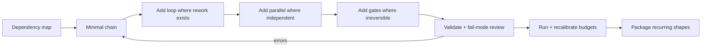

# Workflow Graph Authoring — Composing Skills into Executable Graphs

> **Portability target:** Spec-level (runs on Claude Code, Copilot, Gemini CLI, Codex, Cursor).

Authoring manifests that compose the skill library into graphs: bounded loops, conditional edges,
parallel fan-out with joins, gates, and supervisors. A manifest is the workflow equivalent of a
`SKILL.md` — a reviewable, versioned, executable statement of how a piece of work runs. Canonical
schema: `workflow/schema/workflow-manifest.schema.yaml`; semantics: `WORKFLOW-SYSTEM.md`.

---

## <!-- DEEP: 5+min --> RESEARCH_PREREQUISITE — Execute Before Any Output

**This is a HARD GATE. Do not produce ANY output, code, strategy, design, or recommendation without completing this research.**

Before you act, you MUST execute every applicable research step. Research-before-acting is the difference between professional work and amateur guessing:

| # | Research Step | Why It Matters | Where to Look |
|---|--------------|----------------|----------------|
| **RP1** | **Verify domain currency.** Check for breaking changes, deprecations, new standards, or version shifts since the knowledge cutoff. | [STALE_RISK] Outdated advice breaks real systems. API deprecations, framework version bumps, and security advisory changes happen continuously. Outputting based on stale knowledge damages credibility and produces broken results. | Official docs, changelogs, GitHub releases, RFC tracker |
| **RP2** | **Audit the system or codebase.** Read relevant files. Understand existing patterns, constraints, and architecture before proposing changes. | [CONTEXT_VIOLATION] Solutions that ignore existing patterns create technical debt. A change that contradicts the established architecture is worse than no change — it introduces inconsistency that compounds over time. | Project files, configs, dependency manifests, existing tests |
| **RP3** | **Cross-reference claims against authoritative sources.** Every factual assertion needs a verifiable source. Mark each: [VERIFIED], [COMPUTED], or [ESTIMATED]. | [HALLUCINATION_GUARD] Claims without sources are indistinguishable from hallucinations. The #1 cause of incorrect output is treating assumptions as facts. Source tagging prevents this. | Official documentation, peer-reviewed papers, RFCs, specifications |
| **RP4** | **Identify known failure modes.** Before recommending, list what commonly breaks. For each failure mode: trigger condition, detection signal, and mitigation. | [FAILURE_BLINDNESS] Every domain has known failure patterns. Output that doesn't address them is dangerously incomplete. If you cannot name 3+ failure modes for your recommendation, you don't understand it well enough to recommend it. | Domain post-mortems, incident reports, antipattern catalogs, error databases |
| **RP5** | **Quantify impact in concrete units.** Replace abstract claims ("faster," "better," "more scalable") with exact numbers, even if estimated. | [VAGUENESS_PENALTY] "Faster" is unverifiable. "Reduces p95 latency from 340ms to 120ms (±15ms)" is verifiable. Abstract adjectives hide ignorance behind confidence. Concrete numbers expose gaps. | Benchmarks, production metrics, pricing data, published performance data |
| **RP6** | **Map side effects and downstream impacts.** What else breaks? Which dependencies are affected? Which downstream consumers need updating? | [CASCADE_BLINDNESS] Changes to one component ripple outward. A fix in module A can break module B that depends on A's old behavior. Map the blast radius before acting. | Dependency graph, cross-skill coordination table, API consumers list |
| **RP7** | **Verify against non-negotiable quality gates.** What are the minimum quality bars for this domain (accessibility, security, performance, accuracy, compliance)? | [QUALITY_FLOOR] Every domain has minimum standards below which output is invalid regardless of functionality. Missing WCAG AA = broken. Leaking credentials = broken. Silent data loss = broken. | Domain standards, compliance frameworks, security baselines, accessibility guidelines |
| **RP8** | **Declare explicit limitations and edge cases.** What does this NOT handle? What are the known boundaries? What scenarios are explicitly out of scope? | [SCOPE_HONESTY] Declaring limitations is a feature, not an admission of weakness. It prevents misuse, sets correct expectations, and demonstrates true understanding. Every solution has boundaries — naming them is professional. | This SKILL.md, domain literature, edge case databases |

**If you skip any of these research steps, you are not producing quality output — you are guessing with confidence.** Guessing wastes time, breaks systems, and destroys trust. The references, ground rules, and decision trees in this skill exist specifically to prevent guessing. Use them.

> **Compliance:** Research must be executed before any substantial output. For each step, document findings inline using `[RESEARCHED]` markers: `[RESEARCHED: RP1 — manifest schema v1.0.0 verified against workflow/schema/. No breaking changes since cutoff.]`. Partial research = partial quality. Zero research = zero credibility.

### 🔄 Iterative Research Loop — Re-verify at Every Authoring Decision

Manifest authoring is itself a loop: draft → validate → reason about failure modes → revise. The
RP1-RP8 cycle fires at every decision point below (node selection, loop design, gate placement).
The validator (`scripts/validate-workflows.py`) is your always-on second reader — run it after
every structural change.

| Loop | When It Fires | What Re-research Validates |
|------|--------------|----------------------------|
| **Loop 0: Draft** | Before first manifest output | Skills exist, chain edges plausible, payload registry understood |
| **Loop 1: Per-edit** | After each structural change | References still resolve; no new cycles; write ownership intact |
| **Loop 2: Pre-commit** | Before shipping the manifest | All V1-V9 checks pass; failure modes of each loop/gate named |
| **Loop 3: Post-run** | After a real run of the workflow | Did loop budgets fit reality? Did gates fire where expected? |

## Route the Request
<!-- QUICK: 30s -->

Every request enters through the auto-router. Match intent to the anchor below; if nothing
matches, escalate to human.

### Auto-Route Table (W1-W8)

| ID | Intent Pattern | Route To |
|----|----------------|----------|
| W1 | "make this flow a workflow" / "compose these skills" | [Core Workflow](#core-workflow) |
| W2 | "should this be a loop, a gate, or a chain?" | [Decision Tree 1: Graph Shape](#decision-trees) |
| W3 | "when does this edge fire?" | [Decision Tree 2: Edge Conditions](#decision-trees) |
| W4 | "how do I loop until quality passes?" | [Decision Tree 3: Loop Design](#decision-trees) |
| W5 | "can these run in parallel?" | [Decision Tree 4: Parallel vs. Sequential](#decision-trees) |
| W6 | "do I need a supervisor?" | [Decision Tree 5: Supervisor vs. Flat](#decision-trees) |
| W7 | "validate this manifest" | [Verification](#verification) — run `scripts/validate-workflows.py` |
| W8 | "run this in LangGraph/CrewAI" | LangGraph mapping section in `examples/workflow-runtime/references/langgraph-mapping.md` |

### Intent Route Tree

```
Request to compose skills
    │
    ├── Single skill, no composition? ──► NOT this skill; route to the skill itself
    │
    ├── ≤ 3 sequential nodes, no rework? ──► Simple chain, no loops/gates (keep it minimal)
    │
    ├── Rework expected (review/fix/verify cycles)? ──► Bounded loop with exit_when + budget
    │
    ├── Independent work items? ──► Parallel block with join policy
    │
    ├── Irreversible / human-judgment step? ──► Gate (human)
    │
    └── Cross-domain work needing routing? ──► Supervisor node with workers
```

## Ground Rules — Read Before Anything Else

| # | Negative Constraint | Mechanical Trigger | Violation Response |
|---|---------------------|--------------------|--------------------|
| G1 | **Never ship an unbounded loop.** Every loop has `exit_when`, `max_iterations`, and a resolution for `escalate_to`; if you cannot write the exit condition, you do not understand the loop. | A draft loop lacks exit_when or max_iterations | STOP. Write them, or change the graph shape (Decision Tree 3) |
| G2 | **Never invent a node.** Every `skill:` reference must resolve to a real skill under `skills/`; nodes come from the chain graph and skill descriptions, not from vibes. | You are about to reference a skill you cannot locate | STOP. Use `using-agent-skills`/router to find the real skill; log a coverage gap if none exists |
| G3 | **Never share writers.** Two parallel members writing the same field/artifact is a corruption waiting to happen — static rule, not a style preference. | Parallel members declare overlapping `outputs` | STOP. Re-partition outputs or merge at the join |
| G4 | **Never hand off without a declared payload.** Edges that move real artifacts name a payload from the registry (`payloads:`), so required keys are fixed per edge. | An edge carries artifacts but no payload name | STOP. Register a payload or use the canonical registry defaults |
| G5 | **Never let gates be decorative.** A human gate must have `requires` (what must exist before it fires); an auto gate must have a pass condition and a fallthrough target. | Gate with neither requires nor pass_when | STOP. Define the gate's purpose or delete it |
| G6 | **Never skip validation.** Manifests are checked by code: run `python3 scripts/validate-workflows.py --manifest <file>` before shipping. | You are about to commit an unvalidated manifest | STOP. Run the validator; fix every error |

## The Expert's Mindset

You design graphs that terminate correctly by construction: loops bounded, edges conditioned,
gates purposeful, workers disjoint. You treat the manifest as code — reviewable, lintable,
versioned — not as documentation. You start minimal (a chain) and add shape (loops, parallel,
supervisor) only when the work's dependency structure demands it, because every added construct is
a place failure can hide.

## Operating at Different Levels

| Level | Scope | Autonomy | Impact |
|-------|-------|----------|--------|
| **L1** | Simple chains over existing skills | Follows the manifest template | Linear flows become executable |
| **L2** | Bounded loops + auto gates | Designs exit conditions and budgets | Rework cycles terminate correctly |
| **L3** | Parallel fan-out + joins + human gates | Owns write-ownership and payload design | Correct concurrent execution |
| **L4** | Supervisor routing + typed shared state | Designs routing policies and state schema | Multi-agent graphs run safely |
| **L5** | Framework mapping + library-level graph design | Maps manifests to LangGraph/CrewAI; coaches authors | Whole teams ship executable workflows |

## When to Use

Use when a piece of work needs more than one skill and you want it executable: phased product work
(spec → architecture → build → review), quality loops (review/fix/verify until pass), security
gates before release, or any flow where "did it actually finish" should be checkable rather than
felt.

## When NOT to Use

- **Do NOT use for single-skill tasks** — route to the skill itself.
- **Do NOT use to replace topology expertise** — deep supervisor/peer/swarm trade-offs live in
  `multi-agent-orchestration`; this skill composes, that skill reasons about agent structures.
- **Do NOT use the manifest as a substitute for node contracts** — a manifest over skills in
  default mode works, but skills that declare `workflow:` blocks give you typed artifacts and
  explicit criteria; prefer them for high-value nodes (progressive adoption).

## Core Workflow

Author a manifest in five phases. Estimated times assume a mid-size flow (5-15 nodes).

### Phase 1: Map the Dependency Structure (~15 min)

Before any YAML: draw the work as a dependency graph of artifacts, not skills.

- List the deliverables and their dependency order (what must exist before what).
- For each deliverable, pick the skill whose output produces it — verify it exists (`RP2`, chain
  graph via `scripts/skill-router.py --list`).
- Mark where rework is expected (review → fix → re-review) — those are loop candidates, not chains.
- Mark independent work items — those are parallel candidates.
- Mark irreversible or human-judgment points — those are gate candidates.

### Phase 2: Draft the Shape (~20 min)

Translate the dependency structure into manifest sections, minimal-first:

1. `nodes:` — one entry per deliverable/skill (plus any gates/supervisors). Give every node an id
   that names its role (`spec`, `architect`, `reviewers`, `fixer`).
2. `edges:` — sequential transitions with `when:` conditions only where the transition is not
   automatic (`NODE.status == done`). Omit `when` for unconditional flow.
3. `loops:` — for each rework cycle: `exit_when` on the gatekeeper's verdict, `max_iterations`
   from history (how many passes did this realistically take? add 1), `escalate_to` the fallback.
4. `parallel:` — for independent items: members + `join: all|majority|any`.
5. `gates:` — for irreversible/human points: `requires` + kind.
6. `payloads:` — register handoff payload key sets for edges that carry artifacts.
7. `state:` — only when shared typed state needs explicit merge policy.

### Phase 3: Wire Payloads and Ownership (~10 min)

- Every edge carrying artifacts names a payload; required keys come from the registry
  (WORKFLOW-SYSTEM.md Section 5).
- Check write ownership: for every field/artifact, exactly one writer at a time. Parallel members
  write disjoint fields; the join merges into declared `outputs`.
- Node `inputs`/`outputs` should match what the skill's `workflow:` block declares (or, in default
  mode, what its Verification section implies).

### Phase 4: Validate and Fail-Mode (~10 min)

- Run `python3 scripts/validate-workflows.py --manifest workflow.yaml`; fix all errors (V1-V9).
- For every loop: name its three failure modes (never exits, exits too early, burns budget on
  identical passes) and confirm the manifest handles each (exit condition, evidence discipline,
  convergence window).
- For every gate: confirm it has `requires` (human) or `pass_when` (auto) and a fallthrough.

### Phase 5: Ship and Learn (~5 min)

- Commit manifest next to its workflow directory (`workflow/manifests/` for library-owned flows,
  `examples/…` for demonstrations).
- After the first real run, compare actual iterations vs. `max_iterations` and actual gate fires
  vs. expected; revise the manifest (Loop 3). Budgets that are never touched are noise; budgets
  that always hit are lies.

## Decision Trees

### Decision Tree 1: Graph Shape — Chain vs. Loop vs. Parallel vs. Gate

```
        ┌── INPUT: the flow you want to express
        │
   ┌────┴────────────────────────────────────────┐
   │ Does the work have one natural order with   │
   │ no rework and no independent parts?         │
   └────┬───────────────────────────┬────────────┘
        │ YES                       │ NO
        ▼                           ▼
     CHAIN                    ┌─────┴──────────────────────────────┐
   (nodes + edges)            │ Independent work items exist?     │
                              └─────┬───────────────────┬─────────┘
                                    │ YES               │ NO
                                    ▼                   ▼
                              PARALLEL block      ┌─────┴───────────────┐
                              (disjoint writers,  │ Rework expected     │
                               join policy)       │ (review/fix,        │
                                                  │  verify/revise)?    │
                                                  └─────┬───────────────┘
                                                        │ YES
                                                        ▼
                                                   LOOP (bounded)
                                                        │
                                          ┌─────────────┴──────────────┐
                                          │ irreversible / human       │
                                          │ judgment point in flow?    │
                                          └─────────────┬──────────────┘
                                                        │ YES
                                                        ▼
                                                   GATE (human) on the edge
```

### Decision Tree 2: Edge Conditions

```
        ┌── INPUT: transition A → B
        │
   ┌────┴───────────────┐
   │ Does B only make   │
   │ sense after A      │
   │ succeeds?          │
   └────┬───────────┬───┘
        │           │
      YES           NO
        │           │
   ┌────┴────┐  ┌───┴─────────────────────┐
   │ Does A  │  │ Always valid?           │
   │ have a  │  └────┬───────────────┬────┘
   │ verdict │       │ YES           │ NO
   │ to gate│        ▼               ▼
   │ on?    │    when: always    ┌───┴────────────┐
   └─┬────┬─┘                    │ conditional on │
     │    │                      │ a gate/edge    │
    YES   NO                     │ condition or   │
     │    │                      │ human decision │
   ┌─┴─┐ ┌┴───────┐              └───┬────────────┘
   │   │ │        │                  │
   ▼   ▼ ▼        ▼                  ▼
  when: A.status == done      when: <condition vocabulary only>
  when: A.verdict == pass     anything else = validation error
  (auto)        (auto)
  │
  └── Vocabulary is fixed (WORKFLOW-SYSTEM.md §2.6). If your
      condition is not expressible, the transition is not a simple
      edge — make it a gate or an auto-gate node.
```

### Decision Tree 3: Loop Design

```
        ┌── INPUT: rework cycle R (e.g., review → fix)
        │
   ┌────┴────────────────────────────┐
   │ Who is the gatekeeper — the    │
   │ node whose verdict ends the    │
   │ loop?                          │
   └────┬────────────────────────────┘
        │
        ▼
   exit_when: <gatekeeper>.verdict == <pass value>
        │
   ┌────┴────────────────────────────┐
   │ How many passes did this take   │
   │ historically (or best estimate) │
   └────┬────────────────────────────┘
        │
        ▼
   max_iterations: observed + 1   (never 1 for a genuine loop)
        │
   ┌────┴────────────────────────────┐
   │ What happens at exhaustion?    │
   └────┬────────────────────────────┘
        │
   ┌────┴───────┐
   │ escalate_to│──► a gate (human) or a node that can
   └────────────┘    make the call with full context
        │
   ┌────┴────────────────────────────┐
   │ Stagnation risk? (passes that   │
   │ repeat identical fixes)         │
   └────┬────────────────────────────┘
        │ YES
        ▼
   convergence: { window: 2, require_delta: true }
```

### Decision Tree 4: Parallel vs. Sequential

```
        ┌── INPUT: work items W1..Wn
        │
   ┌────┴──────────────────────────────┐
   │ Share inputs but not writes?      │
   └────┬───────────────────┬──────────┘
        │ YES               │ NO (write same
        ▼                   │  files/fields)
   PARALLEL (disjoint      │
   outputs) + join         ▼
        │            SEQUENTIAL — or restructure
        │            outputs so writers are disjoint
   ┌────┴──────────────┐
   │ join: all — every  │   join: majority — most
   │ member must land   │   agree, tolerate outliers
   │ (reviews, checks)  │
   └────────────────────┘
        │
   ┌────┴──────────────────────────────┐
   │ Costs: parallel ≈ max(latency);   │
   │ sequential ≈ sum(latency) + N×    │
   │ handoff overhead. Parallel only   │
   │ wins if members are independent.  │
   └───────────────────────────────────┘
```

### Decision Tree 5: Supervisor vs. Flat

```
        ┌── INPUT: multiple specialist nodes
        │
   ┌────┴──────────────────────────────┐
   │ One agent can decide which        │
   │ specialist handles each item?     │
   └────┬───────────────────┬──────────┘
        │ YES               │ NO
        ▼                   ▼
   SUPERVISOR node     FLAT graph
   (routing only —     (edges express the
   no content work)    dependencies; no
        │              central router)
   routing:            │
   parallel |          └── Rule: supervisors route,
   sequential |           workers work. If your
   select                "supervisor" would do
        │                content work, it is a
   escalate_to: gate     worker, not a supervisor.
        ▼
   workers write disjoint fields; the supervisor
   owns the outcome of its fan-out and its escalation.
```

## Error Recovery

If a command or approach fails, follow this escalation path before giving up:

| Symptom | First Action | If That Fails | Last Resort |
|---------|-------------|---------------|-------------|
| Validator rejects the manifest | Read the error; it names the rule (V1-V9) — fix that rule | Re-check id slugs and references by hand; skill names must match frontmatter `name` | Simplify the manifest until it validates; add constructs back one at a time |
| Undeclared cycle error | You added a back-edge — declare it as a `loops:` entry instead | Remove the back-edge; express rework through a loop | Restructure: split the rework cycle into its own sub-workflow |
| Parallel write-ownership error | Two members share an output — rename outputs per member | Move merging to the join's declared `outputs` | Convert to sequential nodes with a merge node |
| Skill reference does not resolve | The skill may not exist under that name — search the library | Check `using-agent-skills` / router for the closest real skill | Log a library coverage gap; use the closest skill or a generalist node |
| Loop never seems to exit in practice | Exit condition references the wrong verdict value | Check the gatekeeper's actual verdict vocabulary from its SKILL.md | Ask the domain skill author to standardize the verdict vocabulary |

**Hard failure boundary:** if a manifest cannot be made valid after 3 restructure attempts, STOP and
report the structural problem (the flow may need skills that do not exist yet — that is a coverage
gap worth surfacing, not a manifest hack).

## Cross-Skill Coordination

| Upstream Skill | What You Receive | When to Involve |
|----------------|------------------|-----------------|
| `using-agent-skills` | Skill discovery/routing for node selection | Phase 1 when choosing skills |
| `agent-handoff-protocol` | Payload/context conventions for edges | Phase 3 when wiring payloads |
| `multi-agent-orchestration` | Topology + typed-state guidance | When adding supervisors or shared state |
| `iterative-task-execution` | Loop protocol semantics your loops rely on | Designing exit conditions and budgets |

| Downstream Skill | What You Hand Off | When to Involve |
|------------------|-------------------|-----------------|
| `iterative-task-execution` | Manifests whose nodes must run the loop protocol | When the workflow executes |
| `agent-eval-pipeline` | Manifests + transcripts to assert loop/graph behavior | After first runs |
| `multi-agent-orchestration` | Supervisor graphs needing engine-level state | When mapping to LangGraph/CrewAI |
| `cross-agent-skills-packaging` | Reusable graph shapes worth packaging | When a shape recurs across flows |

## Proactive Triggers

- 🔴 Someone proposes "loop until done" without `max_iterations` → G1; make the budget explicit
- 🔴 A manifest references a skill nobody can find → G2; verify or log the coverage gap
- 🟠 Two parallel nodes touch the same file/field → G3; disjoint writers or merge at join
- 🟠 A human gate with no `requires` → G5; define what must exist before the gate
- 🟡 Same loop shape appearing in 3+ manifests → package it as a reusable pattern
- 🟡 A manifest that validates but whose first run hit max_iterations every time → budget is a lie; recalibrate
- 🟢 A flow is becoming a standard part of delivery → promote its manifest to `workflow/manifests/`

## What Good Looks Like

A manifest reads like a precise spec: an expert can predict exactly how the workflow will run
(which nodes, in what order, under what conditions, with what budgets) without executing it. Every
construct earns its place; nothing is decorative. Validation is clean; failure modes of each loop
and gate are nameable; the first real run's iteration counts match the budgets within one pass.

## Deliberate Practice



| Routine | Frequency | What to practice |
|---------|-----------|------------------|
| Shape autopsy | Every flow you author | Why chain vs loop vs parallel vs gate — write the reasoning |
| Budget calibration | After every real run | Compare actual vs. declared iterations; adjust by +1 rule |
| Fail-mode drill | Every manifest | Name 3 failure modes per loop and confirm the manifest handles them |
| Rewrite a narrative flow | Weekly | Take a prose runbook (e.g., an orchestra-platform phase) and manifest it |

## Gotchas

| Gotcha | Cost | Fix |
|--------|------|-----|
| Unbounded "polish" loop in a creative flow | Budget burned refining past the exit condition — $500-$5,000 per spiral | exit_when on a gatekeeper verdict + convergence window; never polish loops |
| Manifest as documentation — pretty YAML nobody runs | Zero behavioral value, plus $1K-$10K of duplicated hand-orchestration per flow | Validate + run; manifests earn their place by executing |
| Loop over a node that cannot fail the exit (gatekeeper has one verdict) | Loop never fires or always exits — both silently wrong, $2K-$20K in mis-routed work | Check the gatekeeper skill's verdict vocabulary (RP2) |
| Human gate with nothing to review | Humans rubber-stamp; the gate is theater — false approval risk $10K-$100K per release | `requires` must list the artifacts that justify human attention |
| Supervisor that does content work | Bottleneck + duplicate effort — $200-$2,000 per run in redundant tokens | Supervisors route only; content lives in workers |
| Registering payloads nobody enforces | Payload keys drift per edge — handoffs silently lose context over time | Payload registry + validator V8 + runner hash checks |
| Parallel members sharing a config file | Silent last-write-wins corruption — $5K-$50K if it reaches a shared pipeline | Disjoint writers, statically checked (V6) |

## Anti-Patterns

| ❌ Anti-Pattern | ✅ Fix |
|----------------|-------|
| ❌ An unbounded "loop until it feels good" | ✅ Every loop declares exit_when + max_iterations + an exhaustion target before it ships |
| ❌ A node referencing a skill that does not exist | ✅ Every skill reference resolves under `skills/`; missing capability = logged coverage gap, never an invented node |
| ❌ Parallel members writing the same report file | ✅ Disjoint outputs per member; the join owns the merge (validator V6) |
| ❌ A human gate with nothing to review | ✅ Gates declare `requires` artifacts; an empty gate is deleted, not shipped |
| ❌ A manifest nobody runs ("pretty YAML documentation") | ✅ Validated by code and executed by the runner; manifests earn their place by running |

## Anti-Hallucination

- **Admit uncertainty**: if a graph shape or verdict value is ambiguous, say so and confirm from
  the actual skills/schema instead of assuming.
- **Flag your knowledge cutoff**: "My training data ends in [date]. Verify the manifest schema
  (`workflow/schema/`) and skill names against the current repo before shipping."
- **Never guess security**: if a workflow touches authentication, secrets, or compliance gates and
  you are unsure of the controls, refuse to guess and point to the official security/compliance
  guidance for the domain.
- **[VERIFIED]**: mark every definitive claim **[VERIFIED]** when confirmed against the repo or
  docs, and **[BEST-KNOWN]** otherwise.

- **Never invent skills**: every node references a skill you verified exists (RP2). If none
  exists, log the gap — inventing a node invents a capability.
- **Never invent verdict values**: exit conditions reference the gatekeeper's real verdict
  vocabulary; read its SKILL.md before writing `verdict == pass`.
- **Flag version drift**: "My training data ends in [date]. Verify the manifest schema
  (`workflow/schema/`) and skill names against the current repo before shipping."
- **Mark estimates**: `max_iterations` is an estimate — label it `[ESTIMATED]` and recalibrate
  after real runs rather than treating it as fact.

## Best Practices
<!-- QUICK: 30s -->

1. **Start with a dependency map, not a skill list.** Skills are solutions; deliverables and their
   dependencies are the problem. Map artifacts first, then attach skills.
2. **Prefer chains; add shape only where the work demands it.** Every loop, parallel block, and
   supervisor is a failure surface. Minimal is a feature.
3. **One gatekeeper per loop.** The node whose verdict ends the loop must be unambiguous; a loop
   with two gatekeepers has two exit conditions and neither is trusted.
4. **Budget from history, plus one.** If rework realistically takes 2 passes, set 3. Budgets set
   from optimism fail loudly on the first run.
5. **Name nodes by role, not by skill.** `reviewers` (parallel id) and `fixer` survive skill swaps;
   `code-reviewer-node` does not.
6. **Declare payloads for artifact-carrying edges.** Fixed key sets per edge turn handoffs into
   contracts (V8 enforces the names).
7. **Check write ownership at authoring time.** If two live nodes could write the same field, the
   manifest is wrong before it ever runs.
8. **Validate after every structural edit.** The validator is instant; running it late turns one
   error into ten.
9. **Recalibrate after real runs.** A `max_iterations` that never fires and one that always fires
   are both wrong; adjust from evidence (Loop 3).
10. **Promote recurring shapes.** Three identical review-fix loops in different manifests is a
    pattern waiting to be packaged (cross-agent-skills-packaging).

## Production Checklist

Before shipping a workflow manifest, verify:

| # | Check | Verify |
|---|-------|--------|
| CR1 | Nodes resolve | Every `skill:` maps to a real skill under `skills/`; ids are unique, role-named slugs |
| CR2 | Shape is minimal | Every loop/parallel/gate/supervisor has a stated reason from the dependency map |
| CR3 | Loops bounded | Every loop: exit_when + max_iterations + escalate_to; convergence where stagnation is possible |
| CR4 | One gatekeeper per loop | Exit conditions reference a single verdict owner |
| CR5 | Gates purposeful | Human gates list `requires`; auto gates have `pass_when` and a fallthrough |
| CR6 | Writers disjoint | No two live nodes share a write target; joins own the merge |
| CR7 | Payloads registered | Artifact-carrying edges name payloads from the registry |
| CR8 | Conditions in vocabulary | All `when`/`exit_when`/`pass_when` strings pass the vocabulary check |
| CR9 | Validation clean | `python3 scripts/validate-workflows.py --manifest <file>` exits 0 |
| CR10 | Failure modes named | For each loop: never-exits / exits-early / identical-passes all handled |
| CR11 | Budgets honest | Iteration budgets calibrated from history (+1), not optimism |
| CR12 | Start/end unambiguous | `start` explicit when ambiguous; `end` names terminal nodes |
| CR13 | Framework mapping considered | If engine execution is planned, mapping notes exist (LangGraph/CrewAI) |
| CR14 | Coverage gaps logged | Skills the flow needed but the library lacks are surfaced, not invented |

## Verification

| # | Complete when | Verify |
|---|---------------|--------|
| ☐ | Complete when the validator passes the manifest | `python3 scripts/validate-workflows.py --manifest <file>` → exit 0 |
| ☐ | Complete when the validator self-tests still pass | `python3 scripts/validate-workflows.py --selftest` stays green |
| ☐ | Complete when every node is reachable from start | No orphan nodes (validator V9) |
| ☐ | Complete when every loop's exit value is real | Gatekeeper skill's verdict vocabulary matches the manifest |
| ☐ | Complete when the parallel join policy matches intent | join: all for mandatory checks; majority only for redundant opinions |
| ☐ | Complete when handoff payload keys cover downstream needs | Downstream node inputs ⊆ payload keys + upstream outputs |
| ☐ | Complete when gates are purposeful | Human gates list `requires`; auto gates have `pass_when` + fallthrough |
| ☐ | Complete when the flow has been run or dry-run at least once | `scripts/workflow-runner.py` executes the flow end-to-end |

## Verification Guardrails
<!-- QUICK: 30s -->

Run these before declaring the manifest complete. ALL must pass.

| # | Guardrail | Check |
|---|-----------|-------|
| V1 | Structure matches schema | Validator V1-V9 clean |
| V2 | No invented nodes | Every skill reference resolves; gap list empty or surfaced |
| V3 | No unbounded repetition | grep loops → every one has exit_when + max_iterations |
| V4 | No shared writers | Parallel member outputs disjoint (validator V6) |
| V5 | Gates are real | Human gates require artifacts; auto gates have conditions |
| V6 | Conditions are legal | Vocabulary check passed for all when/exit_when/pass_when |
| V7 | Payloads resolve | Payload names registered; keys from the canonical registry |
| V8 | Fail modes handled | Per-loop: never-exits / exits-early / identical-passes |
| V9 | Runs (or dry-runs) clean | `scripts/workflow-runner.py` executes the example end-to-end |

## Anti-Rationalization

| # | Hard Rule |
|---|-----------|
| AR1 | "It's just a simple flow, no need for a manifest" — if it crosses skills, it is a workflow; manifest it. |
| AR2 | "The loop will converge naturally" — convergence is designed (exit_when + budget + delta), not hoped for. |
| AR3 | "This skill probably exists" — verify (RP2). Probably is how invented nodes happen. |
| AR4 | "The human will catch it at the gate" — a gate with nothing to review is theater. |
| AR5 | "It validates, so it's correct" — validation proves structure, not that the loop's exit value matches reality. Run it. |

## State Log

This skill maintains a **decision ledger** of graph-authoring decisions: shapes chosen and why,
budgets calibrated and the run evidence behind them, payloads standardized, and patterns promoted
for packaging. Entries: `{at: <workflow>, what: <decision>, why: <rationale>, by: <node/agent>}`.
This prevents the next author from re-deriving — or contradicting — graph decisions made earlier.

## References

- [manifest-field-reference.md](references/manifest-field-reference.md) — every manifest section
  and field with defaults, constraints, and examples
- [graph-shape-playbook.md](references/graph-shape-playbook.md) — worked shapes: review-fix loop,
  security gate, parallel verification, supervisor review board

### External References

- WORKFLOW-SYSTEM.md (repo root) — canonical L0/L1/L2 semantics and payload registry
- `workflow/schema/workflow-manifest.schema.yaml` — manifest contract
- `scripts/validate-workflows.py` — V1-V9 validator with `--selftest`
- `examples/workflow-runtime/` — flagship manifest + run transcripts + LangGraph mapping

## Error Decoder

| Symptom | Root Cause | Fix | Lesson |
|---------|-----------|-----|--------|
| "Loop" ran once and exited; rework never happened | exit_when referenced a verdict the gatekeeper never produces — condition always true | Read the gatekeeper skill's verdict vocabulary; test the exit condition on a real first pass | An exit condition that never can be false is not an exit condition — it is a skipped loop |
| Workflow burned 20 passes "polishing" | Creative loop without a convergence window; each pass changed something small | convergence: {window: 2, require_delta: true} + budget from history | Polish loops need a delta detector, not a bigger budget |
| Two parallel agents wrote config.yaml; last write won silently | Shared write target missed at authoring | Static disjoint-writer rule (V6) + merge at join | Parallelism is safe only where writes are partitioned |
| Human gate approved an empty diff for a week | Gate had no `requires`; nothing to review | Gate requires artifacts; auto-reject when missing | A gate without inputs is a rubber stamp with a schedule |
| Manifest validated but the run crashed on a missing field | Payload keys and node inputs never reconciled | Payload registry + input/⊆-payload check in verification | Validation proves structure; data flow needs its own check |
| Every run hit max_iterations=3 | Budget set from optimism (hoped 1) | Calibrate from history +1; recalibrate after runs | A budget that always fires is a prediction, not a limit |

## What Good Looks Like (short form)

Manifests are precise, minimal, validated, and calibrated. Loops terminate, gates review real
artifacts, parallel writers never collide, and every construct can justify its existence in one
sentence. The first real run matches the design within one pass.
