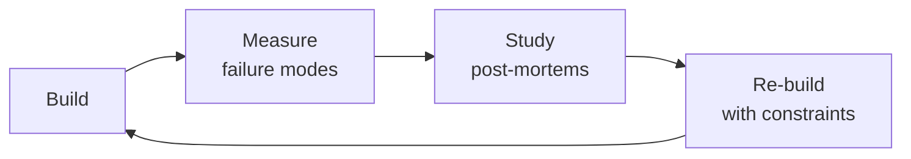

# Algorithmic Trader
> **Portability target:** Spec-level (runs on Claude Code, Copilot, Gemini CLI, Codex, Cursor). No vendor-specific frontmatter fields.

Algorithmic trading strategy development and execution — from signal consumption through position
management to post-trade analysis. This skill is the bridge between quantitative research output
and live market execution. Covers entry/exit/trim strategy design for unusual-options-activity
(UOA) signals, multi-engine backtesting, walk-forward optimization, position sizing across
regimes, broker API integration, order execution algorithms, and portfolio-level risk monitoring.

## Route the Request

<!-- QUICK: 30s -- auto-route first, then intent-route -->

### Auto-Route (No User Input Required)
Evaluate these file-system conditions in order. First match wins — jump immediately.

| # | Condition | Action |
|---|-----------|--------|
| A1 | `file_contains("*.py", "backtrader\|zipline\|vectorbt\|alpaca\|ib_insync")` OR `file_contains("*.py", "class.*Strategy\|def next(self)\|def __init__.*cerebro")` OR `file_exists("backtest.py\|live_trader.py\|execution_engine.py")` | This is your skill. Jump to **Core Workflow** — Phase 1. |
| A2 | `file_contains("*.py\|*.sql", "SELECT.*FROM.*options_flow\|tick_data\|CREATE TABLE.*ticks")` OR `file_contains("docker-compose.yml", "kafka\|redpanda\|timescale")` | Invoke **market-data-engineer** instead. This is data pipeline and storage work. |
| A3 | `file_contains("*.py", "BlackScholes\|black_scholes\|bsm_price\|implied_volatility\|delta\|gamma\|theta")` OR `file_contains("*.py", "scipy.stats.norm\|monte_carlo\|heston")` | Invoke **quantitative-analyst** instead. This is pricing and Greeks analysis. |
| A4 | `file_contains("*.py\|*.sql", "CREATE TABLE.*backtest\|SELECT.*sharpe\|SELECT.*drawdown")` AND `file_contains("*.py", "pandas\|numpy\|sklearn\|statsmodels")` | Invoke **data-scientist** instead. This is statistical validation and backtesting. |
| A5 | `file_contains("*.py", "sklearn\|tensorflow\|torch\|xgboost\|lightgbm\|RandomForest")` OR `file_contains("requirements.txt", "scikit-learn\|tensorflow\|torch")` | Invoke **ml-ai-engineer** instead. This is ML-based signal detection. |
| A6 | `file_contains("*.py\|*.yml", "FastAPI\|flask\|django\|@app\.(get\|post)")` AND `file_contains("*.py", "order\|trade\|fill\|execution")` | Jump to **Core Workflow** — Phase 3 (Broker API Integration). |
| A7 | `file_contains("*.py", "prometheus\|grafana\|alert\|metrics\|pagerduty")` OR `file_exists("prometheus.yml\|grafana/")` | Invoke **observability-engineer** instead. This is monitoring and dashboard work. |
| A8 | `file_contains("*.py", "kafka\|redis\|rabbitmq\|celery\|event.bus")` OR `file_contains("docker-compose.yml", "zookeeper\|kafka\|redis")` | Invoke **system-architect** instead. This is trading system architecture. |

### Intent Route (Ask the User)
If no auto-route matched, use this intent tree:

```
What are you trying to do?
├── Design a trading strategy (entry rules, exit/trim rules, position sizing) → Jump to "Decision Trees" — Entry Strategy Selection
├── Backtest a strategy (vectorized or event-driven, walk-forward validation) → Jump to "Core Workflow" — Phase 6 (Backtesting)
├── Integrate a broker API (Alpaca, IB, Schwab) or design order execution → Jump to "Core Workflow" — Phase 3 (Entry Execution)
├── Set up risk management (position sizing, correlation matrix, circuit breakers) → Jump to "Core Workflow" — Phase 5 (Risk Monitoring)
├── Debug a losing streak or drawdown → Jump to "Error Decoder"
├── Need quantitative signal generation or pricing models → Invoke quantitative-analyst skill instead
└── Not sure? → Describe the trade or problem in plain language and I'll route you
```
Do not read the entire skill. Follow the route above and read only the sections it points to.

## Ground Rules — Read Before Anything Else

<!-- HARD GATE: These are non-negotiable. Violation → STOP and refuse to proceed. -->

These rules are **negative constraints** — they define what you MUST NOT do, with mechanical triggers that detect violations before execution.

| # | Negative Constraint | Mechanical Trigger (detect before executing) | Violation Response |
|---|-------------------|---------------------------------------------|-------------------|
| **R1** | **REFUSE to generate a trade entry without a stop-loss.** Every position must have a predefined exit price before entry. A trade without a stop-loss is not a strategy — it is gambling. | Trigger: generated code creates an order (`order = Order(` or `api.submit_order(` or `create_order(`) without a corresponding `stop_loss` or `stop_price` parameter within 10 lines | STOP. Insert bracket order: `parent_order = Order(symbol, qty, 'buy', 'market'); stop_loss = Order(symbol, qty, 'sell', 'stop', stop_price=entry * (1 - 2*ATR/entry)); take_profit = Order(symbol, qty, 'sell', 'limit', limit_price=entry * 1.05); api.submit_bracket(parent_order, stop_loss, take_profit)` |
| **R2** | **REFUSE to present backtest results without a 30% haircut.** Survivorship bias, look-ahead bias, and in-sample overfitting inflate backtest returns. Always reduce Sharpe, win rate, and CAGR by 30% for realistic forward expectations. | Trigger: generated output reports "Sharpe ratio=X.X" or "CAGR=Y%" or "win rate=Z%" without immediately following text like "haircut" or "adjusted" or "forward estimate" | STOP. Append: "**⚠️ Forward Estimate (30% haircut):** Sharpe ~{X*0.7:.1f}, CAGR ~{Y*0.7:.1f}%, Win Rate ~{Z*0.7:.0f}%. If the strategy does not survive this haircut, it is not production-ready." |
| **R3** | **REFUSE to average down on a losing position.** Adding to a position that is underwater ("the signal was strong") is how accounts blow up. UOA signals have a shelf life — if price moves against you, smart money already exited. | Trigger: generated code adds to an existing position without checking `if position.pnl > 0:` or `if position.unrealized_pnl > 0` before the add | STOP. Insert guard: `if position.unrealized_pnl < 0: logger.warning(f'NOT adding to losing position {symbol}. PnL={position.unrealized_pnl}. Signal ignored.'); return` — Never add to a losing position. |
| **R4** | **REFUSE to ignore position correlation in portfolio sizing.** Five UOA signals on five tickers in the same sector are one leveraged bet. Position-level risk limits are an illusion without daily correlation monitoring. | Trigger: generated portfolio code creates >3 positions without computing `returns.corr()` or `np.corrcoef()` and checking `max_corr > 0.7` | STOP. Insert: `corr_matrix = returns.corr(); high_corr_pairs = [(i,j) for i in corr_matrix.columns for j in corr_matrix.columns if i<j and corr_matrix.loc[i,j] > 0.7]; if high_corr_pairs: logger.warning(f'High correlation pairs: {high_corr_pairs}. Reduce exposure or drop newest positions.')` |
| **R5** | **STOP and ASK when execution context is missing.** Do not size or enter a position without knowing: option chain liquidity, borrow costs, real-time fill data availability, and whether the broker supports bracket orders. | Trigger: generating position sizing or entry code without explicit confirmation of ADV, borrow cost, bid-ask spread, and broker capabilities in the conversation | STOP. Ask: "What's the stock's ADV and option OI? What's the borrow cost for shorts? What's the current bid-ask spread? Does your broker support bracket orders (OCO) natively?" |
| **R6** | **DETECT and WARN about broker API calls without idempotency keys.** Retried orders can double-fill. A rejected bracket order means the stop-loss never activates. Every order submission MUST have idempotency protection. | Trigger: generated code calls `api.submit_order(` or `broker.place_order(` or `create_order(` without an `idempotency_key` or `client_order_id` parameter | WARN: Insert `client_order_id = f"{signal_id}_{datetime.now().strftime('%Y%m%d%H%M%S')}_{uuid.uuid4().hex[:8]}"`. Add comment: `# Idempotency key prevents double-submission on retry. Broker must reject duplicate client_order_id.` |
| **R7** | **DETECT and WARN about backtests that use closing mid-prices for fills.** Mid-prices assume infinite liquidity at zero spread — reality is crossing the spread on every trade. | Trigger: generated backtest code contains `df['close']` or `df['adj_close']` as the fill price without adding/subtracting half the spread: `fill_price = close - spread/2 if sell else close + spread/2` | WARN: Insert `spread = (df['ask'] - df['bid']).mean(); fill_price = df['close'] + np.sign(side) * spread/2`. Add comment: `# WARNING: Using mid-prices overestimates returns by transaction costs. Real fills cross the spread.` |

## The Expert's Mindset

Masters of algorithmic trader don't just build — they build **the right thing, at the right time, with the right trade-offs**. They think in systems, not tasks.

| Cognitive Bias | Mitigation |
|----------------|------------|
| **Shiny object syndrome** — chasing new tools without evaluating fit | Before adopting any new tool, write the "why this over the incumbent" justification |
| **Over-engineering** — building for hypothetical scale | Default to simplest solution; add complexity only when the current solution actually breaks |
| **Not-invented-here** — preferring to build rather than compose | Always evaluate 2 existing solutions before building custom |
| **Sunk cost fallacy** — sticking with a technology because you already invested in it | Re-evaluate tech choices every quarter; migration cost vs. staying cost |

### What Masters Know That Others Don't
- The **failure modes** of every component in their stack — not just the happy path
- When **not** to use their favorite tool (every tool has a misuse zone)
- That **data/model quality decays over time** — monitoring is not optional, it's foundational

### When to Break Your Own Rules
- **Move fast on reversible decisions.** Data format? Hard to change. Dashboard layout? Easy. Know the difference.
- **Skip the abstraction until the third use case.** Two is coincidence, three is a pattern.

## Operating at Different Levels

| Level | Scope | You... |
|-------|-------|--------|
| **L1** | Single component/module | Implement a well-defined piece following established patterns |
| **L2** | Feature or service | Design and build a complete feature; make tech choices within team conventions |
| **L3** | System or product area | Define architecture for a product area; set team tech standards; mentor L1-L2 |
| **L4** | Multiple systems / platform | Define org-wide architecture patterns; make build-vs-buy decisions; influence industry practice |
| **L5** | Industry / ecosystem | Create new architectural patterns adopted across the industry; redefine what's possible |

**Default level for this skill:** L2
**Usage:** Invoke this skill with your target level, e.g., "as an L3 algorithmic trader, design..."

For full level definitions, see `skills/00-framework/skill-levels/SKILL.md`.

## When to Use

<!-- QUICK: 30s -- scan the bullet list to decide if this skill fits -->
- Designing entry, exit, and trim strategies for unusual options activity (UOA) signals
- Building backtesting engines: vectorized (pandas/numpy) for speed or event-driven for realism
- Running walk-forward optimization to validate strategy robustness across market regimes
- Implementing position sizing: Kelly criterion, fixed-fractional, volatility-adjusted, risk-parity
- Integrating with broker APIs: Alpaca (equity/options), Interactive Brokers (TWS/Client Portal), Schwab (trader API)
- Executing orders with minimal market impact: TWAP, VWAP, iceberg, implementation shortfall algorithms
- Building real-time risk dashboards: VaR, CVaR, beta exposure, correlation matrix, max drawdown monitors
- Conducting post-trade analysis: P&L attribution, slippage audit, signal decay analysis, regime detection
- Hardening a strategy for production: circuit breakers, duplicate order prevention, broker reconnect logic

## Decision Trees

<!-- QUICK: 30s -- follow the ASCII tree to your scenario -->

### Entry Strategy Selection for UOA Signals

```
                         ┌──────────────────────────────────┐
                         │ START: UOA Signal Received from   │
                         │ quantitative-analyst pipeline     │
                         └───────────────┬──────────────────┘
                                         │
                       ┌─────────────────▼─────────────────┐
                       │ Signal fired during market hours    │
                       │ AND price is within 1% of VWAP?     │
                       └────┬──────────────────────────┬────┘
                            │ YES                      │ NO
                       ┌────▼────────────────┐   ┌─────▼────────────────────┐
                       │ MOMENTUM ENTRY      │   │ Price extended >2% from    │
                       │ Enter 50% now,      │   │ VWAP or signal at open?    │
                       │ wait for confirmation│   └────┬─────────────────┬────┘
                       │ for remaining 50%   │        │ YES             │ NO
                       └─────────────────────┘   ┌────▼──────────┐ ┌───▼──────────────┐
                                                  │ PULLBACK ENTRY│ │ Signal fired      │
                                                  │ Wait for price │ │ overnight/weekend?│
                                                  │ to touch VWAP  │ │ Gap risk >2%?     │
                                                  │ or 20-EMA.     │ └──┬───────────┬───┘
                                                  │ If it never     │    │YES        │NO
                                                  │ pulls back,     │ ┌──▼──────┐ ┌──▼──────────┐
                                                  │ pass on trade   │ │SPREAD    │ │MOMENTUM     │
                                                  └─────────────────┘ │ENTRY     │ │ENTRY on     │
                                                                      │Use options│ │open with    │
                                                                      │vertical   │ │reduced size │
                                                                      │spread to  │ │(25% of      │
                                                                      │define risk│ │normal)      │
                                                                      │and reduce │ └─────────────┘
                                                                      │capital req│
                                                                      └───────────┘
```

**When to choose Momentum Entry:** Signal fires mid-session, price has not already gapped, confirmation within same day or next day. Best for high-conviction signals with strong volume confirmation. **Risk:** Buying into strength can mean buying the top if signal was a bull trap.

**When to choose Pullback Entry:** Price is extended (RSI > 70 for calls, RSI < 30 for puts) when signal fires. Better risk/reward — entry at VWAP or 20-period EMA reduces slippage and improves fill quality. **Risk:** The move might not pull back; you miss the trade entirely.

**When to choose Spread Entry:** Gap risk exceeds 2% (overnight/weekend signals), account is capital-constrained, or underlying has wide bid-ask spreads. Vertical spreads define max loss and reduce buying power requirement by 60-80%. **Risk:** Capped upside; theta decay works against you on long spreads.

### Exit & Trim Strategy Selection

```
                         ┌──────────────────────────────────┐
                         │ START: Position is live.           │
                         │ When and how do you exit?          │
                         └───────────────┬──────────────────┘
                                         │
                       ┌─────────────────▼─────────────────┐
                       │ Has the position hit +20% gain      │
                       │ on equity?                          │
                       └────┬──────────────────────────┬────┘
                            │ YES                      │ NO
                       ┌────▼────────────────┐   ┌─────▼────────────────────┐
                       │ TIER 2 TRIM:         │   │ Has position been open      │
                       │ Sell 25% at +20%.    │   │ for >5 trading days         │
                       │ Move stop to         │   │ without moving in your      │
                       │ breakeven on         │   │ favor?                      │
                       │ remaining position.  │   └────┬─────────────────┬────┘
                       │ Then check:          │        │ YES             │ NO
                       │ ┌──────────────────┐ │   ┌────▼──────────┐ ┌───▼──────────────┐
                       │ │ Hit +40% or       │ │   │ TIME STOP:    │ │ Has the            │
                       │ │ RSI > 70 daily?   │ │   │ Exit 100%.     │ │ underlying signal   │
                       │ └──┬───────────┬───┘ │   │ Smart money    │ │ logic been          │
                       │    │YES        │NO   │   │ moves within   │ │ invalidated?        │
                       │ ┌──▼──────┐ ┌──▼────┐│   │ days. If price │ │ (e.g., data error,  │
                       │ │TIER 3   │ │HOLD   ││   │ is flat, you   │ │ P/C parity break    │
                       │ │TRIM:    │ │with   ││   │ are in the     │ │ was bogus?)         │
                       │ │Sell 25% │ │trailing││   │ wrong trade.   │ └──┬───────────┬─────┘
                       │ │at +40%  │ │stop    ││   └────────────────┘    │YES        │NO
                       │ │or RSI>70│ │(2x ATR)││                      ┌──▼──────────┐ ┌──▼──────────┐
                       │ │Let last │ └────────┘│                      │SIGNAL       │ │TRAILING STOP│
                       │ │25% run  │           │                      │INVALIDATION:│ │MANAGEMENT:  │
                       │ │to trail │           │                      │Exit 100%    │ │2x ATR trail │
                       │ └─────────┘           │                      │immediately. │ │from entry.  │
                       └───────────────────────┘                      │No hesitation│ │Raise stop   │
                                                                      │First loss   │ │as price     │
                                                                      │is best loss │ │moves up.    │
                                                                      └─────────────┘ └─────────────┘
```

**Tier 1 (Risk-Off Trim):** Sell 25% at +10%. Reduces position risk to breakeven on the remainder. This "free trade" psychology reduces emotional decision-making — you are now playing with the house's money.

**Tier 2 (Scaling Trim):** Sell 25% at +20%. Lock in meaningful profit, reduce exposure by half total. Move stop to breakeven.

**Tier 3 (Runner Trim):** Sell 25% at +40% or when daily RSI > 70 (overbought). Let the final 25% ride until the 2x ATR trailing stop is hit.

**Emergency Trim:** Sell 100% immediately if an unexpected news event invalidates the thesis. No partial exits, no "wait and see." First loss is the smallest loss.

### Order Execution Algorithm Selection

```
                         ┌──────────────────────────────────┐
                         │ START: Entry order needs to be    │
                         │ executed. Choose algorithm.       │
                         └───────────────┬──────────────────┘
                                         │
                       ┌─────────────────▼─────────────────┐
                       │ Order size > 1% of daily volume?    │
                       └────┬──────────────────────────┬────┘
                            │ YES                      │ NO
                       ┌────▼────────────────┐   ┌─────▼────────────────────┐
                       │ Need to minimize      │   │ Is the option spread       │
                       │ market impact.         │   │ >5% of mid-price?          │
                       │ ┌──────────────────┐  │   └────┬─────────────────┬────┘
                       │ │ Urgency?          │  │        │ YES             │ NO
                       │ └──┬───────────┬───┘  │   ┌────▼──────────┐ ┌───▼──────────┐
                       │    │HIGH       │LOW   │   │ICEBERG ORDER  │ │LIMIT ORDER   │
                       │ ┌──▼──────┐ ┌──▼────┐│   │Display only 10%│ │Place at mid   │
                       │ │VWAP     │ │TWAP   ││   │of size. Refresh│ │or slightly    │
                       │ │Minimize │ │Spread ││   │as filled.      │ │favorable.     │
                       │ │slippage │ │over   ││   │Avoid signaling │ │Walk the book  │
                       │ │vs VWAP  │ │time   ││   │large interest. │ │if needed.     │
                       │ │benchmark│ │window ││   └────────────────┘ └───────────────┘
                       │ └─────────┘ └───────┘│
                       └──────────────────────┘
```

**When to use VWAP:** High urgency, large size. Participates with volume — buys more when volume is high, less when it is low. Benchmark is the day's VWAP; a good VWAP algo finishes within 2 bps of the benchmark.

**When to use TWAP:** Lower urgency, can spread over 30-90 minutes. Splits order into equal time slices regardless of volume. Simpler than VWAP, slightly higher slippage in volatile names.

**When to use Iceberg:** Wide spreads (>5% of mid), illiquid options, or when you do not want to reveal full size. Displays only 10-20% of the order; refills the displayed quantity as it gets filled.

## Core Workflow

<!-- QUICK: 30s -- scan phase titles to understand the process -->

<!-- DEEP: 10+min -->
### Phase 1 (~10 min): Signal Reception & Validation

Consume output from the quantitative-analyst pipeline. Every signal must be validated before any capital is committed.

1. **Parse signal envelope**: Extract ticker, direction (CALL=long equity, PUT=short equity), timestamp, conviction score (0.0-1.0), and expected catalyst timeframe from the quantitative-analyst JSON payload.
2. **Liquidity gate**: Check that the underlying trades >500K shares/day and option open interest on the target strike is >1,000 contracts. Illiquid underlyings amplify slippage beyond model assumptions — reject signals on names with average daily volume under 100K.
3. **Correlation gate**: Compare the signal ticker against existing positions. If adding this position would push sector exposure above 30% of portfolio, reduce size or skip. UOA signals cluster — 5 signals in semiconductors is one bet, not five.
4. **News gate**: Scan for pending earnings (within 5 days), FDA decisions, merger votes, or regulatory rulings. Binary event risk trumps any UOA signal. Reduce position size by 50% or skip if an unmodelable event is imminent.
5. **Signal freshness check**: If the signal timestamp is >2 hours old during market hours (or >1 day for overnight signals), check whether the edge has decayed. Compare current price vs. signal price — if the move already happened, the trade is over.

```python
# Signal validation pseudocode
def validate_signal(signal: dict, portfolio: Portfolio, market_data: MarketData) -> SignalDecision:
    if signal['avg_daily_volume'] < 100_000:
        return SignalDecision.REJECT  # insufficient liquidity

    if signal['option_open_interest'] < 1_000:
        return SignalDecision.REJECT

    sector = get_sector(signal['ticker'])
    if portfolio.sector_exposure[sector] + signal['suggested_size'] > 0.30 * portfolio.nav:
        signal['adjusted_size'] = 0.30 * portfolio.nav - portfolio.sector_exposure[sector]
        if signal['adjusted_size'] <= 0:
            return SignalDecision.REJECT  # sector limit reached

    if days_to_earnings(signal['ticker']) <= 5:
        signal['adjusted_size'] *= 0.5

    signal_age_minutes = (datetime.utcnow() - signal['timestamp']).total_seconds() / 60
    if signal_age_minutes > 120:
        price_change = (market_data.last - signal['signal_price']) / signal['signal_price']
        if abs(price_change) > 0.02:  # >2% move already happened
            return SignalDecision.EXPIRED

    return SignalDecision.ACCEPT
```
<!-- DEEP: 10+min -->
### Phase 2 (~15 min): Position Sizing

Translate a validated signal into a concrete share/contract count. Position sizing is where risk management lives — get this wrong and no entry strategy saves you.

> See [references/core-workflow.md](references/core-workflow.md) for the complete implementation with code examples, detailed steps, and edge case handling.

## Cross-Skill Coordination

<!-- QUICK: 30s -- real chains with upstream and downstream skills -->

### Consumes From

| Skill | What It Provides | How This Skill Uses It |
|-------|-----------------|----------------------|
| **quantitative-analyst** | UOA signal JSON: ticker, direction, conviction, expected timeframe, flow metrics (premium, volume, OI change, IV percentile) | Phase 1: Parses signal envelope, validates freshness. Entry decisions are downstream of quant signal quality — garbage signals produce garbage trades regardless of execution quality. Feed signal metadata back to quant-analyst for model improvement. |
| **market-data-engineer** | Clean options flow data, adjusted chains, corporate actions, real-time streaming via Kafka/Redpanda | Phase 1 Pre-flight: Validates that market data pipeline is healthy before consuming signals. **Decision gate:** Is data freshness < 60s? → proceed. Are corporate actions current? → proceed. Otherwise, halt and invoke `market-data-engineer`. **Artifact:** pipeline health check report. |
| **system-architect** | Trading system topology: event bus design, database schema for time-series data, API gateway patterns, failover architecture | Phase 3-5: Execution engine design — how signals flow from quant pipeline → order management → broker API. System-architect defines the reliability patterns (circuit breakers, retry policies, idempotency) that prevent duplicate orders and missed exits. |
| **backend-developer** | Order management system (OMS) API, idempotent order submission endpoints, position tracking service | Phase 3: Consumes order execution specs. **Decision gate:** Are idempotency keys implemented? → proceed. Is OMS circuit breaker tested? → proceed. **Artifact:** OMS integration test report. |
| **observability-engineer** | Prometheus metrics definitions, Grafana dashboard templates, alerting rule thresholds | Phase 5-6: Consumes trading-specific metric requirements. **Decision gate:** Are slippage alerts firing at >50 bps? → calibrate. **Artifact:** trading dashboard JSON + alert config YAML. |

### Feeds Into

| Skill | What It Produces | Coordination |
|-------|-----------------|-------------|
| **backend-developer** | Order management system (OMS), position tracker, broker API client, signal validation service | Phase 3: Provide order execution spec — bracket order logic, idempotency keys, broker-specific API calls for Alpaca/IB/Schwab. Backend-dev implements the execution engine; algorithmic-trader defines the trading logic (entry conditions, stop calculations, trim targets). |
| **frontend-developer** | Real-time P&L dashboard, position monitor, risk metrics UI, order entry interface | Phase 5: Provide dashboard requirements — VaR, CVaR, beta, correlation heatmap, drawdown chart. Frontend-dev builds the visualization; algorithmic-trader defines what metrics matter and at what refresh rate (1-second for positions, 1-minute for risk). |
| **observability-engineer** | Prometheus metrics, Grafana dashboards, alerting rules, log aggregation pipeline | Phase 5-6: Define trading-specific metrics: fill slippage (bps), signal-to-execution latency (ms), order rejection rate, position count, margin utilization. Observability-engineer builds the dashboards; algorithmic-trader defines alert thresholds (e.g., slippage >50 bps triggers investigation). |

### Alternatives

| Skill | When to Use Instead |
|-------|-------------------|
| **ml-ai-engineer** | When signals are ML-generated (LSTM price predictions, NLP on earnings calls, GNN on options flow networks) rather than rule-based UOA patterns. ML-engineer builds the signal model; algorithmic-trader still handles execution, but the entry logic must accommodate probabilistic (not binary) signals with confidence intervals. |

### Coordination Table

| Trigger | Notify | Why |
|---------|--------|-----|
| Signal pipeline delivers UOA alert | algorithmic-trader + backend-developer | Validate signal → size position → submit order within 60 seconds |
| Order rejected by broker API | backend-developer + algorithmic-trader | Check buying power, position limits, symbol tradability; retry or skip |
| Circuit breaker triggered (-20% drawdown) | algorithmic-trader + observability-engineer + security-engineer | Halt trading, investigate cause, review strategy before resuming |
| Slippage exceeds 2x model estimate | observability-engineer + algorithmic-trader | Recalibrate slippage model; may indicate strategy decay or market regime change |
| Portfolio correlation spikes above 0.7 | algorithmic-trader + quantitative-analyst | Reduce correlated positions; review whether UOA signals are truly independent |

### Integration Chain

```bash
# UOA signal → Strategy execution → Dashboard update
/quantitative-analyst && /algorithmic-trader && /frontend-developer

# Strategy design → Backend implementation → Production monitoring
/system-architect && /algorithmic-trader && /backend-developer && /observability-engineer

# ML signal generation → Trade execution with confidence intervals
/ml-ai-engineer && /algorithmic-trader
```

## Proactive Triggers

<!-- QUICK: 30s -- when to proactively notify stakeholders -->

| Trigger | Notify | Why |
|---------|--------|-----|
| Portfolio drawdown exceeds 10% intraday | algorithmic-trader + observability-engineer | Approaching circuit breaker territory; review open positions for correlated losses, prepare for potential partial liquidation before -20% breaker triggers |
| Signal-to-execution latency exceeds 60 seconds for 3+ consecutive signals | backend-developer + market-data-engineer | Stale signals being traded — pipeline bottleneck or data feed degradation; halt new entries until latency restored below threshold |
| Slippage exceeds 1.5x model estimate for 3 consecutive fills | observability-engineer + backend-developer | Execution quality degrading — possible market impact, liquidity drain, or broker routing change; recalibrate slippage model before next session |
| Paper clone P&L diverges >2% from live P&L over trailing 5 days | algorithmic-trader + backend-developer | Execution fidelity problem — live fills not matching modeled fills; investigate broker routing, market impact, or latency not captured in backtest |
| Correlation matrix shows >50% in single factor bucket | algorithmic-trader + quantitative-analyst | Concentration risk — multiple "independent" signals are the same directional bet; reduce newest correlated positions immediately |
| Broker API returns 3+ consecutive order rejections within 5 minutes | backend-developer + algorithmic-trader | Possible buying power issue, symbol restriction, or API authentication failure; halt all trading until root cause identified and resolved |
| Strategy win rate drops below 40% on 30-day rolling window | quantitative-analyst + algorithmic-trader | Strategy decay or market regime change; reduce position sizes by 50% until backtest confirms parameters are still valid in current regime |
| VIX spikes >30 while holding net-long Vega positions | algorithmic-trader + observability-engineer | Volatility regime change — Vega exposure may dominate Delta P&L; review all position Greeks, hedge ratios, and correlation assumptions immediately |

## What Good Looks Like

A production algorithmic trading system that executes this skill correctly has these observable characteristics:

- **Signal-to-execution latency under 60 seconds.** From the moment the quantitative-analyst pipeline emits a signal to the moment a bracket order is resting at the broker. Stale signals are worse than no signals — a UOA alert from 30 minutes ago is already priced in.

- **Every order is a bracket order.** No naked market orders. Every entry comes with a stop-loss and at least one take-profit target attached at submission time. The broker holds the OCO (one-cancels-other) bracket — if the connection drops, protection is still live at the exchange.

- **Position sizing is deterministic, not emotional.** The sizing formula produces the same share count for the same signal and account state every time. No "I have a good feeling about this one" adjustments. The Kelly/fixed-fractional formula is codified and unit-tested — regression tests verify that a $100K account with signal X always produces Y shares.

- **Drawdown never surprises you.** The max drawdown monitor updates in real time. At -10% from peak, it automatically reduces new position sizes by 50%. At -15%, it sends an alert. At -20%, it liquidates everything. These thresholds are hardcoded and cannot be overridden without a code change and deployment — no "override breaker" button exists.

- **You can trace any P&L dollar to its source signal.** Structured logs with correlation IDs mean that when a trade loses $500, you can query: which quant-analyst signal generated it, what was the conviction score, what entry strategy was used, what was the fill slippage, and which exit rule triggered. Every losing trade is a learning opportunity because every trade is fully instrumented.

- **The paper clone tracks within 2% of live.** If the paper account (same signals, same sizing, same timing, but fills at mid-price) diverges from live P&L by more than 2% over any rolling 20-trade window, an alert fires. Divergence means your slippage model is wrong or you are getting worse fills than expected — fix execution, not strategy.

- **No single sector or factor can destroy the account.** The correlation matrix runs daily before market open. If any sector exceeds 30% of NAV, the smallest position in that sector is reduced or closed. Diversification is enforced by code, not discipline — discipline fails under stress; code does not.

## Deliberate Practice



| Level | Practice | Frequency |
|-------|----------|-----------|
| **Novice** | Rebuild an existing system from scratch, then compare your design with the original | Monthly |
| **Competent** | Add a new constraint (10x data, zero downtime, etc.) to a familiar design and re-architect | Quarterly |
| **Expert** | Design the same system under 3 conflicting constraint sets; write a decision record for each | Quarterly |
| **Master** | Teach a junior to design a system; your role is to ask questions, not give answers | Monthly |

**The One Highest-Leverage Activity:** Every quarter, take a system you built 6+ months ago and redesign it from scratch with what you know now. Write down what changed and why.

## References

Detailed reference material loaded on demand:

- **Core Workflow — Full Implementation**: See [core-workflow.md](references/core-workflow.md)
- **Anti-Patterns**: See [anti-patterns.md](references/anti-patterns.md)
- **Best Practices**: See [best-practices.md](references/best-practices.md)
- **Calibration — How to Know Your Level**: See [calibration.md](references/calibration.md)
- **Production Checklist**: See [checklist.md](references/checklist.md)
- **Error Decoder**: See [error-decoder.md](references/error-decoder.md)
- **Footguns**: See [footguns.md](references/footguns.md)
- **Scale Depth**: See [scale-depth.md](references/scale-depth.md)

