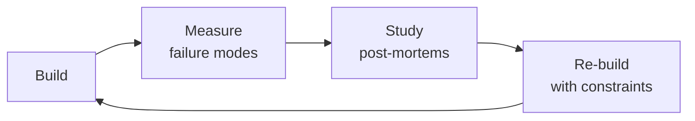

# Algorithmic Trader

Algorithmic trading strategy development and execution — from signal consumption through position
management to post-trade analysis. This skill is the bridge between quantitative research output
and live market execution. Covers entry/exit/trim strategy design for unusual-options-activity
(UOA) signals, multi-engine backtesting, walk-forward optimization, position sizing across
regimes, broker API integration, order execution algorithms, and portfolio-level risk monitoring.

## Route the Request
<!-- QUICK: 30s -- auto-route first, then intent-route -->

### Auto-Route (No User Input Required)
Evaluate these file-system conditions in order. First match wins — jump immediately.

| # | Condition | Action |
|---|-----------|--------|
| A1 | `file_contains("*.py", "backtrader\|zipline\|vectorbt\|alpaca\|ib_insync")` OR `file_contains("*.py", "class.*Strategy\|def next(self)\|def __init__.*cerebro")` OR `file_exists("backtest.py\|live_trader.py\|execution_engine.py")` | This is your skill. Jump to **Core Workflow** — Phase 1. |
| A2 | `file_contains("*.py\|*.sql", "SELECT.*FROM.*options_flow\|tick_data\|CREATE TABLE.*ticks")` OR `file_contains("docker-compose.yml", "kafka\|redpanda\|timescale")` | Invoke **market-data-engineer** instead. This is data pipeline and storage work. |
| A3 | `file_contains("*.py", "BlackScholes\|black_scholes\|bsm_price\|implied_volatility\|delta\|gamma\|theta")` OR `file_contains("*.py", "scipy.stats.norm\|monte_carlo\|heston")` | Invoke **quantitative-analyst** instead. This is pricing and Greeks analysis. |
| A4 | `file_contains("*.py\|*.sql", "CREATE TABLE.*backtest\|SELECT.*sharpe\|SELECT.*drawdown")` AND `file_contains("*.py", "pandas\|numpy\|sklearn\|statsmodels")` | Invoke **data-scientist** instead. This is statistical validation and backtesting. |
| A5 | `file_contains("*.py", "sklearn\|tensorflow\|torch\|xgboost\|lightgbm\|RandomForest")` OR `file_contains("requirements.txt", "scikit-learn\|tensorflow\|torch")` | Invoke **ml-ai-engineer** instead. This is ML-based signal detection. |
| A6 | `file_contains("*.py\|*.yml", "FastAPI\|flask\|django\|@app\.(get\|post)")` AND `file_contains("*.py", "order\|trade\|fill\|execution")` | Jump to **Core Workflow** — Phase 3 (Broker API Integration). |
| A7 | `file_contains("*.py", "prometheus\|grafana\|alert\|metrics\|pagerduty")` OR `file_exists("prometheus.yml\|grafana/")` | Invoke **observability-engineer** instead. This is monitoring and dashboard work. |
| A8 | `file_contains("*.py", "kafka\|redis\|rabbitmq\|celery\|event.bus")` OR `file_contains("docker-compose.yml", "zookeeper\|kafka\|redis")` | Invoke **system-architect** instead. This is trading system architecture. |

### Intent Route (Ask the User)
If no auto-route matched, use this intent tree:

```
What are you trying to do?
├── Design a trading strategy (entry rules, exit/trim rules, position sizing) → Jump to "Decision Trees" — Entry Strategy Selection
├── Backtest a strategy (vectorized or event-driven, walk-forward validation) → Jump to "Core Workflow" — Phase 6 (Backtesting)
├── Integrate a broker API (Alpaca, IB, Schwab) or design order execution → Jump to "Core Workflow" — Phase 3 (Entry Execution)
├── Set up risk management (position sizing, correlation matrix, circuit breakers) → Jump to "Core Workflow" — Phase 5 (Risk Monitoring)
├── Debug a losing streak or drawdown → Jump to "Error Decoder"
├── Need quantitative signal generation or pricing models → Invoke quantitative-analyst skill instead
└── Not sure? → Describe the trade or problem in plain language and I'll route you
```
Do not read the entire skill. Follow the route above and read only the sections it points to.
## Ground Rules — Read Before Anything Else
<!-- HARD GATE: These are non-negotiable. Violation → STOP and refuse to proceed. -->

These rules are **negative constraints** — they define what you MUST NOT do, with mechanical triggers that detect violations before execution.

| # | Negative Constraint | Mechanical Trigger (detect before executing) | Violation Response |
|---|-------------------|---------------------------------------------|-------------------|
| **R1** | **REFUSE to generate a trade entry without a stop-loss.** Every position must have a predefined exit price before entry. A trade without a stop-loss is not a strategy — it is gambling. | Trigger: generated code creates an order (`order = Order(` or `api.submit_order(` or `create_order(`) without a corresponding `stop_loss` or `stop_price` parameter within 10 lines | STOP. Insert bracket order: `parent_order = Order(symbol, qty, 'buy', 'market'); stop_loss = Order(symbol, qty, 'sell', 'stop', stop_price=entry * (1 - 2*ATR/entry)); take_profit = Order(symbol, qty, 'sell', 'limit', limit_price=entry * 1.05); api.submit_bracket(parent_order, stop_loss, take_profit)` |
| **R2** | **REFUSE to present backtest results without a 30% haircut.** Survivorship bias, look-ahead bias, and in-sample overfitting inflate backtest returns. Always reduce Sharpe, win rate, and CAGR by 30% for realistic forward expectations. | Trigger: generated output reports "Sharpe ratio=X.X" or "CAGR=Y%" or "win rate=Z%" without immediately following text like "haircut" or "adjusted" or "forward estimate" | STOP. Append: "**⚠️ Forward Estimate (30% haircut):** Sharpe ~{X*0.7:.1f}, CAGR ~{Y*0.7:.1f}%, Win Rate ~{Z*0.7:.0f}%. If the strategy does not survive this haircut, it is not production-ready." |
| **R3** | **REFUSE to average down on a losing position.** Adding to a position that is underwater ("the signal was strong") is how accounts blow up. UOA signals have a shelf life — if price moves against you, smart money already exited. | Trigger: generated code adds to an existing position without checking `if position.pnl > 0:` or `if position.unrealized_pnl > 0` before the add | STOP. Insert guard: `if position.unrealized_pnl < 0: logger.warning(f'NOT adding to losing position {symbol}. PnL={position.unrealized_pnl}. Signal ignored.'); return` — Never add to a losing position. |
| **R4** | **REFUSE to ignore position correlation in portfolio sizing.** Five UOA signals on five tickers in the same sector are one leveraged bet. Position-level risk limits are an illusion without daily correlation monitoring. | Trigger: generated portfolio code creates >3 positions without computing `returns.corr()` or `np.corrcoef()` and checking `max_corr > 0.7` | STOP. Insert: `corr_matrix = returns.corr(); high_corr_pairs = [(i,j) for i in corr_matrix.columns for j in corr_matrix.columns if i<j and corr_matrix.loc[i,j] > 0.7]; if high_corr_pairs: logger.warning(f'High correlation pairs: {high_corr_pairs}. Reduce exposure or drop newest positions.')` |
| **R5** | **STOP and ASK when execution context is missing.** Do not size or enter a position without knowing: option chain liquidity, borrow costs, real-time fill data availability, and whether the broker supports bracket orders. | Trigger: generating position sizing or entry code without explicit confirmation of ADV, borrow cost, bid-ask spread, and broker capabilities in the conversation | STOP. Ask: "What's the stock's ADV and option OI? What's the borrow cost for shorts? What's the current bid-ask spread? Does your broker support bracket orders (OCO) natively?" |
| **R6** | **DETECT and WARN about broker API calls without idempotency keys.** Retried orders can double-fill. A rejected bracket order means the stop-loss never activates. Every order submission MUST have idempotency protection. | Trigger: generated code calls `api.submit_order(` or `broker.place_order(` or `create_order(` without an `idempotency_key` or `client_order_id` parameter | WARN: Insert `client_order_id = f"{signal_id}_{datetime.now().strftime('%Y%m%d%H%M%S')}_{uuid.uuid4().hex[:8]}"`. Add comment: `# Idempotency key prevents double-submission on retry. Broker must reject duplicate client_order_id.` |
| **R7** | **DETECT and WARN about backtests that use closing mid-prices for fills.** Mid-prices assume infinite liquidity at zero spread — reality is crossing the spread on every trade. | Trigger: generated backtest code contains `df['close']` or `df['adj_close']` as the fill price without adding/subtracting half the spread: `fill_price = close - spread/2 if sell else close + spread/2` | WARN: Insert `spread = (df['ask'] - df['bid']).mean(); fill_price = df['close'] + np.sign(side) * spread/2`. Add comment: `# WARNING: Using mid-prices overestimates returns by transaction costs. Real fills cross the spread.` |


## The Expert's Mindset

Masters of algorithmic trader don't just build — they build **the right thing, at the right time, with the right trade-offs**. They think in systems, not tasks.

| Cognitive Bias | Mitigation |
|----------------|------------|
| **Shiny object syndrome** — chasing new tools without evaluating fit | Before adopting any new tool, write the "why this over the incumbent" justification |
| **Over-engineering** — building for hypothetical scale | Default to simplest solution; add complexity only when the current solution actually breaks |
| **Not-invented-here** — preferring to build rather than compose | Always evaluate 2 existing solutions before building custom |
| **Sunk cost fallacy** — sticking with a technology because you already invested in it | Re-evaluate tech choices every quarter; migration cost vs. staying cost |

### What Masters Know That Others Don't
- The **failure modes** of every component in their stack — not just the happy path
- When **not** to use their favorite tool (every tool has a misuse zone)
- That **data/model quality decays over time** — monitoring is not optional, it's foundational

### When to Break Your Own Rules
- **Move fast on reversible decisions.** Data format? Hard to change. Dashboard layout? Easy. Know the difference.
- **Skip the abstraction until the third use case.** Two is coincidence, three is a pattern.
## Operating at Different Levels

| Level | Scope | You... |
|-------|-------|--------|
| **L1** | Single component/module | Implement a well-defined piece following established patterns |
| **L2** | Feature or service | Design and build a complete feature; make tech choices within team conventions |
| **L3** | System or product area | Define architecture for a product area; set team tech standards; mentor L1-L2 |
| **L4** | Multiple systems / platform | Define org-wide architecture patterns; make build-vs-buy decisions; influence industry practice |
| **L5** | Industry / ecosystem | Create new architectural patterns adopted across the industry; redefine what's possible |

**Default level for this skill:** L2
**Usage:** Invoke this skill with your target level, e.g., "as an L3 algorithmic trader, design..."

For full level definitions, see `skills/00-framework/skill-levels/SKILL.md`.

## When to Use
<!-- QUICK: 30s -- scan the bullet list to decide if this skill fits -->
- Designing entry, exit, and trim strategies for unusual options activity (UOA) signals
- Building backtesting engines: vectorized (pandas/numpy) for speed or event-driven for realism
- Running walk-forward optimization to validate strategy robustness across market regimes
- Implementing position sizing: Kelly criterion, fixed-fractional, volatility-adjusted, risk-parity
- Integrating with broker APIs: Alpaca (equity/options), Interactive Brokers (TWS/Client Portal), Schwab (trader API)
- Executing orders with minimal market impact: TWAP, VWAP, iceberg, implementation shortfall algorithms
- Building real-time risk dashboards: VaR, CVaR, beta exposure, correlation matrix, max drawdown monitors
- Conducting post-trade analysis: P&L attribution, slippage audit, signal decay analysis, regime detection
- Hardening a strategy for production: circuit breakers, duplicate order prevention, broker reconnect logic
## Decision Trees
<!-- QUICK: 30s -- follow the ASCII tree to your scenario -->

### Entry Strategy Selection for UOA Signals

```
                         ┌──────────────────────────────────┐
                         │ START: UOA Signal Received from   │
                         │ quantitative-analyst pipeline     │
                         └───────────────┬──────────────────┘
                                         │
                       ┌─────────────────▼─────────────────┐
                       │ Signal fired during market hours    │
                       │ AND price is within 1% of VWAP?     │
                       └────┬──────────────────────────┬────┘
                            │ YES                      │ NO
                       ┌────▼────────────────┐   ┌─────▼────────────────────┐
                       │ MOMENTUM ENTRY      │   │ Price extended >2% from    │
                       │ Enter 50% now,      │   │ VWAP or signal at open?    │
                       │ wait for confirmation│   └────┬─────────────────┬────┘
                       │ for remaining 50%   │        │ YES             │ NO
                       └─────────────────────┘   ┌────▼──────────┐ ┌───▼──────────────┐
                                                  │ PULLBACK ENTRY│ │ Signal fired      │
                                                  │ Wait for price │ │ overnight/weekend?│
                                                  │ to touch VWAP  │ │ Gap risk >2%?     │
                                                  │ or 20-EMA.     │ └──┬───────────┬───┘
                                                  │ If it never     │    │YES        │NO
                                                  │ pulls back,     │ ┌──▼──────┐ ┌──▼──────────┐
                                                  │ pass on trade   │ │SPREAD    │ │MOMENTUM     │
                                                  └─────────────────┘ │ENTRY     │ │ENTRY on     │
                                                                      │Use options│ │open with    │
                                                                      │vertical   │ │reduced size │
                                                                      │spread to  │ │(25% of      │
                                                                      │define risk│ │normal)      │
                                                                      │and reduce │ └─────────────┘
                                                                      │capital req│
                                                                      └───────────┘
```

**When to choose Momentum Entry:** Signal fires mid-session, price has not already gapped, confirmation within same day or next day. Best for high-conviction signals with strong volume confirmation. **Risk:** Buying into strength can mean buying the top if signal was a bull trap.

**When to choose Pullback Entry:** Price is extended (RSI > 70 for calls, RSI < 30 for puts) when signal fires. Better risk/reward — entry at VWAP or 20-period EMA reduces slippage and improves fill quality. **Risk:** The move might not pull back; you miss the trade entirely.

**When to choose Spread Entry:** Gap risk exceeds 2% (overnight/weekend signals), account is capital-constrained, or underlying has wide bid-ask spreads. Vertical spreads define max loss and reduce buying power requirement by 60-80%. **Risk:** Capped upside; theta decay works against you on long spreads.

### Exit & Trim Strategy Selection

```
                         ┌──────────────────────────────────┐
                         │ START: Position is live.           │
                         │ When and how do you exit?          │
                         └───────────────┬──────────────────┘
                                         │
                       ┌─────────────────▼─────────────────┐
                       │ Has the position hit +20% gain      │
                       │ on equity?                          │
                       └────┬──────────────────────────┬────┘
                            │ YES                      │ NO
                       ┌────▼────────────────┐   ┌─────▼────────────────────┐
                       │ TIER 2 TRIM:         │   │ Has position been open      │
                       │ Sell 25% at +20%.    │   │ for >5 trading days         │
                       │ Move stop to         │   │ without moving in your      │
                       │ breakeven on         │   │ favor?                      │
                       │ remaining position.  │   └────┬─────────────────┬────┘
                       │ Then check:          │        │ YES             │ NO
                       │ ┌──────────────────┐ │   ┌────▼──────────┐ ┌───▼──────────────┐
                       │ │ Hit +40% or       │ │   │ TIME STOP:    │ │ Has the            │
                       │ │ RSI > 70 daily?   │ │   │ Exit 100%.     │ │ underlying signal   │
                       │ └──┬───────────┬───┘ │   │ Smart money    │ │ logic been          │
                       │    │YES        │NO   │   │ moves within   │ │ invalidated?        │
                       │ ┌──▼──────┐ ┌──▼────┐│   │ days. If price │ │ (e.g., data error,  │
                       │ │TIER 3   │ │HOLD   ││   │ is flat, you   │ │ P/C parity break    │
                       │ │TRIM:    │ │with   ││   │ are in the     │ │ was bogus?)         │
                       │ │Sell 25% │ │trailing││   │ wrong trade.   │ └──┬───────────┬─────┘
                       │ │at +40%  │ │stop    ││   └────────────────┘    │YES        │NO
                       │ │or RSI>70│ │(2x ATR)││                      ┌──▼──────────┐ ┌──▼──────────┐
                       │ │Let last │ └────────┘│                      │SIGNAL       │ │TRAILING STOP│
                       │ │25% run  │           │                      │INVALIDATION:│ │MANAGEMENT:  │
                       │ │to trail │           │                      │Exit 100%    │ │2x ATR trail │
                       │ └─────────┘           │                      │immediately. │ │from entry.  │
                       └───────────────────────┘                      │No hesitation│ │Raise stop   │
                                                                      │First loss   │ │as price     │
                                                                      │is best loss │ │moves up.    │
                                                                      └─────────────┘ └─────────────┘
```

**Tier 1 (Risk-Off Trim):** Sell 25% at +10%. Reduces position risk to breakeven on the remainder. This "free trade" psychology reduces emotional decision-making — you are now playing with the house's money.

**Tier 2 (Scaling Trim):** Sell 25% at +20%. Lock in meaningful profit, reduce exposure by half total. Move stop to breakeven.

**Tier 3 (Runner Trim):** Sell 25% at +40% or when daily RSI > 70 (overbought). Let the final 25% ride until the 2x ATR trailing stop is hit.

**Emergency Trim:** Sell 100% immediately if an unexpected news event invalidates the thesis. No partial exits, no "wait and see." First loss is the smallest loss.

### Order Execution Algorithm Selection

```
                         ┌──────────────────────────────────┐
                         │ START: Entry order needs to be    │
                         │ executed. Choose algorithm.       │
                         └───────────────┬──────────────────┘
                                         │
                       ┌─────────────────▼─────────────────┐
                       │ Order size > 1% of daily volume?    │
                       └────┬──────────────────────────┬────┘
                            │ YES                      │ NO
                       ┌────▼────────────────┐   ┌─────▼────────────────────┐
                       │ Need to minimize      │   │ Is the option spread       │
                       │ market impact.         │   │ >5% of mid-price?          │
                       │ ┌──────────────────┐  │   └────┬─────────────────┬────┘
                       │ │ Urgency?          │  │        │ YES             │ NO
                       │ └──┬───────────┬───┘  │   ┌────▼──────────┐ ┌───▼──────────┐
                       │    │HIGH       │LOW   │   │ICEBERG ORDER  │ │LIMIT ORDER   │
                       │ ┌──▼──────┐ ┌──▼────┐│   │Display only 10%│ │Place at mid   │
                       │ │VWAP     │ │TWAP   ││   │of size. Refresh│ │or slightly    │
                       │ │Minimize │ │Spread ││   │as filled.      │ │favorable.     │
                       │ │slippage │ │over   ││   │Avoid signaling │ │Walk the book  │
                       │ │vs VWAP  │ │time   ││   │large interest. │ │if needed.     │
                       │ │benchmark│ │window ││   └────────────────┘ └───────────────┘
                       │ └─────────┘ └───────┘│
                       └──────────────────────┘
```

**When to use VWAP:** High urgency, large size. Participates with volume — buys more when volume is high, less when it is low. Benchmark is the day's VWAP; a good VWAP algo finishes within 2 bps of the benchmark.

**When to use TWAP:** Lower urgency, can spread over 30-90 minutes. Splits order into equal time slices regardless of volume. Simpler than VWAP, slightly higher slippage in volatile names.

**When to use Iceberg:** Wide spreads (>5% of mid), illiquid options, or when you do not want to reveal full size. Displays only 10-20% of the order; refills the displayed quantity as it gets filled.
## Core Workflow
<!-- QUICK: 30s -- scan phase titles to understand the process -->

<!-- DEEP: 10+min -->
### Phase 1 (~10 min): Signal Reception & Validation

Consume output from the quantitative-analyst pipeline. Every signal must be validated before any capital is committed.

1. **Parse signal envelope**: Extract ticker, direction (CALL=long equity, PUT=short equity), timestamp, conviction score (0.0-1.0), and expected catalyst timeframe from the quantitative-analyst JSON payload.
2. **Liquidity gate**: Check that the underlying trades >500K shares/day and option open interest on the target strike is >1,000 contracts. Illiquid underlyings amplify slippage beyond model assumptions — reject signals on names with average daily volume under 100K.
3. **Correlation gate**: Compare the signal ticker against existing positions. If adding this position would push sector exposure above 30% of portfolio, reduce size or skip. UOA signals cluster — 5 signals in semiconductors is one bet, not five.
4. **News gate**: Scan for pending earnings (within 5 days), FDA decisions, merger votes, or regulatory rulings. Binary event risk trumps any UOA signal. Reduce position size by 50% or skip if an unmodelable event is imminent.
5. **Signal freshness check**: If the signal timestamp is >2 hours old during market hours (or >1 day for overnight signals), check whether the edge has decayed. Compare current price vs. signal price — if the move already happened, the trade is over.

```python
# Signal validation pseudocode
def validate_signal(signal: dict, portfolio: Portfolio, market_data: MarketData) -> SignalDecision:
    if signal['avg_daily_volume'] < 100_000:
        return SignalDecision.REJECT  # insufficient liquidity

    if signal['option_open_interest'] < 1_000:
        return SignalDecision.REJECT

    sector = get_sector(signal['ticker'])
    if portfolio.sector_exposure[sector] + signal['suggested_size'] > 0.30 * portfolio.nav:
        signal['adjusted_size'] = 0.30 * portfolio.nav - portfolio.sector_exposure[sector]
        if signal['adjusted_size'] <= 0:
            return SignalDecision.REJECT  # sector limit reached

    if days_to_earnings(signal['ticker']) <= 5:
        signal['adjusted_size'] *= 0.5

    signal_age_minutes = (datetime.utcnow() - signal['timestamp']).total_seconds() / 60
    if signal_age_minutes > 120:
        price_change = (market_data.last - signal['signal_price']) / signal['signal_price']
        if abs(price_change) > 0.02:  # >2% move already happened
            return SignalDecision.EXPIRED

    return SignalDecision.ACCEPT
```
<!-- DEEP: 10+min -->
### Phase 2 (~15 min): Position Sizing

Translate a validated signal into a concrete share/contract count. Position sizing is where risk management lives — get this wrong and no entry strategy saves you.

1. **Select sizing method**:
   - **Kelly Criterion**: f* = (bp - q) / b where b = win/loss ratio, p = win probability, q = 1-p. Use **half-Kelly** in practice — full Kelly assumes perfect knowledge of edge and can produce 50%+ drawdowns.
   - **Fixed-Fractional**: Risk 1-2% of account NAV per trade. For a $100K account risking 1.5%, max loss per trade = $1,500.
   - **Volatility-Adjusted**: Position size = (Account Risk $) / (ATR_20 * Multiplier). Larger positions in low-volatility names, smaller in high-vol.

2. **Calculate share quantity**:
   ```
   account_risk_dollars = portfolio.nav * risk_per_trade_pct
   stop_distance_pct = abs(entry_price - stop_loss_price) / entry_price
   position_value = account_risk_dollars / stop_distance_pct
   shares = floor(position_value / entry_price)
   ```

3. **Apply Kelly if win/loss data exists**:
   ```python
   def half_kelly_fraction(win_rate: float, avg_win: float, avg_loss: float) -> float:
       b = avg_win / abs(avg_loss)  # win/loss ratio
       p = win_rate
       q = 1 - p
       kelly_f = (b * p - q) / b
       return max(0.0, kelly_f * 0.5)  # half-Kelly, floor at 0

   # Example: 55% win rate, avg win +8%, avg loss -5%
   # b = 8/5 = 1.6, f* = (1.6*0.55 - 0.45)/1.6 = 0.26875
   # Half-Kelly = 13.4% of account... way too aggressive for multi-position portfolio
   # Cap half-Kelly at 5% max position size regardless of formula output
   ```

4. **Apply constraints**:
   - Max single position: 10% of NAV (absolute hard cap)
   - Max sector exposure: 30% of NAV
   - Max gross leverage: 2.0x (long + |short|)
   - Min position size: $2,000 (below this, commissions eat the edge)

5. **Size the trim targets**: Pre-compute exit tiers based on entry:
   ```
   tier_1_target = entry_price * 1.10   # +10% — risk-off trim (sell 25%)
   tier_2_target = entry_price * 1.20   # +20% — scaling trim (sell 25%)
   tier_3_target = entry_price * 1.40   # +40% — runner trim (sell 25%)
   stop_loss = entry_price - (2 * ATR)  # initial hard stop
   ```
<!-- DEEP: 10+min -->
### Phase 3 (~20 min): Entry Execution

Bridge the gap between model prices and real fills. Slippage, commissions, and timing determine whether a theoretically profitable strategy actually makes money.

1. **Choose order type based on urgency and spread**:
   - Tight spreads (<0.1% of price) and normal urgency → limit order at mid or 1 tick favorable
   - Wide spreads (>0.5%) or high urgency → marketable limit (limit at ask for buys, bid for sells)
   - Size >1% of ADV → TWAP/VWAP algorithm to avoid moving the market

2. **Estimate slippage before submitting**:
   ```
   # Realistic slippage model (from live trading data)
   if market_cap > 100e9:     slippage_pct = 0.02  # mega-cap: 2 bps
   elif market_cap > 10e9:    slippage_pct = 0.05  # large-cap: 5 bps
   elif market_cap > 2e9:     slippage_pct = 0.15  # mid-cap: 15 bps
   else:                       slippage_pct = 0.50  # small-cap: 50 bps

   # Options slippage is worse — multiply by 3-5x
   option_slippage_pct = slippage_pct * 4.0
   # For OTM options, add another 2-3%
   if option_moneyness < 0.95:  # OTM
       option_slippage_pct += 2.0
   ```

3. **Commission-aware sizing**:
   - Equity: ~$0 (commission-free at most brokers), but SEC fees apply (~$8/million sold)
   - Options: $0.65/contract typical. 100 contracts = $65 round trip. On a $5,000 position, that is 1.3% drag.
   - If estimated commissions > 1% of expected profit, reduce size or skip the trade.

4. **Broker API execution flow** (Alpaca example):
   ```python
   import alpaca_trade_api as tradeapi

   api = tradeapi.REST(api_key, secret_key, base_url, api_version='v2')

   # Place bracket order: entry + stop-loss + take-profit in one request
   api.submit_order(
       symbol='AAPL',
       qty=shares,
       side='buy',
       type='limit',
       limit_price=entry_price,
       time_in_force='day',
       order_class='bracket',
       stop_loss={'stop_price': stop_loss_price},
       take_profit={'limit_price': tier_1_target}
   )

   # For options through Alpaca (if enabled):
   # api.submit_order(
   #     symbol='AAPL250117C00200000',  # OSI format
   #     qty=10,
   #     side='buy',
   #     type='limit',
   #     limit_price=2.50,
   #     time_in_force='day'
   # )
   ```

5. **Duplicate order guard**:
   ```python
   # Idempotency via client_order_id
   order_id = f"{signal['id']}_{datetime.utcnow().strftime('%Y%m%d')}"
   existing = api.get_order_by_client_order_id(order_id)
   if existing and existing.status not in ('canceled', 'rejected'):
       return existing  # already submitted, do not duplicate
   api.submit_order(..., client_order_id=order_id)
   ```
<!-- DEEP: 10+min -->
### Phase 4 (~15 min): Position Management

A live position is not passive — it requires active monitoring and pre-programmed responses to price movement, time decay, and signal degradation.

1. **Trailing stop engine**:
   ```python
   def update_trailing_stop(position: Position, current_price: float, atr: float) -> float:
       # 2x ATR trailing stop from highest high since entry
       new_stop = current_price - (2.0 * atr)
       position.trailing_stop = max(position.trailing_stop, new_stop)
       # Stop never moves down — only up for longs, down for shorts
       return position.trailing_stop
   ```

2. **Trim execution logic**:
   ```python
   def check_trims(position: Position, current_price: float) -> list[Order]:
       orders = []
       remaining = position.remaining_shares

       if current_price >= position.tier_1_target and not position.tier_1_executed:
           sell_qty = int(position.original_shares * 0.25)
           orders.append(Order(side='sell', qty=sell_qty, type='limit', price=current_price))
           position.tier_1_executed = True
           # Move stop to breakeven after Tier 1
           position.trailing_stop = position.entry_price

       if current_price >= position.tier_2_target and not position.tier_2_executed:
           sell_qty = int(position.original_shares * 0.25)
           orders.append(Order(side='sell', qty=sell_qty, type='limit', price=current_price))
           position.tier_2_executed = True

       if current_price >= position.tier_3_target and not position.tier_3_executed:
           sell_qty = int(position.original_shares * 0.25)
           orders.append(Order(side='sell', qty=sell_qty, type='limit', price=current_price))
           position.tier_3_executed = True

       return orders
   ```

3. **Time stop monitor**: If `(datetime.utcnow() - position.entry_time).days >= 5` and the position P&L is between -2% and +5%, the signal has not worked. Exit at market. UOA signals that do not move within 5 trading days almost never become big winners.

4. **Earnings blackout**: If earnings are within 48 hours and position has profit >10%, exit 50%. If flat or losing, exit 100%. The UOA signal was not an earnings play unless explicitly tagged as such.

5. **Signal decay tracker**: Monitor whether the original UOA signal conditions still hold. If the unusual activity was a large call buyer and those calls are now being sold (delta hedging unwound), the smart money has exited — you should too.
<!-- DEEP: 10+min -->
### Phase 5 (~15 min): Exit Execution & Risk Monitoring

Systematic exits prevent emotional decisions. Every exit is pre-planned — the only decision at exit time is whether the pre-planned condition has been met.

1. **Exit trigger hierarchy** (checked in order every 1 minute):
   ```
   1. Emergency stop: News/event invalidating thesis → Exit 100% market order
   2. Hard stop-loss: price <= stop_loss → Exit 100% market order
   3. Trailing stop: price <= trailing_stop → Exit 100% market order
   4. Time stop: days_held >= 5 AND pnl_pct < 5% → Exit 100% market order
   5. Trim targets: price >= tier_N_target → Sell tier_N quantity
   6. Signal invalidation: original UOA flow reversed → Exit 100%
   ```

2. **Portfolio risk dashboard** (real-time calculations):
   ```python
   def portfolio_risk_metrics(positions: list[Position], prices: dict) -> dict:
       nav = sum(p.market_value for p in positions) + cash
       returns = daily_return_series(positions)

       # Value at Risk (95%, 1-day)
       var_95 = np.percentile(returns, 5)

       # Conditional VaR (expected loss beyond VaR)
       cvar_95 = returns[returns <= var_95].mean()

       # Max drawdown
       cumulative = (1 + returns).cumprod()
       running_max = cumulative.expanding().max()
       drawdown = (cumulative - running_max) / running_max
       max_dd = drawdown.min()

       # Beta to SPY
       spy_returns = get_spy_returns()
       beta = cov(returns, spy_returns) / var(spy_returns)

       # Correlation matrix
       returns_df = pd.DataFrame({p.ticker: p.daily_returns for p in positions})
       corr_matrix = returns_df.corr()

       # Net delta exposure
       net_delta = sum(p.delta_exposure for p in positions)

       return {
           'nav': nav, 'var_95': var_95, 'cvar_95': cvar_95,
           'max_drawdown': max_dd, 'beta': beta,
           'corr_matrix': corr_matrix, 'net_delta': net_delta
       }
   ```

3. **Hard circuit breaker**: If account drawdown exceeds 20% from peak NAV:
   - Liquidate all positions at market
   - Cancel all open orders
   - Set trading mode = HALTED
   - Require manual review before resuming
   - This is non-negotiable. No strategy, no conviction, no "but the signal was strong" overrides the circuit breaker.

4. **Black swan hedge monitor**: When VIX < 15, purchase OTM SPY puts (5% OTM, 30-45 DTE) for 1-2% of portfolio NAV as tail risk insurance. Cheap when volatility is low — do not wait for the storm to buy flood insurance.
<!-- DEEP: 10+min -->
### Phase 6 (~25 min): Backtesting & Post-Trade Analysis

Validate strategies before risking capital. Learn from every trade — winners and losers.

1. **Vectorized backtest** (fast, for strategy exploration):
   ```python
   def vectorized_backtest(signals: pd.DataFrame, prices: pd.DataFrame, atr: pd.Series) -> pd.DataFrame:
       # signals columns: date, ticker, signal, entry_price, conviction
       results = []

       for _, signal in signals.iterrows():
           entry_idx = prices.index.get_loc(signal['date'])
           future_prices = prices.iloc[entry_idx:entry_idx + 20]  # next 20 days

           entry = signal['entry_price']
           stop = entry - (2 * atr.iloc[entry_idx])
           tier_1 = entry * 1.10
           tier_2 = entry * 1.20

           for i, price in enumerate(future_prices):
               if price <= stop:
                   results.append({'pnl_pct': (stop - entry) / entry, 'exit_reason': 'stop_loss', 'days_held': i})
                   break
               elif price >= tier_2 and i > 0:
                   results.append({'pnl_pct': (tier_2 - entry) / entry, 'exit_reason': 'tier_2', 'days_held': i})
                   break
           else:
               # Time stop after 20 days
               results.append({'pnl_pct': (future_prices.iloc[-1] - entry) / entry, 'exit_reason': 'time_stop', 'days_held': 20})

       return pd.DataFrame(results)
   ```

2. **Walk-forward optimization** (the only backtest that matters):
   - Split data: 3 years in-sample → optimize parameters → 1 year out-of-sample → test
   - Slide forward 1 year, repeat. Five windows minimum.
   - If strategy parameters are unstable across windows (Sharpe swings >50%), the strategy is overfit.
   - Only trade strategies where out-of-sample Sharpe is within 20% of in-sample Sharpe.

3. **Backtest reality checks** (apply these or your results are fiction):
   - **Survivorship bias**: Backtest on point-in-time universes. Companies get acquired and delisted — if your backtest only uses today's tickers, it has survivorship bias.
   - **Look-ahead bias**: Do not use split-adjusted prices before the split date. Do not use earnings data before the announcement time.
   - **Slippage model**: Deduct 0.5% per trade for mid-cap equity, 2-3% for OTM options.
   - **Commission drag**: $0.65/contract × (buy + sell) = $1.30 round trip per contract.
   - **Regime test**: Run backtest separately on bull (2009-2020), bear (2008, 2020 Q1, 2022), and sideways (2015-2016) markets. A strategy that only works in bull markets will blow up.

4. **Post-trade P&L attribution**:
   ```python
   def attribution_report(closed_trades: list[Trade]) -> dict:
       df = pd.DataFrame([t.to_dict() for t in closed_trades])

       return {
           'total_trades': len(df),
           'win_rate': (df['pnl'] > 0).mean(),
           'avg_win': df[df['pnl'] > 0]['pnl_pct'].mean(),
           'avg_loss': df[df['pnl'] < 0]['pnl_pct'].mean(),
           'profit_factor': df[df['pnl'] > 0]['pnl'].sum() / abs(df[df['pnl'] < 0]['pnl'].sum()),
           'largest_winner': df['pnl_pct'].max(),
           'largest_loser': df['pnl_pct'].min(),
           'avg_hold_days': df['days_held'].mean(),
           'exit_by_reason': df.groupby('exit_reason')['pnl_pct'].agg(['count', 'mean']),
           'sector_pnl': df.groupby('sector')['pnl'].sum(),
           'signal_conviction_decay': df.groupby('conviction_bucket')['pnl_pct'].mean()
       }
   ```
## Best Practices
<!-- STANDARD: 3min -- rules extracted from production trading experience -->

- **Paper trade for 30 days minimum before live capital.** The gap between backtest and reality is always larger than you think. Paper trade with realistic fills (not mid-price) and actual slippage assumptions. If you cannot be profitable on paper, you will not be profitable with real money.
- **Half-Kelly is full Kelly in practice.** Full Kelly assumes you know your edge exactly — you do not. Half-Kelly preserves 75% of the growth rate with 50% of the drawdown risk. When in doubt, quarter-Kelly.
- **Size positions by risk, not conviction.** "High conviction" signals do not deserve larger positions. They deserve the same 1-2% risk per trade. Conviction is an emotion; position sizing is math. Let the math win.
- **Walk-forward validation is the only backtest that matters.** A single in-sample backtest with optimized parameters is curve-fitting, not strategy development. Minimum five walk-forward windows with stable parameters across windows before going live.
- **Monitor signal decay in real time.** UOA signals have a half-life measured in hours to days. If your signal-to-execution pipeline takes more than 5 minutes, you are trading stale information. Benchmark: time from signal generation to order submission should be under 60 seconds.
- **Treat commissions as a strategy input, not an afterthought.** On a $3,000 options position with $65 round-trip commissions, you need +2.2% just to break even. Factor commissions into position sizing — $2,000 minimum trade size for equity, $1,000 minimum for single-leg options.
- **Log everything — every fill, every rejection, every reconnect.** Trading bugs are discovered in logs, not in P&L. Structured JSON logs with correlation IDs from signal → validation → order → fill → position update → exit. If you cannot trace a losing trade end-to-end, you cannot fix what broke.
- **Run a "paper clone" of live strategies.** Mirror your live strategy in a paper account with the same signals, same sizing, same timing. Divergence between paper and live P&L reveals execution problems — slippage you did not model, fills you are not getting, latency you did not measure.
- **Never override the circuit breaker.** If max drawdown is 20% and you are at 19.5%, you are already past the point where you should have reduced size. The circuit breaker exists because you will be wrong about when to stop. Trust the breaker — it is smarter than you are during a losing streak.
- **Correlation matrix is a daily check, not an annual review.** UOA signals cluster. A massive call-buying day in tech can give you 10 "independent" signals that are all the same bet. Recompute sector and factor correlations daily. Max 30% in any correlated bucket, no exceptions.

## Anti-Patterns
<!-- DEEP: 5min -- each anti-pattern includes machine-detectable patterns -->

| ❌ Anti-Pattern | ✅ Do This Instead | 🔍 Detect (grep / lint) | 🛡️ Auto-Prevent |
|-----------------|---------------------|--------------------------|-------------------|
| Skipping the paper clone because the backtest was perfect — deploying live directly | Run a paper clone mirroring live signals identically for minimum 30 days. Monitor P&L divergence daily — >2% gap means the execution model is broken, not the strategy. | `grep -rn "live.trad\|is_live=True\|mode.*live" config/ --include="*.py" \| grep -v "paper_clone\|paper_trade"` → finds live trading enabled without paper clone | Pre-deploy hook: `scripts/check-paper-clone.sh` — fails if `is_live=True` but `paper_clone_enabled=False` in config |
| Doubling Kelly on high-conviction trades based on subjective conviction | Cap all positions at half-Kelly maximum. Size by deterministic risk-per-trade formula (1-2% of NAV), not by conviction level. No manual overrides — encode, test, lock the sizing formula. | `grep -rn "kelly.*2\|kelly.*\*\|full.kelly\|double.*kelly" src/ --include="*.py"` → finds non-half-Kelly sizing | pytest: `test_kelly_cap()` — asserts `position.notional <= 0.05 * nav` for every generated trade |
| Relaxing the stop-loss mid-trade because "the thesis is still intact" | Set bracket orders at entry. The stop never moves against the position. If the thesis is truly intact, re-enter at a better price after the stop triggers — never hold through it. | `grep -rn "stop_loss.*=.*None\|stop_price.*None\|if.*thesis\|skip.*stop" src/execution/ --include="*.py"` → finds code paths where stops can be skipped | eslint-like rule: `scripts/check-stop-integrity.sh` — fail if any code path modifies `stop_price` to be further from entry |
| Running the backtest once on a single period and calling it validated | Walk-forward validation with minimum 5 windows: train on 3 years, test on 6 months out-of-sample. Reject strategy if out-of-sample Sharpe varies >50% across windows or any window produces negative returns. | `grep -rn "sharpe\|backtest.*result" backtest/ --include="*.py" -B 5 \| grep -v "walk.forward\|out.of.sample\|roll"` → finds single-period backtest results | CI gate: `pytest tests/test_walk_forward.py` — fails if <5 windows or Sharpe variance >50% |
| Treating all STRONG BUY signals as equal-sized trades regardless of ticker liquidity | Normalize signals by ADV and float. Filter: reject signals where premium < 2% of daily dollar volume. Size positions proportional to liquidity — a $5M signal on an illiquid name gets a smaller position than a $2M signal on a liquid name. | `grep -rn "signal.strength\|STRONG_BUY\|order_size" src/strategy/ --include="*.py" \| grep -v "adv\|liquidity\|float\|volume"` → finds sizing that ignores liquidity | `pytest tests/test_liquidity_sizing.py` — validates that order size never exceeds 2% of ADV |
| Deploying live without testing broker API failure modes (timeout, rate limit, partial fill, rejection) | Test every failure mode before going live: API timeout, rate-limit response, duplicate submission rejection, partial fill handling. Verify the system logs every failure explicitly and never silently swallows broker errors. | `grep -rn "except.*:\s*$" src/execution/broker.py -A 2 \| grep -c "pass\|logger\|raise"` → finds bare except blocks that swallow errors | `pytest tests/test_broker_failures.py` — fires every failure mode (timeout, rate limit, 429, 500), asserts error logged and handled |
| Ignoring cross-position correlation until the drawdown reveals it | Compute sector and factor correlation matrix daily. Hard cap: 30% per correlated bucket, 50% per factor. If correlation spikes above threshold, reduce the newest positions first — they have the least edge decay. | `grep -rn "position.*open\|add_position" src/strategy/ --include="*.py" \| grep -v "correl\|sector\|factor"` → finds position opening without correlation check | `pytest tests/test_correlation_limits.py` — adds correlated positions, asserts cap enforced |
| Assuming trailing stops protect profits without accounting for time-of-day ATR distortion | Delay trailing stop activation for the first 30 minutes of trading. Use 15-minute ATR (not 1-minute) for stop calibration. Backtest stop placement by time-of-day to verify performance across the trading session. | `grep -rn "ATR\|atr\|trailing_stop" src/execution/trailing_stop.py \| grep -v "15min\|delay\|morning\|opening"` → finds ATR-based stops without time-of-day gating | `pytest tests/test_trailing_stop_timing.py` — verifies stop activation delayed during first 30 min |

## Error Decoder
<!-- DEEP: 5min -- each entry includes a console-string matcher for automatic recovery loops -->

| 🖥️ Console Match (grep pattern) | Symptom | Root Cause | Fix | 🔄 Auto-Recovery Loop |
|---|---|---|---|---|
| `TypeError: 'NoneType' object has no attribute\|KeyError: 'close'` + `grep -rn "df\['close'\]\['" src/` finds stale data access | Live trading executed on stale data from previous market close — system silently traded on 4-hour-old quotes | Market data feed lost connection; signal validation used last cached prices without freshness check. No timestamp validation before order submission. | Implement data freshness gate: reject any signal where `(now - data.timestamp).seconds > 60` during market hours. Add heartbeat monitoring on data feed with automated halt if feed drops for >120s. | 1. Find all data access points: `grep -rn "df\[.close.\]\|price\|quote" src/ --include="*.py"` 2. Add freshness check before each: `if (datetime.now() - signal.timestamp).seconds > 60: raise StaleDataError(f'Data is {(datetime.now()-signal.timestamp).seconds}s old')` 3. Add heartbeat: `if (time.time() - last_heartbeat) > 120: trading_halt('DATA_STALE')` |
| `RuntimeError: Duplicate order\|Order rejected: duplicate client_order_id` + `grep -rn "submit_order\|place_order" src/ -A 5 \| grep -v "client_order_id\|idempotency"` | Broker API retry caused double-fill — 2,000 shares bought instead of 1,000, doubling position and risk | Network timeout on order submission → code retried without idempotency key → broker processed both submissions as independent orders. The stop-loss only covered the first fill. | Add `client_order_id = uuid.uuid4()` to every order. Broker must reject duplicate `client_order_id`. Check order status before retrying: `if api.get_order(client_order_id).status == 'filled': return`. Never resubmit a timed-out order without checking status first. | 1. Add idempotency key to all orders: `client_order_id = f"{signal_id}_{uuid.uuid4().hex[:8]}"` 2. Pre-submission check: `existing = api.get_order_by_client_id(client_order_id); if existing: return existing` 3. Test duplicate rejection: submit same `client_order_id` twice → broker must return `DUPLICATE` 4. CI test: `pytest tests/test_idempotency.py` — submits duplicate orders, asserts single fill |
| `ValueError: max() arg is an empty sequence\|IndexError: list index out of range` + `grep -rn "positions\[\|portfolio\.positions" src/` finds empty portfolio access | Circuit breaker triggered at -20% drawdown but the system couldn't liquidate because it assumed positions always exist | The liquidation routine iterated `portfolio.positions` and called `api.close_position(p)` — but one position had already been closed by a stop-loss. The loop crashed with IndexError, leaving remaining positions open while the drawdown deepened. | Wrap every position iteration in try/except. Check position existence: `if not api.get_position(p.symbol): continue`. Liquidate positions independently — one failure must not block liquidation of others. | 1. Find all portfolio iterations: `grep -rn "for.*in.*positions\|for.*in.*portfolio" src/` 2. Warp each in: `try: ... except Exception as e: logger.error(f'Failed to liquidate {symbol}: {e}'); failed_positions.append(symbol); continue` 3. After loop: `if failed_positions: send_alert(f'MANUAL INTERVENTION NEEDED: {failed_positions}')` 4. Test: `pytest tests/test_circuit_breaker.py` — inject partial position failure, verify remaining positions liquidated |
| `AssertionError: Sharpe ratio\|ValueError: Window too small for Sharpe` + `grep -rn "sharpe_ratio\|sortino" src/backtest` finds ratio calculation on <12 data points | Backtest computed Sharpe on 6 months of data and reported 2.5 — deployed live, Sharpe was -0.3. Insufficient sample size inflates ratio estimates. | Walk-forward validation with only 1-2 out-of-sample windows. Each window had 6 months of data (~125 trading days) — not enough to distinguish skill from luck. Minimum 5 windows required for statistical significance. | Require minimum 252 trading days (1 year) per out-of-sample window. Run minimum 5 walk-forward windows. Reject strategy if out-of-sample Sharpe varies >50% across windows. | 1. Check window size: `grep -rn "train_window\|test_window\|lookback" backtest/` 2. Enforce: `assert len(test_returns) >= 252, f'Out-of-sample window too short: {len(test_returns)} days'` 3. Walk-forward gate: `assert len(walk_forward_windows) >= 5, f'Need 5+ windows, got {len(walk_forward_windows)}'` 4. Stability check: `sharpe_std = np.std([w.sharpe for w in windows]); assert sharpe_std / np.mean([w.sharpe for w in windows]) < 0.5` |
| `ConnectionError\|Timeout\|Max retries exceeded` + `grep -rn "api\.submit\|broker\." src/ -A 10 \| grep -v "retry\|backoff\|try:"` finds broker calls without retry logic | Broker API call timed out at market open — order was lost, stop-loss never placed, position ran unprotected for 4 hours | Order submission timed out after 5s (default httpx timeout). No retry with backoff. No order status verification after timeout. Broker had actually accepted the order but the client never received the confirmation. | Implement exponential backoff: 1s, 2s, 4s, 8s, 16s, max 5 retries. After timeout, query order status before retrying — never assume timeout = rejection. Alert after 5 retries. | 1. Audit broker calls: `grep -rn "api\.\|broker\." src/ --include="*.py" -A 5 \| grep -v "retry\|backoff\|timeout"` 2. Wrap in retry decorator: `@retry(stop=stop_after_attempt(5), wait=wait_exponential(multiplier=1, max=16))` 3. Timeout handler: `except ReadTimeout: status = api.get_order(client_order_id); if status == 'filled': return; else: raise` 4. Alert: `if retry_count >= 5: send_pagerduty('BROKER_UNREACHABLE')` |
| `pandas.errors.SettingWithCopyWarning\|FutureWarning` + `grep -rn "df\[.+\]\[.+\] = " backtest/` finds chained assignment | Backtest silently produced wrong results because chained assignment (df[a][b] = x) modified a copy, not the original DataFrame. P&L calculation was off by 15% — detected only during audit. | Pandas chained assignment: `df[df['signal'] == 1]['position'] = 1.0` — this modifies a temporary copy, not the original DataFrame. The assignment is silently lost. | Use `.loc`: `df.loc[df['signal'] == 1, 'position'] = 1.0`. Enable pandas copy-on-write: `pd.options.mode.copy_on_write = True`. Add lint rule. | 1. Enable detection: add `pd.options.mode.copy_on_write = True` at top of every backtest file 2. Lint check: `grep -rn "df\[.+\]\[.+\]\s*=" backtest/ --include="*.py"` → fail CI if found 3. Replace with `.loc`: `df.loc[condition, column] = value` 4. Test: run backtest with `pd.set_option('mode.chained_assignment', 'raise')` in test env |

## Production Checklist
<!-- QUICK: 30s -- binary pass/fail items. Each has a mechanical validation command. -->
<!-- Run: `bash scripts/checklist-algo.sh` for automated pass/fail on all items. -->

| ID | Checklist Item | Validation Command | Auto-Fix |
|----|---------------|-------------------|----------|
| **[S1]** | Signal validation pipeline passes all gates: liquidity >500K ADV, OI >1,000 contracts, no binary events within 5 days | `python3 -c "from strategy.signal_validator import validate; assert validate(signal).passed, f'Signal failed: {validate(signal).failures}'"` → must return 0 | CI: `pytest tests/test_signal_validation.py --tb=short` — fails if any gate is skipped |
| **[S2]** | Position sizing model implemented: max 2% risk per trade, half-Kelly cap at 5% NAV, max 10% single position | `python3 -c "from risk.sizer import PositionSizer; s=PositionSizer(nav=100000); size=s.calculate(risk_per_trade=0.02, kelly_fraction=0.5); assert size.notional <= 10000, f'Size {size.notional} exceeds 10% NAV'"` → exit 0 | `pytest tests/test_position_sizing.py` — validates limits at boundary conditions |
| **[S3]** | Bracket orders used: every entry order includes simultaneous stop-loss and take-profit (OCO) | `grep -rn "bracket\|oco\|Order.*stop\|Order.*limit" src/execution/ --include="*.py" \| wc -l` → must be > 0 per order submission call | Lint: `scripts/check-bracket-orders.sh` — fails if `submit_order(` appears without `stop_loss` order within 10 lines |
| **[S4]** | Duplicate order guard active: idempotency keys prevent double-submission on broker API retries | `grep -rn "client_order_id\|idempotency_key" src/execution/ --include="*.py" \| wc -l` → must be >= number of `submit_order` calls | `pytest tests/test_idempotency.py` — submits same `client_order_id` twice, asserts single fill |
| **[S5]** | Trailing stop engine running: 2x ATR, stop never moves against position, 30-min opening whipsaw delay | `python3 -c "from execution.trailing_stop import TrailingStop; ts=TrailingStop(atr=1.5, entry_price=100); ts.update(high=102); assert ts.stop_price > 100; ts.update(high=99); assert ts.stop_price == 98.5"` → stops never move down (for longs) | `pytest tests/test_trailing_stop.py` — verifies monotonic stop movement and 30-min delay |
| **[S6]** | Circuit breaker at -20% account drawdown: liquidate all, cancel orders, halt trading, require manual review | `python3 -c "from risk.circuit_breaker import check; assert check(pnl_pct=-0.22).action == 'LIQUIDATE_ALL'"` → must return LIQUIDATE_ALL | `pytest tests/test_circuit_breaker.py` — inject drawdown, verify all positions closed and orders cancelled |
| **[S7]** | Correlation matrix computed daily: max 30% sector exposure, max 50% factor exposure | `python3 -c "from risk.correlation import check_exposure; violations = check_exposure(portfolio); assert len(violations) == 0, f'Exposure violations: {violations}'"` → exit 0 | Cron: `python3 scripts/daily_correlation_check.py` — runs at 8 AM ET, alerts if exposure breaches thresholds |
| **[S8]** | Broker API reconnection logic with exponential backoff: 1s, 2s, 4s, 8s, 16s, max 5 retries before alerting | `grep -rn "retry\|backoff\|stop_after_attempt\|wait_exponential" src/execution/broker.py --include="*.py"` → must match retry decorator | `pytest tests/test_broker_reconnect.py` — simulates 5 consecutive failures, asserts alert fired |
| **[S9]** | Paper clone running in parallel with live: divergence monitoring triggers alert at >2% P&L gap | `python3 -c "from monitoring.paper_clone import check_divergence; gap = check_divergence(live_pnl, paper_pnl); assert gap < 0.02, f'P&L divergence {gap:.2%} exceeds 2%'"` → exit 0 | Cron: `python3 scripts/paper_clone_check.py` — runs hourly during market hours |
| **[S10]** | Structured logging with correlation IDs: signal_id → order_id → fill_id → position_id, end-to-end traceable | `grep -rn "structlog\|logging.*extra\|correlation_id\|signal_id" src/ --include="*.py" \| wc -l` → must match > 0 in every module | Template: copy `templates/structured_logger.py` into `src/logging/` |
| **[S11]** | Walk-forward backtest completed: minimum 5 windows, out-of-sample Sharpe within 20% of in-sample | `python3 backtest/walk_forward.py --min-windows 5 --sharpe-tolerance 0.2 2>&1 \| grep "PASSED"` → must output PASSED | `pytest tests/test_walk_forward.py` — validates window count and Sharpe stability |
| **[S12]** | Slippage model calibrated with live fill data: compare fill prices to mid-price at order time, tracking running average | `python3 -c "from execution.slippage import SlippageModel; m = SlippageModel(); assert m.mean_slippage_bps < 10, f'Slippage {m.mean_slippage_bps}bps exceeds 10bps'"` → exit 0 | `pytest tests/test_slippage.py` — validates model is calibrated with >= 100 fills |

## Footguns
<!-- DEEP: 10+min — war stories from live algorithmic trading -->

| Footgun | What Happened | Root Cause | How to Prevent |
|---------|---------------|------------|----------------|
| Fat-finger order: entered 1,000,000 shares instead of 10,000 — executed at market, moved the stock 4.2% before the error was caught | A junior trader at a $200M fund typed an extra zero in the quantity field on a market order for a mid-cap biotech. The order swept through 12 price levels, triggering cascading stop-losses from other algos. The fund lost $1.8M in 3.2 seconds. The broker's position-limit check fired AFTER execution, not before. | Order entry UI had no pre-trade quantity validation. The fat-finger check compared against account equity ($200M) but not against the stock's ADV ($2M/day). A 1M-share order was 5× the entire daily volume but sailed through. | **Pre-trade hard limits: max order size = min(2% ADV, 5% NAV, absolute_share_cap).** Every order goes through a circuit breaker BEFORE reaching the broker API. If any limit is exceeded, the order is rejected — never warn, always block. Add a 500ms "cooling-off" UI delay on manual orders above $100K notional. |
| Strategy delivered Sharpe 2.8 in backtest but -0.3 in live trading over 14 months — lost $4.2M before being shut down | A quant fund launched a mean-reversion strategy in SPX options after a backtest showing 2.8 Sharpe from 2018–2021. Live trading from Jan 2022–Mar 2023 bled capital steadily. Post-mortem revealed the backtest used closing mid-prices (not actual fills), assumed unlimited liquidity at every strike, and ignored the bid-ask spread widening from 0.15 to 0.85 during the 2022 volatility spike. | The backtest traded against a fantasy market — mid-prices, infinite depth, zero impact. In reality, the strategy needed to cross spreads that widened 5× during vol events. Every theoretical edge was consumed by transaction costs the model never accounted for. | **Backtest with actual market microstructure.** Use tick-level bid/ask data, not mid-prices. Model your fill probability at each price level. Include commissions, exchange fees, and SEC fees. Run the backtest with random fills at the bid (for sells) and ask (for buys) — if the strategy still has edge, you might have something. The Sharpe of your backtest minus 1.0 is closer to reality. |
| "Portfolio was market-neutral" — until all 47 positions became positively correlated during the March 2020 COVID crash, losing 23% in 4 days | A statistical arbitrage fund ran 47 pair trades across sectors, each theoretically uncorrelated. When COVID hit, the "long cheap, short expensive" pairs all moved in the same direction — longs crashed further than shorts. The correlation matrix went from an average of 0.12 to 0.67 in 48 hours. The fund had modeled correlations using 3 years of data from a low-vol bull market. | Correlation estimates were computed during a regime where everything was uncorrelated. The model had no stress test for a correlation regime shift. The fund assumed "market neutral" meant "uncorrelated" — but in a liquidity crisis, all correlations go to 1. | **Stress-test your correlation matrix against historical crises: 2008, 2011, 2015, 2020.** If your "uncorrelated" positions become 0.6+ correlated in any of these windows, your position sizing is too aggressive. Maintain a "crisis beta" estimate alongside normal beta. Run a weekly scenario: "What if all correlations go to 0.8 tomorrow?" |
| Broker API returned HTTP 200 "order accepted" but the order was never routed to the exchange — sat in a queue for 23 minutes during a flash crash | During the August 2024 VIX spike (VIX hit 65), a fund sent stop-loss orders for 12 positions. Interactive Brokers' API returned 200 OK with "acknowledged" status. The fund's system assumed the orders were live. 23 minutes later, with positions down another 15%, the fund discovered the orders were still in IB's internal queue — the exchange gateway was throttling during the vol spike. The fund lost $3.1M beyond the intended stop levels. | The system treated "acknowledged" as "working at the exchange." IB's API has three states: acknowledged (received by IB), submitted (sent to exchange), and filled. The code only checked for acknowledged. During high-vol periods, the gap between acknowledged and submitted can be minutes. | **Poll order status until "submitted" or "working" — "acknowledged" means nothing.** Timeout and escalate if the order hasn't reached the exchange within 5 seconds. Maintain a secondary broker API connection with a different routing path. Have a "nuclear option" — a direct phone line to the broker's trading desk — documented and tested quarterly. |
| Walk-forward optimization "proved" the strategy worked — but the optimization window included the test window because the corporate action adjustment date was 3 days wrong | A systematic fund ran a 5-window walk-forward on an earnings drift strategy. Each window showed positive out-of-sample returns. After 8 months of live trading at -6% returns, a code audit discovered the earnings announcement dates from the data vendor were off by 1–3 trading days. The model was "predicting" post-earnings drift using data that included the earnings move itself because the event date was misaligned. | The data vendor's earnings calendar had announcement dates as "before market open" logged on the wrong calendar date. The look-ahead bias was subtle — only 1–3 days — but over thousands of events, it contaminated every training window. Walk-forward doesn't protect against data pipeline bugs. | **Manually verify 50 random event dates per quarter against SEC EDGAR filings or earnings call transcripts.** Automate a daily reconciliation: compare vendor earnings dates to a second independent source (e.g., cross-reference NASDAQ.com calendar with Refinitiv). A data pipeline bug that leaks 1 day of future information will produce a backtest Sharpe of 2.0+ on any strategy — treat inexplicably good backtests as a red flag for data leakage, not a reason to celebrate. |

## Calibration — How to Know Your Level
<!-- STANDARD: 3min — honest self-assessment -->

| You Know You're Stuck at L1 When... | You Know You've Reached L2 When... | You Know You're L3 When... |
|---|---|---|
| You backtest a strategy and celebrate a Sharpe of 3.0 without asking "where did the look-ahead bias come from?" | You've run a strategy live for 12+ months and the live Sharpe is within 30% of the backtest Sharpe — and you can explain every source of the gap | You can look at a backtest report for 5 minutes and identify the data leak, survivorship bias, or overfitting pattern before reading the methodology section |
| You size positions as "2% of account" without adjusting for the stock's actual liquidity, spread, or your own market impact | You compute position limits from ADV, spread, and your execution algo's expected fill rate — and you've rejected trades that pass signal quality but fail liquidity checks | You've designed a sizing framework that keeps a $500M book's market impact under 5 bps while trading 200+ names — and the broker's execution consulting desk confirms your numbers |
| You trust the broker API's "order accepted" response without verifying the order reached the exchange | Your system polls for "working" or "live" status with a 5-second timeout and escalates to a human if the order hasn't reached the exchange — and you test this failure path monthly | You've survived a flash crash without a single order stuck in a broker queue because your system detected the gateway throttle, switched to the backup routing path, and executed within 8 seconds |

**The Litmus Test:** Trade your own money — at least $10,000 — on a strategy you designed, for 6 consecutive months, with no manual intervention after the first week. If you can't stomach it, your clients shouldn't either. If you make money, check whether it was luck (run a bootstrap simulation on your trade-level returns). If you can't tell the difference between skill and luck in your own P&L, you're not L3 yet.

## Cross-Skill Coordination
<!-- QUICK: 30s -- real chains with upstream and downstream skills -->

### Consumes From

| Skill | What It Provides | How This Skill Uses It |
|-------|-----------------|----------------------|
| **quantitative-analyst** | UOA signal JSON: ticker, direction, conviction, expected timeframe, flow metrics (premium, volume, OI change, IV percentile) | Phase 1: Parses signal envelope, validates freshness. Entry decisions are downstream of quant signal quality — garbage signals produce garbage trades regardless of execution quality. Feed signal metadata back to quant-analyst for model improvement. |
| **market-data-engineer** | Clean options flow data, adjusted chains, corporate actions, real-time streaming via Kafka/Redpanda | Phase 1 Pre-flight: Validates that market data pipeline is healthy before consuming signals. **Decision gate:** Is data freshness < 60s? → proceed. Are corporate actions current? → proceed. Otherwise, halt and invoke `market-data-engineer`. **Artifact:** pipeline health check report. |
| **system-architect** | Trading system topology: event bus design, database schema for time-series data, API gateway patterns, failover architecture | Phase 3-5: Execution engine design — how signals flow from quant pipeline → order management → broker API. System-architect defines the reliability patterns (circuit breakers, retry policies, idempotency) that prevent duplicate orders and missed exits. |
| **backend-developer** | Order management system (OMS) API, idempotent order submission endpoints, position tracking service | Phase 3: Consumes order execution specs. **Decision gate:** Are idempotency keys implemented? → proceed. Is OMS circuit breaker tested? → proceed. **Artifact:** OMS integration test report. |
| **observability-engineer** | Prometheus metrics definitions, Grafana dashboard templates, alerting rule thresholds | Phase 5-6: Consumes trading-specific metric requirements. **Decision gate:** Are slippage alerts firing at >50 bps? → calibrate. **Artifact:** trading dashboard JSON + alert config YAML. |

### Feeds Into

| Skill | What It Produces | Coordination |
|-------|-----------------|-------------|
| **backend-developer** | Order management system (OMS), position tracker, broker API client, signal validation service | Phase 3: Provide order execution spec — bracket order logic, idempotency keys, broker-specific API calls for Alpaca/IB/Schwab. Backend-dev implements the execution engine; algorithmic-trader defines the trading logic (entry conditions, stop calculations, trim targets). |
| **frontend-developer** | Real-time P&L dashboard, position monitor, risk metrics UI, order entry interface | Phase 5: Provide dashboard requirements — VaR, CVaR, beta, correlation heatmap, drawdown chart. Frontend-dev builds the visualization; algorithmic-trader defines what metrics matter and at what refresh rate (1-second for positions, 1-minute for risk). |
| **observability-engineer** | Prometheus metrics, Grafana dashboards, alerting rules, log aggregation pipeline | Phase 5-6: Define trading-specific metrics: fill slippage (bps), signal-to-execution latency (ms), order rejection rate, position count, margin utilization. Observability-engineer builds the dashboards; algorithmic-trader defines alert thresholds (e.g., slippage >50 bps triggers investigation). |

### Alternatives

| Skill | When to Use Instead |
|-------|-------------------|
| **ml-ai-engineer** | When signals are ML-generated (LSTM price predictions, NLP on earnings calls, GNN on options flow networks) rather than rule-based UOA patterns. ML-engineer builds the signal model; algorithmic-trader still handles execution, but the entry logic must accommodate probabilistic (not binary) signals with confidence intervals. |

### Coordination Table

| Trigger | Notify | Why |
|---------|--------|-----|
| Signal pipeline delivers UOA alert | algorithmic-trader + backend-developer | Validate signal → size position → submit order within 60 seconds |
| Order rejected by broker API | backend-developer + algorithmic-trader | Check buying power, position limits, symbol tradability; retry or skip |
| Circuit breaker triggered (-20% drawdown) | algorithmic-trader + observability-engineer + security-engineer | Halt trading, investigate cause, review strategy before resuming |
| Slippage exceeds 2x model estimate | observability-engineer + algorithmic-trader | Recalibrate slippage model; may indicate strategy decay or market regime change |
| Portfolio correlation spikes above 0.7 | algorithmic-trader + quantitative-analyst | Reduce correlated positions; review whether UOA signals are truly independent |

### Integration Chain

```bash
# UOA signal → Strategy execution → Dashboard update
/quantitative-analyst && /algorithmic-trader && /frontend-developer

# Strategy design → Backend implementation → Production monitoring
/system-architect && /algorithmic-trader && /backend-developer && /observability-engineer

# ML signal generation → Trade execution with confidence intervals
/ml-ai-engineer && /algorithmic-trader
```

## Proactive Triggers
<!-- QUICK: 30s -- when to proactively notify stakeholders -->

| Trigger | Notify | Why |
|---------|--------|-----|
| Portfolio drawdown exceeds 10% intraday | algorithmic-trader + observability-engineer | Approaching circuit breaker territory; review open positions for correlated losses, prepare for potential partial liquidation before -20% breaker triggers |
| Signal-to-execution latency exceeds 60 seconds for 3+ consecutive signals | backend-developer + market-data-engineer | Stale signals being traded — pipeline bottleneck or data feed degradation; halt new entries until latency restored below threshold |
| Slippage exceeds 1.5x model estimate for 3 consecutive fills | observability-engineer + backend-developer | Execution quality degrading — possible market impact, liquidity drain, or broker routing change; recalibrate slippage model before next session |
| Paper clone P&L diverges >2% from live P&L over trailing 5 days | algorithmic-trader + backend-developer | Execution fidelity problem — live fills not matching modeled fills; investigate broker routing, market impact, or latency not captured in backtest |
| Correlation matrix shows >50% in single factor bucket | algorithmic-trader + quantitative-analyst | Concentration risk — multiple "independent" signals are the same directional bet; reduce newest correlated positions immediately |
| Broker API returns 3+ consecutive order rejections within 5 minutes | backend-developer + algorithmic-trader | Possible buying power issue, symbol restriction, or API authentication failure; halt all trading until root cause identified and resolved |
| Strategy win rate drops below 40% on 30-day rolling window | quantitative-analyst + algorithmic-trader | Strategy decay or market regime change; reduce position sizes by 50% until backtest confirms parameters are still valid in current regime |
| VIX spikes >30 while holding net-long Vega positions | algorithmic-trader + observability-engineer | Volatility regime change — Vega exposure may dominate Delta P&L; review all position Greeks, hedge ratios, and correlation assumptions immediately |

## What Good Looks Like

A production algorithmic trading system that executes this skill correctly has these observable characteristics:

- **Signal-to-execution latency under 60 seconds.** From the moment the quantitative-analyst pipeline emits a signal to the moment a bracket order is resting at the broker. Stale signals are worse than no signals — a UOA alert from 30 minutes ago is already priced in.

- **Every order is a bracket order.** No naked market orders. Every entry comes with a stop-loss and at least one take-profit target attached at submission time. The broker holds the OCO (one-cancels-other) bracket — if the connection drops, protection is still live at the exchange.

- **Position sizing is deterministic, not emotional.** The sizing formula produces the same share count for the same signal and account state every time. No "I have a good feeling about this one" adjustments. The Kelly/fixed-fractional formula is codified and unit-tested — regression tests verify that a $100K account with signal X always produces Y shares.

- **Drawdown never surprises you.** The max drawdown monitor updates in real time. At -10% from peak, it automatically reduces new position sizes by 50%. At -15%, it sends an alert. At -20%, it liquidates everything. These thresholds are hardcoded and cannot be overridden without a code change and deployment — no "override breaker" button exists.

- **You can trace any P&L dollar to its source signal.** Structured logs with correlation IDs mean that when a trade loses $500, you can query: which quant-analyst signal generated it, what was the conviction score, what entry strategy was used, what was the fill slippage, and which exit rule triggered. Every losing trade is a learning opportunity because every trade is fully instrumented.

- **The paper clone tracks within 2% of live.** If the paper account (same signals, same sizing, same timing, but fills at mid-price) diverges from live P&L by more than 2% over any rolling 20-trade window, an alert fires. Divergence means your slippage model is wrong or you are getting worse fills than expected — fix execution, not strategy.

- **No single sector or factor can destroy the account.** The correlation matrix runs daily before market open. If any sector exceeds 30% of NAV, the smallest position in that sector is reduced or closed. Diversification is enforced by code, not discipline — discipline fails under stress; code does not.

## Scale Depth
<!-- QUICK: 30s -- find your team size column -->

### Solo
- **What changes**: Single strategy, manual execution via broker UI. Learn market mechanics, prove a thesis. Execute trades manually; no automation; spreadsheet-based tracking.
- **What to skip**: Real-time risk monitoring (end-of-day is fine). Multi-strategy correlation. Automated execution. Colocation or low-latency infrastructure. Regulatory compliance frameworks.
- **Coordination**: Self-contained. Track P&L in a spreadsheet. Review weekly.
- **Cost**: Free — Alpaca paper trading API, Yahoo Finance data, Python.

### Small Team
- **What changes**: Automated trading bot, backtesting framework, paper trading. Build reliable automation, validate strategies. Code executes trades; backtesting catches bad strategies before real money.
- **What to skip**: Multi-strategy portfolio management. Real-time correlation monitoring. Full risk management system. Institutional-grade execution.
- **Coordination**: Weekly strategy review with trader. Backtest results shared before paper trading. Developer handles execution reliability.
- **Cost**: $500-$2K/month (broker API, cloud VM, basic market data).

### Medium Team
- **What changes**: Multi-strategy portfolio, risk management system, real-time monitoring. Diversify alpha, manage drawdowns. Portfolio-level risk controls; strategy correlation monitored; position sizing automated.
- **What to skip**: Market making. Colocation and FPGA execution. SEC/FINRA institutional compliance. Internal quantitative research platform.
- **Coordination**: Daily risk meeting. Bi-weekly strategy review. Integration with execution/OMS. Compliance oversight introduced.
- **Cost**: $5K-$30K/month (risk monitoring platform, multiple data feeds, cloud compute).

### Enterprise
- **What changes**: Market making, institutional execution, regulatory compliance. Scale AUM, minimize market impact. Colocation, smart order routing, SEC/FINRA compliance, institutional counterparties.
- **What's full production**: 24/7 operations team. Dedicated risk management team. Model governance framework. Annual external audits.
- **Coordination**: Daily risk meeting. Weekly strategy performance review. Monthly compliance review. Quarterly model audit.
- **Cost**: $50K-$500K+/month (colocation, data, compute, team, compliance).

### Transition Triggers

| From \u2192 To | Trigger | What to Change |
|-----------|---------|----------------|
| Solo \u2192 Small | Automated strategy profitable for 3+ months, AUM >$100K | Move from manual to automated execution; add basic backtesting; formalize entry/exit rules |
| Small \u2192 Medium | Multi-strategy, AUM >$2M, >10 signals/day | Add portfolio-level risk controls; implement real-time monitoring; hire dedicated operations |
| Medium \u2192 Enterprise | Institutional counterparties, regulatory requirements, AUM >$50M | Colocate; implement smart order routing; build compliance framework; hire risk and compliance team |

## Deliberate Practice



| Level | Practice | Frequency |
|-------|----------|-----------|
| **Novice** | Rebuild an existing system from scratch, then compare your design with the original | Monthly |
| **Competent** | Add a new constraint (10x data, zero downtime, etc.) to a familiar design and re-architect | Quarterly |
| **Expert** | Design the same system under 3 conflicting constraint sets; write a decision record for each | Quarterly |
| **Master** | Teach a junior to design a system; your role is to ask questions, not give answers | Monthly |

**The One Highest-Leverage Activity:** Every quarter, take a system you built 6+ months ago and redesign it from scratch with what you know now. Write down what changed and why.

## References
<!-- QUICK: 30s -- links to deeper reading -->

- [Alpaca Trading API Docs](https://docs.alpaca.markets/) — REST API for equity and options trading, bracket orders, streaming data
- [Interactive Brokers API](https://www.interactivebrokers.com/api/) — TWS API and Client Portal API for institutional-grade execution
- [Schwab Trader API](https://developer.schwab.com/) — Retail trader API (TD Ameritrade successor) for equity and options
- [QuantConnect](https://www.quantconnect.com/) — Cloud-based algorithmic trading platform with LEAN engine, multi-asset backtesting
- [Backtrader](https://www.backtrader.com/) — Python event-driven backtesting framework with live trading support
- [Zipline-Reloaded](https://github.com/stefan-jansen/zipline-reloaded) — Maintained fork of Quantopian's Zipline backtesting engine
- [Kelly Criterion — Edward Thorp](https://www.eecs.harvard.edu/cs286r/courses/fall12/papers/Thorpe_KellyCriterion2007.pdf) — The mathematics of optimal bet sizing
- [Expected Shortfall (CVaR)](https://en.wikipedia.org/wiki/Expected_shortfall) — Basel III standard for tail risk measurement
- [Advances in Financial Machine Learning — Marcos Lopez de Prado](https://www.wiley.com/en-us/Advances+in+Financial+Machine+Learning-p-9781119482086) — Walk-forward validation, triple-barrier labeling, meta-labeling
- [Option Volatility and Pricing — Sheldon Natenberg](https://www.amazon.com/Option-Volatility-Pricing-Strategies-Techniques/dp/0071818774) — Options market making, volatility surface, risk management
- [Trading and Exchanges — Larry Harris](https://www.amazon.com/Trading-Exchanges-Market-Microstructure-Practitioners/dp/0195144708) — Market microstructure, order types, liquidity, transaction costs
- Internal: [references/backtest-pitfalls.md](references/) — Common backtesting mistakes and how to avoid them
- Internal: [references/broker-integration-guide.md](references/) — Step-by-step broker API setup with code examples

<!-- DEEP: Full broker-specific execution playbooks in references/ -->
<!-- DEEP: Walk-forward optimization framework with hyperparameter stability tests in references/ -->
<!-- EXPERT: Custom order execution algorithms (implementation shortfall, adaptive VWAP) in references/ -->
<!-- EXPERT: Options-specific risk: gamma scalping, vega hedging, pin risk management in references/ -->
