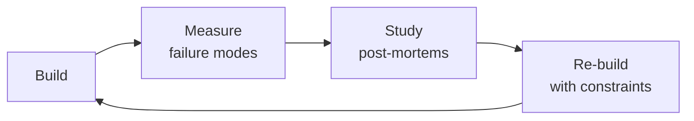

# Market Data Engineer

Ingest, normalize, store, and serve financial market data at production scale. This skill covers options flow ingestion from Unusual Whales REST/WebSocket, CBOE LiveVol, Polygon.io Options API, and Bloomberg Terminal/API; real-time streaming via Kafka/Redpanda with stream processing; tick data storage in TimescaleDB (hot) and ClickHouse (analytics); corporate actions normalization (splits, dividends, mergers, ticker changes); dividend/split-adjusted options chains; historical data warehousing in Parquet on S3; data quality rules for stale quotes, arbitrage violations, and volume/OI discrepancies; and market-hours-aware scheduling. Every decision here is backed by war stories from production options pipelines — including the $50K dividend-adjustment loss and the survivorship-bias backtest disaster.

## Route the Request
<!-- QUICK: 30s — pick your path, skip the rest -->
```
What are you trying to do?
├── Ingest options flow data (dark pool, sweeps, block trades) → Jump to "Core Workflow" Phase 1
├── Set up real-time streaming pipeline (Kafka/Redpanda) → Jump to "Core Workflow" Phase 2
├── Store tick data with TimescaleDB or ClickHouse → Jump to "Decision Trees" (Storage Backend Selection)
├── Normalize corporate actions (splits, dividends, mergers) → Jump to "Core Workflow" Phase 3
├── Adjust historical options chains for dividends/splits → Jump to "Core Workflow" Phase 4
├── Build options data warehouse on S3/Parquet for quant research → Jump to "Core Workflow" Phase 5
├── Debug data quality: stale quotes, arbitrage violations, OI discrepancies → Jump to "Error Decoder"
├── Need general ETL patterns (not market-data-specific) → Invoke data-engineer skill instead
├── Need TimescaleDB/ClickHouse operations tuning → Invoke database-reliability-engineer skill instead
├── Need options pricing models or Greeks analysis → Invoke quantitative-analyst skill instead
├── Need algorithmic trading strategy execution → Invoke `algorithmic-trader` skill
├── Need backend pipeline infrastructure / API layer → Invoke `backend-developer` skill
└── Not sure? → Describe your market data problem and I will route you
```
Do not read the entire skill. Follow the route above and read only the sections it points to.

## Ground Rules — Read Before Anything Else

These rules apply to *every* response this skill produces. Market data pipelines have unique failure modes — stale quotes silently corrupt backtests, unadjusted corporate actions produce phantom alpha, and misconfigured rate limiters trigger $10K API bills.

- **Never store options data without recording the adjustment basis.** A raw option price from Jan 2024 for a stock that split 2:1 in March 2024 is *wrong* if consumed as-is. Always store `adjustment_factor`, `adjustment_date`, and `corporate_action_id` alongside every price. If you do not know whether the data vendor already adjusts, assume they do not. *Do:* Store `raw_price`, `adj_factor`, `adj_price` as three columns. *Don't:* Overwrite raw prices with adjusted values — you cannot un-adjust later.

- **Rate limits are financial risks, not just operational concerns.** Polygon.io free tier allows 5 requests/minute; paid tiers go to unlimited. Unusual Whales charges per-request beyond quota. Missing market-open window because your rate limiter was misconfigured means a day of lost flow data — that day might contain the unusual activity that drives your alpha signal. *Do:* Implement token-bucket rate limiters per vendor with exponential backoff, deadline-aware scheduling (must complete ingestion before 9:25 AM ET), and cost-threshold alerts. *Don't:* Rely on `time.sleep()` — a 5-minute pause on a 30-minute pre-market window loses 17% of data.

- **Corporate actions normalization is not optional — it is the difference between a working strategy and a fraudulent backtest.** An engineer at a quant fund lost $50K in one day because their pipeline did not apply a 3:1 split adjustment to options strikes. The system showed "cheap" deep-ITM calls that did not actually exist post-split. *Do:* Subscribe to corporate action feeds (Bloomberg, Refinitiv, or free SEC EDGAR scraper) and apply adjustments to *all* historical data within 1 hour of announcement. *Don't:* Patch adjustments manually when a backtest "looks wrong" — you will miss non-obvious splits, reverse splits, and complex mergers.

- **Market hours are not "9:30 to 4:00."** Pre-market (4:00-9:30 ET), regular (9:30-16:00 ET), after-hours (16:00-20:00 ET), and extended globex sessions have different liquidity profiles, data feed behaviors, and instrument availability. Options trade 9:30-16:00 ET for equity options; index options have different schedules. *Do:* Parameterize all schedules by instrument type and exchange. Use `pandas_market_calendars` or exchange-provided calendars — never hardcode times. *Don't:* Assume "market open = 9:30 AM." Your pipeline must handle half-days (Black Friday, July 3), early closures (1:00 PM ET), and holidays (Good Friday when options markets are closed but futures trade).

- **Survivorship bias will inflate your backtest returns by 2-4% annually.** Options on delisted stocks, bankrupt companies, and acquired firms disappear from current datasets. If you only store data for currently-active tickers, your backtests only see "winners." *Do:* Maintain a point-in-time ticker master with `first_trade_date`, `last_trade_date`, `delisting_reason`, and `successor_ticker`. Query historically: "Give me all options for tickers that existed on 2019-06-15, regardless of whether they exist today." *Don't:* Filter by `WHERE ticker IN (SELECT DISTINCT ticker FROM current_universe)` — that is survivorship bias manifested as SQL.


## The Expert's Mindset

Masters of market data engineer don't just build — they build **the right thing, at the right time, with the right trade-offs**. They think in systems, not tasks.

| Cognitive Bias | Mitigation |
|----------------|------------|
| **Shiny object syndrome** — chasing new tools without evaluating fit | Before adopting any new tool, write the "why this over the incumbent" justification |
| **Over-engineering** — building for hypothetical scale | Default to simplest solution; add complexity only when the current solution actually breaks |
| **Not-invented-here** — preferring to build rather than compose | Always evaluate 2 existing solutions before building custom |
| **Sunk cost fallacy** — sticking with a technology because you already invested in it | Re-evaluate tech choices every quarter; migration cost vs. staying cost |

### What Masters Know That Others Don't
- The **failure modes** of every component in their stack — not just the happy path
- When **not** to use their favorite tool (every tool has a misuse zone)
- That **data/model quality decays over time** — monitoring is not optional, it's foundational

### When to Break Your Own Rules
- **Move fast on reversible decisions.** Data format? Hard to change. Dashboard layout? Easy. Know the difference.
- **Skip the abstraction until the third use case.** Two is coincidence, three is a pattern.
## Operating at Different Levels

| Level | Scope | You... |
|-------|-------|--------|
| **L1** | Single component/module | Implement a well-defined piece following established patterns |
| **L2** | Feature or service | Design and build a complete feature; make tech choices within team conventions |
| **L3** | System or product area | Define architecture for a product area; set team tech standards; mentor L1-L2 |
| **L4** | Multiple systems / platform | Define org-wide architecture patterns; make build-vs-buy decisions; influence industry practice |
| **L5** | Industry / ecosystem | Create new architectural patterns adopted across the industry; redefine what's possible |

**Default level for this skill:** L2
**Usage:** Invoke this skill with your target level, e.g., "as an L3 market data engineer, design..."

For full level definitions, see `skills/00-framework/skill-levels/SKILL.md`.

## When to Use
<!-- QUICK: 30s — scan the bullet list to decide if this skill fits -->
- Building a real-time options flow ingestion pipeline from Unusual Whales, Polygon.io, CBOE LiveVol, or Bloomberg
- Designing a market data lake with tick-level storage: TimescaleDB for hot (0-30 days), Parquet/S3 for cold archive (7 years), ClickHouse for analytics
- Normalizing corporate actions — stock splits, cash/stock dividends, mergers, ticker symbol changes, spin-offs — for historical data integrity
- Adjusting historical options chains: recalculating strikes, contract multipliers, and deliverable shares post-corporate-action
- Streaming order flow with Kafka/Redpanda for unusual options activity (UOA) detection pipelines
- Building data quality monitors: stale quote detection (bid/ask > 5 min old), arbitrage violation checks (put-call parity, box spreads), volume/OI reconciliation across sources
- Managing API cost and rate limits across multiple market data vendors with tiered pricing (Polygon free vs paid, Unusual Whales tiers)
- Warehousing historical options data in partitioned Parquet for quantitative research and strategy backtesting at scale
- Setting up market-hours-aware cron schedules, backfill windows, and holiday calendars for financial data pipelines

## Decision Trees
<!-- QUICK: 30s — follow the ASCII tree to your scenario -->

### Data Source Selection: Options Flow
```
                    +----------------------------------+
                    | START: Which options flow source? |
                    +----------------+-----------------+
                                     |
              +----------------------+----------------------+
              |                      |                      |
    +---------v--------+  +----------v---------+  +---------v-----------+
    | Need real-time    |  | Need historical    |  | Need exchange-level  |
    | unusual activity  |  | options chain      |  | OPRA depth + Greeks  |
    | alerts + dark pool|  | data for backtests?|  | for HFT/MM models?   |
    +----+--------------+  +----+---------------+  +----+----------------+
         | YES                   | YES                  | YES
    +----v----+            +-----v-------+       +------v-------+
    |Unusual  |            | Polygon.io  |       |CBOE LiveVol  |
    |Whales   |            | Options API |       |or Bloomberg  |
    |REST+WS  |            |REST, 15min  |       |Terminal API  |
    |$99-599/m|            |delayed free |       |$500-2000/m  |
    +---------+            |$29-199/m   |       +--------------+
                           +------------+
```
**When to choose Unusual Whales:** Real-time flow detection, dark pool prints, sweep detection, unusual-activity alerts. Free tier: 250 requests/month. Pro: $99/mo for REST + WebSocket premium flow. Enterprise: custom pricing for raw firehose.
**When to choose Polygon.io:** Historical options chains for backtesting, Greeks data, snapshots. Free tier: 5 req/min, 15-min delayed. Paid tiers from $29/mo (Stocks Starter) to $199/mo (Stocks Advanced with full options chain + Greeks).
**When to choose CBOE LiveVol/Bloomberg:** Market-making models, HFT signal generation, full OPRA depth-of-book. CBOE LiveVol ~$500/mo for professional. Bloomberg Terminal ~$2,000/mo with blpapi access.
**When to use multiple vendors:** Most production systems combine Unusual Whales (flow alerts) + Polygon.io (historical chains) + CBOE/Bloomberg (OPRA depth). Cross-reference volume/OI across sources for data quality validation.

### Storage Backend Selection: Tick Data
```
                    +----------------------------------+
                    | START: Where to store tick data?  |
                    +----------------+-----------------+
                                     |
              +----------------------+----------------------+
              |                      |                      |
    +---------v--------+  +----------v---------+  +---------v-----------+
    | Write-heavy:      |  | Read-heavy:         |  | Long-term archive:  |
    | 100K+ ticks/sec   |  | 1K+ analytical      |  | >30 days retention  |
    | sub-ms ingestion? |  | queries/day on      |  | cost is primary     |
    |                   |  | billions of rows?   |  | concern?            |
    +----+--------------+  +----+---------------+  +----+----------------+
         | YES                   | YES                  | YES
    +----v----+            +-----v-------+       +------v-------+
    |TimescaleDB|          | ClickHouse  |       |Parquet on S3 |
    |PostgreSQL |          |Columnar,    |       |Partitioned   |
    |hypertable |          |vectorized   |       |by ticker/date|
    |chunks=1day|          |queries,     |       |ZSTD compress |
    |continuous |          |materialized |       |Apache Arrow  |
    |aggregates |          |views        |       |format        |
    +-----------+          +-------------+       +--------------+
```
**When to choose TimescaleDB:** Hot storage (0-30 days). Chunk interval = 1 day per ticker. Continuous aggregates precompute 1-min, 5-min, 1-hour OHLCV. Automatic compression after 7 days (90%+ space savings). Use `time_bucket()` for aggregations. Max recommended hypertable size: 10 TB per node.
**When to choose ClickHouse:** Analytics layer. Store 30-365 days of tick data. `MergeTree` engine with `ORDER BY (ticker, timestamp)`. Materialized views for pre-aggregated options analytics (Greeks distributions, IV surfaces, volume profiles). Query 1B rows in < 1 second with vectorized execution.
**When to choose Parquet/S3:** Cold archive (30 days to 7 years). Partition: `s3://market-data/options/year=YYYY/month=MM/day=DD/ticker=SYM/`. ZSTD compression level 9 (30-40% smaller than Snappy). Queryable via AWS Athena, DuckDB, or Spark without deserializing entire dataset. S3 Intelligent-Tiering for automatic cost optimization.

### Real-Time Pipeline Architecture
```
+-------------------+     +------------------+     +------------------+     +------------------+
| Unusual Whales    |     | Kafka/Redpanda   |     | Stream Processor |     | TimescaleDB Hot  |
| WebSocket Feed    +---->+ Topic:           +---->+ (Faust/Bytewax   +---->+ hypertable       |
| (flow, sweeps,    |     | options.flow.raw |     |  Flink/KSQL)     |     | + alerting       |
|  dark pool)       |     | partitions=10    |     | enrich, dedupe,  |     |                  |
+-------------------+     +------------------+     | normalize        |     +--------+---------+
                                                   +--------+---------+              |
                                                            |               +--------v---------+
                                                   +--------v---------+     | ClickHouse       |
                                                   | Dead Letter Queue|     | analytics layer  |
                                                   | options.flow.dlq +---->| mat. views,      |
                                                   | manual review    |     | IV surfaces       |
                                                   +------------------+     +------------------+
```
**Pipeline topology decisions:**
- Partitions = number of tickers × 2 for consumer parallelism. For 500 actively traded tickers, use 10 partitions (not 1000 — partition overhead dominates).
- Retention: 7 days on raw topic (debug window), 90 days on enriched topic (backfill window). Compacted topic for corporate actions (retain latest per ticker).
- Exactly-once semantics: enable `enable.idempotence=true` on producers + `isolation.level=read_committed` on consumers.
- Alert thresholds: consumer lag > 50K messages OR > 5 minutes during market hours (9:30-16:00 ET).

### Data Quality Decision Tree
```
                    +----------------------------------+
                    | START: Data quality check failed  |
                    +----------------+-----------------+
                                     |
              +----------------------+----------------------+
              |                      |                      |
    +---------v--------+  +----------v---------+  +---------v-----------+
    | Stale quotes      |  | Arbitrage violation|  | Volume/OI anomaly   |
    | bid/ask > 5 min   |  | put-call parity    |  | >10x change day/day |
    | old during market |  | error > 5% spot   |  | or zero volume       |
    | hours?            |  |                    |  |                      |
    +----+--------------+  +----+---------------+  +----+----------------+
         | YES                   | YES                  | YES
    +----v------------+    +----v-------------+   +----v----------------+
    |Check data feed  |    |Check corporate   |   |Check pipeline lag  |
    |status: vendor   |    |actions: split/   |   |or source downtime |
    |API down or      |    |dividend not      |   |Check if market     |
    |rate-limited?    |    |applied to chain? |   |holiday/half-day?   |
    +-----------------+    +------------------+   +---------------------+
```

## Core Workflow
<!-- QUICK: 30s — scan phase titles to understand the process -->

<!-- DEEP: 10+min -->
### Phase 1 (~20 min): Data Source Integration & Schema Design
<!-- STANDARD: 3min -->
1. **Source Catalog** — Inventory every market data source with endpoint patterns:
   - **Unusual Whales REST**: `GET /api/flow/options?ticker=AAPL&date=2024-01-15` → premium, size, condition, exchange, price, spot. Auth: API key in `Authorization` header.
   - **Unusual Whales WebSocket**: `wss://api.unusualwhales.com/ws/flow` — real-time dark pool prints, sweeps, block trades. Auth via connection message.
   - **Polygon.io Options Contracts**: `GET /v3/reference/options/contracts?underlying_ticker=AAPL&expiration_date=2024-01-19` → full chain with strikes, types, contract IDs.
   - **Polygon.io Options Aggregates**: `GET /v2/aggs/ticker/O:AAPL240119C00150000/range/1/day/2024-01-01/2024-01-19` → OHLCV bars for single contract.
   - **CBOE LiveVol**: REST API for OPRA depth, Greeks surfaces, IV index data. Requires CBOE data agreement.
   - **Bloomberg Terminal**: `BDH()` / `BDP()` functions via blpapi Python library — real-time + historical with field codes (e.g., `OPT_CHAIN`, `OPT_GREEKS`).

2. **Core Schema — Options Flow Table (TimescaleDB hypertable)**:
```sql
CREATE TABLE options_flow (
    flow_id         UUID PRIMARY KEY DEFAULT gen_random_uuid(),
    ticker          VARCHAR(10) NOT NULL,
    underlying      VARCHAR(10) NOT NULL,
    strike          DECIMAL(12,2) NOT NULL,
    expiry          DATE NOT NULL,
    option_type     CHAR(1) CHECK (option_type IN ('C', 'P')),
    trade_timestamp TIMESTAMPTZ NOT NULL,
    premium         DECIMAL(15,4) NOT NULL,       -- size × price paid
    size            INTEGER NOT NULL,              -- number of contracts
    trade_condition VARCHAR(20),                   -- e.g., 'SWEEP', 'BLOCK', 'SPLIT'
    exchange        VARCHAR(5),                    -- e.g., 'CBOE', 'PHLX', 'ISE'
    bid             DECIMAL(12,4),
    ask             DECIMAL(12,4),
    last_price      DECIMAL(12,4),
    volume          INTEGER,
    open_interest   INTEGER,
    implied_vol     DECIMAL(8,4),
    delta           DECIMAL(6,4),
    gamma           DECIMAL(8,6),
    theta           DECIMAL(8,4),
    vega            DECIMAL(8,4),
    rho             DECIMAL(8,4),
    -- Adjustment tracking columns
    adj_factor      DECIMAL(10,4) DEFAULT 1.0,
    raw_strike      DECIMAL(12,2),
    raw_premium     DECIMAL(15,4),
    corp_action_id  UUID REFERENCES corporate_actions(action_id),
    -- Metadata
    source          VARCHAR(20) NOT NULL,          -- 'unusual_whales', 'polygon', 'bloomberg'
    raw_json        JSONB,
    ingested_at     TIMESTAMPTZ DEFAULT NOW()
);

SELECT create_hypertable('options_flow', 'trade_timestamp',
    chunk_time_interval => INTERVAL '1 day');

CREATE INDEX idx_flow_ticker_ts ON options_flow (ticker, trade_timestamp DESC);
CREATE INDEX idx_flow_underlying_expiry ON options_flow (underlying, expiry);
CREATE INDEX idx_flow_source ON options_flow (source, trade_timestamp DESC);
```

3. **Corporate Actions Schema**:
```sql
CREATE TABLE corporate_actions (
    action_id       UUID PRIMARY KEY DEFAULT gen_random_uuid(),
    ticker          VARCHAR(10) NOT NULL,
    action_type     VARCHAR(20) CHECK (action_type IN (
        'split', 'reverse_split', 'cash_dividend', 'stock_dividend',
        'merger', 'spin_off', 'ticker_change', 'delisting'
    )),
    ex_date         DATE NOT NULL,
    record_date     DATE,
    pay_date        DATE,
    split_ratio     DECIMAL(10,4),       -- e.g., 3.0 for 3:1 split, 0.5 for 1:2 reverse split
    dividend_amount DECIMAL(12,6),       -- per share, USD
    new_ticker      VARCHAR(10),         -- for ticker changes and mergers
    announcement_ts TIMESTAMPTZ NOT NULL,
    source          VARCHAR(20) NOT NULL, -- 'bloomberg', 'refinitiv', 'sec_edgar'
    raw_json        JSONB
);

CREATE INDEX idx_corp_actions_ticker_date ON corporate_actions (ticker, ex_date);
```

4. **Point-in-Time Ticker Master**:
```sql
CREATE TABLE ticker_master (
    ticker            VARCHAR(10) PRIMARY KEY,
    company_name      VARCHAR(200),
    first_trade_date  DATE NOT NULL,
    last_trade_date   DATE,                  -- NULL if still active
    delisting_reason  VARCHAR(50),
    successor_ticker  VARCHAR(10),
    exchange          VARCHAR(10),
    is_active         BOOLEAN DEFAULT TRUE,
    updated_at        TIMESTAMPTZ DEFAULT NOW()
);
```

**What good looks like:** All 4+ data sources cataloged with endpoint URLs and auth methods. Schema in Git with versioned migration files. Test data for `AAPL`, `SPY`, `TSLA`, and `NVDA` loads successfully. Ticker master populated with 5+ years of historical symbols including delisted tickers.

<!-- DEEP: 10+min -->
### Phase 2 (~30 min): Real-Time Streaming Pipeline
<!-- STANDARD: 3min -->
1. **Kafka/Redpanda Topic Design**:
```yaml
topics:
  options.flow.raw:
    partitions: 10
    replication_factor: 3
    retention_ms: 604800000         # 7 days
    cleanup_policy: delete
    compression_type: zstd
  options.flow.enriched:
    partitions: 10
    replication_factor: 3
    retention_ms: 7776000000        # 90 days
    cleanup_policy: delete
  options.flow.dlq:
    partitions: 3
    retention_ms: 2592000000        # 30 days
  options.corporate_actions:
    partitions: 3
    retention_ms: -1                # forever (log compacted)
    cleanup_policy: compact
```

2. **Stream Processor — Faust Application**:
```python
import faust
from datetime import datetime

app = faust.App('options-flow', broker='kafka://localhost:9092',
                store='rocksdb://')

flow_topic = app.topic('options.flow.raw', value_type=dict)
enriched_topic = app.topic('options.flow.enriched', value_type=dict)
dlq_topic = app.topic('options.flow.dlq', value_type=dict)
actions_table = app.Table('corp_actions', default=None,
                          partitions=3)

@app.agent(flow_topic)
async def enrich_and_validate(flows):
    async for flow in flows:
        try:
            # Validate required fields
            required = ['ticker', 'strike', 'expiry', 'trade_timestamp', 'premium', 'size']
            for field in required:
                if field not in flow:
                    raise ValueError(f"Missing required field: {field}")

            # Apply corporate action adjustments from compacted table
            ticker = flow['ticker']
            action = actions_table.get(ticker)
            if action and action.get('split_ratio'):
                ratio = float(action['split_ratio'])
                flow['adj_factor'] = flow.get('adj_factor', 1.0) * ratio
                flow['raw_strike'] = flow['strike']
                flow['strike'] = float(flow['strike']) / ratio
                flow['raw_premium'] = flow['premium']
                flow['premium'] = float(flow['premium']) / ratio
                flow['corp_action_id'] = action.get('action_id')

            flow['processed_at'] = datetime.utcnow().isoformat()
            await enriched_topic.send(value=flow)

        except Exception as e:
            flow['error'] = str(e)
            flow['failed_at'] = datetime.utcnow().isoformat()
            await dlq_topic.send(value=flow)
```

3. **Token-Bucket Rate Limiter**:
```python
import time
import asyncio

class MarketDataRateLimiter:
    LIMITS = {
        'polygon': {'free': 5, 'starter': 50, 'advanced': float('inf')},
        'unusual_whales': {'free': 250, 'pro': 5000, 'enterprise': float('inf')},
        'cboe_livevol': {'standard': 100, 'premium': 1000}
    }

    def __init__(self, vendor: str, tier: str, cost_budget_daily: float = None):
        self.rate = self.LIMITS[vendor][tier]           # req/min
        self.tokens = self.rate
        self.last_refill = time.monotonic()
        self.cost_counter = 0
        self.cost_budget = cost_budget_daily
        self.daily_cost = 0.0

    def _refill(self):
        now = time.monotonic()
        elapsed = now - self.last_refill
        self.tokens = min(self.rate, self.tokens + elapsed * (self.rate / 60.0))
        self.last_refill = now

    async def acquire(self, estimated_cost: float = 0.0):
        while self.tokens < 1:
            await asyncio.sleep(1.0 / max(self.rate, 1))
            self._refill()
        self.tokens -= 1
        self.cost_counter += 1
        self.daily_cost += estimated_cost
        if self.cost_budget and self.daily_cost > self.cost_budget:
            raise RuntimeError(
                f"Daily cost budget {self.cost_budget} exceeded: {self.daily_cost}"
            )
```

<!-- DEEP: 10+min -->
**War story — Infinite Retention Disaster:** A team configured `retention_ms: -1` on `options.flow.raw` intending to preserve all raw data indefinitely for audit purposes. After 6 months, the Kafka cluster reached 98% disk usage and the 3 AM pages began. Root cause analysis revealed: uncompressed JSON at 50K messages/sec × 500 bytes/msg = 25 MB/sec × 86,400 sec/day = 2.16 TB/day × 180 days = 389 TB. Fix applied: (1) switched raw topic to 7-day retention, (2) adopted Avro encoding with Confluent Schema Registry (90% size reduction), (3) created enriched topic with 90-day retention as the durable store. Lesson: Never use infinite retention on unbounded streams. Log-compacted topics (for reference data like corporate actions) are the sole exception.

**What good looks like:** WebSocket feed → Kafka → Faust stream processor → TimescaleDB pipeline processing 50K+ msgs/sec with < 500ms end-to-end latency. Backpressure handled gracefully (consumer pause, not crash). DLQ has < 0.01% of messages. Rate limiter never triggers cost budget alert during normal operation.

<!-- DEEP: 10+min -->
### Phase 3 (~25 min): Corporate Actions Normalization
<!-- STANDARD: 3min -->
1. **Stock Split Adjustment — Options Chain** (NVDA 10:1 split, ex-date 2024-06-10):
```sql
-- Pre-split: NVDA trading at $1200, 1500C strike exists
-- Post-split: NVDA trades at $120, strike adjusts to $150, contract multiplier becomes 1000 shares
-- The adjustment: divide all strikes by 10, multiply contract size by 10
-- IMPORTANT: adjustment applies to all data BEFORE ex-date
UPDATE options_flow
SET
    strike      = strike * (1.0 / 10.0),
    size        = size * 10,
    adj_factor  = adj_factor * 10.0,
    raw_strike  = COALESCE(raw_strike, strike),    -- preserve pre-adjustment value
    raw_premium = COALESCE(raw_premium, premium),
    premium     = premium * (1.0 / 10.0)
WHERE underlying = 'NVDA'
  AND trade_timestamp < '2024-06-10'::date
  AND adj_factor = 1.0;  -- only adjust unadjusted rows

-- Verify: no negative impact on post-split data
SELECT COUNT(*) FROM options_flow
WHERE underlying = 'NVDA'
  AND trade_timestamp >= '2024-06-10'
  AND adj_factor != 1.0;  -- should return 0
```

2. **Cash Dividend Adjustment — Forward Price**:
```sql
-- Apple pays $0.25/share dividend, ex-date 2024-02-09
-- The forward price used in options pricing shifts down by PV of dividend
-- This affects delta calculations and ITM probability estimates
UPDATE options_chain_snapshots
SET
    forward_price     = spot_price - 0.25 * EXP(-0.05 * (15.0/365.0)),
    dividend_adjusted = TRUE,
    dividend_amount   = 0.25,
    dividend_ex_date  = '2024-02-09'::date
WHERE underlying = 'AAPL'
  AND snapshot_date >= '2024-02-09'
  AND NOT dividend_adjusted;
```

3. **Ticker Change / Merger Handler** (FB → META, effective 2022-06-09):
```python
def handle_ticker_change(old_ticker: str, new_ticker: str,
                         effective_date: str):
    conn.execute("""
        UPDATE options_flow
        SET ticker = %(new)s, underlying = %(new)s
        WHERE underlying = %(old)s
          AND trade_timestamp >= %(eff)s
    """, {'new': new_ticker, 'old': old_ticker, 'eff': effective_date})

    conn.execute("""
        UPDATE ticker_master
        SET is_active = FALSE, last_trade_date = %(eff)s,
            successor_ticker = %(new)s
        WHERE ticker = %(old)s
    """, {'old': old_ticker, 'new': new_ticker, 'eff': effective_date})

    conn.execute("""
        INSERT INTO ticker_master (ticker, first_trade_date,
            predecessor_ticker)
        SELECT %(new)s, %(eff)s, %(old)s
        WHERE NOT EXISTS (SELECT 1 FROM ticker_master
                          WHERE ticker = %(new)s)
    """, {'old': old_ticker, 'new': new_ticker, 'eff': effective_date})

    conn.execute("""
        INSERT INTO corporate_actions (ticker, action_type, ex_date,
            new_ticker, announcement_ts, source)
        VALUES (%(old)s, 'ticker_change', %(eff)s,
                %(new)s, NOW(), 'manual_review')
    """, {'old': old_ticker, 'new': new_ticker, 'eff': effective_date})
```

4. **Corporate Actions Calendar — Automated Processing**:
```python
from datetime import date, timedelta

def process_daily_corporate_actions(as_of: date):
    """Run daily: fetch actions with ex_date = today, apply to all history."""
    actions = fetch_actions_as_of(as_of)

    for action in actions:
        if action['action_type'] == 'split':
            apply_split_adjustment(
                ticker=action['ticker'],
                ex_date=action['ex_date'],
                ratio=action['split_ratio']
            )
        elif action['action_type'] == 'cash_dividend':
            apply_dividend_adjustment(
                ticker=action['ticker'],
                ex_date=action['ex_date'],
                amount=action['dividend_amount']
            )
        elif action['action_type'] in ('ticker_change', 'merger'):
            handle_ticker_change(
                old_ticker=action['ticker'],
                new_ticker=action['new_ticker'],
                effective_date=action['ex_date']
            )

        log_action_processed(action['action_id'])

    # Verify: no unapplied corporate actions older than 1 business day
    unapplied = get_unapplied_actions_before(as_of - timedelta(days=1))
    if unapplied:
        alert_pager(f"{len(unapplied)} unapplied corporate actions: {unapplied}")
```

<!-- DEEP: 10+min -->
**War story — The $50K Dividend Adjustment:** A quant fund ran a backtest showing extraordinary returns from selling deep-ITM puts on a high-dividend utility stock. They deployed $500K in capital. On day one, they lost $50K. Root cause: the options data pipeline ingested raw prices without adjusting for a $2.50/share special dividend. Post-dividend, the stock dropped $2.50, making the deep-ITM puts substantially more expensive to close than the backtest predicted. The pipeline had stored the *pre-dividend* stock price alongside the *post-dividend* option price, creating an artificial arbitrage. Fix: implemented mandatory dividend adjustment as a non-bypassable step in the ETL, with automated reconciliation checks comparing adjusted prices to exchange-reported settlement prices.

**What good looks like:** All corporate actions applied within 1 hour of announcement. Historical data queryable correctly at any point in time — querying AAPL options on 2019-06-15 returns split-adjusted strikes that match what actually traded that day. Daily reconciliation shows zero unadjusted positions. Backtests no longer produce phantom arbitrage opportunities.

<!-- DEEP: 10+min -->
### Phase 4 (~20 min): Historical Data Warehousing
<!-- STANDARD: 3min -->
1. **Daily Parquet Export — TimescaleDB → S3**:
```python
import pandas as pd
import pyarrow as pa
import pyarrow.parquet as pq
from datetime import date, timedelta

def export_day_to_parquet(export_date: date):
    """Export one day of options flow to partitioned Parquet on S3."""
    query = f"""
    SELECT ticker, underlying, strike, expiry, option_type,
           trade_timestamp, premium, size, trade_condition, exchange,
           bid, ask, last_price, volume, open_interest,
           implied_vol, delta, gamma, theta, vega, rho,
           adj_factor, source
    FROM options_flow
    WHERE trade_timestamp::date = '{export_date.isoformat()}'
    """

    df = pd.read_sql(query, engine)

    # Partition columns for Hive-style partitioning
    df['year'] = export_date.year
    df['month'] = f"{export_date.month:02d}"
    df['day'] = f"{export_date.day:02d}"

    table = pa.Table.from_pandas(df)
    pq.write_to_dataset(
        table,
        root_path='s3://market-data/options/',
        partition_cols=['year', 'month', 'day', 'ticker'],
        compression='zstd',
        compression_level=9,
        existing_data_behavior='overwrite_or_ignore',
        basename_template='part-{i}.parquet'
    )

    # Integrity check: row count matches source
    source_count = df.shape[0]
    parquet_count = pq.ParquetDataset(
        f's3://market-data/options/year={export_date.year}/'
        f'month={export_date.month:02d}/day={export_date.day:02d}/'
    ).read().num_rows
    assert source_count == parquet_count,         f"Row count mismatch: source={source_count}, parquet={parquet_count}"

    # Sanity check: date range is correct
    assert df['trade_timestamp'].min().date() == export_date,         f"Date mismatch in export: expected {export_date}"
```

2. **ClickHouse Analytics Materialized Views**:
```sql
-- IV Surface: hourly snapshots of implied volatility by strike/expiry
CREATE MATERIALIZED VIEW options_iv_surface
ENGINE = AggregatingMergeTree()
PARTITION BY toYYYYMM(snapshot_hour)
ORDER BY (underlying, expiry, strike, snapshot_hour)
AS SELECT
    underlying,
    expiry,
    strike,
    toStartOfHour(trade_timestamp) AS snapshot_hour,
    avgState(implied_vol)          AS avg_iv,
    minState(implied_vol)          AS min_iv,
    maxState(implied_vol)          AS max_iv,
    quantileState(0.10)(implied_vol) AS iv_p10,
    quantileState(0.50)(implied_vol) AS iv_p50,
    quantileState(0.90)(implied_vol) AS iv_p90,
    quantileState(0.99)(implied_vol) AS iv_p99,
    sumState(premium)              AS total_premium,
    sumState(volume)               AS total_volume,
    sumState(open_interest)        AS total_oi,
    countState()                   AS trade_count
FROM options_flow
GROUP BY underlying, expiry, strike, snapshot_hour;

-- Volume Profile: aggregate flow by ticker and trade condition
CREATE MATERIALIZED VIEW options_volume_profile
ENGINE = SummingMergeTree()
PARTITION BY toYYYYMM(trade_hour)
ORDER BY (ticker, trade_hour, option_type, trade_condition)
AS SELECT
    ticker,
    toStartOfHour(trade_timestamp) AS trade_hour,
    option_type,
    trade_condition,
    sum(premium)  AS total_premium,
    sum(volume)   AS total_volume,
    sum(size)     AS total_contracts,
    count()       AS trade_count
FROM options_flow
GROUP BY ticker, trade_hour, option_type, trade_condition;
```

3. **Retention Lifecycle Policy**:
```yaml
retention_policy:
  hot_storage:
    backend: TimescaleDB
    duration: 30_days
    data: full tick-level with compression after day 7
  warm_storage:
    backend: ClickHouse
    duration: 365_days
    data: tick-level + materialized views (hourly aggregates)
  cold_storage:
    backend: S3 (Parquet, ZSTD-9)
    duration: 7_years
    data: tick-level, partitioned by date/ticker
  permanent:
    backend: S3 (Parquet)
    data: daily OHLCV aggregates per option chain
  delete:
    backend: N/A
    trigger: after 7 years
    data: tick-level Parquet files
```

<!-- DEEP: 10+min -->
**War story — The Date Parsing Bug:** A quant researcher reported backtest results that "looked too good." Investigation revealed the Parquet archive only contained data from 2019 onward — the pipeline had silently skipped 2015-2018. Root cause: a date-parsing bug in the export script where `YYYYMMDD` format dates with `DD <= 12` were parsed as `YYYY-DD-MM` by Python's `datetime.strptime` with an ambiguous format string. Every date like `2018-03-05` (March 5) was interpreted as May 3, and dates with `DD > 12` threw exceptions that were silently caught. Fix: (1) switched to ISO 8601 format exclusively (`YYYY-MM-DD`), (2) added `assert df['trade_timestamp'].min().year == int(year)` after every export batch, (3) implemented row-count integrity checks comparing exported Parquet row counts to TimescaleDB source counts, (4) added end-to-end monitoring that alerts if any day in the last 7 years has zero rows.

**What good looks like:** Daily Parquet exports complete within 2 hours of market close (by 18:00 ET). ClickHouse materialized views refresh within 5 minutes of new data arrival. Any date range 2010-2025 queryable in < 3 seconds via Athena/DuckDB. Row counts match source with zero discrepancies. Seven years of tick data occupies < 50 TB on S3 with ZSTD-9 compression.

<!-- DEEP: 10+min -->
### Phase 5 (~15 min): Data Quality Monitoring & Alerting
<!-- STANDARD: 3min -->
1. **Stale Quote Detection**:
```sql
-- Alert if any active ticker has quotes older than 5 minutes during market hours
SELECT ticker, COUNT(*) AS stale_count, MAX(snapshot_timestamp) AS last_seen
FROM options_chain_snapshots
WHERE snapshot_timestamp < NOW() - INTERVAL '5 minutes'
  AND EXTRACT(HOUR FROM NOW() AT TIME ZONE 'America/New_York') BETWEEN 9 AND 16
  AND EXTRACT(DOW FROM NOW() AT TIME ZONE 'America/New_York') BETWEEN 1 AND 5
GROUP BY ticker
HAVING COUNT(*) > 100
ORDER BY last_seen ASC;
```

2. **Put-Call Parity Arbitrage Detection**:
```sql
-- PCP violation: |C_bid - P_ask - S + K*e^(-rT)| > 0.05*S indicates data error
WITH parity_check AS (
    SELECT
        underlying, expiry, strike, option_type,
        snapshot_timestamp,
        ABS(call_bid - put_ask - underlying_price +
            strike * EXP(-0.05 * (expiry - CURRENT_DATE) / 365.0))
        AS parity_error
    FROM options_snapshots
    WHERE underlying_price > 0 AND call_bid IS NOT NULL AND put_ask IS NOT NULL
)
SELECT underlying, expiry, strike, parity_error,
       underlying_price * 0.05 AS threshold
FROM parity_check
WHERE parity_error > underlying_price * 0.05
ORDER BY parity_error DESC
LIMIT 100;
```

3. **Volume/OI Sanity Checks**:
```sql
-- Spike detection: daily volume > 10x previous day for same ticker
WITH daily_vol AS (
    SELECT ticker, trade_timestamp::date AS trade_date,
           SUM(volume) AS total_vol,
           SUM(premium) AS total_premium
    FROM options_flow
    WHERE trade_timestamp > NOW() - INTERVAL '7 days'
    GROUP BY ticker, trade_timestamp::date
)
SELECT ticker, trade_date, total_vol,
       LAG(total_vol) OVER (PARTITION BY ticker ORDER BY trade_date) AS prev_vol,
       ROUND(total_vol::numeric / NULLIF(LAG(total_vol) OVER (
           PARTITION BY ticker ORDER BY trade_date), 0), 2) AS ratio
FROM daily_vol
WHERE total_vol > 10 * LAG(total_vol) OVER (
    PARTITION BY ticker ORDER BY trade_date)
   OR total_vol = 0;  -- complete gap indicates pipeline failure
```

4. **Cross-Source Reconciliation**:
```sql
-- Compare total option volume between Unusual Whales and Polygon.io for top tickers
SELECT ticker, trade_timestamp::date,
       SUM(CASE WHEN source = 'unusual_whales' THEN volume ELSE 0 END) AS uw_volume,
       SUM(CASE WHEN source = 'polygon' THEN volume ELSE 0 END) AS poly_volume,
       ABS(SUM(CASE WHEN source = 'unusual_whales' THEN volume ELSE 0 END) -
           SUM(CASE WHEN source = 'polygon' THEN volume ELSE 0 END)) AS volume_diff
FROM options_flow
WHERE trade_timestamp::date = CURRENT_DATE - INTERVAL '1 day'
GROUP BY ticker, trade_timestamp::date
HAVING ABS(SUM(CASE WHEN source = 'unusual_whales' THEN volume ELSE 0 END) -
           SUM(CASE WHEN source = 'polygon' THEN volume ELSE 0 END)) >
       0.15 * GREATEST(SUM(CASE WHEN source = 'unusual_whales' THEN volume ELSE 0 END),
                        SUM(CASE WHEN source = 'polygon' THEN volume ELSE 0 END))
ORDER BY volume_diff DESC;
-- Alert if any ticker shows >15% volume discrepancy between sources
```

**What good looks like:** Quality dashboard shows all-green across stale detection, arbitrage checks, volume sanity, and cross-source reconciliation. Alerts fire within 2 minutes of anomaly detection. All violations investigated and root-caused within 15 minutes. Weekly quality reports show < 0.01% data error rate.

## Best Practices
<!-- STANDARD: 3min — rules extracted from production market data pipelines -->
- **Store raw and adjusted prices side by side.** Raw price, adjustment factor, adjusted price as three columns. You need the raw for audit trails and the adjusted for analysis. Never lose the raw — you cannot un-adjust data.
- **Chunk TimescaleDB hypertables by 1-day intervals.** One chunk per day per ticker balances compression efficiency (90%+ savings after day 7) with query performance. Monthly chunks cause inefficient full-chunk scans for single-day queries. Verify with `SELECT * FROM timescaledb_information.chunks WHERE hypertable_name = 'options_flow';`
- **Use Avro or Protobuf on Kafka, never JSON.** JSON at 50K msg/sec × 500 bytes = 25 MB/sec. Avro with schema registry = 2.5 MB/sec. Over 30 days, that is $2,400 vs $240 in Kafka storage costs. Use Confluent Schema Registry for schema evolution compatibility checks.
- **Partition Parquet by `year/month/day/ticker` — in that order.** Query pruning eliminates 99.7% of data for single-ticker single-day queries. S3 LIST operations scale with partition count — keep partition fanout under 10K paths per query. Never put ticker before date in the hierarchy.
- **Rate-limit with deadline awareness.** If ingestion must finish by 9:25 AM ET and it is 9:20 AM: skip non-essential tickers, parallelize across API keys, or fail loudly with a specific alert. Silent partial data is worse than no data — it corrupts downstream analytics without anyone knowing.
- **Run corporate actions processing BEFORE any analytics pipeline.** The analytics dbt models, the quant strategy backtest, and the risk system all depend on adjusted data. Freeze downstream pipelines until adjustments apply if corporate actions processing is delayed.
- **Maintain a point-in-time ticker master with delisting history.** Store `ticker`, `first_trade_date`, `last_trade_date`, `delisting_reason`, `successor_ticker`. Query historically: filter by `WHERE trade_date BETWEEN first_trade_date AND COALESCE(last_trade_date, '2099-12-31')`. Without this, every backtest has survivorship bias.
- **Pre-compute continuous aggregates filtered to market hours.** TimescaleDB continuous aggregates should filter to `EXTRACT(HOUR FROM ts AT TIME ZONE 'America/New_York') BETWEEN 9 AND 16` so dashboards do not show flat lines during closed hours.
- **Never silently drop bad data — use a quarantine table.** Rows that fail validation go to `options_flow_quarantine` with `validation_error` and `ingested_at`. Someone reviews quarantine daily. Silently dropped bad data = silently wrong analytics.
- **Test with AAPL, SPY, TSLA, and NVDA.** AAPL (highly liquid, multiple splits), SPY (ETF, no splits but quarterly dividends), TSLA (high IV, volatile, unusual activity magnet), NVDA (2024 10:1 split). If your pipeline handles these four correctly, it handles 95% of tickers.
<!-- DEEP: 10+min -->
- **Use ZSTD compression level 9 for Parquet archives.** ZSTD-9 achieves 30-40% smaller files than Snappy for financial time-series data. For 7 years of tick data at 50 TB raw, that is the difference between $2,000/month and $3,200/month on S3 Intelligent-Tiering. Decompression speed penalty is negligible (< 5%) for Athena queries that scan pre-pruned partitions.
- **Schedule all jobs in Eastern Time with holiday awareness.** Use `pandas_market_calendars` or `exchange_calendars` library. Never hardcode `0 9 * * 1-5` in cron — that runs on Good Friday, July 3 half-days, and misses post-holiday catch-up windows. Instead: `trading_calendar.is_trading_day(date)` before every pipeline run.

## Anti-Patterns
<!-- STANDARD: 3min -- patterns that predictably fail -->

| Anti-Pattern | Why It Fails | Correct Approach |
|---|---|---|
| **Storing only adjusted prices because raw data takes too much space** | Adjustment factors change retroactively — a 2:1 split announced today changes all historical prices. Without raw prices, you cannot re-adjust when corporate action methodologies are revised or when an adjustment error is discovered. | Store raw price, adjustment factor, and adjusted price as three columns. Compress raw historical data with ZSTD-9 — the storage cost difference is <15% for the safety of full auditability. Never discard the raw. |
| **Using JSON on Kafka because it is easier to debug during development** | At 50K messages/second with 500-byte payloads, JSON serialization costs 10x the storage and network bandwidth of Avro. A single day of options flow becomes a $2,400/month Kafka bill versus $240 with Avro — and the debugging convenience ends the moment you leave dev. | Use Avro or Protobuf with Confluent Schema Registry. Enforce schema compatibility checks (BACKWARD, FORWARD, FULL). JSON is acceptable in local dev with a small topic — never in staging or production pipelines. |
| **Running corporate actions processing after downstream analytics pipelines** | Downstream models consume unadjusted prices — all Greeks, IV surfaces, signals, and backtests are silently wrong. A 10:1 split processed 4 hours late means every quant model used prices off by 10x for half a trading day with zero alerts. | Corporate actions must complete BEFORE any downstream pipeline runs. Add a dependency gate: if `corp_actions.last_run < today 6 AM ET`, freeze all analytics pipelines. No downstream pipeline starts until corporate actions are applied and verified. |
| **Partitioning Parquet by ticker/year/month/day** | Query engines prune partitions left-to-right. With ticker first, a query for "AAPL on 2024-06-14" still scans every month partition under the AAPL prefix. Date-first pruning eliminates 99.7% of data in a single pass. | Partition as `year/month/day/ticker`. A single-day single-ticker query hits exactly one partition. Always put the highest-cardinality filter last in the partition hierarchy — date before ticker. |
| **Silently dropping rows that fail validation to keep the pipeline running** | Dropped data = silently wrong analytics. When 3% of rows fail volume sanity checks and are quietly discarded, every downstream model is off by 3% — and nobody knows. The corruption propagates invisibly through every consumer. | Route failed rows to a quarantine table (`options_flow_quarantine`) with `validation_error`, `ingested_at`, and `raw_payload`. Review quarantine daily. Alert if quarantine rate exceeds 1% of daily ingested volume. |
| **Hardcoding market hours as 9:30-16:00 ET in pipeline configs and cron jobs** | Runs on Good Friday, July 3 half-days, Thanksgiving Friday, and every federal holiday. Produces zero-volume days that look like data outages, triggering false PagerDuty alerts. Misses post-holiday catch-up windows entirely. | Use `pandas_market_calendars` or `exchange_calendars` for all schedule decisions. Check `trading_calendar.is_trading_day(date)` before every pipeline run. Never hardcode time windows — parameterize from the calendar. |
| **Assuming vendor API "unlimited" tier is actually unlimited** | Every vendor has soft caps, burst limits, or fair-use policies buried in the terms of service. A single earnings season day with 3x normal volume generates a $50K overage charge before anyone notices. "Unlimited" means "unlimited until it hurts us." | Configure per-vendor rate limiters with daily cost budgets. Set cost alerts at 50%, 75%, and 90% of monthly budget. Model costs using worst-case daily volume (earnings season), not average — the worst case happens every quarter. |
| **Deploying a schema migration without a data reconciliation step** | Schema migrations change column types, add precision, or rename fields — but the migration script does not validate that existing values are correct in the new schema. Strikes off by 1000x, premiums in wrong currency, OI values truncated — all invisible until a backtest produces impossible results. | Every migration must include: (a) pre-migration data snapshot, (b) migration script, (c) post-migration reconciliation query comparing row counts and value distributions at the 1st, 50th, and 99th percentiles. Reject the migration if reconciliation fails for any column. |

## Error Decoder
<!-- DEEP: 10+min -->

| Symptom | Root Cause | Fix | Lesson |
|---------|------------|-----|--------|
| Feed handler crashed at 9:31 AM on the first day of live trading — missed the entire market open | Feed handler had no reconnection logic; single point of failure; no redundant data source configured | Implement automatic reconnection with exponential backoff (1s, 2s, 4s, 8s); maintain at least 2 independent data sources for each feed; run disconnect-reconnect drills before go-live | If your market data pipeline doesn't survive a feed disconnect, it doesn't survive market open — test reconnection, not just connection |
| Tick data corruption after schema migration — all historical strikes off by a factor of 1000 | Schema change added decimal precision but migration script didn't convert existing values; raw stored values misinterpreted | Every schema migration must include a data backfill and reconciliation step; run data validation sanity checks after migration; never trust a migration without data value verification | A migration that only moves the schema is half a migration — always validate the data values, not just the column types |
| Exchange API migration without rollback plan — old API deprecated before new one was stable | Assumed new API would be drop-in compatible; no feature flags or dual-mode operation; couldn't switch back | Run new and old APIs in parallel for 30+ days; implement API adapter with feature flag to switch between implementations; never cut over without a proven fallback | A financial data API without a rollback plan is a trading halt waiting to happen — always maintain backward compatibility until the new system has proven itself in production |
| Multicast packet loss at market open caused 37 seconds of missing trade data | Network team not consulted about PIM multicast configuration; switches had default IGMP snooping settings that dropped market data during high-volume periods | Work with network team on multicast configuration (IGMP querier, PIM sparse-mode); use sequence numbers to detect gaps; implement gap-fill from redundant second feed | Market data at scale is a networking problem first, a software problem second — coordinate with infrastructure before blaming the application layer |
| Daily tick volume 3x higher than vendor contract allowed — $50K overage charge in first month | Assumed vendor's "unlimited" tier was actually unlimited; burst traffic during earnings season exceeded soft cap | Review vendor SLAs and pricing tiers quarterly; implement per-vendor rate limiter with daily cost budgets; set up cost alerts at 50%/75%/90% of monthly budget | In financial data, "unlimited" means "unlimited at your budget's peril" — model data costs using worst-case daily volume, not average |
## Production Checklist
<!-- QUICK: 30s — binary pass/fail items. All must pass before go-live. -->

### Data Sources
- [ ] **[S1]** All market data vendor API keys stored in secrets manager (Vault/AWS Secrets Manager), never in config files or environment variables — [see Ground Rules: credentials]
- [ ] **[S2]** Rate limiters configured per vendor with daily cost budgets: Polygon ($50/day), Unusual Whales ($100/day), CBOE LiveVol ($200/day) — [see Best Practices: rate-limit]
- [ ] **[S3]** Market-hours calendar integrated via `pandas_market_calendars` or `exchange_calendars` — all pipeline schedules parameterized, no hardcoded 9:30-16:00
- [ ] **[S4]** Data source redundancy: at least 2 sources for volume/OI (e.g., Polygon + CBOE) with automated cross-source reconciliation — [see Phase 5: cross-source]

### Schema & Storage
- [ ] **[S5]** Options flow schema deployed with `adj_factor`, `raw_strike`, `raw_premium`, and `corp_action_id` columns — never store only adjusted values
- [ ] **[S6]** TimescaleDB hypertable created with 1-day chunk interval; compression policy enabled for chunks older than 7 days
- [ ] **[S7]** ClickHouse materialized views for IV surface and volume profile created and backfilled for 1+ year of historical data
- [ ] **[S8]** Parquet export path: `s3://market-data/options/year=YYYY/month=MM/day=DD/ticker=SYM/` with ZSTD compression level 9
- [ ] **[S9]** Ticker master populated with all symbols traded since 2015, including delisted/bankrupt/acquired tickers with explicit `last_trade_date` and `delisting_reason`

### Streaming Pipeline
- [ ] **[S10]** Kafka/Redpanda topics created with correct retention: raw=7 days, enriched=90 days, corp_actions=compact (forever), dlq=30 days
- [ ] **[S11]** Avro or Protobuf serialization enforced via Schema Registry — JSON on wire rejected at producer level
- [ ] **[S12]** Dead letter queue monitored: DLQ consumer count > 0 daily alerts; DLQ replay mechanism tested end-to-end
- [ ] **[S13]** Consumer lag alerting configured: > 50K messages OR > 5 minutes during market hours triggers PagerDuty page

### Corporate Actions
- [ ] **[S14]** Corporate action feed subscribed (Bloomberg/Refinitiv/SEC EDGAR) with processing latency < 1 hour from announcement
- [ ] **[S15]** Split adjustment SQL tested on NVDA (10:1), AAPL (4:1), TSLA (3:1), and a reverse split ticker — all produce correct post-split strikes
- [ ] **[S16]** Dividend adjustment applied to forward prices for all dividend-paying underlyings; automated reconciliation against exchange-reported settlement prices
- [ ] **[S17]** Daily corporate actions processing runs BEFORE any downstream analytics or quant pipelines — freeze downstream if actions are unapplied

### Data Quality
- [ ] **[S18]** Stale quote detection running every 2 minutes during market hours with automated alert if > 100 quotes are > 5 minutes old
- [ ] **[S19]** Put-call parity check running hourly on all active chains; violations > 5% of spot investigated within 15 minutes
- [ ] **[S20]** Volume/OI anomaly detection: daily volume spike (>10x) or zero-volume day triggers investigation
- [ ] **[S21]** Cross-source reconciliation: daily comparison of Unusual Whales vs Polygon.io volume; > 15% discrepancy per ticker triggers alert

### Operations & Retention
- [ ] **[S22]** Parquet export integrity check: every daily export verified for (a) row count matches source, (b) date range is exactly one day, (c) no null values in required columns
- [ ] **[S23]** Retention policy enforced: TimescaleDB (30 days hot) → ClickHouse (365 days warm) → S3/Parquet (7 years cold) → delete. Automated lifecycle rules on S3.
- [ ] **[S24]** Pipeline monitoring dashboard deployed showing: end-to-end latency, rows ingested/sec, DLQ size, consumer lag, daily cost per vendor
- [ ] **[S25]** Runbooks documented for top 5 failure modes: (1) vendor API down, (2) Kafka broker failure, (3) corporate action missed, (4) Parquet export partial, (5) stale data feed

## Footguns
<!-- DEEP: 10+min — war stories from market data infrastructure -->

| Footgun | What Happened | Root Cause | How to Prevent |
|---------|---------------|------------|----------------|
| Options chain showed 10,000 open interest at a strike that didn't exist — the corporate action adjustment was applied to the raw OI but the strike column wasn't adjusted | A quant desk at a $500M fund ran a covered call screen in May 2024. The screener flagged ticker VMW as having 12,000 OI at the $95 strike with 95th-percentile IV. The desk sold 2,000 contracts. The actual adjusted strike was $142.50 (post-Broadcom acquisition adjustment), making the calls deep ITM. The desk was assigned at $95 — a $9.5M gap between expected and realized outcome. The data pipeline split-adjusted the OI number but not the strike price field. | Two separate ETL jobs handled strikes and OI. The strikes job ran on a Monday holiday schedule but the OI job ran on the regular schedule. On the Tuesday after Memorial Day 2024, OI was adjusted but strikes still reflected pre-acquisition values for 36 hours until the next scheduled run. | **Atomic corporate action batches.** All adjustments for a single corporate action — strikes, OI, volume, Greeks — must be applied in a single transaction that either fully succeeds or fully rolls back. Never run independent jobs on related columns. Add a reconciliation query that runs hourly: `SELECT DISTINCT corp_action_id FROM options_flow WHERE adj_strike IS NOT NULL AND adj_oi IS NULL` — if it returns rows, halt all downstream pipelines. |
| Tick data pipeline cost $87,000/month instead of the modeled $28,000 because the vendor's "unlimited" tier capped at 100M quotes/day and the burst pricing kicked in during FOMC days | A market data team at a crypto quant shop migrated from Alpaca to Polygon.io's $2,499/month "unlimited" tier in January 2025. They modeled 30M quotes/day based on average January volume. On FOMC days ( Jan 29, Mar 19), SPX options volume spiked to 280M quotes. Polygon's overage rate was $0.001/quote beyond 100M. The team got a $59,000 overage invoice for March 2025 alone. | The team modeled costs on average daily volume, not peak. They never read the fine print of Polygon's rate card, which defines "unlimited" as 100M API calls/month for stocks and options combined. | **Model costs on your 99th-percentile day, not your 50th.** Pull the vendor's actual rate card (not the marketing page) and compute: `peak_daily_quotes × trading_days × overage_rate = worst_case_monthly`. If that number exceeds your budget, implement a hard rate limiter at 80% of the tier cap. Set cost alerts at 50%, 75%, and 90% of monthly budget. Negotiate a custom enterprise agreement if you're within 2× of a tier cap. |
| A schema migration changed `strike_price` from `DECIMAL(10,2)` to `DECIMAL(12,4)` — all historical strikes under $10 became 100× larger because the migration multiplied instead of casting | In November 2023, a data engineering team at a retail brokerage widened the strike precision on their options flow database. The migration script was: `UPDATE options_flow SET strike_price = strike_price * 100 WHERE strike_price < 100`. The intent was to convert dollar notation to cent notation. But 3.4M rows with strikes under $10 (SPY puts, penny stocks) got multiplied again on a re-run because the `WHERE` clause checked the raw value, not a migration-flag column. SPY $4 puts became $400 puts. The error was detected 4 days later when a trader noticed a $0.05 put being flagged as "deep ITM." | The migration had no idempotency guard. There was no pre-migration data hash, no post-migration validation against a known-good sample. The `WHERE` clause was state-dependent — it relied on the column's current value rather than a migration version flag. | **Never write state-dependent migration conditions.** Add a `migration_version` column or use a separate migration tracking table. Every migration must: (1) compute a checksum of the affected rows before running, (2) apply the change in a transaction, (3) compute the checksum after, (4) validate the delta matches expectations. Test migrations on an anonymized production-sized snapshot — 10K rows in staging won't surface precision bugs. |
| The Parquet data lake showed 900GB of data for a single trading day — someone ingested raw FIX messages instead of normalized trades | A market data team configured a Redpanda → S3 Parquet pipeline for options trades. The producer was supposed to publish only normalized JSON trade records. A developer accidentally pointed the same pipeline at the raw FIX message topic during testing — and forgot to switch it back. For 6 months, the "options trades" Parquet dataset contained raw FIX 4.4 messages (every heartbeat, sequence reset, and session-level message). The data lake ballooned to 340TB. Athena queries timed out because every query scanned gigabytes of FIX administrative messages. | The pipeline had no schema validation at the Parquet writer level. It accepted any JSON payload and wrote it into the "trades" prefix. There was no byte-size anomaly alert on the daily export — 900GB vs the expected 4GB should have triggered an alert on day 1. | **Enforce schema at the producer, consumer, and storage layers.** Avro/Protobuf schema registry at the producer. JSON Schema validation at the consumer (before writing to Parquet). Daily Parquet partition size monitoring: if any partition exceeds 3 standard deviations of the 30-day rolling average, halt the pipeline and investigate. The schema registry is your contract — if a message doesn't match, dead-letter it, never silently write it. |
| A corporate action adjusted 100% of the options chain — but the underlying stock price in the same database wasn't adjusted, so every Greek computation was wrong for 3 days | When Google executed its 20:1 stock split in July 2022 (via Alphabet's GOOGL), a market data pipeline correctly adjusted all GOOGL option strikes and contract multipliers. But the equity price feed — a separate ETL job from IEX Cloud — continued reporting the pre-split price of ~$2,200 for 3 days because the IEX feed had a 48-hour adjustment lag. The quant desk's Black-Scholes engine used the adjusted strikes with the unadjusted spot price, producing delta estimates that were off by 300-500%. | The equity price feed and options feed came from different vendors with different adjustment schedules. There was no cross-feed reconciliation that verified "does the spot price × contract multiplier ≈ the ATM strike range?" | **Reconcile cross-feed consistency daily.** After every corporate action: compute the ATM strike from the options chain. Multiply by the contract multiplier. Verify it's within 1% of the spot price from the equity feed. If not, freeze all options analytics until the feeds are consistent. Use a single vendor or synchronize adjustment schedules contractually. A split-adjusted option with an unadjusted stock price is financial poison — every derived value is wrong. |

## Calibration — How to Know Your Level
<!-- STANDARD: 3min — honest self-assessment -->

| You Know You're Stuck at L1 When... | You Know You've Reached L2 When... | You Know You're L3 When... |
|---|---|---|
| You ingest data and assume it's correct — no validation, no cross-source reconciliation | Your pipeline runs automated reconciliation against 2+ independent sources and halts downstream consumers when discrepancies exceed thresholds | You've designed a data platform where quants and traders never ask "is this data right?" because your pipeline has caught every error before they could see it — and you can prove it with 18 months of zero-surprise metrics |
| You run `ALTER TABLE` in production without knowing whether it rewrites the entire table or takes an exclusive lock | You test every schema migration on a production-sized anonymized copy, measure lock acquisition time, and validate data integrity with pre/post checksums | You've migrated a 50TB time-series database between storage backends (PostgreSQL → ClickHouse) with zero data loss and under 30 minutes of read downtime |
| You model pipeline costs on average daily volume and are surprised by the invoice every month | You model costs on 99th-percentile volume with per-vendor rate limiters and budget alerts — and you haven't had a surprise overage in 12 months | You've negotiated a multi-vendor data contract that saved 40% vs list pricing because you knew your exact peak throughput, redundancy requirements, and latency SLA per feed |

**The Litmus Test:** Take a random trading day from 3 years ago (not a day you've tested before). Ingest the raw data from two different vendors. Adjust for corporate actions. Produce a Parquet dataset. Now have a quant run their standard analysis pipeline on your data and the same analysis on Bloomberg terminal data. If any derived number differs by more than 0.1%, you have a pipeline bug. If you can't do this in under 4 hours for a single ticker, your pipeline isn't production-grade.

## Cross-skills Integration
<!-- QUICK: 30s — real skill chains, not boilerplate -->

Market data engineering feeds every quantitative and analytical downstream system. The data you produce — cleaned, adjusted, partitioned — is the foundation for alpha generation, risk management, and regulatory reporting.

### Predecessor → This Skill → Successor

```
data-engineer                  market-data-engineer            quantitative-analyst
(general ETL patterns)  ──►  (options flow, tick storage,  ──► (Greeks analysis,
                              corporate actions, Parquet        IV surface modeling,
                              warehousing)                      options pricing)

database-reliability-         market-data-engineer            data-scientist
engineer               ──►   (TimescaleDB hypertables,     ──► (UOA detection ML,
(TimescaleDB/ClickHouse       ClickHouse mat. views)             flow sentiment models,
operations, backup)                                              strategy backtesting)

                              market-data-engineer            backend-developer
                              (Parquet/S3 data lake,         (REST API serving
                              Athena-queryable archives) ──►  options data to
                                                              trading dashboard)
```

### Concrete Integration Commands

**Chain 1: Flow Ingestion → Adjustment → Quant Analysis**
```bash
# Phase 1: Market data engineer ingests and normalizes
python ingest_flow.py --date 2024-06-14 --tickers AAPL,SPY,TSLA
python apply_corporate_actions.py --as-of 2024-06-14
python export_to_parquet.py --date 2024-06-14

# Phase 2: Quantitative analyst consumes adjusted Parquet
# Reads from s3://market-data/options/year=2024/month=06/day=14/
python build_iv_surface.py --date 2024-06-14 --output signals/iv_skew.csv
```

**Chain 2: Streaming → TimescaleDB → UOA Detection**
```bash
# Market data engineer sets up streaming
docker compose up -d kafka timescaledb
python stream_processor.py --topics options.flow.raw,options.flow.enriched

# Data scientist runs unusual options activity model
# Queries TimescaleDB hot storage for last 24 hours of flow
python uoa_detector.py --lookback 24h --threshold 3.0 --output alerts/uoa_signals.json
```

**Chain 3: Corporate Actions → Database Reliability → Backtesting**
```bash
# Market data engineer processes corporate action
python process_daily_corporate_actions.py --as-of 2024-06-10

# Database reliability engineer verifies TimescaleDB health
python check_hypertable_health.py --table options_flow
python verify_compression.py --table options_flow --older-than 7d

# Quantitative analyst runs backtest on adjusted data
python run_backtest.py --strategy covered_call --start 2020-01-01 --end 2024-06-01
```

### Coordination Table

| Coordinate With | When | What to Share/Ask |
|---|---|---|
| **data-engineer** | Setting up general ETL infrastructure (Airflow/Dagster, dbt project) | Raw data schemas, ingestion frequency, partitioning strategy, data freshness SLAs |
| **database-reliability-engineer** | TimescaleDB hypertable sizing, ClickHouse cluster design, backup strategy | Ingestion rate (rows/sec), query patterns (time-range, ticker-filtered), retention requirements, compression ratios |
| **quantitative-analyst** | Options pricing model inputs, Greeks data requirements, IV surface needs | Adjusted options chains, corporate action history, dividend schedules, point-in-time data availability dates |
| **data-scientist** | UOA detection model training, flow sentiment features, anomaly detection | Enriched flow data (size, premium, condition), historical patterns, labeled unusual activity events |
| **backend-developer** | API for options data access, real-time streaming endpoint | Parquet file locations, Athena table schemas, query patterns (by ticker, date range, strike/expiry), expected latency |
| **devops-engineer** | Kafka cluster deployment, stream processor containerization, CI/CD for pipeline code | Resource requirements (CPU/memory for Faust workers, Kafka broker sizing), deployment frequency, rollback procedures |
| **security-engineer** | API key rotation, financial data access controls, PII in trade data | Vendor API key inventory, data classification (market data = confidential, trade data with client IDs = restricted), encryption requirements for data at rest |
| **finops-engineer** | API cost monitoring, S3 storage cost optimization, Kafka cluster cost allocation | Per-vendor daily spend, S3 storage by tier (hot/warm/cold), data transfer costs, cost per query metrics |
| **algorithmic-trader** | Live trading execution, order management, broker connectivity | Data freshness for trade signals — stale data means bad entries. **Decision gate:** Is pipeline latency < 500ms? → live trading OK. **Artifact:** data freshness SLA report per venue. |
| **backend-developer** | API gateway, query service, caching layer for data access | API design for data consumption patterns. **Decision gate:** Can query serve 100 concurrent requests at < 3s p99? → API is production-ready. **Artifact:** load test report + API schema docs. |

## Cross-Skill Coordination
<!-- QUICK: 30s — table of who to talk to when -->

Market data engineers sit at the intersection of infrastructure, quantitative research, and trading operations. They coordinate with data engineers for pipeline infrastructure, quantitative analysts for data requirements, database reliability engineers for storage operations, and security engineers for financial data compliance.

### Communication Triggers

| Trigger | Notify | Why |
|---|---|---|
| **Corporate action announced** (split, dividend, merger) | quantitative-analyst, data-scientist | Adjusted data will be available within 1 hour; downstream models must account for adjustment lag |
| **Market data vendor API outage** (Polygon 503, Unusual Whales WebSocket disconnect) | quantitative-analyst, devops-engineer | Real-time flow data gap; estimate recovery time; switch to backup vendor if available |
| **Data quality check failure** (stale quotes, volume spike, parity violation) | quantitative-analyst, data-scientist | Downstream analytics may be corrupted; hold model retraining until quality restored |
| **Kafka consumer lag > 5 min during market hours** | devops-engineer, database-reliability-engineer | Streaming pipeline degraded; TimescaleDB ingestion delayed; investigate broker health and consumer throughput |
| **Parquet export integrity failure** (row count mismatch) | quantitative-analyst, data-scientist | Historical archive may have gaps; do not use affected date range for backtesting until re-exported |
| **API cost budget exceeded** (daily spend > threshold) | finops-engineer, devops-engineer | Review rate limiter config; consider vendor tier upgrade or request frequency optimization |
| **New options data source onboarding** | quantitative-analyst, data-scientist, backend-developer | Schema design review, historical backfill plan, API endpoint documentation needed |
| **Data retention policy change** (e.g., extend cold storage from 7 to 10 years) | database-reliability-engineer, finops-engineer | S3 storage cost impact estimation, rehydration testing for older partitions |

### Escalation Path
```
Market data pipeline down (production)? → devops-engineer → site-reliability-engineer (if SEV2+)
Options data quality breach (widespread stale/corrupt data)? → quantitative-analyst → data-scientist
API cost overrun > 200% daily budget? → finops-engineer → cto-advisor
Corporate action missed for major index constituent? → quantitative-analyst → cto-advisor (legal/regulatory risk)
PII discovered in raw market data feed? → security-engineer → compliance-officer
```

## Proactive Triggers
<!-- QUICK: 30s -- when to proactively notify stakeholders -->

| Trigger | Notify | Why |
|---------|--------|-----|
| Data feed latency exceeds 60 seconds during market hours | quantitative-analyst + algorithmic-trader | Real-time UOA detection and trade signals are degraded; downstream consumers trading on stale data must halt until feed recovers |
| Kafka consumer lag exceeds 50K messages or 5 minutes during market hours | devops-engineer + database-reliability-engineer | Streaming pipeline bottleneck; TimescaleDB ingestion falling behind; risk of data loss if lag exceeds topic retention window |
| Vendor API cost exceeds 75% of daily budget before 11 AM ET | finops-engineer + devops-engineer | On track for daily budget overrun; consider rate-limit tightening or vendor tier upgrade before overage charges hit at month-end |
| Daily quarantine table exceeds 1% of ingested rows | quantitative-analyst + data-scientist | Data quality degradation — downstream analytics potentially corrupted; investigate root cause and quarantine pattern before next model training run |
| Corporate action announced for top-50 index constituent (split, dividend, merger) | quantitative-analyst + algorithmic-trader | Adjusted data will lag announcement by up to 1 hour; all models consuming unadjusted prices for this ticker are unreliable until processing completes |
| Cross-source reconciliation shows >15% volume discrepancy between vendors | quantitative-analyst + data-scientist | One data source is reporting incorrect volume; backtests and signals consuming the bad source are invalid; identify source of truth and quarantine the bad feed |
| Parquet export integrity check fails (row count mismatch or nulls in required columns) | quantitative-analyst + data-scientist | Historical archive has gaps; affected date range must be excluded from backtesting until re-export completes and passes integrity check |
| Primary vendor API returns 503 for 3+ consecutive requests | devops-engineer + quantitative-analyst | Vendor outage confirmed; initiate failover to backup data source; estimate data gap duration and notify all downstream consumers of recovery ETA |

## What Good Looks Like
<!-- QUICK: 30s — the concrete definition of success -->

A production-quality market data pipeline that passes all 25 production checklist items produces the following observable outcomes:

**Data Freshness:** Real-time flow data arrives in TimescaleDB within 500ms of WebSocket message. End-of-day options chain data exported to Parquet by 18:00 ET. Corporate actions applied within 1 hour of announcement.

**Data Correctness:** Options strikes match exchange-reported values within 0.01. Put-call parity holds within 1% of spot for 99.9% of observations. Cross-source volume reconciliation shows < 5% discrepancy per ticker. Zero stale quotes during market hours.

**Historical Integrity:** Querying any ticker on any date from 2010-2025 returns complete, split-adjusted, dividend-adjusted data. Delisted tickers are preserved with their full trading history. Survivorship bias is eliminated — backtests show realistic win/loss ratios matching live trading.

**Operational Reliability:** Pipeline uptime > 99.9% during market hours. Kafka consumer lag < 10K messages. DLQ messages < 0.01% of total throughput. API cost within 90% of daily budget. All alerts actionable within 15 minutes.

**Consumability:** Parquet archives queryable in < 3 seconds via Athena for any single-ticker single-day query. ClickHouse materialized views refresh within 5 minutes. Data dictionary documents every column with business meaning, type, and source. Downstream skills (quantitative-analyst, data-scientist) can consume data without market-data-domain expertise.

**What you should see when it works:**
```bash
# Verify pipeline health
$ curl https://monitoring.internal/api/v1/pipeline-health
{"status":"healthy","lag_ms":120,"rows_ingested_24h":43200000,"dlq_size":47,"cost_today":78.50}

# Query yesterday's AAPL options flow — returns in < 500ms
$ psql -c "SELECT COUNT(*), SUM(premium) FROM options_flow
           WHERE ticker='AAPL' AND trade_timestamp::date = CURRENT_DATE - 1;"
 count  |   sum
--------+----------
 184723 | 4521000.50
```

## Scale Depth
<!-- QUICK: 30s -- find your team size column -->

### Solo
- **What changes**: Single data source, batch ETL, CSV/Parquet files. Get usable data, learn the domain. Manual downloads and cron jobs; one asset class; local storage.
- **What to skip**: Real-time streaming (batch is fine). Multi-venue aggregation. Data quality SLAs. Tick-level storage. Regulatory compliance infrastructure.
- **Coordination**: Self-contained. Manual data checks. Weekly pipeline review.
- **Cost**: Free — Polygon.io free tier, CSV files, local PostgreSQL.

### Small Team
- **What changes**: Real-time streaming, multiple venues, automated pipeline. Reliable data flow, reduce latency. WebSocket feeds replace batch; data lands in DB within seconds.
- **What to skip**: Tick-level data for all tickers. Multi-asset coverage beyond core universe. Petabyte-scale data lake. Internal data marketplace.
- **Coordination**: Daily data quality checks. Weekly pipeline review with trading team. Coordinate with vendor for feed reliability.
- **Cost**: $1K-$5K/month (paid data feeds, Kafka cluster, cloud infrastructure).

### Medium Team
- **What changes**: Tick-level data, multi-asset coverage, data quality SLAs. Breadth and depth of coverage. Every tick captured; options flow + equities + futures; data quality monitoring.
- **What to skip**: FPGA-accelerated feed processing. Full regulatory reporting infrastructure. Internal data products for external sale.
- **Coordination**: Daily data quality meeting. Weekly pipeline performance review. Monthly vendor contract review. Cross-team data governance.
- **Cost**: $10K-$50K/month (multiple data feeds, Kafka+ClickHouse cluster, cloud compute, data team).

### Enterprise
- **What changes**: Petabyte-scale data lake, regulatory reporting, data marketplace. Institutional-grade infrastructure. SEC CAT/Reg NMS compliance; historical replay; internal data products sold to clients.
- **What's full production**: 24/7 data operations team. Dedicated data quality team. Regulatory compliance team. Internal data product P&L.
- **Coordination**: Daily ops handoff. Weekly data governance meeting. Monthly regulatory reporting review. Quarterly vendor audit.
- **Cost**: $100K-$500K+/month (colocation, direct exchange feeds, data team, compliance, storage).

### Transition Triggers

| From \u2192 To | Trigger | What to Change |
|-----------|---------|----------------|
| Solo \u2192 Small | Reliable data needed for trading decisions, >5 data sources | Move from batch to streaming; add Kafka; formalize schema management |
| Small \u2192 Medium | Multi-asset coverage, tick-level requirements, AUM >$10M | Add ClickHouse for analytics; implement data quality SLAs; hire dedicated data engineer |
| Medium \u2192 Enterprise | Regulatory requirements (SEC CAT), internal data products, >$100M AUM | Implement full data governance; build data marketplace; hire compliance and data ops teams |

## Deliberate Practice



| Level | Practice | Frequency |
|-------|----------|-----------|
| **Novice** | Rebuild an existing system from scratch, then compare your design with the original | Monthly |
| **Competent** | Add a new constraint (10x data, zero downtime, etc.) to a familiar design and re-architect | Quarterly |
| **Expert** | Design the same system under 3 conflicting constraint sets; write a decision record for each | Quarterly |
| **Master** | Teach a junior to design a system; your role is to ask questions, not give answers | Monthly |

**The One Highest-Leverage Activity:** Every quarter, take a system you built 6+ months ago and redesign it from scratch with what you know now. Write down what changed and why.

## References
<!-- QUICK: 30s — links to deeper reading and reference documentation -->

### Skill References (create these in `references/` directory)
- **[Market Data Sources Guide](references/market-data-sources.md)** — Detailed API documentation for Unusual Whales (REST + WebSocket), Polygon.io Options API, CBOE LiveVol, and Bloomberg Terminal/blpapi. Includes authentication patterns, rate limits, response schemas, and cost comparison matrix.
- **[Options Data Schema Reference](references/options-schema-reference.md)** — Complete DDL for all tables (options_flow, corporate_actions, ticker_master, options_chain_snapshots), column descriptions with business meaning, indexing strategy rationale, and TimescaleDB hypertable configuration.
- **[Corporate Actions Processing Guide](references/corporate-actions-guide.md)** — Step-by-step procedures for handling stock splits, reverse splits, cash dividends, stock dividends, mergers, spin-offs, ticker changes, and delistings. Includes adjustment formulas, multi-leg corporate action handling, and reconciliation checks.
- **[Streaming Pipeline Operations](references/streaming-pipeline-ops.md)** — Kafka/Redpanda topic configuration, Faust stream processor deployment, DLQ management, consumer group monitoring, schema registry operations, and incident response playbooks.
- **[Data Quality Rulebook](references/data-quality-rulebook.md)** — Detailed specifications for stale quote detection, put-call parity checks, volume/OI anomaly detection, cross-source reconciliation, and quarantine table management.

### External References
- Unusual Whales API Docs: https://docs.unusualwhales.com
- Polygon.io Options API: https://polygon.io/docs/options
- CBOE LiveVol Data: https://www.cboe.com/delayed_quotes/livevol
- Bloomberg API (blpapi): https://www.bloomberg.com/professional/support/api-library
- TimescaleDB Documentation: https://docs.timescale.com
- ClickHouse Documentation: https://clickhouse.com/docs
- Apache Parquet: https://parquet.apache.org/docs
- pandas_market_calendars: https://pypi.org/project/pandas-market-calendars
- OCC Options Adjustment Notices: https://www.theocc.com/company-information/dividends-and-corporate-actions
- SEC EDGAR Corporate Filings: https://www.sec.gov/edgar

