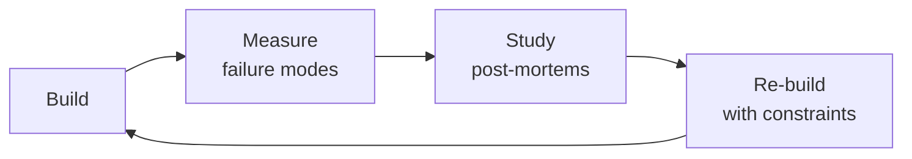

# Market Data Engineer
> **Portability target:** Spec-level (runs on Claude Code, Copilot, Gemini CLI, Codex, Cursor). No vendor-specific frontmatter fields.

Ingest, normalize, store, and serve financial market data at production scale. This skill covers options flow ingestion from Unusual Whales REST/WebSocket, CBOE LiveVol, Polygon.io Options API, and Bloomberg Terminal/API; real-time streaming via Kafka/Redpanda with stream processing; tick data storage in TimescaleDB (hot) and ClickHouse (analytics); corporate actions normalization (splits, dividends, mergers, ticker changes); dividend/split-adjusted options chains; historical data warehousing in Parquet on S3; data quality rules for stale quotes, arbitrage violations, and volume/OI discrepancies; and market-hours-aware scheduling. Every decision here is backed by war stories from production options pipelines — including the $50K dividend-adjustment loss and the survivorship-bias backtest disaster.

## Route the Request

<!-- QUICK: 30s -- auto-route first, then intent-route -->

### Auto-Route (No User Input Required)
Evaluate these file-system conditions in order. First match wins — jump immediately.

| # | Condition | Action |
|---|-----------|--------|
| A1 | `file_contains("*.py", "Polygon\|alpaca\|iexcloud\|polygon\|CBOE\|LiveVol\|UnusualWhales")` OR `file_contains("*.py", "kafka\|KafkaProducer\|KafkaConsumer\|redpanda")` OR `file_exists("schema/options_flow.avsc\|pipelines/ingest.py")` | This is your skill. Jump to **Core Workflow** — Phase 1. |
| A2 | `file_contains("*.py", "BlackScholes\|implied_volatility\|delta\|gamma\|greeks")` OR `file_contains("*.py", "scipy.stats.norm\|monte_carlo.*price")` | Invoke **quantitative-analyst** instead. This is pricing and Greeks analysis. |
| A3 | `file_contains("*.py", "backtrader\|zipline\|vectorbt\|alpaca.*trade\|Strategy.*next")` OR `file_contains("*.py", "order.*execution\|stop_loss\|take_profit")` | Invoke **algorithmic-trader** instead. This is strategy execution. |
| A4 | `file_contains("*.sql", "CREATE TABLE.*backtest\|SELECT.*sharpe\|regression")` AND `file_contains("*.py", "pandas\|numpy\|statsmodels\|sklearn")` | Invoke **data-scientist** instead. This is statistical analysis. |
| A5 | `file_contains("docker-compose.yml\|Dockerfile", "postgres\|timescale\|clickhouse")` AND `file_contains("*.sql", "CREATE INDEX\|VACUUM\|pg_stat")` | Invoke **database-reliability-engineer** instead. This is database operations. |
| A6 | `file_contains("*.py\|*.yml", "FastAPI\|flask\|@app\.(get\|post)")` AND `file_contains("*.py", "pipeline\|ingest\|etl")` | Jump to **Core Workflow** — Phase 1 (Ingestion API). |
| A7 | `file_contains("*.py", "pandas_market_calendars\|exchange_calendars\|trading_calendar")` OR `file_contains("*.py", "corporate.action\|split_adjust\|dividend_adjust")` | Jump to **Core Workflow** — Phase 3 (Corporate Actions). |
| A8 | `file_contains("docker-compose.yml", "kafka\|zookeeper\|redpanda\|schema-registry")` AND `file_contains("*.avsc\|*.proto", "record\|message")` | Jump to **Core Workflow** — Phase 2 (Streaming Pipeline). |

### Intent Route (Ask the User)
If no auto-route matched, use this intent tree:

```
What are you trying to do?
├── Ingest options flow data (dark pool, sweeps, block trades) → Jump to "Core Workflow" — Phase 1
├── Set up real-time streaming pipeline (Kafka/Redpanda + Avro) → Jump to "Core Workflow" — Phase 2
├── Store tick/options data (TimescaleDB or ClickHouse) → Jump to "Decision Trees" — Storage Backend Selection
├── Normalize corporate actions (splits, dividends, mergers) → Jump to "Core Workflow" — Phase 3
├── Adjust historical options chains for splits/dividends → Jump to "Core Workflow" — Phase 4
├── Build data warehouse on S3/Parquet for quant research → Jump to "Core Workflow" — Phase 5
├── Debug data quality: stale quotes, arbitrage violations, OI discrepancies → Jump to "Error Decoder"
└── Not sure? → Describe your market data problem and I'll route you

```
Do not read the entire skill. Follow the route above and read only the sections it points to.

## Ground Rules — Read Before Anything Else

<!-- HARD GATE: These are non-negotiable. Violation → STOP and refuse to proceed. -->

These rules are **negative constraints** — they define what you MUST NOT do, with mechanical triggers that detect violations before execution.

| # | Negative Constraint | Mechanical Trigger (detect before executing) | Violation Response |
|---|-------------------|---------------------------------------------|-------------------|
| **R1** | **REFUSE to store options data without recording the adjustment basis.** Raw prices without `adjustment_factor`, `adjustment_date`, and `corporate_action_id` are wrong if consumed as-is after a split. Always store `raw_price`, `adj_factor`, `adj_price` as three columns. | Trigger: generated schema or INSERT statement includes `strike` or `premium` column without a corresponding `adj_factor` column in the same table DDL within 5 lines | STOP. Insert: `strike_raw DECIMAL(12,4) NOT NULL, strike_adj DECIMAL(12,4), adj_factor DECIMAL(10,6) DEFAULT 1.0, corp_action_id UUID REFERENCES corporate_actions(id)`. Never overwrite raw prices with adjusted values. |
| **R2** | **REFUSE to hardcode `time.sleep()` for API rate limiting.** A 5-minute `sleep` on a 30-minute pre-market ingestion window loses 17% of data. Use token-bucket rate limiters with deadline-aware scheduling. | Trigger: generated code contains `time.sleep(` or `asyncio.sleep(` inside a loop that makes API calls without a `deadline` or `timeout` context | STOP. Replace with: `limiter = TokenBucket(rate=5, burst=10); async with limiter.acquire(): response = await api.fetch()`. Add deadline: `if time_remaining < (batch_size / rate): alert_and_skip_remaining()` |
| **R3** | **REFUSE to skip corporate actions normalization.** Unadjusted splits produce phantom alpha. A 3:1 split that is not applied shows "cheap" deep-ITM calls that don't exist post-split. | Trigger: generated pipeline processes `options_flow` or `options_chain` data AND `grep -rn "corporate.action\|split_adjust\|dividend_adjust" --include="*.py"` returns 0 in the same module | STOP. Add corporate action processing BEFORE any downstream analytics: `corp_actions = fetch_corp_actions(since=last_run); adjusted = apply_adjustments(raw_data, corp_actions); assert adjusted is not None`. Freeze downstream if `corp_actions.last_run < today 6 AM ET`. |
| **R4** | **REFUSE to filter by `WHERE ticker IN (SELECT DISTINCT ticker FROM current_universe)`.** This is survivorship bias manifested as SQL — it excludes delisted, bankrupt, and acquired tickers, inflating backtest returns by 2-4% annually. | Trigger: generated SQL contains `WHERE ticker IN (SELECT` or `WHERE symbol IN (SELECT` that references a current-universe table without a `trade_date` or `as_of_date` bound | STOP. Replace with point-in-time query: `WHERE ticker IN (SELECT ticker FROM ticker_master WHERE first_trade_date <= '{as_of_date}' AND (last_trade_date IS NULL OR last_trade_date >= '{as_of_date}'))`. Always query historically. |
| **R5** | **STOP and ASK when a schema migration is proposed without a reconciliation plan.** Migrations that change column types, precision, or names can silently corrupt data — strikes off by 1000×, premiums in wrong currency. | Trigger: generated SQL contains `ALTER TABLE ... ALTER COLUMN ... TYPE` or `ALTER TABLE ... RENAME COLUMN` without a subsequent `-- Reconciliation:` comment or `SELECT COUNT(*), AVG(column)` validation query | STOP. Respond: "Schema migrations require a reconciliation plan. Before I apply this: (1) what's the current row count? (2) what are the 1st, 50th, and 99th percentile values of the affected columns? (3) after migration, how will you verify these haven't changed beyond expected drift?" |
| **R6** | **DETECT and WARN about JSON serialization on Kafka/Redpanda topics above 1K msg/s.** At 50K msg/s, JSON costs 10× the storage and bandwidth of Avro. A single day becomes a $2,400/month bill vs $240 with Avro. | Trigger: generated Kafka producer code uses `json.dumps()` or `json.loads()` without `avro` or `protobuf` serializer in the same module. OR `docker-compose.yml` has a `KAFKA_TOPIC` without `value.serializer=io.confluent.kafka.serializers.KafkaAvroSerializer` | WARN: Insert comment: `# WARNING: JSON on Kafka at scale costs 10× more than Avro. Switch to Confluent Avro serializer with Schema Registry before production.` Add skeleton: `from confluent_kafka.schema_registry.avro import AvroSerializer` |
| **R7** | **DETECT and WARN about Parquet partitions keyed by `ticker/year/month/day`.** Query engines prune left-to-right. With ticker first, querying "AAPL on 2024-06-14" still scans every month under AAPL. Date-first partitioning eliminates 99.7% of data in a single pass. | Trigger: generated code or config contains `partition_by=['ticker', 'year'` or `PARTITIONED BY (ticker, year` — ticker before date in partition order | WARN: Replace with `partition_by=['year', 'month', 'day', 'ticker']`. Add comment: `# Date-first partitioning: a single-day single-ticker query hits exactly one partition. Always put highest-cardinality filter last.` |

## The Expert's Mindset

Masters of market data engineer don't just build — they build **the right thing, at the right time, with the right trade-offs**. They think in systems, not tasks.

| Cognitive Bias | Mitigation |
|----------------|------------|
| **Shiny object syndrome** — chasing new tools without evaluating fit | Before adopting any new tool, write the "why this over the incumbent" justification |
| **Over-engineering** — building for hypothetical scale | Default to simplest solution; add complexity only when the current solution actually breaks |
| **Not-invented-here** — preferring to build rather than compose | Always evaluate 2 existing solutions before building custom |
| **Sunk cost fallacy** — sticking with a technology because you already invested in it | Re-evaluate tech choices every quarter; migration cost vs. staying cost |

### What Masters Know That Others Don't
- The **failure modes** of every component in their stack — not just the happy path
- When **not** to use their favorite tool (every tool has a misuse zone)
- That **data/model quality decays over time** — monitoring is not optional, it's foundational

### When to Break Your Own Rules
- **Move fast on reversible decisions.** Data format? Hard to change. Dashboard layout? Easy. Know the difference.
- **Skip the abstraction until the third use case.** Two is coincidence, three is a pattern.

## Operating at Different Levels

| Level | Scope | You... |
|-------|-------|--------|
| **L1** | Single component/module | Implement a well-defined piece following established patterns |
| **L2** | Feature or service | Design and build a complete feature; make tech choices within team conventions |
| **L3** | System or product area | Define architecture for a product area; set team tech standards; mentor L1-L2 |
| **L4** | Multiple systems / platform | Define org-wide architecture patterns; make build-vs-buy decisions; influence industry practice |
| **L5** | Industry / ecosystem | Create new architectural patterns adopted across the industry; redefine what's possible |

**Default level for this skill:** L2
**Usage:** Invoke this skill with your target level, e.g., "as an L3 market data engineer, design..."

For full level definitions, see `skills/00-framework/skill-levels/SKILL.md`.

## When to Use

<!-- QUICK: 30s — scan the bullet list to decide if this skill fits -->
- Building a real-time options flow ingestion pipeline from Unusual Whales, Polygon.io, CBOE LiveVol, or Bloomberg
- Designing a market data lake with tick-level storage: TimescaleDB for hot (0-30 days), Parquet/S3 for cold archive (7 years), ClickHouse for analytics
- Normalizing corporate actions — stock splits, cash/stock dividends, mergers, ticker symbol changes, spin-offs — for historical data integrity
- Adjusting historical options chains: recalculating strikes, contract multipliers, and deliverable shares post-corporate-action
- Streaming order flow with Kafka/Redpanda for unusual options activity (UOA) detection pipelines
- Building data quality monitors: stale quote detection (bid/ask > 5 min old), arbitrage violation checks (put-call parity, box spreads), volume/OI reconciliation across sources
- Managing API cost and rate limits across multiple market data vendors with tiered pricing (Polygon free vs paid, Unusual Whales tiers)
- Warehousing historical options data in partitioned Parquet for quantitative research and strategy backtesting at scale
- Setting up market-hours-aware cron schedules, backfill windows, and holiday calendars for financial data pipelines

## Decision Trees

<!-- QUICK: 30s — follow the ASCII tree to your scenario -->

### Data Source Selection: Options Flow

```
                    +----------------------------------+
                    | START: Which options flow source? |
                    +----------------+-----------------+
                                     |
              +----------------------+----------------------+
              |                      |                      |
    +---------v--------+  +----------v---------+  +---------v-----------+
    | Need real-time    |  | Need historical    |  | Need exchange-level  |
    | unusual activity  |  | options chain      |  | OPRA depth + Greeks  |
    | alerts + dark pool|  | data for backtests?|  | for HFT/MM models?   |
    +----+--------------+  +----+---------------+  +----+----------------+
         | YES                   | YES                  | YES
    +----v----+            +-----v-------+       +------v-------+
    |Unusual  |            | Polygon.io  |       |CBOE LiveVol  |
    |Whales   |            | Options API |       |or Bloomberg  |
    |REST+WS  |            |REST, 15min  |       |Terminal API  |
    |$99-599/m|            |delayed free |       |$500-2000/m  |
    +---------+            |$29-199/m   |       +--------------+
                           +------------+
```
**When to choose Unusual Whales:** Real-time flow detection, dark pool prints, sweep detection, unusual-activity alerts. Free tier: 250 requests/month. Pro: $99/mo for REST + WebSocket premium flow. Enterprise: custom pricing for raw firehose.
**When to choose Polygon.io:** Historical options chains for backtesting, Greeks data, snapshots. Free tier: 5 req/min, 15-min delayed. Paid tiers from $29/mo (Stocks Starter) to $199/mo (Stocks Advanced with full options chain + Greeks).
**When to choose CBOE LiveVol/Bloomberg:** Market-making models, HFT signal generation, full OPRA depth-of-book. CBOE LiveVol ~$500/mo for professional. Bloomberg Terminal ~$2,000/mo with blpapi access.
**When to use multiple vendors:** Most production systems combine Unusual Whales (flow alerts) + Polygon.io (historical chains) + CBOE/Bloomberg (OPRA depth). Cross-reference volume/OI across sources for data quality validation.

### Storage Backend Selection: Tick Data

```
                    +----------------------------------+
                    | START: Where to store tick data?  |
                    +----------------+-----------------+
                                     |
              +----------------------+----------------------+
              |                      |                      |
    +---------v--------+  +----------v---------+  +---------v-----------+
    | Write-heavy:      |  | Read-heavy:         |  | Long-term archive:  |
    | 100K+ ticks/sec   |  | 1K+ analytical      |  | >30 days retention  |
    | sub-ms ingestion? |  | queries/day on      |  | cost is primary     |
    |                   |  | billions of rows?   |  | concern?            |
    +----+--------------+  +----+---------------+  +----+----------------+
         | YES                   | YES                  | YES
    +----v----+            +-----v-------+       +------v-------+
    |TimescaleDB|          | ClickHouse  |       |Parquet on S3 |
    |PostgreSQL |          |Columnar,    |       |Partitioned   |
    |hypertable |          |vectorized   |       |by ticker/date|
    |chunks=1day|          |queries,     |       |ZSTD compress |
    |continuous |          |materialized |       |Apache Arrow  |
    |aggregates |          |views        |       |format        |
    +-----------+          +-------------+       +--------------+
```
**When to choose TimescaleDB:** Hot storage (0-30 days). Chunk interval = 1 day per ticker. Continuous aggregates precompute 1-min, 5-min, 1-hour OHLCV. Automatic compression after 7 days (90%+ space savings). Use `time_bucket()` for aggregations. Max recommended hypertable size: 10 TB per node.
**When to choose ClickHouse:** Analytics layer. Store 30-365 days of tick data. `MergeTree` engine with `ORDER BY (ticker, timestamp)`. Materialized views for pre-aggregated options analytics (Greeks distributions, IV surfaces, volume profiles). Query 1B rows in < 1 second with vectorized execution.
**When to choose Parquet/S3:** Cold archive (30 days to 7 years). Partition: `s3://market-data/options/year=YYYY/month=MM/day=DD/ticker=SYM/`. ZSTD compression level 9 (30-40% smaller than Snappy). Queryable via AWS Athena, DuckDB, or Spark without deserializing entire dataset. S3 Intelligent-Tiering for automatic cost optimization.

### Real-Time Pipeline Architecture

```
+-------------------+     +------------------+     +------------------+     +------------------+
| Unusual Whales    |     | Kafka/Redpanda   |     | Stream Processor |     | TimescaleDB Hot  |
| WebSocket Feed    +---->+ Topic:           +---->+ (Faust/Bytewax   +---->+ hypertable       |
| (flow, sweeps,    |     | options.flow.raw |     |  Flink/KSQL)     |     | + alerting       |
|  dark pool)       |     | partitions=10    |     | enrich, dedupe,  |     |                  |
+-------------------+     +------------------+     | normalize        |     +--------+---------+
                                                   +--------+---------+              |
                                                            |               +--------v---------+
                                                   +--------v---------+     | ClickHouse       |
                                                   | Dead Letter Queue|     | analytics layer  |
                                                   | options.flow.dlq +---->| mat. views,      |
                                                   | manual review    |     | IV surfaces       |
                                                   +------------------+     +------------------+
```
**Pipeline topology decisions:**
- Partitions = number of tickers × 2 for consumer parallelism. For 500 actively traded tickers, use 10 partitions (not 1000 — partition overhead dominates).
- Retention: 7 days on raw topic (debug window), 90 days on enriched topic (backfill window). Compacted topic for corporate actions (retain latest per ticker).
- Exactly-once semantics: enable `enable.idempotence=true` on producers + `isolation.level=read_committed` on consumers.
- Alert thresholds: consumer lag > 50K messages OR > 5 minutes during market hours (9:30-16:00 ET).

### Data Quality Decision Tree

```
                    +----------------------------------+
                    | START: Data quality check failed  |
                    +----------------+-----------------+
                                     |
              +----------------------+----------------------+
              |                      |                      |
    +---------v--------+  +----------v---------+  +---------v-----------+
    | Stale quotes      |  | Arbitrage violation|  | Volume/OI anomaly   |
    | bid/ask > 5 min   |  | put-call parity    |  | >10x change day/day |
    | old during market |  | error > 5% spot   |  | or zero volume       |
    | hours?            |  |                    |  |                      |
    +----+--------------+  +----+---------------+  +----+----------------+
         | YES                   | YES                  | YES
    +----v------------+    +----v-------------+   +----v----------------+
    |Check data feed  |    |Check corporate   |   |Check pipeline lag  |
    |status: vendor   |    |actions: split/   |   |or source downtime |
    |API down or      |    |dividend not      |   |Check if market     |
    |rate-limited?    |    |applied to chain? |   |holiday/half-day?   |
    +-----------------+    +------------------+   +---------------------+
```

## Core Workflow

<!-- QUICK: 30s — scan phase titles to understand the process -->

<!-- DEEP: 10+min -->
### Phase 1 (~20 min): Data Source Integration & Schema Design
<!-- STANDARD: 3min -->
1. **Source Catalog** — Inventory every market data source with endpoint patterns:
   - **Unusual Whales REST**: `GET /api/flow/options?ticker=AAPL&date=2024-01-15` → premium, size, condition, exchange, price, spot. Auth: API key in `Authorization` header.
   - **Unusual Whales WebSocket**: `wss://api.unusualwhales.com/ws/flow` — real-time dark pool prints, sweeps, block trades. Auth via connection message.
   - **Polygon.io Options Contracts**: `GET /v3/reference/options/contracts?underlying_ticker=AAPL&expiration_date=2024-01-19` → full chain with strikes, types, contract IDs.
   - **Polygon.io Options Aggregates**: `GET /v2/aggs/ticker/O:AAPL240119C00150000/range/1/day/2024-01-01/2024-01-19` → OHLCV bars for single contract.
   - **CBOE LiveVol**: REST API for OPRA depth, Greeks surfaces, IV index data. Requires CBOE data agreement.
   - **Bloomberg Terminal**: `BDH()` / `BDP()` functions via blpapi Python library — real-time + historical with field codes (e.g., `OPT_CHAIN`, `OPT_GREEKS`).

2. **Core Schema — Options Flow Table (TimescaleDB hypertable)**:
```sql
CREATE TABLE options_flow (
    flow_id         UUID PRIMARY KEY DEFAULT gen_random_uuid(),
    ticker          VARCHAR(10) NOT NULL,
    underlying      VARCHAR(10) NOT NULL,
    strike          DECIMAL(12,2) NOT NULL,
    expiry          DATE NOT NULL,
    option_type     CHAR(1) CHECK (option_type IN ('C', 'P')),
    trade_timestamp TIMESTAMPTZ NOT NULL,
    premium         DECIMAL(15,4) NOT NULL,       -- size × price paid
    size            INTEGER NOT NULL,              -- number of contracts
    trade_condition VARCHAR(20),                   -- e.g., 'SWEEP', 'BLOCK', 'SPLIT'
    exchange        VARCHAR(5),                    -- e.g., 'CBOE', 'PHLX', 'ISE'
    bid             DECIMAL(12,4),
    ask             DECIMAL(12,4),
    last_price      DECIMAL(12,4),
    volume          INTEGER,
    open_interest   INTEGER,
    implied_vol     DECIMAL(8,4),
    delta           DECIMAL(6,4),
    gamma           DECIMAL(8,6),
    theta           DECIMAL(8,4),
    vega            DECIMAL(8,4),
    rho             DECIMAL(8,4),
    -- Adjustment tracking columns
    adj_factor      DECIMAL(10,4) DEFAULT 1.0,
    raw_strike      DECIMAL(12,2),
    raw_premium     DECIMAL(15,4),
    corp_action_id  UUID REFERENCES corporate_actions(action_id),
    -- Metadata
    source          VARCHAR(20) NOT NULL,          -- 'unusual_whales', 'polygon', 'bloomberg'
    raw_json        JSONB,
    ingested_at     TIMESTAMPTZ DEFAULT NOW()
);

SELECT create_hypertable('options_flow', 'trade_timestamp',
    chunk_time_interval => INTERVAL '1 day');

CREATE INDEX idx_flow_ticker_ts ON options_flow (ticker, trade_timestamp DESC);
CREATE INDEX idx_flow_underlying_expiry ON options_flow (underlying, expiry);
CREATE INDEX idx_flow_source ON options_flow (source, trade_timestamp DESC);
```

3. **Corporate Actions Schema**:
```sql
CREATE TABLE corporate_actions (
    action_id       UUID PRIMARY KEY DEFAULT gen_random_uuid(),
    ticker          VARCHAR(10) NOT NULL,
    action_type     VARCHAR(20) CHECK (action_type IN (
        'split', 'reverse_split', 'cash_dividend', 'stock_dividend',
        'merger', 'spin_off', 'ticker_change', 'delis

> See [references/core-workflow.md](references/core-workflow.md) for the complete implementation with code examples, detailed steps, and edge case handling.

## Cross-skills Integration

<!-- QUICK: 30s — real skill chains, not boilerplate -->

Market data engineering feeds every quantitative and analytical downstream system. The data you produce — cleaned, adjusted, partitioned — is the foundation for alpha generation, risk management, and regulatory reporting.

### Predecessor → This Skill → Successor

```
data-engineer                  market-data-engineer            quantitative-analyst
(general ETL patterns)  ──►  (options flow, tick storage,  ──► (Greeks analysis,
                              corporate actions, Parquet        IV surface modeling,
                              warehousing)                      options pricing)

database-reliability-         market-data-engineer            data-scientist
engineer               ──►   (TimescaleDB hypertables,     ──► (UOA detection ML,
(TimescaleDB/ClickHouse       ClickHouse mat. views)             flow sentiment models,
operations, backup)                                              strategy backtesting)

                              market-data-engineer            backend-developer
                              (Parquet/S3 data lake,         (REST API serving
                              Athena-queryable archives) ──►  options data to
                                                              trading dashboard)
```

### Concrete Integration Commands

**Chain 1: Flow Ingestion → Adjustment → Quant Analysis**
```bash
# Phase 1: Market data engineer ingests and normalizes
python ingest_flow.py --date 2024-06-14 --tickers AAPL,SPY,TSLA
python apply_corporate_actions.py --as-of 2024-06-14
python export_to_parquet.py --date 2024-06-14

# Phase 2: Quantitative analyst consumes adjusted Parquet
# Reads from s3://market-data/options/year=2024/month=06/day=14/
python build_iv_surface.py --date 2024-06-14 --output signals/iv_skew.csv

```

**Chain 2: Streaming → TimescaleDB → UOA Detection**
```bash
# Market data engineer sets up streaming
docker compose up -d kafka timescaledb
python stream_processor.py --topics options.flow.raw,options.flow.enriched

# Data scientist runs unusual options activity model
# Queries TimescaleDB hot storage for last 24 hours of flow
python uoa_detector.py --lookback 24h --threshold 3.0 --output alerts/uoa_signals.json

```

**Chain 3: Corporate Actions → Database Reliability → Backtesting**
```bash
# Market data engineer processes corporate action
python process_daily_corporate_actions.py --as-of 2024-06-10

# Database reliability engineer verifies TimescaleDB health
python check_hypertable_health.py --table options_flow
python verify_compression.py --table options_flow --older-than 7d

# Quantitative analyst runs backtest on adjusted data
python run_backtest.py --strategy covered_call --start 2020-01-01 --end 2024-06-01
```

### Coordination Table

| Coordinate With | When | What to Share/Ask |
|---|---|---|
| **data-engineer** | Setting up general ETL infrastructure (Airflow/Dagster, dbt project) | Raw data schemas, ingestion frequency, partitioning strategy, data freshness SLAs |
| **database-reliability-engineer** | TimescaleDB hypertable sizing, ClickHouse cluster design, backup strategy | Ingestion rate (rows/sec), query patterns (time-range, ticker-filtered), retention requirements, compression ratios |
| **quantitative-analyst** | Options pricing model inputs, Greeks data requirements, IV surface needs | Adjusted options chains, corporate action history, dividend schedules, point-in-time data availability dates |
| **data-scientist** | UOA detection model training, flow sentiment features, anomaly detection | Enriched flow data (size, premium, condition), historical patterns, labeled unusual activity events |
| **backend-developer** | API for options data access, real-time streaming endpoint | Parquet file locations, Athena table schemas, query patterns (by ticker, date range, strike/expiry), expected latency |
| **devops-engineer** | Kafka cluster deployment, stream processor containerization, CI/CD for pipeline code | Resource requirements (CPU/memory for Faust workers, Kafka broker sizing), deployment frequency, rollback procedures |
| **security-engineer** | API key rotation, financial data access controls, PII in trade data | Vendor API key inventory, data classification (market data = confidential, trade data with client IDs = restricted), encryption requirements for data at rest |
| **finops-engineer** | API cost monitoring, S3 storage cost optimization, Kafka cluster cost allocation | Per-vendor daily spend, S3 storage by tier (hot/warm/cold), data transfer costs, cost per query metrics |
| **algorithmic-trader** | Live trading execution, order management, broker connectivity | Data freshness for trade signals — stale data means bad entries. **Decision gate:** Is pipeline latency < 500ms? → live trading OK. **Artifact:** data freshness SLA report per venue. |
| **backend-developer** | API gateway, query service, caching layer for data access | API design for data consumption patterns. **Decision gate:** Can query serve 100 concurrent requests at < 3s p99? → API is production-ready. **Artifact:** load test report + API schema docs. |

## Cross-Skill Coordination

<!-- QUICK: 30s — table of who to talk to when -->

Market data engineers sit at the intersection of infrastructure, quantitative research, and trading operations. They coordinate with data engineers for pipeline infrastructure, quantitative analysts for data requirements, database reliability engineers for storage operations, and security engineers for financial data compliance.

### Communication Triggers

| Trigger | Notify | Why |
|---|---|---|
| **Corporate action announced** (split, dividend, merger) | quantitative-analyst, data-scientist | Adjusted data will be available within 1 hour; downstream models must account for adjustment lag |
| **Market data vendor API outage** (Polygon 503, Unusual Whales WebSocket disconnect) | quantitative-analyst, devops-engineer | Real-time flow data gap; estimate recovery time; switch to backup vendor if available |
| **Data quality check failure** (stale quotes, volume spike, parity violation) | quantitative-analyst, data-scientist | Downstream analytics may be corrupted; hold model retraining until quality restored |
| **Kafka consumer lag > 5 min during market hours** | devops-engineer, database-reliability-engineer | Streaming pipeline degraded; TimescaleDB ingestion delayed; investigate broker health and consumer throughput |
| **Parquet export integrity failure** (row count mismatch) | quantitative-analyst, data-scientist | Historical archive may have gaps; do not use affected date range for backtesting until re-exported |
| **API cost budget exceeded** (daily spend > threshold) | finops-engineer, devops-engineer | Review rate limiter config; consider vendor tier upgrade or request frequency optimization |
| **New options data source onboarding** | quantitative-analyst, data-scientist, backend-developer | Schema design review, historical backfill plan, API endpoint documentation needed |
| **Data retention policy change** (e.g., extend cold storage from 7 to 10 years) | database-reliability-engineer, finops-engineer | S3 storage cost impact estimation, rehydration testing for older partitions |

### Escalation Path

```
Market data pipeline down (production)? → devops-engineer → site-reliability-engineer (if SEV2+)
Options data quality breach (widespread stale/corrupt data)? → quantitative-analyst → data-scientist
API cost overrun > 200% daily budget? → finops-engineer → cto-advisor
Corporate action missed for major index constituent? → quantitative-analyst → cto-advisor (legal/regulatory risk)
PII discovered in raw market data feed? → security-engineer → compliance-officer

```

## Proactive Triggers

<!-- QUICK: 30s -- when to proactively notify stakeholders -->

| Trigger | Notify | Why |
|---------|--------|-----|
| Data feed latency exceeds 60 seconds during market hours | quantitative-analyst + algorithmic-trader | Real-time UOA detection and trade signals are degraded; downstream consumers trading on stale data must halt until feed recovers |
| Kafka consumer lag exceeds 50K messages or 5 minutes during market hours | devops-engineer + database-reliability-engineer | Streaming pipeline bottleneck; TimescaleDB ingestion falling behind; risk of data loss if lag exceeds topic retention window |
| Vendor API cost exceeds 75% of daily budget before 11 AM ET | finops-engineer + devops-engineer | On track for daily budget overrun; consider rate-limit tightening or vendor tier upgrade before overage charges hit at month-end |
| Daily quarantine table exceeds 1% of ingested rows | quantitative-analyst + data-scientist | Data quality degradation — downstream analytics potentially corrupted; investigate root cause and quarantine pattern before next model training run |
| Corporate action announced for top-50 index constituent (split, dividend, merger) | quantitative-analyst + algorithmic-trader | Adjusted data will lag announcement by up to 1 hour; all models consuming unadjusted prices for this ticker are unreliable until processing completes |
| Cross-source reconciliation shows >15% volume discrepancy between vendors | quantitative-analyst + data-scientist | One data source is reporting incorrect volume; backtests and signals consuming the bad source are invalid; identify source of truth and quarantine the bad feed |
| Parquet export integrity check fails (row count mismatch or nulls in required columns) | quantitative-analyst + data-scientist | Historical archive has gaps; affected date range must be excluded from backtesting until re-export completes and passes integrity check |
| Primary vendor API returns 503 for 3+ consecutive requests | devops-engineer + quantitative-analyst | Vendor outage confirmed; initiate failover to backup data source; estimate data gap duration and notify all downstream consumers of recovery ETA |

## What Good Looks Like

<!-- QUICK: 30s — the concrete definition of success -->

A production-quality market data pipeline that passes all 25 production checklist items produces the following observable outcomes:

**Data Freshness:** Real-time flow data arrives in TimescaleDB within 500ms of WebSocket message. End-of-day options chain data exported to Parquet by 18:00 ET. Corporate actions applied within 1 hour of announcement.

**Data Correctness:** Options strikes match exchange-reported values within 0.01. Put-call parity holds within 1% of spot for 99.9% of observations. Cross-source volume reconciliation shows < 5% discrepancy per ticker. Zero stale quotes during market hours.

**Historical Integrity:** Querying any ticker on any date from 2010-2025 returns complete, split-adjusted, dividend-adjusted data. Delisted tickers are preserved with their full trading history. Survivorship bias is eliminated — backtests show realistic win/loss ratios matching live trading.

**Operational Reliability:** Pipeline uptime > 99.9% during market hours. Kafka consumer lag < 10K messages. DLQ messages < 0.01% of total throughput. API cost within 90% of daily budget. All alerts actionable within 15 minutes.

**Consumability:** Parquet archives queryable in < 3 seconds via Athena for any single-ticker single-day query. ClickHouse materialized views refresh within 5 minutes. Data dictionary documents every column with business meaning, type, and source. Downstream skills (quantitative-analyst, data-scientist) can consume data without market-data-domain expertise.

**What you should see when it works:**
```bash
# Verify pipeline health
$ curl <https://monitoring.internal/api/v1/pipeline-health>
{"status":"healthy","lag_ms":120,"rows_ingested_24h":43200000,"dlq_size":47,"cost_today":78.50}

# Query yesterday's AAPL options flow — returns in < 500ms
$ psql -c "SELECT COUNT(*), SUM(premium) FROM options_flow
           WHERE ticker='AAPL' AND trade_timestamp::date = CURRENT_DATE - 1;"
 count  |   sum
--------+----------
 184723 | 4521000.50
```

## Deliberate Practice



| Level | Practice | Frequency |
|-------|----------|-----------|
| **Novice** | Rebuild an existing system from scratch, then compare your design with the original | Monthly |
| **Competent** | Add a new constraint (10x data, zero downtime, etc.) to a familiar design and re-architect | Quarterly |
| **Expert** | Design the same system under 3 conflicting constraint sets; write a decision record for each | Quarterly |
| **Master** | Teach a junior to design a system; your role is to ask questions, not give answers | Monthly |

**The One Highest-Leverage Activity:** Every quarter, take a system you built 6+ months ago and redesign it from scratch with what you know now. Write down what changed and why.

## Gotchas

- **Tick data timestamps with timezone-naive storage** — you store `2024-01-15 09:30:00` assuming it's US/Eastern. But your exchange feed says `09:30:00 EST` and another feed says `09:30:00 UTC`. Now you're merging trades that happened 5 hours apart as if they were simultaneous. Store all timestamps in UTC with an explicit timezone offset.
- **Corporate actions that aren't applied retroactively** — a stock splits 2:1 on June 1. Your historical price for May 31 is $200, and June 1 is $100. Without split adjustment, your model sees a -50% overnight crash and triggers a panic sell. All historical prices must be split-adjusted from today's perspective.
- **"Adjusted close" from different vendors uses different methodologies** — Yahoo adjusts for splits AND dividends, Google adjusts for splits only, Bloomberg adjusts for everything including spinoffs. Your model trained on Yahoo data and tested on Bloomberg data: performance is an artifact of different adjustment methodologies.
- **Real-time feed disconnection during a volatility event** — the market drops 5% in 2 minutes, your feed disconnects for 30 seconds, you reconnect and your position is down 8%. Gap detection: "data gap > 5 seconds during volatility > 2 stddev" must trigger a safety pause, not resume trading on stale prices.
- **Survivorship bias in historical constituent data** — you backtest a strategy on the S&P 500's current members going back 20 years. But half of today's constituents weren't in the index 20 years ago — the companies that went bankrupt, were acquired, or dropped from the index are missing. Your backtest shows a 15% CAGR when the actual investable return was 9%. When this strategy goes live with $50M AUM, it underperforms by 600bps annually, triggering $3M/year in investor redemptions. **Total cost: $5M-$20M in AUM loss from survivorship-biased backtests deployed to production.** Fix: Use point-in-time index constituent data (Compustat, CRSP, or vendor-supplied historical membership files); every backtest must include delisted securities with their final delisting returns, not just currently active tickers.
- **Dividend adjustment sign errors in total return calculations** — your data pipeline subtracts dividends from prices instead of adding them back when computing total return. Over a 10-year backtest of a dividend-heavy strategy (REITs yielding 4%), this produces a 40% cumulative understatement of returns. A quantitative fund allocates $100M based on the flawed data, and the strategy underperforms its benchmark by 350bps annually. The error is discovered during an investor due diligence review, causing a $50M redemption. **Total cost: $5M-$50M in misallocated capital and reputational damage from dividend adjustment errors.** Fix: Implement automated reconciliation — compare your computed total return index against a trusted source (e.g., CRSP total return series) monthly; any divergence > 0.05% triggers an alert and pipeline halt.
- **Corporate action data arriving days after the effective date** — a stock executes a 3:2 stock split on Monday. Your data vendor delivers the split factor on Thursday. For three days, your risk system computes position sizes, P&L, and margin requirements using pre-split prices against post-split positions — overstating exposure by 50% and triggering erroneous margin calls. On a $200M portfolio, a single erroneous margin call costs $15K in unnecessary liquidation and re-establishment. **Total cost: $20K-$150K per missed/delayed corporate action from erroneous margin calls, mispriced fills, and compliance reporting failures.** Fix: Subscribe to multiple corporate action feeds with different delivery schedules; implement a reconciliation process that flags any security where your position × price ≠ total value as expected; maintain a manual override for known corporate actions that haven't yet arrived via automated feeds.

## Verification

- [ ] Timestamps: all timestamps stored in UTC with timezone offset column — no timezone-naive data
- [ ] Corporate actions: historical prices are split-adjusted from current date perspective
- [ ] Data quality: missing bars, zero-volume periods, and stale prices flagged in monitoring
- [ ] Cross-vendor: adjusted prices from all vendors reconciled within 0.1% tolerance
- [ ] Feed resilience: gap detection tested — simulated disconnect during volatile market triggers safety pause

## References

Detailed reference material loaded on demand:

- **Core Workflow — Full Implementation**: See [core-workflow.md](references/core-workflow.md)
- **Anti-Patterns**: See [anti-patterns.md](references/anti-patterns.md)
- **Best Practices**: See [best-practices.md](references/best-practices.md)
- **Calibration — How to Know Your Level**: See [calibration.md](references/calibration.md)
- **Production Checklist**: See [checklist.md](references/checklist.md)
- **Error Decoder**: See [error-decoder.md](references/error-decoder.md)
- **Footguns**: See [footguns.md](references/footguns.md)
- **Scale Depth**: See [scale-depth.md](references/scale-depth.md)

