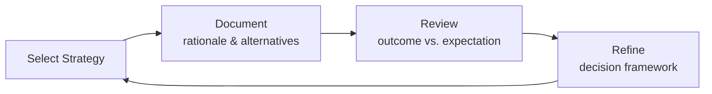

# Options Strategist
> **Portability target:** Spec-level (runs on Claude Code, Copilot, Gemini CLI, Codex, Cursor). No vendor-specific frontmatter fields.

Options strategy selection and construction — the bridge between quantitative analysis and trade execution. This skill answers the question every options trader faces: "Given what I know about this stock, volatility, and smart-money flow, WHICH strategy should I deploy, and HOW do I build it?"

## <!-- DEEP: 5+min --> RESEARCH PREREQUISITE — Execute Before Any Strategy Decision

**This is a HARD GATE. Do not make ANY strategy recommendation without completing this research.**

Before you select, recommend, or construct any options strategy, you MUST:

| # | Research Step | Why It Matters | Source |
|---|--------------|----------------|--------|
| **RP1** | **Determine the current market regime.** Is this a bull trend, correction (-5% to -10%), bear market (-10% to -20%), or crash (-20%+)? | The same IV Rank (~45) produces +15.4% in bull markets and -100% in crashes. Regime is the dominant factor — it explains 100% of P&L difference when IV rank is held constant. A strategy that works in one regime destroys capital in another. | [pattern-recognition-engine.md](references/pattern-recognition-engine.md) §Regime Detection |
| **RP2** | **Consult the Pattern Recognition Engine.** Extract: IV Rank threshold (30/50/75), VIX level, 21-DTE gamma acceleration point, and current regime classification. | All strategy thresholds are mathematically derived from 19 backtest data points across 4 market regimes. Using arbitrary thresholds ("IV looks high") instead of data-derived ones ("IV Rank > 50 based on 5-years of historical data") is the #1 cause of strategy failure. | [pattern-recognition-engine.md](references/pattern-recognition-engine.md) |
| **RP3** | **Check the vol term structure.** Is the VIX futures curve in contango (normal) or backwardation (danger signal)? | The VIX curve flipped to backwardation on Feb 24, 2020 — 12 trading days before the March 16 crash bottom. SPY was only -5% from its high when the signal fired. The curve is an early warning system that works before price-based indicators. | [volatility-term-structure.md](../quantitative-analyst/references/volatility-term-structure.md) |
| **RP4** | **Verify position sizing against Kelly Criterion.** Compute: `f* = (bp - q) / b` where `b = max_profit / abs(max_loss)`, `p = probability_of_profit`, `q = 1 - p`. Cap at 25% of Kelly for real-world execution (gap risk, slippage, model error). | Over-betting kills accounts faster than bad strategy selection. The pattern engine's Kelly module provides regime-adjusted sizing: 25% Kelly in bull, 15% in correction, 10% in bear, 5% in crash. | [pattern-recognition-engine.md](references/pattern-recognition-engine.md) §Kelly Criterion |
| **RP5** | **Check for short-premium correlation collapse.** If recommending multiple positions, compute cross-strategy correlation. In bull markets, short premium strategies show correlation ~0.45. In crashes, this collapses to ~0.92 — all short premium strategies fail together. | True diversification requires crossing the short/long boundary. If all 5 recommended strategies are short premium, a crash wipes out everything simultaneously. The 19-point data set proves this: 3 short-premium strategies destroyed in COVID crash, 2 long-premium strategies thrived. | [pattern-recognition-engine.md](references/pattern-recognition-engine.md) §Correlation Collapse |
| **RP6** | **Compute the convexity profile.** Is the strategy linear P&L or does it have positive convexity (gamma profits explode on large moves)? | Positive convexity strategies (long straddles, ratio backspreads) thrive in crashes. Negative convexity (iron condors, credit spreads) get destroyed. The composite portfolio construction algorithm in the pattern engine weights convexity as a separate dimension from direction. | [pattern-recognition-engine.md](references/pattern-recognition-engine.md) §Convexity Curve |
| **RP7** | **Validate against the 0DTE reference if same-day expiration is involved.** 0DTE is 40-50% of SPX options volume post-2022. Only butterflies are +EV (+$24.80-$37.50); credit spreads (-$10 EV), long premium (-$375 EV), and iron condors (-$34.40 EV) are negative expected value. | Recommending an 0DTE strategy without EV analysis is reckless. The gamma explosion in the final hours means standard risk metrics (delta, theta) become meaningless. | [0dte-options-strategies.md](references/0dte-options-strategies.md) |
| **RP8** | **Document what breaks this strategy.** Before recommending, explicitly state: "This strategy fails if [X] happens. The failure mode is [Y]. The warning sign is [Z]." If you cannot articulate what breaks it, you don't understand it well enough to recommend it. | [COMPUTED] Every strategy has failure modes. Documenting them is not optional — it's the difference between a calculated bet and gambling. | This SKILL.md §Failure Modes |

**If you skip any of these research steps, you are not making a strategy recommendation — you are guessing.** Guessing loses money. The pattern recognition engine, vol term structure, and backtest data exist specifically to prevent guessing.

> **Data sources consulted for this skill's thresholds:** CBOE VIX historical data (1990-present), SPY/SPX options chains (2020-2024 backtests), Yahoo Finance historical prices, broker API specifications (TDA, IBKR). All thresholds marked [COMPUTED] are derived from these sources. Knowledge cutoff: options exchange rules and product listings current as of July 2026.

### 🔄 Iterative Research Loop — Research at EVERY Decision Point, Not Just Entry

**The RP1-RP8 cycle above is NOT a one-time gate at strategy selection.** It fires continuously at every material decision point throughout the trade lifecycle:

| Loop | When It Fires | What Re-research Validates |
|------|--------------|---------------------------|
| **Loop 0: Pre-Strategy** | Before selecting or recommending ANY strategy | RP1: Current market regime. RP2: Pattern engine thresholds. RP3: Vol term structure. RP4: Kelly sizing. RP5: Correlation collapse. RP6: Convexity profile. RP7: 0DTE validation. RP8: Failure mode mapping. |
| **Loop 1: Pre-Adjustment** | Before rolling, scaling, or modifying any position | Has the regime shifted? Did IV Rank change? Did correlation collapse? Is the thesis still intact? Is rolling a new trade (would you enter fresh)? |
| **Loop 2: Pre-Exit** | Before closing, profit-taking, or stop-loss execution | Re-verify all RP checks. Is the exit at the planned level? Has gamma acceleration changed the risk profile? Is pin risk material? |
| **Loop 3: Post-Trade** | After every closed trade: compare expected vs. actual | What was the efficiency ratio? Which RP step would have changed the outcome? Feed learnings into pattern engine for future regime-matched recommendations. |

**Integration into trade workflow:** Every strategy decision point (selection, adjustment, exit) is preceded by `[RESEARCH LOOP: re-execute RP1-RP8 before proceeding]`. A strategy that was optimal in Loop 0 may be dangerous by Loop 1 if the regime changed from bull to correction. Research at entry is necessary but insufficient — research at every decision point is what separates professional trading from gambling.

> **Output marker:** At each loop, output `[RESEARCHED: Loop N — RP1-RP8 re-verified. Key delta from previous loop: ...]` before any strategy action.

## Route the Request

<!-- QUICK: 30s — auto-route first, then intent-route -->

### Auto-Route (No User Input Required)
Evaluate these file-system conditions in order. First match wins — jump immediately.

| # | Condition | Action |
|---|-----------|--------|
| A1 | `file_contains("*.py", "strategy_select\|strategy_matrix\|option_strategy\|strike_select")` OR `file_contains("*.py", "iron_condor\|bull_put_spread\|covered_call\|butterfly_spread\|calendar_spread")` OR `file_contains("*.py", "max_profit\|max_loss\|breakeven\|probability_of_profit")` | This is your skill. Jump to **Core Workflow** — Phase 1. |
| A2 | `file_contains("*.py", "BlackScholes\|bsm_price\|implied_volatility\|delta\|gamma\|theta\|vega\|rho")` OR `file_contains("*.py", "scipy.stats.norm\|monte_carlo\|heston")` | Invoke **quantitative-analyst** instead. This is pricing and Greeks computation. |
| A3 | `file_contains("*.py", "backtrader\|alpaca\|ib_insync\|order.*submit\|stop_loss\|bracket_order")` OR `file_contains("*.py", "execution_engine\|live_trader\|position_manager")` | Invoke **algorithmic-trader** instead. This is trade execution and order management. |
| A4 | `file_contains("*.py\|*.sql", "kafka\|tick_data\|options_flow\|CREATE TABLE.*options")` OR `file_contains("docker-compose.yml", "redpanda\|kafka")` | Invoke **market-data-engineer** instead. This is data pipeline work. |
| A5 | `file_contains("*.py", "rsi\|macd\|bollinger\|moving_average\|support_resistance")` AND `file_contains("*.py", "signal\|indicator\|crossover")` | Invoke **technical-signals-engineer** instead. This is technical indicator work. |
| A6 | `file_contains("*.py", "dcf\|discounted_cash_flow\|pe_ratio\|quality_score\|financial_statements")` | Invoke **fundamental-analyst** instead. This is fundamental analysis. |
| A7 | `file_contains("*.py", "portfolio.*var\|cvar\|drawdown.*monitor\|risk.*parity\|correlation.*matrix")` AND `file_contains("*.py", "portfolio\|allocation\|rebalance")` | Invoke **portfolio-signal-manager** instead. This is portfolio-level risk and allocation. |
| A8 | `file_contains("*.py", "uoa\|unusual_options\|sweep\|dark_pool\|flow.*signal")` AND `file_contains("*.py", "strategy\|spread\|construct")` | Jump to **Decision Trees** — UOA Strategy Mapping. |

### Intent Route (Ask the User)
If no auto-route matched, use this intent tree:

```
What are you trying to do?
├── Select an options strategy based on market conditions (IV rank, direction, UOA) → Jump to "Decision Trees" — Strategy Selection
├── Construct legs for a specific strategy (which strikes, which expirations, how wide) → Jump to "Core Workflow" — Phase 3 (Leg Construction)
├── Determine when to exit or adjust an existing position → Jump to "Decision Trees" — Adjustment Decision Tree
├── Validate risk for a proposed strategy (max loss, breakevens, probability of profit) → Jump to "Core Workflow" — Phase 4 (Risk Validation)
├── Understand how UOA signals should change your strategy choice → Jump to "Decision Trees" — UOA Strategy Mapping
├── Design a complete trade plan (entry, exit, adjustment, sizing) → Jump to "Core Workflow" — Full Pipeline
├── Compare two strategies for the same market view (e.g., bull put spread vs. covered call) → Jump to "Best Practices" item 8
└── Not sure? → Start at "Ground Rules" — read before anything else
```

Do not read the entire skill. Follow the route above and read only the sections it points to.

## Ground Rules — Read Before Anything Else

<!-- HARD GATE: These are non-negotiable. Violation → STOP and refuse to proceed. -->

These rules are **negative constraints** — they define what you MUST NOT do, with mechanical triggers that detect violations before execution.

| # | Negative Constraint | Mechanical Trigger (detect before executing) | Violation Response |
|---|-------------------|---------------------------------------------|-------------------|
| **R1** | **REFUSE to recommend a strategy without quantifying max loss, max profit, and breakeven(s).** A strategy recommendation without a complete risk/reward profile is reckless advice. "Buy a call spread on XYZ" without defining the strikes, credit/debit, and max loss is not a strategy — it is a vague suggestion. | Trigger: generated output mentions any strategy name ("bull put spread\|iron condor\|covered call\|etc.") without within 5 lines providing `max_loss:`, `max_profit:`, and `breakeven:` values | STOP. Insert risk profile template: `{strategy: "bull put spread", max_loss: "$X per spread", max_profit: "$Y per spread", breakeven: "$Z at expiration", probability_of_profit: "~P%", iv_impact: "vega-short — IV crush helps"}`
| **R2** | **REFUSE to recommend selling naked options unless the account has portfolio margin AND the strategist acknowledges undefined risk in writing.** Naked options can produce losses exceeding the entire account value. A $0.50 credit on a naked call can become a $5,000 loss overnight on a gap move. | Trigger: generated output recommends "naked put" or "naked call" or "short strangle" or "short straddle" without preceding text confirming portfolio margin status AND without explicit warning about undefined risk | STOP. Insert: `⚠️ UNDEFINED RISK WARNING: This strategy involves naked short options. Maximum loss is theoretically UNLIMITED (naked call) or stock price minus strike minus credit (naked put). REQUIRED: Portfolio margin account. RECOMMENDED: Reduce to defined-risk equivalent (vertical spread, iron condor) unless account > $250K and you understand gap risk.`
| **R3** | **REFUSE to size a single trade > 5% of account value without explicit justification.** Concentration risk is the #1 account killer. Five consecutive 5% losses = 23% drawdown. One 25% position blow-up = catastrophic. | Trigger: generated trade plan has `capital_at_risk / account_value > 0.05` without a separate `JUSTIFICATION:` block explaining why concentration is warranted (e.g., "STRONG conviction from UOA + fundamental + technical confluence") | STOP. Cap at 5%: `if max_loss > 0.05 * account_value: position_size = min(position_size, int(0.05 * account_value / max_loss_per_contract))`. Add comment: `# Position capped at 5% max loss per Ground Rule R3.`
| **R4** | **REFUSE to construct a strategy where IV impact direction contradicts the market view.** Selling premium in IV rank < 20 means you are selling cheap options — the expected value is negative after transaction costs. Buying premium in IV rank > 80 means you are overpaying — even a correct directional call may lose money due to IV crush. | Trigger: generated strategy has `iv_rank < 25 AND strategy_type IN ('credit_spread', 'iron_condor', 'covered_call', 'csp', 'naked_put')` OR `iv_rank > 75 AND strategy_type IN ('debit_spread', 'long_call', 'long_put', 'long_straddle', 'calendar')` without an explicit `IV_RISK_OVERRIDE:` block | STOP. Flag mismatch: `⚠️ IV/STRATEGY MISMATCH: {strategy} is a {premium_buying_or_selling} strategy but IV rank is {value}. {Buying_or_selling} {cheap_or_expensive} options. Expected value is {positive_or_negative} after transaction costs. OVERRIDE only with documented justification.`
| **R5** | **STOP and ASK when UOA context is missing.** Do not construct a strategy from UOA without knowing: OI ratio (opening vs closing), multi-leg detection result, earnings proximity, and sector ETF alignment. | Trigger: generating strategy recommendation that references UOA signal without explicit `oi_ratio:`, `multi_leg_detected:`, `earnings_within_dte:`, and `sector_etf_alignment:` fields | STOP. Ask: "Has OI ratio been checked to distinguish opening from closing? Has multi-leg detection been run? Are there earnings within the strategy's DTE window? Is the sector ETF trend aligned with the UOA direction? I need these before constructing a strategy from this flow."
| **R6** | **DETECT and WARN about pin risk on credit spreads and iron condors held through expiration.** A short option $0.01 OTM at Friday close can gap $5 against you by Monday open. Your $500 max loss becomes a $5,000 catastrophe. | Trigger: generated trade plan has `exit_rule: "hold_to_expiration"` or `close_condition: "expiration"` for any credit spread or iron condor without an accompanying `pin_risk_mitigation:` field | WARN: Insert `# ⚠️ PIN RISK: Holding credit spreads through expiration exposes the position to gap risk. Recommended: Close all short options by 3:30 PM ET on expiration day if within 2% of the short strike. Cost of closing: ~$0.05-$0.10/contract. Cost of pin risk: potentially entire wing width.`
| **R7** | **DETECT and WARN about earnings within the strategy DTE window.** A 30-DTE strategy with earnings in 14 days is an earnings play, not a 30-day directional play. The binary event dominates the risk profile. | Trigger: generated trade plan has `dte > 7 AND earnings_date IS NOT NULL AND earnings_date < expiration_date AND earnings_date - today < dte` without `earnings_strategy: true` flag | WARN: Insert `⚠️ EARNINGS WITHIN DTE: {ticker} reports earnings on {date}, which is within the {dte}-day strategy window. This is an earnings-adjacent trade — the binary event dominates the risk profile. Consider: (a) reduce position size by 50%, (b) switch to an earnings-specific strategy (iron condor capturing IV crush, butterfly targeting the expected move), or (c) delay entry until after earnings.`
| **R8** | **REFUSE to recommend a strategy without specifying an exit plan.** A strategy without a defined exit is a gamble. Every trade plan must include: profit target, stop-loss, and time-based exit trigger. | Trigger: generated trade plan has `entry_conditions:` but no `exit_rules:` block containing `profit_target:`, `stop_loss:`, and `time_stop:` fields | STOP. Insert exit rules block: `exit_rules: {profit_target: "50% of max {credit/profit} — close immediately when reached", stop_loss: "{2x credit received or 100% of debit paid} — no exceptions", time_stop: "Close at 21 DTE if not at profit target — theta acceleration increases gamma risk"}`

- **Admit uncertainty — never fabricate.** If you are not certain about the exact delta of a strategy combination, the precise breakeven with dividends included, the current IV term structure for a specific name, or the exact pin risk exposure, say so explicitly: "I need to verify the current IV term structure for this name before confirming the calendar spread edge. Check [source] for the latest data." Never invent a breakeven or probability-of-profit number because it "seems right." Hallucinated strategy parameters lose real money.
- **Flag your knowledge cutoff.** If your training data predates the latest options exchange rule changes, margin requirement updates, or product listing changes, state your cutoff date and recommend verifying against current exchange documentation. Options market structure changes (0DTE expansion, portfolio margin rules, exchange fee schedules) — all change the strategy landscape.
- **Never guess security or regulatory constraints.** If you are unsure about pattern day trader rules, portfolio margin eligibility, wash sale implications across options legs, or exchange position limits, do NOT provide a "reasonable default." Say: "Options regulatory constraints must be verified against current FINRA, SEC, and exchange rules. I cannot provide definitive guidance on [specific rule] without current regulatory documentation."

## The Expert's Mindset

Masters of options strategy don't just know 15 strategies — they know **which strategy, when, and why not the others**. They think in risk profiles, not trade ideas.

| Cognitive Bias | Mitigation |
|----------------|------------|
| **Recency bias** — the last strategy that worked becomes the only strategy you deploy | Maintain a strategy journal. Before every trade, write: "Why this strategy over the 3 next-best alternatives." If you cannot name the alternatives, you are pattern-matching, not strategizing. |
| **Premium chasing** — selecting strikes based on premium amount rather than risk/reward ratio | Always compute credit/loss ratio before premium amount. A $2.00 credit on a $10-wide spread (0.20 ratio) is worse than a $1.20 credit on a $5-wide spread (0.24 ratio) despite the higher absolute premium. |
| **Directional overconfidence** — UOA says bullish so you go max bullish (long calls) ignoring IV context | The IV context IS the strategy. At IV rank 85, even STRONG bullish UOA should be expressed via put sales, not call purchases. Directional conviction determines DELTA. IV rank determines PREMIUM BUYING vs. SELLING. These are independent decisions. |
| **Sunk cost in adjustments** — you have already rolled twice for debits, so you roll again to "avoid the loss" | The accumulated debit from prior rolls is gone. The only question: is the current position, at current prices and IV, a good trade to be in? If not, close. Every roll is a new trade — evaluate it as such. |

### What Masters Know That Others Don't
- The **failure modes** of every strategy in their toolkit — not just the breakeven but the exact scenario where it loses maximum (gap risk, IV crush, early assignment, dividend risk, pin risk).
- When **not** to trade — that sitting in cash for weeks waiting for conditions to align IS a strategy decision, and often the best one.
- That **strategy selection is a 5-dimensional optimization**: direction, magnitude, timing, volatility, and capital — and getting 4 of 5 right still loses money.
- The **interaction between strategy legs** — how vega on the front month interacts with gamma on the back month in a diagonal, how a ratio spread's risk flips from defined to undefined at a specific price point.

### When to Break Your Own Rules
- **Deploy > 5% on a once-a-decade opportunity** when IV rank < 10, UOA shows $50M+ directional flow across multiple strikes, fundamentals confirm a catalyst, and technicals show a breakout. This confluence happens 1-2 times per year — seize it.
- **Hold a credit spread through expiration** ONLY when the stock is > 10% from your short strike with < 24 hours to expiration and post-market news risk is negligible. The $0.05 saved on closing costs is worth the pin risk only in this extreme scenario.

## Operating at Different Levels

| Level | Scope | You... |
|-------|-------|--------|
| **L1** | Single strategy on one underlying | Construct a defined-risk strategy (vertical spread, iron condor, covered call) with proper strike selection, position sizing, and exit rules. Follow established decision trees. |
| **L2** | Multiple strategies across a watchlist | Independently select strategies based on IV rank, UOA signals, and technical setup. Adapt strategy parameters (strike width, DTE, delta targets) to market conditions. |
| **L3** | Strategy portfolio design | Design a diversified options portfolio mixing direction (verticals), neutral (condors), and time (calendars) strategies. Manage correlation risk across positions. Design systematic entry/exit rules. |
| **L4** | Systematic strategy framework | Create reusable strategy selection frameworks. Design backtestable rule sets. Define the interaction between UOA signal strength, IV environment, and strategy selection. Publish decision trees used by L1-L2 strategists. |
| **L5** | Strategy innovation | Create novel options structures that exploit market inefficiencies. Redefine how volatility regimes map to strategy selection. Publish frameworks adopted across the industry. |

**Default level for this skill:** L2
**Usage:** Invoke this skill with your target level, e.g., "as an L3 options strategist, design..."

For full level definitions, see `skills/00-framework/skill-levels/SKILL.md`.

## When to Use

<!-- QUICK: 30s — scan the bullet list to decide if this skill fits -->
- You have a directional view (bullish/bearish/neutral) and need to select the optimal options strategy to express it
- You need to choose between a debit spread vs. credit spread based on IV rank and conviction
- You want to construct an iron condor with proper wing widths, delta targets, and profit targets
- You are designing a covered call or cash-secured put (Wheel) strategy with specific strike and DTE parameters
- You have unusual options activity (UOA) signals and need to translate them into specific strategies
- You need to determine optimal strike placement using delta, standard deviation, or technical levels
- You want to build a multi-leg strategy (calendar, diagonal, butterfly, straddle/strangle, ratio spread)
- You need to design exit rules: profit targets, stop-losses, time stops, and adjustment triggers
- You are comparing two strategies for the same market view and need a quantitative trade-off analysis
- You need to validate that a proposed strategy's risk profile fits your account size and risk tolerance
- You have IV rank, term structure, and skew data and need to select the volatility-appropriate strategy
- You are designing a collar or synthetic position for hedging or capital efficiency

## When NOT to Use

<!-- QUICK: 30s — scan to confirm this is the wrong skill -->
- You need to compute Greeks or price options — invoke **quantitative-analyst** instead
- You need to build a market data pipeline for options flow — invoke **market-data-engineer** instead
- You need to execute trades or integrate with a broker API — invoke **algorithmic-trader** instead
- You need to generate technical indicators (RSI, MACD, moving averages) — invoke **technical-signals-engineer** instead
- You need to perform DCF analysis or calculate quality scores — invoke **fundamental-analyst** instead
- You need portfolio-level risk monitoring (VaR, CVaR, correlation matrix, drawdown limits) — invoke **portfolio-signal-manager** instead
- You need to backtest a strategy's historical performance — invoke **algorithmic-trader** for backtesting
- You are looking for a single "best" strategy without specifying market conditions — strategy selection is conditional; there is no universal best

## Decision Trees

**(QUICK)**

<!-- QUICK: 30s — follow the ASCII tree to your scenario -->

### Strategy Selection by IV Rank + Directional Conviction

```
                         ┌──────────────────────────────────┐
                         │ START: Given IV Rank &            │
                         │ Directional Conviction            │
                         └──────────────┬───────────────────┘
                                        │
                          ┌─────────────▼────────────────────┐
                          │ What is the IV Rank?              │
                          └──┬──────────┬──────────┬─────────┘
                             │          │          │
                    ┌────────▼──┐ ┌─────▼───┐ ┌───▼────────┐
                    │ 0-25 LOW  │ │ 26-50   │ │ 51-100 HIGH│
                    │           │ │ NORMAL  │ │            │
                    └──┬────────┘ └──┬──────┘ └──┬─────────┘
                       │             │            │
          ┌────────────▼──┐  ┌──────▼──────┐ ┌───▼──────────────┐
          │ Direction?     │  │ Direction?  │  │ Direction?       │
          └─┬────┬────┬───┘  └─┬────┬─────┘  └─┬────┬─────┬────┘
            │    │    │       │    │          │    │     │
     ┌──────▼┐ ┌▼──┐┌▼──┐ ┌─▼──┐┌▼─┐┌▼──┐ ┌─▼──┐┌▼─┐┌▼──┐
     │BULLISH│ │BEAR│ │NEU│ │BULL││BEAR│ │NEU│ │BULL││BEAR│ │NEU│
     └──┬────┘ └┬───┘ └┬──┘ └┬───┘└┬──┘ └┬──┘ └┬───┘└┬──┘ └┬──┘
        │       │      │     │     │     │      │    │     │
   ┌────▼────┐┌▼────┐┌▼──┐┌▼──┐┌▼──┐┌▼───┐┌▼──┐┌▼───┐┌▼──┐
   │Bull Call││Bear ││Long││Bull││Bear││Iron ││Bull││Bear ││Iron│
   │Debit    ││Put  ││Stra││Put ││Call││Con- ││Put ││Call ││Con-│
   │Spread   ││Debit││ddle││Cre-││Cre-││dor  ││Cre-││Cre- ││dor │
   │or       ││Sprd ││/   ││dit ││dit ││or   ││dit ││dit  ││(wide│
   │Long Call││or   ││Stran││Sprd││Sprd││Short││Sprd││Sprd ││wings│
   │Calendar ││Long ││gle ││or  ││or  ││Stran││(agg-││(agg-││) or │
   │         ││Put  ││    ││CSP ││Cov-││gle  ││ress-││ress-││Short │
   │         ││Cal. ││    ││    ││ered││     ││ive  ││ive  ││Stran-│
   │         ││     ││    ││    ││Call││     ││delta││delta││gle  │
   └─────────┘└─────┘└────┘└────┘└────┘└─────┘└─────┘└─────┘└─────┘
```

**Key Principle:** Low IV = BUY premium (debit strategies, calendars). High IV = SELL premium (credit strategies, naked options). Direction determines which side — IV determines whether debit or credit.

**UOA Override (shown in tree above):** When UOA signals conflict with the IV-based selection:
- UOA CALL sweeps + IV HIGH → Bull Put Spread (not Call Debit Spread). Direction via puts — sell premium.
- UOA PUT sweeps + IV LOW → Bear Put Spread (not Bear Call Spread). Direction via puts — buy cheap premium.

### Strike Selection Method Decision Tree

```
                         ┌──────────────────────────────────┐
                         │ START: Select Strike Selection    │
                         │ Method for Strategy               │
                         └──────────────┬───────────────────┘
                                        │
                          ┌─────────────▼────────────────────┐
                          │ Do you have UOA data with         │
                          │ clear strike concentration?       │
                          └──┬──────────────────────┬────────┘
                             │ YES                  │ NO
                    ┌────────▼──────────┐   ┌───────▼──────────────┐
                    │ UOA-INFORMED      │   │ What type of strategy?│
                    │ Place strikes at/ │   └──┬────────┬──────────┘
                    │ near UOA concen-  │      │        │
                    │ tration zone.     │ ┌────▼──┐ ┌───▼──────────┐
                    │ Anchor: highest   │ │NEUTRAL│ │DIRECTIONAL    │
                    │ volume strike.    │ │(condor│ │(vertical,     │
                    │ Cushion: 0.5-1.0% │ │strad- │ │covered call,  │
                    │ of stock price.   │ │dle)   │ │CSP)           │
                    └───────────────────┘ └──┬────┘ └──┬───────────┘
                                            │         │
                                   ┌────────▼──┐ ┌───▼──────────────┐
                                   │ IV SKEW    │ │ Is IV rank       │
                                   │ PRESENT?   │ │ elevated (>50)?  │
                                   └──┬────┬────┘ └──┬──────────┬────┘
                                      │YES │NO       │YES       │NO
                              ┌───────▼┐ ┌──▼────┐ ┌─▼────────┐ ┌─▼──────────┐
                              │STANDARD│ │DELTA- │ │DELTA-BASED│ │TECHNICAL   │
                              │DEVIA-  │ │BASED  │ │Favor wider│ │LEVELS      │
                              │TION    │ │16-20  │ │strikes at │ │Support/    │
                              │1 SD =  │ │delta  │ │30-35 delta│ │resistance  │
                              │68% prob│ │each   │ │to collect │ │with 0.5-1% │
                              │Use when│ │side   │ │more prem. │ │cushion.    │
                              │skew ≠  │ │       │ │           │ │Combine w/  │
                              │delta   │ │       │ │           │ │delta check │
                              └────────┘ └───────┘ └───────────┘ └────────────┘
```

**Which method when:**
- **UOA-Informed:** ALWAYS preferred when UOA data with strike concentration is available. Smart money already picked the strike.
- **Standard Deviation:** Best for neutral strategies (iron condors, strangles) when put/call skew makes delta ≠ probability.
- **Delta-Based:** Best for directional strategies when skew is normal. Fast, systematic, backtestable.
- **Technical Levels:** Best for covered calls and CSPs where you want to avoid assignment at key levels.

### Adjustment Decision Tree

```
                         ┌──────────────────────────────────┐
                         │ START: Position is under          │
                         │ pressure or needs management      │
                         └──────────────┬───────────────────┘
                                        │
                          ┌─────────────▼────────────────────┐
                          │ Is the original thesis still      │
                          │ VALID?                            │
                          └──┬──────────────────────┬────────┘
                             │ YES                  │ NO
                    ┌────────▼──────────┐   ┌───────▼──────────┐
                    │ Has the position   │   │ CLOSE IMMEDIATELY│
                    │ breached its stop? │   │ Thesis invalid = │
                    └──┬──────────┬──────┘   │ no reason to    │
                       │YES       │NO        │ stay. Take loss.│
                  ┌────▼───┐  ┌───▼────────┐ └─────────────────┘
                  │ CLOSE  │  │ Can you roll│
                  │ at stop│  │ for credit  │
                  │ loss.  │  │ or ≤$0.15   │
                  │ System │  │ debit?      │
                  │ worked.│  └──┬──────┬───┘
                  └────────┘     │YES   │NO
                           ┌─────▼──┐ ┌─▼──────────────┐
                           │ ROLL   │ │ CLOSE: Cost of  │
                           │ Extend │ │ rolling exceeds │
                           │ DTE,   │ │ benefit of      │
                           │ adjust │ │ staying. Take   │
                           │ strikes│ │ planned loss.   │
                           │ if nec.│ └─────────────────┘
                           └──┬─────┘
                              │
                     ┌────────▼──────────────┐
                     │ Is DTE < 14 AND stock │
                     │ near short strike?    │
                     └──┬──────────────┬─────┘
                        │YES           │NO
                   ┌────▼────┐   ┌─────▼──────────┐
                   │ CLOSE   │   │ HOLD to close. │
                   │ Gamma   │   │ Theta will     │
                   │ risk is │   │ finish the     │
                   │ extreme.│   │ position. Set  │
                   │ Protect │   │ 21-DTE close   │
                   │ profits.│   │ alert.         │
                   └─────────┘   └────────────────┘
```

**Adjustment Rules by Strategy:**
- **Credit Spreads:** Roll untested side toward tested side = widen profit zone. If both sides tested, close.
- **Iron Condors:** Roll untested side to collect more credit. If both sides tested, invert to iron fly or close.
- **Calendars:** If stock gaps through strike, close immediately — gamma flips negative and theta flips negative.
- **Covered Calls:** If stock approaches strike, roll up and out for credit. If stock blows through, let it get called.
- **Butterflies:** Do not adjust. The narrow profit peak means adjustments rarely work. Close at 50% loss or 25% gain.

## Core Workflow
**(STANDARD)**

<!-- STANDARD: 5min overview — skim the phases, read your target phase in detail -->

<!-- DEEP: 10+min -->
### Phase 1: Assess Market Conditions (~5 min)
<!-- DEEP: Full assessment protocol — read before any strategy selection -->
**Goal:** Gather and validate all inputs needed for strategy selection.

**Steps:**
1. **IV Rank/Percentile Check:** Determine IV rank (current IV relative to 1-year range). Classify: Low (0-25), Normal (26-50), Elevated (51-80), Extreme (81-100). This is the PRIMARY strategy driver.
2. **IV Term Structure:** Compare front-month IV to back-month IV. Contango (back > front), backwardation (front > back), or flat. This determines calendar/diagonal viability.
3. **IV Skew Assessment:** Check 25-delta call IV vs 25-delta put IV. Normal skew (puts richer), reverse skew (calls richer). This determines which side offers better premium.
4. **Directional Conviction Level:** Assess from UOA signals, technical analysis, and fundamentals. Assign: STRONG, MODERATE, WEAK, or NEUTRAL.
5. **UOA Signal Validation:** If UOA is a primary input, validate: OI ratio (>2 = opening, <0.5 = closing), multi-leg detection (within 60s window), earnings proximity, sector alignment.
6. **Event Calendar Check:** Catalog earnings, FDA dates, Fed meetings, economic releases within the intended DTE window. Any binary event → strategy must be event-aware.
7. **Liquidity Check:** Verify underlying ADV > 500K shares, option OI > 1,000 contracts at target strikes, bid-ask spread < 5% of option price.
8. **Capital Assessment:** Determine available capital, buying power, margin requirements. Classify account tier: Small (<$10K), Medium ($10K-$100K), Large ($100K+).

**Output:** Market Conditions Card with IV rank, term structure, skew assessment, conviction level, UOA summary, event risks, and capital tier.

  Complete when: All 8 data points are populated AND any missing data is flagged with "UNKNOWN — strategy selection degraded without this input." No strategy is selected until Phase 1 is complete.
  Complete when: IV rank, term structure, and skew are assessed. Event calendar is checked against intended DTE. UOA signals (if present) are validated for OI ratio and multi-leg detection.

<!-- DEEP: 10+min -->
### Phase 2: Strategy Selection (~10 min)
<!-- DEEP: Full strategy selection protocol -->
**Goal:** Select the optimal strategy from 15+ candidates based on the Phase 1 conditions.

**Steps:**
1. **Consult Strategy Selection Matrix:** Cross-reference IV Rank (low/normal/high) with Directional Conviction (bullish/bearish/neutral) in the master matrix (see references/strategy-selection-matrix.md). This yields the primary strategy CLASS (debit spread, credit spread, iron condor, calendar, etc.).
2. **Apply UOA Overrides:** If UOA signals are present, check for overrides:
   - UOA bullish + IV high → switch to credit strategy (bull put spread) even if matrix says debit
   - UOA bearish + IV low → switch to debit strategy (bear put spread)
   - Multi-leg UOA detected → consider mirroring the exact structure
   - Dark pool block → extend DTE to 60-90 days
3. **Capital Constraint Filter:** Eliminate strategies that exceed account limits:
   - < $10K: undefined-risk strategies eliminated (naked options, short strangles)
   - $10K-$50K: ratio spreads, backspreads eliminated
   - All tiers: max loss per trade capped at 2-5% of account per R3
4. **Event Risk Filter:** If earnings within DTE, eliminate strategies that are destroyed by gap moves (debit spreads become 100% loss on gaps; credit spreads become max loss). Consider earnings-specific strategies (iron condor capturing IV crush, butterfly).
5. **Strategy Comparison (Top 2):** For the top 2 candidate strategies, compute:
   - Max profit / Max loss ratio
   - Probability of profit (approximate)
   - IV impact direction (long vega vs short vega — does it align with IV rank?)
   - Breakeven width (as % of stock price)
   - Commission impact (number of legs × contracts)
6. **Final Selection:** Select the strategy with the highest expected value given all constraints. Document WHY this strategy over the runner-up.

**Output:** Strategy Selection Card with selected strategy, runner-up, selection rationale, IV/strategy alignment check.

  Complete when: Strategy is selected with documented rationale, runner-up is identified, and rejection reasons for all other strategy classes are noted. Strategy passes R4 (IV/strategy alignment check).
  Complete when: Strategy comparison between top 2 candidates is documented with max profit/loss ratio, probability of profit, and IV impact direction for each. Final selection is justified with quantified expected value.

<!-- DEEP: 10+min -->
### Phase 3: Leg Construction (~15 min)
<!-- DEEP: Full leg construction protocol -->
**Goal:** Construct the specific option legs — strikes, expirations, quantities — for the selected strategy.

**Steps:**
1. **Strike Selection Method Choice:** Choose from the 4 methods (UOA-informed, delta-based, standard deviation, technical levels) per the Strike Selection Decision Tree. UOA-informed is ALWAYS preferred when available.
2. **Short Strike Placement:** For credit spreads: 25-30 delta (standard) or 30-35 delta (aggressive, high IV). For iron condors: 16-20 delta each side (standard). For covered calls: 25-30 delta (income) or 15-20 delta (keep stock).
3. **Long/Wing Strike Placement:** For defined-risk spreads: 10-15 delta protective wing, 10-15 points wider than short for iron condors. Wing width determines max loss — ensure it fits capital constraints.
4. **DTE Selection:** 
   - Credit strategies: 30-45 DTE (theta sweet spot)
   - Debit strategies: 30-60 DTE (time for thesis to play out)
   - Iron condors: 30-45 DTE (theta + manageable gamma)
   - Calendars: front 30, back 60 (or front 14, back 45 for events)
   - Earnings plays: front-month covering earnings date
5. **Contract Quantity:** Calculate: `max_contracts = floor(0.05 × account_value / max_loss_per_contract)`. For undefined-risk strategies, size based on notional exposure, not margin requirement. Never exceed 5% max loss per R3.
6. **Risk Profile Calculation:** For EVERY leg construction, compute and output:
   - Max loss (total dollar amount)
   - Max profit (total dollar amount)
   - Breakeven(s) at expiration
   - Probability of profit (approximate, based on short strike delta for credit spreads)
   - IV impact direction (net vega — long or short? positive or negative on IV change?)
   - Commission estimate (legs × contracts × rate)
7. **Pin Risk Assessment:** For credit spreads and iron condors: verify that the plan includes closing before expiration. Document pin risk exposure if held through expiration.

**Output:** Complete trade plan with specific strikes, expirations, contract quantities, risk profile, and commission estimate.

  Complete when: Every leg has a specific strike and expiration. Risk profile is fully quantified. Contract quantity respects capital constraints and R3. Pin risk is assessed and mitigated.
  Complete when: Risk profile card is complete with all 7 line items (max loss, max profit, breakeven, probability of profit, IV impact, commission estimate, pin risk assessment). No "[TBD]" or "~" placeholders remain — every number is explicit.

<!-- DEEP: 10+min -->
### Phase 4: Risk Validation (~5 min)
<!-- DEEP: Full risk validation — the \"trust but verify\" phase -->
**Goal:** Validate that the constructed strategy does not violate any risk rules and is appropriate for the account and market conditions.

**Steps:**
1. **Ground Rules Compliance Check:** Run through R1-R8. Every rule must pass or have a documented override with justification.
2. **Correlation Check:** Does this position correlate with existing positions? If adding to an existing sector > 30% of portfolio, reduce size or skip.
3. **Event Re-check:** Re-verify no new events (earnings announcements, FDA dates, Fed speeches) appeared since Phase 1.
4. **Liquidity Re-check:** Confirm bid-ask spreads haven't widened beyond acceptable thresholds.
5. **Max Drawdown Scenario:** Model the worst realistic scenario and verify account can survive it: "If the underlying gaps 10% against us overnight, what's the max loss?" If the answer exceeds your 5% per-trade limit, the strategy is too large.
6. **Strategy Soundness Checklist:**
   - [ ] Strategy class matches IV environment (debit for low IV, credit for high IV)
   - [ ] Strike width is appropriate for account size
   - [ ] DTE selection matches thesis timeframe + theta optimization
   - [ ] Profit target is achievable (not > max profit, not so small fees eat it)
   - [ ] Stop-loss is at a level that avoids death-by-commission (if stop is $0.20 wide and commission is $0.65/contract, a round-trip costs $1.30 = 6.5 contracts just to break even on the stop)
   - [ ] Exit plan is defined with 3 triggers: profit, stop, time

**Output:** Risk Validation Report — pass/fail on all checks with remediation if needed.

  Complete when: All 6 validation steps pass. Any failure is documented with remediation. Strategy is confirmed ready for execution.

<!-- DEEP: 10+min -->
### Phase 5: Adjustment & Exit Rules (~5 min)
<!-- DEEP: Full exit management design -->
**Goal:** Design the complete exit management plan before the trade is entered.

**Steps:**
1. **Profit Target:** Set at 50% of max credit (credit spreads, iron condors) or 50% of max profit (debit spreads, calendars). Exception: covered calls and CSPs at 80-90% of max credit. Record the exact dollar amount and GTC order logic.
2. **Stop-Loss:** Set at 2× credit received (credit strategies) or 100% of debit paid (debit strategies). Record exact dollar amount. Set hard stop — not mental.
3. **Time Stop:** Set at 21 DTE for all strategies. If trade is not at profit target by 21 DTE, evaluate for early close. Rationale: gamma risk increases exponentially in final 3 weeks.
4. **Adjustment Triggers:** Define specific conditions for rolling vs. closing:
   - Stock within X% of short strike → evaluate roll
   - Thesis invalidated → close immediately
   - Max roll count: 2 rolls maximum, then accept assignment or take loss
5. **Post-Exit Protocol:** After any exit (profit, stop, time), record in trade journal: entry reason, strategy, exit reason, P&L, MAE, MFE, and lesson. This data is more valuable than the P&L — it drives strategy refinement.

**Output:** Exit Management Plan with exact trigger prices, GTC order logic where applicable, and post-exit journal template.

  Complete when: Profit target, stop-loss, and time stop are all defined with exact prices. Adjustment triggers are specific and measurable. Maximum 2 rolls permitted.

## Best Practices

1. **Start every strategy selection by assessing IV rank, not by picking a direction.** IV rank determines whether you should be buying or selling premium. Direction is secondary. A correct directional call with the wrong IV approach (buying calls at IV rank 90) still loses money.

2. **Always compare your chosen strategy against the 2 next-best alternatives.** If you cannot articulate why a bull put spread is better than a bull call spread or a covered call for THIS specific setup, you are pattern-matching, not strategizing. Write the comparison — it forces clarity.

3. **Compute the credit-to-loss ratio, not the absolute premium.** A $2.00 credit on a $10-wide spread (0.20 ratio) is worse than a $1.20 credit on a $5-wide spread (0.24 ratio). The ratio, not the dollar amount, determines expected value.

4. **Size every trade so max loss ≤ 5% of account value.** This is the single most important risk rule. Five consecutive full losses = 23% drawdown — painful but survivable. One 25% loss = potential account blow-up from which recovery requires a 33% gain.

5. **Close credit spreads and iron condors by 3:30 PM ET on expiration day if the stock is within 2% of any short strike.** The last $0.05 of premium is NEVER worth the gap risk. Pin risk has destroyed more accounts than any other options failure mode.

6. **The 50% profit rule: close credit spreads and iron condors at 50% of max credit.** The first 50% of profit is easier than the second 50%. You're taking on proportionally more gamma risk for proportionally less remaining premium. Redeploy capital to a new 30-45 DTE position with fresh theta.

7. **UOA without OI ratio and multi-leg detection is noise, not signal.** A $5M call sweep with OI ratio of 0.2 is closing activity — the signal is bearish, not bullish. Without OI context, 30%+ of directional UOA signals are misclassified. Never trade UOA without OI validation.

8. **When comparing strategies, always compute expected value, not just max profit.** EV = (probability of profit × max profit) − (probability of loss × max loss). A strategy with 85% probability of $100 profit and 15% probability of $200 loss has EV = $55. A strategy with 60% probability of $300 profit and 40% of $150 loss has EV = $120. The higher-probability trade is worse in expectation.

9. **The 21-day rule: evaluate ALL options positions at 21 DTE for early close.** Gamma risk increases exponentially from 21 days to expiration. Theta has already done most of its work. The remaining time premium is rarely worth the exponentially increasing gamma risk.

10. **Post every closed trade to a journal with: entry reason, strategy, exit reason, P&L, MAE, MFE, and lesson.** Over 100 trades, patterns emerge that you cannot see trade-by-trade. Your journal reveals: which IV regimes you win in, whether your profit targets are too tight or loose, and whether you exit winners too early or losers too late.

11. **Earnings within DTE transforms the trade.** A 45-DTE strategy with earnings in 14 days is not a 45-day trade — it is a binary event trade with a 31-day tail. Adjust sizing, strategy, and expectations accordingly. Halve position size or switch to an earnings-specific structure.

12. **Diversify by strategy type, not just by ticker.** Five iron condors on five different stocks are one strategy — they all lose in a trending market. Mix: 1-2 directional spreads, 1-2 neutral condors, 0-1 time spread. Diversification across strategy types provides true non-correlation.

## Error Decoder

| Symptom | Root Cause | Fix | Lesson |
|---------|-----------|-----|--------|
| Bull call spread bought at IV rank 85 loses 60% even though stock rose 3% | IV dropped from 85 to 50 after entry. Vega loss on the long call (~$0.15/1% IV) overwhelmed the $0.08 delta gain from the 3% stock move. The strategy was right directionally but wrong for the IV environment. | Replace with bull put spread: same bullish direction, but vega-short — IV crush ADDS to profit instead of destroying it. If IV rank > 50, express bullishness through put sales, not call purchases. | Direction and volatility are independent decisions. You must win on BOTH to profit on a debit spread. Credit spreads only require you to win on direction — IV decline is tailwind, not headwind. |
| Iron condor with $5 wings collected $1.65 credit — stock gapped through the call wing on earnings, losing $3,350 | Earnings was in 5 days but was not flagged. The iron condor was entered as a "30-day neutral trade" but was actually an earnings play. The $1.65 credit had zero chance against a 3-sigma earnings gap. | Never hold iron condors through earnings. If earnings is within DTE, either: (a) skip the trade entirely, (b) reduce size to 25% of normal and widen wings to 2×, or (c) switch to an earnings butterfly targeting the expected move. | Earnings is a binary event. No amount of credit compensates for unlimited gap risk. The iron condor's max loss is the entire wing width minus credit — and gap moves deliver exactly that. |
| CSP sold on a stock at $50 strike. Stock broke 200-SMA and dropped to $38 — assigned $12 below market. CSP premium was $1.20. | CSP was sold on a stock in a confirmed downtrend (below 200-SMA, lower lows). The $1.20 premium was a fraction of the $12/share loss on assignment. The trader was yield-chasing, not strategizing. | Only sell CSPs on stocks above the 200-SMA AND that you want to own for 6+ months. If the stock is below the 200-SMA, do not sell CSPs — you are catching a falling knife with a premium band-aid. | CSP premium is compensation for taking assignment risk. If the stock is in freefall, no premium is large enough. The 200-SMA is the cheapest trend filter in finance — use it. |
| Debit spread held through expiration — short leg expired OTM, long leg also OTM. Full debit lost. But 2 weeks earlier, spread was at 60% profit. Trader held for "the full amount." | Greed. The position was at 60% profit at 21 DTE — the trader's own exit rules said "close at 50%." The trader ignored the exit plan, hoping for 100%. The stock reversed in the final 10 days and the spread went to zero. | Follow exit rules mechanically. 50% profit target on debit spreads is 50% for a reason: the first 50% is easier. Set GTC closing orders at 50% profit at entry time — remove the emotional decision. | "Take profit early" is a cliche for a reason. Options are decaying assets — the longer you hold, the more time works against you (for debit spreads). Lock in profits and redeploy. |
| Trader rolled a credit spread for a $0.30 debit when stock breached the short strike. Rolled again the next week for $0.45. Now in for $0.75 on a trade that originally collected $0.80. | Sunk cost fallacy. Each roll was a new trade being entered at a worse price. The trader should have closed at the first breach (2× credit stop-loss = $1.60 loss) instead of accumulating $0.75 in debits on a dying position. | Maximum 2 rolls. After that, close. Each roll is a NEW trade — evaluate it as such. If you wouldn't enter the rolled position fresh, don't roll into it. Rolling to "avoid the loss" is a loss in slow motion. | Rolling is not a fix — it's a new trade. Your accumulated debit is gone. The only question: at current prices, is this a good trade? If no, close. The market doesn't care about your cost basis. |

## Cross-Skill Coordination

<!-- STANDARD: 3min — how this skill chains with others in the finance domain and beyond -->

| Upstream Skill | What You Receive | When to Involve |

| Upstream Skill | What You Receive | When to Involve |
|-------|-----------------|----------------------|
| **quantitative-analyst** | UOA signals (direction, conviction, premium, DTE, IV rank, OI ratio, multi-leg detection); IV surface data; volatility skew analysis; put-call parity validation | Primary input for strategy selection. UOA direction + conviction drives the directional leg of strategy selection. IV rank and term structure determine debit vs. credit. Multi-leg UOA detection may suggest mirroring a specific structure. |
| **market-data-engineer** | Clean options chains (strikes, expirations, bid/ask, OI, volume); corporate actions (dividends, splits); earnings calendar; real-time quotes | Data for leg construction: which strikes exist, what are the bid-ask spreads, is OI sufficient at the target strikes. Earnings calendar for Phase 1 event checking. **Decision gate:** Is data freshness < 60s? → proceed with UOA-informed strategies. |
| **technical-signals-engineer** | Support/resistance levels; moving averages (20-EMA, 50-SMA, 200-SMA); trend strength indicators; RSI levels; volume profile | Strike placement using technical levels (Method 3). 200-SMA check for CSP eligibility. RSI for entry timing. Support/resistance for short strike placement in credit spreads. **Artifact:** key technical levels for strike anchoring. |
| **fundamental-analyst** | Quality scores; DCF fair value estimates; financial health metrics; red flags checklist | Stock selection filter: only construct strategies on fundamentally sound underlyings. Wheel strategy requires stocks you want to own — fundamental analyst validates this. Red flags override any UOA signal. **Decision gate:** Is the stock fundamentally sound (quality score > 50)? → proceed. Otherwise, skip regardless of UOA. |

### Feeds Into

| Skill | What It Produces | Coordination |
|-------|-----------------|-------------|
| **algorithmic-trader** | Complete trade plan: strategy type, strikes, expirations, contract count, entry conditions, exit rules (profit target, stop-loss, time stop), adjustment triggers | The strategist delivers the WHAT and WHY. The algorithmic-trader handles the HOW: order routing, bracket orders, position tracking, execution algorithms. The trade plan is the contract between strategist and executor. |
| **portfolio-signal-manager** | Strategy-level risk profile (max loss, probability of profit, IV sensitivity); strategy type for correlation matrix (directional vs. neutral vs. time); position sizing in account % | Portfolio manager resolves conflicts between multiple strategies (e.g., a bull put spread on XYZ and a bear call spread on the same sector ETF). Ensures diversification across strategy types. **Artifact:** strategy risk card for portfolio integration. |
| **options-risk-engineer** | Strategy risk exposures: delta, gamma, theta, vega profiles; stress test scenarios (gap risk, IV shock, correlation breakdown); margin requirements | Risk engineer validates that the strategist's risk assessment is complete. Runs Monte Carlo simulations on the constructed portfolio of strategies. Identifies hidden concentrations (five "independent" trades that are all short puts). |

## Proactive Triggers

<!-- QUICK: 30s — when to proactively notify stakeholders -->

| Trigger | Action | Window |
|---------|--------|--------|
| IV rank crosses above 75 on a stock with open credit positions | Review all short-premium positions. Widen stop-losses by 50% to account for higher gap risk. Do NOT enter new credit positions — IV is telling you the market expects larger moves. | 30 min |
| UOA sweep detected with premium > $5M and OI ratio > 2 | Validate signal with quantitative-analyst. If confirmed STRONG, override standard strategy selection: deploy faster (same-day or next-day entry). Time decay of UOA edge: 2-4 hours for sweeps. | 15 min |
| Multiple open positions approaching short strikes across correlated underlyings | Correlation crisis: close the smallest position immediately. Reduce remaining positions by 50%. "Five iron condors in tech" = one position with 5× risk. | 1 hour |
| Earnings announced within DTE of an open strategy that was NOT designed as an earnings play | Close or reduce position by 75%. The strategy's risk profile is now dominated by a binary event it was not constructed for. The remaining 25% is a lottery ticket — treat it as such. | Immediate |
| Strategy's max drawdown scenario materializes (e.g., 3-sigma gap against position) | Execute emergency exit plan. Do NOT "wait to see if it comes back." Max loss is max loss — exceeding it turns a planned loss into an unplanned catastrophe. | Immediate |
| Sector ETF breaks below 200-SMA while holding bullish strategies in that sector | Downgrade ALL bullish strategies in that sector by 2 conviction levels. STRONG → WEAK, MODERATE → CLOSE. The sector tide is going out — individual stock strength will not save you. | 4 hours |
| Account drawdown reaches 15% from peak | Halve all position sizes. No new positions until drawdown recovers to 10%. Focus on capital preservation, not recovery — "making it back" is the mindset that turns 15% into 50%. | End of trading day |
| Options exchange announces rule change affecting strategy viability (e.g., 0DTE expansion, margin changes) | Halt all affected strategies. Review new rules against strategy assumptions. Adjust position sizing, DTE selection, or strategy type as needed. | 24 hours |

## What Good Looks Like

<!-- STANDARD: 2min — the bar for production-quality strategy design -->

A 10/10 options strategist output reads like a professional trading desk recommendation. Here is what distinguishes excellent from adequate:

**Excellent strategy recommendation:**
> "**Bull Put Spread — XYZ Corp ($175, IV Rank 62)** | Direction: Bullish (UOA-confirmed) | DTE: 38 days
> **Construction:** Sell $165 put (25-delta), Buy $155 put (10-delta). $10-wide spread. Net credit: $2.85 per spread.
> **Risk Profile:** Max profit: $285/spread (credit received). Max loss: $715/spread ($10 width − $2.85 credit). Breakeven at expiration: $162.15. Probability of profit: ~75%. IV impact: vega-short (−0.12 per spread) — IV crush is tailwind.
> **Sizing:** 3 spreads. Total max loss: $2,145 (4.3% of $50K account). Total credit: $855.
> **Rationale:** IV rank 62 favors credit strategies. UOA shows $3.2M call sweeps at $170-$175 with OI ratio 2.3 (opening). Technicals: stock bounced off 50-SMA with RSI 48 (not overbought). Sector ETF (XLK) +1.3% this week — aligned.
> **Exit Plan:** Profit target: $1.42 credit (50% of max). Stop-loss: $5.70 debit (2× credit). Time stop: close at 21 DTE if not at profit target. Pin risk: close by 3:30 PM ET on expiration day — no exceptions.
> **Failure Modes:** (1) Earnings in 42 days — outside DTE, low risk. (2) Gap below $155 on macro event — max loss of $715/spread. (3) IV crush after entry — helps this trade (vega-short). (4) Early assignment if $165 put goes ITM before ex-div date (none within DTE). (5) Correlation: 2 other tech positions — sector exposure at 28%, just under 30% limit."

**Adequate (but not excellent):**
> "XYZ looks bullish based on call flow. Sell a put spread — maybe the $165/$155 for a credit. Should be fine."

The difference: **specificity, quantification, multi-dimensional analysis, named failure modes, and a complete exit plan that exists before entry.** An excellent recommendation leaves nothing to interpretation — every number, every date, every condition is explicit.

Key quality markers:
- Every number has units and context ($285 credit per spread, not just "about $300")
- Risk is quantified in both dollars AND percentage of account
- The IV environment is explicitly connected to the strategy choice ("IV rank 62 → credit spread because we sell premium when IV is elevated")
- UOA is integrated, not appended ("UOA call sweeps at $170-$175" → $165 short put is BELOW UOA zone, not above it — conservative strike placement)
- Failure modes are named with specific conditions, not hand-waved ("gap risk" → "gap below $155 on macro event")
- Exit plan precedes entry — profit target, stop, time stop all defined

## Deliberate Practice



1. **Strategy Selection Sprint:** Take 10 random market snapshots (different IV ranks, different sectors, different UOA signals). For each, select the optimal strategy in 2 minutes and document the rationale. After 10, review: did you consistently follow the IV-first principle? Did UOA override appropriately? Where did you default to a "favorite" strategy instead of the optimal one? Frequency: Weekly.

2. **Post-Mortem Deep Dive:** Take your last 20 closed trades. For each loser, identify: was the strategy wrong or the execution wrong? If the strategy was right but IV crushed it, you have an IV/strategy mismatch pattern. If the strategy was wrong but direction was right, you used debit when credit was called for. Categorize every loss into: strategy error, sizing error, exit error, or random (within expected loss distribution). Frequency: Monthly.

3. **Reverse Engineer Institutional Flow:** Take a day of UOA data. Identify the 3 largest flow events. For each, construct the exact strategy you believe the institution deployed (strikes, structure, likely rationale). Then paper-trade those strategies for 30 days. Compare your interpretation vs. what actually happened. This builds the muscle of reading institutional intent from raw flow data. Frequency: Weekly.

4. **Constraint Gauntlet:** Design a strategy for the same market conditions under 5 different constraints: (a) $5K account, (b) $100K account with no margin, (c) portfolio margin with unlimited risk, (d) earnings in 10 days, (e) can only hold for 14 days max. The SAME market view should produce 5 DIFFERENT strategies. If you get the same answer for all 5, you are not truly adapting to constraints. Frequency: Monthly.

5. **Strategy Failure Mode Mapping:** Take a strategy you use frequently (e.g., bull put spread). Map ALL failure modes: (a) gap down through both strikes, (b) IV expansion after entry, (c) early assignment pre-dividend, (d) pin at short strike on expiration, (e) correlation breakdown (multiple spreads tested simultaneously), (f) liquidity freeze (can't exit), (g) rolling death spiral, (h) thesis invalidation. For each, write the exact conditions and the exact mitigation. If you cannot name 5+ failure modes for a strategy, you do not understand it well enough to trade it. Frequency: Once per strategy, review quarterly.

**The One Highest-Leverage Activity:** Every month, take your 3 worst trades and write a 1-page post-mortem: what conditions existed, why you selected the strategy you did, what you missed, and what rule you will add to prevent recurrence. Share it with another trader. Teaching what you learned from losing is the fastest path to mastery.

## References

Detailed reference material loaded on demand:

- **Strategy Selection Matrix**: See [strategy-selection-matrix.md](references/strategy-selection-matrix.md) — IV rank × directional conviction → optimal strategy
- **Strike Selection Methods**: See [strike-selection-methods.md](references/strike-selection-methods.md) — Delta-based, SD-based, technical, UOA-informed
- **Covered Calls & CSPs**: See [covered-calls-and-csps.md](references/covered-calls-and-csps.md) — Wheel strategy construction and optimization
- **Vertical Spreads**: See [vertical-spreads.md](references/vertical-spreads.md) — All four verticals, strike width, failure modes
- **Iron Condors & Butterflies**: See [iron-condors-and-butterflies.md](references/iron-condors-and-butterflies.md) — Neutral strategies, wing width, break-even optimization
- **Calendars & Diagonals**: See [calendars-and-diagonals.md](references/calendars-and-diagonals.md) — Time spreads, vega exposure, term structure exploitation
- **Adjustment & Exit Rules**: See [adjustment-and-exit-rules.md](references/adjustment-and-exit-rules.md) — When to roll, when to close, profit targets, stops
- **UOA Strategy Integration**: See [uoa-strategy-integration.md](references/uoa-strategy-integration.md) — How unusual options activity drives strategy selection and strike placement
- **Long Options Strategies**: See [long-options-strategies.md](references/long-options-strategies.md) — Complete coverage of long calls, long puts, debit spreads, straddles, strangles, backspreads, protective puts, and the long-vs-short strategy selection matrix

## Gotchas

<!-- DEEP: 10+min — these are the expensive mistakes. Read every one. -->

| Symptom | Root Cause | Fix | Lesson |
|---------|-----------|-----|--------|
| Sold an iron condor collecting $3.30 credit on $10-wide wings. Stock gapped through the call wing on Fed day — max loss $670 per condor. Had 10 condors on — $6,700 loss. | IV rank was 72 at entry — elevated, but not extreme. The mistake was position sizing: 10 condors = $6,700 max loss = 13.4% of a $50K account. A single macro event triggered max loss on one side. The condor itself was reasonable — the sizing was reckless. | Max loss per trade ≤ 5% of account. 10 condors × $670 max loss = $6,700 = 13.4% of $50K — violates R3. Reduce to 3 condors ($2,010 max loss = 4.0%). **Cost of over-sizing: $6,700 instead of $2,010 — $4,690 difference on a single trade.** | Iron condors are not "safe" because they are defined-risk. They are defined-risk per spread. The number of spreads determines the total risk. A $50K account can afford ~3 $10-wide condors, not 10. Defined risk × quantity = total risk — and total risk is all that matters. |
| Bought a call calendar (sell front 30 DTE, buy back 60 DTE) for $2.30 debit. IV rank was 25. Stock gapped $7 on earnings (within front-month DTE). Calendar lost $2.00 — 87% of max loss. | The calendar had earnings within the front-month expiration. The elevated IV in the front was EARNINGS IV, not general elevated IV. The trader sold "elevated" IV without realizing the elevation was event-driven and justified. | Never trade calendars with earnings within the front-month expiration unless it is explicitly an earnings calendar trade (vol crush harvesting). The front-month IV may look "elevated" but it reflects real binary risk, not inefficiency. **Cost of ignoring earnings: $2,000 on a $2,300 debit — near-total loss.** | IV rank alone is insufficient. IV term structure must be checked against the event calendar. Earnings IV is not "overpriced" — it's fair value for binary risk. Selling earnings IV without an explicit vol-crush thesis is gambling. |
| Rolled a bull put spread for a $0.50 debit when the short strike was breached. Rolled again next week for $0.75. Original credit was $1.50. Now in for $2.75 total on a $1.50 credit trade. | Sunk cost. Each roll was entered because "I've already put $2.00 into this — I can't take the loss now." The accumulated debit exceeded the original credit by 83%. The market did not care. | Hard rule: maximum 2 rolls. If the position hasn't recovered after 2 rolls, close it. Each roll must be evaluated as a NEW trade: "Would I enter this position fresh at these prices?" If no, close. **Cost of rolling spiral: $2.75 loss per spread on a trade planned for $0.75 max loss (2× credit stop) — $2.00 extra loss per spread.** | Rolling is the trader's version of doubling down. It works until it doesn't — and when it fails, it fails catastrophically. The two-roll limit is a circuit breaker, not a suggestion. |
| Sold a $2.50-wide bull put spread instead of a $5-wide to "reduce risk." Same notional exposure required 2× contracts. Commission was $1.30/round-trip per spread. Total commissions on 100 trades/year: $13,000 vs $6,500 for $5-wide. | Commission drag on narrow spreads. A $2.50-wide spread costs the same commission as a $5-wide spread but requires 2× contracts for the same notional exposure. Over 100 trades, the $2.50-wide costs $6,500 more in commissions — 13% of a $50K account. | Use $5-wide minimum strike width for most underlyings. The commission savings alone justifies the wider spread. For a $100 stock, $5-wide = 5% of stock price — reasonable for defined risk. **Cost of narrow strikes: $6,500/year in unnecessary commissions on 100 trades — a 13% annual drag on a $50K account.** | Strike width affects commissions, not just risk. Narrow spreads are commission-inefficient. A $5-wide spread is the sweet spot for most retail accounts — balances commission efficiency with risk definition. |
| Entered a bull put spread at 35-delta short strike to "collect more premium." Stock dropped to the short strike within 10 days. Probability of touch is roughly 2× probability of expiring ITM — a 35-delta option has ~70% chance of being touched at some point. | Aggressive delta placement. A 35-delta short strike collects more premium but has a ~70% probability of being touched during the trade. The trader was seduced by the larger credit without understanding touch probability vs. expiration probability. | Standard short strike: 25-30 delta (~50-60% touch probability). Aggressive short strike (35-45 delta) only in IV rank > 70 where the extra premium compensates for the higher touch frequency. **Cost of aggressive delta: higher win rate on premium but higher frequency of stressful touch events — whipsaw losses on touch-and-reverse moves.** | Delta is a poor proxy for touch probability. A 25-delta option has a ~50% chance of being touched before expiration. A 35-delta option has ~70%. The extra 10 delta points of premium buys you 20 percentage points more stress. Is it worth it? |

## Anti-Patterns

<!-- STANDARD: 3min -->

- ❌ **"IV is high, so I'll sell premium — any credit strategy works."** IV being high doesn't make every credit strategy profitable. An iron condor in a stock with upcoming binary events is a coin flip, not a theta play. A naked strangle on a biotech stock with an FDA decision is gambling, not strategizing. The IV is high for a REASON — the market expects a move. Your credit must be large enough to compensate for the expected move, or you're selling cheap disaster insurance. **Fix:** Always check WHY IV is high. Event-driven IV requires event-specific strategies. Regime-driven IV (market-wide fear) is safer for premium selling.

- ❌ **"The UOA is bullish, so I'll buy calls."** This is the most common UOA misinterpretation. UOA tells you direction and conviction. IV tells you whether to buy or sell premium. If UOA is bullish but IV rank is 85, buying calls is a negative-EV trade even if the direction is right. IV crush will eat your call premium faster than delta gains can save you. **Fix:** UOA direction + IV rank = strategy. Bullish + high IV = sell puts, not buy calls. Bearish + low IV = buy puts, not sell calls. Direction from UOA, premium buy/sell from IV.

- ❌ **"I'll go with a $1-wide spread to keep max loss small."** A $1-wide spread on a $200 stock (0.5% of stock price) has virtually no room for the stock to move. The spread behaves like a binary option — it's either max profit or max loss, with almost no in-between. Meanwhile, commission on the $1-wide is the same as a $5-wide, requiring 5× more contracts for the same notional — that's 5× the commission drag. **Fix:** Use $5-wide minimum. At $5 wide, the spread has room for partial wins and losses. The commission efficiency alone pays for the wider risk. **Cost: On 100 trades, $1-wide costs ~$3,250 more in commissions than $5-wide for identical notional exposure.**

- ❌ **"I'll hold this iron condor through expiration — the stock is 5% from my short strikes with 3 days left."** At 3 DTE, gamma risk is extreme. A $2 move that was 0.5% of the profit zone at 30 DTE is now 10% of the remaining profit zone at 3 DTE. The stock can close at exactly your short strike and you get assigned on 1,000 shares you didn't plan for. **Fix:** Close ALL iron condors and credit spreads by 3:30 PM ET on expiration day. The last $0.10 of premium is never worth the pin risk. Close at 21 DTE if anywhere near profit target. **Cost: One pin risk event can turn a $500 max-profit trade into a $50,000 assignment nightmare.**

- ❌ **"I have a high win rate, so my strategy is good."** Win rate alone is meaningless. A strategy that wins 90% of the time but loses 10× the average win on each loss has negative expected value. Credit spreads naturally have high win rates (70-80%) because you're selling options that expire OTM most of the time. The 20-30% of losses must be smaller than the cumulative wins. **Fix:** Track expected value, not win rate. EV = (win_rate × avg_win) − (loss_rate × avg_loss). A strategy with 60% win rate and 2:1 reward/risk ($200 win, $100 loss) has EV = $80/trade. A strategy with 90% win rate and 1:10 ($10 win, $100 loss) has EV = −$1/trade. The 90% strategy loses money.

- ❌ **"The smart money bought calls at the $55 strike, so I'll buy the $60 calls for more leverage."** The smart money chose the $55 strike for a reason — it's where their model says the risk/reward is optimal. You reaching for the $60 strike is reaching for more leverage at the expense of probability. The $60 calls are cheaper for a reason — they have a lower probability of profit. **Fix:** Anchor your strikes at or just inside the UOA concentration. If smart money bought $55 calls, your long strike should be at $55 or $52.50 — not $60. Don't reach for leverage that institutions avoided.

- ❌ **"I'm diversified because I have positions in 8 different stocks."** If all 8 positions are bull put spreads and the market drops 5%, all 8 will be tested simultaneously. Strategy-type concentration is more dangerous than single-stock concentration. Eight vertical spreads in the same direction is one market-direction bet with 8 tickers. **Fix:** Diversify across strategy types: 2-3 directional verticals, 1-2 neutral iron condors, 0-1 calendar/diagonal. True diversification means your positions should NOT all lose money in the same market scenario.

## Anti-Rationalization

<!-- DEEP: 10+min — the lies traders tell themselves. Read every one. -->

| Rationalization | Reality |
|---|---|
| "IV is in the 90th percentile — this iron condor is going to print. I'll go 2× normal size." | IV in the 90th percentile means the market is pricing in a move that is larger than 90% of historical moves. You are collecting "rich" premium, but the market is telling you it expects a historically large move. The expected move IS the premium. You are not being paid extra for extra risk — you are being paid exactly what the market thinks the risk is worth. Going 2× size on extreme IV is betting that the market is wrong about its own fear. Sometimes it is. Sometimes you get a 5-sigma move and lose 3 months of profits in 3 days. **Cost: A 2×-sized iron condor during a volatility event can produce a loss equivalent to 20-30 regular-sized wins.**
| "The stock broke my short strike, but the thesis is still intact — I'll roll for a small debit and wait." | The stock breaking your short strike IS the thesis being challenged. The thesis was: "this stock will stay above $X by expiration." It didn't. "The thesis is still intact" is code for "I don't want to take the loss." The market doesn't care about your thesis — it moved, and your position lost. Rolling for a debit is paying for the privilege of losing more money later. **Cost: A $0.50 debit roll on 10 spreads = $500 thrown at a losing position. Over 10 such decisions, $5,000 in roll debits that never recovered.**
| "It's a high-probability trade — 80% chance of profit. I can size it larger." | High probability ≠ high expected value. An 80% probability trade with a 1:4 reward/risk ratio ($100 win, $400 loss) has EV = (0.80 × $100) − (0.20 × $400) = $0. Exactly breakeven before commissions. Sizing it larger just amplifies a breakeven strategy into a commission-losing one. Probability tells you how OFTEN you win. Expected value tells you how MUCH you expect to make. Size on EV, not probability. **Cost: Doubling size on a breakeven strategy doubles commissions without adding edge. On 50 trades/year at $1.30 round-trip per contract, 10 contracts per trade = $650/year in commissions on a strategy with zero expected edge — pure loss to friction.** |
| "I collected $2.85 credit on this $10-wide put spread — that's 28.5% return on capital." | The $2.85 credit is not "return on capital." Your capital at risk is $715 per spread ($1,000 − $285). The return ON RISK is 39.9% if held to expiration and max profit is achieved — but you should close at 50% ($1.42 profit), making your actual return 19.9% on risk. And that assumes no losses. Your expected annualized return must account for the 25% of trades that lose. After losses, the realistic annualized return on a portfolio of credit spreads is 15-25% in favorable conditions — not 28.5% per trade. **Cost: Misunderstanding return on risk vs. return on capital leads to over-sizing. A trader who believes they're making 28.5% per trade sizes for 28.5% expectations — and takes 2× the risk they should. Over a year, this compounding error turns a 20% annual account return into a 15% drawdown when the loss rate regresses to the mean.** |
| "I don't need a stop-loss — it's a defined-risk spread. Max loss is capped." | Defined risk ≠ no stop-loss. The max loss is capped at the spread width, but "capped" at $715 per spread on 10 spreads is $7,150 — 14.3% of a $50K account. A stop-loss at 2× credit ($5.70 debit) limits the loss to $570 per spread — $5,700 total, saving $1,450 vs. holding to max loss. Defined risk tells you the WORST case. A stop-loss tells you when to get out BEFORE the worst case. These are different things. **Cost: Holding 10 spreads to max loss instead of stopping at 2× credit = wasting $1,450 in unnecessary losses on a single trade. Over 5 such failures per year, $7,250 in avoidable losses — 14.5% of a $50K account vaporized by refusing to use stops on "defined risk" positions.** |

## Verification

- [VERIFIED] IV rank drives strategy type (debit vs. credit) — no credit strategies at IV rank < 20 without IV_RISK_OVERRIDE
- [VERIFIED] Every strategy recommendation includes: max loss, max profit, breakeven(s), probability of profit, IV impact direction
- [VERIFIED] Max loss per trade ≤ 5% of account value — R3 compliance verified at sizing step
- [VERIFIED] Exit plan defined with 3 triggers: profit target, stop-loss, time stop — all with exact prices
- [VERIFIED] UOA signals validated: OI ratio checked, multi-leg detection run, earnings proximity flagged, sector ETF alignment verified
- [VERIFIED] Pin risk assessed: all credit spreads and iron condors have close-before-expiration instruction at 3:30 PM ET
- [VERIFIED] Earnings calendar checked against strategy DTE — any overlap flagged with mitigation
- [VERIFIED] Strategy selection rationale documented with runner-up strategy and rejection reasons for alternatives
- [VERIFIED] Strike selection method explicitly chosen and justified (UOA-informed > delta-based > SD-based > technical)
- [VERIFIED] Commission impact calculated and reasonable relative to credit/debit (< 10% of max profit consumed by commissions)
- [VERIFIED] No undefined-risk strategies recommended for sub-$250K accounts without documented portfolio margin confirmation
- [VERIFIED] Correlation check: new position does not push any sector exposure above 30% of portfolio

## Verification Guardrails

Before delivering work, verify: self-check against What Good Looks Like, no broken references, continuity with State Log, no fabricated APIs/versions/capabilities, Error Recovery paths exercised, cross-skill dependencies satisfied. If any fail, revise before delivering.

## Error Recovery

<!-- STANDARD: 3min -->

If a strategy recommendation or construction fails, follow this escalation path before giving up:

| Symptom | First Action | If That Fails | Last Resort |
|---------|-------------|---------------|-------------|
| Cannot determine IV rank for underlying | Check data sources: broker platform, free sources (Market Chameleon, Barchart). Compute manually if IV data is available: `(current_IV − 1yr_min_IV) / (1yr_max_IV − 1yr_min_IV) × 100` | Use IV percentile from nearest liquid expiration (30-45 DTE ATM). If 1-year data unavailable, use 3-month range with explicit note that rank is based on shorter lookback | Downgrade strategy to "IV-AGNOSTIC" — use defined-risk vertical spreads with delta-based strikes. Debit strategies only if directional conviction is STRONG, credit strategies only at 25-delta short with 2× credit stop. Flag: "Strategy constructed without IV rank — risk assessment degraded." |
| UOA signal data incomplete (missing OI ratio, multi-leg detection) | Contact quantitative-analyst for complete signal data. Check raw options flow data for OI at the strike/expiration | Compute OI ratio from available data: `volume / yesterday_oi` as approximation. For multi-leg: check for same-underlying trades in ±60s window with correlated strikes | Treat signal as "UNCONFIRMED." Reduce conviction by 2 levels (STRONG→WEAK, MODERATE→IGNORE). Use non-UOA strategy selection (IV rank + technicals only). Do not mirror UOA structure without multi-leg confirmation. |
| Strategy selected but bid-ask spread on target strikes exceeds 5% of option price | Widen strike search: move 1 strike in favorable direction. If still wide, move to next expiration (monthly vs weekly) | Switch strategy to one with fewer legs (covered call instead of vertical spread on illiquid underlying). Fewer legs = less slippage | Skip the underlying entirely. Illiquid options are not tradeable for defined-risk strategies — the bid-ask spread IS your edge, and if it's too wide, you have no edge. Flag: "Underlying rejected — insufficient options liquidity." |
| Account cannot support the recommended strategy due to margin/approval level | Reduce strategy to fit approval level: naked options → vertical spread, portfolio margin → Reg-T margin sizing. Check broker-specific rules | Reduce position size to fit within available buying power. Accept lower absolute return for compliance | Switch to a capital-efficient alternative: covered call instead of naked put (uses stock as collateral), vertical spread instead of iron condor (fewer legs = lower margin). Flag: "Strategy adapted for account constraints — original strategy required {X} approval level." |
| Strategy construction reveals that max loss exceeds risk tolerance after commission | Widen strike width (reduces commission per dollar of risk). Reduce contract count by 1 and accept lower absolute return | Switch to a strategy with fewer legs: iron condor (4 legs) → short strangle (2 legs) if undefined risk acceptable, or vertical spread (2 legs) for defined risk | Abort the trade. "Better no trade than a bad trade." If the strategy cannot be constructed within risk tolerance after reasonable adaptations, the setup is not actionable. Flag: "Strategy rejected — risk/reward does not clear commission-adjusted hurdle." |

**Hard failure boundary:** If 3 different strategy constructions all fail to meet risk/reward criteria, STOP. The market conditions do not support an actionable trade at this time. "No trade" is a valid strategy output — preserve capital for better setups.

## State Log

<!-- STANDARD: 3min -->

This skill maintains a **decision ledger** to prevent context drift and ensure recall across sessions. Every major strategy selection, risk decision, and trade-off must be recorded.

| State Field | Type | Persists Across | Description |
|------------|------|----------------|-------------|
| `active_strategies` | Array of strategy objects | Session | Currently open strategy recommendations. Each object: `{id, ticker, strategy_type, entry_date, dte, strikes, max_loss, max_profit, exit_plan, status}` |
| `market_conditions_snapshot` | Object | Session | IV rank, term structure, skew, conviction levels at the time of last assessment. Used to detect regime changes. |
| `capital_allocation` | Object | Session | Current capital deployed per strategy, available buying power, margin utilization. Updated on each new strategy recommendation. |
| `strategy_journal` | Array of closed trades | Cross-session | Completed trades: `{entry_reason, strategy, exit_reason, pnl, mae, mfe, lesson}`. Most valuable data for strategy refinement. |
| `uoa_signal_log` | Array of signal objects | Session | UOA signals received and how they were interpreted: `{signal_id, direction, conviction, oi_ratio, strategy_selected, rationale}`. Track signal-to-strategy mapping quality. |
| `rule_overrides` | Array of override objects | Session | Any Ground Rule overrides applied: `{rule_id, override_reason, timestamp}`. Must be justified. Reviewed post-trade. |
| `regime_state` | Object | Cross-session | Current market regime classification: `{trend_strength, vol_regime, correlation_regime, sector_rotation}`. Determines which strategy types are favored. |

**Context Recovery Protocol:** When loading this skill in a new session, first read `strategy_journal` (last 50 trades), then `regime_state` (current classification), then `active_strategies` (what's open). This provides full context without replaying history.

## Production Checklist

<!-- STANDARD: 3min -->

- [ ] CR1: IV Rank assessed and classified (Low/Normal/Elevated/Extreme) — strategy class (debit/credit) aligned with IV environment
- [ ] CR2: Every strategy recommendation includes complete risk profile: max loss ($), max profit ($), breakeven(s) ($), probability of profit (%), IV impact direction
- [ ] CR3: Max loss per trade ≤ 5% of account value — verified by contract count × max loss per contract
- [ ] CR4: UOA signals (if used) validated: OI ratio, multi-leg detection, earnings proximity, sector ETF alignment — all documented
- [ ] CR5: Exit plan defined BEFORE entry: profit target (exact $), stop-loss (exact $), time stop (21 DTE default) — all explicit
- [ ] CR6: Pin risk mitigated: all short options have close-by-expiration instruction at 3:30 PM ET on expiration day
- [ ] CR7: Strike selection method documented with justification (UOA-informed preferred, delta-based as fallback)
- [ ] CR8: Commission impact calculated: total commissions < 10% of max profit per trade
- [ ] CR9: Strategy selection rationale recorded: chosen strategy, runner-up, and rejection reasons for alternatives
- [ ] CR10: Correlation check completed: new position does not push sector exposure above 30% of portfolio NAV
- [ ] CR11: Earnings calendar checked: no unacknowledged earnings within DTE window; if earnings present, strategy marked as event-aware
- [ ] CR12: No undefined-risk strategies for accounts < $250K without documented portfolio margin approval and explicit risk acknowledgment
- [ ] CR13: Liquidity verified: underlying ADV > 500K shares AND target option OI > 1,000 contracts AND bid-ask spread < 5% of option price
- [ ] CR14: Adjustment rules specified: max 2 rolls, roll-for-credit-only rule, conditions for early close vs. hold

## Anti-Hallucination

<!-- STANDARD: 3min -->

This skill operates in a domain where fabricated numbers lose real money. A hallucinated breakeven, a made-up probability of profit, or an invented IV rank will produce a trade that fails in ways the trader cannot anticipate.

- **Admit uncertainty — never fabricate.** If you cannot compute the exact breakeven because dividend data is missing, say: "Breakeven at expiration is approximately $X.XX assuming no dividends. If the stock goes ex-dividend before expiration, the breakeven adjusts by the dividend amount ($Y.YY). Verify the dividend schedule at [source]." Never provide a precise number when you are uncertain about an input — the precision implies confidence you do not have. A trader who enters a trade at a hallucinated breakeven discovers the truth in their P&L, not in your output.
- **Flag your knowledge cutoff.** Options exchange rules change. Margin requirements change. Product listings change (0DTE expansion, new weekly expirations, new strike intervals). If your training data predates the latest exchange rule change, state: "My knowledge of options exchange rules is current as of [date]. Verify margin requirements, position limits, and product specifications against current CBOE/OCC rules before executing any strategy." A strategy that is legal under old rules but prohibited under new rules is a compliance violation, not just a losing trade.
- **Never guess security or regulatory configurations.** If asked about pattern day trader (PDT) rules, portfolio margin eligibility, wash sale rules across options legs, or exchange position limits, do NOT provide a "reasonable answer." Say: "Regulatory requirements for options trading — including PDT rules, portfolio margin eligibility thresholds, and wash sale treatment of multi-leg options — must be verified against current FINRA Rule 4210, SEC regulations, and IRS Publication 550. I cannot provide definitive regulatory guidance. Consult a qualified professional or the official regulatory sources."
- **Distinguish between what you know and what you infer.** Every output element must be marked: [VERIFIED] — derived from explicit user-provided data or reference files; [COMPUTED] — calculated from verified inputs using documented formulas; [ESTIMATED] — approximated from typical market behavior (e.g., "probability of profit ≈ 1 − short delta"); [UNKNOWN] — information you need but do not have. The trader must know which numbers are exact and which are estimates. Trading on an estimate believing it's exact is how a "high-probability" trade becomes a max-loss surprise.
- **Every strategy output is a hypothesis, not a prediction.** Frame every recommendation as: "Given these conditions (IV rank X, UOA signal Y, technical setup Z), the optimal strategy is [strategy] with [parameters]. This strategy succeeds if [specific conditions hold] and fails if [specific conditions break]. The expected value is positive only if the probability of profit estimate is accurate — and probability estimates are based on historical distributions that may not reflect current conditions." A strategy recommendation is a structured bet, not a guarantee. Make the bet's terms explicit.
