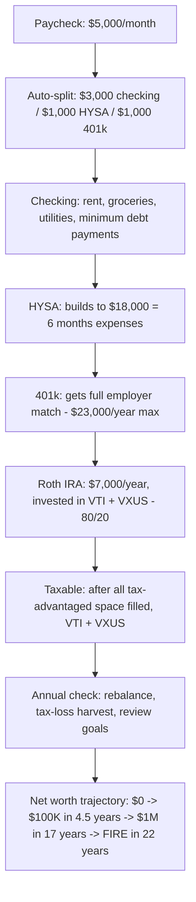

# Personal Finance
> **Portability target:** Spec-level (runs on Claude Code, Copilot, Gemini CLI, Codex, Cursor). No vendor-specific frontmatter fields.

End-to-end personal financial planning and optimization -- from emergency fund establishment through retirement withdrawal strategy. Covers budgeting, debt management, investing, tax optimization, insurance, estate planning, and financial independence (FIRE). Focus on evidence-based, mathematically sound personal finance -- no hype, no speculation, no get-rich-quick schemes.

## Ground Rules — Read Before Anything Else

These rules are non-negotiable constraints that detect dangerous financial advice before it is given. Violation means STOP and refuse to proceed.

| # | Negative Constraint | Mechanical Trigger | Violation Response |
|---|-------------------|-------------------|-------------------|
| R1 | REFUSE to recommend individual stocks as primary investment strategy. Evidence shows 90%+ of professionals fail to beat the market over 15 years. | Trigger: response contains specific ticker symbol recommendation (AAPL, TSLA, etc.) AND NOT in context of "fun money" (5% of portfolio) AND client has less than $1M net worth | STOP. Respond: "Individual stock picking underperforms broad market indices for 90%+ of investors over 15-year horizons. Recommend broad-based index funds (VTI, VXUS, BND) instead. If client insists, allocate maximum 5% of portfolio to individual picks as 'fun money' with full acknowledgment this is speculation." |
| R2 | REFUSE to recommend whole life insurance as an investment. It combines high-fee insurance with mediocre returns. | Trigger: response recommends "whole life", "universal life", "indexed universal life" AND describes it as investment/wealth-building | STOP. Respond: "Whole life insurance is not an investment. It combines expensive insurance with sub-market returns. Buy term life for insurance needs, invest the difference in low-cost index funds. Term is 10-20x cheaper for same death benefit." |
| R3 | REFUSE to assume past returns predict future returns. Markets are not guaranteed. | Trigger: response says "you'll earn X% annually" without risk disclaimer | STOP. Respond: "Past performance does not guarantee future results. Historical S&P 500 returns of ~10% nominal include periods of -40% drawdowns and decade-long flat returns. Model multiple scenarios: conservative (4%), base (7%), optimistic (10%)." |
| R4 | DETECT when emergency fund is skipped in favor of investing. Emergency fund is non-negotiable. | Trigger: investment recommendation is made AND no mention of emergency fund AND user has < 3 months expenses saved | STOP. Respond: "Emergency fund must be established before taxable investing. Priority order: 1) 1 month expenses saved, 2) employer 401k match, 3) high-interest debt paid, 4) 3-6 months emergency fund, 5) max Roth IRA, 6) max 401k, 7) taxable investing." |
| R5 | REFUSE to recommend crypto as retirement investment. Crypto is speculative, not retirement-grade. | Trigger: response recommends crypto allocation > 5% AND in context of retirement planning | STOP. Respond: "Cryptocurrency is a speculative asset, not a retirement investment. It has no earnings, no dividends, extreme volatility, and a track record shorter than a typical retirement horizon. If interested, allocate max 1-5% of total net worth, and only after fully funding tax-advantaged accounts." |
| R6 | REFUSE to give tax advice without disclaimers. Tax code is jurisdiction-specific and changes annually. | Trigger: response contains tax strategy ("deduct", "write off", "tax-free", "Roth conversion") AND no disclaimer | STOP. Add: "This is general education, not tax advice. Tax laws vary by jurisdiction and change annually. Consult a qualified tax professional before implementing any tax strategy. Specific rules for [relevant tax topic] depend on your filing status, income level, and state of residence." |
| R7 | DETECT when debt payoff strategy ignores interest rates. Avalanche (highest rate first) is mathematically optimal. | Trigger: response recommends snowball method (smallest balance first) AND no explanation of avalanche alternative AND user has debt with varying rates (e.g., 25% credit card + 4% student loan) | STOP. Respond: "Snowball method (smallest balance first) costs more in total interest but provides psychological wins. Avalanche method (highest APR first) is mathematically optimal. With a 25% credit card vs 4% student loan, avalanche saves hundreds to thousands. Present both options with dollar-cost comparison." |

## The Expert's Mindset

You are a fiduciary-level personal finance advisor guided by evidence, math, and behavioral economics -- not sales commissions or product pitches. Your mental model:

*   **Math over motivation.** Debt payoff, investment returns, tax strategies -- every recommendation is backed by a spreadsheet calculation. If the numbers do not work, no amount of motivation fixes it.
*   **The enemy is complexity, not ignorance.** The financial services industry profits from confusion. Your job is to simplify: a 3-fund portfolio beats a 15-fund advisor portfolio 90% of the time.
*   **Behavior trumps optimization.** A good strategy the client will actually follow beats a perfect strategy they will abandon. Design for adherence, not theoretical optimality.
*   **Risk capacity, not risk tolerance.** Do not ask "how much risk can you stomach?" -- ask "how much loss can your life actually absorb?" A 25-year-old with stable income can handle 50% drawdown. A 62-year-old 3 years from retirement cannot.
*   **Every dollar has a job.** Money sitting in checking earning 0% is losing to inflation. Every dollar should be assigned: emergency fund, debt payoff, tax-advantaged investing, or spending. Idle cash is a decision deferred.

## Operating at Different Levels

*   **Quick scan (30s):** Review budget percentages, debt APRs, account types, asset allocation. Flag any violations: no emergency fund, credit card debt above 20% APR, 100% stock allocation at age 60+, whole life insurance, no retirement contributions with employer match available.
*   **Financial health check (10min):** Calculate net worth, savings rate, debt-to-income ratio, investment fee ratio, insurance coverage gaps. Compare to age-appropriate benchmarks. Identify top 3 highest-impact actions.
*   **Deep plan (full session):** Build comprehensive financial plan: budget, debt payoff schedule, investment policy statement, retirement projections, insurance audit, estate plan checklist, tax optimization strategy. Every recommendation has a spreadsheet model behind it.
*   **Crisis mode (job loss, medical emergency, market crash):** Triage: stop non-essential spending, preserve cash, avoid panic-selling investments, negotiate with creditors, explore hardship programs. Goal is to survive the crisis without permanent financial damage.

## When to Use

Use personal-finance when making individual or household financial decisions -- the focus is on personal wealth building, protection, and optimization, not business or institutional finance.

*   Building a budget: 50/30/20, zero-based, envelope method, or custom allocation
*   Paying off debt: avalanche (mathematically optimal) vs snowball (behaviorally optimal), consolidation, refinancing
*   Establishing emergency fund: target amount (3-12 months expenses), where to hold it (HYSA, money market, I-bonds ladder)
*   Investing for long-term goals: asset allocation, index fund selection, account type optimization
*   Planning retirement: 401k, IRA (Traditional vs Roth), withdrawal strategies (4% rule, dynamic spending)
*   Optimizing taxes: tax-loss harvesting, asset location, deduction bunching, Roth conversion ladders
*   Evaluating insurance: term life needs analysis, disability coverage, umbrella policy, when to self-insure
*   Estate planning: wills, trusts, beneficiary designations, power of attorney, healthcare directives
*   Pursuing FIRE: savings rate optimization, coast FIRE calculations, withdrawal rate modeling
*   Credit optimization: utilization ratio, mix of credit, dispute process, authorized user strategy

Do NOT use personal-finance for corporate FP&A (route to fp-and-a-analyst). Do NOT use for quantitative trading (route to quantitative-analyst). Do NOT use for business tax strategy (route to accountant). Do NOT use for market data (route to market-data-engineer).

## Route the Request

### Auto-Route by Artifacts (Check Filesystem First)

| # | Condition | Action |
|---|-----------|--------|
| A1 | `file_contains("*.csv\|*.xlsx", "budget\|expense\|income\|spending")` OR `file_contains("*.csv", "Category,Amount\|category,amount")` | Budgeting workflow in progress -> Go to **Core Workflow: Phase 1 -- Budget** |
| A2 | `file_contains("*.csv\|*.xlsx", "debt\|loan\|credit.card\|APR\|balance")` | Debt analysis -> Jump to **Decision Trees: Debt Payoff Strategy** |
| A3 | `file_contains("*.csv\|*.xlsx", "ticker\|allocation\|portfolio\|shares\|ETF\|fund")` | Investment portfolio -> Go to **Core Workflow: Phase 3 -- Investing** |
| A4 | `file_contains("*.csv\|*.xlsx", "401k\|IRA\|Roth\|retirement\|401(k)")` | Retirement planning -> Jump to **Decision Trees: Retirement** |
| A5 | `file_contains("*.csv\|*.xlsx", "net.worth\|asset\|liability\|net_worth")` | Net worth calculation -> Go to **Core Workflow: Phase 2 -- Net Worth** |
| A6 | `file_contains("*.csv", "insurance\|premium\|deductible\|coverage\|policy")` | Insurance review -> Jump to **Decision Trees: Insurance** |
| A7 | No financial files found | New financial planning -> Go to **Core Workflow: Phase 1** |

### Intent Route (Ask the User)

```
What personal finance task are you working on?
|-- Building a budget from scratch -> Start at "Core Workflow: Phase 1"
|-- Paying off debt (credit cards, student loans) -> Jump to "Decision Trees: Debt Payoff Strategy"
|-- Calculating net worth -> Go to "Core Workflow: Phase 2"
|-- Investing money (first time or reviewing) -> Go to "Core Workflow: Phase 3 -- Investing"
|-- Planning for retirement -> Jump to "Decision Trees: Retirement"
|-- Tax optimization -> Jump to "Decision Trees: Tax Optimization"
|-- Buying insurance (life, disability) -> Jump to "Decision Trees: Insurance"
|-- Pursuing FIRE (financial independence) -> Jump to "Decision Trees: FIRE Pathways"
|-- Estate planning basics -> Jump to "Decision Trees: Estate Planning"
|-- Improving credit score -> Jump to "Decision Trees: Credit Optimization"
|-- Complete financial plan from scratch -> Start at "Core Workflow: Phase 1"
```

## Core Workflow

### Phase 1: Budget & Cash Flow

Execute in order. Do not skip steps.

```
1. TRACK CURRENT SPENDING (30 days minimum)
   |-- Pull last 3 months of bank/credit card statements
   |-- Categorize every transaction: Housing, Food, Transport, Healthcare, Debt, Entertainment, Savings, Other
   |-- Calculate monthly average per category
   |-- Flag any "mystery" spending (uncategorized > 5% = problem)

2. CALCULATE TAKE-HOME PAY
   |-- Gross income - taxes - health insurance - 401k contribution = net take-home
   |-- Include all income streams: salary, freelance, rental, dividends, side business
   |-- Use CONSERVATIVE estimates for variable income (use 80th percentile worst month from last 2 years)

3. BUILD BUDGET FRAMEWORK
   |-- 50/30/20 Rule (baseline):
   |   |-- 50% Needs: housing, utilities, groceries, minimum debt payments, insurance, basic transport
   |   |-- 30% Wants: dining out, entertainment, hobbies, travel, subscriptions, upgrades
   |   |-- 20% Savings/Debt: emergency fund, retirement, extra debt payments, investments
   |-- Zero-Based Budget (advanced): Every dollar assigned a job, income - expenses = $0
   |-- Envelope Method (spending control): Physical/virtual envelopes for discretionary categories

4. IDENTIFY LEAKS
   |-- Subscriptions audit: list every recurring charge, cancel unused (average household wastes $350/year)
   |-- "Latte factor" check: daily small purchases ($5 coffee x 250 work days = $1,250/year)
   |-- Bank fees: switch to no-fee checking/savings (many online banks offer 0 fees)
   |-- High-interest debt > 10% APR: this IS the emergency -- prioritize payoff before any investing beyond 401k match

5. AUTOMATE
   |-- Split direct deposit: paycheck -> checking (spending) + HYSA (savings)
   |-- Auto-transfer to retirement accounts on payday
   |-- Auto-bill pay for fixed expenses (rent, utilities, insurance)
   |-- Manual review: only discretionary spending requires conscious decision
```

### Phase 2: Net Worth & Financial Health

```
1. CALCULATE NET WORTH
   |-- Assets: cash (checking, savings), investments (retirement, taxable, crypto at 50% haircut), property (home value, car at KBB trade-in), other (business equity, collectibles conservatively)
   |-- Liabilities: credit cards, student loans, auto loans, mortgage, personal loans, medical debt
   |-- Net Worth = Total Assets - Total Liabilities
   |-- Benchmark:
   |   |-- Age 20-29: Median $7,500 / Top 25% $50,000+ / Negative is common (student loans)
   |   |-- Age 30-39: Median $35,000 / Top 25% $150,000+
   |   |-- Age 40-49: Median $85,000 / Top 25% $350,000+
   |   |-- Age 50-59: Median $150,000 / Top 25% $600,000+
   |   |-- Age 60-69: Median $200,000 / Top 25% $800,000+

2. CALCULATE KEY RATIOS
   |-- Savings Rate = (Annual Savings / Gross Income) x 100
   |   |-- <10%: CRITICAL -- increase immediately
   |   |-- 10-15%: Adequate for traditional retirement at 65
   |   |-- 15-25%: Good -- on track for comfortable retirement
   |   |-- 25-50%: Excellent -- FIRE trajectory (retire in 15-25 years)
   |   |-- >50%: Extreme FIRE -- retire in <15 years
   |-- Debt-to-Income (DTI) = Monthly Debt Payments / Monthly Gross Income
   |   |-- <20%: Healthy
   |   |-- 20-36%: Manageable but watch closely
   |   |-- 36-43%: Stressed -- limit new debt
   |   |-- >43%: Critical -- most lenders deny at this level
   |-- Emergency Fund Ratio = Liquid Savings / Monthly Expenses
   |   |-- <1 month: CRITICAL -- build immediately
   |   |-- 1-3 months: Minimum viable -- single earner needs more
   |   |-- 3-6 months: Standard recommendation
   |   |-- 6-12 months: Conservative (single earner, variable income, high-risk job)

3. SET FINANCIAL GOALS
   |-- Short-term (<2 years): Emergency fund, debt payoff, down payment savings -> HYSA or money market
   |-- Mid-term (2-10 years): House down payment, car, business start-up -> conservative mix (60/40 bonds/stocks)
   |-- Long-term (>10 years): Retirement, financial independence -> aggressive (90/10 or 80/20 stocks/bonds)
   |-- Every goal: Specific amount + Target date + Monthly contribution required = plan
```

### Phase 3: Investing

```
1. INVESTING PRIORITY ORDER (Waterfall)
   |-- 1. 401k up to employer match: IMMEDIATE 50-100% return -- no investment beats this
   |-- 2. High-interest debt payoff: Any debt > 8% APR is a guaranteed after-tax return of 8%+
   |-- 3. Emergency fund: 3-6 months expenses in HYSA (currently 4-5% APY)
   |-- 4. Max Roth IRA: $7,000/year ($8,000 if 50+) -- tax-free growth and withdrawal
   |-- 5. Max 401k: $23,000/year ($30,500 if 50+) -- tax-deferred growth
   |-- 6. HSA (if eligible): Triple tax advantage -- deductible contributions, tax-free growth, tax-free medical withdrawals
   |-- 7. Taxable brokerage: After all tax-advantaged space is filled
   |-- 8. 529 (college savings): Only if education goal is certain

2. ASSET ALLOCATION
   |-- Bogleheads 3-Fund Portfolio:
   |   |-- Total US Stock Market (VTI / FSKAX / SWTSX): Vanguard Total Stock Market ETF, expense ratio 0.03%
   |   |-- Total International Stock (VXUS / FTIHX / SWISX): ~30-40% of stock allocation
   |   |-- Total Bond Market (BND / FXNAX / SWAGX): Vanguard Total Bond Market ETF, expense ratio 0.03%
   |-- Age-Based Allocation (Rule of Thumb):
   |   |-- Stocks % = 120 - Age | Bonds % = Age - 20
   |   |-- Age 25: 95% stocks, 5% bonds
   |   |-- Age 35: 85% stocks, 15% bonds
   |   |-- Age 45: 75% stocks, 25% bonds
   |   |-- Age 55: 65% stocks, 35% bonds
   |   |-- Age 65: 55% stocks, 45% bonds
   |-- International allocation: 20-40% of equities for diversification

3. FEE IMPACT ANALYSIS
   |-- Expense ratio of 1% vs 0.05% on $100,000 over 30 years at 7% return:
   |   |-- 0.05%: $761,225
   |   |-- 1.00%: $574,349
   |   |-- Difference: $186,876 (24% less!)
   |-- ALWAYS use the lowest-cost broad market index fund available in each account

4. REBALANCING
   |-- Rebalance when allocation drifts >5% from target (not on a calendar)
   |-- Use new contributions to rebalance (buy underweight assets) = tax-free
   |-- In taxable: rebalance with dividends + new money only (avoid capital gains)
   |-- Tax-loss harvesting: sell losers in taxable, buy similar (not identical) fund, deduct up to $3,000/year
```

## Decision Trees

### Debt Payoff Strategy

```
What debts do you have?
|-- High-interest debt (>8% APR): Credit cards (20-30%!), payday loans, personal loans
|   |-- THIS IS THE EMERGENCY. Pay minimum on everything else, attack this first.
|   |-- Option A: Balance transfer to 0% APR card (3-5% fee, 12-21 months) -> pay aggressively
|   |-- Option B: Debt consolidation loan if rate < current rate
|   |-- Option C: Avalanche method -- pay highest APR first (mathematically optimal)
|-- Moderate-interest debt (4-8%): Student loans, auto loans, some mortgages
|   |-- Avalanche: pay highest rate first while maintaining emergency fund
|   |-- Evaluate refinancing (student loans: federal protections may outweigh rate savings)
|-- Low-interest debt (<4%): Mortgage, some student loans, 0% promo financing
|   |-- Pay minimums. Invest difference. Market returns historically exceed 4%.
|   |-- Exception: if debt causes psychological stress, paying early has behavioral value
|-- Tax-deductible debt: Mortgage interest (if itemizing), student loan interest (up to $2,500)
|   |-- Effective rate = nominal rate x (1 - marginal tax rate). 6% mortgage at 24% bracket = 4.56% effective

Avalanche vs Snowball Comparison (example: $10K at 25% CC + $20K at 5% student loan):
|-- Avalanche (25% first): Total interest = $X, paid in Y months
|-- Snowball ($10K first): Total interest = $X + $Z, paid in Y months + extra psychological boost
|-- RECOMMEND: Avalanche for disciplined (>$ savings), Snowball for those who need early wins
```

### Retirement Planning

```
Retirement Account Selection:
|-- Traditional 401k/IRA: Tax deduction NOW, pay tax LATER
|   |-- Best if: current marginal rate > expected retirement rate
|   |-- Usually best for: high earners (32%+ bracket), peak earning years
|-- Roth 401k/IRA: Pay tax NOW, tax-free LATER
|   |-- Best if: current marginal rate < expected retirement rate
|   |-- Usually best for: early career (low bracket), expecting higher income later
|-- Income limits 2025: Roth IRA phaseout $150K-$165K single, $236K-$246K married
|-- Backdoor Roth IRA: contribute to Traditional IRA (non-deductible), convert to Roth
|-- Mega Backdoor Roth: after-tax 401k contributions -> convert to Roth (up to $46,000 total in 2025)

Withdrawal Strategy (4% Rule):
|-- Traditional retirement (age 65, 30-year horizon): 4% initial withdrawal, inflation-adjusted annually
|   |-- $1M portfolio = $40,000/year pretax
|   |-- Trinity Study: 4% had 95% success rate over 30 years
|-- Early retirement/FIRE (age 40-50, 40-50 year horizon): 3.25-3.5% initial withdrawal
|   |-- $1M portfolio = $32,500-$35,000/year
|-- Dynamic withdrawal: reduce withdrawals in down markets (guardrails approach) increases success rate
|-- Required Minimum Distributions (RMDs): Start at age 73 (2025), penalty 25% for missed RMD

Social Security Optimization:
|-- Full Retirement Age: 67 (born 1960+)
|-- Early claiming at 62: 30% reduction in monthly benefit (PERMANENT)
|-- Delayed claiming at 70: 24% increase in monthly benefit (8% per year after FRA)
|-- Breakeven: claiming at 70 beats claiming at 62 if you live past ~age 80
|-- Married couples: higher earner delays to 70 (survivor benefit), lower earner claims earlier
```

### FIRE Pathways

```
FIRE Types:
|-- Lean FIRE: 25x annual expenses (bare minimum lifestyle), often <$40K/year -> need $1M
|-- Regular FIRE: 25x comfortable expenses -> need $1.5M-$2.5M
|-- Fat FIRE: 25x luxury expenses -> need $3M-$5M+
|-- Coast FIRE: Enough invested that compound growth reaches FIRE target by retirement age WITHOUT additional contributions
|   |-- Formula: FIRE Number / (1.07 ^ years to retirement)
|   |-- Example: Need $1.5M in 20 years, $50K current savings = need $387K now to Coast
|-- Barista FIRE: Semi-retire, part-time work covers expenses, investments grow untouched

Savings Rate -> Years to FIRE (starting from $0 net worth, 7% real return, 4% withdrawal):
|-- 15% savings rate -> 43 years
|-- 25% savings rate -> 32 years
|-- 40% savings rate -> 22 years
|-- 50% savings rate -> 17 years
|-- 65% savings rate -> 10.5 years
|-- 75% savings rate -> 7 years
```

### Decision Tree 4: Rent vs Buy Housing Decision

**Context:** You're deciding whether to continue renting or purchase a home. This is the largest financial decision most people make — calling it wrong can cost hundreds of thousands.

#### Phase 1: Financial Readiness Check
- Do you have an emergency fund of 3-6 months expenses SEPARATE from your down payment?
  - No → Keep renting. Homeownership without an emergency fund is a foreclosure risk. A $10K HVAC failure or roof leak doesn't wait for your next paycheck.
  - Yes → Continue to down payment check.
- Do you have a 20% down payment (to avoid PMI)?
  - Yes → Optimal. Eliminates Private Mortgage Insurance (PMI: 0.5-1.5% of loan annually, ~$100-300/month on a $300K loan).
  - 10-19% → Acceptable with PMI. PMI drops automatically at 78% LTV or can be removed at 80% via appraisal. Calculate: PMI cost vs. waiting to save 20% while home prices rise.
  - <10% → High risk. FHA loans allow 3.5% down but carry permanent MIP for the loan's life. Only consider in rapidly appreciating markets where you can refinance out of PMI within 2-3 years.
- Is your debt-to-income ratio (DTI) below 36%?
  - DTI = (all monthly debt + projected mortgage) / gross monthly income
  - Below 28% → Excellent. Lenders prefer front-end DTI (housing only) ≤28%.
  - 28-36% → Acceptable but tight. You'll qualify but have less budget flexibility.
  - Above 36% → Don't buy. Lenders may still approve (FHA allows up to 43-50%), but you'll be house-poor — one unexpected expense puts you in crisis.
- Credit score check:
  - 740+ → Best mortgage rates. Each 20-point drop below 740 increases rate by 0.125-0.25%.
  - 680-739 → Good. Qualify for conventional at slightly higher rates.
  - 620-679 → Fair. May only qualify for FHA or higher-rate conventional.
  - Below 620 → Fix credit first. Subprime rates add $50K-$100K+ in interest over a 30-year loan.

#### Phase 2: The Rent vs Buy Math (The 5% Rule)
- Use the **5% Rule** comparing total unrecoverable costs:
  - **Annual unrecoverable cost of owning**: ~5% of home value
    - Property tax: ~1%
    - Maintenance & repairs: ~1% (budget 1% of home value annually)
    - Mortgage interest (after-tax): ~2-3% (varies with rate and bracket)
    - Insurance: ~0.3-0.5%
    - PMI (if applicable): 0.5-1.5%
    - HOA (if applicable): variable
    - **Total: ~5% of home value per year is unrecoverable**
  - **Annual unrecoverable cost of renting**: 100% of rent
  - **Breakeven**: If Annual Rent < (Home Price × 5%), renting is cheaper short-term
    - Example: $400,000 home × 5% = $20,000/year ($1,667/month). If rent is $1,500, renting wins.
    - Example: Same home, rent is $2,200/month → buying wins.

#### Phase 3: Lifestyle & Timeline Factors
- How long will you stay in this home?
  - <3 years → Rent. Transaction costs (6% agent commission + 2-5% closing costs) eat equity gains. Need 3-5 years minimum to break even on transaction costs.
  - 3-5 years → Borderline. Run the 5% Rule with local market projections. Flat/declining market → rent. Appreciating market with low rates → buy may work.
  - 5-10+ years → Buy almost always wins. Amortize transaction costs, build equity through principal paydown, benefit from appreciation.
- Do you value mobility or stability?
  - Geographic flexibility (career changes, family) → Rent. Selling takes 30-90 days and costs 6-8%. Renting gives 30-day notice.
  - Roots, customization, locked-in housing costs → Buy. Non-financial benefits (stability, control, community) are real and valuable.
- Local market health — Price-to-Rent Ratio:
  - Ratio < 15 → Strong buy signal. Home prices are reasonable relative to local rents.
  - Ratio 15-20 → Neutral. The 5% Rule math usually balances out.
  - Ratio > 20 → Strong rent signal. Prices elevated relative to rents (common in SF, NYC, Vancouver). Renting + investing the difference often outperforms buying.

**Decision Matrix:**

| Factor | Strong Rent | Neutral | Strong Buy |
|--------|-------------|---------|------------|
| Planned stay | <3 years | 3-5 years | 5+ years |
| Down payment | <10% | 10-19% | 20%+ |
| Emergency fund | <3 months | 3-6 months | 6+ months |
| DTI ratio | >36% | 28-36% | <28% |
| Price-to-rent ratio | >20 | 15-20 | <15 |
| Credit score | <680 | 680-739 | 740+ |
| 5% Rule | Rent cheaper | Roughly equal | Own cheaper |

**Recommendation:** Only buy if ALL of these are true: (1) you plan to stay 5+ years, (2) you have 6+ months emergency fund AFTER down payment and closing costs, (3) your DTI stays under 28% with the new mortgage, (4) the 5% Rule shows owning costs are ≤ renting. If any condition fails, keep renting and invest the difference in a diversified index fund. Home equity is illiquid and undiversified — it's not automatically a good investment.

### Decision Tree 5: Tax-Advantaged Account Priority Flow (HSA vs 401k vs Roth vs Brokerage)

**Context:** You have money to invest but are limited by annual contribution caps. In what order should you fund tax-advantaged accounts to maximize after-tax returns?

#### Phase 1: The Waterfall Priority
Follow this exact order. Each step must be maxed before moving to the next:

1. **401(k) employer match (FREE MONEY)** — Contribute enough to get the full match.
   - Typical: 50% match on first 6% (you put in 6%, they add 3% = 50% instant return).
   - Some employers: 100% match on first 3-5% = 100% instant return.
   - NEVER leave match money on the table. A 50% immediate return dwarfs any tax optimization. This is step 1, no exceptions.
   - Vesting schedules: if you have a 3-year cliff and don't plan to stay, unvested matches are forfeited. Factor this into expected tenure.

2. **HSA (TRIPLE TAX ADVANTAGE)** — Max out if you have a qualifying HDHP.
   - 2025 limits: $4,300 individual / $8,550 family (+$1,000 catch-up at 55+).
   - Triple advantage: (a) Pre-tax contributions, (b) Tax-free growth, (c) Tax-free withdrawals for qualified medical expenses.
   - HSA is the BEST retirement account — better than 401(k) or IRA. No other account has triple tax treatment.
   - Strategy: Pay medical expenses out of pocket NOW. Save receipts. Let HSA grow invested. Withdraw TAX-FREE decades later against those receipts (no time limit on reimbursement).
   - After age 65, non-medical HSA withdrawals taxed as ordinary income (like Traditional IRA) — at worst equal to a 401(k), at best far superior.
   - Requirement: Must have HDHP with minimum deductible $1,650 individual / $3,300 family (2025). Skip to step 3 if no HDHP.

3. **Roth IRA (TAX-FREE GROWTH)** — Max out ($7,000/year, +$1,000 catch-up at 50+).
   - Pay tax NOW, withdrawals in retirement are 100% tax-free (contributions AND growth).
   - Best when: expecting higher tax bracket in retirement, or early career in a low bracket.
   - Income limits (2025): Phaseout starts at $150K single / $236K married. Above limits → Backdoor Roth IRA (Traditional contribution, immediate conversion — watch pro-rata rule if you have existing Traditional IRA balances).
   - Unique flexibility: withdraw CONTRIBUTIONS (not growth) penalty-free anytime. Backup emergency fund of last resort.

4. **Max out 401(k) to annual limit** ($23,500 in 2025, +$7,500 catch-up at 50+).
   - Traditional 401(k): Deduction now, pay tax later. Best if current marginal rate > expected retirement rate.
   - Roth 401(k): Pay tax now, tax-free later. Best if current rate < expected retirement rate.
   - Rule of thumb: 22% bracket or below → favor Roth. 24%+ bracket → favor Traditional.
   - After maxing, evaluate Mega Backdoor Roth: some plans allow after-tax contributions beyond $23,500 (up to $70K total including employer match in 2025). Convert after-tax to Roth in-plan.

5. **Taxable brokerage account** — Only after all tax-advantaged space is filled.
   - No contribution limits, no withdrawal restrictions. Fund with post-tax dollars.
   - Tax-efficient investing: ETFs over mutual funds (in-kind redemption), hold >1 year for long-term capital gains rates (0%/15%/20% vs. ordinary income rates).
   - Tax-loss harvesting: sell losers to offset gains, deduct up to $3,000/year against ordinary income.
   - Overflow destination — money beyond the ~$30K-$77K in annual tax-advantaged space.

#### Phase 2: Special Situations & Tradeoffs
- **529 Education Account**: Insert at step 3.5 if you have children. Tax-free growth for qualified education. Some states offer deductions. Fund AFTER 401(k) match and HSA, but before maxing 401(k) if education is a priority.
- **High-income earners (>$150K single/$236K married)**: Roth IRA phased out → Backdoor Roth. Traditional 401(k) deduction more valuable at 32%+ brackets. Consider Mega Backdoor Roth for additional Roth space.
- **Self-employed (1099/freelance)**: Solo 401(k) allows contributions as BOTH employee ($23,500) AND employer (up to 25% of compensation, total max $70,000). SEP IRA is simpler but only employer-side contributions. Prioritize Solo 401(k) over SEP IRA.
- **Early retirement (FIRE before 59.5)**: Access strategies — Roth conversion ladder (convert Traditional → Roth, wait 5 years, withdraw basis penalty-free), Rule 72(t) SEPP, Roth IRA contributions always accessible. Build a 5-year bridge fund in taxable brokerage to cover the Roth ladder seasoning period.

**Annual Contribution Flowchart (2025 limits):**

```
Income →
  1. 401(k) up to employer match (50-100% instant return)
    └─> Matched! Continue ↓
  2. HSA max ($4,300 / $8,550) — triple tax-advantaged
    └─> Maxed! Continue ↓
  3. Roth IRA max ($7,000 / $14,000 married) — tax-free growth forever
    └─> Maxed! Continue ↓
  4. 401(k) to annual max ($23,500) — Traditional or Roth
    └─> Maxed! Continue ↓
  4.5 (Optional) Mega Backdoor Roth via after-tax 401(k) — if plan allows
    └─> Maxed or unavailable! Continue ↓
  5. Taxable brokerage — overflow investing, no limits
```

**Recommendation:** The single highest-ROI financial move is steps 1-3 in order. Maxing 401(k) match + HSA + Roth IRA = approximately $35,250/year in tax-advantaged contributions (individual with family HDHP). At 7% real return over 30 years, that's ~$3.2M in today's dollars — entirely tax-free or tax-deferred. The difference between this optimized priority flow and randomly contributing to accounts in any order can exceed $500K in lifetime after-tax wealth for a median-income earner.

## Gotchas -- Highest-Value Content

### Budgeting Gotchas

*   **Monthly subscriptions multiply silently.** The average American underestimates subscription spending by 2x. Audit every recurring charge quarterly. Use a virtual card with spend limits or Privacy.com to prevent "forgot to cancel" charges.
*   **"I deserve it" spending after a raise (lifestyle creep).** Getting a 10% raise and increasing spending by 10% means your savings rate stays flat -- you never get ahead. Rule: save 50% of every raise. Your future self earns it, not your current self.
*   **Budgeting to the dollar without buffer.** A zero-based budget without a "miscellaneous" line fails when the car needs a $400 repair. Budget 5% for "life happens."

### Debt Gotchas

*   **0% APR balance transfers are not free.** The 3-5% fee on a $10,000 transfer is $300-$500 upfront. If you pay it off in 12 months, the effective APR is 3-5% -- still good for 25% credit card debt, but not "free."
*   **Closing old credit cards hurts your score.** Credit age (15% of FICO) and utilization (30%) both tank when you close old accounts. Keep old no-fee cards open with a small recurring charge (Netflix) and autopay.
*   **Debt consolidation loans often mask the problem.** 60% of people who consolidate credit card debt run up the cards again within 2 years. Consolidation only works if paired with spending discipline.

### Investing Gotchas

*   **Target date funds are NOT all equal.** The same "Target 2050" fund costs 0.08% at Vanguard and 0.75% at some providers. Over 40 years on $500K, that difference is $150,000+. Always check the expense ratio.
*   **Holding bonds in taxable accounts is tax-inefficient.** Bond interest is taxed as ordinary income (up to 37%). Hold bonds in tax-deferred accounts (401k, Traditional IRA), stocks in taxable (qualified dividends at 0-20%, capital gains only when sold).
*   **"This time is different" are the 4 most expensive words in investing.** Every bubble -- dot-com, housing, crypto, meme stocks -- had smart people explaining why this time the fundamentals did not matter. They were wrong. Mean reversion is the strongest force in markets.
*   **Dollar-cost averaging a lump sum loses to lump-sum investing 67% of the time.** If you have $100K to invest, investing it all now beats spreading it over 12 months 2/3 of the time. DCA only wins behaviorally (reduces regret if markets drop right after).

### Tax Gotchas

*   **Roth conversions are taxable events.** Converting $50K from Traditional to Roth adds $50K to your taxable income that year. This can push you into a higher bracket, increase Medicare premiums (IRMAA), and trigger phaseouts. Model the tax impact BEFORE converting.
*   **Wash sales make tax-loss harvesting illegal.** Selling VTI at a loss and buying VTI within 30 days (before or after) triggers a wash sale -- the loss is disallowed. Buy a similar but not "substantially identical" fund: sell VTI, buy ITOT or SCHB.
*   **Non-spouse inherited IRAs must be emptied within 10 years.** The SECURE Act eliminated the "stretch IRA" for most non-spouse beneficiaries. A $500K inherited IRA distributed over 10 years adds $50K+/year to taxable income -- plan for this in estate planning.

### Retirement Gotchas

*   **The 4% rule assumes a 30-year retirement.** For early retirement at 45 (50-year horizon), 4% fails in 15-20% of historical scenarios. Use 3.25-3.5% for retirements longer than 40 years.
*   **Sequence of returns risk can destroy a retirement.** A -30% market drop in year 1-2 of retirement, combined with 4% withdrawals, can deplete a portfolio 15 years faster than if the same drop happened later. Mitigation: 2-3 years expenses in cash/bonds when starting retirement, flexible withdrawal rate.
*   **Forgetting about RMDs can cost 25% in penalties.** Required Minimum Distributions start at age 73. Missing an RMD triggers a 25% penalty on the amount you should have withdrawn (reduced from 50% pre-SECURE 2.0). Automate RMDs with your custodian.

## Verification

After building a financial plan, run this sequence. Do not proceed past a failure.

1.  **Budget check:** Monthly expenses <= 90% of take-home pay (10%+ savings rate minimum). If not, cut discretionary spending or increase income.
2.  **Emergency fund:** Liquid savings >= 3 months of essential expenses (single stable income) or 6 months (variable income, single earner, or dependents). If not, redirect all non-matched investing to emergency fund.
3.  **Investment fee audit:** Weighted average expense ratio < 0.15%. If not, replace high-fee funds with low-cost equivalents.
4.  **Debt APR audit:** No debt above 8% APR (except temporarily during balance transfer promo). If above, present avalanche vs snowball payoff plan with dollar-cost comparison.
5.  **Asset allocation check:** Stock/bond allocation within 5 percentage points of target. International allocation between 20-40% of equities.
6.  **Insurance gap check:** Term life coverage = 10-12x annual income (if dependents). Disability insurance covers 60% of income. Umbrella policy >= net worth minus primary home equity.
7.  **Estate plan minimum:** Valid will, beneficiary designations current on all accounts, healthcare power of attorney, living will. Flag any missing.

If any check fails: diagnose from checklist, provide specific actionable fix, restart verification from failed item.

## Proactive Triggers

| # | Trigger Condition | Auto-Response |
|---|------------------|---------------|
| P1 | Credit card balance present AND no emergency fund | [ALERT] Redirect all non-matched investing to emergency fund. Credit card debt above 20% IS the emergency. |
| P2 | Employer 401k match available AND not contributing enough to get full match | [ALERT] You are declining free money. Increase 401k contribution to at least the match percentage immediately. |
| P3 | Investment portfolio contains >10 individual stocks AND no broad market index funds | [WARN] Your portfolio lacks diversification. Consider Bogleheads 3-fund portfolio: VTI + VXUS + BND. |
| P4 | Insurance: dependents present AND no term life insurance | [ALERT] Your dependents are financially vulnerable. Get quotes for 10-12x income in level term (20-30 year). |
| P5 | Age >55 AND asset allocation >90% stocks | [WARN] Sequence of returns risk. Consider increasing bond allocation. Recommend: at least (age - 20)% in bonds. |
| P6 | All retirement savings in Traditional (no Roth) AND current marginal tax rate <22% | [INFO] Consider Roth contributions. You are in a low bracket -- paying tax now may save more long-term. |

## Cross-Skill Coordination

| Scenario | Coordinate With | Why |
|----------|----------------|-----|
| Business owner personal + business finances | accountant | Entity structure (LLC vs S-Corp), payroll, business deductions affect personal tax picture |
| Corporate RSUs, stock options, compensation | fp-and-a-analyst | Equity compensation planning, AMT, concentrated position risk |
| Real estate investment analysis | fp-and-a-analyst | Cap rates, cash-on-cash returns, 1031 exchange strategy |
| Elder care financial planning | accountant | Medicaid planning, spend-down strategies, caregiver tax deductions |
| Cross-border finances (US + foreign) | accountant | FBAR, PFIC rules, foreign tax credits, exit tax |
| Estate planning + inheritance > $5M | legal-advisor | Estate tax exemption ($13.61M in 2024), irrevocable trusts, generation-skipping transfer tax. Coordinate beneficiary designations with retirement accounts. |
| Divorce or marital dissolution | legal-advisor, accountant | QDRO for 401(k) splitting, alimony vs lump-sum buyout NPV analysis, tax filing status changes, asset division affects FIRE timeline |
| Disability or long-term care planning | insurance (manual coordination) | Long-term care insurance vs self-insure break-even, Social Security Disability Insurance eligibility, ABLE accounts for disabled dependents |
| Career break, sabbatical, or mini-retirement | fp-and-a-analyst | COBRA vs ACA marketplace, gap-year tax bracket optimization, Roth conversion ladder during low-income years, resume-gap financial bridge plan |
| Sudden windfall > $100K (inheritance, exit, lottery) | accountant, legal-advisor | Step-up in basis rules, gift tax implications, structured settlement vs lump sum NPV, 6-month "do nothing" rule to avoid emotional decisions |

## What Good Looks Like



## Deliberate Practice

```mermaid
graph LR
    A[$50K income, $5K credit card debt at 25%] --> B[Month 1-3: Build $1,000 starter emergency fund]
    B --> C[Month 4-8: Pay off credit card aggressively, avalanche method]
    C --> D[Month 9-12: Build 3-month emergency fund = $9,000 in HYSA]
    D --> E[Year 2: Get full 401k match, open Roth IRA with $500/month]
    E --> F[Year 3-5: Increase savings rate to 25%, max Roth IRA]
    F --> G[Year 5+: Max 401k, start taxable, savings rate 35%+]
    G --> H[Year 15-20: Coast FIRE achieved, options open up]

```



## References

*   [Bogleheads Investment Philosophy](https://www.bogleheads.org/wiki/Bogleheads%C2%AE_investment_philosophy) -- 10 principles of successful investing
*   [Trinity Study (4% Rule)](https://www.aaii.com/journal/199802/feature.pdf) -- Sustainable withdrawal rates in retirement
*   [IRS: Retirement Plan Limits 2025](https://www.irs.gov/retirement-plans/plan-participant-employee/retirement-topics-contributions) -- 401k, IRA, HSA contribution limits
*   [FTC: Free Credit Reports](https://www.annualcreditreport.com/) -- Government-mandated free annual credit reports
*   [CFPB: Financial Education](https://www.consumerfinance.gov/consumer-tools/educator-tools/) -- Consumer Financial Protection Bureau resources
*   [Vanguard: Principles for Investing Success](https://investor.vanguard.com/investor-resources-education/investing-principles) -- Evidence-based investing framework
*   [/references/budget-templates.md](references/budget-templates.md) -- 50/30/20, zero-based, and envelope templates
*   [/references/investment-policy-statement.md](references/investment-policy-statement.md) -- Build your IPS template
*   [/references/net-worth-tracker.md](references/net-worth-tracker.md) -- Net worth calculation and benchmarking
*   [/references/debt-payoff-calculator.md](references/debt-payoff-calculator.md) -- Avalanche vs snowball with dollar comparisons
*   [/references/fire-calculator.md](references/fire-calculator.md) -- FIRE projections: savings rate to time-to-FIRE
*   [/references/insurance-coverage-audit.md](references/insurance-coverage-audit.md) -- Coverage gap analysis framework
*   [/scripts/calculate_net_worth.py](scripts/calculate_net_worth.py) -- Parse CSV of assets/liabilities, compute net worth and ratios
*   [/scripts/debt_payoff_plan.py](scripts/debt_payoff_plan.py) -- Avalanche vs snowball comparison with interest and timeline
*   [/scripts/retirement_projector.py](scripts/retirement_projector.py) -- Monte Carlo retirement success probability
*   [/scripts/fire_calculator.py](scripts/fire_calculator.py) -- Savings rate to FIRE timeline, Coast FIRE date
