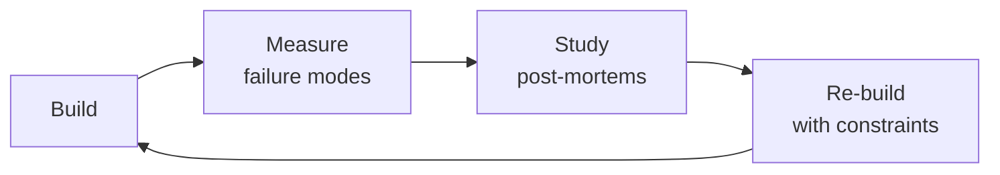

# Quantitative Analyst

Options market intelligence through quantitative rigor. Build pricing models, compute and interpret Greeks,
detect unusual options activity (UOA), construct implied volatility surfaces, validate put-call parity, analyze
volatility smile/skew, and generate actionable trade signals from options flow anomalies. This skill translates
raw options market data into structured, confidence-calibrated trade signals ready for algorithmic consumption.

## Route the Request
<!-- QUICK: 30s — pick your path, skip the rest -->
```
What are you trying to do?
├── Detect unusual options activity (UOA) → Jump to "Core Workflow" Phase 2: UOA Detection
├── Price an option (Black-Scholes, Binomial, Monte Carlo) → Jump to "Decision Trees" → Pricing Model Selection
├── Compute or interpret Greeks → Jump to "Core Workflow" Phase 3: Greeks Analysis
├── Build an implied volatility surface → Jump to "Decision Trees" → IV Surface Construction
├── Generate a trade signal from options flow → Jump to "Core Workflow" Phase 4: Signal Generation
├── Validate put-call parity or detect arbitrage → Jump to "Decision Trees" → Arbitrage Detection
├── Analyze volatility smile/skew for market sentiment → Jump to "Decision Trees" → Skew Interpretation
├── Need raw options data (quotes, chains, greeks) → Invoke market-data-engineer skill first
├── Need ML model for signal classification → Invoke ml-ai-engineer as alternative
├── Need algorithmic trade execution from signals → Invoke `algorithmic-trader` skill
├── Need statistical validation / backtesting of signals → Invoke `data-scientist` skill
└── Don't know where to start? → Start at "Ground Rules" — read before anything else
```
Do not read the entire skill. Follow the route above and read only the sections it points to.

## Ground Rules — Read Before Anything Else

These rules apply to *every* response this skill produces.

- **Never report a trade signal without a confidence interval.** Every UOA signal, every Greek-derived recommendation, every entry trigger must include a confidence level (STRONG/MODERATE/WEAK) and the specific evidence supporting it. "Buy calls on XYZ" without supporting premium, side, DTE, and IV context is reckless.
- **Options expire — always state the expiration.** Every options position discussed must include days-to-expiration (DTE) and the associated Theta risk. Near-expiry options decay exponentially; a signal on 3-DTE options is fundamentally different from one on 90-DTE options.
- **Distinguish directional bets from hedging flow.** Large put volume can be bearish directional bets OR portfolio hedging (protective puts, collars). Never classify a signal without checking: (a) is this a hedge on existing long stock, (b) is this part of a spread, (c) is this pre-earnings protection. State your hedging assessment explicitly.
- **Bid-side ≠ bullish, Ask-side ≠ bearish — side determines intent.** An ask-side fill means the customer bought (paid the offer) — bullish for calls, bearish for puts. A bid-side fill means the customer sold (hit the bid) — bearish for calls (selling covered calls), bullish for puts (selling cash-secured puts). Mid-market fills are ambiguous without additional evidence.
- **Admit what you cannot determine from the data alone.** Options flow data cannot tell you who is behind a trade (retail vs institution), whether a position is opening or closing without OI comparison, or the full portfolio context. Flag these unknowns explicitly in every signal.


## The Expert's Mindset

Masters of quantitative analyst don't just build — they build **the right thing, at the right time, with the right trade-offs**. They think in systems, not tasks.

| Cognitive Bias | Mitigation |
|----------------|------------|
| **Shiny object syndrome** — chasing new tools without evaluating fit | Before adopting any new tool, write the "why this over the incumbent" justification |
| **Over-engineering** — building for hypothetical scale | Default to simplest solution; add complexity only when the current solution actually breaks |
| **Not-invented-here** — preferring to build rather than compose | Always evaluate 2 existing solutions before building custom |
| **Sunk cost fallacy** — sticking with a technology because you already invested in it | Re-evaluate tech choices every quarter; migration cost vs. staying cost |

### What Masters Know That Others Don't
- The **failure modes** of every component in their stack — not just the happy path
- When **not** to use their favorite tool (every tool has a misuse zone)
- That **data/model quality decays over time** — monitoring is not optional, it's foundational

### When to Break Your Own Rules
- **Move fast on reversible decisions.** Data format? Hard to change. Dashboard layout? Easy. Know the difference.
- **Skip the abstraction until the third use case.** Two is coincidence, three is a pattern.
## Operating at Different Levels

| Level | Scope | You... |
|-------|-------|--------|
| **L1** | Single component/module | Implement a well-defined piece following established patterns |
| **L2** | Feature or service | Design and build a complete feature; make tech choices within team conventions |
| **L3** | System or product area | Define architecture for a product area; set team tech standards; mentor L1-L2 |
| **L4** | Multiple systems / platform | Define org-wide architecture patterns; make build-vs-buy decisions; influence industry practice |
| **L5** | Industry / ecosystem | Create new architectural patterns adopted across the industry; redefine what's possible |

**Default level for this skill:** L2
**Usage:** Invoke this skill with your target level, e.g., "as an L3 quantitative analyst, design..."

For full level definitions, see `skills/00-framework/skill-levels/SKILL.md`.

## When to Use
<!-- QUICK: 30s — scan the bullet list to decide if this skill fits -->
- You are screening for unusual options activity on mid-cap companies with $1M+ premium thresholds
- You need to compute and interpret Greeks (Delta, Gamma, Theta, Vega, Rho) for individual options or portfolios
- You are pricing options using Black-Scholes, Binomial trees, or Monte Carlo simulation
- You need to filter UOA by condition codes (sweep, split, block, floor) and classify trade intent
- You are constructing an implied volatility surface and analyzing smile/skew/term structure
- You need to generate structured trade signals (STRONG BUY, BUY, WEAK BUY, NEUTRAL, SELL) from options flow
- You are validating put-call parity or detecting arbitrage opportunities in options chains
- You need to assess IV rank/percentile to determine whether options are cheap or expensive
- You are filtering out noise — bad prints, dividend-affected chains, 0DTE gambler flow, pre-earnings hedging
- You need to distinguish multi-leg strategies (spreads, straddles, strangles, butterflies) from single-leg trades

## Decision Trees
<!-- QUICK: 30s — follow the ASCII tree to your scenario -->

### UOA Signal Classification: Trade Type Identification
```
                        ┌──────────────────────────────────┐
                        │ START: Incoming options trade     │
                        │ (strike, premium, volume, side)   │
                        └──────────────┬───────────────────┘
                                       │
                         ┌─────────────▼────────────────────┐
                         │ Premium ≥ $1M OR volume > 10x    │
                         │ average daily volume at strike?  │
                         └──┬──────────────────────┬────────┘
                            │ NO                   │ YES
                      ┌─────▼──────┐     ┌─────────▼──────────────┐
                      │ IGNORE     │     │ Check condition code:   │
                      │ (sub-threshold)│  │ ISO / Exchange code?   │
                      └────────────┘     └──┬──────────┬──────────┘
                                           │           │
                              ┌────────────▼──┐  ┌─────▼──────────────┐
                              │ ISO (Intermarket│  │ Exchange-specific  │
                              │ Sweep Order)    │  │ (CBOE, PHLX, etc.) │
                              └───────┬─────────┘  └──────┬─────────────┘
                                      │                   │
                              ┌───────▼──────────┐  ┌─────▼──────────────┐
                              │ SWEEP detected:  │  │ Check trade size   │
                              │ single large order│  │ vs conditions:     │
                              │ split across      │  │                    │
                              │ exchanges to fill │  │ ├─ Single large    │
                              │ → BULLISH/BEARISH │  │ │  print → BLOCK   │
                              │   (aggressive)    │  │ ├─ Floor-executed  │
                              └───────────────────┘  │ │  → FLOOR TRADE   │
                                                     │ └─ Multi-exchange  │
                                                     │    fills same sec  │
                                                     │    → SWEEP (soft)  │
                                                     └────────────────────┘
```

**Sweep**: Aggressive institutional order routed across exchanges to fill immediately. High conviction signal — someone wants in NOW.
**Block**: Single large print (>500 contracts typically) negotiated off-screen or printed late. May be pre-arranged, signal reliability medium.
**Split**: Single order executed in multiple smaller trades on same exchange (vs Sweep = across exchanges). Lower urgency.
**Floor Trade**: Executed on exchange floor (less common today). Usually hedges or institutional repositioning. Low signal for retail.

### Options Strategy Selection from UOA Signal
```
                        ┌────────────────────────────────────┐
                        │ START: Validated UOA signal         │
                        │ (premium, side, strike, DTE, IV)    │
                        └──────────────┬─────────────────────┘
                                       │
                          ┌────────────▼──────────────────┐
                          │ What is the trade SIDE?        │
                          └──┬──────────────────┬─────────┘
                             │ ASK (bought)     │ BID (sold)
                    ┌────────▼────────┐  ┌──────▼─────────────────┐
                    │ Option type?     │  │ Option type?           │
                    └──┬──────────┬────┘  └──┬──────────┬──────────┘
                       │CALLS     │PUTS      │CALLS     │PUTS
                 ┌─────▼──────┐ ┌─▼────────┐┌─▼─────────┐┌─▼──────────┐
                 │ ATM/OTM?    │ │ ATM/OTM? ││ ATM/OTM?  ││ ATM/OTM?   │
                 └──┬──────┬───┘ └┬──────┬──┘└┬──────┬───┘└┬──────┬────┘
                    │ATM   │OTM   │ATM   │OTM  │ATM   │OTM  │ATM   │OTM
              ┌─────▼──┐ ┌─▼────┐┌─▼──┐ ┌─▼────┐┌─▼──┐ ┌─▼──┐ ┌─▼──┐ ┌─▼──┐
              │DTE?    │ │DTE?  ││DTE?│ │DTE?  ││ANY │ │ANY │ │ANY │ │ANY │
              └──┬──┬──┘ └┬──┬──┘└┬─┬─┘ └┬──┬──┘│DTE │ │DTE │ │DTE │ │DTE │
                 │  │     │  │    │ │    │  │   └────┘ └────┘ └────┘ └────┘
           ┌─────▼┐┌▼───┐│┌─▼──┐│┌─▼──┐│┌─▼──┐
           │30-90││7-30│││30-90│││7-30│││30-90││7-30││
           │ DTE ││DTE │││DTE │││DTE │││DTE │││DTE ││
           └──┬──┘└─┬──┘└──┬──┘└──┬──┘└──┬──┘└──┬──┘
              │     │     │     │     │     │     │
      ┌───────▼──┐ ┌▼────▼─┐ ┌▼───▼─┐ ┌▼───▼─┐ ┌▼───────▼──┐ ┌▼───────▼──┐
      │Long Call │ │Bullish│ │OTM    │ │0DTE   │ │Covered    │ │Cash-Secured│
      │(directional│ │Debit  │ │Call   │ │Lottery│ │Call Write │ │Put Write   │
      │bet)       │ │Spread │ │Sweep  │ │Call   │ │(bearish/  │ │(bullish/   │
      │STRONG BUY │ │BUY    │ │STRONG │ │IGNORE │ │neutral)   │ │neutral)    │
      │           │ │       │ │BUY    │ │(gamblers)│ │SELL signal│ │BUY signal  │
      └───────────┘ └───────┘ └───────┘ └───────┘ └───────────┘ └────────────┘
```
**Key DTE thresholds**: <7 DTE = lottery/gambler flow (ignore unless extraordinary premium); 7-14 DTE = tactical but high Theta risk; 14-30 DTE = short-term conviction; 30-90 DTE = institutional sweet spot; >90 DTE = strategic positioning.

### Pricing Model Selection
```
                        ┌──────────────────────────────┐
                        │ START: Which pricing model?    │
                        └────────────┬─────────────────┘
                                     │
                       ┌─────────────▼──────────────────┐
                       │ Option type?                    │
                       └──┬───────────────┬──────────────┘
                          │European       │American
                 ┌────────▼───────┐  ┌────▼────────────────────┐
                 │ Underlying pays │  │ Early exercise possible? │
                 │ dividends?      │  └──┬──────────────────┬────┘
                 └──┬──────────┬───┘     │YES (dividends)   │NO
                    │YES       │NO   ┌───▼──────────┐  ┌───▼──────────────┐
            ┌───────▼──┐  ┌───▼────┐│Binomial Tree │  │Black-Scholes +   │
            │Black-Scholes│ │Black- ││(CRR model)   │  │discrete dividend │
            │w/ dividend │ │Scholes││50-200 steps  │  │adjustment (Merton)│
            │yield (q)   │ │(plain)││for accuracy  │  │                   │
            └────────────┘ └───────┘└──────────────┘  └───────────────────┘

                 ┌─────────────────────────────────────┐
                 │ Need path-dependent pricing?         │
                 │ (barrier, Asian, lookback, cliquet)? │
                 └──┬──────────────────────────┬───────┘
                    │YES                        │NO
            ┌───────▼──────────┐    ┌───────────▼──────────────┐
            │ Monte Carlo      │    │ Analytical (BS/Binomial)  │
            │ Simulation       │    │ or numerical PDE (Crank-  │
            │ 100K+ paths for  │    │ Nicolson finite difference│
            │ convergence      │    │ for American w/ dividends │
            └──────────────────┘    └──────────────────────────┘
```
**Black-Scholes formula (European, no dividends):**
C = S₀·N(d₁) − K·e^(−rT)·N(d₂)
P = K·e^(−rT)·N(−d₂) − S₀·N(−d₁)
where d₁ = [ln(S₀/K) + (r + σ²/2)T] / (σ√T), d₂ = d₁ − σ√T

### Volatility Skew & Sentiment Interpretation
```
                        ┌────────────────────────────────────┐
                        │ START: Analyze IV skew pattern      │
                        └──────────────┬─────────────────────┘
                                       │
                         ┌─────────────▼────────────────────┐
                         │ OTM Put IV vs OTM Call IV         │
                         │ (25-delta skew comparison)        │
                         └──┬──────────────────┬─────────────┘
                            │                  │
                  ┌─────────▼──────┐  ┌────────▼──────────────┐
                  │ Put IV > Call IV│  │ Call IV > Put IV      │
                  │ (normal skew)   │  │ (reverse skew)        │
                  └──┬──────────────┘  └──┬────────────────────┘
                     │                    │
           ┌─────────▼──────────┐  ┌─────▼────────────────────┐
           │ Skew widening?     │  │ Commodity/VIX-related     │
           │ (put IV rising     │  │ upside fear (short        │
           │  relative to calls) │  │ squeeze risk, supply      │
           └──┬──────────┬──────┘  │ disruption)               │
              │YES       │NO       └───────────────────────────┘
     ┌────────▼──┐  ┌───▼────────┐
     │ FEAR/CRISIS│  │ Normal     │
     │ signal:    │  │ market:    │
     │ elevated   │  │ puts cost  │
     │ hedging    │  │ more than  │
     │ demand     │  │ calls due  │
     │ → Bearish  │  │ to crash   │
     │   caution  │  │ insurance  │
     └────────────┘  │ premium    │
                     └────────────┘
```
**Skew metrics:** 25-delta risk reversal = IV(25Δ call) − IV(25Δ put). Negative = normal skew (puts richer). Widening negative skew = growing fear. Butterfly spread IV = [IV(25Δ call) + IV(25Δ put)]/2 − IV(ATM) measures smile convexity; elevated butterfly = tail-risk pricing.

## Core Workflow
<!-- STANDARD: 5min overview — skim the phases, read your target phase in detail -->

<!-- DEEP: 10+min -->
### Phase 1: Data Validation (5-10 min)
<!-- DEEP: Full validation protocol — read before processing any options data -->
**Goal**: Reject bad data before it contaminates signal generation.

**Steps:**
1. **Stale quote check**: Reject any quote where (now − quote_timestamp) > 60 seconds. Options markets move fast; stale quotes produce phantom signals.
2. **Bad print filter**: Reject trades with condition codes indicating: cancelled (C), corrected (CT), late (L), out-of-sequence (O). Accept only: regular (blank/@), ISO, sweep-eligible.
3. **Dividend-adjusted chain validation**: Cross-reference ex-dividend dates within option expiration. Calls on stocks going ex-div within DTE will have adjusted strikes. Flag and exclude from UOA unless dividend adjustment is explicitly modeled.
4. **Earnings blackout**: Flag all trades within 2 calendar days of the underlying's next earnings date. Pre-earnings options activity is predominantly hedging, not directional bets.
5. **Bid-ask spread sanity**: Reject options where (ask − bid) / mid > 25% (illiquid strikes produce noise). For mid-caps, threshold may relax to 35%.
6. **Volume-to-OI sanity**: If volume > 5× open interest AND premium < $100K, possible data error — flag for manual review.

**Output**: Cleaned options trade log with `is_valid`, `rejection_reason` columns.

<!-- DEEP: 10+min -->
### Phase 2: UOA Detection (10-20 min)
<!-- DEEP: Full UOA pipeline — this is the core differentiator -->
**Goal**: Identify unusual options activity meeting premium, volume, and condition thresholds.

**Steps:**
1. **Premium threshold filter**: Single trade premium ≥ $1,000,000 OR cumulative premium in strike/expiry within 5-min window ≥ $1,000,000.
2. **OI comparison**: Compute `volume / open_interest` ratio at the trade's strike+expiry. Ratio > 1.0 = new position opening (high conviction). Ratio < 0.3 = likely closing (fade signal). Ratio 0.3-1.0 = indeterminate.
3. **Average volume comparison**: Compute 20-day rolling average volume at this strike. Flag if today's volume > 10× average.
4. **Condition code classification** (see Decision Tree 1 above): ISO → SWEEP; exchange single large print → BLOCK; floor execution → FLOOR; multi-exchange same-second fills → SWEEP.
5. **Side determination**: Compare trade price to contemporaneous bid/ask midpoint. Price ≥ ask → ASK-side (bought, aggressive). Price ≤ bid → BID-side (sold, aggressive). Bid < price < ask → mid (passive/negotiated, ambiguous).
6. **Multi-leg detection**: Within a 60-second window for the same underlying, detect: same strike, opposite type → straddle; adjacent strikes, same type → vertical spread; non-adjacent strikes, same type, same side → strangle; three strikes with ratio → butterfly/condor.
7. **Sector/ETF context**: Cross-reference the underlying with its sector ETF performance. Sector tailwind (+2% on week) amplifies bullish call signals; sector headwind dampens them.

**Python pseudocode for UOA detection:**
```python
def detect_uoa(trades: pd.DataFrame, quotes: pd.DataFrame,
               oi: pd.DataFrame, min_premium: float = 1_000_000,
               oi_ratio_threshold: float = 1.0,
               avg_vol_multiple: float = 10.0) -> pd.DataFrame:
    """
    Detect unusual options activity from cleaned trade data.
    Returns DataFrame with UOA flags and signal metadata.
    """
    signals = []

    for (ticker, strike, expiry), group in trades.groupby(['ticker','strike','expiry']):
        # Premium aggregation within 5-min rolling window
        group = group.sort_values('timestamp')
        group['premium_5min'] = (group['premium']
            .rolling('5min', on='timestamp').sum())

        # Filter: $1M+ premium
        uoa = group[group['premium_5min'] >= min_premium]

        for _, trade in uoa.iterrows():
            # OI comparison
            current_oi = oi.loc[
                (oi.ticker == ticker) &
                (oi.strike == strike) &
                (oi.expiry == expiry), 'open_interest'
            ].values
            oi_ratio = trade['volume'] / current_oi[0] if len(current_oi) > 0 and current_oi[0] > 0 else float('inf')

            # Side determination
            bid, ask = get_contemporaneous_quote(quotes, trade)
            mid = (bid + ask) / 2
            if trade['price'] >= ask * 0.995:        # near or at ask
                side = 'ASK'
                intent = 'BULLISH' if trade['option_type'] == 'CALL' else 'BEARISH'
            elif trade['price'] <= bid * 1.005:       # near or at bid
                side = 'BID'
                intent = 'BEARISH' if trade['option_type'] == 'CALL' else 'BULLISH'
            else:
                side = 'MID'
                intent = 'NEUTRAL'

            # OI-based position assessment
            if oi_ratio > 1.0:
                position_type = 'OPENING'  # new position
            elif oi_ratio < 0.3:
                position_type = 'CLOSING'  # likely closing
            else:
                position_type = 'INDETERMINATE'

            # Build signal record
            signals.append({
                'ticker': ticker,
                'timestamp': trade['timestamp'],
                'strike': strike,
                'expiry': expiry,
                'dte': (expiry - trade['timestamp'].date()).days,
                'option_type': trade['option_type'],
                'premium': trade['premium_5min'],
                'volume': trade['volume'],
                'oi_ratio': round(oi_ratio, 2),
                'side': side,
                'intent': intent,
                'position_type': position_type,
                'condition_code': trade['condition_code'],
                'trade_classification': classify_trade_type(trade)
            })

    return pd.DataFrame(signals)
```

**Output**: `uoa_signals` DataFrame with one row per detected unusual trade.

<!-- DEEP: 10+min -->
### Phase 3: Greeks Analysis (10-15 min)
<!-- DEEP: Full Greeks computation and interpretation -->
**Goal**: Compute and validate Greeks for UOA-flagged strikes; assess IV context.

**Steps:**
1. **IV computation**: For each flagged strike, invert Black-Scholes to solve for implied volatility using the trade price. Use Newton-Raphson with initial guess σ₀ = 0.30, tolerance 1e-6, max 100 iterations. If NR fails to converge, fall back to bisection method on [0.001, 5.0].
2. **Greeks computation** (standard Black-Scholes partial derivatives):
   - **Delta (Δ)**: Δ_call = N(d₁), Δ_put = N(d₁) − 1. Interpretation: probability of expiring ITM (roughly). ATM ≈ 0.50; deep ITM → ±1.0; deep OTM → 0.
   - **Gamma (Γ)**: Γ = N'(d₁) / (S₀·σ·√T). Interpretation: rate of Delta change per $1 move in underlying. Highest ATM near expiry — explosive gamma squeezes possible. Normalize as dollar gamma: Γ_$ = Γ × S₀² × 0.01 for position sizing.
   - **Theta (Θ)**: Θ_call = −[S₀·N'(d₁)·σ] / (2√T) − r·K·e^(−rT)·N(d₂). Interpretation: daily time decay. Accelerates dramatically in final 30 days. A 7-DTE ATM option loses ~2-3% per day to Theta.
   - **Vega (ν)**: ν = S₀·√T·N'(d₁) / 100. Interpretation: dollar change per 1% IV change. High Vega = vulnerable to IV crush (post-earnings). Vega peaks ATM at ~60 DTE.
   - **Rho (ρ)**: ρ_call = K·T·e^(−rT)·N(d₂) / 100. Interpretation: sensitivity to risk-free rate. Least important Greek for short-dated options; matters for LEAPS.
3. **IV Rank & Percentile**: Compute 52-week IV range for the underlying. IV Rank = (current IV − 52wk min IV) / (52wk max IV − 52wk min IV). IV Percentile = percentile rank of current IV in 52-week distribution. IV Rank > 70 = options expensive (sell premium, fade buy signals). IV Rank < 30 = options cheap (buy premium, amplify buy signals).
4. **IV Skew analysis**: Compute 25-delta risk reversal (25Δ call IV − 25Δ put IV). Widening negative skew = growing downside fear. Compare current skew to 20-day average.
5. **Term structure**: Compare 30-day ATM IV to 90-day ATM IV. Normal contango (back-month IV > front-month IV) = no event premium. Backwardation (front-month IV > back-month IV) = event-driven premium (earnings, binary event, FOMC). Forward ratio = IV(30d) / IV(90d) > 1.15 flags event risk.
6. **Greeks validation**: Cross-check computed Greeks against data provider values (if available). Flag discrepancies > 5% for Delta, > 10% for Gamma/Theta/Vega — indicates different pricing model assumptions (rates, dividends, or wrong underlying price).

**Output**: `greeks_analysis` DataFrame with IV, all five Greeks, IV rank/percentile, skew metrics, and term structure for every UOA-flagged strike.

<!-- DEEP: 10+min -->
### Phase 4: Signal Generation (5-10 min)
<!-- DEEP: Full signal classification logic -->
**Goal**: Classify each UOA detection into a trade signal with confidence level.

**Signal Classification Matrix:**

| Signal | Premium | Side | Option | DTE Range | Moneyness | IV Rank | Position | Sector | Confidence |
|--------|---------|------|--------|-----------|-----------|---------|----------|--------|------------|
| **STRONG BUY** | ≥$5M | ASK | CALL | 30-90 | ATM/OTM | >70 | OPENING | Tailwind | HIGH |
| **BUY** | $1M-$5M | ASK | CALL | 14-90 | ATM/OTM | >50 | OPENING | Neutral+ | MEDIUM |
| **WEAK BUY** | ≥$1M | ASK | CALL | 7-14 | ATM | Any | OPENING | Any | LOW |
| **NEUTRAL** | ≥$1M | MID | Any | Any | Any | Any | INDETERMINATE | Any | NONE |
| **SELL/PUT BUY** | ≥$1M | ASK | PUT | 14-90 | ATM/OTM | >50 | OPENING | Headwind | MEDIUM |
| **FADE** | ≥$1M | BID | CALL | Any | ATM | <30 | CLOSING | Any | LOW |
| **IGNORE** | Any | Any | Any | <7 | Deep OTM | Any | Any | Any | NONE |

**Entry strategy logic:**
1. **Confirmation stacking**: UOA signal + technical breakout (price > 20-day high) + sector tailwind = upgrade confidence one level.
2. **Fade rules**: Deep OTM (<0.20 delta) options with <7 DTE and premium > $1M = lottery flow, NOT smart money. Flag as IGNORE regardless of premium.
3. **Earnings filter**: Any signal with DTE < 5 trading days before earnings = downgrade one confidence level. Pre-earnings flow is hedging, not directional.
4. **OI confirmation gate**: OPENING positions = full signal strength. CLOSING positions = invert signal (closing calls = bearish). INDETERMINATE = downgrade one level.
5. **Size-to-float check**: Premium / market_cap > 0.1% on mid-caps ($2B-$10B) = extraordinary. For mega-caps (>$200B), threshold relaxes to premium > $10M.

**Entry trigger output format:**
```json
{
  "signal_id": "UOA-2026-07-21-XYZ",
  "ticker": "XYZ",
  "timestamp": "2026-07-21T14:32:00Z",
  "signal": "STRONG_BUY",
  "confidence": "HIGH",
  "entry_trigger": {
    "type": "BREAKOUT_CONFIRMATION",
    "condition": "price > 20-day high AND volume > 1.5x avg",
    "entry_price": "market_on_breakout",
    "stop_loss": "strike * 0.85 OR -15% from entry",
    "take_profit": "strike * 1.30 OR +25% from entry"
  },
  "greeks_snapshot": {
    "delta": 0.62, "gamma": 0.041, "theta": -0.085,
    "vega": 0.23, "iv_rank": 78, "dte": 45
  },
  "evidence": [
    "$5.2M ask-side OTM calls, 45 DTE, IV rank 78",
    "OI ratio 2.3 → new positions opening",
    "Sweep execution across 3 exchanges",
    "Sector ETF +2.8% this week (tailwind)",
    "No earnings within 10 days"
  ],
  "risks": [
    "Mid-cap liquidity: wide spreads on exit",
    "IV rank 78 → options expensive, IV crush possible on sector rotation",
    "Position size: $5.2M on $4B market cap = 0.13% (significant)"
  ]
}
```

**Output**: `trade_signals.json` — one structured signal per UOA detection, ready for algorithmic-trader consumption.

<!-- DEEP: 10+min -->
### Phase 5: Signal Delivery (2-5 min)
**Goal**: Package signals for downstream consumption by algorithmic-trader skill.

**Steps:**
1. **Deduplication**: Merge signals within same ticker/strike/expiry within 15-minute window. Keep highest-premium instance.
2. **Ranking**: Sort by `confidence` (HIGH > MEDIUM > LOW) then by `premium` descending.
3. **Delivery format**: Output as structured JSON (schema above) — the algorithmic-trader skill consumes this exact format.
4. **Summary statistics**: Report total signals, STRONG BUY count, BUY count, aggregate premium, top-5 tickers by premium, sector distribution.
5. **Risk warnings**: Attach global risk context — VIX level, macro event calendar (FOMC, CPI), sector rotation signals.

**Output**: `signal_batch_YYYY-MM-DD.json` ready for handoff.

## Best Practices
<!-- STANDARD: 3min — rules extracted from production options trading experience -->
- **Always validate before you analyze** — Stale quotes, bad prints, and dividend-adjusted chains produce phantom UOA signals. Run Phase 1 data validation on every batch. A bad-print call sweep on a dead strike looks identical to a real signal.
- **Premium alone isn't enough — OI comparison is essential** — A $2M call purchase that's actually closing an existing position is bearish, not bullish. Without OI comparison, you're trading the wrong side 30%+ of the time.
- **Side (ASK vs BID) determines intent, not just direction** — An ask-side fill means the trader crossed the spread to get in. A bid-side fill means they hit the bid to get out (or sell). Mid-market fills on negotiated trades are ambiguous — flag, don't classify.
- **Time decay is the silent killer — Theta must be part of every signal** — A bullish signal on 5-DTE options is fundamentally different from the same signal on 60-DTE options. At 5 DTE, Theta burns 3-5% of premium per day. The move needs to happen NOW or the trade loses to decay.
- **IV rank tells you if you're overpaying** — Buying options at IV rank > 80 means you're paying top-dollar for premium. The signal may be directionally correct but the entry price is terrible. Factor IV rank into position sizing (smaller when IV rank is high).
- **Earnings create noise, not signal** — 60-70% of unusual options activity in the 3 days before earnings is hedging or volatility arbitrage, not directional bets. Always check the earnings calendar. If a signal falls within 2 days of earnings, downgrade it.
- **Multi-leg detection separates smart money from gamblers** — A $3M call purchase could be: (a) naked directional bet, (b) leg of a bull call spread (buying ATM, selling OTM), (c) closing leg of a short call. Multi-leg detection via time-clustered strikes at same ticker is the only way to know.
- **Sector context amplifies or dampens signals** — A bullish call sweep on a stock whose sector ETF is down 3% on the week is fighting the tape. Sector tailwind (+2%+) upgrades signal confidence; sector headwind (−2%+) downgrades it.
- **Position sizing scales with conviction, not premium size** — A $10M block trade by an institution repositioning is less directional than a $1.5M sweep executed aggressively across exchanges. Signal classification (STRONG/BUY/WEAK) should drive position sizing, not raw premium.
- **Backtest your signal filters before trading them live** — Run your UOA detection pipeline on 6 months of historical data. Measure: (a) win rate by signal strength, (b) average return by DTE bucket, (c) false positive rate around earnings. If STRONG BUY signals don't outperform BUY signals historically, your classification is broken.

## Anti-Patterns
<!-- STANDARD: 3min -- patterns that predictably fail -->

| Anti-Pattern | Why It Fails | Correct Approach |
|---|---|---|
| **Classifying every $1M+ premium trade as a directional signal** | Premium size alone does not indicate direction. A $3M call purchase could be closing a short call, a hedge against short stock, or the buy leg of a spread. Without OI comparison and multi-leg detection, 30%+ of signals are classified on the wrong side. | Always compare trade volume to open interest. Flag trades where volume/OI < 0.5 as potential closing activity. Run multi-leg detection within 60-second windows to identify spreads, straddles, and combos before classifying direction. |
| **Using IV rank without checking whether the 52-week range includes an earnings volatility spike** | If the 52-week IV high was during an earnings event, current IV rank will appear artificially low. A stock at IV 60 with earnings-spike max IV 120 shows IV rank 50 — but excluding earnings, true IV rank could be 90 and the entry price is terrible. | Compute IV rank from non-earnings periods only. Flag when 52-week IV max or min coincide with earnings dates. Report both raw IV rank and earnings-excluded IV rank, and use the latter for position sizing decisions. |
| **Running 500 hypothesis tests and reporting every p < 0.05 as a discovered edge** | With 500 independent tests at 95% confidence, 25 false positives are expected by chance alone. Without multiple-testing correction, you are trading noise dressed as alpha — and noise has no edge. | Apply Bonferroni correction (α/n) or Benjamini-Hochberg FDR. Pre-register hypotheses before testing. Split data: 70% exploration for hypothesis generation, 30% confirmation for validation. Only confirmed signals graduate to production. |
| **Backtesting on the full universe of currently-listed tickers** | Companies that went bankrupt, were acquired, or delisted are excluded — but your strategy would have held them. Survivorship bias inflates backtest returns by 2-4% annually, with the effect concentrated in small-cap and high-yield strategies where delistings are most common. | Use a point-in-time ticker master with delisting history. For each backtest date, include all tickers that were tradable on that date. Account for delisting returns (often -100%) in P&L — a stock that goes to zero is part of the strategy's real return. |
| **Computing Greeks exclusively from provider-supplied values without independent verification** | Data vendors compute Greeks with different models, interest rates, and dividend assumptions. Provider-computed Delta can differ by 0.05-0.10 from your own Black-Scholes model — a 5-10% position sizing error on every trade. | Compute Greeks independently using Black-Scholes inversion with your own rate and dividend inputs. Cross-check against provider values. If Delta differs by >0.05, investigate which model input differs. Flag tickers with persistent discrepancies for manual review. |
| **Treating every STRONG BUY signal equally regardless of days-to-expiration** | A bullish call sweep on 5-DTE options decays 3-5% of premium per day to Theta. The same sweep on 60-DTE options has negligible daily decay. The probability of profit is fundamentally different even if the directional signal is identical. | Bucket signals by DTE: 0-7 days (speculative — requires immediate catalyst), 8-30 days (tactical), 31-90 days (strategic). Adjust stop distances and position holding periods by DTE bucket — shorter DTE demands tighter stops and faster exits. |
| **Validating signal performance over a single bull-market period** | A UOA strategy that works in 2020-2021 (low rates, rising markets, retail option boom) may fail catastrophically in 2022 (rate hikes, falling markets, vol expansion). Single-regime validation is curve-fitting with extra steps. | Validate across at least three distinct market regimes: bull (e.g., 2019-2021), bear (e.g., 2022), and sideways/high-vol (e.g., 2018 Q4, 2020 Q1). Reject signals that underperform in any regime — a real edge works across conditions. |
| **Flagging every high-premium trade as unusual without checking the ticker's historical distribution** | A $2M call purchase on SPY is an ordinary Tuesday. The same trade on a $500M market-cap stock with average daily option premium of $50K is genuinely unusual. Absolute thresholds miss the context that makes a trade "unusual." | Compute z-score of premium relative to the ticker's trailing 90-day distribution. Flag as UOA when z-score > 3.0 (premium > 3 standard deviations above mean). Use different thresholds: large-cap (z > 2.5), mid-cap (z > 3.0), small-cap (z > 3.5). |

## Error Decoder
<!-- DEEP: 10+min -->

| Symptom | Root Cause | Fix | Lesson |
|---------|------------|-----|--------|
| Statistical arbitrage strategy worked for 6 months then suddenly stopped generating alpha | Strategy was calibrated to a specific volatility regime; regime change to low-vol environment made the edge disappear; no regime detection mechanism in place | Regime-change detection is table-stakes — use HMM or clustering to identify volatility/market regimes; retrain strategy parameters per regime; set performance decay alerts (Sharpe dropping below 1.0 triggers review) | A strategy that works in one regime and fails in another isn't a strategy — it's a conditional bet on market conditions that can change overnight |
| Backtest showed Sharpe 3.0 but 90% of the return came from just 3 of 100 trades | No distribution analysis on trade-level returns; p-hacking by selecting the best-performing sub-period; results driven by outlier trades not consistent edge | Report not just Sharpe but also: percentage of winning trades, average win/loss ratio, profit concentration (what % of trades generate 50% of returns); reject strategies where <10% of trades generate >50% of P&L | A Sharpe without a trade-level return distribution is a lying number — outlier-driven backtests survive until they meet a period without outliers |
| Matrix of 500 hypothesis tests found 47 "significant" p-values — all false positives | Multiple testing correction never applied; with 500 tests at 95% confidence, 25 false positives expected by chance alone; no Bonferroni or FDR correction used | Apply Bonferroni correction (alpha / number of tests) or Benjamini-Hochberg FDR; pre-register hypotheses before testing; split data into exploration and confirmation sets | Running 500 statistical tests without correction doesn't find alpha — it finds noise that looks enough like alpha to fool an uncorrected p-value threshold |
| Model predicted 80% probability of upside move but stock dropped 15% | Model trained on data from 2010-2019 (bull market); applied in 2020 without testing on bear market data; no out-of-sample validation across different market regimes | Train across multiple market regimes (bull, bear, sideways, high-vol, low-vol); use walk-forward validation with minimum 5 windows; test strategy in simulated bear market scenarios | A model trained exclusively on bull-market data is a bull-market model — test every strategy in conditions it wasn't trained on before deploying capital |
| Strategy backtest looked great because it only traded companies that survived and grew | Survivorship bias: dataset excluded delisted, bankrupt, and acquired companies — all of which would have generated losses during the strategy's holding period | Use survivorship-bias-free datasets; cross-reference against ticker_master with first_trade_date and last_trade_date; audit by counting distinct tickers per year — decreasing counts over time is the red flag | A backtest on survivorship-biased data doesn't measure strategy returns — it measures the returns of being lucky enough to only trade companies that didn't go bankrupt |
## Production Checklist
<!-- QUICK: 30s — binary pass/fail items. All must pass before signal delivery. -->
- [ ] **[Q1]**  Options chain data validated: stale quotes rejected (>60s old), bad print condition codes filtered, bid-ask spread sanity checked (<35% mid-cap, <25% large-cap)
- [ ] **[Q2]**  Dividend-adjusted chains identified and flagged; ex-div dates cross-referenced for all DTE-spans
- [ ] **[Q3]**  Earnings calendar loaded; all signals within 2 days of earnings downgraded one confidence level
- [ ] **[Q4]**  Premium threshold ($1M+) applied; 5-minute rolling window aggregation computed correctly
- [ ] **[Q5]**  OI comparison executed: volume/OI ratio computed per strike+expiry; opening vs closing classified
- [ ] **[Q6]**  Condition codes classified: ISO → Sweep, exchange → Block/Floor; multi-leg detection run within 60s windows
- [ ] **[Q7]**  Side determination completed: trade price vs contemporaneous bid/ask; ASK/BID/MID assigned
- [ ] **[Q8]**  Greeks computed and validated: BS inversion converged; computed Greeks vs data-provider values cross-checked (<5% Delta delta, <10% others)
- [ ] **[Q9]**  IV Rank/Percentile computed from 52-week range; extreme values (>100%, <0%) flagged and explained
- [ ] **[Q10]** IV Skew (25Δ risk reversal) and term structure (30d/90d ratio) computed; backwardation flagged
- [ ] **[Q11]** Signal classification applied per matrix; confidence levels assigned; FADE/IGNORE rules executed
- [ ] **[Q12]** Sector context applied: underlying sector ETF performance (5-day, 20-day) incorporated into confidence
- [ ] **[Q13]** Entry triggers generated with concrete conditions (breakout levels, stop-loss, take-profit); not vague "buy on strength"
- [ ] **[Q14]** Risk warnings attached: position size vs market cap, IV crush risk, earnings proximity, sector headwinds
- [ ] **[Q15]** Signal batch deduplicated, ranked, formatted as JSON per algorithmic-trader schema

## Footguns
<!-- DEEP: 10+min — war stories from quantitative research and signal generation -->

| Footgun | What Happened | Root Cause | How to Prevent |
|---------|---------------|------------|----------------|
| A volatility arbitrage model "predicted" VIX with R²=0.94 — because the training data included the VIX settlement value as a feature, leaking the target into the input | A quant researcher at a $1.2B fund built a VIX prediction model using 47 features including "VIX close." The model appeared to predict next-day VIX with near-perfect accuracy for 3 months of paper trading. When deployed live, it lost $800K in the first week. The researcher had accidentally included `vix_close_today` in the feature set by joining on the wrong date index — the model was learning that "today's VIX close" equals "today's VIX close," discovering identity, not alpha. | The feature engineering notebook joined the feature table on `trade_date` instead of `trade_date - 1`. Pandas' merge defaults to inner join without warning. The model's R² of 0.94 should have been the first red flag — no financial time series is that predictable. | **Every feature must be time-stamped and lagged explicitly.** Use point-in-time joins: features at time t can only use data known at time t-1. Implement a `check_future_leakage()` function that tests whether any feature correlates with future returns at lag 0. Treat R² > 0.7 on financial data as a bug until proven otherwise — extraordinary performance means extraordinary data leakage. |
| UOA signal "STRONG BUY" fired 47 times — but 24 were on tickers where the same institution was selling stock in block trades while buying calls as a hedge | A quant analyst at a proprietary trading desk built an unusual options activity detector. It flagged $3M+ in OTM call buying as "STRONG BUY." For 6 weeks, the desk bought calls on these signals and lost money on 18 of 24 trades. Post-mortem: 14 of the losing trades were on tickers where the same fund was executing a block sale of the underlying stock and buying OTM calls as a delta hedge — the options flow was bearish, not bullish, in context. | The signal classified option flow in isolation. It didn't cross-reference with equity block trade data (dark pool prints, Form 4 filings, 13F filings). A $5M call purchase means opposite things when accompanied by a $50M stock sale vs a standalone bet. | **Options flow is never bullish or bearish in isolation.** Cross-reference every large option trade against: (1) same-day block trades in the underlying (FINRA TRF data), (2) the institution's recent 13F filings for their existing position, (3) whether the trade is delta-neutral vs directional based on concurrent activity. A call purchase hedging a short stock position is bearish flow — classifying it as bullish is a career-limiting mistake. |
| A quant promo presentation showed "Sharpe 2.1 on out-of-sample data" — the "out-of-sample" period was selected from 20 candidate windows, choosing the one with the best result | A junior quant presented a momentum strategy to the PM with a Sharpe of 2.1 on "out-of-sample" data from 2019–2020. The PM allocated $50M. After 6 months of live trading at Sharpe -0.4, a peer reviewed the research code and discovered the quant had tested 20 different out-of-sample windows and presented the best one. The quant genuinely believed this was valid because "each window was out of sample." | The researcher confused "out of sample" with "unbiased." Testing 20 windows and selecting the best is 20 independent hypothesis tests — a form of p-hacking applied to time windows. With 20 attempts, the probability of finding at least one window with Sharpe > 1.5 purely by chance is over 40%. | **Pre-register your out-of-sample window before running any test.** The window must be fixed before you see any results. Use the most recent N months as the single out-of-sample period — never cherry-pick. Report the strategy's performance in ALL candidate windows, including the worst one. If a strategy's returns are fragile to the window choice, it's not a strategy — it's overfitting wearing a lab coat. |
| The VIX was 14, IV Rank was 22nd percentile — the model said "sell premium," but it was March 9, 2020, and COVID was about to send VIX to 82 | A volatility selling strategy at a $300M options fund had a rule: "Sell straddles when IV Rank < 30." On March 9, 2020, VIX was at 14 and IV Rank was 22 — the model fired "SELL VOL." The PM overrode it because headlines were screaming. If executed, the position would have lost $12M as VIX hit 82 the following week. The model's entire training set (2017–2019) had zero pandemic events. | The model had no tail-risk awareness. IV Rank measures where current IV sits relative to its own history — it doesn't know about events that haven't happened yet. A 22nd-percentile IV before a pandemic is not "cheap" — it's "about to become historically expensive." | **Every volatility signal must include a forward-looking catalyst check.** Query an economic calendar and news sentiment feed before generating signals. If there's a Fed meeting, election, or emerging macro crisis within the position's DTE window, downgrade the signal. IV Rank tells you where IV has been — it says nothing about where it's going. The worst vol-selling losses happen when the model says "IV is low" and reality says "for good reason." |
| Published research showed 87% win rate on UOA trade signals — but the signal database had survivorship bias: it only included tickers still trading today, excluding the 34% that went bankrupt or were delisted | A quant research team at a sell-side desk published internal research claiming an 87% directional accuracy for $5M+ unusual options flow. Traders who followed the signals for 8 months got 51% accuracy — coin-flip territory. The audit revealed the backtest dataset excluded 1,200+ tickers that had been delisted since 2010. The excluded tickers had the worst returns — every delisted company had "bullish" option flow before bankruptcy because insiders were buying puts and selling calls, creating synthetic bearish flow that the classifier mislabeled. | The vendor dataset (CBOE LiveVol) defaults to excluding delisted symbols. The research team never checked the denominator — they assumed the database contained "all options trades" when it contained "all options trades for currently listed stocks." | **Always request survivorship-bias-free datasets and verify.** Count distinct tickers per year in your data — if the count decreases monotonically as you go back in time, you have survivorship bias. Buy a delisted securities database (CRSP for US equities provides this). Run your entire analysis pipeline on a dataset that includes delisted tickers. If your signal accuracy drops, the drop IS the bias — your real alpha is that smaller number. |

## Calibration — How to Know Your Level
<!-- STANDARD: 3min — honest self-assessment -->

| You Know You're Stuck at L1 When... | You Know You've Reached L2 When... | You Know You're L3 When... |
|---|---|---|
| You report a backtest Sharpe of 2.5 and think "this strategy is ready for production" instead of "where is the data leak?" | You've had at least one strategy that backtested beautifully and failed live — and you can explain exactly which assumption broke and why you missed it | A quant brings you a backtest with Sharpe 3.0 and you find the look-ahead bias, survivorship bias, or multiple-testing error within 15 minutes of code review — and you're right 90% of the time |
| You classify an options trade as "bullish" or "bearish" based solely on call vs put and ask vs bid | You cross-reference every large option trade against the underlying's block trade activity, the institution's existing position, and concurrent multi-leg activity before assigning direction | You've built a flow classification system that correctly identifies synthetic positions (e.g., risk reversal = bullish, collar = hedged) and your directional accuracy on $5M+ trades is above 65% over a 500-trade sample |
| You generate signals with confidence labels like "HIGH" but can't quantify what "high" means in terms of historical win rate | Your confidence levels are calibrated: "HIGH" = historical win rate 65-75%, "MEDIUM" = 55-65%, and you recalibrate monthly based on rolling performance | Your signals have been running in production for 2+ years and the realized win rate per confidence bucket is within 3% of the stated range — and the algorithmic trader who executes them hasn't overridden a confidence level in 12 months |

**The Litmus Test:** Take your last 100 generated signals. Can you compute the Brier score (mean squared error between predicted confidence and actual binary outcome)? If your HIGH-confidence signals have a historical win rate of 60% but you label them "80% confident," your calibration is broken. A properly calibrated quant can state "this signal has a 62% probability of being correct" and the long-run frequency will be 62% ± 3%. If you can't produce that number, you're not L3.

## Cross-Skill Coordination
<!-- STANDARD: 3min — how this skill chains with others in the finance domain and beyond -->

### Coordinate With

| Coordinate With | When | What to Share/Ask |
|-----------------|------|-------------------|
| **Market Data Engineer** | Raw options chain data needed (quotes, trades, greeks, OI); data freshness issues; new data sources | Required data fields: strike, expiry, bid, ask, last, volume, OI, condition codes, Greeks (if provider-computed), underlying price, dividends calendar, earnings calendar. SLA: data freshness < 60 seconds for UOA detection. |
| **Algorithmic Trader** | Delivering structured trade signals for execution; entry trigger refinement | Signal JSON per Phase 5 schema. Entry trigger conditions, stop-loss/take-profit levels, position sizing guidance. Feedback loop: which signals executed, fills achieved, P&L outcomes. |
| **Data Scientist** | Statistical validation of signal performance; backtesting UOA signal efficacy; calibration of confidence levels | Historical signal dataset for backtesting. Request: win-rate analysis by signal strength, DTE bucket performance, false-positive rate around events. Receive: calibrated confidence thresholds, feature importance for signal classification. |
| **ML/AI Engineer** | Advanced signal classification (ML-based instead of rules-based); pattern recognition in options flow; anomaly detection models | Feature-engineered UOA dataset. Alternative to rules-based signal matrix when enough labeled data exists. ML model for trade classification (sweep vs block vs noise), sentiment scoring from options flow, predictive signal fusion. |
| **Data Scientist** | Statistical validation of signal performance; backtesting UOA signal efficacy; calibration of confidence levels | Historical signal dataset for backtesting. **Decision gate:** Is win-rate > 50% on 30-day rolling window? → signals are production-grade. Request: win-rate analysis by signal strength, DTE bucket performance, false-positive rate around events. **Artifact:** calibrated confidence thresholds + feature importance report. |
| **ML/AI Engineer** | ML-based signal classification; pattern recognition in options flow; anomaly detection models | Feature-engineered UOA dataset. **Decision gate:** Does labeled dataset have > 10K examples? → ML approach viable. Alternative to rules-based signal matrix. **Artifact:** trained model + classification accuracy report. |
| **Business Strategist** | Macro context for sector rotation signals; strategic positioning guidance | Sector-level UOA summaries (net call/put premium by sector, week-over-week changes). Strategic questions: "Which sectors are seeing unusual accumulation via options?" |
| **Compliance Officer** | Regulatory review of signal generation methodology; audit trail | Full signal generation pipeline documentation. Trade rationale for every signal. Model risk management documentation if ML-based classification is used. |

### Communication Triggers

| Trigger | Notify | Why |
|---------|--------|-----|
| Market data pipeline stale (>5 min no updates) | Market Data Engineer | UOA detection degrades rapidly with stale data; signals become unreliable |
| STRONG BUY signal generated (≥$5M, high confidence) | Algorithmic Trader | High-priority signal requiring immediate evaluation for execution |
| Signal batch complete for the day | Algorithmic Trader, Data Scientist | Batch handoff for execution + backtest incorporation |
| IV Rank > 95 across multiple names in same sector | Algorithmic Trader, Business Strategist | Potential sector-wide volatility event or regime change |
| Put-call parity violation detected (genuine arb) | Algorithmic Trader | Time-sensitive arbitrage opportunity (rare, but high-value) |
| Signal win-rate drops below 50% on 30-day rolling window | Data Scientist, Algorithmic Trader | Signal degradation — may need recalibration or model retraining |

### Escalation Path
```
Signal with >5% of float in notional? → Algorithmic Trader → Business Strategist (market impact concern)
Model performance degrading (win rate < 45%)? → Data Scientist → ML/AI Engineer (recalibration)
Data pipeline failure blocking UOA? → Market Data Engineer → DevOps Engineer
Regulatory inquiry about signal methodology? → Compliance Officer → Legal Advisor
Sector-wide anomaly (10+ STRONG BUY in single sector)? → Business Strategist → CEO Strategist
```

### Skill Chain Commands
```bash
# Full options flow pipeline: data → analysis → execution
/market-data-engineer && /quantitative-analyst && /algorithmic-trader

# UOA signal backtesting loop
/quantitative-analyst && /data-scientist && /quantitative-analyst

# ML-enhanced signal classification (alternative to rules-based)
/market-data-engineer && /quantitative-analyst && /ml-ai-engineer && /algorithmic-trader

# Market data engineer provides clean options chains.
# Quantitative analyst detects UOA, computes Greeks, generates signals.
# Algorithmic trader consumes signals for execution decisions.
```

## Proactive Triggers
<!-- QUICK: 30s -- when to proactively notify stakeholders -->

| Trigger | Notify | Why |
|---------|--------|-----|
| STRONG BUY signal generated with premium >$5M and OI ratio >2x | algorithmic-trader | Highest-priority signal requiring immediate evaluation; Theta decay starts at signal generation — every minute of delay reduces the edge |
| IV Rank exceeds 95 across 5+ names in same sector | algorithmic-trader + business-strategist | Potential sector-wide volatility event or regime change; review all open positions in affected sector for Vega exposure and correlation |
| Signal win-rate drops below 50% on 30-day rolling window | data-scientist + algorithmic-trader | Signal degradation detected — may indicate regime change, data quality issue, or model drift; recalibrate classification thresholds before next trading session |
| Put-call parity violation exceeds 5% of spot on active options chain | algorithmic-trader + market-data-engineer | Genuine arbitrage opportunity or data corruption — verify data quality with market-data-engineer first; evaluate arb execution only if data is confirmed clean |
| Earnings calendar shows 3+ portfolio holdings reporting within 48 hours | algorithmic-trader | Elevated event risk concentrated in the portfolio — downgrade all signals on affected tickers, reduce position sizes 50%, tighten stop distances |
| Market data pipeline reports >5 minutes of stale quotes during trading session | market-data-engineer + algorithmic-trader | UOA detection degraded — all signals generated during the gap window are unreliable; flag and downgrade affected signals, pause new signal generation until feed recovers |
| Sector ETF performance diverges >3% from signal direction in same week | algorithmic-trader + business-strategist | Signal is fighting macro tape — downgrade confidence on all counter-trend signals in the sector; sector headwind is a stronger signal than individual option flow |
| Computed Greeks diverge >10% from provider values on 3+ tickers simultaneously | market-data-engineer | Possible data feed corruption, incorrect dividend assumptions, or rate curve mismatch; halt signal generation until root cause identified — trading on wrong Greeks is worse than not trading |

## What Good Looks Like
<!-- STANDARD: 2min — the bar for production-quality quantitative analysis -->

A 10/10 quantitative analyst output reads like a professional options flow desk report. Here's what distinguishes excellent from adequate:

**Excellent signal delivery:**
> "**STRONG BUY — XYZ Corp ($4.2B mid-cap)** | Confidence: HIGH | DTE: 45 days
> **Signal**: $5.2M ask-side OTM calls at $55 strike (spot: $48.50, delta: 0.31). Sweep execution across CBOE, PHLX, and NASDAQ within 3 seconds. OI ratio 2.3x → new positions opening, not closing. IV rank 78 (elevated but justified by sector momentum).
> **Context**: Sector ETF (XLY) +2.8% this week. No earnings for 47 days. Short interest 8.2% of float — potential squeeze fuel.
> **Entry**: On breakout above $50 (20-day high) with volume > 1.5x average. Stop: $42.25 (-15%). Target: $65 (+30%).
> **Risks**: Mid-cap liquidity (avg spread $0.18). IV crush risk if sector rotates. Position size 0.13% of market cap — significant but not alarming."

**Adequate (but not excellent) signal delivery:**
> "XYZ had big call buying today. $5M in premium. Probably bullish. Consider buying calls."

The difference: **specificity, context, confidence calibration, entry/exit precision, and risk acknowledgment**. An excellent signal never says "probably" — it says "HIGH confidence with these specific evidence points and these specific risks."

Key quality markers:
- Every number has context (IV rank 78 means expensive, but we explain WHY it might be justified)
- Entry triggers are falsifiable (breakout above $50, not "buy on strength")
- Risks are named, not hand-waved ("IV crush risk" with specific catalyst)
- Position sizing awareness (premium relative to market cap, not just absolute dollars)
- Exit plan exists before entry (stop-loss and take-profit at signal generation time)

## Deliberate Practice



| Level | Practice | Frequency |
|-------|----------|-----------|
| **Novice** | Rebuild an existing system from scratch, then compare your design with the original | Monthly |
| **Competent** | Add a new constraint (10x data, zero downtime, etc.) to a familiar design and re-architect | Quarterly |
| **Expert** | Design the same system under 3 conflicting constraint sets; write a decision record for each | Quarterly |
| **Master** | Teach a junior to design a system; your role is to ask questions, not give answers | Monthly |

**The One Highest-Leverage Activity:** Every quarter, take a system you built 6+ months ago and redesign it from scratch with what you know now. Write down what changed and why.

## References
<!-- QUICK: 30s — links to deeper reading and canonical sources -->
- **Options Pricing Models**: [Black-Scholes Reference](references/black-scholes.md), [Binomial Tree Methods](references/binomial-tree.md), [Monte Carlo Simulation for Options](references/monte-carlo.md)
- **Greeks**: [Greeks Field Manual](references/greeks-reference.md) — formulas, interpretations, position Greeks, portfolio hedging
- **UOA Detection**: [UOA Algorithm Specification](references/uoa-detection.md) — full pseudocode, condition codes dictionary, exchange code mappings
- **Volatility Analysis**: [IV Surface Construction](references/iv-surface.md), [Skew & Term Structure Guide](references/volatility-analysis.md)
- **Signal Generation**: [Signal Classification Matrix](references/signal-classification.md), [Entry Strategy Rules](references/entry-strategies.md)
- Hull, John C. — *Options, Futures, and Other Derivatives* (the canonical textbook; 11th edition)
- Natenberg, Sheldon — *Option Volatility and Pricing* (practitioner's bible on Greeks, volatility, and trading strategy)
- Sinclair, Euan — *Volatility Trading* (practical volatility surface and options market making)
- Haug, Espen Gaarder — *The Complete Guide to Option Pricing Formulas* (exhaustive formula reference)
- https://www.cboe.com/ — CBOE options data, VIX methodology, condition code definitions
- https://www.optionseducation.org/ — OIC (Options Industry Council) educational resources

## Scale Depth
<!-- QUICK: 30s — find your team size column -->

### Solo (1 person, personal account)
- **What changes**: You are the quant, the data engineer, and the trader. Use free options data (Yahoo Finance delayed quotes, Polygon.io free tier). Focus on UOA on 5-10 mid-cap names you know well. Rules-based signals only (no ML). Manual entry from signals — no automated execution. Excel + Python scripts. Greeks from free calculators (no real-time surface).
- **What to skip**: Real-time scanning (end-of-day is fine). Multi-leg detection (manual spotting). Full IV surface construction. Automated execution. ML-based classification. Institutional-grade data feeds.
- **Coordination**: Self-contained. Track signals in a spreadsheet. Review weekly.
- **Cost**: Free — Yahoo Finance, Python (scipy, numpy, pandas), Polygon.io free tier (5 API calls/min).

### Small Team (2-10 people, small fund/prop trading)
- **What changes**: Real-time options data feed (OPRA via broker API or paid provider like ORATS, CBOE DataShop). Automated UOA scanner running intraday. Greeks computed in real-time (Black-Scholes inversion on every tick). Rules-based signals with basic backtesting. Signal delivery via Slack/email to trader. IV surface built daily. Multi-leg detection via time-clustering. Sector ETF context from free market data APIs.
- **What to skip**: ML-based signal classification. Real-time IV surface (daily rebuild is fine). Full portfolio Greeks integration. Automated execution (manual review still). Tick-level data storage. Custom pricing models beyond Black-Scholes.
- **Coordination**: Morning signal review. Weekly backtest review with trader feedback loop. Coordinate with data provider for feed reliability.
- **Cost**: $500-$3,000/month (OPRA data feed, small cloud VM for scanner, basic market data APIs).

### Medium Team (10-50 people, mid-size fund)
- **What changes**: Full institutional data feed (Bloomberg/Reuters/OPRA direct). Real-time UOA scanner with tick-level processing. ML-based signal classification alongside rules-based (ensemble approach). Real-time IV surface with arbitrage-free interpolation (SVI/SSVI parameterization). Automated execution of STRONG BUY signals (human override for BUY/WEAK). Portfolio-level Greeks and risk. Historical tick database for backtesting. Automated multi-leg detection with strategy recognition.
- **What to skip**: Custom exchange connectivity (use broker API). Full HFT infrastructure (not needed for mid-frequency options flow). Market making models. Exotic options pricing (focus on vanilla US equity options).
- **Coordination**: Daily signal review meeting. Bi-weekly model performance review with data scientist. Integration with execution/OMS. Compliance review of signal methodology.
- **Cost**: $10K-$50K/month (Bloomberg terminal, OPRA direct feed, cloud compute for scanning + ML, execution platform).

### Enterprise (50+ people, large fund/bank trading desk)
- **What changes**: Colocated OPRA feed processing. FPGA-accelerated UOA detection (microsecond latency). Deep learning signal classification with attention mechanisms on order flow. Real-time, arbitrage-free IV surface across all strikes/expiries. Full integration with OMS/EMS for automated execution with smart order routing. Real-time portfolio Greeks with scenario analysis (SPX -5%, VIX +10, etc.). Tick data warehouse with petabyte scale. Quantitative research platform for signal alpha research. Counterparty flow analysis. Multi-asset options (equity, index, ETF, futures options).
- **What's full production**: 24/7 operations team. Model risk management framework. Regulatory capital calculations integrated with options positions. Cross-asset risk management. Dedicated quant research team. Annual model audits.
- **Coordination**: Daily risk meeting. Weekly quant research review. Monthly model governance committee. Quarterly regulatory review.
- **Cost**: $200K-$1M+/month (colocation, data, compute, team, compliance, execution).

### Transition Triggers
| From → To | Trigger | What to Change |
|-----------|---------|----------------|
| Solo → Small | >$50K AUM or 10+ signals/week requiring real-time response | Add real-time data feed; automate UOA scanner; start Greeks computation |
| Small → Medium | 50+ signals/day, AUM >$5M, need automated execution | Add ML classification; build real-time IV surface; integrate with OMS |
| Medium → Enterprise | Multi-asset options, regulatory requirements, >$100M AUM | Colocate; add FPGA/DL pipeline; build quant research platform; hire risk team |
