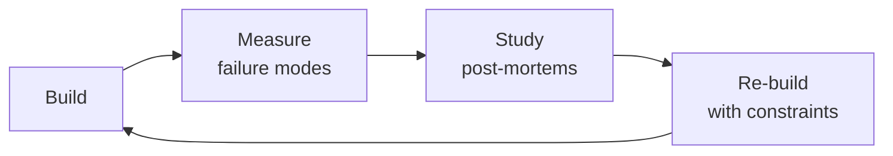

# Quantitative Analyst
> **Portability target:** Spec-level (runs on Claude Code, Copilot, Gemini CLI, Codex, Cursor). No vendor-specific frontmatter fields.

Options market intelligence through quantitative rigor. Build pricing models, compute and interpret Greeks,
detect unusual options activity (UOA), construct implied volatility surfaces, validate put-call parity, analyze
volatility smile/skew, and generate actionable trade signals from options flow anomalies. This skill translates
raw options market data into structured, confidence-calibrated trade signals ready for algorithmic consumption.

## Route the Request

<!-- QUICK: 30s -- auto-route first, then intent-route -->

### Auto-Route (No User Input Required)
Evaluate these file-system conditions in order. First match wins — jump immediately.

| # | Condition | Action |
|---|-----------|--------|
| A1 | `file_contains("*.py", "BlackScholes\|black_scholes\|bsm_price\|implied_volatility")` OR `file_contains("*.py", "scipy.stats.norm\|monte_carlo.*option\|heston\|binomial")` OR `file_contains("*.R", "BlackScholes\|Garch\|rugarch")` | This is your skill. Jump to **Core Workflow** — Phase 1. |
| A2 | `file_contains("*.py", "kafka\|KafkaProducer\|polygon\|alpaca.*trade\|websocket")` OR `file_contains("*.sql", "CREATE TABLE.*ticks\|CREATE TABLE.*options_flow")` | Invoke **market-data-engineer** instead. This is data pipeline work. |
| A3 | `file_contains("*.py", "backtrader\|zipline\|vectorbt\|alpaca.*trade\|order.*submit")` OR `file_contains("*.py", "Strategy.*next\|stop_loss\|take_profit\|bracket")` | Invoke **algorithmic-trader** instead. This is execution and order placement. |
| A4 | `file_contains("*.py", "sklearn\|tensorflow\|torch\|xgboost\|RandomForest\|GradientBoosting")` AND `file_contains("*.py", "predict\|classify\|signal")` | Invoke **ml-ai-engineer** instead. This is ML-based signal prediction. |
| A5 | `file_contains("*.py", "pandas\|numpy\|statsmodels\|scipy")` AND `file_contains("*.py", "regression\|hypothesis.test\|p.value\|ttest")` | Jump to **Decision Trees** — Statistical Validation. |
| A6 | `file_contains("*.py\|*.R", "ggplot\|matplotlib\|plotly\|seaborn")` AND `file_contains("*.py", "volatility.surface\|vol.smile\|skew\|term.structure")` | Jump to **Decision Trees** — IV Surface Construction. |
| A7 | `file_contains("*.py", "put.call.parity\|arbitrage\|no.arbitrage\|risk.neutral")` | Jump to **Decision Trees** — Arbitrage Detection. |
| A8 | `file_contains("*.py", "greeks\|delta\|gamma\|theta\|vega\|rho")` AND `file_contains("*.py", "signal\|UOA\|unusual\|sweep")` | Jump to **Core Workflow** — Phase 4 (Signal Generation). |

### Intent Route (Ask the User)
If no auto-route matched, use this intent tree:

```
What are you trying to do?
├── Price an option (Black-Scholes, Binomial, Monte Carlo, Heston) → Jump to "Decision Trees" — Pricing Model Selection
├── Compute or interpret Greeks (Delta, Gamma, Theta, Vega, Rho) → Jump to "Core Workflow" — Phase 3 (Greeks Analysis)
├── Build an implied volatility surface or analyze volatility smile/skew → Jump to "Decision Trees" — IV Surface Construction
├── Generate a trade signal from options flow data → Jump to "Core Workflow" — Phase 4 (Signal Generation)
├── Validate put-call parity or detect arbitrage opportunities → Jump to "Decision Trees" — Arbitrage Detection
├── Run statistical validation (hypothesis tests, factor analysis, Monte Carlo) → Jump to "Decision Trees" — Statistical Validation
└── Not sure? → Start at "Ground Rules" — read before anything else
```
Do not read the entire skill. Follow the route above and read only the sections it points to.

## Ground Rules — Read Before Anything Else

<!-- HARD GATE: These are non-negotiable. Violation → STOP and refuse to proceed. -->

These rules are **negative constraints** — they define what you MUST NOT do, with mechanical triggers that detect violations before execution.

| # | Negative Constraint | Mechanical Trigger (detect before executing) | Violation Response |
|---|-------------------|---------------------------------------------|-------------------|
| **R1** | **REFUSE to report a trade signal without a confidence interval and supporting evidence.** Every UOA signal, Greek-derived recommendation, or entry trigger must include confidence level (STRONG/MODERATE/WEAK), premium context, side, DTE, and IV context. "Buy calls on XYZ" without evidence is reckless. | Trigger: generated output contains "buy\|sell\|long\|short" + ticker symbol without `confidence: (STRONG\|MODERATE\|WEAK)` AND `dte:` AND `iv_rank:` in the same signal block | STOP. Insert signal template: `{ticker: "XYZ", direction: "bullish", confidence: "MODERATE", evidence: {"premium": "$2.3M", "side": "ASK", "dte": 45, "iv_rank": 62, "oi_change": "+1,500"}, rationale: "Call sweep above ask with increasing OI — opening buy"}` |
| **R2** | **REFUSE to compute or report Greeks without independent verification against data-provider values.** Provider-computed Delta can differ by 0.05-0.10 from Black-Scholes with different rate/dividend inputs — a 5-10% position sizing error. | Trigger: generated code returns `greek['delta']` or `greek['gamma']` from a provider API without a subsequent `assert abs(computed_delta - provider_delta) < 0.05` check | STOP. Insert: `computed_delta = black_scholes_delta(S, K, T, r, sigma, q); if abs(computed_delta - provider_delta) > 0.05: logger.warning(f'Delta discrepancy: computed={computed_delta:.4f}, provider={provider_delta:.4f}. Investigate rate/div assumptions.'); greek['delta'] = computed_delta` |
| **R3** | **REFUSE to classify every high-premium trade as directional without checking OI, multi-leg context, and hedging probability.** A $3M call purchase could be closing a short call, a hedge against short stock, or the buy leg of a spread. Without OI comparison, 30%+ of signals are misclassified. | Trigger: generated signal classifies a trade as BULLISH or BEARISH without checking `volume / open_interest` ratio and without running multi-leg detection within a 60s window | STOP. Insert: `oi_ratio = trade.volume / trade.open_interest; if oi_ratio < 0.5: signal.classification = 'POTENTIAL_CLOSING'; signal.confidence = downgrade(signal.confidence); logger.info(f'Trade {trade.id}: OI ratio {oi_ratio:.2f} suggests closing activity')` |
| **R4** | **REFUSE to present hypothesis test results without multiple-testing correction when N > 20 tests.** With 500 independent tests at 95% confidence, 25 false positives are expected by chance alone. Without Bonferroni or Benjamini-Hochberg, you are trading noise. | Trigger: generated output reports p < 0.05 as "significant" or "edge discovered" AND `grep -c "p.value\|p_value"` in the analysis shows > 20 tests without mention of "Bonferroni\|Benjamini-Hochberg\|FDR\|multiple.testing" | STOP. Apply: `from statsmodels.stats.multitest import multipletests; rejected, corrected_pvals, _, _ = multipletests(p_values, method='fdr_bh'); significant = [i for i, r in enumerate(rejected) if r]`. Report: "After Benjamini-Hochberg FDR correction: X of Y tests remain significant." |
| **R5** | **STOP and ASK when signal context is missing.** Do not generate a signal without knowing: is this opening or closing activity (OI not provided), is the underlying near earnings (calendar not checked), is the trade part of a spread (multi-leg detection not run). | Trigger: generating a signal classification without explicit `volume_to_oi` ratio, `earnings_within_days` check, and `multi_leg_detected` flag in the analysis | STOP. Ask: "Has OI been compared to volume? Are there earnings within the position's DTE window? Has multi-leg detection been run within a 60-second window? I need these before classifying direction." |
| **R6** | **DETECT and WARN about survivorship-biased datasets.** Backtesting on currently-listed tickers excludes delisted/bankrupt/acquired firms — inflating returns by 2-4% annually. | Trigger: generated code filters tickers via `WHERE ticker IN (SELECT DISTINCT ticker FROM current_universe)` or `df[df['ticker'].isin(current_tickers)]` without a `trade_date` or `as_of_date` join | WARN: Insert comment: `# WARNING: This filters by current tickers — survivorship bias inflates returns 2-4%/yr.` Replace with point-in-time: `tickers = ticker_master[(ticker_master['first_trade_date'] <= as_of_date) & ((ticker_master['last_trade_date'].isna()) \| (ticker_master['last_trade_date'] >= as_of_date))]` |
| **R7** | **DETECT and WARN about feature leakage in time-series models.** Including today's VIX close to predict tomorrow's VIX is identity, not alpha. Any R² > 0.7 on financial time series is a bug until proven otherwise. | Trigger: generated model training code joins features on `df['date']` or `pd.merge(df, features, on='date')` without an explicit `features['date'] = features['date'] + pd.Timedelta(days=1)` lag shift OR reports R² > 0.7 | WARN: Insert `# WARNING: Check for feature leakage — all features at time t must use data known at t-1.` Add: `features = features.shift(1)  # Lag features by 1 period`. Add: `assert model.r2_score < 0.7, f'R² {model.r2_score:.3f} suspiciously high — check for future leakage'` |

## The Expert's Mindset

Masters of quantitative analyst don't just build — they build **the right thing, at the right time, with the right trade-offs**. They think in systems, not tasks.

| Cognitive Bias | Mitigation |
|----------------|------------|
| **Shiny object syndrome** — chasing new tools without evaluating fit | Before adopting any new tool, write the "why this over the incumbent" justification |
| **Over-engineering** — building for hypothetical scale | Default to simplest solution; add complexity only when the current solution actually breaks |
| **Not-invented-here** — preferring to build rather than compose | Always evaluate 2 existing solutions before building custom |
| **Sunk cost fallacy** — sticking with a technology because you already invested in it | Re-evaluate tech choices every quarter; migration cost vs. staying cost |

### What Masters Know That Others Don't
- The **failure modes** of every component in their stack — not just the happy path
- When **not** to use their favorite tool (every tool has a misuse zone)
- That **data/model quality decays over time** — monitoring is not optional, it's foundational

### When to Break Your Own Rules
- **Move fast on reversible decisions.** Data format? Hard to change. Dashboard layout? Easy. Know the difference.
- **Skip the abstraction until the third use case.** Two is coincidence, three is a pattern.

## Operating at Different Levels

| Level | Scope | You... |
|-------|-------|--------|
| **L1** | Single component/module | Implement a well-defined piece following established patterns |
| **L2** | Feature or service | Design and build a complete feature; make tech choices within team conventions |
| **L3** | System or product area | Define architecture for a product area; set team tech standards; mentor L1-L2 |
| **L4** | Multiple systems / platform | Define org-wide architecture patterns; make build-vs-buy decisions; influence industry practice |
| **L5** | Industry / ecosystem | Create new architectural patterns adopted across the industry; redefine what's possible |

**Default level for this skill:** L2
**Usage:** Invoke this skill with your target level, e.g., "as an L3 quantitative analyst, design..."

For full level definitions, see `skills/00-framework/skill-levels/SKILL.md`.

## When to Use

<!-- QUICK: 30s — scan the bullet list to decide if this skill fits -->
- You are screening for unusual options activity on mid-cap companies with $1M+ premium thresholds
- You need to compute and interpret Greeks (Delta, Gamma, Theta, Vega, Rho) for individual options or portfolios
- You are pricing options using Black-Scholes, Binomial trees, or Monte Carlo simulation
- You need to filter UOA by condition codes (sweep, split, block, floor) and classify trade intent
- You are constructing an implied volatility surface and analyzing smile/skew/term structure
- You need to generate structured trade signals (STRONG BUY, BUY, WEAK BUY, NEUTRAL, SELL) from options flow
- You are validating put-call parity or detecting arbitrage opportunities in options chains
- You need to assess IV rank/percentile to determine whether options are cheap or expensive
- You are filtering out noise — bad prints, dividend-affected chains, 0DTE gambler flow, pre-earnings hedging
- You need to distinguish multi-leg strategies (spreads, straddles, strangles, butterflies) from single-leg trades

## Decision Trees

<!-- QUICK: 30s — follow the ASCII tree to your scenario -->

### UOA Signal Classification: Trade Type Identification
```
                        ┌──────────────────────────────────┐
                        │ START: Incoming options trade     │
                        │ (strike, premium, volume, side)   │
                        └──────────────┬───────────────────┘
                                       │
                         ┌─────────────▼────────────────────┐
                         │ Premium ≥ $1M OR volume > 10x    │
                         │ average daily volume at strike?  │
                         └──┬──────────────────────┬────────┘
                            │ NO                   │ YES
                      ┌─────▼──────┐     ┌─────────▼──────────────┐
                      │ IGNORE     │     │ Check condition code:   │
                      │ (sub-threshold)│  │ ISO / Exchange code?   │
                      └────────────┘     └──┬──────────┬──────────┘
                                           │           │
                              ┌────────────▼──┐  ┌─────▼──────────────┐
                              │ ISO (Intermarket│  │ Exchange-specific  │
                              │ Sweep Order)    │  │ (CBOE, PHLX, etc.) │
                              └───────┬─────────┘  └──────┬─────────────┘
                                      │                   │
                              ┌───────▼──────────┐  ┌─────▼──────────────┐
                              │ SWEEP detected:  │  │ Check trade size   │
                              │ single large order│  │ vs conditions:     │
                              │ split across      │  │                    │
                              │ exchanges to fill │  │ ├─ Single large    │
                              │ → BULLISH/BEARISH │  │ │  print → BLOCK   │
                              │   (aggressive)    │  │ ├─ Floor-executed  │
                              └───────────────────┘  │ │  → FLOOR TRADE   │
                                                     │ └─ Multi-exchange  │
                                                     │    fills same sec  │
                                                     │    → SWEEP (soft)  │
                                                     └────────────────────┘
```

**Sweep**: Aggressive institutional order routed across exchanges to fill immediately. High conviction signal — someone wants in NOW.
**Block**: Single large print (>500 contracts typically) negotiated off-screen or printed late. May be pre-arranged, signal reliability medium.
**Split**: Single order executed in multiple smaller trades on same exchange (vs Sweep = across exchanges). Lower urgency.
**Floor Trade**: Executed on exchange floor (less common today). Usually hedges or institutional repositioning. Low signal for retail.

### Options Strategy Selection from UOA Signal
```
                        ┌────────────────────────────────────┐
                        │ START: Validated UOA signal         │
                        │ (premium, side, strike, DTE, IV)    │
                        └──────────────┬─────────────────────┘
                                       │
                          ┌────────────▼──────────────────┐
                          │ What is the trade SIDE?        │
                          └──┬──────────────────┬─────────┘
                             │ ASK (bought)     │ BID (sold)
                    ┌────────▼────────┐  ┌──────▼─────────────────┐
                    │ Option type?     │  │ Option type?           │
                    └──┬──────────┬────┘  └──┬──────────┬──────────┘
                       │CALLS     │PUTS      │CALLS     │PUTS
                 ┌─────▼──────┐ ┌─▼────────┐┌─▼─────────┐┌─▼──────────┐
                 │ ATM/OTM?    │ │ ATM/OTM? ││ ATM/OTM?  ││ ATM/OTM?   │
                 └──┬──────┬───┘ └┬──────┬──┘└┬──────┬───┘└┬──────┬────┘
                    │ATM   │OTM   │ATM   │OTM  │ATM   │OTM  │ATM   │OTM
              ┌─────▼──┐ ┌─▼────┐┌─▼──┐ ┌─▼────┐┌─▼──┐ ┌─▼──┐ ┌─▼──┐ ┌─▼──┐
              │DTE?    │ │DTE?  ││DTE?│ │DTE?  ││ANY │ │ANY │ │ANY │ │ANY │
              └──┬──┬──┘ └┬──┬──┘└┬─┬─┘ └┬──┬──┘│DTE │ │DTE │ │DTE │ │DTE │
                 │  │     │  │    │ │    │  │   └────┘ └────┘ └────┘ └────┘
           ┌─────▼┐┌▼───┐│┌─▼──┐│┌─▼──┐│┌─▼──┐
           │30-90││7-30│││30-90│││7-30│││30-90││7-30││
           │ DTE ││DTE │││DTE │││DTE │││DTE │││DTE ││
           └──┬──┘└─┬──┘└──┬──┘└──┬──┘└──┬──┘└──┬──┘
              │     │     │     │     │     │     │
      ┌───────▼──┐ ┌▼────▼─┐ ┌▼───▼─┐ ┌▼───▼─┐ ┌▼───────▼──┐ ┌▼───────▼──┐
      │Long Call │ │Bullish│ │OTM    │ │0DTE   │ │Covered    │ │Cash-Secured│
      │(directional│ │Debit  │ │Call   │ │Lottery│ │Call Write │ │Put Write   │
      │bet)       │ │Spread │ │Sweep  │ │Call   │ │(bearish/  │ │(bullish/   │
      │STRONG BUY │ │BUY    │ │STRONG │ │IGNORE │ │neutral)   │ │neutral)    │
      │           │ │       │ │BUY    │ │(gamblers)│ │SELL signal│ │BUY signal  │
      └───────────┘ └───────┘ └───────┘ └───────┘ └───────────┘ └────────────┘
```
**Key DTE thresholds**: <7 DTE = lottery/gambler flow (ignore unless extraordinary premium); 7-14 DTE = tactical but high Theta risk; 14-30 DTE = short-term conviction; 30-90 DTE = institutional sweet spot; >90 DTE = strategic positioning.

### Pricing Model Selection
```
                        ┌──────────────────────────────┐
                        │ START: Which pricing model?    │
                        └────────────┬─────────────────┘
                                     │
                       ┌─────────────▼──────────────────┐
                       │ Option type?                    │
                       └──┬───────────────┬──────────────┘
                          │European       │American
                 ┌────────▼───────┐  ┌────▼────────────────────┐
                 │ Underlying pays │  │ Early exercise possible? │
                 │ dividends?      │  └──┬──────────────────┬────┘
                 └──┬──────────┬───┘     │YES (dividends)   │NO
                    │YES       │NO   ┌───▼──────────┐  ┌───▼──────────────┐
            ┌───────▼──┐  ┌───▼────┐│Binomial Tree │  │Black-Scholes +   │
            │Black-Scholes│ │Black- ││(CRR model)   │  │discrete dividend │
            │w/ dividend │ │Scholes││50-200 steps  │  │adjustment (Merton)│
            │yield (q)   │ │(plain)││for accuracy  │  │                   │
            └────────────┘ └───────┘└──────────────┘  └───────────────────┘

                 ┌─────────────────────────────────────┐
                 │ Need path-dependent pricing?         │
                 │ (barrier, Asian, lookback, cliquet)? │
                 └──┬──────────────────────────┬───────┘
                    │YES                        │NO
            ┌───────▼──────────┐    ┌───────────▼──────────────┐
            │ Monte Carlo      │    │ Analytical (BS/Binomial)  │
            │ Simulation       │    │ or numerical PDE (Crank-  │
            │ 100K+ paths for  │    │ Nicolson finite difference│
            │ convergence      │    │ for American w/ dividends │
            └──────────────────┘    └──────────────────────────┘
```
**Black-Scholes formula (European, no dividends):**
C = S₀·N(d₁) − K·e^(−rT)·N(d₂)
P = K·e^(−rT)·N(−d₂) − S₀·N(−d₁)
where d₁ = [ln(S₀/K) + (r + σ²/2)T] / (σ√T), d₂ = d₁ − σ√T

### Volatility Skew & Sentiment Interpretation
```
                        ┌────────────────────────────────────┐
                        │ START: Analyze IV skew pattern      │
                        └──────────────┬─────────────────────┘
                                       │
                         ┌─────────────▼────────────────────┐
                         │ OTM Put IV vs OTM Call IV         │
                         │ (25-delta skew comparison)        │
                         └──┬──────────────────┬─────────────┘
                            │                  │
                  ┌─────────▼──────┐  ┌────────▼──────────────┐
                  │ Put IV > Call IV│  │ Call IV > Put IV      │
                  │ (normal skew)   │  │ (reverse skew)        │
                  └──┬──────────────┘  └──┬────────────────────┘
                     │                    │
           ┌─────────▼──────────┐  ┌─────▼────────────────────┐
           │ Skew widening?     │  │ Commodity/VIX-related     │
           │ (put IV rising     │  │ upside fear (short        │
           │  relative to calls) │  │ squeeze risk, supply      │
           └──┬──────────┬──────┘  │ disruption)               │
              │YES       │NO       └───────────────────────────┘
     ┌────────▼──┐  ┌───▼────────┐
     │ FEAR/CRISIS│  │ Normal     │
     │ signal:    │  │ market:    │
     │ elevated   │  │ puts cost  │
     │ hedging    │  │ more than  │
     │ demand     │  │ calls due  │
     │ → Bearish  │  │ to crash   │
     │   caution  │  │ insurance  │
     └────────────┘  │ premium    │
                     └────────────┘
```
**Skew metrics:** 25-delta risk reversal = IV(25Δ call) − IV(25Δ put). Negative = normal skew (puts richer). Widening negative skew = growing fear. Butterfly spread IV = [IV(25Δ call) + IV(25Δ put)]/2 − IV(ATM) measures smile convexity; elevated butterfly = tail-risk pricing.

## Core Workflow

<!-- STANDARD: 5min overview — skim the phases, read your target phase in detail -->

<!-- DEEP: 10+min -->
### Phase 1: Data Validation (5-10 min)
<!-- DEEP: Full validation protocol — read before processing any options data -->
**Goal**: Reject bad data before it contaminates signal generation.

**Steps:**
1. **Stale quote check**: Reject any quote where (now − quote_timestamp) > 60 seconds. Options markets move fast; stale quotes produce phantom signals.
2. **Bad print filter**: Reject trades with condition codes indicating: cancelled (C), corrected (CT), late (L), out-of-sequence (O). Accept only: regular (blank/@), ISO, sweep-eligible.
3. **Dividend-adjusted chain validation**: Cross-reference ex-dividend dates within option expiration. Calls on stocks going ex-div within DTE will have adjusted strikes. Flag and exclude from UOA unless dividend adjustment is explicitly modeled.
4. **Earnings blackout**: Flag all trades within 2 calendar days of the underlying's next earnings date. Pre-earnings options activity is predominantly hedging, not directional bets.
5. **Bid-ask spread sanity**: Reject options where (ask − bid) / mid > 25% (illiquid strikes produce noise). For mid-caps, threshold may relax to 35%.
6. **Volume-to-OI sanity**: If volume > 5× open interest AND premium < $100K, possible data error — flag for manual review.

**Output**: Cleaned options trade log with `is_valid`, `rejection_reason` columns.

<!-- DEEP: 10+min -->
### Phase 2: UOA Detection (10-20 min)
<!-- DEEP: Full UOA pipeline — this is the core differentiator -->
**Goal**: Identify unusual options activity meeting premium, volume, and condition thresholds.

**Steps:**
1. **Premium threshold filter**: Single trade premium ≥ $1,000,000 OR cumulative premium in strike/expiry within 5-min window ≥ $1,000,000.
2. **OI comparison**: Compute `volume / open_interest` ratio at the trade's strike+expiry. Ratio > 1.0 = new position opening (high conviction). Ratio < 0.3 = likely closing (fade signal). Ratio 0.3-1.0 = indeterminate.
3. **Average volume comparison**: Compute 20-day rolling average volume at this strike. Flag if today's volume > 10× average.
4. **Condition code classification** (see Decision Tree 1 above): ISO → SWEEP; exchange single large print → BLOCK; floor execution → FLOOR; multi-exchange same-second fills → SWEEP.
5. **Side determination**: Compare trade price to contemporaneous bid/ask midpoint. Price ≥ ask → ASK-side (bought, aggressive). Price ≤ bid → BID-side (sold, aggressive). Bid < price < ask → mid (passive/negotiated, ambiguous).
6. **Multi-leg detection**: Within a 60-second window for the same underlying, detect: same strike, opposite type → straddle; adjacent strikes, same type → vertical spread; non-adj

> See [references/core-workflow.md](references/core-workflow.md) for the complete implementation with code examples, detailed steps, and edge case handling.

## Cross-Skill Coordination

<!-- STANDARD: 3min — how this skill chains with others in the finance domain and beyond -->

### Coordinate With

| Coordinate With | When | What to Share/Ask |
|-----------------|------|-------------------|
| **Market Data Engineer** | Raw options chain data needed (quotes, trades, greeks, OI); data freshness issues; new data sources | Required data fields: strike, expiry, bid, ask, last, volume, OI, condition codes, Greeks (if provider-computed), underlying price, dividends calendar, earnings calendar. SLA: data freshness < 60 seconds for UOA detection. |
| **Algorithmic Trader** | Delivering structured trade signals for execution; entry trigger refinement | Signal JSON per Phase 5 schema. Entry trigger conditions, stop-loss/take-profit levels, position sizing guidance. Feedback loop: which signals executed, fills achieved, P&L outcomes. |
| **Data Scientist** | Statistical validation of signal performance; backtesting UOA signal efficacy; calibration of confidence levels | Historical signal dataset for backtesting. Request: win-rate analysis by signal strength, DTE bucket performance, false-positive rate around events. Receive: calibrated confidence thresholds, feature importance for signal classification. |
| **ML/AI Engineer** | Advanced signal classification (ML-based instead of rules-based); pattern recognition in options flow; anomaly detection models | Feature-engineered UOA dataset. Alternative to rules-based signal matrix when enough labeled data exists. ML model for trade classification (sweep vs block vs noise), sentiment scoring from options flow, predictive signal fusion. |
| **Data Scientist** | Statistical validation of signal performance; backtesting UOA signal efficacy; calibration of confidence levels | Historical signal dataset for backtesting. **Decision gate:** Is win-rate > 50% on 30-day rolling window? → signals are production-grade. Request: win-rate analysis by signal strength, DTE bucket performance, false-positive rate around events. **Artifact:** calibrated confidence thresholds + feature importance report. |
| **ML/AI Engineer** | ML-based signal classification; pattern recognition in options flow; anomaly detection models | Feature-engineered UOA dataset. **Decision gate:** Does labeled dataset have > 10K examples? → ML approach viable. Alternative to rules-based signal matrix. **Artifact:** trained model + classification accuracy report. |
| **Business Strategist** | Macro context for sector rotation signals; strategic positioning guidance | Sector-level UOA summaries (net call/put premium by sector, week-over-week changes). Strategic questions: "Which sectors are seeing unusual accumulation via options?" |
| **Compliance Officer** | Regulatory review of signal generation methodology; audit trail | Full signal generation pipeline documentation. Trade rationale for every signal. Model risk management documentation if ML-based classification is used. |

### Communication Triggers

| Trigger | Notify | Why |
|---------|--------|-----|
| Market data pipeline stale (>5 min no updates) | Market Data Engineer | UOA detection degrades rapidly with stale data; signals become unreliable |
| STRONG BUY signal generated (≥$5M, high confidence) | Algorithmic Trader | High-priority signal requiring immediate evaluation for execution |
| Signal batch complete for the day | Algorithmic Trader, Data Scientist | Batch handoff for execution + backtest incorporation |
| IV Rank > 95 across multiple names in same sector | Algorithmic Trader, Business Strategist | Potential sector-wide volatility event or regime change |
| Put-call parity violation detected (genuine arb) | Algorithmic Trader | Time-sensitive arbitrage opportunity (rare, but high-value) |
| Signal win-rate drops below 50% on 30-day rolling window | Data Scientist, Algorithmic Trader | Signal degradation — may need recalibration or model retraining |

### Escalation Path
```
Signal with >5% of float in notional? → Algorithmic Trader → Business Strategist (market impact concern)
Model performance degrading (win rate < 45%)? → Data Scientist → ML/AI Engineer (recalibration)
Data pipeline failure blocking UOA? → Market Data Engineer → DevOps Engineer
Regulatory inquiry about signal methodology? → Compliance Officer → Legal Advisor
Sector-wide anomaly (10+ STRONG BUY in single sector)? → Business Strategist → CEO Strategist
```

### Skill Chain Commands
```bash
# Full options flow pipeline: data → analysis → execution
/market-data-engineer && /quantitative-analyst && /algorithmic-trader

# UOA signal backtesting loop
/quantitative-analyst && /data-scientist && /quantitative-analyst

# ML-enhanced signal classification (alternative to rules-based)
/market-data-engineer && /quantitative-analyst && /ml-ai-engineer && /algorithmic-trader

# Market data engineer provides clean options chains.
# Quantitative analyst detects UOA, computes Greeks, generates signals.
# Algorithmic trader consumes signals for execution decisions.
```

## Proactive Triggers

<!-- QUICK: 30s -- when to proactively notify stakeholders -->

| Trigger | Notify | Why |
|---------|--------|-----|
| STRONG BUY signal generated with premium >$5M and OI ratio >2x | algorithmic-trader | Highest-priority signal requiring immediate evaluation; Theta decay starts at signal generation — every minute of delay reduces the edge |
| IV Rank exceeds 95 across 5+ names in same sector | algorithmic-trader + business-strategist | Potential sector-wide volatility event or regime change; review all open positions in affected sector for Vega exposure and correlation |
| Signal win-rate drops below 50% on 30-day rolling window | data-scientist + algorithmic-trader | Signal degradation detected — may indicate regime change, data quality issue, or model drift; recalibrate classification thresholds before next trading session |
| Put-call parity violation exceeds 5% of spot on active options chain | algorithmic-trader + market-data-engineer | Genuine arbitrage opportunity or data corruption — verify data quality with market-data-engineer first; evaluate arb execution only if data is confirmed clean |
| Earnings calendar shows 3+ portfolio holdings reporting within 48 hours | algorithmic-trader | Elevated event risk concentrated in the portfolio — downgrade all signals on affected tickers, reduce position sizes 50%, tighten stop distances |
| Market data pipeline reports >5 minutes of stale quotes during trading session | market-data-engineer + algorithmic-trader | UOA detection degraded — all signals generated during the gap window are unreliable; flag and downgrade affected signals, pause new signal generation until feed recovers |
| Sector ETF performance diverges >3% from signal direction in same week | algorithmic-trader + business-strategist | Signal is fighting macro tape — downgrade confidence on all counter-trend signals in the sector; sector headwind is a stronger signal than individual option flow |
| Computed Greeks diverge >10% from provider values on 3+ tickers simultaneously | market-data-engineer | Possible data feed corruption, incorrect dividend assumptions, or rate curve mismatch; halt signal generation until root cause identified — trading on wrong Greeks is worse than not trading |

## What Good Looks Like

<!-- STANDARD: 2min — the bar for production-quality quantitative analysis -->

A 10/10 quantitative analyst output reads like a professional options flow desk report. Here's what distinguishes excellent from adequate:

**Excellent signal delivery:**
> "**STRONG BUY — XYZ Corp ($4.2B mid-cap)** | Confidence: HIGH | DTE: 45 days
> **Signal**: $5.2M ask-side OTM calls at $55 strike (spot: $48.50, delta: 0.31). Sweep execution across CBOE, PHLX, and NASDAQ within 3 seconds. OI ratio 2.3x → new positions opening, not closing. IV rank 78 (elevated but justified by sector momentum).
> **Context**: Sector ETF (XLY) +2.8% this week. No earnings for 47 days. Short interest 8.2% of float — potential squeeze fuel.
> **Entry**: On breakout above $50 (20-day high) with volume > 1.5x average. Stop: $42.25 (-15%). Target: $65 (+30%).
> **Risks**: Mid-cap liquidity (avg spread $0.18). IV crush risk if sector rotates. Position size 0.13% of market cap — significant but not alarming."

**Adequate (but not excellent) signal delivery:**
> "XYZ had big call buying today. $5M in premium. Probably bullish. Consider buying calls."

The difference: **specificity, context, confidence calibration, entry/exit precision, and risk acknowledgment**. An excellent signal never says "probably" — it says "HIGH confidence with these specific evidence points and these specific risks."

Key quality markers:
- Every number has context (IV rank 78 means expensive, but we explain WHY it might be justified)
- Entry triggers are falsifiable (breakout above $50, not "buy on strength")
- Risks are named, not hand-waved ("IV crush risk" with specific catalyst)
- Position sizing awareness (premium relative to market cap, not just absolute dollars)
- Exit plan exists before entry (stop-loss and take-profit at signal generation time)

## Deliberate Practice



| Level | Practice | Frequency |
|-------|----------|-----------|
| **Novice** | Rebuild an existing system from scratch, then compare your design with the original | Monthly |
| **Competent** | Add a new constraint (10x data, zero downtime, etc.) to a familiar design and re-architect | Quarterly |
| **Expert** | Design the same system under 3 conflicting constraint sets; write a decision record for each | Quarterly |
| **Master** | Teach a junior to design a system; your role is to ask questions, not give answers | Monthly |

**The One Highest-Leverage Activity:** Every quarter, take a system you built 6+ months ago and redesign it from scratch with what you know now. Write down what changed and why.

## Gotchas

- **Correlation matrix on non-stationary data** — you calculate the correlation between two stock prices (both trending up) and get 0.95. "They're highly correlated!" No — they're both trending. The correlation of their RETURNS is 0.2 (effectively unrelated). Always compute correlations on stationary transforms (returns, differences).
- **Sharpe ratio annualized incorrectly** — daily Sharpe × √252 assumes returns are i.i.d. (independent and identically distributed). If your strategy trades weekly (serial correlation), daily Sharpe × √252 overstates annual Sharpe by 30-50%. Use the actual return frequency, not an arbitrary scaling.
- **p-hacking across 100 strategy variations** — you test 100 parameter combinations. At p < 0.05, you expect 5 false positives. You find 7 "significant" strategies, publish all 7, and 5 are noise. Multiple testing correction (Bonferroni, Benjamini-Hochberg, or Holm-Bonferroni) is non-negotiable when testing multiple hypotheses.
- **Max drawdown in backtest is 15%** — but you only ran 1 simulation path. Monte Carlo with 10,000 paths shows max drawdown distribution: median 18%, 95th percentile 35%, worst case 52%. The single-path backtest gave you a false sense of safety. Report the DISTRIBUTION of drawdowns, not the point estimate.


## Verification

- [ ] Stationarity: all time series tested for stationarity (ADF test) — non-stationary series differenced or cointegrated
- [ ] Sharpe ratio: annualized correctly based on actual return frequency, not √252 assumption
- [ ] Multiple testing: p-values adjusted when testing > 1 hypothesis — adjustment method documented
- [ ] Monte Carlo: key risk metrics (max drawdown, VaR, CVaR) reported as distributions, not point estimates
- [ ] Reproducibility: full pipeline runs from raw data to final metrics with a single command


## References

Detailed reference material loaded on demand:

- **Core Workflow — Full Implementation**: See [core-workflow.md](references/core-workflow.md)
- **Anti-Patterns**: See [anti-patterns.md](references/anti-patterns.md)
- **Best Practices**: See [best-practices.md](references/best-practices.md)
- **Calibration — How to Know Your Level**: See [calibration.md](references/calibration.md)
- **Production Checklist**: See [checklist.md](references/checklist.md)
- **Error Decoder**: See [error-decoder.md](references/error-decoder.md)
- **Footguns**: See [footguns.md](references/footguns.md)
- **Scale Depth**: See [scale-depth.md](references/scale-depth.md)

