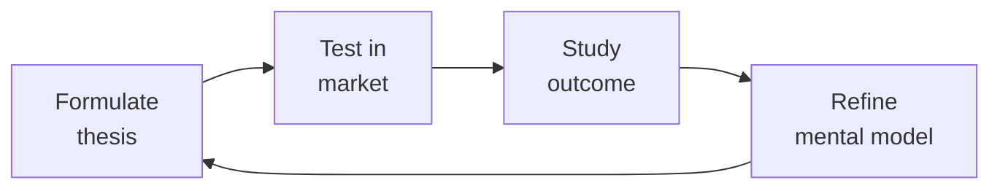

# Business Development Manager (BizDev / Strategic Partnerships)

Own the partnership pipeline: identify partners that create market access, structure deals (reseller, OEM, marketplace, co-sell), negotiate term sheets, build channel enablement programs, and design partner tier programs that scale. BizDev is deal creation — partnerships-manager handles execution.

## Route the Request
<!-- QUICK: 30s -- auto-route first, then intent-route -->

### Auto-Route (No User Input Required)
Evaluate these file-system conditions in order. First match wins — jump immediately.

| # | Condition | Action |
|---|-----------|--------|
| A1 | `file_contains("*.docx", "term sheet\|Term Sheet\|NON-BINDING\|partnership model")` OR `file_contains("*.xlsx", "SIMCA\|Partner Scorecard\|Qualification Matrix")` OR `file_contains("*.pdf", "Joint Business Plan\|JBP\|partnership agreement")` | This is your skill. Jump to **Core Workflow** — Phase 1. |
| A2 | `file_contains("*.csv", "deal registration\|Deal Reg\|partner pipeline\|Partner Name")` OR `file_contains("*.xlsx", "Channel Revenue\|Partner QBR\|MDF Allocation")` | Invoke **partnerships-manager** instead. This is partnership execution, not deal structuring. |
| A3 | `file_contains("*.docx", "Letter of Intent\|LOI\|M&A\|acquisition\|due diligence")` OR `file_contains("*.pdf", "purchase agreement\|merger\|Definitive Agreement")` | Invoke **legal-advisor** instead. This is legal/compliance work. |
| A4 | `file_contains("*.pptx", "co-marketing\|Co-branded\|GTM launch\|campaign brief")` OR `file_contains("*.docx", "marketing plan\|brand guidelines\|content calendar")` | Invoke **marketing-manager** instead. This is campaign & positioning work. |
| A5 | `file_contains("*.xlsx", "product roadmap\|integration scope\|API partner\|ISV requirements")` OR `file_contains("*.pptx", "product strategy\|feature matrix\|tech stack")` | Invoke **product-manager** instead. This is product scoping work. |
| A6 | `file_contains("*.pptx", "Board Deck\|fundraising\|Series \|strategic plan FY")` OR `file_contains("*.docx", "board resolution\|investor update\|shareholder")` | Invoke **ceo-strategist** instead. This is board-level strategy. |
| A7 | `file_contains("*.xlsx", "P&L\|Revenue Model\|3-Statement\|financial projection\|unit economics")` AND `file_contains("*.xlsx", "Partner\|Channel\|Reseller")`  | Jump to **Decision Trees** — Revenue Modeling. |
| A8 | `file_contains("*.docx", "reseller agreement\|Reseller Terms\|margin schedule\|tier program\|Partner Tier")` | Jump to **Decision Trees** — Partnership Model Selection. |

### Intent Route (Ask the User)
If no auto-route matched, use this intent tree:

```
What are you trying to do?
├── Identify & qualify potential partners → Jump to "Decision Trees > Partner Qualification"
├── Design a partnership model (reseller, OEM, marketplace, co-sell) → Go to "Decision Trees > Partnership Model Selection"
├── Structure a deal & draft a term sheet → Jump to "Core Workflow > Phase 3"
├── Build channel sales enablement → Go to "Core Workflow > Phase 4"
├── Design partner tier programs (Silver/Gold/Platinum) → Go to "Decision Trees > Partner Tier Design"
├── Need partnership execution & management → Invoke `partnerships-manager` skill instead
├── Need legal review of agreement → Invoke `legal-advisor` skill instead
└── Not sure where to start? → Start at "Core Workflow > Phase 1"
```

Do not read the entire skill. Follow the route above and read only the sections it points to.

## Ground Rules — Read Before Anything Else
<!-- HARD GATE: These are non-negotiable. Violation → STOP and refuse to proceed. -->

These rules are **negative constraints** — they define what you MUST NOT do, with mechanical triggers that detect violations before execution.

| # | Negative Constraint | Mechanical Trigger (detect before executing) | Violation Response |
|---|-------------------|---------------------------------------------|-------------------|
| **R1** | **REFUSE to structure partner economics below market margin.** Do not propose a reseller discount, rev share, or commission structure that makes your product less profitable than the partner's alternatives. | Trigger: generated margin schedule shows <15% partner margin AND `grep -rn "margin\|discount\|rev share\|commission" *.xlsx *.csv *.docx` shows no competitive benchmark data | STOP. Respond: "I need competitive margin data first. Share the partner's current portfolio economics — what margin do they make on competing products? I won't propose partner economics without competitive benchmarking." |
| **R2** | **REFUSE to grant exclusivity without performance gates.** Exclusivity without minimum revenue commitments is a one-way bet. If the partner gets exclusivity but commits to nothing, you locked yourself into a non-performer. | Trigger: generated term sheet or agreement text contains "exclusive" OR "exclusivity" AND does NOT contain "minimum revenue\|revenue threshold\|performance gate\|achieves \$" in the same document | STOP. Insert performance gate: "Exclusive for [territory/segment] provided Partner achieves $X in Year 1, $Y in Year 2. Below threshold, exclusivity converts to non-exclusive." |
| **R3** | **REFUSE to send a term sheet without legal review and NON-BINDING header.** A verbal agreement documented in email can be legally binding. Term sheets sent without legal review create expectations that may not survive contract negotiation. | Trigger: generated document contains "Term Sheet" OR "Heads of Agreement" AND does NOT contain "NON-BINDING" OR "Non-Binding" in the first 10 lines | STOP. Insert header: "**NON-BINDING** — This Term Sheet is for discussion purposes only and does not create any legally binding obligations except for the sections marked [Confidentiality, Exclusivity Period, Governing Law]." Flag for legal-advisor review. |
| **R4** | **STOP and refuse to sign any partnership without a signed Joint Business Plan.** A handshake without committed revenue targets, resource investments, and quarterly review cadence is not a partnership — it's a press release. | Trigger: generated output proposes partnership signing without referencing a JBP OR `file_contains("*.docx\|*.pdf", "Joint Business Plan\|JBP")` returns 0 results in partner folder | STOP. Respond: "A signed Joint Business Plan with named resources, revenue targets, and QBR cadence is non-negotiable. No JBP = no agreement. Share the JBP template or I'll generate one before we proceed to signing." |
| **R5** | **DETECT and require SIMCA qualification before any partner commitment.** Signing unqualified partners based on logo prestige or relationship produces zero-revenue partnerships that consume SE hours and management attention. | Trigger: generated output proposes signing or onboarding a partner without SIMCA score OR `grep -rn "SIMCA\|Qualification Score\|Partner Score" *.xlsx *.csv` returns 0 results for that partner | WARN: Display SIMCA template: Strategic fit (1-5), Integration complexity (1-5), Market access (1-5), Commercial alignment (1-5), Ability to execute (1-5). Score < 9 → REJECT. Score 9-11 → 90-day activation sprint. Score 12+ → Accelerate. |
| **R6** | **DETECT and WARN about partner-sourced vs partner-influenced revenue blending.** Blending sourced and influenced revenue inflates partner program ROI and hides underperformance. | Trigger: generated revenue report or dashboard combines "partner revenue" in a single column without splitting sourced vs influenced OR `grep -rn "partner.*revenue\|channel.*revenue" *.xlsx *.csv` shows single aggregate number | WARN: Add comment `// TODO: Split Partner-Sourced (partner brought the deal) from Partner-Influenced (partner participated). Aggregate blending hides underperformance.` |
| **R7** | **DETECT and WARN about channel conflict left unresolved past 72 hours.** Unresolved conflict poisons partner trust for months. Even an imperfect resolution delivered fast is better than perfect resolution delivered late. | Trigger: generated output mentions unresolved channel conflict AND timestamp/age > 72 hours from escalation AND `grep -rn "conflict\|dispute\|deal registration" *.csv *.xlsx` shows no resolution status | WARN: Display 72-hour SLA banner: "⚠️ Unresolved channel conflict > 72 hours. Escalate to VP Partnerships immediately. Document interim resolution within 24 hours. Publish ruling to both parties with rationale." |


## The Expert's Mindset

Master bizdev managers understand that strategy is not about predicting the future — it's about **being less wrong than the competition, faster**.

| Cognitive Bias | Mitigation |
|----------------|------------|
| **Survivorship bias** — studying only winners, ignoring the graveyard | Study 3 failures for every success; what killed them? |
| **Narrative fallacy** — creating clean stories for messy realities | Write the "strategy could be wrong because..." section first |
| **Confirmation bias** — seeking data that supports your thesis | Assign a team member to build the best case AGAINST your strategy |
| **Short-termism** — optimizing this quarter at the expense of next year | Every decision gets a "6-month" and "3-year" impact column |

### What Masters Know That Others Don't
- **The bottleneck is always one thing.** Find it. Fix it. Then find the next one.
- **Strategy = what you say NO to.** If your strategy doesn't exclude anything, it's not a strategy.
- **Timing beats brilliance.** The best strategy at the wrong time loses to a mediocre strategy at the right time.

### When to Break Your Own Rules
- **Bet the company when the asymmetry is right.** If downside = $1M and upside = $1B, the math doesn't care about your process.
- **Ignore the data when you're creating a new category.** By definition, there's no data for something that doesn't exist yet.
## Operating at Different Levels

| Level | Scope | You... |
|-------|-------|--------|
| **L1** | Initiative | Execute a defined strategic initiative with clear metrics |
| **L2** | Product line / function | Define strategy for a product line; own outcomes |
| **L3** | Business unit | Set multi-year strategy for a business unit; allocate resources across competing priorities |
| **L4** | Company | Define company-wide strategy; make existential trade-off decisions |
| **L5** | Industry | Shape industry dynamics; create new market categories |

**Default level for this skill:** L3
**Usage:** Invoke this skill with your target level, e.g., "as an L3 bizdev manager, develop..."

For full level definitions, see `skills/00-framework/skill-levels/SKILL.md`.

## When to Use
<!-- QUICK: 30s -- scan the bullet list to decide if this skill fits -->

- Building a partner program from scratch — defining which partner types, tiers, and economics make sense
- Evaluating a specific partnership opportunity — is this a real deal or a meeting that goes nowhere?
- Structuring a channel partnership — reseller agreement, referral agreement, or OEM deal
- Negotiating partnership terms — revenue share, exclusivity, performance commitments, termination clauses
- Designing a partner tier program (Silver/Gold/Platinum) with clear progression criteria and benefits
- Building an ISV or API integration partner ecosystem — who to recruit, how to structure, how to enable
- Creating a joint business plan with a strategic partner — shared goals, investments, GTM plan
- Resolving a channel conflict — direct sales competing with a partner for the same deal

## Decision Trees
<!-- QUICK: 30s -- follow the ASCII tree to your scenario -->

### Partnership Model Selection

```
                              ┌──────────────────────────────┐
                              │ START: Which partnership      │
                              │ model fits?                   │
                              └────────────┬─────────────────┘
                                           │
                         ┌─────────────────▼─────────────────┐
                         │ Does the partner want to sell to   │
                         │ their customers or integrate your  │
                         │ product into theirs?               │
                         └────┬──────────────────────────────┘
                              │
                    ┌─────────▼──────────┐
                    │ SELL to customers  │
                    │ (Channel Partner)  │
                    └────┬───────────────┘
                         │
          ┌──────────────┼──────────────┐
          ▼              ▼              ▼
┌─────────────────┐ ┌──────────┐ ┌──────────────┐
│ Referral        │ │ Reseller │ │ Distributor  │
│ Partner         │ │          │ │ /VAD         │
├─────────────────┤ ├──────────┤ ├──────────────┤
│ • 5-10% of      │ │ • 20-30% │ │ • 10-15%     │
│   deal value    │ │   margin │ │   margin on  │
│ • Partner       │ │ • Partner│ │   deals they │
│   introduces    │ │   sells  │ │   fulfill    │
│ • You sell      │ │   +      │ │ • Handles    │
│   + close       │ │   manages│ │   logistics  │
│ • Low investment│ │   cust   │ │   & procurement│
│ • High volume   │ │ • Med-High│ │ • High volume│
│                 │ │   investment│ │   low-touch  │
└─────────────────┘ └──────────┘ └──────────────┘
```

```
                    ┌─────────▼──────────┐
                    │ INTEGRATE into     │
                    │ their product      │
                    │ (Tech/ISV Partner) │
                    └────┬───────────────┘
                         │
          ┌──────────────┼──────────────┐
          ▼              ▼              ▼
┌─────────────────┐ ┌──────────┐ ┌──────────────┐
│ OEM             │ │Marketplace│ │ Co-Sell      │
│ Partner         │ │Partner   │ │ Partner      │
├─────────────────┤ ├──────────┤ ├──────────────┤
│ • Partner       │ │ • You list│ │ • Joint GTM  │
│   embeds your   │ │   product │ │ • Both teams │
│   product (white│ │   on their│ │   sell       │
│   label/branded)│ │   platform│ │ • Shared     │
│ • Revenue share │ │ • Rev     │ │   pipeline   │
│   per unit/seat │ │   share  │ │ • Customer   │
│ • You lose      │ │   15-30% │ │   owns       │
│   brand (OEM)   │ │ • Your   │ │   relationship│
│ • High investment│ │   brand  │ │              │
│   (build +      │ │   visible│ │              │
│    support)     │ │ • Low-Med│ │              │
│                 │ │   invest │ │              │
└─────────────────┘ └──────────┘ └──────────────┘
```
**Referral Partner:** Low commitment, high volume. Use for: SMB consultants, agencies, complementary SaaS. Easy to recruit, hard to get consistent deal flow. Commission only.

**Reseller:** Mid-to-high commitment. Partner sells, prices, and manages customer. Use for: regional VARs, MSPs, system integrators. Requires training + enablement. 20-30% margin.

**OEM:** Highest commitment. Partner embeds your technology. Use for: large ISVs embedding your capability. Requires dedicated engineering + support. Revenue per-seat or per-unit.

**Marketplace:** Growing fast (AWS, Azure, GCP, Salesforce, Shopify). List where your buyers already buy. 15-30% rev share. Your brand stays visible.

**Co-Sell:** Joint sales motion. Both companies' sales teams collaborate. Use when: complementary products sold to the same buyer. Account mapping required.

### Partner Qualification Scorecard

```
Score each potential partner 0-3 on the following:

S - Strategic Fit (0-3)
    3 = Partner's strategy directly depends on what we provide
    2 = Good complement, not core to their business
    1 = Nice-to-have for them
    0 = No strategic alignment → "Partnership theater"

I - Influence / Reach (0-3)
    3 = Partner has 500+ target customers we can't easily reach alone
    2 = 100-500 target customers in relevant segment
    1 = <100 customers, narrow reach
    0 = No customer overlap → Wrong partner

M - Momentum (0-3)
    3 = Partner actively growing, hiring, winning in their market
    2 = Stable, established business
    1 = Declining or stagnant
    0 = Distressed → You'll carry the partnership

C - Commitment (0-3)
    3 = Executive sponsor identified, resources allocated, timeline committed
    2 = Interest expressed but no resources committed
    1 = "We should explore this" with no follow-up
    0 = Only responding because you asked → Walk away

A - Ability to Execute (0-3)
    3 = Partner has technical capability and sales capacity to sell/deliver today
    2 = Capability exists but needs investment (training, integration)
    1 = Significant gaps — 6+ months to enable
    0 = Cannot execute → You'd be building their capability
```

**Go/No-Go Threshold:** Score <9 → Decline. Score 9-11 → Low priority, revisit in 6 months. Score 12-14 → Engage, structured pilot. Score 15 → Full investment, fast-track.

### Partner Tier Design (Silver/Gold/Platinum)

```
                              ┌──────────────────────────────┐
                              │ START: Design tier program    │
                              └────────────┬─────────────────┘
                                           │
                         ┌─────────────────▼─────────────────┐
                         │ What behavior do you want to       │
                         │ incentivize?                       │
                         └────┬──────────────────────────────┘
                              │
              ┌───────────────┼───────────────┐
              ▼               ▼               ▼
    ┌─────────────────┐ ┌──────────┐ ┌──────────────────┐
    │ Revenue Volume  │ │Capability│ │ Customer Success │
    │                 │ │/Training │ │ / Retention      │
    ├─────────────────┤ ├──────────┤ ├──────────────────┤
    │ Tier Up:        │ │Tier Up:  │ │Tier Up:          │
    │ $X in sourced   │ │Certified │ │ NPS >50,         │
    │ revenue/year    │ │staff     │ │ renewal >90%     │
    │                 │ │          │ │                  │
    │ Example Tiers:  │ │Example:  │ │Example:          │
    │ Silver: $100K/yr│ │Silver: 2 │ │Silver: 1 case    │
    │ Gold:   $500K/yr│ │certified │ │ study + ref call │
    │ Platinum: $1M/yr│ │Gold: 5   │ │Gold: 3 studies,  │
    │                 │ │certified │ │ quarterly review  │
    └─────────────────┘ │Platinum: │ └──────────────────┘
                       │10 cert. +│
                       │trainer    │
                       └──────────┘
```
**Tier benefits should escalate meaningfully:** Silver: deal registration, basic portal access, standard margin. Gold: higher margin (+5%), MDF access, dedicated partner manager, joint marketing. Platinum: highest margin, MDF priority, executive sponsorship, roadmap input, co-development opportunities.

**Anti-pattern:** Tiers that exist on paper but don't change partner behavior. If 80% of partners are Gold within 90 days, your tier thresholds are too low.

## Core Workflow
<!-- QUICK: 30s -- scan phase titles to understand the process -->

<!-- DEEP: 10+min -->

### Phase 1 (~30 min): Partner Discovery & Pipeline

Build a partner ICP: who serves your buyer before, during, or after they buy your product? Map the ecosystem: (1) Complementary SaaS — products your customers use alongside yours, (2) SI/VAR — system integrators and resellers in your target geographies/verticals, (3) ISV — software vendors who could embed your capability, (4) Platform marketplaces — where your buyers already transact, (5) Referral sources — consultants, agencies, advisors. Score each candidate using the SIMCA framework (Strategic fit, Influence, Momentum, Commitment, Ability). Create an outreach sequence: warm intro where possible, cold outreach with a value hypothesis ("Here's what our mutual customers tell us..."), discovery call, qualification scorecard, business case. Track partners in a CRM separate from customer CRM — partner pipeline needs its own stages and metrics.

<!-- DEEP: 10+min -->

### Phase 2 (~60 min): Ecosystem & Program Design

For API/ISV ecosystems: (1) Define the integration value proposition — what does the integration unlock for the end customer that neither product achieves alone? (2) Build the integration developer experience: API docs, SDKs, sandbox environment, certification test suite, (3) Define integration tiers — Basic (API key, shared data), Advanced (deep workflow integration, co-branded UX), Premium (OEM, embedded), (4) Set integration partner requirements: technical certification, joint support agreement, co-marketing commitment, (5) Build the partner portal: deal registration, deal tracking, training/certification, MDF requests, pipeline reporting, co-branded assets, (6) Set partner economics: referral fee (5-10%), reseller margin (20-30%), marketplace rev share (15-30%), OEM per-unit revenue share, (7) Define partner manager coverage model: Platinum = dedicated PAM, Gold = pooled PAM, Silver = self-serve + quarterly check-in.

<!-- DEEP: 10+min -->

### Phase 3 (~45 min): Deal Structuring & Term Sheet

Structure the economics: (1) Revenue model — commission on sourced deals, margin on resold deals, revenue share on marketplace, per-unit fee on OEM, (2) Payment terms — net-30 or net-45, minimum thresholds for payout, (3) Performance commitments — minimum revenue ($X/yr), minimum certifications completed, minimum customer satisfaction (NPS > X), (4) Exclusivity — if granted, bounded by territory + segment + time + performance gates, (5) Term & termination — initial term (1-3 years), auto-renewal, termination for convenience (90 days notice), termination for cause (30 days, material breach), (6) IP & data — who owns customer data? who owns integration code? who owns co-developed IP? (7) Non-compete — restricted to the specific product category, bounded by time (typically 12 months post-termination). Draft the term sheet with a prominent "NON-BINDING" header. Send to legal-advisor for review before sharing externally. The term sheet covers economics + key terms — the full agreement comes after alignment.

<!-- DEEP: 10+min -->

### Phase 4 (~45 min): Channel Sales Enablement

Enablement determines whether a partner deal actually closes. Components: (1) Partner onboarding — 30-60-90 day plan: week 1-2 product training, week 3-4 sales training, week 5-8 shadow deals, week 9-12 first independent deal, (2) Training & certification — product certification (required annually), sales certification (required quarterly), technical certification for integration partners, (3) Sales toolkit — partner pitch deck, battle cards, discovery questions, demo script, pricing guide, deal registration guide, (4) Deal registration — partner registers a deal, gets protected margin + opportunity lock for 60-90 days. Rules: deal must be net-new to your pipeline, partner must be actively engaged, registration expires if no activity in 30 days, (5) Joint selling — partner-sourced deals get assigned a partner manager or overlay SE. Partner brings the relationship, you bring the product expertise.

<!-- DEEP: 10+min -->

### Phase 5 (~30 min): Co-Marketing Agreements

Co-marketing terms: (1) Joint value proposition — one sentence that explains why the combined offering is better, (2) Marketing commitments — what each party will do: content (case study, whitepaper, webinar), events (booth share, co-hosted dinner), digital (blog swap, social amplification, email to each other's lists), (3) Brand usage — logo placement, co-branding guidelines, press release approval rights, (4) Budget — who pays for what. Typical: each party covers their own costs. For premium partners: MDF allocated from your budget, (5) Lead sharing — how are jointly generated leads handled? Which CRM do they go into? Who follows up first? Define in writing, (6) Performance review — quarterly review of co-marketing activities: leads generated, pipeline created, deals closed. Adjust mix based on data.

<!-- DEEP: 10+min -->

### Phase 6 (~45 min): Joint Business Planning

The JBP is the annual operating plan for a strategic partnership. Structure: (1) Relationship overview — why this partnership exists, strategic importance to both parties, (2) Shared goals — 3-5 measurable objectives: revenue target, new customer target, product milestones, (3) GTM plan — target accounts, joint value proposition, sales plays, marketing activities, (4) Investment commitments — what each party is investing: headcount, marketing dollars, engineering resources, executive time, (5) Governance — executive sponsor on each side, quarterly business review (QBR) cadence, escalation path, (6) Success metrics — sourced revenue, influenced revenue, joint customers, partner NPS, time-to-first-deal, (7) Risk register — what could derail this partnership and what's the mitigation. Review the JBP quarterly — update targets, assess performance, adjust investments. If a partnership consistently misses JBP targets for 2 consecutive quarters, it's time for a reset conversation or dissolution.

## Best Practices
<!-- STANDARD: 3min -- rules extracted from production experience -->
<!-- DEEP: 10+min -- these rules encode years of failed partnerships, channel conflicts, and deal structures that unraveled -->

- Qualify partners as rigorously as you qualify customers. A bad partner costs more than a bad customer — they consume SE hours, support resources, and management attention for zero revenue.
- Partner margin must be competitive within their portfolio. Interview partners: "What's your average margin across your top 5 vendor relationships?" Beat it or don't expect deal flow.
- Exclusivity is a performance-based privilege, not a signing bonus. "Exclusive for 12 months provided $X in revenue by month 12. Below threshold, converts to non-exclusive." Period.
- Deal registration conflicts are the #1 partner relationship killer. Define clear rules: first-to-register wins OR partner-of-record wins. Whatever your rule, enforce it consistently. Favoritism destroys trust.
- Partner onboarding must produce a deal within 90 days. Partners with no deal in 90 days rarely produce one in 180. Build a 90-day activation metric and intervene before the window closes.
- Joint business plans without quarterly review are fiction. A JBP that sits in a drawer for 11 months is worthless. QBRs with both executive sponsors present are the accountability mechanism.
- Co-selling requires account mapping. Before launching a co-sell motion, map both companies' target account lists. Overlap is the addressable co-sell market. Prioritize the overlap accounts.
- Never recruit a partner purely for logo prestige. A Fortune 500 logo on your partner page that produces $0 in revenue is dead weight. Partners are measured by revenue, not press releases.
- Channel conflict is inevitable — plan for it. Define rules of engagement: when does direct sales engage vs. partner? What happens when both are working the same account? Write it down before it happens.
- Partner NPS is a leading indicator of partner-sourced revenue. Survey partners quarterly. If partner NPS drops, partner-sourced pipeline drops 6 months later. Fix satisfaction issues early.

## Anti-Patterns
<!-- DEEP: 5min -- each anti-pattern includes machine-detectable patterns -->

| ❌ Anti-Pattern | ✅ Do This Instead | 🔍 Detect (grep / lint) | 🛡️ Auto-Prevent |
|-----------------|---------------------|--------------------------|-------------------|
| Signing partners for logo prestige without SIMCA qualification | SIMCA-qualify every partner before signing. Score < 9 → REJECT. Score 9-11 → 90-day activation sprint with named partner manager. Score 12+ → Accelerate to full onboarding. | `grep -rn "Partner.*Logo\|Brand Name\|prestige" *.docx *.pptx` → finds partner evaluation based on brand, not SIMCA. Cross-ref: `grep -rn "SIMCA\|Qualification Score" *.xlsx \| wc -l` → must return ≥ 1 per partner | Pre-commit template: every partnership approval document must include SIMCA scoresheet. Reject any approval without quantified qualification scores. |
| Signing exclusivity without performance gates and minimum revenue commitments | Tie exclusivity to revenue milestones: "Exclusive for 12 months provided Partner achieves $X Y1 revenue, $Y Y2 revenue. Below threshold → non-exclusive." Include clawback: "If exclusive and below target, exclusivity terminates with 30-day notice." | `grep -rn "exclusive\|exclusivity" *.docx *.pdf -l \| xargs grep -L "minimum revenue\|performance gate\|revenue threshold"` → finds exclusivity clauses with no performance gates | Contract template: exclusivity section auto-inserts performance gate clause. Any exclusivity block without `$revenue_target` variable → fails template validation. |
| Verbal term sheet handshake before legal review | Every term sheet goes through legal review before external sharing. Template includes "NON-BINDING" header. No exceptions, no shortcuts, no "the partner is in a hurry" excuses. | `grep -rn "verbal\|handshake\|agreed in principle\|verbally confirmed" *.docx *.eml *.msg` → finds references to verbal agreements not yet documented | CRM workflow gate: "Term Sheet Sent" stage requires legal approval checkbox AND uploaded signed-off document. Gate blocks if either is missing. |
| Launching co-sell motion without account mapping first | Map both companies' target account lists before launching co-sell. Overlap accounts = addressable co-sell market. Prioritize joint account plans on overlapping accounts. | `grep -rn "co-sell\|cosell\|joint selling" *.docx *.pptx -l \| xargs grep -L "account map\|account overlap\|target account list"` → finds co-sell plans without account mapping | Co-sell launch checklist: gate "Account Mapping Complete" — both parties' target account lists uploaded and overlap analysis done. Block launch if step incomplete. |
| Building ISV integration without a joint GTM plan | Joint GTM is part of the integration agreement: co-marketing launch, sales enablement for both teams, customer-facing listing in integration marketplace, and quarterly pipeline review. | `grep -rn "ISV integration\|API partnership\|integration agreement" *.docx *.pdf -l \| xargs grep -L "joint GTM\|go-to-market\|launch plan\|co-marketing"` → finds integrations without GTM commitment | ISV agreement template: "Joint GTM Plan" is a mandatory appendix. Integration build cannot start until GTM appendix is signed. CI gate: validate appendix exists before development sprints begin. |
| Treating partner onboarding as a self-serve PDF dump with zero human accountability | Build 30-60-90 day onboarding with a named partner manager. Week 1 kickoff call, week 2 product training, week 4 first deal review, week 12 activation check. Inactive after 30 days → executive outreach. | `grep -rn "onboarding\|Onboarding Guide\|Partner Portal" *.docx *.pdf -l \| xargs grep -L "Week 1\|Week 2\|30-60-90\|partner manager\|kickoff"` → finds onboarding docs that are content dumps, not structured programs | Partner portal CMS: onboarding auto-assigns a named partner manager on contract signature. 30-day inactivity → auto-escalation email to partner executive. 90-day no-deal → auto-transition to dormant status. |
| Allowing deal registration disputes to be resolved ad-hoc with no published log | Define rules of engagement: first-to-register wins (timestamped) or partner-of-record. Automate in CRM. Publish a dispute log for transparency. Review patterns quarterly. | `grep -rn "deal registration\|Deal Reg" *.csv *.xlsx \| grep -v "registered\|timestamp\|dispute log\|rules of engagement"` → finds deal reg tracking without resolution logic | CRM automation: deal registration with timestamp auto-assigns partner-of-record. Duplicate registration → auto-flag for weekly partner ops review. All resolutions published in shared dispute log. |


## Cross-Skill Coordination
<!-- QUICK: 30s -- table of who to talk to when -->

| Coordinate With | When | What to Share/Ask |
|-----------------|------|-------------------|
| **Business Strategist** | Market entry strategy, partnership as GTM motion, partner economics | Market analysis, GTM plan, revenue targets, segment priorities |
| **Legal Advisor** | Term sheet, partnership agreement, IP terms, exclusivity clauses | Draft term sheet, deal structure, risk assessment, compliance requirements |
| **Sales Engineer** | Partner training, technical qualification, deal support | Partner enablement materials, technical certification requirements, demo environment |
| **Product Manager** | Integration roadmap, API requirements, OEM product gaps | Partner feedback on product gaps, integration requirements, co-development opportunities |
| **Marketing Manager** | Co-marketing agreements, partner positioning, joint content | Campaign briefs, co-branding guidelines, MDF budget allocation. **Decision gate:** Is MDF ROI > 3:1 on pipeline generated? → continue funding. **Artifact:** co-marketing campaign brief + MDF allocation approval. |
| **Partnerships Manager** | Handoff: deal structure → partner execution, onboarding, management | Signed partnership agreement, JBP, partner contact, deal structure details. **Decision gate:** Has partner completed certification within 30 days? → ready for deal registration. **Artifact:** partner onboarding scorecard + certification status. |
| **Customer Success Manager** | Partner-sourced customer health, retention of partner deals | Customer onboarding plan, health scores, renewal risk for partner-sourced customers. **Decision gate:** Is health score > 70 for partner-sourced accounts? → renewal on track. **Artifact:** partner-sourced account health dashboard. |
| **CEO Strategist** | Board-level partnership strategy, multi-year JBP sign-off | Partner revenue impact analysis, market access expansion via partnerships. **Decision gate:** Does partnership open > $1M addressable market? → board visibility. **Artifact:** partnership strategy memo + revenue model. |

### Communication Triggers — When to Proactively Notify

| Trigger | Notify | Why |
|---------|--------|-----|
| Strategic partnership agreement signed | CEO Strategist, Product Manager, Partnerships Manager, Marketing Manager | Press release, internal announcement, partner onboarding kickoff |
| Partner misses JBP revenue target for 2 consecutive quarters | Business Strategist, VP Sales | Partnership reset conversation or dissolution decision |
| Channel conflict (direct sales + partner on same deal) | VP Sales, Partnerships Manager | Rules of engagement enforcement; deal-level resolution |
| Partner requests exclusivity | Legal Advisor, Business Strategist, CEO Strategist | Strategic decision with long-term implications |
| Partner ecosystem >50 partners without dedicated partner managers | VP Sales, Business Strategist | Partner experience degrading; hire or automate |

### Escalation Path

```
Channel conflict >$100K deal at risk → VP Sales + Partner VP. Resolution within 48 hours.
Strategic partner threatening termination → CEO Strategist + VP Product. Executive retention conversation.
Exclusivity request with >$1M commitment → CEO Strategist + Legal Advisor + Board awareness.
Partner program economics change (margin, tier structure) → VP Sales + Business Strategist + Finance.
```

### Cross-skills Integration

```bash
# Chain: business-strategist → bizdev-manager → partnerships-manager → sales-engineer
# Partnership GTM: Strategist identifies market entry via partners → BizDev structures deals → Partnerships Manager onboards → SE enables

# Chain: bizdev-manager → legal-advisor → partnerships-manager
# Deal structure: BizDev drafts term sheet → Legal reviews → Partnerships Manager executes

# Chain: bizdev-manager → product-manager
# ISV ecosystem: BizDev identifies integration partners → PM prioritizes integration roadmap
```

## Proactive Triggers
<!-- QUICK: 30s -- when to proactively notify stakeholders -->

| Trigger | Notify | Why |
|---------|--------|-----|
| Partner NPS drops >15 points quarter-over-quarter | VP Sales, Partnerships Manager | Leading indicator of partner-sourced pipeline decline; satisfaction intervention needed before pipeline erodes |
| Partner misses JBP revenue target for 2 consecutive quarters | Business Strategist, VP Sales, CEO Strategist | Partnership reset conversation or dissolution decision; prevent sunk-cost escalation |
| Deal registration disputes exceed 3 cases in a quarter | VP Sales, Partnerships Manager, Legal Advisor | Rules of engagement breaking down; process overhaul needed before partner trust is permanently damaged |
| Strategic partner announces merger, acquisition, or major strategy pivot | Business Strategist, Product Manager, Marketing Manager | Partner's GTM priorities may shift overnight; reassess JBP relevance and joint commitments within 2 weeks |
| Partner ecosystem grows beyond 50 active partners without dedicated partner managers | VP Sales, Business Strategist | Partner experience degrading; coverage ratios breached — hire PAM headcount or implement tiered coverage model |
| Competitor launches partner program with significantly better economics (margin, MDF, rev share) | Business Strategist, VP Sales | Partner defection risk; benchmark your program against competitor within 1 week and prepare retention offers for strategic partners |
| Partner-sourced pipeline drops >30% quarter-over-quarter | VP Sales, Demand Generation | Ecosystem pipeline crisis; run partner activation sprint, audit dormant partners, and identify root cause within 2 weeks |
| Key strategic partner executive sponsor departs or changes roles | BizDev Manager, CEO Strategist | Executive relationship must be re-established within 30 days; pending JBP decisions and escalations are now orphaned |

## Scale Depth: Solo → Small → Medium → Enterprise
<!-- DEEP: 10+min -- how this skill changes as the company grows -->

### Solo
Founder-led partnerships, ad-hoc deals. Land first partners, validate channel. CEO does BD; handshake deals; no formal program. Focus on getting the first 3-5 reference partners live and proving the channel model.

### Small Team
First BD hire builds repeatable process, partner pipeline. Establish partner motion, first integration partnerships. Dedicated BD person; structured outreach; first tech partnerships live. Partner program documented in a playbook rather than in the CEO's head.

### Medium Team
Partner program with tiers, incentives, co-marketing. Scale through partners, build ecosystem playbook. Formal partner tiers (Silver/Gold/Platinum); partner portal; MDF budget. Partner manager coverage model with dedicated resources per tier.

### Enterprise
Channel ecosystem, global alliances, strategic partnerships. Market expansion through partners, enterprise deals. Global partner org; SI/GSI relationships; OEM/reseller channels; partner-sourced > 30% of revenue. Dedicated partner operations and analytics.

### Transition Triggers
- **Solo → Small Team:** Partner pipeline exceeds 10 active opportunities and CEO can no longer personally manage all partner relationships.
- **Small Team → Medium Team:** Partner count exceeds 20 and partner-sourced revenue reaches 15% of total revenue.
- **Medium Team → Enterprise:** Partner-sourced revenue exceeds 30% of total revenue, or operations expand to 3+ geographic regions.


## What Good Looks Like
<!-- QUICK: 30s -- concrete success description -->

Partner pipeline scored with SIMCA framework — only 12+ scoring partners progress to deal structuring. Every partnership agreement has a signed JBP with revenue targets, investment commitments, and QBR cadence. Term sheets are clear, non-binding, and reviewed by legal before sharing. Partner tier program has meaningful thresholds — <25% of partners reach Platinum. Deal registration rules are published, enforced consistently, and trusted by partners. Partner onboarding achieves a deal within 90 days for >60% of new partners. Partner-sourced revenue tracked separately from direct revenue. Partner NPS measured quarterly and trending upward. Channel conflict resolution process documented and tested.

## Error Decoder
<!-- DEEP: 5min -- each entry includes a console-string matcher for automatic recovery loops -->

| 🖥️ Console Match (grep pattern) | Symptom | Root Cause | Fix | 🔄 Auto-Recovery Loop |
|---|---|---|---|---|
| `grep -rn "partner.*revenue\|channel.*revenue" *.csv *.xlsx \| grep -v "sourced\|influenced"` → partner revenue tracked as single aggregate | 50 partners signed, <5 producing revenue. Board asks "what's the ROI of our partner program?" — you can't answer because sourced and influenced are blended into one number | Partner-sourced (partner brought deal) and partner-influenced (partner participated) are blended into a single "Partner Revenue" column. Aggregate hides that only 8% of partners actually source deals. | Split pipeline reporting into two columns: Partner-Sourced and Partner-Influenced. Create separate dashboards. Track sourcing rate (partners sourcing ≥1 deal) as a primary KPI. | 1. Audit CRM pipeline: `grep -rn "Partner" *.csv` — identify all partner-tagged deals 2. For each deal, classify as Sourced or Influenced based on deal origin 3. Create two reporting columns: `Partner-Sourced Revenue` and `Partner-Influenced Revenue` 4. Set monthly alert: if blended reporting detected → auto-flag to RevOps |
| `grep -rn "exclusive\|exclusivity" *.docx \| grep -v "minimum revenue\|revenue threshold\|performance gate" \| wc -l` → returns > 0 | Partner with exclusivity promised $2M pipeline delivered $50K after 18 months. You can't terminate because exclusivity had no performance clause. | Exclusivity was granted at signing with no performance gates. Partner locked in territory rights with zero commitment to perform. No clawback mechanism exists in the agreement. | Amend all active exclusivity agreements: "Exclusive for [territory] provided Partner achieves $X Y1, $Y Y2. Below threshold → 90-day notice to convert to non-exclusive." Future templates include mandatory performance gates. | 1. Audit active exclusivity agreements: `grep -rn "exclusive\|exclusivity" *.docx` 2. For each, check for performance gates: `grep -A 5 "exclusive" *.docx \| grep -c "revenue\|threshold"` 3. Flag all exclusivity agreements without performance gates for legal review 4. Template: auto-insert `$revenue_threshold_y1` and `$revenue_threshold_y2` variables into all future exclusivity clauses |
| `grep -rn "Term Sheet\|Heads of Agreement" *.docx \| head -20 \| grep -vc "NON-BINDING"` → returns > 0 | Term sheet negotiated verbally, then legal kills the deal. Partner executive says "but you promised us X" — and they have the email thread to prove it. | Term sheet was sent without "NON-BINDING" header and without legal review. Verbal agreement created expectations the contract cannot fulfill. Trust destroyed. | Every term sheet gets legal review before external sharing. Template header: "**NON-BINDING** — This Term Sheet is for discussion purposes only and does not create any legally binding obligations except for sections marked [Confidentiality, Exclusivity Period, Governing Law]." | 1. Audit all active term sheets: `grep -rn "Term Sheet" *.docx *.pdf` 2. Verify NON-BINDING header in first 10 lines: `head -10 *.docx \| grep "NON-BINDING"` 3. Verify legal review signature on each: `grep -c "Reviewed by Legal\|Legal Approval" *.docx` 4. Gate in CRM: "Term Sheet Sent" stage requires legal approval checkbox |
| `grep -rn "SIMCA\|Partner Score" *.xlsx \| wc -l` → 0; AND `ls partner-folder/*/ \| wc -l` → > 20 active partners but < 3 producing revenue | Partner count is growing but partner revenue is flat. Partner managers are overwhelmed onboarding low-potential partners while high-potential partners starve for attention. | Partners were recruited for logo prestige and relationship — no SIMCA qualification. Low-scoring partners consume onboarding resources and never produce revenue. No qualification gate existed at signing. | Apply SIMCA retroactively to all active partners. Score < 9 → offboard to dormant. Score 9-11 → 90-day activation sprint. Score 12+ → accelerate with dedicated partner manager. Future: no partner signed without SIMCA ≥ 9. | 1. Score all active partners: `scripts/simca-score.sh partner-folder/*/` → outputs CSV with scores 2. Categorize: <9 → dormant, 9-11 → activation, 12+ → accelerate 3. Redeploy partner manager time to 12+ tier 4. 90-day check: re-score activation-tier partners. Still <9 → offboard |
| `grep -rn "co-sell\|cosell\|joint selling" *.docx -l \| xargs grep -L "account map\|account overlap\|target account" \| wc -l` → returns > 0 | Co-sell motion launched with fanfare. 6 months later: zero co-sell deals. Both sales teams sell independently to their own lists. "Co-selling" exists only on the partnership press release. | Co-sell was launched without account mapping. Both companies sell to their own account lists. There's no overlap analysis, so nobody knows which accounts to collaborate on. | Map both companies' target account lists before co-sell launch. Overlap accounts = addressable co-sell market. Prioritize joint account plans for overlap accounts. Schedule bi-weekly pipeline reviews on joint accounts. | 1. Request target account lists from both companies 2. Run overlap analysis: `scripts/account-map-overlap.sh partner-A-accounts.csv partner-B-accounts.csv` 3. Categorize overlap accounts by ICP fit and deal size 4. Create joint account plans for top 20 overlap accounts 5. Monthly co-sell pipeline review on joint accounts |

## Production Checklist
<!-- QUICK: 30s -- binary pass/fail items. Each has a mechanical validation command. -->

| ID | Checklist Item | Validation Command | Auto-Fix |
|----|---------------|-------------------|----------|
| **[S1]** | SIMCA qualification scorecard applied to every partnership evaluation — score documented in partner folder | `grep -rn "SIMCA\|Qualification Score" *.xlsx` → must return ≥ 1 scored partner per active folder | Template: `cp templates/SIMCA-scorecard.xlsx partner-folder/` and link in CRM |
| **[S2]** | Partnership model selected with documented rationale — referral, reseller, OEM, marketplace, or co-sell | `grep -rn "partnership model\|Partnership Model" *.docx` → must return rationale and decision matrix | Template: `scripts/select-partnership-model.sh` prompts for inputs, outputs model recommendation with rationale |
| **[S3]** | Term sheet template reviewed by legal with "NON-BINDING" header — all outstanding term sheets have legal sign-off | `grep -rn "NON-BINDING" *.docx \| wc -l` → must equal count of active term sheets | Pre-commit hook: `scripts/validate-term-sheet.sh` — fails if "NON-BINDING" missing or legal sign-off absent |
| **[S4]** | Every strategic partnership has a signed Joint Business Plan with revenue targets, named resources, and QBR cadence | `ls partner-folder/*/JBP*.docx partner-folder/*/JBP*.pdf \| wc -l` → must equal count of active strategic partners | CRM gate: cannot move partner to "Active" without uploaded signed JBP. Auto-reminder at 30 days if JBP missing |
| **[S5]** | Partner economics benchmarked — margin, rev share, or commission compared against partner's competing portfolio products | `grep -rn "benchmark\|competitive margin\|portfolio economics\|competitor margin" *.xlsx` → must match every active partner pricing model | Template: `templates/partner-economics-benchmark.xlsx` — fill competitor margins, auto-flags if your margin is bottom-quartile |
| **[S6]** | Deal registration rules documented, published to all partners, and enforced consistently via CRM automation | `grep -rn "deal registration\|Deal Registration\|rules of engagement" *.docx *.pdf \| wc -l` → must return ≥ 1 published document + 1 partner-facing version | CRM workflow: auto-validate deal registration with timestamp. Duplicate → auto-flag. Resolution → auto-publish to dispute log |
| **[S7]** | Partner tier program has meaningful thresholds — revenue, certifications, customer success metrics, NPS minimums | `grep -rn "tier threshold\|Tier Threshold\|Silver requirements\|Gold requirements\|Platinum requirements" *.docx *.xlsx` → must have quantified metrics per tier | Tier audit script: `scripts/audit-tier-compliance.sh` — checks all partners meet published tier criteria. Flags partners below threshold for review |
| **[S8]** | Partner onboarding plan (30-60-90) tracked with activation metric — first deal within 90 days of contract signing | `grep -rn "30-60-90\|Day 30\|Day 60\|Day 90\|activation check" *.docx *.xlsx` → must match every partner in onboarding phase | CRM automation: partner contract signature triggers onboarding workflow with 30-60-90 milestones. 90-day no-deal → auto-escalation |
| **[S9]** | Partner-sourced and partner-influenced revenue tracked and reported separately — never blended into single aggregate | `grep -rn "partner.sourced\|Partner-Influenced\|partner-influenced" *.xlsx *.csv` → must appear as separate columns or tabs, not a single "Partner Revenue" column | CRM pipeline report: `scripts/generate-partner-revenue-report.sh` — outputs two tabs: Sourced vs Influenced. Blended reports fail validation |
| **[S10]** | QBR cadence established for Gold/Platinum partners — quarterly reviews with executive sponsors, documented action items within 24 hours | `ls partner-folder/*/QBR-*.docx partner-folder/*/QBR-*.pdf \| wc -l` → count of QBR docs must ≥ (active Gold + Platinum partners) for trailing 12 months | Calendar automation: QBR invites auto-generated for Gold/Platinum partners on quarterly cadence. 24-hour post-QBR → auto-remind for action item documentation |
| **[S11]** | Channel conflict resolution SLA published — all disputes resolved within 72 hours of escalation with documented outcome | `grep -rn "conflict resolution\|dispute resolution\|channel conflict" *.csv *.xlsx \| awk -F',' '{print $NF}'` → check resolution timestamps ≤ 72h from escalation | CRM SLA monitor: auto-escalation at 48h to VP Partnerships. Auto-notification at 72h to CEO if unresolved. Resolution log auto-published |
| **[S12]** | Co-marketing agreements include budget allocation, lead sharing rules, and performance review cadence — not just "we'll do marketing together" | `grep -rn "co-marketing\|Co-Marketing\|joint marketing" *.docx -l \| xargs grep -L "budget\|lead sharing\|performance review\|MDF"` → finds co-marketing agreements missing measurable commitments | Agreement template: co-marketing appendix auto-inserts budget, lead sharing, and review cadence fields. Incomplete fields → template validation fail |


## Footguns
<!-- DEEP: 10+min — war stories from business development and partnerships -->

| Footgun | What Happened | Root Cause | How to Prevent |
|---------|---------------|------------|----------------|
| Signed a "strategic partnership" with a Fortune 500 company that produced zero pipeline in 18 months — 47 executive meetings, 3 joint press releases, $0 in revenue | A Series B startup signed a "strategic alliance" with a telecom giant in Q1 2023. Both sides assigned steering committees, held monthly executive dinners, and issued 3 joint press releases. After 18 months, the partnership had generated exactly $0 in pipeline. The telecom's procurement cycle was 14 months — nobody had checked. | "Strategic" was code for "we like each other but nobody owns a revenue number." The agreement had no joint business plan, no revenue targets, no QBR cadence, and no exit clause. Both sides used the partnership for PR, not revenue. | **Every partnership needs a Joint Business Plan with a revenue target within 90 days of signing.** If the partner can't commit to a specific number ("$500K in sourced pipeline by Q3"), downgrade to an NDA and revisit when there's a real commercial motion. The JBP must name one accountable executive on each side. If nobody's bonus depends on this partnership, it's not a partnership — it's a coffee date. |
| Gave a reseller 40% margin because "that's what they asked for" — partner sold a competitor's product at 30% margin and pushed that instead | A DevOps tool startup signed a reseller agreement with a major VAR in 2022. The VAR requested 40% margin; the startup agreed without benchmarking. Six months later, the startup discovered the VAR was actively pushing a competitor's product because the competitor offered 30% margin plus co-selling support, MDF, and a dedicated channel manager. The VAR made more profit per deal selling the competitor's product — and the competitor's field support made it easier to sell. | Margin benchmarking was never done. The startup didn't know that 20-30% is standard for resale of emerging vendor products. They also offered no enablement, no MDF, and no field support — so even at 40%, the partner had to do all the work. | **Benchmark partner economics against the partner's entire portfolio, not your industry.** Ask: "What margin do you get from our top 3 competitors? What support do they provide?" Price your program so the partner makes more total profit selling you — even if margin is lower — because you provide better enablement, faster deal registration payouts, or co-selling support that lowers their cost of sale. |
| Treated every partner equally with a flat 15% referral fee — the partner generating 60% of channel revenue left for a competitor who offered Platinum status | A B2B SaaS company had a single-tier partner program: 15% referral fee for everyone. Their top partner — a consultancy that had sourced $2.4M in pipeline over 3 years — received the same economics, same support, and same quarterly email as partners who'd never closed a deal. In Q3 2024, that top partner signed an exclusive reseller agreement with a competitor who offered Platinum tier, dedicated partner manager, 25% margin, and co-marketing budget. The startup lost 60% of channel revenue overnight. | The partner program had no tiering. High-performing partners received no recognition, no escalated support, and no economic incentive to grow. The flat structure was "fair" but actively punished success — partners who invested in the relationship got nothing the free-riders didn't. | **Tier your partner program from day one.** Minimum 3 tiers (Silver/Gold/Platinum) with escalating benefits that partners actually value: dedicated PAM, higher margins, MDF access, co-marketing, deal registration priority. The gap between tiers must be painful enough that partners invest to move up. Review tier assignments quarterly — never let a Platinum partner drift for 6+ months without executive contact. |
| Signed an OEM agreement without defining derivative work IP ownership — partner built a competing module using the startup's embedded code | A fintech startup OEM'd its risk-scoring engine to a larger platform vendor in 2021. The OEM agreement allowed the partner to "integrate and enhance" the scoring module. By 2023, the partner had built a "proprietary risk analytics suite" that was functionally the startup's engine with a new UI — and was selling it in direct competition with the startup's core product. The startup sued; the case settled after 14 months and $400K in legal fees because the OEM contract didn't define "derivative work" or restrict competitive use. | The OEM agreement was drafted by the partner's legal team. The "integrate and enhance" clause was deliberately broad. No IP attorney on the startup side reviewed what "enhance" meant — the CEO signed because the upfront license fee ($300K) was attractive. | **Every OEM agreement must explicitly define: (1) what constitutes a derivative work, (2) who owns improvements, (3) whether the partner can compete with the embedded technology, and (4) a non-compete scope (product category + geography + duration).** Spend the $15K on an IP attorney who specializes in OEM deals. The upfront license fee should cover 3× the legal cost of getting the contract right. |
| Hired a Head of Partnerships who built a "rolodex strategy" — 12 months of "relationship building" and 0 signed partners because there was no qualification framework | A Series A company hired a VP of Partnerships from a large enterprise SaaS company in 2023. The VP spent 12 months "building relationships" — attending industry events, hosting dinners, and sending LinkedIn connection requests. No partner qualification scorecard was used. No pipeline was tracked. The board asked for a partner-sourced pipeline number at the 12-month mark. The answer: "We're in active conversations with 47 companies." Actual signed partners: 0. The VP was fired; the startup had burned $280K in salary + T&E with nothing to show. | The hire was judged by pedigree (VP at a well-known company) rather than output. No qualification framework (SIMCA or equivalent) was required. The company confused "relationship building" with business development. Enterprise BD at a big company is often relationship-maintenance; startup BD requires hunting and closing. | **Every bizdev hire must close 1 partner in their first 90 days — even if it's small.** Require a partner qualification scorecard (SIMCA: Strategic fit, Intent, Market overlap, Capability, Alignment) completed for every prospect before the third meeting. Track "partner meetings → qualified evaluations → term sheets issued → signed → first deal" as a funnel. If the funnel has 50 meetings and 0 term sheets at 90 days, course-correct or replace. |

## Calibration — How to Know Your Level
<!-- STANDARD: 3min — honest self-assessment rubric -->

| You Know You're Stuck at L1 When... | You Know You've Reached L2 When... | You Know You're L3 When... |
|---|---|---|
| You measure partnerships by count ("we have 47 partners") rather than revenue — and can't name which 3 partners generated 80% of channel pipeline last quarter | You can walk into a partner's office and negotiate a term sheet in one meeting — because you came with benchmarking data, a TAM model for the joint opportunity, and a mutual action plan with 30-day milestones | You design a partner program from scratch, launch it, and within 12 months partners generate >25% of company revenue — with a partner NPS > 50 and zero channel conflict escalations that reached the CEO |
| Your partner agreements are based on the partner's template, and you've never had an agreement reviewed by an IP attorney before signing | You've killed 3 partnerships in the last year because they didn't meet the 90-day revenue test — and you can point to the exact clause in the exit agreement that made it clean | A CEO asks you "should we go channel, direct, or marketplace in EMEA?" and you deliver a recommendation with revenue projections, partner candidates, and risk analysis that the board approves in one meeting |
| You describe partnerships as "strategic" without a specific revenue number, timeline, and accountable executive on each side attached to the word | Every active partnership in your portfolio has a Joint Business Plan updated within the last 90 days — and you can state each partner's pipeline contribution from memory | A partner program you built 3 years ago is still growing >30% YoY without you — because the tiering, economics, enablement, and conflict resolution processes were designed to outlast any individual |

**The Litmus Test:** Can you walk into a room with a partner's SVP of Alliances and negotiate a term sheet — including revenue commitments, margin, IP ownership, territory rights, and exit clauses — in 90 minutes and have both sides sign within 10 business days? If you need "legal to review" as a crutch to delay hard conversations, you're not L3.

## Deliberate Practice



| Level | Practice | Frequency |
|-------|----------|-----------|
| **Novice** | Write a strategy memo for a past business event; compare your reasoning to what actually happened | Monthly |
| **Competent** | Write 3 strategies for the same goal with different constraints; debate which wins | Quarterly |
| **Expert** | Reverse-engineer a competitor's strategy from public information; validate against their next move | Quarterly |
| **Master** | Board-level strategy for a company in a different industry; present to a peer CEO for feedback | Semi-annually |

**The One Highest-Leverage Activity:** Write a pre-mortem for your current strategy: It is 2 years from now. Our strategy failed. Why?

## References

- **business-strategist** — for market analysis, GTM strategy, TAM/SAM/SOM, and segment prioritization
- **legal-advisor** — for term sheet review, agreement drafting, IP terms, compliance, and risk assessment
- **partnerships-manager** — for partner execution, onboarding, enablement, and ongoing relationship management
- **sales-engineer** — for partner technical enablement, demo support, and deal-level technical qualification
- **product-manager** — for integration roadmap, API requirements, and OEM product gaps
- **marketing-manager** — for co-marketing agreements, partner positioning, and MDF allocation
- **customer-success-manager** — for partner-sourced customer onboarding and retention
- _Crossing the Chasm_ by Geoffrey Moore — for ecosystem strategy in market creation and expansion
- _Partnering with the Frenemy_ by Sandy Jap — for navigating co-opetition and partner dynamics
