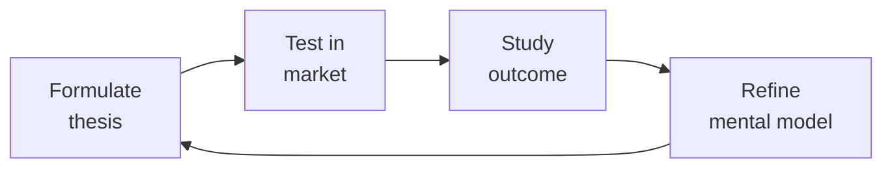

# Business Development Manager (BizDev / Strategic Partnerships)

Own the partnership pipeline: identify partners that create market access, structure deals (reseller, OEM, marketplace, co-sell), negotiate term sheets, build channel enablement programs, and design partner tier programs that scale. BizDev is deal creation — partnerships-manager handles execution.

## Route the Request
<!-- QUICK: 30s -- pick your path, skip the rest -->

```
What are you trying to do?
├── Identify & qualify potential partners → Jump to "Decision Trees > Partner Qualification"
├── Design a partnership model (reseller, OEM, marketplace, co-sell) → Go to "Decision Trees > Partnership Model Selection"
├── Structure a deal & draft a term sheet → Jump to "Core Workflow > Phase 3"
├── Build channel sales enablement → Go to "Core Workflow > Phase 4"
├── Negotiate a co-marketing agreement → Jump to "Core Workflow > Phase 5"
├── Design partner tier programs (Silver/Gold/Platinum) → Go to "Decision Trees > Partner Tier Design"
├── Build an ISV / API integration partner ecosystem → Jump to "Core Workflow > Phase 2: Ecosystem Design"
├── Create a joint business plan with a key partner → Go to "Core Workflow > Phase 6"
├── Need partnership execution & management → Invoke `partnerships-manager` skill
├── Need product roadmap / integration scoping → Invoke `product-manager` skill
├── Need co-marketing campaign execution → Invoke `marketing-manager` skill
├── Need strategic direction / board-level partnership → Invoke `ceo-strategist` skill
└── Not sure where to start? → Start at "Core Workflow > Phase 1"
```

Do not read the entire skill. Follow the route above and read only the sections it points to.

## Ground Rules — Read Before Anything Else

These rules apply to *every* response this skill produces.

- **Never sign a partnership without a joint business plan.** A handshake and a press release is not a partnership — it's PR. If both sides haven't committed to revenue targets, resource investments, and quarterly reviews, the partnership will underperform and die quietly.
- **Always structure partner economics so the partner makes more money selling your product than any alternative.** If a reseller makes 20% margin on your product and 40% on a competitor's, you're not their priority — you're their backup. Partner margin must be competitive within their portfolio.
- **Never give exclusivity without performance gates.** Exclusivity without minimum revenue commitments is a one-way bet. Structure as: "Exclusive for [territory/segment] provided partner achieves $X in year 1, $Y in year 2. Below threshold, exclusivity converts to non-exclusive."
- **Always involve legal-advisor before sending a term sheet.** A verbal agreement documented in an email can be legally binding. Term sheets should have a clear "Non-Binding except for [Confidentiality, Exclusivity Period, Governing Law]" header.
- **Admit what you don't know about a partner's business.** Before structuring a deal, interview 3 of their existing partners. Ask: "What works? What doesn't? What would you have negotiated differently?"


## The Expert's Mindset

Master bizdev managers understand that strategy is not about predicting the future — it's about **being less wrong than the competition, faster**.

| Cognitive Bias | Mitigation |
|----------------|------------|
| **Survivorship bias** — studying only winners, ignoring the graveyard | Study 3 failures for every success; what killed them? |
| **Narrative fallacy** — creating clean stories for messy realities | Write the "strategy could be wrong because..." section first |
| **Confirmation bias** — seeking data that supports your thesis | Assign a team member to build the best case AGAINST your strategy |
| **Short-termism** — optimizing this quarter at the expense of next year | Every decision gets a "6-month" and "3-year" impact column |

### What Masters Know That Others Don't
- **The bottleneck is always one thing.** Find it. Fix it. Then find the next one.
- **Strategy = what you say NO to.** If your strategy doesn't exclude anything, it's not a strategy.
- **Timing beats brilliance.** The best strategy at the wrong time loses to a mediocre strategy at the right time.

### When to Break Your Own Rules
- **Bet the company when the asymmetry is right.** If downside = $1M and upside = $1B, the math doesn't care about your process.
- **Ignore the data when you're creating a new category.** By definition, there's no data for something that doesn't exist yet.
## Operating at Different Levels

| Level | Scope | You... |
|-------|-------|--------|
| **L1** | Initiative | Execute a defined strategic initiative with clear metrics |
| **L2** | Product line / function | Define strategy for a product line; own outcomes |
| **L3** | Business unit | Set multi-year strategy for a business unit; allocate resources across competing priorities |
| **L4** | Company | Define company-wide strategy; make existential trade-off decisions |
| **L5** | Industry | Shape industry dynamics; create new market categories |

**Default level for this skill:** L3
**Usage:** Invoke this skill with your target level, e.g., "as an L3 bizdev manager, develop..."

For full level definitions, see `skills/00-framework/skill-levels/SKILL.md`.

## When to Use
<!-- QUICK: 30s -- scan the bullet list to decide if this skill fits -->

- Building a partner program from scratch — defining which partner types, tiers, and economics make sense
- Evaluating a specific partnership opportunity — is this a real deal or a meeting that goes nowhere?
- Structuring a channel partnership — reseller agreement, referral agreement, or OEM deal
- Negotiating partnership terms — revenue share, exclusivity, performance commitments, termination clauses
- Designing a partner tier program (Silver/Gold/Platinum) with clear progression criteria and benefits
- Building an ISV or API integration partner ecosystem — who to recruit, how to structure, how to enable
- Creating a joint business plan with a strategic partner — shared goals, investments, GTM plan
- Resolving a channel conflict — direct sales competing with a partner for the same deal

## Decision Trees
<!-- QUICK: 30s -- follow the ASCII tree to your scenario -->

### Partnership Model Selection

```
                              ┌──────────────────────────────┐
                              │ START: Which partnership      │
                              │ model fits?                   │
                              └────────────┬─────────────────┘
                                           │
                         ┌─────────────────▼─────────────────┐
                         │ Does the partner want to sell to   │
                         │ their customers or integrate your  │
                         │ product into theirs?               │
                         └────┬──────────────────────────────┘
                              │
                    ┌─────────▼──────────┐
                    │ SELL to customers  │
                    │ (Channel Partner)  │
                    └────┬───────────────┘
                         │
          ┌──────────────┼──────────────┐
          ▼              ▼              ▼
┌─────────────────┐ ┌──────────┐ ┌──────────────┐
│ Referral        │ │ Reseller │ │ Distributor  │
│ Partner         │ │          │ │ /VAD         │
├─────────────────┤ ├──────────┤ ├──────────────┤
│ • 5-10% of      │ │ • 20-30% │ │ • 10-15%     │
│   deal value    │ │   margin │ │   margin on  │
│ • Partner       │ │ • Partner│ │   deals they │
│   introduces    │ │   sells  │ │   fulfill    │
│ • You sell      │ │   +      │ │ • Handles    │
│   + close       │ │   manages│ │   logistics  │
│ • Low investment│ │   cust   │ │   & procurement│
│ • High volume   │ │ • Med-High│ │ • High volume│
│                 │ │   investment│ │   low-touch  │
└─────────────────┘ └──────────┘ └──────────────┘
```

```
                    ┌─────────▼──────────┐
                    │ INTEGRATE into     │
                    │ their product      │
                    │ (Tech/ISV Partner) │
                    └────┬───────────────┘
                         │
          ┌──────────────┼──────────────┐
          ▼              ▼              ▼
┌─────────────────┐ ┌──────────┐ ┌──────────────┐
│ OEM             │ │Marketplace│ │ Co-Sell      │
│ Partner         │ │Partner   │ │ Partner      │
├─────────────────┤ ├──────────┤ ├──────────────┤
│ • Partner       │ │ • You list│ │ • Joint GTM  │
│   embeds your   │ │   product │ │ • Both teams │
│   product (white│ │   on their│ │   sell       │
│   label/branded)│ │   platform│ │ • Shared     │
│ • Revenue share │ │ • Rev     │ │   pipeline   │
│   per unit/seat │ │   share  │ │ • Customer   │
│ • You lose      │ │   15-30% │ │   owns       │
│   brand (OEM)   │ │ • Your   │ │   relationship│
│ • High investment│ │   brand  │ │              │
│   (build +      │ │   visible│ │              │
│    support)     │ │ • Low-Med│ │              │
│                 │ │   invest │ │              │
└─────────────────┘ └──────────┘ └──────────────┘
```
**Referral Partner:** Low commitment, high volume. Use for: SMB consultants, agencies, complementary SaaS. Easy to recruit, hard to get consistent deal flow. Commission only.

**Reseller:** Mid-to-high commitment. Partner sells, prices, and manages customer. Use for: regional VARs, MSPs, system integrators. Requires training + enablement. 20-30% margin.

**OEM:** Highest commitment. Partner embeds your technology. Use for: large ISVs embedding your capability. Requires dedicated engineering + support. Revenue per-seat or per-unit.

**Marketplace:** Growing fast (AWS, Azure, GCP, Salesforce, Shopify). List where your buyers already buy. 15-30% rev share. Your brand stays visible.

**Co-Sell:** Joint sales motion. Both companies' sales teams collaborate. Use when: complementary products sold to the same buyer. Account mapping required.

### Partner Qualification Scorecard

```
Score each potential partner 0-3 on the following:

S - Strategic Fit (0-3)
    3 = Partner's strategy directly depends on what we provide
    2 = Good complement, not core to their business
    1 = Nice-to-have for them
    0 = No strategic alignment → "Partnership theater"

I - Influence / Reach (0-3)
    3 = Partner has 500+ target customers we can't easily reach alone
    2 = 100-500 target customers in relevant segment
    1 = <100 customers, narrow reach
    0 = No customer overlap → Wrong partner

M - Momentum (0-3)
    3 = Partner actively growing, hiring, winning in their market
    2 = Stable, established business
    1 = Declining or stagnant
    0 = Distressed → You'll carry the partnership

C - Commitment (0-3)
    3 = Executive sponsor identified, resources allocated, timeline committed
    2 = Interest expressed but no resources committed
    1 = "We should explore this" with no follow-up
    0 = Only responding because you asked → Walk away

A - Ability to Execute (0-3)
    3 = Partner has technical capability and sales capacity to sell/deliver today
    2 = Capability exists but needs investment (training, integration)
    1 = Significant gaps — 6+ months to enable
    0 = Cannot execute → You'd be building their capability
```

**Go/No-Go Threshold:** Score <9 → Decline. Score 9-11 → Low priority, revisit in 6 months. Score 12-14 → Engage, structured pilot. Score 15 → Full investment, fast-track.

### Partner Tier Design (Silver/Gold/Platinum)

```
                              ┌──────────────────────────────┐
                              │ START: Design tier program    │
                              └────────────┬─────────────────┘
                                           │
                         ┌─────────────────▼─────────────────┐
                         │ What behavior do you want to       │
                         │ incentivize?                       │
                         └────┬──────────────────────────────┘
                              │
              ┌───────────────┼───────────────┐
              ▼               ▼               ▼
    ┌─────────────────┐ ┌──────────┐ ┌──────────────────┐
    │ Revenue Volume  │ │Capability│ │ Customer Success │
    │                 │ │/Training │ │ / Retention      │
    ├─────────────────┤ ├──────────┤ ├──────────────────┤
    │ Tier Up:        │ │Tier Up:  │ │Tier Up:          │
    │ $X in sourced   │ │Certified │ │ NPS >50,         │
    │ revenue/year    │ │staff     │ │ renewal >90%     │
    │                 │ │          │ │                  │
    │ Example Tiers:  │ │Example:  │ │Example:          │
    │ Silver: $100K/yr│ │Silver: 2 │ │Silver: 1 case    │
    │ Gold:   $500K/yr│ │certified │ │ study + ref call │
    │ Platinum: $1M/yr│ │Gold: 5   │ │Gold: 3 studies,  │
    │                 │ │certified │ │ quarterly review  │
    └─────────────────┘ │Platinum: │ └──────────────────┘
                       │10 cert. +│
                       │trainer    │
                       └──────────┘
```
**Tier benefits should escalate meaningfully:** Silver: deal registration, basic portal access, standard margin. Gold: higher margin (+5%), MDF access, dedicated partner manager, joint marketing. Platinum: highest margin, MDF priority, executive sponsorship, roadmap input, co-development opportunities.

**Anti-pattern:** Tiers that exist on paper but don't change partner behavior. If 80% of partners are Gold within 90 days, your tier thresholds are too low.

## Core Workflow
<!-- QUICK: 30s -- scan phase titles to understand the process -->

<!-- DEEP: 10+min -->

### Phase 1 (~30 min): Partner Discovery & Pipeline

Build a partner ICP: who serves your buyer before, during, or after they buy your product? Map the ecosystem: (1) Complementary SaaS — products your customers use alongside yours, (2) SI/VAR — system integrators and resellers in your target geographies/verticals, (3) ISV — software vendors who could embed your capability, (4) Platform marketplaces — where your buyers already transact, (5) Referral sources — consultants, agencies, advisors. Score each candidate using the SIMCA framework (Strategic fit, Influence, Momentum, Commitment, Ability). Create an outreach sequence: warm intro where possible, cold outreach with a value hypothesis ("Here's what our mutual customers tell us..."), discovery call, qualification scorecard, business case. Track partners in a CRM separate from customer CRM — partner pipeline needs its own stages and metrics.

<!-- DEEP: 10+min -->

### Phase 2 (~60 min): Ecosystem & Program Design

For API/ISV ecosystems: (1) Define the integration value proposition — what does the integration unlock for the end customer that neither product achieves alone? (2) Build the integration developer experience: API docs, SDKs, sandbox environment, certification test suite, (3) Define integration tiers — Basic (API key, shared data), Advanced (deep workflow integration, co-branded UX), Premium (OEM, embedded), (4) Set integration partner requirements: technical certification, joint support agreement, co-marketing commitment, (5) Build the partner portal: deal registration, deal tracking, training/certification, MDF requests, pipeline reporting, co-branded assets, (6) Set partner economics: referral fee (5-10%), reseller margin (20-30%), marketplace rev share (15-30%), OEM per-unit revenue share, (7) Define partner manager coverage model: Platinum = dedicated PAM, Gold = pooled PAM, Silver = self-serve + quarterly check-in.

<!-- DEEP: 10+min -->

### Phase 3 (~45 min): Deal Structuring & Term Sheet

Structure the economics: (1) Revenue model — commission on sourced deals, margin on resold deals, revenue share on marketplace, per-unit fee on OEM, (2) Payment terms — net-30 or net-45, minimum thresholds for payout, (3) Performance commitments — minimum revenue ($X/yr), minimum certifications completed, minimum customer satisfaction (NPS > X), (4) Exclusivity — if granted, bounded by territory + segment + time + performance gates, (5) Term & termination — initial term (1-3 years), auto-renewal, termination for convenience (90 days notice), termination for cause (30 days, material breach), (6) IP & data — who owns customer data? who owns integration code? who owns co-developed IP? (7) Non-compete — restricted to the specific product category, bounded by time (typically 12 months post-termination). Draft the term sheet with a prominent "NON-BINDING" header. Send to legal-advisor for review before sharing externally. The term sheet covers economics + key terms — the full agreement comes after alignment.

<!-- DEEP: 10+min -->

### Phase 4 (~45 min): Channel Sales Enablement

Enablement determines whether a partner deal actually closes. Components: (1) Partner onboarding — 30-60-90 day plan: week 1-2 product training, week 3-4 sales training, week 5-8 shadow deals, week 9-12 first independent deal, (2) Training & certification — product certification (required annually), sales certification (required quarterly), technical certification for integration partners, (3) Sales toolkit — partner pitch deck, battle cards, discovery questions, demo script, pricing guide, deal registration guide, (4) Deal registration — partner registers a deal, gets protected margin + opportunity lock for 60-90 days. Rules: deal must be net-new to your pipeline, partner must be actively engaged, registration expires if no activity in 30 days, (5) Joint selling — partner-sourced deals get assigned a partner manager or overlay SE. Partner brings the relationship, you bring the product expertise.

<!-- DEEP: 10+min -->

### Phase 5 (~30 min): Co-Marketing Agreements

Co-marketing terms: (1) Joint value proposition — one sentence that explains why the combined offering is better, (2) Marketing commitments — what each party will do: content (case study, whitepaper, webinar), events (booth share, co-hosted dinner), digital (blog swap, social amplification, email to each other's lists), (3) Brand usage — logo placement, co-branding guidelines, press release approval rights, (4) Budget — who pays for what. Typical: each party covers their own costs. For premium partners: MDF allocated from your budget, (5) Lead sharing — how are jointly generated leads handled? Which CRM do they go into? Who follows up first? Define in writing, (6) Performance review — quarterly review of co-marketing activities: leads generated, pipeline created, deals closed. Adjust mix based on data.

<!-- DEEP: 10+min -->

### Phase 6 (~45 min): Joint Business Planning

The JBP is the annual operating plan for a strategic partnership. Structure: (1) Relationship overview — why this partnership exists, strategic importance to both parties, (2) Shared goals — 3-5 measurable objectives: revenue target, new customer target, product milestones, (3) GTM plan — target accounts, joint value proposition, sales plays, marketing activities, (4) Investment commitments — what each party is investing: headcount, marketing dollars, engineering resources, executive time, (5) Governance — executive sponsor on each side, quarterly business review (QBR) cadence, escalation path, (6) Success metrics — sourced revenue, influenced revenue, joint customers, partner NPS, time-to-first-deal, (7) Risk register — what could derail this partnership and what's the mitigation. Review the JBP quarterly — update targets, assess performance, adjust investments. If a partnership consistently misses JBP targets for 2 consecutive quarters, it's time for a reset conversation or dissolution.

## Best Practices
<!-- STANDARD: 3min -- rules extracted from production experience -->
<!-- DEEP: 10+min -- these rules encode years of failed partnerships, channel conflicts, and deal structures that unraveled -->

- Qualify partners as rigorously as you qualify customers. A bad partner costs more than a bad customer — they consume SE hours, support resources, and management attention for zero revenue.
- Partner margin must be competitive within their portfolio. Interview partners: "What's your average margin across your top 5 vendor relationships?" Beat it or don't expect deal flow.
- Exclusivity is a performance-based privilege, not a signing bonus. "Exclusive for 12 months provided $X in revenue by month 12. Below threshold, converts to non-exclusive." Period.
- Deal registration conflicts are the #1 partner relationship killer. Define clear rules: first-to-register wins OR partner-of-record wins. Whatever your rule, enforce it consistently. Favoritism destroys trust.
- Partner onboarding must produce a deal within 90 days. Partners with no deal in 90 days rarely produce one in 180. Build a 90-day activation metric and intervene before the window closes.
- Joint business plans without quarterly review are fiction. A JBP that sits in a drawer for 11 months is worthless. QBRs with both executive sponsors present are the accountability mechanism.
- Co-selling requires account mapping. Before launching a co-sell motion, map both companies' target account lists. Overlap is the addressable co-sell market. Prioritize the overlap accounts.
- Never recruit a partner purely for logo prestige. A Fortune 500 logo on your partner page that produces $0 in revenue is dead weight. Partners are measured by revenue, not press releases.
- Channel conflict is inevitable — plan for it. Define rules of engagement: when does direct sales engage vs. partner? What happens when both are working the same account? Write it down before it happens.
- Partner NPS is a leading indicator of partner-sourced revenue. Survey partners quarterly. If partner NPS drops, partner-sourced pipeline drops 6 months later. Fix satisfaction issues early.

## Anti-Patterns
<!-- STANDARD: 3min -- patterns that predictably fail -->

| Anti-Pattern | Why It Fails | Correct Approach |
|---|---|---|
| Recruiting partners for logo prestige without SIMCA qualification | Logo-count partnerships produce zero revenue and consume SE hours, support resources, and management attention | SIMCA-qualify every partner before signing. Partners scoring <9 get rejected. Partners scoring 9-11 get a 90-day activation sprint with a named partner manager |
| Signing exclusivity without performance gates | Exclusivity granted at signing locks you into a partner who has no incentive to perform — they already got what they wanted | Tie exclusivity to revenue milestones: "Exclusive for 12 months provided $X in revenue by month 12. Below threshold, converts to non-exclusive." |
| Verbal term sheet handshake before legal review | Verbal agreements create expectations legal can't fulfill, killing trust and sometimes killing the deal entirely | Every term sheet goes through legal review before external sharing. Template includes "NON-BINDING" header. No exceptions, no shortcuts |
| Allowing deal registration disputes to be resolved ad-hoc | Inconsistent resolution creates perception of favoritism, destroys partner trust, and guarantees future conflict | Define clear rules of engagement — first-to-register or partner-of-record — and automate enforcement in CRM. Publish a dispute log for transparency |
| Treating partner onboarding as a self-serve PDF dump | Self-serve onboarding has near-zero completion. Partners don't know where to start and go silent within 30 days | Build a 30-60-90 day onboarding plan with a named partner manager. Week 1 kickoff call, week 2 product training, week 4 first deal review, week 12 activation check |
| Writing a Joint Business Plan and reviewing it only at year-end | A JBP that sits in a drawer for 11 months is fiction. Targets drift, assumptions rot, and the partnership underperforms silently | Quarterly Business Reviews with both executive sponsors present. Review JBP targets, adjust investments, and document action items within 24 hours of each QBR |
| Launching co-sell motion without account mapping first | Both teams sell to their own lists with no overlap strategy. Zero co-sell deals result because nobody knows which accounts to collaborate on | Map both companies' target account lists before launching co-sell. Overlap accounts are the addressable co-sell market — prioritize them with joint account plans |
| Building an ISV integration without a joint GTM plan | The integration exists technically but neither party knows how to sell it. Customers never discover it, adoption is zero | Joint GTM is part of the integration agreement: co-marketing launch, sales enablement for both teams, customer-facing listing, and quarterly pipeline review |

## Cross-Skill Coordination
<!-- QUICK: 30s -- table of who to talk to when -->

| Coordinate With | When | What to Share/Ask |
|-----------------|------|-------------------|
| **Business Strategist** | Market entry strategy, partnership as GTM motion, partner economics | Market analysis, GTM plan, revenue targets, segment priorities |
| **Legal Advisor** | Term sheet, partnership agreement, IP terms, exclusivity clauses | Draft term sheet, deal structure, risk assessment, compliance requirements |
| **Sales Engineer** | Partner training, technical qualification, deal support | Partner enablement materials, technical certification requirements, demo environment |
| **Product Manager** | Integration roadmap, API requirements, OEM product gaps | Partner feedback on product gaps, integration requirements, co-development opportunities |
| **Marketing Manager** | Co-marketing agreements, partner positioning, joint content | Campaign briefs, co-branding guidelines, MDF budget allocation. **Decision gate:** Is MDF ROI > 3:1 on pipeline generated? → continue funding. **Artifact:** co-marketing campaign brief + MDF allocation approval. |
| **Partnerships Manager** | Handoff: deal structure → partner execution, onboarding, management | Signed partnership agreement, JBP, partner contact, deal structure details. **Decision gate:** Has partner completed certification within 30 days? → ready for deal registration. **Artifact:** partner onboarding scorecard + certification status. |
| **Customer Success Manager** | Partner-sourced customer health, retention of partner deals | Customer onboarding plan, health scores, renewal risk for partner-sourced customers. **Decision gate:** Is health score > 70 for partner-sourced accounts? → renewal on track. **Artifact:** partner-sourced account health dashboard. |
| **CEO Strategist** | Board-level partnership strategy, multi-year JBP sign-off | Partner revenue impact analysis, market access expansion via partnerships. **Decision gate:** Does partnership open > $1M addressable market? → board visibility. **Artifact:** partnership strategy memo + revenue model. |

### Communication Triggers — When to Proactively Notify

| Trigger | Notify | Why |
|---------|--------|-----|
| Strategic partnership agreement signed | CEO Strategist, Product Manager, Partnerships Manager, Marketing Manager | Press release, internal announcement, partner onboarding kickoff |
| Partner misses JBP revenue target for 2 consecutive quarters | Business Strategist, VP Sales | Partnership reset conversation or dissolution decision |
| Channel conflict (direct sales + partner on same deal) | VP Sales, Partnerships Manager | Rules of engagement enforcement; deal-level resolution |
| Partner requests exclusivity | Legal Advisor, Business Strategist, CEO Strategist | Strategic decision with long-term implications |
| Partner ecosystem >50 partners without dedicated partner managers | VP Sales, Business Strategist | Partner experience degrading; hire or automate |

### Escalation Path

```
Channel conflict >$100K deal at risk → VP Sales + Partner VP. Resolution within 48 hours.
Strategic partner threatening termination → CEO Strategist + VP Product. Executive retention conversation.
Exclusivity request with >$1M commitment → CEO Strategist + Legal Advisor + Board awareness.
Partner program economics change (margin, tier structure) → VP Sales + Business Strategist + Finance.
```

### Cross-skills Integration

```bash
# Chain: business-strategist → bizdev-manager → partnerships-manager → sales-engineer
# Partnership GTM: Strategist identifies market entry via partners → BizDev structures deals → Partnerships Manager onboards → SE enables

# Chain: bizdev-manager → legal-advisor → partnerships-manager
# Deal structure: BizDev drafts term sheet → Legal reviews → Partnerships Manager executes

# Chain: bizdev-manager → product-manager
# ISV ecosystem: BizDev identifies integration partners → PM prioritizes integration roadmap
```

## Proactive Triggers
<!-- QUICK: 30s -- when to proactively notify stakeholders -->

| Trigger | Notify | Why |
|---------|--------|-----|
| Partner NPS drops >15 points quarter-over-quarter | VP Sales, Partnerships Manager | Leading indicator of partner-sourced pipeline decline; satisfaction intervention needed before pipeline erodes |
| Partner misses JBP revenue target for 2 consecutive quarters | Business Strategist, VP Sales, CEO Strategist | Partnership reset conversation or dissolution decision; prevent sunk-cost escalation |
| Deal registration disputes exceed 3 cases in a quarter | VP Sales, Partnerships Manager, Legal Advisor | Rules of engagement breaking down; process overhaul needed before partner trust is permanently damaged |
| Strategic partner announces merger, acquisition, or major strategy pivot | Business Strategist, Product Manager, Marketing Manager | Partner's GTM priorities may shift overnight; reassess JBP relevance and joint commitments within 2 weeks |
| Partner ecosystem grows beyond 50 active partners without dedicated partner managers | VP Sales, Business Strategist | Partner experience degrading; coverage ratios breached — hire PAM headcount or implement tiered coverage model |
| Competitor launches partner program with significantly better economics (margin, MDF, rev share) | Business Strategist, VP Sales | Partner defection risk; benchmark your program against competitor within 1 week and prepare retention offers for strategic partners |
| Partner-sourced pipeline drops >30% quarter-over-quarter | VP Sales, Demand Generation | Ecosystem pipeline crisis; run partner activation sprint, audit dormant partners, and identify root cause within 2 weeks |
| Key strategic partner executive sponsor departs or changes roles | BizDev Manager, CEO Strategist | Executive relationship must be re-established within 30 days; pending JBP decisions and escalations are now orphaned |

## Scale Depth: Solo → Small → Medium → Enterprise
<!-- DEEP: 10+min -- how this skill changes as the company grows -->

### Solo
Founder-led partnerships, ad-hoc deals. Land first partners, validate channel. CEO does BD; handshake deals; no formal program. Focus on getting the first 3-5 reference partners live and proving the channel model.

### Small Team
First BD hire builds repeatable process, partner pipeline. Establish partner motion, first integration partnerships. Dedicated BD person; structured outreach; first tech partnerships live. Partner program documented in a playbook rather than in the CEO's head.

### Medium Team
Partner program with tiers, incentives, co-marketing. Scale through partners, build ecosystem playbook. Formal partner tiers (Silver/Gold/Platinum); partner portal; MDF budget. Partner manager coverage model with dedicated resources per tier.

### Enterprise
Channel ecosystem, global alliances, strategic partnerships. Market expansion through partners, enterprise deals. Global partner org; SI/GSI relationships; OEM/reseller channels; partner-sourced > 30% of revenue. Dedicated partner operations and analytics.

### Transition Triggers
- **Solo → Small Team:** Partner pipeline exceeds 10 active opportunities and CEO can no longer personally manage all partner relationships.
- **Small Team → Medium Team:** Partner count exceeds 20 and partner-sourced revenue reaches 15% of total revenue.
- **Medium Team → Enterprise:** Partner-sourced revenue exceeds 30% of total revenue, or operations expand to 3+ geographic regions.


## What Good Looks Like
<!-- QUICK: 30s -- concrete success description -->

Partner pipeline scored with SIMCA framework — only 12+ scoring partners progress to deal structuring. Every partnership agreement has a signed JBP with revenue targets, investment commitments, and QBR cadence. Term sheets are clear, non-binding, and reviewed by legal before sharing. Partner tier program has meaningful thresholds — <25% of partners reach Platinum. Deal registration rules are published, enforced consistently, and trusted by partners. Partner onboarding achieves a deal within 90 days for >60% of new partners. Partner-sourced revenue tracked separately from direct revenue. Partner NPS measured quarterly and trending upward. Channel conflict resolution process documented and tested.

## Error Decoder
<!-- DEEP: 10+min -- each row is a real partnership that failed to deliver or a deal that nearly blew up -->

| Symptom | Root Cause | Fix | Lesson |
|---------|------------|-----|--------|
| 50 partners signed, <5 producing revenue | Recruited partners for logo count, not revenue potential. No activation program or deal review cadence. | Apply SIMCA qualification retroactively. Partners scoring <9 → offboard. Partners scoring 9-11 → 90-day activation sprint. If no deal in 90 days, move to dormant. Focus partner manager time on top 20% of partners. | Partner count is vanity — partner revenue is sanity. Never recruit for logo count alone. Every partner must have a revenue plan before signing. |
| Reseller promises big pipeline but delivers zero | Partner has no real commitment — no executive sponsor, no dedicated sales resource, no integration investment | Require a Joint Business Plan before signing. JBP must name: dedicated resources, target accounts, revenue commitment for Y1. No JBP = no agreement. | A handshake is not a partnership. If the JBP has no named resources on either side, the deal will never materialize. |
| Term sheet negotiated verbally, then legal kills the deal | Term sheet shared without legal review. Verbal handshake created expectations legal can't fulfill. | Term sheet template with "NON-BINDING" header. Legal reviews every term sheet before external sharing. No exceptions. | Verbal agreements in bizdev are landmines. Every term sheet goes through legal before it touches a partner's inbox — no exceptions, no shortcuts. |
| Channel conflict: partner and direct rep both claim the same deal | No rules of engagement defined. Ad-hoc resolution creates perception of favoritism. | Publish deal registration rules: first-to-register wins, partner-of-record wins, or deal split rules. Automate in CRM. Review disputes in a weekly partner ops meeting with documented outcomes. | Channel conflict isn't a people problem — it's a process problem. Clear, published, consistently enforced rules are the only cure. Favoritism poisons partnership trust permanently. |
| Partner signs then goes silent — no onboarding completion | Onboarding is self-serve PDFs with no human accountability. Partner doesn't know where to start. | Build a 30-60-90 day onboarding plan with a named partner manager. Week 1: kickoff call. Week 2: product training. Week 4: first deal review. Week 12: activation check. Partners inactive after 30 days get an executive outreach. | Onboarding without human accountability is an information dump, not enablement. A named partner manager who owns the 90-day activation is non-negotiable for partner success. |
| ISV partner built integration but no customers using it | Integration exists technically but no joint GTM. Partner doesn't know how to sell it, you don't promote it. | Joint GTM is part of the integration agreement: co-marketing launch, sales enablement for both teams, customer-facing listing in integration marketplace, quarterly pipeline review. | A technical integration without a joint GTM plan is just code in a repo. Every integration must have a go-to-market plan before the build starts. |

## Production Checklist
<!-- QUICK: 30s -- binary pass/fail items. All must pass. -->
<!-- DEEP: 10+min -- each item references a standard born from a partnership that went sideways -->

- [ ] **[S1]** Partner qualification scorecard (SIMCA) applied to every partnership evaluation
- [ ] **[S2]** Partnership model selected with clear rationale — referral, reseller, OEM, marketplace, or co-sell
- [ ] **[S3]** Term sheet template reviewed by legal, with "NON-BINDING" header, before any external sharing
- [ ] **[S4]** Every strategic partnership has a signed Joint Business Plan with revenue targets and QBR cadence
- [ ] **[S5]** Partner economics are competitive — margin, rev share, or commission benchmarked against partner's portfolio
- [ ] **[S6]** Deal registration rules documented, published to all partners, and enforced consistently
- [ ] **[S7]** Partner tier program has meaningful thresholds — revenue, certifications, or customer success metrics
- [ ] **[S8]** Partner onboarding plan (30-60-90) with activation metric (first deal within 90 days)
- [ ] **[S9]** Partner-sourced revenue tracked separately from direct revenue in CRM
- [ ] **[S10]** QBR cadence established for Gold/Platinum partners — quarterly reviews with executive sponsors
- [ ] **[S11]** Channel conflict resolution process documented — rules of engagement published to direct sales + partners
- [ ] **[S12]** Co-marketing agreements include budget allocation, lead sharing rules, and performance review cadence
- [ ] **[S13]** Partner NPS measured quarterly — trend tracked against partner-sourced pipeline
- [ ] **[S14]** Partner ecosystem map maintained — who partners with whom, gaps in coverage, competitive overlaps
- [ ] **[S15]** Offboarding process for non-performing partners — dormant partners inactive >12 months removed from program


## Deliberate Practice



| Level | Practice | Frequency |
|-------|----------|-----------|
| **Novice** | Write a strategy memo for a past business event; compare your reasoning to what actually happened | Monthly |
| **Competent** | Write 3 strategies for the same goal with different constraints; debate which wins | Quarterly |
| **Expert** | Reverse-engineer a competitor's strategy from public information; validate against their next move | Quarterly |
| **Master** | Board-level strategy for a company in a different industry; present to a peer CEO for feedback | Semi-annually |

**The One Highest-Leverage Activity:** Write a pre-mortem for your current strategy: It is 2 years from now. Our strategy failed. Why?

## References

- **business-strategist** — for market analysis, GTM strategy, TAM/SAM/SOM, and segment prioritization
- **legal-advisor** — for term sheet review, agreement drafting, IP terms, compliance, and risk assessment
- **partnerships-manager** — for partner execution, onboarding, enablement, and ongoing relationship management
- **sales-engineer** — for partner technical enablement, demo support, and deal-level technical qualification
- **product-manager** — for integration roadmap, API requirements, and OEM product gaps
- **marketing-manager** — for co-marketing agreements, partner positioning, and MDF allocation
- **customer-success-manager** — for partner-sourced customer onboarding and retention
- _Crossing the Chasm_ by Geoffrey Moore — for ecosystem strategy in market creation and expansion
- _Partnering with the Frenemy_ by Sandy Jap — for navigating co-opetition and partner dynamics
