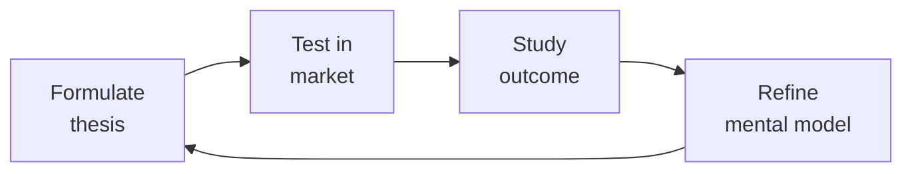

# Demand Generation (Demand Gen / Growth Marketing)

Own the pipeline engine: paid acquisition across Google/LinkedIn/Meta, email marketing automation, lead scoring, MQL→SQL handoff, attribution modeling, CAC optimization, landing page CRO, webinar programs, ABM for enterprise, and marketing operations (HubSpot/Marketo/Pardot).

## Route the Request
<!-- QUICK: 30s -- pick your path, skip the rest -->

```
What are you trying to do?
├── Launch paid acquisition (Google/LinkedIn/Meta ads) → Go to "Decision Trees > Paid Channel Selection"
├── Build email marketing automation & nurture sequences → Jump to "Core Workflow > Phase 3"
├── Design lead scoring & MQL→SQL handoff → Go to "Decision Trees > Lead Scoring Design"
├── Set up attribution modeling → Jump to "Decision Trees > Attribution Model Selection"
├── Optimize CAC (cost per acquisition) → Go to "Core Workflow > Phase 4"
├── Run landing page CRO → Jump to "Decision Trees > CRO: Funnel Leak Diagnosis"
├── Build an ABM program for enterprise → Go to "Core Workflow > Phase 5"
├── Set up marketing ops (HubSpot/Marketo/Pardot) → Jump to "Core Workflow > Phase 2"
├── Launch a webinar or virtual event program → Go to "Core Workflow > Phase 5 > Webinar Playbook"
├── Need campaign positioning & messaging → Invoke `marketing-manager` skill
├── Need CRO experiments / A/B testing infrastructure → Invoke `growth-engineer` skill
├── Need revenue forecasting / pipeline analytics → Invoke `revops-manager` skill
└── Not sure where to start? → Start at "Core Workflow > Phase 1"
```

Do not read the entire skill. Follow the route above and read only the sections it points to.

## Ground Rules — Read Before Anything Else

These rules apply to *every* response this skill produces.

- **Never spend a dollar on paid acquisition without a tracking plan.** If you can't measure from ad impression → click → landing page → form fill → CRM → closed-won, you're buying vanity metrics, not pipeline. UTM hygiene is non-negotiable.
- **Always define MQL and SQL criteria in writing, signed by sales and marketing leadership.** If both teams disagree on what a "qualified lead" is, the handoff breaks and pipeline numbers are fiction. Revisit quarterly.
- **Never optimize for leads alone — optimize for pipeline and revenue.** 500 MQLs that convert to 3 opportunities is a targeting failure, not a volume success. The North Star is pipeline revenue influenced, not leads generated.
- **Always run holdout tests on email nurture sequences.** If you can't measure incremental lift vs. a control group that receives nothing, you don't know if your nurture is adding value or just annoying people who would have bought anyway.
- **Never report attribution without stating the model and its limitations.** "Campaign X drove $500K" is meaningless without "using a U-shaped attribution model with a 90-day lookback window." Different models produce wildly different numbers. State your methodology.


## The Expert's Mindset

Master demand generations understand that strategy is not about predicting the future — it's about **being less wrong than the competition, faster**.

| Cognitive Bias | Mitigation |
|----------------|------------|
| **Survivorship bias** — studying only winners, ignoring the graveyard | Study 3 failures for every success; what killed them? |
| **Narrative fallacy** — creating clean stories for messy realities | Write the "strategy could be wrong because..." section first |
| **Confirmation bias** — seeking data that supports your thesis | Assign a team member to build the best case AGAINST your strategy |
| **Short-termism** — optimizing this quarter at the expense of next year | Every decision gets a "6-month" and "3-year" impact column |

### What Masters Know That Others Don't
- **The bottleneck is always one thing.** Find it. Fix it. Then find the next one.
- **Strategy = what you say NO to.** If your strategy doesn't exclude anything, it's not a strategy.
- **Timing beats brilliance.** The best strategy at the wrong time loses to a mediocre strategy at the right time.

### When to Break Your Own Rules
- **Bet the company when the asymmetry is right.** If downside = $1M and upside = $1B, the math doesn't care about your process.
- **Ignore the data when you're creating a new category.** By definition, there's no data for something that doesn't exist yet.
## Operating at Different Levels

| Level | Scope | You... |
|-------|-------|--------|
| **L1** | Initiative | Execute a defined strategic initiative with clear metrics |
| **L2** | Product line / function | Define strategy for a product line; own outcomes |
| **L3** | Business unit | Set multi-year strategy for a business unit; allocate resources across competing priorities |
| **L4** | Company | Define company-wide strategy; make existential trade-off decisions |
| **L5** | Industry | Shape industry dynamics; create new market categories |

**Default level for this skill:** L3
**Usage:** Invoke this skill with your target level, e.g., "as an L3 demand generation, develop..."

For full level definitions, see `skills/00-framework/skill-levels/SKILL.md`.

## When to Use
<!-- QUICK: 30s -- scan the bullet list to decide if this skill fits -->

- Launching or scaling paid acquisition across Google Ads, LinkedIn Ads, or Meta Ads
- Building or rebuilding email marketing automation with lead nurturing sequences
- Designing a lead scoring model and formalizing the MQL→SQL handoff between marketing and sales
- Setting up attribution modeling to understand which channels and campaigns drive pipeline
- Diagnosing high CAC or low conversion rates at specific funnel stages
- Running a landing page CRO program — A/B testing headlines, CTAs, forms, and social proof
- Building an account-based marketing (ABM) program targeting 50-500 named enterprise accounts
- Launching a webinar or virtual event series as a demand generation engine
- Evaluating or migrating marketing automation platforms (HubSpot, Marketo, Pardot, ActiveCampaign)

## Decision Trees
<!-- QUICK: 30s -- follow the ASCII tree to your scenario -->

### Paid Channel Selection

```
                              ┌──────────────────────────────┐
                              │ START: Which paid channels?   │
                              └────────────┬─────────────────┘
                                           │
                         ┌─────────────────▼─────────────────┐
                         │ What are you selling & to whom?   │
                         └────┬──────────────┬───────────────┘
                              │              │
                   ┌──────────▼────┐  ┌──────▼────────────┐
                   │ B2B SaaS      │  │ B2C / Consumer    │
                   │ (ACV > $5K)   │  │ (ACV < $500)      │
                   └──────┬────────┘  └──────┬────────────┘
                          │                  │
               ┌──────────▼──────┐  ┌────────▼────────────┐
               │ Primary:        │  │ Primary:             │
               │ LinkedIn Ads    │  │ Meta Ads + Google    │
               │ + Google Search │  │ Display + TikTok     │
               │ (high-intent)   │  │ (broad reach)        │
               │                 │  │                      │
               │ Secondary:      │  │ Secondary:           │
               │ Review sites    │  │ Google Search        │
               │ (G2/Capterra),  │  │ (intent capture),    │
               │ content         │  │ YouTube, influencer  │
               │ syndication,    │  │                      │
               │ podcast/        │  │                      │
               │ newsletter      │  │                      │
               │ sponsorships    │  │                      │
               └─────────────────┘  └──────────────────────┘
```
**B2B LinkedIn:** Target by job title, company size, industry. Lead-gen forms (pre-filled) outperform landing page redirects by 3-5x on conversion. Expect CPL $50-200. Use for: top-of-funnel awareness + mid-funnel lead gen.

**B2B Google Search:** Bid on competitor names, category terms, pain-point queries. High intent — these prospects are actively searching. Expect CPC $5-50 for SaaS. Use for: bottom-of-funnel capture.

**B2C Meta/TikTok:** Creative is everything — test 5+ video variants per audience. Broad targeting + strong creative outperforms hyper-targeted + weak creative. Expect CPM $5-20.

### Attribution Model Selection

```
                              ┌──────────────────────────────┐
                              │ START: Which attribution       │
                              │ model to use?                 │
                              └────────────┬─────────────────┘
                                           │
                         ┌─────────────────▼─────────────────┐
                         │ How many touches before purchase? │
                         └────┬──────────────┬───────────────┘
                              │              │
                    ┌─────────▼────┐  ┌──────▼──────────────┐
                    │ 1-3 touches  │  │ 4+ touches,          │
                    │ (SMB, short  │  │ long cycle            │
                    │ cycle)       │  │ (Enterprise)          │
                    └──────┬───────┘  └──────┬───────────────┘
                           │                 │
                ┌──────────▼──────┐  ┌────────▼────────────┐
                │ First-Touch or  │  │ Multi-Touch:         │
                │ Last-Touch      │  │ U-Shaped or W-Shaped │
                │                 │  │                      │
                │ Simple,         │  │ U-Shaped: 40% first  │
                │ directional.    │  │ touch, 40% lead      │
                │ Good enough for │  │ creation, 20% split  │
                │ direct response.│  │ across middle touches│
                │                 │  │                      │
                │ Limitations:    │  │ W-Shaped: 30% first  │
                │ Over-credits    │  │ touch, 30% lead      │
                │ one touch.      │  │ creation, 30% opp    │
                └─────────────────┘  │ creation, 10% split  │
                                    └──────────────────────┘
```
**Recommended default:** U-Shaped attribution with a 90-day lookback window. 40% credit to first touch, 40% to lead creation touch, 20% evenly across middle touches. State the model explicitly in every report.

**When to use data-driven attribution:** >50 conversions/month per channel, machine learning can assign fractional credit based on actual influence patterns. Requires significant data volume.

### Lead Scoring Design

```
                              ┌──────────────────────────────┐
                              │ START: Build lead scoring     │
                              └────────────┬─────────────────┘
                                           │
                         ┌─────────────────▼─────────────────┐
                         │ Scoring dimensions?               │
                         └────┬──────────────────────────────┘
                              │
              ┌───────────────┼───────────────┐
              ▼               ▼               ▼
    ┌─────────────────┐ ┌──────────┐ ┌──────────────────┐
    │ Demographic Fit │ │ Behavior │ │ Engagement       │
    │ (Explicit)      │ │ (Implicit)│ │ (Recency/Depth) │
    ├─────────────────┤ ├──────────┤ ├──────────────────┤
    │ Job title: +15  │ │Pricing   │ │Website visit <7d │
    │ (target role)   │ │page visit│ │: +10             │
    │                 │ │: +20     │ │                  │
    │ Job title: +5   │ │Case study│ │Email click <14d  │
    │ (adjacent role) │ │download  │ │: +10             │
    │                 │ │: +15     │ │                  │
    │ Company size    │ │Demo      │ │Multiple visits   │
    │ in ICP: +10     │ │request:  │ │>3 pages: +15     │
    │                 │ │+30       │ │                  │
    │ Industry fit:   │ │Webinar   │ │No activity >30d  │
    │ +10             │ │attended │ │: -15             │
    │                 │ │: +10     │ │                  │
    │ Negative:       │ │          │ │Unsubscribed:     │
    │ Student: -30    │ │          │ │-50              │
    │ Competitor: -20 │ │          │ │                  │
    │ Personal email: │ │          │ │                  │
    │ -10             │ │          │ │                  │
    └─────────────────┘ └──────────┘ └──────────────────┘
```
**Scoring thresholds:** Score >50 = MQL (handoff to sales). Score 30-50 = Nurture (keep in marketing). Score <30 = Long-term nurture or discard.

**Validation:** Run a correlation analysis quarterly. Are high-scoring leads actually converting at higher rates? If not, your scoring model is broken. Adjust weights based on actual closed-won data, not hunches.

### CRO: Landing Page Funnel Leak Diagnosis

```
                              ┌──────────────────────────────┐
                              │ START: Which stage to fix?    │
                              └────────────┬─────────────────┘
                                           │
                         ┌─────────────────▼─────────────────┐
                         │ >70% bounce from LP without        │
                         │ any action?                        │
                         └────┬──────────────────────────┬───┘
                              │ YES                       │ NO
                              ▼                           ▼
                      ┌──────────────┐          ┌──────────────────────┐
                      │Top-of-funnel │          │ >60% drop between     │
                      │CRO:          │          │ form view → submit?   │
                      │Headline,     │          └──┬──────────────┬────┘
                      │hero image,   │             │ YES          │ NO
                      │above-fold    │             ▼              ▼
                      │value prop,   │    ┌──────────────┐ ┌──────────────┐
                      │page speed,   │    │ Form Friction│ │ Post-Convert │
                      │mobile UX     │    │ CRO:         │ │ CRO:         │
                      └──────────────┘    │ Reduce fields│ │ Thank-you    │
                                          │ to ≤5, add   │ │ page CTA,   │
                                          │ social proof │ │ nurture      │
                                          │ near CTA,    │ │ sequence,    │
                                          │ auto-fill,   │ │ sales follow │
                                          │ remove phone │ │ -up timing   │
                                          │ if not needed│ └──────────────┘
                                          └──────────────┘
```
**When to optimize above-fold:** Bounce >70%. Fix within 48 hours. Test headline + hero + CTA as a triad.

**When to optimize form:** >60% drop form → submit. Reduce to ≤5 fields. Every field costs ~10% conversion.

## Core Workflow
<!-- QUICK: 30s -- scan phase titles to understand the process -->

<!-- DEEP: 10+min -->

### Phase 1 (~20 min): Pipeline Modeling & Target Setting

Build a reverse funnel from revenue target: Revenue target → Pipeline needed (at close rate X) → SQLs needed (at SQL→Opp rate Y) → MQLs needed (at MQL→SQL rate Z) → Leads needed (at Lead→MQL rate W). Example: $2M quarterly revenue target. Avg deal size $50K = 40 closed deals. Close rate 25% = 160 opportunities. SQL→Opp rate 60% = 267 SQLs. MQL→SQL rate 15% = 1,780 MQLs. Lead→MQL rate 10% = 17,800 leads. Now allocate across channels: organic %, paid %, email %, events %, partner %. Track actuals vs. plan weekly. Reforecast monthly.

<!-- DEEP: 10+min -->

### Phase 2 (~60 min): Marketing Operations Setup

Marketing ops is the infrastructure: choose your platform (HubSpot for SMB/mid-market, Marketo for enterprise, Pardot if Salesforce-native required). Set up: (1) Tracking — UTM parameters enforced on every outbound link, form submissions captured with source data, cookie-based tracking for anonymous visitors, first-touch and last-touch fields populated at conversion, (2) Lead lifecycle stages — Visitor → Lead → MQL → SQL → Opportunity → Customer → Evangelist, with automated stage transitions based on scoring and actions, (3) Email automation — nurture sequences triggered by behavior (content download → related nurture track, pricing page visit → sales outreach alert), (4) List hygiene — bounce management, unsubscribe compliance, deduplication, suppression lists, (5) Attribution — U-shaped model as default, campaign influence tracking, ROI dashboards by channel, (6) Reporting — weekly pipeline dashboard: leads by channel, MQL volume, MQL→SQL rate, SQL→Opp rate, pipeline created, CAC by channel, LTV:CAC ratio.

<!-- DEEP: 10+min -->

### Phase 3 (~45 min): Email Marketing & Nurture

Design nurture sequences, not email blasts. Architecture: (1) Welcome sequence (3 emails over 7 days) — triggered on first conversion. Email 1: deliver the asset. Email 2: social proof + case study. Email 3: soft CTA (demo, trial, assessment), (2) Behavioral triggers — pricing page visit → case study email within 1 hour, feature page visit → product demo video, high engagement → sales alert, inactivity (30 days no click) → re-engagement drip (subject: "Still interested?"), (3) Newsletter (bi-weekly) — curated content, product updates, customer stories. Segment by persona so CTOs don't get end-user content, (4) Re-engagement — 3-email sequence for dormant leads. Email 1: "We miss you" + value. Email 2: "Last chance" + offer. Email 3: "Confirm you want to stay" — no click = unsubscribe. Always run a 10% holdout group on nurture sequences. Measure: open rate >20%, CTR >3%, unsubscribe <0.5% per send, conversion rate from nurture >5%.

<!-- DEEP: 10+min -->

### Phase 4 (~30 min): CAC Optimization

Calculate CAC per channel: total channel spend / customers acquired from that channel (using your chosen attribution model). Benchmark: LTV:CAC ratio > 3:1, CAC payback < 12 months. Optimization levers: (1) Creative — test 5+ ad variants per platform, kill underperformers after $500 spend, scale winners, (2) Targeting — narrow by job title, company size, industry, intent signals (G2 category page visits, competitor brand searches), use lookalike audiences from your best customers, (3) Landing page CRO — A/B test headline, hero image, CTA copy, form length, social proof placement, (4) Offer — test ebook vs. benchmark report vs. assessment vs. demo. High-intent offers (demo, trial, assessment) produce fewer leads but higher conversion to SQL, (5) Channel mix — shift spend toward channels with lowest CAC and highest LTV, not just lowest CPL. A $200 CPL channel that converts 20% to SQL beats a $50 CPL channel that converts 2%.

<!-- DEEP: 10+min -->

### Phase 5 (~45 min): ABM + Webinar Programs

**ABM (Account-Based Marketing):** Identify 50-500 target accounts (named list, not segments). Tier them: Tier 1 (1:1, 10-50 accounts — personalized gifts, executive outreach, custom content), Tier 2 (1:few, 50-200 accounts — industry-specific content, direct mail, semi-personalized ads), Tier 3 (1:many, 200-500 accounts — programmatic ads, email sequences, personalized landing pages by industry). For each tier: define the account plan (key contacts, engagement plan, content assets, success metrics). Measure: account engagement score, pipeline created from target accounts, deal velocity for ABM-sourced vs. non-ABM, average deal size uplift. Target: ABM accounts should have 2x pipeline velocity and 30% higher ACV than non-ABM.

**Webinar/Virtual Event Playbook:** (1) Topic selection — solve a specific pain, not a product pitch. "How [Role] at [Company Type] Reduced [Metric] by [X]%." (2) Speaker — customer + your expert. Customer stories convert 3x better than vendor-only. (3) Promotion — email to your list 3x: 2 weeks before, 1 week before, day before. LinkedIn ads targeting job title + industry for net-new. Partner co-promotion for reach extension. (4) During — polls every 10 minutes (engagement + data capture), Q&A throughout (not just at end), demo in last 10 minutes only, (5) Post-webinar — send recording + slides within 24 hours. No-show sequence: "We missed you — here's the recording." Attendee sequence: "Thanks for attending — here's the next step" (case study, trial, assessment). Measure: registration rate, attendance rate (>35% is good), on-demand views, pipeline created within 30 days.

## Best Practices
<!-- STANDARD: 3min -- rules extracted from production experience -->
<!-- DEEP: 10+min -- these rules encode years of wasted ad spend, broken attribution, and nurture sequences that annoyed everyone -->

- UTM hygiene is the foundation of all measurement. Enforce UTM parameters on every outbound link. Use `utm_source`, `utm_medium`, `utm_campaign`, `utm_content` consistently. One missing parameter corrupts attribution for an entire campaign.
- Test ad creative in batches of 5 — kill anything with CTR <0.5% after $500 spend per platform. The best creative often isn't your first guess. Budget 20% of spend for testing.
- Never send identical nurture to everyone who downloads the same asset. Segment by persona, industry, and behavior. A CTO and a marketing manager downloading the same ebook need different follow-up.
- Lead scoring decays over time: a pricing page visit 6 months ago is not the same signal as one yesterday. Apply a 30-day recency decay: score reduces by 50% every 30 days of inactivity.
- MQL→SQL conversion rate <10% means either your scoring model is too generous or sales isn't following up. Audit 50 MQLs: why weren't they accepted or rejected? The answer tells you what to fix.
- Attribution windows matter enormously. A 30-day lookback credits very different channels than a 90-day. Pick one, document it, and don't change it quarter-to-quarter — consistency matters more than precision.
- Email nurture open rates are inflated by Apple Mail Privacy Protection. Look at click rate and conversion rate as primary metrics, not open rate. Open rate is directional at best.
- Holdout groups (10%) on every nurture sequence are non-negotiable. If the nurture doesn't produce statistically significant lift vs. doing nothing, kill it and redirect the effort.
- Use incrementality testing for paid channels: geo-holdout tests (ads in Region A, no ads in comparable Region B) tell you whether paid is creating demand or capturing demand that would have converted organically.
- Marketing automation migrations are more expensive than they appear. Budget 3x the platform cost for implementation, data migration, and training. A rushed migration corrupts data and breaks attribution for months.

## Anti-Patterns
<!-- STANDARD: 3min -- patterns that predictably fail -->

| Anti-Pattern | Why It Fails | Correct Approach |
|---|---|---|
| Optimizing for lead volume over lead quality | High-volume, low-quality leads flood the pipeline, inflate CAC, and erode sales trust in marketing. MQL→SQL conversion drops below 10% | Gate content with qualifying form fields (company size, role, timeline). Add an open-text "biggest challenge" field. Tighten targeting to ICP criteria. Measure MQL→SQL conversion as the primary quality metric |
| Running paid ads without UTM enforcement | Missing or inconsistent UTMs corrupt attribution, making it impossible to connect spend to pipeline. 80% of pipeline shows as "Direct" or "Other" | Enforce UTM parameters on every outbound link via a UTM builder tool. Audit active campaign URLs weekly. Add UTMs to CRM automation for retroactive classification |
| Sending identical nurture sequences to all personas | A CTO and a marketing manager downloading the same ebook have completely different pain points and buying processes. Generic nurture underperforms by 3-5x | Segment nurture by persona, industry, and behavior. The CTO gets technical proof points; the marketing manager gets ROI and efficiency messaging. Different follow-up for different buyers |
| Ignoring email deliverability until you land in spam | Once domain reputation tanks, recovery takes months. Bounce rates >2% and spam complaints >0.1% are flashing red before the crash | Monitor bounce rate, spam complaint rate, and domain reputation weekly. Pause sends and run list verification at first warning sign. Warm up domain with most-engaged segment |
| Relying on open rates as the primary email metric | Apple Mail Privacy Protection inflates open rates, making them unreliable. Teams celebrating 40% open rates are optimizing for a vanity metric | Use click rate and conversion rate as primary email metrics. Open rate is directional at best. The only metric that matters is whether the recipient took the intended action |
| Running ABM without sales alignment on follow-up | Marketing warms the account, generates engagement signals, but sales doesn't follow up within 48 hours. The signal decays and the ABM investment is wasted | Marketing and sales jointly plan account outreach. Sales commits to 48-hour follow-up SLA on engagement signals. If SLA is breached, the ABM program pauses until sales capacity is restored |
| Changing attribution models mid-year | Shifting from first-touch to multi-touch or changing lookback windows invalidates all trend analysis. Teams argue about methodology instead of acting on data | Pick one attribution model, document it, and lock it for 12 months. Consistency matters more than precision. Run all models side-by-side for internal learning, but plan against the locked model |
| Treating CRO as one-off tests instead of a continuous program | One-off A/B tests produce inconclusive results and no compounding learning. Conversion rate stays flat because there's no systematic experimentation cadence | Run a continuous CRO program: hypothesis backlog → prioritized by potential impact → test → learn → repeat. Each test builds on the last. Target 1-2 meaningful tests per month |

## Cross-Skill Coordination
<!-- QUICK: 30s -- table of who to talk to when -->

| Coordinate With | When | What to Share/Ask |
|-----------------|------|-------------------|
| **Marketing Manager** | Campaign briefs, positioning, personas, messaging for ads | Approved messaging, target personas, asset briefs, launch timelines. **Decision gate:** Does campaign brief pass logo-swap test? → launch ready. **Artifact:** campaign brief doc + messaging framework. |
| **Analytics Engineer** | Attribution models, data pipelines, dashboards | Tracking requirements, event taxonomy, attribution methodology, data quality. **Decision gate:** Is attribution model locked for 12 months? → report consistently. **Artifact:** attribution model doc + UTM taxonomy. |
| **Sales Engineer** | MQL→SQL handoff quality, lead qualification feedback | Lead quality feedback, conversion rates by channel, content preferences. **Decision gate:** Is MQL→SQL conversion > 15%? → handoff process healthy. **Artifact:** MQL quality scorecard + handoff SLA report. |
| **Growth Engineer** | Landing page CRO, A/B testing infrastructure, experiment design | Experiment results, CRO hypotheses, technical feasibility of landing page changes. **Decision gate:** Is CRO experiment statistically significant (p < 0.05)? → ship winner. **Artifact:** A/B test results + implementation spec. |
| **Content Strategist** | Content assets for nurture, offers for campaigns | Asset briefs, content calendar, SEO-validated topics, target keywords. **Decision gate:** Does content asset have a CTA with measurable conversion? → campaign-ready. **Artifact:** asset brief + performance benchmarks. |
| **SEO Specialist** | Organic/content synergy, keyword-driven paid campaigns | Keyword data, organic landing page performance, paid-organic cannibalization checks. **Decision gate:** Is paid cannibalization < 10% of organic traffic? → budget efficient. **Artifact:** keyword overlap report. |
| **Customer Success Manager** | Customer stories for webinars, reference logos for landing pages | Customer advocates, NPS data, churn signals that indicate targeting or messaging issues. **Decision gate:** Is NPS > 30 for reference customers? → safe to feature. **Artifact:** customer advocacy roster. |
| **Business Strategist** | CAC targets, LTV models, budget allocation, ROI reporting | Revenue targets, unit economics, growth targets, budget constraints. **Decision gate:** Is LTV:CAC > 3:1 for each channel? → budget allocation sound. **Artifact:** channel-level unit economics dashboard. |
| **RevOps Manager** | Pipeline analytics, forecasting, attribution integration | Campaign-attributed pipeline data, conversion rates by channel. **Decision gate:** Is campaign pipeline > 40% of total pipeline? → demand gen is primary growth engine. **Artifact:** pipeline attribution report by campaign. |

### Communication Triggers — When to Proactively Notify

| Trigger | Notify | Why |
|---------|--------|-----|
| CAC increases >30% month-over-month on any channel | Marketing Manager, Analytics Engineer, Business Strategist | Channel efficiency at risk; may need pause, creative refresh, or targeting change |
| MQL→SQL conversion drops below 10% for >2 weeks | Sales Engineer, Marketing Manager | Scoring model or sales follow-up broken; pipeline forecast at risk |
| Email domain reputation drops (bounce >2%, spam complaint >0.1%) | Marketing Manager | Deliverability crisis; pause sends, audit list hygiene, warm domain |
| Landing page conversion drops below 2% (from ad traffic) | Growth Engineer, Marketing Manager | CRO audit; test headline, offer, form, page speed |
| Attribution tracking breaks (UTMs missing, cookie consent change) | Analytics Engineer, Marketing Manager | All spend data becomes unreliable; fix before launching new campaigns |
| Pipeline gap >30% of target at mid-quarter | Marketing Manager, Sales Engineer, Business Strategist | Emergency pipeline generation; surge campaigns, event acceleration, lead list activation |

### Escalation Path

```
CAC exceeds target by >50% for >30 days → Business Strategist + VP Marketing. Channel pause or restructure.
Attribution/data pipeline failure >48 hours → Analytics Engineer + VP Marketing. Revenue reporting blind spot.
Marketing automation platform outage >4 hours → Platform vendor + VP Marketing + Sales Ops. Lead processing halted.
MQL quality crisis (sales rejects >50% of MQLs) → Sales leadership + Marketing Manager. Scoring reset + joint review.
```

### Cross-skills Integration

```bash
# Chain: marketing-manager → demand-generation → sales-engineer
# Campaign execution: PMM provides positioning → Demand gen executes across channels → SE receives qualified MQLs

# Chain: analytics-engineer → demand-generation → growth-engineer
# Data-driven optimization: Analytics builds attribution model → Demand gen optimizes channel mix → Growth engineer tests CRO changes

# Chain: demand-generation → growth-engineer
# Conversion optimization: Demand gen identifies funnel leaks → Growth engineer builds and runs A/B tests
```

## Proactive Triggers
<!-- QUICK: 30s -- when to proactively notify stakeholders -->

| Trigger | Notify | Why |
|---------|--------|-----|
| CAC increases >30% month-over-month on any paid channel | Marketing Manager, Business Strategist, Analytics Engineer | Channel efficiency crisis; may need creative refresh, targeting change, or channel pause before budget is wasted |
| MQL→SQL conversion drops below 10% for 2+ consecutive weeks | Sales Engineer, Marketing Manager, RevOps Manager | Scoring model broken or sales follow-up degraded; pipeline forecast at risk; joint marketing-sales audit required |
| Email domain reputation warning (bounce >2% or spam complaint >0.1%) | Marketing Manager, Analytics Engineer | Deliverability crisis imminent; pause all sends, audit list hygiene, and warm domain before full blacklist occurs |
| Attribution tracking breaks (UTM pipeline failure, cookie consent change, CRM sync error) | Analytics Engineer, Marketing Manager, RevOps Manager | All spend data becomes unreliable; fix attribution pipeline before launching any new campaigns — flying blind on spend |
| Pipeline gap exceeds 30% of quarterly target at mid-quarter | Marketing Manager, Sales Engineer, Business Strategist, RevOps Manager | Emergency pipeline generation required; surge campaigns, event acceleration, lead list activation, and SDR blitz |
| Landing page conversion drops below 2% from paid traffic (sustained >1 week) | Growth Engineer, Marketing Manager | CRO emergency; test headline, offer, form length, page speed. Every day below threshold burns ad budget with no return |
| Competitor launches aggressive paid campaign targeting your branded keywords or ICP | Marketing Manager, Business Strategist | Brand CPC inflation and share-of-voice loss; competitive response strategy needed within 48 hours |
| Nurture sequence holdout test shows no statistically significant lift vs. control after 90 days | Marketing Manager, Content Strategist | Nurture is burning effort for zero incremental pipeline; kill the sequence and redirect resources to higher-ROI activities |

## Scale Depth: Solo → Small → Medium → Enterprise
<!-- DEEP: 10+min -- how this skill changes as the company grows -->

### Solo
Founder content + LinkedIn posts, organic outreach. Build awareness, get first leads. Founder is the brand; no budget; content and hustle. Focus on establishing initial market presence through personal networks and low-cost channels.

### Small Team
Paid ads (Google/LinkedIn), email sequences, landing pages. Generate pipeline predictably, prove CAC. First paid channels; basic nurture sequences; lead scoring starts. A dedicated demand gen person or agency runs structured campaigns with measurable ROI.

### Medium Team
Multi-channel ABM, marketing ops stack, attribution. Target ICP precisely, optimize funnel. Account-based plays; HubSpot/Marketo; multi-touch attribution; SDR team. Dedicated specialists per channel with documented playbooks and automated reporting.

### Enterprise
Global demand gen team, multi-region campaigns, brand + demand. Scale pipeline globally, build category. Regional teams; $1M+ campaign budgets; brand awareness + demand capture. ABM at scale across hundreds of accounts with predictive routing and custom attribution models.

### Transition Triggers
- **Solo → Small Team:** Marketing spend exceeds $10K/month and pipeline from paid channels reaches 20% of total pipeline.
- **Small Team → Medium Team:** Marketing-sourced pipeline exceeds $5M/quarter or the company targets named accounts with ABM.
- **Medium Team → Enterprise:** Operating in 3+ regions with $10M+ ARR, or requiring dedicated attribution and ops infrastructure to manage multi-channel complexity.


## What Good Looks Like
<!-- QUICK: 30s -- concrete success description -->

Every paid channel has a documented CAC and LTV:CAC ratio >3:1. MQL→SQL conversion rate >15% and stable quarter-over-quarter. Attribution model is documented (U-shaped, 90-day lookback) and consistently applied across all reports. Email nurture sequences have <0.5% unsubscribe rate and >3% CTR. Landing pages convert >3% from paid traffic. Lead scoring model validated quarterly against actual closed-won data — high-scoring leads convert at >2x the rate of medium-scoring leads. ABM program generates >30% higher ACV than non-ABM. Pipeline dashboard updates daily with no data gaps. Marketing-sourced pipeline consistently hits >40% of total pipeline.

## Error Decoder
<!-- DEEP: 10+min -- each row is a real campaign that burned budget without pipeline -->

| Symptom | Root Cause | Fix | Lesson |
|---------|------------|-----|--------|
|---------|------------|-----|
| High lead volume but near-zero SQL conversion | Forms are too easy (ebook gate, no qualification) or targeting is too broad | Add qualifying form fields (company size, role, timeline). Add a "what's your biggest challenge?" open-text field — quality responses = quality leads. Tighten ad targeting to ICP criteria. | More leads is not the goal — more qualified pipeline is. Volume without qualification is just a more expensive way to learn nothing about your market. |
| LinkedIn CPL is $200+ with no pipeline ROI | Targeting correct but creative doesn't resonate, or landing page doesn't match ad promise | Message-match score: does the landing page headline repeat the ad's headline promise? If not, fix it. Test lead-gen forms (on-LinkedIn) vs. landing page redirects — forms typically convert 3-5x better. | The promise on the ad must match the experience on the landing page. Message-match score under 80% means you're paying for clicks that will never convert. |
| Email domain suddenly lands in spam (deliverability crash) | List hygiene degraded — high bounce rate, spam complaints, or sending to unengaged addresses | Immediately pause all sends. Run list through email verification service. Remove addresses with >90 days no engagement. Warm up domain over 2 weeks starting with most-engaged segment. | List hygiene is a revenue function, not an IT task. A single deliverability crash can take months to recover from — prevention is exponentially cheaper than the cure. |
| Attribution shows 80% of pipeline from "Direct" or "Other" | UTM parameters missing or inconsistent across campaigns | Audit all active campaign URLs. Implement UTM builder tool for the team. Add UTMs to CRM automation. Retroactively classify where possible using timestamp + landing page data. | UTM hygiene is the foundation of all revenue reporting. If you cannot trace a dollar from ad impression to closed-won, you are flying blind on every campaign decision. |
| Webinar registration is high but attendance <20% | Promotion-to-event gap too long or reminder sequence too weak | Shorten registration-to-event window to ≤14 days. Send reminder 1 week, 1 day, 1 hour before. Add calendar invite with "Add to Calendar" link in confirmation email. Offer on-demand within 24 hours for no-shows. | High registration with low attendance means your promotional promise didn't match the event experience, or you let too much time pass between the sign-up and the show. Both are fixable with tighter timing and better reminders. |
| ABM program shows engagement but no pipeline after 6 months | Targeting accounts but not the right people within accounts, or no sales alignment on outreach | For each account: identify 5-10 key contacts. Sales and marketing jointly plan outreach. Marketing warms the account, sales opens the conversation. If sales isn't following up within 48 hours of an engagement signal, the program fails. | ABM without sales alignment is just expensive brand awareness. The engagement signal decays within 48 hours — sales must strike while the iron is hot or the ABM investment is wasted. |

## Production Checklist
<!-- QUICK: 30s -- binary pass/fail items. All must pass. -->
<!-- DEEP: 10+min -- each item references a standard born from a quarter where pipeline missed target -->

- [ ] **[S1]** UTM parameters enforced on every outbound link — utm_source, utm_medium, utm_campaign, utm_content
- [ ] **[S2]** Attribution model documented and consistently applied — U-shaped with 90-day lookback recommended
- [ ] **[S3]** Lead scoring model defined, implemented, and validated quarterly against closed-won conversion data
- [ ] **[S4]** MQL definition signed by sales and marketing leadership — reviewed quarterly for quality
- [ ] **[S5]** CAC calculated per channel monthly — LTV:CAC >3:1, payback <12 months
- [ ] **[S6]** Pipeline dashboard: leads, MQLs, SQLs, opportunities, pipeline value — updates daily
- [ ] **[S7]** Email nurture sequences have 10% holdout groups — incremental lift measured quarterly
- [ ] **[S8]** Email list hygiene: bounce <2%, spam complaint <0.1%, unsubscribes honored within 24 hours
- [ ] **[S9]** Google Ads + LinkedIn Ads conversion tracking verified — data flowing to CRM, not just ad platform reporting
- [ ] **[S10]** Landing pages: load time <3 seconds mobile, forms ≤5 fields, message-match score >80%
- [ ] **[S11]** Ad creative testing cadence: 5+ variants active per platform, underperformers killed after $500 spend
- [ ] **[S12]** ABM program: named account list, account engagement scoring, sales marketing SLA for follow-up
- [ ] **[S13]** Webinar program: promotion sequence defined, poll+CRO strategy, post-webinar follow-up automated
- [ ] **[S14]** Lead lifecycle stages defined and automated: Visitor → Lead → MQL → SQL → Opportunity → Customer
- [ ] **[S15]** Marketing ops platform data backup verified and GDPR/CAN-SPAM compliance confirmed


## Footguns
<!-- DEEP: 10+min — war stories from demand generation and B2B pipeline -->

| Footgun | What Happened | Root Cause | How to Prevent |
|---------|---------------|------------|----------------|
| Built a lead scoring model on "what felt right" — 90% of MQLs were unqualified, and by month 6, sales had permanently tuned out every marketing lead | A Series B SaaS company implemented Marketo lead scoring in Q1 2023. The marketing team assigned points based on intuition: +50 for "visited pricing page," +30 for "attended webinar," +15 for "opened 3 emails." Within 6 months, 90% of MQLs routed to sales were students, competitors, or job seekers — they had visited pricing to research a school project. Sales SDRs started auto-rejecting every MQL. The marketing-to-sales SLA was dead. | Lead scoring was never validated against closed-won data. The team didn't run a regression: "Which behaviors actually correlate with becoming a customer?" Pricing page visits were high-intent for buyers but also for every curious visitor. Webinar attendance was inflated by people who wanted the slide deck for free. | **Build lead scoring from your CRM data, not your imagination.** Export your last 200 closed-won deals and 2,000 closed-lost/disqualified leads. Run a logistic regression: which behaviors (page visits, content downloads, email clicks, demo requests) predict conversion? Weight scores by actual conversion rates. Revalidate quarterly — what predicted purchase in Q1 may not predict purchase in Q4. |
| Attributed 100% of pipeline to "last-click Google Ads" — cut content and events budget, then watched pipeline drop 40% because those channels were the actual source | A demand gen director presented a Q4 2023 attribution report showing Google Ads as 70% of pipeline. The "proof": last-click attribution in HubSpot. Based on this, the CEO cut the content team budget by 60% and canceled all event sponsorships for 2024. Pipeline dropped 40% by May. Investigation revealed that content was the first touch for 55% of deals — prospects read 3 blog posts, then Googled the company name and clicked a branded ad. Last-click gave the ad 100% credit for a journey content started. | Last-click attribution is the cheapest attribution model to implement and the most misleading. It systematically over-credits bottom-of-funnel channels (branded search, retargeting) and under-credits top-of-funnel channels (content, social, events) that create demand. | **Use a multi-touch attribution model (U-shaped or W-shaped) with a minimum 90-day lookback window.** U-shaped gives 40% credit to first touch, 40% to lead conversion touch, and 20% distributed across middle touches. Track "content-influenced pipeline" separately: any deal where the contact viewed ≥1 content piece before becoming an opportunity. Never make budget cuts based on single-touch attribution. |
| Spent $80K on Facebook ads targeting "CTOs at companies with 200-500 employees" — generated 3,000 leads, 0 qualified, because CTOs don't click Facebook ads for enterprise software | A demand gen manager at a DevOps startup convinced the CEO to allocate $80K to Facebook Lead Ads in Q2 2022. The targeting looked great on paper: job title = CTO, company size = 200-500. The campaign generated 3,000 leads at $26/lead — below the $50 target. But 0 leads became opportunities. Analysis revealed the leads were fake profiles using "CTO" as a vanity title, or real CTOs who clicked by accident while scrolling personal feeds. Nobody buys infrastructure software from a Facebook ad. | Platform-channel fit was never tested. The targeting capability existed ("CTO at mid-market company") but the context was wrong — Facebook is a personal social network, not a place where CTOs evaluate $50K/year DevOps tools. LinkedIn would have been the right platform; even then, content syndication or webinar ads would outperform lead gen forms. | **Test each channel with $5K before scaling.** Run a minimum viable campaign: define ICP, test 3 audiences, run for 2 weeks, measure not just leads but MQLs → SQLs → opportunities. If $5K generates 0 pipeline, the channel is wrong — don't spend $75K more "optimizing." Channel-platform fit matters more than creative optimization. A great Facebook ad to the wrong audience still produces zero pipeline. |
| Scaled LinkedIn spend from $15K/month to $90K/month without fixing the landing page — CAC went from $300 to $1,100 because the page had a 1.8% conversion rate | A Series C company hit their LinkedIn ROAS target at $15K/month spend and decided to scale. Over 6 months, they increased LinkedIn spend to $90K/month — 6×. But the landing page conversion rate was 1.8% (benchmark: 4-6% for B2B SaaS). At $15K/month, the 1.8% conversion produced enough pipeline to hit targets. At $90K/month, LinkedIn auction dynamics forced bids higher (same audience, more competition), CPC rose 40%, and the 1.8% conversion rate meant CAC went from $300 to $1,100 — above the $800 LTV:CAC ceiling. | The team optimized ad creative and audience targeting but never A/B tested the landing page. Scaling spend magnifies conversion rate problems — at low spend, a bad conversion rate is hidden; at high spend, it's fatal. The law of shitty click-through: as you scale, your marginal clicks come from less-qualified audiences, so conversion rate naturally drops unless you improve the page. | **Before scaling spend, optimize conversion rate to at least 4% on your primary landing page.** Run A/B tests on: headline (value prop vs pain point), form length (5 fields vs 3 fields vs progressive profiling), social proof placement (above fold vs below), and CTA language ("Get a Demo" vs "See How It Works"). Only scale budget when conversion rate is stable and CAC stays below 1/3 LTV at 3× current spend. |
| Ran a webinar program that generated 800 registrants per session — but 60% were no-shows and 30% of attendees were competitors, producing 4 qualified opportunities in 12 months | A demand gen team ran 18 webinars in 2023 averaging 800 registrations each — impressive numbers for board slides. But post-webinar analysis revealed: 60% no-show rate, 30% of attendees used competitor email domains, and only 4 of 14,400 registrants became opportunities. The team had optimized for registrations (easy to inflate with LinkedIn ads and "free" incentives) instead of pipeline. Total program cost: $180K in ad spend + production. Cost per opportunity: $45,000. | Vanity metrics drove the program. The team's OKR was "webinar registrations," not "webinar-attributed pipeline." The promotion strategy (broad LinkedIn ads + "free whitepaper for registering") attracted freebie-seekers, not buyers. | **Define webinar success as "qualified opportunities created within 30 days," not registrations.** Target promotion to named accounts (ABM) or lookalike audiences of existing customers — not broad job-title targeting. Require work email registration and filter out competitor domains at the form level. Post-webinar: SDRs call every attendee within 4 hours; automated nurture for no-shows. Run a 6-month holdout group to measure true incremental lift. |

## Calibration — How to Know Your Level
<!-- STANDARD: 3min — honest self-assessment rubric -->

| You Know You're Stuck at L1 When... | You Know You've Reached L2 When... | You Know You're L3 When... |
|---|---|---|
| You report "leads generated" and "cost per lead" to the board — and get defensive when the CRO asks "how many became pipeline?" | You can look at a campaign that's been running for 2 weeks and say "this will produce $X in pipeline by end of quarter" — and be within 20% | You inherit a broken demand gen engine (CAC 3× target, sales ignores MQLs, attribution is single-touch) and within 6 months it's generating pipeline at <12-month CAC payback with multi-touch attribution the CFO trusts |
| You set lead scoring rules based on marketing team brainstorming rather than analyzing which behaviors actually correlate with closed-won deals | You've killed 3 campaigns this year that weren't working — and you made the call before month 2, not after burning 6 months of budget hoping they'd "optimize" | A CEO asks you "should we spend $500K on demand gen or sales headcount?" and you deliver a model with CAC, payback period, and capacity analysis per channel — and 12 months later the actual numbers are within 15% of your projection |
| You can't explain the difference between U-shaped and W-shaped attribution, and your reports use "last-click" because "that's what the tool defaults to" | Every campaign you launch has a holdout group, a pre-registered success metric, and a shut-off threshold — and you've never spent a dollar past the shut-off threshold | You build a demand gen engine at a company pre-revenue, and by month 18 it's generating 60% of new logo pipeline with a documented playbook that a new hire could execute |

**The Litmus Test:** Give a demand gen manager a $50K budget, an ICP, and 90 days. If they come back with >$150K in qualified pipeline AND can show you exactly which channels, campaigns, and audience segments drove it — with holdout group data proving incrementality — they're L3. If they come back with "3,500 leads" but can't trace a single one to pipeline, they're L1 regardless of years of experience.

## Deliberate Practice



| Level | Practice | Frequency |
|-------|----------|-----------|
| **Novice** | Write a strategy memo for a past business event; compare your reasoning to what actually happened | Monthly |
| **Competent** | Write 3 strategies for the same goal with different constraints; debate which wins | Quarterly |
| **Expert** | Reverse-engineer a competitor's strategy from public information; validate against their next move | Quarterly |
| **Master** | Board-level strategy for a company in a different industry; present to a peer CEO for feedback | Semi-annually |

**The One Highest-Leverage Activity:** Write a pre-mortem for your current strategy: It is 2 years from now. Our strategy failed. Why?

## References
