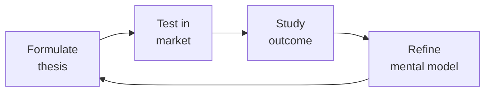

# Demand Generation (Demand Gen / Growth Marketing)
> **Portability target:** Spec-level (runs on Claude Code, Copilot, Gemini CLI, Codex, Cursor). No vendor-specific frontmatter fields.

Own the pipeline engine: paid acquisition across Google/LinkedIn/Meta, email marketing automation, lead scoring, MQL→SQL handoff, attribution modeling, CAC optimization, landing page CRO, webinar programs, ABM for enterprise, and marketing operations (HubSpot/Marketo/Pardot).

## Route the Request

<!-- QUICK: 30s -- auto-route first, then intent-route -->

### Auto-Route (No User Input Required)
Evaluate these file-system conditions in order. First match wins — jump immediately.

| # | Condition | Action |
|---|-----------|--------|
| A1 | `file_contains("*.csv", "UTM\|utm_source\|utm_medium\|campaign\|Campaign Name")` OR `file_contains("*.xlsx", "CAC\|Cost Per Lead\|CPL\|ROAS\|pipeline influenced")` OR `file_contains("*.docx", "lead scoring\|MQL\|SQL\|nurture sequence")`  | This is your skill. Jump to **Core Workflow** — Phase 1. |
| A2 | `file_contains("*.xlsx", "brand awareness\|positioning\|messaging\|competitive analysis\|launch plan")` OR `file_contains("*.pptx", "Brand Deck\|Messaging Framework\|positioning statement")`  | Invoke **marketing-manager** instead. This is brand & positioning work. |
| A3 | `file_contains("*.csv", "SEO\|organic traffic\|keyword rank\|backlink\|content calendar")` OR `file_contains("*.docx", "content strategy\|blog calendar\|editorial plan")`  | Invoke **content-strategist** instead. This is content & SEO work. |
| A4 | `file_contains("*.xlsx", "A/B test\|experiment\|variant\|statistical significance\|conversion rate")` AND `file_contains("*.csv", "control group\|treatment group\|hypothesis")`  | Invoke **growth-engineer** instead. This is experimentation infrastructure. |
| A5 | `file_contains("*.csv", "pipeline forecast\|closed-won\|ARR\|churn\|renewal")` AND `file_contains("*.xlsx", "revenue\|bookings\|quota\|attainment")`  | Invoke **revops-manager** instead. This is revenue operations. |
| A6 | `file_contains("*.xlsx", "ad creative\|Ad Copy\|headline variant\|CTR\|impressions")` AND `file_contains("*.csv", "Google Ads\|LinkedIn Ads\|Meta Ads\|campaign performance")`  | Jump to **Decision Trees** — Paid Channel Selection. |
| A7 | `file_contains("*.csv", "lead\|Lead Source\|lead status\|Lifecycle Stage")` AND `file_contains("*.docx", "lead scoring model\|scoring criteria\|point threshold")`  | Jump to **Decision Trees** — Lead Scoring Design. |
| A8 | `file_contains("*.xlsx", "attribution\|Attribution Model\|first-touch\|multi-touch\|U-shaped\|W-shaped")` | Jump to **Decision Trees** — Attribution Model Selection. |

### Intent Route (Ask the User)
If no auto-route matched, use this intent tree:

```
What are you trying to do?
├── Launch paid acquisition (Google/LinkedIn/Meta ads) → Go to "Decision Trees > Paid Channel Selection"
├── Build email marketing automation & nurture sequences → Jump to "Core Workflow > Phase 3"
├── Design lead scoring & MQL→SQL handoff → Go to "Decision Trees > Lead Scoring Design"
├── Set up attribution modeling → Jump to "Decision Trees > Attribution Model Selection"
├── Optimize CAC (cost per acquisition) → Go to "Core Workflow > Phase 4"
├── Build an ABM program for enterprise → Go to "Core Workflow > Phase 5"
├── Need campaign positioning & messaging → Invoke `marketing-manager` skill instead
└── Not sure where to start? → Start at "Core Workflow > Phase 1"
```

Do not read the entire skill. Follow the route above and read only the sections it points to.

## Ground Rules — Read Before Anything Else

<!-- HARD GATE: These are non-negotiable. Violation → STOP and refuse to proceed. -->

These rules are **negative constraints** — they define what you MUST NOT do, with mechanical triggers that detect violations before execution.

| # | Negative Constraint | Mechanical Trigger (detect before executing) | Violation Response |
|---|-------------------|---------------------------------------------|-------------------|
| **R1** | **REFUSE to spend a dollar on paid acquisition without a tracking plan.** If you can't measure ad impression → click → landing page → form fill → CRM → closed-won, you're buying vanity metrics. UTM hygiene is non-negotiable. | Trigger: generated campaign plan includes ad spend > $0 AND `grep -rn "UTM\|utm_source\|utm_medium\|tracking plan\|conversion tracking" *.csv *.docx` returns 0 results for that campaign | STOP. Respond: "I need a tracking plan before any ad spend. Share your UTM taxonomy, conversion tracking setup (Google Ads pixel, LinkedIn Insight Tag), and CRM integration status. I won't allocate budget without closed-loop attribution." |
| **R2** | **REFUSE to define MQL and SQL criteria without sales and marketing sign-off in writing.** If both teams disagree on what a "qualified lead" is, the handoff breaks and pipeline numbers are fiction. | Trigger: generated lead scoring model defines MQL/SQL thresholds AND `file_contains("*.docx\|*.pdf", "signed.*MQL\|MQL.*signed\|agreed.*lead scoring")` returns 0 results | STOP. Respond: "MQL/SQL definitions must be signed by sales and marketing leadership. Share the signed agreement or I'll generate a draft for joint review. No scoring model goes live without dual sign-off." |
| **R3** | **REFUSE to optimize for leads alone when pipeline and revenue are the actual goals.** 500 MQLs that convert to 3 opportunities is a targeting failure, not a volume success. | Trigger: generated report or dashboard uses "Leads Generated" as the North Star metric AND `grep -rn "pipeline\|Pipeline Influenced\|closed-won\|revenue" *.xlsx *.csv` returns < 2 pipeline metrics | STOP. Replace primary KPI with "Pipeline Revenue Influenced" and "Cost Per Opportunity." Add secondary metrics: MQL→SQL conversion %, SQL→Opportunity %, Cost Per Closed-Won $. Leads alone are a vanity metric — refuse to optimize exclusively for them. |
| **R4** | **STOP and require holdout groups on all email nurture sequences.** If you can't measure incremental lift vs a control group that receives nothing, you don't know if nurture is adding value or just annoying people who would have bought anyway. | Trigger: generated email nurture plan sequences emails to 100% of a segment AND `grep -rn "holdout\|control group\|incremental lift\|10%" *.csv *.docx` returns 0 results | STOP. Insert 10% holdout requirement: "Split segment into 90% treatment (receives nurture) and 10% holdout (receives nothing). Measure incremental lift in pipeline and revenue at 90 days. Nurture that can't beat 'do nothing' should be killed." |
| **R5** | **REFUSE to report attribution without stating the model and its limitations.** "Campaign X drove $500K" is meaningless without methodology. Different models produce wildly different numbers. | Trigger: generated report states revenue/pipeline attributed to a campaign AND `grep -rn "attribution model\|Attribution Model\|first-touch\|multi-touch\|U-shaped\|lookback" *.docx *.xlsx` returns 0 in the same report | STOP. Insert attribution disclaimer: "Reported using [U-shaped] attribution model with a [90-day] lookback window. Multi-touch models distribute credit differently than first-touch or last-touch. Attribution is directional — use for budget allocation, not as absolute truth." |
| **R6** | **DETECT and WARN about paid campaigns without creative testing cadence.** Running a single ad creative indefinitely guarantees creative fatigue, rising CPL, and diminishing returns. | Trigger: generated campaign plan has ad spend allocated to a channel AND `grep -rn "creative test\|A/B test\|variant\|ad rotation" *.xlsx *.csv` returns 0 for that channel | WARN: Add minimum creative testing requirement: "Launch with ≥5 ad variants per channel. Kill variants after $500 spend if CTR < 2× channel average. Replace killed variants weekly. Never run a single creative for more than 14 days without refresh." |
| **R7** | **DETECT and WARN about ABM programs without a sales follow-up SLA.** Marketing warms the account but sales doesn't follow up within 48 hours — the engagement signal decays and ABM investment is wasted. | Trigger: generated ABM plan includes account-level engagement tactics AND `grep -rn "SLA\|follow-up\|48 hour\|response time\|sales commitment" *.docx` returns 0 | WARN: Insert sales SLA clause: "Sales commits to 48-hour follow-up on all ABM engagement signals. If SLA breached, ABM program pauses until sales capacity is restored. Signal decay is exponential — after 48 hours, 80% of intent is lost." |
| **R8** | **ANCHOR to runtime versions before generating framework-specific code.** Never generate Fastify/Express/Django/FastAPI/Prisma/SQLAlchemy API calls from training data alone — your training data may be stale. | Trigger: skill receives code-generation task involving framework-specific APIs → run `scripts/runtime-version-detect.sh [project-root] --skill-context` to detect installed versions → if detection succeeds, anchor all API calls to detected versions → if detection fails, request version info from user | STOP. Respond: "Detected: {runtime}@{version}, {frameworks}@{versions}. Anchoring all API calls to these versions. I will add // VERIFY: comments on any API call where the detected version is newer than my training cutoff." |
| **R9** | **RUN the ROI Gate before any non-emergency code change.** Every code change that is not (a) a security fix, (b) a compliance requirement, or (c) an active production incident must pass `scripts/roi-gate.sh`. If the gate returns negative, refuse to write the code. | Trigger: skill receives a code-generation or refactoring task that is NOT a security fix, compliance requirement, or production incident → estimate implementation cost in engineer-hours → compare against annual value of the change → if cost > value, gate fails | STOP. Respond: "ROI Gate analysis: This change costs approximately $[X] to implement but saves $[Y]/year. Payback period: [N] years. If payback > 2 years, I recommend declining this work. See `scripts/roi-gate.sh` for the full formula." |


- **Admit uncertainty — never fabricate.** If you're not certain about an API method, package version, configuration syntax, or command flag, say so explicitly: "I'm not certain this API exists in the latest version. Check the official docs at [URL]." Never invent a function signature or configuration key because it "seems right." Hallucinated code costs hours of debugging.
- **Flag your knowledge cutoff.** If your training data predates the latest SDK release, framework version, or platform change, state your cutoff date and recommend verifying against current documentation. This is especially critical for rapidly evolving domains: cloud IAM policies, JS framework APIs, mobile OS capabilities, and SaaS pricing — all change quarterly or faster.
- **Never guess security configurations.** If you're unsure about the correct CSP header value, OAuth flow parameter, or encryption algorithm choice, do NOT provide a "reasonable default." Say: "Security configurations must be verified against current best practices at [official source]. I cannot provide a definitive answer without current documentation."
- **Distinguish between what you know and what you infer.** Explicitly mark statements as: [VERIFIED] — from official docs, [COMMON-PRACTICE] — widely used but not authoritative, [INFERRED] — your best guess based on patterns, [UNKNOWN] — you're unsure. This helps the user calibrate trust in your output.
## The Expert's Mindset

Master demand generations understand that strategy is not about predicting the future — it's about **being less wrong than the competition, faster**.

| Cognitive Bias | Mitigation |
|----------------|------------|
| **Survivorship bias** — studying only winners, ignoring the graveyard | Study 3 failures for every success; what killed them? |
| **Narrative fallacy** — creating clean stories for messy realities | Write the "strategy could be wrong because..." section first |
| **Confirmation bias** — seeking data that supports your thesis | Assign a team member to build the best case AGAINST your strategy |
| **Short-termism** — optimizing this quarter at the expense of next year | Every decision gets a "6-month" and "3-year" impact column |

### What Masters Know That Others Don't
- **The bottleneck is always one thing.** Find it. Fix it. Then find the next one.
- **Strategy = what you say NO to.** If your strategy doesn't exclude anything, it's not a strategy.
- **Timing beats brilliance.** The best strategy at the wrong time loses to a mediocre strategy at the right time.

### When to Break Your Own Rules
- **Bet the company when the asymmetry is right.** If downside = $1M and upside = $1B, the math doesn't care about your process.
- **Ignore the data when you're creating a new category.** By definition, there's no data for something that doesn't exist yet.

## Operating at Different Levels

| Level | Scope | You... |
|-------|-------|--------|
| **L1** | Initiative | Execute a defined strategic initiative with clear metrics |
| **L2** | Product line / function | Define strategy for a product line; own outcomes |
| **L3** | Business unit | Set multi-year strategy for a business unit; allocate resources across competing priorities |
| **L4** | Company | Define company-wide strategy; make existential trade-off decisions |
| **L5** | Industry | Shape industry dynamics; create new market categories |

**Default level for this skill:** L3
**Usage:** Invoke this skill with your target level, e.g., "as an L3 demand generation, develop..."

For full level definitions, see `skills/00-framework/skill-levels/SKILL.md`.

## When to Use

<!-- QUICK: 30s -- scan the bullet list to decide if this skill fits -->

- Launching or scaling paid acquisition across Google Ads, LinkedIn Ads, or Meta Ads
- Building or rebuilding email marketing automation with lead nurturing sequences
- Designing a lead scoring model and formalizing the MQL→SQL handoff between marketing and sales
- Setting up attribution modeling to understand which channels and campaigns drive pipeline
- Diagnosing high CAC or low conversion rates at specific funnel stages
- Running a landing page CRO program — A/B testing headlines, CTAs, forms, and social proof
- Building an account-based marketing (ABM) program targeting 50-500 named enterprise accounts
- Launching a webinar or virtual event series as a demand generation engine
- Evaluating or migrating marketing automation platforms (HubSpot, Marketo, Pardot, ActiveCampaign)

## Decision Trees

<!-- QUICK: 30s -- follow the ASCII tree to your scenario -->

### Paid Channel Selection

```
                              ┌──────────────────────────────┐
                              │ START: Which paid channels?   │
                              └────────────┬─────────────────┘
                                           │
                         ┌─────────────────▼─────────────────┐
                         │ What are you selling & to whom?   │
                         └────┬──────────────┬───────────────┘
                              │              │
                   ┌──────────▼────┐  ┌──────▼────────────┐
                   │ B2B SaaS      │  │ B2C / Consumer    │
                   │ (ACV > $5K)   │  │ (ACV < $500)      │
                   └──────┬────────┘  └──────┬────────────┘
                          │                  │
               ┌──────────▼──────┐  ┌────────▼────────────┐
               │ Primary:        │  │ Primary:             │
               │ LinkedIn Ads    │  │ Meta Ads + Google    │
               │ + Google Search │  │ Display + TikTok     │
               │ (high-intent)   │  │ (broad reach)        │
               │                 │  │                      │
               │ Secondary:      │  │ Secondary:           │
               │ Review sites    │  │ Google Search        │
               │ (G2/Capterra),  │  │ (intent capture),    │
               │ content         │  │ YouTube, influencer  │
               │ syndication,    │  │                      │
               │ podcast/        │  │                      │
               │ newsletter      │  │                      │
               │ sponsorships    │  │                      │
               └─────────────────┘  └──────────────────────┘
```
**B2B LinkedIn:** Target by job title, company size, industry. Lead-gen forms (pre-filled) outperform landing page redirects by 3-5x on conversion. Expect CPL $50-200. Use for: top-of-funnel awareness + mid-funnel lead gen.

**B2B Google Search:** Bid on competitor names, category terms, pain-point queries. High intent — these prospects are actively searching. Expect CPC $5-50 for SaaS. Use for: bottom-of-funnel capture.

**B2C Meta/TikTok:** Creative is everything — test 5+ video variants per audience. Broad targeting + strong creative outperforms hyper-targeted + weak creative. Expect CPM $5-20.

### Attribution Model Selection

```
                              ┌──────────────────────────────┐
                              │ START: Which attribution       │
                              │ model to use?                 │
                              └────────────┬─────────────────┘
                                           │
                         ┌─────────────────▼─────────────────┐
                         │ How many touches before purchase? │
                         └────┬──────────────┬───────────────┘
                              │              │
                    ┌─────────▼────┐  ┌──────▼──────────────┐
                    │ 1-3 touches  │  │ 4+ touches,          │
                    │ (SMB, short  │  │ long cycle            │
                    │ cycle)       │  │ (Enterprise)          │
                    └──────┬───────┘  └──────┬───────────────┘
                           │                 │
                ┌──────────▼──────┐  ┌────────▼────────────┐
                │ First-Touch or  │  │ Multi-Touch:         │
                │ Last-Touch      │  │ U-Shaped or W-Shaped │
                │                 │  │                      │
                │ Simple,         │  │ U-Shaped: 40% first  │
                │ directional.    │  │ touch, 40% lead      │
                │ Good enough for │  │ creation, 20% split  │
                │ direct response.│  │ across middle touches│
                │                 │  │                      │
                │ Limitations:    │  │ W-Shaped: 30% first  │
                │ Over-credits    │  │ touch, 30% lead      │
                │ one touch.      │  │ creation, 30% opp    │
                └─────────────────┘  │ creation, 10% split  │
                                    └──────────────────────┘
```
**Recommended default:** U-Shaped attribution with a 90-day lookback window. 40% credit to first touch, 40% to lead creation touch, 20% evenly across middle touches. State the model explicitly in every report.

**When to use data-driven attribution:** >50 conversions/month per channel, machine learning can assign fractional credit based on actual influence patterns. Requires significant data volume.

### Lead Scoring Design

```
                              ┌──────────────────────────────┐
                              │ START: Build lead scoring     │
                              └────────────┬─────────────────┘
                                           │
                         ┌─────────────────▼─────────────────┐
                         │ Scoring dimensions?               │
                         └────┬──────────────────────────────┘
                              │
              ┌───────────────┼───────────────┐
              ▼               ▼               ▼
    ┌─────────────────┐ ┌──────────┐ ┌──────────────────┐
    │ Demographic Fit │ │ Behavior │ │ Engagement       │
    │ (Explicit)      │ │ (Implicit)│ │ (Recency/Depth) │
    ├─────────────────┤ ├──────────┤ ├──────────────────┤
    │ Job title: +15  │ │Pricing   │ │Website visit <7d │
    │ (target role)   │ │page visit│ │: +10             │
    │                 │ │: +20     │ │                  │
    │ Job title: +5   │ │Case study│ │Email click <14d  │
    │ (adjacent role) │ │download  │ │: +10             │
    │                 │ │: +15     │ │                  │
    │ Company size    │ │Demo      │ │Multiple visits   │
    │ in ICP: +10     │ │request:  │ │>3 pages: +15     │
    │                 │ │+30       │ │                  │
    │ Industry fit:   │ │Webinar   │ │No activity >30d  │
    │ +10             │ │attended │ │: -15             │
    │                 │ │: +10     │ │                  │
    │ Negative:       │ │          │ │Unsubscribed:     │
    │ Student: -30    │ │          │ │-50              │
    │ Competitor: -20 │ │          │ │                  │
    │ Personal email: │ │          │ │                  │
    │ -10             │ │          │ │                  │
    └─────────────────┘ └──────────┘ └──────────────────┘
```
**Scoring thresholds:** Score >50 = MQL (handoff to sales). Score 30-50 = Nurture (keep in marketing). Score <30 = Long-term nurture or discard.

**Validation:** Run a correlation analysis quarterly. Are high-scoring leads actually converting at higher rates? If not, your scoring model is broken. Adjust weights based on actual closed-won data, not hunches.

### CRO: Landing Page Funnel Leak Diagnosis

```
                              ┌──────────────────────────────┐
                              │ START: Which stage to fix?    │
                              └────────────┬─────────────────┘
                                           │
                         ┌─────────────────▼─────────────────┐
                         │ >70% bounce from LP without        │
                         │ any action?                        │
                         └────┬──────────────────────────┬───┘
                              │ YES                       │ NO
                              ▼                           ▼
                      ┌──────────────┐          ┌──────────────────────┐
                      │Top-of-funnel │          │ >60% drop between     │
                      │CRO:          │          │ form view → submit?   │
                      │Headline,     │          └──┬──────────────┬────┘
                      │hero image,   │             │ YES          │ NO
                      │above-fold    │             ▼              ▼
                      │value prop,   │    ┌──────────────┐ ┌──────────────┐
                      │page speed,   │    │ Form Friction│ │ Post-Convert │
                      │mobile UX     │    │ CRO:         │ │ CRO:         │
                      └──────────────┘    │ Reduce fields│ │ Thank-you    │
                                          │ to ≤5, add   │ │ page CTA,   │
                                          │ social proof │ │ nurture      │
                                          │ near CTA,    │ │ sequence,    │
                                          │ auto-fill,   │ │ sales follow │
                                          │ remove phone │ │ -up timing   │
                                          │ if not needed│ └──────────────┘
                                          └──────────────┘
```
**When to optimize above-fold:** Bounce >70%. Fix within 48 hours. Test headline + hero + CTA as a triad.

**When to optimize form:** >60% drop form → submit. Reduce to ≤5 fields. Every field costs ~10% conversion.

## Core Workflow

<!-- QUICK: 30s -- scan phase titles to understand the process -->

<!-- DEEP: 10+min -->

### Phase 1 (~20 min): Pipeline Modeling & Target Setting

Build a reverse funnel from revenue target: Revenue target → Pipeline needed (at close rate X) → SQLs needed (at SQL→Opp rate Y) → MQLs needed (at MQL→SQL rate Z) → Leads needed (at Lead→MQL rate W). Example: $2M quarterly revenue target. Avg deal size $50K = 40 closed deals. Close rate 25% = 160 opportunities. SQL→Opp rate 60% = 267 SQLs. MQL→SQL rate 15% = 1,780 MQLs. Lead→MQL rate 10% = 17,800 leads. Now allocate across channels: organic %, paid %, email %, events %, partner %. Track actuals vs. plan weekly. Reforecast monthly.

<!-- DEEP: 10+min -->

### Phase 2 (~60 min): Marketing Operations Setup

Marketing ops is the infrastructure: choose your platform (HubSpot for SMB/mid-market, Marketo for enterprise, Pardot if Salesforce-native required). Set up: (1) Tracking — UTM parameters enforced on every outbound link, form submissions captured with source data, cookie-based tracking for anonymous visitors, first-touch and last-touch fields populated at conversion, (2) Lead lifecycle stages — Visitor → Lead → MQL → SQL → Opportunity → Customer → Evangelist, with automated stage transitions based on scoring and actions, (3) Email automation — nurture sequences triggered by behavior (content download → related nurture track, pricing page visit → sales outreach alert), (4) List hygiene — bounce management, unsubscribe compliance, deduplication, suppression lists, (5) Attribution — U-shaped model as default, campaign influence tracking, ROI dashboards by channel, (6) Reporting — weekly pipeline dashboard: leads by channel, MQL volume, MQL→SQL rate, SQL→Opp rate, pipeline created, CAC by channel, LTV:CAC ratio.

<!-- DEEP: 10+min -->

### Phase 3 (~45 min): Email Marketing & Nurture

Design nurture sequences, not email blasts. Architecture: (1) Welcome sequence (3 emails over 7 days) — triggered on first conversion. Email 1: deliver the asset. Email 2: social proof + case study. Email 3: soft CTA (demo, trial, assessment), (2) Behavioral triggers — pricing page visit → case study email within 1 hour, feature page visit → product demo video, high engagement → sales alert, inactivity (30 days no click) → re-engagement drip (subject: "Still interested?"), (3) Newsletter (bi-weekly) — curated content, product updates, customer stories. Segment by persona so CTOs don't get end-user content, (4) Re-engagement — 3-email sequence for dormant leads. Email 1: "We miss you"

> See [references/core-workflow.md](references/core-workflow.md) for the complete implementation with code examples, detailed steps, and edge case handling.


## Error Recovery

<!-- STANDARD: Recovery patterns for common failures. -->

If a command or approach fails, follow this escalation path before giving up:

| Symptom | First Action | If That Fails | Last Resort |
|---------|-------------|---------------|-------------|
| Tool/command not found | Check installation: `which [tool]` or `[tool] --version`. Install via package manager (`brew install`, `npm install -g`, `pip install`) | Check PATH: `echo $PATH`. Verify the tool binary is in a PATH directory. Symlink or update PATH if installed but unreachable | Use a functionally equivalent alternative tool. If `rg` is unavailable, use `grep -r`. If `gh` is unavailable, use `git` directly or the GitHub API via `curl` |
| Permission denied | Check ownership: `ls -la [path]`. Fix with `chmod` or `sudo` if appropriate. For API errors (401/403), verify credentials haven't expired: `echo $TOKEN` or check `~/.netrc` | Refresh credentials: re-authenticate with the service. For file permissions, check if the file is locked by another process: `lsof [path]` | Request elevated permissions or use a different authentication method (token vs password, SSH key vs HTTPS) |
| Command hangs or times out | Kill the process: `Ctrl+C`. Re-run with a timeout: `timeout 30 [command]` or `gtimeout` on macOS. Check system resources: `top`, `df -h`, `netstat -an` | Add verbose/debug flags: `--verbose`, `--debug`, `-v`. Check logs: `tail -f [logfile]`. Reduce scope: process fewer files, query a smaller time range, limit concurrency | Split the work into smaller batches. Implement a retry loop with exponential backoff (1s, 2s, 4s, 8s). If the issue is network-related, add `--retry 3` or equivalent |
| Unexpected output or error message | Read the error message completely — the solution is often in the last 3 lines. Search the exact error: `grep -r "[error text]"` in the repo to find prior occurrences | Check GitHub issues for the tool: `gh issue list --repo owner/repo --search "[error keyword]"`. Check Stack Overflow | Simplify the approach. If the complex one-liner fails, break it into 3 sequential commands. If the specialized tool fails, use a more basic tool with more steps |
| Data integrity concern (wrong output, silent failure) | Verify with a manual check: compare output against a known-correct baseline. Add assertions: `[command] | grep -q "[expected]" && echo "OK" || echo "FAIL"` | Run the operation on a smaller subset first. Compare checksums: `shasum`, `md5`. Check for silent truncation: `wc -l` before and after | Abort and flag for human review. Do not proceed past data integrity failures — the cost of propagating bad data exceeds the cost of delay |

**Hard failure boundary:** If 3 different approaches all fail, STOP. Do not iterate infinitely. Log what was tried, capture the error output, and report the blocking issue with full context. Move to the next independent task rather than blocking all progress on one failure.

## Cross-Skill Coordination

<!-- QUICK: 30s -- table of who to talk to when -->

| Coordinate With | When | What to Share/Ask |
|-----------------|------|-------------------|
| **Marketing Manager** | Campaign briefs, positioning, personas, messaging for ads | Approved messaging, target personas, asset briefs, launch timelines. **Decision gate:** Does campaign brief pass logo-swap test? → launch ready. **Artifact:** campaign brief doc + messaging framework. |
| **Analytics Engineer** | Attribution models, data pipelines, dashboards | Tracking requirements, event taxonomy, attribution methodology, data quality. **Decision gate:** Is attribution model locked for 12 months? → report consistently. **Artifact:** attribution model doc + UTM taxonomy. |
| **Sales Engineer** | MQL→SQL handoff quality, lead qualification feedback | Lead quality feedback, conversion rates by channel, content preferences. **Decision gate:** Is MQL→SQL conversion > 15%? → handoff process healthy. **Artifact:** MQL quality scorecard + handoff SLA report. |
| **Growth Engineer** | Landing page CRO, A/B testing infrastructure, experiment design | Experiment results, CRO hypotheses, technical feasibility of landing page changes. **Decision gate:** Is CRO experiment statistically significant (p < 0.05)? → ship winner. **Artifact:** A/B test results + implementation spec. |
| **Content Strategist** | Content assets for nurture, offers for campaigns | Asset briefs, content calendar, SEO-validated topics, target keywords. **Decision gate:** Does content asset have a CTA with measurable conversion? → campaign-ready. **Artifact:** asset brief + performance benchmarks. |
| **SEO Specialist** | Organic/content synergy, keyword-driven paid campaigns | Keyword data, organic landing page performance, paid-organic cannibalization checks. **Decision gate:** Is paid cannibalization < 10% of organic traffic? → budget efficient. **Artifact:** keyword overlap report. |
| **Customer Success Manager** | Customer stories for webinars, reference logos for landing pages | Customer advocates, NPS data, churn signals that indicate targeting or messaging issues. **Decision gate:** Is NPS > 30 for reference customers? → safe to feature. **Artifact:** customer advocacy roster. |
| **Business Strategist** | CAC targets, LTV models, budget allocation, ROI reporting | Revenue targets, unit economics, growth targets, budget constraints. **Decision gate:** Is LTV:CAC > 3:1 for each channel? → budget allocation sound. **Artifact:** channel-level unit economics dashboard. |
| **RevOps Manager** | Pipeline analytics, forecasting, attribution integration | Campaign-attributed pipeline data, conversion rates by channel. **Decision gate:** Is campaign pipeline > 40% of total pipeline? → demand gen is primary growth engine. **Artifact:** pipeline attribution report by campaign. |

### Communication Triggers — When to Proactively Notify

| Trigger | Notify | Why |
|---------|--------|-----|
| CAC increases >30% month-over-month on any channel | Marketing Manager, Analytics Engineer, Business Strategist | Channel efficiency at risk; may need pause, creative refresh, or targeting change |
| MQL→SQL conversion drops below 10% for >2 weeks | Sales Engineer, Marketing Manager | Scoring model or sales follow-up broken; pipeline forecast at risk |
| Email domain reputation drops (bounce >2%, spam complaint >0.1%) | Marketing Manager | Deliverability crisis; pause sends, audit list hygiene, warm domain |
| Landing page conversion drops below 2% (from ad traffic) | Growth Engineer, Marketing Manager | CRO audit; test headline, offer, form, page speed |
| Attribution tracking breaks (UTMs missing, cookie consent change) | Analytics Engineer, Marketing Manager | All spend data becomes unreliable; fix before launching new campaigns |
| Pipeline gap >30% of target at mid-quarter | Marketing Manager, Sales Engineer, Business Strategist | Emergency pipeline generation; surge campaigns, event acceleration, lead list activation |

### Escalation Path

```
CAC exceeds target by >50% for >30 days → Business Strategist + VP Marketing. Channel pause or restructure.
Attribution/data pipeline failure >48 hours → Analytics Engineer + VP Marketing. Revenue reporting blind spot.
Marketing automation platform outage >4 hours → Platform vendor + VP Marketing + Sales Ops. Lead processing halted.
MQL quality crisis (sales rejects >50% of MQLs) → Sales leadership + Marketing Manager. Scoring reset + joint review.
```

### Cross-skills Integration

```bash
# Chain: marketing-manager → demand-generation → sales-engineer
# Campaign execution: PMM provides positioning → Demand gen executes across channels → SE receives qualified MQLs

# Chain: analytics-engineer → demand-generation → growth-engineer
# Data-driven optimization: Analytics builds attribution model → Demand gen optimizes channel mix → Growth engineer tests CRO changes

# Chain: demand-generation → growth-engineer
# Conversion optimization: Demand gen identifies funnel leaks → Growth engineer builds and runs A/B tests

```


| Upstream Skill | What You Receive | When to Involve |
|---|---|---|
| `product-strategist` | Product positioning, competitive analysis, value proposition | Before engaging prospects or designing partnerships |


## Proactive Triggers

<!-- QUICK: 30s -- when to proactively notify stakeholders -->

| Trigger | Notify | Why |
|---------|--------|-----|
| CAC increases >30% month-over-month on any paid channel | Marketing Manager, Business Strategist, Analytics Engineer | Channel efficiency crisis; may need creative refresh, targeting change, or channel pause before budget is wasted |
| MQL→SQL conversion drops below 10% for 2+ consecutive weeks | Sales Engineer, Marketing Manager, RevOps Manager | Scoring model broken or sales follow-up degraded; pipeline forecast at risk; joint marketing-sales audit required |
| Email domain reputation warning (bounce >2% or spam complaint >0.1%) | Marketing Manager, Analytics Engineer | Deliverability crisis imminent; pause all sends, audit list hygiene, and warm domain before full blacklist occurs |
| Attribution tracking breaks (UTM pipeline failure, cookie consent change, CRM sync error) | Analytics Engineer, Marketing Manager, RevOps Manager | All spend data becomes unreliable; fix attribution pipeline before launching any new campaigns — flying blind on spend |
| Pipeline gap exceeds 30% of quarterly target at mid-quarter | Marketing Manager, Sales Engineer, Business Strategist, RevOps Manager | Emergency pipeline generation required; surge campaigns, event acceleration, lead list activation, and SDR blitz |
| Landing page conversion drops below 2% from paid traffic (sustained >1 week) | Growth Engineer, Marketing Manager | CRO emergency; test headline, offer, form length, page speed. Every day below threshold burns ad budget with no return |
| Competitor launches aggressive paid campaign targeting your branded keywords or ICP | Marketing Manager, Business Strategist | Brand CPC inflation and share-of-voice loss; competitive response strategy needed within 48 hours |
| Nurture sequence holdout test shows no statistically significant lift vs. control after 90 days | Marketing Manager, Content Strategist | Nurture is burning effort for zero incremental pipeline; kill the sequence and redirect resources to higher-ROI activities |


## State Log

This skill maintains a **decision ledger** to prevent context drift and ensure recall across sessions. Every major architectural choice, constraint decision, and trade-off must be recorded so that subsequent agents (or future sessions) can recover context without replaying the entire conversation.

### How the State Log Works
<!-- AGENT: Read this before starting work, update after each phase -->

1. **On session start:** Check `.copilot/session-state/decision-ledger.json` for any prior decisions relevant to this domain. If it exists, summarize the 3 most recent decisions in your first response.
2. **After each major decision:** Append to the ledger:
   ```json
   {
     "timestamp": "ISO-8601",
     "skill": "demand-generation",
     "phase": "Phase 3: Implementation",
     "decision": "What was decided",
     "rationale": "Why this choice over alternatives",
     "constraints": ["constraint-1", "constraint-2"],
     "alternatives_considered": ["alt-1", "alt-2"],
     "reversible": true
   }
   ```
3. **Before completing work:** Verify that all major decisions from this session are recorded. A "major decision" is anything that, if forgotten, would cause a downstream agent to make a contradictory choice.
4. **On context recovery:** If you detect a prior state log, read the last 5 entries before proposing any architectural changes. Cite the prior decisions you're building on.

### State Log Schema

| Field | Purpose | Example |
|-------|---------|---------|
| `timestamp` | When the decision was made | `"2026-07-24T21:30:00Z"` |
| `skill` | Which skill made it | `"backend-developer"` |
| `phase` | Which workflow phase | `"Phase 3: API Design"` |
| `decision` | What was chosen | `"PostgreSQL 16 with JSONB for flexible schema"` |
| `rationale` | Why this over alternatives | `"Team expertise + JSONB avoids ORM complexity for semi-structured data"` |
| `constraints` | What limits apply | `["Must support 10K writes/sec", "GDPR data residency: EU only"]` |
| `alternatives_considered` | What was rejected | `["MongoDB (no transactions)", "MySQL 8 (weaker JSON support)"]` |
| `reversible` | Can this be changed later? | `true` (migration possible) or `false` (irreversible choice) |

### Anti-Drift Check
<!-- AGENT: Run this check at the start of each new phase -->

Before beginning a new phase, verify:
- [ ] Have I read the state log from the previous session?
- [ ] Do any prior decisions constrain what I'm about to do?
- [ ] Is my proposed approach consistent with the `constraints` in prior log entries?
- [ ] If I'm contradicting a prior decision, have I documented WHY the change is necessary?

## What Good Looks Like

<!-- QUICK: 30s -- concrete success description -->

Every paid channel has a documented CAC and LTV:CAC ratio >3:1. MQL→SQL conversion rate >15% and stable quarter-over-quarter. Attribution model is documented (U-shaped, 90-day lookback) and consistently applied across all reports. Email nurture sequences have <0.5% unsubscribe rate and >3% CTR. Landing pages convert >3% from paid traffic. Lead scoring model validated quarterly against actual closed-won data — high-scoring leads convert at >2x the rate of medium-scoring leads. ABM program generates >30% higher ACV than non-ABM. Pipeline dashboard updates daily with no data gaps. Marketing-sourced pipeline consistently hits >40% of total pipeline.

## Deliberate Practice


```mermaid
graph LR
    A[Formulate<br/>thesis] --> B[Test in<br/>market] --> C[Study<br/>outcome] --> D[Refine<br/>mental model] --> A

```

| Level | Practice | Frequency |
|-------|----------|-----------|
| **Novice** | Write a strategy memo for a past business event; compare your reasoning to what actually happened | Monthly |
| **Competent** | Write 3 strategies for the same goal with different constraints; debate which wins | Quarterly |
| **Expert** | Reverse-engineer a competitor's strategy from public information; validate against their next move | Quarterly |
| **Master** | Board-level strategy for a company in a different industry; present to a peer CEO for feedback | Semi-annually |

**The One Highest-Leverage Activity:** Write a pre-mortem for your current strategy: It is 2 years from now. Our strategy failed. Why?

## Anti-Rationalization — No Excuses

| Rationalization | Reality |
|---|---|
| "Clicks are cheap — volume wins" | $52,500 on "maximize clicks" bidding: 15,000 clicks from students and international traffic, 2 demo requests. Same budget on target CPA: 175-250 MQLs and 25-40 pipeline opportunities. Bid toward conversions, never clicks. |
| "Nurture everyone — more is better" | A customer in renewal gets "Want to learn about our platform?" and forwards it to their AM. Every nurture email without suppression lists (current customers, open opportunities, topic-level unsubscribes) destroys trust with existing accounts. |
| "Open rates look great — the audience is engaged" | Apple Mail Privacy Protection inflates open rates by 30-40% via proxy pre-fetching. A "highly engaged" lead who "opened every email" may have never seen your brand. Score on clicks, form fills, and site visits — not opens. |
| "Broad webinars fill the funnel — cast a wide net" | 800 registrations for "Future of Supply Chain": 40% students, 30% junior practitioners, 20% vendors, 10% buyers. $15K + 40 team hours = $500+ per relevant attendee. ABM webinars for 50 named accounts at $8K produce 8-15 qualified opportunities. |
| "UTM tracking is admin — we'll fix the taxonomy later" | Three teams produce `utm_source=linkedin`, `linkedin_paid`, and `li` — $105K in unaggregatable spend. VP presents channel ROI on incomplete data, CFO finds $30K discrepancy. Cost: $15K-$25K in analytics cleanup + $50K-$200K in misallocated budget. |

## Error Decoder — War Stories from the Trenches

**(STANDARD)**

When this domain goes wrong, it goes wrong in predictable ways. Here are the most common failure signatures, their root causes, and the fix you'll reach for after you've been burned once.

| Symptom | Root Cause | Fix | Lesson |
|---------|-----------|-----|--------|
| $52,500 LinkedIn campaign: 15,000 clicks, 2 demo requests — $26,250 per demo | Campaign optimized for "maximize clicks" bidding. Algorithm delivered to students, international traffic, and click-farm engagement. Same budget on Target CPA bidding produces 175-250 MQLs and 25-40 pipeline opportunities. | Never use maximize-clicks or maximize-impressions bidding. Always bid toward conversions (Target CPA or Maximize Conversions) with proper conversion tracking. The algorithm optimizes for what you tell it to optimize — if you reward clicks, it buys clicks, not customers. | The bidding strategy IS the targeting strategy. "Maximize clicks" tells the platform: find me the cheapest clicks. "Target CPA" tells it: find me people who will buy. These are completely different audiences. |
| "Open rates are 42% — the nurture sequence is killing it!" — but pipeline attribution shows zero lift vs holdout | Apple Mail Privacy Protection inflates open rates by 30-40% via proxy pre-fetching. Every email "opened" by Apple Mail users fires the tracking pixel regardless of human interaction. Lead scoring based on opens is scoring robots. | Score leads on clicks, form fills, and site visits — never email opens. Run 10% holdout groups on ALL nurture sequences. If nurture can't beat "do nothing" on pipeline generated at 90 days, kill it. Open rates are a vanity metric in the post-MPP era. | In a world where Apple pre-fetches every email pixel, "open rate" measures server activity, not human engagement. A lead who "opened every email" may have never seen your brand. Score on actions that require a human. |
| Three teams produce `utm_source=linkedin`, `linkedin_paid`, and `li` — $105K in unaggregatable spend, CFO finds $30K discrepancy | No UTM taxonomy governance. Marketing ops, demand gen, and paid media teams each created their own naming conventions. Channel ROI presented to board was directionally wrong because spend couldn't be mapped to pipeline. | Create and enforce a UTM taxonomy BEFORE any campaign spend: `utm_source` (lowercase, no spaces), `utm_medium` (standardized list), `utm_campaign` (naming convention with date). Lock down with spreadsheet validation or a URL builder tool. Audit monthly. | UTM fragmentation is a $100K+ problem hiding in plain sight. If you can't aggregate spend by channel, you can't optimize by channel. The taxonomy isn't admin work — it's the foundation of every ROI conversation with the CFO. |
| Webinar: 800 registrations, "Future of Supply Chain." 40% students, 30% junior, 20% vendors, 10% buyers. $15K + 40 team hours = $500+ per relevant attendee. | Broad topic + broad promotion = broad audience. LinkedIn targeting optimized for registrations, not buyer fit. No job title or seniority filter. The registration count looked great — the pipeline attribution showed 2 opportunities, both from people who were already in the pipeline. | Target webinars at specific job titles with budget authority (Director+ in ICP function). ABM webinars for 50 named accounts at $8K produce 8-15 qualified opportunities. Use registration questions to filter: "What's your role in purchasing [category]?" kills students immediately. | "800 registrations" sounds better than "50 registrations, 40 of whom can buy." But only one of these is a pipeline-generating event. Webinar audience quality is determined by the promotion targeting, not by the topic. |
| Email nurture hits current customer in renewal: "Want to learn about our platform?" — forwarded to AM with "Seriously?" | No suppression lists. Marketing automation sends nurture to all contacts in database. Current customers, open opportunities, and recently churned accounts all receive "educational" content that reveals the company doesn't know who they are. | Maintain suppression lists synced with CRM: current customers (by status), open opportunities (by stage), churned accounts (< 90 days), topic-level opt-outs, competitor domains. Audit suppression logic quarterly by running "who would receive this?" reports. | Every nurture email to a current customer is a retention risk. A prospect nurture email received by someone paying you $50K/year says "we don't know you're a customer." The damage per email is small — the cumulative trust erosion is not. |
| Google Ads campaign running same 3 creatives for 8 months — CPL has tripled, "but it was working before" | Creative fatigue: audiences see the same ad 15+ times, CTR drops, platform charges more to maintain delivery. No refresh cadence because "it was converting at $45 CPL last quarter." Now at $135 CPL with 60% fewer conversions. | Launch with ≥5 ad variants per channel. Kill variants after $500 spend if CTR < 2× channel average. Replace killed variants weekly. Never run a single creative for more than 14 days without refresh. Budget 20% of creative spend for testing new variants. | Ad creative decays. The half-life of a B2B ad creative is 4-6 weeks. What worked last quarter is not "proven winner" — it's "about to stop working." The CPL increase is gradual until it's catastrophic. |

## Best Practices

1. **Never spend a dollar on paid acquisition without a tracking plan.** UTM taxonomy, conversion tracking (Google Ads pixel, LinkedIn Insight Tag, Meta Pixel), and CRM integration must be live and validated before campaign launch. Closed-loop attribution from impression → click → form fill → CRM → closed-won is non-negotiable. Spend without tracking is buying vanity metrics.
2. **Bid toward conversions, never clicks or impressions.** Google Ads "maximize clicks" and LinkedIn "maximize impressions" optimize for volume, not quality. Use Target CPA or Maximize Conversions bidding with proper conversion tracking. The same $50K budget produces 2 demo requests on clicks vs 25-40 pipeline opportunities on target CPA.
3. **Define MQL and SQL criteria with signed agreement from both sales and marketing leadership.** If the two teams disagree on what "qualified" means, the handoff breaks and pipeline numbers are fiction. Document rejection reasons for every lead sales rejects, build a recycle path, and review definitions quarterly.
4. **Run 10% holdout groups on all email nurture sequences.** If you can't measure incremental lift vs a control group that receives nothing, you don't know if nurture is adding value or just annoying people who would have bought anyway. Kill nurture sequences that can't beat "do nothing" at 90 days.
5. **Score leads on clicks, form fills, and site visits — never email opens.** Apple Mail Privacy Protection inflates open rates by 30-40% via proxy pre-fetching. A lead who "opened every email" may have never seen your brand. Open rates are a vanity metric in the post-MPP era.
6. **Launch paid campaigns with ≥5 ad variants per channel.** Running a single creative indefinitely guarantees creative fatigue, rising CPL, and diminishing returns. Kill variants after $500 spend if CTR < 2× channel average. Replace killed variants weekly. Never run a single creative for more than 14 days without refresh.
7. **Target webinars at specific job titles with budget authority (Director+ in ICP function).** Broad "everyone interested in [industry]" webinars produce audiences of 40% students, 30% junior practitioners, and 10% actual buyers. ABM webinars for 50 named accounts at $8K produce 8-15 qualified opportunities — 5× the ROI of broad webinars.
8. **Implement UTM governance with mandatory taxonomy and automated validation.** Without governance, three teams produce three different `utm_source` values for the same channel. Create a UTM taxonomy document; enforce via marketing automation platform validation; audit monthly and reject non-compliant campaigns.
9. **Report attribution with the model name and lookback window stated explicitly.** "Campaign X drove $500K" is meaningless without methodology. State: "Reported using U-shaped attribution with 90-day lookback. Multi-touch models distribute credit differently than first-touch. Attribution is directional — use for budget allocation, not absolute truth."
10. **Build an ABM program that includes a sales follow-up SLA.** Marketing warms the account but sales doesn't follow up within 48 hours — the engagement signal decays and ABM investment is wasted. Sales must commit to 48-hour follow-up on all ABM signals. If SLA breached, pause ABM program until capacity is restored.

## Anti-Patterns

<!-- STANDARD: Common failure modes with cost estimates and fixes. -->

- **B2B LinkedIn ads targeting "CEO" title** at companies with 50-200 employees — half of those profiles list "CEO" but are actually solopreneur consultants, not your buyer. Combine title + company size + industry; title alone is a vanity metric.
- **Email nurture sequence that doesn't suppress existing customers or active opportunities** — a customer in contract renewal gets "Want to learn about our platform?" and forwards it to their account manager. Every nurture email must suppress: current customers, open opportunities, and anyone who unsubscribed from THAT topic (not just global unsubscribe).
- **Lead scoring based on email opens** (Apple Mail Privacy Protection opens all emails via proxy, inflating open rates by 30-40%). A "highly engaged" lead who "opened every email" may have never seen your brand. Score on clicks, form fills, and site visits — not opens.
- **"MQL to SQL conversion rate"** measured without defining who qualifies the lead — marketing passes 100 leads, sales accepts 40, 60 are rejected but never returned to marketing. Those 60 are NOT "unqualified" — they're "unworked." Track rejection reasons and build a recycle path.
- **Google Ads budget left on "maximize clicks" bidding for 6 months.** The algorithm optimizes for cheap clicks, not quality. You get 15,000 clicks at $3.50 CPC ($52,500 spend) — from India, Indonesia, and students researching for term papers. Two demo requests. If switched to "maximize conversions" or "target CPA" with proper conversion tracking, the same $52,500 could have generated 175-250 MQLs at $210-$300 CPL — and 25-40 pipeline opportunities. **Total cost: $50K-$80K in wasted ad spend over 6 months, plus the opportunity cost of 25-40 deals that didn't enter the pipeline.** Fix: Always bid toward a conversion goal (demo request, trial signup, contact sales), never toward clicks or impressions; install conversion tracking before spending a dollar; review search term reports weekly and add negative keywords aggressively.
- **Webinar strategy that targets "everyone interested in [industry]."** You promote a webinar on "The Future of Supply Chain" and get 800 registrations. 300 attend. The audience mix: 40% students, 30% junior practitioners with no budget authority, 20% vendors selling INTO supply chain, 10% actual buyers. You spent $15K on promotion and 40 hours of team time for 30 potential buyers — a $500+ cost per relevant attendee. **Total cost: $20K-$35K per broad webinar with near-zero pipeline conversion, when a tightly targeted Account-Based webinar for 50 named accounts at $8K cost could produce 8-15 qualified opportunities.** Fix: Target webinars at specific job titles with budget authority (Director+ in your ICP function); cap registrations and vet attendees; use webinars as ABM tools for named accounts, not top-of-funnel awareness.
- **No UTM governance across the marketing team.** The content team uses `utm_source=linkedin`, the paid team uses `utm_source=linkedin_paid`, and the social team uses `utm_source=li`. Reports show three different "LinkedIn" sources with $50K, $35K, and $20K spend respectively — and nobody can aggregate them. The VP of Marketing presents channel ROI to the board based on incomplete data and loses credibility when the CFO finds a $30K discrepancy. **Total cost: $15K-$25K in analytics cleanup consulting fees to retroactively fix 12 months of data, plus $50K-$200K in misallocated budget because you can't reliably compare channel performance.** Fix: Implement a UTM taxonomy document with mandatory values for source, medium, campaign, and content; enforce via automated validation in your marketing automation platform; audit UTMs monthly and reject non-compliant campaign launches.

## Production Checklist

<!-- STANDARD: Pre-launch verification gate. All items must pass before delivering work. -->

- [ ] Conversion tracking installed and validated for all paid channels (Google Ads, LinkedIn, Meta) before any ad spend
- [ ] UTM taxonomy documented with mandatory values for source, medium, campaign, and content — enforced via automation
- [ ] MQL and SQL definitions signed by both sales and marketing leadership — documented in shared location
- [ ] Lead scoring model validated: top 20% of scored leads account for ≥80% of pipeline generated
- [ ] Suppression lists active: current customers, open opportunities, and topic-level unsubscribes excluded from all campaigns
- [ ] 10% holdout group configured for every email nurture sequence — incremental lift measurable at 90 days
- [ ] Paid campaigns launched with ≥5 ad variants per channel — kill criteria defined (CTR < 2× channel average at $500 spend)
- [ ] Attribution model selected and documented (first-touch, last-touch, U-shaped, W-shaped, multi-touch) with lookback window
- [ ] ABM program includes sales follow-up SLA (48-hour max) with pause mechanism if SLA breached
- [ ] MQL-to-SQL rejection reasons tracked for every rejected lead — recycle path exists and is actively used
- [ ] Campaign ROI dashboard live: cost per MQL, cost per SQL, cost per opportunity, cost per closed-won by channel
- [ ] Creative refresh cadence defined: new ad variants weekly, no creative running >14 days without A/B test
- [ ] Negative keyword lists reviewed weekly for paid search campaigns — search term reports audited
- [ ] Webinar targeting criteria defined: job title (Director+), ICP industry, budget authority — attendee vetting process in place

## Scale Depth

<!-- DEEP: How this skill scales from solo to enterprise. -->

### Solo Demand Gen (Founder-led, pre-Series A)
- **Tooling:** Google Ads with manual bidding, Mailchimp for email, Google Sheets for attribution, Google Analytics for web tracking
- **Process:** Founder runs LinkedIn ads and writes email sequences personally; no formal lead scoring; attribution is last-touch only
- **Risk:** No holdout groups; no suppression lists; no A/B testing — every campaign is a single-variant gamble
- **Move to next level when:** Monthly ad spend exceeds $5K OR you have ≥2 active channels (paid + email + webinar)

### Small Team (1-2 Demand Gen, Series A-B)
- **Tooling:** HubSpot/Marketo for marketing automation, Google Ads + LinkedIn Campaign Manager, basic UTM governance spreadsheet, Google Data Studio for dashboards
- **Process:** Formal UTM taxonomy, lead scoring model (fit + engagement), email nurture with basic suppression, monthly campaign performance review
- **Key hire:** First marketing operations person to manage HubSpot/Marketo, UTM governance, and CRM integration
- **Move to next level when:** Monthly ad spend exceeds $50K OR running campaigns across ≥4 channels simultaneously

### Medium Team (3-6 Demand Gen, Series B-C)
- **Tooling:** Marketo/Pardot Enterprise, multi-touch attribution platform (Bizible/Full Circle Insights), ABM platform (6sense/Demandbase), dedicated analytics (Tableau/Looker)
- **Process:** Multi-touch attribution (U-shaped or W-shaped), formal ABM program with sales SLA, weekly campaign optimization cadence, channel-level ROI reporting, dedicated CRO specialist for landing pages
- **Metrics:** MQL → SQL → Opportunity → Closed-Won conversion rates by channel, CAC by channel, pipeline velocity, attribution-weighted ROI
- **Move to next level when:** Running ABM for ≥100 named accounts OR annual marketing spend exceeds $2M

### Enterprise (6+ Demand Gen, Series C+)
- **Tooling:** Full marketing cloud (Marketo Engage + Salesforce Marketing Cloud), CDP for audience segmentation, AI-powered bidding (Google Smart Bidding + LinkedIn Predictive Audiences), dedicated MOPs team, media mix modeling
- **Process:** Predictive lead scoring, real-time personalization, automated multi-channel orchestration, global campaign governance (regional teams follow central framework), quarterly media mix modeling
- **Metrics:** Marketing-influenced pipeline vs marketing-sourced pipeline, LTV:CAC ratio by channel, incrementality testing results, brand lift studies, media efficiency ratio (MER)
- **Governance:** Monthly marketing leadership review of channel performance, quarterly attribution model audit, annual media agency performance review, global UTM governance enforced via marketing automation

## Error Decoder

<!-- STANDARD: Symptom → Diagnosis → Root Cause → Fix table. -->

| Symptom | Diagnosis | Root Cause | Fix |
|---------|-----------|------------|-----|
| $50K ad spend, 15,000 clicks, 2 demo requests | Campaign bidding on "maximize clicks" instead of "maximize conversions"; traffic from low-intent audiences | No conversion tracking installed; campaign optimized for volume, not quality | Switch to Target CPA or Maximize Conversions bidding; install conversion tracking; review search term reports weekly; add negative keywords for students, jobs, free, tutorial |
| Email nurture: 40% open rate, 0.5% click rate, zero pipeline | Open rates inflated by Apple Mail Privacy Protection; emails not driving action | Lead scoring uses opens as primary signal; content not mapped to buyer journey stage | Remove opens from lead scoring; score on clicks, form fills, site visits only; audit nurture content for buyer-stage relevance; add 10% holdout group to measure true incrementality |
| 100 MQLs passed to sales, 40 accepted, 60 rejected with no feedback | MQL definition doesn't match what sales considers qualified; no rejection reason tracking | Sales and marketing never aligned on MQL criteria; no recycle path for rejected leads | Hold joint MQL definition workshop; document and sign shared criteria; require rejection reason for every lead; build automated recycle path (6-month re-nurture with additional qualification gates) |
| UTM reports show 3 different "LinkedIn" sources, can't aggregate | No UTM taxonomy governance; each team uses different utm_source values | UTM parameters treated as optional; no automated validation in marketing platform | Create UTM taxonomy document with mandatory values; enforce via HubSpot/Marketo field validation; audit monthly; reject campaigns with non-compliant UTMs |
| Attribution report shows "Campaign X drove $500K" but model is unspecified | Single number reported without methodology or lookback window | Attribution model not selected or documented; stakeholders don't understand model differences | Always report: model name (U-shaped/W-shaped/multi-touch), lookback window (90/180/365 days), and disclaimer that attribution is directional for budget allocation |
| ABM program: 500 target accounts engaged, 3 opportunities created | Marketing generated engagement signals but sales didn't follow up within 48 hours | No sales follow-up SLA in ABM program; signal decay exponential after 48 hours | Implement 48-hour sales follow-up SLA; auto-escalate breaches to sales leadership; pause ABM spend if SLA breach rate exceeds 20%; add sales capacity check before launching new ABM campaigns |
| LinkedIn ads: CPL rising 15% month-over-month, CTR declining | Creative fatigue — same ads running for 6+ weeks without refresh | No creative testing cadence; single variant per campaign; no kill criteria | Launch ≥5 variants per campaign; kill variants after $500 spend if CTR < 2× channel average; refresh weekly; never run same creative >14 days |

## Verification

- [ ] Suppression lists: customers, open opportunities, and topic-unsubscribes suppressed from all campaigns
- [ ] Lead scoring: model validated — high-scoring leads (top 20%) account for ≥ 80% of pipeline generated
- [ ] Attribution: UTM parameters validated across all channels — no broken tracking links
- [ ] MQL-to-SQL: rejection reasons tracked for every rejected lead, recycle path exists
- [ ] Campaign ROI: cost per MQL, cost per SQL, cost per closed-won tracked and trending

## Verification Guardrails

Before delivering work, the agent must verify:

- [ ] **Self-check against What Good Looks Like:** All deliverables meet the quality bar defined above
- [ ] **No broken references:** All file paths, URLs, and skill references resolve correctly
- [ ] **Continuity with State Log:** No prior decisions contradicted without documented rationale
- [ ] **Anti-hallucination check:** No fabricated APIs, version numbers, or capabilities asserted
- [ ] **Error Recovery paths exercised:** Failure modes documented and recovery steps tested
- [ ] **Cross-skill dependencies satisfied:** All upstream skill outputs consumed as documented

If any checkbox fails, revise before delivering. When all pass, add to the state log.

## References

Detailed reference material loaded on demand:

- **Core Workflow — Full Implementation**: See [core-workflow.md](references/core-workflow.md)
- **Anti-Patterns**: See [anti-patterns.md](references/anti-patterns.md)
- **Best Practices**: See [best-practices.md](references/best-practices.md)
- **Calibration — How to Know Your Level**: See [calibration.md](references/calibration.md)
- **Production Checklist**: See [checklist.md](references/checklist.md)
- **Error Decoder**: See [error-decoder.md](references/error-decoder.md)
- **Footguns**: See [footguns.md](references/footguns.md)
- **Scale Depth: Solo → Small → Medium → Enterprise**: See [scale-depth.md](references/scale-depth.md)

