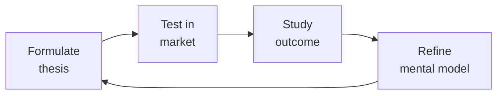

# Marketing Manager (Product Marketing Manager / PMM)

> **Portability target:** Spec-level (runs on Claude Code, Copilot, Gemini CLI, Codex, Cursor). No vendor-specific frontmatter fields.

Own product positioning, messaging, and go-to-market launches. Translate product capabilities into buyer-relevant narratives, arm sales with battle cards and pitch decks, manage analyst relations, and ensure every campaign starts from differentiated positioning — not generic category claims.

## Route the Request
<!-- QUICK: 30s -- auto-route first, then intent-route -->

### Auto-Route (No User Input Required)
Evaluate these file-system conditions in order. First match wins — jump immediately.

| # | Condition | Action |
|---|-----------|--------|
| A1 | `file_contains("*.docx", "positioning statement\|Positioning\|messaging framework\|Message House")` OR `file_contains("*.pptx", "Battle Card\|Pitch Deck\|competitive analysis\|launch plan")` OR `file_contains("*.xlsx", "pricing model\|packaging\|Van Westendorp\|pricing tier")`  | This is your skill. Jump to **Core Workflow** — Phase 1. |
| A2 | `file_contains("*.csv", "UTM\|campaign\|CPL\|ROAS\|ad spend\|Google Ads")` OR `file_contains("*.xlsx", "CAC\|lead scoring\|MQL\|SQL\|pipeline")`  | Invoke **demand-generation** instead. This is demand gen & paid acquisition work. |
| A3 | `file_contains("*.docx", "term sheet\|partnership model\|reseller\|JBP\|SIMCA")` OR `file_contains("*.xlsx", "partner revenue\|channel program\|deal registration")`  | Invoke **bizdev-manager** or **partnerships-manager** instead. This is partnership work. |
| A4 | `file_contains("*.pptx", "product roadmap\|feature matrix\|sprint plan\|engineering")` OR `file_contains("*.csv", "JIRA\|backlog\|user story\|sprint")`  | Invoke **product-strategist** or **product-manager** instead. This is product management work. |
| A5 | `file_contains("*.docx", "blog calendar\|content strategy\|editorial plan\|SEO keyword")` OR `file_contains("*.csv", "content performance\|blog traffic\|organic\|keyword rank")`  | Invoke **content-strategist** instead. This is content marketing work. |
| A6 | `file_contains("*.pptx", "Brand Guidelines\|logo system\|color palette\|typography hierarchy\|design system")` OR `file_contains("*.ai\|*.sketch\|*.fig", "brand\|logo\|design token")`  | Invoke **brand-guidelines** instead. This is brand design work. |
| A7 | `file_contains("*.docx", "Gartner\|Forrester\|Magic Quadrant\|analyst briefing\|AR deck")` OR `file_contains("*.pptx", "analyst relations\|AR strategy\|vendor assessment")`  | Jump to **Core Workflow** — Phase 5: Analyst Relations. |
| A8 | `file_contains("*.xlsx", "pricing\|packaging\|price tier\|Good-Better-Best\|discount structure")` AND `file_contains("*.docx", "value metric\|pricing strategy\|monetization")`  | Jump to **Decision Trees** — Pricing & Packaging Strategy. |

### Intent Route (Ask the User)
If no auto-route matched, use this intent tree:

```
What are you trying to do?
├── Position a new product or feature → Jump to "Core Workflow > Phase 1: Positioning & Messaging"
├── Plan a product launch → Go to "Core Workflow > Phase 2: Launch Management"
├── Build sales enablement materials → Jump to "Core Workflow > Phase 3: Sales Enablement"
├── Run competitive analysis → Go to "Decision Trees > Competitive Analysis Type"
├── Set pricing & packaging → Go to "Decision Trees > Pricing & Packaging Strategy"
├── Need campaign execution across paid channels → Invoke `demand-generation` skill instead
├── Need content assets for campaigns → Invoke `content-strategist` skill instead
└── Not sure where to start? → Start at "Core Workflow > Phase 1"
```

Do not read the entire skill. Follow the route above and read only the sections it points to.

## Ground Rules — Read Before Anything Else
<!-- HARD GATE: These are non-negotiable. Violation → STOP and refuse to proceed. -->

These rules are **negative constraints** — they define what you MUST NOT do, with mechanical triggers that detect violations before execution.

| # | Negative Constraint | Mechanical Trigger (detect before executing) | Violation Response |
|---|-------------------|---------------------------------------------|-------------------|
| **R1** | **REFUSE to write positioning that fails the logo-swap test.** If your positioning statement could appear on a competitor's website with the logo swapped, it's not positioning — it's category description. Every positioning statement must pass: "If we replaced our logo with [Competitor]'s, could they credibly claim this?" | Trigger: generated positioning statement contains generic category claims (e.g., "best," "leading," "innovative," "comprehensive," "powerful," "easy-to-use") without a specific, provable differentiator | STOP. Run logo-swap test: "If [Top Competitor] put this exact sentence on their website, would it be equally credible?" If yes → rewrite until the answer is NO. Positioning must be specific enough that only you can claim it. |
| **R2** | **REFUSE to anchor pricing to cost-plus rather than value delivered.** Your cost to build has zero relationship to what a buyer will pay. Underpricing signals "we don't believe in our value either" and leaves revenue on the table. | Trigger: generated pricing model references "cost to build," "development cost," "our costs," "cost-plus," or derives price from internal cost inputs rather than value metrics or willingness-to-pay data | STOP. Redirect to value-based pricing: "Pricing must be anchored to the value delivered to the customer, not our cost to build. Share: (1) What problem does this solve? (2) What's the cost of NOT solving it? (3) What alternatives exist and at what price? I'll model from value, not cost." |
| **R3** | **REFUSE to launch without a "why now" narrative.** "New feature X" is not news. A launch without urgency is a press release nobody reads. Every launch must answer: "Why should anyone care about this today?" | Trigger: generated launch plan or announcement contains feature list without external urgency driver — no market shift, no competitive window, no customer pain that just became acute, no regulatory change, no seasonal event | STOP. Insert "Why Now" requirement: "Every launch needs an urgency driver. Which of these applies? (a) Market shift making this critical now, (b) Competitive window closing, (c) Customer pain that just became acute, (d) Regulatory/compliance deadline. If none apply, defer the launch until one does." |
| **R4** | **STOP and require external buyer validation before scaling any messaging.** Your internal team fills gaps with product knowledge buyers don't have. Internal validation produces false confidence that collapses in market. | Trigger: generated messaging document references "internal feedback," "team review," "stakeholder alignment" as validation AND `file_contains("*.csv\|*.docx", "buyer interview\|customer validation\|prospect feedback\|messaging test")` returns 0 results | STOP. Respond: "Internal validation is not validation. Share results from 5-10 buyer interviews testing this messaging. If you don't have that data, I'll generate a messaging test protocol: 5 cold prospects, blank-slate reaction, 5-second comprehension test. Test before scaling." |
| **R5** | **REFUSE to build battle cards from internal opinions instead of win/loss data.** Your opinion of why you win is usually wrong. Internal bias fills gaps that real competitive dynamics don't support. | Trigger: generated battle card contains claims like "we win because," "our advantage is," "customers choose us for" AND `grep -rn "win/loss\|win-loss\|loss analysis\|deal outcome" *.csv *.xlsx` returns 0 competitive intelligence data | STOP. Respond: "Battle cards must be built from evidence, not opinion. Share win/loss interview data for at least 5 won deals and 5 lost deals against each competitor. Without this data, the battle card is fan fiction. I'll generate an interview protocol to collect it." |
| **R6** | **DETECT and WARN about pricing changes announced without a communication runway.** Surprise price increases trigger churn, customer outrage, and competitor poaching. | Trigger: generated pricing change announcement has effective date < 90 days from announcement AND affects existing customers AND `grep -rn "grandfather\|grace period\|legacy pricing\|existing customer" *.docx` returns 0 | WARN: Insert communication requirements: "Price increases >15% need ≥90-day notice. Grandfather existing customers for ≥12 months. Communicate value-add, not just price change. Prepare: customer FAQ, AE talking points, competitive response playbook. Surprise price changes create churn vector." |
| **R7** | **DETECT and WARN about briefing analysts on features instead of strategy and vision.** Analysts score vision and execution — features are table stakes. Feature-focused briefings result in lower-than-expected Gartner/Forrester placements. | Trigger: generated analyst briefing deck has > 50% slides focused on features, product screenshots, or technical capabilities AND < 30% focused on market vision, customer momentum, and roadmap | WARN: Restructure deck: "Analyst briefing structure: (1) Market vision & trends (25%), (2) Customer momentum — logos, growth rate, NPS (25%), (3) 12-month roadmap (20%), (4) Differentiation & competitive position (20%), (5) Features (10%). Analysts evaluate vision and execution — features are supporting evidence, not the headline." |


## The Expert's Mindset

Master marketing managers understand that strategy is not about predicting the future — it's about **being less wrong than the competition, faster**.

| Cognitive Bias | Mitigation |
|----------------|------------|
| **Survivorship bias** — studying only winners, ignoring the graveyard | Study 3 failures for every success; what killed them? |
| **Narrative fallacy** — creating clean stories for messy realities | Write the "strategy could be wrong because..." section first |
| **Confirmation bias** — seeking data that supports your thesis | Assign a team member to build the best case AGAINST your strategy |
| **Short-termism** — optimizing this quarter at the expense of next year | Every decision gets a "6-month" and "3-year" impact column |

### What Masters Know That Others Don't
- **The bottleneck is always one thing.** Find it. Fix it. Then find the next one.
- **Strategy = what you say NO to.** If your strategy doesn't exclude anything, it's not a strategy.
- **Timing beats brilliance.** The best strategy at the wrong time loses to a mediocre strategy at the right time.

### When to Break Your Own Rules
- **Bet the company when the asymmetry is right.** If downside = $1M and upside = $1B, the math doesn't care about your process.
- **Ignore the data when you're creating a new category.** By definition, there's no data for something that doesn't exist yet.
## Operating at Different Levels

| Level | Scope | You... |
|-------|-------|--------|
| **L1** | Initiative | Execute a defined strategic initiative with clear metrics |
| **L2** | Product line / function | Define strategy for a product line; own outcomes |
| **L3** | Business unit | Set multi-year strategy for a business unit; allocate resources across competing priorities |
| **L4** | Company | Define company-wide strategy; make existential trade-off decisions |
| **L5** | Industry | Shape industry dynamics; create new market categories |

**Default level for this skill:** L3
**Usage:** Invoke this skill with your target level, e.g., "as an L3 marketing manager, develop..."

For full level definitions, see `skills/00-framework/skill-levels/SKILL.md`.

## When to Use
<!-- QUICK: 30s -- scan the bullet list to decide if this skill fits -->

- A product or feature needs positioning, messaging, and a go-to-market launch plan
- Sales team is losing deals and needs updated battle cards, pitch decks, and competitive rebuttals
- The company needs a pricing and packaging review — current model isn't capturing value
- A Gartner Magic Quadrant or Forrester Wave evaluation is approaching — need analyst briefing prep
- Buyer personas are stale or based on assumptions — need research-driven persona refresh
- A new market segment or vertical is being entered — need segment-specific positioning
- Brand awareness is strong but demand isn't converting — need brand-to-demand connection strategy
- Competitor just raised $50M or launched a major feature — need competitive response strategy

## Decision Trees
<!-- QUICK: 30s -- follow the ASCII tree to your scenario -->

### Competitive Analysis Type

```
                              ┌──────────────────────────────┐
                              │ START: What competitive       │
                              │ analysis do you need?         │
                              └────────────┬─────────────────┘
                                           │
                         ┌─────────────────▼─────────────────┐
                         │ What is the purpose?              │
                         └────┬──────────────┬───────────────┘
                              │              │
                    ┌─────────▼──────┐  ┌────▼──────────────┐
                    │ Sales/Deal use │  │ Strategic/Product  │
                    │ (battle cards, │  │ (roadmap,          │
                    │ objection      │  │ positioning,       │
                    │ handling)      │  │ market entry)      │
                    └────┬───────────┘  └────┬───────────────┘
                         │                   │
              ┌──────────▼──────┐   ┌────────▼──────────────┐
              │ Competitive     │   │ Full Competitive       │
              │ Battle Card     │   │ Landscape Analysis    │
              │ Format:         │   │ Format:               │
              │ • Their strength│   │ • Market share est.   │
              │ • Their weakness│   │ • Feature comparison  │
              │ • Our positioning│  │ • G2/Capterra analysis│
              │ • Trap questions │   │ • Win/loss patterns  │
              │ • Proof points  │   │ • Pricing comparison  │
              │ • Customer      │   │ • Strategic           │
              │   evidence      │   │   recommendations     │
              └─────────────────┘   └───────────────────────┘
```
**Battle Card use:** AE is going into a deal where Competitor X is named. They need: "Here's what they'll say. Here's how you respond. Here's the trap question to ask."

**Landscape Analysis use:** You're entering a new market, launching a new product, or preparing for an analyst briefing. You need: "Here's everyone in the space, where they play, where we win, where we don't."

### Persona Development

```
                              ┌──────────────────────────────┐
                              │ START: New persona needed?    │
                              └────────────┬─────────────────┘
                                           │
                         ┌─────────────────▼─────────────────┐
                         │ Do you have primary research       │
                         │ (10+ interviews with this role)?   │
                         └────┬──────────────────────────┬───┘
                              │ NO                        │ YES
                              ▼                           ▼
                      ┌──────────────┐          ┌──────────────────────┐
                      │ STOP.        │          │ Build persona:        │
                      │ Commission   │          │ 1. Day-in-the-life    │
                      │ 10-15        │          │    narrative          │
                      │ customer/    │          │ 2. Goals & metrics    │
                      │ prospect     │          │    they're measured on│
                      │ interviews   │          │ 3. Pain points ranked │
                      │ before       │          │    by severity        │
                      │ building.    │          │ 4. Buying triggers    │
                      │ Assumptions  │          │ 5. Information sources│
                      │ become       │          │ 6. Objections they    │
                      │ stereotypes. │          │    raise              │
                      └──────────────┘          │ 7. Preferred channels │
                                                │ 8. "Jobs to be done"  │
                                                └──────────────────────┘
```
**Research before personas:** Never build personas from internal assumptions. Interview 10-15 people in the target role. Ask: "Walk me through yesterday. What was your biggest frustration? How are you measured? What did you research last? Who do you ask for advice on purchases like this?"

**Valid persona:** "VP of Engineering at 200-500 person SaaS company. Measured on: velocity, uptime, cost. Pain: developer onboarding takes 6 weeks. Trigger: board mandated 30% faster time-to-market. Reads: Hacker News, Stratechery, CTO Craft newsletter. Objection: 'We could build this internally.'"

### Pricing & Packaging Strategy

```
                              ┌──────────────────────────────┐
                              │ START: New pricing strategy?  │
                              └────────────┬─────────────────┘
                                           │
                         ┌─────────────────▼─────────────────┐
                         │ What's the primary purchase unit? │
                         └────┬──────────────┬───────────────┘
                              │              │
                   ┌──────────▼────┐  ┌──────▼────────────┐
                   │ User/Seat     │  │ Usage/Volume      │
                   │ based         │  │ based             │
                   └──────┬────────┘  └──────┬────────────┘
                          │                  │
               ┌──────────▼──────┐  ┌────────▼────────────┐
               │ 1. Per-seat +   │  │ 1. Freemium tier    │
               │    platform fee │  │    (free up to X)   │
               │ 2. Tiered seats │  │ 2. Good-Better-Best │
               │    (Pro/Ent)    │  │    tiers by volume  │
               │ 3. Feature-based│  │ 3. Overage charges  │
               │    upsells      │  │    or auto-upgrade  │
               └─────────────────┘  └─────────────────────┘
```
**Pricing validation checklist:**
- [ ] Van Westendorp Price Sensitivity Meter survey with 100+ target buyers
- [ ] Competitive pricing indexed — are you premium, parity, or discount?
- [ ] Unit economics verified: CAC payback < 12 months at target price point
- [ ] Willingness-to-pay interview: "At what price would you consider this too expensive? Too cheap?"
- [ ] 3-tier pricing (Good-Better-Best) with a "most popular" anchor
- [ ] Annual discount ≥ 15% vs monthly — incentivize commitment
- [ ] Enterprise tier with "Contact Sales" — price opacity for $50K+ deals

## Core Workflow
<!-- QUICK: 30s -- scan phase titles to understand the process -->

<!-- DEEP: 10+min -->

### Phase 1 (~45 min): Positioning & Messaging

Positioning is the single sentence that defines who you're for, what you do, and why you're different. Start with the positioning template: "For [target buyer] who [pain/need], [Product] is the [category] that [key benefit/differentiator]. Unlike [competitors], we [unique advantage]." Test it against the logo-swap test. Then build the messaging house: (1) Umbrella value prop — one sentence, (2) 3 Pillars — each pillar has a headline, 2-3 proof points, and a customer story, (3) Tagline — memorable, 5-7 words, (4) Boilerplate — 100-word company description. Validate with 5-10 target buyers: "In your own words, what does this company do?" If they can't articulate it clearly, iterate. Document the final messaging in a single source of truth — the messaging document that every team references.

<!-- DEEP: 10+min -->

### Phase 2 (~90 min): Launch Management

Define the launch tier: Tier 1 (company-defining — all hands, major PR, analyst tour, customer event), Tier 2 (significant feature — blog, email, social, sales enablement), Tier 3 (minor update — changelog, in-app notification). Build a launch plan with: (1) Launch narrative & key messages, (2) Target audience segments with channel plan, (3) Asset checklist: blog post, press release, pitch deck update, battle card update, demo update, website update, social posts, customer email, (4) Timeline with owner per asset and dependencies called out, (5) Internal comms: Slack announcement, all-hands slot, sales training session, (6) Success metrics: awareness (press mentions, social reach), engagement (blog views, demo requests), pipeline ($ influenced within 30/60/90 days). Hold a launch readiness review 1 week before: every asset reviewed, every owner confirmed, every dependency green. Post-launch retro within 2 weeks: what worked, what didn't, pipeline impact.

<!-- DEEP: 10+min -->

### Phase 3 (~30 min): Sales Enablement

Sales enablement means: when an AE opens their laptop Monday morning, they have everything they need to sell effectively. Build and maintain: (1) Pitch deck — 10-12 slides max, problem-forward not product-forward, 1 data point per slide, strong close with CTA, (2) Battle cards — 1 per competitor, updated quarterly, format: their strengths (be honest), their weaknesses (with evidence), our positioning (reframe, don't trash), trap questions to ask, trap questions they'll ask, customer evidence (logos, quotes, case study links), (3) One-pagers — 1 per use case or vertical, hook at top, 3 bullets on value, customer logo row, CTA, (4) Discovery questions — 10 questions per buyer persona to uncover pain, (5) ROI calculator — simple inputs, credible outputs, vetted by finance, (6) Competitive displacement kit — for when competitor is the incumbent: migration guide, TCO comparison, "why switch" deck. Train sales: 30-minute lunch-and-learn on every new asset. Record it. Track asset usage: what's being opened, what's gathering digital dust.

<!-- DEEP: 10+min -->

### Phase 4 (~30 min): Campaign Brief

Write campaign briefs that demand generation can execute without back-and-forth. Structure: (1) Campaign objective — one sentence. "Generate 200 MQLs in financial services segment within 90 days." (2) Target audience — specific persona, segment, pain trigger. (3) Core message — the one thing we want them to remember. (4) Offer — what value are we providing in exchange for their attention/contact info? (5) Channel mix — which channels, why, budget allocation per channel. (6) Asset requirements — what needs to be built (landing page, ebook, webinar, ads, email sequences). (7) Success metrics — MQL target, MQL→SQL conversion target, pipeline target, CAC target. (8) Timeline — launch date, campaign duration, key milestones. (9) Handoff checklist — what demand gen needs from you before they can start. Review the brief with the demand generation lead before locking it. A bad brief creates 3 rounds of revision and a delayed launch.

<!-- DEEP: 10+min -->

### Phase 5 (~45 min): Analyst Relations

Analyst relations (AR) is a long game, not a deal-sprint. Strategy: (1) Identify the 2-3 analyst firms that matter for your category (Gartner, Forrester, IDC — but also category-specific analysts). (2) Build relationships with the analysts who cover your space — quarterly check-ins, not just evaluation-time panic. Share roadmap directionally, customer wins, market observations. (3) For Magic Quadrant / Forrester Wave evaluations: start 6 months before the research cycle begins. Align your product roadmap messaging to the evaluation criteria. Brief the analyst on your vision, not just your features. Submit responses that are concise, evidence-backed, and customer-validated. (4) Customer references for analysts: hand-pick 3-5 reference customers who will say you're strategic, not tactical. Prepare them with a briefing doc. (5) Post-evaluation: regardless of placement, publish a response. If you placed well, amplify. If not, acknowledge the feedback and share your plan. Analysts reward transparency. Track: analyst mentions, report placements, inquiry volume, and deal influence from analyst references.

## Best Practices
<!-- STANDARD: 3min -- rules extracted from production experience -->
<!-- DEEP: 10+min -- these rules encode years of positioning failures, launch disasters, and analyst snubs -->

- Run the "logo swap test" on every positioning statement: if a competitor can say the same thing by swapping their name for yours, rewrite it. Differentiated positioning is irreplaceable.
- Every launch asset must have one owner and one deadline. Co-ownership means no ownership. Track on a single spreadsheet or project board visible to all stakeholders.
- Never build a battle card without win/loss data. Your opinion of why you win is likely wrong. Interview 5 won deals and 5 lost deals against each competitor. The patterns will surprise you.
- Pricing changes that increase revenue per customer by >15% need a 90-day communication runway. Surprise price increases trigger churn. Grandfather existing customers for 12 months minimum.
- Analyst briefings are presentations to a jury, not a product demo. Lead with market vision, customer evidence, and momentum. Product features come last. Analysts evaluate your strategy, not your UI.
- Segment your messaging by persona but maintain a single brand voice. A CTO and a VP of Sales should both recognize the same company — they just hear different parts of the story.
- The "why now" of a launch is more important than the "what." Every launch must answer: "Why should anyone care about this today?" If you can't answer it, it's not ready to launch.
- Maintain a swipe file of competitor marketing — their homepage, pricing page, latest blog posts, job listings (hiring patterns reveal strategy). Review monthly. You'll spot shifts before they happen.
- Use the "messaging house" framework consistently: Umbrella → Pillars → Proof Points. If a message doesn't ladder up to a pillar, it's clutter. Cut it.
- Campaign briefs that are approved in one review cycle save 2 weeks of launch delay. Invest time in the brief — it's the blueprint demand gen follows. Ambiguity in the brief = waste in execution.

## Anti-Patterns
<!-- DEEP: 5min -- each anti-pattern includes machine-detectable patterns -->

| ❌ Anti-Pattern | ✅ Do This Instead | 🔍 Detect (grep / lint) | 🛡️ Auto-Prevent |
|-----------------|---------------------|--------------------------|-------------------|
| Writing positioning that a competitor could claim by swapping their logo for yours — "best," "leading," "innovative," "comprehensive" | Run logo-swap test on every positioning statement. If [Top Competitor] can credibly claim the same thing, rewrite until only you can. Differentiated positioning is irreplaceable — generic positioning is invisible. | `grep -rn "best\|leading\|innovative\|comprehensive\|powerful\|easy-to-use\|cutting-edge" *.pptx *.docx` → finds generic positioning words that fail logo-swap test | Positioning template: every statement must include a "because" clause — "We are [X] because [specific proof]. We are the only company that [unique claim]." Generic adjectives without proof → template validation fail. |
| Launching without a "why now" narrative — feature announcements without urgency generate zero pipeline | Every launch must answer: "Why should anyone care about this today?" Build urgency with market shift, competitive window, customer pain that just became acute, or seasonal event. No "why now" = no launch. | `grep -rn "launch\|Launch\|announcing\|Introducing" *.pptx *.docx -l \| xargs grep -L "why now\|urgency\|market shift\|today\|deadline\|window"` → finds launch plans without urgency driver | Launch planning template: "Why Now" field is mandatory. Gate blocks launch approval if field is empty or contains only "new feature available." Auto-escalate to VP Marketing for override. |
| Building battle cards from internal opinions instead of win/loss data — your opinion of why you win is usually wrong | Interview 5 won deals and 5 lost deals against each competitor. The patterns will surprise you. Build battle cards from evidence — direct quotes, pricing scenarios, evaluation criteria — not conjecture. | `grep -rn "we win because\|customers choose us\|our advantage\|we beat" *.pptx *.docx -l \| xargs grep -L "win/loss\|deal outcome\|loss reason\|customer interview"` → finds opinion-based battle cards | Battle card template: every claim must link to a win/loss data point. "We win when [X] — evidence: 5 won deals cited [X] as primary reason. Lost 3 deals to [Competitor] when [Y] was missing." Unlinked claims → template validation error. |
| Testing messaging internally and calling it validated — your team fills gaps with knowledge buyers don't have | Test messaging with cold prospects, not existing customers or employees. Blank-slate reaction is the only test that matters. If they can't articulate what you do in 5 seconds, rewrite. | `grep -rn "internal review\|team feedback\|stakeholder sign-off\|tested internally" *.docx -l \| xargs grep -L "buyer interview\|prospect test\|customer validation\|external test"` → finds messaging validated only internally | Messaging validation gate: require ≥ 5 external buyer interview recordings or transcripts. Internal-only validation → blocked. Auto-generate test protocol: 5 cold prospects, 5-second comprehension, blank-slate reaction. |
| Letting competitive monitoring lapse to quarterly or event-driven cadence — you react to launches, not anticipate them | Track competitor job listings, pricing page changes (archive.org), leadership blog posts, and Glassdoor reviews monthly. Hiring patterns reveal strategy 6 months before launch. | `grep -rn "competitor\|Competitor\|competitive" *.xlsx *.csv \| grep -v "monthly\|month\|weekly\|cadence\|tracking"` → finds competitor analysis without monitoring cadence | Competitive monitoring calendar: monthly recurring task with checklist — website, pricing page, job listings, blog, press releases, Glassdoor. Auto-flag if no update in 30 days. |
| Announcing pricing changes without a 90-day communication runway — surprise increases trigger churn and competitor poaching | Price increases >15%: 90-day notice. Grandfather existing customers 12+ months. Communicate value-add, not just price change. Prepare customer FAQ, AE talking points, and competitive response playbook. | `grep -rn "price increase\|Price Increase\|pricing change\|new pricing" *.docx -l \| xargs grep -L "90.day\|grandfather\|grace period\|notice period\|existing customer"` → finds price changes without transition plan | Pricing announcement template: "Notice Period" (≥90 days), "Grandfathering" (≥12 months), "Value Communication" (required). Missing fields → template validation fail. |
| Co-owning launch assets with no single owner — deadlines slip, stakeholders point fingers, launch ships incomplete | Every launch asset has one owner and one deadline. Track on a single spreadsheet visible to all stakeholders. No shared ownership cells. Daily standup last 5 days before launch. | `grep -rn "shared owner\|co-owner\|team owns\|marketing + product\|joint ownership" *.xlsx *.csv` → finds assets with ambiguous ownership | Launch tracker template: each row has exactly one "Owner" cell (validated: no commas, no "and," no "team"). Daily status email auto-generated from tracker for T-7 to T-0 days. |


## Cross-Skill Coordination
<!-- QUICK: 30s -- table of who to talk to when -->

| Coordinate With | When | What to Share/Ask |
|-----------------|------|-------------------|
| **Product Manager** | Feature launches, roadmap alignment, competitive gaps | Product capabilities, roadmap timeline, beta customer access, feature priorities |
| **Business Strategist** | Market entry, pricing strategy, GTM planning | TAM/SAM/SOM data, business model, revenue targets, market segmentation |
| **Demand Generation** | Campaign execution, paid media, lead gen programs | Campaign briefs, target audience, messaging, asset requirements, MQL targets. **Decision gate:** Does campaign messaging pass logo-swap test? → launch ready. **Artifact:** campaign brief with positioning framework. |
| **Content Strategist** | Content marketing assets, blog, ebooks, webinars | Messaging framework, buyer personas, campaign themes, SEO keywords. **Decision gate:** Does content map to a specific buyer journey stage? → publish. **Artifact:** content calendar with persona-to-asset mapping. |
| **Sales Engineer** | Battle cards, demo narratives, competitive positioning | Win/loss data, technical differentiators, customer evidence, objection patterns. **Decision gate:** Is battle card updated within 2 weeks of competitor launch? → sales-ready. **Artifact:** battle card + demo narrative script. |
| **UX Researcher** | Persona research, messaging validation, buyer behavior | Research findings, persona insights, buyer journey mapping |
| **CEO Strategist** | Company positioning, major launches, pricing changes | Strategic narrative, investor messaging, company-level positioning |
| **Growth Engineer** | Messaging A/B tests, landing page CRO, conversion optimization | Variant messaging, hypothesis, experiment results, conversion data |
| **BizDev Manager** | Co-marketing agreements, partner GTM campaigns | Partner positioning, co-branding guidelines, joint campaign briefs. **Decision gate:** Is partner brand compatible (no conflicting positioning)? → co-market. **Artifact:** co-marketing agreement + joint campaign plan. |
| **Product Strategist** | Product vision, market category definition, competitive landscape | Category-level positioning, buy-vs-build analysis, market timing. **Decision gate:** Is the product in an existing category or creating a new one? → positioning strategy diverges. **Artifact:** category analysis + positioning recommendation. |
| **Product Marketing Manager** | Product-level launch execution, feature-level messaging | Feature briefs, launch checklists, sales enablement for specific products. **Decision gate:** Is product-level messaging derivative of company positioning? → aligned. **Artifact:** product launch kit (messaging, battle cards, demo assets). |

### Communication Triggers — When to Proactively Notify

| Trigger | Notify | Why |
|---------|--------|-----|
| Competitor raises $50M+ or launches major feature that threatens positioning | CEO Strategist, Product Manager, Sales Engineer | Competitive response strategy; messaging update within 1 week |
| Launch asset misses deadline that cascades into launch delay | All launch stakeholders, VP of Marketing | Launch date recalibration; expectation reset |
| Messaging tests poorly with target buyers (<30% comprehension or recall) | Product Manager, Content Strategist, Demand Generation | Stop campaign spend; fix messaging before scaling |
| Pricing change causes >5% churn in the first 60 days | CEO Strategist, Product Manager, Customer Success | Pricing rollback or adjustment; customer retention intervention |
| Analyst evaluation places company lower than expected | CEO Strategist, VP Sales, Product Manager | Response strategy; factual error check; customer reference mobilization |

### Escalation Path

```
Positioning/GTM strategic conflict → CEO Strategist + VP Product. Decision within 1 week.
Competitive threat requiring repositioning → CEO Strategist + VP Sales + Product Manager. Response within 2 weeks.
Pricing change with >$1M revenue impact → CEO Strategist + CFO. Board visibility required.
Analyst evaluation outcome materially negative → CEO Strategist + VP Product + Board. Formal response within 48 hours.
```

### Cross-skills Integration

```bash
# Chain: product-manager → marketing-manager → demand-generation
# New feature launch: PM defines feature → PMM positions, builds launch assets → Demand gen executes campaign

# Chain: business-strategist → marketing-manager → content-strategist
# Market entry: Business strategist defines GTM → PMM builds segment positioning → Content strategist creates assets

# Chain: marketing-manager → sales-engineer
# Sales enablement: PMM builds battle cards & pitch decks → SE uses in demos and provides feedback loop
```

## Proactive Triggers
<!-- QUICK: 30s -- when to proactively notify stakeholders -->

| Trigger | Notify | Why |
|---------|--------|-----|
| Competitor raises $50M+ or launches major feature that threatens core positioning | CEO Strategist, Product Manager, Sales Engineer, Demand Generation | Competitive response strategy needed within 1 week; messaging update, battle card refresh, and sales enablement before deals are lost |
| Messaging tests below 30% comprehension or recall with target buyers | Product Manager, Content Strategist, Demand Generation | Stop campaign spend immediately; messaging is broken at the foundation. Fix positioning before scaling distribution |
| Pricing change causes >5% churn in the first 60 days | CEO Strategist, Product Manager, Customer Success Manager, RevOps Manager | Pricing rollback or adjustment decision; customer retention intervention; grandfathering extension consideration |
| Analyst evaluation places company significantly lower than previous cycle | CEO Strategist, VP Sales, Product Manager | Response strategy within 48 hours; factual error check, customer reference mobilization, and re-briefing preparation |
| Strategic customer publicly endorses a competitor or appears in competitor case study | CEO Strategist, Sales Engineer, Customer Success Manager | Competitive displacement risk across the account base; win-back strategy and reference customer defense |
| Launch asset misses deadline that cascades into full launch delay | All launch stakeholders, VP Marketing | Launch date recalibration; stakeholder expectation reset; root cause analysis on why deadline was missed |
| Market category definition shifts (analyst redefinition, new entrant creating category, regulatory change) | CEO Strategist, Product Strategist, Business Strategist | Positioning may need fundamental repositioning; category-level strategy review within 2 weeks |
| Competitor hiring patterns signal entry into your market segment (5+ relevant job listings in 30 days) | CEO Strategist, Product Manager, Business Strategist | New competitive threat forming; pre-emptive positioning and sales enablement before competitor launches |

## Scale Depth: Solo → Small → Medium → Enterprise
<!-- DEEP: 10+min -- how this skill changes as the company grows -->

### Solo
Founder does marketing — content, social, website. Build the brand from zero, find PMF messaging. No dedicated marketer; scrappy experiments; founder is the voice. Focus on learning which channels and messages resonate with the earliest customers.

### Small Team
Generalist marketer covers all channels, first campaigns. Establish marketing function, build pipeline. One person does content, email, social, events, and product marketing. Every campaign teaches something about the ICP and the channels that work.

### Medium Team
Specialist team (content, demand gen, product marketing, brand). Deepen each function, build scalable programs. Each channel has a dedicated owner; marketing ops formalized. Consistent messaging enforced across all touchpoints with documented playbooks.

### Enterprise
CMO + departments, multi-region, brand governance. Category leadership, global consistency. Marketing org of 50+; brand guidelines enforced globally; $5M+ budgets. Regional teams with localized messaging that still fits the global brand narrative.

### Transition Triggers
- **Solo → Small Team:** Marketing spend exceeds $5K/month or pipeline from marketing activities reaches 15% of total pipeline and can no longer be managed as a side job.
- **Small Team → Medium Team:** Marketing team exceeds 3 people and channel volume requires dedicated owners per function.
- **Medium Team → Enterprise:** Operating in 3+ regions or $50M+ ARR requires dedicated brand governance and regional marketing leadership.


## What Good Looks Like
<!-- QUICK: 30s -- concrete success description -->

Positioning passes the logo-swap test — no competitor can say the same thing. Messaging validated with 10+ target buyers with >80% comprehension and recall. Launch plan has one owner per asset, clear deadlines, and ships on time. Battle cards updated within 2 weeks of any competitor launch. Pricing validated with Van Westendorp survey (n > 100) and CAC payback < 12 months. Analyst briefings result in improved report placement or at minimum, factual accuracy. Campaign briefs approved in one review cycle. Sales team can articulate the positioning and top 3 differentiators without looking at a slide.

## Error Decoder
<!-- DEEP: 5min -- each entry includes a console-string matcher for automatic recovery loops -->

| 🖥️ Console Match (grep pattern) | Symptom | Root Cause | Fix | 🔄 Auto-Recovery Loop |
|---|---|---|---|---|
| `grep -rn "best\|leading\|innovative\|comprehensive\|powerful\|cutting-edge" *.pptx *.docx \| wc -l` → > 5 generic adjectives; `grep -rn "only company\|unlike any\|first to\|because[^-]" *.pptx *.docx \| wc -l` → 0 differentiated claims | Launch generates zero pipeline after 30 days. PR was picked up by 3 outlets. Website traffic spiked for 2 days then returned to baseline. Zero inbound demo requests. | Launch was a feature announcement — "Introducing X, our new Y" — not a buyer-relevant narrative. Positioning used generic category language ("best," "leading," "innovative") that no buyer can differentiate from competitors. No "why now." No offer. | Rewrite launch as: (1) Market shift creating urgency, (2) Specific customer pain this solves, (3) Why only you can solve it, (4) Compelling offer (assessment, trial, benchmark report). Pure announcements have 0% conversion — every launch needs an action driver. | 1. Run logo-swap test: `grep -rn "positioning\|Positioning Statement" *.pptx *.docx` 2. For each claim, test: "Could [Top 3 Competitor] say the same thing?" 3. Rewrite any claim that passes the logo-swap test 4. Add offer: trial, assessment, ROI calculator, benchmark report 5. Measure: inbound demo requests within 30 days of launch. < 5 → launch failed, run post-mortem |
| `grep -rn "battle card\|Battle Card\|competitive" *.pptx *.docx -l \| xargs grep -L "win/loss\|deal outcome\|loss reason\|customer said" \| wc -l` → returns > 0 | Sales team doesn't use the battle cards you built. AEs say "they're too generic" and "don't match what actually happens in deals." Battle cards sit unused in the shared drive. | Battle cards were built from internal opinions and product marketing assumptions, not win/loss data. Claims like "we win because we're easier to use" don't match how AEs actually win or lose deals. | Rebuild as 1-pagers from win/loss data: 5 bullet "They Say / You Say" from real deal conversations, 3 trap questions, 1 kill line. Test with 3 AEs. If they don't use it spontaneously after 1 week, it's wrong. | 1. Collect win/loss data: `scripts/collect-winloss.sh` — surveys AEs for last 5 won + 5 lost deals per competitor 2. Identify patterns: clustering of win reasons and loss reasons 3. Build 1-pager: 5 They Say/You Say pairs, 3 trap questions, 1 kill line 4. Pilot with 3 AEs for 1 week 5. Measure: usage log shows >3 AEs accessed card in week 1. If not → back to step 1 |
| `grep -rn "pricing\|Pricing\|price tier" *.pptx *.xlsx -l \| xargs grep -L "value metric\|willingness to pay\|Van Westendorp\|conjoint\|customer research"` → pricing based on internal inputs, not buyer data | Pricing page gets traffic but conversion is flat. Sales reports "your price is too high" but discounts don't increase close rate. Competitor launched a lower-priced tier and you're hemorrhaging deals. | Pricing doesn't communicate value differentiation. It's a feature/price comparison — buyers evaluate on price alone because there's no value narrative. Pricing was set via cost-plus or competitor-minus-X%, not value delivered. | Add ROI content above the fold on pricing page. Include "Why customers choose us at this price" section. Run Van Westendorp pricing survey (n > 100). A/B test showing value before price vs price first. | 1. Audit pricing page: `grep -rn "pricing\|price" *.pptx *.docx` — does value appear before price? 2. Add ROI calculator: customer quote + savings/impact metric per tier 3. Run Van Westendorp: `scripts/van-westendorp.sh` — prompts for 4 price questions, outputs optimal price range 4. A/B test: Value-first vs Price-first landing page 5. Measure: conversion rate change. If no lift → pricing is wrong, not just the page |
| `grep -rn "analyst\|Analyst\|Gartner\|Forrester\|briefing" *.pptx *.docx -l \| xargs grep -c "vision\|strategy\|market\|momentum\|roadmap"` → vision/strategy content < 30% of deck; `grep -c "feature\|Feature\|product screenshot\|demo" *.pptx` → feature content > 50% | Analyst report places you lower than expected despite feature parity. Competitor with fewer features scored higher. Your CEO is furious and wants to "appeal." | You briefed features, not strategy and vision. Analysts score vision completeness and execution ability — features are table stakes, not differentiators. Feature-heavy briefings make you look like a point solution, not a platform. | Re-brief leading with: (1) Market vision — where the category is going, (2) Customer momentum — logos, growth rate, NPS, (3) 12-month roadmap, (4) Differentiation. Features come last. Schedule quarterly touchpoints — not just evaluation-time panic. | 1. Audit latest analyst deck: `grep -c "slide" *.pptx \| head -1` — count total slides. Count feature slides: `grep -c "feature\|Feature\|screenshot\|demo\|capability" *.pptx` 2. Restructure: vision 25%, momentum 25%, roadmap 20%, differentiation 20%, features 10% 3. Schedule quarterly touchpoints with top 3 analyst firms 4. Pre-briefing run-through with internal executive (not marketing) for "jury" feedback |
| `grep -rn "competitor\|Competitor\|competitive" *.xlsx *.csv \| wc -l` → < 5 records in last 30 days; `grep -rn "job listing\|hiring\|careers page\|Glassdoor" *.csv \| wc -l` → 0 monitoring of competitor hiring | Competitor launches a new product that directly competes with your flagship. Your team is blindsided. CEO asks "how did we not see this coming?" Sales has no response and 3 deals stall. | No competitive monitoring cadence. You're reacting to public launches, not anticipating them. Competitor hiring patterns (engineering roles, new office locations, product-specific hires) revealed this move 6 months ago. | Track competitor job listings (LinkedIn, careers page), pricing page changes (archive.org snapshots), leadership blog posts, and press mentions monthly. Hiring patterns reveal strategy 6-12 months before launch. | 1. Set up monitoring: `scripts/competitor-monitor.sh` — scrapes job listings, pricing pages, blog RSS for top 5 competitors 2. Monthly: review report for: (a) new job categories, (b) pricing page changes, (c) leadership hires, (d) funding/partnership announcements 3. Maintain competitive intel log: `competitive-intel.csv` with date, competitor, signal, interpretation 4. Quarterly: synthesize intel into strategy implications memo for exec team |


## Production Checklist
<!-- QUICK: 30s -- binary pass/fail items. Each has a mechanical validation command. -->

| ID | Checklist Item | Validation Command | Auto-Fix |
|----|---------------|-------------------|----------|
| **[S1]** | Positioning statement passes the logo-swap test — no competitor can say the same thing | `grep -rn "best\|leading\|innovative\|comprehensive\|powerful\|cutting-edge" *.pptx *.docx \| wc -l` → must return 0 generic claims without proof; `grep -rn "because\|only company\|unlike" *.pptx *.docx \| wc -l` → must return ≥3 differentiated anchors | Positioning template: every claim requires a `because` clause. Template validates `differentiated_claim_count ≥ 3` and `generic_adjective_count == 0` |
| **[S2]** | Messaging validated with 10+ target buyers — >80% comprehension and recall on blank-slate test | `grep -rn "buyer interview\|prospect test\|external validation" *.csv *.docx \| wc -l` → must return ≥10 test records; `grep -rn "comprehension\|recall rate" *.csv \| awk -F',' '{if($2<80) print "FAIL"}'` → must return empty | Messaging validation gate: require ≥10 external buyer test transcripts. Block campaign launch if `external_test_n < 10` or any comprehension rate <80% |
| **[S3]** | Buyer personas built from primary research (10+ interviews), not internal assumptions | `grep -rn "persona\|Persona\|buyer profile\|ICP" *.docx *.pptx -l \| xargs grep -L "interview\|research quote\|validated with"` → must return empty — every persona must cite sources | Persona template: `source` field required per persona (interview transcript links). CI rejects personas with 0 external sources |
| **[S4]** | Competitive battle cards exist for top 3 competitors — updated quarterly with win/loss data | `ls battle-cards/*.pptx battle-cards/*.docx \| wc -l` → must be ≥3; `find battle-cards/ -mtime -90 \| wc -l` → all must be updated within 90 days; `grep -L "win/loss\|deal interview\|loss reason" battle-cards/*.pptx` → must return empty | Quarterly cron: `scripts/battle-card-audit.sh` — check freshness, flag cards >90 days stale, auto-assign refresh to PMM owner |
| **[S5]** | Pricing validated with Van Westendorp survey (n > 100) and CAC payback < 12 months | `grep -rn "Van Westendorp\|price sensitivity\|survey n" *.xlsx \| awk -F',' '{if($2<100) print "FAIL: n<100"}'` → must return empty; `grep -rn "CAC payback\|payback months" *.xlsx \| awk -F',' '{if($2>=12) print "FAIL"}'` → must return empty | Pricing validation gate: block price change approval if `survey_n < 100` or `cac_payback_months ≥ 12` |
| **[S6]** | Launch plan includes: "why now" narrative, target audience, asset checklist, timeline with single owners, success metrics | `grep -rn "why now\|target audience\|asset checklist\|timeline\|owner\|success metrics" *.docx` → must return ≥6 required fields | Launch plan template: all 6 fields required. CI validates no empty fields. Auto-reject plans with `TBD` or `???` in any required field |
| **[S7]** | Every launch has a "why now" narrative — pure feature announcements blocked at approval gate | `grep -rn "why now" *.docx -A 2 \| grep -c "because the feature is ready\|feature is now available\|now available"` → must return 0. `grep -c "why now" *.docx \| awk -F':' '{if($2<50) print "WHY NOW TOO SHORT"}'` → minimum 50 characters | Launch approval gate: `why_now` field required, minimum 50 chars, must contain market/competitive context. Auto-reject if only "feature is ready" |
| **[S8]** | Sales pitch deck is ≤12 slides, problem-forward, with 1 data point per slide | `python -c "from pptx import Presentation; p=Presentation('pitch-deck.pptx'); print(len(p.slides))"` → must be ≤12; `grep -c "data\|according to\|survey\|research\|found that" pitch-deck.pptx` → ≥ slide count | Deck validation: auto-count slides. Flag if >12. Scan each slide for ≥1 evidence point. Alert if any slide lacks data anchor |
| **[S9]** | ROI calculator built, vetted by finance, available to all AEs and SEs | `test -f roi-calculator.xlsx && grep -c "finance approved\|vetted by finance" roi-calculator-meta.txt` → both must pass | ROI calculator gate: require `finance_approval_date` field. Block distribution if unvetted or >6 months without finance re-review |
| **[S10]** | Analyst relations: quarterly touchpoints with top 3 analyst firms covering your category | `grep -rn "analyst briefing\|AR touchpoint\|Gartner\|Forrester" *.csv \| awk -F',' '{print $1}' \| sort \| uniq -c` → must show ≥3 entries per firm in last 90 days | Quarterly cron: check analyst touchpoint log. Alert if any top-3 firm has no interaction in 90 days. Auto-generate briefing request |
| **[S11]** | Campaign brief template includes: objective, audience, message, offer, channels, metrics, timeline | `grep -c "objective\|audience\|message\|offer\|channels\|metrics\|timeline" campaign-brief-template.docx` → must return ≥7 required fields | Campaign brief template: all 7 fields required. CI blocks campaign launch if any field empty or `TBD` |
| **[S12]** | Competitor monitoring cadence: monthly review of competitor website, pricing, job listings — patterns surfaced to exec team | `find competitor-intel/ -name "*.csv" -mtime -35 \| wc -l` → must be ≥5 records updated in last 35 days | Monthly cron: `scripts/competitor-scan.sh` — scrape careers, pricing, blog. Alert if no scan in 35 days. Auto-generate monitoring ticket with findings summary |


## References

## Footguns
<!-- DEEP: 10+min — war stories from product marketing and go-to-market -->

| Footgun | What Happened | Root Cause | How to Prevent |
|---------|---------------|------------|----------------|
| Launched 16 features in 12 months with individual press releases — customers described the product as "a random collection of features" and churned because nobody understood what it actually did | A product marketing team at a Series B martech company launched every feature with its own blog post, email blast, and sales enablement deck. Over 12 months (2023), they shipped 16 features — each one properly announced. But the company never told a product story. Customer interviews revealed a recurring theme: "I'm not sure what your product does anymore — it seems to do everything and nothing." Churn rose from 3% to 7% monthly. The product had become a feature buffet with no menu. | The team optimized for launch execution (each feature got a perfect checklist) but neglected narrative coherence. There was no "message house" connecting features to a single product vision. Customers experienced the product as noise, not signal. | **Before every launch, answer: "How does this fit into the story our product already tells?"** Maintain a message house — one umbrella narrative with 3 pillars. Every feature launch must reinforce a pillar. If a feature doesn't fit, either reframe the narrative or question whether the feature should exist. Ship fewer, larger narrative releases: 3-4 major "chapters" per year instead of 16 micro-announcements. |
| Built positioning from an internal brainstorming session — customers described the product as "spreadsheets on steroids" while the homepage said "AI-powered enterprise data orchestration platform" | A data analytics startup spent Q2 2023 in a 2-day offsite crafting positioning. The output: "AI-powered enterprise data orchestration platform." They redesigned the website, updated all collateral, and launched. Website conversion dropped 40%. Customer interviews revealed buyers described the product as "like Excel but for our operations data — super easy, no IT needed." The positioning was technically accurate but used language no customer recognized. | Positioning was built from internal assumptions — what the founders thought the product was — rather than customer language. No message testing was done with target buyers before launch. The jargon density ("orchestration," "AI-powered") created cognitive distance between how the company described the product and how customers experienced it. | **Build positioning from 10+ customer interviews, not internal brainstorming.** The "logo-swap test": if you put a competitor's logo on your homepage and the copy still works, your positioning is generic. Your positioning should use customer language verbatim — if buyers say "spreadsheets on steroids," test whether that phrase (or a polished version) converts better than your internal language. Run a 5-second test: show your homepage to a target buyer for 5 seconds; can they explain what you do? |
| Commissioned a Forrester Wave report before product-market fit — the analyst rated the product "immature with significant gaps," and the report became a permanent sales liability that competitors emailed to every prospect | An API management startup at $2M ARR (2022) spent $65K on a Forrester Wave evaluation. They were included as a "contender" but the report listed 12 feature gaps, noted "limited enterprise deployment experience," and rated them below every incumbent. The report was gated behind Forrester's paywall — but competitors screenshotted the critical paragraphs and emailed them to prospects during competitive deals. The startup's win rate against the market leader dropped from 35% to 12% in competitive situations. | Analyst relations require product maturity. The startup wanted "third-party validation" to accelerate enterprise sales but wasn't ready for scrutiny. Analyst evaluations are designed for enterprise buyers comparing mature vendors — a product with genuine gaps gets exposed. Once published, the report is permanent; you can't ask Forrester to remove it. | **Don't pursue a Forrester Wave or Gartner Magic Quadrant until you're at least a "Strong Performer" or "Visionary" in the analyst's estimation.** Get a private briefing first. Ask the analyst: "If you evaluated us today, where would we land?" If they hesitate, wait 12 months and invest in closing the gaps they'd flag. In the meantime, pursue Forrester Total Economic Impact (TEI) studies or Gartner Peer Insights reviews — these are customer-sourced and you control the reference pool. |
| Cut pricing by 30% to "win more deals" in Q3 — competitor matched the price within 48 hours, deal volume stayed flat, and the company permanently reset market price expectations downward | A B2B SaaS company at $8M ARR was losing deals to a larger competitor in Q3 2023. The VP of Marketing proposed a 30% price cut to "remove price as an objection." They repositioned as "enterprise features at SMB pricing." Within 48 hours, the competitor announced a "limited-time price match guarantee." Deal volume stayed exactly flat — the same number of deals closed, just at 30% lower revenue. Annual contract value dropped from $48K to $34K. Two years later, they still couldn't raise prices back because the market had recalibrated to the lower number. | Pricing was treated as a tactical lever (discount to close deals) rather than a strategic signal (price communicates value). The company assumed the competitor wouldn't match — but in commodity-like markets, price is the easiest lever for incumbents to pull. The 30% cut also signaled desperation to the market. | **Never cut list price — discount strategically per deal.** A 30% list-price cut is permanent and public. A 30% first-year discount is private, temporary, and can be removed. If you need to compete on price: (a) segment the market (launch a "starter" tier at lower price, keep enterprise pricing), (b) compete on value metrics (price per seat vs per API call), or (c) offer a risk-reversal guarantee ("if you don't see X results in 90 days, we'll refund") instead of lowering price. |
| Built a "battle card" for every competitor — 47 battle cards, 1,200 slides, and zero AEs who could find the one they needed during a live deal | A product marketing team at a cybersecurity company created battle cards for every competitor they'd ever encountered — 47 competitors across 6 categories. Each battle card was 25+ slides with technical feature comparisons, G2 review summaries, and "objection handling scripts." The entire library was 1,200 slides stored in a Google Drive folder. In win/loss interviews, AEs consistently reported: "I know we have a battle card for them somewhere, but it's faster to Google it during the call." The cards were comprehensive but unusable. | Battle card design optimized for completeness over usability. The team's metric was "battle cards created," not "battle cards used during active deals." AEs need 1-page summaries they can scan in 10 seconds during a call — not 25-slide decks. | **Battle cards must follow a 1-page, 3-competitor rule.** One page per competitor. Only build cards for the top 3 competitors that appear in >10% of deals. Format: (1) competitor's elevator pitch, (2) 3 things they do better than us with honest rebuttals, (3) 3 things we do better with proof points, (4) 3 trap questions AEs can ask to expose competitor weaknesses, (5) 2 customer names who switched from that competitor to us. Track usage: if a battle card isn't opened in 90 days, delete or rebuild it. |

## Calibration — How to Know Your Level
<!-- STANDARD: 3min — honest self-assessment rubric -->

| You Know You're Stuck at L1 When... | You Know You've Reached L2 When... | You Know You're L3 When... |
|---|---|---|
| You describe your product as "an AI-powered, end-to-end, enterprise-grade platform" — and you can't see why that's indistinguishable from 50 other products | You can walk into a sales call unannounced, hear the AE's first 5 minutes of pitch, and immediately identify the positioning mistake that's losing the deal — and fix it in real time | A CEO gives you a product you've never seen, a market you've never worked in, and 6 weeks — and you deliver positioning, messaging, and a launch plan that drives >20% pipeline growth in the first quarter post-launch |
| Your launch plans are feature lists with dates — and you've never killed a launch because "it doesn't tell a story" | You've tested pricing with >100 target customers using Van Westendorp, can cite the optimal price point and acceptable range, and your recommendation generates <10% price-objection rate in sales | A product you positioned 2 years ago is still being used verbatim by the CEO in investor meetings and by AEs in discovery calls — because you built a narrative that outlasted the launch quarter |
| You commission analyst reports to "validate" your product rather than influencing the analyst's category definition before the report is written | Every launch you've run in the last 12 months included a post-mortem with win/loss data, and you can point to 3 specific changes you made to positioning based on post-mortem findings | Competitors start reacting to your positioning — mimicking your language, counter-positioning against your claims, and restructuring their pricing to compete with your value metric |

**The Litmus Test:** Pick a B2B product you've never worked on. In 48 hours, deliver positioning, a message house with 3 pillars, a homepage wireframe, and an AE pitch deck. Then walk into a room with 5 target buyers and test it. If they can explain the product back to you in their own words without using your jargon, you've done your job. If they say "sounds like [competitor X]," you haven't.

## Deliberate Practice



| Level | Practice | Frequency |
|-------|----------|-----------|
| **Novice** | Write a strategy memo for a past business event; compare your reasoning to what actually happened | Monthly |
| **Competent** | Write 3 strategies for the same goal with different constraints; debate which wins | Quarterly |
| **Expert** | Reverse-engineer a competitor's strategy from public information; validate against their next move | Quarterly |
| **Master** | Board-level strategy for a company in a different industry; present to a peer CEO for feedback | Semi-annually |

**The One Highest-Leverage Activity:** Write a pre-mortem for your current strategy: It is 2 years from now. Our strategy failed. Why?

## References

- **product-manager** — for feature roadmap, capabilities, beta access, and competitive feature gaps
- **business-strategist** — for market analysis, GTM strategy, TAM/SAM/SOM, and pricing modeling
- **demand-generation** — for campaign execution, channel strategy, paid media, and lead generation
- **content-strategist** — for content marketing, blog, ebooks, webinars, and SEO-aligned messaging
- **sales-engineer** — for battle card validation, demo alignment, competitive positioning feedback
- **ux-researcher** — for buyer persona research, messaging validation studies, and buyer journey mapping
- _Obviously Awesome_ by April Dunford — for positioning methodology and the logo-swap test
- _Play Bigger_ by Al Ramadan et al. — for category design and market creation strategy
- _The Challenger Customer_ by Brent Adamson et al. — for B2B buying group dynamics and persona strategy
