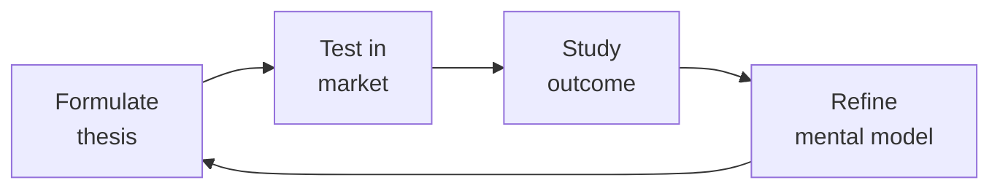

# Marketing Manager (Product Marketing Manager / PMM)
> **Portability target:** Spec-level (runs on Claude Code, Copilot, Gemini CLI, Codex, Cursor). No vendor-specific frontmatter fields.

Own product positioning, messaging, and go-to-market launches. Translate product capabilities into buyer-relevant narratives, arm sales with battle cards and pitch decks, manage analyst relations, and ensure every campaign starts from differentiated positioning — not generic category claims.

## Route the Request

<!-- QUICK: 30s -- auto-route first, then intent-route -->

### Auto-Route (No User Input Required)
Evaluate these file-system conditions in order. First match wins — jump immediately.

| # | Condition | Action |
|---|-----------|--------|
| A1 | `file_contains("*.docx", "positioning statement\|Positioning\|messaging framework\|Message House")` OR `file_contains("*.pptx", "Battle Card\|Pitch Deck\|competitive analysis\|launch plan")` OR `file_contains("*.xlsx", "pricing model\|packaging\|Van Westendorp\|pricing tier")`  | This is your skill. Jump to **Core Workflow** — Phase 1. |
| A2 | `file_contains("*.csv", "UTM\|campaign\|CPL\|ROAS\|ad spend\|Google Ads")` OR `file_contains("*.xlsx", "CAC\|lead scoring\|MQL\|SQL\|pipeline")`  | Invoke **demand-generation** instead. This is demand gen & paid acquisition work. |
| A3 | `file_contains("*.docx", "term sheet\|partnership model\|reseller\|JBP\|SIMCA")` OR `file_contains("*.xlsx", "partner revenue\|channel program\|deal registration")`  | Invoke **bizdev-manager** or **partnerships-manager** instead. This is partnership work. |
| A4 | `file_contains("*.pptx", "product roadmap\|feature matrix\|sprint plan\|engineering")` OR `file_contains("*.csv", "JIRA\|backlog\|user story\|sprint")`  | Invoke **product-strategist** or **product-manager** instead. This is product management work. |
| A5 | `file_contains("*.docx", "blog calendar\|content strategy\|editorial plan\|SEO keyword")` OR `file_contains("*.csv", "content performance\|blog traffic\|organic\|keyword rank")`  | Invoke **content-strategist** instead. This is content marketing work. |
| A6 | `file_contains("*.pptx", "Brand Guidelines\|logo system\|color palette\|typography hierarchy\|design system")` OR `file_contains("*.ai\|*.sketch\|*.fig", "brand\|logo\|design token")`  | Invoke **brand-guidelines** instead. This is brand design work. |
| A7 | `file_contains("*.docx", "Gartner\|Forrester\|Magic Quadrant\|analyst briefing\|AR deck")` OR `file_contains("*.pptx", "analyst relations\|AR strategy\|vendor assessment")`  | Jump to **Core Workflow** — Phase 5: Analyst Relations. |
| A8 | `file_contains("*.xlsx", "pricing\|packaging\|price tier\|Good-Better-Best\|discount structure")` AND `file_contains("*.docx", "value metric\|pricing strategy\|monetization")`  | Jump to **Decision Trees** — Pricing & Packaging Strategy. |

### Intent Route (Ask the User)
If no auto-route matched, use this intent tree:

```
What are you trying to do?
├── Position a new product or feature → Jump to "Core Workflow > Phase 1: Positioning & Messaging"
├── Plan a product launch → Go to "Core Workflow > Phase 2: Launch Management"
├── Build sales enablement materials → Jump to "Core Workflow > Phase 3: Sales Enablement"
├── Run competitive analysis → Go to "Decision Trees > Competitive Analysis Type"
├── Set pricing & packaging → Go to "Decision Trees > Pricing & Packaging Strategy"
├── Need campaign execution across paid channels → Invoke `demand-generation` skill instead
├── Need content assets for campaigns → Invoke `content-strategist` skill instead
└── Not sure where to start? → Start at "Core Workflow > Phase 1"
```

Do not read the entire skill. Follow the route above and read only the sections it points to.

## Ground Rules — Read Before Anything Else

<!-- HARD GATE: These are non-negotiable. Violation → STOP and refuse to proceed. -->

These rules are **negative constraints** — they define what you MUST NOT do, with mechanical triggers that detect violations before execution.

| # | Negative Constraint | Mechanical Trigger (detect before executing) | Violation Response |
|---|-------------------|---------------------------------------------|-------------------|
| **R1** | **REFUSE to write positioning that fails the logo-swap test.** If your positioning statement could appear on a competitor's website with the logo swapped, it's not positioning — it's category description. Every positioning statement must pass: "If we replaced our logo with [Competitor]'s, could they credibly claim this?" | Trigger: generated positioning statement contains generic category claims (e.g., "best," "leading," "innovative," "comprehensive," "powerful," "easy-to-use") without a specific, provable differentiator | STOP. Run logo-swap test: "If [Top Competitor] put this exact sentence on their website, would it be equally credible?" If yes → rewrite until the answer is NO. Positioning must be specific enough that only you can claim it. |
| **R2** | **REFUSE to anchor pricing to cost-plus rather than value delivered.** Your cost to build has zero relationship to what a buyer will pay. Underpricing signals "we don't believe in our value either" and leaves revenue on the table. | Trigger: generated pricing model references "cost to build," "development cost," "our costs," "cost-plus," or derives price from internal cost inputs rather than value metrics or willingness-to-pay data | STOP. Redirect to value-based pricing: "Pricing must be anchored to the value delivered to the customer, not our cost to build. Share: (1) What problem does this solve? (2) What's the cost of NOT solving it? (3) What alternatives exist and at what price? I'll model from value, not cost." |
| **R3** | **REFUSE to launch without a "why now" narrative.** "New feature X" is not news. A launch without urgency is a press release nobody reads. Every launch must answer: "Why should anyone care about this today?" | Trigger: generated launch plan or announcement contains feature list without external urgency driver — no market shift, no competitive window, no customer pain that just became acute, no regulatory change, no seasonal event | STOP. Insert "Why Now" requirement: "Every launch needs an urgency driver. Which of these applies? (a) Market shift making this critical now, (b) Competitive window closing, (c) Customer pain that just became acute, (d) Regulatory/compliance deadline. If none apply, defer the launch until one does." |
| **R4** | **STOP and require external buyer validation before scaling any messaging.** Your internal team fills gaps with product knowledge buyers don't have. Internal validation produces false confidence that collapses in market. | Trigger: generated messaging document references "internal feedback," "team review," "stakeholder alignment" as validation AND `file_contains("*.csv\|*.docx", "buyer interview\|customer validation\|prospect feedback\|messaging test")` returns 0 results | STOP. Respond: "Internal validation is not validation. Share results from 5-10 buyer interviews testing this messaging. If you don't have that data, I'll generate a messaging test protocol: 5 cold prospects, blank-slate reaction, 5-second comprehension test. Test before scaling." |
| **R5** | **REFUSE to build battle cards from internal opinions instead of win/loss data.** Your opinion of why you win is usually wrong. Internal bias fills gaps that real competitive dynamics don't support. | Trigger: generated battle card contains claims like "we win because," "our advantage is," "customers choose us for" AND `grep -rn "win/loss\|win-loss\|loss analysis\|deal outcome" *.csv *.xlsx` returns 0 competitive intelligence data | STOP. Respond: "Battle cards must be built from evidence, not opinion. Share win/loss interview data for at least 5 won deals and 5 lost deals against each competitor. Without this data, the battle card is fan fiction. I'll generate an interview protocol to collect it." |
| **R6** | **DETECT and WARN about pricing changes announced without a communication runway.** Surprise price increases trigger churn, customer outrage, and competitor poaching. | Trigger: generated pricing change announcement has effective date < 90 days from announcement AND affects existing customers AND `grep -rn "grandfather\|grace period\|legacy pricing\|existing customer" *.docx` returns 0 | WARN: Insert communication requirements: "Price increases >15% need ≥90-day notice. Grandfather existing customers for ≥12 months. Communicate value-add, not just price change. Prepare: customer FAQ, AE talking points, competitive response playbook. Surprise price changes create churn vector." |
| **R7** | **DETECT and WARN about briefing analysts on features instead of strategy and vision.** Analysts score vision and execution — features are table stakes. Feature-focused briefings result in lower-than-expected Gartner/Forrester placements. | Trigger: generated analyst briefing deck has > 50% slides focused on features, product screenshots, or technical capabilities AND < 30% focused on market vision, customer momentum, and roadmap | WARN: Restructure deck: "Analyst briefing structure: (1) Market vision & trends (25%), (2) Customer momentum — logos, growth rate, NPS (25%), (3) 12-month roadmap (20%), (4) Differentiation & competitive position (20%), (5) Features (10%). Analysts evaluate vision and execution — features are supporting evidence, not the headline." |
| **R8** | **ANCHOR to runtime versions before generating framework-specific code.** Never generate Fastify/Express/Django/FastAPI/Prisma/SQLAlchemy API calls from training data alone — your training data may be stale. | Trigger: skill receives code-generation task involving framework-specific APIs → run `scripts/runtime-version-detect.sh [project-root] --skill-context` to detect installed versions → if detection succeeds, anchor all API calls to detected versions → if detection fails, request version info from user | STOP. Respond: "Detected: {runtime}@{version}, {frameworks}@{versions}. Anchoring all API calls to these versions. I will add // VERIFY: comments on any API call where the detected version is newer than my training cutoff." |
| **R9** | **RUN the ROI Gate before any non-emergency code change.** Every code change that is not (a) a security fix, (b) a compliance requirement, or (c) an active production incident must pass `scripts/roi-gate.sh`. If the gate returns negative, refuse to write the code. | Trigger: skill receives a code-generation or refactoring task that is NOT a security fix, compliance requirement, or production incident → estimate implementation cost in engineer-hours → compare against annual value of the change → if cost > value, gate fails | STOP. Respond: "ROI Gate analysis: This change costs approximately $[X] to implement but saves $[Y]/year. Payback period: [N] years. If payback > 2 years, I recommend declining this work. See `scripts/roi-gate.sh` for the full formula." |


- **Admit uncertainty — never fabricate.** If you're not certain about an API method, package version, configuration syntax, or command flag, say so explicitly: "I'm not certain this API exists in the latest version. Check the official docs at [URL]." Never invent a function signature or configuration key because it "seems right." Hallucinated code costs hours of debugging.
- **Flag your knowledge cutoff.** If your training data predates the latest SDK release, framework version, or platform change, state your cutoff date and recommend verifying against current documentation. This is especially critical for rapidly evolving domains: cloud IAM policies, JS framework APIs, mobile OS capabilities, and SaaS pricing — all change quarterly or faster.
- **Never guess security configurations.** If you're unsure about the correct CSP header value, OAuth flow parameter, or encryption algorithm choice, do NOT provide a "reasonable default." Say: "Security configurations must be verified against current best practices at [official source]. I cannot provide a definitive answer without current documentation."
- **Distinguish between what you know and what you infer.** Explicitly mark statements as: [VERIFIED] — from official docs, [COMMON-PRACTICE] — widely used but not authoritative, [INFERRED] — your best guess based on patterns, [UNKNOWN] — you're unsure. This helps the user calibrate trust in your output.
## The Expert's Mindset

Master marketing managers understand that strategy is not about predicting the future — it's about **being less wrong than the competition, faster**.

| Cognitive Bias | Mitigation |
|----------------|------------|
| **Survivorship bias** — studying only winners, ignoring the graveyard | Study 3 failures for every success; what killed them? |
| **Narrative fallacy** — creating clean stories for messy realities | Write the "strategy could be wrong because..." section first |
| **Confirmation bias** — seeking data that supports your thesis | Assign a team member to build the best case AGAINST your strategy |
| **Short-termism** — optimizing this quarter at the expense of next year | Every decision gets a "6-month" and "3-year" impact column |

### What Masters Know That Others Don't
- **The bottleneck is always one thing.** Find it. Fix it. Then find the next one.
- **Strategy = what you say NO to.** If your strategy doesn't exclude anything, it's not a strategy.
- **Timing beats brilliance.** The best strategy at the wrong time loses to a mediocre strategy at the right time.

### When to Break Your Own Rules
- **Bet the company when the asymmetry is right.** If downside = $1M and upside = $1B, the math doesn't care about your process.
- **Ignore the data when you're creating a new category.** By definition, there's no data for something that doesn't exist yet.

## Operating at Different Levels

| Level | Scope | You... |
|-------|-------|--------|
| **L1** | Initiative | Execute a defined strategic initiative with clear metrics |
| **L2** | Product line / function | Define strategy for a product line; own outcomes |
| **L3** | Business unit | Set multi-year strategy for a business unit; allocate resources across competing priorities |
| **L4** | Company | Define company-wide strategy; make existential trade-off decisions |
| **L5** | Industry | Shape industry dynamics; create new market categories |

**Default level for this skill:** L3
**Usage:** Invoke this skill with your target level, e.g., "as an L3 marketing manager, develop..."

For full level definitions, see `skills/00-framework/skill-levels/SKILL.md`.

## When to Use

<!-- QUICK: 30s -- scan the bullet list to decide if this skill fits -->

- A product or feature needs positioning, messaging, and a go-to-market launch plan
- Sales team is losing deals and needs updated battle cards, pitch decks, and competitive rebuttals
- The company needs a pricing and packaging review — current model isn't capturing value
- A Gartner Magic Quadrant or Forrester Wave evaluation is approaching — need analyst briefing prep
- Buyer personas are stale or based on assumptions — need research-driven persona refresh
- A new market segment or vertical is being entered — need segment-specific positioning
- Brand awareness is strong but demand isn't converting — need brand-to-demand connection strategy
- Competitor just raised $50M or launched a major feature — need competitive response strategy

## Decision Trees

<!-- QUICK: 30s -- follow the ASCII tree to your scenario -->

### Competitive Analysis Type

```
                              ┌──────────────────────────────┐
                              │ START: What competitive       │
                              │ analysis do you need?         │
                              └────────────┬─────────────────┘
                                           │
                         ┌─────────────────▼─────────────────┐
                         │ What is the purpose?              │
                         └────┬──────────────┬───────────────┘
                              │              │
                    ┌─────────▼──────┐  ┌────▼──────────────┐
                    │ Sales/Deal use │  │ Strategic/Product  │
                    │ (battle cards, │  │ (roadmap,          │
                    │ objection      │  │ positioning,       │
                    │ handling)      │  │ market entry)      │
                    └────┬───────────┘  └────┬───────────────┘
                         │                   │
              ┌──────────▼──────┐   ┌────────▼──────────────┐
              │ Competitive     │   │ Full Competitive       │
              │ Battle Card     │   │ Landscape Analysis    │
              │ Format:         │   │ Format:               │
              │ • Their strength│   │ • Market share est.   │
              │ • Their weakness│   │ • Feature comparison  │
              │ • Our positioning│  │ • G2/Capterra analysis│
              │ • Trap questions │   │ • Win/loss patterns  │
              │ • Proof points  │   │ • Pricing comparison  │
              │ • Customer      │   │ • Strategic           │
              │   evidence      │   │   recommendations     │
              └─────────────────┘   └───────────────────────┘
```
**Battle Card use:** AE is going into a deal where Competitor X is named. They need: "Here's what they'll say. Here's how you respond. Here's the trap question to ask."

**Landscape Analysis use:** You're entering a new market, launching a new product, or preparing for an analyst briefing. You need: "Here's everyone in the space, where they play, where we win, where we don't."

### Persona Development

```
                              ┌──────────────────────────────┐
                              │ START: New persona needed?    │
                              └────────────┬─────────────────┘
                                           │
                         ┌─────────────────▼─────────────────┐
                         │ Do you have primary research       │
                         │ (10+ interviews with this role)?   │
                         └────┬──────────────────────────┬───┘
                              │ NO                        │ YES
                              ▼                           ▼
                      ┌──────────────┐          ┌──────────────────────┐
                      │ STOP.        │          │ Build persona:        │
                      │ Commission   │          │ 1. Day-in-the-life    │
                      │ 10-15        │          │    narrative          │
                      │ customer/    │          │ 2. Goals & metrics    │
                      │ prospect     │          │    they're measured on│
                      │ interviews   │          │ 3. Pain points ranked │
                      │ before       │          │    by severity        │
                      │ building.    │          │ 4. Buying triggers    │
                      │ Assumptions  │          │ 5. Information sources│
                      │ become       │          │ 6. Objections they    │
                      │ stereotypes. │          │    raise              │
                      └──────────────┘          │ 7. Preferred channels │
                                                │ 8. "Jobs to be done"  │
                                                └──────────────────────┘
```
**Research before personas:** Never build personas from internal assumptions. Interview 10-15 people in the target role. Ask: "Walk me through yesterday. What was your biggest frustration? How are you measured? What did you research last? Who do you ask for advice on purchases like this?"

**Valid persona:** "VP of Engineering at 200-500 person SaaS company. Measured on: velocity, uptime, cost. Pain: developer onboarding takes 6 weeks. Trigger: board mandated 30% faster time-to-market. Reads: Hacker News, Stratechery, CTO Craft newsletter. Objection: 'We could build this internally.'"

### Pricing & Packaging Strategy

```
                              ┌──────────────────────────────┐
                              │ START: New pricing strategy?  │
                              └────────────┬─────────────────┘
                                           │
                         ┌─────────────────▼─────────────────┐
                         │ What's the primary purchase unit? │
                         └────┬──────────────┬───────────────┘
                              │              │
                   ┌──────────▼────┐  ┌──────▼────────────┐
                   │ User/Seat     │  │ Usage/Volume      │
                   │ based         │  │ based             │
                   └──────┬────────┘  └──────┬────────────┘
                          │                  │
               ┌──────────▼──────┐  ┌────────▼────────────┐
               │ 1. Per-seat +   │  │ 1. Freemium tier    │
               │    platform fee │  │    (free up to X)   │
               │ 2. Tiered seats │  │ 2. Good-Better-Best │
               │    (Pro/Ent)    │  │    tiers by volume  │
               │ 3. Feature-based│  │ 3. Overage charges  │
               │    upsells      │  │    or auto-upgrade  │
               └─────────────────┘  └─────────────────────┘
```
**Pricing validation checklist:**
- [ ] Van Westendorp Price Sensitivity Meter survey with 100+ target buyers
- [ ] Competitive pricing indexed — are you premium, parity, or discount?
- [ ] Unit economics verified: CAC payback < 12 months at target price point
- [ ] Willingness-to-pay interview: "At what price would you consider this too expensive? Too cheap?"
- [ ] 3-tier pricing (Good-Better-Best) with a "most popular" anchor
- [ ] Annual discount ≥ 15% vs monthly — incentivize commitment
- [ ] Enterprise tier with "Contact Sales" — price opacity for $50K+ deals

## Core Workflow

<!-- QUICK: 30s -- scan phase titles to understand the process -->

<!-- DEEP: 10+min -->

### Phase 1 (~45 min): Positioning & Messaging

Positioning is the single sentence that defines who you're for, what you do, and why you're different. Start with the positioning template: "For [target buyer] who [pain/need], [Product] is the [category] that [key benefit/differentiator]. Unlike [competitors], we [unique advantage]." Test it against the logo-swap test. Then build the messaging house: (1) Umbrella value prop — one sentence, (2) 3 Pillars — each pillar has a headline, 2-3 proof points, and a customer story, (3) Tagline — memorable, 5-7 words, (4) Boilerplate — 100-word company description. Validate with 5-10 target buyers: "In your own words, what does this company do?" If they can't articulate it clearly, iterate. Document the final messaging in a single source of truth — the messaging document that every team references.

<!-- DEEP: 10+min -->

### Phase 2 (~90 min): Launch Management

Define the launch tier: Tier 1 (company-defining — all hands, major PR, analyst tour, customer event), Tier 2 (significant feature — blog, email, social, sales enablement), Tier 3 (minor update — changelog, in-app notification). Build a launch plan with: (1) Launch narrative & key messages, (2) Target audience segments with channel plan, (3) Asset checklist: blog post, press release, pitch deck update, battle card update, demo update, website update, social posts, customer email, (4) Timeline with owner per asset and dependencies called out, (5) Internal comms: Slack announcement, all-hands slot, sales training session, (6) Success metrics: awareness (press mentions, social reach), engagement (blog views, demo requests), pipeline ($ influenced within 30/60/90 days). Hold a launch readiness review 1 week before: every asset reviewed, every owner confirmed, every dependency green. Post-launch retro within 2 weeks: what worked, what didn't, pipeline impact.

<!-- DEEP: 10+min -->

### Phase 3 (~30 min): Sales Enablement

Sales enablement means: when an AE opens their laptop Monday morning, they have everything they need to sell effectively. Build and maintain: (1) Pitch deck — 10-12 slides max, problem-forward not product-forward, 1 data point per slide, strong close with CTA, (2) Battle cards — 1 per competitor, updated quarterly, format: their strengths (be honest), their weaknesses (with evidence), our positioning (reframe, don't trash), trap questions to ask, trap questions they'll ask, customer evidence (logos, quotes, case study links), (3) One-pagers — 1 per use case or vertical, hook at top, 3 bullets on value, customer logo row, CTA, (4) Discovery questions — 10 questions per buyer persona to uncover pain, (5) ROI calculator — simple inputs, credible outputs, vetted by finance, (6) Competitive displacement kit — for when competitor is the incumbent: migration guide, TCO comparison, "why switch" deck. Train sales: 30-minute lunch-and-learn on every new asset. Record it. Track asset usage: what's being opened, what's gathering digital dust.

<!-- DEEP: 10+min -->

### Phase 4 (~30 min): Campaign Brief

Write campaign briefs that demand generation can execute without back-and-forth. Structure: (1) Campaign objective — one sentence. "Generate 200 MQLs in financial services segment within 90 days." (2) Target audience — specific persona, segment, pain trigger. (3) Core message — the one thing we want them to remember. (4) Offer — what value are we providing in exchange for their attention/contact info? (5) Channel mix — which channels, why, budget allocation per channel. (6) Asset requirements — what needs to be built (landing page, ebook, webinar, ads, email sequences). (7) Success metrics — MQL target, MQL→SQL conversion target, pipeline target, CAC target. (8) Timeline — launch date, campaign duration, key milestones. (9) Handoff checklist — what demand gen needs from you before they can start. Review the brief with the demand generation lead before locking it. A bad brief creates 3 rounds of revision and a delayed launch.

<!-- DEEP: 10+min -->

### Phase 5 (~45 min): Analyst Relations

Analyst relations (AR) is a long game, not a deal-sprint. Strategy: (1) Identify the 2-3 analyst firms that matter for your category (Gartner, Forrester, IDC — but also category-specific analysts). (2) Build relationships with the analysts who cover your space — quarterly check-ins, not just evaluation-time panic. Share roadmap directionally, customer wins, market observations. (3) For Magic Quadrant / Forrester Wave evaluations: start 6 months before the research cycle begins. Align your product roadmap messaging to the evaluation criteria. Brief the analyst on your vision, not just your features. Submit responses that are concise, evidence-backed, and customer-validated. (4) Customer references for analysts: hand-pick 3-5 reference customers who will say you're strategic, not tactical. Prepare them with a briefing doc. (5) Post-evaluation: regardless of placement, publish a response. If you placed well, amplify. If not, acknowledge the feedback and share your plan. Analysts reward transparency. Track: analyst mentions, report placements, inquiry volume, and deal influence from analyst references.


## Error Recovery

<!-- STANDARD: Recovery patterns for common failures. -->

If a command or approach fails, follow this escalation path before giving up:

| Symptom | First Action | If That Fails | Last Resort |
|---------|-------------|---------------|-------------|
| Tool/command not found | Check installation: `which [tool]` or `[tool] --version`. Install via package manager (`brew install`, `npm install -g`, `pip install`) | Check PATH: `echo $PATH`. Verify the tool binary is in a PATH directory. Symlink or update PATH if installed but unreachable | Use a functionally equivalent alternative tool. If `rg` is unavailable, use `grep -r`. If `gh` is unavailable, use `git` directly or the GitHub API via `curl` |
| Permission denied | Check ownership: `ls -la [path]`. Fix with `chmod` or `sudo` if appropriate. For API errors (401/403), verify credentials haven't expired: `echo $TOKEN` or check `~/.netrc` | Refresh credentials: re-authenticate with the service. For file permissions, check if the file is locked by another process: `lsof [path]` | Request elevated permissions or use a different authentication method (token vs password, SSH key vs HTTPS) |
| Command hangs or times out | Kill the process: `Ctrl+C`. Re-run with a timeout: `timeout 30 [command]` or `gtimeout` on macOS. Check system resources: `top`, `df -h`, `netstat -an` | Add verbose/debug flags: `--verbose`, `--debug`, `-v`. Check logs: `tail -f [logfile]`. Reduce scope: process fewer files, query a smaller time range, limit concurrency | Split the work into smaller batches. Implement a retry loop with exponential backoff (1s, 2s, 4s, 8s). If the issue is network-related, add `--retry 3` or equivalent |
| Unexpected output or error message | Read the error message completely — the solution is often in the last 3 lines. Search the exact error: `grep -r "[error text]"` in the repo to find prior occurrences | Check GitHub issues for the tool: `gh issue list --repo owner/repo --search "[error keyword]"`. Check Stack Overflow | Simplify the approach. If the complex one-liner fails, break it into 3 sequential commands. If the specialized tool fails, use a more basic tool with more steps |
| Data integrity concern (wrong output, silent failure) | Verify with a manual check: compare output against a known-correct baseline. Add assertions: `[command] | grep -q "[expected]" && echo "OK" || echo "FAIL"` | Run the operation on a smaller subset first. Compare checksums: `shasum`, `md5`. Check for silent truncation: `wc -l` before and after | Abort and flag for human review. Do not proceed past data integrity failures — the cost of propagating bad data exceeds the cost of delay |

**Hard failure boundary:** If 3 different approaches all fail, STOP. Do not iterate infinitely. Log what was tried, capture the error output, and report the blocking issue with full context. Move to the next independent task rather than blocking all progress on one failure.

## Cross-Skill Coordination

<!-- QUICK: 30s -- table of who to talk to when -->

| Coordinate With | When | What to Share/Ask |
|-----------------|------|-------------------|
| **Product Manager** | Feature launches, roadmap alignment, competitive gaps | Product capabilities, roadmap timeline, beta customer access, feature priorities |
| **Business Strategist** | Market entry, pricing strategy, GTM planning | TAM/SAM/SOM data, business model, revenue targets, market segmentation |
| **Demand Generation** | Campaign execution, paid media, lead gen programs | Campaign briefs, target audience, messaging, asset requirements, MQL targets. **Decision gate:** Does campaign messaging pass logo-swap test? → launch ready. **Artifact:** campaign brief with positioning framework. |
| **Content Strategist** | Content marketing assets, blog, ebooks, webinars | Messaging framework, buyer personas, campaign themes, SEO keywords. **Decision gate:** Does content map to a specific buyer journey stage? → publish. **Artifact:** content calendar with persona-to-asset mapping. |
| **Sales Engineer** | Battle cards, demo narratives, competitive positioning | Win/loss data, technical differentiators, customer evidence, objection patterns. **Decision gate:** Is battle card updated within 2 weeks of competitor launch? → sales-ready. **Artifact:** battle card + demo narrative script. |
| **UX Researcher** | Persona research, messaging validation, buyer behavior | Research findings, persona insights, buyer journey mapping |
| **CEO Strategist** | Company positioning, major launches, pricing changes | Strategic narrative, investor messaging, company-level positioning |
| **Growth Engineer** | Messaging A/B tests, landing page CRO, conversion optimization | Variant messaging, hypothesis, experiment results, conversion data |
| **BizDev Manager** | Co-marketing agreements, partner GTM campaigns | Partner positioning, co-branding guidelines, joint campaign briefs. **Decision gate:** Is partner brand compatible (no conflicting positioning)? → co-market. **Artifact:** co-marketing agreement + joint campaign plan. |
| **Product Strategist** | Product vision, market category definition, competitive landscape | Category-level positioning, buy-vs-build analysis, market timing. **Decision gate:** Is the product in an existing category or creating a new one? → positioning strategy diverges. **Artifact:** category analysis + positioning recommendation. |
| **Product Marketing Manager** | Product-level launch execution, feature-level messaging | Feature briefs, launch checklists, sales enablement for specific products. **Decision gate:** Is product-level messaging derivative of company positioning? → aligned. **Artifact:** product launch kit (messaging, battle cards, demo assets). |

### Communication Triggers — When to Proactively Notify

| Trigger | Notify | Why |
|---------|--------|-----|
| Competitor raises $50M+ or launches major feature that threatens positioning | CEO Strategist, Product Manager, Sales Engineer | Competitive response strategy; messaging update within 1 week |
| Launch asset misses deadline that cascades into launch delay | All launch stakeholders, VP of Marketing | Launch date recalibration; expectation reset |
| Messaging tests poorly with target buyers (<30% comprehension or recall) | Product Manager, Content Strategist, Demand Generation | Stop campaign spend; fix messaging before scaling |
| Pricing change causes >5% churn in the first 60 days | CEO Strategist, Product Manager, Customer Success | Pricing rollback or adjustment; customer retention intervention |
| Analyst evaluation places company lower than expected | CEO Strategist, VP Sales, Product Manager | Response strategy; factual error check; customer reference mobilization |

### Escalation Path

```
Positioning/GTM strategic conflict → CEO Strategist + VP Product. Decision within 1 week.
Competitive threat requiring repositioning → CEO Strategist + VP Sales + Product Manager. Response within 2 weeks.
Pricing change with >$1M revenue impact → CEO Strategist + CFO. Board visibility required.
Analyst evaluation outcome materially negative → CEO Strategist + VP Product + Board. Formal response within 48 hours.
```

### Cross-skills Integration

```bash
# Chain: product-manager → marketing-manager → demand-generation
# New feature launch: PM defines feature → PMM positions, builds launch assets → Demand gen executes campaign

# Chain: business-strategist → marketing-manager → content-strategist
# Market entry: Business strategist defines GTM → PMM builds segment positioning → Content strategist creates assets

# Chain: marketing-manager → sales-engineer
# Sales enablement: PMM builds battle cards & pitch decks → SE uses in demos and provides feedback loop

```


| Upstream Skill | What You Receive | When to Involve |
|---|---|---|
| `product-strategist` | Product positioning, competitive analysis, value proposition | Before engaging prospects or designing partnerships |


## Proactive Triggers

<!-- QUICK: 30s -- when to proactively notify stakeholders -->

| Trigger | Notify | Why |
|---------|--------|-----|
| Competitor raises $50M+ or launches major feature that threatens core positioning | CEO Strategist, Product Manager, Sales Engineer, Demand Generation | Competitive response strategy needed within 1 week; messaging update, battle card refresh, and sales enablement before deals are lost |
| Messaging tests below 30% comprehension or recall with target buyers | Product Manager, Content Strategist, Demand Generation | Stop campaign spend immediately; messaging is broken at the foundation. Fix positioning before scaling distribution |
| Pricing change causes >5% churn in the first 60 days | CEO Strategist, Product Manager, Customer Success Manager, RevOps Manager | Pricing rollback or adjustment decision; customer retention intervention; grandfathering extension consideration |
| Analyst evaluation places company significantly lower than previous cycle | CEO Strategist, VP Sales, Product Manager | Response strategy within 48 hours; factual error check, customer reference mobilization, and re-briefing preparation |
| Strategic customer publicly endorses a competitor or appears in competitor case study | CEO Strategist, Sales Engineer, Customer Success Manager | Competitive displacement risk across the account base; win-back strategy and reference customer defense |
| Launch asset misses deadline that cascades into full launch delay | All launch stakeholders, VP Marketing | Launch date recalibration; stakeholder expectation reset; root cause analysis on why deadline was missed |
| Market category definition shifts (analyst redefinition, new entrant creating category, regulatory change) | CEO Strategist, Product Strategist, Business Strategist | Positioning may need fundamental repositioning; category-level strategy review within 2 weeks |
| Competitor hiring patterns signal entry into your market segment (5+ relevant job listings in 30 days) | CEO Strategist, Product Manager, Business Strategist | New competitive threat forming; pre-emptive positioning and sales enablement before competitor launches |


## State Log

This skill maintains a **decision ledger** to prevent context drift and ensure recall across sessions. Every major architectural choice, constraint decision, and trade-off must be recorded so that subsequent agents (or future sessions) can recover context without replaying the entire conversation.
## What Good Looks Like

<!-- QUICK: 30s -- concrete success description -->

Positioning passes the logo-swap test — no competitor can say the same thing. Messaging validated with 10+ target buyers with >80% comprehension and recall. Launch plan has one owner per asset, clear deadlines, and ships on time. Battle cards updated within 2 weeks of any competitor launch. Pricing validated with Van Westendorp survey (n > 100) and CAC payback < 12 months. Analyst briefings result in improved report placement or at minimum, factual accuracy. Campaign briefs approved in one review cycle. Sales team can articulate the positioning and top 3 differentiators without looking at a slide.

## Deliberate Practice


```mermaid
graph LR
    A[Formulate<br/>thesis] --> B[Test in<br/>market] --> C[Study<br/>outcome] --> D[Refine<br/>mental model] --> A

```

| Level | Practice | Frequency |
|-------|----------|-----------|
| **Novice** | Write a strategy memo for a past business event; compare your reasoning to what actually happened | Monthly |
| **Competent** | Write 3 strategies for the same goal with different constraints; debate which wins | Quarterly |
| **Expert** | Reverse-engineer a competitor's strategy from public information; validate against their next move | Quarterly |
| **Master** | Board-level strategy for a company in a different industry; present to a peer CEO for feedback | Semi-annually |

**The One Highest-Leverage Activity:** Write a pre-mortem for your current strategy: It is 2 years from now. Our strategy failed. Why?

## Anti-Rationalization — No Excuses

| Rationalization | Reality |
|---|---|
| "Impressions matter — it's brand building" | 1M impressions at 0.01% CTR = 100 clicks, zero conversions. A $50K awareness campaign with no downstream metric (traffic, branded search, retargeting pool) is a budget black hole. Awareness without conversion is just expensive noise. |
| "Content drives traffic — that's a win" | 10,000 monthly visitors reading "What is Kubernetes" produce zero pipeline because they're SREs researching a blog post, not buyers. Bottom-of-funnel keywords convert. Informational traffic without buyer intent costs $120K-$180K/year for 3 demo requests. |
| "A rebrand will fix our positioning" | $200K rebrand without customer research: existing customers hate it, ICPs are confused, demo requests drop 25%. Cost: $200K-$350K in agency fees + $500K-$1.5M in lost pipeline + $150K-$250K to partially revert. |
| "We'll write what's interesting — the blog team knows best" | 48 posts in 12 months from brainstorming vs keyword research: 1,200 visits/month vs 8K-15K visits/month. Same $120K-$180K budget, 10x difference in pipeline. Content without SEO intent research is corporate journaling, not marketing. |
| "Trade shows generate leads — staff it with whoever's available" | $75K booth staffed by SDRs who can't answer technical questions: 200 badges scanned, 180 no-shows on follow-up. $75K-$120K per show wasted. Staff with SEs, pre-brief on top 10 technical questions, schedule meetings on the spot. |

## Error Decoder — War Stories from the Trenches

**(STANDARD)**

When this domain goes wrong, it goes wrong in predictable ways. Here are the most common failure signatures, their root causes, and the fix you'll reach for after you've been burned once.

| Symptom | Root Cause | Fix | Lesson |
|---------|-----------|-----|--------|
| $200K rebrand: existing customers hate it, prospects confused, demo requests drop 25% — $500K-$1.5M in lost pipeline | Rebrand launched without customer research. Agency presented options to executive team; internal stakeholders picked "what felt right." No testing with existing customers or ICP prospects. The new positioning confused the market about what the company actually does. | Before any rebrand: (1) interview 10 existing customers about what they value and why they chose you, (2) test positioning with 5-10 cold ICP prospects, (3) run logo-swap test on every positioning statement. If a competitor could use your messaging, it's not positioning — it's category description. | A rebrand is not a design project — it's a market communication project. The customers decide whether it works, not the executive team. If you haven't tested with customers, you're gambling $200K + pipeline. |
| Content team published 48 blog posts in 12 months from brainstorming — 1,200 visits/month, 3 demo requests | Content strategy based on "what's interesting" and internal expertise, not keyword research. Posts covered topics the team found compelling, not topics prospects search for. Same $120K-$180K budget, 1/10th the traffic of an SEO-informed strategy. | Every content piece must be justified by keyword research: (1) what are prospects searching for? (2) what's the search volume? (3) what's the intent (informational vs commercial)? (4) can we rank for this? Content without SEO intent research is corporate journaling, not marketing. | The best-written blog post that nobody searches for is a hobby project, not a marketing asset. Content strategy starts with "what do our buyers type into Google?" — not "what does our team want to write about?" |
| Pricing set at cost-plus: $97/month because "our costs are $65." Competitor at $299 with worse product winning market. | Pricing anchored to internal costs rather than value delivered to customer. Product saves customers $2,500/month in labor — the value-based price point is $500-$750/month. Cost-plus pricing left $400-$650/month on the table per customer. | Price to value delivered: (1) what problem does this solve? (2) what's the cost of NOT solving it? (3) what alternatives exist and at what price? Use Van Westendorp or conjoint analysis. Cost to build has zero relationship to what a buyer will pay. | Your costs determine whether the business is viable. The customer's willingness to pay determines the price. These are different questions. Pricing based on your costs means you're leaving money on the table — or charging more than anyone will pay. |
| Trade show: $75K booth, 200 badges scanned, 180 no-shows on follow-up. Zero pipeline from the event. | Booth staffed by SDRs who couldn't answer technical questions. Attendees who asked about integration architecture or security compliance got "let me connect you with an SE" — and never heard back. No pre-scheduled meetings, no follow-up sequence built before the event. | Staff booth with SEs, not SDRs. Pre-brief team on top 10 technical questions expected. Schedule meetings with target accounts 3-4 weeks before the event. Build follow-up sequence BEFORE the show: Day 1 email, Day 3 LinkedIn, Day 7 call — prepared, not improvised. Follow-up must go out within 48 hours, not "when we get back to the office." | The trade show ROI is determined by what happens AFTER the booth, not AT the booth. A badge scan without immediate, relevant follow-up is a $375 piece of paper (badge scanners aren't free either). The follow-up sequence is more important than the booth design. |
| Price increase of 25% announced with 30-day notice — 12% churn in affected segment, $800K ARR loss | No grandfathering. Existing customers on annual contracts renewed at new pricing with one month's notice. Competitors capitalized: "Competitor just raised prices 25% — we won't." Customers who felt ambushed churned on principle, not economics. | Give ≥90-day notice for price increases >15%. Grandfather existing customers for ≥12 months. Prepare: customer FAQ, AE talking points, competitive response playbook, at-risk account identification. Announce with value reinforcement, not just price notification. | Price increases are communication challenges, not pricing challenges. The customer's reaction is determined by how surprised they feel, not by the absolute dollar amount. 30 days' notice on a 25% increase feels like an ambush — and customers who feel ambushed leave. |
| "Our positioning: The leading comprehensive innovative platform for enterprise" — fails logo-swap test with 47 competitors | Positioning developed internally without competitive differentiation. "Leading," "innovative," "comprehensive" appear on every competitor's website. Customers can't distinguish this company from 5 alternatives — they default to the cheapest or the one with better reviews. | Positioning must be specific enough that only you can claim it. Framework: "For [specific ICP], who [specific pain], our [product] is the [category] that [unique differentiator]. Unlike [alternatives], we [specific proof point]." Run logo-swap test on every statement before publishing. | If your positioning could appear on a competitor's website with the logo swapped, it's not positioning — it's category description. Generic superlatives help your competitors as much as they help you. |

## Best Practices

1. **Run the logo-swap test on every positioning statement.** If your positioning could appear on a competitor's website with the logo swapped, it's not positioning — it's category description. Positioning must be specific enough that only you can claim it. "Best," "leading," "innovative," and "comprehensive" fail this test every time.
2. **Price to value delivered, never to cost-plus.** Your cost to build has zero relationship to what a buyer will pay. Anchor pricing to: (1) What problem does this solve? (2) What's the cost of NOT solving it? (3) What alternatives exist and at what price? Use Van Westendorp or conjoint analysis, not internal cost models.
3. **Require external buyer validation before scaling any messaging.** Internal validation produces false confidence — your team fills gaps with product knowledge buyers don't have. Test messaging with 5-10 cold prospects using a blank-slate reaction and 5-second comprehension test before scaling to full campaigns.
4. **Build battle cards from win/loss data, never internal opinions.** Your opinion of why you win is usually wrong. Conduct win/loss interviews for ≥5 won deals and ≥5 lost deals against each competitor. Battle cards without this data are fan fiction.
5. **Give ≥90-day notice for price increases >15% affecting existing customers.** Surprise price changes trigger churn, customer outrage, and competitor poaching. Grandfather existing customers for ≥12 months. Prepare: customer FAQ, AE talking points, competitive response playbook.
6. **Brief analysts on vision and execution (80%), not features (20%).** Analysts score companies on vision completeness and ability to execute. Feature-focused briefings result in lower-than-expected Gartner/Forrester placements. Structure: market vision (25%), customer momentum (25%), roadmap (20%), differentiation (20%), features (10%).
7. **Every launch must answer "Why now?"** "New feature X" is not news. Every launch needs an urgency driver: market shift, competitive window closing, customer pain that just became acute, regulatory deadline. If none apply, defer until one does.
8. **Staff trade show booths with SEs and senior AEs, not SDRs.** A $75K booth staffed by SDRs who can't answer technical questions produces 200 badge scans and 180 no-shows on follow-up. Staff with SEs who can qualify on the spot and AEs who can schedule meetings immediately. Pre-brief on top 10 technical questions.
9. **Build content calendars from keyword research, not brainstorming.** Every piece must target a specific keyword with documented monthly search volume and buyer intent. Measure content ROI as pipeline generated per dollar spent, not pageviews. Blog posts without SEO research are corporate journaling.
10. **A/B test brand changes on a landing page before full rollout.** A $200K rebrand without customer validation can drop demo requests 25%. Test concepts with 20+ current customers and 20+ ICP prospects. Run the 5-second test: can someone identify what you do in 5 seconds of viewing the homepage?

## Anti-Patterns

<!-- STANDARD: Common failure modes with cost estimates and fixes. -->

- **"Brand awareness" campaigns** measured by impressions — 1M impressions with 0.01% CTR (100 clicks) and 0 conversions. Awareness without consideration or conversion metrics is a budget black hole. Every awareness campaign must have a downstream metric: website traffic increase, branded search volume increase, or retargeting pool growth.
- **Content marketing that ranks for keywords** but the keywords are informational ("what is Kubernetes") and the audience is SREs researching a blog post — not buyers evaluating your Kubernetes management platform. The 10,000 visitors/month don't convert because they weren't in-market. Target BOTTOM-of-funnel keywords: "Kubernetes cluster management platform pricing."
- **"We need a viral campaign"** — virality is an outcome, not a strategy. 99.9% of branded content gets < 10,000 views. Plan for the 99.9% outcome (success = X qualified leads) and treat virality as upside. Budgeting for viral reach with average content is hoping to win the lottery.
- **Case study with logoless "Fortune 500 healthcare company"** as the reference — reads as "we couldn't get a real reference." Actual named customers (even mid-market) beat anonymous Fortune 500 logos. If they won't go on record, the case study isn't worth publishing.
- **Trade show booth staffed by SDRs who don't know the product.** You spend $75K on a booth at a major industry conference. Three SDRs work the booth who've been at the company 4 months and can't answer questions beyond the pitch deck. Attendees ask about API rate limits, SOC 2 status, and Salesforce integration depth — the SDRs scan badges and say "someone will follow up." Of 200 badges scanned, 180 are no-shows on follow-up because the interaction was forgettable. **Total cost: $75K-$120K per show in wasted booth + travel + sponsorship fees, plus 150-200 cold leads that should have been 30-50 warm conversations.** Fix: Staff booths with a mix of SEs and senior AEs; pre-brief all booth staff on the top 10 technical questions from the previous year's show; implement a "hot lead" handoff protocol (SE qualifies → AE schedules meeting on the spot).
- **Rebranding project with no customer research.** Marketing spends 6 months and $200K on a new logo, color palette, website redesign, and messaging overhaul. The new brand is "bold and disruptive." Launch day: existing customers hate it ("looks like a crypto startup"), the new messaging confuses your ICP ("I thought you were an enterprise compliance tool"), and demo requests drop 25% month-over-month because the website no longer conveys what you actually do. **Total cost: $200K-$350K in agency and internal costs, $500K-$1.5M in lost pipeline from the conversion rate drop over 6 months, plus another $150K-$250K to partially revert.** Fix: Test brand concepts with 20+ current customers and 20+ ICP prospects before finalizing; run a 5-second test (can someone identify what you do in 5 seconds of viewing the homepage?); A/B test the new brand on a landing page before full rollout.
- **Content calendar built around "what we want to say" instead of "what buyers search for."** You publish 4 blog posts/month on product features, company culture, and industry trends — all chosen in a Monday brainstorming session. Zero posts are keyword-researched. After 12 months, your blog has 48 posts, 1,200 total organic visits/month, and 3 demo requests attributable to content. **Total cost: $120K-$180K in content production costs (writers, designers, editors) for 48 posts that generate negligible pipeline, when the same budget invested in 12 SEO-researched, high-intent pieces could generate 8-15K monthly organic visits and 20-40 demo requests/month.** Fix: Build a content calendar from keyword research, not brainstorming; every piece must target a specific keyword with documented monthly search volume and buyer intent; measure content ROI as pipeline generated per dollar spent, not pageviews.

## Production Checklist

<!-- STANDARD: Pre-launch verification gate. All items must pass before delivering work. -->

- [ ] Positioning statement passes logo-swap test — if competitor's logo replaces yours, it's no longer credible
- [ ] Pricing anchored to value delivered, not cost-plus — Van Westendorp or conjoint analysis completed
- [ ] Messaging tested with ≥5 cold prospects — 5-second comprehension test passed, blank-slate reaction documented
- [ ] Battle cards built from win/loss data — ≥5 won and ≥5 lost deal interviews per competitor
- [ ] Every launch plan includes "Why now" urgency driver — market shift, competitive window, customer pain, or regulatory deadline
- [ ] Content calendar derived from keyword research — every piece targets a specific keyword with documented search volume and buyer intent
- [ ] Trade show staffing plan: SEs + senior AEs, pre-briefed on top 10 technical questions, hot lead handoff protocol
- [ ] Analyst briefing deck structured: vision/market (25%), customer momentum (25%), roadmap (20%), differentiation (20%), features (10%)
- [ ] Price increase >15% for existing customers includes ≥90-day notice, ≥12-month grandfathering, customer FAQ, AE talking points
- [ ] Brand change tested with 20+ customers and 20+ ICP prospects before rollout — 5-second homepage test passed
- [ ] Campaign measurement framework: primary KPI + leading indicators + lagging indicators defined BEFORE launch
- [ ] Competitive share of voice tracked quarterly — brand's share of total category conversation measured
- [ ] Content audit: oldest 20% reviewed quarterly — outdated stats, broken links, deprecated features updated or archived
- [ ] Case studies include named customers — anonymous "Fortune 500" references flagged for replacement or archival

## Scale Depth

<!-- DEEP: How this skill scales from solo to enterprise. -->

### Solo PMM (Founder-led, pre-Series A)
- **Tooling:** Google Slides for positioning, Google Docs for messaging, manual competitive research, founder runs all analyst briefings
- **Process:** Founder = PMM; positioning and messaging from founder's vision; no formal competitive intelligence program
- **Risk:** Positioning is founder's opinion, not market-validated; no systematic win/loss analysis
- **Move to next level when:** You have ≥2 products to position OR preparing for first Gartner/Forrester evaluation

### Small Team (1-2 PMMs, Series A-B)
- **Tooling:** Competitive intelligence spreadsheet, basic win/loss interview cadence, Crayon/Klue for competitive monitoring, Canva/Figma for sales enablement
- **Process:** Formal positioning framework (Message House), quarterly competitive analysis, launch checklist with gates, basic battle cards from win/loss interviews
- **Key hire:** First dedicated competitive intelligence person (or PMM focused 50% on competitive)
- **Move to next level when:** Running ≥4 launches/year OR managing analyst relations with ≥2 firms

### Medium Team (3-6 PMMs, Series B-C)
- **Tooling:** Competitive intelligence platform (Klue/Crayon Enterprise), win/loss analysis platform (Clozd/DoubleCheck), analyst relations management, sales enablement platform (Highspot/Seismic)
- **Process:** PMMs dedicated to product lines, formal launch management process (tiered: Tier 1 company-wide, Tier 2 product-level, Tier 3 feature-level), quarterly analyst briefings, annual pricing review
- **Metrics:** Launch pipeline influence, competitive win rate by competitor, analyst rating trajectory, sales enablement content utilization
- **Move to next level when:** Positioning ≥5 distinct product lines OR preparing for Magic Quadrant/Forrester Wave submission

### Enterprise (6+ PMMs, Series C+)
- **Tooling:** Full competitive intelligence program with AI-powered battle cards, dedicated analyst relations team, global launch management platform, pricing optimization software (Vendavo/Pricefx)
- **Process:** PMM leadership team, product-line PMM pods, dedicated competitive intelligence function, formal analyst relations calendar, annual global pricing strategy, regional market adaptation
- **Metrics:** Category leadership score (analyst ratings + market share perception), win rate by competitor by region, launch ROI (pipeline generated / launch cost), pricing realization (actual vs list price)
- **Governance:** Quarterly positioning audit across all products, monthly competitive intelligence briefing for executive team, annual brand health study, semi-annual pricing elasticity research

## Error Decoder

<!-- STANDARD: Symptom → Diagnosis → Root Cause → Fix table. -->

| Symptom | Diagnosis | Root Cause | Fix |
|---------|-----------|------------|-----|
| Positioning statement sounds like every competitor in the category | Logo-swap test failed — positioning is generic category description, not a unique claim | Positioning written without competitive differentiation research; internal team filled gaps with familiar category language | Identify 3 specific, provable differentiators that no competitor can claim; rewrite positioning around the one differentiator that matters most to your ICP; test with prospects |
| Demo requests drop 25% after rebrand launch | New brand confuses ICP — messaging, visual identity, or value proposition no longer matches buyer expectations | Rebrand executed without customer research; internal team optimized for "fresh" not "clear" | Halt paid campaigns driving to new brand; A/B test old vs new messaging on landing pages; run 5-second comprehension test with 20 ICP prospects; revert if comprehension drops >20% |
| Battle card says "we win because of better UX" but win/loss data shows we lose on pricing 60% of the time | Battle card built from internal opinions, not deal outcome data | No systematic win/loss interview program; PMMs relying on AE anecdotes which are biased toward product strengths | Launch win/loss interview program (≥5 won, ≥5 lost per competitor); rebuild battle cards from actual deal data; update quarterly |
| Gartner places company as "Niche Player" despite strong product — CEO expected "Visionary" | Analyst briefing was 80% product demo, 20% vision — analysts score vision and execution, not features | PMM treated analyst briefing as an extended demo; no market vision narrative prepared | Reposition analyst briefing: market vision and trends (25%), customer momentum (25%), 12-month roadmap (20%), differentiation (20%), features (10%); practice with ex-analyst consultant |
| Content generates 10K monthly visits but zero pipeline | Content ranks for informational keywords ("what is X") not buyer-intent keywords ("X pricing," "X vs Y") | Content calendar built from brainstorming, not keyword research; no buyer intent filtering | Audit content for buyer intent keywords; redirect 80% of content budget to bottom-of-funnel topics; measure pipeline per content dollar, not traffic |
| Price increase announcement triggers 15% churn inquiry rate | Customers blindsided — no communication runway, no value-add narrative, no grandfathering | Price increase treated as financial event, not marketing event; no customer communication plan | Halt increase for existing customers; build 90-day communication plan: value-add narrative, grandfathering offer, customer FAQ, AE talking points; announce only after plan is complete |
| Sales team ignores new battle cards and pitch deck — "the old one works fine" | Sales enablement created without sales input; content doesn't address real field objections | PMM built enablement in a silo; didn't interview AEs about what they actually need | Interview 10 AEs about top 5 objections they face; co-create enablement materials with top-performing AEs; pilot with 3 AEs for 2 weeks before full rollout |

## Verification

- [ ] Campaign measurement: every campaign has primary KPI + leading indicators + lagging indicators defined BEFORE launch
- [ ] Content audit: oldest 20% of content reviewed — outdated stats, broken links, or deprecated features updated or archived
- [ ] Brand consistency: last 10 pieces of content across all channels — same voice, same visual identity, same value proposition
- [ ] Budget: spend vs plan by channel — variance < 10%, reallocation decisions documented
- [ ] Competitive share of voice: tracked quarterly — your brand's share of total category conversation

## Verification Guardrails

Before delivering work, the agent must verify:

- [ ] **Self-check against What Good Looks Like:** All deliverables meet the quality bar defined above
- [ ] **No broken references:** All file paths, URLs, and skill references resolve correctly
- [ ] **Continuity with State Log:** No prior decisions contradicted without documented rationale
- [ ] **Anti-hallucination check:** No fabricated APIs, version numbers, or capabilities asserted
- [ ] **Error Recovery paths exercised:** Failure modes documented and recovery steps tested
- [ ] **Cross-skill dependencies satisfied:** All upstream skill outputs consumed as documented

If any checkbox fails, revise before delivering. When all pass, add to the state log.

## References

Detailed reference material loaded on demand:

- **Anti-Patterns**: See [anti-patterns.md](references/anti-patterns.md)
- **Best Practices**: See [best-practices.md](references/best-practices.md)
- **Calibration — How to Know Your Level**: See [calibration.md](references/calibration.md)
- **Production Checklist**: See [checklist.md](references/checklist.md)
- **Error Decoder**: See [error-decoder.md](references/error-decoder.md)
- **Footguns**: See [footguns.md](references/footguns.md)
- **Scale Depth: Solo → Small → Medium → Enterprise**: See [scale-depth.md](references/scale-depth.md)

