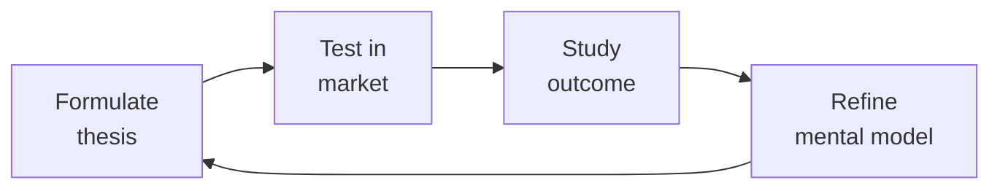

# Partnerships Manager (Channel Manager / Partner Success)

Own partner execution: onboard integration, reseller, and referral partners, design co-selling motions, run partner training & certification, manage deal registration, operate the partner portal, allocate MDF, run partner QBRs, resolve channel conflict, and measure ecosystem health. BizDev structures the deal — you make it work.

## Route the Request
<!-- QUICK: 30s -- pick your path, skip the rest -->

```
What are you trying to do?
├── Onboard a new partner → Jump to "Core Workflow > Phase 1: Partner Onboarding"
├── Design a co-selling motion → Go to "Decision Trees > Co-Sell Motion Design"
├── Build partner training & certification → Jump to "Core Workflow > Phase 3"
├── Set up deal registration program → Go to "Decision Trees > Deal Registration Rules"
├── Build or improve partner portal → Jump to "Core Workflow > Phase 4"
├── Manage MDF (market development funds) → Go to "Core Workflow > Phase 5"
├── Run a partner QBR → Jump to "Core Workflow > Phase 6"
├── Resolve a channel conflict → Go to "Decision Trees > Channel Conflict Resolution"
├── Measure ecosystem health → Jump to "Decision Trees > Ecosystem Health Scoring"
├── Need deal structure / term sheet drafting → Invoke `bizdev-manager` skill
├── Need legal review of partner agreement → Invoke `legal-advisor` skill
├── Need product integration scope / roadmap → Invoke `product-manager` skill
└── Not sure where to start? → Start at "Core Workflow > Phase 1"
```

Do not read the entire skill. Follow the route above and read only the sections it points to.

## Ground Rules — Read Before Anything Else

These rules apply to *every* response this skill produces.

- **Never onboard a partner without a signed agreement and a named partner manager.** A partner with no human relationship inside your company will atrophy. Every active partner must have an accountable partner manager with a quarterly check-in commitment.
- **Always measure partner-sourced revenue independently from partner-influenced revenue.** Sourced = partner brought the deal. Influenced = partner participated but didn't originate. Blending them inflates partner program ROI and hides underperformance. Report them separately.
- **Never allocate MDF without a documented plan and success metrics.** "We'll do some marketing together" is not a plan. Every MDF dollar must have: activity description, expected outcome, measurement criteria, and post-activity review within 30 days. Unused or unaccounted MDF gets reallocated.
- **Always resolve channel conflict within 72 hours of escalation.** Unresolved conflict sits in a partner's mind for months and poisons the relationship. Even if the resolution isn't perfect, timely and transparent is better than perfectly fair but late.
- **Treat partner NPS as seriously as customer NPS.** A detractor partner will not send you deals. They will tell other partners. Partner reputation in an ecosystem is viral. Survey quarterly. Act on feedback within 30 days.


## The Expert's Mindset

Master partnerships managers understand that strategy is not about predicting the future — it's about **being less wrong than the competition, faster**.

| Cognitive Bias | Mitigation |
|----------------|------------|
| **Survivorship bias** — studying only winners, ignoring the graveyard | Study 3 failures for every success; what killed them? |
| **Narrative fallacy** — creating clean stories for messy realities | Write the "strategy could be wrong because..." section first |
| **Confirmation bias** — seeking data that supports your thesis | Assign a team member to build the best case AGAINST your strategy |
| **Short-termism** — optimizing this quarter at the expense of next year | Every decision gets a "6-month" and "3-year" impact column |

### What Masters Know That Others Don't
- **The bottleneck is always one thing.** Find it. Fix it. Then find the next one.
- **Strategy = what you say NO to.** If your strategy doesn't exclude anything, it's not a strategy.
- **Timing beats brilliance.** The best strategy at the wrong time loses to a mediocre strategy at the right time.

### When to Break Your Own Rules
- **Bet the company when the asymmetry is right.** If downside = $1M and upside = $1B, the math doesn't care about your process.
- **Ignore the data when you're creating a new category.** By definition, there's no data for something that doesn't exist yet.
## Operating at Different Levels

| Level | Scope | You... |
|-------|-------|--------|
| **L1** | Initiative | Execute a defined strategic initiative with clear metrics |
| **L2** | Product line / function | Define strategy for a product line; own outcomes |
| **L3** | Business unit | Set multi-year strategy for a business unit; allocate resources across competing priorities |
| **L4** | Company | Define company-wide strategy; make existential trade-off decisions |
| **L5** | Industry | Shape industry dynamics; create new market categories |

**Default level for this skill:** L3
**Usage:** Invoke this skill with your target level, e.g., "as an L3 partnerships manager, develop..."

For full level definitions, see `skills/00-framework/skill-levels/SKILL.md`.

## When to Use
<!-- QUICK: 30s -- scan the bullet list to decide if this skill fits -->

- A new partner has signed an agreement and needs onboarding, training, and activation
- Co-selling is underperforming — partners registered but no joint deals are closing
- Partner training is a PDF graveyard — need a structured certification program with completion tracking
- Deal registration is a source of constant conflict — need clear rules and enforcement
- The partner portal is outdated or unused — need to rebuild as a self-serve resource hub
- MDF budget is being allocated but ROI isn't measured — need guardrails and reporting
- QBRs with partners feel like awkward status updates — need structured agenda and accountability
- A direct sales rep and a partner are fighting over the same deal — conflict resolution needed
- You can't answer "how healthy is our partner ecosystem?" — need ecosystem health scoring

## Decision Trees
<!-- QUICK: 30s -- follow the ASCII tree to your scenario -->

### Co-Sell Motion Design

```
                              ┌──────────────────────────────┐
                              │ START: Design co-sell motion  │
                              └────────────┬─────────────────┘
                                           │
                         ┌─────────────────▼─────────────────┐
                         │ Does your product naturally create │
                         │ a co-sell trigger? e.g., customer  │
                         │ asks "what about X?" where X =     │
                         │ partner's domain                   │
                         └────┬──────────────────────────┬───┘
                              │ YES                       │ NO
                              ▼                           ▼
                      ┌──────────────┐          ┌──────────────────────┐
                      │ Reactive     │          │ Can your product      │
                      │ Co-Sell:     │          │ integrate with the    │
                      │ Partner      │          │ partner's offering    │
                      │ introduced   │          │ to create combined    │
                      │ when customer│          │ value?                │
                      │ asks for     │          └──┬──────────────┬────┘
                      │ complementary│             │ YES          │ NO
                      │ capability   │             ▼              ▼
                      │              │    ┌──────────────┐ ┌──────────────┐
                      │ Motion:      │    │ Proactive    │ │ Referral     │
                      │ "You need X? │    │ Co-Sell:     │ │ Only:        │
                      │ Our partner  │    │ Joint        │ │ No co-sell   │
                      │ does X. Let  │    │ solution     │ │ motion —     │
                      │ me introduce │    │ selling.     │ │ partner       │
                      │ you."        │    │ Combine both │ │ introduces,   │
                      └──────────────┘    │ products in  │ │ you close.   │
                                         │ one value    │ └──────────────┘
                                         │ proposition. │
                                         │               │
                                         │ Motion: "Our  │
                                         │ combined      │
                                         │ solution      │
                                         │ solves [pain] │
                                         │ better than   │
                                         │ either alone."│
                                         └───────────────┘
```
**Motion activation requirements:**
- **Reactive Co-Sell:** Partner directory in CRM, "warm introduction" playbook, simple referral tracking, partner page on website.
- **Proactive Co-Sell:** Joint value prop documented, account mapping exercise completed monthly, shared pipeline in CRM, joint demos available, co-branded assets.
- **Referral Only:** Referral tracking link or form, commission tracking, payment process (quarterly). Minimal enablement overhead.

### Deal Registration Rules

```
                              ┌──────────────────────────────┐
                              │ Deal Registration: Who wins?  │
                              └────────────┬─────────────────┘
                                           │
                         ┌─────────────────▼─────────────────┐
                         │ Lifecycle of deal registration:    │
                         └───────────────────────────────────┘

    ┌─────────┐    ┌─────────┐    ┌──────────┐    ┌──────────┐
    │Partner  │───▶│You      │───▶│Deal      │───▶│Deal      │
    │registers│    │review & │    │approved  │    │progress  │
    │deal     │    │accept   │    │(locked   │    │tracking  │
    │         │    │(24hr SLA)│   │60-90 days)│   │required  │
    └─────────┘    └─────────┘    └────┬─────┘    └────┬─────┘
                                      │                │
                          ┌───────────▼────┐   ┌───────▼────────┐
                          │ Deal rejected? │   │ No activity in │
                          │ Tell partner   │   │ 30 days →      │
                          │ WHY within     │   │ registration   │
                          │ 48 hours.      │   │ expires.       │
                          └────────────────┘   └────────────────┘
```
**Registration rules that work:**
1. Partner registers deal in portal with: company name, contact name, opportunity description, estimated deal size.
2. You review within 24 hours. Accept if: deal is net-new to your pipeline, partner is actively engaged, company isn't already in your CRM with an active opportunity from direct sales.
3. Accepted deal = protected for 60-90 days. Partner gets full margin/commission on close.
4. Rejected deal = specific reason given (already known, already in pipeline via direct). Partner can appeal.
5. Registration expires if: no activity in 30 days (no meeting held, no proposal sent). Partner can re-register.
6. Channel conflict: if direct sales and partner both claim same deal, first-to-register wins. If direct sales had prior engagement (documented meeting or email within 30 days before registration), direct sales wins.

### Channel Conflict Resolution

```
                              ┌──────────────────────────────┐
                              │ START: Direct vs Partner      │
                              │ conflict on a deal            │
                              └────────────┬─────────────────┘
                                           │
                         ┌─────────────────▼─────────────────┐
                         │ Is there a prior documented        │
                         │ engagement by either party?        │
                         └────┬──────────────────────────┬───┘
                              │ YES                       │ NO
                              ▼                           ▼
                      ┌──────────────┐          ┌──────────────────────┐
                      │ Prior        │          │ First-to-register     │
                      │ engagement   │          │ wins.                 │
                      │ wins (within │          │                       │
                      │ 30 days of   │          │ Exception: if partner │
                      │ registration)│          │ has no sales capacity │
                      │              │          │ to work the deal,     │
                      │ Documented:  │          │ direct sales can      │
                      │ meeting held,│          │ request transfer with │
                      │ proposal     │          │ split commission.     │
                      │ sent, email  │          └──────────────────────┘
                      │ thread with  │
                      │ prospect     │
                      └──────────────┘
```
**Resolution principles:**
- Speed over perfection: resolve within 72 hours of escalation.
- Transparency: both parties see the decision rationale in writing.
- Consistency: same rules, every time. No favoritism toward high-performers.
- Appeal path: if either party disputes, escalate to VP Sales + VP Partnerships. Decision is final.
- Post-resolution: document the case, track pattern. If same partner has 3+ conflicts in a quarter, review whether the partnership is structured correctly.

### Ecosystem Health Scoring

```
Score your partner ecosystem quarterly across 5 dimensions (each 0-5):

Pipeline Health (0-5)
    5 = >30% of total pipeline is partner-sourced + partner-influenced
    3 = 15-30% partner contribution
    1 = <10% partner contribution
    0 = No partner pipeline at all

Revenue Health (0-5)
    5 = >30% of total revenue partner-sourced + influenced, growing QoQ
    3 = 15-30%, stable
    1 = <10%, declining
    0 = <5%

Partner Activation (0-5)
    5 = >70% of signed partners have closed ≥1 deal in last 12 months
    3 = 40-70% active
    1 = <40% active
    0 = >50% of partners dormant

Partner Satisfaction (0-5)
    5 = Partner NPS >60, improving QoQ
    3 = Partner NPS 30-60, stable
    1 = Partner NPS <30, declining
    0 = <15

Ecosystem Diversity (0-5)
    5 = No single partner >20% of partner revenue; 3+ partner types active
    3 = Top partner <40% of partner revenue
    1 = One partner >60% of partner revenue (concentration risk)
    0 = One partner >80% (existential risk if they leave)
```

**Composite Score:** 21-25 = Excellent. 15-20 = Healthy, invest. 10-14 = Needs attention. <10 = Red alert, program at risk.

## Core Workflow
<!-- QUICK: 30s -- scan phase titles to understand the process -->

<!-- DEEP: 10+min -->

### Phase 1 (~40 min): Partner Onboarding (30-60-90 Day Plan)

Onboarding must produce a deal within 90 days. Structure: **Day 1-7 (Welcome & Orientation):** Welcome kit — partner portal access, partner manager introduction, executive welcome letter. Kickoff call: review the agreement, JBP if exists, expectations, success metrics. Assign training curriculum. **Day 8-30 (Product & Sales Training):** Product certification — hands-on, not just videos. Partner must complete: "Demonstrate how you'd position our product to [target persona] for [use case]." Sales certification: pitch practice, objection handling, demo walkthrough. Technical certification for integration partners: API proficiency, integration build, certification test. **Day 31-60 (Shadow & Co-Sell):** Partner shadows 2-3 of your deals from discovery through close. Joint account mapping session: identify 5-10 target accounts in partner's book of business that fit your ICP. Partner manager reviews partner's pipeline weekly. **Day 61-90 (First Deal Activation):** Partner works their target account list. Partner manager provides deal-level support — join calls, provide SE help, review proposals. Goal: first registered deal. If no deal by day 90: escalate to executive sponsors, intervention plan. Beyond day 90: partner moves to "Active" or "At-Risk" status.

<!-- DEEP: 10+min -->

### Phase 2 (~30 min): Partner Enablement

Enablement is ongoing, not onboarding-only. Components: (1) **Content Library:** Partner pitch deck (customizable, not locked PDF), battle cards per competitor, discovery question bank, demo script with talking points, pricing & packaging guide, case studies by industry/use case, ROI calculator, proposal templates, (2) **Sales Plays:** 3-5 repeatable plays: "When customer says [X], introduce our [Y] solution." Include: trigger, qualification questions, pitch, demo flow, pricing guidance, close plan. Update quarterly based on win/loss data, (3) **Communications Cadence:** Monthly partner newsletter — product updates, new assets, win of the month, upcoming events. Monthly office hours — open Q&A with SE + Partner Manager. Quarterly all-partner webinar — roadmap, program updates, top partner recognition, (4) **Certification Tracking:** Partners must re-certify annually. Certification expiration triggers loss of tier benefits and deal registration privileges. Track in portal — partners see their own status.

<!-- DEEP: 10+min -->

### Phase 3 (~30 min): Partner Training & Certification

Certification is the gate to tier benefits and deal registration. Design three certification tracks: (1) **Sales Certified** — required for all partners. Covers: positioning, discovery, demo, pricing, competition, deal registration process. Assessment: pitch recording reviewed by partner manager + written exam. Renewal: annual. (2) **Technical Certified** — required for reseller, OEM, and integration partners. Covers: architecture, integration patterns, API usage, troubleshooting, deployment best practices. Assessment: hands-on lab + technical exam. Renewal: annual. (3) **Specialized Certified** — optional, for specific verticals or use cases. Healthcare, Financial Services, Enterprise. Assessment: industry-specific case study + exam. Benefit: higher margin on specialized deals. Track certification status in partner portal. Auto-notify 60 days before expiration. Certification completion rate <50% across partners → program is too hard or not valued enough. Audit and simplify.

<!-- DEEP: 10+min -->

### Phase 4 (~45 min): Partner Portal & Resource Hub

The partner portal is the single source of truth for all partners. Design for self-serve: if a partner needs to email their partner manager for something that should be in the portal, the portal is failing. Required capabilities: (1) **Deal Registration:** Register new deals, track deal status, view deal history. Auto-validation against CRM for duplicates, (2) **Pipeline Tracking:** Partner sees their active pipeline, stage, deal value, next steps. Auto-expire stale deals, (3) **Training & Certification:** Course catalog, progress tracking, certification status, expiration dates, (4) **Content Library:** All enablement assets, searchable, filterable by tag, downloadable, (5) **MDF Requests:** Submit MDF proposals, track approval status, report on MDF spend, (6) **Performance Dashboard:** Partner sees their metrics — sourced revenue, influenced revenue, pipeline created, deals won, deals lost, certification status, tier level, (7) **Program Guide:** Partner program overview, tier requirements, benefits per tier, deal registration rules, rules of engagement, (8) **Support:** FAQ, knowledge base, "Contact Partner Manager" button, escalation path. Portal usage metric: partners logging in at least monthly >60% of active partner base.

<!-- DEEP: 10+min -->

### Phase 5 (~30 min): MDF Management

Market Development Funds are co-marketing dollars allocated to partners. Budget: typically 1-3% of expected partner revenue. Process: (1) Partner submits MDF proposal through portal: activity description, target audience, expected outcomes (leads, pipeline, deals), budget breakdown, timeline, (2) You review within 5 business days: does this align with joint GTM priorities? is the ROI case credible? is the partner contributing (typically 50/50 split for Tier 1, 70/30 your contribution for Tier 2)? (3) Approved MDF is tracked: spend vs. budget, activity completion, outcome measurement, (4) Post-activity review within 30 days: what was delivered? what were the results? what would we do differently? If results significantly underperform the proposal (e.g., 0 leads from a $10K event), partner's future MDF approvals are scrutinized more heavily, (5) Unused MDF reallocated quarterly — if a partner hasn't used allocated funds by end of quarter, funds return to pool. MDF ROI tracking: total MDF spend / partner-sourced pipeline generated from MDF activities. Target: <20% of partner revenue equivalent spent on MDF.

<!-- DEEP: 10+min -->

### Phase 6 (~30 min): Partner QBR

Quarterly Business Review with strategic partners. Structured agenda (60-90 minutes): (1) **Executive check-in (5 min):** Any org changes, strategy shifts, new priorities on either side? (2) **Performance review (20 min):** Revenue vs. JBP target. Pipeline created, deals closed, deals lost (with reasons). Partner NPS trend. Certification status. Time-to-first-deal for new partner reps. (3) **Joint pipeline review (15 min):** Top 5 active deals — stage, next step, blocker, help needed. Target accounts for next quarter. (4) **Enablement & marketing review (10 min):** Training completion. Content usage. MDF spend & ROI. Upcoming co-marketing activities. (5) **Product & roadmap update (10 min):** What's shipping next quarter. How it affects partner's GTM. Integration updates. (6) **Next quarter planning (15 min):** Revenue commitment. Target accounts. Key activities. Resource needs. Any JBP adjustments. (7) **Action items & owners (5 min):** Who will do what by when. Documented and shared within 24 hours. QBR outcome: a 1-page scorecard + action plan. If a partner misses QBR targets for 2 consecutive quarters, escalate from QBR to "partnership reset" conversation.

## Best Practices
<!-- STANDARD: 3min -- rules extracted from production experience -->
<!-- DEEP: 10+min -- these rules encode years of partner programs that looked good on paper and failed in execution -->

- Time-to-first-deal is the single best predictor of long-term partner success. Partners who close a deal within 90 days are 3x more likely to be active in year 2. Measure it. Obsess over it. Intervene before day 90.
- Partner portal adoption is a leading indicator of partner engagement. If partners aren't logging in, they're not self-serving — they're emailing your team for everything. Track monthly active partners in portal. Target >60%.
- MDF without post-activity review is charity. Every MDF dollar must produce a post-activity report within 30 days. Partners who don't report lose future MDF eligibility. Harsh but necessary.
- Partner communications should feel like insider access, not marketing blasts. Share roadmap details, win/loss patterns, competitive intel that partners can't get from your public website. Make the partner newsletter worth opening.
- Certification must be meaningful or don't do it. A certification that 100% of partners pass without effort is worthless. Target 70-80% pass rate on first attempt. Provide remediation paths for those who fail.
- Channel conflict is a process problem, not a people problem. When conflict happens, fix the process, don't blame the people. If the same conflict type recurs, your rules of engagement are ambiguous.
- Partner tier benefits must escalate meaningfully or tiers are theater. If a Silver partner gets mostly the same benefits as Platinum, why climb? Each tier should unlock something the partner genuinely wants: margin, MDF access, lead sharing, executive sponsorship.
- Track partner attach rate: what % of your new customers involve a partner? This is the ecosystem's real footprint. Target >25% attach rate for mature programs.
- Segment partner communications by persona and activity level. A dormant partner and a Platinum partner should not receive the same email. Segment: active, at-risk, dormant. Each gets different outreach cadence and content.
- Partner manager coverage ratios matter. One partner manager can handle ~20-30 active partners effectively. Beyond that, partners feel neglected and engagement drops. Calculate coverage and hire before burnout.

## Anti-Patterns
<!-- STANDARD: 3min -- patterns that predictably fail -->

| Anti-Pattern | Why It Fails | Correct Approach |
|---|---|---|
| Treating partner onboarding as a content library dump | Partners download a PDF once and never return. Self-serve onboarding has near-zero completion and produces no activated partners | Build a 30-60-90 day onboarding with a named partner manager. Week 1 kickoff, week 2 product training, week 4 first deal review, week 12 activation check. Target first deal within 90 days |
| Approving MDF without requiring post-activity pipeline reporting | MDF becomes charity — spend with zero accountability. Partners take the money, run the activity, and nobody knows if it produced pipeline | Every MDF dollar requires a post-activity report within 30 days documenting leads generated, pipeline created, and deals influenced. Partners who don't report lose future MDF eligibility |
| Making partner certification so easy everyone passes | A certification with 100% pass rate is worthless. Partners aren't actually enabled — they just checked a box. Deals stall because partners can't sell competently | Target 70-80% first-attempt pass rate. Include active demonstration: pitch recording review, mock demo, discovery call role-play. Provide remediation paths for those who fail |
| Resolving channel conflict case-by-case without fixing the process | When the same conflict type recurs, you're treating symptoms while the root cause festers. Partner trust erodes with every inconsistent ruling | When conflict happens, fix the process: was the rule ambiguous? Was enforcement inconsistent? Update the rules of engagement and publish the change. Track dispute patterns quarterly |
| Sending the same partner newsletter to dormant and Platinum partners | Dormant partners delete it; Platinum partners feel undervalued. One-size-fits-all communication wastes everyone's attention | Segment partner communications by tier and activity: Platinum gets executive-level strategic updates, active partners get enablement content, dormant partners get re-activation offers |
| Letting partner tier benefits be cosmetic rather than meaningful | If Silver and Platinum partners get essentially the same benefits, there's no incentive to invest in the partnership. Tiers become theater | Each tier unlocks something the partner genuinely wants: higher margin, MDF access, lead sharing, executive sponsorship, co-selling priority. Benefits must escalate materially |
| Focusing partner manager time on the loudest partner instead of the highest-potential | The partner who complains the most consumes all the attention while high-potential but quiet partners starve for support | Implement tiered coverage model: Platinum = dedicated PAM (1:10-15), Gold = pooled PAM (1:20-30), Silver = self-serve + quarterly check-in. Automate Silver partner nurture |
| Running QBRs as status updates instead of strategic planning sessions | Partners tune out. QBRs become a checkbox exercise with no accountability. JBP targets drift and the partnership underperforms silently | QBR agenda: performance vs. JBP, joint pipeline review with named deals, enablement and marketing ROI, product roadmap, next quarter commitments, documented action items within 24 hours |

## Cross-Skill Coordination
<!-- QUICK: 30s -- table of who to talk to when -->

| Coordinate With | When | What to Share/Ask |
|-----------------|------|-------------------|
| **BizDev Manager** | New partner handoff, deal structure questions, JBP updates | Signed agreement, deal economics, JBP, partner contact, strategic context. **Decision gate:** Is JBP signed with revenue targets and QBR cadence? → partner activated. **Artifact:** partner activation checklist + 90-day onboarding plan. |
| **Product Manager** | Product roadmap for partner enablement, integration capabilities, partner feedback | Feature requests from partners, integration gaps, competitive partner feedback. **Decision gate:** Does integration gap affect > 3 partners? → roadmap escalation. **Artifact:** partner feature request backlog + impact analysis. |
| **Sales Engineer** | Partner training, co-sell deal support, technical enablement | Training curriculum needs, deal-level technical support, partner capability gaps. **Decision gate:** Has partner completed certification? → ready for co-sell. **Artifact:** partner certification report + deal support playbook. |
| **Customer Success Manager** | Partner-sourced customer onboarding, retention, expansion | Customer handoff, implementation plan, renewal risk, expansion opportunities |
| **Marketing Manager** | Co-marketing execution, MDF allocation, partner content | Co-marketing plans, content assets, MDF proposals, campaign results. **Decision gate:** Is MDF spend ROI > 3:1? → continue program. **Artifact:** MDF proposal with success metrics. |
| **Account Manager** | Co-sell deals, account mapping, conflict resolution | Target accounts, deal status, partner engagement rules, conflict cases |
| **Legal Advisor** | Partner agreement amendments, compliance issues, conflict with legal implications | Agreement changes, breach concerns, partner disputes requiring legal input. **Decision gate:** Does issue expose > $100K liability? → legal review required before response. **Artifact:** legal review memo with risk assessment. |
| **BizDev Manager** | Deal structure feedback, partner program economics, strategic partner retention | Partner performance data, competitive program benchmarking, ecosystem health scores. **Decision gate:** Is partner NPS > 50? → ecosystem healthy. **Artifact:** ecosystem health dashboard + program improvement recommendations. |

### Communication Triggers — When to Proactively Notify

| Trigger | Notify | Why |
|---------|--------|-----|
| Partner misses JBP revenue target for 2 consecutive quarters | BizDev Manager, VP Sales | Partnership reset conversation — restructure or offboard |
| Partner NPS drops >20 points quarter-over-quarter | BizDev Manager, VP Partnerships | Partner satisfaction crisis; executive intervention |
| Channel conflict reaches 3+ cases in a single quarter | VP Sales, BizDev Manager, Legal Advisor | Rules of engagement broken; process overhaul |
| Key strategic partner threatens to leave | BizDev Manager, CEO Strategist, VP Product | Executive retention effort; understand root cause |
| Partner-sourced pipeline drops >30% quarter-over-quarter | BizDev Manager, VP Sales | Ecosystem pipeline crisis; partner activation emergency |
| MDF ROI drops below target (MDF spend >30% of partner revenue equivalent) | Marketing Manager, BizDev Manager | MDF program restructure; tighten approval criteria |

### Escalation Path

```
Strategic partner threatening termination → CEO Strategist + BizDev Manager + VP Product. Executive retention conversation within 48 hours.
Systemic channel conflict (5+ cases in 30 days) → VP Sales + VP Partnerships + Legal Advisor. Rules of engagement overhaul.
Partner program economics not competitive (partners leaving for competitor programs) → BizDev Manager + Business Strategist. Program restructure.
Partner portal/data system outage >24 hours → Engineering + VP Partnerships. Partner operations halt.
```

### Cross-skills Integration

```bash
# Chain: bizdev-manager → partnerships-manager → sales-engineer → customer-success-manager
# Full partner lifecycle: BizDev structures deal → Partnerships onboards & enables → SE supports deals → CSM handles post-sale

# Chain: partnerships-manager → marketing-manager
# Co-marketing: Partnerships allocates MDF + identifies partner → Marketing executes co-marketing plan

# Chain: product-manager → partnerships-manager → sales-engineer
# Integration partner: PM builds integration → Partnerships onboards partner → SE trains partner on integration selling
```

## Proactive Triggers
<!-- QUICK: 30s -- when to proactively notify stakeholders -->

| Trigger | Notify | Why |
|---------|--------|-----|
| Key strategic partner misses JBP revenue target for 2 consecutive quarters | BizDev Manager, VP Sales, CEO Strategist | Partnership reset conversation — restructure terms, adjust JBP, or begin managed offboarding before sunk costs escalate |
| Partner NPS drops >20 points quarter-over-quarter | BizDev Manager, VP Sales | Partner satisfaction crisis; executive intervention needed. NPS drops precede pipeline drops by ~6 months |
| Channel conflict exceeds 3 documented cases in a single quarter | VP Sales, BizDev Manager, Legal Advisor | Rules of engagement are breaking; process overhaul required. Systemic conflict, not isolated incidents |
| Partner-sourced pipeline drops >30% quarter-over-quarter | BizDev Manager, VP Sales, Demand Generation | Ecosystem pipeline crisis; run partner activation sprint, audit dormant partners, coach active partners on pipeline generation |
| Strategic partner executive sponsor departs or changes roles | BizDev Manager, CEO Strategist | Executive relationship orphaned; re-establish sponsorship within 30 days. Pending JBP decisions and escalations now have no owner on partner side |
| Partner certification completion rate drops below 30% | BizDev Manager, Sales Engineer | Certification is either too hard, too long, or not valued. Audit the program: time-to-complete, pass rate, value proposition. Fix or partners won't be sell-ready |
| MDF ROI drops below target (program spend >30% of attributed partner revenue) | Marketing Manager, BizDev Manager | MDF program is burning budget without pipeline return; tighten approval criteria, require stronger lead-capture mechanisms, audit past allocations |
| Competitor partner program announces significantly better economics (higher margin, MDF, or rev share) | BizDev Manager, Business Strategist, VP Sales | Partner defection risk; benchmark your program against competitor within 1 week. Prepare retention offers for top 20% of partners by revenue |

## Scale Depth: Solo → Small → Medium → Enterprise
<!-- DEEP: 10+min -- how this skill changes as the company grows -->

### Solo
Direct 1:1 partnerships, founder-to-founder relationships. Get first integration partnerships live. Handshake deals; no program; personal relationships drive everything. Focus on landing 2-3 reference partners that prove the partnership model works.

### Small Team
Partner program v1, onboarding process, partner portal. Build repeatable partner motion. Structured partner tiers; self-serve onboarding; first co-marketing campaigns. Dedicated partner manager establishes processes that work without founder involvement.

### Medium Team
Channel sales, partner-sourced pipeline, deal registration. Drive revenue through partners. Deal registration incentives; partner sales training; channel conflict resolution. Partner program generates measurable pipeline with tiered coverage by partner value.

### Enterprise
Global partner ecosystem, GSIs, OEMs, resellers. Market expansion through partner network. Regional partner managers; multi-tier distribution; partner-sourced > 25% of revenue. Partner operations team manages the ecosystem as a scalable revenue channel.

### Transition Triggers
- **Solo → Small Team:** Partner count exceeds 5 active partnerships and founder can no longer personally manage all relationships.
- **Small Team → Medium Team:** Partner-sourced pipeline exceeds $2M/quarter or partner count exceeds 20.
- **Medium Team → Enterprise:** Partner-sourced revenue exceeds 25% of total revenue or operations span 3+ regions.


## What Good Looks Like
<!-- QUICK: 30s -- concrete success description -->

Partners are onboarded and have a first registered deal within 90 days for >60% of new partners. >70% of signed partners have closed at least 1 deal in the last 12 months. Partner-sourced revenue >30% of total revenue and growing. Partner NPS >50 and trending up. Deal registration conflicts resolved within 72 hours with documented rationale. MDF spend has measured ROI — every dollar traced to pipeline. Partner portal has >60% monthly active partners. Certification completion rate >70%. QBRs produce a 1-page scorecard and action plan within 24 hours. No single partner represents >40% of partner-sourced revenue. Channel conflict cases are declining quarter-over-quarter as rules of engagement mature.

## Error Decoder
<!-- DEEP: 10+min -- each row is a real partner program failure that cost pipeline and trust -->

| Symptom | Root Cause | Fix | Lesson |
|---------|------------|-----|--------|
| Partners trained but never register a deal | Training was passive (videos + PDFs) — partners consumed content but never practiced selling | Add active certification: pitch recording review, mock demo, discovery call role-play. Partner must demonstrate capability, not just watch content. Also: are the partner's target accounts actually a fit for your ICP?  | Training that doesn't change behavior is entertainment. Active certification — where partners demonstrate selling, not just watching — is the only training that produces deals. |
| Deal registration is a source of constant conflict | Rules are ambiguous or inconsistently enforced. "First-to-engage" is subjective without timestamp proof. | Automate deal registration validation in CRM. First-to-register with valid submission timestamp wins. Publish a "deal registration dispute log" — transparency reduces accusations of favoritism. | Ambiguous deal registration rules are a partnership poison. Automate the process and publish the dispute log — transparency is the only cure for perceived favoritism. |
| Partner portal has all the content but nobody uses it | Portal is a content dump, not a workflow tool. Partners visit once, download a PDF, and never return. | Add deal registration, pipeline tracking, and MDF submission as portal workflows — not just a content library. Partners return because that's where they do their work, not just download files. | A partner portal without workflow tools is a digital filing cabinet. Partners return when the portal is where they do work — register deals, track pipeline, request MDF — not where they download PDFs. |
| MDF is spent but pipeline doesn't follow | MDF allocated to "brand awareness" activities with no lead capture mechanism. Events with no follow-up plan. Content with no CTA. | Require every MDF proposal to include: specific lead/pipeline target, capture mechanism, and follow-up plan. Post-activity: measure leads, pipeline created within 90 days, deals closed within 180 days. | MDF without pipeline measurement is charity, not investment. Every dollar must have a measurable outcome target defined before approval. |
| Strategic partner gets all the attention, small partners atrophy | No tiered coverage model. Partner manager time is monopolized by the loudest partner, not the highest-potential. | Implement coverage model: Platinum = Dedicated PAM (1:10-15), Gold = Pooled PAM (1:20-30), Silver = Self-serve + quarterly check-in. Automate Silver partner nurture to prevent complete neglect. | Without a tiered coverage model, the loudest partner consumes all the attention while the highest-potential partners starve. Coverage ratios protect long-term ecosystem health. |
| Partner certification completion rate <30% | Certification is too hard, too long, or not valued. Partners don't see the benefit of completing it. | Audit the certification: time-to-complete, pass rate, value proposition. If partners don't complete it, either (a) simplify it, (b) tie it to a benefit they actually want (higher margin, deal registration, lead sharing), or (c) both. | If partners won't complete certification, it's not because they're lazy — it's because the certification is harder or less valuable than the alternative use of their time. Audit and simplify. |


## Production Checklist
<!-- QUICK: 30s -- binary pass/fail items. All must pass. -->
<!-- DEEP: 10+min -- each item references a standard born from a partner program that lost a key partner -->

- [ ] **[S1]** Partner onboarding plan is documented (30-60-90 day) and tracked — first deal within 90 days target
- [ ] **[S2]** Partner activation rate >60% — >60% of active partners closed ≥1 deal in last 12 months
- [ ] **[S3]** Partner-sourced revenue and partner-influenced revenue tracked and reported separately
- [ ] **[S4]** Partner NPS measured quarterly — results acted upon within 30 days
- [ ] **[S5]** Deal registration rules documented, published, and enforced consistently via CRM automation
- [ ] **[S6]** Channel conflict resolution SLA: 72 hours from escalation to documented resolution
- [ ] **[S7]** Partner portal has >60% monthly active partners — portal is where partners do work, not just download PDFs
- [ ] **[S8]** Certification program has: sales track, technical track, annual renewal, >70% completion rate
- [ ] **[S9]** MDF: every dollar allocated has a documented plan, success metrics, and post-activity review within 30 days
- [ ] **[S10]** QBR cadence: quarterly for Gold/Platinum partners, scorecard + action plan produced within 24 hours
- [ ] **[S11]** Partner communications: monthly newsletter, monthly office hours, quarterly all-partner webinar
- [ ] **[S12]** Partner tier benefits escalate meaningfully — each tier unlocks a benefit partners genuinely value
- [ ] **[S13]** Ecosystem health scored quarterly: pipeline, revenue, activation, satisfaction, diversity — composite ≥15
- [ ] **[S14]** Partner coverage model defined: Platinum = dedicated PAM, Gold = pooled, Silver = self-serve + quarterly
- [ ] **[S15]** Dormant partner offboarding process: partners with 0 deals in 12 months moved to dormant or offboarded
- [ ] **[S16]** Conflict resolution log maintained — patterns tracked quarterly to identify process improvements


## References

## Footguns
<!-- DEEP: 10+min — war stories from partner programs and channel management -->

| Footgun | What Happened | Root Cause | How to Prevent |
|---------|---------------|------------|----------------|
| Recruited 200 partners in 12 months by removing all qualification criteria — 85% never closed a deal, partner portal became a ghost town, and the 15 productive partners left because the program had no credibility | A cloud storage company set a 2023 goal: "200 active partners by December." To hit the number, the partner team removed revenue minimums, certification requirements, and even the $500 onboarding fee. By Q4, they had 210 "partners" — but 85% had never closed a deal. The 15 productive partners noticed the portal was flooded with inactive accounts and complained that deal registration was being gamed by "partners" who submitted every deal they heard about. Two of the top 3 partners terminated their agreements by Q1 2024. | The KPI was partner count, not partner quality. When you remove barriers to entry, you don't get more good partners — you get more bad partners who dilute the experience for the ones generating revenue. | **Optimize for partner activation rate, not partner count.** An activation metric — "closed ≥1 deal within 90 days of onboarding" — is the only count that matters. Set minimum qualification criteria (revenue, certifications, technical capability) and enforce them. If pipeline per active partner is dropping as you add partners, you're recruiting too fast. The right speed: onboard only as many partners as you can personally enable to close their first deal within 90 days. |
| Gave one partner exclusive territory rights for North America — they underperformed for 2 years, blocked 3 better partners who wanted to enter, and when terminated, sued for $1.2M in "lost business value" | An enterprise SaaS company granted a reseller exclusive North American rights in 2021, believing exclusivity would motivate investment. The partner committed to $5M in year-1 revenue, delivered $1.4M, $1.1M, and $700K over 3 years. Meanwhile, 3 larger VARs approached the company wanting to sell the product — but were turned away because of the exclusive. When the company finally terminated the agreement in 2024, the partner sued for $1.2M in "lost business value," claiming the company hadn't provided adequate enablement. The case settled for $400K. | Exclusivity was granted without performance clauses. The agreement said "exclusive rights" but had no minimum revenue thresholds, no quarterly review mechanism, and no termination-for-underperformance clause. The partner had no incentive to invest because underperformance had no consequence. | **Never grant exclusivity without performance gates.** Every exclusive territory agreement must include: (a) minimum quarterly revenue targets, (b) a cure period (miss one quarter = warning, miss two = territory becomes non-exclusive, miss three = termination), (c) right of first refusal on sub-territories the partner isn't covering. The penalty for missing targets must be automatic, not negotiable — remove the relationship from the enforcement conversation. |
| Measured partner program success by "partner count" for 2 years — board presentation showed 500 partners generating 3% of company revenue, and the board asked why partner operations cost more than the revenue they produced | A martech company's VP of Partnerships proudly reported "500 partners" at the 2023 annual board meeting. A board member asked: "What percentage of revenue comes from partners?" Answer: 3%. Next question: "What's the fully loaded cost of the partner team?" Answer: $1.2M/year. The partner program was losing ~$840K/year. The board mandated a 50% team reduction and a pivot to "top 20 partners only." | Success was measured by a vanity metric (partner count) instead of a business metric (partner-sourced revenue as % of total). There was no partner P&L. Without tracking revenue contribution, the program looked successful on the surface while destroying value. | **Report partner program performance as a business, not a count.** Monthly partner P&L: partner-sourced revenue, partner-influenced revenue, COGS (partner margins, MDF, team cost, portal cost), and net contribution. If the program isn't net-positive by year 2, it's a marketing expense, not a channel — report it differently and fund it accordingly. Track partner-sourced vs partner-influenced revenue separately; don't let "influenced" inflate the channel's contribution. |
| Built an entire partner program on personal relationships — when the Head of Partnerships quit, 6 of the top 10 partners left within 90 days because "we only trusted Sarah" | A fintech startup's Head of Partnerships (2021-2024) ran the entire program through personal relationships. Partner agreements were verbal ("Sarah said we'd get 25%"), deal registration was a WhatsApp message, and QBRs were dinner conversations. When she left for a competitor in Q1 2024, 6 of the top 10 partners terminated within 90 days. The new hire discovered there were no signed agreements for half of them — the "partnerships" were personal friendships, not business relationships. | The program was built on individual trust rather than institutional process. Partners were loyal to a person, not a company. There was no CRM record of partner interactions, no documented agreements, no shared Slack/email history accessible to anyone else. | **Institutionalize every partner relationship from day one.** All partner communication must happen in shared channels (partner-dedicated Slack Connect, CRM-logged emails, or a partner portal) — never in personal WhatsApp or texts. Every agreement must be signed and stored in a shared repository. Maintain a "partner relationship map" showing all contacts (exec sponsor, day-to-day lead, technical lead, procurement contact) for each partner. If any single employee can quit and take a partner with them, that's not a partnership — it's a hostage situation. |
| Launched a partner certification program that took 40 hours to complete — 12 partners finished it in 18 months, and every partner complained it was "college for software we don't sell yet" | An infrastructure software company launched a partner certification in 2022: 40 hours of video training, a 200-question exam, and a required hands-on lab that took 8 hours. The goal was "highly certified partners who deeply understand the product." After 18 months, 12 people across 9 partner companies had completed it. The program cost $180K to build. Partners said: "I'm not spending a work week learning a product I haven't sold yet — prove the market demand first and I'll invest the time." | The certification was designed for the company's ideal world (deeply trained partners) rather than the partner's reality (busy people who need to see ROI before investing time). The 40-hour requirement was aspirational but not market-tested. | **Design certification for partner economics, not your wish list.** A partner's time investment must be proportional to the revenue they expect. Tier 1 certification: 2 hours online, qualifies partner to resell. Tier 2: 8 hours + exam, qualifies for higher margin. Tier 3: advanced technical, only required for implementation partners. Offer certification-as-they-sell: let partners start selling after 2 hours, require Tier 2 before their third deal. Track certification completion as a leading indicator of partner revenue — if partners aren't certifying, ask why before building more content. |

## Calibration — How to Know Your Level
<!-- STANDARD: 3min — honest self-assessment rubric -->

| You Know You're Stuck at L1 When... | You Know You've Reached L2 When... | You Know You're L3 When... |
|---|---|---|
| Your partner program description is "we have a partner portal where they can download our logo and a datasheet" — and 80% of partners never log in after onboarding | You can name your top 10 partners, their revenue contribution last quarter, their primary contact's biggest frustration, and the one thing you're doing this month to deepen each relationship | You walk into a company with no partner program, no channel revenue, and no partner team — and within 24 months, partners are generating >30% of new revenue with a documented, tiered program that would survive you leaving |
| You measure your job by partner count and portal logins rather than partner-sourced pipeline and revenue | You've terminated 3 underperforming partners this year — and all 3 terminations were clean, professional, and preserved the door for a future relationship under different terms | A CEO asks you "should we go channel-first, direct-first, or marketplace-first in APAC?" and you deliver a go-to-market model with partner candidates, economic projections, and a 12-month launch plan — and it works |
| Your partner agreements are forwarded to legal without your review of commercial terms, and you've never negotiated margin, territory, or IP ownership directly with a partner | Every partner in your portfolio has a Joint Business Plan updated within the last 90 days — and you review QBR scorecards with partners before sending them, because no partner should see a surprise on a slide | A partner program you designed 3 years ago is still growing partner-sourced revenue >25% YoY — and the partners who joined in year 1 have higher NPS and revenue than partners who joined in year 3, proving the program compounds |

**The Litmus Test:** Take over a partner program with 50 partners, 0 documented processes, and a 90-day deadline to present a partner-sourced pipeline number to the board. If you can classify every partner into a tier, produce a revenue forecast from the top 10, and present a 12-month partner strategy — all without the previous partner manager's help — you're L3.

## Deliberate Practice



| Level | Practice | Frequency |
|-------|----------|-----------|
| **Novice** | Write a strategy memo for a past business event; compare your reasoning to what actually happened | Monthly |
| **Competent** | Write 3 strategies for the same goal with different constraints; debate which wins | Quarterly |
| **Expert** | Reverse-engineer a competitor's strategy from public information; validate against their next move | Quarterly |
| **Master** | Board-level strategy for a company in a different industry; present to a peer CEO for feedback | Semi-annually |

**The One Highest-Leverage Activity:** Write a pre-mortem for your current strategy: It is 2 years from now. Our strategy failed. Why?

## References

- **bizdev-manager** — for partner deal structure, partnership agreements, JBP creation, and partner recruitment
- **product-manager** — for integration roadmap, product capabilities, and partner-driven feature requests
- **sales-engineer** — for partner technical enablement, co-sell deal support, and demo training
- **customer-success-manager** — for partner-sourced customer onboarding, retention, and expansion
- **marketing-manager** — for co-marketing execution, MDF allocation strategy, and partner content
- **business-strategist** — for partner program economics, ecosystem strategy, and partner ROI modeling
- **legal-advisor** — for agreement amendments, compliance, and channel conflict requiring legal interpretation
- _The Channel Manager's Handbook_ by Jay McBain (Forrester) — for partner program design and ecosystem strategy
- Partner Relationship Management (PRM) platforms: PartnerStack, Allbound, Impartner, Crossbeam (account mapping)
