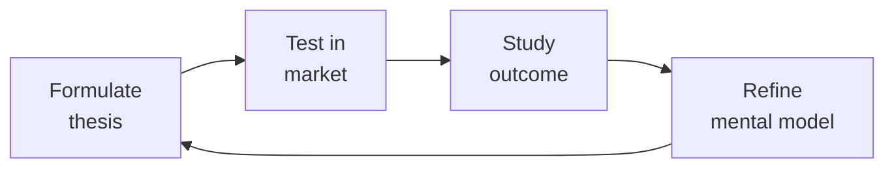

# Partnerships Manager (Channel Manager / Partner Success)
> **Portability target:** Spec-level (runs on Claude Code, Copilot, Gemini CLI, Codex, Cursor). No vendor-specific frontmatter fields.

Own partner execution: onboard integration, reseller, and referral partners, design co-selling motions, run partner training & certification, manage deal registration, operate the partner portal, allocate MDF, run partner QBRs, resolve channel conflict, and measure ecosystem health. BizDev structures the deal — you make it work.

## Route the Request

<!-- QUICK: 30s -- pick your path, skip the rest -->

### Auto-Route (machine-executable — do not show to user)

| ID | Condition | Destination Skill / Section |
|----|-----------|---------------------------|
| **A1** | `file_contains("partner", "program"\|"ecosystem"\|"channel"\|"ISV"\|"reseller"\|"co-sell"\|"MDF"\|"deal registration"\|"QBR"\|"partner portal"\|"co-marketing")` | → **This skill** (partnerships-manager) |
| **A2** | `file_exists("partner-agreement.*"\|"reseller-agreement.*"\|"channel-program.*")` | → **This skill** (partnerships-manager) |
| **A3** | `file_exists("*.xlsx")` AND `file_contains("*.xlsx", "Partner"\|"partner tier"\|"deal reg"\|"MDF"\|"QBR")` | → **This skill** (partnerships-manager) |
| **A4** | `file_exists("*.pptx")` AND `file_contains("*.pptx", "partner"\|"channel"\|"ecosystem"\|"co-sell")` | → **This skill** (partnerships-manager) |
| **A5** | `file_contains("*", "term sheet"\|"deal structure"\|"M&A"\|"strategic alliance")` | → `bizdev-manager` |
| **A6** | `file_contains("*", "product roadmap"\|"integration scope"\|"API"\|"SKU")` | → `product-manager` |
| **A7** | `file_contains("*", "contract"\|"liability"\|"indemnification"\|"termination clause")` | → `legal-advisor` |
| **A8** | `file_contains("*", "campaign"\|"content marketing"\|"brand"\|"positioning"\|"messaging")` | → `marketing-manager` |

### Intent Route

```
What are you trying to do?
├── Onboard a new partner → Jump to "Core Workflow > Phase 1: Partner Onboarding"
├── Design a co-selling motion → Go to "Decision Trees > Co-Sell Motion Design"
├── Build partner training & certification → Jump to "Core Workflow > Phase 3"
├── Set up deal registration program → Go to "Decision Trees > Deal Registration Rules"
├── Build or improve partner portal → Jump to "Core Workflow > Phase 4"
├── Manage MDF (market development funds) → Go to "Core Workflow > Phase 5"
├── Run a partner QBR → Jump to "Core Workflow > Phase 6"
├── Resolve a channel conflict → Go to "Decision Trees > Channel Conflict Resolution"
├── Measure ecosystem health → Jump to "Decision Trees > Ecosystem Health Scoring"
├── Need deal structure / term sheet drafting → Invoke `bizdev-manager` skill
├── Need legal review of partner agreement → Invoke `legal-advisor` skill
├── Need product integration scope / roadmap → Invoke `product-manager` skill
└── Not sure where to start? → Start at "Core Workflow > Phase 1"
```

Do not read the entire skill. Follow the route above and read only the sections it points to.

## Ground Rules — Read Before Anything Else

<!-- QUICK: 30s -- mechanical rules. Every violation has a detectable trigger and a standardized response. -->

These rules apply to *every* response this skill produces.

| # | Negative Constraint | Mechanical Trigger | Violation Response |
|---|--------------------|--------------------|---------------------|
| **R1** | Never onboard a partner without a signed agreement and a named partner manager. A partner with no human relationship inside your company will atrophy. | `grep -rn "partner agreement\|signed agreement\|partner manager" *.docx *.pdf \| awk '{if(!/signed/) print "UNSIGNED AGREEMENT"}'` → flag | **REFUSE**: Block onboarding workflow. Require `signed_agreement_date` and `partner_manager_name` fields populated before proceeding. |
| **R2** | Always measure partner-sourced revenue independently from partner-influenced revenue. Blending them inflates partner program ROI and hides underperformance. | `grep -rn "partner-sourced\|partner-influenced\|sourced\|influenced" *.xlsx *.csv \| awk -F',' '{print $2}' \| sort \| uniq` → if only one category, DETECT blending | **DETECT**: Flag spreadsheets where "partner-sourced" and "partner-influenced" are not separate columns. Halt ROI report generation until fixed. |
| **R3** | Never allocate MDF without a documented plan and success metrics. "We'll do some marketing together" is not a plan. | `grep -rn "MDF\|market development fund" *.csv *.xlsx \| awk -F',' '{if(!/activity description\|expected outcome\|measurement criteria/) print "MISSING MDF PLAN"}'` → flag | **STOP**: Reject MDF request if `activity_description`, `expected_outcome`, `measurement_criteria` fields are empty. Unused/unaccounted MDF gets reallocated. |
| **R4** | Always resolve channel conflict within 72 hours of escalation. Unresolved conflict poisons partner relationships for months. | `find conflict-log/ -name "*.csv" -exec awk -F',' '{split($1, d, "-"); days=(systime()-mktime(d[1] " " d[2] " " d[3] " 0 0 0"))/86400; if(days>3 && \$NF!="resolved") print "OVERDUE:", \$0}' {} \;` → flag conflicts >72h unresolved | **STOP**: Auto-escalate any channel conflict unresolved after 72 hours. Generate weekly report of open conflicts with SLA breach count. |
| **R5** | Treat partner NPS as seriously as customer NPS. A detractor partner will not send deals — they will tell other partners. | `grep -rn "partner NPS\|partner satisfaction" *.csv *.xlsx \| awk -F',' '{if($2<7) print "DETRACTOR:", $0}'` → flag any score <7 | **DETECT**: Flag all NPS scores <7. Auto-generate follow-up action item within 48 hours. Quarterly survey required; alert if last survey >90 days ago. |
| **R6** | Never let partner tier benefits be cosmetic. If Silver and Platinum partners get essentially the same benefits, there's no incentive to invest. | `grep -rn "tier benefit\|tier perk\|tier advantage" tier-benefits.* \| awk -F':' '{print $2}' \| sort \| uniq -c \| awk '{if($1>2) print "DUPLICATE BENEFIT"}'` → flag if benefits overlap across tiers | **WARN**: Flag tiers where ≥3 benefits are shared across levels. Require each tier to have ≥1 exclusive benefit that partners genuinely value (margin, MDF access, lead sharing, exec sponsorship). |
| **R7** | Never focus partner manager time on the loudest partner instead of the highest-potential. The squeaky wheel shouldn't starve the high-potential. | `grep -rn "PAM assignment\|partner manager ratio\|coverage" *.csv \| awk -F',' '{if($3=="Platinum" && $4>15) print "PAM OVERLOAD:", $0; if($2=="Silver" && $4!="self-serve") print "SILVER OVER-COVERED"}'` → check coverage ratios | **WARN**: Alert if Platinum ratio > 1:15 or Silver partners lack self-serve designation. Implement tiered coverage: Platinum = dedicated PAM (1:10-15), Gold = pooled (1:20-30), Silver = self-serve + quarterly check-in. |

## The Expert's Mindset

Master partnerships managers understand that strategy is not about predicting the future — it's about **being less wrong than the competition, faster**.

| Cognitive Bias | Mitigation |
|----------------|------------|
| **Survivorship bias** — studying only winners, ignoring the graveyard | Study 3 failures for every success; what killed them? |
| **Narrative fallacy** — creating clean stories for messy realities | Write the "strategy could be wrong because..." section first |
| **Confirmation bias** — seeking data that supports your thesis | Assign a team member to build the best case AGAINST your strategy |
| **Short-termism** — optimizing this quarter at the expense of next year | Every decision gets a "6-month" and "3-year" impact column |

### What Masters Know That Others Don't
- **The bottleneck is always one thing.** Find it. Fix it. Then find the next one.
- **Strategy = what you say NO to.** If your strategy doesn't exclude anything, it's not a strategy.
- **Timing beats brilliance.** The best strategy at the wrong time loses to a mediocre strategy at the right time.

### When to Break Your Own Rules
- **Bet the company when the asymmetry is right.** If downside = $1M and upside = $1B, the math doesn't care about your process.
- **Ignore the data when you're creating a new category.** By definition, there's no data for something that doesn't exist yet.

## Operating at Different Levels

| Level | Scope | You... |
|-------|-------|--------|
| **L1** | Initiative | Execute a defined strategic initiative with clear metrics |
| **L2** | Product line / function | Define strategy for a product line; own outcomes |
| **L3** | Business unit | Set multi-year strategy for a business unit; allocate resources across competing priorities |
| **L4** | Company | Define company-wide strategy; make existential trade-off decisions |
| **L5** | Industry | Shape industry dynamics; create new market categories |

**Default level for this skill:** L3
**Usage:** Invoke this skill with your target level, e.g., "as an L3 partnerships manager, develop..."

For full level definitions, see `skills/00-framework/skill-levels/SKILL.md`.

## When to Use

<!-- QUICK: 30s -- scan the bullet list to decide if this skill fits -->

- A new partner has signed an agreement and needs onboarding, training, and activation
- Co-selling is underperforming — partners registered but no joint deals are closing
- Partner training is a PDF graveyard — need a structured certification program with completion tracking
- Deal registration is a source of constant conflict — need clear rules and enforcement
- The partner portal is outdated or unused — need to rebuild as a self-serve resource hub
- MDF budget is being allocated but ROI isn't measured — need guardrails and reporting
- QBRs with partners feel like awkward status updates — need structured agenda and accountability
- A direct sales rep and a partner are fighting over the same deal — conflict resolution needed
- You can't answer "how healthy is our partner ecosystem?" — need ecosystem health scoring

## Decision Trees

<!-- QUICK: 30s -- follow the ASCII tree to your scenario -->

### Co-Sell Motion Design

```
                              ┌──────────────────────────────┐
                              │ START: Design co-sell motion  │
                              └────────────┬─────────────────┘
                                           │
                         ┌─────────────────▼─────────────────┐
                         │ Does your product naturally create │
                         │ a co-sell trigger? e.g., customer  │
                         │ asks "what about X?" where X =     │
                         │ partner's domain                   │
                         └────┬──────────────────────────┬───┘
                              │ YES                       │ NO
                              ▼                           ▼
                      ┌──────────────┐          ┌──────────────────────┐
                      │ Reactive     │          │ Can your product      │
                      │ Co-Sell:     │          │ integrate with the    │
                      │ Partner      │          │ partner's offering    │
                      │ introduced   │          │ to create combined    │
                      │ when customer│          │ value?                │
                      │ asks for     │          └──┬──────────────┬────┘
                      │ complementary│             │ YES          │ NO
                      │ capability   │             ▼              ▼
                      │              │    ┌──────────────┐ ┌──────────────┐
                      │ Motion:      │    │ Proactive    │ │ Referral     │
                      │ "You need X? │    │ Co-Sell:     │ │ Only:        │
                      │ Our partner  │    │ Joint        │ │ No co-sell   │
                      │ does X. Let  │    │ solution     │ │ motion —     │
                      │ me introduce │    │ selling.     │ │ partner       │
                      │ you."        │    │ Combine both │ │ introduces,   │
                      └──────────────┘    │ products in  │ │ you close.   │
                                         │ one value    │ └──────────────┘
                                         │ proposition. │
                                         │               │
                                         │ Motion: "Our  │
                                         │ combined      │
                                         │ solution      │
                                         │ solves [pain] │
                                         │ better than   │
                                         │ either alone."│
                                         └───────────────┘
```
**Motion activation requirements:**
- **Reactive Co-Sell:** Partner directory in CRM, "warm introduction" playbook, simple referral tracking, partner page on website.
- **Proactive Co-Sell:** Joint value prop documented, account mapping exercise completed monthly, shared pipeline in CRM, joint demos available, co-branded assets.
- **Referral Only:** Referral tracking link or form, commission tracking, payment process (quarterly). Minimal enablement overhead.

### Deal Registration Rules

```
                              ┌──────────────────────────────┐
                              │ Deal Registration: Who wins?  │
                              └────────────┬─────────────────┘
                                           │
                         ┌─────────────────▼─────────────────┐
                         │ Lifecycle of deal registration:    │
                         └───────────────────────────────────┘

    ┌─────────┐    ┌─────────┐    ┌──────────┐    ┌──────────┐
    │Partner  │───▶│You      │───▶│Deal      │───▶│Deal      │
    │registers│    │review & │    │approved  │    │progress  │
    │deal     │    │accept   │    │(locked   │    │tracking  │
    │         │    │(24hr SLA)│   │60-90 days)│   │required  │
    └─────────┘    └─────────┘    └────┬─────┘    └────┬─────┘
                                      │                │
                          ┌───────────▼────┐   ┌───────▼────────┐
                          │ Deal rejected? │   │ No activity in │
                          │ Tell partner   │   │ 30 days →      │
                          │ WHY within     │   │ registration   │
                          │ 48 hours.      │   │ expires.       │
                          └────────────────┘   └────────────────┘
```
**Registration rules that work:**
1. Partner registers deal in portal with: company name, contact name, opportunity description, estimated deal size.
2. You review within 24 hours. Accept if: deal is net-new to your pipeline, partner is actively engaged, company isn't already in your CRM with an active opportunity from direct sales.
3. Accepted deal = protected for 60-90 days. Partner gets full margin/commission on close.
4. Rejected deal = specific reason given (already known, already in pipeline via direct). Partner can appeal.
5. Registration expires if: no activity in 30 days (no meeting held, no proposal sent). Partner can re-register.
6. Channel conflict: if direct sales and partner both claim same deal, first-to-register wins. If direct sales had prior engagement (documented meeting or email within 30 days before registration), direct sales wins.

### Channel Conflict Resolution

```
                              ┌──────────────────────────────┐
                              │ START: Direct vs Partner      │
                              │ conflict on a deal            │
                              └────────────┬─────────────────┘
                                           │
                         ┌─────────────────▼─────────────────┐
                         │ Is there a prior documented        │
                         │ engagement by either party?        │
                         └────┬──────────────────────────┬───┘
                              │ YES                       │ NO
                              ▼                           ▼
                      ┌──────────────┐          ┌──────────────────────┐
                      │ Prior        │          │ First-to-register     │
                      │ engagement   │          │ wins.                 │
                      │ wins (within │          │                       │
                      │ 30 days of   │          │ Exception: if partner │
                      │ registration)│          │ has no sales capacity │
                      │              │          │ to work the deal,     │
                      │ Documented:  │          │ direct sales can      │
                      │ meeting held,│          │ request transfer with │
                      │ proposal     │          │ split commission.     │
                      │ sent, email  │          └──────────────────────┘
                      │ thread with  │
                      │ prospect     │
                      └──────────────┘
```
**Resolution principles:**
- Speed over perfection: resolve within 72 hours of escalation.
- Transparency: both parties see the decision rationale in writing.
- Consistency: same rules, every time. No favoritism toward high-performers.
- Appeal path: if either party disputes, escalate to VP Sales + VP Partnerships. Decision is final.
- Post-resolution: document the case, track pattern. If same partner has 3+ conflicts in a quarter, review whether the partnership is structured correctly.

### Ecosystem Health Scoring

```
Score your partner ecosystem quarterly across 5 dimensions (each 0-5):

Pipeline Health (0-5)
    5 = >30% of total pipeline is partner-sourced + partner-influenced
    3 = 15-30% partner contribution
    1 = <10% partner contribution
    0 = No partner pipeline at all

Revenue Health (0-5)
    5 = >30% of total revenue partner-sourced + influenced, growing QoQ
    3 = 15-30%, stable
    1 = <10%, declining
    0 = <5%

Partner Activation (0-5)
    5 = >70% of signed partners have closed ≥1 deal in last 12 months
    3 = 40-70% active
    1 = <40% active
    0 = >50% of partners dormant

Partner Satisfaction (0-5)
    5 = Partner NPS >60, improving QoQ
    3 = Partner NPS 30-60, stable
    1 = Partner NPS <30, declining
    0 = <15

Ecosystem Diversity (0-5)
    5 = No single partner >20% of partner revenue; 3+ partner types active
    3 = Top partner <40% of partner revenue
    1 = One partner >60% of partner revenue (concentration risk)
    0 = One partner >80% (existential risk if they leave)
```

**Composite Score:** 21-25 = Excellent. 15-20 = Healthy, invest. 10-14 = Needs attention. <10 = Red alert, program at risk.

## Core Workflow

<!-- QUICK: 30s -- scan phase titles to understand the process -->

<!-- DEEP: 10+min -->

### Phase 1 (~40 min): Partner Onboarding (30-60-90 Day Plan)

Onboarding must produce a deal within 90 days. Structure: **Day 1-7 (Welcome & Orientation):** Welcome kit — partner portal access, partner manager introduction, executive welcome letter. Kickoff call: review the agreement, JBP if exists, expectations, success metrics. Assign training curriculum. **Day 8-30 (Product & Sales Training):** Product certification — hands-on, not just videos. Partner must complete: "Demonstrate how you'd position our product to [target persona] for [use case]." Sales certification: pitch practice, objection handling, demo walkthrough. Technical certification for integration partners: API proficiency, integration build, certification test. **Day 31-60 (Shadow & Co-Sell):** Partner shadows 2-3 of your deals from discovery through close. Joint account mapping session: identify 5-10 target accounts in partner's book of business that fit your ICP. Partner manager reviews partner's pipeline weekly. **Day 61-90 (First Deal Activation):** Partner works their target account list. Partner manager provides deal-level support — join calls, provide SE help, review proposals. Goal: first registered deal. If no deal by day 90: escalate to executive sponsors, intervention plan. Beyond day 90: partner moves to "Active" or "At-Risk" status.

<!-- DEEP: 10+min -->

### Phase 2 (~30 min): Partner Enablement

Enablement is ongoing, not onboarding-only. Components: (1) **Content Library:** Partner pitch deck (customizable, not locked PDF), battle cards per competitor, discovery question bank, demo script with talking points, pricing & packaging guide, case studies by industry/use case, ROI calculator, proposal templates, (2) **Sales Plays:** 3-5 repeatable plays: "When customer says [X], introduce our [Y] solution." Include: trigger, qualification questions, pitch, demo flow, pricing guidance, close plan. Update quarterly based on win/loss data, (3) **Communications Cadence:** Monthly partner newsletter — product updates, new assets, win of the month, upcoming events. Monthly office hours — open Q&A with SE + Partner Manager. Quarterly all-partner webinar — roadmap, program updates, top partner recognition, (4) **Certification Tracking:** Partners must re-certify annually. Certification expiration triggers loss of tier benefits and deal registration privileges. Track in portal — partners see their own status.

<!-- DEEP: 10+min -->

### Phase 3 (~30 min): Partner Training & Certification

Certification is the gate to tier benefits and deal registration. Design three certification tracks: (1) **Sales Certified** — required for all partners. Covers: positioning, discovery, demo, pricing, competition, deal registration process. Assessment: pitch recording reviewed by partne

> See [references/core-workflow.md](references/core-workflow.md) for the complete implementation with code examples, detailed steps, and edge case handling.

## Cross-Skill Coordination

<!-- QUICK: 30s -- table of who to talk to when -->

| Coordinate With | When | What to Share/Ask |
|-----------------|------|-------------------|
| **BizDev Manager** | New partner handoff, deal structure questions, JBP updates | Signed agreement, deal economics, JBP, partner contact, strategic context. **Decision gate:** Is JBP signed with revenue targets and QBR cadence? → partner activated. **Artifact:** partner activation checklist + 90-day onboarding plan. |
| **Product Manager** | Product roadmap for partner enablement, integration capabilities, partner feedback | Feature requests from partners, integration gaps, competitive partner feedback. **Decision gate:** Does integration gap affect > 3 partners? → roadmap escalation. **Artifact:** partner feature request backlog + impact analysis. |
| **Sales Engineer** | Partner training, co-sell deal support, technical enablement | Training curriculum needs, deal-level technical support, partner capability gaps. **Decision gate:** Has partner completed certification? → ready for co-sell. **Artifact:** partner certification report + deal support playbook. |
| **Customer Success Manager** | Partner-sourced customer onboarding, retention, expansion | Customer handoff, implementation plan, renewal risk, expansion opportunities |
| **Marketing Manager** | Co-marketing execution, MDF allocation, partner content | Co-marketing plans, content assets, MDF proposals, campaign results. **Decision gate:** Is MDF spend ROI > 3:1? → continue program. **Artifact:** MDF proposal with success metrics. |
| **Account Manager** | Co-sell deals, account mapping, conflict resolution | Target accounts, deal status, partner engagement rules, conflict cases |
| **Legal Advisor** | Partner agreement amendments, compliance issues, conflict with legal implications | Agreement changes, breach concerns, partner disputes requiring legal input. **Decision gate:** Does issue expose > $100K liability? → legal review required before response. **Artifact:** legal review memo with risk assessment. |
| **BizDev Manager** | Deal structure feedback, partner program economics, strategic partner retention | Partner performance data, competitive program benchmarking, ecosystem health scores. **Decision gate:** Is partner NPS > 50? → ecosystem healthy. **Artifact:** ecosystem health dashboard + program improvement recommendations. |

### Communication Triggers — When to Proactively Notify

| Trigger | Notify | Why |
|---------|--------|-----|
| Partner misses JBP revenue target for 2 consecutive quarters | BizDev Manager, VP Sales | Partnership reset conversation — restructure or offboard |
| Partner NPS drops >20 points quarter-over-quarter | BizDev Manager, VP Partnerships | Partner satisfaction crisis; executive intervention |
| Channel conflict reaches 3+ cases in a single quarter | VP Sales, BizDev Manager, Legal Advisor | Rules of engagement broken; process overhaul |
| Key strategic partner threatens to leave | BizDev Manager, CEO Strategist, VP Product | Executive retention effort; understand root cause |
| Partner-sourced pipeline drops >30% quarter-over-quarter | BizDev Manager, VP Sales | Ecosystem pipeline crisis; partner activation emergency |
| MDF ROI drops below target (MDF spend >30% of partner revenue equivalent) | Marketing Manager, BizDev Manager | MDF program restructure; tighten approval criteria |

### Escalation Path

```
Strategic partner threatening termination → CEO Strategist + BizDev Manager + VP Product. Executive retention conversation within 48 hours.
Systemic channel conflict (5+ cases in 30 days) → VP Sales + VP Partnerships + Legal Advisor. Rules of engagement overhaul.
Partner program economics not competitive (partners leaving for competitor programs) → BizDev Manager + Business Strategist. Program restructure.
Partner portal/data system outage >24 hours → Engineering + VP Partnerships. Partner operations halt.
```

### Cross-skills Integration

```bash
# Chain: bizdev-manager → partnerships-manager → sales-engineer → customer-success-manager
# Full partner lifecycle: BizDev structures deal → Partnerships onboards & enables → SE supports deals → CSM handles post-sale

# Chain: partnerships-manager → marketing-manager
# Co-marketing: Partnerships allocates MDF + identifies partner → Marketing executes co-marketing plan

# Chain: product-manager → partnerships-manager → sales-engineer
# Integration partner: PM builds integration → Partnerships onboards partner → SE trains partner on integration selling

```

## Proactive Triggers

<!-- QUICK: 30s -- when to proactively notify stakeholders -->

| Trigger | Notify | Why |
|---------|--------|-----|
| Key strategic partner misses JBP revenue target for 2 consecutive quarters | BizDev Manager, VP Sales, CEO Strategist | Partnership reset conversation — restructure terms, adjust JBP, or begin managed offboarding before sunk costs escalate |
| Partner NPS drops >20 points quarter-over-quarter | BizDev Manager, VP Sales | Partner satisfaction crisis; executive intervention needed. NPS drops precede pipeline drops by ~6 months |
| Channel conflict exceeds 3 documented cases in a single quarter | VP Sales, BizDev Manager, Legal Advisor | Rules of engagement are breaking; process overhaul required. Systemic conflict, not isolated incidents |
| Partner-sourced pipeline drops >30% quarter-over-quarter | BizDev Manager, VP Sales, Demand Generation | Ecosystem pipeline crisis; run partner activation sprint, audit dormant partners, coach active partners on pipeline generation |
| Strategic partner executive sponsor departs or changes roles | BizDev Manager, CEO Strategist | Executive relationship orphaned; re-establish sponsorship within 30 days. Pending JBP decisions and escalations now have no owner on partner side |
| Partner certification completion rate drops below 30% | BizDev Manager, Sales Engineer | Certification is either too hard, too long, or not valued. Audit the program: time-to-complete, pass rate, value proposition. Fix or partners won't be sell-ready |
| MDF ROI drops below target (program spend >30% of attributed partner revenue) | Marketing Manager, BizDev Manager | MDF program is burning budget without pipeline return; tighten approval criteria, require stronger lead-capture mechanisms, audit past allocations |
| Competitor partner program announces significantly better economics (higher margin, MDF, or rev share) | BizDev Manager, Business Strategist, VP Sales | Partner defection risk; benchmark your program against competitor within 1 week. Prepare retention offers for top 20% of partners by revenue |

## What Good Looks Like

<!-- QUICK: 30s -- concrete success description -->

Partners are onboarded and have a first registered deal within 90 days for >60% of new partners. >70% of signed partners have closed at least 1 deal in the last 12 months. Partner-sourced revenue >30% of total revenue and growing. Partner NPS >50 and trending up. Deal registration conflicts resolved within 72 hours with documented rationale. MDF spend has measured ROI — every dollar traced to pipeline. Partner portal has >60% monthly active partners. Certification completion rate >70%. QBRs produce a 1-page scorecard and action plan within 24 hours. No single partner represents >40% of partner-sourced revenue. Channel conflict cases are declining quarter-over-quarter as rules of engagement mature.

## Deliberate Practice



| Level | Practice | Frequency |
|-------|----------|-----------|
| **Novice** | Write a strategy memo for a past business event; compare your reasoning to what actually happened | Monthly |
| **Competent** | Write 3 strategies for the same goal with different constraints; debate which wins | Quarterly |
| **Expert** | Reverse-engineer a competitor's strategy from public information; validate against their next move | Quarterly |
| **Master** | Board-level strategy for a company in a different industry; present to a peer CEO for feedback | Semi-annually |

**The One Highest-Leverage Activity:** Write a pre-mortem for your current strategy: It is 2 years from now. Our strategy failed. Why?

## Gotchas

- **Partnership agreement signed, champagne popped, nothing happens** — both sides return to their day jobs. The signed agreement is the STARTING line, not the finish. First 30 days: joint value proposition, joint sales deck, 3 named target accounts, and a bi-weekly pipeline review. No pipeline in 90 days = dead partnership.
- **"Exclusive partnership"** without performance clauses — your partner is now your ONLY channel into a market, and they're producing zero pipeline. Exclusivity must be EARNED quarterly: "Exclusive if ≥ $X pipeline generated per quarter, non-exclusive otherwise."
- **Revenue share that doesn't account for cost of sales** — 20% rev share to the partner, but your sales team spent 40 hours supporting their deal cycle (cost: $6,000 in salary). A $20K deal pays partner $4K, leaving you $10K after COGS + sales cost. Model economics BEFORE signing, not after.
- **Partner's product manager who championed the integration leaves** — the integration was their project. Their replacement has a different roadmap. Your integration goes from "strategic" to "legacy" overnight. Build relationship depth: 3+ contacts at the partner, not one champion.
- **Technology/integration partnership without a commercial agreement.** You spend 6 months building a deep product integration with a larger platform company. Engineering invests 3 engineers × 6 months. The integration launches, gets a blog post on their site, and generates 12 leads in 6 months. There's no co-sell motion, no rev share, no GTM funding — just a logo on an integrations page nobody visits. **Total cost: $270K-$360K in engineering investment ($150K/engineer/year × 3 × 0.5-0.66 years) with near-zero pipeline ROI over 12 months.** Fix: Never start an integration build without a signed commercial agreement specifying co-sell commitments, rev share, or GTM funding; validate partner-driven demand via a "fake door" test (list integration as "coming soon" and measure inbound interest) before committing engineering.
- **Partner program tiers based on revenue alone.** Your "Platinum" tier requires $500K annual partner-sourced revenue. Two partners qualify — both are consultancies that do one massive implementation deal per year. Your smaller partners generating consistent $50K/quarter, referring 5-8 new logos per quarter, get "Silver" status and minimal support. The program incentivizes lumpy, implementation-heavy deals while ignoring the partners driving new customer acquisition. **Total cost: $1M-$3M in missed new-logo growth — the 8-12 consistent Silver partners could collectively deliver $2M-$4M in new ARR if properly incentivized and supported.** Fix: Tier partners on BOTH revenue and new-logo metrics; create a separate "growth partner" track for consistent referrers; weight new customer acquisition at 2-3x in partner scoring vs expansion revenue.
- **Partner conflict when two partners claim the same deal.** Your deal registration system shows Partner A registered the account 6 months ago but had zero activity. Partner B has been working the account for 3 months, has a champion, and is about to close. Partner A threatens legal action based on the registration timestamp. The deal stalls for 8 weeks while legal reviews the partner agreement, and the prospect loses patience. **Total cost: $150K-$400K per disputed deal in delayed or lost revenue, plus the cost of one partner relationship that will likely end acrimoniously regardless of outcome.** Fix: Deal registrations must have activity requirements (e.g., registration expires after 90 days without a logged meeting or opportunity stage advancement); include binding arbitration clauses in partner agreements; create a partner deal dispute process with a 5-business-day resolution SLA.

## Verification

- [ ] Partnership pipeline: every active partnership has named target accounts, reviewed bi-weekly
- [ ] Revenue: partner-sourced revenue tracked separately — % of total revenue, growth rate, CAC comparison
- [ ] Partner health: NPS or satisfaction survey for top 10 partners within last quarter
- [ ] Integration: joint solution tested against latest versions of both products within last 6 months
- [ ] Contracts: all partnership agreements reviewed within last 12 months — performance clauses active

## References

Detailed reference material loaded on demand:

- **Core Workflow — Full Implementation**: See [core-workflow.md](references/core-workflow.md)
- **Anti-Patterns**: See [anti-patterns.md](references/anti-patterns.md)
- **Best Practices**: See [best-practices.md](references/best-practices.md)
- **Calibration — How to Know Your Level**: See [calibration.md](references/calibration.md)
- **Production Checklist**: See [checklist.md](references/checklist.md)
- **Error Decoder**: See [error-decoder.md](references/error-decoder.md)
- **Footguns**: See [footguns.md](references/footguns.md)
- **Scale Depth: Solo → Small → Medium → Enterprise**: See [scale-depth.md](references/scale-depth.md)

