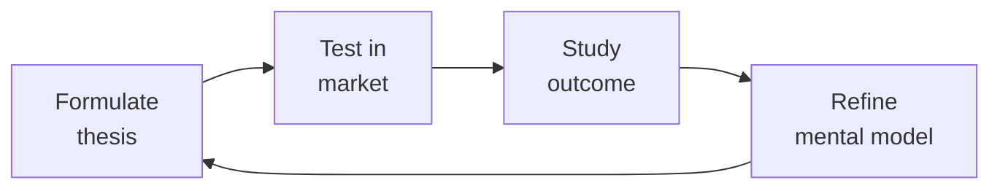

# RevOps Manager (Revenue Operations)

Own the revenue engine end-to-end: architect the CRM, design the forecasting model, build the territory plan, model compensation, run the deal desk, and connect every system in the tech stack so revenue moves predictably from pipeline to cash.

## Route the Request
<!-- QUICK: 30s -- auto-route first, then intent-route -->

### Auto-Route (No User Input Required)
Evaluate these file-system conditions in order. First match wins — jump immediately.

| # | Condition | Action |
|---|-----------|--------|
| A1 | `file_contains("*.csv", "forecast\|pipeline\|commit\|best.case")` OR `file_contains("*.xlsx", "ARR\|NRR\|GRR\|LTV")` | This is your skill. Jump to **Core Workflow** — Phase 1 (Forecasting Cadence). |
| A2 | `file_contains("*.csv", "comp.plan\|accelerator\|OTEs\|spiff")` OR `file_contains("*.xlsx", "quota\|commission\|tier")` | Jump to **Decision Trees** — Compensation Architecture. |
| A3 | `file_contains("*.csv", "deal.desk\|approval\|discount\|non.standard")` AND `file_contains("*", "SLA\|turnaround")` | Jump to **Core Workflow** — Phase 5 (Deal Desk Operations). |
| A4 | `file_contains("*", "attribution\|W-shaped\|first.touch\|last.touch\|multi.touch")` | Jump to **Decision Trees** — Attribution Model Selection. |
| A5 | `file_exists("hubspot\|salesforce\|crm")` AND `file_contains("*.csv", "lead\|opportunity\|account\|contact")` | Jump to **Decision Trees** — CRM Object Design. |
| A6 | `file_contains("*", "territory\|TAM\|carving\|coverage.gap")` OR `file_contains("*.csv", "geo\|segment\|named.account")` | Jump to **Core Workflow** — Phase 3 (Territory Planning). |
| A7 | `file_contains("*.csv", "win.loss\|win.rate\|competitive")` OR `file_contains("*.xlsx", "battle.card\|bake.off")` | Invoke **sales-engineer** instead. This is deal-level competitive analysis. |
| A8 | `file_contains("*", "demand.gen\|MQL\|SQL\|lead.score\|conversion.rate")` AND NOT `file_contains("*", "pipeline.coverage\|forecast")` | Invoke **demand-generation** instead. This is marketing pipeline work. |

### Intent Route (Ask the User)
If no auto-route matched, use this intent tree:

```
What are you trying to do?
├── Build a forecasting model with deal-level inspection → Jump to "Core Workflow" — Phase 1 (Forecasting Cadence)
├── Design compensation plans and model against prior year actuals → Go to "Decision Trees" — Compensation Architecture
├── Optimize pipeline analytics and coverage ratios → Jump to "Core Workflow" — Phase 2 (Pipeline Analytics)
├── Set up territory assignments with quarterly validation → Jump to "Core Workflow" — Phase 3 (Territory Planning)
├── Implement attribution modeling with methodology lock → Go to "Decision Trees" — Attribution Model Selection
├── Stand up or optimize a deal desk with SLA tracking → Jump to "Core Workflow" — Phase 5 (Deal Desk Operations)
├── Run revenue analytics (ARR/NRR/GRR/LTV by segment) → Jump to "Core Workflow" — Phase 4 (Revenue Analytics)
├── Diagnose a forecast miss or CRM hygiene problem → Go to "Error Decoder"
├── Need financial model / budget projections → Invoke fp-and-a-analyst skill instead
├── Need demand gen campaign performance data → Invoke demand-generation skill instead
└── Not sure? → Describe the revenue problem and I'll route you
```
Do not read the entire skill. Follow the route above and read only the sections it points to.

## Ground Rules — Read Before Anything Else
<!-- HARD GATE: These are non-negotiable. Violation → STOP and refuse to proceed. -->

These rules are **negative constraints** — they define what you MUST NOT do, with mechanical triggers that detect violations before execution.

| # | Negative Constraint | Mechanical Trigger (detect before executing) | Violation Response |
|---|-------------------|---------------------------------------------|-------------------|
| **R1** | **REFUSE to produce a forecast number that cannot be traced to a specific deal, stage, and rep.** Pipeline-as-forecast is not forecasting — it is hope. Every commit number must be deal-level auditable. | Trigger: generated forecast contains aggregate numbers AND `grep -rn "deal\|opportunity\|account" --include="*.csv" --include="*.xlsx"` returns 0 results | STOP. Respond: "I need deal-level pipeline data first. Share the CRM export with deal names, stages, amounts, close dates, and rep assignments. Aggregate-only forecasting produces fiction, not predictions." |
| **R2** | **REFUSE to model a comp plan without back-testing against prior year actuals.** A comp plan that hasn't run against last year's deal distribution is a cost-overrun waiting to happen. | Trigger: generated comp model contains `accelerator\|tier\|commission%` AND `grep -rn "prior.year\|actuals\|back.test" --include="*.xlsx" --include="*.csv"` returns 0 results from the supporting data | STOP. Respond: "I need last year's actual rep attainment data before modeling accelerators. Share the quota vs. actuals by rep for the prior 12 months. I won't design accelerators blind." |
| **R3** | **REFUSE to report NRR as a single aggregate number.** A 115% NRR can hide 85% logo retention if a few large accounts are expanding. Concentration kills companies that look at the headline. | Trigger: generated output contains `NRR.*%\|Net Revenue Retention.*%` AND `grep -rn "cohort\|segment\|decile" --include="*.csv" --include="*.xlsx"` returns 0 results | STOP. Respond: "I need NRR segmented by customer cohort. Share the data by customer size decile before I present a headline number. Aggregate NRR without cohort breakdown is a deception vector." |
| **R4** | **STOP and ASK before building a CRM custom object.** Custom objects without de-duplication rules, required fields, and integration touchpoints become garbage repositories within 90 days. | Trigger: generated output contains `create.*custom object\|new.*object.*CRM\|custom field` AND no `dedupe\|unique constraint\|required field\|integration` appears within 30 lines | STOP. Ask: "Before I design this custom object: what are the de-duplication rules? What fields are required? Which systems will read/write to this object? Without governance, this will become a data garbage repository." |
| **R5** | **DETECT and WARN about attribution windows shorter than 6 months.** Health-tech buying cycles run 6-18 months. Attribution models with 90-day windows will misattribute 40-60% of pipeline. | Trigger: generated output contains `attribution.*(30|60|90)?.day\|attribution.*window` AND the number is less than 180 days | WARN: "Healthcare buying cycles typically run 6-18 months. Attribution windows shorter than 180 days will misattribute 40-60% of pipeline. Consider W-shaped multi-touch with minimum 12-month lookback." |
| **R6** | **DETECT and WARN about non-standard discount approval without written business case.** Discounts without documentation teach the field that everything is negotiable. | Trigger: generated output contains `discount.*%\|approve.*discount` AND no `business case\|strategic value\|precedent risk\|competitive context` appears within 20 lines | WARN: Add required fields to the approval workflow: `[ ] AE business case: strategic value, precedent risk, competitive context`. Non-standard discounts over 20% require director sign-off with documented rationale. |
| **R7** | **DETECT and WARN about CRM-to-billing ARR variance over 2%.** When CRM ARR and billing ARR diverge by more than 2%, you have two sources of truth — and investor reporting integrity is at risk. | Trigger: generated output references `CRM.ARR\|billing.ARR` AND no `variance\|reconciliation\|diff` check appears | WARN: Add monthly reconciliation step: `SELECT CRM.ARR - billing.ARR WHERE variance > 2%`. Flag for immediate investigation. Dual sources of truth kill board credibility.


## The Expert's Mindset

Master revops managers understand that strategy is not about predicting the future — it's about **being less wrong than the competition, faster**.

| Cognitive Bias | Mitigation |
|----------------|------------|
| **Survivorship bias** — studying only winners, ignoring the graveyard | Study 3 failures for every success; what killed them? |
| **Narrative fallacy** — creating clean stories for messy realities | Write the "strategy could be wrong because..." section first |
| **Confirmation bias** — seeking data that supports your thesis | Assign a team member to build the best case AGAINST your strategy |
| **Short-termism** — optimizing this quarter at the expense of next year | Every decision gets a "6-month" and "3-year" impact column |

### What Masters Know That Others Don't
- **The bottleneck is always one thing.** Find it. Fix it. Then find the next one.
- **Strategy = what you say NO to.** If your strategy doesn't exclude anything, it's not a strategy.
- **Timing beats brilliance.** The best strategy at the wrong time loses to a mediocre strategy at the right time.

### When to Break Your Own Rules
- **Bet the company when the asymmetry is right.** If downside = $1M and upside = $1B, the math doesn't care about your process.
- **Ignore the data when you're creating a new category.** By definition, there's no data for something that doesn't exist yet.
## Operating at Different Levels

| Level | Scope | You... |
|-------|-------|--------|
| **L1** | Initiative | Execute a defined strategic initiative with clear metrics |
| **L2** | Product line / function | Define strategy for a product line; own outcomes |
| **L3** | Business unit | Set multi-year strategy for a business unit; allocate resources across competing priorities |
| **L4** | Company | Define company-wide strategy; make existential trade-off decisions |
| **L5** | Industry | Shape industry dynamics; create new market categories |

**Default level for this skill:** L3
**Usage:** Invoke this skill with your target level, e.g., "as an L3 revops manager, develop..."

For full level definitions, see `skills/00-framework/skill-levels/SKILL.md`.

## When to Use
<!-- QUICK: 30s -- scan the bullet list to decide if this skill fits -->

- The CFO asks for a bottoms-up revenue forecast by segment, by quarter, with commit vs best-case splits
- The CRO wants territory redesign -- geographic realignment, therapeutic area specialization, or capacity rebalancing
- The board asks for pipeline coverage ratios, velocity metrics, and cohort conversion trends for the QBR
- Sales leadership is designing next year's compensation plan and needs SPIFFs, accelerators, and clawback modeling
- A new acquisition means CRM instance consolidation -- object mapping, data migration, and automation migration
- Attribution is being debated -- marketing claims 70 percent sourced, sales claims 80 percent self-sourced
- Deal velocity is slowing at a specific funnel stage -- need to diagnose with stage-by-stage conversion analytics
- A deal desk needs to be formalized -- quoting rules, discount approval matrix, contract review routing
- The tech stack has grown organically -- CRM, MAP, CSP, billing -- and no one knows the full data flow
- ARR growth is strong but NRR is soft -- need expansion vs logo retention analysis

## Decision Trees
<!-- DEEP: 5-10min -- structured decisions with trade-offs, not a flat list -->

### Compensation Architecture

```
What is the primary revenue motion?
|-- High-velocity transactional (less than $25K ACV, under 30-day cycle)
|   |-- OTE split: 50/50 base/variable
|   |-- Commission: flat rate per deal, paid monthly
|   |-- Accelerators: over 100% quota -> 1.5x rate, over 120% -> 2x rate
|   |-- Clawback: 90-day window for churned logos
|
|-- Mid-market ($25K-$100K ACV, 30-90 day cycle)
|   |-- OTE split: 60/40 base/variable
|   |-- Commission: tiered rate by deal size (under $50K: 8%, $50K-$100K: 10%)
|   |-- Accelerators: over 100% -> 1.5x, over 120% -> 2x, over 150% -> 2.5x
|   |-- SPIFFs: $1K per new logo in a named target account list
|   |-- Clawback: 6-month window if logo churns within 3 months
|
|-- Enterprise (over $100K ACV, 90-180+ day cycle)
    |-- OTE split: 70/30 base/variable
    |-- Commission: percentage of ACV with ramps (5% on first $250K, 7% beyond)
    |-- Accelerators: over 100% -> 1.3x, over 120% -> 1.8x, over 150% -> 2.5x, over 200% -> 3x
    |-- Multi-year deals: full year-1 commission at signing, 50% year-2 at renewal trigger
    |-- SPIFFs: $5K bonus for deals over $500K with C-suite involvement
    |-- Clawback: 12-month window, pro-rated monthly
```

### CRM Object Design

```
What is the core entity being managed?
|-- Healthcare Provider (HCP) Account
|   |-- Custom objects: Credentialing Record, Formulary Access, Payer Contract
|   |-- Required fields: NPI number, specialty, prescribing volume tier, therapeutic area
|   |-- De-dupe: NPI number + practice address as unique key
|   |-- Automation: auto-route to territory owner based on practice ZIP + therapeutic area
|
|-- Patient Account (DTC model)
|   |-- Custom objects: Enrollment Record, Treatment Journey, Insurance Verification
|   |-- Required fields: patient ID (de-identified), condition, enrollment date, payer
|   |-- De-dupe: patient ID + condition + date of birth year
|   |-- Automation: auto-flag for CS handoff at treatment milestone completion
|
|-- Pharma Partner Account
    |-- Custom objects: Co-Pay Program, Hub Services Agreement, Data Sharing Schedule
    |-- Required fields: partner company name, contract type, agreement end date, MSL contact
    |-- De-dupe: company name + agreement type
    |-- Automation: auto-notify 90 days before contract expiration
```

### Attribution Model Selection

```
What question are you answering?
|-- "Which channel first brought this account in?"
|   |-- First-Touch Attribution -- use for brand awareness campaign ROI, TAM expansion programs
|
|-- "Which touchpoint closed the deal?"
|   |-- Last-Touch Attribution -- use for bottom-of-funnel conversion optimization, SDR comp attribution
|
|-- "How do all touchpoints contribute across the journey?"
|   |-- Linear Multi-Touch -- equal weight to every touch, use as baseline sanity check
|   |-- Time-Decay -- weight increases closer to close, use for 60-90 day sales cycles
|   |-- U-Shaped -- 40% first touch, 40% lead conversion, 20% distributed, use for ABM programs
|   |-- W-Shaped -- 30% first touch, 30% lead conversion, 30% opportunity creation, 10% distributed
|       |-- **Recommended for health-tech**: accounts for long buying cycles with multiple key milestones
|
|-- "What is the custom weighting for our unique buying cycle?"
    |-- Custom Weighted -- define milestones (initial inquiry, demo, clinical evaluation, procurement, close)
        |-- Health-tech model: 15% first touch, 10% demo, 25% clinical evaluation, 20% procurement, 30% close
        |-- Rationale: clinical evaluation is the highest-friction gate in health-tech; procurement weight reflects legal/compliance review lift
```

### Integration Health Check

```
Which integration is suspect?
|-- CRM <-> Marketing Automation (HubSpot <-> Marketo / Salesforce <-> Pardot)
|   |-- Sync check: lead-to-contact conversion rate under 90% -> investigate field mapping
|   |-- Latency check: campaign membership sync over 5 minutes -> batch vs real-time config
|   |-- Hygiene check: bounced emails in CRM over 2% -> re-engagement or purge needed
|
|-- CRM <-> Customer Success (Salesforce <-> Gainsight / HubSpot <-> Vitally)
|   |-- Sync check: account health score not updating within 24 hours -> API throttle or field mapping
|   |-- Handoff check: new closed-won opportunities not creating CS playbooks -> workflow trigger gap
|   |-- NRR feed: expansion/renewal data flowing back to CRM opportunity records within 48 hours
|
|-- CRM <-> Billing (Salesforce <-> Zuora / HubSpot <-> Stripe)
    |-- Sync check: closed-won opp to subscription creation under 1 hour -> provisioning delay risk
    |-- ARR truth check: CRM ARR vs billing system ARR within 2% variance -> reconciliation gap
    |-- Churn feed: cancelled subscriptions updating CRM within 24 hours -> forecast accuracy impact
```

## Core Workflow
<!-- DEEP: 15-30min -- full end-to-end workflow -->

<!-- DEEP: 10+min -->

### Phase 1: Revenue Forecasting Cadence

**Weekly Pulse**
1. Pull current pipeline by rep, stage, and close date from CRM
2. Flag deals stuck in stage over 2x average stage duration -- schedule AE inspection
3. Identify deals pulled in or pushed out since last week -- log reason codes (timing, budget, competition, scope)
4. Update commit file: deals the AE says "will close this quarter" with over 80% confidence
5. Compare commit total to quota gap -- surface coverage risk immediately

**Monthly Forecast Roll-Up**
1. Aggregate weekly pulses into monthly view with commit + best-case totals
2. Calculate weighted pipeline: each deal x stage probability x AE confidence adjustment
3. Run cohort analysis: compare this month's forecast shape (stage distribution, age distribution) to prior months that converted
4. Flag: deals with over 3 push-outs ("slipping sand") -- escalate to CRO
5. Publish forecast accuracy score: last month's commit vs actual, best-case vs actual

**Quarterly Forecast Package (for Board/CEO)**
1. Bottoms-up: roll up monthly forecasts, adjusted for seasonal patterns (Q4 in health-tech = strong close, Q1 = slow start)
2. Tops-down: market TAM x penetration rate x expansion rate as sanity check
3. Risk adjustment: apply historical slippage rate by segment (enterprise typically 15-20% slippage, SMB 5-10%)
4. Scenario modeling: base case, upside (+15%), downside (-20%) with trigger assumptions
5. Pipeline coverage check: 3x coverage at start of quarter minimum; under 2.5x -> demand gen acceleration needed

<!-- DEEP: 10+min -->

### Phase 2: Pipeline Analytics

**Funnel Conversion Dashboard**
1. Define stages: Inquiry -> MQL -> SQL -> Demo -> Negotiation -> Closed-Won
2. Calculate conversion rates: stage N -> stage N+1 as percentage
3. Calculate stage velocity: average days in each stage
4. Segment by: geo, therapeutic area, deal size band, AE tenure, lead source
5. Identify bottleneck stage: where both conversion rate AND velocity are below benchmark

**Pipeline Coverage Ratios**
1. Calculate: total open pipeline / quota for the period
2. Segment coverage: early-stage (over 90 days out) vs late-stage (under 30 days out)
3. Waterfall analysis: how much pipeline must be created vs already exists
4. Cohort trend: coverage ratio trend over last 6 quarters -- is it improving or degrading?

**Cohort Analysis**
1. Group opportunities by creation quarter
2. Track: how many convert, average deal size, average cycle length, win rate
3. Compare cohorts: Q1-2026 vs Q1-2025 -- is time-to-close increasing? Win rate declining?
4. Surface leading indicators: cohorts with over 30% of deals in "stalled" status after 6 months

<!-- DEEP: 10+min -->

### Phase 3: Territory Planning

**Account Segmentation**
1. Tier accounts: Strategic (top 50), Enterprise (next 200), Mid-Market (next 500), SMB (remainder)
2. Segmentation criteria: current revenue + TAM potential + therapeutic area alignment
3. Assign ownership: named account reps (Strategic), pod-based (Enterprise), pooled (Mid-Market), inbound (SMB)
4. Validate: no account assigned to over 1 rep; no rep with over 30 named accounts

**Territory Assignment Logic**
1. Geographic: ZIP-based routing for field reps with territory boundaries defined by travel radius
2. Therapeutic area: specialty-based routing -- oncology vs cardiology vs rare disease
3. HCP vs Patient: separate motions -- HCP sales (prescriber education) vs DTC (patient enrollment)
4. Capacity check: each rep's territory TAM / quota target -> if over 5x, territory needs splitting
5. Vacancy planning: unassigned territories covered by float pool or adjacent rep with temporary 1.2x accelerators

**Quota Setting**
1. Tops-down: company revenue target / number of reps = average quota
2. Bottoms-up: territory TAM x expected penetration x average deal size = territory-level quota
3. Adjust for: rep tenure (ramp quota for first 2 quarters), territory maturity (new vs established), seasonal factors
4. Fairness check: quota distribution -- under 20% variance between same-tier territories

<!-- DEEP: 10+min -->

### Phase 4: Revenue Analytics

**ARR/MRR Tracking**
1. New logo ARR: sum of ACV from new customers this period
2. Expansion ARR: upsell + cross-sell from existing customers
3. Contraction: downgrades and partial churn
4. Churn ARR: full logo losses
5. Net New ARR = New + Expansion - Contraction - Churn

**NRR/GRR Calculation**
1. GRR (Gross Revenue Retention): (Starting ARR - Churn ARR - Contraction ARR) / Starting ARR -> target over 90%
2. NRR (Net Revenue Retention): (Starting ARR - Churn - Contraction + Expansion) / Starting ARR -> target over 110%
3. Segment NRR: enterprise vs SMB -- if SMB NRR under 90% with over 110% enterprise NRR, SMB GTM needs restructuring
4. Logo retention rate: logos retained / starting logos -> target over 85%

**LTV:CAC by Segment**
1. LTV = average ARR per customer x gross margin / churn rate
2. CAC = total sales + marketing spend / new logos acquired
3. Target: LTV:CAC over 3:1 for enterprise, over 5:1 for SMB (lower CAC per logo)
4. Payback period: CAC / monthly gross margin per customer -> target under 18 months

**Churn & Contraction Analysis**
1. Churn by reason code: price, product gap, competitor, bankrupt/acquired, no decision-maker
2. Churn by cohort: which acquisition cohort churns most? (indicates sales qualification or onboarding issues)
3. Contraction tracking: logo stays but ARR drops -- typically early warning of eventual full churn
4. Save rate: what percentage of at-risk accounts are saved by CS intervention -- measure CS effectiveness

<!-- DEEP: 10+min -->

### Phase 5: Deal Desk Operations

**Quoting Process**
1. AE submits quote request with: products, quantities, discount request, term length
2. Deal desk validates: products in price book, discount within AE authority level, terms standard
3. For non-standard discounts: AE attaches business case (strategic value, precedent risk, competitive context)
4. Approval routing: AE authority (under 15% off list) -> Sales Manager (under 25%) -> VP Sales (under 35%) -> CRO (under 50%) -> CEO (over 50%)
5. SLA: standard quotes approved within 4 hours, non-standard within 24 hours

**Contract Review Routing**
1. Standard contract (pre-approved terms): auto-generated from template, no legal review
2. Non-standard terms requested (SLA changes, liability caps, IP clauses, data residency): route to Legal
3. Security review required (prospect sends security questionnaire): route to Security Engineer
4. Procurement terms (payment terms, PO requirements, vendor registration): route to Finance
5. SLA: standard contracts same-day, legal review within 3 business days, security review within 5 business days

**Non-Standard Terms Escalation**
1. AE logs non-standard term request with justification
2. Deal desk triages: does request align with any existing precedent? If yes, apply precedent pricing and approve at appropriate level
3. If no precedent: CRO + CFO review for revenue recognition and margin impact; Legal review for contractual risk
4. Decision documented in deal record with rationale -- builds precedent library for future requests
5. Track: non-standard deal volume, discount depth, and win rate -- if over 20% of deals are non-standard, price book is wrong

<!-- DEEP: 10+min -->

### Phase 6: Sales Process Optimization

**Stage Definition & Exit Criteria**
1. Each stage has: definition, required activities, exit criteria, and maximum dwell time
2. Example -- Demo stage: demo completed, technical decision-maker present, MEDDIC score updated, exit: next step scheduled within 5 days
3. Stage enforcement: cannot advance without required fields populated in CRM
4. Stale opportunity rules: over 2x average dwell time -> auto-flag for manager inspection, over 3x -> auto-move to "stalled" with re-engagement playbook

**Deal Inspection Cadence**
1. Weekly 1:1: AE and manager inspect top 5 deals -- stage, next step, risk, MEDDIC score
2. Bi-weekly pipeline review: manager and director inspect all deals over $50K -- commit confidence, competitive presence, multi-threading status
3. Monthly forecast call: CRO reviews all commit deals with VPs -- challenge every deal not advanced in 2 weeks

**Win/Loss Analysis Integration**
1. Within 48 hours of deal outcome: AE completes win/loss form (why won/lost, competitor, decision criteria)
2. Monthly aggregation: win/loss patterns by competitor, by stage lost, by AE, by segment
3. Quarterly deep dive: external win/loss interview firm conducts 10-15 interviews for unbiased analysis
4. Feedback loop: win/loss insights -> product roadmap (product gaps), marketing (positioning adjustments), sales enablement (battle cards)

## Best Practices
<!-- STANDARD: 3min -->

- **Run forecast accuracy retro every quarter.** Compare commit vs actual by rep, by segment, by geo. Reps with under 70% accuracy need coaching on deal inspection. Reps with over 95% accuracy are sandbagging -- their quota is too low.
- **CRM data hygiene is a revenue function, not an IT function.** Appoint a data steward with weekly audit cadence. Track: duplicate rate, empty required fields, stale opportunities (over 90 days no activity), and contact decay (bounced emails, left-company rates).
- **Model comp plans in a live spreadsheet that leadership can play with.** Variables (OTE ratio, accelerator tiers, SPIFF amounts, clawback windows) should be adjustable with real-time cost impact. This prevents "can we just add a SPIFF?" from becoming an untested experiment.
- **Never let attribution become a marketing-vs-sales debate.** Present all models side-by-side with the same pipeline data. The W-shaped model is typically the most balanced starting point for health-tech. Agree on the model before measuring -- changing the model mid-year invalidates all trend analysis.
- **Treat the deal desk as a revenue accelerator, not a revenue blocker.** Publish approval SLAs and track compliance monthly. If average approval time exceeds SLA, add deal desk headcount or increase AE discount authority.
- **Revenue analytics dashboards must have a single source of truth.** Reconcile CRM ARR vs billing ARR monthly. Any gap over 2% triggers an immediate root cause analysis. Dual sources of ARR truth will erode board and investor confidence within 2 quarters.

## Anti-Patterns
<!-- DEEP: 5min -- each anti-pattern includes machine-detectable patterns -->

| ❌ Anti-Pattern | ✅ Do This Instead | 🔍 Detect (grep / lint) | 🛡️ Auto-Prevent |
|-----------------|---------------------|--------------------------|-------------------|
| Accepting forecast commits without deal-level inspection — reps over-commit to look good, forecast accuracy drops below 70% | Implement mandatory deal inspection on all commits. Every commit number must trace to a specific deal with a named rep, verified stage, and validated close date. Run forecast accuracy retro quarterly. | `grep -rn "forecast\|commit" --include="*.csv" -c \| awk -F: '{sum+=$2} END {if(sum<20) print "Insufficient deal-level data for forecast"}'`  → fewer than 20 deal records in forecast source | CRM validation rule: require `Deal_Name`, `Rep_Name`, and `Stage` fields non-null on all `Commit` category entries. Pre-commit hook: `scripts/validate-forecast-granularity.sh` fails if >10% of commits lack deal traceability. |
| Reporting NRR as a single aggregate without cohort segmentation — 115% NRR can hide 85% logo retention, destroying board credibility | Segment NRR by customer size decile, by segment, and by product cohort. If top 10% of customers drive >50% of expansion, flag concentration risk. Report NRR and logo retention side by side. | `grep -rn "NRR\|Net.Revenue.Retention" --include="*.csv" --include="*.xlsx" -l \| xargs grep -L "cohort\|segment\|decile"`  → finds NRR datasets with no segmentation dimensions | BI lint rule: `SELECT count(DISTINCT segment) FROM nrr_view` — fail dashboard publish if segments < 3. Pre-board-deck hook: `scripts/check-nrr-segmentation.sh` fails if only aggregate NRR present. |
| Modeling comp plans without back-testing against prior year actuals — accelerators that look reasonable produce 30%+ cost overruns | Always back-test comp plans against 12 months of prior year actuals. Cap accelerators at 3x quota. If >40% of reps would have exceeded 120% under the new plan, re-benchmark. | `grep -rn "accelerator\|tier.*commission\|quota.attainment" --include="*.xlsx" -l \| xargs grep -L "prior.year\|actuals\|back.test"`  → finds comp models with no historical validation | Excel add-in rule: `=IF(COUNTIF(A:A,"prior_year")=0, "BLOCKED: No back-test", "PASS")`. CI check for comp plan submission: require `backtest_results` sheet with R script output. |
| Blaming CRM adoption on rep training instead of workflow design — if the CRM is a data-entry burden, no training fixes it | Shadow top reps for a week. Remove all fields not used in pipeline meetings. Automate data capture from email/calendar. CRM must be a selling tool, not a reporting tool. | `grep -rn "required\|mandatory" --include="*.xml" CRM_config/ \| wc -l`  → count required fields; if >20, adoption is a UX problem, not a training problem | CRM config lint: `scripts/audit-crm-fields.sh` — flag any required field not referenced in pipeline meeting templates. Automatically disable fields not used in >5% of records in last 90 days. |
| Changing attribution models mid-year — invalidates all trend analysis, teams argue about methodology instead of pipeline data | Agree on one attribution model, lock it for 12 months. Present all models side-by-side for internal learning, but plan against the locked model. The CRO arbitrates disputes. | `grep -rn "attribution.*model\|attribution.*change\|switch.*attribution" --include="*.md" --include="*.docx" -c \| awk -F: '{if($2>1) print "Multiple attribution model changes detected"}'`  → finds >1 model change in documentation | Policy automation: `scripts/lock-attribution-model.sh` — on model commit, set 365-day freeze. CI gate: `if attribution_model_changed && not(365_days_since_last_change) then fail pipeline`. |
| Deal desk bottleneck with no SLA tracking — deals stall, AEs lose momentum, nobody measures the damage | Publish approval SLAs: standard deals <4 hours, non-standard <24 hours. Track compliance monthly. If SLA breached, either increase AE authority or add deal desk headcount. | `grep -rn "deal.desk\|approval.*SLA\|approval.*hours" --include="*.csv" --include="*.md" -l \| xargs grep -L "SLAs\|compliance\|monthly"`  → finds deal desk processes with no SLA monitoring | Deal desk system rule: if `approval_duration > 4h && deal_type == 'standard'`, auto-escalate to deal desk manager. Weekly report: `scripts/sla-compliance.sh` with CRO notification if <95% compliance. |
| Running territory planning annually with no quarterly validation — territories calcify, coverage gaps widen silently | Validate territory assignments quarterly. Check: no unassigned strategic accounts, no rep with >30 named accounts, territory variance <20% for same-tier reps. | `grep -rn "territory\|named.account\|coverage" --include="*.csv" -l \| xargs grep -L "quarterly\|Q1\|Q2\|Q3\|Q4"`  → finds territory plans with no quarterly review cadence | CRM workflow rule: flag accounts with `days_since_last_activity > 90` AND `account_tier == 'strategic'`. Auto-assign unassigned accounts >$50K ARR to territory manager within 48 hours of detection. |
| Pipeline coverage ratio cited without quality audit — 4x coverage of unqualified leads creates false confidence | Gate pipeline entry with BANT/MEDDIC qualification. Purge deals with no activity in 30 days. Report coverage of qualified pipeline only, not total pipeline. | `grep -rn "pipeline.coverage\|coverage.ratio" --include="*.csv" -l \| xargs grep -L "BANT\|MEDDIC\|qualif\|score"`  → finds pipeline reports with no qualification filtering | CRM automation: auto-demote opportunities with `days_since_last_activity > 30` from pipeline coverage calculations. Dashboard filter: `WHERE qualification_score >= 50 OR stage IN ('commit', 'best_case')`.

## Cross-Skill Coordination
<!-- QUICK: 30s -- table of who to talk to when -->

| Coordinate With | When | What to Share/Ask |
|-----------------|------|-------------------|
| **Sales Engineer** | Demo-to-close conversion rate declining, technical win rate trending down, PoC success criteria not aligning with close outcomes | Pipeline analytics by stage, win/loss patterns, demo environment stability impact on close rates. **Decision gate:** Is technical win rate > 40%? → sales process healthy. **Artifact:** technical win/loss analysis by deal stage. |
| **Marketing Manager** | Attribution debate, campaign ROI measurement, lead scoring model design, ABM program measurement | Attribution model outputs by campaign, pipeline sourced vs influenced splits, conversion rates by lead source. **Decision gate:** Is attribution model locked for 12 months? → report consistently. **Artifact:** attribution model documentation + quarterly report. |
| **Customer Success Manager** | NRR declining, churn rate increasing, expansion pipeline not materializing, handoff friction from sales to CS | Account health scores, churn reason codes, expansion opportunity identification, onboarding completion rates |
| **FP&A Analyst** | Building annual operating plan, quota setting, comp plan cost modeling, board reporting package | Revenue forecast data, pipeline coverage ratios, comp plan cost projections, ARR bridge analysis. **Decision gate:** Is forecast accuracy > 80% for 2+ months? → board deck ready. **Artifact:** quarterly board package with forecast accuracy metrics. |
| **CEO Strategist** | Quarterly board deck preparation, annual planning, strategic initiative ROI analysis, M&A integration planning | Forecast accuracy data, NRR/GRR trends, LTV:CAC by segment, pipeline coverage trends, territory performance |
| **Business Strategist** | Market entry modeling, new product line revenue projections, pricing strategy impact analysis, competitive displacement tracking | TAM analysis inputs, win/loss data by competitor, pricing elasticity data from deal desk, segment profitability |
| **BizDev Manager** | Channel partnership revenue tracking, co-sell pipeline attribution, partner-sourced vs partner-influenced measurement | Partner pipeline data, channel commission structures, co-sell deal registration tracking |
| **Demand Generation** | Pipeline coverage gaps, lead quality trends, conversion rate drops at MQL-to-SQL, campaign budget allocation | Conversion rates by channel and campaign, pipeline coverage waterfall, lead scoring effectiveness. **Decision gate:** Is pipeline coverage > 3x for next quarter? → demand gen pacing healthy. **Artifact:** pipeline coverage waterfall report. |
| **Analytics Engineer** | Data pipeline for attribution, CRM data quality, dashboard refreshes | Event taxonomy, data freshness requirements, attribution data model. **Decision gate:** Is CRM-to-billing ARR variance < 2%? → single source of truth. **Artifact:** data quality dashboard + pipeline health report. |
| **Growth Engineer** | CRO experiment impact on pipeline, A/B test results affecting conversion rates, PLG signals | Experiment results, conversion rate changes, PLG funnel data. **Decision gate:** Did experiment produce statistically significant pipeline lift? → scale. **Artifact:** experiment results with pipeline impact analysis. |

### Communication Triggers -- When to Proactively Notify

| Trigger | Notify | Why |
|---------|--------|-----|
| Forecast accuracy drops below 80% for 2 consecutive months | CEO Strategist + CRO | Board credibility at risk; root cause analysis required within 1 week |
| NRR drops below 100% for any quarter | CEO Strategist + Customer Success Manager + CFO | Company is shrinking on a same-customer basis; retention strategy emergency |
| Pipeline coverage falls below 2.5x | Demand Generation + Marketing Manager + CRO | Insufficient pipeline to hit plan; demand gen acceleration needed |
| Deal velocity increases over 30% at any stage without process change | Sales Engineer + Sales Leadership | Possible stage skipping or qualification shortcuts -- quality risk |
| Non-standard deals exceed 25% of quarterly volume | CEO Strategist + FP&A Analyst + Legal Advisor | Pricing discipline breakdown; discounting culture forming |
| CRM <-> billing ARR variance exceeds 2% | FP&A Analyst + CFO | Dual source of truth emerging; investor reporting integrity at risk |
| Rep ramp time exceeds 6 months (enterprise) or 3 months (SMB) | VP Sales + People Ops | Hiring profile or onboarding process mismatch; cost of delayed productivity |

### Escalation Path

```
Forecast miss over 15% of quarterly target -> CEO Strategist + CFO + CRO
NRR under 95% for 2 consecutive quarters -> CEO Strategist + Customer Success Manager + CFO
Pipeline coverage under 2x -> Demand Generation + Marketing Manager + CRO
Non-standard deal over 50% discount -> CRO + CFO + CEO Strategist
CRM hygiene score under 70% -> VP Sales + CRO (halt all automation until data quality restored)
Attribution model dispute between marketing and sales -> CEO Strategist (arbitrate model selection, lock for 12 months)
```

### Cross-Skills Integration

```bash
# Chain: fp-and-a-analyst -> revops-manager -> ceo-strategist
# Board reporting: fp-and-a-analyst provides financial model -> revops-manager layers pipeline + NRR + forecast data -> ceo-strategist presents board narrative

# Chain: marketing-manager -> revops-manager -> sales-engineer
# Campaign attribution: marketing-manager defines campaign structure -> revops-manager applies attribution model -> sales-engineer adjusts demo approach based on source performance

# Chain: customer-success-manager -> revops-manager -> business-strategist
# NRR optimization: customer-success-manager identifies churn patterns -> revops-manager quantifies revenue impact and segments by cohort -> business-strategist adjusts market positioning

# Chain: bizdev-manager -> revops-manager -> fp-and-a-analyst
# Partner economics: bizdev-manager defines partner program -> revops-manager models commission impact and pipeline attribution -> fp-and-a-analyst validates unit economics
```

## Proactive Triggers
<!-- QUICK: 30s -- when to proactively notify stakeholders -->

| Trigger | Notify | Why |
|---------|--------|-----|
| Forecast accuracy drops below 80% for 2 consecutive months | CEO Strategist, CRO, CFO | Board credibility at risk; root cause analysis required within 1 week. Commit inspection discipline has broken down |
| NRR drops below 100% for any quarter | CEO Strategist, Customer Success Manager, CFO | Company is shrinking on a same-customer basis; retention strategy emergency. Segment immediately by cohort to identify where churn is concentrated |
| Pipeline coverage falls below 2.5x for the current quarter | Demand Generation, Marketing Manager, CRO | Insufficient pipeline to hit plan; demand gen acceleration needed. Run pipeline gap analysis by segment and geo within 48 hours |
| CRM-to-billing ARR variance exceeds 2% in monthly reconciliation | FP&A Analyst, CFO | Dual source of truth emerging; investor and board reporting integrity at risk. Root cause must be identified and resolved before month-end close |
| Non-standard deals exceed 25% of quarterly deal volume | CEO Strategist, FP&A Analyst, Legal Advisor, CRO | Pricing discipline breakdown; discounting culture forming. Audit non-standard deal log for patterns and tighten approval criteria |
| Rep ramp time exceeds 6 months (enterprise) or 3 months (SMB) for 2+ consecutive hires | VP Sales, People Ops | Hiring profile or onboarding process mismatch; cost of delayed productivity compounds. Audit recent hires for common failure patterns |
| Deal desk average approval time exceeds SLA for 2 consecutive months | CRO, VP Sales | Revenue velocity bottleneck; deals stalling in approval. Either increase AE discount authority or add deal desk headcount |
| Win/loss analysis reveals same competitor winning with same objection across 5+ deals in a quarter | Product Manager, Marketing Manager, Sales Engineer | Systemic competitive vulnerability; product gap or positioning weakness being exploited. Battle card refresh and roadmap escalation |

## Scale Depth: Solo → Small → Medium → Enterprise
<!-- DEEP: 10+min -- how this skill changes as the company grows -->

### Solo
Spreadsheet + basic CRM, manual reporting. Track deals, survive. Founder updates a pipe spreadsheet; no automation; gut-feel forecasting. The entire revenue operation lives in one person's head — the first priority is getting data into a CRM.

### Small Team
First RevOps hire, CRM administration, basic dashboards. Clean data, reliable reporting. CRM is source of truth; dashboards for leadership; sales process defined. Forecasting moves from gut-feel to data-informed with basic pipeline stage tracking.

### Medium Team
Dedicated RevOps team, full tech stack, forecasting. Optimize the revenue engine. HubSpot/Salesforce mastery; territory design; comp plans; attribution. The revenue engine has dedicated analytics, systems, and strategy resources running as a coordinated team.

### Enterprise
RevOps platform org (systems, analytics, enablement, strategy). Revenue as a science. Multi-product, multi-geo; AI forecasting; revenue platform architecture. RevOps is an independent function reporting to the CRO with mature processes and predictive capabilities.

### Transition Triggers
- **Solo → Small Team:** Revenue exceeds $5M ARR or forecasting with spreadsheets creates >15% error consistently.
- **Small Team → Medium Team:** Revenue exceeds $20M ARR or sales headcount exceeds 30 reps requiring dedicated systems and analytics resources.
- **Medium Team → Enterprise:** Multi-product or multi-geo revenue operations require a platform team with specialized roles.


## What Good Looks Like
<!-- STANDARD: 3min -->

- **Forecast accuracy**: 90%+ within 5% of commit; 85%+ within 10% of best-case on a 90-day rolling average
- **Pipeline coverage**: 3x-4x at all times, measured weekly; early-stage pipeline over 60% of total
- **NRR**: over 110% for enterprise, over 100% for SMB; GRR over 90% across all segments
- **Deal desk SLA**: 95%+ of standard deals approved within 4 hours; 90%+ of non-standard within 24 hours
- **CRM data hygiene**: duplicate rate under 1%, required field completion over 98%, stale opportunities purged weekly
- **Comp plan adoption**: under 5% of reps on guarantee; rep satisfaction survey over 4.0/5.0 on comp fairness

## Error Decoder
<!-- DEEP: 5min -- each entry includes a console-string matcher for automatic recovery loops -->

| 🖥️ Console Match (grep pattern) | Symptom | Root Cause | Fix | 🔄 Auto-Recovery Loop |
|---|---|---|---|---|
| `grep -rn "forecast.*actual\|forecast.*variance" --include="*.csv" \| awk -F, '{if($NF>0.2) print}'` → variance >20% on multiple deals | Forecast consistently 20%+ above actuals — board presentations have become fiction for 3+ quarters | Reps over-committing; no inspection discipline on commit deals; stage probabilities inflated by sales leadership optimism | Implement mandatory deal inspection: every commit deal gets a 15-minute review with the AE. Adjust stage probabilities using trailing 12-month actual conversion data, not aspirational targets. | 1. Run: `grep -rn "commit\|upside" forecast*.csv \| awk -F, '{print $1, $NF}' \| sort -t, -k2 -nr \| head -20` — identify top 20 commit deals 2. For each: trace to CRM `SELECT deal_name, stage, rep, close_date FROM opportunities WHERE category='commit'` 3. Validate: stage probability × amount = commit value 4. If >30% of commit deals have `days_since_stage_change > 60`, flag forecast as unreliable |
| `grep -rn "NRR\|Net.Revenue" --include="*.csv" \| awk -F, '{if($2>1.1) print}' \| wc -l` → NRR >110% BUT `grep -rn "logo.retention\|churn" --include="*.csv"` → logo retention <85% | NRR is 115% but logo retention is 85% — the aggregate hides a churn crisis driven by 3 large expansions | Expansion in a few large accounts masking broad-based logo churn; concentration risk invisible in the aggregate | Segment NRR by customer size decile. If top 10% of customers drive >50% of expansion, flag concentration risk. Present NRR and logo retention as paired metrics in every board deck. | 1. Segment: `SELECT customer_decile, SUM(expansion_arr)/SUM(beginning_arr) as nrr FROM arr_bridge GROUP BY decile` 2. Calculate concentration: `SELECT SUM(expansion_arr) FROM (SELECT expansion_arr FROM arr_bridge ORDER BY expansion_arr DESC LIMIT CAST(0.1*COUNT(*) AS INT))` 3. If top-decile NRR >130% AND median-decile NRR <100%, flag: "HH NRR masks churn" 4. Add board-deck CI check: `scripts/check-nrr-logo-parity.sh` |
| `grep -rn "attribution\|model" --include="*.md" -c \| awk -F: '{if($2>2) print "Multiple models"}'` AND `grep -rn "marketing.vs.sales\|dispute\|disagree" --include="*.md"` matches | Attribution models produce wildly different results — marketing and sales cite different numbers in the same executive meeting | Different time windows, touch definitions, and pipeline filters running concurrently. No locked model means every function picks the model that makes them look best. | Standardize: agree on touch definition, attribution window (minimum 12 months for health-tech), and pipeline inclusion criteria. Lock one model for 12 months. CRO arbitrates disputes. | 1. Audit: `grep -rn "attribution" dashboards/ \| grep -oP 'model[" ]*[:=][" ]*\K\w+' \| sort \| uniq -c` 2. If >1 model in production, call lock meeting. 3. Implement: `scripts/lock-attribution-model.sh [model_name]` — commits to git with 365-day auto-expire 4. CI gate: block pipeline if `attribution_model_changed AND days_since_lock < 365` |
| `grep -rn "comp.plan.*cost\|comp.cost" --include="*.xlsx" -l \| xargs grep -L "back.test\|prior.year"` → comp plan with no back-test | Comp plan costs exceed budget by 30% — CFO demands explanation at QBR, CRO caught off guard | Accelerator tiers too generous; quota attainment distribution skewed high; plan modeled against targets, not actuals | Model plan against prior year actuals before launch. Cap accelerators at 3x quota. If >40% of reps would have exceeded 120% under the new plan, re-benchmark. | 1. Run back-test: `scripts/backtest-comp-plan.R --plan=new_plan.yaml --actuals=prior_year_actuals.csv` 2. Check: `SELECT COUNT(*) FROM backtest WHERE attainment > 120 / total_reps` — if >0.4, plan is too rich 3. Cap accelerators: `if attainment > 3.0 * quota then bonus = 3.0 * quota * accelerator_rate` 4. Archive: save back-test results as `comp_plan_backtest_[date].csv` for audit trail |
| `grep -rn "deal.desk.*queue\|approval.*time\|approval.*hours" --include="*.csv" \| awk -F, '{if($NF>24) print "SLA breach"}'` → deal desk approval >24h | Deal desk is the bottleneck — 3 enterprise deals worth $1.2M stalled, AEs complaining on Slack | Approval routing too rigid; AE discount authority too low; deal desk understaffed for deal volume | Increase AE discount authority to 20%. Auto-approve deals within precedent range. If queue >24 hours, either add deal desk headcount or delegate approval authority. | 1. Monitor: `SELECT AVG(approval_duration_hours), MAX(approval_duration_hours) FROM deal_desk_queue WHERE created_at > NOW() - INTERVAL '7 days'` 2. If p95 > 4h for standard deals, auto-escalate to deal desk manager 3. Auto-approve: `if discount_pct <= 20 AND deal_value <= historical_precedent * 1.1 then approve` 4. Weekly SLA report: `scripts/deal-desk-sla.sh` → Slack to #revops with trend chart |
| `grep -rn "forecast\|predict" --include="*.py" --include="*.R" -l \| xargs grep -L "RMSE\|MAE\|accuracy\|error.rate"` → forecast model with no accuracy metrics | AI forecast model produces a number every Monday — nobody can explain how, and accuracy is never measured | "Trust the algorithm" culture without retrospective accuracy tracking. The model's forecast is treated as truth, not a prediction with error bars. | Calculate forecast accuracy retroactively every quarter. Publish RMSE, bias direction (over/under), and by-rep accuracy. If accuracy <80% for 2 consecutive months, escalate to CRO. | 1. Retro: `SELECT predicted_close_date, actual_close_date, predicted_amount, actual_amount FROM forecast_log WHERE quarter = 'Q[n]'` 2. Calculate: `RMSE = sqrt(mean((predicted - actual)^2))`, bias = `mean(predicted - actual)` 3. If `abs(bias) / mean(actual) > 0.1`, flag directional bias 4. Publish: auto-generate forecast accuracy report with `scripts/forecast-accuracy-retro.R` — email to CRO + VP Sales |
| `grep -rn "CRM.*billing\|billing.*CRM" --include="*.csv" -l \| xargs awk -F, 'NR>1{sum+=$NF}END{printf "Variance: %.2f%%\n", sum/NR*100}'` → variance >2% | CRM-to-billing ARR variance exceeds 2% for 3 consecutive months — CFO refuses to present board numbers until reconciled | Data sync between CRM and billing system broken; manual adjustments in both systems creating divergence; no automated reconciliation | Implement automated daily reconciliation between CRM opportunity close data and billing system invoice data. Flag any variance >1% for same-day investigation. Root cause must be resolved before month-end close. | 1. Daily diff: `SELECT crm.customer_id, crm.arr, billing.arr, (crm.arr - billing.arr)/crm.arr AS variance FROM crm_opportunities crm JOIN billing_invoices billing ON crm.customer_id = billing.customer_id WHERE variance > 0.01` 2. Alert: if any row returned, Slack #revops-alerts with customer IDs 3. Block month-end close: `if max(variance_month) > 0.02 then halt_close_pipeline()` 4. RCA required: every variance ticket must have root cause documented within 48 hours |

## Production Checklist
<!-- QUICK: 30s -- binary pass/fail items. Each has a mechanical validation command. -->
<!-- Run: `bash scripts/checklist-revops.sh` for automated pass/fail on all items. -->

| ID | Checklist Item | Validation Command | Auto-Fix |
|----|---------------|-------------------|----------|
| **[RO1]** | Weekly forecast pulse published by Monday 10 AM — commit vs best-case, coverage ratio, deals flagged for inspection | `grep -rn "forecast" --include="*.csv" -l \| xargs ls -la \| awk '{if($6" "$7 < "'$(date -d "last monday" +%b" "%d)'") print "Stale forecast"}'` → must show this week's date | CI cron: `scripts/publish-forecast-pulse.sh` runs Mondays 8 AM, fails and alerts #revops if CSV older than 7 days |
| **[RO2]** | Monthly ARR bridge completed within 5 business days of month-end — new, expansion, contraction, churn reconciled to billing | `curl -s http://api.internal/arr-bridge/latest \| jq '.reconciled_to_billing'` → must return `true` | Scheduled job: `scripts/arr-bridge-recon.sh` runs on month-end+5, blocks board deck if reconciliation fails |
| **[RO3]** | Quarterly forecast accuracy retro completed within 2 weeks — commit accuracy, best-case accuracy, by-rep variance | `grep -rn "RMSE\|MAE\|accuracy" forecast_retro_Q*.csv \| awk -F, '{if($NF<0.8) print "Accuracy below 80%"}'` → must show >80% | Automation: `scripts/forecast-accuracy-retro.R` runs quarter-end+14, emails CRO with accuracy dashboard |
| **[RO4]** | Pipeline coverage dashboard refreshed weekly — ≥3x coverage, early-stage ≥60% of total pipeline | `curl -s http://dashboard/api/pipeline-coverage \| jq '.coverage_ratio'` → must be ≥3.0 AND `jq '.early_stage_pct'` → must be ≥60 | Dashboard auto-refresh with `scripts/refresh-pipeline-coverage.sh`; alerts #revops if coverage <2.5x |
| **[RO5]** | NRR and GRR calculated monthly by segment — enterprise, mid-market, SMB tracked independently | `grep -rn "NRR\|GRR" --include="*.csv" -l \| xargs grep -c "enterprise\|mid.market\|SMB" \| awk -F: '{if($2<3) print "Missing segment"}'` → must have ≥3 segments | SQL view: `CREATE OR REPLACE VIEW nrr_by_segment AS SELECT segment, SUM(expansion)/SUM(beginning_arr) AS nrr FROM arr_bridge GROUP BY segment` |
| **[RO6]** | CRM data hygiene audit run weekly — duplicate rate <1%, required field completion >98%, stale opportunities purged | `npx crm-audit --check duplicates,required-fields,stale-opps --max-duplicate-rate 0.01 --min-field-completion 0.98` → must return 0 | CRM automation: `scripts/crm-hygiene-audit.sh` runs weekly, auto-merges duplicates, notifies owners of incomplete records |
| **[RO7]** | Deal desk SLA report published monthly — standard approval <4h: ≥95%; non-standard <24h: ≥90% | `grep -rn "SLA\|approval.*hours" deal_desk_report*.csv \| awk -F, '{if($NF<0.95) print "SLA miss"}'` → must show >95% compliance | Auto-escalate: `scripts/deal-desk-sla-monitor.sh` — if approval >4h, auto-notify deal desk manager; weekly compliance report to CRO |
| **[RO8]** | Comp plan modeled against prior year actuals before launch — cost variance vs budget <10% | `grep -rn "backtest\|prior.year" comp_plan/*.xlsx -l \| wc -l` → must match number of active comp plans | Pre-submission check: `scripts/validate-comp-plan.sh [plan_file]` — fails if backtest sheet missing or cost variance >10% |
| **[RO9]** | Territory assignment validated quarterly — no unassigned strategic accounts; no rep with >30 named accounts | `grep -rn "unassigned\|NULL\|missing" territory*.csv \| wc -l` → must be 0 for strategic accounts | CRM rule: `SELECT rep_name, COUNT(*) as accounts FROM territories GROUP BY rep HAVING accounts > 30` → auto-assign overflow to territory manager |
| **[RO10]** | Attribution model results published quarterly — all models side-by-side; locked model used for planning | `grep -rn "attribution.*model" --include="*.md" \| grep -c "locked"` → must be 1 (single locked model) | Git hook: `scripts/lock-attribution-model.sh` — on attribution config change, verify 365 days since last lock; fail if premature |
| **[RO11]** | Tech stack integration health check run weekly — CRM-MAP sync latency <5 min; CRM-billing ARR variance <2% | `curl -s http://monitor/api/integration-health \| jq '.crm_map_latency_sec < 300 and .crm_billing_variance_pct < 0.02'` → must return `true` | Monitoring: `scripts/integration-health.sh` runs every 15 min; alerts #revops-urgent if latency >10min or variance >3% |
| **[RO12]** | Win/loss analysis running continuously — last 20 deals analyzed monthly, insights flow to product and messaging | `grep -rn "win.loss\|win_loss" --include="*.csv" -l \| xargs wc -l \| awk '{if($1<20) print "Insufficient deals"}'` → must have ≥20 deals | CRM automation: trigger win/loss survey on opportunity close; `scripts/win-loss-monthly.sh` compiles last 30 days into report |
- [ ] **[RO12]** Win/loss analysis aggregated monthly -- patterns by competitor, stage, and segment reported to product and marketing
- [ ] **[RO13]** Non-standard deal log reviewed monthly -- volume trending under 20% of total deals; discount depth within policy
- [ ] **[RO14]** Quota fairness analysis completed within 30 days of plan launch -- territory variance under 20% for same-tier reps


## Footguns
<!-- DEEP: 10+min — war stories from revenue operations and sales infrastructure -->

| Footgun | What Happened | Root Cause | How to Prevent |
|---------|---------------|------------|----------------|
| Migrated from HubSpot to Salesforce over a weekend without a data migration audit — 3,400 contacts lost middle-name fields, 800 opportunities had wrong close dates, and the Q4 forecast was overstated by $1.8M | A Series B company at $12M ARR decided to move from HubSpot to Salesforce in Q3 2023. The migration was treated as a CSV export/import by an ops contractor. Nobody ran a row-count reconciliation, field-mapping validation, or pipeline comparison between old and new systems. The first weekly forecast after migration showed $4.2M in pipeline that "appeared" in Salesforce. Investigation revealed: 800 opportunities had their close dates shifted by one month due to a date-format mismatch (MM/DD vs DD/MM), and pipeline stages for 1,200 deals were lost because HubSpot deal stages didn't have 1:1 equivalents in Salesforce. The CEO presented an inflated forecast at a board meeting. The actual quarter closed $1.8M below the forecast the board had approved spend against. | CRM migration was treated as a data transport task, not a business-critical system change. Nobody validated that the sales process, pipeline stages, forecasting categories, and reporting outputs were identical between old and new systems. The migration had no acceptance criteria beyond "the import completed without errors." | **Every CRM migration must include a pre-migration audit and a post-migration reconciliation.** Pre-migration: field mapping document for every custom field, a row count per object (contacts, accounts, opportunities, activities), and a snapshot of the current forecast breakdown by rep and stage. Post-migration: run the same forecast report in both systems — the numbers must match to the dollar on at least pipeline value, won revenue, and rep quota attainment. Run a parallel forecast in both systems for 2 weeks before shutting off the old CRM. If any number differs by >1%, the migration is not complete. |
| Sales reps spent 40% of their week updating CRM fields because "management wants more data" — data quality did not improve, deal velocity dropped 25%, and the top 2 reps quit because "this isn't selling, it's data entry" | A VP of Revenue Operations at a $25M ARR SaaS company rolled out a "data quality initiative" in 2023. Every opportunity now required 18 mandatory fields before advancing stages, including "competitive landscape score (1-10)," "economic buyer's personality type (DISC profile)," and "3 customer references in the same industry." The idea: "better data = better forecasting." Outcome: reps spent 15 hours/week on CRM data entry. Deal velocity (days from stage 1 to closed-won) increased from 45 to 56 days. Data quality didn't improve — reps filled fields with gibberish ("N/A," "unknown," "TBD") to pass validation. The top 2 reps quit in Q2 2024, explicitly citing "CRM bureaucracy" in exit interviews. Revenue dropped $1.4M in the quarter after their departure. | RevOps optimized for data completeness (more fields) rather than data usefulness (fields that actually inform decisions). Every additional required field has a cost: 2-5 minutes of rep time per deal, multiplied across all deals. The DISC personality field had never been used in a single forecast or deal review — it was a theoretical "nice to have" that cost hundreds of rep-hours. | **Every mandatory CRM field must pass the "forecast test": does this field change a decision someone makes?** Required fields should be limited to what's essential for: (a) accurate forecasting (amount, close date, stage, next step), (b) handoffs (contact info, use case), (c) compensation (source, split). If a field has never been queried in a report in the last 90 days, make it optional. Audit required fields quarterly — remove anything that accumulated "because it seemed useful." Reps will fill in 5 quality fields; they'll spam 18 required fields. |
| Designed a comp plan that paid 2× accelerator on deals closed in the last week of the quarter — reps sandbagged deals for 10 weeks, closed 60% of quarterly revenue in week 13, and the CFO couldn't forecast cash flow with >50% accuracy | A VP of Sales at a $40M ARR company introduced a comp plan in 2024 with: 2× commission accelerator on all deals closed in the final week of the quarter, and a "Presidents Club" trip for the top 3 reps by quarterly quota attainment. The intent: "drive a strong finish." The outcome: reps held deals for 10-11 weeks and closed them all in week 13. Weekly revenue during weeks 1-10 was essentially flat. The CFO couldn't forecast cash because 60% of quarterly revenue arrived in the final 5 business days. Three enterprise deals slipped past quarter-end because prospects weren't available to sign in week 13 — those deals closed in week 1 of the next quarter at 1× commission, and 2 of the 3 reps missed quota because their Q4 deals "belonged" to Q1. | The comp plan rewarded timing, not behavior. Paying a 2× accelerator based on when a deal closes (not whether it closes) inevitably causes sandbagging — rational reps will delay deals to maximize commission. The problem isn't the accelerator; it's tying the accelerator to a time window instead of deal quality or size. | **Accelerators should reward what you actually want more of: multi-year deals, new logo acquisition, or deal size above a threshold — never calendar timing.** If you need a quarter-end push: (a) use SPIFFs (short-term incentives) that are announced 2 weeks before quarter-end rather than baked into the annual comp plan, (b) make the accelerator apply to deals closed in the final month (not week) to spread the effect, (c) cap the % of quota that can be earned via accelerators. Test every comp plan with a "rep optimization model": if a rep games this plan perfectly, what behavior emerges? If the optimal behavior hurts the business, redesign. |
| Marketing and sales agreed to an MQL SLA where "sales will follow up within 4 hours" — SDRs auto-dispositioned every MQL as "not now" in minute 239 to meet the SLA, and marketing's $200K/quarter lead gen budget was generating zero pipeline | A demand gen team and sales leadership signed an MQL SLA in 2023: SDRs must accept or reject every MQL within 4 hours. Marketing spent $200K/quarter generating MQLs. SLA compliance looked perfect: 98% of MQLs were dispositioned within 4 hours. But pipeline from MQLs was near zero. Investigation revealed SDRs were auto-clicking "not now — nurture" at 3 hours 59 minutes on every MQL they didn't immediately recognize. The SLA measured speed of triage, not quality of follow-up. Marketing was paying for leads that were being trashed within 4 hours. The SLA created a perverse incentive: spending 4 hours on genuine follow-up (calling, researching, personalizing) counted against the SLA, while a 10-second auto-reject met it perfectly. | The SLA measured process compliance (time to disposition) rather than outcome (pipeline generated from MQLs). SDRs were rewarded for speed of rejection, not quality of engagement. The SLA had no quality check — nobody audited whether the "not now" dispositions were legitimate or just meeting a timer. | **MQL SLAs must measure outcomes, not just speed.** A 3-part SLA: (a) time-to-first-contact (respond within 4 hours — but contact means a call or personalized email, not a disposition), (b) contact attempt cadence (minimum 5 contact attempts over 10 business days before disposition), (c) pipeline conversion (monthly audit: what % of accepted MQLs became SQLs?). Tie SDR compensation to pipeline generated, not SLA compliance. If an SDR has 100% SLA compliance and zero pipeline, your SLA is wrong — not the SDR. |
| Built a tech stack with 47 tools across marketing, sales, and CS — 12 of them had overlapping functionality, annual tool spend was $380K, and the "single source of truth" CRM had data flowing from 6 different systems that didn't agree on what a "customer" was | A RevOps team at a $20M ARR company accumulated tools over 4 years: 6 marketing tools (Marketo, HubSpot Marketing, ZoomInfo, Outreach, Chili Piper, 6sense), 9 sales tools (Salesforce, Clari, Gong, Salesloft, LinkedIn Sales Navigator, Scratchpad, QuotaPath, Troops, Catalyst), and a patchwork of CS, billing, and analytics tools. In 2023, a RevOps audit found: 12 tools had overlapping functionality (3 tools did lead scoring, 4 did sales engagement, 2 did forecasting). Annual spend was $380K. Worse: the "account" object in Marketo didn't match the "account" in Salesforce, which didn't match the "company" in the billing system. A "customer" was defined 4 different ways. Revenue reporting was unreliable because nobody could agree which system held the truth for any metric. | Tool acquisition was decentralized — every department leader bought "their" tool without a RevOps review. There was no tech stack governance: no list of approved tools, no data architecture standards, and no deduplication process. The "single source of truth" had 6 competing sources. | **Maintain a RevOps tech stack registry with 3 columns: tool name, primary owner, and the single metric it owns.** Every tool must be the system of record for exactly one thing. If a tool is not the system of record for anything, evaluate for retirement. Run a quarterly tool audit: (a) utilization (% of licensed seats used in last 30 days), (b) overlap (does another tool do this?), (c) data quality (do the outputs reconcile with the system of record?). Set a tool cap: if you want to add a new tool, you must retire an existing one or justify why the overlap is necessary. Annual tool spend should be <3% of revenue for companies under $50M ARR. |

## Calibration — How to Know Your Level
<!-- STANDARD: 3min — honest self-assessment rubric -->

| You Know You're Stuck at L1 When... | You Know You've Reached L2 When... | You Know You're L3 When... |
|---|---|---|
| You manage the CRM as a data entry system — you add fields when people ask, build reports when people complain, and your forecast accuracy is "whatever sales tells you on the last day" | You can run a weekly forecast call where the CRM forecast matches the actual close to within 10% — and when it doesn't, you can identify which rep, which stage, and which deal caused the variance within 15 minutes | The CEO, CRO, and CFO all trust the CRM as the single source of truth — and when the board asks "what's our pipeline coverage for next quarter?", nobody says "let me check with the reps" because the answer is already on the dashboard you built |
| You've deployed a tool because an executive said "I used this at my last company" — without evaluating whether it integrates with your stack or overlaps with an existing tool | You've killed 3 tools this year that had <30% utilization — and you presented the ROI analysis to the executive who originally bought them, and they agreed | You design the RevOps architecture for a company scaling from $5M to $100M ARR — CRM, billing, CPQ, forecasting, and analytics all integrated with a data model that survives 3 comp plan changes and 2 CRM migrations |
| Your comp plan was designed in a spreadsheet by the VP of Sales without your input — and you discovered the plan pays reps more for downgrades than upsells because nobody modeled the scenarios | You've modeled a comp plan change and accurately predicted within 10% what it would cost, which reps would benefit, and how behavior would shift — before the plan was rolled out | A CRO asks you "why did we miss the quarter?" and you can trace the root cause to a specific stage in the funnel, a specific rep segment, or a process bottleneck — and your diagnosis matches what the CRO hears in rep exit interviews |

**The Litmus Test:** Take over a RevOps function at a company with a broken CRM (40% adoption, forecast accuracy <50%, 0 documented processes), a comp plan that's been "coming next week" for 3 months, and a board meeting in 90 days where the CEO needs to present a reliable forecast. If you can deliver a CRM that reps actually use, a forecast within 15% of actuals, and a board-ready pipeline dashboard — all within 90 days — you're L3.

## Deliberate Practice



| Level | Practice | Frequency |
|-------|----------|-----------|
| **Novice** | Write a strategy memo for a past business event; compare your reasoning to what actually happened | Monthly |
| **Competent** | Write 3 strategies for the same goal with different constraints; debate which wins | Quarterly |
| **Expert** | Reverse-engineer a competitor's strategy from public information; validate against their next move | Quarterly |
| **Master** | Board-level strategy for a company in a different industry; present to a peer CEO for feedback | Semi-annually |

**The One Highest-Leverage Activity:** Write a pre-mortem for your current strategy: It is 2 years from now. Our strategy failed. Why?

## References
<!-- STANDARD: 3min -->

- `references/crm-architecture-guide.md` -- Custom object design patterns, automation rule frameworks, data hygiene standards
- `references/forecasting-models.md` -- Forecasting methodology, statistical models, accuracy measurement framework
- `references/comp-plan-templates.md` -- Commission plan templates by GTM motion, SPIFF program designs, clawback policy language
- `references/attribution-models.md` -- Attribution methodology deep dive, multi-touch model configurations, measurement framework
- `references/tech-stack-integration.md` -- Integration architecture patterns, data flow diagrams, health monitoring runbooks
- `references/deal-desk-playbook.md` -- Discount approval matrix templates, contract review routing, non-standard terms escalation framework
