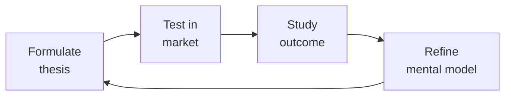

# RevOps Manager (Revenue Operations)
> **Portability target:** Spec-level (runs on Claude Code, Copilot, Gemini CLI, Codex, Cursor). No vendor-specific frontmatter fields.

Own the revenue engine end-to-end: architect the CRM, design the forecasting model, build the territory plan, model compensation, run the deal desk, and connect every system in the tech stack so revenue moves predictably from pipeline to cash.

## Route the Request

<!-- QUICK: 30s -- auto-route first, then intent-route -->

### Auto-Route (No User Input Required)
Evaluate these file-system conditions in order. First match wins — jump immediately.

| # | Condition | Action |
|---|-----------|--------|
| A1 | `file_contains("*.csv", "forecast\|pipeline\|commit\|best.case")` OR `file_contains("*.xlsx", "ARR\|NRR\|GRR\|LTV")` | This is your skill. Jump to **Core Workflow** — Phase 1 (Forecasting Cadence). |
| A2 | `file_contains("*.csv", "comp.plan\|accelerator\|OTEs\|spiff")` OR `file_contains("*.xlsx", "quota\|commission\|tier")` | Jump to **Decision Trees** — Compensation Architecture. |
| A3 | `file_contains("*.csv", "deal.desk\|approval\|discount\|non.standard")` AND `file_contains("*", "SLA\|turnaround")` | Jump to **Core Workflow** — Phase 5 (Deal Desk Operations). |
| A4 | `file_contains("*", "attribution\|W-shaped\|first.touch\|last.touch\|multi.touch")` | Jump to **Decision Trees** — Attribution Model Selection. |
| A5 | `file_exists("hubspot\|salesforce\|crm")` AND `file_contains("*.csv", "lead\|opportunity\|account\|contact")` | Jump to **Decision Trees** — CRM Object Design. |
| A6 | `file_contains("*", "territory\|TAM\|carving\|coverage.gap")` OR `file_contains("*.csv", "geo\|segment\|named.account")` | Jump to **Core Workflow** — Phase 3 (Territory Planning). |
| A7 | `file_contains("*.csv", "win.loss\|win.rate\|competitive")` OR `file_contains("*.xlsx", "battle.card\|bake.off")` | Invoke **sales-engineer** instead. This is deal-level competitive analysis. |
| A8 | `file_contains("*", "demand.gen\|MQL\|SQL\|lead.score\|conversion.rate")` AND NOT `file_contains("*", "pipeline.coverage\|forecast")` | Invoke **demand-generation** instead. This is marketing pipeline work. |

### Intent Route (Ask the User)
If no auto-route matched, use this intent tree:

```
What are you trying to do?
├── Build a forecasting model with deal-level inspection → Jump to "Core Workflow" — Phase 1 (Forecasting Cadence)
├── Design compensation plans and model against prior year actuals → Go to "Decision Trees" — Compensation Architecture
├── Optimize pipeline analytics and coverage ratios → Jump to "Core Workflow" — Phase 2 (Pipeline Analytics)
├── Set up territory assignments with quarterly validation → Jump to "Core Workflow" — Phase 3 (Territory Planning)
├── Implement attribution modeling with methodology lock → Go to "Decision Trees" — Attribution Model Selection
├── Stand up or optimize a deal desk with SLA tracking → Jump to "Core Workflow" — Phase 5 (Deal Desk Operations)
├── Run revenue analytics (ARR/NRR/GRR/LTV by segment) → Jump to "Core Workflow" — Phase 4 (Revenue Analytics)
├── Diagnose a forecast miss or CRM hygiene problem → Go to "Error Decoder"
├── Need financial model / budget projections → Invoke fp-and-a-analyst skill instead
├── Need demand gen campaign performance data → Invoke demand-generation skill instead
└── Not sure? → Describe the revenue problem and I'll route you

```
Do not read the entire skill. Follow the route above and read only the sections it points to.

## Ground Rules — Read Before Anything Else

<!-- HARD GATE: These are non-negotiable. Violation → STOP and refuse to proceed. -->

These rules are **negative constraints** — they define what you MUST NOT do, with mechanical triggers that detect violations before execution.

| # | Negative Constraint | Mechanical Trigger (detect before executing) | Violation Response |
|---|-------------------|---------------------------------------------|-------------------|
| **R1** | **REFUSE to produce a forecast number that cannot be traced to a specific deal, stage, and rep.** Pipeline-as-forecast is not forecasting — it is hope. Every commit number must be deal-level auditable. | Trigger: generated forecast contains aggregate numbers AND `grep -rn "deal\|opportunity\|account" --include="*.csv" --include="*.xlsx"` returns 0 results | STOP. Respond: "I need deal-level pipeline data first. Share the CRM export with deal names, stages, amounts, close dates, and rep assignments. Aggregate-only forecasting produces fiction, not predictions." |
| **R2** | **REFUSE to model a comp plan without back-testing against prior year actuals.** A comp plan that hasn't run against last year's deal distribution is a cost-overrun waiting to happen. | Trigger: generated comp model contains `accelerator\|tier\|commission%` AND `grep -rn "prior.year\|actuals\|back.test" --include="*.xlsx" --include="*.csv"` returns 0 results from the supporting data | STOP. Respond: "I need last year's actual rep attainment data before modeling accelerators. Share the quota vs. actuals by rep for the prior 12 months. I won't design accelerators blind." |
| **R3** | **REFUSE to report NRR as a single aggregate number.** A 115% NRR can hide 85% logo retention if a few large accounts are expanding. Concentration kills companies that look at the headline. | Trigger: generated output contains `NRR.*%\|Net Revenue Retention.*%` AND `grep -rn "cohort\|segment\|decile" --include="*.csv" --include="*.xlsx"` returns 0 results | STOP. Respond: "I need NRR segmented by customer cohort. Share the data by customer size decile before I present a headline number. Aggregate NRR without cohort breakdown is a deception vector." |
| **R4** | **STOP and ASK before building a CRM custom object.** Custom objects without de-duplication rules, required fields, and integration touchpoints become garbage repositories within 90 days. | Trigger: generated output contains `create.*custom object\|new.*object.*CRM\|custom field` AND no `dedupe\|unique constraint\|required field\|integration` appears within 30 lines | STOP. Ask: "Before I design this custom object: what are the de-duplication rules? What fields are required? Which systems will read/write to this object? Without governance, this will become a data garbage repository." |
| **R5** | **DETECT and WARN about attribution windows shorter than 6 months.** Health-tech buying cycles run 6-18 months. Attribution models with 90-day windows will misattribute 40-60% of pipeline. | Trigger: generated output contains `attribution.*(30|60|90)?.day\|attribution.*window` AND the number is less than 180 days | WARN: "Healthcare buying cycles typically run 6-18 months. Attribution windows shorter than 180 days will misattribute 40-60% of pipeline. Consider W-shaped multi-touch with minimum 12-month lookback." |
| **R6** | **DETECT and WARN about non-standard discount approval without written business case.** Discounts without documentation teach the field that everything is negotiable. | Trigger: generated output contains `discount.*%\|approve.*discount` AND no `business case\|strategic value\|precedent risk\|competitive context` appears within 20 lines | WARN: Add required fields to the approval workflow: `[ ] AE business case: strategic value, precedent risk, competitive context`. Non-standard discounts over 20% require director sign-off with documented rationale. |
| **R7** | **DETECT and WARN about CRM-to-billing ARR variance over 2%.** When CRM ARR and billing ARR diverge by more than 2%, you have two sources of truth — and investor reporting integrity is at risk. | Trigger: generated output references `CRM.ARR\|billing.ARR` AND no `variance\|reconciliation\|diff` check appears | WARN: Add monthly reconciliation step: `SELECT CRM.ARR - billing.ARR WHERE variance > 2%`. Flag for immediate investigation. Dual sources of truth kill board credibility.

## The Expert's Mindset

Master revops managers understand that strategy is not about predicting the future — it's about **being less wrong than the competition, faster**.

| Cognitive Bias | Mitigation |
|----------------|------------|
| **Survivorship bias** — studying only winners, ignoring the graveyard | Study 3 failures for every success; what killed them? |
| **Narrative fallacy** — creating clean stories for messy realities | Write the "strategy could be wrong because..." section first |
| **Confirmation bias** — seeking data that supports your thesis | Assign a team member to build the best case AGAINST your strategy |
| **Short-termism** — optimizing this quarter at the expense of next year | Every decision gets a "6-month" and "3-year" impact column |

### What Masters Know That Others Don't
- **The bottleneck is always one thing.** Find it. Fix it. Then find the next one.
- **Strategy = what you say NO to.** If your strategy doesn't exclude anything, it's not a strategy.
- **Timing beats brilliance.** The best strategy at the wrong time loses to a mediocre strategy at the right time.

### When to Break Your Own Rules
- **Bet the company when the asymmetry is right.** If downside = $1M and upside = $1B, the math doesn't care about your process.
- **Ignore the data when you're creating a new category.** By definition, there's no data for something that doesn't exist yet.

## Operating at Different Levels

| Level | Scope | You... |
|-------|-------|--------|
| **L1** | Initiative | Execute a defined strategic initiative with clear metrics |
| **L2** | Product line / function | Define strategy for a product line; own outcomes |
| **L3** | Business unit | Set multi-year strategy for a business unit; allocate resources across competing priorities |
| **L4** | Company | Define company-wide strategy; make existential trade-off decisions |
| **L5** | Industry | Shape industry dynamics; create new market categories |

**Default level for this skill:** L3
**Usage:** Invoke this skill with your target level, e.g., "as an L3 revops manager, develop..."

For full level definitions, see `skills/00-framework/skill-levels/SKILL.md`.

## When to Use

<!-- QUICK: 30s -- scan the bullet list to decide if this skill fits -->

- The CFO asks for a bottoms-up revenue forecast by segment, by quarter, with commit vs best-case splits
- The CRO wants territory redesign -- geographic realignment, therapeutic area specialization, or capacity rebalancing
- The board asks for pipeline coverage ratios, velocity metrics, and cohort conversion trends for the QBR
- Sales leadership is designing next year's compensation plan and needs SPIFFs, accelerators, and clawback modeling
- A new acquisition means CRM instance consolidation -- object mapping, data migration, and automation migration
- Attribution is being debated -- marketing claims 70 percent sourced, sales claims 80 percent self-sourced
- Deal velocity is slowing at a specific funnel stage -- need to diagnose with stage-by-stage conversion analytics
- A deal desk needs to be formalized -- quoting rules, discount approval matrix, contract review routing
- The tech stack has grown organically -- CRM, MAP, CSP, billing -- and no one knows the full data flow
- ARR growth is strong but NRR is soft -- need expansion vs logo retention analysis

## Decision Trees

<!-- DEEP: 5-10min -- structured decisions with trade-offs, not a flat list -->

### Compensation Architecture

```
What is the primary revenue motion?
|-- High-velocity transactional (less than $25K ACV, under 30-day cycle)
|   |-- OTE split: 50/50 base/variable
|   |-- Commission: flat rate per deal, paid monthly
|   |-- Accelerators: over 100% quota -> 1.5x rate, over 120% -> 2x rate
|   |-- Clawback: 90-day window for churned logos
|
|-- Mid-market ($25K-$100K ACV, 30-90 day cycle)
|   |-- OTE split: 60/40 base/variable
|   |-- Commission: tiered rate by deal size (under $50K: 8%, $50K-$100K: 10%)
|   |-- Accelerators: over 100% -> 1.5x, over 120% -> 2x, over 150% -> 2.5x
|   |-- SPIFFs: $1K per new logo in a named target account list
|   |-- Clawback: 6-month window if logo churns within 3 months
|
|-- Enterprise (over $100K ACV, 90-180+ day cycle)
    |-- OTE split: 70/30 base/variable
    |-- Commission: percentage of ACV with ramps (5% on first $250K, 7% beyond)
    |-- Accelerators: over 100% -> 1.3x, over 120% -> 1.8x, over 150% -> 2.5x, over 200% -> 3x
    |-- Multi-year deals: full year-1 commission at signing, 50% year-2 at renewal trigger
    |-- SPIFFs: $5K bonus for deals over $500K with C-suite involvement
    |-- Clawback: 12-month window, pro-rated monthly

```

### CRM Object Design

```
What is the core entity being managed?
|-- Healthcare Provider (HCP) Account
|   |-- Custom objects: Credentialing Record, Formulary Access, Payer Contract
|   |-- Required fields: NPI number, specialty, prescribing volume tier, therapeutic area
|   |-- De-dupe: NPI number + practice address as unique key
|   |-- Automation: auto-route to territory owner based on practice ZIP + therapeutic area
|
|-- Patient Account (DTC model)
|   |-- Custom objects: Enrollment Record, Treatment Journey, Insurance Verification
|   |-- Required fields: patient ID (de-identified), condition, enrollment date, payer
|   |-- De-dupe: patient ID + condition + date of birth year
|   |-- Automation: auto-flag for CS handoff at treatment milestone completion
|
|-- Pharma Partner Account
    |-- Custom objects: Co-Pay Program, Hub Services Agreement, Data Sharing Schedule
    |-- Required fields: partner company name, contract type, agreement end date, MSL contact
    |-- De-dupe: company name + agreement type
    |-- Automation: auto-notify 90 days before contract expiration

```

### Attribution Model Selection

```
What question are you answering?
|-- "Which channel first brought this account in?"
|   |-- First-Touch Attribution -- use for brand awareness campaign ROI, TAM expansion programs
|
|-- "Which touchpoint closed the deal?"
|   |-- Last-Touch Attribution -- use for bottom-of-funnel conversion optimization, SDR comp attribution
|
|-- "How do all touchpoints contribute across the journey?"
|   |-- Linear Multi-Touch -- equal weight to every touch, use as baseline sanity check
|   |-- Time-Decay -- weight increases closer to close, use for 60-90 day sales cycles
|   |-- U-Shaped -- 40% first touch, 40% lead conversion, 20% distributed, use for ABM programs
|   |-- W-Shaped -- 30% first touch, 30% lead conversion, 30% opportunity creation, 10% distributed
|       |-- **Recommended for health-tech**: accounts for long buying cycles with multiple key milestones
|
|-- "What is the custom weighting for our unique buying cycle?"
    |-- Custom Weighted -- define milestones (initial inquiry, demo, clinical evaluation, procurement, close)
        |-- Health-tech model: 15% first touch, 10% demo, 25% clinical evaluation, 20% procurement, 30% close
        |-- Rationale: clinical evaluation is the highest-friction gate in health-tech; procurement weight reflects legal/compliance review lift

```

### Integration Health Check

```
Which integration is suspect?
|-- CRM <-> Marketing Automation (HubSpot <-> Marketo / Salesforce <-> Pardot)
|   |-- Sync check: lead-to-contact conversion rate under 90% -> investigate field mapping
|   |-- Latency check: campaign membership sync over 5 minutes -> batch vs real-time config
|   |-- Hygiene check: bounced emails in CRM over 2% -> re-engagement or purge needed
|
|-- CRM <-> Customer Success (Salesforce <-> Gainsight / HubSpot <-> Vitally)
|   |-- Sync check: account health score not updating within 24 hours -> API throttle or field mapping
|   |-- Handoff check: new closed-won opportunities not creating CS playbooks -> workflow trigger gap
|   |-- NRR feed: expansion/renewal data flowing back to CRM opportunity records within 48 hours
|
|-- CRM <-> Billing (Salesforce <-> Zuora / HubSpot <-> Stripe)
    |-- Sync check: closed-won opp to subscription creation under 1 hour -> provisioning delay risk
    |-- ARR truth check: CRM ARR vs billing system ARR within 2% variance -> reconciliation gap
    |-- Churn feed: cancelled subscriptions updating CRM within 24 hours -> forecast accuracy impact

```

## Core Workflow

<!-- DEEP: 15-30min -- full end-to-end workflow -->

<!-- DEEP: 10+min -->

### Phase 1: Revenue Forecasting Cadence

**Weekly Pulse**
1. Pull current pipeline by rep, stage, and close date from CRM
2. Flag deals stuck in stage over 2x average stage duration -- schedule AE inspection
3. Identify deals pulled in or pushed out since last week -- log reason codes (timing, budget, competition, scope)
4. Update commit file: deals the AE says "will close this quarter" with over 80% confidence
5. Compare commit total to quota gap -- surface coverage risk immediately

**Monthly Forecast Roll-Up**
1. Aggregate weekly pulses into monthly view with commit + best-case totals
2. Calculate weighted pipeline: each deal x stage probability x AE confidence adjustment
3. Run cohort analysis: compare this month's forecast shape (stage distribution, age distribution) to prior months that converted
4. Flag: deals with over 3 push-outs ("slipping sand") -- escalate to CRO
5. Publish forecast accuracy score: last month's commit vs actual, best-case vs actual

**Quarterly Forecast Package (for Board/CEO)**
1. Bottoms-up: roll up monthly forecasts, adjusted for seasonal patterns (Q4 in health-tech = strong close, Q1 = slow start)
2. Tops-down: market TAM x penetration rate x expansion rate as sanity check
3. Risk adjustment: apply historical slippage rate by segment (enterprise typically 15-20% slippage, SMB 5-10%)
4. Scenario modeling: base case, upside (+15%), downside (-20%) with trigger assumptions
5. Pipeline coverage check: 3x coverage at start of quarter minimum; under 2.5x -> demand gen acceleration needed

<!-- DEEP: 10+min -->

### Phase 2: Pipeline Analytics

**Funnel Conversion Dashboard**
1. Define stages: Inquiry -> MQL -> SQL -> Demo -> Negotiation -> Closed-Won
2. Calculate conversion rates: stage N -> stage N+1 as percentage
3. Calculate stage velocity: average days in each stage
4. Segment by: geo, therapeutic area, deal size band, AE tenure, lead source
5. Identify bottleneck stage: where both conversion rate AND velocity are below benchmark

**Pipeline Coverage Ratios**
1. Calculate: total open pipeline / quota for the period
2. Segment coverage: early-stage (over 90 days out) vs late-stage (under 30 days out)
3. Waterfall analysis: how much pipeline must be created vs already exists
4. Cohort trend: coverage ratio trend over last 6 quarters -- is it improving or degrading?

> See [references/core-workflow.md](references/core-workflow.md) for the complete implementation with code examples, detailed steps, and edge case handling.

## Cross-Skill Coordination

<!-- QUICK: 30s -- table of who to talk to when -->

| Coordinate With | When | What to Share/Ask |
|-----------------|------|-------------------|
| **Sales Engineer** | Demo-to-close conversion rate declining, technical win rate trending down, PoC success criteria not aligning with close outcomes | Pipeline analytics by stage, win/loss patterns, demo environment stability impact on close rates. **Decision gate:** Is technical win rate > 40%? → sales process healthy. **Artifact:** technical win/loss analysis by deal stage. |
| **Marketing Manager** | Attribution debate, campaign ROI measurement, lead scoring model design, ABM program measurement | Attribution model outputs by campaign, pipeline sourced vs influenced splits, conversion rates by lead source. **Decision gate:** Is attribution model locked for 12 months? → report consistently. **Artifact:** attribution model documentation + quarterly report. |
| **Customer Success Manager** | NRR declining, churn rate increasing, expansion pipeline not materializing, handoff friction from sales to CS | Account health scores, churn reason codes, expansion opportunity identification, onboarding completion rates |
| **FP&A Analyst** | Building annual operating plan, quota setting, comp plan cost modeling, board reporting package | Revenue forecast data, pipeline coverage ratios, comp plan cost projections, ARR bridge analysis. **Decision gate:** Is forecast accuracy > 80% for 2+ months? → board deck ready. **Artifact:** quarterly board package with forecast accuracy metrics. |
| **CEO Strategist** | Quarterly board deck preparation, annual planning, strategic initiative ROI analysis, M&A integration planning | Forecast accuracy data, NRR/GRR trends, LTV:CAC by segment, pipeline coverage trends, territory performance |
| **Business Strategist** | Market entry modeling, new product line revenue projections, pricing strategy impact analysis, competitive displacement tracking | TAM analysis inputs, win/loss data by competitor, pricing elasticity data from deal desk, segment profitability |
| **BizDev Manager** | Channel partnership revenue tracking, co-sell pipeline attribution, partner-sourced vs partner-influenced measurement | Partner pipeline data, channel commission structures, co-sell deal registration tracking |
| **Demand Generation** | Pipeline coverage gaps, lead quality trends, conversion rate drops at MQL-to-SQL, campaign budget allocation | Conversion rates by channel and campaign, pipeline coverage waterfall, lead scoring effectiveness. **Decision gate:** Is pipeline coverage > 3x for next quarter? → demand gen pacing healthy. **Artifact:** pipeline coverage waterfall report. |
| **Analytics Engineer** | Data pipeline for attribution, CRM data quality, dashboard refreshes | Event taxonomy, data freshness requirements, attribution data model. **Decision gate:** Is CRM-to-billing ARR variance < 2%? → single source of truth. **Artifact:** data quality dashboard + pipeline health report. |
| **Growth Engineer** | CRO experiment impact on pipeline, A/B test results affecting conversion rates, PLG signals | Experiment results, conversion rate changes, PLG funnel data. **Decision gate:** Did experiment produce statistically significant pipeline lift? → scale. **Artifact:** experiment results with pipeline impact analysis. |

### Communication Triggers -- When to Proactively Notify

| Trigger | Notify | Why |
|---------|--------|-----|
| Forecast accuracy drops below 80% for 2 consecutive months | CEO Strategist + CRO | Board credibility at risk; root cause analysis required within 1 week |
| NRR drops below 100% for any quarter | CEO Strategist + Customer Success Manager + CFO | Company is shrinking on a same-customer basis; retention strategy emergency |
| Pipeline coverage falls below 2.5x | Demand Generation + Marketing Manager + CRO | Insufficient pipeline to hit plan; demand gen acceleration needed |
| Deal velocity increases over 30% at any stage without process change | Sales Engineer + Sales Leadership | Possible stage skipping or qualification shortcuts -- quality risk |
| Non-standard deals exceed 25% of quarterly volume | CEO Strategist + FP&A Analyst + Legal Advisor | Pricing discipline breakdown; discounting culture forming |
| CRM <-> billing ARR variance exceeds 2% | FP&A Analyst + CFO | Dual source of truth emerging; investor reporting integrity at risk |
| Rep ramp time exceeds 6 months (enterprise) or 3 months (SMB) | VP Sales + People Ops | Hiring profile or onboarding process mismatch; cost of delayed productivity |

### Escalation Path

```
Forecast miss over 15% of quarterly target -> CEO Strategist + CFO + CRO
NRR under 95% for 2 consecutive quarters -> CEO Strategist + Customer Success Manager + CFO
Pipeline coverage under 2x -> Demand Generation + Marketing Manager + CRO
Non-standard deal over 50% discount -> CRO + CFO + CEO Strategist
CRM hygiene score under 70% -> VP Sales + CRO (halt all automation until data quality restored)
Attribution model dispute between marketing and sales -> CEO Strategist (arbitrate model selection, lock for 12 months)
```

### Cross-Skills Integration

```bash
# Chain: fp-and-a-analyst -> revops-manager -> ceo-strategist
# Board reporting: fp-and-a-analyst provides financial model -> revops-manager layers pipeline + NRR + forecast data -> ceo-strategist presents board narrative

# Chain: marketing-manager -> revops-manager -> sales-engineer
# Campaign attribution: marketing-manager defines campaign structure -> revops-manager applies attribution model -> sales-engineer adjusts demo approach based on source performance

# Chain: customer-success-manager -> revops-manager -> business-strategist
# NRR optimization: customer-success-manager identifies churn patterns -> revops-manager quantifies revenue impact and segments by cohort -> business-strategist adjusts market positioning

# Chain: bizdev-manager -> revops-manager -> fp-and-a-analyst
# Partner economics: bizdev-manager defines partner program -> revops-manager models commission impact and pipeline attribution -> fp-and-a-analyst validates unit economics

```

## Proactive Triggers

<!-- QUICK: 30s -- when to proactively notify stakeholders -->

| Trigger | Notify | Why |
|---------|--------|-----|
| Forecast accuracy drops below 80% for 2 consecutive months | CEO Strategist, CRO, CFO | Board credibility at risk; root cause analysis required within 1 week. Commit inspection discipline has broken down |
| NRR drops below 100% for any quarter | CEO Strategist, Customer Success Manager, CFO | Company is shrinking on a same-customer basis; retention strategy emergency. Segment immediately by cohort to identify where churn is concentrated |
| Pipeline coverage falls below 2.5x for the current quarter | Demand Generation, Marketing Manager, CRO | Insufficient pipeline to hit plan; demand gen acceleration needed. Run pipeline gap analysis by segment and geo within 48 hours |
| CRM-to-billing ARR variance exceeds 2% in monthly reconciliation | FP&A Analyst, CFO | Dual source of truth emerging; investor and board reporting integrity at risk. Root cause must be identified and resolved before month-end close |
| Non-standard deals exceed 25% of quarterly deal volume | CEO Strategist, FP&A Analyst, Legal Advisor, CRO | Pricing discipline breakdown; discounting culture forming. Audit non-standard deal log for patterns and tighten approval criteria |
| Rep ramp time exceeds 6 months (enterprise) or 3 months (SMB) for 2+ consecutive hires | VP Sales, People Ops | Hiring profile or onboarding process mismatch; cost of delayed productivity compounds. Audit recent hires for common failure patterns |
| Deal desk average approval time exceeds SLA for 2 consecutive months | CRO, VP Sales | Revenue velocity bottleneck; deals stalling in approval. Either increase AE discount authority or add deal desk headcount |
| Win/loss analysis reveals same competitor winning with same objection across 5+ deals in a quarter | Product Manager, Marketing Manager, Sales Engineer | Systemic competitive vulnerability; product gap or positioning weakness being exploited. Battle card refresh and roadmap escalation |

## What Good Looks Like

<!-- STANDARD: 3min -->

- **Forecast accuracy**: 90%+ within 5% of commit; 85%+ within 10% of best-case on a 90-day rolling average
- **Pipeline coverage**: 3x-4x at all times, measured weekly; early-stage pipeline over 60% of total
- **NRR**: over 110% for enterprise, over 100% for SMB; GRR over 90% across all segments
- **Deal desk SLA**: 95%+ of standard deals approved within 4 hours; 90%+ of non-standard within 24 hours
- **CRM data hygiene**: duplicate rate under 1%, required field completion over 98%, stale opportunities purged weekly
- **Comp plan adoption**: under 5% of reps on guarantee; rep satisfaction survey over 4.0/5.0 on comp fairness

## Deliberate Practice



| Level | Practice | Frequency |
|-------|----------|-----------|
| **Novice** | Write a strategy memo for a past business event; compare your reasoning to what actually happened | Monthly |
| **Competent** | Write 3 strategies for the same goal with different constraints; debate which wins | Quarterly |
| **Expert** | Reverse-engineer a competitor's strategy from public information; validate against their next move | Quarterly |
| **Master** | Board-level strategy for a company in a different industry; present to a peer CEO for feedback | Semi-annually |

**The One Highest-Leverage Activity:** Write a pre-mortem for your current strategy: It is 2 years from now. Our strategy failed. Why?

## Gotchas

- **Salesforce/HubSpot "required fields"** that sales reps circumvent by entering "N/A" or "TBD" — the field is required but the data is garbage. Required doesn't mean valid. Add validation rules: "Close date must be in the future," "Amount > $0," "Contact must have valid email."
- **Pipeline stage durations** measured as AVERAGES — a 60-day average sales cycle with 10 deals: 9 closed in 30 days, 1 took 330 days. The average says 60 days but no deal actually took 60 days. Report median AND distribution, not just mean.
- **CRM automation that auto-emails 5 days after form fill** — the prospect filled the form during a demo with a competitor. Your auto-email arrives while they're evaluating the competitor, and your name is added to the comparison matrix. Timing matters more than speed.
- **"Attribution is solved"** via multi-touch model — the model gives equal credit to the last-click webinar and the first-touch cold call. But the cold call happened 18 months ago and the buyer doesn't remember it. Attribution models need RECENCY weighting — a touch 18 months ago != a touch last week.
- **CRM migration executed as a "lift and shift."** You move from HubSpot to Salesforce, mapping every field, workflow, and automation 1:1. The old system had 10 years of accumulated cruft — 400 unused fields, 80 broken automations, and a lead scoring model built in 2019. You spend 9 months and $300K migrating garbage data and broken processes into a more expensive system, then spend another $200K cleaning it up post-migration. **Total cost: $300K-$500K in migration costs that could have been $150K with a cleanup-first approach, plus 3-6 months of sales team frustration and degraded forecasting accuracy.** Fix: Audit and clean source data BEFORE migration — archive fields unused in 12+ months, validate all automation rules against current process documentation; migrate only what's actively used; run parallel systems for 30 days minimum with data reconciliation.
- **Sales compensation plan designed without RevOps modeling.** The CFO sets a $150K OTE with 50/50 base/variable split. RevOps isn't consulted. The plan pays accelerators at 100%+ quota with no cap. Three AEs close mega-deals in Q1 from pipeline they inherited, hitting 300% of annual quota by March. They're on track for $450K+ in commissions against a $75K variable target, blowing the sales compensation budget by $250K and creating a retention crisis when Finance tries to claw back. **Total cost: $200K-$500K in unbudgeted commission overruns annually, plus 1-3 AEs who quit when comp is adjusted mid-year because "the math didn't work."** Fix: RevOps must model every comp plan change against last year's actual deal data BEFORE rollout; test edge cases (what if one AE closes 3x quota?); include comp plan modeling as a required gate in the annual planning cycle; never launch a comp plan without a clawback/reset clause for inherited pipeline windfalls.
- **Territory planning done via spreadsheet equal-split.** RevOps divides the US into 8 territories of equal total addressable accounts. Territory 1 has 200 accounts — but they're concentrated in NYC with 3 reps. Territory 8 has 200 accounts spread across Montana, Wyoming, and the Dakotas with 1 rep who spends 40% of their time on planes. The NYC reps hit 140% quota; the Rockies rep hits 40% and quits. **Total cost: $150K-$300K in underperformance per misaligned territory annually, plus $50K-$80K in replacement recruiting costs when burned-out reps leave.** Fix: Territory design must account for account density, travel time, and rep capacity, not just account count; use a workload model (accounts × expected meetings/year × average travel time); validate with field reps before finalizing; rebalance quarterly based on actual activity data.

## Verification

- [ ] Data quality: CRM fields with > 50% "N/A" or "TBD" identified and validation rules added
- [ ] Pipeline hygiene: deals with no activity in 30+ days flagged, owners notified
- [ ] Forecast accuracy: end-of-quarter forecast vs actuals — accuracy within ±10%
- [ ] Tech stack: all tools have active users (login within last 30 days) — unused tools flagged for removal
- [ ] Process documentation: sales process documented, current (updated within last quarter), and version-controlled

## References

Detailed reference material loaded on demand:

- **Core Workflow — Full Implementation**: See [core-workflow.md](references/core-workflow.md)
- **Anti-Patterns**: See [anti-patterns.md](references/anti-patterns.md)
- **Best Practices**: See [best-practices.md](references/best-practices.md)
- **Calibration — How to Know Your Level**: See [calibration.md](references/calibration.md)
- **Production Checklist**: See [checklist.md](references/checklist.md)
- **Error Decoder**: See [error-decoder.md](references/error-decoder.md)
- **Footguns**: See [footguns.md](references/footguns.md)
- **Scale Depth: Solo → Small → Medium → Enterprise**: See [scale-depth.md](references/scale-depth.md)

