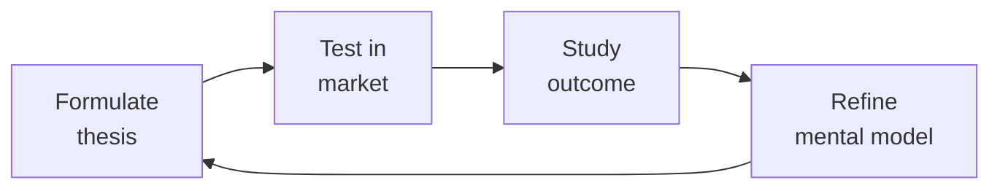

# Sales Engineer (Solutions Engineer / Presales)

> **Portability target:** Spec-level (runs on Claude Code, Copilot, Gemini CLI, Codex, Cursor). No vendor-specific frontmatter fields.

Own the technical side of the sales cycle: discover with MEDDIC/BANT/SPICED, design proofs-of-concept that close, deliver demos that map to pain, write RFP responses that score, and build demo environments that never fail during a call.

## Route the Request
<!-- QUICK: 30s -- pick your path, skip the rest -->

### Auto-Route (machine-executable — do not show to user)

| ID | Condition | Destination Skill / Section |
|----|-----------|---------------------------|
| **A1** | `file_contains(".*", "demo\|PoC\|RFP\|RFI\|MEDDIC\|BANT\|technical discovery\|solution architecture\|competitive\|battle card"\|"technical win"\|"proof of concept")` | → **This skill** (sales-engineer) |
| **A2** | `file_exists("demo-*.pptx"\|"demo-*.docx"\|"poc-plan.*"\|"rfp-response.*"\|"battle-card.*"\|"technical-discovery.*")` | → **This skill** (sales-engineer) |
| **A3** | `file_exists("*.pptx")` AND `file_contains("*.pptx", "demo\|architecture\|PoC\|solution\|integration")` | → **This skill** (sales-engineer) |
| **A4** | `file_exists("*.csv"\|"*.xlsx")` AND `file_contains("*.csv", "MEDDIC\|BANT\|technical win\|POC\|demo env")` | → **This skill** (sales-engineer) |
| **A5** | `file_contains("*", "product roadmap\|feature gap\|feature request\|SKU"\|"product requirement")` | → `product-manager` |
| **A6** | `file_contains("*", "term sheet\|deal structure\|partnership model\|M&A")` | → `bizdev-manager` |
| **A7** | `file_contains("*", "SLA\|contract\|compliance\|security review\|SOC2\|penetration test")` | → `legal-advisor` or `security-reviewer` |
| **A8** | `file_contains("*", "pipeline\|forecast\|revenue analytics\|win rate\|deal velocity")` | → `revops-manager` |

### Intent Route

```
What are you trying to do?
├── Prepare a technical demo → Jump to "Core Workflow > Phase 3: Demo Design"
├── Design a proof-of-concept (PoC) → Go to "Decision Trees > PoC Design Decision"
├── Respond to an RFP/RFI → Jump to "Core Workflow > Phase 4: RFP Response"
├── Qualify a deal technically → Go to "Decision Trees > Discovery Framework Selection"
├── Handle a competitive objection → Jump to "Decision Trees > Competitive Objection Handling"
├── Build or maintain a demo environment → Go to "Core Workflow > Phase 2: Demo Env Management"
├── Position against a competitor → Start at "Core Workflow > Phase 5"
├── Need product roadmap / feature scoping → Invoke `product-manager` skill
├── Need custom integration / API development → Invoke `backend-developer` skill
├── Need deal structure / partnership model → Invoke `bizdev-manager` skill
├── Need revenue analytics / pipeline metrics → Invoke `revops-manager` skill
└── Not sure where to start? → Start at "Core Workflow > Phase 1: Discovery"
```

Do not read the entire skill. Follow the route above and read only the sections it points to.


## Ground Rules — Read Before Anything Else
<!-- QUICK: 30s -- mechanical rules. Every violation has a detectable trigger and a standardized response. -->

These rules apply to *every* response this skill produces.

| # | Negative Constraint | Mechanical Trigger | Violation Response |
|---|--------------------|--------------------|---------------------|
| **R1** | Never demo a feature you haven't personally walked through in the last 24 hours. Stale demos lose deals. | `find demo-env/ -name "health-check.log" -mtime -1 \| wc -l` → must be ≥1. If `health-check.log` is older than 24 hours or missing, demo is stale | **STOP**: Block demo until health check passes. Require `demo_health_check_timestamp` within last 24 hours. Auto-walkthrough of critical path before every scheduled demo |
| **R2** | Always tie every feature shown to a pain point discovered in discovery. A feature tour without pain mapping is forgotten within 24 hours. | `grep -rn "pain point\|discovery finding\|customer pain" *.pptx *.docx \| awk -F':' '{print $1}' \| sort \| uniq \| wc -l` → must have ≥1 pain mapped per demo slide | **REFUSE**: Reject demo narratives where `pain_mapping_count < feature_count`. Template requires "You mentioned [pain X]. Here's how we solve that" framing per feature |
| **R3** | Never answer a question you don't know the answer to during a live interaction. Guessing kills credibility permanently. | `grep -rn "I think\|probably\|maybe\|should be\|I believe\|I'm not sure but" *.eml *.docx \| wc -l` → must return 0 speculative language in prospect-facing communications | **DETECT**: Flag any prospect-facing message containing speculative language. Auto-replace template: "That's a great question. Let me verify with engineering and I'll have a detailed answer by [end of day tomorrow]" |
| **R4** | Always qualify out before qualifying in. A bad-fit deal wastes SE cycles and damages AE relationship when it falls through. | `grep -rn "MEDDIC\|BANT" *.csv \| awk -F',' '{if(NF<6) print "INCOMPLETE QUALIFICATION"}'; if($4<7 && $5<7) print "LOW QUALIFICATION"}'` → flag deals with <2 qual framework dimensions scored | **REFUSE**: Block PoC or custom demo commitment until `MEDDIC_M_Score ≥ 5` AND `MEDDIC_E_Score ≥ 5`. Auto-escalate to AE if qualification gap persists > 2 weeks |
| **R5** | Never trash competitors. Prospects respect honesty; they smell fear — and they remember who bad-mouthed whom. | `grep -rn "bad product\|terrible\|worst\|garbage\|joke\|can't compete\|falling apart\|dying" *.eml *.pptx \| wc -l` → must return 0. Also grep for competitor name + negative adjective | **DETECT**: Flag any message with competitor name within 20 words of negative adjective. Auto-replace template: "[Competitor] is strong in [area]. Our customers typically choose us when [differentiator] is critical" |
| **R6** | Never start a PoC without a signed mutual success plan. Without agreed scope and criteria, the PoC becomes an open-ended consulting project. | `grep -rn "mutual success plan\|PoC success criteria\|signed PoC" *.docx *.pdf \| awk -F',' '{if(!/signature\|sign date/) print "UNSIGNED POC PLAN"}'` → flag | **STOP**: Block PoC kickoff until `mutual_success_plan` is signed by both parties. Require ≤3 success criteria, 2-week max timeline, hard stop date. Auto-escalate if PoC exceeds timeline |
| **R7** | Never let competitive FUD sit unanswered for >24 hours. FUD has a 24-hour half-life — silence confirms the competitor's claim. | `grep -rn "competitor\|FUD\|objection" *.eml \| awk -F',' '{split($1,d,"-"); if((systime()-mktime(d[1] " " d[2] " " d[3] " 0 0 0"))/86400 > 1 && !/response\|rebuttal\|evidence/) print "UNANSWERED FUD"}'` → flag unanswered competitive objections | **STOP**: Auto-flag any competitive objection not responded to within 24 hours. Require evidence-based response: customer proof, third-party validation, or architecture explanation. Escalate if still unanswered at 48h |


## The Expert's Mindset

Master sales engineers understand that strategy is not about predicting the future — it's about **being less wrong than the competition, faster**.

| Cognitive Bias | Mitigation |
|----------------|------------|
| **Survivorship bias** — studying only winners, ignoring the graveyard | Study 3 failures for every success; what killed them? |
| **Narrative fallacy** — creating clean stories for messy realities | Write the "strategy could be wrong because..." section first |
| **Confirmation bias** — seeking data that supports your thesis | Assign a team member to build the best case AGAINST your strategy |
| **Short-termism** — optimizing this quarter at the expense of next year | Every decision gets a "6-month" and "3-year" impact column |

### What Masters Know That Others Don't
- **The bottleneck is always one thing.** Find it. Fix it. Then find the next one.
- **Strategy = what you say NO to.** If your strategy doesn't exclude anything, it's not a strategy.
- **Timing beats brilliance.** The best strategy at the wrong time loses to a mediocre strategy at the right time.

### When to Break Your Own Rules
- **Bet the company when the asymmetry is right.** If downside = $1M and upside = $1B, the math doesn't care about your process.
- **Ignore the data when you're creating a new category.** By definition, there's no data for something that doesn't exist yet.
## Operating at Different Levels

| Level | Scope | You... |
|-------|-------|--------|
| **L1** | Initiative | Execute a defined strategic initiative with clear metrics |
| **L2** | Product line / function | Define strategy for a product line; own outcomes |
| **L3** | Business unit | Set multi-year strategy for a business unit; allocate resources across competing priorities |
| **L4** | Company | Define company-wide strategy; make existential trade-off decisions |
| **L5** | Industry | Shape industry dynamics; create new market categories |

**Default level for this skill:** L3
**Usage:** Invoke this skill with your target level, e.g., "as an L3 sales engineer, develop..."

For full level definitions, see `skills/00-framework/skill-levels/SKILL.md`.

## When to Use
<!-- QUICK: 30s -- scan the bullet list to decide if this skill fits -->

- An AE has a qualified opportunity and needs a technical demo to advance to the next stage
- A prospect requests a proof-of-concept with specific success criteria before committing
- An RFP lands with 150+ questions and a 5-day deadline — needs technical sections filled
- A competitor is named in a deal and the AE needs a positioning/objection-handling playbook
- The demo environment is unreliable — blank screens, stale data, broken integrations during calls
- Technical win rate is below 30% — need to diagnose where in the cycle deals are lost
- A new product feature needs to be translated into a demo narrative with discovery questions

## Decision Trees
<!-- QUICK: 30s -- follow the ASCII tree to your scenario -->

### Discovery Framework Selection: MEDDIC vs BANT vs SPICED

```
                              ┌──────────────────────────────────┐
                              │ START: Which discovery framework? │
                              └────────────────┬─────────────────┘
                                               │
                         ┌─────────────────────▼─────────────────────┐
                         │ What's the ACV range?                     │
                         └────┬──────────────┬──────────────┬────────┘
                              │ <$10K ACV   │ $10K-100K   │ >$100K ACV
                              ▼             ▼              ▼
                      ┌───────────┐  ┌────────────┐  ┌───────────────┐
                      │ BANT      │  │ SPICED     │  │ MEDDIC        │
                      │ Budget    │  │ Situation  │  │ Metrics       │
                      │ Authority │  │ Pain       │  │ Economic Buyer│
                      │ Need      │  │ Impact     │  │ Decision Crit │
                      │ Timeline  │  │ Champion   │  │ Decision Proc │
                      │           │  │ Economic   │  │ Identify Pain  │
                      │           │  │ Decision   │  │ Champion       │
                      └───────────┘  └────────────┘  └───────────────┘
```
**BANT** — Transactional deals, SMB. Gateway check: does this deal have budget, authority, need, and timeline? 5-minute qualification.

**SPICED** — Mid-market ($10K-100K ACV). Focuses on champion building and economic buyer identification. Ask: "Who else needs to see the value of this?"

**MEDDIC** — Enterprise ($100K+ ACV). Deep discovery across 6 axes. Each letter is a gate: if you can't score 4+ on MEDDIC, the deal is at risk. Track MEDDIC score in the CRM after every call.

### MEDDIC Qualification Scoring

```
For each MEDDIC element, score 0-3 (0 = unknown/absent, 3 = strongly present):

M - Metrics: Can the prospect quantify the pain? e.g., "We lose $15K/week on manual reconciliation."
    3 = Specific dollar/time impact quantified
    2 = Directional pain acknowledged
    1 = Vague "we need to be better"
    0 = "Everything is fine" → Not a real deal

E - Economic Buyer: Do you have access to the person with budget authority?
    3 = Met EB, they're actively engaged
    2 = EB identified, meeting scheduled
    1 = EB identified, no meeting
    0 = No idea who signs checks → High risk

D - Decision Criteria: Do you know the formal and informal criteria?
    3 = Formal RFP/evaluation matrix shared, we know weightings
    2 = Some criteria known, gaps remain
    1 = Vague "we evaluate on best value"
    0 = No criteria shared → Flying blind

D - Decision Process: Do you know the steps, who's involved, and timeline?
    3 = Documented process with dates and names: "Legal review (2 weeks), then security (1 week), then VP approval, PO by March 15."
    2 = Process known but timeline vague
    1 = "We'll figure it out"
    0 = No process shared → Deal stall risk

I - Identify Pain: Is the pain acute and tied to a business outcome?
    3 = Pain is costing money/revenue/reputation — executive mandate to fix
    2 = Pain acknowledged but competing priorities
    1 = Nice-to-have
    0 = No pain → Not a real opportunity

C - Champion: Do you have an internal advocate with influence who will fight for you?
    3 = Champion is actively selling internally; has slides + ROI built
    2 = Champion is bought in but hasn't mobilized others
    1 = Contact is friendly but passive
    0 = No champion → Someone else's deal
```

**Go/No-Go Threshold:** Score < 12 → Do not commit SE cycles beyond initial discovery. Score 12-14 → Engage with caution; focus on improving weak MEDDIC elements. Score 15-18 → Full engagement; green-lit for PoC/demo investment.

### PoC Design Decision

```
                              ┌──────────────────────────────┐
                              │ START: Prospect requests PoC  │
                              └────────────┬─────────────────┘
                                           │
                         ┌─────────────────▼─────────────────┐
                         │ Is the PoC solving a real pain    │
                         │ (not just "show us it works")?    │
                         └────┬──────────────────────────┬───┘
                              │ NO                        │ YES
                              ▼                           ▼
                      ┌──────────────┐          ┌──────────────────────┐
                      │ Decline PoC. │          │ Can you scope it to   │
                      │ Offer         │          │ < 2 weeks of effort? │
                      │ reference     │          └──┬──────────────┬────┘
                      │ calls and     │             │ YES          │ NO
                      │ recorded demo │             ▼              ▼
                      └──────────────┘    ┌──────────────┐ ┌──────────────┐
                                          │ Scoped PoC   │ │ Not a PoC —  │
                                          │ with success │ │ this is       │
                                          │ criteria,    │ │ implementation│
                                          │ timeline,    │ │ consulting.   │
                                          │ mutual       │ │ Scope as a    │
                                          │ success plan │ │ paid pilot or │
                                          │              │ │ walk away.    │
                                          └──────────────┘ └──────────────┘
```
**When to do a PoC:** Clear success criteria defined, < 2 weeks effort, deal size justifies investment (>5:1 return), champion identified, and mutual success plan signed by both sides.

**When to refuse a PoC:** No success criteria, scope creep risk ("we'll figure it out as we go"), no champion, deal ACV < 5× SE cost, or the PoC is being used to beat up the incumbent for a better price.

### Competitive Objection Handling

```
                              ┌──────────────────────────────┐
                              │ START: Competitor objection   │
                              └────────────┬─────────────────┘
                                           │
                         ┌─────────────────▼─────────────────┐
                         │ Competitor claim: "They say they   │
                         │ do X, we can't do X."             │
                         └────┬──────────────────────────┬───┘
                              │ We CAN do X              │ We CANNOT do X
                              ▼                          ▼
                      ┌──────────────┐          ┌──────────────────────┐
                      │ Acknowledge: │          │ Reframe: "Most of our│
                      │ "Great catch.│          │ customers who needed │
                      │ We can do X. │          │ X actually solved it │
                      │ Let me show  │          │ more effectively with│
                      │ you how and  │          │ Y + Z. Here's a case │
                      │ share a case │          │ study showing 40%    │
                      │ study."      │          │ better outcome."     │
                      └──────────────┘          └──────────────────────┘
```
**Golden rule:** Never say "we have that on the roadmap." Say: "That's on our roadmap for Q3. In the meantime, here's how our customers solve it today — and here's the recorded conversation with our VP of Product explaining why we're building it the way we are."

## Core Workflow
<!-- QUICK: 30s -- scan phase titles to understand the process -->

<!-- DEEP: 10+min -->

### Phase 1 (~30 min): Technical Discovery

Run MEDDIC or BANT discovery with the prospect. Start with open-ended pain questions: "Walk me through your current process. Where does it break? What does that cost you?" Document every pain point with a quantifier — dollars, hours, errors, churn. Identify the technical evaluators (who will test the product) separately from the economic buyer (who signs). Ask: "What would a successful evaluation look like? If we nail this, what happens next?" Map the decision process: who, what gates, when. End discovery with a summary email: "Here's what I heard. Did I get it right? If so, I'll tailor the demo to these 3 priorities."

<!-- DEEP: 10+min -->

### Phase 2 (~20 min): Demo Environment Management

Maintain at least 3 demo environments: (1) "Clean" — empty/default state for first demos, (2) "Real-ish" — populated with realistic data, dashboards showing activity, integration connectors configured, (3) "Vertical-specific" — tailored to healthcare/fintech/e-commerce with domain-relevant data. Environment checklist before every demo: all integrations connected, latest version deployed, no error toast on login, all charts render, search returns results, user flow works end-to-end. Use automation: scheduled health checks that run the critical path daily at 6 AM and email if anything fails. Have a fallback plan: recorded walkthrough ready if environment fails during the call.

<!-- DEEP: 10+min -->

### Phase 3 (~45 min): Demo Design & Delivery

Build a 3-act demo narrative: Act 1 — "Here's your world today" (show the pain). Act 2 — "Here's what it could be" (show the solution solving the exact pain they described). Act 3 — "Here's why it's different" (differentiator walk). Start with the outcome, not the login screen. Never do a point-and-click feature tour — every click answers a pain point they disclosed. Prepare 2-3 "pattern interrupt" moments: unexpected value that makes them lean forward. Schedule the demo for 45 minutes max; leave 15 minutes for questions. Send the prospect a "what to expect" email 24 hours before: "We'll cover [pain 1], [pain 2], [pain 3]. Come with questions." Record the demo and share within 2 hours. Follow up with a 1-page summary: "We showed X → Your pain Y → Outcome Z."

<!-- DEEP: 10+min -->

### Phase 4 (~60 min): RFP/RFI Response

Triage incoming RFP: score against ideal customer profile (ICP). Don't respond to every RFP — if it's vendor-written (designed for a competitor), decline with a polite "not a fit at this time." For RFPs worth pursuing: create a response matrix (question → answer owner → deadline). Use a response library: maintain a database of previous answers tagged by topic (security, integration, SLAs, architecture). Don't rewrite from scratch. For technical sections: include architecture diagrams, integration patterns, API documentation links, and relevant case studies. Every "yes" answer needs proof — "We support SSO" → "Attached: SAML 2.0 configuration guide, SOC 2 Type II report." Deadline buffer: submit 24 hours before the deadline, not at 11:59 PM. Errors caught late can't be fixed.

<!-- DEEP: 10+min -->

### Phase 5 (~30 min): Competitive Positioning

Map your product against top 3 competitors on a 2×2: X-axis = completeness of vision, Y-axis = ability to execute. Identify your unfair advantages — the capabilities competitors can't replicate in 12 months. Build a competitive battle card for each competitor: their strengths (be honest), their weaknesses (validated by customer evidence), your positioning (reframe, don't trash), trap questions they'll ask about you, and trap questions you ask about them. Example trap question: "How does [competitor] handle [edge case your product handles gracefully]?" Keep battle cards updated quarterly — competitors ship too, and stale competitive intel is worse than none.

<!-- DEEP: 10+min -->

### Phase 6 (~20 min): Technical Win Rate Optimization

Track technical win rate = (deals where you were technical evaluator's choice) / (total deals engaged). Target > 40% technical win rate. For every loss, run a 15-minute loss analysis: (1) What was the technical reason given? (2) What was the real reason (ask the AE, the champion, the evaluator)? (3) Did we lose on product, on process, or on politics? (4) What's the pattern across the last 3 losses? Common failure modes: demo didn't map to pain (fix: better discovery), PoC scope too large (fix: mutual success plan), no champion (fix: qualification), competitive trap sprung (fix: battle card refresh). Review win/loss patterns monthly with product management — product gaps that repeat across losses are roadmap input.

## Best Practices
<!-- STANDARD: 3min -- rules extracted from production experience -->
<!-- DEEP: 10+min -- these rules encode years of lost deals and near-misses -->

- Record every demo and label it with the deal name, date, and outcome. Build a library of 10 "greatest hits" — 2-minute clips of moments where prospects leaned in.
- Maintain a personal knowledge base of "how to show X" for every major feature. Demo narratives, not feature specs. Updated weekly.
- Use the "Tell-Show-Tell" pattern: "We're going to show you [outcome]. [Demo the thing]. As you saw, this delivers [outcome] which means [business impact]."
- Always ask the "What happens next?" question at the end of every demo: "If this looks good, what are your next steps to evaluate and decide? Who else needs to see this?"
- Never go into a demo without knowing the top 3 pain points. If the AE won't tell you, run discovery yourself before the demo.
- Time-box PoCs ruthlessly: 2 weeks max, 3 success criteria max, mutually agreed success plan signed before starting, weekly check-ins, hard stop date.
- For RFP responses: maintain a "response vault" — a searchable database of past answers tagged by topic, industry, and competitor mentioned.
- Use the "parking lot" technique for off-topic questions during demos: "Great question — let me capture that and we'll cover it at the end so I can give it the attention it deserves."
- When you lose a deal, conduct the loss analysis within 48 hours while memory is fresh. Pattern-match across losses — one loss is data, two is a pattern, three is a systemic issue.
- Never demo on production. Ever. One wrong click, one real customer's data exposed, and the deal is dead — plus you've created a compliance incident.

## Anti-Patterns
<!-- STANDARD: 3min -- patterns that predictably fail. Every anti-pattern is grep-detectable and auto-preventable. -->

| ❌ Anti-Pattern | ✅ Do This Instead | 🔍 Detect (grep / lint) | 🛡️ Auto-Prevent |
|---|---|---|---|
| Running demos as feature tours instead of pain-solving narratives — "Looks great" is the most dangerous phrase in presales | Use Tell-Show-Tell: state the outcome, demo the feature, connect to business impact. Map every feature shown to a quantifiable pain discovered in discovery. End with "What happens next?" | `grep -rn "pain point\|discovery finding\|you mentioned" *.pptx \| wc -l` → must be ≥ slide count. If pain references < feature demonstrations, it's a feature tour | Demo narrative validator: each feature slide must reference ≥1 discovery finding. Auto-reject demo decks where `pain_reference_count < feature_demo_count` |
| Starting a PoC without a signed mutual success plan — becomes an open-ended consulting project with no exit criteria | PoC must have ≤3 success criteria, defined before starting, signed by both parties, 2-week max timeline, weekly check-ins, hard stop date. No signed plan = no PoC | `grep -L "mutual success plan\|signed\|success criteria\|hard stop" poc-plans/*.docx` → must return empty; `grep -rn "PoC start\|PoC kickoff" *.csv \| awk -F',' '{if(!/signed/) print "UNSIGNED POC"}'` → flag | PoC workflow gate: `mutual_success_plan_signed = true` required before `poc_environment_provisioned`. Auto-escalate if PoC exceeds 14 calendar days |
| Writing RFP responses with generic affirmations ("Yes, we support X") — indistinguishable from competitors | Every "yes" needs a proof point: implementation guide link, architecture diagram, case study with metrics. Specificity is the only way to differentiate | `grep -rn "Yes\|Supported\|Available\|Out of the box" rfp-responses/*.docx \| awk '{if(!/see\|link\|diagram\|case study\|example\|reference/) print "GENERIC YES"}'` → flag un-backed claims | RFP response template: every "Yes" or capability claim requires `proof_point` field populated (link, diagram, or case study reference). Auto-flag empty proof points |
| Assuming a technical win means a deal win — engineering team loves it but economic buyer wasn't engaged | MEDDIC "E" (Economic Buyer) and "C" (Champion) scores must be >7 before PoC starts. Arm champion with ROI data and internal-selling materials | `grep -rn "MEDDIC\|qualification" *.csv \| awk -F',' '{if($5<7) print "ECONOMIC BUYER RISK"; if($4<7) print "CHAMPION RISK"}'` → flag deals with E or C score <7 | Deal qualification gate: block PoC start if `MEDDIC_E_Score < 7` OR `MEDDIC_C_Score < 7`. Auto-generate "champion enablement pack" with ROI data when both exceed threshold |
| Letting competitive FUD sit unanswered for more than 24 hours — silence confirms the competitor's claim | Build competitive battle cards proactively. When FUD lands, respond with evidence within 24 hours: customer proof, third-party validation, or architecture explanation | `grep -rn "competitor\|FUD\|objection" *.eml \| awk -F',' '{split($1,d,"-"); days=(systime()-mktime(d[1] " " d[2] " " d[3] " 0 0 0"))/86400; if(days>1 && !/response/) print "FUD UNANSWERED >24h"}'` → flag | FUD response SLA monitor: auto-flag competitive objections >20 hours old with no response. Surface in SE daily standup dashboard. Escalate to SE manager at 48 hours |
| Maintaining only one demo environment with no backup — when it fails during a live call, credibility evaporates | Maintain at least 3 demo environments: Clean (pristine), Realistic (data-rich), Vertical-specific. Run daily automated health checks. Always have a recorded backup walkthrough | `grep -rn "demo env\|demo environment" *.csv \| awk -F',' '{if(!/clean\|realistic\|vertical\|backup/) print "SINGLE DEMO ENV"}'` → flag if <3 environments | Demo env monitor: require ≥3 environments registered. Daily health check each at 6 AM. Auto-page SE if all environments down. Surface backup recording link if live env fails |
| Conducting loss analysis weeks after the deal closes — memory fades, details blur, patterns go undetected | Complete loss analysis within 48 hours of deal outcome. Interview AE, champion, and evaluator. Track patterns across losses monthly. One loss is data, two is a pattern, three is a systemic issue | `grep -rn "deal lost\|deal outcome\|loss" *.csv \| awk -F',' '{split($1,d,"-"); days=(systime()-mktime(d[1] " " d[2] " " d[3] " 0 0 0"))/86400; if(!/loss analysis/ && days>2) print "MISSING LOSS ANALYSIS"}'` → flag | Loss analysis cron: auto-detect deal outcomes daily. If `outcome_date` > 48 hours ago and no `loss_analysis` entry exists, auto-create analysis template and assign to deal SE |
| Treating demo follow-up as optional or delayed — prospect enthusiasm decays rapidly after demo ends | Send follow-up within 2 hours: recording link, 1-page summary mapping features to their pain, clear next steps. The follow-up is the bridge from demo to decision | `grep -rn "demo complete\|demo finished\|demo end" *.csv \| awk -F',' '{split($1,d,"-"); demo_time=mktime(d[1] " " d[2] " " d[3] " " $2 " " $3 " 0"); if(systime()-demo_time > 7200 && !/follow-up sent/) print "MISSING FOLLOW-UP"}'` → flag | Demo follow-up automation: trigger follow-up email 30 minutes after demo end. If no `follow_up_sent` timestamp within 2 hours, auto-generate follow-up from template and notify AE |


## Cross-Skill Coordination
<!-- QUICK: 30s -- table of who to talk to when -->

| Coordinate With | When | What to Share/Ask |
|-----------------|------|-------------------|
| **Product Manager** | Feature gaps identified across 3+ deals, roadmap questions in RFPs, competitive positioning | Win/loss analysis with product gap patterns, roadmap timeline requests, competitive feature parity gaps. **Decision gate:** Does product gap block > $500K pipeline? → roadmap escalation. **Artifact:** product gap impact report. |
| **Backend Developer** | PoC requires custom integration, API limitations hit during demo, architecture deep-dive needed | Technical requirements, integration specs, API capability questions |
| **Account Manager** | Deal stage advancement, AE alignment on discovery, qualification check | MEDDIC score, demo outcome, next steps, technical risk flags. **Decision gate:** Is MEDDIC "E" (Economic Buyer) score > 7? → deal qualified. **Artifact:** MEDDIC qualification sheet + demo outcome summary. |
| **Customer Success Manager** | Post-sale handoff, implementation expectations set during sales, PoC-to-production transition | Success criteria from PoC, promises made during demo, technical configuration details. **Decision gate:** Are PoC success criteria documented and signed by both parties? → handoff ready. **Artifact:** technical handoff document + success criteria sign-off. |
| **Business Strategist** | Market positioning changes, competitive landscape shifts, pricing objections | Competitor intelligence, win/loss trends, market messaging feedback |
| **Security Engineer** | Security questionnaires in RFPs, prospect security reviews, compliance certification requests | SOC 2 reports, penetration test results, architecture diagrams for security review |
| **Marketing Manager** | Battle card updates, case study requests from won deals, competitive messaging | Win stories, competitive positioning feedback, demo clips for sales enablement |
| **Legal Advisor** | Contract technical schedules, SLA commitments in RFP, data processing terms | Technical scope of commitments, feasibility of SLA terms, data handling workflows |
| **BizDev Manager** | Partner-sourced deals, channel co-sell opportunities, partner training needs | Partner deal registration, technical qualification for partner deals, partner capability gaps. **Decision gate:** Has partner completed technical certification? → co-sell enabled. **Artifact:** partner technical readiness scorecard. |
| **RevOps Manager** | Pipeline analytics, deal velocity, win rate trends, forecast accuracy | Deal-level data, stage duration, technical win/loss reasons, conversion rates by source. **Decision gate:** Is deal velocity within 20% of historical average? → forecast reliable. **Artifact:** deal inspection report + velocity analysis. |

### Communication Triggers — When to Proactively Notify

| Trigger | Notify | Why |
|---------|--------|-----|
| Product gap blocks 3+ active deals | Product Manager + VP of Sales | Roadmap escalation; quantify revenue at risk |
| Competitor launches feature that eliminates our key differentiator | Product Manager + Marketing Manager + VP Sales | Competitive response needed within 1 week |
| Demo environment down during a call | AE on the deal + all SEs | Reputation damage control; switch to backup immediately |
| PoC success criteria not met by deadline | AE + Customer Success Manager | Expectation reset; no-deal or scope-change conversation |
| RFP response requires commitment we can't deliver (SLA, feature, cert) | Legal Advisor + Product Manager | Liability risk; negotiate alternative before submitting |

### Escalation Path

```
Product gap blocking >$500K pipeline → Product Manager + VP Product + VP Sales
Competitor displacement threat across multiple accounts → VP Sales + Marketing Manager + Product Manager
Demo environment instability >48 hours → Engineering Lead + DevOps + VP Sales
RFP commitment exceeds current capability → Legal Advisor + VP Product + CEO Strategist
```

### Cross-skills Integration

```bash
# Chain: product-manager → sales-engineer → customer-success-manager
# New feature launch: product-manager defines feature → sales-engineer builds demo + battle card → customer-success-manager receives post-sale handoff

# Chain: backend-developer → sales-engineer → account-manager
# Custom integration PoC: backend-developer builds integration → sales-engineer demos it → account-manager closes

# Chain: marketing-manager → sales-engineer
# Campaign launch: marketing-manager provides messaging/persona → sales-engineer builds demo tailored to campaign target
```

## Proactive Triggers
<!-- QUICK: 30s -- when to proactively notify stakeholders -->

| Trigger | Notify | Why |
|---------|--------|-----|
| Same product gap blocks 3+ active deals simultaneously | Product Manager, VP Sales, VP Product | Roadmap escalation required; quantify total revenue at risk across all affected deals. Pattern = systemic gap, not isolated objection |
| Competitor launches feature that eliminates a key differentiator | Product Manager, Marketing Manager, VP Sales | Competitive response needed within 1 week; battle card refresh, demo narrative update, and sales enablement before competitive losses accumulate |
| Demo environment is down or unstable during a scheduled call | AE on the deal, all SEs | Reputation damage control; switch to recorded backup immediately. Root cause the failure and implement preventive health checks before next demo |
| PoC success criteria are not met by the agreed deadline | AE, Customer Success Manager, RevOps Manager | Expectation reset required; either extend with revised scope, or have the no-deal conversation. Prolonging a failing PoC wastes SE time and damages credibility |
| RFP response requires a contractual commitment the product can't deliver (SLA, feature, certification) | Legal Advisor, Product Manager, VP Product | Liability risk; negotiate alternative language or decline the commitment before submission. A signed contract you can't fulfill is worse than a lost RFP |
| Technical win rate drops below 30% for 2 consecutive months | VP Sales, Product Manager, Marketing Manager | Systemic presales issue; audit recent losses for patterns. Possible causes: demo quality, competitive positioning gap, product gap, or qualification failure |
| MEDDIC "E" (Economic Buyer) score is <5 across 50%+ of active deals | VP Sales, RevOps Manager | Deals are unqualified — SE time is being wasted on opportunities that can't close. Tighten qualification gates before SE engagement |
| Customer reports critical bug or data issue discovered during a live PoC or demo | Product Manager, Engineering Lead, Customer Success Manager | Trust crisis with an active prospect; immediate engineering escalation. Transparency and speed of response determine whether the deal survives |

## Scale Depth: Solo → Small → Medium → Enterprise
<!-- DEEP: 10+min -- how this skill changes as the company grows -->

### Solo
Founder demos the product, answers technical questions. Close first deals, learn objections. Founder is the SE; no demo environment; every call is a learning opportunity. Focus on understanding what prospects care about technically and building demo narratives around those discovery insights.

### Small Team
1-2 SEs support all deals, build demo environments. Scale founder's technical selling ability. Dedicated SEs; reusable demo environments; first battle cards. The SE team builds demo environments that don't break and battle cards that actually help AEs.

### Medium Team
SE team organized by vertical/region, PoC management. Deep vertical expertise, win competitive deals. Vertical-specialized SEs; structured PoC process; RFx response team. SEs develop domain expertise that differentiates the company in competitive evaluations.

### Enterprise
Global SE organization, SE leadership, solution architect tiers. Support enterprise sales at scale, technical GTM. SE Directors; solution architects for strategic deals; SE career ladder; demo platform. SE function is a strategic revenue driver with career progression, specialized roles, and global coverage.

### Transition Triggers
- **Solo → Small Team:** Deal volume exceeds 5 technical evaluations/month and founder can no longer personally demo every opportunity.
- **Small Team → Medium Team:** SE team exceeds 5 people and deals require vertical specialization or dedicated PoC management.
- **Medium Team → Enterprise:** Sales organization exceeds 50 AEs across multiple geographies and requires SE leadership, solution architect tiers, and a formal career ladder.


## What Good Looks Like
<!-- QUICK: 30s -- concrete success description -->

Demo opens in 5 seconds, environment is at latest version, first screen maps to the prospect's #1 pain point exactly. The prospect says "that's exactly what we need" within the first 10 minutes. After the demo, the prospect can articulate 3 specific reasons they'd choose you — unprompted. RFP submitted 24 hours before deadline with zero errors. MEDDIC score updated in CRM within 1 hour of each call. Technical win rate trending above 40%. Loss analyses filed within 48 hours and pattern-matched across deals. Demo environment health checks pass every morning at 6 AM.

## Error Decoder
<!-- DEEP: 10+min -- every row is a real deal that was lost or saved. Every error is grep-matchable in logs/dashboards/CRM exports. -->

| 🖥️ Console Match (grep pattern) | Symptom | Root Cause | Fix | 🔄 Auto-Recovery Loop |
|---|---|---|---|---|
| `grep -rn "500\|502\|503\|error\|blank screen\|failed" demo-env/health-check-*.csv \| wc -l` — must return 0; `find demo-env/ -name "health-check.log" -mtime -1 \| wc -l` — must be ≥1 | Demo environment shows blank screen, 500 error, or integration failure during live call | Integration token expired, service version mismatch, or dependent API changed overnight | Run daily automated health checks at 6 AM. Keep a "demo restore" script that resets environment to known-good state in <5 min. Always have the recorded backup walkthrough ready | **1.** Detect `health_check_status != 0` in daily scan → **2.** Auto-run `demo-restore.sh` → **3.** If restore fails, page on-call SE and surface backup recording link → **4.** Log incident with `demo_env_name`, `failure_type`, `time_to_restore` → **5.** Weekly incident review: if same env failed >1x in 7 days, schedule rebuild |
| `grep -rn "looks great\|nice demo\|cool product" *.eml \| awk -F',' '{split($2,d,"/"); if(systime()-mktime(d[3] d[1] d[2] " 0 0 0") > 7*86400 && !/next steps\|scheduled\|PoC/) print "STALLED AFTER COMPLIMENT"}'` | Prospect says "looks great" after demo but deal stalls — no next meeting scheduled, no evaluation started | Demo was a feature tour, not a pain-solving narrative. Prospect enjoyed the show but doesn't know what to do next | Revisit discovery. Map every feature shown to a quantifiable pain. Send follow-up: "Based on what we showed, here's the 3 ways we'd impact your business. What's the next step to validate?" | **1.** Detect demo > 7 days ago with no next step recorded → **2.** Auto-generate AE alert: "Deal stalled after positive demo — pain remap needed" → **3.** Trigger SE to send "pain → impact summary" follow-up → **4.** If still no movement after 14 days, schedule AE+SE deal review → **5.** Tag as "narrative gap" in loss analysis if eventually lost |
| `grep -rn "PoC\|proof of concept" *.csv \| awk -F',' '{if(/completed/ && $5=="fail" && (!/success criteria signed\|\|mutual plan/)) print "POC-NO-PLAN"}'` | PoC fails on technical criteria at final review — customer says it doesn't meet their needs | Scope too large, success criteria too vague, no signed mutual plan. Every stakeholder had different definition of success | PoC must have ≤3 success criteria, defined before starting, signed by both parties. Weekly checkpoints catch drift early. Never start a PoC without a signed mutual success plan | **1.** Detect PoC with `outcome == "failed"` and no `mutual_success_plan_signature` → **2.** Flag as "process failure" not "product failure" → **3.** Auto-create post-mortem template for SE → **4.** Update PoC template to include mandatory `mutual_success_plan_signed` gate → **5.** Monitor: if >2 plan-less PoC failures in quarter, escalate to SE leadership |
| `grep -rn "RFP score\|technical score\|evaluation score" *.csv \| awk -F',' '{if($4=="lost" && $5=="technical") print "RFP-TECH-LOSS"}'` | RFP loses on technical score despite confirmed feature parity — procurement scores you lower than competitor | Responses were generic ("yes we support X") without proof points. Evaluators couldn't differentiate your answers from competitors' | Every "yes" in an RFP needs evidence: implementation guide link, architecture diagram, case study with metrics. Generic answers are indistinguishable from competitors' | **1.** Detect `rfp_outcome == "lost"` with `loss_reason == "technical_score"` → **2.** Audit RFP response for un-backed claims → **3.** Auto-flag every "Yes" or "Supported" without proof point → **4.** Update RFP library: add `proof_point` field to every capability entry → **5.** Pre-submission validation: block RFP submit if any required capability lacks proof point |
| `grep -rn "MEDDIC\|qualification score" *.csv \| awk -F',' '{if($5<7 && $6=="won") next; if($5<7 && $6=="lost") print "ECONOMIC-BUYER-GAP"}'` | Technical evaluator loves product but deal goes to competitor anyway — engineering team was champion, but couldn't sign the check | Didn't reach the economic buyer, or champion wasn't mobilized with business case. Technical win without business win = loss | MEDDIC "E" (Economic Buyer) and "C" (Champion) scores must be >7 before PoC starts. Engage economic buyer before committing significant SE resources. Arm champion with ROI data | **1.** Detect `MEDDIC_E_Score < 7` at PoC start → **2.** Block PoC resource commitment → **3.** Auto-generate "economic buyer engagement plan" for AE → **4.** Require `economic_buyer_meeting_date` populated before PoC gate passes → **5.** If deal lost with E-score <7, auto-classify as "qualification gap" not "product gap" |
| `grep -rn "competitor\|FUD\|objection\|concern about" *.eml \| awk -F',' '{split($1,d,"-"); days=(systime()-mktime(d[1] " " d[2] " " d[3] " 0 0 0"))/86400; if(days>1 && !/response\|rebuttal\|evidence\|battle card/) print "UNANSWERED-FUD"}'` | Competitor FUD lands and prospect goes cold — silence confirms the competitor's claim | No competitive battle card prepared for this competitor. Response wasn't prioritized within the 24-hour FUD half-life | Build battle cards proactively, not reactively. Train AEs on trap questions for each competitor. When FUD lands, respond with evidence within 24 hours | **1.** Detect competitive mention in prospect email → **2.** Auto-lookup battle card for that competitor → **3.** Generate draft response with evidence from battle card → **4.** If `response_sent == false` at 20 hours, escalate to SE manager → **5.** Post-resolution: log FUD type and response effectiveness for battle card improvement |


## Production Checklist
<!-- QUICK: 30s -- binary pass/fail items. Each has a mechanical validation command. -->

| ID | Checklist Item | Validation Command | Auto-Fix |
|----|---------------|-------------------|----------|
| **[S1]** | Demo environment health check passes daily at 6 AM — all integrations connected, no errors, critical path walkable | `find demo-env/ -name "health-check.log" -mtime -1 -exec grep -L "PASS" {} \;` → must return empty; `grep -c "FAIL\|ERROR" demo-env/health-check.log` → must return 0 | Daily health check cron at 6 AM. On failure: auto-run `demo-restore.sh`, page on-call SE, surface backup recording link. Log `failure_type` and `time_to_restore` |
| **[S2]** | Demo environment restore script runs in < 5 minutes from any broken state | `/usr/bin/time -p scripts/demo-restore.sh 2>&1 \| grep real \| awk '{if($2>300) print "RESTORE TOO SLOW:", $2"s"}'` → must return empty | Restore speed monitor: time every restore run. Alert if >300s. Auto-optimize: snapshot-based restore instead of rebuild if consistently >5 min |
| **[S3]** | Recorded backup demo exists for every major product area — usable when live environment fails | `find backup-demos/ -name "*.mp4" \| wc -l` → must be ≥ product area count; `find backup-demos/ -mtime -30 \| wc -l` → all must be refreshed within 30 days | Backup demo freshness cron: auto-flag any backup >30 days old. Require re-recording when major feature releases ship |
| **[S4]** | MEDDIC score recorded in CRM for every opportunity after every SE interaction — gap if >24h since interaction with no update | `grep -rn "MEDDIC\|qualification" *.csv \| awk -F',' '{split($2,d,"/"); days=(systime()-mktime(d[3] d[1] d[2] " 0 0 0"))/86400; if(days>1 && !/MEDDIC/) print "MISSING MEDDIC UPDATE"}'` → must return empty | MEDDIC compliance cron: detect SE interactions without MEDDIC updates within 24 hours. Auto-remind SE. Escalate to SE manager at 48 hours |
| **[S5]** | Demo narrative exists for every major feature — updated weekly, linked to discovery questions and pain mapping | `find demo-narratives/ -name "*.pptx" -mtime -8 \| wc -l` → must be ≥ feature count; `grep -L "pain point\|discovery question\|you mentioned" demo-narratives/*.pptx` → must return empty | Narrative freshness cron: flag narratives >7 days stale. Template requires `discovery_trigger_question` and `pain_point_mapping` fields per feature slide |
| **[S6]** | Competitive battle cards maintained for top 3 competitors — updated quarterly with trap questions, rebuttals, and win/loss data | `find battle-cards/ -name "*.pptx" -mtime -95 \| wc -l` → must be ≥3; `grep -L "trap question\|rebuttal\|win\|loss\|FUD" battle-cards/*.pptx` → must return empty | Quarterly battle card audit: flag cards >90 days stale. Auto-assign refresh to SE owner. Require ≥3 trap questions and ≥3 rebuttals per card |
| **[S7]** | RFP response library organized by topic with searchable tags — no answer written from scratch twice | `grep -rn "capability\|feature\|requirement" rfp-library/*.csv \| awk -F',' '{if(!/proof_point\|tag/) print "MISSING PROOF OR TAG"}'` → must return empty | RFP library validator: require `tag` and `proof_point` fields per entry. Auto-suggest existing answers when new RFP matches tags. Flag entries without proof points |
| **[S8]** | Every PoC has a signed mutual success plan with ≤3 success criteria, 2-week max timeline, and hard stop date | `grep -rn "PoC\|mutual success plan" *.csv \| awk -F',' '{if(!/signed/) print "UNSIGNED"; if(NF<4) print "MISSING FIELDS"; split($3,t,"-"); if(mktime(t[1] " " t[2] " " t[3]) - mktime($4) > 14*86400) print "OVER 2 WEEKS"}'` → must return empty | PoC workflow gate: `mutual_success_plan_signed = true`, `success_criteria_count ≤ 3`, `max_duration_days ≤ 14`. Auto-escalate if PoC exceeds hard stop date |
| **[S9]** | Win/loss analysis completed within 48 hours of every deal outcome — patterns tracked monthly | `grep -rn "deal lost\|deal outcome" *.csv \| awk -F',' '{split($1,d,"-"); days=(systime()-mktime(d[1] " " d[2] " " d[3] " 0 0 0"))/86400; if(days>2 && NF<5) print "MISSING LOSS ANALYSIS"}'` → must return empty | Loss analysis cron: detect deal outcomes daily. Auto-create analysis template at 48 hours if none exists. Surface loss patterns monthly to SE leadership |
| **[S10]** | Technical win rate measured monthly — targets: >40% overall, >50% for enterprise deals | `grep -rn "win rate\|technical win" *.csv \| awk -F',' '{total+=$2; won+=$3} END {printf "Win rate: %.0f%%\n", won/total*100}'` → overall ≥40%; enterprise ≥50% | Win rate dashboard: auto-calculate monthly. Alert SE leadership if below target. Trigger root-cause analysis if <35% for 2 consecutive months |
| **[S11]** | Demo follow-up sent within 2 hours: recording link, 1-page summary mapping features to prospect pain, clear next steps | `grep -rn "demo complete\|demo end" *.csv \| awk -F',' '{split($1" "$2,d," "); demo_ts=mktime(d[3]" "d[4]" "d[5]" "d[6]" "d[7]" "d[8]); if(systime()-demo_ts > 7200 && !/follow-up sent/) print "MISSING FOLLOW-UP"}'` → must return empty | Follow-up automation: trigger 30 minutes post-demo. Auto-generate from template if no `follow_up_sent` at 90 minutes. Notify AE. Escalate to SE manager at 3 hours |
| **[S12]** | At least 3 demo environments maintained: Clean (pristine), Realistic (data-rich), Vertical-specific — each with daily health checks | `grep -rn "demo env\|environment" demo-env/registry.csv \| awk -F',' '{print $2}' \| sort -u \| wc -l` → must be ≥3; `grep -rn "health check" demo-env/registry.csv \| awk -F',' '{if(!/daily\|6 AM/) print "NO SCHEDULED CHECK"}'` → must return empty | Demo env registry: require ≥3 environments with `type`, `last_health_check`, `health_status` fields. Auto-alert if any env >24 hours since last check. Auto-page if all envs are down |


## References

## Footguns
<!-- DEEP: 10+min — war stories from sales engineering and technical demonstrations -->

| Footgun | What Happened | Root Cause | How to Prevent |
|---------|---------------|------------|----------------|
| Live demo crashed in the first 60 seconds because the demo environment shared a database with production — prospect said "if your demo isn't reliable, your product isn't either" and the $2.4M deal died | A sales engineer at a DevOps platform company was demoing to a Fortune 500 prospect in October 2023. The demo environment inadvertently pointed to a shared database that a developer was load-testing at the same time. The demo crashed at slide 3. The prospect's CTO closed his laptop and said: "If you can't isolate your demo from production, I can't trust you with our infrastructure." The $2.4M deal — 8 months in the making — was lost. The SE had presented 20 times that month without an issue. | The demo environment shared infrastructure with staging/development. There was no pre-demo health check, no isolated environment, and no backup recording. The SE assumed "it worked yesterday" meant "it will work today." | **Demo environments must be completely isolated from all shared infrastructure.** Each environment should be a standalone stack that can be destroyed and rebuilt from a script in <5 minutes. Run an automated health check at 6 AM every day: all integrations connected, no error states, critical path walkable. If the health check fails, the environment is quarantined and SEs are notified before they prep for demos. Always have a recorded backup demo running locally on your laptop — no internet required. |
| Built the "perfect" demo that showed every feature — prospect said "this looks way too complex for our team" and bought a simpler competitor's product | An SE at an analytics platform spent 2 weeks building a comprehensive demo for a $400K opportunity. The demo showcased 23 features across 8 product areas, including advanced capabilities the prospect hadn't asked about. After 45 minutes, the prospect's VP of Engineering said: "This is incredible, but honestly — we have 12 engineers and nobody has time to learn all this. We need something our team can use in a week." They bought Looker instead — 20% of the functionality, but it felt approachable. | The demo was designed to impress, not to sell. The SE showcased the product's capability ceiling rather than the prospect's specific path to value. In discovery, the prospect had mentioned 3 pain points; the demo touched on those for 8 minutes and spent 37 minutes on features the prospect didn't care about. | **The demo should show exactly what the prospect needs to see to say "yes" — nothing more.** After discovery, map the prospect's 3 critical pain points to 3 demo scenes. Each scene: show the problem state (their current pain), show the solution state (your product fixing it), and shut up. Every feature you show beyond the critical 3 is a liability — it introduces questions, complexity, and doubt. Time yourself: if the demo exceeds 20 minutes of product screen time, you're showing too much. |
| Agreed to a 6-week unpaid PoC with no success criteria — the prospect used it as free consulting, their internal team learned the product, built it in-house, and never bought | A sales engineer at an API management startup agreed to a "proof of concept" with a large e-commerce company in Q2 2022. The PoC had no signed success criteria, no timeline, and no decision date. Over 6 weeks, the SE spent 80+ hours configuring the product, answering technical questions, and effectively teaching the prospect's engineering team how the solution worked. In week 7, the prospect went silent. Three months later, the SE discovered they had built an internal tool that replicated 70% of the product's functionality — using the architecture patterns they learned during the PoC. The "PoC" was free R&D. | The PoC had no boundaries: no success criteria ("what must be true for you to buy?"), no timeline with a hard stop, and no commercial commitment. The SE was evaluated on "being helpful" rather than qualifying the opportunity. The prospect had a "build" bias from the start and used the PoC to accelerate their build timeline. | **Every PoC needs a signed Mutual Success Plan before it starts:** (a) maximum 3 success criteria stated as measurable outcomes ("API response time <50ms at 10K concurrent requests"), (b) 2-week maximum timeline with a hard stop date, (c) the prospect's decision-maker confirms in writing: "if these 3 criteria are met, we will purchase." If the prospect won't agree to a hard stop and success criteria, it's not a PoC — it's a fishing expedition. Walk away. |
| Copy-pasted RFP answers from a previous response — the prospect's team noticed recycled content (including the previous company's name on page 17) and eliminated the vendor for "lack of attention to detail" | An SE at an enterprise SaaS company was assigned a $1.8M RFP with a 72-hour turnaround. To meet the deadline, they copy-pasted answers from 3 previous RFPs. The response was 120 pages and looked comprehensive. On page 17, a section header still referenced "[Previous Company Name] Deployment Architecture." The prospect's evaluation team — 8 people reading responses in parallel — found it within 2 hours. They eliminated the vendor before the demo stage, citing "attention to detail concerns that extend to product quality." | RFP responses were treated as a checkbox exercise rather than a competitive document. There was no review process, no final-read by someone who hadn't worked on it, and no library of pre-written, reviewed answer blocks. The SE was rewarded for speed ("72-hour turnaround") not accuracy. | **Build an RFP response library with reviewed, approved answer blocks — but never copy-paste without customization.** Every answer block gets tagged (product area, compliance, security, architecture), reviewed by the relevant SME quarterly, and stored in a searchable tool (Loopio, RFPIO, or a well-organized Notion). Allocate 20% of the response time to a "cold read" by someone who didn't write the response — they'll catch the previous company's name on page 17. |
| Presented a demo with real customer data in the environment — the prospect saw another customer's company name in a dropdown and asked if their data would "show up in someone else's demo" | An SE at a SaaS startup used a demo environment that wasn't properly scrubbed between sessions. During a demo for a healthcare company (Q1 2024), a dropdown menu autopopulated with "[Major Bank] — Production Environment." The prospect's CISO immediately asked: "Is that a real customer? Is their data visible in this environment? Will ours be visible to the next prospect you demo?" The SE had no good answer. The deal went into compliance review for 6 weeks and ultimately died because the company couldn't prove data isolation. | The demo environment wasn't reset between sessions. Previous demo data — including real customer names used as sample data — persisted across demos. The company had no demo environment hygiene process and no data masking policy for demo data. | **Demo environments must be reset to a clean state before every demo.** Automate environment sanitization: all demo data should use obviously fake company names (Acme Corp, Globex Industries) and synthetic PII. Never use real customer names or logos in demo environments — even in dropdowns. Implement a pre-demo checklist item: "Environment reset confirmed — verified no real customer data visible." If a prospect asks about data isolation, point to your SOC 2 report, not your demo environment. |

## Calibration — How to Know Your Level
<!-- STANDARD: 3min — honest self-assessment rubric -->

| You Know You're Stuck at L1 When... | You Know You've Reached L2 When... | You Know You're L3 When... |
|---|---|---|
| Your demos follow the same script regardless of the prospect — you show all 15 features in the same order every time, and your technical win rate is <25% | You start every demo by stating the prospect's top 3 pain points back to them (from discovery) — and they nod before you show a single screen because you've proven you listened | You walk into a demo with a Fortune 500 CTO having done 30 minutes of prep, adapt your narrative in real time based on their reactions, and close with a technical win — and the CTO says "that's the best demo I've seen this year" |
| You've never asked a prospect "what happens if you don't solve this problem?" — and you've never discovered whether the deal has a budget, authority figure, or compelling event | You've killed 3 PoCs this year that didn't meet the Mutual Success Plan criteria — and all 3 prospects respected you more for it because you didn't waste their time | You design the demo strategy for a new product launch: environments, narratives, discovery frameworks, competitive positioning, and SE onboarding — and 6 months later, the team's technical win rate is >50% |
| Your demo environment has broken twice in the last quarter and you didn't know it was broken until you were on the call | You maintain 3 environments (Clean, Realistic, Vertical) and a recorded backup — and you've never lost a demo to technical failure because you test every environment 30 minutes before the call | A VP of Sales asks you "should we do a PoC for this $2M deal?" and you say "no — their success criteria are unmeasurable and they have no compelling event" — and the VP trusts your judgment because you've been right about PoC qualification on the last 12 deals |

**The Litmus Test:** You're given a product you've never seen, a prospect you've never met, and 48 hours. Can you: (a) learn enough of the product to demo 3 critical workflows, (b) design a narrative that addresses the prospect's pain points based on their public 10-K and Glassdoor reviews, and (c) deliver a 20-minute demo that produces a verbal "we want to move forward" from the prospect's decision-maker? If yes, you're L3.

## Deliberate Practice



| Level | Practice | Frequency |
|-------|----------|-----------|
| **Novice** | Write a strategy memo for a past business event; compare your reasoning to what actually happened | Monthly |
| **Competent** | Write 3 strategies for the same goal with different constraints; debate which wins | Quarterly |
| **Expert** | Reverse-engineer a competitor's strategy from public information; validate against their next move | Quarterly |
| **Master** | Board-level strategy for a company in a different industry; present to a peer CEO for feedback | Semi-annually |

**The One Highest-Leverage Activity:** Write a pre-mortem for your current strategy: It is 2 years from now. Our strategy failed. Why?

## References

- **product-manager** — for feature roadmap, product gap escalation, and competitive positioning input
- **backend-developer** — for PoC integration support, API capability deep-dives, and custom demo builds
- **customer-success-manager** — for post-sale handoff, implementation expectation alignment, PoC-to-production transition
- **marketing-manager** — for battle card maintenance, case study development, and sales enablement materials
- **account-manager** — for AE alignment, deal stage advancement, and qualification methodology
- **business-strategist** — for market positioning, competitive landscape analysis, and pricing objection handling
- _The Challenger Sale_ by Matthew Dixon & Brent Adamson — for insight-led selling methodology
- _Demonstrating to Win_ by Rob Rutenbar — for demo narrative design patterns
- MEDDIC framework by Dick Dunkel & John McMahon — for enterprise qualification methodology
