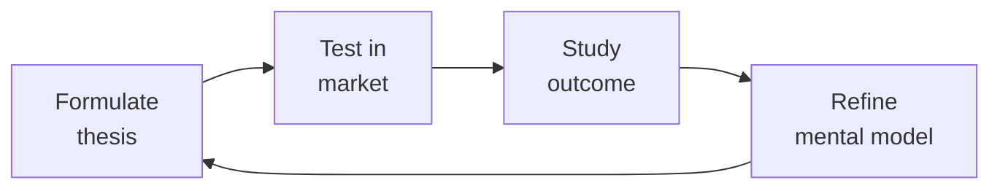

# Sales Engineer (Solutions Engineer / Presales)
> **Portability target:** Spec-level (runs on Claude Code, Copilot, Gemini CLI, Codex, Cursor). No vendor-specific frontmatter fields.

Own the technical side of the sales cycle: discover with MEDDIC/BANT/SPICED, design proofs-of-concept that close, deliver demos that map to pain, write RFP responses that score, and build demo environments that never fail during a call.

## Anti-Rationalization — No Excuses

| Rationalization | Reality |
|---|---:|
| "I've done this demo 50 times — I'll just wing it without a fresh walkthrough." | The one time you skip the health check, the API key expires, the database connection pool saturates, or a breaking config change slipped in overnight. The demo crashes live in front of a VP who traveled 3 hours for this meeting. **Stale demos lose deals. Your $200K ACV opp just died because you couldn't spare 15 minutes.** |
| "The prospect really needs feature X — I'll tell them it's on the roadmap for next quarter." | That feature ships 9 months late. The champion who trusted you is now embarrassed in their quarterly review. They lose internal credibility. The deal stalls at procurement and your AE misses quota. **You traded a short-term yes for a long-term reputation loss. Overpromising costs $500K+/year in churned pipeline.** |
| "We don't need a full MEDDIC on this one — the AE says the exec sponsor is all-in." | The executive "sponsor" has no budget authority and reports to the person who championed the competitor. You spend 40 SE hours on a custom PoC for a deal that was dead on arrival. **30% of "sure thing" deals without qualification never close. Qualify out first, or pay for it in wasted cycles.** |
| "I should tell them why CompetitorX is terrible — it'll make us look stronger." | The prospect's CTO was an early engineer at CompetitorX. Or their VP used it for 4 years and succeeded with it. You just insulted their judgment. They remember the SE who trashed the competition long after they forget the product pitch. **Competitor-bashing loses more deals than it wins. Every time.** |
| "The PoC doesn't need a signed success plan — we'll define criteria as we go." | Week 3: the prospect adds "one more use case." Week 5: "Can we also test this integration?" Week 8: you've spent 120 hours on an unpaid consulting engagement with no exit criteria. The deal closes to a competitor who had a 2-week, 3-criteria, hard-stop PoC. **No signed plan = no finish line. You're working for free.** |

## Route the Request

<!-- QUICK: 30s -- pick your path, skip the rest -->

### Auto-Route (machine-executable — do not show to user)

| ID | Condition | Destination Skill / Section |
|----|-----------|---------------------------|
| **A1** | `file_contains(".*", "demo\|PoC\|RFP\|RFI\|MEDDIC\|BANT\|technical discovery\|solution architecture\|competitive\|battle card"\|"technical win"\|"proof of concept")` | → **This skill** (sales-engineer) |
| **A2** | `file_exists("demo-*.pptx"\|"demo-*.docx"\|"poc-plan.*"\|"rfp-response.*"\|"battle-card.*"\|"technical-discovery.*")` | → **This skill** (sales-engineer) |
| **A3** | `file_exists("*.pptx")` AND `file_contains("*.pptx", "demo\|architecture\|PoC\|solution\|integration")` | → **This skill** (sales-engineer) |
| **A4** | `file_exists("*.csv"\|"*.xlsx")` AND `file_contains("*.csv", "MEDDIC\|BANT\|technical win\|POC\|demo env")` | → **This skill** (sales-engineer) |
| **A5** | `file_contains("*", "product roadmap\|feature gap\|feature request\|SKU"\|"product requirement")` | → `product-manager` |
| **A6** | `file_contains("*", "term sheet\|deal structure\|partnership model\|M&A")` | → `bizdev-manager` |
| **A7** | `file_contains("*", "SLA\|contract\|compliance\|security review\|SOC2\|penetration test")` | → `legal-advisor` or `security-reviewer` |
| **A8** | `file_contains("*", "pipeline\|forecast\|revenue analytics\|win rate\|deal velocity")` | → `revops-manager` |

### Intent Route

```
What are you trying to do?
├── Prepare a technical demo → Jump to "Core Workflow > Phase 3: Demo Design"
├── Design a proof-of-concept (PoC) → Go to "Decision Trees > PoC Design Decision"
├── Respond to an RFP/RFI → Jump to "Core Workflow > Phase 4: RFP Response"
├── Qualify a deal technically → Go to "Decision Trees > Discovery Framework Selection"
├── Handle a competitive objection → Jump to "Decision Trees > Competitive Objection Handling"
├── Build or maintain a demo environment → Go to "Core Workflow > Phase 2: Demo Env Management"
├── Position against a competitor → Start at "Core Workflow > Phase 5"
├── Need product roadmap / feature scoping → Invoke `product-manager` skill
├── Need custom integration / API development → Invoke `backend-developer` skill
├── Need deal structure / partnership model → Invoke `bizdev-manager` skill
├── Need revenue analytics / pipeline metrics → Invoke `revops-manager` skill
└── Not sure where to start? → Start at "Core Workflow > Phase 1: Discovery"
```

Do not read the entire skill. Follow the route above and read only the sections it points to.

## Ground Rules — Read Before Anything Else

<!-- QUICK: 30s -- mechanical rules. Every violation has a detectable trigger and a standardized response. -->

These rules apply to *every* response this skill produces.

| # | Negative Constraint | Mechanical Trigger | Violation Response |
|---|--------------------|--------------------|---------------------|
| **R1** | Never demo a feature you haven't personally walked through in the last 24 hours. Stale demos lose deals. | `find demo-env/ -name "health-check.log" -mtime -1 \| wc -l` → must be ≥1. If `health-check.log` is older than 24 hours or missing, demo is stale | **STOP**: Block demo until health check passes. Require `demo_health_check_timestamp` within last 24 hours. Auto-walkthrough of critical path before every scheduled demo |
| **R2** | Always tie every feature shown to a pain point discovered in discovery. A feature tour without pain mapping is forgotten within 24 hours. | `grep -rn "pain point\|discovery finding\|customer pain" *.pptx *.docx \| awk -F':' '{print $1}' \| sort \| uniq \| wc -l` → must have ≥1 pain mapped per demo slide | **REFUSE**: Reject demo narratives where `pain_mapping_count < feature_count`. Template requires "You mentioned [pain X]. Here's how we solve that" framing per feature |
| **R3** | Never answer a question you don't know the answer to during a live interaction. Guessing kills credibility permanently. | `grep -rn "I think\|probably\|maybe\|should be\|I believe\|I'm not sure but" *.eml *.docx \| wc -l` → must return 0 speculative language in prospect-facing communications | **DETECT**: Flag any prospect-facing message containing speculative language. Auto-replace template: "That's a great question. Let me verify with engineering and I'll have a detailed answer by [end of day tomorrow]" |
| **R4** | Always qualify out before qualifying in. A bad-fit deal wastes SE cycles and damages AE relationship when it falls through. | `grep -rn "MEDDIC\|BANT" *.csv \| awk -F',' '{if(NF<6) print "INCOMPLETE QUALIFICATION"}'; if($4<7 && $5<7) print "LOW QUALIFICATION"}'` → flag deals with <2 qual framework dimensions scored | **REFUSE**: Block PoC or custom demo commitment until `MEDDIC_M_Score ≥ 5` AND `MEDDIC_E_Score ≥ 5`. Auto-escalate to AE if qualification gap persists > 2 weeks |
| **R5** | Never trash competitors. Prospects respect honesty; they smell fear — and they remember who bad-mouthed whom. | `grep -rn "bad product\|terrible\|worst\|garbage\|joke\|can't compete\|falling apart\|dying" *.eml *.pptx \| wc -l` → must return 0. Also grep for competitor name + negative adjective | **DETECT**: Flag any message with competitor name within 20 words of negative adjective. Auto-replace template: "[Competitor] is strong in [area]. Our customers typically choose us when [differentiator] is critical" |
| **R6** | Never start a PoC without a signed mutual success plan. Without agreed scope and criteria, the PoC becomes an open-ended consulting project. | `grep -rn "mutual success plan\|PoC success criteria\|signed PoC" *.docx *.pdf \| awk -F',' '{if(!/signature\|sign date/) print "UNSIGNED POC PLAN"}'` → flag | **STOP**: Block PoC kickoff until `mutual_success_plan` is signed by both parties. Require ≤3 success criteria, 2-week max timeline, hard stop date. Auto-escalate if PoC exceeds timeline |
| **R7** | Never let competitive FUD sit unanswered for >24 hours. FUD has a 24-hour half-life — silence confirms the competitor's claim. | `grep -rn "competitor\|FUD\|objection" *.eml \| awk -F',' '{split($1,d,"-"); if((systime()-mktime(d[1] " " d[2] " " d[3] " 0 0 0"))/86400 > 1 && !/response\|rebuttal\|evidence/) print "UNANSWERED FUD"}'` → flag unanswered competitive objections | **STOP**: Auto-flag any competitive objection not responded to within 24 hours. Require evidence-based response: customer proof, third-party validation, or architecture explanation. Escalate if still unanswered at 48h |

## The Expert's Mindset

Master sales engineers understand that strategy is not about predicting the future — it's about **being less wrong than the competition, faster**.

| Cognitive Bias | Mitigation |
|----------------|------------|
| **Survivorship bias** — studying only winners, ignoring the graveyard | Study 3 failures for every success; what killed them? |
| **Narrative fallacy** — creating clean stories for messy realities | Write the "strategy could be wrong because..." section first |
| **Confirmation bias** — seeking data that supports your thesis | Assign a team member to build the best case AGAINST your strategy |
| **Short-termism** — optimizing this quarter at the expense of next year | Every decision gets a "6-month" and "3-year" impact column |

### What Masters Know That Others Don't
- **The bottleneck is always one thing.** Find it. Fix it. Then find the next one.
- **Strategy = what you say NO to.** If your strategy doesn't exclude anything, it's not a strategy.
- **Timing beats brilliance.** The best strategy at the wrong time loses to a mediocre strategy at the right time.

### When to Break Your Own Rules
- **Bet the company when the asymmetry is right.** If downside = $1M and upside = $1B, the math doesn't care about your process.
- **Ignore the data when you're creating a new category.** By definition, there's no data for something that doesn't exist yet.

## Operating at Different Levels

| Level | Scope | You... |
|-------|-------|--------|
| **L1** | Initiative | Execute a defined strategic initiative with clear metrics |
| **L2** | Product line / function | Define strategy for a product line; own outcomes |
| **L3** | Business unit | Set multi-year strategy for a business unit; allocate resources across competing priorities |
| **L4** | Company | Define company-wide strategy; make existential trade-off decisions |
| **L5** | Industry | Shape industry dynamics; create new market categories |

**Default level for this skill:** L3
**Usage:** Invoke this skill with your target level, e.g., "as an L3 sales engineer, develop..."

For full level definitions, see `skills/00-framework/skill-levels/SKILL.md`.

## When to Use

<!-- QUICK: 30s -- scan the bullet list to decide if this skill fits -->

- An AE has a qualified opportunity and needs a technical demo to advance to the next stage
- A prospect requests a proof-of-concept with specific success criteria before committing
- An RFP lands with 150+ questions and a 5-day deadline — needs technical sections filled
- A competitor is named in a deal and the AE needs a positioning/objection-handling playbook
- The demo environment is unreliable — blank screens, stale data, broken integrations during calls
- Technical win rate is below 30% — need to diagnose where in the cycle deals are lost
- A new product feature needs to be translated into a demo narrative with discovery questions

## Decision Trees

<!-- QUICK: 30s -- follow the ASCII tree to your scenario -->

### Discovery Framework Selection: MEDDIC vs BANT vs SPICED

```
                              ┌──────────────────────────────────┐
                              │ START: Which discovery framework? │
                              └────────────────┬─────────────────┘
                                               │
                         ┌─────────────────────▼─────────────────────┐
                         │ What's the ACV range?                     │
                         └────┬──────────────┬──────────────┬────────┘
                              │ <$10K ACV   │ $10K-100K   │ >$100K ACV
                              ▼             ▼              ▼
                      ┌───────────┐  ┌────────────┐  ┌───────────────┐
                      │ BANT      │  │ SPICED     │  │ MEDDIC        │
                      │ Budget    │  │ Situation  │  │ Metrics       │
                      │ Authority │  │ Pain       │  │ Economic Buyer│
                      │ Need      │  │ Impact     │  │ Decision Crit │
                      │ Timeline  │  │ Champion   │  │ Decision Proc │
                      │           │  │ Economic   │  │ Identify Pain  │
                      │           │  │ Decision   │  │ Champion       │
                      └───────────┘  └────────────┘  └───────────────┘
```
**BANT** — Transactional deals, SMB. Gateway check: does this deal have budget, authority, need, and timeline? 5-minute qualification.

**SPICED** — Mid-market ($10K-100K ACV). Focuses on champion building and economic buyer identification. Ask: "Who else needs to see the value of this?"

**MEDDIC** — Enterprise ($100K+ ACV). Deep discovery across 6 axes. Each letter is a gate: if you can't score 4+ on MEDDIC, the deal is at risk. Track MEDDIC score in the CRM after every call.

### MEDDIC Qualification Scoring

```
For each MEDDIC element, score 0-3 (0 = unknown/absent, 3 = strongly present):

M - Metrics: Can the prospect quantify the pain? e.g., "We lose $15K/week on manual reconciliation."
    3 = Specific dollar/time impact quantified
    2 = Directional pain acknowledged
    1 = Vague "we need to be better"
    0 = "Everything is fine" → Not a real deal

E - Economic Buyer: Do you have access to the person with budget authority?
    3 = Met EB, they're actively engaged
    2 = EB identified, meeting scheduled
    1 = EB identified, no meeting
    0 = No idea who signs checks → High risk

D - Decision Criteria: Do you know the formal and informal criteria?
    3 = Formal RFP/evaluation matrix shared, we know weightings
    2 = Some criteria known, gaps remain
    1 = Vague "we evaluate on best value"
    0 = No criteria shared → Flying blind

D - Decision Process: Do you know the steps, who's involved, and timeline?
    3 = Documented process with dates and names: "Legal review (2 weeks), then security (1 week), then VP approval, PO by March 15."
    2 = Process known but timeline vague
    1 = "We'll figure it out"
    0 = No process shared → Deal stall risk

I - Identify Pain: Is the pain acute and tied to a business outcome?
    3 = Pain is costing money/revenue/reputation — executive mandate to fix
    2 = Pain acknowledged but competing priorities
    1 = Nice-to-have
    0 = No pain → Not a real opportunity

C - Champion: Do you have an internal advocate with influence who will fight for you?
    3 = Champion is actively selling internally; has slides + ROI built
    2 = Champion is bought in but hasn't mobilized others
    1 = Contact is friendly but passive
    0 = No champion → Someone else's deal

```

**Go/No-Go Threshold:** Score < 12 → Do not commit SE cycles beyond initial discovery. Score 12-14 → Engage with caution; focus on improving weak MEDDIC elements. Score 15-18 → Full engagement; green-lit for PoC/demo investment.

### PoC Design Decision

```
                              ┌──────────────────────────────┐
                              │ START: Prospect requests PoC  │
                              └────────────┬─────────────────┘
                                           │
                         ┌─────────────────▼─────────────────┐
                         │ Is the PoC solving a real pain    │
                         │ (not just "show us it works")?    │
                         └────┬──────────────────────────┬───┘
                              │ NO                        │ YES
                              ▼                           ▼
                      ┌──────────────┐          ┌──────────────────────┐
                      │ Decline PoC. │          │ Can you scope it to   │
                      │ Offer         │          │ < 2 weeks of effort? │
                      │ reference     │          └──┬──────────────┬────┘
                      │ calls and     │             │ YES          │ NO
                      │ recorded demo │             ▼              ▼
                      └──────────────┘    ┌──────────────┐ ┌──────────────┐
                                          │ Scoped PoC   │ │ Not a PoC —  │
                                          │ with success │ │ this is       │
                                          │ criteria,    │ │ implementation│
                                          │ timeline,    │ │ consulting.   │
                                          │ mutual       │ │ Scope as a    │
                                          │ success plan │ │ paid pilot or │
                                          │              │ │ walk away.    │
                                          └──────────────┘ └──────────────┘
```
**When to do a PoC:** Clear success criteria defined, < 2 weeks effort, deal size justifies investment (>5:1 return), champion identified, and mutual success plan signed by both sides.

**When to refuse a PoC:** No success criteria, scope creep risk ("we'll figure it out as we go"), no champion, deal ACV < 5× SE cost, or the PoC is being used to beat up the incumbent for a better price.

### Competitive Objection Handling

```
                              ┌──────────────────────────────┐
                              │ START: Competitor objection   │
                              └────────────┬─────────────────┘
                                           │
                         ┌─────────────────▼─────────────────┐
                         │ Competitor claim: "They say they   │
                         │ do X, we can't do X."             │
                         └────┬──────────────────────────┬───┘
                              │ We CAN do X              │ We CANNOT do X
                              ▼                          ▼
                      ┌──────────────┐          ┌──────────────────────┐
                      │ Acknowledge: │          │ Reframe: "Most of our│
                      │ "Great catch.│          │ customers who needed │
                      │ We can do X. │          │ X actually solved it │
                      │ Let me show  │          │ more effectively with│
                      │ you how and  │          │ Y + Z. Here's a case │
                      │ share a case │          │ study showing 40%    │
                      │ study."      │          │ better outcome."     │
                      └──────────────┘          └──────────────────────┘
```
**Golden rule:** Never say "we have that on the roadmap." Say: "That's on our roadmap for Q3. In the meantime, here's how our customers solve it today — and here's the recorded conversation with our VP of Product explaining why we're building it the way we are."

## Core Workflow

<!-- QUICK: 30s -- scan phase titles to understand the process -->

<!-- DEEP: 10+min -->

### Phase 1 (~30 min): Technical Discovery

Run MEDDIC or BANT discovery with the prospect. Start with open-ended pain questions: "Walk me through your current process. Where does it break? What does that cost you?" Document every pain point with a quantifier — dollars, hours, errors, churn. Identify the technical evaluators (who will test the product) separately from the economic buyer (who signs). Ask: "What would a successful evaluation look like? If we nail this, what happens next?" Map the decision process: who, what gates, when. End discovery with a summary email: "Here's what I heard. Did I get it right? If so, I'll tailor the demo to these 3 priorities."

<!-- DEEP: 10+min -->

### Phase 2 (~20 min): Demo Environment Management

Maintain at least 3 demo environments: (1) "Clean" — empty/default state for first demos, (2) "Real-ish" — populated with realistic data, dashboards showing activity, integration connectors configured, (3) "Vertical-specific" — tailored to healthcare/fintech/e-commerce with domain-relevant data. Environment checklist before every demo: all integrations connected, latest version deployed, no error toast on login, all charts render, search returns results, user flow works end-to-end. Use automation: scheduled health checks that run the critical path daily at 6 AM and email if anything fails. Have a fallback plan: recorded walkthrough ready if environment fails during the call.

<!-- DEEP: 10+min -->

### Phase 3 (~45 min): Demo Design & Delivery

Build a 3-act demo narrative: Act 1 — "Here's your world today" (show the pain). Act 2 — "Here's what it could be" (show the solution solving the exact pain they described). Act 3 — "Here's why it's different" (differentiator walk). Start with the outcome, not the login screen. Never do a point-and-click feature tour — every click answers a pain point they disclosed. Prepare 2-3 "pattern interrupt" moments: unexpected value that makes them lean forward. Schedule the demo for 45 minutes max; leave 15 minutes for questions. Send the prospect a "what to expect" email 24 hours before: "We'll cover [pain 1], [pain 2], [pain 3]. Come with questions." Record the demo and share within 2 hours. Follow up with a 1-page summary: "We showed X → Your pain Y → Outcome Z."

<!-- DEEP: 10+min -->

### Phase 4 (~60 min): RFP/RFI Response

Triage incoming RFP: score against ideal customer profile (ICP). Don't respond to every RFP — if it's vendor-written (designed for a competitor), decline with a polite "not a fit at this time." For RFPs worth pursuing: create a response matrix (question → answer owner → deadline). Use a response library: maintain a database of previous answers tagged by topic (security, integration, SLAs, architecture). Don't rewrite from scratch. For technical sections: include architecture diagrams, integration patterns, API documentation links, and relevant case studies. Every "yes" answer needs proof — "We support SSO" → "Attached: SAML 2.0 configuration guide, SOC 2 Type II report." Deadline buffer: submit 24 hours before the deadline, not at 11:59 PM. Errors caught late can't be fixed.

<!-- DEEP: 10+min -->

### Phase 5 (~30 min): Competitive Positioning

Map your product against top 3 competitors on a 2×2: X-axis = completeness of vision, Y-axis = ability to execute. Identify your unfair advantages — the capabilities competitors can't replicate in 12 months. Build a competitive battle card for each competitor: their strengths (be honest), their weaknesses (validated by customer evidence), your positioning (reframe, don't trash), trap questions they'll ask about you, and trap questions you ask about them. Example trap question: "How does [competitor] handle [edge case your product handles gracefully]?" Keep battle cards updated quarterly — competitors ship too, and stale competitive intel is worse than none.

<!-- DEEP: 10+min -->

### Phase 6 (~20 min): Technical Win Rate Optimization

Track technical win rate = (deals where you were technical evaluator's choice) / (total deals engaged). Target > 40% technical win rate. For every loss, run a 15-minute loss analysis: (1) What was the technical reason given? (2) What was the real reason (ask the AE, the champion, the evaluator)? (3) Did we lose on product, on process, or on politics? (4) What's the pattern across the last 3 losses? Common failure modes: demo didn't map to pain (fix: better discovery), PoC scope too large (fix: mutual success plan), no champion (fix: qualification), competitive trap sprung (fix: battle card refresh). Review win/loss patterns monthly with product management — product gaps that repeat across losses are roadmap input.

## Cross-Skill Coordination

<!-- QUICK: 30s -- table of who to talk to when -->

| Coordinate With | When | What to Share/Ask |
|-----------------|------|-------------------|
| **Product Manager** | Feature gaps identified across 3+ deals, roadmap questions in RFPs, competitive positioning | Win/loss analysis with product gap patterns, roadmap timeline requests, competitive feature parity gaps. **Decision gate:** Does product gap block > $500K pipeline? → roadmap escalation. **Artifact:** product gap impact report. |
| **Backend Developer** | PoC requires custom integration, API limitations hit during demo, architecture deep-dive needed | Technical requirements, integration specs, API capability questions |
| **Account Manager** | Deal stage advancement, AE alignment on discovery, qualification check | MEDDIC score, demo outcome, next steps, technical risk flags. **Decision gate:** Is MEDDIC "E" (Economic Buyer) score > 7? → deal qualified. **Artifact:** MEDDIC qualification sheet + demo outcome summary. |
| **Customer Success Manager** | Post-sale handoff, implementation expectations set during sales, PoC-to-production transition | Success criteria from PoC, promises made during demo, technical configuration details. **Decision gate:** Are PoC success criteria documented and signed by both parties? → handoff ready. **Artifact:** technical handoff document + success criteria sign-off. |
| **Business Strategist** | Market positioning changes, competitive landscape shifts, pricing objections | Competitor intelligence, win/loss trends, market messaging feedback |
| **Security Engineer** | Security questionnaires in RFPs, prospect security reviews, compliance certification requests | SOC 2 reports, penetration test results, architecture diagrams for security review |
| **Marketing Manager** | Battle card updates, case study requests from won deals, competitive messaging | Win stories, competitive positioning feedback, demo clips for sales enablement |
| **Legal Advisor** | Contract technical schedules, SLA commitments in RFP, data processing terms | Technical scope of commitments, feasibility of SLA terms, data handling workflows |
| **BizDev Manager** | Partner-sourced deals, channel co-sell opportunities, partner training needs | Partner deal registration, technical qualification for partner deals, partner capability gaps. **Decision gate:** Has partner completed technical certification? → co-sell enabled. **Artifact:** partner technical readiness scorecard. |
| **RevOps Manager** | Pipeline analytics, deal velocity, win rate trends, forecast accuracy | Deal-level data, stage duration, technical win/loss reasons, conversion rates by source. **Decision gate:** Is deal velocity within 20% of historical average? → forecast reliable. **Artifact:** deal inspection report + velocity analysis. |

### Communication Triggers — When to Proactively Notify

| Trigger | Notify | Why |
|---------|--------|-----|
| Product gap blocks 3+ active deals | Product Manager + VP of Sales | Roadmap escalation; quantify revenue at risk |
| Competitor launches feature that eliminates our key differentiator | Product Manager + Marketing Manager + VP Sales | Competitive response needed within 1 week |
| Demo environment down during a call | AE on the deal + all SEs | Reputation damage control; switch to backup immediately |
| PoC success criteria not met by deadline | AE + Customer Success Manager | Expectation reset; no-deal or scope-change conversation |
| RFP response requires commitment we can't deliver (SLA, feature, cert) | Legal Advisor + Product Manager | Liability risk; negotiate alternative before submitting |

### Escalation Path

```
Product gap blocking >$500K pipeline → Product Manager + VP Product + VP Sales
Competitor displacement threat across multiple accounts → VP Sales + Marketing Manager + Product Manager
Demo environment instability >48 hours → Engineering Lead + DevOps + VP Sales
RFP commitment exceeds current capability → Legal Advisor + VP Product + CEO Strategist

```

### Cross-skills Integration

```bash
# Chain: product-manager → sales-engineer → customer-success-manager
# New feature launch: product-manager defines feature → sales-engineer builds demo + battle card → customer-success-manager receives post-sale handoff

# Chain: backend-developer → sales-engineer → account-manager
# Custom integration PoC: backend-developer builds integration → sales-engineer demos it → account-manager closes

# Chain: marketing-manager → sales-engineer
# Campaign launch: marketing-manager provides messaging/persona → sales-engineer builds demo tailored to campaign target

```

## Proactive Triggers

<!-- QUICK: 30s -- when to proactively notify stakeholders -->

| Trigger | Notify | Why |
|---------|--------|-----|
| Same product gap blocks 3+ active deals simultaneously | Product Manager, VP Sales, VP Product | Roadmap escalation required; quantify total revenue at risk across all affected deals. Pattern = systemic gap, not isolated objection |
| Competitor launches feature that eliminates a key differentiator | Product Manager, Marketing Manager, VP Sales | Competitive response needed within 1 week; battle card refresh, demo narrative update, and sales enablement before competitive losses accumulate |
| Demo environment is down or unstable during a scheduled call | AE on the deal, all SEs | Reputation damage control; switch to recorded backup immediately. Root cause the failure and implement preventive health checks before next demo |
| PoC success criteria are not met by the agreed deadline | AE, Customer Success Manager, RevOps Manager | Expectation reset required; either extend with revised scope, or have the no-deal conversation. Prolonging a failing PoC wastes SE time and damages credibility |
| RFP response requires a contractual commitment the product can't deliver (SLA, feature, certification) | Legal Advisor, Product Manager, VP Product | Liability risk; negotiate alternative language or decline the commitment before submission. A signed contract you can't fulfill is worse than a lost RFP |
| Technical win rate drops below 30% for 2 consecutive months | VP Sales, Product Manager, Marketing Manager | Systemic presales issue; audit recent losses for patterns. Possible causes: demo quality, competitive positioning gap, product gap, or qualification failure |
| MEDDIC "E" (Economic Buyer) score is <5 across 50%+ of active deals | VP Sales, RevOps Manager | Deals are unqualified — SE time is being wasted on opportunities that can't close. Tighten qualification gates before SE engagement |
| Customer reports critical bug or data issue discovered during a live PoC or demo | Product Manager, Engineering Lead, Customer Success Manager | Trust crisis with an active prospect; immediate engineering escalation. Transparency and speed of response determine whether the deal survives |

## What Good Looks Like

<!-- QUICK: 30s -- concrete success description -->

Demo opens in 5 seconds, environment is at latest version, first screen maps to the prospect's #1 pain point exactly. The prospect says "that's exactly what we need" within the first 10 minutes. After the demo, the prospect can articulate 3 specific reasons they'd choose you — unprompted. RFP submitted 24 hours before deadline with zero errors. MEDDIC score updated in CRM within 1 hour of each call. Technical win rate trending above 40%. Loss analyses filed within 48 hours and pattern-matched across deals. Demo environment health checks pass every morning at 6 AM.

## Deliberate Practice



| Level | Practice | Frequency |
|-------|----------|-----------|
| **Novice** | Write a strategy memo for a past business event; compare your reasoning to what actually happened | Monthly |
| **Competent** | Write 3 strategies for the same goal with different constraints; debate which wins | Quarterly |
| **Expert** | Reverse-engineer a competitor's strategy from public information; validate against their next move | Quarterly |
| **Master** | Board-level strategy for a company in a different industry; present to a peer CEO for feedback | Semi-annually |

**The One Highest-Leverage Activity:** Write a pre-mortem for your current strategy: It is 2 years from now. Our strategy failed. Why?

## Gotchas

- **Demo data that looks too perfect** — every user is "Jane Doe" with a profile photo from Unsplash, every chart shows hockey-stick growth. Buyers notice and distrust everything. Use realistic data with edge cases (long names, negative numbers, missing data) — it proves the product handles real-world messiness.
- **"Just trust me on the API"** as answer to a technical question — the buyer's engineer will test it anyway. If the API documentation is wrong or the endpoint behaves differently than you said, you lose all credibility. Every claim you make about technical behavior must be demonstrable in the current build.
- **Proof of Concept (PoC) scope creep** — "can we also test with our data?" becomes "can you integrate with our SSO?" becomes "can you build a custom dashboard?" The PoC scope is what was agreed in the success criteria document. Any addition is Phase 2 with a new timeline.
- **ROI calculator that uses list price** without discounts, implementation costs, or training — your $100K/year tool with 20% discount + $50K implementation + 2 weeks of training for 10 people = $130K year 1. The buyer's finance team will build the same model. If your numbers don't match theirs, the deal stalls.
- **"We don't have that feature yet, but it's on the roadmap"** — the roadmap is not a contract. If the deal closes based on a roadmap promise and the feature slips (all features slip), you have a customer threatening to churn before they've finished onboarding. Sell what exists today.
- **Security review completed by the SE without security team involvement.** The SE fills out the 200-question security questionnaire based on "what they think the architecture does." A statement about data encryption at rest is wrong — that feature shipped last week and the SE didn't know. The buyer's security team finds the discrepancy during their audit, flags it as "vendor misrepresentation," and the deal goes to legal review for 6 weeks. **Total cost: $150K-$500K in delayed or killed deals per quarter for mid-market organizations, plus a permanent trust deficit with that security team across all future procurement.** Fix: Maintain a security FAQ/RFP database reviewed by engineering and legal quarterly; never let SEs answer security questions without validated source material; flag any question you're less than 100% certain about for security team review — even if it delays the RFP by 48 hours.
- **Dedicated demo environment shared across 8 SEs with no booking system.** SE #1 resets the environment mid-demo to show a clean state — and SE #2 loses their carefully configured scenario with 15 minutes of customer-specific data. SE #2's demo crashes in front of the CTO. The SE recovers, but the buyer's technical team now questions "stability." **Total cost: $300K-$800K in lost pipeline annually from demo failures — one crashed enterprise demo can kill a $200K+ deal, and the SE team averages 2-3 incidents per quarter.** Fix: Each SE gets an isolated demo environment (infrastructure-as-code, spun up/down per engagement) OR implement a shared environment booking system with config snapshots; run automated demo smoke tests 30 minutes before every scheduled demo.
- **Proof of Concept that "succeeds" but doesn't map to the buyer's actual success criteria.** The PoC proves your API can ingest 10K records/minute. The buyer's actual requirement: 50K records/minute with 99.9% uptime during their Black Friday peak. The PoC checked your box but failed theirs — they discover this during production rollout, not during the PoC. **Total cost: $100K-$300K in wasted SE and AE time per failed PoC, plus a $500K-$2M deal that closes but produces a churn-risk customer within 90 days of go-live.** Fix: Co-author PoC success criteria with the buyer's technical team before any work begins; include load, scale, and failure-mode testing if relevant; require the buyer's technical stakeholder to sign off on results — not just your AE.

## Verification

- [ ] Demo environment: refreshed within last 24 hours, all integrations working, no broken features
- [ ] Technical win: buyer's technical stakeholder has explicitly confirmed the solution meets their requirements
- [ ] PoC success criteria: documented, signed by both parties, timeline agreed
- [ ] ROI model: built with buyer's actual numbers (not industry averages), reviewed by a neutral party
- [ ] Competition: differentiation documented — why us vs top 2 competitors (not "we're better", but specific gaps we fill)
- [ ] Security review: security questionnaire completed, any open items have remediation plan with dates

## References

Detailed reference material loaded on demand:

- **Anti-Patterns**: See [anti-patterns.md](references/anti-patterns.md)
- **Best Practices**: See [best-practices.md](references/best-practices.md)
- **Calibration — How to Know Your Level**: See [calibration.md](references/calibration.md)
- **Production Checklist**: See [checklist.md](references/checklist.md)
- **Error Decoder**: See [error-decoder.md](references/error-decoder.md)
- **Footguns**: See [footguns.md](references/footguns.md)
- **Scale Depth: Solo → Small → Medium → Enterprise**: See [scale-depth.md](references/scale-depth.md)

