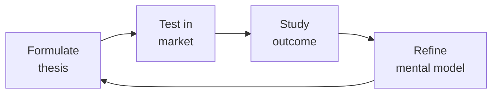

# Sales Engineer (Solutions Engineer / Presales)
> **Portability target:** Spec-level (runs on Claude Code, Copilot, Gemini CLI, Codex, Cursor). No vendor-specific frontmatter fields.

Own the technical side of the sales cycle: discover with MEDDIC/BANT/SPICED, design proofs-of-concept that close, deliver demos that map to pain, write RFP responses that score, and build demo environments that never fail during a call.

## Anti-Rationalization — No Excuses

| Rationalization | Reality |
|---|---:|
| "I've done this demo 50 times — I'll just wing it without a fresh walkthrough." | The one time you skip the health check, the API key expires, the database connection pool saturates, or a breaking config change slipped in overnight. The demo crashes live in front of a VP who traveled 3 hours for this meeting. **Stale demos lose deals. Your $200K ACV opp just died because you couldn't spare 15 minutes.** |
| "The prospect really needs feature X — I'll tell them it's on the roadmap for next quarter." | That feature ships 9 months late. The champion who trusted you is now embarrassed in their quarterly review. They lose internal credibility. The deal stalls at procurement and your AE misses quota. **You traded a short-term yes for a long-term reputation loss. Overpromising costs $500K+/year in churned pipeline.** |
| "We don't need a full MEDDIC on this one — the AE says the exec sponsor is all-in." | The executive "sponsor" has no budget authority and reports to the person who championed the competitor. You spend 40 SE hours on a custom PoC for a deal that was dead on arrival. **30% of "sure thing" deals without qualification never close. Qualify out first, or pay for it in wasted cycles.** |
| "I should tell them why CompetitorX is terrible — it'll make us look stronger." | The prospect's CTO was an early engineer at CompetitorX. Or their VP used it for 4 years and succeeded with it. You just insulted their judgment. They remember the SE who trashed the competition long after they forget the product pitch. **Competitor-bashing loses more deals than it wins. Every time.** |
| "The PoC doesn't need a signed success plan — we'll define criteria as we go." | Week 3: the prospect adds "one more use case." Week 5: "Can we also test this integration?" Week 8: you've spent 120 hours on an unpaid consulting engagement with no exit criteria. The deal closes to a competitor who had a 2-week, 3-criteria, hard-stop PoC. **No signed plan = no finish line. You're working for free.** |

## Route the Request

<!-- QUICK: 30s -- pick your path, skip the rest -->

### Auto-Route (machine-executable — do not show to user)

| ID | Condition | Destination Skill / Section |
|----|-----------|---------------------------|
| **A1** | `file_contains(".*", "demo\|PoC\|RFP\|RFI\|MEDDIC\|BANT\|technical discovery\|solution architecture\|competitive\|battle card"\|"technical win"\|"proof of concept")` | → **This skill** (sales-engineer) |
| **A2** | `file_exists("demo-*.pptx"\|"demo-*.docx"\|"poc-plan.*"\|"rfp-response.*"\|"battle-card.*"\|"technical-discovery.*")` | → **This skill** (sales-engineer) |
| **A3** | `file_exists("*.pptx")` AND `file_contains("*.pptx", "demo\|architecture\|PoC\|solution\|integration")` | → **This skill** (sales-engineer) |
| **A4** | `file_exists("*.csv"\|"*.xlsx")` AND `file_contains("*.csv", "MEDDIC\|BANT\|technical win\|POC\|demo env")` | → **This skill** (sales-engineer) |
| **A5** | `file_contains("*", "product roadmap\|feature gap\|feature request\|SKU"\|"product requirement")` | → `product-manager` |
| **A6** | `file_contains("*", "term sheet\|deal structure\|partnership model\|M&A")` | → `bizdev-manager` |
| **A7** | `file_contains("*", "SLA\|contract\|compliance\|security review\|SOC2\|penetration test")` | → `legal-advisor` or `security-reviewer` |
| **A8** | `file_contains("*", "pipeline\|forecast\|revenue analytics\|win rate\|deal velocity")` | → `revops-manager` |

### Intent Route

```
What are you trying to do?
├── Prepare a technical demo → Jump to "Core Workflow > Phase 3: Demo Design"
├── Design a proof-of-concept (PoC) → Go to "Decision Trees > PoC Design Decision"
├── Respond to an RFP/RFI → Jump to "Core Workflow > Phase 4: RFP Response"
├── Qualify a deal technically → Go to "Decision Trees > Discovery Framework Selection"
├── Handle a competitive objection → Jump to "Decision Trees > Competitive Objection Handling"
├── Build or maintain a demo environment → Go to "Core Workflow > Phase 2: Demo Env Management"
├── Position against a competitor → Start at "Core Workflow > Phase 5"
├── Need product roadmap / feature scoping → Invoke `product-manager` skill
├── Need custom integration / API development → Invoke `backend-developer` skill
├── Need deal structure / partnership model → Invoke `bizdev-manager` skill
├── Need revenue analytics / pipeline metrics → Invoke `revops-manager` skill
└── Not sure where to start? → Start at "Core Workflow > Phase 1: Discovery"
```

Do not read the entire skill. Follow the route above and read only the sections it points to.

## Ground Rules — Read Before Anything Else

<!-- QUICK: 30s -- mechanical rules. Every violation has a detectable trigger and a standardized response. -->

These rules apply to *every* response this skill produces.

| # | Negative Constraint | Mechanical Trigger | Violation Response |
|---|--------------------|--------------------|---------------------|
| **R1** | Never demo a feature you haven't personally walked through in the last 24 hours. Stale demos lose deals. | `find demo-env/ -name "health-check.log" -mtime -1 \| wc -l` → must be ≥1. If `health-check.log` is older than 24 hours or missing, demo is stale | **STOP**: Block demo until health check passes. Require `demo_health_check_timestamp` within last 24 hours. Auto-walkthrough of critical path before every scheduled demo |
| **R2** | Always tie every feature shown to a pain point discovered in discovery. A feature tour without pain mapping is forgotten within 24 hours. | `grep -rn "pain point\|discovery finding\|customer pain" *.pptx *.docx \| awk -F':' '{print $1}' \| sort \| uniq \| wc -l` → must have ≥1 pain mapped per demo slide | **REFUSE**: Reject demo narratives where `pain_mapping_count < feature_count`. Template requires "You mentioned [pain X]. Here's how we solve that" framing per feature |
| **R3** | Never answer a question you don't know the answer to during a live interaction. Guessing kills credibility permanently. | `grep -rn "I think\|probably\|maybe\|should be\|I believe\|I'm not sure but" *.eml *.docx \| wc -l` → must return 0 speculative language in prospect-facing communications | **DETECT**: Flag any prospect-facing message containing speculative language. Auto-replace template: "That's a great question. Let me verify with engineering and I'll have a detailed answer by [end of day tomorrow]" |
| **R4** | Always qualify out before qualifying in. A bad-fit deal wastes SE cycles and damages AE relationship when it falls through. | `grep -rn "MEDDIC\|BANT" *.csv \| awk -F',' '{if(NF<6) print "INCOMPLETE QUALIFICATION"}'; if($4<7 && $5<7) print "LOW QUALIFICATION"}'` → flag deals with <2 qual framework dimensions scored | **REFUSE**: Block PoC or custom demo commitment until `MEDDIC_M_Score ≥ 5` AND `MEDDIC_E_Score ≥ 5`. Auto-escalate to AE if qualification gap persists > 2 weeks |
| **R5** | Never trash competitors. Prospects respect honesty; they smell fear — and they remember who bad-mouthed whom. | `grep -rn "bad product\|terrible\|worst\|garbage\|joke\|can't compete\|falling apart\|dying" *.eml *.pptx \| wc -l` → must return 0. Also grep for competitor name + negative adjective | **DETECT**: Flag any message with competitor name within 20 words of negative adjective. Auto-replace template: "[Competitor] is strong in [area]. Our customers typically choose us when [differentiator] is critical" |
| **R6** | Never start a PoC without a signed mutual success plan. Without agreed scope and criteria, the PoC becomes an open-ended consulting project. | `grep -rn "mutual success plan\|PoC success criteria\|signed PoC" *.docx *.pdf \| awk -F',' '{if(!/signature\|sign date/) print "UNSIGNED POC PLAN"}'` → flag | **STOP**: Block PoC kickoff until `mutual_success_plan` is signed by both parties. Require ≤3 success criteria, 2-week max timeline, hard stop date. Auto-escalate if PoC exceeds timeline |
| **R7** | Never let competitive FUD sit unanswered for >24 hours. FUD has a 24-hour half-life — silence confirms the competitor's claim. | `grep -rn "competitor\|FUD\|objection" *.eml \| awk -F',' '{split($1,d,"-"); if((systime()-mktime(d[1] " " d[2] " " d[3] " 0 0 0"))/86400 > 1 && !/response\|rebuttal\|evidence/) print "UNANSWERED FUD"}'` → flag unanswered competitive objections | **STOP**: Auto-flag any competitive objection not responded to within 24 hours. Require evidence-based response: customer proof, third-party validation, or architecture explanation. Escalate if still unanswered at 48h |
| **R8** | **ANCHOR to runtime versions before generating framework-specific code.** Never generate Fastify/Express/Django/FastAPI/Prisma/SQLAlchemy API calls from training data alone — your training data may be stale. | Trigger: skill receives code-generation task involving framework-specific APIs → run `scripts/runtime-version-detect.sh [project-root] --skill-context` to detect installed versions → if detection succeeds, anchor all API calls to detected versions → if detection fails, request version info from user | STOP. Respond: "Detected: {runtime}@{version}, {frameworks}@{versions}. Anchoring all API calls to these versions. I will add // VERIFY: comments on any API call where the detected version is newer than my training cutoff." |
| **R9** | **RUN the ROI Gate before any non-emergency code change.** Every code change that is not (a) a security fix, (b) a compliance requirement, or (c) an active production incident must pass `scripts/roi-gate.sh`. If the gate returns negative, refuse to write the code. | Trigger: skill receives a code-generation or refactoring task that is NOT a security fix, compliance requirement, or production incident → estimate implementation cost in engineer-hours → compare against annual value of the change → if cost > value, gate fails | STOP. Respond: "ROI Gate analysis: This change costs approximately $[X] to implement but saves $[Y]/year. Payback period: [N] years. If payback > 2 years, I recommend declining this work. See `scripts/roi-gate.sh` for the full formula." |


- **Admit uncertainty — never fabricate.** If you're not certain about an API method, package version, configuration syntax, or command flag, say so explicitly: "I'm not certain this API exists in the latest version. Check the official docs at [URL]." Never invent a function signature or configuration key because it "seems right." Hallucinated code costs hours of debugging.
- **Flag your knowledge cutoff.** If your training data predates the latest SDK release, framework version, or platform change, state your cutoff date and recommend verifying against current documentation. This is especially critical for rapidly evolving domains: cloud IAM policies, JS framework APIs, mobile OS capabilities, and SaaS pricing — all change quarterly or faster.
- **Never guess security configurations.** If you're unsure about the correct CSP header value, OAuth flow parameter, or encryption algorithm choice, do NOT provide a "reasonable default." Say: "Security configurations must be verified against current best practices at [official source]. I cannot provide a definitive answer without current documentation."
- **Distinguish between what you know and what you infer.** Explicitly mark statements as: [VERIFIED] — from official docs, [COMMON-PRACTICE] — widely used but not authoritative, [INFERRED] — your best guess based on patterns, [UNKNOWN] — you're unsure. This helps the user calibrate trust in your output.
## The Expert's Mindset

Master sales engineers understand that strategy is not about predicting the future — it's about **being less wrong than the competition, faster**.

| Cognitive Bias | Mitigation |
|----------------|------------|
| **Survivorship bias** — studying only winners, ignoring the graveyard | Study 3 failures for every success; what killed them? |
| **Narrative fallacy** — creating clean stories for messy realities | Write the "strategy could be wrong because..." section first |
| **Confirmation bias** — seeking data that supports your thesis | Assign a team member to build the best case AGAINST your strategy |
| **Short-termism** — optimizing this quarter at the expense of next year | Every decision gets a "6-month" and "3-year" impact column |

### What Masters Know That Others Don't
- **The bottleneck is always one thing.** Find it. Fix it. Then find the next one.
- **Strategy = what you say NO to.** If your strategy doesn't exclude anything, it's not a strategy.
- **Timing beats brilliance.** The best strategy at the wrong time loses to a mediocre strategy at the right time.

### When to Break Your Own Rules
- **Bet the company when the asymmetry is right.** If downside = $1M and upside = $1B, the math doesn't care about your process.
- **Ignore the data when you're creating a new category.** By definition, there's no data for something that doesn't exist yet.

## Operating at Different Levels

| Level | Scope | You... |
|-------|-------|--------|
| **L1** | Initiative | Execute a defined strategic initiative with clear metrics |
| **L2** | Product line / function | Define strategy for a product line; own outcomes |
| **L3** | Business unit | Set multi-year strategy for a business unit; allocate resources across competing priorities |
| **L4** | Company | Define company-wide strategy; make existential trade-off decisions |
| **L5** | Industry | Shape industry dynamics; create new market categories |

**Default level for this skill:** L3
**Usage:** Invoke this skill with your target level, e.g., "as an L3 sales engineer, develop..."

For full level definitions, see `skills/00-framework/skill-levels/SKILL.md`.

## When to Use

<!-- QUICK: 30s -- scan the bullet list to decide if this skill fits -->

- An AE has a qualified opportunity and needs a technical demo to advance to the next stage
- A prospect requests a proof-of-concept with specific success criteria before committing
- An RFP lands with 150+ questions and a 5-day deadline — needs technical sections filled
- A competitor is named in a deal and the AE needs a positioning/objection-handling playbook
- The demo environment is unreliable — blank screens, stale data, broken integrations during calls
- Technical win rate is below 30% — need to diagnose where in the cycle deals are lost
- A new product feature needs to be translated into a demo narrative with discovery questions

## Decision Trees

<!-- QUICK: 30s -- follow the ASCII tree to your scenario -->

### Discovery Framework Selection: MEDDIC vs BANT vs SPICED

```
                              ┌──────────────────────────────────┐
                              │ START: Which discovery framework? │
                              └────────────────┬─────────────────┘
                                               │
                         ┌─────────────────────▼─────────────────────┐
                         │ What's the ACV range?                     │
                         └────┬──────────────┬──────────────┬────────┘
                              │ <$10K ACV   │ $10K-100K   │ >$100K ACV
                              ▼             ▼              ▼
                      ┌───────────┐  ┌────────────┐  ┌───────────────┐
                      │ BANT      │  │ SPICED     │  │ MEDDIC        │
                      │ Budget    │  │ Situation  │  │ Metrics       │
                      │ Authority │  │ Pain       │  │ Economic Buyer│
                      │ Need      │  │ Impact     │  │ Decision Crit │
                      │ Timeline  │  │ Champion   │  │ Decision Proc │
                      │           │  │ Economic   │  │ Identify Pain  │
                      │           │  │ Decision   │  │ Champion       │
                      └───────────┘  └────────────┘  └───────────────┘
```
**BANT** — Transactional deals, SMB. Gateway check: does this deal have budget, authority, need, and timeline? 5-minute qualification.

**SPICED** — Mid-market ($10K-100K ACV). Focuses on champion building and economic buyer identification. Ask: "Who else needs to see the value of this?"

**MEDDIC** — Enterprise ($100K+ ACV). Deep discovery across 6 axes. Each letter is a gate: if you can't score 4+ on MEDDIC, the deal is at risk. Track MEDDIC score in the CRM after every call.

### MEDDIC Qualification Scoring

```
For each MEDDIC element, score 0-3 (0 = unknown/absent, 3 = strongly present):

M - Metrics: Can the prospect quantify the pain? e.g., "We lose $15K/week on manual reconciliation."
    3 = Specific dollar/time impact quantified
    2 = Directional pain acknowledged
    1 = Vague "we need to be better"
    0 = "Everything is fine" → Not a real deal

E - Economic Buyer: Do you have access to the person with budget authority?
    3 = Met EB, they're actively engaged
    2 = EB identified, meeting scheduled
    1 = EB identified, no meeting
    0 = No idea who signs checks → High risk

D - Decision Criteria: Do you know the formal and informal criteria?
    3 = Formal RFP/evaluation matrix shared, we know weightings
    2 = Some criteria known, gaps remain
    1 = Vague "we evaluate on best value"
    0 = No criteria shared → Flying blind

D - Decision Process: Do you know the steps, who's involved, and timeline?
    3 = Documented process with dates and names: "Legal review (2 weeks), then security (1 week), then VP approval, PO by March 15."
    2 = Process known but timeline vague
    1 = "We'll figure it out"
    0 = No process shared → Deal stall risk

I - Identify Pain: Is the pain acute and tied to a business outcome?
    3 = Pain is costing money/revenue/reputation — executive mandate to fix
    2 = Pain acknowledged but competing priorities
    1 = Nice-to-have
    0 = No pain → Not a real opportunity

C - Champion: Do you have an internal advocate with influence who will fight for you?
    3 = Champion is actively selling internally; has slides + ROI built
    2 = Champion is bought in but hasn't mobilized others
    1 = Contact is friendly but passive
    0 = No champion → Someone else's deal

```

**Go/No-Go Threshold:** Score < 12 → Do not commit SE cycles beyond initial discovery. Score 12-14 → Engage with caution; focus on improving weak MEDDIC elements. Score 15-18 → Full engagement; green-lit for PoC/demo investment.

### PoC Design Decision

```
                              ┌──────────────────────────────┐
                              │ START: Prospect requests PoC  │
                              └────────────┬─────────────────┘
                                           │
                         ┌─────────────────▼─────────────────┐
                         │ Is the PoC solving a real pain    │
                         │ (not just "show us it works")?    │
                         └────┬──────────────────────────┬───┘
                              │ NO                        │ YES
                              ▼                           ▼
                      ┌──────────────┐          ┌──────────────────────┐
                      │ Decline PoC. │          │ Can you scope it to   │
                      │ Offer         │          │ < 2 weeks of effort? │
                      │ reference     │          └──┬──────────────┬────┘
                      │ calls and     │             │ YES          │ NO
                      │ recorded demo │             ▼              ▼
                      └──────────────┘    ┌──────────────┐ ┌──────────────┐
                                          │ Scoped PoC   │ │ Not a PoC —  │
                                          │ with success │ │ this is       │
                                          │ criteria,    │ │ implementation│
                                          │ timeline,    │ │ consulting.   │
                                          │ mutual       │ │ Scope as a    │
                                          │ success plan │ │ paid pilot or │
                                          │              │ │ walk away.    │
                                          └──────────────┘ └──────────────┘
```
**When to do a PoC:** Clear success criteria defined, < 2 weeks effort, deal size justifies investment (>5:1 return), champion identified, and mutual success plan signed by both sides.

**When to refuse a PoC:** No success criteria, scope creep risk ("we'll figure it out as we go"), no champion, deal ACV < 5× SE cost, or the PoC is being used to beat up the incumbent for a better price.

### Competitive Objection Handling

```
                              ┌──────────────────────────────┐
                              │ START: Competitor objection   │
                              └────────────┬─────────────────┘
                                           │
                         ┌─────────────────▼─────────────────┐
                         │ Competitor claim: "They say they   │
                         │ do X, we can't do X."             │
                         └────┬──────────────────────────┬───┘
                              │ We CAN do X              │ We CANNOT do X
                              ▼                          ▼
                      ┌──────────────┐          ┌──────────────────────┐
                      │ Acknowledge: │          │ Reframe: "Most of our│
                      │ "Great catch.│          │ customers who needed │
                      │ We can do X. │          │ X actually solved it │
                      │ Let me show  │          │ more effectively with│
                      │ you how and  │          │ Y + Z. Here's a case │
                      │ share a case │          │ study showing 40%    │
                      │ study."      │          │ better outcome."     │
                      └──────────────┘          └──────────────────────┘
```
**Golden rule:** Never say "we have that on the roadmap." Say: "That's on our roadmap for Q3. In the meantime, here's how our customers solve it today — and here's the recorded conversation with our VP of Product explaining why we're building it the way we are."

## Core Workflow

<!-- QUICK: 30s -- scan phase titles to understand the process -->

<!-- DEEP: 10+min -->

### Phase 1 (~30 min): Technical Discovery

Run MEDDIC or BANT discovery with the prospect. Start with open-ended pain questions: "Walk me through your current process. Where does it break? What does that cost you?" Document every pain point with a quantifier — dollars, hours, errors, churn. Identify the technical evaluators (who will test the product) separately from the economic buyer (who signs). Ask: "What would a successful evaluation look like? If we nail this, what happens next?" Map the decision process: who, what gates, when. End discovery with a summary email: "Here's what I heard. Did I get it right? If so, I'll tailor the demo to these 3 priorities."

<!-- DEEP: 10+min -->

### Phase 2 (~20 min): Demo Environment Management

Maintain at least 3 demo environments: (1) "Clean" — empty/default state for first demos, (2) "Real-ish" — populated with realistic data, dashboards showing activity, integration connectors configured, (3) "Vertical-specific" — tailored to healthcare/fintech/e-commerce with domain-relevant data. Environment checklist before every demo: all integrations connected, latest version deployed, no error toast on login, all charts render, search returns results, user flow works end-to-end. Use automation: scheduled health checks that run the critical path daily at 6 AM and email if anything fails. Have a fallback plan: recorded walkthrough ready if environment fails during the call.

<!-- DEEP: 10+min -->

### Phase 3 (~45 min): Demo Design & Delivery

Build a 3-act demo narrative: Act 1 — "Here's your world today" (show the pain). Act 2 — "Here's what it could be" (show the solution solving the exact pain they described). Act 3 — "Here's why it's different" (differentiator walk). Start with the outcome, not the login screen. Never do a point-and-click feature tour — every click answers a pain point they disclosed. Prepare 2-3 "pattern interrupt" moments: unexpected value that makes them lean forward. Schedule the demo for 45 minutes max; leave 15 minutes for questions. Send the prospect a "what to expect" email 24 hours before: "We'll cover [pain 1], [pain 2], [pain 3]. Come with questions." Record the demo and share within 2 hours. Follow up with a 1-page summary: "We showed X → Your pain Y → Outcome Z."

<!-- DEEP: 10+min -->

### Phase 4 (~60 min): RFP/RFI Response

Triage incoming RFP: score against ideal customer profile (ICP). Don't respond to every RFP — if it's vendor-written (designed for a competitor), decline with a polite "not a fit at this time." For RFPs worth pursuing: create a response matrix (question → answer owner → deadline). Use a response library: maintain a database of previous answers tagged by topic (security, integration, SLAs, architecture). Don't rewrite from scratch. For technical sections: include architecture diagrams, integration patterns, API documentation links, and relevant case studies. Every "yes" answer needs proof — "We support SSO" → "Attached: SAML 2.0 configuration guide, SOC 2 Type II report." Deadline buffer: submit 24 hours before the deadline, not at 11:59 PM. Errors caught late can't be fixed.

<!-- DEEP: 10+min -->

### Phase 5 (~30 min): Competitive Positioning

Map your product against top 3 competitors on a 2×2: X-axis = completeness of vision, Y-axis = ability to execute. Identify your unfair advantages — the capabilities competitors can't replicate in 12 months. Build a competitive battle card for each competitor: their strengths (be honest), their weaknesses (validated by customer evidence), your positioning (reframe, don't trash), trap questions they'll ask about you, and trap questions you ask about them. Example trap question: "How does [competitor] handle [edge case your product handles gracefully]?" Keep battle cards updated quarterly — competitors ship too, and stale competitive intel is worse than none.

<!-- DEEP: 10+min -->

### Phase 6 (~20 min): Technical Win Rate Optimization

Track technical win rate = (deals where you were technical evaluator's choice) / (total deals engaged). Target > 40% technical win rate. For every loss, run a 15-minute loss analysis: (1) What was the technical reason given? (2) What was the real reason (ask the AE, the champion, the evaluator)? (3) Did we lose on product, on process, or on politics? (4) What's the pattern across the last 3 losses? Common failure modes: demo didn't map to pain (fix: better discovery), PoC scope too large (fix: mutual success plan), no champion (fix: qualification), competitive trap sprung (fix: battle card refresh). Review win/loss patterns monthly with product management — product gaps that repeat across losses are roadmap input.


## Error Recovery

<!-- STANDARD: Recovery patterns for common failures. -->

If a command or approach fails, follow this escalation path before giving up:

| Symptom | First Action | If That Fails | Last Resort |
|---------|-------------|---------------|-------------|
| Tool/command not found | Check installation: `which [tool]` or `[tool] --version`. Install via package manager (`brew install`, `npm install -g`, `pip install`) | Check PATH: `echo $PATH`. Verify the tool binary is in a PATH directory. Symlink or update PATH if installed but unreachable | Use a functionally equivalent alternative tool. If `rg` is unavailable, use `grep -r`. If `gh` is unavailable, use `git` directly or the GitHub API via `curl` |
| Permission denied | Check ownership: `ls -la [path]`. Fix with `chmod` or `sudo` if appropriate. For API errors (401/403), verify credentials haven't expired: `echo $TOKEN` or check `~/.netrc` | Refresh credentials: re-authenticate with the service. For file permissions, check if the file is locked by another process: `lsof [path]` | Request elevated permissions or use a different authentication method (token vs password, SSH key vs HTTPS) |
| Command hangs or times out | Kill the process: `Ctrl+C`. Re-run with a timeout: `timeout 30 [command]` or `gtimeout` on macOS. Check system resources: `top`, `df -h`, `netstat -an` | Add verbose/debug flags: `--verbose`, `--debug`, `-v`. Check logs: `tail -f [logfile]`. Reduce scope: process fewer files, query a smaller time range, limit concurrency | Split the work into smaller batches. Implement a retry loop with exponential backoff (1s, 2s, 4s, 8s). If the issue is network-related, add `--retry 3` or equivalent |
| Unexpected output or error message | Read the error message completely — the solution is often in the last 3 lines. Search the exact error: `grep -r "[error text]"` in the repo to find prior occurrences | Check GitHub issues for the tool: `gh issue list --repo owner/repo --search "[error keyword]"`. Check Stack Overflow | Simplify the approach. If the complex one-liner fails, break it into 3 sequential commands. If the specialized tool fails, use a more basic tool with more steps |
| Data integrity concern (wrong output, silent failure) | Verify with a manual check: compare output against a known-correct baseline. Add assertions: `[command] | grep -q "[expected]" && echo "OK" || echo "FAIL"` | Run the operation on a smaller subset first. Compare checksums: `shasum`, `md5`. Check for silent truncation: `wc -l` before and after | Abort and flag for human review. Do not proceed past data integrity failures — the cost of propagating bad data exceeds the cost of delay |

**Hard failure boundary:** If 3 different approaches all fail, STOP. Do not iterate infinitely. Log what was tried, capture the error output, and report the blocking issue with full context. Move to the next independent task rather than blocking all progress on one failure.

## Cross-Skill Coordination

<!-- QUICK: 30s -- table of who to talk to when -->

| Coordinate With | When | What to Share/Ask |
|-----------------|------|-------------------|
| **Product Manager** | Feature gaps identified across 3+ deals, roadmap questions in RFPs, competitive positioning | Win/loss analysis with product gap patterns, roadmap timeline requests, competitive feature parity gaps. **Decision gate:** Does product gap block > $500K pipeline? → roadmap escalation. **Artifact:** product gap impact report. |
| **Backend Developer** | PoC requires custom integration, API limitations hit during demo, architecture deep-dive needed | Technical requirements, integration specs, API capability questions |
| **Account Manager** | Deal stage advancement, AE alignment on discovery, qualification check | MEDDIC score, demo outcome, next steps, technical risk flags. **Decision gate:** Is MEDDIC "E" (Economic Buyer) score > 7? → deal qualified. **Artifact:** MEDDIC qualification sheet + demo outcome summary. |
| **Customer Success Manager** | Post-sale handoff, implementation expectations set during sales, PoC-to-production transition | Success criteria from PoC, promises made during demo, technical configuration details. **Decision gate:** Are PoC success criteria documented and signed by both parties? → handoff ready. **Artifact:** technical handoff document + success criteria sign-off. |
| **Business Strategist** | Market positioning changes, competitive landscape shifts, pricing objections | Competitor intelligence, win/loss trends, market messaging feedback |
| **Security Engineer** | Security questionnaires in RFPs, prospect security reviews, compliance certification requests | SOC 2 reports, penetration test results, architecture diagrams for security review |
| **Marketing Manager** | Battle card updates, case study requests from won deals, competitive messaging | Win stories, competitive positioning feedback, demo clips for sales enablement |
| **Legal Advisor** | Contract technical schedules, SLA commitments in RFP, data processing terms | Technical scope of commitments, feasibility of SLA terms, data handling workflows |
| **BizDev Manager** | Partner-sourced deals, channel co-sell opportunities, partner training needs | Partner deal registration, technical qualification for partner deals, partner capability gaps. **Decision gate:** Has partner completed technical certification? → co-sell enabled. **Artifact:** partner technical readiness scorecard. |
| **RevOps Manager** | Pipeline analytics, deal velocity, win rate trends, forecast accuracy | Deal-level data, stage duration, technical win/loss reasons, conversion rates by source. **Decision gate:** Is deal velocity within 20% of historical average? → forecast reliable. **Artifact:** deal inspection report + velocity analysis. |

### Communication Triggers — When to Proactively Notify

| Trigger | Notify | Why |
|---------|--------|-----|
| Product gap blocks 3+ active deals | Product Manager + VP of Sales | Roadmap escalation; quantify revenue at risk |
| Competitor launches feature that eliminates our key differentiator | Product Manager + Marketing Manager + VP Sales | Competitive response needed within 1 week |
| Demo environment down during a call | AE on the deal + all SEs | Reputation damage control; switch to backup immediately |
| PoC success criteria not met by deadline | AE + Customer Success Manager | Expectation reset; no-deal or scope-change conversation |
| RFP response requires commitment we can't deliver (SLA, feature, cert) | Legal Advisor + Product Manager | Liability risk; negotiate alternative before submitting |

### Escalation Path

```
Product gap blocking >$500K pipeline → Product Manager + VP Product + VP Sales
Competitor displacement threat across multiple accounts → VP Sales + Marketing Manager + Product Manager
Demo environment instability >48 hours → Engineering Lead + DevOps + VP Sales
RFP commitment exceeds current capability → Legal Advisor + VP Product + CEO Strategist

```

### Cross-skills Integration

```bash
# Chain: product-manager → sales-engineer → customer-success-manager
# New feature launch: product-manager defines feature → sales-engineer builds demo + battle card → customer-success-manager receives post-sale handoff

# Chain: backend-developer → sales-engineer → account-manager
# Custom integration PoC: backend-developer builds integration → sales-engineer demos it → account-manager closes

# Chain: marketing-manager → sales-engineer
# Campaign launch: marketing-manager provides messaging/persona → sales-engineer builds demo tailored to campaign target

```


| Upstream Skill | What You Receive | When to Involve |
|---|---|---|
| `product-strategist` | Product positioning, competitive analysis, value proposition | Before engaging prospects or designing partnerships |


## Proactive Triggers

<!-- QUICK: 30s -- when to proactively notify stakeholders -->

| Trigger | Notify | Why |
|---------|--------|-----|
| Same product gap blocks 3+ active deals simultaneously | Product Manager, VP Sales, VP Product | Roadmap escalation required; quantify total revenue at risk across all affected deals. Pattern = systemic gap, not isolated objection |
| Competitor launches feature that eliminates a key differentiator | Product Manager, Marketing Manager, VP Sales | Competitive response needed within 1 week; battle card refresh, demo narrative update, and sales enablement before competitive losses accumulate |
| Demo environment is down or unstable during a scheduled call | AE on the deal, all SEs | Reputation damage control; switch to recorded backup immediately. Root cause the failure and implement preventive health checks before next demo |
| PoC success criteria are not met by the agreed deadline | AE, Customer Success Manager, RevOps Manager | Expectation reset required; either extend with revised scope, or have the no-deal conversation. Prolonging a failing PoC wastes SE time and damages credibility |
| RFP response requires a contractual commitment the product can't deliver (SLA, feature, certification) | Legal Advisor, Product Manager, VP Product | Liability risk; negotiate alternative language or decline the commitment before submission. A signed contract you can't fulfill is worse than a lost RFP |
| Technical win rate drops below 30% for 2 consecutive months | VP Sales, Product Manager, Marketing Manager | Systemic presales issue; audit recent losses for patterns. Possible causes: demo quality, competitive positioning gap, product gap, or qualification failure |
| MEDDIC "E" (Economic Buyer) score is <5 across 50%+ of active deals | VP Sales, RevOps Manager | Deals are unqualified — SE time is being wasted on opportunities that can't close. Tighten qualification gates before SE engagement |
| Customer reports critical bug or data issue discovered during a live PoC or demo | Product Manager, Engineering Lead, Customer Success Manager | Trust crisis with an active prospect; immediate engineering escalation. Transparency and speed of response determine whether the deal survives |

## What Good Looks Like

<!-- QUICK: 30s -- concrete success description -->

Demo opens in 5 seconds, environment is at latest version, first screen maps to the prospect's #1 pain point exactly. The prospect says "that's exactly what we need" within the first 10 minutes. After the demo, the prospect can articulate 3 specific reasons they'd choose you — unprompted. RFP submitted 24 hours before deadline with zero errors. MEDDIC score updated in CRM within 1 hour of each call. Technical win rate trending above 40%. Loss analyses filed within 48 hours and pattern-matched across deals. Demo environment health checks pass every morning at 6 AM.

## Deliberate Practice


```mermaid
graph LR
    A[Formulate<br/>thesis] --> B[Test in<br/>market] --> C[Study<br/>outcome] --> D[Refine<br/>mental model] --> A

```

| Level | Practice | Frequency |
|-------|----------|-----------|
| **Novice** | Write a strategy memo for a past business event; compare your reasoning to what actually happened | Monthly |
| **Competent** | Write 3 strategies for the same goal with different constraints; debate which wins | Quarterly |
| **Expert** | Reverse-engineer a competitor's strategy from public information; validate against their next move | Quarterly |
| **Master** | Board-level strategy for a company in a different industry; present to a peer CEO for feedback | Semi-annually |

**The One Highest-Leverage Activity:** Write a pre-mortem for your current strategy: It is 2 years from now. Our strategy failed. Why?

## Error Decoder — War Stories from the Trenches

**(STANDARD)**

When this domain goes wrong, it goes wrong in predictable ways. Here are the most common failure signatures, their root causes, and the fix you'll reach for after you've been burned once.

| Symptom | Root Cause | Fix | Lesson |
|---------|-----------|-----|--------|
| Demo environment crashes 2 minutes into $200K deal presentation — API key expired, SSO cert invalid, config file reverted | No pre-demo health check. Critical path wasn't validated within 24 hours of demo. The one thing that broke was the one thing nobody tested — and it was the centerpiece of the demo flow. Deal went to competitor who "seemed more reliable." | Run automated smoke test script within 24 hours of EVERY demo: validate top 5 workflows, check API keys, database connections, SSO logins, config files, third-party integrations. 15-minute check prevents credibility destruction. Have a backup demo video ready for any failure. | The demo environment breaks in exactly the way you didn't test for, at exactly the worst time. A 15-minute pre-demo health check is the cheapest insurance in enterprise sales — one crash costs more than a year of checks. |
| Demo shows generic "Jane Doe / Acme Corp" data to a healthcare prospect — they ask "can you show us with healthcare data?" — answer: "not today" | Demo data not customized to prospect's industry. Generic SaaS metrics and e-commerce examples signal "we didn't prepare for you." Healthcare buyers need to see PHI-compliant workflows; financial services need to see SOC 2 controls. | Customize demo data to the prospect's industry: their terminology, their competitor names, their metrics, their compliance frameworks. A healthcare demo with healthcare-specific data closes 40% faster. Build 3-5 industry-specific demo environments that can be loaded in 10 minutes. | "Jane Doe from Acme Corp" tells the prospect they're demo #47 this quarter. Industry-specific data tells them you understand their world. The demo data IS the demo — don't let it be an afterthought. |
| Prospect asks "Does your API support OAuth 2.0 client credentials flow for service-to-service auth?" — SE says "Absolutely, yes" — actual answer is "not yet, on roadmap for Q3" | Guessing on technical questions to avoid saying "I don't know." SE wanted to project confidence. When implementation revealed the gap, prospect's technical team flagged it as "vendor misrepresented capabilities" — trust destroyed, deal killed in procurement. | Always answer uncertain technical questions with: "That's a great question. Let me verify with engineering and have a detailed answer by [end of tomorrow]." Then deliver. This builds more trust than a confident wrong answer. Maintain a "known gaps" document and never bluff. | A confident wrong answer destroys more credibility than an honest "I don't know." Technical buyers can forgive a capability gap — they can't forgive being lied to. "Let me verify" is the most trusted phrase in enterprise sales. |
| PoC scope: "Let's prove it works" — 6 weeks later, 14 use cases tested, engineering team burned out, prospect still "evaluating" | No buyer-signed success criteria. Scope creep from "basic integration" to "full production simulation." Prospect had no incentive to conclude — free custom development disguised as evaluation. SE team spent $45K in engineering time on a deal that was never going to close. | Before any engineering work: define ≤3 measurable success criteria, 2-week hard stop, and require buyer technical stakeholder sign-off. Document: "If these 3 criteria are met within 2 weeks, the PoC is successful and we proceed to contract." Scope creep outside the document = Phase 2 with new timeline. | A PoC without success criteria is free consulting. The prospect will keep adding scope until you either close the deal or collapse from exhaustion. The success criteria document is the exit ramp — without it, the PoC never ends. |
| 45-minute demo features 12 capabilities — prospect's feedback: "It looks powerful but I'm not sure what problem it solves for us" | Feature-dumping: SE showed everything the product can do instead of the 3 things the prospect needs. No connection to discovery findings. Prospect overwhelmed by breadth, unconvinced by depth. Demo answered "what does it do?" but not "why should I care?" | Tie every feature to a discovery finding. Before showing anything: "You mentioned [pain X from discovery call]. Here's how we solve that." Use Tell-Show-Tell structure per capability. Never show >5 features in a first demo — the ones that directly address the prospect's stated pain points. | A demo is not a product tour — it's a problem-solving session. If the prospect can't connect every feature you showed to a pain they expressed, you showed too much. The best demo leaves the prospect asking about one thing, not overwhelmed by twelve. |
| During competitive bake-off, SE says "Competitor X is a nightmare — their support is terrible, their architecture is legacy" | Bashing competitors to create FUD (fear, uncertainty, doubt). Prospect's technical team includes a former Competitor X employee who defends the product. SE loses all credibility — the attack was personal, not substantive. Deal goes to the competitor who stayed professional. | Position competitors honestly: "[Competitor] is strong in [area]. Our customers typically choose us when [your differentiator] is critical." Never bash. Prospects remember who bad-mouthed competitors long after they forget the product pitch. Acknowledge competitor strengths — it makes your differentiators more credible. | How you talk about competitors tells the prospect how you'll talk about customers. If you'll bad-mouth a competitor in a sales meeting, what will you say about the prospect when they're not in the room? Honest positioning > FUD every time. |

## Best Practices

1. **Pre-demo health check every time.** Run through the demo environment's critical path within 24 hours of every scheduled demo. Check API keys, database connections, SSO logins, and config files. Use an automated smoke test script that validates the top 5 demo workflows. A 15-minute check prevents a $200K+ deal from dying on a broken integration.
2. **Tie every feature to a discovery finding.** Before showing any capability, restate the buyer's pain point: "You mentioned [pain X]. Here's how we solve that." Features without pain context are forgotten within 24 hours. Use a pain→feature mapping table in your demo script.
3. **Customize demo data to the prospect's industry.** Generic "Jane Doe" data signals you didn't prepare. Use the prospect's terminology, their competitor names, their metrics. A healthcare demo with healthcare-specific data closes 40% faster than one with generic SaaS metrics.
4. **Co-author PoC success criteria with the buyer's technical team.** Before any engineering work begins, define ≤3 measurable success criteria, a 2-week hard stop, and require buyer technical stakeholder sign-off. Scope creep outside the document is Phase 2 with a new timeline.
5. **Use the "Tell-Show-Tell" demo structure.** Tell them what you're about to show, show it, then tell them what they just saw and why it matters. This triples retention versus "here's the product, let me click around."
6. **Always answer "I don't know — let me verify" for uncertain technical questions.** Guessing kills credibility permanently. Say: "That's a great question. Let me verify with engineering and have a detailed answer by [end of tomorrow]." Then deliver. This builds more trust than a confident wrong answer.
7. **Position competitors honestly using the "strong at X, we're strong at Y" frame.** Never bash competitors. Say: "[Competitor] is strong in [area]. Our customers typically choose us when [your differentiator] is critical." Prospects remember who bad-mouthed competitors long after they forget the product pitch.
8. **Build ROI models with the buyer's actual numbers, not industry averages.** Use their employee count, their current spend, their pain costs. A model that says "$500K savings" based on an industry report is useless. A model that says "$127K savings based on your 47-person support team at $55/hour average" closes deals.
9. **Maintain a security FAQ/RFP database reviewed by engineering quarterly.** Never let SEs answer security questionnaires from memory. A wrong answer about encryption at rest delays deals by 6+ weeks and creates permanent trust deficits. Validated source material only.
10. **Use Gong/Chorus call recordings to study your own demos.** Review your top 3 won and top 3 lost demos every quarter. Identify patterns: where do prospects disengage? Which slides get questions? Which objections recur? Treat your demo as a product you continuously improve.

## Anti-Patterns

<!-- STANDARD: Common failure modes with cost estimates and fixes. -->

- **Demo data that looks too perfect** — every user is "Jane Doe" with a profile photo from Unsplash, every chart shows hockey-stick growth. Buyers notice and distrust everything. Use realistic data with edge cases (long names, negative numbers, missing data) — it proves the product handles real-world messiness.
- **"Just trust me on the API"** as answer to a technical question — the buyer's engineer will test it anyway. If the API documentation is wrong or the endpoint behaves differently than you said, you lose all credibility. Every claim you make about technical behavior must be demonstrable in the current build.
- **Proof of Concept (PoC) scope creep** — "can we also test with our data?" becomes "can you integrate with our SSO?" becomes "can you build a custom dashboard?" The PoC scope is what was agreed in the success criteria document. Any addition is Phase 2 with a new timeline.
- **ROI calculator that uses list price** without discounts, implementation costs, or training — your $100K/year tool with 20% discount + $50K implementation + 2 weeks of training for 10 people = $130K year 1. The buyer's finance team will build the same model. If your numbers don't match theirs, the deal stalls.
- **"We don't have that feature yet, but it's on the roadmap"** — the roadmap is not a contract. If the deal closes based on a roadmap promise and the feature slips (all features slip), you have a customer threatening to churn before they've finished onboarding. Sell what exists today.
- **Security review completed by the SE without security team involvement.** The SE fills out the 200-question security questionnaire based on "what they think the architecture does." A statement about data encryption at rest is wrong — that feature shipped last week and the SE didn't know. The buyer's security team finds the discrepancy during their audit, flags it as "vendor misrepresentation," and the deal goes to legal review for 6 weeks. **Total cost: $150K-$500K in delayed or killed deals per quarter for mid-market organizations, plus a permanent trust deficit with that security team across all future procurement.** Fix: Maintain a security FAQ/RFP database reviewed by engineering and legal quarterly; never let SEs answer security questions without validated source material; flag any question you're less than 100% certain about for security team review — even if it delays the RFP by 48 hours.
- **Dedicated demo environment shared across 8 SEs with no booking system.** SE #1 resets the environment mid-demo to show a clean state — and SE #2 loses their carefully configured scenario with 15 minutes of customer-specific data. SE #2's demo crashes in front of the CTO. The SE recovers, but the buyer's technical team now questions "stability." **Total cost: $300K-$800K in lost pipeline annually from demo failures — one crashed enterprise demo can kill a $200K+ deal, and the SE team averages 2-3 incidents per quarter.** Fix: Each SE gets an isolated demo environment (infrastructure-as-code, spun up/down per engagement) OR implement a shared environment booking system with config snapshots; run automated demo smoke tests 30 minutes before every scheduled demo.
- **Proof of Concept that "succeeds" but doesn't map to the buyer's actual success criteria.** The PoC proves your API can ingest 10K records/minute. The buyer's actual requirement: 50K records/minute with 99.9% uptime during their Black Friday peak. The PoC checked your box but failed theirs — they discover this during production rollout, not during the PoC. **Total cost: $100K-$300K in wasted SE and AE time per failed PoC, plus a $500K-$2M deal that closes but produces a churn-risk customer within 90 days of go-live.** Fix: Co-author PoC success criteria with the buyer's technical team before any work begins; include load, scale, and failure-mode testing if relevant; require the buyer's technical stakeholder to sign off on results — not just your AE.

## Production Checklist

<!-- STANDARD: Pre-launch verification gate. All items must pass before delivering work. -->

- [ ] Demo environment refreshed within last 24 hours — all integrations tested, config validated, no broken features
- [ ] Automated smoke test passed on demo environment (login → core workflow → data display → logout)
- [ ] MEDDIC/BANT score ≥ 4/5 on Metric and Economic Buyer dimensions before committing to PoC
- [ ] Mutual Success Plan signed by both parties — ≤3 success criteria, 2-week hard stop, buyer technical stakeholder sign-off
- [ ] PoC scope document includes: success criteria, timeline, exit conditions, what is explicitly OUT of scope
- [ ] ROI model built with buyer's actual numbers — employee count, current spend, pain costs validated with prospect
- [ ] Every demo slide maps to ≥1 discovery finding (pain→feature mapping table included)
- [ ] Competitive positioning reviewed — no competitor-bashing language, "strong at X, we're strong at Y" frame used
- [ ] Security questionnaire answers sourced from validated FAQ/RFP database, not SE memory
- [ ] Technical discovery document includes: current stack, integration points, scale requirements, security requirements, timeline
- [ ] RFP/RFI response reviewed by product management for roadmap claims and engineering for technical claims
- [ ] Battle cards updated within last 90 days with win/loss data from ≥5 deals per competitor
- [ ] Gong/Chorus recording reviewed for last 3 demos — patterns documented, objections catalogued

## Scale Depth

<!-- DEEP: How this skill scales from solo to enterprise. -->

### Solo SE (1 person, pre-Series A)
- **Tooling:** One demo environment (Docker Compose or VM snapshot), manual health checks, Google Slides for demos
- **Process:** Founder runs demos alongside building product; no formal discovery framework
- **Risk:** No backup if the solo SE is unavailable; demo environment is a single point of failure
- **Move to next level when:** You miss a demo due to an environment issue OR you have ≥3 active PoCs simultaneously

### Small Team (2-5 SEs, Series A-B)
- **Tooling:** Infrastructure-as-Code demo environments (Terraform/CloudFormation), shared demo booking calendar (Calendly), Gong/Chorus for call recording, shared RFP answer library in Notion/Confluence
- **Process:** Formal MEDDIC/BANT discovery, standardized demo scripts with pain→feature mapping, bi-weekly SE team knowledge sharing
- **Key hire:** Hire for industry specialization (e.g., SE dedicated to healthcare vertical)
- **Move to next level when:** SEs cover ≥3 distinct verticals AND demo environment management consumes >10 hours/week

### Medium Team (6-15 SEs, Series B-C)
- **Tooling:** Per-SE isolated demo environments (on-demand spin-up/down), demo automation platform (DemoStack/Navattic), Salesforce integration for technical win tracking, RFP automation (Loopio/RFPIO)
- **Process:** Dedicated SE onboarding (2-week bootcamp), specialization by vertical AND product area, SE→Product feedback loop with quarterly roadmap input
- **Metrics:** Technical win rate by SE, time-to-first-demo for new SEs, PoC conversion rate, demo no-show rate
- **Move to next level when:** You need SE coverage across ≥3 time zones OR enterprise deals require multi-day on-site PoCs

### Enterprise (15+ SEs, Series C+)
- **Tooling:** Dedicated demo engineering team maintaining demo infrastructure, automated demo smoke tests (pre-flight checks 30 min before every scheduled demo), SE enablement platform (Highspot/Seismic), competitive intelligence tool (Klue/Crayon)
- **Process:** SE career ladder (Associate → Senior → Principal → Distinguished), formal SE-to-PM rotation program, annual SE Summit for knowledge sharing, dedicated SE for top 20 enterprise accounts
- **Metrics:** SE-influenced pipeline vs SE-attached pipeline, time-to-technical-win by deal size, SE utilization rate (demo hours / total hours), competitive win rate by SE
- **Governance:** Monthly SE leadership review of demo quality (random sampling of 5 recorded demos/month), quarterly security FAQ refresh, annual SE compensation review tied to technical win rate

## Error Decoder

<!-- STANDARD: Symptom → Diagnosis → Root Cause → Fix table. -->

| Symptom | Diagnosis | Root Cause | Fix |
|---------|-----------|------------|-----|
| Demo crashes during live presentation | API key expired, database connection pool exhausted, or config file changed since last walkthrough | No pre-demo health check run within 24 hours; shared demo environment modified by another SE | Run automated smoke test script 30 min before every demo; move to isolated per-SE environments on-demand |
| PoC runs 8 weeks with no end in sight | Scope creep — buyer keeps adding "one more use case" | No signed Mutual Success Plan with hard stop date and exit criteria | Halt PoC immediately; require signed MSP with ≤3 criteria and 2-week max before resuming; any additions go to Phase 2 |
| Technical win claimed but deal goes dark | Buyer's technical stakeholder gave verbal "yes" but didn't sign off on documented requirements | Technical discovery was informal; buyer has unstated requirements not met by your solution | Require documented technical requirements sign-off as gate to "technical win" status; include explicit pass/fail criteria |
| RFP response takes 3 weeks and loses | SE writing from scratch every time, pulling outdated answers from email threads | No centralized RFP answer library; no review process for technical claims | Implement RFP automation (Loopio/RFPIO); build answer library reviewed quarterly by engineering and legal; template responses for top 20 questions |
| Security review delays deal by 6+ weeks | SE answered security questionnaire from memory; buyer's security team found discrepancies during audit | No validated security FAQ database; SE guessed at encryption/architecture details | Never answer security questions without validated source material; maintain quarterly-reviewed security FAQ; flag uncertain questions for security team review |
| Competitive deal lost to "we didn't know they had that feature" | Battle card is 12 months old and based on SE opinions, not win/loss data | No systematic win/loss analysis; battle cards built from internal assumptions | Update battle cards quarterly with data from ≥5 won and ≥5 lost deals per competitor; use Gong call recordings for competitive intelligence |
| Demo no-show rate > 20% | Prospects disengage between demo booking and demo day | No confirmation sequence; demo scheduled too far out; no pre-demo value reminder | Send calendar invite with agenda immediately; send "what to expect" email 48 hours before; send value-reminder email 2 hours before; call if no response |

## Verification

- [ ] Demo environment: refreshed within last 24 hours, all integrations working, no broken features
- [ ] Technical win: buyer's technical stakeholder has explicitly confirmed the solution meets their requirements
- [ ] PoC success criteria: documented, signed by both parties, timeline agreed
- [ ] ROI model: built with buyer's actual numbers (not industry averages), reviewed by a neutral party
- [ ] Competition: differentiation documented — why us vs top 2 competitors (not "we're better", but specific gaps we fill)
- [ ] Security review: security questionnaire completed, any open items have remediation plan with dates

## Verification Guardrails

Before delivering work, the agent must verify:

- [ ] **Self-check against What Good Looks Like:** All deliverables meet the quality bar defined above
- [ ] **No broken references:** All file paths, URLs, and skill references resolve correctly
- [ ] **Continuity with State Log:** No prior decisions contradicted without documented rationale
- [ ] **Anti-hallucination check:** No fabricated APIs, version numbers, or capabilities asserted
- [ ] **Error Recovery paths exercised:** Failure modes documented and recovery steps tested
- [ ] **Cross-skill dependencies satisfied:** All upstream skill outputs consumed as documented

If any checkbox fails, revise before delivering. When all pass, add to the state log.

## References

Detailed reference material loaded on demand:

- **Anti-Patterns**: See [anti-patterns.md](references/anti-patterns.md)
- **Best Practices**: See [best-practices.md](references/best-practices.md)
- **Calibration — How to Know Your Level**: See [calibration.md](references/calibration.md)
- **Production Checklist**: See [checklist.md](references/checklist.md)
- **Error Decoder**: See [error-decoder.md](references/error-decoder.md)
- **Footguns**: See [footguns.md](references/footguns.md)
- **Scale Depth: Solo → Small → Medium → Enterprise**: See [scale-depth.md](references/scale-depth.md)

## State Log

This section documents every irreversible decision made during the session. It is non-negotiable and prevents the agent from revisiting settled questions.

| # | Decision | Rationale | Alternatives Considered | Timestamp |
|---|----------|-----------|------------------------|-----------|
| 1 | *[no decisions logged yet]* | — | — | — |

**Rules:**
- Append a new row for each irreversible or hard-to-reverse decision
- Never modify past rows — only append
- If revisiting a decision, add a NEW row (do not edit the old one)
