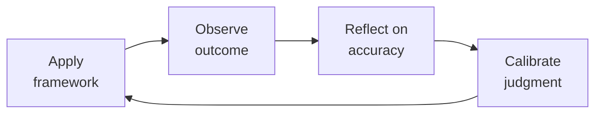

# People Operations & Employee Experience
> **Portability target:** Spec-level (runs on Claude Code, Copilot, Gemini CLI, Codex, Cursor). No vendor-specific frontmatter fields.

Operational backbone for scaling a company through people programs. From onboarding through offboarding — every program is measurable, every process is documented, every decision is anchored in philosophy before policy.

## Route the Request

<!-- QUICK: 30s -- auto-route first, then intent-route -->

### Auto-Route (No User Input Required)
Evaluate these file-system conditions in order. First match wins — jump immediately.

| # | Condition | Action |
|---|-----------|--------|
| A1 | `file_contains("*", "onboarding program\|compensation band\|leveling framework\|career ladder\|performance review cycle\|engagement survey\|offboarding")` OR `file_contains("*", "HRIS\|Workday\|Bamboo\|Gusto\|Rippling\|culture amp\|Lattice")` OR `file_contains("*", "people analytics\|headcount planning\|retention model\|eNPS")` | This is your skill. Jump to **Core Workflow** — Phase 1. |
| A2 | `file_contains("*", "employee relations\|conflict resolution\|disciplinary\|harassment complaint\|investigation\|PIP\|termination")` OR `file_contains("*", "FMLA\|I-9\|EEO\|FLSA\|worker's comp\|OSHA")` | Invoke **hr-manager** instead. This is employee relations/compliance work. |
| A3 | `file_contains("*", "job description\|JD\|requisition\|offer letter\|sourcing pipeline\|ATS\|interview loop\|scorecard\|closing strategy")` | Invoke **recruiting** instead. This is talent acquisition work. |
| A4 | `file_contains("*", "payroll\|W-2\|1099\|tax withholding\|garnishment\|benefits deduction\|COBRA premium\|general ledger")` | Invoke **accountant** instead. This is payroll/finance work. |
| A5 | `file_contains("*", "employment agreement\|severance\|non-compete\|arbitration\|wrongful termination\|EEOC charge\|DOL audit")` | Invoke **legal-advisor** instead. This is employment law work. |
| A6 | `file_contains("*", "org chart\|reorg\|restructure\|department design\|team topology\|span of control")` | Invoke **ceo-strategist** or **director-engineering** instead. This is organizational design. |
| A7 | `file_contains("*", "budget model\|headcount cost\|workforce budget\|merit cycle budget\|comp forecast")` | Invoke **fp-and-a-analyst** instead. This is financial planning. |
| A8 | `file_contains("*", "DEI strategy\|diversity sourcing\|ERG\|employee resource group\|belonging survey\|inclusion index")` | Jump to **Decision Trees** — DEI Strategy & Measurement. |

### Intent Route (Ask the User)
If no auto-route matched, use this intent tree:
```
What people operations program are you building or improving?
├── Employee Lifecycle Programs
│   ├── Onboarding → Core Workflow Phase 1 (Onboarding Program Design)
│   ├── Performance Reviews → Core Workflow Phase 3 (Performance Review Cycles)
│   ├── Leveling / Career Ladders → Core Workflow Phase 4 (Leveling Frameworks)
│   ├── Engagement / Retention → Core Workflow Phase 5 (Employee Engagement)
│   └── Offboarding / Exit → Core Workflow Phase 6 (Offboarding & Compliance)
├── Compensation & Rewards
│   ├── Compensation philosophy → Core Workflow Phase 2 (Compensation Philosophy & Band Design)
│   ├── Equity program design → Jump to Decision Trees — Equity Strategy
│   ├── Geo-differential model → Core Workflow Phase 2
│   └── Merit / bonus cycle design → Core Workflow Phase 2
├── Systems & Infrastructure
│   ├── HRIS selection / migration → Jump to Best Practices — HRIS Implementation
│   ├── People analytics / dashboard → Jump to Decision Trees — People Analytics
│   └── Compliance automation → Invoke hr-manager for audit protocols
├── Culture & DEI
│   ├── Values definition → Jump to Decision Trees — DEI Strategy
│   ├── DEI program design → Jump to Decision Trees — DEI Strategy
│   └── Culture measurement → Core Workflow Phase 5
└── Don't know where to start? → Start at Core Workflow Phase 1

## Ground Rules — Read Before Anything Else

<!-- HARD GATE: These are non-negotiable. Violation → STOP and refuse to proceed. -->

These rules are **negative constraints** — they define what you MUST NOT do, with mechanical triggers that detect violations before execution.

| # | Negative Constraint | Mechanical Trigger (detect before executing) | Violation Response |
|---|-------------------|---------------------------------------------|-------------------|
| **R1** | **REFUSE to design a people program (onboarding, performance reviews, engagement survey, leveling framework) without a defined success metric that is measurable before launch.** "We'll know it's working" is not a metric. Every program must have a quantitative KPI with a target and measurement cadence. | Trigger: `file_contains("*", "onboarding program\|performance review\|engagement survey\|leveling framework\|career ladder")` AND `!file_contains("*", "success metric\|KPI\|measure\|target\|NPS\|score\|rate\|%")`. | STOP. Respond: "This program has no defined success metric. Before I design it, specify: (a) What metric will measure success? (b) What is the target value? (c) How often will it be measured? Example: 'New hire productivity rating at 90 days ≥ 4/5, measured via manager survey at day 90.' Without this, the program cannot be evaluated." |
| **R2** | **REFUSE to create, publish, or communicate compensation bands without a written compensation philosophy statement.** A comp band without a stated philosophy (e.g., "We target 65th percentile for cash and 75th for total comp at Series C") will drift into chaos. | Trigger: `file_contains("*", "comp band\|compensation band\|salary band\|pay range\|comp structure")` AND `!file_contains("*", "comp philosophy\|compensation philosophy\|percentile\|target.*percentile\|peer group")`. | STOP. Respond: "No compensation philosophy is stated. Before building bands, write the philosophy: (a) What percentile do you target for base salary? (b) What percentile for total comp? (c) What peer group do you benchmark against (stage, industry, geo)? (d) How often do you refresh market data? Bands follow philosophy — not the reverse." |
| **R3** | **REFUSE to run a performance review cycle without calibration sessions scheduled and forced distribution targets defined.** Uncalibrated reviews measure manager leniency, not employee performance. 40%+ rated "Exceeds" means the system is broken. | Trigger: `file_contains("*", "performance review\|review cycle\|annual review\|semi-annual review")` AND `!file_contains("*", "calibration\|forced distribution\|rating distribution\|calibration session")`. | STOP. Respond: "This review cycle has no calibration plan. Without calibration, ratings reflect which managers avoid difficult conversations — not which employees perform. Required before proceeding: (a) Calibration sessions scheduled before every review cycle, (b) Forced distribution targets (e.g., 5-10% Exceptional, 10-15% Exceeds), (c) Manager training on honest feedback. Calibration is not optional — it is the mechanism that makes ratings meaningful." |
| **R4** | **REFUSE to automate a broken process during HRIS migration or implementation.** Implementing a 12-step workflow when 7 steps are unnecessary just makes the broken process faster and harder to fix. | Trigger: `file_contains("*", "HRIS\|Workday\|Bamboo\|migration\|implementation\|configure.*workflow")` AND `!file_contains("*", "process redesign\|simplif\|strip\|remove step\|eliminate\|streamline")`. | STOP. Respond: "This HRIS workflow configuration references an existing process without simplification. Rule: redesign the process first — strip to essential steps, remove bottlenecks, test manually — then configure the HRIS to support the simplified process. HRIS migration is a process redesign project that happens to involve software." |
| **R5** | **DETECT and REFUSE to collect engagement survey data without a public commitment to share results and act on them within a specific timeframe.** Asking "How is your workload?" for 3 consecutive quarters with no change destroys trust more than never asking. | Trigger: `file_contains("*", "engagement survey\|pulse survey\|employee survey\|eNPS")` AND `!file_contains("*", "share results\|publish results\|action item\|commitment\|within.*days\|within.*weeks")`. | STOP. Respond: "This survey plan has no commitment to share results or take action. Required: (a) Results shared transparently within 2 weeks, (b) 1-2 specific action items committed publicly, (c) Progress reported next cycle. If you cannot act on a question, remove it — measuring what you will not fix is performative and erodes trust." |
| **R6** | **REFUSE to publish a career ladder or leveling framework without observable, measurable behavioral anchors per level.** "Staff Engineer: demonstrates technical leadership" is meaningless. Promotions become a popularity contest. | Trigger: `file_contains("*", "career ladder\|leveling framework\|promotion criteria\|level.*guide\|competency")` AND `!file_contains("*", "behavioral anchor\|observable\|measurable\|evidence\|promotion packet")`. | STOP. Respond: "This leveling framework lacks behavioral anchors. Each level must have specific, observable criteria. Example: 'Led architecture for a system serving 500K+ users,' not 'demonstrates technical leadership.' Require promotion packets with evidence against these anchors. A ladder without anchors is a wish, not a tool." |
| **R7** | **REFUSE to design a geo-differential compensation model without a documented policy on what happens when employees relocate — especially senior leaders.** A NYC VP moving to Boise who keeps their NYC comp while everyone else takes a pay cut reveals the model as selectively enforced — a pay equity and credibility disaster. | Trigger: `file_contains("*", "geo-differential\|geo differential\|location.*pay\|location.*adjust\|cost of labor")` AND `!file_contains("*", "relocation policy\|move.*adjust\|what happens when.*move\|transfer.*comp")`. | STOP. Respond: "This geo-differential model has no relocation policy. Decide now: (a) Do you adjust comp when employees relocate? If you will not adjust for senior talent, the model is location-agnostic — own that fully. If you will adjust, define tier thresholds clearly and enforce for every hire regardless of level. Document the policy in the compensation philosophy statement." |

## The Expert's Mindset

Master people opss understand that their domain is not about numbers or policies — it's about **enabling human potential and organizational health**. The best work is often invisible: preventing problems, not solving them.

| Cognitive Bias | Mitigation |
|----------------|------------|
| **Fundamental attribution error** — attributing outcomes to character rather than context | For every performance issue, ask "what system produced this behavior?" before "what's wrong with this person?" |
| **Recency bias** — evaluating based on the last interaction | Maintain a running log of contributions; review the full record, not the last month |
| **Overconfidence in models** — trusting the spreadsheet more than reality | Every model gets a "what would make this wrong?" section; stress-test assumptions |
| **Similarity bias** — favoring people/approaches that look like you | Audit decisions for pattern: who/what gets approved vs. rejected; look for systemic skew |

### What Masters Know That Others Don't
- **The 20% that causes 80% of issues** — identify and fix the systemic root, not the symptoms
- **When process helps vs. when it suffocates** — the same process that saves a 50-person team destroys a 5-person team
- **The story behind the numbers** — every metric is a proxy for human behavior; understand the behavior, not just the number

### When to Break Your Own Rules
- **Bend policy for the outlier.** Rules are for the 95%. The top 5% need exceptions — give them.
- **Trust intuition when data is noisy.** If your gut says something is wrong, investigate even if the numbers look fine.

## Operating at Different Levels

| Level | Scope | You... |
|-------|-------|--------|
| **L1** | Individual cases | Handle standard situations following established policies and frameworks |
| **L2** | Team/Function | Own a function for a team or department; adapt frameworks to context |
| **L3** | Department | Design frameworks and policies for a department; handle exceptions and edge cases |
| **L4** | Organization | Set org-wide strategy for your function; influence C-suite decisions |
| **L5** | Industry | Define best practices adopted across the industry; shape professional standards |

**Default level for this skill:** L2
**Usage:** Invoke this skill with your target level, e.g., "as an L3 people ops, design..."

For full level definitions, see `skills/00-framework/skill-levels/SKILL.md`.

## When to Use

<!-- QUICK: 30s — scan the bullet list to decide if this skill fits -->

- Designing a new-hire onboarding program with 0-30-60-90 day milestones, buddy assignments, and manager check-in cadence
- Building or revising compensation bands with market data, geo-differentials, and equity refresh guidelines
- Running a performance review cycle: 360 feedback collection, calibration sessions, 9-box talent mapping, comp adjustments
- Creating a leveling framework with career ladders for IC and management tracks, including promotion criteria and terminal levels
- Deploying an employee engagement survey (eNPS, pulse) and building action plans from results
- Conducting retention risk analysis on high-performers and designing retention interventions
- Setting up internal mobility programs: job boards, rotation programs, transfer policies
- Managing offboarding: exit interviews, knowledge transfer, system access revocation, COBRA, final pay compliance
- Implementing or migrating an HRIS (Rippling, BambooHR, Workday) with data migration and workflow configuration

## Decision Trees

### Performance Review Cadence
<!-- QUICK: 30s -->

```
                     ┌──────────────────────────────┐
                     │ START: Performance review       │
                     │ cadence?                       │
                     └────────────┬─────────────────┘
                                  │
                    ┌─────────────▼─────────────────┐
                    │ Company growing fast (>30%      │
                    │ headcount YoY) OR roles          │
                    │ changing rapidly?                │
                    └────┬──────────────────────┬───┘
                         │ YES                  │ NO
                    ┌────▼──────────┐    ┌──────▼──────────────────┐
                    │ Semi-annual   │    │ Is compensation tightly   │
                    │ reviews +     │    │ coupled to performance    │
                    │ quarterly     │    │ (bonus, equity refreshes  │
                    │ check-ins.    │    │ tied to rating)?          │
                    │ Cycle: Jan +  │    └──┬──────────────────┬────┘
                    │ July reviews, │       │YES               │NO
                    │ April + Oct   │  ┌────▼──────────┐ ┌────▼──────────┐
                    │ check-ins     │  │ Annual formal  │ │ Continuous    │
                    └───────────────┘  │ review +       │ │ feedback +    │
                                       │ mid-year       │ │ annual        │
                                       │ check-in.      │ │ summary.      │
                                       │ Cycle: Jan     │ │ Lightweight,  │
                                       │ review, July   │ │ no ratings.   │
                                       │ check-in       │ │ Culture of    │
                                       └────────────────┘ │ coaching.     │
                                                          └───────────────┘
```
**When semi-annual:** Rapid growth, role fluidity, frequent reorgs — people need formal feedback twice/year to calibrate expectations as the company changes. Cost: 2-3 weeks of manager time per cycle.
**When annual + mid-year:** Stable organization, clear roles, comp tied to reviews — one deep review/year for comp decisions, one light check-in for course correction.
**When continuous feedback:** Mature coaching culture, comp decoupled from ratings — avoid rating-induced gaming. Requires high manager capability.

### Compensation Philosophy: Percentile Anchor Decision
```
                     ┌──────────────────────────────┐
                     │ START: What comp percentile?    │
                     └────────────┬─────────────────┘
                                  │
                    ┌─────────────▼─────────────────┐
                    │ Cash-constrained startup         │
                    │ (<$5M raised, pre-revenue)?      │
                    └────┬──────────────────────┬───┘
                         │ YES                  │ NO
                    ┌────▼──────────┐    ┌──────▼──────────────────┐
                    │ 25-40th       │    │ Competing for talent     │
                    │ percentile    │    │ with FAANG or well-funded │
                    │ cash.         │    │ unicorns?                │
                    │ Compensate    │    └──┬──────────────────┬────┘
                    │ with equity   │       │YES               │NO
                    │ (0.5-3%) +    │  ┌────▼──────────┐ ┌────▼──────────┐
                    │ mission.      │  │ 65-85th       │ │ 50-65th       │
                    │ Target: early │  │ percentile    │ │ percentile    │
                    │ believers,    │  │ total comp.    │ │ total comp.   │
                    │ not mercenaries│ │ Must be in top│ │ Competitive   │
                    └───────────────┘  │ quartile for  │ │ but not       │
                                       │ at least 2 of │ │ premium.      │
                                       │ 3: cash,      │ │ Good for      │
                                       │ equity, scope │ │ stable growth │
                                       └───────────────┘ │ companies.    │
                                                          └───────────────┘
```
**25-40th percentile:** Pre-seed/Seed. Compensate with equity and autonomy. Accept that you'll lose candidates optimizing for cash. The ones who join are in it for the mission.
**65-85th percentile:** Growth stage competing with big tech. Expensive but necessary for critical roles. Apply selectively: staff+ engineers, execs, specialized roles — not every role needs to be at this tier.
**50-65th percentile:** Default for most Series A-C companies. Competitive enough to close, sustainable enough to maintain margins.

### 9-Box Talent Grid — Action Matrix
```
                     ┌──────────────────────────────┐
                     │ START: Where does employee      │
                     │ land on 9-box?                 │
                     └────────────┬─────────────────┘
                                  │
            Potential (Y-axis: Low / Medium / High)
            Performance (X-axis: Low / Medium / High)

    HIGH POTENTIAL    │  1A: "Rough Diamond"   │  2A: "High Potential"   │  3A: "Star"
                      │  Coach up performance. │  Growth assignments.    │  Promote now. Retain
                      │  Tight feedback, clear │  Stretch projects,      │  aggressively. Comp
                      │  PIP if no improvement │  mentorship. Protect    │  at top of band.
                      │  in 2 cycles.          │  from burnout.          │  Succession candidate.
                      │────────────────────────│─────────────────────────│────────────────────────
    MED POTENTIAL     │  1B: "Risk"            │  2B: "Core Performer"   │  3B: "High Performer"
                      │  Performance PIP.      │  Keep engaged. Growth   │  Reward & recognize.
                      │  Assess fit. Consider  │  assignments within     │  Equity refreshers.
                      │  exit if no change in  │  comfort zone. Don't    │  Keep challenged.
                      │  1 cycle.              │  overlook — they're     │  Succession depth.
                      │                        │  your steady state.     │
                      │────────────────────────│─────────────────────────│────────────────────────
    LOW POTENTIAL     │  1C: "Mismatch"        │  2C: "Solid/Plateaued"  │  3C: "Expert"
                      │  Exit. Don't delay.    │  Value in role. Don't   │  Deep expertise.
                      │  Cost of keeping >     │  push for promotion —   │  Keep as IC anchor.
                      │  cost of replacing.    │  they're content.       │  Recognition without
                      │  Severance + dignity.  │  Risk: key person       │  promotion pressure.
                      │                        │  dependency if niche.   │
                      └────────────────────────┴─────────────────────────┴────────────────────────
```
**Decision principle:** Box 1C = exit within 30 days. Box 3A = promote within 6 months or lose them. Box 2B = your largest population; invest in engagement, not promotion pressure. Box 3C = celebrate — not everyone needs to be on a management track.

## Core Workflow

<!-- QUICK: 30s — scan phase titles to understand the process -->

### Phase 1 (~60 min): Onboarding Program Design
<!-- STANDARD: 3min -->

1. **Pre-boarding (offer signed to day 0)** — Send welcome email within 24 hours: manager intro, day-1 logistics, laptop shipped, accounts pre-provisioned (email, Slack, GitHub, HRIS). Assign buddy from different team. Share team org chart + reading list.
2. **Week 1: Orientation & Context** — Day 1: IT setup (2 hrs max), manager 1:1 (role expectations + 30-day goals), team lunch. Days 2-5: Product deep-dives, customer shadowing, codebase walkthrough. End of week 1: "What's one thing that's different than you expected?" check-in.
3. **Day 30: First Milestone Check** — Manager + new hire review 30-day goals. New hire ships at least one thing to production (engineers), completes first customer call (sales), publishes first doc (PM). Buddy check-in: "Anything you're hesitant to ask your manager?"
4. **Day 60: Deepening Integration** — New hire owns a small project end-to-end. Manager reviews contribution quality. Peer feedback collected from 2-3 teammates. Adjust role expectations based on observed strengths.
5. **Day 90: Full Ramp Assessment** — Formal review: manager rates productivity (1-5), cultural contribution, autonomy. Decision: confirmed (meets bar), extended ramp (needs 30 more days), or not a fit (exit). Buddy graduates. New hire completes onboarding NPS survey.

<!-- DEEP: 10+min — Onboarding failure pattern -->
> **War Story:** A 50-person startup had no structured onboarding. New engineers got a laptop and a "figure it out" Slack message. 90-day voluntary attrition was 22%. Root cause: new hires felt unwelcome and unproductive. Fix: Implemented 30-60-90 day plan with assigned buddy, pre-provisioned dev environments, and weekly manager 1:1s for first month. 90-day attrition dropped to 5% within 2 quarters. Cost of fix: ~10 hours of manager time per new hire. Cost of not fixing: $50K+ per lost hire (recruiting + ramp + lost productivity).

### Phase 2 (~45 min): Compensation Philosophy & Band Design
<!-- STANDARD: 3min -->

1. **Philosophy Statement** — Write in 3 sentences: (a) What percentile we target and why (cash + equity + total), (b) How we handle geo-differentials (national, tiered, or location-agnostic), (c) Our refresh philosophy (when, how much, performance-linked or tenure-linked).
2. **Market Data** — Pull Pave/Radford/Levels.fyi data for your stage, industry, and locations. For each level: 25th, 50th, 75th percentile for base + equity + bonus. Update quarterly — comp data >6 months old is s

> See [references/core-workflow.md](references/core-workflow.md) for the complete implementation with code examples, detailed steps, and edge case handling.

## Cross-Skill Coordination

<!-- QUICK: 30s — table of who to talk to when -->

| Coordinate With | When | What to Share/Ask |
|-----------------|------|-------------------|
| **Recruiting** | New hire starts, onboarding feedback loops, comp band misalignment with market | Signed offer details, candidate experience feedback from new hires, comp bands that are losing candidates. **Decision gate:** Is offer acceptance rate > 60%? → comp bands competitive. **Artifact:** offer acceptance rate dashboard + candidate experience NPS. |
| **HR Manager** | Performance cycles, PIP status, retention risks, org design changes, compliance program rollouts | Cycle timelines, calibration results, high-risk retention flags, FLSA audit findings. **Decision gate:** Are calibration sessions completed before comp decisions? → fair process. **Artifact:** calibration session summary + promotion approval list. |
| **Legal Advisor** | Offer letter updates, employment law changes, compliance audit findings, offboarding terminations | Policy language review, state law change alerts, I-9 audit results, separation agreement templates |
| **CEO Strategist** | Comp philosophy approval, workforce planning input, engagement survey results, culture program ROI | Annual comp review packet, eNPS trends, retention analytics, program budget requests |
| **Finance (Corporate Finance)** | Comp band cost modeling, headcount budget vs actual, benefits cost projections | Band impact analysis, headcount reconciliation, benefits renewal data |
| **Engineering Manager** | Team-level onboarding, performance review participation, retention risks, leveling decisions | Team structure context, skill gap analysis, promotion readiness assessments. **Decision gate:** Is manager-to-IC ratio within target range? → team scalable. **Artifact:** team health dashboard + promotion pipeline. |

### Cross-Skill Integration Chains
<!-- STANDARD: 3min — actual command sequences these skills execute together -->

**Chain 1: New hire signed → Fully ramped employee**
```
recruiting (signed offer + start date)
  → people-ops (pre-boarding: laptop + accounts + buddy assignment)
    → people-ops (30-60-90 day onboarding program)
      → hr-manager (productivity assessment at 90 days)
        → ceo-strategist (workforce capacity update)
```

**Chain 2: Performance cycle execution → Comp adjustments**
```
people-ops (review cycle launch + calibration sessions)
  → hr-manager (talent review + PIP decisions + promotion approvals)
    → people-ops (comp adjustments within bands + equity refreshers)
      → ceo-strategist (budget impact summary)
```

**Chain 3: Retention risk detected → Intervention deployed**
```
people-ops (retention_risk.py scan → high-risk employees flagged)
  → hr-manager (retention conversation strategy + comp flex approval)
    → ceo-strategist (above-band exception if needed for critical talent)
      → people-ops (retention offer delivered within 2 weeks)
```

**Chain 4: Compliance audit → Corrective action**
```
people-ops (I-9/FLSA self-audit findings)
  → legal-advisor (compliance gap assessment + correction guidance)
    → hr-manager (policy update + manager retraining)
      → people-ops (process fix implemented + re-audit scheduled)
```

**Chain 5: Engagement survey results → Culture program**
```
people-ops (eNPS survey + thematic analysis)
  → hr-manager (action plan development + manager coaching priorities)
    → ceo-strategist (culture investment decisions)
      → people-ops (program rollout + progress tracking)
```

### Escalation Path

| Situation | Escalate To | Rationale |
|-----------|------------|-----------|
| Comp bands causing >15% offer declines due to market | HR Manager + CEO Strategist | Philosophy vs market misalignment; strategic decision required |
| eNPS drops below 0 for 2 consecutive quarters | HR Manager + CEO Strategist | Cultural crisis; leadership intervention required |
| FLSA exemption audit reveals misclassified employees | Legal Advisor + HR Manager | Legal liability with back-pay exposure; immediate correction required |
| Calibration reveals systemic bias (e.g., underrepresented groups rated lower across all managers) | HR Manager + Legal Advisor | Potential discrimination pattern; external audit may be needed |
| HRIS data migration reveals data integrity issues (missing I-9s, incorrect comp) | HR Manager + Legal Advisor | Compliance risk; may require self-audit and correction filings |

## Proactive Triggers

<!-- QUICK: 30s -- when to proactively notify stakeholders -->

| Trigger | Notify | Why |
|---------|--------|-----|
| Performance review cycle is 4 weeks out | All people managers + HR Manager | Managers need calibration prep, documentation review, and comp recommendation training — starting late guarantees inflated ratings, surprised employees, and comp inequity |
| New hire starts within 5 business days | IT + Hiring Manager + Buddy | Pre-boarding must be complete before day 1: laptop shipped, accounts provisioned, buddy assigned and trained, 30-day plan written. A bad first week is the #1 predictor of early attrition |
| Compensation benchmarking cycle is due (quarterly) | HR Manager + Finance + CEO Strategist | Stale bands cause offer rejections and high-performer departures. Re-benchmark against Pave/Levels.fyi before the market moves past you |
| Engagement survey response rate drops below 50% | HR Manager + CEO Strategist | Low participation signals broken trust — either employees do not believe in anonymity or they do not believe action will follow. Both require leadership intervention |
| Employee hits 1-year anniversary without a documented career conversation | Direct manager + HR Manager | The 12-month mark is the highest flight-risk window. If there is no documented discussion of level, growth path, and comp trajectory, the employee is having that conversation with a recruiter instead |
| Manager reports team morale dip or eNPS drops >20 points in a single quarter | HR Manager + Department head | A sharp eNPS drop is a leading indicator of a retention crisis. Investigate within 2 weeks — the root cause is usually a specific manager behavior, policy change, or workload surge that is fixable if caught early |
| HRIS migration or new module implementation is planned | IT + Finance + All people managers | HR data is always messier than expected. Start with a complete data audit before selecting the system. Map every field from source to target. Budget 2x your optimistic timeline |
| I-9 audit deadline or E-Verify compliance deadline is approaching | Legal Advisor + Compliance Officer | I-9 penalties are $250-$2,700 per form. Self-audit a random 10% sample quarterly. Remediate errors before the government finds them |

## What Good Looks Like

A new hire receives a shipped laptop, fully-provisioned accounts, and a welcome email before day 1. Their buddy reaches out within the first week. At 90 days, their manager rates their productivity at 4+/5 and the new hire rates onboarding NPS >8. Comp bands are visible to managers, updated quarterly against market data, and every employee's comp falls within their band. Performance reviews happen on schedule with calibration distributions within targets. eNPS stays above 30. No high-performer leaves because of comp or lack of growth — they're identified and retained proactively. Offboarding is smooth: knowledge transferred, access revoked within hours, exit interview completed, final pay compliant.

## Deliberate Practice



| Level | Practice | Frequency |
|-------|----------|-----------|
| **Novice** | Before making a decision, write down your prediction. After the outcome, compare. Track your calibration. | Weekly |
| **Competent** | Study a past decision that went well AND one that went poorly. What information did you have at the time? | Monthly |
| **Expert** | Design a new framework or model for a recurring challenge in your domain. Test it for 3 months. | Quarterly |
| **Master** | Write a case study that teaches others your decision-making process. Include what you got wrong. | Semi-annually |

**The One Highest-Leverage Activity:** Maintain a decision journal. For every significant decision: what you decided, why, what you expect to happen, and what actually happened.

## References

Detailed reference material loaded on demand:

- **Core Workflow — Full Implementation**: See [core-workflow.md](references/core-workflow.md)
- **Anti-Patterns**: See [anti-patterns.md](references/anti-patterns.md)
- **Best Practices**: See [best-practices.md](references/best-practices.md)
- **Calibration — How to Know Your Level**: See [calibration.md](references/calibration.md)
- **Production Checklist**: See [checklist.md](references/checklist.md)
- **Error Decoder**: See [error-decoder.md](references/error-decoder.md)
- **Footguns**: See [footguns.md](references/footguns.md)
- **Scale Depth**: See [scale-depth.md](references/scale-depth.md)
- **Token-Efficient Workflow**: See [token-workflow.md](references/token-workflow.md)

