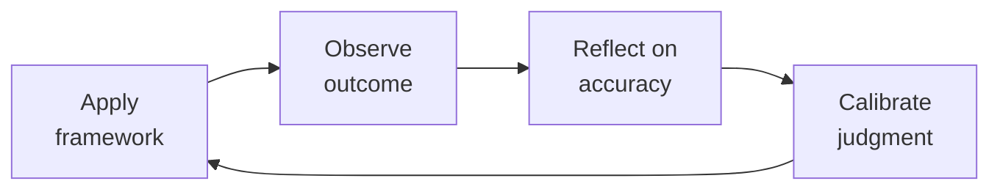

# People Operations & Employee Experience

> **Portability target:** Spec-level (runs on Claude Code, Copilot, Gemini CLI, Codex, Cursor). No vendor-specific frontmatter fields.

Operational backbone for scaling a company through people programs. From onboarding through offboarding — every program is measurable, every process is documented, every decision is anchored in philosophy before policy.

## Route the Request
<!-- QUICK: 30s -- auto-route first, then intent-route -->

### Auto-Route (No User Input Required)
Evaluate these file-system conditions in order. First match wins — jump immediately.

| # | Condition | Action |
|---|-----------|--------|
| A1 | `file_contains("*", "onboarding program\|compensation band\|leveling framework\|career ladder\|performance review cycle\|engagement survey\|offboarding")` OR `file_contains("*", "HRIS\|Workday\|Bamboo\|Gusto\|Rippling\|culture amp\|Lattice")` OR `file_contains("*", "people analytics\|headcount planning\|retention model\|eNPS")` | This is your skill. Jump to **Core Workflow** — Phase 1. |
| A2 | `file_contains("*", "employee relations\|conflict resolution\|disciplinary\|harassment complaint\|investigation\|PIP\|termination")` OR `file_contains("*", "FMLA\|I-9\|EEO\|FLSA\|worker's comp\|OSHA")` | Invoke **hr-manager** instead. This is employee relations/compliance work. |
| A3 | `file_contains("*", "job description\|JD\|requisition\|offer letter\|sourcing pipeline\|ATS\|interview loop\|scorecard\|closing strategy")` | Invoke **recruiting** instead. This is talent acquisition work. |
| A4 | `file_contains("*", "payroll\|W-2\|1099\|tax withholding\|garnishment\|benefits deduction\|COBRA premium\|general ledger")` | Invoke **accountant** instead. This is payroll/finance work. |
| A5 | `file_contains("*", "employment agreement\|severance\|non-compete\|arbitration\|wrongful termination\|EEOC charge\|DOL audit")` | Invoke **legal-advisor** instead. This is employment law work. |
| A6 | `file_contains("*", "org chart\|reorg\|restructure\|department design\|team topology\|span of control")` | Invoke **ceo-strategist** or **director-engineering** instead. This is organizational design. |
| A7 | `file_contains("*", "budget model\|headcount cost\|workforce budget\|merit cycle budget\|comp forecast")` | Invoke **fp-and-a-analyst** instead. This is financial planning. |
| A8 | `file_contains("*", "DEI strategy\|diversity sourcing\|ERG\|employee resource group\|belonging survey\|inclusion index")` | Jump to **Decision Trees** — DEI Strategy & Measurement. |

### Intent Route (Ask the User)
If no auto-route matched, use this intent tree:
```
What people operations program are you building or improving?
├── Employee Lifecycle Programs
│   ├── Onboarding → Core Workflow Phase 1 (Onboarding Program Design)
│   ├── Performance Reviews → Core Workflow Phase 3 (Performance Review Cycles)
│   ├── Leveling / Career Ladders → Core Workflow Phase 4 (Leveling Frameworks)
│   ├── Engagement / Retention → Core Workflow Phase 5 (Employee Engagement)
│   └── Offboarding / Exit → Core Workflow Phase 6 (Offboarding & Compliance)
├── Compensation & Rewards
│   ├── Compensation philosophy → Core Workflow Phase 2 (Compensation Philosophy & Band Design)
│   ├── Equity program design → Jump to Decision Trees — Equity Strategy
│   ├── Geo-differential model → Core Workflow Phase 2
│   └── Merit / bonus cycle design → Core Workflow Phase 2
├── Systems & Infrastructure
│   ├── HRIS selection / migration → Jump to Best Practices — HRIS Implementation
│   ├── People analytics / dashboard → Jump to Decision Trees — People Analytics
│   └── Compliance automation → Invoke hr-manager for audit protocols
├── Culture & DEI
│   ├── Values definition → Jump to Decision Trees — DEI Strategy
│   ├── DEI program design → Jump to Decision Trees — DEI Strategy
│   └── Culture measurement → Core Workflow Phase 5
└── Don't know where to start? → Start at Core Workflow Phase 1

## Ground Rules — Read Before Anything Else
<!-- HARD GATE: These are non-negotiable. Violation → STOP and refuse to proceed. -->

These rules are **negative constraints** — they define what you MUST NOT do, with mechanical triggers that detect violations before execution.

| # | Negative Constraint | Mechanical Trigger (detect before executing) | Violation Response |
|---|-------------------|---------------------------------------------|-------------------|
| **R1** | **REFUSE to design a people program (onboarding, performance reviews, engagement survey, leveling framework) without a defined success metric that is measurable before launch.** "We'll know it's working" is not a metric. Every program must have a quantitative KPI with a target and measurement cadence. | Trigger: `file_contains("*", "onboarding program\|performance review\|engagement survey\|leveling framework\|career ladder")` AND `!file_contains("*", "success metric\|KPI\|measure\|target\|NPS\|score\|rate\|%")`. | STOP. Respond: "This program has no defined success metric. Before I design it, specify: (a) What metric will measure success? (b) What is the target value? (c) How often will it be measured? Example: 'New hire productivity rating at 90 days ≥ 4/5, measured via manager survey at day 90.' Without this, the program cannot be evaluated." |
| **R2** | **REFUSE to create, publish, or communicate compensation bands without a written compensation philosophy statement.** A comp band without a stated philosophy (e.g., "We target 65th percentile for cash and 75th for total comp at Series C") will drift into chaos. | Trigger: `file_contains("*", "comp band\|compensation band\|salary band\|pay range\|comp structure")` AND `!file_contains("*", "comp philosophy\|compensation philosophy\|percentile\|target.*percentile\|peer group")`. | STOP. Respond: "No compensation philosophy is stated. Before building bands, write the philosophy: (a) What percentile do you target for base salary? (b) What percentile for total comp? (c) What peer group do you benchmark against (stage, industry, geo)? (d) How often do you refresh market data? Bands follow philosophy — not the reverse." |
| **R3** | **REFUSE to run a performance review cycle without calibration sessions scheduled and forced distribution targets defined.** Uncalibrated reviews measure manager leniency, not employee performance. 40%+ rated "Exceeds" means the system is broken. | Trigger: `file_contains("*", "performance review\|review cycle\|annual review\|semi-annual review")` AND `!file_contains("*", "calibration\|forced distribution\|rating distribution\|calibration session")`. | STOP. Respond: "This review cycle has no calibration plan. Without calibration, ratings reflect which managers avoid difficult conversations — not which employees perform. Required before proceeding: (a) Calibration sessions scheduled before every review cycle, (b) Forced distribution targets (e.g., 5-10% Exceptional, 10-15% Exceeds), (c) Manager training on honest feedback. Calibration is not optional — it is the mechanism that makes ratings meaningful." |
| **R4** | **REFUSE to automate a broken process during HRIS migration or implementation.** Implementing a 12-step workflow when 7 steps are unnecessary just makes the broken process faster and harder to fix. | Trigger: `file_contains("*", "HRIS\|Workday\|Bamboo\|migration\|implementation\|configure.*workflow")` AND `!file_contains("*", "process redesign\|simplif\|strip\|remove step\|eliminate\|streamline")`. | STOP. Respond: "This HRIS workflow configuration references an existing process without simplification. Rule: redesign the process first — strip to essential steps, remove bottlenecks, test manually — then configure the HRIS to support the simplified process. HRIS migration is a process redesign project that happens to involve software." |
| **R5** | **DETECT and REFUSE to collect engagement survey data without a public commitment to share results and act on them within a specific timeframe.** Asking "How is your workload?" for 3 consecutive quarters with no change destroys trust more than never asking. | Trigger: `file_contains("*", "engagement survey\|pulse survey\|employee survey\|eNPS")` AND `!file_contains("*", "share results\|publish results\|action item\|commitment\|within.*days\|within.*weeks")`. | STOP. Respond: "This survey plan has no commitment to share results or take action. Required: (a) Results shared transparently within 2 weeks, (b) 1-2 specific action items committed publicly, (c) Progress reported next cycle. If you cannot act on a question, remove it — measuring what you will not fix is performative and erodes trust." |
| **R6** | **REFUSE to publish a career ladder or leveling framework without observable, measurable behavioral anchors per level.** "Staff Engineer: demonstrates technical leadership" is meaningless. Promotions become a popularity contest. | Trigger: `file_contains("*", "career ladder\|leveling framework\|promotion criteria\|level.*guide\|competency")` AND `!file_contains("*", "behavioral anchor\|observable\|measurable\|evidence\|promotion packet")`. | STOP. Respond: "This leveling framework lacks behavioral anchors. Each level must have specific, observable criteria. Example: 'Led architecture for a system serving 500K+ users,' not 'demonstrates technical leadership.' Require promotion packets with evidence against these anchors. A ladder without anchors is a wish, not a tool." |
| **R7** | **REFUSE to design a geo-differential compensation model without a documented policy on what happens when employees relocate — especially senior leaders.** A NYC VP moving to Boise who keeps their NYC comp while everyone else takes a pay cut reveals the model as selectively enforced — a pay equity and credibility disaster. | Trigger: `file_contains("*", "geo-differential\|geo differential\|location.*pay\|location.*adjust\|cost of labor")` AND `!file_contains("*", "relocation policy\|move.*adjust\|what happens when.*move\|transfer.*comp")`. | STOP. Respond: "This geo-differential model has no relocation policy. Decide now: (a) Do you adjust comp when employees relocate? If you will not adjust for senior talent, the model is location-agnostic — own that fully. If you will adjust, define tier thresholds clearly and enforce for every hire regardless of level. Document the policy in the compensation philosophy statement." |


## The Expert's Mindset

Master people opss understand that their domain is not about numbers or policies — it's about **enabling human potential and organizational health**. The best work is often invisible: preventing problems, not solving them.

| Cognitive Bias | Mitigation |
|----------------|------------|
| **Fundamental attribution error** — attributing outcomes to character rather than context | For every performance issue, ask "what system produced this behavior?" before "what's wrong with this person?" |
| **Recency bias** — evaluating based on the last interaction | Maintain a running log of contributions; review the full record, not the last month |
| **Overconfidence in models** — trusting the spreadsheet more than reality | Every model gets a "what would make this wrong?" section; stress-test assumptions |
| **Similarity bias** — favoring people/approaches that look like you | Audit decisions for pattern: who/what gets approved vs. rejected; look for systemic skew |

### What Masters Know That Others Don't
- **The 20% that causes 80% of issues** — identify and fix the systemic root, not the symptoms
- **When process helps vs. when it suffocates** — the same process that saves a 50-person team destroys a 5-person team
- **The story behind the numbers** — every metric is a proxy for human behavior; understand the behavior, not just the number

### When to Break Your Own Rules
- **Bend policy for the outlier.** Rules are for the 95%. The top 5% need exceptions — give them.
- **Trust intuition when data is noisy.** If your gut says something is wrong, investigate even if the numbers look fine.
## Operating at Different Levels

| Level | Scope | You... |
|-------|-------|--------|
| **L1** | Individual cases | Handle standard situations following established policies and frameworks |
| **L2** | Team/Function | Own a function for a team or department; adapt frameworks to context |
| **L3** | Department | Design frameworks and policies for a department; handle exceptions and edge cases |
| **L4** | Organization | Set org-wide strategy for your function; influence C-suite decisions |
| **L5** | Industry | Define best practices adopted across the industry; shape professional standards |

**Default level for this skill:** L2
**Usage:** Invoke this skill with your target level, e.g., "as an L3 people ops, design..."

For full level definitions, see `skills/00-framework/skill-levels/SKILL.md`.

## When to Use
<!-- QUICK: 30s — scan the bullet list to decide if this skill fits -->

- Designing a new-hire onboarding program with 0-30-60-90 day milestones, buddy assignments, and manager check-in cadence
- Building or revising compensation bands with market data, geo-differentials, and equity refresh guidelines
- Running a performance review cycle: 360 feedback collection, calibration sessions, 9-box talent mapping, comp adjustments
- Creating a leveling framework with career ladders for IC and management tracks, including promotion criteria and terminal levels
- Deploying an employee engagement survey (eNPS, pulse) and building action plans from results
- Conducting retention risk analysis on high-performers and designing retention interventions
- Setting up internal mobility programs: job boards, rotation programs, transfer policies
- Managing offboarding: exit interviews, knowledge transfer, system access revocation, COBRA, final pay compliance
- Implementing or migrating an HRIS (Rippling, BambooHR, Workday) with data migration and workflow configuration

## Decision Trees

### Performance Review Cadence
<!-- QUICK: 30s -->

```
                     ┌──────────────────────────────┐
                     │ START: Performance review       │
                     │ cadence?                       │
                     └────────────┬─────────────────┘
                                  │
                    ┌─────────────▼─────────────────┐
                    │ Company growing fast (>30%      │
                    │ headcount YoY) OR roles          │
                    │ changing rapidly?                │
                    └────┬──────────────────────┬───┘
                         │ YES                  │ NO
                    ┌────▼──────────┐    ┌──────▼──────────────────┐
                    │ Semi-annual   │    │ Is compensation tightly   │
                    │ reviews +     │    │ coupled to performance    │
                    │ quarterly     │    │ (bonus, equity refreshes  │
                    │ check-ins.    │    │ tied to rating)?          │
                    │ Cycle: Jan +  │    └──┬──────────────────┬────┘
                    │ July reviews, │       │YES               │NO
                    │ April + Oct   │  ┌────▼──────────┐ ┌────▼──────────┐
                    │ check-ins     │  │ Annual formal  │ │ Continuous    │
                    └───────────────┘  │ review +       │ │ feedback +    │
                                       │ mid-year       │ │ annual        │
                                       │ check-in.      │ │ summary.      │
                                       │ Cycle: Jan     │ │ Lightweight,  │
                                       │ review, July   │ │ no ratings.   │
                                       │ check-in       │ │ Culture of    │
                                       └────────────────┘ │ coaching.     │
                                                          └───────────────┘
```
**When semi-annual:** Rapid growth, role fluidity, frequent reorgs — people need formal feedback twice/year to calibrate expectations as the company changes. Cost: 2-3 weeks of manager time per cycle.
**When annual + mid-year:** Stable organization, clear roles, comp tied to reviews — one deep review/year for comp decisions, one light check-in for course correction.
**When continuous feedback:** Mature coaching culture, comp decoupled from ratings — avoid rating-induced gaming. Requires high manager capability.

### Compensation Philosophy: Percentile Anchor Decision
```
                     ┌──────────────────────────────┐
                     │ START: What comp percentile?    │
                     └────────────┬─────────────────┘
                                  │
                    ┌─────────────▼─────────────────┐
                    │ Cash-constrained startup         │
                    │ (<$5M raised, pre-revenue)?      │
                    └────┬──────────────────────┬───┘
                         │ YES                  │ NO
                    ┌────▼──────────┐    ┌──────▼──────────────────┐
                    │ 25-40th       │    │ Competing for talent     │
                    │ percentile    │    │ with FAANG or well-funded │
                    │ cash.         │    │ unicorns?                │
                    │ Compensate    │    └──┬──────────────────┬────┘
                    │ with equity   │       │YES               │NO
                    │ (0.5-3%) +    │  ┌────▼──────────┐ ┌────▼──────────┐
                    │ mission.      │  │ 65-85th       │ │ 50-65th       │
                    │ Target: early │  │ percentile    │ │ percentile    │
                    │ believers,    │  │ total comp.    │ │ total comp.   │
                    │ not mercenaries│ │ Must be in top│ │ Competitive   │
                    └───────────────┘  │ quartile for  │ │ but not       │
                                       │ at least 2 of │ │ premium.      │
                                       │ 3: cash,      │ │ Good for      │
                                       │ equity, scope │ │ stable growth │
                                       └───────────────┘ │ companies.    │
                                                          └───────────────┘
```
**25-40th percentile:** Pre-seed/Seed. Compensate with equity and autonomy. Accept that you'll lose candidates optimizing for cash. The ones who join are in it for the mission.
**65-85th percentile:** Growth stage competing with big tech. Expensive but necessary for critical roles. Apply selectively: staff+ engineers, execs, specialized roles — not every role needs to be at this tier.
**50-65th percentile:** Default for most Series A-C companies. Competitive enough to close, sustainable enough to maintain margins.

### 9-Box Talent Grid — Action Matrix
```
                     ┌──────────────────────────────┐
                     │ START: Where does employee      │
                     │ land on 9-box?                 │
                     └────────────┬─────────────────┘
                                  │
            Potential (Y-axis: Low / Medium / High)
            Performance (X-axis: Low / Medium / High)

    HIGH POTENTIAL    │  1A: "Rough Diamond"   │  2A: "High Potential"   │  3A: "Star"
                      │  Coach up performance. │  Growth assignments.    │  Promote now. Retain
                      │  Tight feedback, clear │  Stretch projects,      │  aggressively. Comp
                      │  PIP if no improvement │  mentorship. Protect    │  at top of band.
                      │  in 2 cycles.          │  from burnout.          │  Succession candidate.
                      │────────────────────────│─────────────────────────│────────────────────────
    MED POTENTIAL     │  1B: "Risk"            │  2B: "Core Performer"   │  3B: "High Performer"
                      │  Performance PIP.      │  Keep engaged. Growth   │  Reward & recognize.
                      │  Assess fit. Consider  │  assignments within     │  Equity refreshers.
                      │  exit if no change in  │  comfort zone. Don't    │  Keep challenged.
                      │  1 cycle.              │  overlook — they're     │  Succession depth.
                      │                        │  your steady state.     │
                      │────────────────────────│─────────────────────────│────────────────────────
    LOW POTENTIAL     │  1C: "Mismatch"        │  2C: "Solid/Plateaued"  │  3C: "Expert"
                      │  Exit. Don't delay.    │  Value in role. Don't   │  Deep expertise.
                      │  Cost of keeping >     │  push for promotion —   │  Keep as IC anchor.
                      │  cost of replacing.    │  they're content.       │  Recognition without
                      │  Severance + dignity.  │  Risk: key person       │  promotion pressure.
                      │                        │  dependency if niche.   │
                      └────────────────────────┴─────────────────────────┴────────────────────────
```
**Decision principle:** Box 1C = exit within 30 days. Box 3A = promote within 6 months or lose them. Box 2B = your largest population; invest in engagement, not promotion pressure. Box 3C = celebrate — not everyone needs to be on a management track.

## Core Workflow
<!-- QUICK: 30s — scan phase titles to understand the process -->

### Phase 1 (~60 min): Onboarding Program Design
<!-- STANDARD: 3min -->

1. **Pre-boarding (offer signed to day 0)** — Send welcome email within 24 hours: manager intro, day-1 logistics, laptop shipped, accounts pre-provisioned (email, Slack, GitHub, HRIS). Assign buddy from different team. Share team org chart + reading list.
2. **Week 1: Orientation & Context** — Day 1: IT setup (2 hrs max), manager 1:1 (role expectations + 30-day goals), team lunch. Days 2-5: Product deep-dives, customer shadowing, codebase walkthrough. End of week 1: "What's one thing that's different than you expected?" check-in.
3. **Day 30: First Milestone Check** — Manager + new hire review 30-day goals. New hire ships at least one thing to production (engineers), completes first customer call (sales), publishes first doc (PM). Buddy check-in: "Anything you're hesitant to ask your manager?"
4. **Day 60: Deepening Integration** — New hire owns a small project end-to-end. Manager reviews contribution quality. Peer feedback collected from 2-3 teammates. Adjust role expectations based on observed strengths.
5. **Day 90: Full Ramp Assessment** — Formal review: manager rates productivity (1-5), cultural contribution, autonomy. Decision: confirmed (meets bar), extended ramp (needs 30 more days), or not a fit (exit). Buddy graduates. New hire completes onboarding NPS survey.

<!-- DEEP: 10+min — Onboarding failure pattern -->
> **War Story:** A 50-person startup had no structured onboarding. New engineers got a laptop and a "figure it out" Slack message. 90-day voluntary attrition was 22%. Root cause: new hires felt unwelcome and unproductive. Fix: Implemented 30-60-90 day plan with assigned buddy, pre-provisioned dev environments, and weekly manager 1:1s for first month. 90-day attrition dropped to 5% within 2 quarters. Cost of fix: ~10 hours of manager time per new hire. Cost of not fixing: $50K+ per lost hire (recruiting + ramp + lost productivity).

### Phase 2 (~45 min): Compensation Philosophy & Band Design
<!-- STANDARD: 3min -->

1. **Philosophy Statement** — Write in 3 sentences: (a) What percentile we target and why (cash + equity + total), (b) How we handle geo-differentials (national, tiered, or location-agnostic), (c) Our refresh philosophy (when, how much, performance-linked or tenure-linked).
2. **Market Data** — Pull Pave/Radford/Levels.fyi data for your stage, industry, and locations. For each level: 25th, 50th, 75th percentile for base + equity + bonus. Update quarterly — comp data >6 months old is stale.
3. **Band Construction** — For each level: min (80% of midpoint), midpoint (target percentile), max (120% of midpoint). Bands should overlap ~20% with adjacent levels to allow for tenured individual contributors above new managers.
4. **Geo-Differential Model** — Choose one: (a) National pay + location adjustment (most common), (b) Tier-based: Tier 1 (SF/NYC = 100%), Tier 2 (LA/Seattle/Boston = 90-95%), Tier 3 (rest of US = 80-85%), (c) Location-agnostic (same pay everywhere — Buffer, GitLab model). Document rationale.
5. **Equity Refresh Program** — Annual refresh grants starting year 2. Refresh size: 25-50% of new-hire grant for same level, adjusted by performance (Exceeds = 1.5x, Meets = 1.0x, Below = 0.5x or 0). Refresh vesting starts immediately (not another cliff). Avoid the "4-year retention cliff" where equity runs out and employees walk.

### Phase 3 (~45 min): Performance Review Cycles
<!-- STANDARD: 3min -->

1. **Self-Review** — Employee writes: accomplishments vs goals, strengths leveraged, areas for growth, career aspirations. Template limits: 500 words max. Due 1 week before manager review.
2. **Manager Review** — Manager rates on: performance (what was delivered), behaviors (how it was delivered), values alignment. Rating scale: Does Not Meet / Meets / Exceeds / Exceptional. Write narratives, not just scores. Address: "What should this person start/stop/continue?"
3. **360 Feedback (optional for mid-level, required for senior+)** — 3-5 peers, 1-2 cross-functional partners, 1-2 direct reports (if manager). Anonymous unless employee opts in. Questions: strengths, growth areas, one thing they should do differently. Manager synthesizes themes, not raw quotes.
4. **Calibration Session** — All managers in a function meet. Review distribution: typically 5-10% Exceptional, 15-20% Exceeds, 60-70% Meets, 5-10% Does Not Meet. Force-rank only if distribution is skewed (e.g., 40% Exceeds — indicates leniency, not performance). Calibrate by asking: "Who would you fight to keep? Who would you accept resigning?"
5. **Review Delivery** — Manager delivers review in person (or video). Start with appreciation. Deliver rating clearly — no hedging. Discuss comp implications transparently. Co-create development plan for next cycle. Document in HRIS within 48 hours.

### Phase 4 (~40 min): Leveling Frameworks & Career Ladders
<!-- STANDARD: 3min -->

1. **Dual-Track System** — IC track and Management track, parallel levels. IC levels: Associate → Engineer → Senior → Staff → Senior Staff → Principal → Distinguished. Management: Manager → Senior Manager → Director → Senior Director → VP → SVP → C-level. Tracks are bridges, not one-way streets — managers can return to IC.
2. **Level Definitions** — Each level defined by: scope (team/org/company impact), autonomy (needs direction / self-directed / directs others / directs strategy), craft depth (learning / proficient / expert / defines industry practice), and leadership (mentors individuals / leads teams / leads org / leads company).
3. **Promotion Criteria** — Promote when someone is already operating at the next level for 6+ months, not when you hope they'll grow into it. Evidence: project outcomes at next-level scope, peer feedback confirming next-level behaviors, manager narrative. No promotion based on tenure or "it's their turn."
4. **Terminal Levels** — Define which levels are "terminal" (acceptable to stay indefinitely with good performance). Typically: Senior Engineer (IC), Senior Manager (Mgmt). Beyond these requires sustained impact at that scope; not everyone wants or needs to get to Staff/Director.

<!-- DEEP: 10+min — Leveling failure mode -->
> **Failure Pattern:** A 200-person company promoted based on manager advocacy alone — no written criteria, no calibration. Result: title inflation (40% "Senior" engineers, 15% "Staff" when only 3 actually operated at that level), internal inequity (two people at same title with 2x comp difference), and external credibility loss (candidates from other companies declined because "Senior" at this company meant mid-level elsewhere). Fix: Written level definitions with behavioral anchors, promotion packets reviewed by cross-functional panel, calibration across all functions quarterly.

### Phase 5 (~35 min): Employee Engagement & Retention
<!-- STANDARD: 3min -->

1. **eNPS Survey (quarterly)** — Single question: "How likely are you to recommend [Company] as a great place to work? (0-10)." Promoters (9-10), Passives (7-8), Detractors (0-6). Target: eNPS >30. Below 0 = crisis.
2. **Pulse Surveys (monthly, 5 questions max)** — Rotate themes: belonging, manager quality, growth opportunities, workload sustainability, confidence in leadership. Use a 1-5 Likert scale. Track trends, not point-in-time scores.
3. **Retention Risk Scoring** — Score every employee quarterly on: comp competitiveness (are they in bottom quartile of band?), time since last promotion (>18 months?), manager quality (low eNPS for their team?), external market heat (is their role in high demand?), flight risk signals (LinkedIn activity increase, PTO pattern changes). High-risk employees get proactive retention conversation within 2 weeks.
4. **Stay Interviews** — 30-minute conversation with high-performers (top 20%) every 6 months. Ask: "What would make you leave? What keeps you here? What would make this your last job?" Act on feedback within 30 days or explain why not.

### Phase 6 (~30 min): Offboarding & Compliance
<!-- STANDARD: 3min -->

1. **Exit Interview** — Conducted by People Ops (not the employee's manager) within the employee's last week. Structured questions: reason for leaving (pull vs push factors), manager effectiveness (1-5), would they return?, what would they change?, who else is at risk of leaving? Anonymize themes for leadership; share raw data only with CPO.
2. **Knowledge Transfer** — Document: active projects + status, key contacts for each, access credentials handoff, recurring responsibilities. 2-week transition plan for voluntary departures, immediate for involuntary.
3. **System Offboarding Checklist** — Revoke access within 4 hours of departure: email, Slack, GitHub, HRIS, AWS, all SaaS tools. Forward email to manager. Transfer document ownership. Remove from all distribution lists.
4. **Compliance Requirements** — Final paycheck: CA = immediate on termination day, most states = next regular payday. COBRA notification within 14 days. I-9 retention: 3 years after hire or 1 year after termination, whichever is later. Unemployment claim response within state deadline (typically 7-10 days). FLSA exemption audit: confirm exempt/non-exempt classification is still correct (salary threshold updates regularly).

## Best Practices
<!-- DEEP: 10+min -->
<!-- STANDARD: 3min — rules extracted from production people ops experience -->

1. **Onboarding buddies are not optional.** A new hire with a buddy reaches full productivity 2x faster and rates onboarding 1.5 points higher. Buddy must be from a different team (cross-functional context), trained (1-hour session on what to do/not do), and recognized (small bonus or public thank-you).
2. **Comp bands live in a shared document, not in your head.** Transparency is a spectrum: publish bands internally (Buffer model: everyone can see everyone's salary) or keep them manager-visible only. Either way, they must be WRITTEN DOWN. Verbal comp philosophy doesn't survive a single departure.
3. **Calibration sessions are about the distribution, not the individual.** A manager arguing "but my report is exceptional!" for 50% of their team has a calibration problem, not exceptional reports. The session fixes the standard, not the person.
4. **Performance ratings without comp impact are theatre.** If ratings don't affect bonus, equity refresh, or base adjustment, don't bother with ratings. Use narrative-only feedback. Ratings exist to differentiate compensation — if you won't differentiate, don't rate.
5. **Geo-differential models must survive one senior hire in a low-cost city.** If your NYC-based VP moves to Boise and you cut their pay, they leave. If you don't cut their pay, your geo model is broken. Decide up front: do you adjust comp on relocation? If not, your model is location-agnostic — embrace it fully.
6. **Employee surveys without visible action destroy trust.** If you ask "How's your workload?" for 3 quarters and the score stays at 2.8/5 with no change, employees stop responding. Publicize survey results within 2 weeks. Commit to 1-2 action items. Report back on progress next cycle.
7. **Exit interview themes are a lagging indicator.** By the time someone is in an exit interview, they've been considering leaving for 3-6 months. The real signal is in stay interviews, pulse surveys, and manager 1:1s. Fix exit interview themes by addressing them while people are still employed.
8. **HRIS implementation fails when you replicate bad processes.** Don't automate a broken performance review form in Workday. Fix the process first, then implement the system. HRIS migration is a process redesign project that happens to involve software.
9. **I-9 compliance errors are the most common and most preventable HR liability.** Penalties: $250-$2,700 per form. Most common errors: Section 1 not completed by day 1, Section 2 not completed within 3 business days, acceptable documents not examined in person (remote I-9 requires authorized representative). E-Verify if required by state or federal contracts.
10. **Internal mobility is the cheapest and fastest source of hire.** Internal candidates ramp 50% faster, have 30% higher retention at 12 months, and cost $0 in recruiting fees. Require: 12 months in current role before transfer eligibility, manager notification before application (not permission — notification), transparent internal job board.

## Anti-Patterns
<!-- DEEP: 5min -- each anti-pattern includes machine-detectable patterns -->

| ❌ Anti-Pattern | ✅ Do This Instead | 🔍 Detect (grep / lint) | 🛡️ Auto-Prevent |
|-----------------|---------------------|--------------------------|-------------------|
| **Performance ratings that do not affect compensation** — "Meets Expectations" and "Exceeds Expectations" get the same merit increase | Either use ratings to differentiate compensation (bonus multiplier, equity refresh, base) or do not use ratings at all. Narrative-only feedback is better than ratings without consequences. | `grep -rni "merit increase\|merit pool\|bonus.*same\|flat.*increase\|across the board" --include="*.md" \| grep "rating\|performance"` → flag flat comp treatment regardless of rating | Auto-insert: ⚠️ COMP-RATING MISALIGNMENT: If ratings exist, comp must differentiate. Define: Exceptional = 1.5x-2x merit pool, Exceeds = 1.0x-1.5x, Meets = 0.8x-1.0x. Or remove ratings entirely and use narrative-only feedback. |
| **Onboarding = laptop handout + 3 coffee meetings** — new hires without structure take 2x longer to reach productivity, 50% more likely to leave in 6 months | Implement 0-30-60-90: pre-boarding before day 1, first-week small win, 30-day project, 60-day check-in, 90-day NPS. Cross-functional buddy who is trained and recognized. | `grep -rni "laptop.*setup\|get access\|meet the team\|figure it out\|shadow" --include="*.md" \| grep -v "30-60-90\|milestone\|buddy\|NPS\|check-in"` → flag structure-free onboarding language | Auto-insert: 📋 ONBOARDING GAP: Required: (a) 0-30-60-90 day plan with written milestones, (b) Buddy assigned and trained before day 1, (c) Manager check-ins weeks 1, 2, 4, 8, 12, (d) Day-90 NPS survey. Structure creates ramp success. |
| **Comp bands that exist only in the Head of People's head** — verbal comp philosophy does not survive a single departure | Publish bands in a shared document with market data source, effective date, geo-differential tiers, exception process. At minimum, bands visible to all managers. | `grep -rni "I know the bands\|verbal\|in my head\|undocumented band\|we don't publish" --include="*.md"` → flag undocumented comp knowledge | Auto-insert: ⚠️ COMP DOCUMENTATION GAP: Publish: (a) Full band table (min/mid/max per level), (b) Market data source + effective date, (c) Geo-differential tiers, (d) Exception approval process. Store in shared, version-controlled location. Review quarterly. |
| **Skipping calibration sessions because "managers know their people"** — "Strong Yes" from one manager equals "Maybe" from another | Run calibration before every review cycle. Score independently, discuss until variance <0.5 points, use forced distribution targets. Flag outlier managers. | `grep -rni "no calibration\|skip calibration\|managers know\|no need.*calibrat\|ratings are fine" --include="*.md"` → flag dismissal of calibration | Auto-insert: ⚠️ CALIBRATION REQUIRED: Schedule calibration sessions before every review cycle. Process: (a) All reviewers score independently, (b) Discuss until inter-rater variance < 0.5 points, (c) Apply forced distribution targets, (d) Flag managers whose entire team is rated exceptional. Recalibrate monthly until stable. |
| **Collecting engagement survey data and doing nothing visible with it** — 3 consecutive quarters with the same low score and no action destroys trust | Publicize results within 2 weeks. Commit to 1-2 specific action items. Report progress next cycle. Remove questions you will not act on. | `grep -rni "survey results\|engagement.*score\|pulse.*result" --include="*.md" \| grep -v "action item\|share\|publish\|commit\|progress\|next cycle"` → flag survey without action commitment | Auto-insert: 📊 SURVEY ACCOUNTABILITY GAP: Required: (a) Results shared within 2 weeks, (b) 1-2 specific action items with owners and deadlines, (c) Progress reported in next survey communication, (d) Remove any question you cannot or will not act on. |
| **Publishing a career ladder without behavioral anchors per level** — "Staff Engineer: demonstrates technical leadership" is meaningless | Anchor every level with specific behaviors: "Led architecture for 500K+ user system," "Mentored 3+ engineers to promotion." Require promotion packets with evidence against anchors. | `grep -rni "career ladder\|level.*guide\|competency model" --include="*.md" \| grep -v "behavioral anchor\|observable\|measurable\|promotion packet\|evidence"` → flag anchor-free level definitions | Auto-insert: ⚠️ LADDER ANCHOR GAP: Each level must include specific, observable behavioral anchors. Format: "[Role] at [Level]: [Specific action with measurable outcome]." Promotion packets require evidence against these anchors reviewed by cross-functional panel. |
| **Designing a geo-differential model that breaks on the first senior remote hire** — NYC VP moves to Boise, keeps NYC comp, model revealed as selectively enforced | Decide up front: adjust comp on relocation for everyone or no one. Define tier thresholds clearly. Enforce uniformly regardless of level. | `grep -rni "geo.*differential\|location.*adjust\|cost of labor.*tier" --include="*.md" \| grep -v "relocation policy\|senior.*exception\|uniform\|apply to all"` → flag geo model without relocation policy | Auto-insert: ⚠️ GEO-MODEL GAP: Define: (a) Do you adjust comp on relocation? If no, model is location-agnostic — remove geo-differentials. If yes: (b) Define tier thresholds clearly, (c) Apply to all hires regardless of seniority, (d) Document in compensation philosophy. No exceptions for senior leaders. |
| **Automating a broken process during HRIS migration** — 12-step workflow with 7 unnecessary steps and 3 approval bottlenecks, now faster and harder to fix | Redesign the process first — strip to essential steps, remove bottlenecks, test manually — then configure the HRIS to support the simplified process. | `grep -rni "migrate.*as-is\|copy.*current process\|replicate.*workflow\|same process.*HRIS" --include="*.md"` → flag uncritical process migration | Auto-insert: ⛔ PROCESS REDESIGN FIRST: Before configuring HRIS: (a) Map current process end-to-end, (b) Identify and remove non-essential steps, (c) Eliminate approval bottlenecks, (d) Test simplified process manually for 2 cycles, (e) Only then configure HRIS. HRIS migration is a process redesign that involves software. |

## Token-Efficient Workflow

```
# Step 1: Generate comp band
python3 scripts/build_comp_band.py --level L5 --geo "SF Bay Area" --stage "Series B" \\
  --percentile 65 --output json
# Returns: {"level":"L5","base":{"min":185000,"mid":215000,"max":258000},...}

# Step 2: Onboarding checklist for new hire start date
python3 scripts/onboarding_checklist.py --employee-id 42 --start-date 2026-08-01 \\
  --hris rippling --output markdown
# Returns: 0-30-60-90 day task list with owners

# Step 3: Performance calibration distribution check
python3 scripts/calibration_audit.py --cycle 2026H1 --department engineering --output json
# Returns: {"ratings_distribution":{...},"skew_detected":true,"affected_managers":["alice","bob"]}

# Step 4: Retention risk scan
python3 scripts/retention_risk.py --high-performers-only --output json
# Returns: [{"employee":"jane","risk_score":78,"reasons":["18mo_since_promo","bottom_quartile_comp"]},...]
```

## Cross-Skill Coordination
<!-- QUICK: 30s — table of who to talk to when -->

| Coordinate With | When | What to Share/Ask |
|-----------------|------|-------------------|
| **Recruiting** | New hire starts, onboarding feedback loops, comp band misalignment with market | Signed offer details, candidate experience feedback from new hires, comp bands that are losing candidates. **Decision gate:** Is offer acceptance rate > 60%? → comp bands competitive. **Artifact:** offer acceptance rate dashboard + candidate experience NPS. |
| **HR Manager** | Performance cycles, PIP status, retention risks, org design changes, compliance program rollouts | Cycle timelines, calibration results, high-risk retention flags, FLSA audit findings. **Decision gate:** Are calibration sessions completed before comp decisions? → fair process. **Artifact:** calibration session summary + promotion approval list. |
| **Legal Advisor** | Offer letter updates, employment law changes, compliance audit findings, offboarding terminations | Policy language review, state law change alerts, I-9 audit results, separation agreement templates |
| **CEO Strategist** | Comp philosophy approval, workforce planning input, engagement survey results, culture program ROI | Annual comp review packet, eNPS trends, retention analytics, program budget requests |
| **Finance (Corporate Finance)** | Comp band cost modeling, headcount budget vs actual, benefits cost projections | Band impact analysis, headcount reconciliation, benefits renewal data |
| **Engineering Manager** | Team-level onboarding, performance review participation, retention risks, leveling decisions | Team structure context, skill gap analysis, promotion readiness assessments. **Decision gate:** Is manager-to-IC ratio within target range? → team scalable. **Artifact:** team health dashboard + promotion pipeline. |

### Cross-Skill Integration Chains
<!-- STANDARD: 3min — actual command sequences these skills execute together -->

**Chain 1: New hire signed → Fully ramped employee**
```
recruiting (signed offer + start date)
  → people-ops (pre-boarding: laptop + accounts + buddy assignment)
    → people-ops (30-60-90 day onboarding program)
      → hr-manager (productivity assessment at 90 days)
        → ceo-strategist (workforce capacity update)
```

**Chain 2: Performance cycle execution → Comp adjustments**
```
people-ops (review cycle launch + calibration sessions)
  → hr-manager (talent review + PIP decisions + promotion approvals)
    → people-ops (comp adjustments within bands + equity refreshers)
      → ceo-strategist (budget impact summary)
```

**Chain 3: Retention risk detected → Intervention deployed**
```
people-ops (retention_risk.py scan → high-risk employees flagged)
  → hr-manager (retention conversation strategy + comp flex approval)
    → ceo-strategist (above-band exception if needed for critical talent)
      → people-ops (retention offer delivered within 2 weeks)
```

**Chain 4: Compliance audit → Corrective action**
```
people-ops (I-9/FLSA self-audit findings)
  → legal-advisor (compliance gap assessment + correction guidance)
    → hr-manager (policy update + manager retraining)
      → people-ops (process fix implemented + re-audit scheduled)
```

**Chain 5: Engagement survey results → Culture program**
```
people-ops (eNPS survey + thematic analysis)
  → hr-manager (action plan development + manager coaching priorities)
    → ceo-strategist (culture investment decisions)
      → people-ops (program rollout + progress tracking)
```

### Escalation Path

| Situation | Escalate To | Rationale |
|-----------|------------|-----------|
| Comp bands causing >15% offer declines due to market | HR Manager + CEO Strategist | Philosophy vs market misalignment; strategic decision required |
| eNPS drops below 0 for 2 consecutive quarters | HR Manager + CEO Strategist | Cultural crisis; leadership intervention required |
| FLSA exemption audit reveals misclassified employees | Legal Advisor + HR Manager | Legal liability with back-pay exposure; immediate correction required |
| Calibration reveals systemic bias (e.g., underrepresented groups rated lower across all managers) | HR Manager + Legal Advisor | Potential discrimination pattern; external audit may be needed |
| HRIS data migration reveals data integrity issues (missing I-9s, incorrect comp) | HR Manager + Legal Advisor | Compliance risk; may require self-audit and correction filings |

## Proactive Triggers
<!-- QUICK: 30s -- when to proactively notify stakeholders -->

| Trigger | Notify | Why |
|---------|--------|-----|
| Performance review cycle is 4 weeks out | All people managers + HR Manager | Managers need calibration prep, documentation review, and comp recommendation training — starting late guarantees inflated ratings, surprised employees, and comp inequity |
| New hire starts within 5 business days | IT + Hiring Manager + Buddy | Pre-boarding must be complete before day 1: laptop shipped, accounts provisioned, buddy assigned and trained, 30-day plan written. A bad first week is the #1 predictor of early attrition |
| Compensation benchmarking cycle is due (quarterly) | HR Manager + Finance + CEO Strategist | Stale bands cause offer rejections and high-performer departures. Re-benchmark against Pave/Levels.fyi before the market moves past you |
| Engagement survey response rate drops below 50% | HR Manager + CEO Strategist | Low participation signals broken trust — either employees do not believe in anonymity or they do not believe action will follow. Both require leadership intervention |
| Employee hits 1-year anniversary without a documented career conversation | Direct manager + HR Manager | The 12-month mark is the highest flight-risk window. If there is no documented discussion of level, growth path, and comp trajectory, the employee is having that conversation with a recruiter instead |
| Manager reports team morale dip or eNPS drops >20 points in a single quarter | HR Manager + Department head | A sharp eNPS drop is a leading indicator of a retention crisis. Investigate within 2 weeks — the root cause is usually a specific manager behavior, policy change, or workload surge that is fixable if caught early |
| HRIS migration or new module implementation is planned | IT + Finance + All people managers | HR data is always messier than expected. Start with a complete data audit before selecting the system. Map every field from source to target. Budget 2x your optimistic timeline |
| I-9 audit deadline or E-Verify compliance deadline is approaching | Legal Advisor + Compliance Officer | I-9 penalties are $250-$2,700 per form. Self-audit a random 10% sample quarterly. Remediate errors before the government finds them |

## Scale Depth
<!-- DEEP: 10+min -->

### Solo (1-10 employees)
No dedicated People Ops. Founder handles HR. Onboarding: laptop + 3 coffee meetings + 1 doc listing team members. No formal review cycles — continuous feedback. Comp: founder decides per person, no bands. Compliance: Gusto/Zenefits handles payroll, I-9, benefits. **Overkill:** HRIS, formal leveling, engagement surveys (just ask), 360 reviews.

### Small Team (10-50 employees)
First People Ops hire (part-time or combined with Office Manager/EA role). HRIS: Rippling or BambooHR. Onboarding: documented checklist with buddy program. Performance: lightweight annual reviews, no ratings. Comp: informal bands (manager discretion within ranges). Compliance: payroll provider + periodic legal review. **Overkill:** calibration sessions, 9-box, geo-differential calculators, full Workday.

### Medium Team (50-200 employees)
Dedicated People Ops team (2-4). HRIS: Rippling/BambooHR/Workday depending on complexity. Full programs: semi-annual reviews with calibration, formal comp bands with geo-differentials, engagement surveys (quarterly eNPS), career ladders published. Onboarding: 0-30-60-90 day program with dedicated onboarding specialist. Compliance: internal audit quarterly. **Overkill:** Workday (unless >200), dedicated internal mobility team, 360 feedback for all levels.

### Enterprise (200+ employees)
Dedicated People Ops team (5+). HRIS: Workday. Specialized: total rewards, people analytics, L&D, DEI, internal mobility. Full programs: continuous performance management, talent reviews, succession planning, workforce analytics. Compliance: dedicated employment counsel + external audit annually. Global mobility function for international employees. **When to scale:** Compliance complexity from new states/countries, >200 employees needing structured career development, or board-level people metrics requirements.

## Error Decoder
<!-- DEEP: 5min -- each entry includes a console-string matcher for automatic recovery loops -->

| 🖥️ Console Match (grep pattern) | Symptom | Root Cause | Fix | 🔄 Auto-Recovery Loop |
|---|---|---|---|---|
| `grep -ri "onboarding.*NPS.*<.*30\|NPS.*below.*30\|onboarding NPS" --include="*.md"` | Onboarding NPS < 30 — new hires report unstructured experience, no buddy, no 30-day check-in, "I had to figure everything out myself" | No structure, no buddy assignment, no 30/60/90 day milestones. Onboarding treated as an administrative task, not a strategic program. | Implement buddy program. Ship laptop + accounts before day 1. Manager 30/60/90 day check-ins with written goals. Measure NPS at day 90. Structured onboarding is the highest-ROI people ops investment. | 1. `grep` for "NPS" + "<30" or "below 30" in onboarding context. 2. If found → INSERT. 3. "📋 ONBOARDING RESCUE: (a) Assign buddy before day 1, (b) Write 30/60/90 day milestones for current cohort of new hires this week, (c) Schedule manager check-ins at weeks 1, 2, 4, 8, 12, (d) Send day-90 NPS survey. Re-measure in 90 days. Target: NPS > 50." |
| `grep -ri "40.*%.*Exceeds\|ratings inflated\|leniency bias\|ratings.*too high\|grade inflation" --include="*.md"` | Performance ratings inflated — 40%+ rated "Exceeds Expectations." System measures manager comfort with difficult conversations, not performance. | No calibration sessions. No forced distribution targets. Managers avoid difficult feedback conversations — they rate everyone high to avoid conflict. | Implement calibration sessions. Force distribution targets (5-10% Exceptional). Train managers on giving honest, specific feedback. Review ratings by manager — flag outlier managers who rate entire team as exceptional. | 1. `grep` for rating distribution — if "Exceeds" > 25% → flag. 2. INSERT: "⚠️ RATING INFLATION DETECTED: (a) Schedule calibration session within 2 weeks, (b) Set forced distribution targets: 5-10% Exceptional, 10-15% Exceeds, 60-70% Meets, 5-10% Below, (c) Train all managers on honest feedback, (d) After calibration, identify managers who rated entire team exceptional — they need coaching on difficult conversations." |
| `grep -ri "high.*performer.*left\|top talent.*quit\|key.*employee.*resign\|flight risk" --include="*.md" \| grep -v "stay interview\|retention risk\|engagement score\|pulse"` | High-performers leaving for 15-20% raises elsewhere. Company caught off guard — no warning signs detected. | Comp bands stale or below market. No equity refresh program. No stay interview program to detect flight risk. Retention is reactive — counteroffers only after resignation. | Re-benchmark against Pave/Levels.fyi quarterly. Implement annual equity refreshers. Proactive retention conversations for top 20% with comp adjustments. Stay interviews catch flight risk before exit interviews can. | 1. `grep` for top-performer attrition signals. 2. If no "stay interview" or "retention program" → INSERT. 3. "⚠️ RETENTION BLIND SPOT: (a) Benchmark all comp bands against current market data this week, (b) Implement quarterly stay interviews for top 20% performers, (c) If engagement score drops >20 points for any employee → flag for retention conversation, (d) Proactive comp adjustments for retention risks before they interview elsewhere." |
| `grep -ri "survey.*participation.*<.*50\|low.*survey.*response\|nobody.*fills.*survey\|survey.*fatigue" --include="*.md"` | Engagement survey participation < 50%. Employees do not trust anonymity or do not believe action will be taken. | Past surveys collected data with no visible follow-up. Trust in anonymity compromised if results shared at granular level. Questions asked that leadership had no intention of acting on. | Use third-party survey tool with anonymity guarantee (CultureAmp, Lattice). Share results transparently within 2 weeks. Commit to specific action items and report progress. Remove questions you will not act on. | 1. `grep` for participation rate < 50%. 2. INSERT: "📊 SURVEY TRUST RECOVERY: (a) Switch to third-party survey tool for anonymity, (b) Share anonymized results within 2 weeks, (c) Publicly commit to 1-2 action items with owners and deadlines, (d) Report progress before next survey, (e) Remove all questions you cannot commit to acting on. Participation recovers when employees see action from previous surveys." |
| `grep -ri "I-9.*audit.*missing\|I-9.*not.*complete\|E-Verify.*failed\|I-9.*error" --include="*.md"` | I-9 audit reveals missing or incorrect forms. No single owner for I-9 process. Forms completed by hiring managers without training. | No I-9 process owner. I-9s handled as an afterthought during onboarding. No regular self-audit. Paper forms lost or stored incorrectly. | Assign I-9 ownership to People Ops. E-Verify within 3 business days of hire. Quarterly self-audit on random sample of 10% of I-9s. Use electronic I-9 system (Equifax, LawLogix). | 1. `grep` for I-9 audit failure signals. 2. INSERT: "⚠️ I-9 COMPLIANCE RESCUE: (a) Assign single I-9 owner in People Ops today, (b) Audit 100% of active employee I-9s this week, (c) Set up electronic I-9 system, (d) E-Verify within 3 business days of every new hire, (e) Quarterly self-audit on 10% random sample, (f) Store I-9s separately from personnel files." |
| `grep -ri "career ladder.*not.*used\|ladder.*ignored\|leveling.*not.*applied\|promotion.*inconsistent" --include="*.md"` | Career ladder exists but no one uses it for promotions. Promotions based on manager advocacy, not documented criteria. | Ladder is aspirational, not operational. No measurable criteria per level. No promotion packet process. No cross-functional review. | Add behavioral anchors to each level. Require promotion packets with evidence against level criteria. Review by cross-functional panel. Calibrate promotions the same way you calibrate performance ratings. | 1. `grep` for ladder-not-used signals. 2. INSERT: "⚠️ LADDER OPERATIONALIZATION: (a) Add 3-5 specific, measurable behavioral anchors per level, (b) Create promotion packet template requiring evidence against each anchor, (c) Form cross-functional promotion review panel, (d) Schedule quarterly promotion calibration sessions, (e) Communicate the process to all employees within 30 days." |
| `grep -ri "top performer.*quit.*unexpected\|blind.*sided.*resign\|shocked.*resign\|didn't see.*coming" --include="*.md"` | Top performer quits unexpectedly — no warning signs. Exit interview reveals issues that were never surfaced. | No retention risk signal detection. No pulse surveys tracking engagement trajectory. No stay interview program. | Implement pulse surveys with eNPS tracking. Flag any employee whose engagement score drops >20 points. Conduct stay interviews asking "what would make you leave?" before they decide. | 1. `grep` for unexpected resignation signals. 2. INSERT: "⚠️ RETENTION EARLY WARNING SYSTEM: (a) Launch pulse surveys (5 Qs + eNPS) monthly, (b) Flag any employee with >20 point eNPS drop for stay interview within 48 hours, (c) Quarterly stay interviews for top 20%, (d) Track: 'When did you last think about leaving and why?' Stay interviews are cheaper than any counteroffer." |
| `grep -ri "pay.*equity.*complaint\|pay.*discrimination\|comp.*bias\|salary.*gap.*gender\|salary.*gap.*race" --include="*.md"` | Pay equity complaint or lawsuit — compensation disparities by gender, race, or tenure discovered. | Compensation not audited for bias. No annual pay equity analysis. Bands used inconsistently across demographic groups. | Run annual pay equity audit by gender, race, and tenure. Adjust salaries to correct disparities — do not wait for a complaint. Publish compensation band ranges internally (transparency reduces bias). | 1. `grep` for pay equity complaint signals. 2. INSERT: "⚠️ PAY EQUITY AUDIT REQUIRED: (a) Run regression analysis controlling for role, level, tenure, and location across gender and race within 30 days, (b) Adjust any statistically significant disparities within the same pay period, (c) Publish comp band ranges internally, (d) Automate pay equity audit annually. Pay equity is cheaper to maintain than to restore after a complaint." |


## Production Checklist
<!-- QUICK: 30s -- binary pass/fail items. Each has a mechanical validation command. -->

| ID | Checklist Item | Validation Command | Auto-Fix |
|----|---------------|-------------------|----------|
| **[P1]** | Onboarding program documented: 0-30-60-90 day milestones, buddy assignment, manager check-in cadence, day-90 NPS survey | `grep -rn "30-60-90\|day.*90\|buddy.*assign\|onboarding.*check-in\|onboarding.*NPS" --include="*.md"` → must match all 5 components | If incomplete → insert: "📋 ONBOARDING GAP: Document: (a) Pre-boarding checklist (laptop, accounts, buddy), (b) First-week small win goal, (c) 30-day measurable project, (d) 60-day check-in with written feedback, (e) 90-day NPS survey. Target: NPS > 50." |
| **[P2]** | Compensation philosophy written and approved: percentile targets, geo-differential model, equity refresh policy, peer group definition | `grep -rn "comp philosophy\|compensation philosophy\|percentile.*target\|peer group.*benchmark" --include="*.md"` → must match + must include target percentiles for base and total comp | If missing → insert: "⚠️ COMP PHILOSOPHY MISSING: Write: (a) Target percentile for base salary, (b) Target percentile for total comp, (c) Peer group (stage, industry, geo), (d) Geo-differential model, (e) Equity refresh policy, (f) Market data refresh cadence. Philosophy precedes bands." |
| **[P3]** | Comp bands built for all levels with min/mid/max, benchmarked against market data < 6 months old | `grep -rn "comp band\|compensation band\|salary band\|pay range" --include="*.md"` → must match at least one per level + `grep -rn "benchmark.*20[2-9][0-9]\|market data.*20[2-9][0-9]" --include="*.md"` → must return date within 180 days | If stale → insert: "⚠️ COMP BANDS STALE: Re-benchmark all bands against Pave/Radford/Levels.fyi. Document: (a) Min/Mid/Max per level, (b) Market data source and date, (c) Geo-differential tiers, (d) Effective date. Bands stale >6 months are effectively unanchored." |
| **[P4]** | Performance review cycle defined: cadence, rating scale, self-review + manager review + calibration process | `grep -rn "performance review\|review cycle\|rating scale\|calibration" --include="*.md"` → must match all 4 components | If incomplete → insert: "📋 REVIEW CYCLE GAP: Define: (a) Cadence (annual, semi-annual, continuous), (b) Rating scale (1-4 or 1-5 with behavioral anchors per level), (c) Self-review + manager review + peer/upward feedback sources, (d) Calibration session schedule." |
| **[P5]** | Calibration sessions scheduled for every review cycle with distribution targets and manager training | `grep -rn "calibration.*session\|calibration.*schedule\|forced distribution\|rating distribution" --include="*.md"` → must match + must include specific dates or cadence | If missing → insert: "⚠️ CALIBRATION MISSING: Schedule: (a) Calibration sessions before every review cycle, (b) Set forced distribution targets, (c) Train all managers on calibration process and honest feedback, (d) Flag outlier managers post-calibration." |
| **[P6]** | Leveling framework published: IC and management tracks, level definitions with behavioral anchors, promotion criteria | `grep -rn "leveling framework\|career ladder\|level.*guide\|IC.*track\|management.*track" --include="*.md"` → must match + `grep -rn "behavioral anchor\|observable\|measurable" --include="*.md"` → must match | If incomplete → insert: "⚠️ LEVELING GAP: Publish: (a) IC track with 3-5 behavioral anchors per level, (b) Management track with 3-5 behavioral anchors per level, (c) Promotion criteria with evidence requirements, (d) Promotion packet template, (e) Cross-functional review panel process." |
| **[P7]** | Engagement survey cadence set (eNPS quarterly, pulse monthly) with results-sharing commitment (< 2 weeks) and action items | `grep -rn "engagement survey\|pulse survey\|eNPS" --include="*.md"` → must match quarterly cadence + `grep -rn "share results\|publish results\|action item" --include="*.md"` → must match within 2-week commitment | If incomplete → insert: "📊 SURVEY CADENCE GAP: Set: (a) Monthly pulse (5 Qs + eNPS), (b) Quarterly pulse (10 Qs), (c) Annual comprehensive (40-60 Qs), (d) Results shared within 2 weeks, (e) 1-2 action items committed publicly, (f) Progress reported next cycle." |
| **[P8]** | Retention risk scoring model active: comp, promotion recency, manager quality, market heat for top 20% | `grep -rn "retention risk\|flight risk\|stay interview\|retention model\|risk score" --include="*.md"` → must match active model + quarterly review cadence | If missing → insert: "⚠️ RETENTION MODEL GAP: Build: (a) Score top 20% performers on: time since last promotion, comp vs. market, manager quality score, market heat for role, (b) Flag anyone with score > threshold for stay interview, (c) Review quarterly." |
| **[P9]** | Internal mobility policy documented: eligibility (12 months in role), notification process, internal job board | `grep -rn "internal mobility\|internal transfer\|internal job\|career mobility" --include="*.md"` → must match eligibility criteria + process | If missing → insert: "📋 INTERNAL MOBILITY GAP: Document: (a) Eligibility (e.g., 12 months in current role, meets performance bar), (b) Manager notification requirement, (c) Internal job board visibility, (d) Interview process (same as external but expedited), (e) Transition timeline." |
| **[P10]** | Offboarding checklist documented: exit interview, knowledge transfer, system access revocation (4-hour SLA) | `grep -rn "offboarding.*checklist\|exit.*checklist\|termination.*checklist" --include="*.md" \| grep -E "exit interview\|knowledge transfer\|access revoc"` → must match all 3 components with SLA | If incomplete → insert: "📋 OFFBOARDING GAP: Document: (a) Exit interview scheduled within 5 business days, (b) Knowledge transfer plan for critical responsibilities, (c) System access revocation within 4 hours of departure, (d) Equipment return tracking, (e) Benefits and COBRA communication." |
| **[P11]** | I-9 compliance: process owner assigned, E-Verify within 3 days of hire, quarterly self-audit on 10% sample | `grep -rn "I-9.*owner\|E-Verify.*3.*day\|I-9.*audit.*quarterly\|I-9.*self.*audit" --include="*.md"` → must match all 3 | If incomplete → insert: "⚠️ I-9 GAP: Assign: (a) Single I-9 process owner in People Ops, (b) E-Verify within 3 business days of hire, (c) Electronic I-9 system, (d) Quarterly self-audit on 10% sample, (e) Separate storage from personnel files." |
| **[P12]** | FLSA classification audit completed: all employees correctly classified exempt/non-exempt with current salary thresholds | `grep -rn "FLSA\|exempt\|non-exempt\|salary threshold\|overtime.*eligible" --include="*.md"` → must match current threshold amounts + audit within 12 months | If stale → insert: "⚠️ FLSA AUDIT NEEDED: (a) Verify every employee classified exempt meets both duties test AND salary basis test at current federal threshold, (b) Check state-specific thresholds (CA, NY, WA higher), (c) Document classification rationale for each role, (d) Re-audit when DOL threshold changes." |
| **[P13]** | HRIS configured with all workflows: onboarding, offboarding, performance, comp changes, time-off | `grep -rn "HRIS.*workflow\|HRIS.*configured\|Workday.*workflow\|Bamboo.*workflow" --include="*.md"` → must match all 5 workflow categories | If incomplete → insert: "📋 HRIS WORKFLOW GAP: Configure: (a) Onboarding (pre-boarding tasks, I-9, benefits enrollment), (b) Offboarding (access revocation, exit survey, COBRA), (c) Performance (goal setting, reviews, calibration), (d) Comp changes (approvals, band checks, payroll feed), (e) Time-off (accruals, approvals, balance visibility)." |
| **[P14]** | State-specific labor law compliance verified: CA (final paycheck, meal breaks, PTO payout), NY (wage theft prevention), CO (pay transparency), WA (salary threshold) | `grep -rn "CA.*labor\|California.*compliance\|NY.*labor\|Colorado.*pay.*transparency\|Washington.*salary" --include="*.md"` → must match current-year review for all states where employees work | If stale → insert: "⚠️ STATE COMPLIANCE REVIEW: Verify for all states with employees: (a) CA: final paycheck timing, meal/rest breaks, PTO payout on termination, (b) NY: wage theft prevention act notice, pay frequency, (c) CO: pay range in all job postings, promotion notification, (d) WA: salary threshold for exempt, paid sick leave, (e) All other states: check DOL website for updates." |
| **[P15]** | COBRA administration process documented: notification within 14 days, carrier enrollment window tracked | `grep -rn "COBRA\|continuation coverage\|qualifying event.*notice" --include="*.md"` → must match 14-day notification window + enrollment tracking | If missing → insert: "📋 COBRA GAP: Document: (a) Qualifying event triggers HR notification to COBRA administrator within 14 days, (b) Carrier enrollment window tracked with automated reminders, (c) COBRA premium collection process, (d) Termination tracking for 18/29/36-month periods, (e) Annual audit of active COBRA participants." |

## What Good Looks Like

A new hire receives a shipped laptop, fully-provisioned accounts, and a welcome email before day 1. Their buddy reaches out within the first week. At 90 days, their manager rates their productivity at 4+/5 and the new hire rates onboarding NPS >8. Comp bands are visible to managers, updated quarterly against market data, and every employee's comp falls within their band. Performance reviews happen on schedule with calibration distributions within targets. eNPS stays above 30. No high-performer leaves because of comp or lack of growth — they're identified and retained proactively. Offboarding is smooth: knowledge transferred, access revoked within hours, exit interview completed, final pay compliant.

## Footguns
<!-- DEEP: 10+min — war stories from people operations -->

| Footgun | What Happened | Root Cause | How to Prevent |
|---------|---------------|------------|----------------|
| Designed comp bands targeting "75th percentile" using Pave aggregated benchmarks — didn't realize the Pave data set was 90% Bay Area Series C+ companies; the bands were 40% above market for a Midwest Seed-stage company, creating a $1.4M annual opex overrun | A 45-person startup in Chicago built comp bands from a Pave export. HR selected "75th percentile" to "attract top talent." The bands were: $185K for Senior Engineers, $145K for Product Managers, $130K for Designers. When they tried to hire a Senior Engineer, every candidate accepted immediately — flag #1. Six months later, a compensation consultant benchmarked them against Chicago Seed-stage peers: the real 75th percentile was $135K. The company had over-hired compensation by 37%, creating a $1.4M annual burn rate overspend. Worse: they couldn't adjust bands down, so 15 existing employees were "locked in" at inflated rates that would take 2 years to normalize. | The comp team filtered Pave by "Technology" and "75th percentile" but didn't filter by stage (Seed vs. Series C), location (Bay Area vs. Chicago), or company size (50 vs. 500+). Aggregated benchmarks without stage/geo filters are dangerously misleading. Companies in Pave self-select — the ones sharing data tend to be well-funded and Bay Area-based. | **Every compensation benchmark must include filters for: stage, geo, and headcount.** A Series A company in Austin with 40 employees should benchmark against Series A–B companies in Austin/Denver/Chicago with 20–100 employees — NOT all tech companies at the 75th percentile. Cross-reference at least 2 data sources (Pave/Radford for cash, OptionImpact/Carta for equity). If your bands look "competitive," ask: "competitive with whom?" If the answer is "tech companies," you're wrong. The answer must be: "companies in our stage, geo, and size at the intended percentile." |
| Rolled out a new 5-point performance review system with calibration sessions — but 3 managers gave every direct report "4-Exceeds" and 2 managers gave everyone "3-Meets"; the calibration session devolved into a 4-hour argument because there were no behavioral anchors for each rating | HR designed a 5-point scale: 1-Below, 2-Developing, 3-Meets, 4-Exceeds, 5-Transformational. They trained managers on the scale but didn't provide behavioral anchors. One VP interpreted "Exceeds" as "did what was asked and did it well." Another interpreted it as "delivered results that changed the company's trajectory." Calibration was impossible because the scores measured different things. The VP of Engineering declared: "This is a waste of time — I know who my top performers are." The review cycle was abandoned mid-process. | Performance ratings without behavioral anchors are opinion polls, not evaluations. When Manager A rates everyone "Exceeds" and Manager B rates everyone "Meets," calibration can't fix it — the raw data is incompatible. | **Every rating level must have role-specific behavioral anchors.** Example for Senior Engineer, "Exceeds": "Delivered a system redesign that reduced p99 latency by 40%, mentored 2 junior engineers to promotion, and wrote an RFC adopted by 3 other teams. Did this at least once in the review period." "Meets": "Consistently shipped features on time with high quality, participated in code reviews, and responded to incidents within SLA. Met all role expectations." Anchors make calibration possible: "Show me where this person met the 'Exceeds' standard — what's the equivalent of the 40% latency improvement?" Without anchors, calibration is politics. |
| Built a 15-page career ladder document per level — engineers never read them, promotions were based on manager discretion and "vibes," and the VP of Engineering killed the framework after 18 months because it had become a bureaucratic artifact nobody used | HR and Engineering spent 4 months building a detailed career framework: 5 levels (L3–L7), each with 4 dimensions (technical, leadership, collaboration, impact), each dimension with 5–7 sub-competencies. Total: 15 pages per level × 5 levels = 75 pages. When promotion season arrived, managers submitted promotions with justifications like "they're ready" and "everyone agrees." Nobody referenced the framework. The calibration committee couldn't use it because it was too detailed to reference in a 30-minute discussion. | The framework was built for completeness rather than usability. The team asked "what could a promotion criteria include?" instead of "what's the minimum viable framework that makes fair decisions at scale?" A 75-page framework that nobody reads is worse than a 1-page framework everyone uses. | **Career ladders must fit on 2 pages per level maximum with 3–4 dimensions and 2–3 behavioral indicators each.** Test the framework: can a manager use it to write a promotion packet in under 2 hours? Can a calibration committee discuss a candidate in under 10 minutes and point to specific behaviors? Before launching, run a mock calibration session with 5 real employee profiles — if the committee can't reach consensus in under 2 hours, the framework is too complex. |
| Launched eNPS survey on the same day the company announced a 12% layoff — eNPS dropped to -45, and the CEO declared "engagement surveys don't work for us," killing the people analytics program for 18 months | The annual engagement survey calendar hit the same week as a restructuring announcement. HR decided to "proceed as scheduled — we need the data." 140 employees received a layoff notice and an eNPS survey within 3 hours of each other. Response rate: 94% (anger drives participation). eNPS: -45. Verbatims included "are you serious?" and "the survey link arrived before my severance paperwork." The CEO, already skeptical of "HR surveys," used the -45 as evidence that "these surveys just stir up negativity." The people analytics program was shelved for 18 months — during which time actual engagement problems (manager quality, career growth) festered unmeasured. | HR prioritized the survey calendar over common sense. Timing is a signal. An engagement survey during a layoff isn't measuring engagement — it's measuring reaction to the layoff. The data is useless for trend analysis and damages the credibility of the survey program. | **Never run an engagement survey within 60 days of: layoffs, major reorgs, leadership departures, or compensation changes.** The data will measure the event, not the baseline. If a survey is scheduled during one of these events, postpone it. After a crisis, run a "pulse check" (3 questions, anonymous, explained context) — not a full engagement survey. The pulse check should ask: "Do you understand why [event] happened? Do you trust leadership's path forward? What's the one thing you need right now?" |
| Migrated from BambooHR to Workday in 6 weeks to "hit the Q1 goal" — 14 employees received incorrect paychecks in the first payroll run, 3 employees received $0 net pay, and the HRIS team worked weekends for 3 months fixing data migration errors | The HR Ops team was given a Q1 OKR: "Migrate to Workday." Procurement took 4 months. That left 6 weeks for data migration, configuration, testing, and training. The team loaded 140 employee records via CSV — but the data models didn't align: BambooHR stored salary as annual; Workday needed hourly. Five employees had custom work schedules that didn't map. Benefits deductions had different codes. The first payroll: 14 incorrect paychecks, 3 employees received $0 (the system defaulted to "no pay" for unmapped schedules). HR spent the next 3 months manually fixing records while running parallel systems. Engineering built a Slack bot for "is my paycheck correct?" — it was used 400 times in the first month. | The implementation timeline was driven by an OKR deadline, not operational readiness. HRIS migration is a data project disguised as a software project. The complexity is in data model mapping, not software configuration. Six weeks is insufficient for any migration involving payroll. | **HRIS migration timeline = configuration (2 weeks) + data mapping and cleansing (4 weeks) + parallel run of at least 2 payroll cycles (4 weeks) + user acceptance testing (2 weeks) = minimum 12 weeks.** The parallel run is non-negotiable: run both systems side by side for 2 payroll cycles. Compare every paycheck line by line. Before cutover, every employee must confirm their paystub in the new system matches the old system. The go-live date is determined by the parallel run results, not by the Q1 OKR. |

## Calibration — How to Know Your Level
<!-- STANDARD: 3min — honest self-assessment rubric -->

| You Know You're Stuck at L1 When... | You Know You've Reached L2 When... | You Know You're L3 When... |
|---|---|---|
| You can administer open enrollment and update the handbook but can't explain the trade-offs between fully-insured and self-funded benefits, or what a stop-loss policy actually covers | You design and run a performance review cycle where calibration sessions produce distribution compliance (no team averages 4.5/5), every comp adjustment is within band, and the total budget variance is under 3% of planned | A CEO asks "should we go remote-first?" — within 1 week you produce a memo covering: (a) tax nexus implications in all 12 states where current employees live, (b) comp band impact with 3 geo-differential models and cost estimates, (c) engagement data by in-office vs. remote for the last 4 quarters, (d) hiring pipeline delta (time-to-fill for remote vs. local roles), (e) manager readiness assessment, and (f) 3 implementation scenarios with timeline and cost |
| You build career ladders that are 10+ pages per level and are surprised when nobody uses them | You walk into a calibration session with a clearly-structured, behavioral-anchored review system where a committee of 8 managers can calibrate 40 engineers across 5 levels in under 3 hours — and everyone agrees the outcomes are fair | A 200-person company with no people ops infrastructure hires you as their first Head of People — within 90 days you have a functional onboarding program (0–90 day milestones, buddies, manager check-ins), comp bands benchmarked to stage/geo peers, and a performance review cycle where 85% of managers rate the process as "valuable" |
| You think "employee experience" means planning the holiday party and stocking the snack kitchen | Your eNPS is >30 with >75% response rate for 3 consecutive quarters, and every department has a published action plan addressing the top 2 issues from the last survey | You identify a systemic retention pattern (engineers leaving at months 18–24 because there's no L4→L5 promotion path), partner with engineering leadership to redesign the leveling framework, and within 12 months the 18–24 month attrition rate drops by 50% |

**The Litmus Test:** Can you walk into a 200-person company that has never had a people ops function and have a functional onboarding program, comp bands, performance review cycle, and engagement survey running within 90 days — with every manager trained and every employee communicated to before anything launches? If you'd need to "survey managers first to understand what they want," you're not L3.

## Deliberate Practice



| Level | Practice | Frequency |
|-------|----------|-----------|
| **Novice** | Before making a decision, write down your prediction. After the outcome, compare. Track your calibration. | Weekly |
| **Competent** | Study a past decision that went well AND one that went poorly. What information did you have at the time? | Monthly |
| **Expert** | Design a new framework or model for a recurring challenge in your domain. Test it for 3 months. | Quarterly |
| **Master** | Write a case study that teaches others your decision-making process. Include what you got wrong. | Semi-annually |

**The One Highest-Leverage Activity:** Maintain a decision journal. For every significant decision: what you decided, why, what you expect to happen, and what actually happened.

## References
<!-- QUICK: 30s — links to deeper reading and files -->

- [Pave — Real-time compensation benchmarking](https://www.pave.com/)
- [Levels.fyi — Tech compensation data](https://www.levels.fyi/)
- [Rippling — HRIS for small/medium companies](https://www.rippling.com/)
- [BambooHR — HRIS for SMB](https://www.bamboohr.com/)
- [Workday — Enterprise HRIS](https://www.workday.com/)
- [Culture Amp — Employee engagement platform](https://www.cultureamp.com/)
- [Lattice — Performance management platform](https://lattice.com/)
- [USCIS I-9 Central](https://www.uscis.gov/i-9-central)
- [DOL FLSA Overtime Rules](https://www.dol.gov/agencies/whd/overtime)
- [references/onboarding-checklist-template.md](./references/onboarding-checklist-template.md) — 0-30-60-90 day task checklist with owner assignments
- [references/comp-philosophy-template.md](./references/comp-philosophy-template.md) — Compensation philosophy statement template with example
- [references/performance-review-template.md](./references/performance-review-template.md) — Manager review template with rating anchors and narrative prompts
- [references/career-ladder-template.md](./references/career-ladder-template.md) — IC + management track level definitions with behavioral anchors
- [references/exit-interview-template.md](./references/exit-interview-template.md) — Structured exit interview questionnaire
- [assets/9-box-placement-canvas.md](./assets/9-box-placement-canvas.md) — Talent review calibration canvas with action matrix
- [assets/offboarding-checklist.csv](./assets/offboarding-checklist.csv) — Offboarding task tracker with SLA timelines
