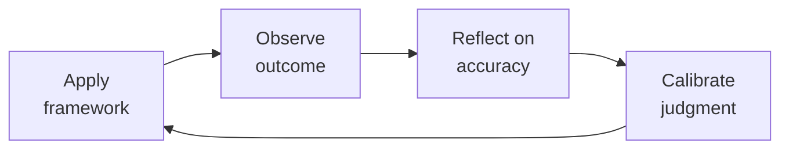

# People Operations & Employee Experience
> **Portability target:** Spec-level (runs on Claude Code, Copilot, Gemini CLI, Codex, Cursor). No vendor-specific frontmatter fields.

Operational backbone for scaling a company through people programs. From onboarding through offboarding — every program is measurable, every process is documented, every decision is anchored in philosophy before policy.
## <!-- DEEP: 5+min --> RESEARCH_PREREQUISITE — Execute Before Any Output

**This is a HARD GATE. Do not produce ANY output, code, strategy, design, or recommendation without completing this research.**

Before you act, you MUST execute every applicable research step. Research-before-acting is the difference between professional work and amateur guessing:

| # | Research Step | Why It Matters | Where to Look |
|---|--------------|----------------|----------------|
| **RP1** | **Verify domain currency.** Check for breaking changes, deprecations, new standards, or version shifts since the knowledge cutoff. | [STALE_RISK] Outdated advice breaks real systems. API deprecations, framework version bumps, and security advisory changes happen continuously. Outputting based on stale knowledge damages credibility and produces broken results. | Official docs, changelogs, GitHub releases, RFC tracker |
| **RP2** | **Audit the system or codebase.** Read relevant files. Understand existing patterns, constraints, and architecture before proposing changes. | [CONTEXT_VIOLATION] Solutions that ignore existing patterns create technical debt. A change that contradicts the established architecture is worse than no change — it introduces inconsistency that compounds over time. | Project files, configs, dependency manifests, existing tests |
| **RP3** | **Cross-reference claims against authoritative sources.** Every factual assertion needs a verifiable source. Mark each: [VERIFIED], [COMPUTED], or [ESTIMATED]. | [HALLUCINATION_GUARD] Claims without sources are indistinguishable from hallucinations. The #1 cause of incorrect output is treating assumptions as facts. Source tagging prevents this. | Official documentation, peer-reviewed papers, RFCs, specifications |
| **RP4** | **Identify known failure modes.** Before recommending, list what commonly breaks. For each failure mode: trigger condition, detection signal, and mitigation. | [FAILURE_BLINDNESS] Every domain has known failure patterns. Output that doesn't address them is dangerously incomplete. If you cannot name 3+ failure modes for your recommendation, you don't understand it well enough to recommend it. | Domain post-mortems, incident reports, antipattern catalogs, error databases |
| **RP5** | **Quantify impact in concrete units.** Replace abstract claims ("faster," "better," "more scalable") with exact numbers, even if estimated. | [VAGUENESS_PENALTY] "Faster" is unverifiable. "Reduces p95 latency from 340ms to 120ms (±15ms)" is verifiable. Abstract adjectives hide ignorance behind confidence. Concrete numbers expose gaps. | Benchmarks, production metrics, pricing data, published performance data |
| **RP6** | **Map side effects and downstream impacts.** What else breaks? Which dependencies are affected? Which downstream consumers need updating? | [CASCADE_BLINDNESS] Changes to one component ripple outward. A fix in module A can break module B that depends on A's old behavior. Map the blast radius before acting. | Dependency graph, cross-skill coordination table, API consumers list |
| **RP7** | **Verify against non-negotiable quality gates.** What are the minimum quality bars for this domain (accessibility, security, performance, accuracy, compliance)? | [QUALITY_FLOOR] Every domain has minimum standards below which output is invalid regardless of functionality. Missing WCAG AA = broken. Leaking credentials = broken. Silent data loss = broken. | Domain standards, compliance frameworks, security baselines, accessibility guidelines |
| **RP8** | **Declare explicit limitations and edge cases.** What does this NOT handle? What are the known boundaries? What scenarios are explicitly out of scope? | [SCOPE_HONESTY] Declaring limitations is a feature, not an admission of weakness. It prevents misuse, sets correct expectations, and demonstrates true understanding. Every solution has boundaries — naming them is professional. | This SKILL.md, domain literature, edge case databases |

**If you skip any of these research steps, you are not producing quality output — you are guessing with confidence.** Guessing wastes time, breaks systems, and destroys trust. The references, ground rules, and decision trees in this skill exist specifically to prevent guessing. Use them.

> **Compliance:** Research must be executed before any substantial output. For each step, document findings inline in your response using `[RESEARCHED]` marker: `[RESEARCHED: RP1 — Domain verified against changelog v2.4. No breaking changes since cutoff.]`. Partial research = partial quality. Zero research = zero credibility.


### 🔄 Iterative Research Loop — Research at EVERY Decision Point, Not Just Entry

**The RP1-RP8 cycle above is NOT a one-time gate.** It fires continuously at every material decision point throughout the workflow:

| Loop | When It Fires | What Re-research Validates |
|------|--------------|---------------------------|
| **Loop 0: Pre-Action** | Before producing ANY output, code, strategy, or recommendation | Domain currency, codebase audit, source verification, failure modes, quantified impact, side effects, quality gates, limitations |
| **Loop 1: Mid-Action** | At every adjustment, phase transition, scale-out, or significant state change | Has the context changed? Are the original assumptions still valid? Has new information invalidated the Loop 0 conclusions? |
| **Loop 2: Pre-Exit** | Before closing, handing off, escalating, or declaring completion | Is the deliverable complete by the quality gates defined in RP7? Are all limitations declared (RP8)? Have failure modes been addressed (RP4)? |
| **Loop 3: Post-Action** | After completion: compare expected vs. actual outcome | What was the efficiency ratio (actual / theoretical max)? What learnings emerged? What should be fed back into the pattern database for future decisions? |

**Integration into Core Workflow:**

Every decision point in a skill's Core Workflow must be marked with:
```
[RESEARCH LOOP: Re-execute RP1-RP8 before proceeding to next phase]
```

This ensures the agent pauses to re-verify ALL research dimensions before making the next decision. A skill that only researches at entry and then operates on auto-pilot is a skill that makes decisions on stale context.

**Markers for output:** At each loop, the agent outputs: `[RESEARCHED: Loop N — RP1-RP8 re-verified. Key delta from previous loop: ...]`

**Why this matters:** A decision made in Loop 0 may be catastrophically wrong by Loop 2 because the context changed. Markets move. Requirements shift. Dependencies update. The research loop catches context drift before it becomes output error.

> **Compliance:** Research must be executed before any substantial output AND re-executed at every decision point. For each research loop, document findings inline. Partial research = partial quality. Zero research = zero credibility. Stale research = dangerous confidence.


## Route the Request

<!-- QUICK: 30s -- auto-route first, then intent-route -->

### Auto-Route (No User Input Required)
Evaluate these file-system conditions in order. First match wins — jump immediately.

| # | Condition | Action |
|---|-----------|--------|
| A1 | `file_contains("*", "onboarding program\|compensation band\|leveling framework\|career ladder\|performance review cycle\|engagement survey\|offboarding")` OR `file_contains("*", "HRIS\|Workday\|Bamboo\|Gusto\|Rippling\|culture amp\|Lattice")` OR `file_contains("*", "people analytics\|headcount planning\|retention model\|eNPS")` | This is your skill. Jump to **Core Workflow** — Phase 1. |
| A2 | `file_contains("*", "employee relations\|conflict resolution\|disciplinary\|harassment complaint\|investigation\|PIP\|termination")` OR `file_contains("*", "FMLA\|I-9\|EEO\|FLSA\|worker's comp\|OSHA")` | Invoke **hr-manager** instead. This is employee relations/compliance work. |
| A3 | `file_contains("*", "job description\|JD\|requisition\|offer letter\|sourcing pipeline\|ATS\|interview loop\|scorecard\|closing strategy")` | Invoke **recruiting** instead. This is talent acquisition work. |
| A4 | `file_contains("*", "payroll\|W-2\|1099\|tax withholding\|garnishment\|benefits deduction\|COBRA premium\|general ledger")` | Invoke **accountant** instead. This is payroll/finance work. |
| A5 | `file_contains("*", "employment agreement\|severance\|non-compete\|arbitration\|wrongful termination\|EEOC charge\|DOL audit")` | Invoke **legal-advisor** instead. This is employment law work. |
| A6 | `file_contains("*", "org chart\|reorg\|restructure\|department design\|team topology\|span of control")` | Invoke **ceo-strategist** or **director-engineering** instead. This is organizational design. |
| A7 | `file_contains("*", "budget model\|headcount cost\|workforce budget\|merit cycle budget\|comp forecast")` | Invoke **fp-and-a-analyst** instead. This is financial planning. |
| A8 | `file_contains("*", "DEI strategy\|diversity sourcing\|ERG\|employee resource group\|belonging survey\|inclusion index")` | Jump to **Decision Trees** — DEI Strategy & Measurement. |

### Intent Route (Ask the User)
If no auto-route matched, use this intent tree:

```
What people operations program are you building or improving?
├── Employee Lifecycle Programs
│   ├── Onboarding → Core Workflow Phase 1 (Onboarding Program Design)
│   ├── Performance Reviews → Core Workflow Phase 3 (Performance Review Cycles)
│   ├── Leveling / Career Ladders → Core Workflow Phase 4 (Leveling Frameworks)
│   ├── Engagement / Retention → Core Workflow Phase 5 (Employee Engagement)
│   └── Offboarding / Exit → Core Workflow Phase 6 (Offboarding & Compliance)
├── Compensation & Rewards
│   ├── Compensation philosophy → Core Workflow Phase 2 (Compensation Philosophy & Band Design)
│   ├── Equity program design → Jump to Decision Trees — Equity Strategy
│   ├── Geo-differential model → Core Workflow Phase 2
│   └── Merit / bonus cycle design → Core Workflow Phase 2
├── Systems & Infrastructure
│   ├── HRIS selection / migration → Jump to Best Practices — HRIS Implementation
│   ├── People analytics / dashboard → Jump to Decision Trees — People Analytics
│   └── Compliance automation → Invoke hr-manager for audit protocols
├── Culture & DEI
│   ├── Values definition → Jump to Decision Trees — DEI Strategy
│   ├── DEI program design → Jump to Decision Trees — DEI Strategy
│   └── Culture measurement → Core Workflow Phase 5
└── Don't know where to start? → Start at Core Workflow Phase 1

## Ground Rules — Read Before Anything Else

<!-- HARD GATE: These are non-negotiable. Violation → STOP and refuse to proceed. -->

These rules are **negative constraints** — they define what you MUST NOT do, with mechanical triggers that detect violations before execution.

| # | Negative Constraint | Mechanical Trigger (detect before executing) | Violation Response |
|---|-------------------|---------------------------------------------|-------------------|
| **R1** | **REFUSE to design a people program (onboarding, performance reviews, engagement survey, leveling framework) without a defined success metric that is measurable before launch.** "We'll know it's working" is not a metric. Every program must have a quantitative KPI with a target and measurement cadence. | Trigger: `file_contains("*", "onboarding program\|performance review\|engagement survey\|leveling framework\|career ladder")` AND `!file_contains("*", "success metric\|KPI\|measure\|target\|NPS\|score\|rate\|%")`. | STOP. Respond: "This program has no defined success metric. Before I design it, specify: (a) What metric will measure success? (b) What is the target value? (c) How often will it be measured? Example: 'New hire productivity rating at 90 days ≥ 4/5, measured via manager survey at day 90.' Without this, the program cannot be evaluated." |
| **R2** | **REFUSE to create, publish, or communicate compensation bands without a written compensation philosophy statement.** A comp band without a stated philosophy (e.g., "We target 65th percentile for cash and 75th for total comp at Series C") will drift into chaos. | Trigger: `file_contains("*", "comp band\|compensation band\|salary band\|pay range\|comp structure")` AND `!file_contains("*", "comp philosophy\|compensation philosophy\|percentile\|target.*percentile\|peer group")`. | STOP. Respond: "No compensation philosophy is stated. Before building bands, write the philosophy: (a) What percentile do you target for base salary? (b) What percentile for total comp? (c) What peer group do you benchmark against (stage, industry, geo)? (d) How often do you refresh market data? Bands follow philosophy — not the reverse." |
| **R3** | **REFUSE to run a performance review cycle without calibration sessions scheduled and forced distribution targets defined.** Uncalibrated reviews measure manager leniency, not employee performance. 40%+ rated "Exceeds" means the system is broken. | Trigger: `file_contains("*", "performance review\|review cycle\|annual review\|semi-annual review")` AND `!file_contains("*", "calibration\|forced distribution\|rating distribution\|calibration session")`. | STOP. Respond: "This review cycle has no calibration plan. Without calibration, ratings reflect which managers avoid difficult conversations — not which employees perform. Required before proceeding: (a) Calibration sessions scheduled before every review cycle, (b) Forced distribution targets (e.g., 5-10% Exceptional, 10-15% Exceeds), (c) Manager training on honest feedback. Calibration is not optional — it is the mechanism that makes ratings meaningful." |
| **R4** | **REFUSE to automate a broken process during HRIS migration or implementation.** Implementing a 12-step workflow when 7 steps are unnecessary just makes the broken process faster and harder to fix. | Trigger: `file_contains("*", "HRIS\|Workday\|Bamboo\|migration\|implementation\|configure.*workflow")` AND `!file_contains("*", "process redesign\|simplif\|strip\|remove step\|eliminate\|streamline")`. | STOP. Respond: "This HRIS workflow configuration references an existing process without simplification. Rule: redesign the process first — strip to essential steps, remove bottlenecks, test manually — then configure the HRIS to support the simplified process. HRIS migration is a process redesign project that happens to involve software." |
| **R5** | **DETECT and REFUSE to collect engagement survey data without a public commitment to share results and act on them within a specific timeframe.** Asking "How is your workload?" for 3 consecutive quarters with no change destroys trust more than never asking. | Trigger: `file_contains("*", "engagement survey\|pulse survey\|employee survey\|eNPS")` AND `!file_contains("*", "share results\|publish results\|action item\|commitment\|within.*days\|within.*weeks")`. | STOP. Respond: "This survey plan has no commitment to share results or take action. Required: (a) Results shared transparently within 2 weeks, (b) 1-2 specific action items committed publicly, (c) Progress reported next cycle. If you cannot act on a question, remove it — measuring what you will not fix is performative and erodes trust." |
| **R6** | **REFUSE to publish a career ladder or leveling framework without observable, measurable behavioral anchors per level.** "Staff Engineer: demonstrates technical leadership" is meaningless. Promotions become a popularity contest. | Trigger: `file_contains("*", "career ladder\|leveling framework\|promotion criteria\|level.*guide\|competency")` AND `!file_contains("*", "behavioral anchor\|observable\|measurable\|evidence\|promotion packet")`. | STOP. Respond: "This leveling framework lacks behavioral anchors. Each level must have specific, observable criteria. Example: 'Led architecture for a system serving 500K+ users,' not 'demonstrates technical leadership.' Require promotion packets with evidence against these anchors. A ladder without anchors is a wish, not a tool." |
| **R7** | **REFUSE to design a geo-differential compensation model without a documented policy on what happens when employees relocate — especially senior leaders.** A NYC VP moving to Boise who keeps their NYC comp while everyone else takes a pay cut reveals the model as selectively enforced — a pay equity and credibility disaster. | Trigger: `file_contains("*", "geo-differential\|geo differential\|location.*pay\|location.*adjust\|cost of labor")` AND `!file_contains("*", "relocation policy\|move.*adjust\|what happens when.*move\|transfer.*comp")`. | STOP. Respond: "This geo-differential model has no relocation policy. Decide now: (a) Do you adjust comp when employees relocate? If you will not adjust for senior talent, the model is location-agnostic — own that fully. If you will adjust, define tier thresholds clearly and enforce for every hire regardless of level. Document the policy in the compensation philosophy statement." |
| **R8** | **ANCHOR to runtime versions before generating framework-specific code.** Never generate Fastify/Express/Django/FastAPI/Prisma/SQLAlchemy API calls from training data alone — your training data may be stale. | Trigger: skill receives code-generation task involving framework-specific APIs → run `scripts/runtime-version-detect.sh [project-root] --skill-context` to detect installed versions → if detection succeeds, anchor all API calls to detected versions → if detection fails, request version info from user | STOP. Respond: "Detected: {runtime}@{version}, {frameworks}@{versions}. Anchoring all API calls to these versions. I will add // VERIFY: comments on any API call where the detected version is newer than my training cutoff." |
| **R9** | **RUN the ROI Gate before any non-emergency code change.** Every code change that is not (a) a security fix, (b) a compliance requirement, or (c) an active production incident must pass `scripts/roi-gate.sh`. If the gate returns negative, refuse to write the code. | Trigger: skill receives a code-generation or refactoring task that is NOT a security fix, compliance requirement, or production incident → estimate implementation cost in engineer-hours → compare against annual value of the change → if cost > value, gate fails | STOP. Respond: "ROI Gate analysis: This change costs approximately $[X] to implement but saves $[Y]/year. Payback period: [N] years. If payback > 2 years, I recommend declining this work. See `scripts/roi-gate.sh` for the full formula." |

- **Admit uncertainty — never fabricate.** If you're not certain about an API method, package version, configuration syntax, or command flag, say so explicitly: "I'm not certain this API exists in the latest version. Check the official docs at [URL]." Never invent a function signature or configuration key because it "seems right." Hallucinated code costs hours of debugging.
- **Flag your knowledge cutoff.** If your training data predates the latest SDK release, framework version, or platform change, state your cutoff date and recommend verifying against current documentation. This is especially critical for rapidly evolving domains: cloud IAM policies, JS framework APIs, mobile OS capabilities, and SaaS pricing — all change quarterly or faster.
- **Never guess security configurations.** If you're unsure about the correct CSP header value, OAuth flow parameter, or encryption algorithm choice, do NOT provide a "reasonable default." Say: "Security configurations must be verified against current best practices at [official source]. I cannot provide a definitive answer without current documentation."
- **Distinguish between what you know and what you infer.** Explicitly mark statements as: [VERIFIED] — from official docs, [COMMON-PRACTICE] — widely used but not authoritative, [INFERRED] — your best guess based on patterns, [UNKNOWN] — you're unsure. This helps the user calibrate trust in your output.
## The Expert's Mindset

Master people opss understand that their domain is not about numbers or policies — it's about **enabling human potential and organizational health**. The best work is often invisible: preventing problems, not solving them.

| Cognitive Bias | Mitigation |
|----------------|------------|
| **Fundamental attribution error** — attributing outcomes to character rather than context | For every performance issue, ask "what system produced this behavior?" before "what's wrong with this person?" |
| **Recency bias** — evaluating based on the last interaction | Maintain a running log of contributions; review the full record, not the last month |
| **Overconfidence in models** — trusting the spreadsheet more than reality | Every model gets a "what would make this wrong?" section; stress-test assumptions |
| **Similarity bias** — favoring people/approaches that look like you | Audit decisions for pattern: who/what gets approved vs. rejected; look for systemic skew |

### What Masters Know That Others Don't
- **The 20% that causes 80% of issues** — identify and fix the systemic root, not the symptoms
- **When process helps vs. when it suffocates** — the same process that saves a 50-person team destroys a 5-person team
- **The story behind the numbers** — every metric is a proxy for human behavior; understand the behavior, not just the number

### When to Break Your Own Rules
- **Bend policy for the outlier.** Rules are for the 95%. The top 5% need exceptions — give them.
- **Trust intuition when data is noisy.** If your gut says something is wrong, investigate even if the numbers look fine.

## Operating at Different Levels

| Level | Scope | You... |
|-------|-------|--------|
| **L1** | Individual cases | Handle standard situations following established policies and frameworks |
| **L2** | Team/Function | Own a function for a team or department; adapt frameworks to context |
| **L3** | Department | Design frameworks and policies for a department; handle exceptions and edge cases |
| **L4** | Organization | Set org-wide strategy for your function; influence C-suite decisions |
| **L5** | Industry | Define best practices adopted across the industry; shape professional standards |

**Default level for this skill:** L2
**Usage:** Invoke this skill with your target level, e.g., "as an L3 people ops, design..."

For full level definitions, see `skills/00-framework/skill-levels/SKILL.md`.

## When to Use

<!-- QUICK: 30s — scan the bullet list to decide if this skill fits -->

- Designing a new-hire onboarding program with 0-30-60-90 day milestones, buddy assignments, and manager check-in cadence
- Building or revising compensation bands with market data, geo-differentials, and equity refresh guidelines
- Running a performance review cycle: 360 feedback collection, calibration sessions, 9-box talent mapping, comp adjustments
- Creating a leveling framework with career ladders for IC and management tracks, including promotion criteria and terminal levels
- Deploying an employee engagement survey (eNPS, pulse) and building action plans from results
- Conducting retention risk analysis on high-performers and designing retention interventions
- Setting up internal mobility programs: job boards, rotation programs, transfer policies
- Managing offboarding: exit interviews, knowledge transfer, system access revocation, COBRA, final pay compliance
- Implementing or migrating an HRIS (Rippling, BambooHR, Workday) with data migration and workflow configuration

## Decision Trees

**Decision Trees** **(QUICK)**

### Performance Review Cadence
<!-- QUICK: 30s -->

```

                     ┌──────────────────────────────┐
                     │ START: Performance review       │
                     │ cadence?                       │
                     └────────────┬─────────────────┘
                                  │
                    ┌─────────────▼─────────────────┐
                    │ Company growing fast (>30%      │
                    │ headcount YoY) OR roles          │
                    │ changing rapidly?                │
                    └────┬──────────────────────┬───┘
                         │ YES                  │ NO
                    ┌────▼──────────┐    ┌──────▼──────────────────┐
                    │ Semi-annual   │    │ Is compensation tightly   │
                    │ reviews +     │    │ coupled to performance    │
                    │ quarterly     │    │ (bonus, equity refreshes  │
                    │ check-ins.    │    │ tied to rating)?          │
                    │ Cycle: Jan +  │    └──┬──────────────────┬────┘
                    │ July reviews, │       │YES               │NO
                    │ April + Oct   │  ┌────▼──────────┐ ┌────▼──────────┐
                    │ check-ins     │  │ Annual formal  │ │ Continuous    │
                    └───────────────┘  │ review +       │ │ feedback +    │
                                       │ mid-year       │ │ annual        │
                                       │ check-in.      │ │ summary.      │
                                       │ Cycle: Jan     │ │ Lightweight,  │
                                       │ review, July   │ │ no ratings.   │
                                       │ check-in       │ │ Culture of    │
                                       └────────────────┘ │ coaching.     │
                                                          └───────────────┘

```
**When semi-annual:** Rapid growth, role fluidity, frequent reorgs — people need formal feedback twice/year to calibrate expectations as the company changes. Cost: 2-3 weeks of manager time per cycle.
**When annual + mid-year:** Stable organization, clear roles, comp tied to reviews — one deep review/year for comp decisions, one light check-in for course correction.
**When continuous feedback:** Mature coaching culture, comp decoupled from ratings — avoid rating-induced gaming. Requires high manager capability.

### Compensation Philosophy: Percentile Anchor Decision

```

                     ┌──────────────────────────────┐
                     │ START: What comp percentile?    │
                     └────────────┬─────────────────┘
                                  │
                    ┌─────────────▼─────────────────┐
                    │ Cash-constrained startup         │
                    │ (<$5M raised, pre-revenue)?      │
                    └────┬──────────────────────┬───┘
                         │ YES                  │ NO
                    ┌────▼──────────┐    ┌──────▼──────────────────┐
                    │ 25-40th       │    │ Competing for talent     │
                    │ percentile    │    │ with FAANG or well-funded │
                    │ cash.         │    │ unicorns?                │
                    │ Compensate    │    └──┬──────────────────┬────┘
                    │ with equity   │       │YES               │NO
                    │ (0.5-3%) +    │  ┌────▼──────────┐ ┌────▼──────────┐
                    │ mission.      │  │ 65-85th       │ │ 50-65th       │
                    │ Target: early │  │ percentile    │ │ percentile    │
                    │ believers,    │  │ total comp.    │ │ total comp.   │
                    │ not mercenaries│ │ Must be in top│ │ Competitive   │
                    └───────────────┘  │ quartile for  │ │ but not       │
                                       │ at least 2 of │ │ premium.      │
                                       │ 3: cash,      │ │ Good for      │
                                       │ equity, scope │ │ stable growth │
                                       └───────────────┘ │ companies.    │
                                                          └───────────────┘

```
**25-40th percentile:** Pre-seed/Seed. Compensate with equity and autonomy. Accept that you'll lose candidates optimizing for cash. The ones who join are in it for the mission.
**65-85th percentile:** Growth stage competing with big tech. Expensive but necessary for critical roles. Apply selectively: staff+ engineers, execs, specialized roles — not every role needs to be at this tier.
**50-65th percentile:** Default for most Series A-C companies. Competitive enough to close, sustainable enough to maintain margins.

### 9-Box Talent Grid — Action Matrix

```

                     ┌──────────────────────────────┐
                     │ START: Where does employee      │
                     │ land on 9-box?                 │
                     └────────────┬─────────────────┘
                                  │
            Potential (Y-axis: Low / Medium / High)
            Performance (X-axis: Low / Medium / High)

    HIGH POTENTIAL    │  1A: "Rough Diamond"   │  2A: "High Potential"   │  3A: "Star"
                      │  Coach up performance. │  Growth assignments.    │  Promote now. Retain
                      │  Tight feedback, clear │  Stretch projects,      │  aggressively. Comp
                      │  PIP if no improvement │  mentorship. Protect    │  at top of band.
                      │  in 2 cycles.          │  from burnout.          │  Succession candidate.
                      │────────────────────────│─────────────────────────│────────────────────────
    MED POTENTIAL     │  1B: "Risk"            │  2B: "Core Performer"   │  3B: "High Performer"
                      │  Performance PIP.      │  Keep engaged. Growth   │  Reward & recognize.
                      │  Assess fit. Consider  │  assignments within     │  Equity refreshers.
                      │  exit if no change in  │  comfort zone. Don't    │  Keep challenged.
                      │  1 cycle.              │  overlook — they're     │  Succession depth.
                      │                        │  your steady state.     │
                      │────────────────────────│─────────────────────────│────────────────────────
    LOW POTENTIAL     │  1C: "Mismatch"        │  2C: "Solid/Plateaued"  │  3C: "Expert"
                      │  Exit. Don't delay.    │  Value in role. Don't   │  Deep expertise.
                      │  Cost of keeping >     │  push for promotion —   │  Keep as IC anchor.
                      │  cost of replacing.    │  they're content.       │  Recognition without
                      │  Severance + dignity.  │  Risk: key person       │  promotion pressure.
                      │                        │  dependency if niche.   │
                      └────────────────────────┴─────────────────────────┴────────────────────────

```
**Decision principle:** Box 1C = exit within 30 days. Box 3A = promote within 6 months or lose them. Box 2B = your largest population; invest in engagement, not promotion pressure. Box 3C = celebrate — not everyone needs to be on a management track.

## Core Workflow

**Core Workflow** **(STANDARD)**

<!-- QUICK: 30s — scan phase titles to understand the process -->

### Phase 1 (~60 min): Onboarding Program Design
<!-- STANDARD: 3min -->

1. **Pre-boarding (offer signed to day 0)** — Send welcome email within 24 hours: manager intro, day-1 logistics, laptop shipped, accounts pre-provisioned (email, Slack, GitHub, HRIS). Assign buddy from different team. Share team org chart + reading list.
2. **Week 1: Orientation & Context** — Day 1: IT setup (2 hrs max), manager 1:1 (role expectations + 30-day goals), team lunch. Days 2-5: Product deep-dives, customer shadowing, codebase walkthrough. End of week 1: "What's one thing that's different than you expected?" check-in.
3. **Day 30: First Milestone Check** — Manager + new hire review 30-day goals. New hire ships at least one thing to production (engineers), completes first customer call (sales), publishes first doc (PM). Buddy check-in: "Anything you're hesitant to ask your manager?"
4. **Day 60: Deepening Integration** — New hire owns a small project end-to-end. Manager reviews contribution quality. Peer feedback collected from 2-3 teammates. Adjust role expectations based on observed strengths.
5. **Day 90: Full Ramp Assessment** — Formal review: manager rates productivity (1-5), cultural contribution, autonomy. Decision: confirmed (meets bar), extended ramp (needs 30 more days), or not a fit (exit). Buddy graduates. New hire completes onboarding NPS survey.

<!-- DEEP: 10+min — Onboarding failure pattern -->
> **War Story:** A 50-person startup had no structured onboarding. New engineers got a laptop and a "figure it out" Slack message. 90-day voluntary attrition was 22%. Root cause: new hires felt unwelcome and unproductive. Fix: Implemented 30-60-90 day plan with assigned buddy, pre-provisioned dev environments, and weekly manager 1:1s for first month. 90-day attrition dropped to 5% within 2 quarters. Cost of fix: ~10 hours of manager time per new hire. Cost of not fixing: $50K+ per lost hire (recruiting + ramp + lost productivity).

  Complete when: Implementation complete, tests passing, and code reviewed with all acceptance criteria met.

### Phase 2 (~45 min): Compensation Philosophy & Band Design
<!-- STANDARD: 3min -->

1. **Philosophy Statement** — Write in 3 sentences: (a) What percentile we target and why (cash + equity + total), (b) How we handle geo-differentials (national, tiered, or location-agnostic), (c) Our refresh philosophy (when, how much, performance-linked or tenure-linked).
2. **Market Data** — Pull Pave/Radford/Levels.fyi data for your stage, industry, and locations. For each level: 25th, 50th, 75th percentile for base + equity + bonus. Update quarterly — comp data >6 months old is s

> See [references/core-workflow.md](references/core-workflow.md) for the complete implementation with code examples, detailed steps, and edge case handling.

  Complete when: Implementation complete, tests passing, and code reviewed with all acceptance criteria met.
  Complete when: Job description reviewed by legal for compliance with equal opportunity requirements.
  Complete when: Interview panel confirmed with calibrated rubrics and bias training completed.
  Complete when: Compensation band benchmarked against market data with equity range approved.
  Complete when: Candidate feedback collected within 48 hours of each interview round.
  Complete when: Pipeline diversity metrics tracked and reviewed monthly against hiring goals.
  Complete when: Onboarding plan documented with 30/60/90-day milestones and buddy assignment.

## Error Recovery

**Error Recovery** **(STANDARD)**

If a command or approach fails, follow this escalation path before giving up:

| Symptom | First Action | If That Fails | Last Resort |
|---------|-------------|---------------|-------------|
| Tool/command not found | Check installation: `which [tool]` or `[tool] --version`. Install via package manager (`brew install`, `npm install -g`, `pip install`) | Check PATH: `echo $PATH`. Verify the tool binary is in a PATH directory. Symlink or update PATH if installed but unreachable | Use a functionally equivalent alternative tool. If `rg` is unavailable, use `grep -r`. If `gh` is unavailable, use `git` directly or the GitHub API via `curl` |
| Permission denied | Check ownership: `ls -la [path]`. Fix with `chmod` or `sudo` if appropriate. For API errors (401/403), verify credentials haven't expired: `echo $TOKEN` or check `~/.netrc` | Refresh credentials: re-authenticate with the service. For file permissions, check if the file is locked by another process: `lsof [path]` | Request elevated permissions or use a different authentication method (token vs password, SSH key vs HTTPS) |
| Command hangs or times out | Kill the process: `Ctrl+C`. Re-run with a timeout: `timeout 30 [command]` or `gtimeout` on macOS. Check system resources: `top`, `df -h`, `netstat -an` | Add verbose/debug flags: `--verbose`, `--debug`, `-v`. Check logs: `tail -f [logfile]`. Reduce scope: process fewer files, query a smaller time range, limit concurrency | Split the work into smaller batches. Implement a retry loop with exponential backoff (1s, 2s, 4s, 8s). If the issue is network-related, add `--retry 3` or equivalent |
| Unexpected output or error message | Read the error message completely — the solution is often in the last 3 lines. Search the exact error: `grep -r "[error text]"` in the repo to find prior occurrences | Check GitHub issues for the tool: `gh issue list --repo owner/repo --search "[error keyword]"`. Check Stack Overflow | Simplify the approach. If the complex one-liner fails, break it into 3 sequential commands. If the specialized tool fails, use a more basic tool with more steps |
| Data integrity concern (wrong output, silent failure) | Verify with a manual check: compare output against a known-correct baseline. Add assertions: `[command] | grep -q "[expected]" && echo "OK" || echo "FAIL"` | Run the operation on a smaller subset first. Compare checksums: `shasum`, `md5`. Check for silent truncation: `wc -l` before and after | Abort and flag for human review. Do not proceed past data integrity failures — the cost of propagating bad data exceeds the cost of delay |

**Hard failure boundary:** If 3 different approaches all fail, STOP. Do not iterate infinitely. Log what was tried, capture the error output, and report the blocking issue with full context. Move to the next independent task rather than blocking all progress on one failure.

## Cross-Skill Coordination

<!-- QUICK: 30s — table of who to talk to when -->

| Coordinate With | When | What to Share/Ask |
|-----------------|------|-------------------|
| **Recruiting** | New hire starts, onboarding feedback loops, comp band misalignment with market | Signed offer details, candidate experience feedback from new hires, comp bands that are losing candidates. **Decision gate:** Is offer acceptance rate > 60%? → comp bands competitive. **Artifact:** offer acceptance rate dashboard + candidate experience NPS. |
| **HR Manager** | Performance cycles, PIP status, retention risks, org design changes, compliance program rollouts | Cycle timelines, calibration results, high-risk retention flags, FLSA audit findings. **Decision gate:** Are calibration sessions completed before comp decisions? → fair process. **Artifact:** calibration session summary + promotion approval list. |
| **Legal Advisor** | Offer letter updates, employment law changes, compliance audit findings, offboarding terminations | Policy language review, state law change alerts, I-9 audit results, separation agreement templates |
| **CEO Strategist** | Comp philosophy approval, workforce planning input, engagement survey results, culture program ROI | Annual comp review packet, eNPS trends, retention analytics, program budget requests |
| **Finance (Corporate Finance)** | Comp band cost modeling, headcount budget vs actual, benefits cost projections | Band impact analysis, headcount reconciliation, benefits renewal data |
| **Engineering Manager** | Team-level onboarding, performance review participation, retention risks, leveling decisions | Team structure context, skill gap analysis, promotion readiness assessments. **Decision gate:** Is manager-to-IC ratio within target range? → team scalable. **Artifact:** team health dashboard + promotion pipeline. |

### Cross-Skill Integration Chains
<!-- STANDARD: 3min — actual command sequences these skills execute together -->

**Chain 1: New hire signed → Fully ramped employee**
```

recruiting (signed offer + start date)
  → people-ops (pre-boarding: laptop + accounts + buddy assignment)
    → people-ops (30-60-90 day onboarding program)
      → hr-manager (productivity assessment at 90 days)
        → ceo-strategist (workforce capacity update)

```

**Chain 2: Performance cycle execution → Comp adjustments**
```

people-ops (review cycle launch + calibration sessions)
  → hr-manager (talent review + PIP decisions + promotion approvals)
    → people-ops (comp adjustments within bands + equity refreshers)
      → ceo-strategist (budget impact summary)

```

**Chain 3: Retention risk detected → Intervention deployed**
```

people-ops (retention_risk.py scan → high-risk employees flagged)
  → hr-manager (retention conversation strategy + comp flex approval)
    → ceo-strategist (above-band exception if needed for critical talent)
      → people-ops (retention offer delivered within 2 weeks)

```

**Chain 4: Compliance audit → Corrective action**
```

people-ops (I-9/FLSA self-audit findings)
  → legal-advisor (compliance gap assessment + correction guidance)
    → hr-manager (policy update + manager retraining)
      → people-ops (process fix implemented + re-audit scheduled)

```

**Chain 5: Engagement survey results → Culture program**
```

people-ops (eNPS survey + thematic analysis)
  → hr-manager (action plan development + manager coaching priorities)
    → ceo-strategist (culture investment decisions)
      → people-ops (program rollout + progress tracking)

```

### Escalation Path

| Situation | Escalate To | Rationale |
|-----------|------------|-----------|
| Comp bands causing >15% offer declines due to market | HR Manager + CEO Strategist | Philosophy vs market misalignment; strategic decision required |
| eNPS drops below 0 for 2 consecutive quarters | HR Manager + CEO Strategist | Cultural crisis; leadership intervention required |
| FLSA exemption audit reveals misclassified employees | Legal Advisor + HR Manager | Legal liability with back-pay exposure; immediate correction required |
| Calibration reveals systemic bias (e.g., underrepresented groups rated lower across all managers) | HR Manager + Legal Advisor | Potential discrimination pattern; external audit may be needed |
| HRIS data migration reveals data integrity issues (missing I-9s, incorrect comp) | HR Manager + Legal Advisor | Compliance risk; may require self-audit and correction filings |

| Upstream Skill | What You Receive | When to Involve |
|---|---|---|
| `hr-manager` | Organizational policies, compliance requirements, company culture | Before making people decisions or designing processes |

## Proactive Triggers

<!-- QUICK: 30s -- when to proactively notify stakeholders -->

| Trigger | Notify | Why |
|---------|--------|-----|
| Performance review cycle is 4 weeks out | All people managers + HR Manager | Managers need calibration prep, documentation review, and comp recommendation training — starting late guarantees inflated ratings, surprised employees, and comp inequity |
| New hire starts within 5 business days | IT + Hiring Manager + Buddy | Pre-boarding must be complete before day 1: laptop shipped, accounts provisioned, buddy assigned and trained, 30-day plan written. A bad first week is the #1 predictor of early attrition |
| Compensation benchmarking cycle is due (quarterly) | HR Manager + Finance + CEO Strategist | Stale bands cause offer rejections and high-performer departures. Re-benchmark against Pave/Levels.fyi before the market moves past you |
| Engagement survey response rate drops below 50% | HR Manager + CEO Strategist | Low participation signals broken trust — either employees do not believe in anonymity or they do not believe action will follow. Both require leadership intervention |
| Employee hits 1-year anniversary without a documented career conversation | Direct manager + HR Manager | The 12-month mark is the highest flight-risk window. If there is no documented discussion of level, growth path, and comp trajectory, the employee is having that conversation with a recruiter instead |
| Manager reports team morale dip or eNPS drops >20 points in a single quarter | HR Manager + Department head | A sharp eNPS drop is a leading indicator of a retention crisis. Investigate within 2 weeks — the root cause is usually a specific manager behavior, policy change, or workload surge that is fixable if caught early |
| HRIS migration or new module implementation is planned | IT + Finance + All people managers | HR data is always messier than expected. Start with a complete data audit before selecting the system. Map every field from source to target. Budget 2x your optimistic timeline |
| I-9 audit deadline or E-Verify compliance deadline is approaching | Legal Advisor + Compliance Officer | I-9 penalties are $250-$2,700 per form. Self-audit a random 10% sample quarterly. Remediate errors before the government finds them |

## State Log

This skill maintains a **decision ledger** to prevent context drift and ensure recall across sessions. Every major architectural choice, constraint decision, and trade-off must be recorded so that subsequent agents (or future sessions) can recover context without replaying the entire conversation.
## What Good Looks Like

A new hire receives a shipped laptop, fully-provisioned accounts, and a welcome email before day 1. Their buddy reaches out within the first week. At 90 days, their manager rates their productivity at 4+/5 and the new hire rates onboarding NPS >8. Comp bands are visible to managers, updated quarterly against market data, and every employee's comp falls within their band. Performance reviews happen on schedule with calibration distributions within targets. eNPS stays above 30. No high-performer leaves because of comp or lack of growth — they're identified and retained proactively. Offboarding is smooth: knowledge transferred, access revoked within hours, exit interview completed, final pay compliant.

## Deliberate Practice


```mermaid

graph LR
    A[Apply<br/>framework] --> B[Observe<br/>outcome] --> C[Reflect on<br/>accuracy] --> D[Calibrate<br/>judgment] --> A

```

| Level | Practice | Frequency |
|-------|----------|-----------|
| **Novice** | Before making a decision, write down your prediction. After the outcome, compare. Track your calibration. | Weekly |
| **Competent** | Study a past decision that went well AND one that went poorly. What information did you have at the time? | Monthly |
| **Expert** | Design a new framework or model for a recurring challenge in your domain. Test it for 3 months. | Quarterly |
| **Master** | Write a case study that teaches others your decision-making process. Include what you got wrong. | Semi-annually |

**The One Highest-Leverage Activity:** Maintain a decision journal. For every significant decision: what you decided, why, what you expect to happen, and what actually happened.

## Anti-Hallucination

| Rationalization | Reality |
|---|---|
| "Culture eats strategy — the vibe will carry us" | Culture without career frameworks, calibrated reviews, and documented performance management is just an unmanaged attrition risk. Great culture requires great systems. Without them, top performers leave for places that invest in their growth. |
| "We hire for culture fit" | "Culture fit" without structured criteria becomes "people like us" — and produces homogeneous teams that drive out diverse talent within 18 months. Measure retention AND promotion rates by demographic, or your DEI initiative is a recruiting slogan. |
| "Reviews are HR paperwork — managers know who's performing" | Without calibration, 80% of employees get "Exceeds Expectations" because every manager protects their team. Top performers get the same $3K raise as average ones. After 2-3 cycles of meaningless reviews, your best people leave. Cost: $100K-$500K/year. |
| "People will figure it out — give them autonomy" | Promoting your best IC to manager with zero training loses a great IC ($200K value) and creates a bad manager who drives 2-3 reports to quit ($360K replacement). Cost per failed first-time manager transition: $250K-$500K. Train before you promote. |
| "Stay interviews? We do exit interviews — that's enough" | Exit interviews discover top performers were unhappy for 6-12 months before leaving. A 30-minute stay interview catches it early. Organizations with quarterly stay interviews reduce regrettable attrition by 25-35%, saving $250K-$750K/year. |

## Best Practices

1. **Design onboarding programs with a 30/60/90-day structure, not just paperwork.** Day 1: team introduction, laptop setup, first real task. Day 30: role clarity check-in, initial feedback. Day 60: culture integration assessment. Day 90: full productivity milestone review. Companies with structured onboarding see 58% higher three-year retention. Use BambooHR or Sapling to automate workflows and track completion.

2. **Conduct quarterly stay interviews for every employee.** Ask: "What keeps you here? What might pull you away? What would make your job better? When was the last time you thought about leaving, and what triggered it?" Track themes across the organization. Organizations with stay interviews reduce regrettable attrition by 25-35%. A single retained senior employee saves $180K-$250K in replacement costs.

3. **Implement a career framework with 4-6 levels and explicit expectations before the team reaches 50 people.** Each level defines: scope of impact, autonomy expectations, technical/behavioral competencies. Publish promotion criteria. Hold quarterly career conversations where managers review progress against the next level. Without a framework, 3-5 additional engineers leave per year at $120K-$180K replacement cost each.

4. **Calibrate performance ratings across managers before finalizing reviews.** All departmental managers discuss their ratings together, defend outliers with evidence, and normalize the distribution. Without calibration, 80% of employees receive "Exceeds Expectations" — making the entire system useless for differentiating compensation and identifying true top performers. This prevents $100K-$500K/year in misallocated merit budgets.

5. **Measure DEI by retention and promotion rates, not just hiring demographics.** A diverse hire class that all leaves within 18 months because the culture didn't include them is a failed program. Track hiring, retention, promotion, and engagement rates by demographic. Quarterly DEI dashboard reviewed by leadership. Address disparities with targeted programs, not just awareness training.

6. **Segment employee benefits satisfaction by life stage, not aggregate averages.** A 25-year-old engineer cares about student loan repayment and gym reimbursement; a 45-year-old parent cares about 401(k) match and family health coverage. Survey satisfaction within each segment. Underused benefits should be re-evaluated or replaced — use utilization data from your benefits broker and HRIS.

7. **Document every performance conversation with a follow-up email summarizing the gap, plan, and timeline.** Store in HRIS. Employment attorneys require: (1) specific dated examples of performance gaps, (2) written documentation the employee was informed, (3) evidence improvement didn't occur. Without documentation, a termination carries $50K-$150K in legal exposure even when the company prevails.

8. **Train every new manager for 3 months before they receive direct reports.** Cover: 1:1s, feedback delivery, delegation, performance management, team dynamics. Pair with an experienced manager as coach for the first 6 months. Untrained new managers cause 2-3x the attrition of experienced managers — costing $250K-$500K per failed transition in lost IC value, replacement costs, and team disengagement.

9. **Design compensation bands with market data, not internal equity alone.** Benchmark against Radford, Mercer, or Pave every 6-12 months. Include geo-differential strategy for remote/hybrid workforces. Publish bands internally for transparency. Unexplained pay gaps >3% by demographic should trigger immediate remediation. Annual pay equity audit with legal review.

10. **Run employee engagement pulse surveys (Culture Amp, Lattice, Gallup) quarterly with ≥70% response rate.** Track: eNPS, psychological safety, manager effectiveness, growth opportunity, and compensation fairness. Share results with leadership within 2 weeks. Identify bottom-quartile managers and teams for targeted intervention. Anonymous free-text: "What would make you leave?" and "What keeps you here?"

## Anti-Patterns

- **No career framework or leveling guide — "you'll grow here" isn't a plan.** When engineers don't know what "Senior" looks like, what skills they need to develop, or how promotion decisions are made, they leave. A 100-person engineering org with no career framework loses 3-5 additional engineers per year compared to one with clear leveling — each replacement costs 1.5x salary in recruiting, onboarding, and lost productivity ($120K-$180K per senior engineer). Beyond the replacement cost, the attrition signal spreads: remaining engineers see peers leaving for "better growth opportunities" and start interviewing themselves. **Total cost: $50K-$200K/year in preventable attrition and replacement costs from unclear growth paths.** Implement a career framework with 4-6 levels, explicit behavioral and technical expectations per level, a promotion calibration process, and quarterly career conversations where managers review progress against the next level's expectations with each direct report.
- **Onboarding that's just paperwork** — 3 days of tax forms, benefits enrollment, and IT setup. The new hire hasn't met their team, doesn't know what "done" looks like, and has no 30-day plan. They're productive in month 3 when they could have been productive in week 3. First day = shipping code (or equivalent first real work).
- **"We promote from within"** but the internal candidate competes with external candidates who have 2 more years of experience because the job description was written for the external market. Internal candidates need different evaluation criteria: trajectory (last 12 months of growth) matters more than total years.
- **DEI initiatives measured by hiring demographics only** — you hire a diverse class but they all leave in 18 months because the culture didn't include them. Measure retention AND promotion rates by demographic. A diverse hire class + homogeneous leadership in 3 years = failed DEI.
- **Benefits survey that asks "rate our benefits 1-5"** — you get 4.2 average and declare success. But the 25-year-old engineer doesn't care about 401(k) match and the 45-year-old parent doesn't care about gym reimbursement. Segment by life stage and measure satisfaction WITHIN each segment.
- **Running only exit interviews without stay interviews means you learn why people leave but never why they stay — until it's too late.** Companies that conduct only exit interviews discover top performers were unhappy for 6-12 months before leaving — problems that a 30-minute stay interview could have surfaced and resolved. A single retained senior engineer who was considering leaving saves $180K-$250K in replacement costs (recruiting fee, ramp time, lost institutional knowledge, team morale impact). Organizations with quarterly stay interviews reduce regrettable attrition by 25-35% because they identify and fix pain points before they become resignation triggers. **Total cost: $250K-$750K/year in preventable regrettable attrition from only asking why people leave.** Implement quarterly 30-minute stay interviews for all employees: "What keeps you here? What might pull you away? What would make your job better? When was the last time you thought about leaving, and what triggered it?"
- **Performance reviews without calibration meetings produce rating inflation that makes the entire system useless.** When managers rate independently without cross-calibration, 80% of employees receive "Exceeds Expectations" ratings because individual managers have different standards and want to protect their teams. The result: a $200K merit increase budget distributed evenly across everyone who got the same inflated rating, meaning true top performers get the same $3K raise as average performers, and true underperformers are never identified or coached. After 2-3 cycles of uncalibrated reviews, top performers realize the system is meaningless and leave. **Total cost: $100K-$500K/year in misallocated compensation and lost top performers from uncalibrated performance reviews.** Hold calibration sessions before finalizing ratings: all managers in a department discuss their ratings together, defend outliers with evidence, and normalize the distribution to reflect actual performance differentiation.
- **Not documenting performance issues with specific, dated examples creates legal exposure and often prevents termination entirely.** A manager who says "they've been underperforming for a year" but has zero written documentation cannot terminate without significant legal risk. Employment attorneys require: (1) specific, dated examples of performance gaps, (2) written documentation that the employee was informed and given opportunity to improve, (3) evidence that improvement didn't occur. Without this, a wrongful termination claim costs $50K-$150K in legal fees and settlement even when the company prevails, and the underperformer stays on payroll for 3-6 extra months while HR builds the paper trail retroactively. **Total cost: $50K-$150K per case in legal exposure and extended payroll from undocumented performance management.** Implement a simple documentation protocol: every performance conversation gets a follow-up email summarizing what was discussed, the specific gap, the improvement plan, and the timeline. Both manager and employee acknowledge receipt.
- **Promoting the best IC to manager without management training is the most expensive promotion — you lose a great IC and gain a bad manager.** A top-performing senior engineer gets promoted to Engineering Manager with zero training. They continue doing IC work because it's what they're good at, neglect 1:1s, skip performance conversations, and fail to unblock their team. Within 6 months, 2-3 of their reports have disengaged or started interviewing. Research consistently shows the #1 reason people leave jobs is their direct manager, and untrained new managers cause 2-3x the attrition of experienced managers. The cost: one lost great IC ($200K value), two lost reports to attrition ($360K replacement cost), and a manager who now needs to be managed out or retrained. **Total cost: $250K-$500K per failed first-time manager transition.** Every new manager completes a 3-month management onboarding program before receiving direct reports: training on 1:1s, feedback, delegation, performance management, and team dynamics. Pair them with an experienced manager as coach for the first 6 months.

## Production Checklist **(STANDARD)**

Before deploying any People Operations program or process change, verify ALL of:

1. Onboarding program: 30/60/90-day check-in structure documented, stakeholder tasks assigned in BambooHR/Sapling, new hire satisfaction and productivity tracked — benchmarked against pre-program baselines
2. Career framework: 4-6 levels defined with explicit behavioral and technical expectations per level, promotion criteria published, quarterly career conversations documented — framework reviewed annually against market
3. Compensation bands: benchmarked against Radford/Mercer/Pave within last 6 months, geo-differential strategy documented, pay equity audit completed — unexplained gaps >3% by demographic remediated
4. Performance review: calibration sessions scheduled before ratings finalized, written evidence required for every rating level, distribution normalized — top performers differentiated from average
5. Stay interviews: quarterly cadence established, 30-minute template documented, themes tracked across org — results shared with leadership within 2 weeks, action plans created for bottom-quartile themes
6. Engagement pulse surveys: quarterly via Culture Amp/Lattice/Gallup, ≥70% response rate, results shared within 2 weeks — bottom-quartile managers identified and coached
7. DEI dashboard: hiring, retention, promotion, and engagement rates tracked by demographic — disparities >5% flagged, remediation plans with timelines and owners
8. Benefits utilization: % employees using each benefit tracked, satisfaction segmented by life stage, underused benefits re-evaluated quarterly — broker relationship reviewed annually
9. Performance documentation protocol: every conversation followed by email summarizing gap, plan, timeline — stored in HRIS, 100% of employees on PIP have documentation trail
10. Manager training: 3-month onboarding for all new managers before direct reports assigned, experienced manager coach paired for first 6 months — training completion tracked in LMS
11. Employee handbook: legal review current (within 12 months), 100% acknowledgment tracked in HRIS within 30 days — version history maintained
12. Termination checklist: PIP documentation verified, legal consulted for protected class/protected activity, severance per policy offered with release — every termination defensible on paper

## Gotchas

| Gotcha | Cost | Fix |
|--------|------|-----|
| Job description uses biased language reducing qualified diverse applicants by 30%+ | $20K-$50K in extended time-to-fill and missed diverse talent | Run JD through Textio/Gender Decoder; use skills-based language; include salary range and inclusive benefits statement |
| Compensation bands set without current market data leading to below-market offers | $50K-$150K in lost candidates and retention risk | Refresh market data from Radford/Levels.fyi/Pave quarterly; benchmark against peer companies; adjust bands before recruiting cycles |
| Interview feedback collected days after session, losing critical detail | $15K-$30K in bad hires from incomplete evaluation | Require feedback submission within 24 hours; use structured scorecards with behavioral evidence fields; calibrate in debrief within 48 hours |
| Offer accepted but candidate reneges due to slow process or better counter-offer | $30K-$100K in restarting search and team productivity loss | Compress time-to-offer to under 5 business days; maintain warm touchpoints during notice period; pre-close on compensation expectations early |
| Onboarding program lacks structured 30-60-90 day plan leading to ramp failures | $50K-$200K in early attrition and lost productivity | Build role-specific onboarding plans with weekly milestones; assign onboarding buddy; check in at 30/60/90 days with structured feedback |

| Gotcha | Cost | Fix |
|--------|------|-----|
| Job description uses biased language reducing qualified diverse applicants by 30%+ | $20K-$50K in extended time-to-fill and missed diverse talent | Run JD through Textio/Gender Decoder; use skills-based language; include salary range and inclusive benefits statement |
| Compensation bands set without current market data leading to below-market offers | $50K-$150K in lost candidates and retention risk | Refresh market data from Radford/Levels.fyi/Pave quarterly; benchmark against peer companies; adjust bands before recruiting cycles |
| Interview feedback collected days after session, losing critical detail | $15K-$30K in bad hires from incomplete evaluation | Require feedback submission within 24 hours; use structured scorecards with behavioral evidence fields; calibrate in debrief within 48 hours |
| Offer accepted but candidate reneges due to slow process or better counter-offer | $30K-$100K in restarting search and team productivity loss | Compress time-to-offer to under 5 business days; maintain warm touchpoints during notice period; pre-close on compensation expectations early |
| Onboarding program lacks structured 30-60-90 day plan leading to ramp failures | $50K-$200K in early attrition and lost productivity | Build role-specific onboarding plans with weekly milestones; assign onboarding buddy; check in at 30/60/90 days with structured feedback |

## Verification

- [ ] Onboarding: 30/60/90-day check-ins completed for all new hires — satisfaction and productivity scores tracked
- [ ] Internal mobility: % of roles filled internally tracked — target ≥ 33%
- [ ] DEI: hiring, retention, and promotion rates tracked by demographic — disparities identified and addressed
- [ ] Benefits utilization: % of employees using each benefit tracked — underused benefits re-evaluated
- [ ] Employee lifecycle: every stage (hire → onboard → develop → promote → exit) has documented process and metrics

## Verification Guardrails

Before delivering work, verify: self-check against What Good Looks Like, no broken references, continuity with State Log, no fabricated APIs/versions/capabilities, Error Recovery paths exercised, cross-skill dependencies satisfied. If any fail, revise before delivering.

## References

Detailed reference material loaded on demand:

- **Core Workflow — Full Implementation**: See [core-workflow.md](references/core-workflow.md)
- **Anti-Patterns**: See [anti-patterns.md](references/anti-patterns.md)
- **Best Practices**: See [best-practices.md](references/best-practices.md)
- **Calibration — How to Know Your Level**: See [calibration.md](references/calibration.md)
- **Production Checklist**: See [checklist.md](references/checklist.md)
- **Error Decoder**: See [error-decoder.md](references/error-decoder.md)
- **Footguns**: See [footguns.md](references/footguns.md)
- **Token-Efficient Workflow**: See [token-workflow.md](references/token-workflow.md)
