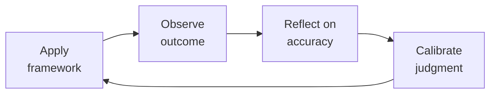

# Technical & Executive Recruiting

End-to-end hiring system for technical and executive roles. From job description through close — every stage is measured, every decision is structured, every candidate interaction is intentional.

## Route the Request
<!-- QUICK: 30s -- auto-route first, then intent-route -->

### Auto-Route (No User Input Required)
Evaluate these file-system conditions in order. First match wins — jump immediately.

| # | Condition | Action |
|---|-----------|--------|
| A1 | `file_contains("*", "job description\|JD\|requisition\|offer letter\|sourcing strategy\|Boolean search\|interview loop\|scorecard\|closing strategy\|candidate pipeline")` OR `file_contains("*", "ATS\|Greenhouse\|Lever\|Ashby\|recruiting funnel\|time-to-fill\|offer acceptance")` | This is your skill. Jump to **Core Workflow** — Phase 1. |
| A2 | `file_contains("*", "employee relations\|conflict resolution\|harassment\|investigation\|PIP\|termination\|FMLA\|I-9")` OR `file_contains("*", "employee handbook\|policy violation\|disciplinary\|workers comp")` | Invoke **hr-manager** instead. This is employee relations/compliance work. |
| A3 | `file_contains("*", "compensation band\|leveling framework\|career ladder\|performance review\|engagement survey\|onboarding program\|offboarding")` OR `file_contains("*", "HRIS\|people analytics\|retention model\|eNPS")` | Invoke **people-ops** instead. This is program design and systems work. |
| A4 | `file_contains("*", "payroll\|W-2\|1099\|tax withholding\|garnishment\|benefits deduction\|COBRA premium")` | Invoke **accountant** instead. This is payroll/finance work. |
| A5 | `file_contains("*", "employment agreement\|non-compete\|arbitration\|severance\|wrongful termination\|EEOC\|DOL audit")` | Invoke **legal-advisor** instead. This is employment law work. |
| A6 | `file_contains("*", "org chart\|reorg\|team structure\|span of control\|department design")` OR `file_contains("*", "headcount plan\|workforce plan\|operating model")` | Invoke **ceo-strategist** or **director-engineering** instead. This is organizational design. |
| A7 | `file_contains("*", "budget model\|headcount cost\|comp forecast\|runway analysis\|workforce budget")` | Invoke **fp-and-a-analyst** instead. This is financial planning. |
| A8 | `file_contains("*", "DEI sourcing\|diverse pipeline\|underrepresented\|Rooney Rule\|blind resume\|bias interruption")` | Jump to **Decision Trees** — Diversity Sourcing Strategy. |

### Intent Route (Ask the User)
If no auto-route matched, use this intent tree:
```
What recruiting activity are you working on?
├── Role Definition & Planning
│   ├── Write a job description → Core Workflow Phase 1 (Role Definition & JD Writing)
│   ├── Define must-have vs. nice-to-have attributes → Core Workflow Phase 1
│   └── Set up scorecard for interview panel → Core Workflow Phase 2 (Interview Loop Design)
├── Sourcing
│   ├── Build Boolean search strings → Jump to Best Practices — Sourcing Strategy
│   ├── Source for hard-to-fill role → Jump to Best Practices — Sourcing Strategy
│   └── Diversity sourcing → Jump to Decision Trees — Diversity Sourcing Strategy
├── Interview & Assessment
│   ├── Design interview loop → Core Workflow Phase 2 (Interview Loop Design)
│   ├── Calibrate interview panel → Jump to Best Practices — Panel Calibration
│   └── Build structured scorecard → Core Workflow Phase 2
├── Offer & Close
│   ├── Build an offer → Core Workflow Phase 4 (Offer Construction & Negotiation)
│   ├── Close a candidate with competing offers → Jump to Best Practices — Closing Strategies
│   └── Negotiate comp within band → Core Workflow Phase 4
├── Metrics & Process
│   ├── Set up recruiting dashboard → Core Workflow Phase 5 (Metrics & Optimization)
│   ├── Audit pipeline health → Core Workflow Phase 5
│   └── Improve offer acceptance rate → Core Workflow Phase 5
└── Don't know where to start? → Start at Core Workflow Phase 1

## Ground Rules — Read Before Anything Else
<!-- HARD GATE: These are non-negotiable. Violation → STOP and refuse to proceed. -->

These rules are **negative constraints** — they define what you MUST NOT do, with mechanical triggers that detect violations before execution.

| # | Negative Constraint | Mechanical Trigger (detect before executing) | Violation Response |
|---|-------------------|---------------------------------------------|-------------------|
| **R1** | **REFUSE to write a job description that lists requirements (years of experience, specific technologies) without 3 measurable 6-month outcomes.** A JD that reads "5+ years of React, CS degree required" is a filtering tool that screens out qualified candidates. Outcomes attract; requirements filter. | Trigger: `file_contains("*", "years of experience\|years.*required\|degree required\|must have.*years")` AND `!file_contains("*", "first 6 months\|in your first.*months\|you will accomplish\|you will own\|outcome\|impact")`. | STOP. Respond: "This JD lists requirements but no outcomes. Rewrite: (a) Delete arbitrary years-of-experience and degree requirements, (b) Add 3 specific, measurable outcomes the hire will accomplish in their first 6 months, (c) Add comp range, (d) Add 'Why this role exists now.' Outcome-based JDs attract high-performers; requirement lists attract checkbox-fillers." |
| **R2** | **REFUSE to construct an offer or communicate compensation numbers without anchoring to a published compensation band with a percentile benchmark.** Every number must reference market data: "This offer is at the 65th percentile for Series B companies in the Bay Area (Pave, Q2 2026)." | Trigger: `file_contains("*", "offer.*\$\|salary.*\$\|base.*\$\|total comp.*\$\|equity.*grant")` AND `!file_contains("*", "percentile\|Pave\|Radford\|Levels.fyi\|Carta\|benchmark\|market data")`. | STOP. Respond: "This compensation number is not anchored to market data. Before presenting: (a) Benchmark against Pave/Radford/Levels.fyi for role + stage + geo, (b) Identify the percentile this offer represents, (c) Verify internal equity against existing team members at same level. No compensation number leaves this skill without a market percentile anchor." |
| **R3** | **REFUSE to present equity compensation without explaining: (a) ISO/NSO/RSU type, (b) grant size in shares AND dollar value, (c) strike price vs. 409A vs. preferred price, (d) vesting schedule (cliff + graded), (e) post-termination exercise window, (f) 83(b) election implication (if applicable).** If the candidate does not understand what they are getting, the offer is not complete. | Trigger: `file_contains("*", "equity\|stock option\|RSU\|ISO\|NSO\|option grant\|equity grant")` AND `!file_contains("*", "strike price\|409A\|vesting\|cliff\|post-termination\|83.*b\|exercise window")`. | STOP. Respond: "Equity details are incomplete. Required: (a) Grant type (ISO/NSO/RSU), (b) Number of shares and dollar value at current 409A, (c) Strike price vs. 409A vs. preferred price, (d) Vesting: cliff period + graded schedule, (e) Post-termination exercise window (standard = 90 days; extended = 2-10 years), (f) 83(b) election explanation if early exercise available. Equity explained poorly is equity undervalued — and candidates will discount it." |
| **R4** | **REFUSE to send an offer letter without a documented closing strategy that covers: candidate priorities, competing offers and timelines, who calls and when, flex across cash/equity/scope/title/start date, and BATNA if they decline.** The offer letter begins closing — it does not complete it. | Trigger: `file_contains("*", "offer letter\|send offer\|extend offer\|offer out\|offer approved")` AND `!file_contains("*", "closing strategy\|candidate.*priorit\|competing offer\|BATNA\|flex.*lever\|call.*plan")`. | STOP. Respond: "No closing strategy documented. Before the offer goes out: (a) Top 2 things the candidate values most (cash, equity, scope, title, team, mission, flexibility), (b) Competing offers — who, what stage, timeline, (c) Closing plan: who calls when (HM within 2 hours, skip-level within 24 hours), (d) Flex levers across cash/equity/scope/title/start date/remote, (e) BATNA: what happens if they decline — who is next in pipeline?" |
| **R5** | **DETECT and STOP if an offer is being constructed above the published compensation band without a documented exception approval from HR + Department Head with business rationale.** An above-band offer creates an internal equity time bomb — the existing team discovers the gap and starts interviewing. | Trigger: `file_contains("*", "above band\|above.*range\|exception.*offer\|stretch.*offer\|over.*band\|exceed.*band")` AND `!file_contains("*", "exception.*approved\|HR.*approval\|department head.*approval\|business rationale")`. | STOP. Respond: "⚠️ ABOVE-BAND OFFER DETECTED. Before proceeding: (a) Document written approval from HR Head + Department Head, (b) State business rationale (critical hire, unique skill, time pressure), (c) Fix existing team compensation to within 10% of new-hire band before or within the same review cycle. If you cannot afford to fix the existing team, you cannot afford the above-band hire — the cost of replacing departing team members exceeds the exception." |
| **R6** | **REFUSE to ghost or delay communication with any candidate past 48 hours post-interview.** Every candidate gets a decision within 48 hours. Ghosting burns employer brand — one bad experience reaches hundreds of potential candidates via Blind and Glassdoor. | Trigger: `file_contains("*", "still waiting\|no update\|ghost\|let them wait\|no rush\|they'll understand")` on any candidate communication status. | STOP. Respond: "Candidate communication delay detected. Rule: every candidate gets a decision within 48 hours of their last interview — yes or no. If yes: HM calls immediately. If no: recruiter calls within 48 hours with specific, actionable feedback. A 'no' delivered with respect preserves your brand; silence destroys it. Proceed with communication now." |


## The Expert's Mindset

Master recruitings understand that their domain is not about numbers or policies — it's about **enabling human potential and organizational health**. The best work is often invisible: preventing problems, not solving them.

| Cognitive Bias | Mitigation |
|----------------|------------|
| **Fundamental attribution error** — attributing outcomes to character rather than context | For every performance issue, ask "what system produced this behavior?" before "what's wrong with this person?" |
| **Recency bias** — evaluating based on the last interaction | Maintain a running log of contributions; review the full record, not the last month |
| **Overconfidence in models** — trusting the spreadsheet more than reality | Every model gets a "what would make this wrong?" section; stress-test assumptions |
| **Similarity bias** — favoring people/approaches that look like you | Audit decisions for pattern: who/what gets approved vs. rejected; look for systemic skew |

### What Masters Know That Others Don't
- **The 20% that causes 80% of issues** — identify and fix the systemic root, not the symptoms
- **When process helps vs. when it suffocates** — the same process that saves a 50-person team destroys a 5-person team
- **The story behind the numbers** — every metric is a proxy for human behavior; understand the behavior, not just the number

### When to Break Your Own Rules
- **Bend policy for the outlier.** Rules are for the 95%. The top 5% need exceptions — give them.
- **Trust intuition when data is noisy.** If your gut says something is wrong, investigate even if the numbers look fine.
## Operating at Different Levels

| Level | Scope | You... |
|-------|-------|--------|
| **L1** | Individual cases | Handle standard situations following established policies and frameworks |
| **L2** | Team/Function | Own a function for a team or department; adapt frameworks to context |
| **L3** | Department | Design frameworks and policies for a department; handle exceptions and edge cases |
| **L4** | Organization | Set org-wide strategy for your function; influence C-suite decisions |
| **L5** | Industry | Define best practices adopted across the industry; shape professional standards |

**Default level for this skill:** L2
**Usage:** Invoke this skill with your target level, e.g., "as an L3 recruiting, design..."

For full level definitions, see `skills/00-framework/skill-levels/SKILL.md`.

## When to Use
<!-- QUICK: 30s — scan the bullet list to decide if this skill fits -->

- Hiring a technical role (engineer, data scientist, PM, designer) where structured interviewing is critical
- Building an executive search for VP/C-suite roles requiring backchannel references and board alignment
- Redesigning an interview loop because your offer acceptance rate is below 70% or quality-of-hire feedback at 6 months is poor
- Writing job descriptions that attract passive candidates, not filter active applicants
- Constructing an offer with equity components (ISO, NSO, RSU) and negotiating against competing offers
- Setting up recruiting metrics: time-to-fill, offer acceptance rate, source-of-hire, quality-of-hire
- Improving diversity pipeline when underrepresented candidate throughput is below 30% at top-of-funnel
- Choosing or migrating an ATS (Greenhouse, Lever, Ashby) and designing the workflow
- Running a recruiting sprint for a critical hire (target: offer accepted within 21 days)

## Decision Trees

### Sourcing Channel Selection
<!-- QUICK: 30s — where to find this candidate type -->

```
                     ┌──────────────────────────────┐
                     │ START: Which sourcing channel?  │
                     └────────────┬─────────────────┘
                                  │
                    ┌─────────────▼─────────────────┐
                    │ Role is highly specialized       │
                    │ (staff+ engineer, exec, niche)?   │
                    └────┬──────────────────────┬───┘
                         │ YES                  │ NO
                    ┌────▼──────────┐    ┌──────▼──────────────────┐
                    │ Outbound       │    │ Is the role early-career │
                    │ sourcing       │    │ or high-volume (SDR,     │
                    │ required.      │    │ support, junior eng)?    │
                    │ Use: LinkedIn  │    └──┬──────────────────┬────┘
                    │ Recruiter +    │       │YES               │NO
                    │ GitHub +       │  ┌────▼──────────┐ ┌────▼──────────┐
                    │ employee refs  │  │ Inbound +     │ │ Mixed: inbound │
                    │ + boolean      │  │ university    │ │ + outbound.    │
                    │ search         │  │ recruiting +  │ │ LinkedIn +     │
                    └────────────────┘  │ job boards    │ │ well-written JD│
                                        │ (LinkedIn,    │ │ + employee refs│
                                        │ Indeed,       │ └────────────────┘
                                        │ Handshake)    │
                                        └───────────────┘
```
**When outbound sourcing is mandatory:** Staff+ engineers, executives, niche roles (e.g., Rust kernel engineer, quant researcher). Inbound alone won't fill these — you must map the market and reach out directly.
**When inbound works:** Junior/mid-level roles with clear JD, strong employer brand, and compensation in market range. Expect 200-500 inbound applicants for a mid-level engineering role in a known company.

### Interview Loop Design: Deep vs Broad
```
                     ┌──────────────────────────────┐
                     │ START: Interview loop design?   │
                     └────────────┬─────────────────┘
                                  │
                    ┌─────────────▼─────────────────┐
                    │ Role requires one primary skill  │
                    │ deeply (e.g., backend eng =      │
                    │ system design + coding)?         │
                    └────┬──────────────────────┬───┘
                         │ YES                  │ NO
                    ┌────▼──────────┐    ┌──────▼──────────────────┐
                    │ 4-5 rounds:   │    │ Role spans multiple      │
                    │ 2 coding,     │    │ domains (e.g., EM =      │
                    │ 1 system      │    │ people mgmt + tech +     │
                    │ design, 1     │    │ product + execution)?    │
                    │ behavioral,   │    └──┬──────────────────┬────┘
                    │ 1 values.     │       │YES               │NO
                    │ ~4 hours total│  ┌────▼──────────┐ ┌────▼──────────┐
                    └────────────────┘ │6 rounds:      │ │3-4 rounds:    │
                                       │2 behavioral   │ │1 combo screen │
                                       │(IC+manager),  │ │+ 2 domain +   │
                                       │1 technical,   │ │1 values.      │
                                       │1 system,      │ │Add take-home  │
                                       │1 cross-func,  │ │if portfolio   │
                                       │1 values/exec  │ │review needed. │
                                       │presentation.  │ └───────────────┘
                                       │~6 hours total │
                                       └───────────────┘
```
**When deep loop:** Individual contributor roles where one skill dominates. Fewer rounds, higher signal per round. Each interviewer owns one dimension.
**When broad loop:** Cross-functional roles (EM, PM, TPM, exec). More rounds covering distinct dimensions. Panel debrief required to synthesize signals.

### Offer Approval Authority
```
                     ┌──────────────────────────────┐
                     │ START: Offer above band?        │
                     └────────────┬─────────────────┘
                                  │
                    ┌─────────────▼─────────────────┐
                    │ Offer is within band AND         │
                    │ within 2% of median?             │
                    └────┬──────────────────────┬───┘
                         │ YES                  │ NO
                    ┌────▼──────────┐    ┌──────▼──────────────────┐
                    │ Hiring        │    │ Is it >10% above band    │
                    │ manager       │    │ OR >90th percentile      │
                    │ approves.     │    │ total comp?              │
                    │ (no escalation│    └──┬──────────────────┬────┘
                    │ needed)       │       │YES               │NO (2-10% above)
                    └───────────────┘  ┌────▼──────────┐ ┌────▼──────────┐
                                       │VP People +    │ │Head of People │
                                       │CEO/COO        │ │+ Hiring Mgr   │
                                       │approval       │ │approval.      │
                                       │required.      │ │Document       │
                                       │Business case  │ │compelling     │
                                       │required: why  │ │reason.        │
                                       │this candidate │ └───────────────┘
                                       │at this price  │
                                       └───────────────┘
```
**Within band (<2% above median):** Auto-approved. Speed matters — every day of approval delay increases drop-off risk by 3-5%.
**Slightly above band (2-10%):** HM + Head of People approve. Document: competing offers, specialized skill scarcity, time-to-fill cost if role remains open.
**Significantly above band (>10%):** VP People + CEO/COO. Requires business case with ROI justification (e.g., "This hire unblocks $2M ARR pipeline").

## Core Workflow
<!-- QUICK: 30s — scan phase titles to understand the process -->

### Phase 1 (~60 min): Role Definition & JD Writing
<!-- STANDARD: 3min -->

1. **Outcome Mapping** — For each role, define 3 outcomes the hire must achieve in months 1-3, 4-6, and 7-12. Example: "Month 1-3: Ship auth service rewrite reducing login latency from 800ms to <200ms p95. Month 4-6: Design and implement rate-limiting layer handling 50K RPS."
2. **JD Structure** — Title + One-sentence mission + 6-month outcomes (3 bullets) + Why this company/team now + Nice-to-have (NOT requirements — only 3 "must-have" hard skills max) + Comp range (transparent by law in CA/CO/NY/WA). No laundry list of "5+ years X, 3+ years Y."
3. **Comp Band** — Benchmark against Pave/Radford/Levels.fyi for the role, stage, and geo. Define: base range, equity range (with 409A context), target bonus %. Document the percentile anchor.
4. **Scorecard** — Define 4-6 attributes weighted by importance. Each attribute has 3 behavioral indicators (what "great" looks like). Example: "System Design (25%): Designs for 10x scale, clear trade-off articulation, appropriate tech selection."
5. **Verify:** Share JD with 2 team members in the target role. Ask: "Would you apply to this?" If either says no, rewrite.

### Phase 2 (~45 min): Interview Loop Design
<!-- STANDARD: 3min -->

1. **Loop Architecture** — Map attributes from scorecard → interview rounds. Each round tests 1-2 attributes max. No attribute tested by only one interviewer unless it's low-weight.
2. **Interviewer Selection** — Panel of 4-6 interviewers. Each trained on rubric + bias awareness. At least one interviewer from an underrepresented group. No single interviewer should see >60% of candidates (avoid bottleneck).
3. **Rubric Design** — Each attribute scored 1-4: 1=Strong No, 2=No (with reservations), 3=Yes (with reservations), 4=Strong Yes. No 3-point scales (forces false neutrality). Each score anchored to behavioral examples.
4. **Calibration Session** — Before first interview: all panelists review same mock interview recording. Score independently. Discuss variance >1 point. Repeat until scores converge within 0.5 points.
5. **Candidate Experience** — Send prep email 48 hours before: who they'll meet, what each round covers, what to prepare. No surprise rounds. 15-minute buffer between rounds. Same-day debrief scheduling for fast turnaround.

<!-- DEEP: 10+min — War story -->
> **War Story:** A Series B startup's eng loop had 7 rounds over 3 weeks with different interviewers each week. Offer acceptance was 45%. Root cause: candidates accepted elsewhere before loop finished. Fix: Compressed to 4 rounds in 2 days, added a dedicated recruiting coordinator for scheduling, and gave candidates a timeline commitment in the first screen. Acceptance jumped to 78% in 2 months.

### Phase 3 (~90 min): Candidate Sourcing & Outreach
<!-- STANDARD: 3min -->

1. **Sourcing Mix** — For every role, split effort: 40% outbound (LinkedIn Recruiter, GitHub search, Boolean), 30% inbound (JD + careers page), 20% employee referrals (pay $3K-10K depending on role), 10% events/communities.
2. **Boolean Search Strings** — Build reusable search templates by role family:
   - Backend eng: `("staff engineer" OR "principal engineer") AND (Go OR Rust OR Kotlin) AND (Kubernetes OR AWS) AND NOT (intern OR junior OR "new grad") site:linkedin.com/in`
   - ML Engineer: `("machine learning" OR "ML engineer") AND (PyTorch OR TensorFlow) AND (deployed OR production) site:github.com`
3. **GitHub Candidate Search** — Search by: language + stars + recent activity. Contributions to relevant OSS projects. Profile README quality. Avoid: only judging commit count (deep contributors may commit infrequently).
4. **Outreach Message** — Subject: "[Company] — [Role] (saw your work on [specific thing])" Body: One sentence about what they built (proves you researched), one sentence about what they'd build here, comp range, ask for 15 minutes. No "we're revolutionizing..." No "fast-paced environment."

### Phase 4 (~45 min): Offer Construction & Negotiation
<!-- STANDARD: 3min -->

1. **Offer Components** — Base salary ($) + Equity (options/RSUs) + Sign-on (if needed) + Benefits summary + Start date flexibility + Relocation (if applicable).
2. **Equity Deep-Dive** —
   - **ISO** (Incentive Stock Options): Pre-exit startup. Tax-advantaged but $100K exercise limit/year. Candidate must understand AMT implications.
   - **NSO** (Non-Qualified Stock Options): Advisors, contractors, or when ISOs aren't available. Ordinary income tax on spread at exercise.
   - **RSU** (Restricted Stock Units): Public companies or late-stage private. Taxed as income at vest. No purchase needed.
   - **409A valuation:** Strike price for options. If 409A is $2.00 and preferred price is $10.00, the spread per share is $8.00. Candidates care about preferred price relative to strike.
   - **Cliff vs graded:** Standard = 1-year cliff (25% vests), then monthly/quarterly for 3 years. Graded only (no cliff) = trust signal but uncommon.
3. **Offer Letter Structure** — Company letterhead → Role + Start date + Manager → Compensation table (cash + equity + total target) → Equity details (grant size, strike price, vesting schedule, post-termination exercise window) → Benefits summary (1-pager attached) → At-will employment statement → Expiration: 5 business days standard, 3 for competitive situations.
4. **Competing Offer Handling** — Ask: "What matters most to you — cash, equity upside, scope, manager quality, team, mission?" Address top 2. Don't match cash if equity is their driver. Don't break bands for one candidate (creates internal equity problems). Use sign-on bonus as one-time bridge, not base salary inflation.
5. **Closing Call** — Hiring manager calls candidate within 2 hours of offer sent. Says: "We built this offer for you. Here's why each number is what it is. Here's what your first 90 days look like. I'm excited to work with you." No email-only offers.

<!-- DEEP: 10+min — Offer negotiation failure pattern -->
> **Failure Pattern:** Candidate asked for $20K more base. Recruiter said "I'll check" — took 4 days. Candidate accepted competing offer during the wait. Fix: Pre-wire approvals for up to 5% flex above band. Recruiter can say "We can do $10K more now, plus $10K guaranteed bonus at 6 months based on these milestones." Close within 24 hours.

### Phase 5 (~30 min): Recruiting Metrics & Dashboard
<!-- STANDARD: 3min -->

1. **Top-of-Funnel Metrics** — Pipeline volume by source, source-to-screen conversion %, demographic breakdown at each stage.
2. **Throughput Metrics** — Time-to-fill (from JD approval to signed offer), time-in-stage (each stage duration), interviewer utilization (no one doing >4 interviews/week).
3. **Quality Metrics** — Offer acceptance rate (target >80%), quality-of-hire score at 6 months (hiring manager rating 1-5), 12-month retention of new hires, regrettable attrition of hires in first 18 months.
4. **Dashboard Cadence** — Weekly: pipeline health + stuck candidates (>5 days in any stage). Monthly: source effectiveness + acceptance rate trend. Quarterly: quality-of-hire + diversity ratios.

### Phase 6 (~20 min): Employer Branding & Candidate Experience
<!-- STANDARD: 3min -->

1. **Careers Page Audit** — Does it answer: Who will I work with? What will I build? How do you make decisions? What's the comp philosophy? Show team photos (real, not stock). Link to engineering blog posts. Show GitHub org.
2. **Candidate NPS** — Survey every candidate (hired and rejected) post-process: "How likely are you to recommend our interview process to a friend? (0-10)" Target >8 for hires, >6 for final-round rejects.
3. **Rejection Experience** — Rejected after phone screen: personalized email from recruiter. Rejected after onsite: phone call from recruiter + hiring manager within 48 hours of decision. Offer specific feedback if candidate requests it. Rejected candidates are future applicants, referral sources, and customers.

## Best Practices
<!-- DEEP: 10+min -->
<!-- STANDARD: 3min — rules extracted from production recruiting experience -->

1. **Outcomes over requirements in JDs.** "5+ years React" → qualified candidate self-selects out because they have 4. "Ship a real-time collaborative editor handling 200 concurrent editors" → qualified candidate thinks "I've done that" and applies. Outcomes attract builders; requirements attract checkbox-fillers.
2. **Panel calibration before every new role.** Without calibration, one interviewer's "Strong Yes" is another's "No with reservations." Run a mock interview with all panelists. Score independently. Discuss until variance <0.5 points. Re-calibrate every 6 months.
3. **No offer without a closing strategy.** Before the offer letter goes out, write: (a) Top 2 things candidate cares about, (b) What competing offers they have, (c) Who will call them and when, (d) What flex you have (cash, equity, scope, title, start date), (e) Your BATNA if they decline.
4. **Employee referrals are 3x more likely to be hired and stay 2x longer.** Pay referral bonuses within 30 days of start (not after 90 days). Publicly celebrate referrals in team channels. Track referral-source quality-of-hire separately.
5. **Diversity sourcing is pipeline engineering, not charity.** Rooney Rule: at least 2 underrepresented candidates interviewed for every role. Blind resume review: strip names + schools before HM review. Source from: /dev/color, Black Girls Code alumni, Lesbians Who Tech, AfroTech, Tapia Conference job boards, HBCU career centers.
6. **Speed is a competitive advantage.** Top candidates are off the market in 10 days. If your loop takes 3+ weeks, you are hiring from the pool of people rejected by faster-moving companies. Target: 14 days from first contact to offer.
7. **Never ghost a candidate.** If someone took time to interview with you, they get a decision — yes or no — within 48 hours of their last interview. Ghosting burns your employer brand. Rejected candidates talk about their experience on Blind/Glassdoor.
8. **Comp bands must be internally equitable.** Two people in the same role, same level, same location, with equivalent performance should have comp within 10% of each other. If a new hire comes in 25% above existing team members, you have a retention time bomb. Fix existing team comp before making above-band offers.
9. **Post-termination exercise window (PTEW) is a dealbreaker for senior hires.** Standard 90-day PTEW means a 4-year employee has 90 days to buy options they spent 4 years earning. Extended PTEW (1-5 years, or 10 years like Quora/Amplitude) is a competitive advantage. If your default is 90 days, expect senior candidates to negotiate this.
10. **Hiring manager does the closing call, not the recruiter.** Candidates join for the manager and the team. The recruiter builds the bridge; the hiring manager seals the deal.

## Anti-Patterns
<!-- DEEP: 5min -- each anti-pattern includes machine-detectable patterns -->

| ❌ Anti-Pattern | ✅ Do This Instead | 🔍 Detect (grep / lint) | 🛡️ Auto-Prevent |
|-----------------|---------------------|--------------------------|-------------------|
| **Writing JDs as requirements laundry lists** — "5+ years React, 3+ years TypeScript, CS degree required" | Write JDs as outcomes: "Ship a real-time collaborative editor handling 200 concurrent editors in the first 6 months." Include comp range, "Why this role exists now," remove arbitrary years-of-experience. | `grep -rni "years of experience\|years.*required\|degree.*required\|must have.*\d+ years\|minimum.*\d+.*years" --include="*.md"` → flag requirement-list JDs without outcome language | Auto-insert: ⚠️ JD REWRITE REQUIRED: Delete all "X+ years" and degree requirements. Replace with: 3 specific 6-month outcomes, comp range, "Why this role exists now." Remove any filter criteria that does not predict on-the-job success. |
| **Sending an offer letter without a documented closing strategy** — hoping the offer closes itself | Before the offer goes out, document: (a) top 2 candidate values, (b) competing offers + timelines, (c) who calls and when, (d) flex across cash/equity/scope/title/start date, (e) BATNA if decline. | `grep -rni "send offer\|offer letter.*ready\|offer.*approved\|extend offer" --include="*.md" \| grep -v "closing strategy\|candidate.*priorit\|competing offer\|BATNA\|flex"` → flag offer-ready without closing plan | Auto-insert: ⚠️ CLOSING PLAN MISSING: Before sending offer: document (a) top 2 candidate values, (b) competing offers, (c) call plan (HM within 2 hours, skip-level within 24 hours), (d) flex levers, (e) BATNA. Offer letter is the beginning of closing, not the end. |
| **Ghosting candidates after any interview stage** — silence burns employer brand, compounds across Blind/Glassdoor | Every candidate gets a decision within 48 hours of last interview. Rejected candidates receive specific, actionable feedback. A "no" with respect preserves brand; silence destroys it. | `grep -rni "ghost\|no response.*days\|haven't heard back\|still waiting\|radio silence\|crickets" --include="*.md"` → flag candidate ghosting signals | Auto-insert: ⛔ COMMUNICATION GAP: Every candidate must receive a decision within 48 hours. Yes → HM calls immediately. No → recruiter calls within 48 hours with specific feedback. Close the loop now for all pending candidates. |
| **Running an interview panel without calibration** — one interviewer's "Strong Yes" is another's "No with reservations" | Run a mock interview with all panelists before the first real candidate. Score independently. Discuss until inter-rater variance <0.5 points. Recalibrate monthly. | `grep -rni "interview panel\|interview loop\|panel.*interview" --include="*.md" \| grep -v "calibration\|mock interview\|inter-rater\|variance"` → flag panel setup without calibration | Auto-insert: ⚠️ PANEL CALIBRATION REQUIRED: Before first real interview: (a) Run mock interview with all panelists on same candidate profile, (b) Score independently, (c) Discuss until variance <0.5 points, (d) Document calibration anchors, (e) Recalibrate monthly. Calibration ensures you hire the best candidate, not the best interviewee. |
| **Making above-band offers for "must-have" candidates without fixing existing team comp** — creates retention time bomb | Fix existing team compensation to within 10% of new-hire band before or within the same review cycle. If you cannot afford to fix the existing team, you cannot afford the above-band hire. | `grep -rni "above band\|exceptional offer\|must hire\|can't lose.*candidate\|stretch.*offer" --include="*.md" \| grep -v "fix.*existing\|adjust.*team\|internal equity"` → flag above-band without team adjustment | Auto-insert: ⚠️ INTERNAL EQUITY CHECK: Above-band offer detected. Required: (a) Written approval from HR Head + Dept Head with business rationale, (b) Audit existing team comp at same level, (c) If gap >10%, adjust existing team comp by next review cycle. The cost of replacing departing team > the exception cost. |
| **Paying referral bonuses 90+ days after hire start** — signals the program is an afterthought, kills referral momentum | Pay referral bonuses within 30 days of start. Publicly celebrate referrals. Send quarterly "What we're hiring" digest to all employees. | `grep -rni "referral bonus.*90\|referral.*days.*after\|payout.*delayed\|referral.*quarterly" --include="*.md"` → flag slow or absent bonus payout | Auto-insert: 📢 REFERRAL PROGRAM BOOST: (a) Set bonus at $3K-10K based on role, (b) Pay within 30 days of start, (c) Publicly celebrate every referral hire, (d) Send quarterly "What we're hiring" digest. Referral velocity tracks payout velocity — faster payouts = more referrals. |
| **Running interview loops that take 3+ weeks from first contact to offer** — top candidates off market in 10 days | Target 14 days from first contact to offer. Compress: same-day scheduling, panel blocks (not sequential one-offs), debrief within 24 hours, offer within 24 hours of debrief. | `grep -rni "3.*weeks\|21.*days\|slow.*process\|taking too long\|still scheduling\|final round.*next week" --include="*.md"` → flag extended timelines | Auto-insert: ⏱️ SPEED GAP: Current timeline exceeds the 14-day target. Compress: (a) Same-day scheduling for all rounds, (b) Panel blocks — not sequential one-offs, (c) Debrief within 24 hours of final interview, (d) Offer within 24 hours of debrief. Every day of delay loses candidates to faster competitors. |
| **Hiring for skills while ignoring attributes that predict success in your environment** — candidate aces technical but fails within 6 months due to culture/ambiguity/collaboration mismatch | Add values-based behavioral round. Include scenario questions: "decision with incomplete information," "handling disagreement." Design scorecards for retention, not just screening. | `grep -rni "scorecard\|interview.*rubric\|hiring.*criteria" --include="*.md" \| grep -v "values.*round\|behavioral.*round\|adaptability\|collaboration\|culture.*fit"` → flag scorecards without values-based assessment | Auto-insert: ⚠️ VALUES ASSESSMENT MISSING: Add to every scorecard: (a) Values-based behavioral round with scored rubric, (b) Scenario questions testing adaptability, collaboration, and decision-making approach, (c) Reference check Qs targeting these attributes. Skills get candidates hired; attributes determine if they succeed. |

## Token-Efficient Workflow

```
# Step 1: Generate JD with outcomes
python3 scripts/generate_jd.py --role "Staff Backend Engineer" --outcomes outcomes.yaml --output markdown

# Step 2: Score a candidate against scorecard
python3 scripts/score_candidate.py --candidate-id 42 --scorecard role_scorecard.yaml --output json
# Returns: {"overall":3.7,"attributes":[{"name":"System Design","score":4,"weight":0.25},...]}

# Step 3: Generate offer comp
python3 scripts/build_offer.py --role "Staff Engineer" --level L6 --geo "SF Bay Area" \\
  --percentile 65 --equity-type ISO --stage "Series B" --output json
# Returns: {"base":215000,"equity_grant":"50,000 options","strike_price":3.50,...}

# Step 4: Weekly pipeline health
python3 scripts/pipeline_health.py --ats greenhouse --output json
# Returns: {"open_roles":12,"candidates_in_process":87,"stuck_candidates":5,...}
```

## Cross-Skill Coordination
<!-- QUICK: 30s — table of who to talk to when -->

| Coordinate With | When | What to Share/Ask |
|-----------------|------|-------------------|
| **CEO Strategist** | Executive hiring, headcount approval, comp above band, hiring plan for new initiatives | Role criticality, budget impact, executive candidate profiles, offer terms needing CEO sign-off |
| **HR Manager** | Headcount planning, comp band design, diversity targets, hiring process changes, recruiting tool procurement | Quarterly hiring plan, band compliance, source-of-hire ratios, pipeline diversity, offer acceptance trends. **Decision gate:** Is role unfilled for > 60 days with qualified pipeline? → root cause investigation. **Artifact:** hiring plan + quarterly pipeline health report. |
| **People Ops** | Onboarding handoff for signed candidates, comp philosophy alignment, employer branding content, referral program administration | Signed offer details, start date, pre-boarding materials, referral payouts, candidate experience survey results |
| **Legal Advisor** | Offer letter templates, equity grant documentation, immigration/visa sponsorship, employment law compliance | Offer letter language, equity plan documents, visa transfer requirements, non-compete enforceability by state |
| **Engineering Manager** | Role requirements, technical interview design, panel calibration, hiring manager accountability | Technical skill requirements, team composition gaps, interview scorecard design. **Decision gate:** Is panel calibrated (inter-rater reliability > 0.7)? → interviews valid. **Artifact:** interview scorecard + calibration results. |
| **Director Engineering** | Engineering org hiring strategy, senior+ IC pipeline, tech leadership recruiting | Org-level headcount plan, technical leadership gaps, director+ candidate profiles. **Decision gate:** Is pipeline diverse (underrepresented > 30% at top of funnel)? → sourcing strategy effective. **Artifact:** pipeline diversity report + executive hiring dashboard. |

### Cross-Skill Integration Chains
<!-- STANDARD: 3min — actual command sequences these skills execute together -->

**Chain 1: Strategic hire request → Signed offer**
```
ceo-strategist (headcount approval + role criticality)
  → recruiting (JD writing + sourcing + interview loop)
    → hr-manager (comp band validation)
      → legal-advisor (offer letter review + equity docs)
        → recruiting (closing call + signed offer)
          → people-ops (onboarding handoff)
```

**Chain 2: Pipeline health review → Process optimization**
```
recruiting (pipeline_health.py → stuck candidates + conversion rates)
  → hr-manager (workforce plan reconciliation)
    → ceo-strategist (reprioritize headcount if critical roles blocked)
```

**Chain 3: Diversity sourcing audit → Pipeline improvement**
```
recruiting (demographic funnel report by stage)
  → hr-manager (DEI target assessment)
    → people-ops (employer brand content refresh)
      → recruiting (updated sourcing strategy + new channels)
```

**Chain 4: Offer negotiation deadlock → Resolution**
```
recruiting (competing offer analysis + candidate priorities)
  → hr-manager (comp exception review + internal equity impact)
    → ceo-strategist (above-band approval if required)
      → recruiting (revised offer within 24 hours)
```

### Escalation Path

| Situation | Escalate To | Rationale |
|-----------|------------|-----------|
| Offer requires >10% above band | VP People + CEO/COO | Budget impact; creates internal equity precedent |
| Role unfilled for >60 days with qualified pipeline | HR Manager + Hiring Manager | Process or comp issue; root cause investigation needed |
| Offer acceptance rate drops below 60% for 2+ quarters | HR Manager + Head of People | Systemic issue; comp, process, or brand problem |
| Candidate reports discriminatory interview behavior | HR Manager + Legal Advisor | Legal and brand risk; immediate investigation required |
| Hiring manager consistently overrides panel feedback | HR Manager | Process integrity; panel trust erodes without enforcement |

## Proactive Triggers
<!-- QUICK: 30s -- when to proactively notify stakeholders -->

| Trigger | Notify | Why |
|---------|--------|-----|
| Role has been open for >30 days without a qualified finalist | Hiring Manager + HR Manager | Every day past 30 is a compounding cost in team burnout, missed deadlines, and recruiter hours. Root-cause investigation needed: is it the JD, the comp, the sourcing channels, or the interview process? |
| Offer acceptance rate drops below 60% over a rolling quarter | HR Manager + Head of People | Signaling a systemic issue — comp below market, slow process, weak closing strategy, or employer brand problem. Fix the root cause before the pipeline empties |
| Interview panel scores show >1.5 point variance across panelists | Hiring Manager + Panel lead | Uncalibrated panels produce random hiring decisions. Calibration session required before the next candidate — you are measuring interviewer leniency, not candidate quality |
| Candidate reports a negative interview experience (ghosting, disrespect, discriminatory question) | HR Manager + Legal Advisor (if discrimination) | A single bad candidate experience reaches hundreds through Blind, Glassdoor, and word of mouth. Investigate within 48 hours — the brand damage compounds with every hour of inaction |
| Candidate mentions a competing offer with an exploding deadline | Hiring Manager + Comp team | Time is the enemy — you need a decision within 24 hours. Pre-wire approval flex before the offer call. If you cannot match the deadline, be honest and give the candidate a clear timeline |
| Executive or senior-level role is approved for search | CEO Strategist + HR Manager + Executive search firm (if retained) | Exec searches take 90-120 days on average. Delaying the launch by even 2 weeks pushes the start date out by a month. Launch sourcing within 48 hours of approval |
| Diversity pipeline falls below 30% of candidates at top-of-funnel for 2+ consecutive quarters | HR Manager + DEI lead + Head of People | Pipeline diversity is the leading indicator of hiring diversity. If the top of funnel is not diverse, the hires will not be either — fix sourcing channels, not interview quotas |
| Hiring manager starts overriding panel feedback or pushing unqualified referrals through | HR Manager + Department head | Process integrity is eroding. When one manager bypasses the panel, trust in the entire hiring process collapses. Other managers follow, panelists disengage, and quality-of-hire drops across the org |

## Scale Depth
<!-- DEEP: 10+min -->

### Solo (1-10 employees)
Founder does all recruiting. No ATS — Lever free tier or Google Sheets pipeline. Outbound sourcing via personal network + LinkedIn. Interview loop: 2-3 rounds (founder screen + technical + values). Comp: mostly equity (0.5-2%), cash below market. Close tactic: mission + ownership. **Overkill:** Greenhouse, dedicated recruiter, exec search firm, formal scorecards, comp bands.

### Small (10-50 employees)
First dedicated recruiter (or founder still leading). ATS: Greenhouse or Ashby. Structured loop: 4-5 rounds with rubrics. Comp: 25-50th percentile cash + meaningful equity. One scorecard per role family. Referral program launched. Basic metrics: time-to-fill, source, acceptance rate. **Overkill:** recruiting ops specialist, employer brand agency, 6+ round loops.

### Medium (50-200 employees)
Recruiting team of 2-5 (1 recruiter per 20-30 hires/year). Sourcing function separate from coordination. Full Greenhouse/Lever implementation. Diversity sourcing targets + reporting. Comp bands formalized at 50th-75th percentile. Dedicated exec recruiter for VP+. Candidate NPS tracked. Greenhouse reports automated to hiring managers. **Overkill:** campus recruiting team (unless high-volume), RPO, global mobility function.

### Enterprise (200+ employees)
Recruiting team of 10+. Specialized: university, exec, technical, G&A, international. Greenhouse/Workday + CRM (Gemini/Entelo). Employer brand team. DEI analytics with demographic funnel reporting at every stage. Comp at 75th+ percentile or above. Relocation + immigration function. Candidate experience surveys with quarterly review. Agency management program. **When to scale:** >30 hires/quarter, >2 geographies, or exec roles requiring retained search.

## Error Decoder
<!-- DEEP: 5min -- each entry includes a console-string matcher for automatic recovery loops -->

| 🖥️ Console Match (grep pattern) | Symptom | Root Cause | Fix | 🔄 Auto-Recovery Loop |
|---|---|---|---|---|
| `grep -ri "offer.*acceptance.*<.*60\|acceptance rate.*below\|< 60%.*accept\|low.*close rate" --include="*.md"` | Offer acceptance rate < 60% — candidates receiving offers but declining. Company is winning interviews but losing at the close. | Comp below market, process too slow, or weak closing strategy. Competitors offer more, move faster, or close better. | Benchmark comp against Pave/Levels.fyi for stage + geo. Compress loop to < 14 days. Pre-wire approval flex. HM calls within 2 hours of offer. Document closing strategy before every offer. | 1. `grep` for acceptance rate < 60%. 2. INSERT: "⚠️ CLOSE RATE RESCUE: (a) Benchmark all offers against current market data — identify percentile shortfall, (b) Compress timeline to < 14 days first contact → offer, (c) Pre-wire comp flex — have approval for +5-10% before HM call, (d) HM calls within 2 hours of offer, (e) Document closing strategy for every offer before it goes out. Target: >80% acceptance." |
| `grep -ri "dropping.*out.*after.*onsite\|candidate.*withdrew\|pulled out\|no longer.*interested" --include="*.md"` | Candidates dropping out after onsite interviews — invested significant time then disengaged. | Long decision time after onsite or ghosting. Candidate assumes rejection when they hear nothing. Competitor moves faster with an offer. | Decide within 24 hours of debrief. If yes: HM calls immediately. If no: recruiter calls within 48 hours with feedback. Never leave candidates in limbo. | 1. `grep` for post-onsite dropouts. 2. INSERT: "⏱️ POST-ONSITE RECOVERY: (a) Schedule debrief within 24 hours of final interview, (b) If yes: HM calls candidate same day, (c) If no: recruiter delivers specific feedback within 48 hours, (d) Audit timeline for all candidates currently in 'post-onsite awaiting decision' — communicate immediately. Every silence day increases drop-off risk by 3-5%." |
| `grep -ri "low.*quality.*applicant\|bad.*candidates\|unqualified.*inbound\|weak.*pipeline" --include="*.md"` | Low-quality inbound applicants — volume is there but candidates do not match the role. | JD lists requirements, not outcomes. Filters out strong candidates who would thrive but self-select out. Attracts keyword-matchers. | Rewrite JD: 3 outcomes for first 6 months. Remove "years of experience" requirements. Add comp range. Add "Why this role exists now" section. | 1. `grep` for "low quality" + "applicant" language. 2. INSERT: "📝 JD REWRITE: (a) Delete all 'X+ years' and degree requirements, (b) Replace with 3 specific 6-month outcomes, (c) Add compensation range, (d) Add 'Why this role exists now' section explaining problem + impact, (e) Republish and monitor quality-of-applicant metric for 30 days." |
| `grep -ri "interviewers.*disagree\|scores.*differ.*by.*[2-9]\|variance.*>.*1" --include="*.md"` | Interviewers disagree on scores by >1.5 points — panel produces conflicting signals. Hiring decision becomes subjective. | No calibration or vague rubric. Each interviewer evaluates differently because the rubric lacks behavioral anchors. | Run calibration session before first interview. Each score must have 3 behavioral anchors. Recalibrate monthly until variance < 0.5 points. | 1. `grep` for score variance > 1.0. 2. INSERT: "⚠️ CALIBRATION RESCUE: (a) Pause the loop — do not interview more candidates, (b) Run calibration session with all panelists on same mock candidate, (c) Hard-code 3 behavioral anchors per score level (1-4), (d) Score independently then discuss until variance < 0.5, (e) Apply calibrated rubric to re-score any already-completed interviews, (f) Resume loop only after calibration complete." |
| `grep -ri "new hire.*failed\|didn't.*work.*out\|let.*go.*after.*months\|terminated.*probation\|< 6 months" --include="*.md"` | New hire fails within 6 months — passed interviews with strong scores but could not perform in the role. | Hired for skills, not for attributes that predict success in your environment. Scorecard missing adaptability, collaboration, decision-making assessment. | Audit scorecard: does it include adaptability, collaboration style, and decision-making approach? Add values-based behavioral round. Reference checks with specific scenario questions. | 1. `grep` for early-stage failure signals. 2. INSERT: "⚠️ SCORECARD REDESIGN: Audit last 3 failed hires: (a) What attributes did they lack that caused the failure? (b) Add those attributes to every scorecard as a dedicated values-based round, (c) Create scenario questions testing each attribute, (d) Add attribute-specific questions to reference checks, (e) Recalibrate panel on new scorecard. Scorecards designed for screening fail at retention." |
| `grep -ri "referral.*few\|referral.*low\|no referrals\|referral program.*dead\|nobody.*refers" --include="*.md"` | Referral program produces few or no hires — employees do not see value in referring. | Bonus too low, payout too slow, or no internal promotion of the program. Employees do not know what roles are open or what the bonus is. | Raise bonus to $3K-10K based on role. Pay within 30 days of start. Feature referral stories in company meetings. Send quarterly "What we're hiring" digest to all employees. | 1. `grep` for referral program underperformance. 2. INSERT: "📢 REFERRAL REVIVAL: (a) Raise bonus ($3K-5K individual contributor, $5K-10K senior/leadership), (b) Pay within 30 days of start — not 90, (c) Share referral success stories in all-hands this week, (d) Send quarterly 'What we're hiring' digest to every employee with role summaries and referral links, (e) Track: referral hires as % of total hires. Target: >30%." |
| `grep -ri "pay.*equity.*complaint\|comp.*discrimination\|offer.*gap.*gender\|offer.*gap.*race\|salary.*disparity" --include="*.md"` | Pay equity complaint or lawsuit — disparity in offers or compensation by demographic group discovered. | Compensation not audited for bias. Offers made without band anchoring. No offer review process for equity. | Run annual pay equity audit by gender, race, and tenure. Adjust salaries to correct disparities. Publish compensation band ranges internally. Review every offer for equity before it goes out. | 1. `grep` for pay equity signals. 2. INSERT: "⚠️ OFFER EQUITY AUDIT: (a) Review last 12 months of offers by gender and race controlling for role, level, and geo, (b) Flag any statistically significant disparities, (c) Adjust current offers to correct, (d) Implement offer equity review step — every offer checked against comp band and internal peer set before approval, (e) Annual pay equity audit automated." |


## Production Checklist
<!-- QUICK: 30s -- binary pass/fail items. Each has a mechanical validation command. -->

| ID | Checklist Item | Validation Command | Auto-Fix |
|----|---------------|-------------------|----------|
| **[R1]** | Job description written with 3 measurable 6-month outcomes (not requirements checklist), comp range, and "Why this role exists now" | `grep -rn "first 6 months\|in your first.*months\|you will accomplish\|you will own\|in this role you will" --include="*.md"` → must match at least 3 outcomes + `grep -rn "\$[0-9].*–.*\$[0-9]\|salary.*range\|comp.*range" --include="*.md"` → must match | If missing → insert: "📝 JD GAP: Rewrite: (a) Replace all 'X+ years' requirements with 3 specific 6-month outcomes, (b) Add comp range (e.g., '$150K-$190K base + equity'), (c) Add 'Why this role exists now' section. Republish." |
| **[R2]** | Comp band benchmarked against Pave/Radford/Levels.fyi for role + stage + geo with percentile anchor documented | `grep -rn "percentile\|Pave\|Radford\|Levels.fyi\|benchmark.*20[2-9][0-9]\|market data.*20[2-9][0-9]" --include="*.md"` → must return percentile + market data source + date < 180 days | If stale → insert: "⚠️ COMP BENCHMARK GAP: Benchmark role against Pave/Radford/Levels.fyi for: (a) Stage (Seed/Series A/B/C/Growth/Public), (b) Geo tier, (c) Role + level. Document percentile this offer represents. Data > 6 months old is unanchored." |
| **[R3]** | Scorecard defined: 4-6 weighted attributes with 3 behavioral indicators each. Scoring rubric 1-4 with anchors per level | `grep -rn "scorecard\|scoring rubric\|behavioral indicator\|weighted.*attribute" --include="*.md"` → must match: 4-6 attributes, 3 indicators each, 1-4 scale with anchors | If incomplete → insert: "📋 SCORECARD GAP: Build for each role: (a) 4-6 weighted attributes (include values-based), (b) 3 behavioral indicators per attribute, (c) Scoring rubric 1-4 with specific anchors at each level, (d) Total score formula. Distribute to all panelists before first interview." |
| **[R4]** | Interview panel of 4-6 trained interviewers, at least one from underrepresented group | `grep -rn "interview panel\|panel.*composition\|panel.*diversity\|interviewer.*training" --include="*.md"` → must match 4-6 interviewers + diversity requirement | If incomplete → insert: "⚠️ PANEL GAP: Configure panel: (a) 4-6 interviewers covering all scorecard areas, (b) At least 1 interviewer from underrepresented group, (c) All panelists calibrated before first interview, (d) No single interviewer has veto power — decision is panel consensus." |
| **[R5]** | Panel calibration session completed: all scores within 0.5 points on mock candidate, anchors documented | `grep -rn "calibration.*complete\|calibration.*session\|inter-rater.*<.*0.5\|variance.*<.*0.5" --include="*.md"` → must match completed calibration with variance metric | If missing → insert: "⚠️ CALIBRATION GAP: Before first real interview: (a) Run mock interview on same candidate profile, (b) All panelists score independently, (c) Discuss until variance < 0.5 points across all attributes, (d) Document calibration anchors, (e) Recalibrate monthly or after every 5 interviews." |
| **[R6]** | Candidate prep email template includes: schedule, who they will meet, what each round covers, what to prepare | `grep -rn "prep email\|candidate.*prep\|interview.*prep\|what.*to.*prepare\|who.*you.*meet" --include="*.md"` → must match all 4 components | If missing → insert: "📧 CANDIDATE PREP TEMPLATE: Create: (a) Full schedule with times + breaks, (b) Who they will meet (name, role, what they evaluate), (c) What each round covers (coding, system design, behavioral), (d) What to prepare (laptop, portfolio, presentation). Send 48 hours before interview." |
| **[R7]** | Boolean search strings built and tested for role. GitHub + LinkedIn searches active | `grep -rn "Boolean.*search\|site:github.com\|site:linkedin.com\|sourcing.*string" --include="*.md"` → must match role-specific search strings + active sourcing channels | If missing → insert: "🔍 SOURCING GAP: Build Boolean strings for this role: (a) GitHub: `site:github.com [role] [language] location:[geo]`, (b) LinkedIn: role + skills + industry filters, (c) Test strings — return >50 relevant profiles, (d) Document response rate tracking. Activate outbound within 24 hours." |
| **[R8]** | Employee referral program active with bonus amounts defined and payout within 30 days of start | `grep -rn "referral bonus\|referral.*\$\|referral.*payout\|referral.*30.*day" --include="*.md"` → must match bonus amount + 30-day payout | If incomplete → insert: "📢 REFERRAL PROGRAM GAP: Set: (a) Bonus amounts ($3K-5K IC, $5K-10K leadership), (b) Payout within 30 days of start, (c) Quarterly 'What we're hiring' digest to all employees, (d) Public celebration of every referral hire. Track referral hires as % of total." |
| **[R9]** | Offer letter template includes: comp table, equity details (grant size, strike price, vesting, PTEW), benefits summary | `grep -rn "offer letter\|offer.*template" --include="*.md" \| grep -E "comp table\|equity\|strike\|vesting\|PTEW\|benefits.*summary"` → must match all 5 components | If incomplete → insert: "📄 OFFER TEMPLATE GAP: Include: (a) Comp table (base, bonus target, equity value), (b) Equity details (grant size in shares, strike price, 409A, vesting schedule, PTEW), (c) Benefits summary (health, 401k, PTO, parental leave), (d) Start date and reporting structure. Equity explained poorly = equity undervalued." |
| **[R10]** | Closing strategy written before any offer goes out: candidate priorities, competing offers, flex levers, BATNA, call plan | `grep -rn "closing strategy\|closing plan\|candidate.*priorit\|competing offer\|BATNA" --include="*.md"` → must match all 5 components | If missing → insert: "⚠️ CLOSING STRATEGY GAP: Document before every offer: (a) Top 2 candidate values, (b) Competing offers (company, stage, terms, timeline), (c) Call plan (HM within 2 hours, skip-level within 24 hours, peer within 48 hours), (d) Flex levers across cash/equity/scope/title/start, (e) BATNA if they decline." |
| **[R11]** | Offer decision communicated within 24 hours of final debrief (yes or no) | `grep -rn "debrief\|final.*interview\|decision.*timeline\|offer.*decision" --include="*.md"` → must match 24-hour decision SLA | If missing → insert: "⏱️ DECISION SLA GAP: Commit: (a) Debrief within 24 hours of final interview, (b) Yes → HM calls candidate same day, (c) No → recruiter calls within 48 hours with specific feedback, (d) Never leave any candidate in limbo > 48 hours post-interview. Speed communicates respect and competence." |
| **[R12]** | ATS configured: stages, templates, scorecards, automated candidate communications | `grep -rn "ATS\|Greenhouse\|Lever\|Ashby\|Workable\|applicant tracking" --include="*.md"` → must match configured stages + templates + scorecards | If incomplete → insert: "📋 ATS GAP: Configure: (a) Pipeline stages matching your actual process, (b) Email templates (outreach, scheduling, rejection with feedback, offer), (c) Scorecard templates per role, (d) Automated communications (application received, stage advancement, rejection). ATS is the system of record for every candidate interaction." |
| **[R13]** | Recruiting dashboard live: weekly pipeline health + monthly source effectiveness + quarterly quality-of-hire | `grep -rn "recruiting dashboard\|pipeline.*health\|source.*effectiveness\|quality.*of.*hire\|time.to.fill\|offer.*acceptance" --include="*.md"` → must match all 3 cadences with metrics | If missing → insert: "📊 DASHBOARD GAP: Build: (a) Weekly: pipeline health (candidates per stage, pass-through rates, time-in-stage), (b) Monthly: source effectiveness (applicants, interviews, offers by source), (c) Quarterly: quality-of-hire (90-day manager satisfaction, 6-month performance rating by source). Data drives process improvement." |
| **[R14]** | Candidate NPS survey sent to all interviewed candidates; score tracked quarterly | `grep -rn "candidate NPS\|candidate.*experience.*survey\|candidate.*feedback.*survey" --include="*.md"` → must match automated survey + quarterly tracking | If missing → insert: "📊 CANDIDATE EXPERIENCE GAP: Implement: (a) Automated NPS survey to every interviewed candidate (accepted and rejected), (b) Track score quarterly by stage and interviewer, (c) Flag scores < 7 for follow-up, (d) Report quarterly to leadership. Candidate experience is your employer brand in action." |
| **[R15]** | Rooney Rule compliance: at least 2 underrepresented candidates interviewed per role before offer | `grep -rn "Rooney Rule\|underrepresented.*candidate\|diverse.*pipeline\|diversity.*requirement" --include="*.md"` → must match per-role requirement + tracking mechanism | If missing → insert: "⚠️ DIVERSITY PIPELINE GAP: Implement: (a) Minimum 2 underrepresented candidates in interview panel per role before offer, (b) Track compliance per role in ATS/dashboard, (c) Document sourcing channels that produce diverse pipeline, (d) If unable to meet requirement after 4 weeks, escalate to Head of People for sourcing strategy review." |

## What Good Looks Like

A hiring manager can open the ATS and see: pipeline health (candidates per stage, no one stuck >5 days), scorecard completion rate 100%, offer acceptance rate >80%, time-to-fill <30 days for IC roles and <60 days for exec roles. Candidates receive prep emails 48 hours before interviews and decisions within 24 hours of their last round. Every rejected candidate gets a human phone call. The careers page shows real team photos, links to engineering blogs, and lists comp ranges. At 6 months, hiring managers rate new hires >4/5 on quality-of-hire score.

## Footguns
<!-- DEEP: 10+min — war stories from technical recruiting -->

| Footgun | What Happened | Root Cause | How to Prevent |
|---------|---------------|------------|----------------|
| Sourced candidates with "5+ years of React and experience with REST APIs" requirement — hired a developer who could build components beautifully but couldn't design a system, shipped 3 P0 incidents in their first 2 months | The job description filtered for years-of-framework, not for engineering judgment. The hired engineer had built React components for 6 years at a large enterprise — but had never designed an API, made a database schema decision, or been on-call. At the startup, their first project was an auth service. The implementation had no rate limiting, stored passwords with a broken hash, and crashed under 50 concurrent users. Three P0 incidents in 60 days. The engineer was on a PIP by month 3 and gone by month 5. Total cost (recruiting, salary, severance, opportunity cost): ~$185K. | The JD was a filtering tool ("must have X years of Y framework"), not an attraction tool that described the actual work. The interview process tested React trivia (lifecycle methods, hooks syntax), not system design or debugging under pressure. Years-of-experience is a proxy for competence, not competence itself. | **Write JDs around outcomes, not credentials, and design interviews to test the outcomes.** Instead of "5+ years of React," write: "You'll own the design and implementation of our customer-facing API layer serving 50K requests/minute. Within 90 days, you'll redesign our auth flow to reduce login failures by 80%." Interview loop must include: (a) a system design exercise (design a URL shortener with 100M writes/day), (b) a debugging session on a broken codebase (production-like code with a real bug), (c) a code review exercise. Zero trivia questions. Score on demonstrated ability, not years claimed. |
| Made an offer at "75th percentile for Series B" — $175K base + 0.25% equity — but the candidate's RSUs at a public company had appreciated 4×, making their unvested equity worth $1.2M; the 4-year total comp gap was $800K and they declined within 2 hours | The recruiter benchmarked cash comp and equity against "Series B Bay Area" and came back with $175K + 0.25% (strike $2.50, preferred $8.00, 4-year value ~$220K at current price). Total 4-year offer: ~$920K. The candidate's current comp at a post-IPO company: $200K base + $800K unvested RSUs (stock had 4×'d since grant) = $1.7M 4-year remaining value. The offer was $780K light — the candidate said "I can't take a 46% pay cut, even for equity upside." The company lost their #1 candidate and had to restart the search (cost: 8 weeks, $35K in sourcing). | The recruiter benchmarked against startup comp without researching the candidate's actual position. Public company RSUs that have appreciated create a golden handcuff effect — the unvested value is the candidate's opportunity cost. If you don't know the candidate's walk-away number, you can't build a competitive offer. | **Ask every candidate in the first recruiter screen: "Walk me through your current compensation — base, bonus, equity, vesting schedule, and any retention grants or upcoming cliffs."** Before making an offer: (a) calculate the candidate's 4-year walk-away value (unvested equity + expected refreshers), (b) build a total comp comparison (cash + equity) with 3 equity scenarios (flat, 2×, 5×), (c) if the gap is >20% in a flat scenario, address it in the offer conversation before the number is on paper. Some candidates will take a comp hit for the right opportunity — but they need to know you understand the tradeoff they're making. |
| Skipped reference checks on a VP of Sales because "we need them to start Monday and references always say positive things anyway" — within 60 days it was clear they'd inflated their quota attainment by 300% at their previous company | The VP of Sales candidate had a stellar track record on paper: "132% quota attainment, built team from 5 to 25 AEs, $8M to $32M ARR in 2 years." The CEO was under board pressure to hire a sales leader and wanted to move fast. Offer extended Thursday, start Monday — no references. By week 6, the VP had hired 4 former colleagues as AEs (all underperformers), the pipeline numbers didn't reconcile to CRM activity, and 2 existing AEs resigned citing "toxic culture." An informal backchannel call to the VP's former company revealed: "132% attainment" was calculated by counting contract value, not bookings; "built team to 25" meant they inherited 22; "$32M ARR" included a $15M acquisition the VP had nothing to do with. | Reference checks were seen as a formality — "everyone coaches their references." But backchannel references (not the 3 names the candidate provides) reveal patterns. The hiring process prioritized speed over verification. No one asked: "Who worked for this person who DIDN'T list them as a reference? What do they say?" | **Backchannel every executive hire before the offer is signed.** Ask the candidate's provided references: "Who else worked closely with [candidate] that we should talk to?" Then find those people on LinkedIn and reach out. Ask: "When [candidate] left, did the team's performance improve, stay the same, or decline? Would you work for them again? What's the thing I should know that you're not comfortable putting in writing?" For VP+ hires, use a reference-checking firm (e.g., A-Check Global, HireRight Executive) that verifies employment dates, titles, and checks for undisclosed terminations. The $3K cost is less than a bad VP hire's first-month salary. |
| Designed a 7-round interview process — average time-to-hire was 63 days, 40% of candidates dropped out after round 4, and 3 of the 7 interviewers gave scores that correlated zero with on-the-job performance ratings at 6 months | The engineering team insisted: "Every hire must be bar-raising." Seven rounds: recruiter screen → technical phone screen → take-home project → system design → coding (2 hours) → behavioral → culture-fit with CEO. Total candidate time: 14+ hours. Average process: 63 days from application to offer. Data at 12 months: (a) 40% of candidates who reached round 4 withdrew — they took offers elsewhere, (b) the take-home project scores had zero correlation with 6-month performance ratings, (c) the "culture-fit" interview rejected 22% of candidates who would have been top-quartile performers based on all other signals. The cost: the company hired 14 engineers when their plan required 24 — they were 10 engineers short because the funnel collapsed at round 4. | The interview process was designed to minimize false positives (bad hires) without measuring false negatives (good candidates lost to drop-off). Each round was added "just to be safe" without evidence it predicted performance. Seven rounds signals to candidates: "we can't make decisions." | **Every interview round must have a validated signal, not just a tradition.** Audit your process: for each round, calculate the correlation between interview score and 6-month performance rating. Kill rounds with r < 0.3. The target process is 4–5 rounds max, 30-day time-to-offer. After every hiring cycle, calculate: (a) offer acceptance rate, (b) drop-off rate by round, (c) correlation of each round's score with 6-month performance. If a round adds time but not signal, it's gone. The best companies (Stripe, Figma) run 4 rounds and hire top 1% talent. |
| Pressured a candidate with an exploding offer — "48 hours or it's gone" — they accepted under duress, started, and resigned in 4 months because they'd been pushed past genuine concerns about team culture and technical debt | The candidate had 3 competing offers. The recruiter used an exploding offer to force a decision: "The CEO wants an answer by Friday EOD or we're moving on." The candidate had outstanding questions about the engineering culture (Glassdoor reviews mentioned "death marches to deadlines") and wanted to talk to 2 more team members. The recruiter said "we can do a 15-minute call with one person tomorrow." The candidate accepted under pressure. Four months in: the Glassdoor reviews were accurate. The codebase had 14% test coverage, on-call was unpaid overtime, and the "fast-paced culture" was a 60-hour/week burnout factory. They resigned and joined one of the competitors whose offer they'd rejected. | The exploding offer is a closing tactic that maximizes short-term acceptance rate at the expense of long-term retention. A candidate who accepts under pressure hasn't resolved their concerns — they've suppressed them. Those concerns don't disappear; they surface at month 3–4 when the honeymoon ends. | **Never use exploding offers.** If a candidate needs more time, they need more time — and the reasons they need more time are the reasons they might leave in 6 months. Instead: "We'd love for you to join us. Take the time you need. Talk to anyone on the team you want. If there are concerns, let's address them now — we want you to accept because it's the right decision, not because of a deadline." Track the correlation between "time-to-accept" and "12-month retention." You'll find that candidates who took 7+ days to decide and joined anyway have HIGHER retention — because they resolved their doubts before joining. |

## Calibration — How to Know Your Level
<!-- STANDARD: 3min — honest self-assessment rubric -->

| You Know You're Stuck at L1 When... | You Know You've Reached L2 When... | You Know You're L3 When... |
|---|---|---|
| You can source from LinkedIn Recruiter and schedule interviews but can't write a Boolean string that surfaces engineers who've built distributed systems — your searches return 800 irrelevant profiles | You hire 8 engineers in a quarter with 85%+ offer acceptance rate, <30-day time-to-fill, and 6-month quality-of-hire ratings >4/5 from hiring managers — every rejected candidate got a human phone call within 48 hours | A founder says "I need a VP of Engineering who can scale us from 15 to 60 engineers through Series B, and I need them in 45 days" — you deliver 3 qualified, backchannel-referenced, compensating candidates in 3 weeks, and 3 years later the hire is still there and the engineering team is at 70 |
| You think a job description is a list of requirements and are surprised when the only applicants are people who meet exactly 2 of 10 bullet points | You write a job description that generates 200+ qualified applicants (not just volume — pipeline quality) because it describes what the person will build and why it matters, not what frameworks they've used | A CEO asks "why are we losing candidates at the offer stage?" — within 48 hours you analyze the last 20 offer declines, identify the pattern (3 competitors are offering 2× equity for the same role), and present a revised compensation framework with market evidence that the board approves in the same week |
| You present offers as a number in an email and are surprised when candidates negotiate — or worse, ghost you | You close a candidate with 3 competing offers including one from a FAANG company — not by offering more money, but by demonstrating you understand their career goals better than the other 3 companies combined | You're the person a Series C company calls when they're 0 for 6 on executive searches — within 30 days you diagnose the systemic issues (comp below market for 3 roles, broken interview process for 2, toxic Glassdoor reviews deterring candidates for 1) and have offer letters out for 4 of the 6 roles |

**The Litmus Test:** Can you look at a job description and tell me within 60 seconds whether it will attract top 10% candidates or filter for mediocrity — and rewrite it so it does the former? If you'd need to "check with the hiring manager on the requirements," you're not L3.

## Deliberate Practice



| Level | Practice | Frequency |
|-------|----------|-----------|
| **Novice** | Before making a decision, write down your prediction. After the outcome, compare. Track your calibration. | Weekly |
| **Competent** | Study a past decision that went well AND one that went poorly. What information did you have at the time? | Monthly |
| **Expert** | Design a new framework or model for a recurring challenge in your domain. Test it for 3 months. | Quarterly |
| **Master** | Write a case study that teaches others your decision-making process. Include what you got wrong. | Semi-annually |

**The One Highest-Leverage Activity:** Maintain a decision journal. For every significant decision: what you decided, why, what you expect to happen, and what actually happened.

## References
<!-- QUICK: 30s — links to deeper reading and files -->

- [Pave — Real-time compensation benchmarking](https://www.pave.com/)
- [Levels.fyi — Tech compensation data](https://www.levels.fyi/)
- [OptionImpact — Equity benchmarking for startups](https://www.optionimpact.com/)
- [Carta — Equity management and 409A valuations](https://carta.com/)
- [Greenhouse — Structured hiring ATS](https://www.greenhouse.com/)
- [Ashby — All-in-one recruiting platform](https://www.ashbyhq.com/)
- [Lever — Talent acquisition suite](https://www.lever.co/)
- [Gem — Recruiting CRM and sourcing](https://www.gem.com/)
- [references/offer-letter-template.md](./references/offer-letter-template.md) — Complete offer letter template with equity language
- [references/interview-scorecard-template.md](./references/interview-scorecard-template.md) — Scorecard template with rubric anchors
- [references/job-description-template.md](./references/job-description-template.md) — Outcome-based JD template with examples
- [references/boolean-search-library.md](./references/boolean-search-library.md) — Boolean search strings by role family
- [assets/closing-strategy-canvas.md](./assets/closing-strategy-canvas.md) — One-page canvas for pre-offer closing plan
- [assets/sourcing-channel-effectiveness-tracker.csv](./assets/sourcing-channel-effectiveness-tracker.csv) — Tracker for source-of-hire data
