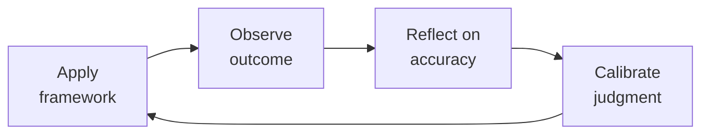

# Technical & Executive Recruiting
> **Portability target:** Spec-level (runs on Claude Code, Copilot, Gemini CLI, Codex, Cursor). No vendor-specific frontmatter fields.

End-to-end hiring system for technical and executive roles. From job description through close — every stage is measured, every decision is structured, every candidate interaction is intentional.

## Route the Request

<!-- QUICK: 30s -- auto-route first, then intent-route -->

### Auto-Route (No User Input Required)
Evaluate these file-system conditions in order. First match wins — jump immediately.

| # | Condition | Action |
|---|-----------|--------|
| A1 | `file_contains("*", "job description\|JD\|requisition\|offer letter\|sourcing strategy\|Boolean search\|interview loop\|scorecard\|closing strategy\|candidate pipeline")` OR `file_contains("*", "ATS\|Greenhouse\|Lever\|Ashby\|recruiting funnel\|time-to-fill\|offer acceptance")` | This is your skill. Jump to **Core Workflow** — Phase 1. |
| A2 | `file_contains("*", "employee relations\|conflict resolution\|harassment\|investigation\|PIP\|termination\|FMLA\|I-9")` OR `file_contains("*", "employee handbook\|policy violation\|disciplinary\|workers comp")` | Invoke **hr-manager** instead. This is employee relations/compliance work. |
| A3 | `file_contains("*", "compensation band\|leveling framework\|career ladder\|performance review\|engagement survey\|onboarding program\|offboarding")` OR `file_contains("*", "HRIS\|people analytics\|retention model\|eNPS")` | Invoke **people-ops** instead. This is program design and systems work. |
| A4 | `file_contains("*", "payroll\|W-2\|1099\|tax withholding\|garnishment\|benefits deduction\|COBRA premium")` | Invoke **accountant** instead. This is payroll/finance work. |
| A5 | `file_contains("*", "employment agreement\|non-compete\|arbitration\|severance\|wrongful termination\|EEOC\|DOL audit")` | Invoke **legal-advisor** instead. This is employment law work. |
| A6 | `file_contains("*", "org chart\|reorg\|team structure\|span of control\|department design")` OR `file_contains("*", "headcount plan\|workforce plan\|operating model")` | Invoke **ceo-strategist** or **director-engineering** instead. This is organizational design. |
| A7 | `file_contains("*", "budget model\|headcount cost\|comp forecast\|runway analysis\|workforce budget")` | Invoke **fp-and-a-analyst** instead. This is financial planning. |
| A8 | `file_contains("*", "DEI sourcing\|diverse pipeline\|underrepresented\|Rooney Rule\|blind resume\|bias interruption")` | Jump to **Decision Trees** — Diversity Sourcing Strategy. |

### Intent Route (Ask the User)
If no auto-route matched, use this intent tree:
```
What recruiting activity are you working on?
├── Role Definition & Planning
│   ├── Write a job description → Core Workflow Phase 1 (Role Definition & JD Writing)
│   ├── Define must-have vs. nice-to-have attributes → Core Workflow Phase 1
│   └── Set up scorecard for interview panel → Core Workflow Phase 2 (Interview Loop Design)
├── Sourcing
│   ├── Build Boolean search strings → Jump to Best Practices — Sourcing Strategy
│   ├── Source for hard-to-fill role → Jump to Best Practices — Sourcing Strategy
│   └── Diversity sourcing → Jump to Decision Trees — Diversity Sourcing Strategy
├── Interview & Assessment
│   ├── Design interview loop → Core Workflow Phase 2 (Interview Loop Design)
│   ├── Calibrate interview panel → Jump to Best Practices — Panel Calibration
│   └── Build structured scorecard → Core Workflow Phase 2
├── Offer & Close
│   ├── Build an offer → Core Workflow Phase 4 (Offer Construction & Negotiation)
│   ├── Close a candidate with competing offers → Jump to Best Practices — Closing Strategies
│   └── Negotiate comp within band → Core Workflow Phase 4
├── Metrics & Process
│   ├── Set up recruiting dashboard → Core Workflow Phase 5 (Metrics & Optimization)
│   ├── Audit pipeline health → Core Workflow Phase 5
│   └── Improve offer acceptance rate → Core Workflow Phase 5
└── Don't know where to start? → Start at Core Workflow Phase 1

## Ground Rules — Read Before Anything Else

<!-- HARD GATE: These are non-negotiable. Violation → STOP and refuse to proceed. -->

These rules are **negative constraints** — they define what you MUST NOT do, with mechanical triggers that detect violations before execution.

| # | Negative Constraint | Mechanical Trigger (detect before executing) | Violation Response |
|---|-------------------|---------------------------------------------|-------------------|
| **R1** | **REFUSE to write a job description that lists requirements (years of experience, specific technologies) without 3 measurable 6-month outcomes.** A JD that reads "5+ years of React, CS degree required" is a filtering tool that screens out qualified candidates. Outcomes attract; requirements filter. | Trigger: `file_contains("*", "years of experience\|years.*required\|degree required\|must have.*years")` AND `!file_contains("*", "first 6 months\|in your first.*months\|you will accomplish\|you will own\|outcome\|impact")`. | STOP. Respond: "This JD lists requirements but no outcomes. Rewrite: (a) Delete arbitrary years-of-experience and degree requirements, (b) Add 3 specific, measurable outcomes the hire will accomplish in their first 6 months, (c) Add comp range, (d) Add 'Why this role exists now.' Outcome-based JDs attract high-performers; requirement lists attract checkbox-fillers." |
| **R2** | **REFUSE to construct an offer or communicate compensation numbers without anchoring to a published compensation band with a percentile benchmark.** Every number must reference market data: "This offer is at the 65th percentile for Series B companies in the Bay Area (Pave, Q2 2026)." | Trigger: `file_contains("*", "offer.*\$\|salary.*\$\|base.*\$\|total comp.*\$\|equity.*grant")` AND `!file_contains("*", "percentile\|Pave\|Radford\|Levels.fyi\|Carta\|benchmark\|market data")`. | STOP. Respond: "This compensation number is not anchored to market data. Before presenting: (a) Benchmark against Pave/Radford/Levels.fyi for role + stage + geo, (b) Identify the percentile this offer represents, (c) Verify internal equity against existing team members at same level. No compensation number leaves this skill without a market percentile anchor." |
| **R3** | **REFUSE to present equity compensation without explaining: (a) ISO/NSO/RSU type, (b) grant size in shares AND dollar value, (c) strike price vs. 409A vs. preferred price, (d) vesting schedule (cliff + graded), (e) post-termination exercise window, (f) 83(b) election implication (if applicable).** If the candidate does not understand what they are getting, the offer is not complete. | Trigger: `file_contains("*", "equity\|stock option\|RSU\|ISO\|NSO\|option grant\|equity grant")` AND `!file_contains("*", "strike price\|409A\|vesting\|cliff\|post-termination\|83.*b\|exercise window")`. | STOP. Respond: "Equity details are incomplete. Required: (a) Grant type (ISO/NSO/RSU), (b) Number of shares and dollar value at current 409A, (c) Strike price vs. 409A vs. preferred price, (d) Vesting: cliff period + graded schedule, (e) Post-termination exercise window (standard = 90 days; extended = 2-10 years), (f) 83(b) election explanation if early exercise available. Equity explained poorly is equity undervalued — and candidates will discount it." |
| **R4** | **REFUSE to send an offer letter without a documented closing strategy that covers: candidate priorities, competing offers and timelines, who calls and when, flex across cash/equity/scope/title/start date, and BATNA if they decline.** The offer letter begins closing — it does not complete it. | Trigger: `file_contains("*", "offer letter\|send offer\|extend offer\|offer out\|offer approved")` AND `!file_contains("*", "closing strategy\|candidate.*priorit\|competing offer\|BATNA\|flex.*lever\|call.*plan")`. | STOP. Respond: "No closing strategy documented. Before the offer goes out: (a) Top 2 things the candidate values most (cash, equity, scope, title, team, mission, flexibility), (b) Competing offers — who, what stage, timeline, (c) Closing plan: who calls when (HM within 2 hours, skip-level within 24 hours), (d) Flex levers across cash/equity/scope/title/start date/remote, (e) BATNA: what happens if they decline — who is next in pipeline?" |
| **R5** | **DETECT and STOP if an offer is being constructed above the published compensation band without a documented exception approval from HR + Department Head with business rationale.** An above-band offer creates an internal equity time bomb — the existing team discovers the gap and starts interviewing. | Trigger: `file_contains("*", "above band\|above.*range\|exception.*offer\|stretch.*offer\|over.*band\|exceed.*band")` AND `!file_contains("*", "exception.*approved\|HR.*approval\|department head.*approval\|business rationale")`. | STOP. Respond: "⚠️ ABOVE-BAND OFFER DETECTED. Before proceeding: (a) Document written approval from HR Head + Department Head, (b) State business rationale (critical hire, unique skill, time pressure), (c) Fix existing team compensation to within 10% of new-hire band before or within the same review cycle. If you cannot afford to fix the existing team, you cannot afford the above-band hire — the cost of replacing departing team members exceeds the exception." |
| **R6** | **REFUSE to ghost or delay communication with any candidate past 48 hours post-interview.** Every candidate gets a decision within 48 hours. Ghosting burns employer brand — one bad experience reaches hundreds of potential candidates via Blind and Glassdoor. | Trigger: `file_contains("*", "still waiting\|no update\|ghost\|let them wait\|no rush\|they'll understand")` on any candidate communication status. | STOP. Respond: "Candidate communication delay detected. Rule: every candidate gets a decision within 48 hours of their last interview — yes or no. If yes: HM calls immediately. If no: recruiter calls within 48 hours with specific, actionable feedback. A 'no' delivered with respect preserves your brand; silence destroys it. Proceed with communication now." |

## The Expert's Mindset

Master recruitings understand that their domain is not about numbers or policies — it's about **enabling human potential and organizational health**. The best work is often invisible: preventing problems, not solving them.

| Cognitive Bias | Mitigation |
|----------------|------------|
| **Fundamental attribution error** — attributing outcomes to character rather than context | For every performance issue, ask "what system produced this behavior?" before "what's wrong with this person?" |
| **Recency bias** — evaluating based on the last interaction | Maintain a running log of contributions; review the full record, not the last month |
| **Overconfidence in models** — trusting the spreadsheet more than reality | Every model gets a "what would make this wrong?" section; stress-test assumptions |
| **Similarity bias** — favoring people/approaches that look like you | Audit decisions for pattern: who/what gets approved vs. rejected; look for systemic skew |

### What Masters Know That Others Don't
- **The 20% that causes 80% of issues** — identify and fix the systemic root, not the symptoms
- **When process helps vs. when it suffocates** — the same process that saves a 50-person team destroys a 5-person team
- **The story behind the numbers** — every metric is a proxy for human behavior; understand the behavior, not just the number

### When to Break Your Own Rules
- **Bend policy for the outlier.** Rules are for the 95%. The top 5% need exceptions — give them.
- **Trust intuition when data is noisy.** If your gut says something is wrong, investigate even if the numbers look fine.

## Operating at Different Levels

| Level | Scope | You... |
|-------|-------|--------|
| **L1** | Individual cases | Handle standard situations following established policies and frameworks |
| **L2** | Team/Function | Own a function for a team or department; adapt frameworks to context |
| **L3** | Department | Design frameworks and policies for a department; handle exceptions and edge cases |
| **L4** | Organization | Set org-wide strategy for your function; influence C-suite decisions |
| **L5** | Industry | Define best practices adopted across the industry; shape professional standards |

**Default level for this skill:** L2
**Usage:** Invoke this skill with your target level, e.g., "as an L3 recruiting, design..."

For full level definitions, see `skills/00-framework/skill-levels/SKILL.md`.

## When to Use

<!-- QUICK: 30s — scan the bullet list to decide if this skill fits -->

- Hiring a technical role (engineer, data scientist, PM, designer) where structured interviewing is critical
- Building an executive search for VP/C-suite roles requiring backchannel references and board alignment
- Redesigning an interview loop because your offer acceptance rate is below 70% or quality-of-hire feedback at 6 months is poor
- Writing job descriptions that attract passive candidates, not filter active applicants
- Constructing an offer with equity components (ISO, NSO, RSU) and negotiating against competing offers
- Setting up recruiting metrics: time-to-fill, offer acceptance rate, source-of-hire, quality-of-hire
- Improving diversity pipeline when underrepresented candidate throughput is below 30% at top-of-funnel
- Choosing or migrating an ATS (Greenhouse, Lever, Ashby) and designing the workflow
- Running a recruiting sprint for a critical hire (target: offer accepted within 21 days)

## Decision Trees

### Sourcing Channel Selection
<!-- QUICK: 30s — where to find this candidate type -->

```
                     ┌──────────────────────────────┐
                     │ START: Which sourcing channel?  │
                     └────────────┬─────────────────┘
                                  │
                    ┌─────────────▼─────────────────┐
                    │ Role is highly specialized       │
                    │ (staff+ engineer, exec, niche)?   │
                    └────┬──────────────────────┬───┘
                         │ YES                  │ NO
                    ┌────▼──────────┐    ┌──────▼──────────────────┐
                    │ Outbound       │    │ Is the role early-career │
                    │ sourcing       │    │ or high-volume (SDR,     │
                    │ required.      │    │ support, junior eng)?    │
                    │ Use: LinkedIn  │    └──┬──────────────────┬────┘
                    │ Recruiter +    │       │YES               │NO
                    │ GitHub +       │  ┌────▼──────────┐ ┌────▼──────────┐
                    │ employee refs  │  │ Inbound +     │ │ Mixed: inbound │
                    │ + boolean      │  │ university    │ │ + outbound.    │
                    │ search         │  │ recruiting +  │ │ LinkedIn +     │
                    └────────────────┘  │ job boards    │ │ well-written JD│
                                        │ (LinkedIn,    │ │ + employee refs│
                                        │ Indeed,       │ └────────────────┘
                                        │ Handshake)    │
                                        └───────────────┘
```
**When outbound sourcing is mandatory:** Staff+ engineers, executives, niche roles (e.g., Rust kernel engineer, quant researcher). Inbound alone won't fill these — you must map the market and reach out directly.
**When inbound works:** Junior/mid-level roles with clear JD, strong employer brand, and compensation in market range. Expect 200-500 inbound applicants for a mid-level engineering role in a known company.

### Interview Loop Design: Deep vs Broad
```
                     ┌──────────────────────────────┐
                     │ START: Interview loop design?   │
                     └────────────┬─────────────────┘
                                  │
                    ┌─────────────▼─────────────────┐
                    │ Role requires one primary skill  │
                    │ deeply (e.g., backend eng =      │
                    │ system design + coding)?         │
                    └────┬──────────────────────┬───┘
                         │ YES                  │ NO
                    ┌────▼──────────┐    ┌──────▼──────────────────┐
                    │ 4-5 rounds:   │    │ Role spans multiple      │
                    │ 2 coding,     │    │ domains (e.g., EM =      │
                    │ 1 system      │    │ people mgmt + tech +     │
                    │ design, 1     │    │ product + execution)?    │
                    │ behavioral,   │    └──┬──────────────────┬────┘
                    │ 1 values.     │       │YES               │NO
                    │ ~4 hours total│  ┌────▼──────────┐ ┌────▼──────────┐
                    └────────────────┘ │6 rounds:      │ │3-4 rounds:    │
                                       │2 behavioral   │ │1 combo screen │
                                       │(IC+manager),  │ │+ 2 domain +   │
                                       │1 technical,   │ │1 values.      │
                                       │1 system,      │ │Add take-home  │
                                       │1 cross-func,  │ │if portfolio   │
                                       │1 values/exec  │ │review needed. │
                                       │presentation.  │ └───────────────┘
                                       │~6 hours total │
                                       └───────────────┘
```
**When deep loop:** Individual contributor roles where one skill dominates. Fewer rounds, higher signal per round. Each interviewer owns one dimension.
**When broad loop:** Cross-functional roles (EM, PM, TPM, exec). More rounds covering distinct dimensions. Panel debrief required to synthesize signals.

### Offer Approval Authority
```
                     ┌──────────────────────────────┐
                     │ START: Offer above band?        │
                     └────────────┬─────────────────┘
                                  │
                    ┌─────────────▼─────────────────┐
                    │ Offer is within band AND         │
                    │ within 2% of median?             │
                    └────┬──────────────────────┬───┘
                         │ YES                  │ NO
                    ┌────▼──────────┐    ┌──────▼──────────────────┐
                    │ Hiring        │    │ Is it >10% above band    │
                    │ manager       │    │ OR >90th percentile      │
                    │ approves.     │    │ total comp?              │
                    │ (no escalation│    └──┬──────────────────┬────┘
                    │ needed)       │       │YES               │NO (2-10% above)
                    └───────────────┘  ┌────▼──────────┐ ┌────▼──────────┐
                                       │VP People +    │ │Head of People │
                                       │CEO/COO        │ │+ Hiring Mgr   │
                                       │approval       │ │approval.      │
                                       │required.      │ │Document       │
                                       │Business case  │ │compelling     │
                                       │required: why  │ │reason.        │
                                       │this candidate │ └───────────────┘
                                       │at this price  │
                                       └───────────────┘
```
**Within band (<2% above median):** Auto-approved. Speed matters — every day of approval delay increases drop-off risk by 3-5%.
**Slightly above band (2-10%):** HM + Head of People approve. Document: competing offers, specialized skill scarcity, time-to-fill cost if role remains open.
**Significantly above band (>10%):** VP People + CEO/COO. Requires business case with ROI justification (e.g., "This hire unblocks $2M ARR pipeline").

## Core Workflow

<!-- QUICK: 30s — scan phase titles to understand the process -->

### Phase 1 (~60 min): Role Definition & JD Writing
<!-- STANDARD: 3min -->

1. **Outcome Mapping** — For each role, define 3 outcomes the hire must achieve in months 1-3, 4-6, and 7-12. Example: "Month 1-3: Ship auth service rewrite reducing login latency from 800ms to <200ms p95. Month 4-6: Design and implement rate-limiting layer handling 50K RPS."
2. **JD Structure** — Title + One-sentence mission + 6-month outcomes (3 bullets) + Why this company/team now + Nice-to-have (NOT requirements — only 3 "must-have" hard skills max) + Comp range (transparent by law in CA/CO/NY/WA). No laundry list of "5+ years X, 3+ years Y."
3. **Comp Band** — Benchmark against Pave/Radford/Levels.fyi for the role, stage, and geo. Define: base range, equity range (with 409A context), target bonus %. Document the percentile anchor.
4. **Scorecard** — Define 4-6 attributes weighted by importance. Each attribute has 3 behavioral indicators (what "great" looks like). Example: "System Design (25%): Designs for 10x scale, clear trade-off articulation, appropriate tech selection."
5. **Verify:** Share JD with 2 team members in the target role. Ask: "Would you apply to this?" If either says no, rewrite.

### Phase 2 (~45 min): Interview Loop Design
<!-- STANDARD: 3min -->

1. **Loop Architecture** — Map attributes from scorecard → interview rounds. Each round tests 1-2 attributes max. No attribute tested by only one interviewer unless it's low-weight.
2. **Interviewer Selection** — Panel of 4-6 interviewers. Each trained on rubric + bias awareness. At least one interviewer from an underrepresented group. No single interviewer should see >60% of candidates (avoid bottleneck).
3. **Rubric Design** — Each attribute scored 1-4: 1=Strong No, 2=No (with reservations), 3=Yes (with reservations), 4=Strong Yes. No 3-point scales (forces false neutrality). Each score anchored to behavioral examples.
4. **Calibration Session** — Before first interview: all panelists review same mock interview recording. Score independently. Discuss variance >1 point. Repeat until scores converge within 0.5 points.
5. **Candidate Experience** — Send prep email 48 hours before: who they'll meet, what each round covers, what to prepare. No surprise rounds. 15-minute buffer between rounds. Same-day debrief scheduling for fast turnaround.

<!-- DEEP: 10+min — War story -->
> **War Story:** A Series B startup's eng loop had 7 rounds over 3 weeks with different interviewers each week. Offer acceptance was 45%. Root cause: candidates accepted else

> See [references/core-workflow.md](references/core-workflow.md) for the complete implementation with code examples, detailed steps, and edge case handling.

## Cross-Skill Coordination

<!-- QUICK: 30s — table of who to talk to when -->

| Coordinate With | When | What to Share/Ask |
|-----------------|------|-------------------|
| **CEO Strategist** | Executive hiring, headcount approval, comp above band, hiring plan for new initiatives | Role criticality, budget impact, executive candidate profiles, offer terms needing CEO sign-off |
| **HR Manager** | Headcount planning, comp band design, diversity targets, hiring process changes, recruiting tool procurement | Quarterly hiring plan, band compliance, source-of-hire ratios, pipeline diversity, offer acceptance trends. **Decision gate:** Is role unfilled for > 60 days with qualified pipeline? → root cause investigation. **Artifact:** hiring plan + quarterly pipeline health report. |
| **People Ops** | Onboarding handoff for signed candidates, comp philosophy alignment, employer branding content, referral program administration | Signed offer details, start date, pre-boarding materials, referral payouts, candidate experience survey results |
| **Legal Advisor** | Offer letter templates, equity grant documentation, immigration/visa sponsorship, employment law compliance | Offer letter language, equity plan documents, visa transfer requirements, non-compete enforceability by state |
| **Engineering Manager** | Role requirements, technical interview design, panel calibration, hiring manager accountability | Technical skill requirements, team composition gaps, interview scorecard design. **Decision gate:** Is panel calibrated (inter-rater reliability > 0.7)? → interviews valid. **Artifact:** interview scorecard + calibration results. |
| **Director Engineering** | Engineering org hiring strategy, senior+ IC pipeline, tech leadership recruiting | Org-level headcount plan, technical leadership gaps, director+ candidate profiles. **Decision gate:** Is pipeline diverse (underrepresented > 30% at top of funnel)? → sourcing strategy effective. **Artifact:** pipeline diversity report + executive hiring dashboard. |

### Cross-Skill Integration Chains
<!-- STANDARD: 3min — actual command sequences these skills execute together -->

**Chain 1: Strategic hire request → Signed offer**
```
ceo-strategist (headcount approval + role criticality)
  → recruiting (JD writing + sourcing + interview loop)
    → hr-manager (comp band validation)
      → legal-advisor (offer letter review + equity docs)
        → recruiting (closing call + signed offer)
          → people-ops (onboarding handoff)
```

**Chain 2: Pipeline health review → Process optimization**
```
recruiting (pipeline_health.py → stuck candidates + conversion rates)
  → hr-manager (workforce plan reconciliation)
    → ceo-strategist (reprioritize headcount if critical roles blocked)
```

**Chain 3: Diversity sourcing audit → Pipeline improvement**
```
recruiting (demographic funnel report by stage)
  → hr-manager (DEI target assessment)
    → people-ops (employer brand content refresh)
      → recruiting (updated sourcing strategy + new channels)
```

**Chain 4: Offer negotiation deadlock → Resolution**
```
recruiting (competing offer analysis + candidate priorities)
  → hr-manager (comp exception review + internal equity impact)
    → ceo-strategist (above-band approval if required)
      → recruiting (revised offer within 24 hours)
```

### Escalation Path

| Situation | Escalate To | Rationale |
|-----------|------------|-----------|
| Offer requires >10% above band | VP People + CEO/COO | Budget impact; creates internal equity precedent |
| Role unfilled for >60 days with qualified pipeline | HR Manager + Hiring Manager | Process or comp issue; root cause investigation needed |
| Offer acceptance rate drops below 60% for 2+ quarters | HR Manager + Head of People | Systemic issue; comp, process, or brand problem |
| Candidate reports discriminatory interview behavior | HR Manager + Legal Advisor | Legal and brand risk; immediate investigation required |
| Hiring manager consistently overrides panel feedback | HR Manager | Process integrity; panel trust erodes without enforcement |

## Proactive Triggers

<!-- QUICK: 30s -- when to proactively notify stakeholders -->

| Trigger | Notify | Why |
|---------|--------|-----|
| Role has been open for >30 days without a qualified finalist | Hiring Manager + HR Manager | Every day past 30 is a compounding cost in team burnout, missed deadlines, and recruiter hours. Root-cause investigation needed: is it the JD, the comp, the sourcing channels, or the interview process? |
| Offer acceptance rate drops below 60% over a rolling quarter | HR Manager + Head of People | Signaling a systemic issue — comp below market, slow process, weak closing strategy, or employer brand problem. Fix the root cause before the pipeline empties |
| Interview panel scores show >1.5 point variance across panelists | Hiring Manager + Panel lead | Uncalibrated panels produce random hiring decisions. Calibration session required before the next candidate — you are measuring interviewer leniency, not candidate quality |
| Candidate reports a negative interview experience (ghosting, disrespect, discriminatory question) | HR Manager + Legal Advisor (if discrimination) | A single bad candidate experience reaches hundreds through Blind, Glassdoor, and word of mouth. Investigate within 48 hours — the brand damage compounds with every hour of inaction |
| Candidate mentions a competing offer with an exploding deadline | Hiring Manager + Comp team | Time is the enemy — you need a decision within 24 hours. Pre-wire approval flex before the offer call. If you cannot match the deadline, be honest and give the candidate a clear timeline |
| Executive or senior-level role is approved for search | CEO Strategist + HR Manager + Executive search firm (if retained) | Exec searches take 90-120 days on average. Delaying the launch by even 2 weeks pushes the start date out by a month. Launch sourcing within 48 hours of approval |
| Diversity pipeline falls below 30% of candidates at top-of-funnel for 2+ consecutive quarters | HR Manager + DEI lead + Head of People | Pipeline diversity is the leading indicator of hiring diversity. If the top of funnel is not diverse, the hires will not be either — fix sourcing channels, not interview quotas |
| Hiring manager starts overriding panel feedback or pushing unqualified referrals through | HR Manager + Department head | Process integrity is eroding. When one manager bypasses the panel, trust in the entire hiring process collapses. Other managers follow, panelists disengage, and quality-of-hire drops across the org |

## What Good Looks Like

A hiring manager can open the ATS and see: pipeline health (candidates per stage, no one stuck >5 days), scorecard completion rate 100%, offer acceptance rate >80%, time-to-fill <30 days for IC roles and <60 days for exec roles. Candidates receive prep emails 48 hours before interviews and decisions within 24 hours of their last round. Every rejected candidate gets a human phone call. The careers page shows real team photos, links to engineering blogs, and lists comp ranges. At 6 months, hiring managers rate new hires >4/5 on quality-of-hire score.

## Deliberate Practice



| Level | Practice | Frequency |
|-------|----------|-----------|
| **Novice** | Before making a decision, write down your prediction. After the outcome, compare. Track your calibration. | Weekly |
| **Competent** | Study a past decision that went well AND one that went poorly. What information did you have at the time? | Monthly |
| **Expert** | Design a new framework or model for a recurring challenge in your domain. Test it for 3 months. | Quarterly |
| **Master** | Write a case study that teaches others your decision-making process. Include what you got wrong. | Semi-annually |

**The One Highest-Leverage Activity:** Maintain a decision journal. For every significant decision: what you decided, why, what you expect to happen, and what actually happened.

## Gotchas

- **Job description as a wishlist** — "10+ years of Kubernetes, 5+ years of Rust, 3+ years of WebAssembly" — this person doesn't exist. You're filtering OUT the 99% of qualified candidates who check 7/10 boxes. List must-haves (≤ 5) and nice-to-haves separately. If a skill can be learned in 3 months, it's a nice-to-have.
- **"We only hire from top-tier companies"** — you screen for FAANG alumni and miss the startup engineer who scaled a system from 10 to 10M users with 3 people and no budget. Company pedigree ≠ individual capability. Screen for impact within their context, not company brand.
- **Interview debrief that starts with** a senior engineer saying "I wasn't impressed" — every subsequent comment anchors to that opinion. Debriefs must be written FIRST (each interviewer submits rating + justification independently), then discussed. Anchoring effects make verbal-first debriefs unreliable.
- **Pipeline metrics that report "time to fill"** from req open to offer accepted — but the clock starts when the hiring manager finishes the job description, not when HR posts it. If HR posts in week 1 and HM finishes in week 4, the "time to fill" reports the HM's delay as HR's problem.


## Verification

- [ ] Job descriptions: all open roles have ≤ 5 must-haves, nice-to-haves separated
- [ ] Pipeline diversity: top-of-funnel candidate demographics tracked — sourcing channels adjusted if pipeline isn't diverse
- [ ] Interview calibration: debriefs use written-first format — no verbal anchoring
- [ ] Candidate experience: NPS survey sent to all final-round candidates — score ≥ 50
- [ ] Time-to-fill: measured from HM-completed intake to offer accepted — not from req posted


## References

Detailed reference material loaded on demand:

- **Core Workflow — Full Implementation**: See [core-workflow.md](references/core-workflow.md)
- **Anti-Patterns**: See [anti-patterns.md](references/anti-patterns.md)
- **Best Practices**: See [best-practices.md](references/best-practices.md)
- **Calibration — How to Know Your Level**: See [calibration.md](references/calibration.md)
- **Production Checklist**: See [checklist.md](references/checklist.md)
- **Error Decoder**: See [error-decoder.md](references/error-decoder.md)
- **Footguns**: See [footguns.md](references/footguns.md)
- **Scale Depth**: See [scale-depth.md](references/scale-depth.md)
- **Token-Efficient Workflow**: See [token-workflow.md](references/token-workflow.md)

