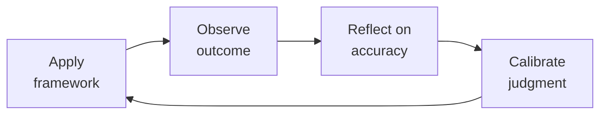

# Technical & Executive Recruiting

End-to-end hiring system for technical and executive roles. From job description through close — every stage is measured, every decision is structured, every candidate interaction is intentional.

## Route the Request
<!-- QUICK: 30s — pick your path, skip the rest -->

What are you trying to do?
├── Write a job description → Start at "Phase 1: Role Definition & JD Writing"
├── Source candidates for a hard-to-fill role → Jump to "Sourcing Strategy & Boolean Search"
├── Design a structured interview loop → Go to "Phase 2: Interview Loop Design"
├── Build an offer / negotiate comp → Jump to "Phase 4: Offer Construction & Negotiation"
├── Close a candidate who has competing offers → Go to "Closing Strategies" under Best Practices
├── Set up recruiting metrics/dashboard → Jump to "Phase 5: Metrics & Optimization"
├── Fix diversity pipeline → Go to "Diversity Sourcing" under Best Practices
├── Need headcount approval / workforce plan → Invoke `hr-manager` skill
├── Need engineering team role requirements → Invoke `engineering-manager` or `director-engineering` skill
├── Need onboarding after offer acceptance → Invoke `people-ops` skill
└── Don't know where to start? → Start at "Phase 1: Role Definition & JD Writing"

**Do not read the entire skill.** Follow the route above and read only the sections it points to.

## Ground Rules — Read Before Anything Else

These rules apply to *every* response this skill produces.

- **Never write a JD without outcomes.** A JD that lists "5+ years of React" is a filtering tool, not an attraction tool. Describe what the person will accomplish in their first 6 months. "You'll own the migration from REST to GraphQL, reducing API response times from 400ms to <100ms p95" — that's a hiring magnet.
- **Never make an offer without a band.** Every offer must be benchmarked against market data (Pave/Radford/OptionImpact for equity, Levels.fyi/Carta for cash). No number leaves this skill without a percentile anchor: "This offer is at 65th percentile for Series B companies in the Bay Area."
- **Never present equity without explaining it.** ISO/NSO/RSU, strike price vs 409A vs preferred price, cliff vs graded vesting, early exercise + 83(b), post-termination exercise window. If the candidate doesn't understand what they're getting, the offer isn't complete.
- **Never skip the closing plan.** The offer letter is the *beginning* of closing, not the end. Every candidate with competing offers needs a written closing strategy before the offer goes out.
- **Admit what you don't know.** If you don't have current market comp data for a geo/role/stage combination, say so and tell the recruiter where to find it.


## The Expert's Mindset

Master recruitings understand that their domain is not about numbers or policies — it's about **enabling human potential and organizational health**. The best work is often invisible: preventing problems, not solving them.

| Cognitive Bias | Mitigation |
|----------------|------------|
| **Fundamental attribution error** — attributing outcomes to character rather than context | For every performance issue, ask "what system produced this behavior?" before "what's wrong with this person?" |
| **Recency bias** — evaluating based on the last interaction | Maintain a running log of contributions; review the full record, not the last month |
| **Overconfidence in models** — trusting the spreadsheet more than reality | Every model gets a "what would make this wrong?" section; stress-test assumptions |
| **Similarity bias** — favoring people/approaches that look like you | Audit decisions for pattern: who/what gets approved vs. rejected; look for systemic skew |

### What Masters Know That Others Don't
- **The 20% that causes 80% of issues** — identify and fix the systemic root, not the symptoms
- **When process helps vs. when it suffocates** — the same process that saves a 50-person team destroys a 5-person team
- **The story behind the numbers** — every metric is a proxy for human behavior; understand the behavior, not just the number

### When to Break Your Own Rules
- **Bend policy for the outlier.** Rules are for the 95%. The top 5% need exceptions — give them.
- **Trust intuition when data is noisy.** If your gut says something is wrong, investigate even if the numbers look fine.
## Operating at Different Levels

| Level | Scope | You... |
|-------|-------|--------|
| **L1** | Individual cases | Handle standard situations following established policies and frameworks |
| **L2** | Team/Function | Own a function for a team or department; adapt frameworks to context |
| **L3** | Department | Design frameworks and policies for a department; handle exceptions and edge cases |
| **L4** | Organization | Set org-wide strategy for your function; influence C-suite decisions |
| **L5** | Industry | Define best practices adopted across the industry; shape professional standards |

**Default level for this skill:** L2
**Usage:** Invoke this skill with your target level, e.g., "as an L3 recruiting, design..."

For full level definitions, see `skills/00-framework/skill-levels/SKILL.md`.

## When to Use
<!-- QUICK: 30s — scan the bullet list to decide if this skill fits -->

- Hiring a technical role (engineer, data scientist, PM, designer) where structured interviewing is critical
- Building an executive search for VP/C-suite roles requiring backchannel references and board alignment
- Redesigning an interview loop because your offer acceptance rate is below 70% or quality-of-hire feedback at 6 months is poor
- Writing job descriptions that attract passive candidates, not filter active applicants
- Constructing an offer with equity components (ISO, NSO, RSU) and negotiating against competing offers
- Setting up recruiting metrics: time-to-fill, offer acceptance rate, source-of-hire, quality-of-hire
- Improving diversity pipeline when underrepresented candidate throughput is below 30% at top-of-funnel
- Choosing or migrating an ATS (Greenhouse, Lever, Ashby) and designing the workflow
- Running a recruiting sprint for a critical hire (target: offer accepted within 21 days)

## Decision Trees

### Sourcing Channel Selection
<!-- QUICK: 30s — where to find this candidate type -->

```
                     ┌──────────────────────────────┐
                     │ START: Which sourcing channel?  │
                     └────────────┬─────────────────┘
                                  │
                    ┌─────────────▼─────────────────┐
                    │ Role is highly specialized       │
                    │ (staff+ engineer, exec, niche)?   │
                    └────┬──────────────────────┬───┘
                         │ YES                  │ NO
                    ┌────▼──────────┐    ┌──────▼──────────────────┐
                    │ Outbound       │    │ Is the role early-career │
                    │ sourcing       │    │ or high-volume (SDR,     │
                    │ required.      │    │ support, junior eng)?    │
                    │ Use: LinkedIn  │    └──┬──────────────────┬────┘
                    │ Recruiter +    │       │YES               │NO
                    │ GitHub +       │  ┌────▼──────────┐ ┌────▼──────────┐
                    │ employee refs  │  │ Inbound +     │ │ Mixed: inbound │
                    │ + boolean      │  │ university    │ │ + outbound.    │
                    │ search         │  │ recruiting +  │ │ LinkedIn +     │
                    └────────────────┘  │ job boards    │ │ well-written JD│
                                        │ (LinkedIn,    │ │ + employee refs│
                                        │ Indeed,       │ └────────────────┘
                                        │ Handshake)    │
                                        └───────────────┘
```
**When outbound sourcing is mandatory:** Staff+ engineers, executives, niche roles (e.g., Rust kernel engineer, quant researcher). Inbound alone won't fill these — you must map the market and reach out directly.
**When inbound works:** Junior/mid-level roles with clear JD, strong employer brand, and compensation in market range. Expect 200-500 inbound applicants for a mid-level engineering role in a known company.

### Interview Loop Design: Deep vs Broad
```
                     ┌──────────────────────────────┐
                     │ START: Interview loop design?   │
                     └────────────┬─────────────────┘
                                  │
                    ┌─────────────▼─────────────────┐
                    │ Role requires one primary skill  │
                    │ deeply (e.g., backend eng =      │
                    │ system design + coding)?         │
                    └────┬──────────────────────┬───┘
                         │ YES                  │ NO
                    ┌────▼──────────┐    ┌──────▼──────────────────┐
                    │ 4-5 rounds:   │    │ Role spans multiple      │
                    │ 2 coding,     │    │ domains (e.g., EM =      │
                    │ 1 system      │    │ people mgmt + tech +     │
                    │ design, 1     │    │ product + execution)?    │
                    │ behavioral,   │    └──┬──────────────────┬────┘
                    │ 1 values.     │       │YES               │NO
                    │ ~4 hours total│  ┌────▼──────────┐ ┌────▼──────────┐
                    └────────────────┘ │6 rounds:      │ │3-4 rounds:    │
                                       │2 behavioral   │ │1 combo screen │
                                       │(IC+manager),  │ │+ 2 domain +   │
                                       │1 technical,   │ │1 values.      │
                                       │1 system,      │ │Add take-home  │
                                       │1 cross-func,  │ │if portfolio   │
                                       │1 values/exec  │ │review needed. │
                                       │presentation.  │ └───────────────┘
                                       │~6 hours total │
                                       └───────────────┘
```
**When deep loop:** Individual contributor roles where one skill dominates. Fewer rounds, higher signal per round. Each interviewer owns one dimension.
**When broad loop:** Cross-functional roles (EM, PM, TPM, exec). More rounds covering distinct dimensions. Panel debrief required to synthesize signals.

### Offer Approval Authority
```
                     ┌──────────────────────────────┐
                     │ START: Offer above band?        │
                     └────────────┬─────────────────┘
                                  │
                    ┌─────────────▼─────────────────┐
                    │ Offer is within band AND         │
                    │ within 2% of median?             │
                    └────┬──────────────────────┬───┘
                         │ YES                  │ NO
                    ┌────▼──────────┐    ┌──────▼──────────────────┐
                    │ Hiring        │    │ Is it >10% above band    │
                    │ manager       │    │ OR >90th percentile      │
                    │ approves.     │    │ total comp?              │
                    │ (no escalation│    └──┬──────────────────┬────┘
                    │ needed)       │       │YES               │NO (2-10% above)
                    └───────────────┘  ┌────▼──────────┐ ┌────▼──────────┐
                                       │VP People +    │ │Head of People │
                                       │CEO/COO        │ │+ Hiring Mgr   │
                                       │approval       │ │approval.      │
                                       │required.      │ │Document       │
                                       │Business case  │ │compelling     │
                                       │required: why  │ │reason.        │
                                       │this candidate │ └───────────────┘
                                       │at this price  │
                                       └───────────────┘
```
**Within band (<2% above median):** Auto-approved. Speed matters — every day of approval delay increases drop-off risk by 3-5%.
**Slightly above band (2-10%):** HM + Head of People approve. Document: competing offers, specialized skill scarcity, time-to-fill cost if role remains open.
**Significantly above band (>10%):** VP People + CEO/COO. Requires business case with ROI justification (e.g., "This hire unblocks $2M ARR pipeline").

## Core Workflow
<!-- QUICK: 30s — scan phase titles to understand the process -->

### Phase 1 (~60 min): Role Definition & JD Writing
<!-- STANDARD: 3min -->

1. **Outcome Mapping** — For each role, define 3 outcomes the hire must achieve in months 1-3, 4-6, and 7-12. Example: "Month 1-3: Ship auth service rewrite reducing login latency from 800ms to <200ms p95. Month 4-6: Design and implement rate-limiting layer handling 50K RPS."
2. **JD Structure** — Title + One-sentence mission + 6-month outcomes (3 bullets) + Why this company/team now + Nice-to-have (NOT requirements — only 3 "must-have" hard skills max) + Comp range (transparent by law in CA/CO/NY/WA). No laundry list of "5+ years X, 3+ years Y."
3. **Comp Band** — Benchmark against Pave/Radford/Levels.fyi for the role, stage, and geo. Define: base range, equity range (with 409A context), target bonus %. Document the percentile anchor.
4. **Scorecard** — Define 4-6 attributes weighted by importance. Each attribute has 3 behavioral indicators (what "great" looks like). Example: "System Design (25%): Designs for 10x scale, clear trade-off articulation, appropriate tech selection."
5. **Verify:** Share JD with 2 team members in the target role. Ask: "Would you apply to this?" If either says no, rewrite.

### Phase 2 (~45 min): Interview Loop Design
<!-- STANDARD: 3min -->

1. **Loop Architecture** — Map attributes from scorecard → interview rounds. Each round tests 1-2 attributes max. No attribute tested by only one interviewer unless it's low-weight.
2. **Interviewer Selection** — Panel of 4-6 interviewers. Each trained on rubric + bias awareness. At least one interviewer from an underrepresented group. No single interviewer should see >60% of candidates (avoid bottleneck).
3. **Rubric Design** — Each attribute scored 1-4: 1=Strong No, 2=No (with reservations), 3=Yes (with reservations), 4=Strong Yes. No 3-point scales (forces false neutrality). Each score anchored to behavioral examples.
4. **Calibration Session** — Before first interview: all panelists review same mock interview recording. Score independently. Discuss variance >1 point. Repeat until scores converge within 0.5 points.
5. **Candidate Experience** — Send prep email 48 hours before: who they'll meet, what each round covers, what to prepare. No surprise rounds. 15-minute buffer between rounds. Same-day debrief scheduling for fast turnaround.

<!-- DEEP: 10+min — War story -->
> **War Story:** A Series B startup's eng loop had 7 rounds over 3 weeks with different interviewers each week. Offer acceptance was 45%. Root cause: candidates accepted elsewhere before loop finished. Fix: Compressed to 4 rounds in 2 days, added a dedicated recruiting coordinator for scheduling, and gave candidates a timeline commitment in the first screen. Acceptance jumped to 78% in 2 months.

### Phase 3 (~90 min): Candidate Sourcing & Outreach
<!-- STANDARD: 3min -->

1. **Sourcing Mix** — For every role, split effort: 40% outbound (LinkedIn Recruiter, GitHub search, Boolean), 30% inbound (JD + careers page), 20% employee referrals (pay $3K-10K depending on role), 10% events/communities.
2. **Boolean Search Strings** — Build reusable search templates by role family:
   - Backend eng: `("staff engineer" OR "principal engineer") AND (Go OR Rust OR Kotlin) AND (Kubernetes OR AWS) AND NOT (intern OR junior OR "new grad") site:linkedin.com/in`
   - ML Engineer: `("machine learning" OR "ML engineer") AND (PyTorch OR TensorFlow) AND (deployed OR production) site:github.com`
3. **GitHub Candidate Search** — Search by: language + stars + recent activity. Contributions to relevant OSS projects. Profile README quality. Avoid: only judging commit count (deep contributors may commit infrequently).
4. **Outreach Message** — Subject: "[Company] — [Role] (saw your work on [specific thing])" Body: One sentence about what they built (proves you researched), one sentence about what they'd build here, comp range, ask for 15 minutes. No "we're revolutionizing..." No "fast-paced environment."

### Phase 4 (~45 min): Offer Construction & Negotiation
<!-- STANDARD: 3min -->

1. **Offer Components** — Base salary ($) + Equity (options/RSUs) + Sign-on (if needed) + Benefits summary + Start date flexibility + Relocation (if applicable).
2. **Equity Deep-Dive** —
   - **ISO** (Incentive Stock Options): Pre-exit startup. Tax-advantaged but $100K exercise limit/year. Candidate must understand AMT implications.
   - **NSO** (Non-Qualified Stock Options): Advisors, contractors, or when ISOs aren't available. Ordinary income tax on spread at exercise.
   - **RSU** (Restricted Stock Units): Public companies or late-stage private. Taxed as income at vest. No purchase needed.
   - **409A valuation:** Strike price for options. If 409A is $2.00 and preferred price is $10.00, the spread per share is $8.00. Candidates care about preferred price relative to strike.
   - **Cliff vs graded:** Standard = 1-year cliff (25% vests), then monthly/quarterly for 3 years. Graded only (no cliff) = trust signal but uncommon.
3. **Offer Letter Structure** — Company letterhead → Role + Start date + Manager → Compensation table (cash + equity + total target) → Equity details (grant size, strike price, vesting schedule, post-termination exercise window) → Benefits summary (1-pager attached) → At-will employment statement → Expiration: 5 business days standard, 3 for competitive situations.
4. **Competing Offer Handling** — Ask: "What matters most to you — cash, equity upside, scope, manager quality, team, mission?" Address top 2. Don't match cash if equity is their driver. Don't break bands for one candidate (creates internal equity problems). Use sign-on bonus as one-time bridge, not base salary inflation.
5. **Closing Call** — Hiring manager calls candidate within 2 hours of offer sent. Says: "We built this offer for you. Here's why each number is what it is. Here's what your first 90 days look like. I'm excited to work with you." No email-only offers.

<!-- DEEP: 10+min — Offer negotiation failure pattern -->
> **Failure Pattern:** Candidate asked for $20K more base. Recruiter said "I'll check" — took 4 days. Candidate accepted competing offer during the wait. Fix: Pre-wire approvals for up to 5% flex above band. Recruiter can say "We can do $10K more now, plus $10K guaranteed bonus at 6 months based on these milestones." Close within 24 hours.

### Phase 5 (~30 min): Recruiting Metrics & Dashboard
<!-- STANDARD: 3min -->

1. **Top-of-Funnel Metrics** — Pipeline volume by source, source-to-screen conversion %, demographic breakdown at each stage.
2. **Throughput Metrics** — Time-to-fill (from JD approval to signed offer), time-in-stage (each stage duration), interviewer utilization (no one doing >4 interviews/week).
3. **Quality Metrics** — Offer acceptance rate (target >80%), quality-of-hire score at 6 months (hiring manager rating 1-5), 12-month retention of new hires, regrettable attrition of hires in first 18 months.
4. **Dashboard Cadence** — Weekly: pipeline health + stuck candidates (>5 days in any stage). Monthly: source effectiveness + acceptance rate trend. Quarterly: quality-of-hire + diversity ratios.

### Phase 6 (~20 min): Employer Branding & Candidate Experience
<!-- STANDARD: 3min -->

1. **Careers Page Audit** — Does it answer: Who will I work with? What will I build? How do you make decisions? What's the comp philosophy? Show team photos (real, not stock). Link to engineering blog posts. Show GitHub org.
2. **Candidate NPS** — Survey every candidate (hired and rejected) post-process: "How likely are you to recommend our interview process to a friend? (0-10)" Target >8 for hires, >6 for final-round rejects.
3. **Rejection Experience** — Rejected after phone screen: personalized email from recruiter. Rejected after onsite: phone call from recruiter + hiring manager within 48 hours of decision. Offer specific feedback if candidate requests it. Rejected candidates are future applicants, referral sources, and customers.

## Best Practices
<!-- DEEP: 10+min -->
<!-- STANDARD: 3min — rules extracted from production recruiting experience -->

1. **Outcomes over requirements in JDs.** "5+ years React" → qualified candidate self-selects out because they have 4. "Ship a real-time collaborative editor handling 200 concurrent editors" → qualified candidate thinks "I've done that" and applies. Outcomes attract builders; requirements attract checkbox-fillers.
2. **Panel calibration before every new role.** Without calibration, one interviewer's "Strong Yes" is another's "No with reservations." Run a mock interview with all panelists. Score independently. Discuss until variance <0.5 points. Re-calibrate every 6 months.
3. **No offer without a closing strategy.** Before the offer letter goes out, write: (a) Top 2 things candidate cares about, (b) What competing offers they have, (c) Who will call them and when, (d) What flex you have (cash, equity, scope, title, start date), (e) Your BATNA if they decline.
4. **Employee referrals are 3x more likely to be hired and stay 2x longer.** Pay referral bonuses within 30 days of start (not after 90 days). Publicly celebrate referrals in team channels. Track referral-source quality-of-hire separately.
5. **Diversity sourcing is pipeline engineering, not charity.** Rooney Rule: at least 2 underrepresented candidates interviewed for every role. Blind resume review: strip names + schools before HM review. Source from: /dev/color, Black Girls Code alumni, Lesbians Who Tech, AfroTech, Tapia Conference job boards, HBCU career centers.
6. **Speed is a competitive advantage.** Top candidates are off the market in 10 days. If your loop takes 3+ weeks, you are hiring from the pool of people rejected by faster-moving companies. Target: 14 days from first contact to offer.
7. **Never ghost a candidate.** If someone took time to interview with you, they get a decision — yes or no — within 48 hours of their last interview. Ghosting burns your employer brand. Rejected candidates talk about their experience on Blind/Glassdoor.
8. **Comp bands must be internally equitable.** Two people in the same role, same level, same location, with equivalent performance should have comp within 10% of each other. If a new hire comes in 25% above existing team members, you have a retention time bomb. Fix existing team comp before making above-band offers.
9. **Post-termination exercise window (PTEW) is a dealbreaker for senior hires.** Standard 90-day PTEW means a 4-year employee has 90 days to buy options they spent 4 years earning. Extended PTEW (1-5 years, or 10 years like Quora/Amplitude) is a competitive advantage. If your default is 90 days, expect senior candidates to negotiate this.
10. **Hiring manager does the closing call, not the recruiter.** Candidates join for the manager and the team. The recruiter builds the bridge; the hiring manager seals the deal.

## Anti-Patterns
<!-- STANDARD: 3min -- patterns that predictably fail -->

| Anti-Pattern | Why It Fails | Correct Approach |
|---|---|---|
| **Writing job descriptions as requirements laundry lists** | "5+ years React, 3+ years TypeScript, CS degree required" filters out qualified candidates who self-select out and attracts checkbox-fillers who match the keywords but not the job. | Write JDs as outcomes: "Ship a real-time collaborative editor handling 200 concurrent editors in the first 6 months." Include comp range, "Why this role exists now," and remove arbitrary years-of-experience requirements. |
| **Sending an offer letter without a documented closing strategy** | If you do not know what the candidate cares about, what competing offers they hold, who will call them and when, what flex you have, and your BATNA — you are hoping the offer closes itself. Hope is not a strategy. | Before the offer goes out, document: (a) top 2 things the candidate values, (b) competing offers and timelines, (c) who calls and when, (d) flex across cash/equity/scope/title/start date, (e) BATNA if they decline. |
| **Ghosting candidates after any interview stage** | Candidates who take time to interview and receive silence in return burn your employer brand. They post on Blind and Glassdoor. Their network hears about it. Ghosting compounds — one bad experience reaches hundreds of potential candidates. | Every candidate gets a decision within 48 hours of their last interview — yes or no. Rejected candidates receive specific, actionable feedback. A "no" delivered with respect preserves your brand; silence destroys it. |
| **Running an interview panel without calibration** | One interviewer's "Strong Yes" is another's "No with reservations." Without calibration, you are not measuring the candidate — you are measuring each interviewer's personal leniency threshold. | Run a mock interview with all panelists before the first real candidate. Score independently. Discuss until inter-rater variance is under 0.5 points. Recalibrate monthly. This is not optional — it is the difference between hiring the best candidate and hiring the best interviewee. |
| **Making above-band offers for "must-have" candidates without fixing existing team comp** | A new hire at 25% above your existing team members in the same role creates a retention time bomb. The moment your existing team discovers the gap (and they will), your best people start interviewing. | Fix existing team compensation to within 10% of the new-hire band before making above-band offers. If budget does not allow it, you cannot afford the above-band hire either — the cost of replacing your existing team will exceed the exception. |
| **Paying referral bonuses 90+ days after the referred hire starts** | Delaying the payout signals that the program is an afterthought. The referring employee loses enthusiasm, stops referring, and tells colleagues the program is not worth the effort. | Pay referral bonuses within 30 days of the referred hire's start date. Publicly celebrate referrals in team channels. Send a quarterly "What we're hiring" digest to every employee. The program is only as active as its payout velocity. |
| **Running interview loops that take 3+ weeks from first contact to offer** | Top candidates are off the market in 10 days. A 3-week loop means you are hiring from the pool of candidates rejected by faster-moving companies. Speed is not a process detail — it is a competitive advantage. | Target 14 days from first contact to offer. Compress the loop: same-day scheduling, panel blocks (not sequential one-offs), debrief within 24 hours of final interview, offer within 24 hours of debrief. Every day of delay loses candidates to faster competitors. |
| **Hiring for skills while ignoring attributes that predict success in your environment** | A candidate aces the technical rounds but cannot handle ambiguity, does not collaborate cross-functionally, or makes decisions in a way that clashes with your culture. They fail within 6 months — skills got them hired, but attributes determine whether they succeed. | Add a values-based behavioral round to every loop. Include scenario questions: "Tell me about a time you had to make a decision with incomplete information," "How do you handle disagreement with a colleague?" Design scorecards for retention, not just screening. |

## Token-Efficient Workflow

```
# Step 1: Generate JD with outcomes
python3 scripts/generate_jd.py --role "Staff Backend Engineer" --outcomes outcomes.yaml --output markdown

# Step 2: Score a candidate against scorecard
python3 scripts/score_candidate.py --candidate-id 42 --scorecard role_scorecard.yaml --output json
# Returns: {"overall":3.7,"attributes":[{"name":"System Design","score":4,"weight":0.25},...]}

# Step 3: Generate offer comp
python3 scripts/build_offer.py --role "Staff Engineer" --level L6 --geo "SF Bay Area" \\
  --percentile 65 --equity-type ISO --stage "Series B" --output json
# Returns: {"base":215000,"equity_grant":"50,000 options","strike_price":3.50,...}

# Step 4: Weekly pipeline health
python3 scripts/pipeline_health.py --ats greenhouse --output json
# Returns: {"open_roles":12,"candidates_in_process":87,"stuck_candidates":5,...}
```

## Cross-Skill Coordination
<!-- QUICK: 30s — table of who to talk to when -->

| Coordinate With | When | What to Share/Ask |
|-----------------|------|-------------------|
| **CEO Strategist** | Executive hiring, headcount approval, comp above band, hiring plan for new initiatives | Role criticality, budget impact, executive candidate profiles, offer terms needing CEO sign-off |
| **HR Manager** | Headcount planning, comp band design, diversity targets, hiring process changes, recruiting tool procurement | Quarterly hiring plan, band compliance, source-of-hire ratios, pipeline diversity, offer acceptance trends. **Decision gate:** Is role unfilled for > 60 days with qualified pipeline? → root cause investigation. **Artifact:** hiring plan + quarterly pipeline health report. |
| **People Ops** | Onboarding handoff for signed candidates, comp philosophy alignment, employer branding content, referral program administration | Signed offer details, start date, pre-boarding materials, referral payouts, candidate experience survey results |
| **Legal Advisor** | Offer letter templates, equity grant documentation, immigration/visa sponsorship, employment law compliance | Offer letter language, equity plan documents, visa transfer requirements, non-compete enforceability by state |
| **Engineering Manager** | Role requirements, technical interview design, panel calibration, hiring manager accountability | Technical skill requirements, team composition gaps, interview scorecard design. **Decision gate:** Is panel calibrated (inter-rater reliability > 0.7)? → interviews valid. **Artifact:** interview scorecard + calibration results. |
| **Director Engineering** | Engineering org hiring strategy, senior+ IC pipeline, tech leadership recruiting | Org-level headcount plan, technical leadership gaps, director+ candidate profiles. **Decision gate:** Is pipeline diverse (underrepresented > 30% at top of funnel)? → sourcing strategy effective. **Artifact:** pipeline diversity report + executive hiring dashboard. |

### Cross-Skill Integration Chains
<!-- STANDARD: 3min — actual command sequences these skills execute together -->

**Chain 1: Strategic hire request → Signed offer**
```
ceo-strategist (headcount approval + role criticality)
  → recruiting (JD writing + sourcing + interview loop)
    → hr-manager (comp band validation)
      → legal-advisor (offer letter review + equity docs)
        → recruiting (closing call + signed offer)
          → people-ops (onboarding handoff)
```

**Chain 2: Pipeline health review → Process optimization**
```
recruiting (pipeline_health.py → stuck candidates + conversion rates)
  → hr-manager (workforce plan reconciliation)
    → ceo-strategist (reprioritize headcount if critical roles blocked)
```

**Chain 3: Diversity sourcing audit → Pipeline improvement**
```
recruiting (demographic funnel report by stage)
  → hr-manager (DEI target assessment)
    → people-ops (employer brand content refresh)
      → recruiting (updated sourcing strategy + new channels)
```

**Chain 4: Offer negotiation deadlock → Resolution**
```
recruiting (competing offer analysis + candidate priorities)
  → hr-manager (comp exception review + internal equity impact)
    → ceo-strategist (above-band approval if required)
      → recruiting (revised offer within 24 hours)
```

### Escalation Path

| Situation | Escalate To | Rationale |
|-----------|------------|-----------|
| Offer requires >10% above band | VP People + CEO/COO | Budget impact; creates internal equity precedent |
| Role unfilled for >60 days with qualified pipeline | HR Manager + Hiring Manager | Process or comp issue; root cause investigation needed |
| Offer acceptance rate drops below 60% for 2+ quarters | HR Manager + Head of People | Systemic issue; comp, process, or brand problem |
| Candidate reports discriminatory interview behavior | HR Manager + Legal Advisor | Legal and brand risk; immediate investigation required |
| Hiring manager consistently overrides panel feedback | HR Manager | Process integrity; panel trust erodes without enforcement |

## Proactive Triggers
<!-- QUICK: 30s -- when to proactively notify stakeholders -->

| Trigger | Notify | Why |
|---------|--------|-----|
| Role has been open for >30 days without a qualified finalist | Hiring Manager + HR Manager | Every day past 30 is a compounding cost in team burnout, missed deadlines, and recruiter hours. Root-cause investigation needed: is it the JD, the comp, the sourcing channels, or the interview process? |
| Offer acceptance rate drops below 60% over a rolling quarter | HR Manager + Head of People | Signaling a systemic issue — comp below market, slow process, weak closing strategy, or employer brand problem. Fix the root cause before the pipeline empties |
| Interview panel scores show >1.5 point variance across panelists | Hiring Manager + Panel lead | Uncalibrated panels produce random hiring decisions. Calibration session required before the next candidate — you are measuring interviewer leniency, not candidate quality |
| Candidate reports a negative interview experience (ghosting, disrespect, discriminatory question) | HR Manager + Legal Advisor (if discrimination) | A single bad candidate experience reaches hundreds through Blind, Glassdoor, and word of mouth. Investigate within 48 hours — the brand damage compounds with every hour of inaction |
| Candidate mentions a competing offer with an exploding deadline | Hiring Manager + Comp team | Time is the enemy — you need a decision within 24 hours. Pre-wire approval flex before the offer call. If you cannot match the deadline, be honest and give the candidate a clear timeline |
| Executive or senior-level role is approved for search | CEO Strategist + HR Manager + Executive search firm (if retained) | Exec searches take 90-120 days on average. Delaying the launch by even 2 weeks pushes the start date out by a month. Launch sourcing within 48 hours of approval |
| Diversity pipeline falls below 30% of candidates at top-of-funnel for 2+ consecutive quarters | HR Manager + DEI lead + Head of People | Pipeline diversity is the leading indicator of hiring diversity. If the top of funnel is not diverse, the hires will not be either — fix sourcing channels, not interview quotas |
| Hiring manager starts overriding panel feedback or pushing unqualified referrals through | HR Manager + Department head | Process integrity is eroding. When one manager bypasses the panel, trust in the entire hiring process collapses. Other managers follow, panelists disengage, and quality-of-hire drops across the org |

## Scale Depth
<!-- DEEP: 10+min -->

### Solo (1-10 employees)
Founder does all recruiting. No ATS — Lever free tier or Google Sheets pipeline. Outbound sourcing via personal network + LinkedIn. Interview loop: 2-3 rounds (founder screen + technical + values). Comp: mostly equity (0.5-2%), cash below market. Close tactic: mission + ownership. **Overkill:** Greenhouse, dedicated recruiter, exec search firm, formal scorecards, comp bands.

### Small (10-50 employees)
First dedicated recruiter (or founder still leading). ATS: Greenhouse or Ashby. Structured loop: 4-5 rounds with rubrics. Comp: 25-50th percentile cash + meaningful equity. One scorecard per role family. Referral program launched. Basic metrics: time-to-fill, source, acceptance rate. **Overkill:** recruiting ops specialist, employer brand agency, 6+ round loops.

### Medium (50-200 employees)
Recruiting team of 2-5 (1 recruiter per 20-30 hires/year). Sourcing function separate from coordination. Full Greenhouse/Lever implementation. Diversity sourcing targets + reporting. Comp bands formalized at 50th-75th percentile. Dedicated exec recruiter for VP+. Candidate NPS tracked. Greenhouse reports automated to hiring managers. **Overkill:** campus recruiting team (unless high-volume), RPO, global mobility function.

### Enterprise (200+ employees)
Recruiting team of 10+. Specialized: university, exec, technical, G&A, international. Greenhouse/Workday + CRM (Gemini/Entelo). Employer brand team. DEI analytics with demographic funnel reporting at every stage. Comp at 75th+ percentile or above. Relocation + immigration function. Candidate experience surveys with quarterly review. Agency management program. **When to scale:** >30 hires/quarter, >2 geographies, or exec roles requiring retained search.

## Error Decoder
<!-- DEEP: 10+min -->

| Symptom | Root Cause | Fix | Lesson |
|---------|------------|-----|--------|
| Offer acceptance rate <60% | Comp below market, slow process, or weak closing strategy | Benchmark comp against Pave/Levels.fyi for stage + geo. Compress loop to <14 days. Pre-wire approval flex. HM calls within 2 hours of offer. | Speed and market comp are the two highest-leverage levers on acceptance — optimize both before the offer goes out. |
| Candidates dropping out after onsite | Long decision time or ghosting | Decide within 24 hours of debrief. If yes, HM calls immediately. If no, recruiter calls within 48 hours with feedback. Never leave candidates in limbo. | Every day of silence after an onsite increases drop-off risk by 3-5% — communicate decisions faster than your competitors. |
| Low-quality inbound applicants | JD lists requirements, not outcomes | Rewrite JD: 3 outcomes for first 6 months. Remove "years of experience" requirements. Add comp range. Add "Why this role exists now" section. | Job descriptions that list requirements filter out great candidates; outcome-based JDs attract them. |
| Interviewers disagree on scores by >1.5 points | No calibration or vague rubric | Run calibration session before first interview. Each score must have 3 behavioral anchors. Recalibrate monthly until variance <0.5 points. | Calibration fixes the interviewers, not the rubric — without it, scores reflect leniency, not candidate quality. |
| New hire fails within 6 months | Hired for skills, not for attributes that predict success in your environment | Audit scorecard: does it include adaptability, collaboration style, and decision-making approach? Add values-based behavioral round. Reference checks with specific scenario questions. | Skills get candidates hired; attributes determine if they succeed — design scorecards for retention, not just screening. |
| Referral program produces few hires | Bonus too low, payout too slow, or no internal promotion | Raise bonus to $3K-10K based on role. Pay within 30 days of start. Feature referral stories in company meetings. Send quarterly "What we're hiring" digest to all employees. | Employee referrals are 3x more effective than any other source — invest in the program as heavily as you would in paid sourcing. |
| Top performer quits unexpectedly | No retention risk signal detected | Implement pulse surveys with eNPS tracking. Flag any employee whose engagement score drops >20 points. Conduct stay interviews (not just exit interviews) — ask "what would make you leave?" before they decide. | Stay interviews catch flight risk before exit interviews can — ask what would make them leave before they decide. |
| Offer rejected at signing stage | Compensation not benchmarked, or process took too long | Benchmark every offer against market data (Radford/Pave). Time-to-offer should be < 5 business days from final interview. Equity offers need a clear narrative: "this refreshes every year, here's the projected value at IPO." | A delayed offer with uncompetitive terms loses to a faster, better-compensated competitor every time — speed and data close candidates. |
| New hire underperforms after 90 days | No structured onboarding with milestones | 0-30-60-90 day plan with weekly check-ins. First week: systems access, team intros, small win. First 30 days: complete a defined project with measurable outcome. If no structure by day 30, the problem is the onboarding, not the hire. | Onboarding structure determines ramp success — a hire without milestones is set up to fail, not to learn. |
| Performance review results surprise the employee | Feedback only given during review cycles | Continuous feedback culture: written feedback within 48 hours of observing behavior. No surprises in formal reviews — every review item should have been discussed at least once before. Surprises in reviews are management failures. | Surprises in formal reviews are pure management failure — every piece of feedback belongs in a conversation within 48 hours of the behavior. |
| Pay equity complaint or lawsuit | Compensation not audited for bias | Run annual pay equity audit by gender, race, and tenure. Adjust salaries to correct disparities — don't wait for a complaint. Publish compensation band ranges internally (transparency reduces bias). | Pay equity is cheaper to maintain proactively than to defend reactively — audit every year, correct before complaints surface. |
| DEI program has no measurable impact | Metrics measured for activity, not outcomes | Track: representation at each level, promotion rates by demographic, retention by demographic, pay equity by demographic. If promotion and retention rates are equal across groups but representation isn't, fix the pipeline. If they're not equal, fix the culture. | Activity metrics without outcome metrics are expensive theater — measure representation, promotion rates, and retention, not just event attendance. |
| HRIS migration takes 3x longer than estimated | Data mapping not done before implementation | Start with a complete data audit before selecting the HRIS. Map every field from source → target. Test migration with a full data set in staging. Plan for 2x your optimistic timeline — HR data is always messier than expected. | HR data is always worse than expected — audit and map everything before touching the migration timeline. |


## Production Checklist
<!-- QUICK: 30s — binary pass/fail items. All must pass. -->

- [ ] **[R1]** Job description written with 3 measurable 6-month outcomes (not requirements checklist)
- [ ] **[R2]** Comp band benchmarked against Pave/Radford/Levels.fyi for role + stage + geo with percentile anchor documented
- [ ] **[R3]** Scorecard defined: 4-6 weighted attributes with 3 behavioral indicators each. Scoring rubric 1-4 with anchors
- [ ] **[R4]** Interview panel of 4-6 trained interviewers, at least one from underrepresented group
- [ ] **[R5]** Panel calibration session completed: all scores within 0.5 points on mock candidate
- [ ] **[R6]** Candidate prep email template includes: schedule, who they'll meet, what each round covers, what to prepare
- [ ] **[R7]** Boolean search strings built and tested for role. GitHub + LinkedIn searches active
- [ ] **[R8]** Employee referral program active with bonus amounts defined and payout within 30 days of start
- [ ] **[R9]** Offer letter template includes: comp table, equity details (grant size, strike price, vesting, PTEW), benefits summary
- [ ] **[R10]** Closing strategy written before any offer goes out: candidate priorities, competing offers, flex levers, BATNA
- [ ] **[R11]** Offer decision communicated within 24 hours of final debrief (yes or no)
- [ ] **[R12]** ATS configured: stages, templates, scorecards, automated candidate communications
- [ ] **[R13]** Recruiting dashboard live: weekly pipeline health + monthly source effectiveness + quarterly quality-of-hire
- [ ] **[R14]** Candidate NPS survey sent to all interviewed candidates; score tracked quarterly
- [ ] **[R15]** Rooney Rule compliance: at least 2 underrepresented candidates interviewed per role before offer

## What Good Looks Like

A hiring manager can open the ATS and see: pipeline health (candidates per stage, no one stuck >5 days), scorecard completion rate 100%, offer acceptance rate >80%, time-to-fill <30 days for IC roles and <60 days for exec roles. Candidates receive prep emails 48 hours before interviews and decisions within 24 hours of their last round. Every rejected candidate gets a human phone call. The careers page shows real team photos, links to engineering blogs, and lists comp ranges. At 6 months, hiring managers rate new hires >4/5 on quality-of-hire score.

## Footguns
<!-- DEEP: 10+min — war stories from technical recruiting -->

| Footgun | What Happened | Root Cause | How to Prevent |
|---------|---------------|------------|----------------|
| Sourced candidates with "5+ years of React and experience with REST APIs" requirement — hired a developer who could build components beautifully but couldn't design a system, shipped 3 P0 incidents in their first 2 months | The job description filtered for years-of-framework, not for engineering judgment. The hired engineer had built React components for 6 years at a large enterprise — but had never designed an API, made a database schema decision, or been on-call. At the startup, their first project was an auth service. The implementation had no rate limiting, stored passwords with a broken hash, and crashed under 50 concurrent users. Three P0 incidents in 60 days. The engineer was on a PIP by month 3 and gone by month 5. Total cost (recruiting, salary, severance, opportunity cost): ~$185K. | The JD was a filtering tool ("must have X years of Y framework"), not an attraction tool that described the actual work. The interview process tested React trivia (lifecycle methods, hooks syntax), not system design or debugging under pressure. Years-of-experience is a proxy for competence, not competence itself. | **Write JDs around outcomes, not credentials, and design interviews to test the outcomes.** Instead of "5+ years of React," write: "You'll own the design and implementation of our customer-facing API layer serving 50K requests/minute. Within 90 days, you'll redesign our auth flow to reduce login failures by 80%." Interview loop must include: (a) a system design exercise (design a URL shortener with 100M writes/day), (b) a debugging session on a broken codebase (production-like code with a real bug), (c) a code review exercise. Zero trivia questions. Score on demonstrated ability, not years claimed. |
| Made an offer at "75th percentile for Series B" — $175K base + 0.25% equity — but the candidate's RSUs at a public company had appreciated 4×, making their unvested equity worth $1.2M; the 4-year total comp gap was $800K and they declined within 2 hours | The recruiter benchmarked cash comp and equity against "Series B Bay Area" and came back with $175K + 0.25% (strike $2.50, preferred $8.00, 4-year value ~$220K at current price). Total 4-year offer: ~$920K. The candidate's current comp at a post-IPO company: $200K base + $800K unvested RSUs (stock had 4×'d since grant) = $1.7M 4-year remaining value. The offer was $780K light — the candidate said "I can't take a 46% pay cut, even for equity upside." The company lost their #1 candidate and had to restart the search (cost: 8 weeks, $35K in sourcing). | The recruiter benchmarked against startup comp without researching the candidate's actual position. Public company RSUs that have appreciated create a golden handcuff effect — the unvested value is the candidate's opportunity cost. If you don't know the candidate's walk-away number, you can't build a competitive offer. | **Ask every candidate in the first recruiter screen: "Walk me through your current compensation — base, bonus, equity, vesting schedule, and any retention grants or upcoming cliffs."** Before making an offer: (a) calculate the candidate's 4-year walk-away value (unvested equity + expected refreshers), (b) build a total comp comparison (cash + equity) with 3 equity scenarios (flat, 2×, 5×), (c) if the gap is >20% in a flat scenario, address it in the offer conversation before the number is on paper. Some candidates will take a comp hit for the right opportunity — but they need to know you understand the tradeoff they're making. |
| Skipped reference checks on a VP of Sales because "we need them to start Monday and references always say positive things anyway" — within 60 days it was clear they'd inflated their quota attainment by 300% at their previous company | The VP of Sales candidate had a stellar track record on paper: "132% quota attainment, built team from 5 to 25 AEs, $8M to $32M ARR in 2 years." The CEO was under board pressure to hire a sales leader and wanted to move fast. Offer extended Thursday, start Monday — no references. By week 6, the VP had hired 4 former colleagues as AEs (all underperformers), the pipeline numbers didn't reconcile to CRM activity, and 2 existing AEs resigned citing "toxic culture." An informal backchannel call to the VP's former company revealed: "132% attainment" was calculated by counting contract value, not bookings; "built team to 25" meant they inherited 22; "$32M ARR" included a $15M acquisition the VP had nothing to do with. | Reference checks were seen as a formality — "everyone coaches their references." But backchannel references (not the 3 names the candidate provides) reveal patterns. The hiring process prioritized speed over verification. No one asked: "Who worked for this person who DIDN'T list them as a reference? What do they say?" | **Backchannel every executive hire before the offer is signed.** Ask the candidate's provided references: "Who else worked closely with [candidate] that we should talk to?" Then find those people on LinkedIn and reach out. Ask: "When [candidate] left, did the team's performance improve, stay the same, or decline? Would you work for them again? What's the thing I should know that you're not comfortable putting in writing?" For VP+ hires, use a reference-checking firm (e.g., A-Check Global, HireRight Executive) that verifies employment dates, titles, and checks for undisclosed terminations. The $3K cost is less than a bad VP hire's first-month salary. |
| Designed a 7-round interview process — average time-to-hire was 63 days, 40% of candidates dropped out after round 4, and 3 of the 7 interviewers gave scores that correlated zero with on-the-job performance ratings at 6 months | The engineering team insisted: "Every hire must be bar-raising." Seven rounds: recruiter screen → technical phone screen → take-home project → system design → coding (2 hours) → behavioral → culture-fit with CEO. Total candidate time: 14+ hours. Average process: 63 days from application to offer. Data at 12 months: (a) 40% of candidates who reached round 4 withdrew — they took offers elsewhere, (b) the take-home project scores had zero correlation with 6-month performance ratings, (c) the "culture-fit" interview rejected 22% of candidates who would have been top-quartile performers based on all other signals. The cost: the company hired 14 engineers when their plan required 24 — they were 10 engineers short because the funnel collapsed at round 4. | The interview process was designed to minimize false positives (bad hires) without measuring false negatives (good candidates lost to drop-off). Each round was added "just to be safe" without evidence it predicted performance. Seven rounds signals to candidates: "we can't make decisions." | **Every interview round must have a validated signal, not just a tradition.** Audit your process: for each round, calculate the correlation between interview score and 6-month performance rating. Kill rounds with r < 0.3. The target process is 4–5 rounds max, 30-day time-to-offer. After every hiring cycle, calculate: (a) offer acceptance rate, (b) drop-off rate by round, (c) correlation of each round's score with 6-month performance. If a round adds time but not signal, it's gone. The best companies (Stripe, Figma) run 4 rounds and hire top 1% talent. |
| Pressured a candidate with an exploding offer — "48 hours or it's gone" — they accepted under duress, started, and resigned in 4 months because they'd been pushed past genuine concerns about team culture and technical debt | The candidate had 3 competing offers. The recruiter used an exploding offer to force a decision: "The CEO wants an answer by Friday EOD or we're moving on." The candidate had outstanding questions about the engineering culture (Glassdoor reviews mentioned "death marches to deadlines") and wanted to talk to 2 more team members. The recruiter said "we can do a 15-minute call with one person tomorrow." The candidate accepted under pressure. Four months in: the Glassdoor reviews were accurate. The codebase had 14% test coverage, on-call was unpaid overtime, and the "fast-paced culture" was a 60-hour/week burnout factory. They resigned and joined one of the competitors whose offer they'd rejected. | The exploding offer is a closing tactic that maximizes short-term acceptance rate at the expense of long-term retention. A candidate who accepts under pressure hasn't resolved their concerns — they've suppressed them. Those concerns don't disappear; they surface at month 3–4 when the honeymoon ends. | **Never use exploding offers.** If a candidate needs more time, they need more time — and the reasons they need more time are the reasons they might leave in 6 months. Instead: "We'd love for you to join us. Take the time you need. Talk to anyone on the team you want. If there are concerns, let's address them now — we want you to accept because it's the right decision, not because of a deadline." Track the correlation between "time-to-accept" and "12-month retention." You'll find that candidates who took 7+ days to decide and joined anyway have HIGHER retention — because they resolved their doubts before joining. |

## Calibration — How to Know Your Level
<!-- STANDARD: 3min — honest self-assessment rubric -->

| You Know You're Stuck at L1 When... | You Know You've Reached L2 When... | You Know You're L3 When... |
|---|---|---|
| You can source from LinkedIn Recruiter and schedule interviews but can't write a Boolean string that surfaces engineers who've built distributed systems — your searches return 800 irrelevant profiles | You hire 8 engineers in a quarter with 85%+ offer acceptance rate, <30-day time-to-fill, and 6-month quality-of-hire ratings >4/5 from hiring managers — every rejected candidate got a human phone call within 48 hours | A founder says "I need a VP of Engineering who can scale us from 15 to 60 engineers through Series B, and I need them in 45 days" — you deliver 3 qualified, backchannel-referenced, compensating candidates in 3 weeks, and 3 years later the hire is still there and the engineering team is at 70 |
| You think a job description is a list of requirements and are surprised when the only applicants are people who meet exactly 2 of 10 bullet points | You write a job description that generates 200+ qualified applicants (not just volume — pipeline quality) because it describes what the person will build and why it matters, not what frameworks they've used | A CEO asks "why are we losing candidates at the offer stage?" — within 48 hours you analyze the last 20 offer declines, identify the pattern (3 competitors are offering 2× equity for the same role), and present a revised compensation framework with market evidence that the board approves in the same week |
| You present offers as a number in an email and are surprised when candidates negotiate — or worse, ghost you | You close a candidate with 3 competing offers including one from a FAANG company — not by offering more money, but by demonstrating you understand their career goals better than the other 3 companies combined | You're the person a Series C company calls when they're 0 for 6 on executive searches — within 30 days you diagnose the systemic issues (comp below market for 3 roles, broken interview process for 2, toxic Glassdoor reviews deterring candidates for 1) and have offer letters out for 4 of the 6 roles |

**The Litmus Test:** Can you look at a job description and tell me within 60 seconds whether it will attract top 10% candidates or filter for mediocrity — and rewrite it so it does the former? If you'd need to "check with the hiring manager on the requirements," you're not L3.

## Deliberate Practice



| Level | Practice | Frequency |
|-------|----------|-----------|
| **Novice** | Before making a decision, write down your prediction. After the outcome, compare. Track your calibration. | Weekly |
| **Competent** | Study a past decision that went well AND one that went poorly. What information did you have at the time? | Monthly |
| **Expert** | Design a new framework or model for a recurring challenge in your domain. Test it for 3 months. | Quarterly |
| **Master** | Write a case study that teaches others your decision-making process. Include what you got wrong. | Semi-annually |

**The One Highest-Leverage Activity:** Maintain a decision journal. For every significant decision: what you decided, why, what you expect to happen, and what actually happened.

## References
<!-- QUICK: 30s — links to deeper reading and files -->

- [Pave — Real-time compensation benchmarking](https://www.pave.com/)
- [Levels.fyi — Tech compensation data](https://www.levels.fyi/)
- [OptionImpact — Equity benchmarking for startups](https://www.optionimpact.com/)
- [Carta — Equity management and 409A valuations](https://carta.com/)
- [Greenhouse — Structured hiring ATS](https://www.greenhouse.com/)
- [Ashby — All-in-one recruiting platform](https://www.ashbyhq.com/)
- [Lever — Talent acquisition suite](https://www.lever.co/)
- [Gem — Recruiting CRM and sourcing](https://www.gem.com/)
- [references/offer-letter-template.md](./references/offer-letter-template.md) — Complete offer letter template with equity language
- [references/interview-scorecard-template.md](./references/interview-scorecard-template.md) — Scorecard template with rubric anchors
- [references/job-description-template.md](./references/job-description-template.md) — Outcome-based JD template with examples
- [references/boolean-search-library.md](./references/boolean-search-library.md) — Boolean search strings by role family
- [assets/closing-strategy-canvas.md](./assets/closing-strategy-canvas.md) — One-page canvas for pre-offer closing plan
- [assets/sourcing-channel-effectiveness-tracker.csv](./assets/sourcing-channel-effectiveness-tracker.csv) — Tracker for source-of-hire data
