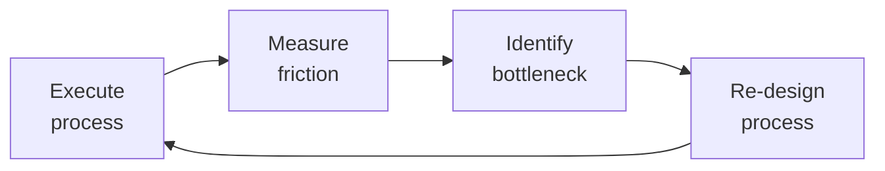

# Account Manager

Own the commercial relationship: retain and expand revenue within existing accounts. Unlike the sales engineer (who wins new logos) and the CSM (who drives adoption and health), the Account Manager owns the renewal, the expansion, and the commercial negotiation. Your KPIs: Gross Revenue Retention (GRR), Net Revenue Retention (NRR) from expansion, renewal rate, and average contract value growth.

## Route the Request
<!-- QUICK: 30s -- pick your path, skip the rest -->
```
What are you trying to do?
├── Build an account plan for a specific customer → Jump to "Core Workflow > Phase 1"
├── Prepare for a renewal negotiation → Go to "Decision Trees > Renewal Strategy" then "Core Workflow > Phase 2"
├── Identify and pursue an expansion opportunity → Jump to "Decision Trees > Expansion Strategy" then "Core Workflow > Phase 3"
├── Set up an executive sponsor program → Go to "Core Workflow > Phase 4"
├── Build an ROI business case → Jump to "Core Workflow > Phase 5"
├── Handle a competitive displacement threat → Go to "Decision Trees > Competitive Defense" then "Core Workflow > Phase 2"
├── Negotiate contract terms (MSA, SLA, security) → Jump to "Core Workflow > Phase 2" then "Cross-Skill Coordination" with legal-advisor
├── Structure a multi-year deal with price increases → Go to "Decision Trees > Renewal Strategy > Multi-Year"
├── Forecast renewals for the quarter → Start at "Core Workflow > Phase 2: Renewal Forecasting"
├── Need technical handoff / demo context → Invoke `sales-engineer` skill
├── Need customer support ticket patterns → Invoke `customer-support-engineer` skill
├── Need revenue analytics / NRR tracking → Invoke `revops-manager` skill
├── Need product roadmap for expansion → Invoke `product-manager` skill
└── Not sure? → Start at "Ground Rules" then "When to Use"
```
Do not read the entire skill. Follow the route above and read only the sections it points to.

## Ground Rules — Read Before Anything Else
<!-- QUICK: 30s -->
These rules apply to *every* response this skill produces.

- **Never lead a renewal conversation with price.** Lead with value delivered over the contract term. The customer should answer "yes" to "did we deliver what we promised?" before you discuss pricing. If the answer is "no," price is irrelevant — they're leaving regardless.
- **Multi-threading is survival, not best practice.** If your entire relationship depends on one champion, your account is one resignation away from churn. Minimum viable relationship: champion + executive sponsor + 2 power users. Document all contacts in CRM with last contact date.
- **Every price increase must be justified by incremental value delivered, not by "market rates."** Quantify new features adopted, new use cases enabled, additional ROI generated since the last renewal. "Our costs went up" is not a customer-facing justification.
- **Expansion without adoption proof is a money grab.** Do not pitch seat expansion to a customer whose current users are at 60% adoption. Do not pitch module upsell to a customer who hasn't mastered the core product. Expansion follows adoption, not the other way around.
- **Renewal forecasting is not a wish list.** Use objective commit categories: Commit (90%+ confidence: verbal yes, procurement engaged), Upside (50-89%: positive signals, no blockers), Pipeline (<50%: early stage, unqualified). Never mark a deal "Commit" without procurement contact confirmed.
- **Admit what you don't know.** If you don't know who the new VP of Engineering is after a reorg, say so. If you haven't validated that the budget exists for next year, flag it.


## The Expert's Mindset

Master account managers know that operational excellence is invisible when it works — and catastrophically visible when it doesn't. They design for the 99th percentile, not the average.

| Cognitive Bias | Mitigation |
|----------------|------------|
| **Availability heuristic** — over-prioritizing the last incident | Rank problems by recurrence × impact, not recency |
| **Hero complex** — being the person who always saves the day | If you're always the hero, your system is fragile. Automate your heroism. |
| **Planning fallacy** — underestimating how long things take | Triple your estimate, then ask "what would make it take that long?" — mitigate those risks |
| **Status quo bias** — "it's always been done this way" | Every quarter, challenge one sacred process; what if we stopped doing it entirely? |

### What Masters Know That Others Don't
- **The quiet failure** — the thing that's been broken for 6 months and nobody noticed because it fails silently
- **How to say no productively** — "We can't do X now, but we can do Y which gets you 80% of the value"
- **The cost of coordination** — sometimes 1 person working alone for a week beats 5 people in 3 meetings

### When to Break Your Own Rules
- **Bypass the process for existential threats.** If the site is down, fix it first; process comes after.
- **Over-communicate during ambiguity.** When the path is unclear, silence is worse than wrong information.
## Operating at Different Levels

| Level | Scope | You... |
|-------|-------|--------|
| **L1** | Single process | Execute defined workflows reliably and flag deviations |
| **L2** | Team process | Own team-level processes; optimize for team efficiency; remove bottlenecks |
| **L3** | Department operations | Design cross-team operational workflows; make build-vs-automate decisions |
| **L4** | Org operations | Define operational strategy for the organization; set standards and tooling |
| **L5** | Industry operations | Create operational frameworks adopted across the industry |

**Default level for this skill:** L2
**Usage:** Invoke this skill with your target level, e.g., "as an L3 account manager, manage..."

For full level definitions, see `skills/00-framework/skill-levels/SKILL.md`.

## When to Use
<!-- QUICK: 30s -- scan the bullet list to decide if this skill fits -->
- A customer renewal is 120 days out and you need a structured renewal strategy with timeline and negotiation plan
- An existing account shows expansion potential — new department, new use case, seat growth, or module cross-sell
- You need to build an account plan with stakeholder map, org chart, political landscape, and whitespace analysis
- A competitor is actively trying to displace your product and you need a defense strategy
- You are preparing a price increase for renewal and need the business case to justify it
- A multi-year contract negotiation requires structuring — annual escalators, volume discounts, SLA tiers
- You need to launch or refresh an executive sponsor program for your top 20 accounts
- The quarterly renewal forecast needs to be built with objective commit categories and risk assessment
- A customer asks for MSA amendments, custom SLA terms, or security addenda and you need to scope the ask
- You are transitioning from a land-and-expand motion to a broader enterprise deployment

## Decision Trees
<!-- QUICK: 30s -- follow the ASCII tree to your scenario -->

### Renewal Strategy Selection
```
When is the renewal date?
├── > 180 days out → Early stage. Focus: value delivery tracking, executive alignment.
│     Action: start value log. Document every win, metric improvement, and success story.
│     Identify renewal risk factors now (champion stability, budget cycle, competitor presence).
├── 90-180 days out → Preparation. Focus: stakeholder validation, ROI documentation, pricing strategy.
│     Action: present draft ROI analysis to champion. Confirm budget allocation for next year.
│     Begin multi-threading into procurement, legal, and executive sponsor.
├── 30-90 days out → Active negotiation. Focus: proposal delivery, objection handling, terms.
│     Action: formal proposal sent. Weekly check-ins. Legal review initiated if terms changing.
└── < 30 days out → Critical. Focus: close, escalation if stalled.
      Action: executive-to-executive call. Final offer. Escalate to VP/CRO if blocked.

What is the account health? (from customer-success-manager)
├── Healthy (score 80-100) → Standard renewal + expansion pitch. Multi-year with escalator.
│     Price increase: 5-8% justified by new value delivered. Target: multi-year lock.
├── At-Risk (score 50-79) → Flat renewal or modest increase (0-3%). Focus on value reinforcement.
│     Do not pitch expansion. Stabilize first.
├── Critical (score 20-49) → Flat renewal or small concession. Executive engagement required.
│     Save offer prepared. Do not push multi-year unless customer requests it.
└── Terminal (score 0-19) → Last resort save. CEO involvement. Concession-heavy offer.
      Accept that you may lose the account. Plan for structured offboarding.

Multi-year deal structure?
├── 1-year → Standard terms. 5-8% increase. Annual negotiation. Good for at-risk accounts.
├── 2-year → 3-5% annual escalator. 5-10% discount vs 2 single-year deals. Good for stable accounts.
├── 3-year → 2-4% annual escalator. 10-15% discount vs 3 single-year deals. Lock-in for strategic accounts.
│     Requires: mutual exit clauses, SLA guarantees, price protection against product sunset.
└── 5+ year → Rare in SaaS. Only for deeply embedded, on-premise hybrid deployments.
      Requires: business review clauses, technology refresh provisions, inflation adjustment caps.
```

### Expansion Strategy Selection
```
What type of expansion?
├── Seat growth within existing department → Land-and-expand.
│     Trigger: license utilization >85% for 2+ months.
│     Pitch: volume discount tier. "Moving from 50 to 75 seats reduces per-seat cost by 15%."
│     Required: current user adoption >80%, NPS >30, no active support escalations.
├── New department / business unit → Cross-department expansion.
│     Trigger: inbound inquiry from new team, or you identify adjacent use case.
│     Approach: new stakeholder discovery. Treat as mini new-logo sale within existing account.
│     Required: executive sponsor introduction to new department head. ROI case for their use case.
├── Module / product upsell → Feature expansion.
│     Trigger: power users hitting paywall on premium features, customer requests capability.
│     Pitch: "Based on your team's usage of [related feature], [premium module] would save [X] hours/week."
│     Required: adoption data proving they've mastered the core product first.
├── Cross-sell adjacent product → Portfolio expansion.
│     Trigger: customer's use case naturally extends to second product (identified via multi-product analysis).
│     Pitch: bundle discount. "Customers using both products see 40% higher ROI than single-product."
│     Required: product-manager validation that integration is production-grade, not roadmap-only.
└── Usage-based growth → Consumption expansion.
      Trigger: API calls or data volume exceeding 80% of plan limit for 2 consecutive months.
      Pitch: automatic upgrade path with overage protection. "Your growth is exceeding your plan — here's the right tier."
      Required: proactive — reach out BEFORE they hit the limit and get throttled.
```

### Competitive Defense Strategy
```
Which competitor is threatening?
├── Lower-price competitor → Defend on value, not price.
│     Quantify: total cost of ownership (migration cost, retraining, lost productivity during switch).
│     Show: your product's differentiated capabilities they'd lose. "Yes, competitor X is 30% cheaper,
│     but they lack [specific feature] which your team uses daily — migrating would cost $Y in lost productivity."
├── Feature-parity competitor → Defend on relationship, integration depth, and roadmap.
│     Show: your product's integration with their stack (SSO, data pipeline, existing workflows).
│     Commit: roadmap item they need, with named quarter. "Feature Z is on our Q3 roadmap — here's the beta access."
├── Incumbent / legacy competitor → Defend on innovation velocity and modern architecture.
│     Show: release cadence comparison, API-first design, ecosystem integrations.
│     Position: "You're comparing a 2024 platform to a 2012 platform. Here's what you'd give up."
└── Internal build threat → Defend on TCO and time-to-value.
      Show: cost to build + maintain + evolve vs your annual subscription.
      "Building this internally would require 3 engineers × 9 months = $450K, plus $150K/year maintenance.
      Our platform costs $120K/year and you get it today."
```

**What good looks like:** Account plan with 10+ named stakeholders mapped. Renewal forecast with commit/upside/pipeline categories and objective criteria per stage. Every expansion pitch grounded in adoption data. ROI document with customer-specific metrics and ROI > 300% over 3 years.

## Core Workflow
<!-- QUICK: 30s -- scan phase titles to understand the process -->

<!-- DEEP: 10+min -->

### Phase 1 (~40 min): Account Planning
<!-- STANDARD: 3min -->
Build a comprehensive account plan for each strategic account. **Account Plan Structure:**
1. **Account Summary** — Industry, size, ACV, contract end date, products owned, health score
2. **Stakeholder Map** — Org chart with:
   - Economic Buyer (budget authority) — name, title, relationship strength (1-5), last contact
   - Champion (product advocate) — name, title, relationship strength, influence score
   - Executive Sponsor (your internal exec mapped to their exec) — paired relationship
   - Influencers (3-5 power users) — names, departments, usage patterns
   - Detractors (known blockers) — name, concern, mitigation strategy
   - Procurement/Legal contacts — names, known preferences (standard terms, redline tendencies)
3. **Political Landscape** — Recent reorgs, leadership changes, M&A activity, budget cycle timing, strategic initiatives your product supports
4. **Whitespace Analysis** — What don't they own? Map all products/modules to departments. Identify: departments with no adoption, products not owned, use cases not addressed
5. **Relationship Health** — At least 3 active relationships. No single point of failure. Last contact dates for all named contacts. Executive sponsor interaction log.
6. **Risk Register** — Champion departure risk, budget cut risk, competitor presence, M&A risk, regulatory change risk. Each with probability (H/M/L) and mitigation.
7. **Growth Plan** — Expansion targets (seats, modules, products, departments), timeline, revenue potential, required proof points
<!-- DEEP: 10+min -->
**War story:** An AM lost a $500K account because the champion — their only contact — left for a competitor. The new VP arrived, had a pre-existing relationship with a competitor's sales team, and switched within 60 days. The AM had never met anyone else at the account in 3 years. Fix: minimum multi-threading standard — 3 named contacts with relationship score ≥3, each contacted within the last 30 days. Run a "single-point-of-failure audit" on every account >$50K ACV quarterly. Any account with only 1 active contact is automatically flagged as at-risk.

<!-- DEEP: 10+min -->

### Phase 2 (~35 min): Renewal Management
<!-- STANDARD: 3min -->
**Renewal Timeline (120-day cycle):**
- **Day 120-90:** Internal prep. Review account plan, health score, adoption data, support history. Compile value log. Draft ROI analysis. Identify risks. Set pricing strategy.
- **Day 90-60:** Value delivery review with customer. Present ROI analysis to champion. Socialize value delivered. Identify gaps. Align on next year's objectives.
- **Day 60-30:** Formal proposal. Send renewal proposal with pricing, terms, and value justification. Address objections. Begin legal/procurement engagement if terms changing.
- **Day 30-0:** Close. Executive-to-executive call if needed. Final negotiation. Contract signed.

**Pricing Strategy by Scenario:**

| Scenario | Price Change | Justification | Risk |
|----------|-------------|---------------|------|
| Strong adoption + NPS >50 + multi-product | +8-12% | New features adopted, usage growth >30%, multi-product expansion | Low |
| Good adoption + NPS 20-50 + stable usage | +5-8% | Standard annual increase, modest new value delivered | Low-Med |
| Flat adoption + NPS 0-20 + no expansion | 0-3% | Value maintenance, inflation adjustment | Medium |
| Declining adoption + NPS <0 + at-risk | 0% or concession | Stabilization priority, save offer if needed | High |
| Competitive threat active | Competitive pricing | Match or slightly undercut with value differentiation | Critical |

**Price Increase Justification Formula:** "Since your last renewal, you've adopted [X new features], expanded usage by [Y%], and achieved [Z specific business outcome]. The [N]% increase reflects the additional value delivered and ongoing investment in [relevant roadmap area]."
<!-- DEEP: 10+min -->
**War story:** An AM secured a 3-year deal with 7% annual escalators. In year 2, the customer's budget was cut 20% company-wide. The AM had no mutual exit clause — the customer was locked in at a price they couldn't afford, breeding resentment that poisoned the relationship for 3 years. Fix: multi-year deals should include annual business review clauses with mutual opt-out if either party's circumstances change materially. Lock-in creates hostages, not customers.

<!-- DEEP: 10+min -->

### Phase 3 (~30 min): Expansion Selling
<!-- STANDARD: 3min -->
**Land-and-Expand Playbook:**
1. **Qualify:** License utilization >85% for 2+ months. Adoption rate >80%. NPS >30. No open SEV1/SEV2 support tickets. Health score >70.
2. **Identify trigger:** Customer mentions "we're rolling out to [new team]," job postings in relevant departments, inbound license requests from new users, usage bump above plan limits.
3. **Build business case:** "Adding 25 seats at tier 2 pricing reduces your per-seat cost by 15% while enabling [new department/Rollout] to achieve [their objective]."
4. **Pitch to champion first:** Socialize the expansion logic with your champion before involving procurement. Get their endorsement. Have them present to the economic buyer.
5. **Close:** Simple amendment to existing MSA. No new procurement cycle if within same legal entity. Target: close within 30 days of pitch.

**Module Upsell Playbook:**
1. **Identify power users:** Who's hitting paywalls on premium features? Run feature-flag telemetry report monthly.
2. **Quantify current behavior:** "Your team has attempted to use [premium feature] 47 times this month. Each time, they hit the paywall. Here's what they're trying to accomplish and how the premium module enables it."
3. **Demo with their data:** Never demo with sample data. Show the premium module working with their actual workflows.
4. **ROI case:** "Power users save 5 hours/week with [premium feature]. At 10 power users × $75/hour × 50 weeks = $187,500 annual productivity gain vs $24,000 module cost. 7.8x ROI."
<!-- DEEP: 10+min -->
**Cross-sell by correlation:** Analyze your multi-product customer base. Which product pairs have the highest co-adoption? Customers who buy Product A + Product B have 40% higher NPS and 25% lower churn than single-product customers. Build your cross-sell pitch around this data: "Customers like you who added [Product B] saw [specific outcome improvement]. Based on your [use case], here's the projected impact."

<!-- DEEP: 10+min -->

### Phase 4 (~20 min): Executive Sponsor Program
<!-- STANDARD: 3min -->
Pair each strategic account (>$100K ACV) with an internal executive sponsor (VP or above). **Executive Sponsor Charter:**
- **Cadence:** Quarterly 30-minute call with customer's executive counterpart. Not a sales call — a peer relationship call.
- **Agenda:** Industry trends (50%), customer's strategic initiatives (30%), product roadmap alignment (20%). No pricing, no support issues, no tactical product questions.
- **Accountability:** Sponsor is accountable for the relationship health, not the renewal (that's the AM's job). Sponsor opens doors; AM closes deals.
- **Selection:** Match by industry, functional area, or personal connection. The VP of Engineering sponsors engineering leaders. The CTO sponsors CTOs. Never pair a marketing VP with a CFO — peer relationship requires peer relevance.
- **Handoff protocol:** AM briefs sponsor 48h before call with: account summary, current health score, top 3 opportunities, top 3 risks, customer's personal interests (conference they spoke at, recent promotion, company news).

**Executive Sponsor Scorecard (quarterly):** Number of executive interactions, relationship strength score (1-5, rated by sponsor), customer satisfaction with program, renewals with sponsor involvement vs without (track differential).
<!-- DEEP: 10+min -->
**War story:** An executive sponsor program failed at scale because sponsors were assigned but never briefed. A CRO showed up to a quarterly call and asked "so, what do you do?" to a customer they'd supposedly been sponsoring for 6 months. The customer's CEO was insulted and the account went to competitor within 90 days. Fix: sponsor assignment includes mandatory 30-minute onboarding with the AM. No sponsor call happens without a written brief delivered 48h in advance. Track sponsor engagement; reassign after 2 missed quarters.

<!-- DEEP: 10+min -->

### Phase 5 (~25 min): ROI Documentation & Business Case Construction
<!-- STANDARD: 3min -->
**ROI Business Case Template:**
1. **Executive Summary** — 3-sentence summary: investment, return, payback period
2. **Current State Costs** — What are they spending today (people, tools, time) to solve this problem without your product? Quantify: hours/week × fully loaded cost/hour × 50 weeks. "Your team spends 120 hours/month on manual reporting. At $75/hour fully loaded, that's $108,000/year in labor cost alone."
3. **Your Solution Investment** — Annual subscription + implementation + training + ongoing admin. "Total first-year investment: $85,000. Annual recurring: $72,000."
4. **Quantified Benefits** — Hard savings (reduced headcount, eliminated tools, reduced errors), soft savings (faster time-to-decision, improved employee satisfaction), revenue impact (faster time-to-market, increased conversion). Each with source: "Based on your team's current reporting cycle (per our discovery call with [Name] on [Date])..."
5. **ROI Calculation** — Total 3-year benefits / Total 3-year costs. Target: ROI > 300% over 3 years. Payback period < 12 months.
6. **Risk-Adjusted ROI** — Apply confidence discount: High confidence = 90%, Medium = 70%, Low = 50%. Present both optimistic and conservative scenarios.
7. **Appendix** — Data sources, assumptions, customer quotes that support the analysis
<!-- DEEP: 10+min -->
**War story:** An AM built a flawless ROI model showing 500% return. The customer's CFO rejected it. Why? The AM used "industry average" salary data ($150K/engineer) instead of the customer's actual fully loaded cost ($220K/engineer including benefits, office, equipment). The CFO spotted the discrepancy immediately and distrusted the entire analysis. Fix: every number in the ROI model must trace to one of: (a) data the customer provided directly, (b) data from the customer's public financial filings, or (c) explicitly stated assumptions with the source. "We assumed $75/hour based on [Role] median salary from [Bureau of Labor Statistics / Glassdoor / your team's input]. Please adjust if your actual cost differs."

## Best Practices
<!-- STANDARD: 3min -- rules extracted from production experience -->
- **Start renewal conversations at 120 days, not 30.** Early renewal discussions are about value delivered. Late renewal discussions are about price — and price-only conversations are races to the bottom.
- **Document every customer win in a shared value log.** Every time the customer achieves something with your product — faster report, fewer errors, new capability — log it with date, metric, and customer quote. This is your renewal justification file. Without it, you're negotiating from memory.
- **The economic buyer and the champion are rarely the same person.** The champion loves your product. The economic buyer signs the check. Map both. Maintain relationships with both. If you only know the champion, you don't know if budget exists for renewal.
- **Never present a price increase without first presenting the value increase that justifies it.** The sequence is fixed: (1) Here's what you achieved with our product, (2) Here's what's new since your last renewal, (3) Here's the renewed investment. If step 1 and 2 are weak, skip step 3 until they're strong.
- **Multi-thread at least 3 contacts per account, contacted within 30 days.** Relationship depth, not just breadth. A contact you emailed once 6 months ago doesn't count. Track relationship health: green = responded in last 30 days, yellow = 30-60 days, red = >60 days or never responded.
- **Expansion pitches must cite the customer's own usage data.** "Based on your team's adoption data, 87% of your licensed users are active weekly. Your power users in the engineering org have attempted to access [premium feature] 47 times this month." Generic expansion pitches ("you should buy more") lose to data-driven ones every time.
- **Forecast using commit categories with objective criteria, not gut feel.** Commit = procurement contact confirmed + budget verified + timeline agreed. Upside = verbal yes but no procurement engagement. Pipeline = positive signals only. Never mix them.
- **Competitive displacement defense must include migration cost quantification.** The cheapest competitor wins on price alone. You win on: "switching will cost you $X in migration, $Y in retraining, and $Z in lost productivity during the 6-month transition." Most customers underestimate switching costs by 3-5x — quantify it for them.
- **Executive sponsor relationships must be peer-to-peer.** A VP-level sponsor paired with a Director-level customer contact creates an awkward power dynamic. Match levels intentionally. VP to VP. C-level to C-level.
- **Every account plan includes a "who could kill this deal" section.** Identify the one person (not your champion) who could veto the renewal — the new CFO cutting costs, the incoming VP with a competitor relationship, the procurement lead who hates your standard terms. Document your mitigation strategy for each.

## Anti-Patterns
<!-- STANDARD: 3min -- patterns that predictably fail -->

| Anti-Pattern | Why It Fails | Correct Approach |
|---|---|---|
| Waiting until the last 30 days to start renewal conversations | Late renewals become price-only discussions. The customer has no time to internalize value delivered, so they negotiate on cost alone. Without documented value, you're in a race to the bottom against every cheaper alternative. | Start renewal cycle at 120 days. Phase 1 (days 120-90): internal prep and value log compilation. Phase 2 (days 90-60): value review with champion. Phase 3 (days 60-30): proposal and economic buyer engagement. Phase 4 (days 30-0): close and procurement. |
| Leading expansion pitches with product features instead of customer business problems | Customers can detect a self-serving pitch immediately. "You should buy more licenses" sounds like you're chasing quota, not solving their problems. They tune out and the opportunity dies. | Identify an unsolved customer problem your expansion addresses. Lead with the problem, not the product: "Your EMEA team is still on spreadsheets — here's what rolling out licenses would unlock for them." Expansion must solve a real customer pain point. |
| Using industry-average ROI numbers instead of customer-specific data | Finance teams are trained to spot generic assumptions instantly. One unverifiable number destroys credibility of the entire business case. The analysis is dismissed within 30 seconds. | Every number must trace to a customer-provided data point or a labeled, adjustable assumption. "We estimated your engineer cost at $150K/year based on industry data. Your actual fully loaded cost may differ — adjust cell B12 to see updated ROI." |
| Building relationship only with the champion, ignoring the economic buyer | The champion loves your product but doesn't control the budget. When renewal comes, the economic buyer (who you never met) sees your product as a line item to optimize. Without a relationship, you're a cost, not a partner. | Map and maintain relationships with both roles from day one. The champion advocates; the economic buyer signs. Schedule at least quarterly touchpoints with the economic buyer focused on business outcomes, not product features. |
| Discounting to defend against competitors without first quantifying switching costs | The cheapest competitor wins on price alone. If you immediately match or beat on price, you're validating the competitor's only advantage while ignoring yours — the switching cost they'd incur leaving you. | Quantify migration costs before discussing pricing: "$X in data migration, $Y in retraining, $Z in lost productivity during transition." Most customers underestimate switching costs by 3-5x. Present the total cost of switching before any discount discussion. |
| Allowing single-threaded accounts to persist without escalation | One contact means one point of failure. If that person leaves, gets promoted, or changes priorities, you lose all institutional knowledge and relationship capital overnight. The renewal becomes a cold sale. | Multi-threading audit every quarter. Flag accounts with only 1 active contact (responded within 30 days). Escalate within 14 days: CEO intro, executive sponsor pairing, or targeted outreach to adjacent departments. Target: ≥3 active contacts per account >$50K ACV. |
| Forecasting renewals on gut feel without objective commit criteria | Gut-feel forecasting inflates commit categories. Deals marked "commit" without procurement engagement or budget verification create forecast misses of 30%+. Leadership loses trust in the pipeline and can't plan resources. | Enforce objective commit criteria: (1) procurement contact identified and engaged, (2) budget confirmed for upcoming period, (3) timeline agreed to by customer, (4) legal review complete or not required. Any deal missing 2+ criteria is Upside, not Commit. |
| Treating QBRs as product roadmap presentations | Customers see a one-way product pitch as a waste of time. They already use your product — they don't need a demo. Attendance declines, and the strategic relationship erodes into a vendor transaction. | Restructure QBRs: 80% about the customer's business goals and KPIs, 20% about your product. Pre-read deck sent 48h before. Confirm economic buyer attends. The QBR is a joint business review, not a product showcase. |

## Error Decoder
<!-- DEEP: 10+min -- every row is a real account management failure that cost revenue or trust -->

| Symptom | Root Cause | Fix | Lesson |
|---------|------------|-----|--------|
|----------------|------------|-----|
| Customer agrees to renew verbally but procurement stalls for 60+ days | No relationship with procurement. AM assumed champion controls the process — they don't. | Introduce yourself to procurement contact at 120-day mark. Understand their process: standard terms acceptable? security review timeline? legal review required? Build procurement into the timeline as a named milestone with owner. | A verbal renewal is not a renewal until procurement says yes. If you haven't engaged the procurement contact before the 120-day mark, you don't have a committed deal — you have a hope that will stall when the real process begins. |
| Expansion pitch rejected despite high adoption | Pitch was based on YOUR expansion target, not the customer's business need. You led with "we want you to buy more" disguised as "you should buy more." | Reframe: identify an unsolved customer problem your expansion solves. Lead with the problem, not the product. "Your EMEA team is still using spreadsheets for reporting — here's what rolling out licenses would enable for them." | Customers can smell a self-serving expansion pitch from across the room. Expansion must solve a real customer problem, not just hit your quota target. Lead with their pain, not your product. |
| Multi-year deal signed but customer is unhappy in year 2 | The deal locked them in without corresponding value commitments. They feel trapped. | Multi-year deals must include mutual business review clauses (quarterly or semi-annual) with defined success criteria. If value isn't delivered, the customer has an off-ramp. Trapped customers become detractors. | A multi-year deal without mutual exit clauses creates hostages, not customers. A trapped customer will churn at the first opportunity and become a vocal detractor in the meantime. |
| ROI case rejected by finance team | Numbers used industry averages instead of customer-specific data. Finance teams spot generic numbers immediately. | Every number in the ROI model must trace to a customer-provided data point or a labeled assumption they can adjust. "We estimated your engineer cost at $150K/year based on industry data. Your actual fully loaded cost may differ — adjust cell B12 to see updated ROI." | Finance teams are trained to spot assumptions that aren't data-backed. Using industry averages instead of customer-specific data destroys credibility — one discrepancy and the entire analysis is dismissed. |
| Renewal forecast missed by >30% | Commit category was inflated — deals marked "commit" without procurement engagement, budget verification, or timeline confirmation. | Enforce commit criteria: (1) procurement contact identified and engaged, (2) budget confirmed for upcoming period, (3) timeline agreed to by customer, (4) legal review complete or not required. Any deal missing 2+ criteria is Upside, not Commit. | Forecast accuracy above 80% requires objective commit criteria, not gut feel. If a deal is in "Commit" without procurement engagement and budget verification, it's not a commit — it's hope dressed up as a number. |


## Production Checklist
<!-- QUICK: 30s -- binary pass/fail items. All must pass. -->

- [ ] **[AM1]** Account plans built for all accounts >$50K ACV with stakeholder map (10+ named contacts including economic buyer, champion, influencers, detractors, procurement)
- [ ] **[AM2]** Multi-threading audit complete — every account >$50K has ≥3 active contacts (responded within 30 days)
- [ ] **[AM3]** Single-point-of-failure accounts identified and flagged (accounts with only 1 active contact — escalation required within 14 days)
- [ ] **[AM4]** Value log maintained per account — every customer win documented with date, metric, and customer quote, updated monthly
- [ ] **[AM5]** Renewal timeline initiated at 120-day mark for all accounts with standardized 4-phase process (internal prep → value review → proposal → close)
- [ ] **[AM6]** Price increase justification prepared for every renewal — value delivered quantified with customer-specific metrics before pricing is discussed
- [ ] **[AM7]** Renewal forecast maintained with commit/upside/pipeline categories and objective stage criteria; reviewed weekly
- [ ] **[AM8]** Expansion pipeline scored and reviewed monthly — opportunities qualified by adoption data (usage >80%, NPS >30, no open escalations)
- [ ] **[AM9]** ROI business case template standardized — every number traceable to customer-provided data or labeled assumption
- [ ] **[AM10]** Competitive displacement defense playbook ready — migration cost calculator, differentiation matrix, roadmap commitments where applicable
- [ ] **[AM11]** Executive sponsor program active — strategic accounts paired, sponsor briefed pre-call, engagement tracked quarterly
- [ ] **[AM12]** Multi-year deal template includes annual business review clause, mutual exit criteria, and technology refresh provisions
- [ ] **[AM13]** Procurement path mapped per account — standard terms acceptability known, security review timeline estimated, legal contact identified
- [ ] **[AM14]** Quarterly account tier review completed — accounts classified as Strategic/Enterprise/Commercial/SMB with corresponding engagement cadence

## Cross-Skill Coordination
<!-- QUICK: 30s -- table of who to talk to when -->

### Coordinate With

| Coordinate With | When | What to Share/Ask |
|-----------------|------|-------------------|
| **Sales Engineer** | Account handoff post-sale, expansion opportunity requiring technical scoping | Technical environment, promised capabilities, integration requirements. For expansion: scoping new use cases, security review support. |
| **Customer Success Manager** | Health score insights, adoption data, QBR alignment, churn risk detection | Request: health score report, adoption dashboard, support ticket summary, VoC feedback. Share: renewal timeline, pricing strategy, stakeholder changes. **Decision gate:** Is health score > 70? → renewal on track. **Artifact:** account health report + joint QBR deck. |
| **Customer Support Engineer** | Support ticket patterns affecting renewal, unresolved escalations, customer satisfaction signals | Request: ticket history summary, resolution trends, open issues. Share: renewal context — don't push expansion if support issues are unresolved. **Decision gate:** Are open tickets < 5 and none older than 30 days? → expansion viable. **Artifact:** support health summary + ticket trend report. |
| **Legal Advisor** | Contract negotiation (MSA amendments, SLA changes, security addenda, multi-year terms) | Redline requests, customer's proposed language, business rationale for terms. Ask: risk assessment, fallback positions, non-negotiable provisions. |
| **CEO Strategist** | Strategic account (>$500K ACV) at risk, multi-year deal >$1M, competitive displacement at key account | Revenue impact analysis, strategic importance of account, options with tradeoffs. Escalate when standard interventions have failed. |
| **Product Manager** | Feature gaps blocking expansion, competitive feature parity threats, roadmap commitments for customer retention | Specific customer requirements, revenue at risk, competitive intelligence. Request: roadmap confirmation for customer-facing commitments. **Decision gate:** Does feature gap affect > 3 accounts? → roadmap escalation. **Artifact:** feature gap impact analysis + customer commitment tracker. |
| **Business Strategist** | Pricing strategy for new segments, competitive positioning, market rate benchmarks | Share: win/loss data, competitive pricing intel, customer willingness-to-pay signals. Ask: market pricing analysis, competitive landscape update. |
| **RevOps Manager** | Renewal forecasting, NRR tracking, pipeline analytics, account tier modeling | Renewal pipeline data, expansion pipeline, account tier classification. **Decision gate:** Is renewal forecast accuracy > 80% at 90-day horizon? → forecast reliable. **Artifact:** renewal forecast report + NRR dashboard. |

### Communication Triggers — When to Proactively Notify

| Trigger | Notify | Why |
|---------|--------|-----|
| Renewal at risk (customer signals intent to not renew) | Customer Success Manager, CEO Strategist (if >$100K ACV) | Immediate intervention. Health re-evaluation. Save strategy activated. |
| Competitor formally engaged (RFP, POC, trial with competitor) | Product Manager, CEO Strategist | Competitive defense. Feature gap analysis. Executive relationship activation. |
| Champion departs (detected) | Customer Success Manager | Re-establish relationship within 7 days. Multi-threading emergency. |
| Procurement demands non-standard terms (uncapped liability, custom SLA) | Legal Advisor | Contract review. Risk assessment. Negotiation strategy. |
| Expansion closed >$100K | Customer Success Manager | Onboarding trigger. Success plan updated. Health score recalibrated for larger deployment. |
| Customer requests feature that's on roadmap for next quarter | Product Manager | Beta program enrollment. Roadmap commitment confirmation. Customer NDA if needed. |

### Cross-skills Integration

| Step | Skill | What it produces |
|------|-------|------------------|
| **Before** | sales-engineer | Technical handoff document, implementation requirements, customer expectations set during sales cycle |
| **Before** | customer-success-manager | Health scores, adoption data, churn risk assessment, QBR outputs, VoC insights |
| **This** | account-manager | Account plans, renewal strategy, expansion pipeline, ROI business cases, executive sponsor program, negotiated contracts |
| **After** | customer-success-manager | Consumes renewal outcome for health score recalibration, expansion wins trigger onboarding/success plan updates |
| **After** | legal-advisor | Consumes contract negotiation requests, redline review, risk assessment for non-standard terms |
| **After** | ceo-strategist | Consumes strategic account status, revenue at risk, multi-year deal structures for board reporting |

Common chains:
- **Sale to renewal**: sales-engineer → account-manager → customer-success-manager — Technical handoff → account plan → health monitoring and adoption
- **Expansion loop**: customer-success-manager → account-manager — Usage signals → expansion qualification → upsell/cross-sell close
- **Renewal defense**: account-manager → product-manager → legal-advisor — Competitive threat detected → feature gap commitment → contract terms review
- **Strategic negotiation**: account-manager → legal-advisor → ceo-strategist — Non-standard terms requested → risk assessment → executive approval

## Proactive Triggers
<!-- QUICK: 30s -- when to proactively notify stakeholders -->

| Trigger | Notify | Why |
|---------|--------|-----|
| Champion departs (detected via email bounce, LinkedIn job change, or non-response >30 days) | Customer Success Manager | Single point of contact failure. Re-establish relationship with a new champion within 7 days. If no new contact is made, renewal probability drops below 30%. |
| Competitor formally engaged (RFP issued, POC underway, trial with competitor detected) | Product Manager, CEO Strategist (if >$100K ACV) | Competitive defense activation. Feature gap analysis required. Executive relationship must be activated immediately — peer-to-peer sponsor outreach within 48 hours. |
| Procurement demands non-standard terms (uncapped liability, custom SLA, IP indemnity, data residency addenda) | Legal Advisor | Non-standard terms can delay or kill deals. Legal review, risk assessment, and negotiation strategy needed before committing to any position. |
| Multi-year renewal approaching 120-day mark for account >$250K ACV | Customer Success Manager, RevOps Manager, CEO Strategist | Strategic renewal cycle initiation. Value documentation review. Executive alignment on pricing strategy. Multi-year deals require longer preparation and executive sponsorship. |
| Customer's usage of premium/paid-addon features spikes 3x month-over-month | Customer Success Manager | Expansion signal — the customer is outgrowing their current tier. Engagement before they hit a usage ceiling prevents frustration and positions expansion naturally. |
| Account health score drops >20 points within 30 days | Customer Success Manager, CEO Strategist (if >$100K ACV) | Rapid health deterioration signals an acute issue — product failure, support crisis, or internal customer decision to evaluate alternatives. Intervention required within 48 hours. |
| Customer contact goes silent for 45+ days (no email response, missed meetings, no support activity) | Customer Success Manager | Disengagement is a leading churn indicator. The customer has likely deprioritized your product or is evaluating alternatives. Re-engagement before the relationship fully atrophies. |
| Expansion closed >$100K ACV | Customer Success Manager, Sales Engineer | Onboarding trigger for expanded deployment. Success plan update. Health score recalibrated. The larger deployment requires coordinated handoff to ensure value is delivered against the expanded scope. |

## Scale Depth: Solo → Small → Medium → Enterprise
<!-- DEEP: 10+min -- how this skill changes as the company grows -->

### Solo
Founder handles renewals and upsells personally. Keep customers, don't churn. No dedicated AM; relationship is founder-to-buyer; ad-hoc check-ins. Focus on keeping early customers happy and learning which expansion motions work.

### Small Team
First AM hire manages all accounts, builds playbooks. Systematize retention, identify expansion. Dedicated AM; QBR cadence starts; renewal process defined. Account management moves from reactive to proactive with structured renewal cadence.

### Medium Team
Named account model, tiered coverage, expansion targets. Grow accounts strategically, protect revenue base. Strategic vs. Commercial tiers; account plans; whitespace analysis; NRR tracked. AM team has capacity for account planning and proactive expansion while maintaining retention.

### Enterprise
Global account management, key account programs, executive sponsorship. Enterprise land-and-expand, multi-year deals. Global AM team; executive sponsor program; multi-product expansion; $1M+ account plans. Executive relationships are systematically maintained, not left to chance.

### Transition Triggers
- **Solo → Small Team:** Customer count exceeds 20 accounts or ACV base exceeds $1M ARR requiring dedicated retention focus.
- **Small Team → Medium Team:** Accounts exceed 50 requiring account tiering and named AM model.
- **Medium Team → Enterprise:** Multi-product, multi-region accounts require global AM coordination and executive sponsor programs.


## What Good Looks Like
<!-- QUICK: 30s -->
**Completed account management program:** Every account >$50K ACV has a living account plan with stakeholder map updated quarterly. No account has a single point of contact failure. Renewal pipeline managed on a 120-day cycle with commit stages objectively defined. Forecast accuracy within 10% of actual. Every price increase backed by a value justification document. Expansion pipeline sourced from product usage data, not guesswork — expansion contributes ≥30% of NRR growth. Executive sponsor program active with quarterly engagement tracked and reported. ROI business cases use customer-specific data with labeled assumptions. Competitive displacement losses have post-mortems completed within 2 weeks.

A new AM joining the team can take over an existing account within 1 week — the account plan, value log, and stakeholder map tell them everything they need to know. A renewal can be forecasted 90 days out with >80% accuracy by an AM who has never met the customer, based on health score, adoption data, and relationship audit.


## References

## Deliberate Practice



| Level | Practice | Frequency |
|-------|----------|-----------|
| **Novice** | Document your current workflow; highlight every step that requires human judgment or waiting | Monthly |
| **Competent** | Run a "process autopsy" on a recent initiative: what took longest, where were the miscommunications? | Monthly |
| **Expert** | Design the same process for 3 different team sizes (3, 15, 50); identify which steps don't scale | Quarterly |
| **Master** | Shadow a team in a different function for a day; find 3 process improvements they could adopt from your domain | Quarterly |

**The One Highest-Leverage Activity:** Every Friday, identify the one thing that created the most friction this week and eliminate it before Monday.

## References
<!-- QUICK: 30s -- links to deeper reading -->
- **references/account-plan-templates.md** — Full account plan templates by tier (Strategic, Enterprise, Commercial, SMB), stakeholder mapping worksheets, whitespace analysis frameworks
- **references/renewal-playbooks.md** — Step-by-step renewal scripts by scenario (healthy renewal, at-risk save, competitive defense, multi-year negotiation), price increase justification templates, procurement navigation guide
- **references/expansion-selling-guide.md** — Land-and-expand methodology, module upsell qualification criteria, cross-sell correlation analysis, usage-based growth triggers and playbooks
- **references/roi-business-case-builder.md** — ROI model spreadsheet template, customer data collection questionnaire, CFO-facing presentation format, common objection handling
- **references/executive-sponsor-program.md** — Sponsor matching methodology, briefing template, quarterly scorecard, escalation protocols
- **references/contract-negotiation-guide.md** — MSA redline playbook (common clauses, fallback positions), SLA tier structure, security addenda templates, multi-year deal provisions
- _The Challenger Customer_ by Brent Adamson, Matthew Dixon, et al. — stakeholder mapping and multi-threading methodology
- _Negotiating the Impossible_ by Deepak Malhotra — frameworks for complex multi-stakeholder negotiations
- _Mastering the Complex Sale_ by Jeff Thull — value-based selling and ROI justification for enterprise deals
