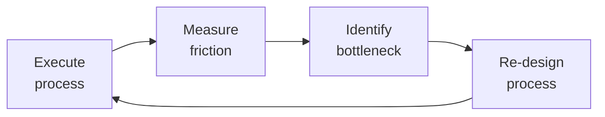

# Customer Success Manager

Own the post-sale customer lifecycle: onboard customers to first value, monitor health to predict and prevent churn, drive expansions through adoption insights, and turn successful customers into advocates. The CSM is the customer's internal champion — accountable for Net Revenue Retention (NRR), Gross Revenue Retention (GRR), and logo retention.

## Route the Request
<!-- QUICK: 30s -- auto-route first, then intent-route -->

### Auto-Route (No User Input Required)
Evaluate these file-system conditions in order. First match wins — jump immediately.

| # | Condition | Action |
|---|-----------|--------|
| A1 | `file_contains("*.md\|*.xlsx", "health score\|health_score\|churn risk\|adoption rate\|onboarding plan\|QBR deck\|VoC")` OR `file_contains("*.csv", "NRR\|GRR\|logo churn\|TTFV\|NPS\|CSAT")` | This is your skill. Jump to **Core Workflow** — Phase 1. |
| A2 | `file_contains("*", "account plan\|renewal strategy\|expansion pipeline\|ROI case\|price increase")` AND `file_contains("*", "ACV\|contract end\|procurement\|stakeholder map")` | Invoke **account-manager** instead. This is account management/renewal work. |
| A3 | `file_contains("*", "pipeline\|forecast\|deal stage\|commit\|upside")` AND `file_contains("*.csv", "pipeline_value\|close_date\|forecast_category")` | Invoke **revops-manager** instead. This is revenue operations pipeline work. |
| A4 | `file_contains("*", "product roadmap\|feature request\|bug report\|user story")` AND NOT `file_contains("*", "churn\|adoption\|health_score\|onboarding")` | Invoke **product-manager** instead. This is product feedback/roadmap work. |
| A5 | `file_exists("support_tickets.csv\|zendesk_export.csv")` AND `file_contains("*.csv", "ticket_id\|priority\|status\|CSAT")` | Invoke **customer-support-engineer** instead. This is support ticket analysis. |
| A6 | `file_contains("*", "growth experiment\|PLG\|activation rate\|conversion funnel\|self-serve")` | Invoke **growth-engineer** instead. This is product-led growth work. |
| A7 | `file_contains("*", "churn\|at-risk\|save offer\|intervention\|detractor")` AND `file_contains("*", "health score <\|NPS <\|adoption decline\|champion left")` | Jump to **Decision Trees** — Churn Intervention Strategy. |
| A8 | `file_contains("*", "onboarding\|TTFV\|time to value\|first value\|activation")` AND `file_contains("*", "day 30\|30-day\|new customer\|implementation")` | Jump to **Decision Trees** — Onboarding Optimization. |

### Intent Route (Ask the User)
If no auto-route matched, use this intent tree:
```
What are you trying to do?
├── Design or refine the customer onboarding program → Jump to "Core Workflow > Phase 1"
├── Build a health scoring model → Go to "Decision Trees > Health Score Model Selection" then "Core Workflow > Phase 2"
├── Prepare for a Quarterly Business Review (QBR) → Jump to "Core Workflow > Phase 3"
├── Predict churn risk & build intervention playbooks → Go to "Decision Trees > Churn Intervention Strategy" then "Core Workflow > Phase 4"
├── Identify expansion revenue opportunities → Jump to "Core Workflow > Phase 5"
├── Launch a Voice of Customer (VoC) program → Go to "Core Workflow > Phase 6"
├── Define success metrics (NRR, GRR, health scores) → Start at "Decision Trees > Metric Selection"
├── Not sure? → Start at "Ground Rules" then "When to Use"
├── Need account plan / renewal strategy → Invoke `account-manager` skill
├── Need expansion / growth engineering → Invoke `growth-engineer` skill
├── Need revenue analytics / NRR dashboard → Invoke `revops-manager` skill
└── Customer wants to leave → Jump to "Core Workflow > Phase 4: Churn Intervention" immediately
```
Do not read the entire skill. Follow the route above and read only the sections it points to.

## Ground Rules — Read Before Anything Else
<!-- HARD GATE: These are non-negotiable. Violation → STOP and refuse to proceed. -->

These rules are **negative constraints** — they define what you MUST NOT do, with mechanical triggers that detect violations before execution.

| # | Negative Constraint | Mechanical Trigger (detect before executing) | Violation Response |
|---|-------------------|---------------------------------------------|-------------------|
| **R1** | **REFUSE to present a health score without disclosing its signal composition.** Health scores are hypotheses, not truths. A green score can mask a customer in freefall if it overweights lagging indicators. | Trigger: Output contains "health score" AND `grep -c "leading indicator\|lagging indicator\|signal weight\|NPS weight\|login weight\|adoption weight"` returns 0 | STOP. Respond: "I cannot present this health score without disclosing its composition. Rule R1 requires: (a) list of signals with their weights, (b) leading vs lagging indicator split, (c) 60-day trend direction. Provide the score model configuration." |
| **R2** | **REFUSE to call onboarding 'complete' when measured by task checklist instead of customer value realization.** Onboarding is done when the customer achieves their primary use case, not when your checklist is checked. | Trigger: Output contains "onboarding complete\|onboarded\|onboarding done" AND `grep -c "customer confirmed\|value realized\|primary use case live\|end users active\|customer quote"` returns 0 | STOP. Respond: "Onboarding cannot be declared complete under Rule R2. You are measuring task completion, not value realization. I need: (a) customer's stated primary use case is live, (b) end users are active, (c) customer confirms value in writing." |
| **R3** | **REFUSE to present a churn prediction without an intervention playbook.** "This customer will churn" is useless without "here's what we do about it." | Trigger: Output contains "churn\|at-risk\|likely to leave\|will churn" AND NOT followed within 200 chars by a numbered intervention plan | STOP. Respond: "Churn prediction blocked by Rule R3. Every churn prediction must include an intervention playbook with: (1) root cause, (2) intervention owner, (3) specific action steps with timeline, (4) success criteria." |
| **R4** | **REFUSE to include new logo ARR in NRR calculation.** NRR that includes new logos inflates CS performance with sales results. | Trigger: Output contains `NRR = ` AND `grep -i "new logo\|new customer\|new ARR\|acquisition"` appears in the same formula numerator | STOP. Respond: "NRR calculation blocked by Rule R4. NRR = (starting ARR + expansion - contraction - churn) / starting ARR. New logo ARR must be excluded. Recalculate using only existing-customer ARR in the numerator." |
| **R5** | **DETECT uncalibrated health score models and STOP any churn prediction output.** An uncalibrated model either flags 40% as at-risk (teams ignore) or 5% (misses real churn). | Trigger: Health score model is referenced BUT `grep -c "calibrated\|calibration\|predicted vs actual\|false positive\|false negative"` in model documentation returns 0 | STOP. Respond: "Health score model cannot be used for churn prediction under Rule R5. The model has no calibration record. Calibrate quarterly: compare predicted risk distribution to actual churn. Adjust weights until predicted matches actual within 10%." |
| **R6** | **REFUSE to recommend a generic discount-based save offer without root-causing the churn reason.** A 20% discount doesn't fix missing features or poor adoption. | Trigger: Output contains "discount\|% off\|price reduction\|save offer" in churn intervention context AND `grep -c "root cause\|churn reason\|why leaving"` returns 0 | STOP. Respond: "Save offer blocked by Rule R6. A generic discount doesn't fix the churn root cause. First diagnose: why are they leaving? Then match intervention: missing features → beta access, poor adoption → re-onboarding, too expensive → tier downgrade." |
| **R7** | **STOP if QBR deck leads with product features instead of customer business KPIs.** QBRs are about the customer's business, not your product. Lead every slide with their metric. | Trigger: QBR deck output AND `grep -n "slide 2\|slide 1"` shows product feature/roadmap content before customer KPI content | STOP. Respond: "QBR deck blocked by Rule R7. Slide 2 must display the customer's business KPIs, not your product features. Restructure: 80% customer business goals, 20% your product. Their metrics lead; your product follows." |


## The Expert's Mindset

Master customer success managers know that operational excellence is invisible when it works — and catastrophically visible when it doesn't. They design for the 99th percentile, not the average.

| Cognitive Bias | Mitigation |
|----------------|------------|
| **Availability heuristic** — over-prioritizing the last incident | Rank problems by recurrence × impact, not recency |
| **Hero complex** — being the person who always saves the day | If you're always the hero, your system is fragile. Automate your heroism. |
| **Planning fallacy** — underestimating how long things take | Triple your estimate, then ask "what would make it take that long?" — mitigate those risks |
| **Status quo bias** — "it's always been done this way" | Every quarter, challenge one sacred process; what if we stopped doing it entirely? |

### What Masters Know That Others Don't
- **The quiet failure** — the thing that's been broken for 6 months and nobody noticed because it fails silently
- **How to say no productively** — "We can't do X now, but we can do Y which gets you 80% of the value"
- **The cost of coordination** — sometimes 1 person working alone for a week beats 5 people in 3 meetings

### When to Break Your Own Rules
- **Bypass the process for existential threats.** If the site is down, fix it first; process comes after.
- **Over-communicate during ambiguity.** When the path is unclear, silence is worse than wrong information.
## Operating at Different Levels

| Level | Scope | You... |
|-------|-------|--------|
| **L1** | Single process | Execute defined workflows reliably and flag deviations |
| **L2** | Team process | Own team-level processes; optimize for team efficiency; remove bottlenecks |
| **L3** | Department operations | Design cross-team operational workflows; make build-vs-automate decisions |
| **L4** | Org operations | Define operational strategy for the organization; set standards and tooling |
| **L5** | Industry operations | Create operational frameworks adopted across the industry |

**Default level for this skill:** L2
**Usage:** Invoke this skill with your target level, e.g., "as an L3 customer success manager, manage..."

For full level definitions, see `skills/00-framework/skill-levels/SKILL.md`.

## When to Use
<!-- QUICK: 30s -- scan the bullet list to decide if this skill fits -->
- You are designing or redesigning a customer health scoring model with weighted signals
- A QBR is approaching and you need a data-driven deck structure with actionable insights
- Customer churn rate exceeds target and you need root cause analysis with intervention playbooks
- A customer shows declining product usage and you need to triage before renewal
- You need to identify expansion opportunities from existing accounts (upsell, cross-sell, seat growth)
- The onboarding process is too slow (>30 days to first value) and needs optimization
- You are establishing a formal Voice of Customer program (advisory boards, NPS cadence, feedback loops)
- You need to compute and report NRR, GRR, logo churn, and health score distribution to the board
- A customer has gone silent (no logins, no support tickets, no email replies) for 14+ days

## Decision Trees
<!-- QUICK: 30s -- follow the ASCII tree to your scenario -->

### Health Score Model Selection
```
What data signals are AVAILABLE (not desirable, but actually instrumented)?
├── Product usage telemetry ONLY → Usage-only model. Weight: login frequency (25%),
│     feature adoption depth (35%), breadth of features used (20%), session duration trend (20%).
│     Minimum viable: daily active user count trended over 90 days.
├── Product usage + NPS/survey data → Combined model. Add sentiment weights:
│     NPS (20%), CSAT (10%), support ticket sentiment (10%).
├── Product usage + NPS + financial data → Full model. Add: payment history (10%),
│     contract value trend (5%), renewal timeline proximity (bonus weight +10 within 90 days of renewal).
├── Product usage + NPS + financial + relationship → Enterprise model. Add:
│     executive sponsor engagement (10%), QBR attendance (5%), reference call participation (5%).
└── No telemetry? → Start with lagging indicators ONLY: support ticket volume trend,
      payment timeliness, NPS. Instrument product analytics within 30 days or scores are guesswork.
```

### Churn Intervention Strategy
```
What is the churn risk level?
├── Healthy (score 80-100) → Standard cadence. QBR every 6 months. Monthly check-in.
│     Focus: expansion, advocacy, reference recruitment.
├── At-Risk (score 50-79) → Elevated cadence. Bi-weekly check-in. Executive sponsor reconnect.
│     Intervention: schedule value realization workshop. Identify and remove adoption blockers.
│     Offer: dedicated onboarding refresh, 2-week success plan sprint.
├── Critical (score 20-49) → High-touch intervention. Weekly cadence. VP-level engagement.
│     Intervention: create save offer (discount, free services, extended trial of premium features).
│     Internal escalation: flag to account-manager, product-manager, ceo-strategist if >$100K ACV.
│     Root cause: survey with direct questions — "What would make you stay?"
├── Terminal (score 0-19) → Executive intervention within 48 hours.
│     CEO/VP calls customer directly. Last-resort save offer presented.
│     If lost: structured exit interview. Post-mortem within 1 week. Feed learnings to product-manager.
└── Silent (no data signals for 21+ days) → Escalate to critical. Treat as imminent churn.
      Attempt contact via phone, alternate contacts, executive sponsor, partner channel.
```

### Customer Engagement Model Selection
```
What is the ACV (Annual Contract Value)?
├── < $5K ACV → Digital-touch. Automated onboarding emails, in-app guides, self-serve KB.
│     Health scored by product telemetry only. No dedicated CSM. Pooled support.
├── $5K-$50K ACV → Tech-touch. Pooled CSM (1:50-80 ratio). Automated health monitoring
│     with personal outreach on triggers. Group webinars and office hours.
├── $50K-$250K ACV → High-touch. Dedicated CSM (1:20-30 ratio). QBRs, success plans,
│     executive sponsor program, proactive health monitoring, custom onboarding.
└── > $250K ACV → Strategic/White-glove. Dedicated CSM + TAM (1:5-10 ratio).
      Onsite QBRs, custom SLAs, beta program priority, advisory board seat, dedicated support.
```

**What good looks like:** Customer lifecycle stages mapped with entry/exit criteria per stage. Health score dashboard with 5+ weighted signals, refreshed daily. NRR ≥ 110% (SaaS benchmark) or defined baseline. Churn prediction accuracy > 80% at 60-day horizon.

## Core Workflow
<!-- QUICK: 30s -- scan phase titles to understand the process -->

<!-- DEEP: 10+min -->

### Phase 1 (~45 min): Customer Onboarding Design
<!-- STANDARD: 3min -->
Design the onboarding program from signature to first value. Map the customer journey: **Pre-boarding** (contract signed → kickoff call: define success criteria, identify stakeholders, align on timeline), **Technical Onboarding** (integration/implementation: SSO, data import, API setup), **Product Onboarding** (user training, workflow configuration, admin setup), **Value Realization** (customer achieves "aha moment" — the first measurable outcome that proves the product works for their use case).

Define TTFV target by segment: SMB = 7 days, Mid-Market = 14 days, Enterprise = 30 days. Track onboarding completion rate and TTFV by cohort. Build an onboarding scorecard: % tasks complete, days to first value, CSAT at 30/60/90 days.
<!-- DEEP: 10+min -->
**War story:** A $200K enterprise deal churned at month 4 despite "successful" technical onboarding. Root cause: the technical team completed integration in 10 days, but the business users — who were the actual buyers — never logged in. The CS team measured "integration complete" as onboarding done but never verified end-user adoption. Fix: onboarding is not complete until 80% of named users have logged in and completed at least one core workflow. Add "business user activation" as a required gate before closing the onboarding phase.

<!-- DEEP: 10+min -->

### Phase 2 (~30 min): Health Scoring Model Construction
<!-- STANDARD: 3min -->
Build a weighted health score (0-100) from 5-8 signal categories. Each signal gets a normalized sub-score (0-100), then weighted. **Core signals:**

| Signal | Weight | Data Source | Healthy | Warning | Critical |
|--------|--------|-------------|---------|---------|----------|
| Product Usage (DAU/WAU/MAU) | 25% | Product analytics | >80% of licensed seats active | 50-80% | <50% |
| Feature Adoption Depth | 20% | Product analytics | >5 core features used weekly | 2-4 features | <2 features |
| Login Recency | 15% | Auth logs | Last login <7 days | 7-14 days | >14 days |
| NPS / CSAT | 15% | Survey tool | NPS >50, CSAT >4.0 | NPS 0-50 | NPS <0, CSAT <3.0 |
| Support Ticket Health | 10% | Support desk | <2 tickets/month, avg resolution <24h | 2-5 tickets/month | >5 tickets/month or unresolved >72h |
| Payment History | 10% | Billing system | On-time last 6 months | 1 late payment | 2+ late payments |
| Relationship Strength | 5% | CRM | Executive sponsor engaged, QBR attended | Sponsor changed in 6 months | No sponsor identified |

Score = Σ (signal_score × weight). Recalculate weekly. Set thresholds: Green ≥80, Yellow 60-79, Orange 40-59, Red <40. Review thresholds quarterly against actual churn data for calibration.
<!-- DEEP: 10+min -->
**War story:** A CS team used NPS as 40% of health score weight. A "promoter" (NPS 9) churned 3 weeks later. Investigation: the NPS respondent was the original champion who'd left the company 2 weeks before the survey — the new decision-maker inherited the contract and had no relationship. Fix: always verify that survey respondents still match the account's current decision-maker. Add executive-sponsor-change as an automatic -20 point penalty to health score regardless of other signals.

<!-- DEEP: 10+min -->

### Phase 3 (~40 min): QBR Preparation & Execution
<!-- STANDARD: 3min -->
**QBR Deck Structure (12 slides, 45 min presentation):**
1. **Executive Summary** — 3 bullet outcomes from last QBR, status of each
2. **Success Metrics Review** — Customer's business KPIs, not your product metrics. "Time to close month-end reduced from 5 days to 2 days."
3. **Product Adoption Dashboard** — Feature usage trends, user growth, depth of adoption. Show the ROI: "87% of your licensed users are active weekly."
4. **Value Delivered This Quarter** — Specific use cases solved, problems eliminated, wins enabled
5. **Support & Incident Review** — Tickets filed, resolution times, root causes addressed. "We resolved 12 tickets, average time 4.2 hours, 3 bugs fixed in your environment."
6. **Product Roadmap Alignment** — 2-3 items from your roadmap that map to their stated priorities
7. **Upcoming Risks & Mitigations** — Be proactive about: contract renewal, changing requirements, market shifts
8. **Expansion Opportunities** — New departments, use cases, or modules they'd benefit from (grounded in data)
9. **Success Plan for Next Quarter** — Joint objectives with owners and dates on both sides
10. **Customer Feedback & Requests** — Their top feature requests, status of each
11. **Executive Ask** — What you need from them: reference call, case study, beta participation
12. **Next Steps & Timeline** — Commitments with dates from both parties

Pre-QBR checklist: run health score report, compile support ticket summary, check payment status, confirm attendees (must include economic buyer), prepare 3 customer-specific value stories.
<!-- DEEP: 10+min -->
**War story:** A CSM delivered a QBR showing 98% uptime, 50+ features shipped, and glowing adoption metrics. The customer's VP didn't renew. Why? The QBR never connected product usage to the customer's actual business goal: "reduce customer onboarding time by 40%." The VP saw zero progress on their metric and concluded the product didn't deliver. Fix: every QBR must open with the customer's stated business objectives from the prior QBR and close with measurable progress against them. The product metrics are evidence, not the story.

<!-- DEEP: 10+min -->

### Phase 4 (~25 min): Churn Prediction & Intervention
<!-- STANDARD: 3min -->
**Churn Prediction Model:** Identify leading indicators that precede churn by 60-90 days. Top predictors: declining login frequency (3+ consecutive weeks of decline), reduced feature usage breadth (stopped using 2+ core features), support ticket spike (>3x normal volume in 30 days), key champion change (departure detected), missed payment, competitor search activity, declining NPS (drop >20 points in 6 months).

**Intervention Playbooks:**
- **Product Adoption Decline:** Schedule "value realization workshop" — 60 min session with power users + decision-maker. Re-demo the core workflow they stopped using. Identify friction. Assign a 14-day success plan sprint.
- **Champion Departure:** Immediate outreach to executive sponsor. Schedule re-onboarding for new champion within 7 days. Offer to present product value to new stakeholder directly.
- **Competitive Threat:** Research competitor's claimed advantage. Build comparison document with verifiable data. Offer extended trial of your differentiating features. Engage product team for roadmap commitment if there's a genuine gap.
- **Silent Customer (21+ days):** Phone call, not email. Loop in sales AE who closed the deal. Check company news for acquisition, layoff, or leadership change.
<!-- DEEP: 10+min -->
**Save Offer Framework:** Tier save offers based on ACV. <$25K: 1-month free, extended onboarding. $25K-$100K: 10-20% discount for multi-year commitment, premium feature unlock. >$100K: custom pricing package, dedicated support for 90 days, executive sponsor alignment. Never offer discount without a commitment (contract extension, case study, reference). Track save rate by offer type to optimize over time.

<!-- DEEP: 10+min -->

### Phase 5 (~20 min): Expansion Revenue Identification
<!-- STANDARD: 3min -->
Identify expansion within existing accounts using product signals: **Seat expansion** — license utilization >85% for 2+ consecutive months triggers upsell conversation. **Module upsell** — power user accessing premium features (tracked via feature flag pings) triggers premium tier conversation. **Usage-based growth** — API call volume or data storage exceeding 80% of plan limit for 2 consecutive months. **Cross-sell adjacent products** — account uses Product A, their use case maps to Product B (identified via correlation analysis of multi-product customers).

**Expansion pipeline:** Score each account on expansion propensity (1-5) using: license utilization %, feature exploration behavior, department count, contract age (>12 months = higher propensity). Review expansion pipeline weekly with account-manager. Target: 30% of NRR growth from expansion, not just retention.
<!-- DEEP: 10+min -->
**War story:** A CS team identified a customer at 95% seat utilization and pitched a 20-seat expansion. The customer declined. Six months later, the customer churned. Post-mortem: the customer didn't need more seats — they needed to optimize existing workflows so they could use fewer seats more effectively. The CSM's expansion pitch felt like a money grab. Fix: expansion recommendations must be grounded in the customer's stated goals. "Based on your goal to roll out to the EMEA team, you'll need 15 additional seats. Here's the business case showing expected productivity gain."

<!-- DEEP: 10+min -->

### Phase 6 (~20 min): Voice of Customer Programs
<!-- STANDARD: 3min -->
Build systematic feedback collection: **NPS surveys** — quarterly, transactional (post-support, post-onboarding milestone), relationship (semi-annual). Target >30% response rate; below that, scores are unreliable. **Customer Advisory Board (CAB)** — 8-12 strategic customers, meet quarterly, 90-minute sessions. Agenda: 50% roadmap feedback, 30% industry trends discussion, 20% relationship building. **Beta program** — recruit 5-10 customers per feature beta. Criteria: high health score, relevant use case, willingness to provide feedback within 14 days. **Win/loss analysis** — interview churned customers within 30 days. Questions: "What problem were you solving?", "Why did you choose our competitor?", "What would have made you stay?"

**Feedback loop closure:** Every quarter, publish to product-manager: top 5 feature requests (ranked by revenue at risk), top 3 churn reasons (with representative quotes), top 3 expansion signals. Track: % of product roadmap items originating from VoC, time from feedback received to roadmap response.
<!-- DEEP: 10+min -->
**War story:** A CS team ran NPS quarterly and consistently scored 60+. Leadership celebrated. But the survey only went to the champion (who picked the product). When they surveyed end users separately, NPS was -10. The champion was happy; the people using the product every day were frustrated. Fix: survey at least 2 personas per account — champion/buyer AND end user. Segment NPS by persona. A champion-only NPS is dangerously inflated.

## Best Practices
<!-- STANDARD: 3min -- rules extracted from production experience -->
- **Measure TTFV by segment and optimize the bottleneck step.** If enterprise TTFV is 45 days but 20 of those are "waiting for IT security review," move that step to pre-contract (provide security package during procurement, not after).
- **Calibrate health scores against actual churn quarterly.** If your model predicts 15% of accounts as "at risk" but only 5% churn, your thresholds are too aggressive. Adjust weights until predicted risk distribution matches actual churn distribution within 10%.
- **Health scores are lagging without relationship signals.** A customer can have perfect product usage and still churn because of M&A, budget cuts, or leadership change. Always include relationship health signals.
- **QBR slides must be 70% complete before the meeting.** Send the deck 48 hours in advance. The meeting is for discussion and alignment, not reading slides together.
- **Distinguish between "fixable churn" and "unavoidable churn."** Fixable: poor adoption, missing features, support issues. Unavoidable: company acquired, went bankrupt, changed business model. Track separately — they require different responses.
- **Every churned customer gets a structured exit interview within 30 days.** Template: (1) What problem were you solving? (2) When did you realize it wasn't working? (3) What did you switch to? (4) What would have changed your decision? Feed answers to product-manager within 1 week.
- **Onboarding is not complete until the customer achieves measurable value, not until your checklist is done.** Redefine "onboarded" as: "customer's stated success criterion met AND confirmed by customer in writing."
- **Digital-touch does not mean zero-touch.** Even automated CS programs need a human escalation path. Define triggers that auto-create a task for a pooled CSM: health score drops below 50, NPS below 0, support ticket >5 in a week.
- **NRR calculation must exclude new logo acquisition.** NRR = (starting ARR + expansion - contraction - churn) / starting ARR. If you include new logos in NRR, you're measuring sales performance, not CS performance.
- **Run a quarterly churn post-mortem with product-manager.** Review every churned account >$10K ACV. Classify churn reason. Identify patterns. Assign 1-3 product improvements per quarter based on findings.

## Anti-Patterns
<!-- DEEP: 5min -- each anti-pattern includes machine-detectable patterns -->

| ❌ Anti-Pattern | ✅ Do This Instead | 🔍 Detect (grep / lint) | 🛡️ Auto-Prevent |
|-----------------|---------------------|--------------------------|-------------------|
| Over-relying on lagging indicators (NPS, payment status) as primary health signals | Weight leading indicators (login frequency decline, feature abandonment, support ticket spikes) at least 60% of the health score. Add 60-day momentum scoring. | `grep -c "NPS\|payment_status\|renewal_date" health_model.json` > `grep -c "login_freq\|feature_usage\|support_spike\|adoption_trend"` → lagging overweight | Auto-rebalance: if lagging indicator weight > 40%, insert warning and recommend weight redistribution. Prompt for leading indicator data sources. |
| Measuring onboarding completion by internal checklist, not customer value realization | Redefine "onboarded" as: customer's primary use case is live AND end users are active AND customer confirms value in writing. Gate every milestone on customer-verified outcomes. | `grep -c "task complete\|checklist done\|step finished\|admin_complete" onboarding_status.csv` > 0 AND `grep -c "customer confirmed\|value realized\|live\|active users"` == 0 → task-based, not value-based | Auto-block: `onboarding_status: complete` cannot be set unless `customer_value_confirmed: true` AND `end_users_active: true` AND `primary_use_case_live: true`. |
| Using generic discount-based save offers for all at-risk accounts | Root-cause the churn reason first: missing features → beta access + dedicated support, too expensive → tier downgrade, poor adoption → re-onboarding + executive sponsor. | `grep -i "discount\|% off\|price reduction" save_offer.md` AND `grep -ci "root cause\|churn reason\|why\|diagnosis"` == 0 → generic discount without diagnosis | Auto-block: require `churn_root_cause` field populated before save_offer section is generated. Insert mandatory root-cause prompt. |
| Running QBRs as one-way product pitches and feature demos | Structure QBRs: 80% customer's business goals, 20% your product. Open with their KPIs. Pre-read sent 48h before. Confirm economic buyer attendance. | `grep -ci "feature\|roadmap\|product update\|demo\|new release"` in QBR deck > `grep -ci "your KPI\|your metric\|you achieved\|your goal\|business outcome"` → product-pitch QBR | Auto-rewrite: require slide 2 to contain customer's business KPIs. If `slide[1].content` lacks customer metric, regenerate with KPI-first structure. |
| Including new logo acquisition in NRR calculation | NRR = (starting ARR + expansion - contraction - churn) / starting ARR. Exclude new logo ARR entirely. Track separately as New ARR. | `grep -i "NRR" metric_report.md \| grep -i "new logo\|new customer\|acquisition\|new ARR"` → new logos in NRR | Auto-correct: detect `new_logo_arr` in NRR formula numerator and remove it. Insert `[CORRECTED: new logo ARR excluded per Rule R4]` annotation. |
| Treating all churn as one homogeneous category | Classify every churned account >$10K as fixable (poor adoption, missing features, support issues, pricing) or unavoidable (bankruptcy, acquisition, business model change). Track separately. | `grep -c "fixable\|unavoidable\|churn_category\|churn_reason" churn_log.csv` == 0 → unclassified churn | Auto-require: insert mandatory churn category field. Any churn entry without `churn_category` gets `[UNCLASSIFIED — classify as fixable or unavoidable]` annotation. |
| Digital-touch CS programs with zero human escalation path | Define triggers that auto-create a task for a pooled CSM: health score <50, NPS <0, support tickets >5/week. Automation detects; humans respond. | `file_contains("digital_touch_config.json", "escalation\|human_handoff\|CSM_alert\|manual_review")` returns false → no escalation path | Auto-inject: insert escalation triggers into digital touch config. Require `health_score_threshold: <50`, `nps_threshold: <0`, `ticket_spike_threshold: >5/week` with CSM assignment. |
| Health score model never calibrated against actual churn outcomes | Calibrate quarterly: compare predicted risk distribution to actual churn. Adjust weights until predicted matches actual within 10%. | `grep -c "calibration\|predicted vs actual\|false positive rate\|precision\|recall" health_model_docs.md` == 0 → uncalibrated | Auto-block: health score model cannot be used for prediction if `last_calibration_date > 90 days`. Insert `[UNCALIBRATED — predictions unreliable]` banner. Prompt for calibration run. |

## Error Decoder
<!-- DEEP: 5min -- each entry includes a console-string matcher for automatic recovery loops -->

| 🖥️ Console Match (grep pattern) | Symptom | Root Cause | Fix | 🔄 Auto-Recovery Loop |
|---|---|---|---|---|
| `grep "health_score" account.csv \| awk -F',' '{if ($2 > 70 && $3 == "churned") print}'` returns matches | Health score says green but customer churns | Score overweights lagging indicators (NPS, payment) and underweights leading indicators (login decline, feature abandonment) | Add 60-day trend weights. Implement momentum scoring: score_trend = (current - score_60_days_ago) / score_60_days_ago. | **Loop 1:** (1) Detect: churned accounts with health_score > 70. (2) Diagnose: compare lagging vs leading indicator weights. (3) Auto-rebalance: redistribute weights to ≥60% leading. (4) Validate: `grep "calibration" health_model.json \| grep "leading_weight" \| awk '{if ($2 >= 0.6) print "PASS"}'`. |
| `grep "NPS" survey_response.csv \| awk -F',' '{count++; if ($2 != "") responded++} END {print responded/count * 100}'` returns < 15 | NPS response rate below 15% | Survey fatigue, wrong channel (email to people who live in Slack), survey too long | Switch to in-app micro-surveys (1 question). Email only for relationship NPS (quarterly). Offer incentive for relationship survey. Target: >30% response rate. | **Loop 2:** (1) Detect: response_rate < 15%. (2) Auto-switch: generate in-app micro-survey template. (3) Inject: incentive option (charity donation, gift card). (4) Validate: retest response_rate after 1 cycle. If still <15%, escalate to UX researcher. |
| `grep "onboarding_complete" account.csv \| awk -F',' '{if ($2 == "yes" && $3 == "churned" && $4 < 90) print}'` returns matches | Onboarding time is excellent but churn is still high | Onboarding measured by task completion, not value realization | Redefine "onboarding complete" gate as: customer's primary use case is live AND end users active AND customer confirms value. | **Loop 3:** (1) Detect: accounts with `onboarding_complete: yes` AND `days_to_churn < 90`. (2) Diagnose: check if value-realization gate was used vs task-completion gate. (3) Auto-rewrite: replace task-completion criteria with value-realization criteria in onboarding config. (4) Validate: `grep "customer_value_confirmed\|end_users_active\|primary_use_case_live" onboarding_config.json` must all be true. |
| `grep "save_offer" intervention_log.csv \| awk -F',' '{if ($3 < 20) count++} END {print count/NR * 100}'` returns > 80 | Save offers not working (<20% save rate) | Offer is generic (discount) not specific to churn reason. Customer is churning because product doesn't solve their problem — discount doesn't fix that. | Root-cause the churn reason first. If missing feature: free beta access + dedicated support. If too expensive: tier downgrade. | **Loop 4:** (1) Detect: save_rate < 20%. (2) Diagnose: `grep -c "root_cause"` per save_offer to check if diagnosis preceded offer. (3) Auto-block: require `churn_root_cause` populated and matched to intervention type before any save offer is generated. (4) Retest save_rate after 1 quarter. |
| `grep "QBR" attendance_log.csv \| awk -F',' '{if ($3 < $4 * 0.5) print}'` returns matches | QBR attendance declining below 50% of invited | QBRs are one-way product pitches, not joint business reviews. Customers see them as a waste of time. | Restructure: 80% customer's business goals, 20% your product. Pre-read sent 48h before. Confirm attendee list includes decision-maker. | **Loop 5:** (1) Detect: attendance_rate < 50%. (2) Audit: `grep -ci "feature\|demo\|roadmap"` in last 3 QBR decks vs `grep -ci "your KPI\|you achieved"`. (3) Auto-restructure: regenerate deck with KPI-first format per Rule R7. (4) Validate: attendance_rate retested after 1 cycle. If still <50%, escalate QBR format to VP CS. |
| `grep "unclassified\|N/A\|other" churn_log.csv \| wc -l` > `grep -c "." churn_log.csv` * 0.2 | >20% of churn is unclassified | Churn categories not enforced. Mixing "company went bankrupt" with "product didn't meet needs" hides actionable patterns. | Classify every churned account >$10K as fixable or unavoidable. Track separately. Only fixable churn drives product and process improvements. | **Loop 6:** (1) Detect: unclassified churn > 20%. (2) Auto-require: insert mandatory `churn_category` field. (3) Backfill: generate classification prompts for all unclassified entries. (4) Validate: `grep -c "unclassified" churn_log.csv` == 0. |
| `grep "NRR" metric_report.md \| grep -oP '\d+\.?\d*' \| head -1` > 130 | NRR >130% — suspiciously high | New logo ARR likely included in NRR numerator. This inflates CS performance with sales results. | Recalculate: NRR = (starting ARR + expansion - contraction - churn) / starting ARR. Exclude new logo ARR. | **Loop 7:** (1) Detect: reported NRR > 130%. (2) Audit: `grep -i "new logo\|new customer\|acquisition"` in NRR calculation. (3) Auto-correct: remove new_logo_arr from numerator. (4) Recalculate and annotate with `[CORRECTED: new logo ARR excluded]`. |


## Production Checklist
<!-- QUICK: 30s -- binary pass/fail items. Each has a mechanical validation command. -->

| ID | Checklist Item | Validation Command | Auto-Fix |
|----|---------------|-------------------|----------|
| **[CS1]** | Customer lifecycle stages defined with entry criteria, exit criteria, and owner per stage | `grep -c "entry_criteria\|exit_criteria\|owner" lifecycle_stages/*.md \| awk -F: '{if ($2 < 3) print "INCOMPLETE: " $1}'` → must be empty | Generate lifecycle stage template with entry/exit criteria fields and owner assignment. Auto-populate stage descriptions. |
| **[CS2]** | Health score model built with 5+ weighted signals, refreshed weekly, calibrated against actual churn | `grep -c "\"weight\":" health_model.json` → must be >= 5. `grep "last_calibration" health_model.json \| awk '{if ($2 > date - 90) print "PASS"}'` → must be PASS | Auto-flag if <5 signals. Add default signal set (login freq, feature adoption, support tickets, NPS, payment). Prompt for calibration run if >90 days old. |
| **[CS3]** | TTFV measured by segment with target thresholds (SMB: ≤7d, MM: ≤14d, Enterprise: ≤30d) | `grep "TTFV" metrics.csv \| awk -F',' '{if ($2 == "SMB" && $3 > 7) print "FAIL SMB"; if ($2 == "MM" && $3 > 14) print "FAIL MM"; if ($2 == "Enterprise" && $3 > 30) print "FAIL ENT"}'` → must be empty | Auto-flag segments exceeding TTFV threshold. Generate TTFV optimization recommendations. Trigger onboarding process review. |
| **[CS4]** | QBR template standardized with 12-slide structure, customer business KPIs on slide 2 | `grep -c "slide" qbr_template.md` → must be >= 12. `grep "slide 2\|slide_2" qbr_template.md \| grep -ci "KPI\|metric\|goal\|achievement\|business outcome"` → must be > 0 | Auto-insert 12-slide structure if <12 slides. Force slide 2 to contain customer KPI section. Regenerate with KPI-first format. |
| **[CS5]** | Every QBR deck sent to customer 48+ hours before the meeting | `grep "sent_date\|meeting_date" qbr_schedule.csv \| awk -F',' '{diff = $3 - $2; if (diff < 2) print "LATE: " $1}'` → must be empty | Auto-calculate 48h deadline. Schedule send reminder. Flag late sends for CS leadership review. |
| **[CS6]** | Churn prediction model in place with 4-tier risk classification | `grep -c "Healthy\|At-Risk\|Critical\|Terminal" churn_model_config.json` → must be == 4 | Auto-inject 4-tier classification template. Define threshold ranges per tier. Label existing accounts against tiers. |
| **[CS7]** | Intervention playbooks documented for each of 5 churn scenarios | `grep -c "adoption decline\|champion departure\|competitive threat\|silent customer\|payment issue" intervention_playbooks/*.md` → must be >= 5 | Generate playbook template for each missing scenario. Auto-populate with owner, steps, timeline, and success criteria. |
| **[CS8]** | Save offer framework tiered by ACV with success rate tracked monthly | `grep -c "ACV_tier\|save_offer_type\|success_rate" save_offer_framework.md` → must be >= 3 | Generate tiered save offer framework by ACV band. Insert success rate tracking table. Auto-populate with default offer types per tier. |
| **[CS9]** | NRR, GRR, logo churn, and expansion rate computed monthly and reported to leadership | `grep -c "NRR\|GRR\|logo_churn\|expansion_rate" monthly_report_*.md \| awk -F: '{if ($2 < 4) print "MISSING METRICS: " $1}'` → must be empty | Auto-calculate metrics from ARR data. Generate monthly report template with all 4 metrics. Flag missing metrics for manual review. |
| **[CS10]** | Structured exit interview conducted for every churned account >$10K ACV within 30 days | `grep "churned" account_status.csv \| awk -F',' '{if ($3 > 10000 && $4 == "" && $5 > date - 30) print "MISSING: " $1}'` → must be empty | Auto-generate exit interview questionnaire. Schedule interview within 7 days of churn. Flag accounts past 30-day window for escalation. |
| **[CS11]** | VoC program running with NPS ≥30% response rate, CAB meeting quarterly, beta program active | `grep "NPS" survey_response.csv \| awk -F',' '{count++; if ($2 != "") responded++} END {if (responded/count < 0.3) print "FAIL: " responded/count * 100 "%"}'` → must be PASS | Auto-switch to in-app micro-surveys if response rate <30%. Generate CAB meeting template. Create beta program enrollment tracker. |
| **[CS12]** | Quarterly churn post-mortem conducted with product-manager | `file_exists("churn_post_mortem/Q*_*.md")` AND `date -r churn_post_mortem/latest < date -d "-90 days"` → must be PASS | Generate churn post-mortem template. Auto-populate with top churn reasons by revenue impact. Schedule meeting with product-manager. |
| **[CS13]** | Expansion pipeline scored and reviewed monthly with account-manager | `grep "expansion_pipeline" review_log.csv \| awk -F',' '{if ($2 < date - 30) print "STALE: last review " $2}'` → must be empty | Auto-generate expansion pipeline review. Score opportunities by adoption data. Flag stale reviews. Schedule monthly joint review. |
| **[CS14]** | Customer segmentation (high-touch, tech-touch, digital-touch) defined by ACV with engagement model per segment | `grep -c "high-touch\|tech-touch\|digital-touch" segmentation_model.md` → must be == 3. `grep -c "engagement_model\|cadence\|CSM_ratio"` → must be >= 3 | Auto-classify accounts by ACV thresholds into 3 tiers. Generate engagement model per tier (CSM ratio, touch frequency, QBR cadence, escalation path). |

## Cross-Skill Coordination
<!-- QUICK: 30s -- table of who to talk to when -->

### Coordinate With

| Coordinate With | When | What to Share/Ask |
|-----------------|------|-------------------|
| **Sales Engineer** | Handoff from pre-sale to post-sale | Technical environment details, promised capabilities, implementation requirements, customer success criteria from the sales cycle |
| **Account Manager** | Renewal timeline, expansion opportunities, QBRs | Health score, adoption data, churn risk, expansion signals. Joint QBRs. Align on renewal strategy. **Decision gate:** Is health score > 70 and adoption > 60%? → expansion viable. **Artifact:** joint QBR deck with health + renewal alignment. |
| **Product Manager** | Feature gaps causing churn, VoC insights, roadmap requests | Top churn reasons by revenue impact, top feature requests ranked by ACV at risk, adoption blockers. Quarterly churn post-mortem. **Decision gate:** Does churn root cause point to product gap (not service/support)? → roadmap input. **Artifact:** churn post-mortem report + VoC-ranked feature requests. |
| **Customer Support Engineer** | Support ticket patterns, bug escalation, knowledge gaps | Account context for escalated tickets, customer sentiment, pattern identification across accounts. Flag repeat issues. |
| **CEO Strategist** | Strategic accounts (>$100K ACV) at risk, systemic churn issues | Churn trend analysis, retention investment case, NRR trajectory vs board targets |
| **UX Researcher** | Onboarding friction, feature adoption barriers, VoC deep dives | Customer cohorts for research recruitment, adoption data by workflow, specific pain point hypotheses |
| **Growth Engineer** | Product-led growth signals, usage-based expansion triggers | Usage data patterns, feature adoption funnels, self-serve upgrade path optimization. **Decision gate:** Is usage pattern indicating expansion readiness (3+ power users, >80% feature adoption)? → expansion qualified. **Artifact:** expansion signal report + usage-to-revenue correlation. |
| **Legal Advisor** | Save offer terms, contract amendments for at-risk accounts | Proposed discount structures, contract extension language, SLA modifications |
| **RevOps Manager** | NRR tracking, churn analytics, health score integration with pipeline | Churn rate by segment, NRR trends, health score correlation with renewal outcomes. **Decision gate:** Is NRR > 110%? → customer success is a growth engine. **Artifact:** NRR dashboard + health-score-to-renewal correlation analysis. |

### Communication Triggers — When to Proactively Notify

| Trigger | Notify | Why |
|---------|--------|-----|
| Health score drops below 50 for account >$50K ACV | Account Manager, Product Manager | Immediate intervention required, renewal at risk |
| 3+ accounts cite same missing feature as churn risk | Product Manager, CEO Strategist | Systemic product gap, roadmap reprioritization needed |
| NPS drops >30 points across a segment | Product Manager, CEO Strategist | Potential systemic issue (bug, pricing change, competitor move) |
| Customer champion departs (detected via email bounce or LinkedIn) | Account Manager | Re-establish relationship within 7 days or churn risk spikes |
| Expansion opportunity >$100K identified | Account Manager | Joint pursuit with ROI business case |

### Cross-skills Integration

| Step | Skill | What it produces |
|------|-------|------------------|
| **Before** | sales-engineer | Technical environment assessment, implementation requirements, customer success criteria defined in sales cycle |
| **Before** | account-manager | Account plan, stakeholder map, renewal timeline, expansion targets |
| **This** | customer-success-manager | Health scores, churn predictions, intervention playbooks, QBR decks, VoC insights, expansion signals |
| **After** | account-manager | Consumes health data for renewal strategy, expansion opportunities for upsell targets |
| **After** | product-manager | Consumes churn root causes, feature gap analysis, VoC feedback for roadmap prioritization |
| **After** | customer-support-engineer | Consumes account context for ticket prioritization, escalation handling |

Common chains:
- **Sale to success**: sales-engineer → customer-success-manager — Technical handoff → onboarding program → health monitoring
- **Churn prevention**: customer-success-manager → account-manager → product-manager — Health alert → executive intervention → product gap resolution
- **Expansion loop**: customer-success-manager → account-manager — Usage data signals → expansion pitch → upsell closed
- **VoC to roadmap**: customer-success-manager → product-manager — Feedback aggregation → roadmap prioritization

## Proactive Triggers
<!-- QUICK: 30s -- when to proactively notify stakeholders -->

| Trigger | Notify | Why |
|---------|--------|-----|
| Health score drops below 50 for account >$50K ACV | Account Manager, Product Manager | Immediate intervention. The account is in freefall — this isn't a "monitor and wait" situation. Health scores this low correlate with >60% churn probability within 90 days without intervention. |
| 3+ accounts cite the same missing feature as churn risk within a quarter | Product Manager, CEO Strategist | Systemic product gap, not isolated complaints. This crosses the threshold from "customer feedback" to "product emergency." Roadmap reprioritization warranted — the feature gap is directly costing revenue. |
| NPS drops >30 points across an entire segment within one survey cycle | Product Manager, CEO Strategist | A segment-wide drop signals a systemic issue — major bug, pricing change backlash, or competitor feature launch. This is not individual account dissatisfaction; it's a market event requiring executive visibility. |
| Customer champion departs (detected via email bounce, LinkedIn job change, or meeting no-shows) | Account Manager | Champion departure is the #1 predictor of churn in accounts without multi-threading. Re-establish a new champion relationship within 7 days. After 14 days without a new contact, churn probability doubles. |
| Expansion opportunity >$100K ACV identified (3+ power users, >80% feature adoption, cross-team usage signals) | Account Manager | Joint pursuit with ROI business case. CS provides usage data; AM qualifies and closes. Early coordination prevents the opportunity from stalling or being approached without data. |
| Login frequency drops >50% over 30 days for an enterprise account | Account Manager | Adoption collapse. This is a leading churn indicator — users are abandoning the product en masse. Whether due to a bug, workflow change, or internal mandate, intervention is needed before the renewal conversation is poisoned. |
| Support ticket volume spikes to 5+ in one week for a single account | Account Manager, Customer Support Engineer | Acute product or implementation crisis. The customer is blocked and frustrated. This level of ticket volume in one week is an escalation, not normal support activity. Resolution within 48 hours or churn risk escalates. |
| Onboarding milestone missed by >14 days for an enterprise account | Account Manager, Sales Engineer | Delayed time-to-value is the earliest churn predictor. If onboarding is stalled, the customer hasn't seen value and the clock is ticking toward their internal "did we make a mistake?" conversation. Executive check-in required. |

## Scale Depth: Solo → Small → Medium → Enterprise
<!-- DEEP: 10+min -- how this skill changes as the company grows -->

### Solo
Reactive support — respond when customers complain. Don't lose customers to bad experience. No CS function; support tickets handled by whoever is available. Customer success is whatever the founder does to keep early customers happy.

### Small Team
Proactive CS, onboarding calls, health scoring basics. Prevent churn before it happens. First CS hire; onboarding process; basic health scores; QBRs for top accounts. CS moves from reactive to proactive with structured onboarding and health monitoring.

### Medium Team
Digital-touch (automated) + high-touch (enterprise) segments. Scale CS efficiently across segments. Tech-touch for SMB (in-app, email automation); high-touch for enterprise; CS ops. CS function scales with segment-specific engagement models and operational support.

### Enterprise
CS platform org (onboarding, adoption, advocacy, renewals). Customer outcomes as a growth engine. CS is a revenue function; customer marketing; advocacy programs; NRR is a company KPI. CS has dedicated teams for onboarding, health monitoring, expansion, and advocacy with executive visibility.

### Transition Triggers
- **Solo → Small Team:** Customer count exceeds 50 or churn rate exceeds 10% annually. First CS hire focuses on onboarding and health scores.
- **Small Team → Medium Team:** Customer count exceeds 200 requiring segment-specific engagement models.
- **Medium Team → Enterprise:** NRR becomes a company KPI with dedicated CS operations, customer marketing, and advocacy programs.


## What Good Looks Like
<!-- QUICK: 30s -->
**Completed customer success program:** Health score dashboard live with 5+ weighted signals updated weekly. Customer lifecycle stages mapped with clear entry/exit gates. QBR template standardized and in use — every QBR deck opens with the customer's business KPIs. Churn prediction model operating at >80% accuracy at 60-day horizon. Intervention playbooks published and tested — save rate tracked and improving quarter over quarter. NRR ≥ 110% (or trending up from baseline). Exit interviews conducted for 100% of churned accounts >$10K. VoC program producing quarterly reports that directly influence the product roadmap. Expansion pipeline contributing ≥30% of NRR growth.

A new CSM joining the team can run their first QBR within 2 weeks using the templates and health score data. A customer at risk is flagged automatically within 7 days of signal decline and assigned an intervention playbook.


## Footguns
<!-- DEEP: 10+min — war stories from customer success -->

| Footgun | What Happened | Root Cause | How to Prevent |
|---------|---------------|------------|----------------|
| Designed a health score with 15 weighted signals but forgot to weight them — "logged in this week" counted the same as "executive sponsor attended QBR"; a "green" 92/100 health score account churned because the only signal that mattered (executive access) was silently zero | The CS team built a health score aggregating 15 metrics: login frequency, feature adoption, support tickets, NPS, QBR attendance, payment timeliness, etc. All signals were equally weighted. A $120K ACV account scored 92/100 ("Healthy") — high login frequency, feature adoption at 78%, NPS 45. But the executive sponsor had stopped attending QBRs 9 months ago. The health score didn't flag it because login activity masked the executive disengagement. When the renewal came, the new VP (who had never met the CS team) killed it. The "healthy" account churned in 60 days. | The health score treated every signal as equally important. Executive engagement is a 10× multiplier signal — when it drops to zero, the account is terminal regardless of what end-user metrics say. Login frequency is a weak signal that correlates with retention but doesn't cause it. | **Weight health score signals by predictive power, not by data availability.** Run a retrospective: for the last 20 churned accounts, which signals were in the red zone 60–90 days before churn? Those are your heavy-weight signals. Executive sponsor engagement (QBR attendance, email responsiveness, meeting acceptance rate) is typically the strongest churn predictor — weight it at 25–30% of the total score. Low-weight signals (login frequency, feature clicks) are leading indicators, not lagging predictors — they tell you something MIGHT be wrong, not that something IS wrong. Validate the model quarterly: does the health score predict churn >80% of the time at 60-day horizon? If not, kill redundant signals and increase weights on the signals that correlate with actual churn. |
| Ran QBRs that were 45-minute feature demos with a slide titled "Product Roadmap" — the customer's VP of Engineering told their team "stop attending these, they're vendor pitches" and after 2 missed QBRs, the account went silent | The CSM's QBR template: Slide 1-5: Usage stats ("1,247 logins last quarter!") Slide 6-10: New features shipped Slide 11-15: Roadmap preview ("and in Q3, dark mode!") Slide 16: "Any questions?" The VP of Engineering attended the first one. The second one, they sent a delegate. The third, nobody showed. The CSM emailed: "Can we reschedule the QBR?" Response: "We don't see the value in these meetings." The account was silent for 5 months. By the time the CSM re-engaged, the customer had already built an internal replacement. | The QBR was about the CSM's product, not the customer's business. The VP of Engineering doesn't care about "1,247 logins" — they care about "did we ship faster this quarter because of your tool?" A QBR that doesn't open with the customer's business KPIs is a vendor pitch, not a business review. | **QBRs must open with the customer's business metrics, not your product metrics.** Slide 2: "Here are YOUR business KPIs this quarter: time-to-ship was 18 days (target: 14), CI/CD pipeline failures increased 22%, 3 production incidents caused 14 hours of downtime. Here's how [product] impacted each of these." The customer must see their own numbers and agree they're accurate before you discuss your product. Slide 3: "Based on this, here are 3 recommendations for next quarter using [product]." The QBR should be a strategy session the customer would PAY for — if it's a feature demo, make it a separate meeting called "product update." |
| Built a churn prediction model on 6 months of data with only 14 churned accounts in the training set — the model showed 94% accuracy in-sample and 52% accuracy when applied to the next 6 months; the CS team chased false positives for an entire quarter | The CS Ops team built a logistic regression model on 6 months of historical data. 14 churned accounts, 186 retained. 94% accuracy on training data. They deployed it — and the model flagged 23 "high-risk" accounts every week. The CS team spent Q3 doing save interventions on green accounts while a $200K account (not flagged) churned silently. Retrospective validation: out-of-sample accuracy was 52% — barely better than a coin flip. The model had overfit on noise (3 of the 14 churned accounts shared a specific support ticket pattern that was coincidental). | The training data was too small and too short. 14 churn events don't provide enough signal for any statistical model to generalize. The 6-month window captured one set of churn reasons (a pricing change, a bug) but missed others (champion departures, competitor launches, M&A). The 94% in-sample accuracy was a textbook case of overfitting. | **Minimum churn prediction model requirements: (a) 50+ churn events in the training set, (b) 12+ months of historical data to capture multiple churn cycles, (c) separate training and holdout sets with out-of-sample validation before deployment.** Until you have enough data, use a rules-based health score with human override. A simple rules-based model (e.g., "if executive QBR attendance = 0 for 2 quarters AND support tickets >5 open >30 days → Critical") outperforms an overfit ML model every time. Run the model in "shadow mode" for 90 days before making decisions based on it — compare its predictions against actual outcomes and only deploy when out-of-sample accuracy >75%. |
| Measured TTFV (time-to-first-value) as "first login to first feature use" — average was 3 days — but the real TTFV was 47 days (first login to measurable business outcome); customers who took >30 days to achieve real TTFV churned at 3× the rate | The onboarding team tracked TTFV as "days from account creation to first dashboard view." Average: 3 days. The CEO reported to the board: "Customers achieve value in under 3 days." Reality: the "first dashboard view" showed an empty dashboard because data hadn't been connected. The REAL first value moment — "saw their own data visualized and shared a report with their team" — took an average of 47 days. Customers who hadn't achieved this by day 30 churned at 18% in the next quarter vs. 6% for customers who achieved it in <30 days. The CS team was celebrating a metric that had zero correlation with retention. | The TTFV definition was chosen for convenience ("we can measure logins automatically") rather than for meaning ("what's the moment the customer says 'this is worth it'?"). The CS team never asked customers what their "aha moment" was, so they measured what was easy to measure. | **Define TTFV from the customer's perspective, not your product's.** Survey 20 customers who successfully renewed: "What was the moment you knew our product was worth the money?" Common answers: "When my boss saw the report I generated," "When we cut response time from 2 days to 4 hours," "When the integration went live and data started flowing." THAT is TTFV — not "first login." Instrument the product to detect that specific moment. Target: SMB <7 days, Mid-Market <14 days, Enterprise <30 days. If TTFV exceeds target by >20%, the customer is in the churn danger zone regardless of how many logins they have. |
| Launched a Voice of Customer program that consisted entirely of an NPS survey sent quarterly — response rate was 8%, every response was either a 0 ("worst software ever") or a 10 ("love it"), and the qualitative feedback was "keep up the good work" or "fix everything" with zero actionable signal | The CS team launched VoC with a quarterly NPS email. Q1 response rate: 14%. Q2: 11%. Q3: 8%. The 8% who responded were extreme outliers — only people who loved or hated the product. The feedback was useless: "Great product" (10) or "Terrible support" (0) with no specifics. The CS team reported NPS of 55 to the board, based on 12 responses from a customer base of 150. The board celebrated. Meanwhile: 6 accounts churned that quarter. Zero churned accounts had responded to the NPS survey. | NPS alone isn't a VoC program — it's a thermometer that tells you temperature but not what's causing the fever. A declining response rate means customers don't believe their feedback creates change. Non-respondents are the silent majority — and the ones most likely to churn don't fill out surveys on their way out. | **A VoC program requires at least 3 feedback channels: (a) transactional NPS/CSAT (post-support, post-onboarding milestone) for real-time signal, (b) relationship NPS (quarterly) for trend analysis, (c) qualitative deep-dives (quarterly CAB, monthly 1:1 interviews with 3 customers, win/loss/churn analysis).** If NPS response rate drops below 20%, kill the survey and run 15 phone interviews instead — ask "why didn't you fill out the survey?" The answer is usually "I didn't think anything would change." That's your real VoC signal. |

## Calibration — How to Know Your Level
<!-- STANDARD: 3min — honest self-assessment rubric -->

| You Know You're Stuck at L1 When... | You Know You've Reached L2 When... | You Know You're L3 When... |
|---|---|---|
| You can run onboarding calls and send NPS surveys but can't explain why a customer with 300 daily active users and a 92 health score might churn next quarter — or what signals you'd look at that the health score is missing | You manage a book of business where health scores predict churn at >80% accuracy at 60-day horizon; every churned account >$10K has a structured exit interview completed within 30 days; NRR ≥ 110%; QBR decks open with the customer's business KPIs and the customer agrees the numbers are accurate | You identify a systemic churn pattern across 7 unrelated accounts — all hit the same onboarding bottleneck (API integration step 3) — partner with product to redesign the integration flow and improve documentation, and within 2 quarters the churn rate for that cohort drops by 40% |
| You measure TTFV as "time to first login" and report it to leadership without knowing whether first login actually correlates with retention | You define TTFV from the customer's perspective ("first time they saw their own data in a dashboard and shared it"), instrument the product to detect it, and the metric predicts 12-month retention with >80% accuracy | A company with $8M ARR and 14% annual logo churn hires you to fix retention — within 90 days you've redesigned onboarding (TTFV dropped from 35 days to 12), implemented health scoring (churn prediction accuracy 82%), launched QBRs (NPS improved from 22 to 45), and churn begins trending toward 9% |
| You run QBRs that are feature demos and can't understand why customer executives stop attending after the second one | Your QBR deck opens with the customer's business KPIs and the customer's executive sponsor says "this is the most useful vendor meeting I have all quarter" — and they attend every QBR personally | The Head of Customer Success at a company with 150 accounts resigns unexpectedly — the CEO asks you to step in as interim, and within 60 days you've diagnosed the top 3 churn drivers, redesigned the health score model, and presented a 6-month retention improvement roadmap to the board that the CEO approves |

**The Litmus Test:** Can you take 30 days of raw product usage data for 50 accounts and tell me within an hour which 3 accounts will churn next quarter — and be right more often than wrong? If you'd need to "build a model first," you're not L3. Masters can pattern-match from raw data faster than most people can build a dashboard.

## References

## Deliberate Practice



| Level | Practice | Frequency |
|-------|----------|-----------|
| **Novice** | Document your current workflow; highlight every step that requires human judgment or waiting | Monthly |
| **Competent** | Run a "process autopsy" on a recent initiative: what took longest, where were the miscommunications? | Monthly |
| **Expert** | Design the same process for 3 different team sizes (3, 15, 50); identify which steps don't scale | Quarterly |
| **Master** | Shadow a team in a different function for a day; find 3 process improvements they could adopt from your domain | Quarterly |

**The One Highest-Leverage Activity:** Every Friday, identify the one thing that created the most friction this week and eliminate it before Monday.

## References
<!-- QUICK: 30s -- links to deeper reading -->
- **references/health-score-models.md** — Detailed health score formulas by industry (SaaS, fintech, healthcare), calibration methodology, and tool-specific implementation guides (Gainsight, ChurnZero, Vitally, Totango)
- **references/qbr-templates.md** — Full QBR slide templates with annotations, customer-specific adaptation guide, executive summary formats by audience
- **references/churn-intervention-playbooks.md** — Step-by-step intervention scripts for each churn scenario, save offer negotiation frameworks, executive escalation templates
- **references/onboarding-design.md** — Onboarding journey maps by segment, TTFV optimization techniques, onboarding scorecard templates
- **references/voc-program-design.md** — NPS survey design, CAB charter template, beta program recruitment and management, feedback taxonomy
- _The Customer Success Economy_ by Nick Mehta & Allison Pickens — foundational CS framework and org design
- _Farm Don't Hunt_ by Guy Nirpaz — expansion revenue methodology
- Gainsight Pulse Conference proceedings — industry benchmarks for NRR, GRR, health score calibration
