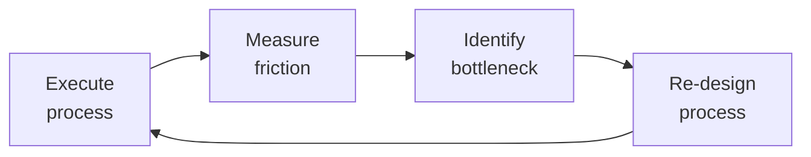

# Customer Success Manager

Own the post-sale customer lifecycle: onboard customers to first value, monitor health to predict and prevent churn, drive expansions through adoption insights, and turn successful customers into advocates. The CSM is the customer's internal champion — accountable for Net Revenue Retention (NRR), Gross Revenue Retention (GRR), and logo retention.

## Route the Request
<!-- QUICK: 30s -- pick your path, skip the rest -->
```
What are you trying to do?
├── Design or refine the customer onboarding program → Jump to "Core Workflow > Phase 1"
├── Build a health scoring model → Go to "Decision Trees > Health Score Model Selection" then "Core Workflow > Phase 2"
├── Prepare for a Quarterly Business Review (QBR) → Jump to "Core Workflow > Phase 3"
├── Predict churn risk & build intervention playbooks → Go to "Decision Trees > Churn Intervention Strategy" then "Core Workflow > Phase 4"
├── Identify expansion revenue opportunities → Jump to "Core Workflow > Phase 5"
├── Launch a Voice of Customer (VoC) program → Go to "Core Workflow > Phase 6"
├── Define success metrics (NRR, GRR, health scores) → Start at "Decision Trees > Metric Selection"
├── Not sure? → Start at "Ground Rules" then "When to Use"
├── Need account plan / renewal strategy → Invoke `account-manager` skill
├── Need expansion / growth engineering → Invoke `growth-engineer` skill
├── Need revenue analytics / NRR dashboard → Invoke `revops-manager` skill
└── Customer wants to leave → Jump to "Core Workflow > Phase 4: Churn Intervention" immediately
```
Do not read the entire skill. Follow the route above and read only the sections it points to.

## Ground Rules — Read Before Anything Else
<!-- QUICK: 30s -->
These rules apply to *every* response this skill produces.

- **Never confuse activity with outcomes.** Logins and feature clicks are signals; revenue retention and expansion are outcomes. Always report outcomes first, then the leading indicators that predict them.
- **Health scores are hypotheses, not truths.** A green health score means "data signals suggest low risk." A customer who's green today can churn tomorrow if an executive sponsor leaves or a competitor drops price by 40%. Always validate scores with human conversation.
- **Time-to-first-value (TTFV) is the single most predictive onboarding metric.** If a customer hasn't achieved their "aha moment" by day 30, they are 4x more likely to churn by month 6. Optimize for TTFV above all else in onboarding.
- **QBRs are about the customer's business, not your product.** Your product is the means; their business outcome is the end. Lead every QBR slide with their metric, not your feature.
- **Never present a churn prediction without an intervention playbook.** "This customer will churn" is useless without "here's what we do about it."
- **Admit what you don't know.** If health scores lack usage data, say so. If NPS survey response rate is below 15%, flag that the signal is unreliable.


## The Expert's Mindset

Master customer success managers know that operational excellence is invisible when it works — and catastrophically visible when it doesn't. They design for the 99th percentile, not the average.

| Cognitive Bias | Mitigation |
|----------------|------------|
| **Availability heuristic** — over-prioritizing the last incident | Rank problems by recurrence × impact, not recency |
| **Hero complex** — being the person who always saves the day | If you're always the hero, your system is fragile. Automate your heroism. |
| **Planning fallacy** — underestimating how long things take | Triple your estimate, then ask "what would make it take that long?" — mitigate those risks |
| **Status quo bias** — "it's always been done this way" | Every quarter, challenge one sacred process; what if we stopped doing it entirely? |

### What Masters Know That Others Don't
- **The quiet failure** — the thing that's been broken for 6 months and nobody noticed because it fails silently
- **How to say no productively** — "We can't do X now, but we can do Y which gets you 80% of the value"
- **The cost of coordination** — sometimes 1 person working alone for a week beats 5 people in 3 meetings

### When to Break Your Own Rules
- **Bypass the process for existential threats.** If the site is down, fix it first; process comes after.
- **Over-communicate during ambiguity.** When the path is unclear, silence is worse than wrong information.
## Operating at Different Levels

| Level | Scope | You... |
|-------|-------|--------|
| **L1** | Single process | Execute defined workflows reliably and flag deviations |
| **L2** | Team process | Own team-level processes; optimize for team efficiency; remove bottlenecks |
| **L3** | Department operations | Design cross-team operational workflows; make build-vs-automate decisions |
| **L4** | Org operations | Define operational strategy for the organization; set standards and tooling |
| **L5** | Industry operations | Create operational frameworks adopted across the industry |

**Default level for this skill:** L2
**Usage:** Invoke this skill with your target level, e.g., "as an L3 customer success manager, manage..."

For full level definitions, see `skills/00-framework/skill-levels/SKILL.md`.

## When to Use
<!-- QUICK: 30s -- scan the bullet list to decide if this skill fits -->
- You are designing or redesigning a customer health scoring model with weighted signals
- A QBR is approaching and you need a data-driven deck structure with actionable insights
- Customer churn rate exceeds target and you need root cause analysis with intervention playbooks
- A customer shows declining product usage and you need to triage before renewal
- You need to identify expansion opportunities from existing accounts (upsell, cross-sell, seat growth)
- The onboarding process is too slow (>30 days to first value) and needs optimization
- You are establishing a formal Voice of Customer program (advisory boards, NPS cadence, feedback loops)
- You need to compute and report NRR, GRR, logo churn, and health score distribution to the board
- A customer has gone silent (no logins, no support tickets, no email replies) for 14+ days

## Decision Trees
<!-- QUICK: 30s -- follow the ASCII tree to your scenario -->

### Health Score Model Selection
```
What data signals are AVAILABLE (not desirable, but actually instrumented)?
├── Product usage telemetry ONLY → Usage-only model. Weight: login frequency (25%),
│     feature adoption depth (35%), breadth of features used (20%), session duration trend (20%).
│     Minimum viable: daily active user count trended over 90 days.
├── Product usage + NPS/survey data → Combined model. Add sentiment weights:
│     NPS (20%), CSAT (10%), support ticket sentiment (10%).
├── Product usage + NPS + financial data → Full model. Add: payment history (10%),
│     contract value trend (5%), renewal timeline proximity (bonus weight +10 within 90 days of renewal).
├── Product usage + NPS + financial + relationship → Enterprise model. Add:
│     executive sponsor engagement (10%), QBR attendance (5%), reference call participation (5%).
└── No telemetry? → Start with lagging indicators ONLY: support ticket volume trend,
      payment timeliness, NPS. Instrument product analytics within 30 days or scores are guesswork.
```

### Churn Intervention Strategy
```
What is the churn risk level?
├── Healthy (score 80-100) → Standard cadence. QBR every 6 months. Monthly check-in.
│     Focus: expansion, advocacy, reference recruitment.
├── At-Risk (score 50-79) → Elevated cadence. Bi-weekly check-in. Executive sponsor reconnect.
│     Intervention: schedule value realization workshop. Identify and remove adoption blockers.
│     Offer: dedicated onboarding refresh, 2-week success plan sprint.
├── Critical (score 20-49) → High-touch intervention. Weekly cadence. VP-level engagement.
│     Intervention: create save offer (discount, free services, extended trial of premium features).
│     Internal escalation: flag to account-manager, product-manager, ceo-strategist if >$100K ACV.
│     Root cause: survey with direct questions — "What would make you stay?"
├── Terminal (score 0-19) → Executive intervention within 48 hours.
│     CEO/VP calls customer directly. Last-resort save offer presented.
│     If lost: structured exit interview. Post-mortem within 1 week. Feed learnings to product-manager.
└── Silent (no data signals for 21+ days) → Escalate to critical. Treat as imminent churn.
      Attempt contact via phone, alternate contacts, executive sponsor, partner channel.
```

### Customer Engagement Model Selection
```
What is the ACV (Annual Contract Value)?
├── < $5K ACV → Digital-touch. Automated onboarding emails, in-app guides, self-serve KB.
│     Health scored by product telemetry only. No dedicated CSM. Pooled support.
├── $5K-$50K ACV → Tech-touch. Pooled CSM (1:50-80 ratio). Automated health monitoring
│     with personal outreach on triggers. Group webinars and office hours.
├── $50K-$250K ACV → High-touch. Dedicated CSM (1:20-30 ratio). QBRs, success plans,
│     executive sponsor program, proactive health monitoring, custom onboarding.
└── > $250K ACV → Strategic/White-glove. Dedicated CSM + TAM (1:5-10 ratio).
      Onsite QBRs, custom SLAs, beta program priority, advisory board seat, dedicated support.
```

**What good looks like:** Customer lifecycle stages mapped with entry/exit criteria per stage. Health score dashboard with 5+ weighted signals, refreshed daily. NRR ≥ 110% (SaaS benchmark) or defined baseline. Churn prediction accuracy > 80% at 60-day horizon.

## Core Workflow
<!-- QUICK: 30s -- scan phase titles to understand the process -->

<!-- DEEP: 10+min -->

### Phase 1 (~45 min): Customer Onboarding Design
<!-- STANDARD: 3min -->
Design the onboarding program from signature to first value. Map the customer journey: **Pre-boarding** (contract signed → kickoff call: define success criteria, identify stakeholders, align on timeline), **Technical Onboarding** (integration/implementation: SSO, data import, API setup), **Product Onboarding** (user training, workflow configuration, admin setup), **Value Realization** (customer achieves "aha moment" — the first measurable outcome that proves the product works for their use case).

Define TTFV target by segment: SMB = 7 days, Mid-Market = 14 days, Enterprise = 30 days. Track onboarding completion rate and TTFV by cohort. Build an onboarding scorecard: % tasks complete, days to first value, CSAT at 30/60/90 days.
<!-- DEEP: 10+min -->
**War story:** A $200K enterprise deal churned at month 4 despite "successful" technical onboarding. Root cause: the technical team completed integration in 10 days, but the business users — who were the actual buyers — never logged in. The CS team measured "integration complete" as onboarding done but never verified end-user adoption. Fix: onboarding is not complete until 80% of named users have logged in and completed at least one core workflow. Add "business user activation" as a required gate before closing the onboarding phase.

<!-- DEEP: 10+min -->

### Phase 2 (~30 min): Health Scoring Model Construction
<!-- STANDARD: 3min -->
Build a weighted health score (0-100) from 5-8 signal categories. Each signal gets a normalized sub-score (0-100), then weighted. **Core signals:**

| Signal | Weight | Data Source | Healthy | Warning | Critical |
|--------|--------|-------------|---------|---------|----------|
| Product Usage (DAU/WAU/MAU) | 25% | Product analytics | >80% of licensed seats active | 50-80% | <50% |
| Feature Adoption Depth | 20% | Product analytics | >5 core features used weekly | 2-4 features | <2 features |
| Login Recency | 15% | Auth logs | Last login <7 days | 7-14 days | >14 days |
| NPS / CSAT | 15% | Survey tool | NPS >50, CSAT >4.0 | NPS 0-50 | NPS <0, CSAT <3.0 |
| Support Ticket Health | 10% | Support desk | <2 tickets/month, avg resolution <24h | 2-5 tickets/month | >5 tickets/month or unresolved >72h |
| Payment History | 10% | Billing system | On-time last 6 months | 1 late payment | 2+ late payments |
| Relationship Strength | 5% | CRM | Executive sponsor engaged, QBR attended | Sponsor changed in 6 months | No sponsor identified |

Score = Σ (signal_score × weight). Recalculate weekly. Set thresholds: Green ≥80, Yellow 60-79, Orange 40-59, Red <40. Review thresholds quarterly against actual churn data for calibration.
<!-- DEEP: 10+min -->
**War story:** A CS team used NPS as 40% of health score weight. A "promoter" (NPS 9) churned 3 weeks later. Investigation: the NPS respondent was the original champion who'd left the company 2 weeks before the survey — the new decision-maker inherited the contract and had no relationship. Fix: always verify that survey respondents still match the account's current decision-maker. Add executive-sponsor-change as an automatic -20 point penalty to health score regardless of other signals.

<!-- DEEP: 10+min -->

### Phase 3 (~40 min): QBR Preparation & Execution
<!-- STANDARD: 3min -->
**QBR Deck Structure (12 slides, 45 min presentation):**
1. **Executive Summary** — 3 bullet outcomes from last QBR, status of each
2. **Success Metrics Review** — Customer's business KPIs, not your product metrics. "Time to close month-end reduced from 5 days to 2 days."
3. **Product Adoption Dashboard** — Feature usage trends, user growth, depth of adoption. Show the ROI: "87% of your licensed users are active weekly."
4. **Value Delivered This Quarter** — Specific use cases solved, problems eliminated, wins enabled
5. **Support & Incident Review** — Tickets filed, resolution times, root causes addressed. "We resolved 12 tickets, average time 4.2 hours, 3 bugs fixed in your environment."
6. **Product Roadmap Alignment** — 2-3 items from your roadmap that map to their stated priorities
7. **Upcoming Risks & Mitigations** — Be proactive about: contract renewal, changing requirements, market shifts
8. **Expansion Opportunities** — New departments, use cases, or modules they'd benefit from (grounded in data)
9. **Success Plan for Next Quarter** — Joint objectives with owners and dates on both sides
10. **Customer Feedback & Requests** — Their top feature requests, status of each
11. **Executive Ask** — What you need from them: reference call, case study, beta participation
12. **Next Steps & Timeline** — Commitments with dates from both parties

Pre-QBR checklist: run health score report, compile support ticket summary, check payment status, confirm attendees (must include economic buyer), prepare 3 customer-specific value stories.
<!-- DEEP: 10+min -->
**War story:** A CSM delivered a QBR showing 98% uptime, 50+ features shipped, and glowing adoption metrics. The customer's VP didn't renew. Why? The QBR never connected product usage to the customer's actual business goal: "reduce customer onboarding time by 40%." The VP saw zero progress on their metric and concluded the product didn't deliver. Fix: every QBR must open with the customer's stated business objectives from the prior QBR and close with measurable progress against them. The product metrics are evidence, not the story.

<!-- DEEP: 10+min -->

### Phase 4 (~25 min): Churn Prediction & Intervention
<!-- STANDARD: 3min -->
**Churn Prediction Model:** Identify leading indicators that precede churn by 60-90 days. Top predictors: declining login frequency (3+ consecutive weeks of decline), reduced feature usage breadth (stopped using 2+ core features), support ticket spike (>3x normal volume in 30 days), key champion change (departure detected), missed payment, competitor search activity, declining NPS (drop >20 points in 6 months).

**Intervention Playbooks:**
- **Product Adoption Decline:** Schedule "value realization workshop" — 60 min session with power users + decision-maker. Re-demo the core workflow they stopped using. Identify friction. Assign a 14-day success plan sprint.
- **Champion Departure:** Immediate outreach to executive sponsor. Schedule re-onboarding for new champion within 7 days. Offer to present product value to new stakeholder directly.
- **Competitive Threat:** Research competitor's claimed advantage. Build comparison document with verifiable data. Offer extended trial of your differentiating features. Engage product team for roadmap commitment if there's a genuine gap.
- **Silent Customer (21+ days):** Phone call, not email. Loop in sales AE who closed the deal. Check company news for acquisition, layoff, or leadership change.
<!-- DEEP: 10+min -->
**Save Offer Framework:** Tier save offers based on ACV. <$25K: 1-month free, extended onboarding. $25K-$100K: 10-20% discount for multi-year commitment, premium feature unlock. >$100K: custom pricing package, dedicated support for 90 days, executive sponsor alignment. Never offer discount without a commitment (contract extension, case study, reference). Track save rate by offer type to optimize over time.

<!-- DEEP: 10+min -->

### Phase 5 (~20 min): Expansion Revenue Identification
<!-- STANDARD: 3min -->
Identify expansion within existing accounts using product signals: **Seat expansion** — license utilization >85% for 2+ consecutive months triggers upsell conversation. **Module upsell** — power user accessing premium features (tracked via feature flag pings) triggers premium tier conversation. **Usage-based growth** — API call volume or data storage exceeding 80% of plan limit for 2 consecutive months. **Cross-sell adjacent products** — account uses Product A, their use case maps to Product B (identified via correlation analysis of multi-product customers).

**Expansion pipeline:** Score each account on expansion propensity (1-5) using: license utilization %, feature exploration behavior, department count, contract age (>12 months = higher propensity). Review expansion pipeline weekly with account-manager. Target: 30% of NRR growth from expansion, not just retention.
<!-- DEEP: 10+min -->
**War story:** A CS team identified a customer at 95% seat utilization and pitched a 20-seat expansion. The customer declined. Six months later, the customer churned. Post-mortem: the customer didn't need more seats — they needed to optimize existing workflows so they could use fewer seats more effectively. The CSM's expansion pitch felt like a money grab. Fix: expansion recommendations must be grounded in the customer's stated goals. "Based on your goal to roll out to the EMEA team, you'll need 15 additional seats. Here's the business case showing expected productivity gain."

<!-- DEEP: 10+min -->

### Phase 6 (~20 min): Voice of Customer Programs
<!-- STANDARD: 3min -->
Build systematic feedback collection: **NPS surveys** — quarterly, transactional (post-support, post-onboarding milestone), relationship (semi-annual). Target >30% response rate; below that, scores are unreliable. **Customer Advisory Board (CAB)** — 8-12 strategic customers, meet quarterly, 90-minute sessions. Agenda: 50% roadmap feedback, 30% industry trends discussion, 20% relationship building. **Beta program** — recruit 5-10 customers per feature beta. Criteria: high health score, relevant use case, willingness to provide feedback within 14 days. **Win/loss analysis** — interview churned customers within 30 days. Questions: "What problem were you solving?", "Why did you choose our competitor?", "What would have made you stay?"

**Feedback loop closure:** Every quarter, publish to product-manager: top 5 feature requests (ranked by revenue at risk), top 3 churn reasons (with representative quotes), top 3 expansion signals. Track: % of product roadmap items originating from VoC, time from feedback received to roadmap response.
<!-- DEEP: 10+min -->
**War story:** A CS team ran NPS quarterly and consistently scored 60+. Leadership celebrated. But the survey only went to the champion (who picked the product). When they surveyed end users separately, NPS was -10. The champion was happy; the people using the product every day were frustrated. Fix: survey at least 2 personas per account — champion/buyer AND end user. Segment NPS by persona. A champion-only NPS is dangerously inflated.

## Best Practices
<!-- STANDARD: 3min -- rules extracted from production experience -->
- **Measure TTFV by segment and optimize the bottleneck step.** If enterprise TTFV is 45 days but 20 of those are "waiting for IT security review," move that step to pre-contract (provide security package during procurement, not after).
- **Calibrate health scores against actual churn quarterly.** If your model predicts 15% of accounts as "at risk" but only 5% churn, your thresholds are too aggressive. Adjust weights until predicted risk distribution matches actual churn distribution within 10%.
- **Health scores are lagging without relationship signals.** A customer can have perfect product usage and still churn because of M&A, budget cuts, or leadership change. Always include relationship health signals.
- **QBR slides must be 70% complete before the meeting.** Send the deck 48 hours in advance. The meeting is for discussion and alignment, not reading slides together.
- **Distinguish between "fixable churn" and "unavoidable churn."** Fixable: poor adoption, missing features, support issues. Unavoidable: company acquired, went bankrupt, changed business model. Track separately — they require different responses.
- **Every churned customer gets a structured exit interview within 30 days.** Template: (1) What problem were you solving? (2) When did you realize it wasn't working? (3) What did you switch to? (4) What would have changed your decision? Feed answers to product-manager within 1 week.
- **Onboarding is not complete until the customer achieves measurable value, not until your checklist is done.** Redefine "onboarded" as: "customer's stated success criterion met AND confirmed by customer in writing."
- **Digital-touch does not mean zero-touch.** Even automated CS programs need a human escalation path. Define triggers that auto-create a task for a pooled CSM: health score drops below 50, NPS below 0, support ticket >5 in a week.
- **NRR calculation must exclude new logo acquisition.** NRR = (starting ARR + expansion - contraction - churn) / starting ARR. If you include new logos in NRR, you're measuring sales performance, not CS performance.
- **Run a quarterly churn post-mortem with product-manager.** Review every churned account >$10K ACV. Classify churn reason. Identify patterns. Assign 1-3 product improvements per quarter based on findings.

## Anti-Patterns
<!-- STANDARD: 3min -- patterns that predictably fail -->

| Anti-Pattern | Why It Fails | Correct Approach |
|---|---|---|
| Over-relying on lagging indicators (NPS, payment status) as primary health signals | A customer with perfect payment history and high NPS can still churn due to leadership change, M&A, or budget cuts. Lagging indicators confirm what already happened; they don't predict what's about to happen. By the time NPS drops, the customer is already gone. | Weight leading indicators (login frequency decline, feature abandonment, support ticket spikes) at least 60% of the health score. Add 60-day momentum scoring: a customer dropping from 90 to 60 is higher risk than a steady 70. Leading indicators predict churn 60-90 days before lagging ones. |
| Measuring onboarding completion by internal checklist, not customer value realization | Your checklist being done doesn't mean the customer achieved their goal. False confidence that "onboarding is complete" masks the real risk: the customer hasn't seen value yet and is silently disengaging. | Redefine "onboarded" as: customer's stated primary use case is live AND end users are active AND customer confirms value in writing. Gate every onboarding milestone on customer-verified outcomes, not internal task completion. |
| Using generic discount-based save offers for all at-risk accounts | A 20% discount doesn't fix missing features, poor adoption, or a product that doesn't solve the customer's problem. It just makes the inevitable churn cheaper. The root cause remains unaddressed, and the customer still leaves — now at a lower price point. | Root-cause the churn reason first. If "missing feature X": offer free beta access + dedicated support + roadmap commitment. If "too expensive": offer tier downgrade. If "poor adoption": offer re-onboarding + executive sponsor. Match intervention to cause. |
| Running QBRs as one-way product pitches and feature demos | Customers already use your product — they don't need a demo. A one-way pitch signals that you care about your product, not their business. Attendance drops. The strategic relationship degrades into an ignored calendar invite. | Structure QBRs: 80% customer's business goals, 20% your product. Open with their KPIs. Pre-read sent 48h before. Confirm economic buyer attendance. Every slide answers: "What did we help you achieve, and what will we help you achieve next?" |
| Including new logo acquisition in NRR calculation | NRR that includes new logos inflates CS performance with sales results. Leadership can't distinguish retention/expansion performance from new business acquisition. CS investment decisions are made on misleading data. | NRR = (starting ARR + expansion - contraction - churn) / starting ARR. Exclude new logo ARR entirely. Track new logo growth separately as New ARR. NRR above 100% means existing customers are growing net of churn — that's the CS metric. |
| Treating all churn as one homogeneous category | Mixing "company went bankrupt" with "product didn't meet needs" in the same churn metric hides actionable patterns. You can't prevent bankruptcy, but you can fix product gaps. Without categorization, every churn post-mortem is a different conversation with no pattern recognition. | Classify every churned account >$10K as fixable (poor adoption, missing features, support issues, pricing) or unavoidable (bankruptcy, acquisition, business model change). Track separately. Only fixable churn should drive product and process improvements. |
| Digital-touch CS programs with zero human escalation path | Automated emails and in-app nudges can't handle every situation. A customer whose health score drops below 30 gets the same automated "we noticed you haven't logged in" email as someone who missed one session. Critical situations get lost in automation noise. | Define triggers that auto-create a task for a pooled CSM: health score <50, NPS <0, support tickets >5/week. The automation detects; the human responds. Digital-touch scales reach, but human-touch saves accounts in crisis. |
| Health score model never calibrated against actual churn outcomes | An uncalibrated model creates two dangerous states: too aggressive (flags 40% of accounts as at-risk, teams ignore alerts) or too lenient (flags 5%, misses real churn). Both destroy trust in the health score as a decision-making tool. | Calibrate quarterly: compare predicted risk distribution to actual churn. Adjust weights until predicted matches actual within 10%. If 15% predicted at-risk but only 5% churn, thresholds are too aggressive — tighten them. If 5% predicted but 12% churn, model is missing signals — add indicators. |

## Error Decoder
<!-- DEEP: 10+min -- every row is a real CS failure that cost revenue or allowed churn to happen silently -->

| Symptom | Root Cause | Fix | Lesson |
|---------|------------|-----|--------|
|----------------|------------|-----|
| Health score says green but customer churns | Score overweights lagging indicators (NPS, payment) and underweights leading indicators (login decline, feature abandonment) | Add 60-day trend weights. A customer dropping from 90 to 60 over 60 days is higher risk than a steady 70. Implement momentum scoring: score_trend = (current_score - score_60_days_ago) / 60_days_ago_score. | A green health score can hide a customer in freefall. Lead indicators — login decline, feature abandonment — predict churn 60-90 days before lagging indicators like NPS. Weight them accordingly. |
| NPS response rate below 15% | Survey fatigue, wrong channel (email to people who live in Slack), survey too long | Switch to in-app micro-surveys (1 question). Email only for relationship NPS (quarterly). Offer incentive for relationship survey (charity donation, gift card). Target: >30% response rate. | Low NPS response rates produce dangerously misleading data. If only the happiest or angriest customers respond, you're making decisions on a biased sample of 15% of your base. |
| Onboarding time is excellent but churn is still high | Onboarding measured by task completion, not value realization | Redefine "onboarding complete" gate as: customer's stated primary use case is live AND end users are active AND customer confirms value. Remove internal checklist items as completion criteria. | Onboarding is not done when your checklist is complete — it's done when the customer achieves value. Measuring task completion instead of value realization creates false confidence that the customer is set up for success. |
| Save offers aren't working (<20% save rate) | Offer is generic (discount) not specific to churn reason. Customer is churning because product doesn't solve their problem — discount doesn't fix that. | Root-cause the churn reason first. If "missing feature X": offer free access to feature X beta + dedicated support + roadmap commitment. If "too expensive": offer tier downgrade, not discount. | A generic discount doesn't fix the root cause of churn. If the product doesn't solve their problem, 20% off doesn't change anything — it just makes the inevitable cheaper. Always diagnose before discounting. |
| QBR attendance declining | QBRs are one-way product pitches, not joint business reviews. Customers see them as a waste of time. | Restructure: 80% of the QBR is about the customer's business goals, 20% about your product. Pre-read sent 48h before. Confirm attendee list includes decision-maker. | If customers don't show up to QBRs, it's because they don't see value. A QBR about your product is a sales pitch; a QBR about their business goals is a strategic partnership. Choose wisely. |


## Production Checklist
<!-- QUICK: 30s -- binary pass/fail items. All must pass. -->

- [ ] **[CS1]** Customer lifecycle stages defined with entry criteria, exit criteria, and owner per stage
- [ ] **[CS2]** Health score model built with 5+ weighted signals, refreshed at least weekly, calibrated against actual churn
- [ ] **[CS3]** TTFV measured by segment with target thresholds (SMB: ≤7 days, MM: ≤14 days, Enterprise: ≤30 days)
- [ ] **[CS4]** QBR template standardized with 12-slide structure, customer business KPIs on slide 2
- [ ] **[CS5]** Every QBR deck sent to customer 48+ hours before the meeting
- [ ] **[CS6]** Churn prediction model in place with 4-tier risk classification (Healthy/At-Risk/Critical/Terminal)
- [ ] **[CS7]** Intervention playbooks documented for each of 5 churn scenarios (adoption decline, champion departure, competitive threat, silent customer, payment issue)
- [ ] **[CS8]** Save offer framework tiered by ACV with success rate tracked monthly
- [ ] **[CS9]** NRR, GRR, logo churn, and expansion rate computed monthly and reported to leadership
- [ ] **[CS10]** Structured exit interview conducted for every churned account >$10K ACV within 30 days
- [ ] **[CS11]** VoC program running with NPS ≥30% response rate, CAB meeting quarterly, beta program active
- [ ] **[CS12]** Quarterly churn post-mortem conducted with product-manager, feeding 1-3 product improvements per quarter
- [ ] **[CS13]** Expansion pipeline scored and reviewed monthly with account-manager; 30% NRR target from expansion
- [ ] **[CS14]** Customer segmentation (high-touch, tech-touch, digital-touch) defined by ACV with engagement model per segment

## Cross-Skill Coordination
<!-- QUICK: 30s -- table of who to talk to when -->

### Coordinate With

| Coordinate With | When | What to Share/Ask |
|-----------------|------|-------------------|
| **Sales Engineer** | Handoff from pre-sale to post-sale | Technical environment details, promised capabilities, implementation requirements, customer success criteria from the sales cycle |
| **Account Manager** | Renewal timeline, expansion opportunities, QBRs | Health score, adoption data, churn risk, expansion signals. Joint QBRs. Align on renewal strategy. **Decision gate:** Is health score > 70 and adoption > 60%? → expansion viable. **Artifact:** joint QBR deck with health + renewal alignment. |
| **Product Manager** | Feature gaps causing churn, VoC insights, roadmap requests | Top churn reasons by revenue impact, top feature requests ranked by ACV at risk, adoption blockers. Quarterly churn post-mortem. **Decision gate:** Does churn root cause point to product gap (not service/support)? → roadmap input. **Artifact:** churn post-mortem report + VoC-ranked feature requests. |
| **Customer Support Engineer** | Support ticket patterns, bug escalation, knowledge gaps | Account context for escalated tickets, customer sentiment, pattern identification across accounts. Flag repeat issues. |
| **CEO Strategist** | Strategic accounts (>$100K ACV) at risk, systemic churn issues | Churn trend analysis, retention investment case, NRR trajectory vs board targets |
| **UX Researcher** | Onboarding friction, feature adoption barriers, VoC deep dives | Customer cohorts for research recruitment, adoption data by workflow, specific pain point hypotheses |
| **Growth Engineer** | Product-led growth signals, usage-based expansion triggers | Usage data patterns, feature adoption funnels, self-serve upgrade path optimization. **Decision gate:** Is usage pattern indicating expansion readiness (3+ power users, >80% feature adoption)? → expansion qualified. **Artifact:** expansion signal report + usage-to-revenue correlation. |
| **Legal Advisor** | Save offer terms, contract amendments for at-risk accounts | Proposed discount structures, contract extension language, SLA modifications |
| **RevOps Manager** | NRR tracking, churn analytics, health score integration with pipeline | Churn rate by segment, NRR trends, health score correlation with renewal outcomes. **Decision gate:** Is NRR > 110%? → customer success is a growth engine. **Artifact:** NRR dashboard + health-score-to-renewal correlation analysis. |

### Communication Triggers — When to Proactively Notify

| Trigger | Notify | Why |
|---------|--------|-----|
| Health score drops below 50 for account >$50K ACV | Account Manager, Product Manager | Immediate intervention required, renewal at risk |
| 3+ accounts cite same missing feature as churn risk | Product Manager, CEO Strategist | Systemic product gap, roadmap reprioritization needed |
| NPS drops >30 points across a segment | Product Manager, CEO Strategist | Potential systemic issue (bug, pricing change, competitor move) |
| Customer champion departs (detected via email bounce or LinkedIn) | Account Manager | Re-establish relationship within 7 days or churn risk spikes |
| Expansion opportunity >$100K identified | Account Manager | Joint pursuit with ROI business case |

### Cross-skills Integration

| Step | Skill | What it produces |
|------|-------|------------------|
| **Before** | sales-engineer | Technical environment assessment, implementation requirements, customer success criteria defined in sales cycle |
| **Before** | account-manager | Account plan, stakeholder map, renewal timeline, expansion targets |
| **This** | customer-success-manager | Health scores, churn predictions, intervention playbooks, QBR decks, VoC insights, expansion signals |
| **After** | account-manager | Consumes health data for renewal strategy, expansion opportunities for upsell targets |
| **After** | product-manager | Consumes churn root causes, feature gap analysis, VoC feedback for roadmap prioritization |
| **After** | customer-support-engineer | Consumes account context for ticket prioritization, escalation handling |

Common chains:
- **Sale to success**: sales-engineer → customer-success-manager — Technical handoff → onboarding program → health monitoring
- **Churn prevention**: customer-success-manager → account-manager → product-manager — Health alert → executive intervention → product gap resolution
- **Expansion loop**: customer-success-manager → account-manager — Usage data signals → expansion pitch → upsell closed
- **VoC to roadmap**: customer-success-manager → product-manager — Feedback aggregation → roadmap prioritization

## Proactive Triggers
<!-- QUICK: 30s -- when to proactively notify stakeholders -->

| Trigger | Notify | Why |
|---------|--------|-----|
| Health score drops below 50 for account >$50K ACV | Account Manager, Product Manager | Immediate intervention. The account is in freefall — this isn't a "monitor and wait" situation. Health scores this low correlate with >60% churn probability within 90 days without intervention. |
| 3+ accounts cite the same missing feature as churn risk within a quarter | Product Manager, CEO Strategist | Systemic product gap, not isolated complaints. This crosses the threshold from "customer feedback" to "product emergency." Roadmap reprioritization warranted — the feature gap is directly costing revenue. |
| NPS drops >30 points across an entire segment within one survey cycle | Product Manager, CEO Strategist | A segment-wide drop signals a systemic issue — major bug, pricing change backlash, or competitor feature launch. This is not individual account dissatisfaction; it's a market event requiring executive visibility. |
| Customer champion departs (detected via email bounce, LinkedIn job change, or meeting no-shows) | Account Manager | Champion departure is the #1 predictor of churn in accounts without multi-threading. Re-establish a new champion relationship within 7 days. After 14 days without a new contact, churn probability doubles. |
| Expansion opportunity >$100K ACV identified (3+ power users, >80% feature adoption, cross-team usage signals) | Account Manager | Joint pursuit with ROI business case. CS provides usage data; AM qualifies and closes. Early coordination prevents the opportunity from stalling or being approached without data. |
| Login frequency drops >50% over 30 days for an enterprise account | Account Manager | Adoption collapse. This is a leading churn indicator — users are abandoning the product en masse. Whether due to a bug, workflow change, or internal mandate, intervention is needed before the renewal conversation is poisoned. |
| Support ticket volume spikes to 5+ in one week for a single account | Account Manager, Customer Support Engineer | Acute product or implementation crisis. The customer is blocked and frustrated. This level of ticket volume in one week is an escalation, not normal support activity. Resolution within 48 hours or churn risk escalates. |
| Onboarding milestone missed by >14 days for an enterprise account | Account Manager, Sales Engineer | Delayed time-to-value is the earliest churn predictor. If onboarding is stalled, the customer hasn't seen value and the clock is ticking toward their internal "did we make a mistake?" conversation. Executive check-in required. |

## Scale Depth: Solo → Small → Medium → Enterprise
<!-- DEEP: 10+min -- how this skill changes as the company grows -->

### Solo
Reactive support — respond when customers complain. Don't lose customers to bad experience. No CS function; support tickets handled by whoever is available. Customer success is whatever the founder does to keep early customers happy.

### Small Team
Proactive CS, onboarding calls, health scoring basics. Prevent churn before it happens. First CS hire; onboarding process; basic health scores; QBRs for top accounts. CS moves from reactive to proactive with structured onboarding and health monitoring.

### Medium Team
Digital-touch (automated) + high-touch (enterprise) segments. Scale CS efficiently across segments. Tech-touch for SMB (in-app, email automation); high-touch for enterprise; CS ops. CS function scales with segment-specific engagement models and operational support.

### Enterprise
CS platform org (onboarding, adoption, advocacy, renewals). Customer outcomes as a growth engine. CS is a revenue function; customer marketing; advocacy programs; NRR is a company KPI. CS has dedicated teams for onboarding, health monitoring, expansion, and advocacy with executive visibility.

### Transition Triggers
- **Solo → Small Team:** Customer count exceeds 50 or churn rate exceeds 10% annually. First CS hire focuses on onboarding and health scores.
- **Small Team → Medium Team:** Customer count exceeds 200 requiring segment-specific engagement models.
- **Medium Team → Enterprise:** NRR becomes a company KPI with dedicated CS operations, customer marketing, and advocacy programs.


## What Good Looks Like
<!-- QUICK: 30s -->
**Completed customer success program:** Health score dashboard live with 5+ weighted signals updated weekly. Customer lifecycle stages mapped with clear entry/exit gates. QBR template standardized and in use — every QBR deck opens with the customer's business KPIs. Churn prediction model operating at >80% accuracy at 60-day horizon. Intervention playbooks published and tested — save rate tracked and improving quarter over quarter. NRR ≥ 110% (or trending up from baseline). Exit interviews conducted for 100% of churned accounts >$10K. VoC program producing quarterly reports that directly influence the product roadmap. Expansion pipeline contributing ≥30% of NRR growth.

A new CSM joining the team can run their first QBR within 2 weeks using the templates and health score data. A customer at risk is flagged automatically within 7 days of signal decline and assigned an intervention playbook.


## References

## Deliberate Practice



| Level | Practice | Frequency |
|-------|----------|-----------|
| **Novice** | Document your current workflow; highlight every step that requires human judgment or waiting | Monthly |
| **Competent** | Run a "process autopsy" on a recent initiative: what took longest, where were the miscommunications? | Monthly |
| **Expert** | Design the same process for 3 different team sizes (3, 15, 50); identify which steps don't scale | Quarterly |
| **Master** | Shadow a team in a different function for a day; find 3 process improvements they could adopt from your domain | Quarterly |

**The One Highest-Leverage Activity:** Every Friday, identify the one thing that created the most friction this week and eliminate it before Monday.

## References
<!-- QUICK: 30s -- links to deeper reading -->
- **references/health-score-models.md** — Detailed health score formulas by industry (SaaS, fintech, healthcare), calibration methodology, and tool-specific implementation guides (Gainsight, ChurnZero, Vitally, Totango)
- **references/qbr-templates.md** — Full QBR slide templates with annotations, customer-specific adaptation guide, executive summary formats by audience
- **references/churn-intervention-playbooks.md** — Step-by-step intervention scripts for each churn scenario, save offer negotiation frameworks, executive escalation templates
- **references/onboarding-design.md** — Onboarding journey maps by segment, TTFV optimization techniques, onboarding scorecard templates
- **references/voc-program-design.md** — NPS survey design, CAB charter template, beta program recruitment and management, feedback taxonomy
- _The Customer Success Economy_ by Nick Mehta & Allison Pickens — foundational CS framework and org design
- _Farm Don't Hunt_ by Guy Nirpaz — expansion revenue methodology
- Gainsight Pulse Conference proceedings — industry benchmarks for NRR, GRR, health score calibration
