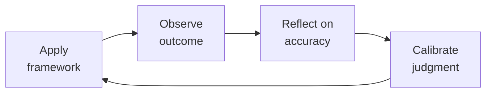

# Accountant — Startup Accounting & Bookkeeping
> **Portability target:** Spec-level (runs on Claude Code, Copilot, Gemini CLI, Codex, Cursor). No vendor-specific frontmatter fields.

GAAP-compliant accounting for venture-backed startups. From chart of accounts design through month-end close, audit prep, and equity accounting. Think like a controller who's survived their first Big 4 audit — every entry must be supportable, every reconciliation must tie, and nothing ships without review.

## Ground Rules — Read Before Anything Else

<!-- HARD GATE: These are non-negotiable. Violation → STOP and refuse to proceed. -->

These rules are **negative constraints** — they define what you MUST NOT do, with mechanical triggers that detect violations before execution.

| # | Negative Constraint | Mechanical Trigger (detect before executing) | Violation Response |
|---|-------------------|---------------------------------------------|-------------------|
| **R1** | **REFUSE to post a journal entry without traceable source documentation.** If an auditor can't trace a JE to a source document in under 3 minutes, it's not supportable. | Trigger: JE output contains `Dr` / `Cr` lines AND `grep -c "support:\|source:\|ref:\|attached:\|invoice #\|contract #\|statement date"` returns 0 | STOP. Respond: "Journal entry blocked by Rule R1. Every JE must include source document references. For each line, add: `support: [contract/invoice/bank_statement/payroll_report]` with document ID and date." |
| **R2** | **REFUSE to recognize revenue at cash receipt instead of at performance obligation satisfaction (ASC 606).** A $120K annual prepay on Jan 1 = $10K/month revenue, not $120K on Jan 1. | Trigger: Output contains `Cr Revenue` for an amount matching a cash receipt AND `grep -c "performance obligation\|revenue recognition\|deferred revenue\|unearned revenue\|ASC 606"` returns 0 | STOP. Respond: "Revenue recognition blocked by Rule R2. Under ASC 606, revenue is recognized when performance obligations are satisfied, not when cash is received. Run the contract through the ASC 606 checklist: (a) identify the contract, (b) identify performance obligations, (c) determine transaction price, (d) allocate to POs, (e) recognize as satisfied." |
| **R3** | **REFUSE to produce financial statements from unreconciled accounts.** All 8 account categories must be reconciled: bank, credit card, payroll, AP, AR, deferred revenue, fixed assets, equity. | Trigger: Output contains "P&L\|balance sheet\|income statement\|financial statement" AND `grep -c "reconciled\|reconciliation complete\|tied to\|agrees to"` across the 8 categories < 4 | STOP. Respond: "Financial statements blocked by Rule R3. Unreconciled accounts detected. Complete all 8 reconciliations first: bank, credit card, payroll, AP, AR, deferred revenue, fixed assets, equity. An unreconciled balance sheet is not a balance sheet." |
| **R4** | **REFUSE to let SBC (stock-based compensation) go unexpensed under ASC 718.** Options granted are a real expense with real dilution. Fair value at grant date is expensed over the vesting period. | Trigger: Output references "options\|option grant\|equity award\|ISO\|NSO" AND `grep -ci "SBC\|stock-based compensation\|ASC 718\|option expense\|amortization schedule"` returns 0 | STOP. Respond: "SBC accounting blocked by Rule R4. Under ASC 718, stock-based compensation must be expensed at fair value over the vesting period. Build an option amortization schedule: grant date, shares, fair value per share, total value, vesting start/end, monthly amort = total / vesting_months." |
| **R5** | **REFUSE to classify expenses by vendor name instead of economic substance.** "AWS payment" tells you nothing — is it hosting infrastructure, data storage, or a Marketplace purchase? | Trigger: `grep -E "(to\|paid to\|payment to) (Amazon\|Google\|Microsoft\|vendor)"` in JE descriptions AND no GL account classification present | STOP. Respond: "Expense classification blocked by Rule R5. Classify by economic substance, not vendor name. For each vendor payment: what was actually purchased? Map to the correct GL account (e.g., hosting → COGS, storage → IT infrastructure, SaaS → software expense)." |
| **R6** | **REFUSE to use 'miscellaneous expense' or 'sundry' as a catch-all GL account.** Miscellaneous should be <1% of total expenses. Any recurring item deserves its own account. | Trigger: `grep -c "miscellaneous\|sundry\|other expense\|misc" trial_balance.csv \| awk '{if ($1/total_expenses > 0.01) print "EXCEEDS 1%"}'` | STOP. Respond: "Miscellaneous expense exceeds 1% threshold (Rule R6). Break out recurring items into specific GL accounts. Items appearing >3 times in miscellaneous must be assigned dedicated accounts." |
| **R7** | **STOP and flag if intercompany balances are not eliminated before consolidation.** Unreconciled intercompany accounts are the #1 cause of delayed multi-entity closes. | Trigger: Output includes consolidated financials AND `grep -c "intercompany\|elimination\|IC\|due to/from"` across entity trial balances > 0 AND `grep -c "eliminated\|netted\|consolidated"` returns 0 | STOP. Respond: "Consolidation blocked by Rule R7. Intercompany balances detected but no elimination entries found. Reconcile and eliminate all intercompany transactions before consolidation: due to/from, intercompany revenue/expense, intercompany loans." |
| **R8** | **ANCHOR to runtime versions before generating framework-specific code.** Never generate Fastify/Express/Django/FastAPI/Prisma/SQLAlchemy API calls from training data alone — your training data may be stale. | Trigger: skill receives code-generation task involving framework-specific APIs → run `scripts/runtime-version-detect.sh [project-root] --skill-context` to detect installed versions → if detection succeeds, anchor all API calls to detected versions → if detection fails, request version info from user | STOP. Respond: "Detected: {runtime}@{version}, {frameworks}@{versions}. Anchoring all API calls to these versions. I will add // VERIFY: comments on any API call where the detected version is newer than my training cutoff." |
| **R9** | **RUN the ROI Gate before any non-emergency code change.** Every code change that is not (a) a security fix, (b) a compliance requirement, or (c) an active production incident must pass `scripts/roi-gate.sh`. If the gate returns negative, refuse to write the code. | Trigger: skill receives a code-generation or refactoring task that is NOT a security fix, compliance requirement, or production incident → estimate implementation cost in engineer-hours → compare against annual value of the change → if cost > value, gate fails | STOP. Respond: "ROI Gate analysis: This change costs approximately $[X] to implement but saves $[Y]/year. Payback period: [N] years. If payback > 2 years, I recommend declining this work. See `scripts/roi-gate.sh` for the full formula." |

- **Admit uncertainty — never fabricate.** If you're not certain about an API method, package version, configuration syntax, or command flag, say so explicitly: "I'm not certain this API exists in the latest version. Check the official docs at [URL]." Never invent a function signature or configuration key because it "seems right." Hallucinated code costs hours of debugging.
- **Flag your knowledge cutoff.** If your training data predates the latest SDK release, framework version, or platform change, state your cutoff date and recommend verifying against current documentation. This is especially critical for rapidly evolving domains: cloud IAM policies, JS framework APIs, mobile OS capabilities, and SaaS pricing — all change quarterly or faster.
- **Never guess security configurations.** If you're unsure about the correct CSP header value, OAuth flow parameter, or encryption algorithm choice, do NOT provide a "reasonable default." Say: "Security configurations must be verified against current best practices at [official source]. I cannot provide a definitive answer without current documentation."
- **Distinguish between what you know and what you infer.** Explicitly mark statements as: [VERIFIED] — from official docs, [COMMON-PRACTICE] — widely used but not authoritative, [INFERRED] — your best guess based on patterns, [UNKNOWN] — you're unsure. This helps the user calibrate trust in your output.
## The Expert's Mindset

Master accountants understand that their domain is not about numbers or policies — it's about **enabling human potential and organizational health**. The best work is often invisible: preventing problems, not solving them.

| Cognitive Bias | Mitigation |
|----------------|------------|
| **Fundamental attribution error** — attributing outcomes to character rather than context | For every performance issue, ask "what system produced this behavior?" before "what's wrong with this person?" |
| **Recency bias** — evaluating based on the last interaction | Maintain a running log of contributions; review the full record, not the last month |
| **Overconfidence in models** — trusting the spreadsheet more than reality | Every model gets a "what would make this wrong?" section; stress-test assumptions |
| **Similarity bias** — favoring people/approaches that look like you | Audit decisions for pattern: who/what gets approved vs. rejected; look for systemic skew |

### What Masters Know That Others Don't
- **The 20% that causes 80% of issues** — identify and fix the systemic root, not the symptoms
- **When process helps vs. when it suffocates** — the same process that saves a 50-person team destroys a 5-person team
- **The story behind the numbers** — every metric is a proxy for human behavior; understand the behavior, not just the number

### When to Break Your Own Rules
- **Bend policy for the outlier.** Rules are for the 95%. The top 5% need exceptions — give them.
- **Trust intuition when data is noisy.** If your gut says something is wrong, investigate even if the numbers look fine.

## Route the Request

<!-- QUICK: 30s — auto-route first, then intent-route -->

### Auto-Route (No User Input Required)
Evaluate these file-system conditions in order. First match wins — jump immediately.

| # | Condition | Action |
|---|-----------|--------|
| A1 | `file_contains("*.csv\|*.xlsx", "trial_balance\|general_ledger\|chart_of_accounts\|journal_entry")` OR `file_contains("*.md", "month-end close\|reconciliation\|financial statement\|AP aging\|AR aging")` | This is your skill. Jump to **Core Workflow** — Phase 1. |
| A2 | `file_contains("*.pdf\|*.docx", "contract\|MSA\|SLA\|service agreement\|revenue arrangement")` AND `file_contains("*", "ASC 606\|performance obligation\|revenue recognition\|SSP")` | Invoke **legal-advisor** instead. This is contract review — legal determines the contract structure; accounting applies the recognition treatment after. |
| A3 | `file_contains("*.xlsx\|*.csv", "budget\|forecast\|variance\|headcount plan\|board deck")` AND NOT `file_contains("*", "trial_balance\|general_ledger\|reconciliation")` | Invoke **fp-and-a-analyst** instead. This is financial planning & analysis work. |
| A4 | `file_contains("*", "cash flow\|venture debt\|banking\|treasury\|wire\|ACH")` AND NOT `file_contains("*", "reconciliation\|bank rec\|journal entry")` | Invoke **treasury-manager** instead. This is treasury/cash management work. |
| A5 | `file_contains("*", "tax filing\|sales tax\|nexus\|1099\|VAT\|GST\|R&D credit")` | Invoke **compliance-officer** instead. This is tax compliance work. |
| A6 | `file_contains("*", "investor\|fundraise\|data room\|LP\|due diligence")` AND NOT `file_contains("*", "GAAP financials\|audit PBC\|close package")` | Invoke **investor-relations** instead. This is investor communication work. |
| A7 | `file_contains("*", "ASC 606\|revenue recognition\|performance obligation\|SSP\|contract modification\|over-time\|point-in-time")` | Jump to **Decision Trees** — Revenue Recognition Path. |
| A8 | `file_contains("*", "ASC 718\|stock option\|SBC\|black-scholes\|409A\|option grant\|vesting schedule")` | Jump to **Decision Trees** — Equity Accounting. |

### Intent Route (Ask the User)
If no auto-route matched, use this intent tree:

What are you trying to do?
├── Set up accounting from scratch → Jump to "Core Workflow > Phase 1: Accounting Setup"
├── Close the books (month-end) → Go to "Core Workflow > Phase 2: Month-End Close"
├── Handle revenue recognition (ASC 606) → Jump to "Decision Trees > Revenue Recognition Path"
├── Set up payroll accounting → Go to "Core Workflow > Phase 3: Payroll & Equity"
├── Account for stock options (ASC 718) → Jump to "Equity Accounting"
├── Manage AP/AR → Go to "Core Workflow > Phase 4: AP/AR & Compliance"
├── Handle sales tax → Jump to "Decision Trees > Sales Tax Nexus"
├── Prepare for an audit → Go to "Core Workflow > Phase 5: Audit Preparation"
├── Choose accounting software → Jump to "Decision Trees > Accounting Tech Stack"
├── Need financial planning/forecasting? → Invoke `fp-and-a-analyst` for budgets, models, and board financials
├── Need cash management or banking? → Invoke `treasury-manager` for cash flow, venture debt, and fraud prevention
├── Need legal/tax advice on revenue recognition? → Invoke `legal-advisor` for contract review and ASC 606 determination
├── Need compliance/regulatory guidance? → Invoke `compliance-officer` for tax filings and regulatory changes
├── Preparing investor financials? → Invoke `investor-relations` to package GAAP financials for investors
└── Don't know where to start? → Run "Core Workflow > Phase 1: Accounting Setup"

Do not read the entire skill. Follow the route above and read only the sections it points to.

## Operating at Different Levels

| Level | Scope | You... |
|-------|-------|--------|
| **L1** | Individual cases | Handle standard situations following established policies and frameworks |
| **L2** | Team/Function | Own a function for a team or department; adapt frameworks to context |
| **L3** | Department | Design frameworks and policies for a department; handle exceptions and edge cases |
| **L4** | Organization | Set org-wide strategy for your function; influence C-suite decisions |
| **L5** | Industry | Define best practices adopted across the industry; shape professional standards |

**Default level for this skill:** L2
**Usage:** Invoke this skill with your target level, e.g., "as an L3 accountant, design..."

For full level definitions, see `skills/00-framework/skill-levels/SKILL.md`.

## When to Use

<!-- QUICK: 30s — scan to decide if this skill fits -->

- Designing a SaaS-specific chart of accounts
- Implementing ASC 606 revenue recognition: performance obligations, SSP, contract modifications
- Setting up expense categorization and accrual accounting
- Running month-end close: reconciliation checklist, flux analysis, financial statement preparation
- Processing payroll accounting: gross-to-net, employer taxes, benefits withholding, journal entries
- Accounting for equity: stock-based compensation under ASC 718, 409A valuations, option expense modeling
- Managing accounts payable and accounts receivable with internal controls
- Handling sales tax compliance: nexus determination, marketplace facilitator laws, international VAT/GST
- Preparing for financial statement audit: PBC list, auditor relationship management, walkthrough preparation
- Selecting and configuring accounting tech: QuickBooks/Xero/Netsuite, Bill.com, Ramp/Brex

### Cross-skills Integration

| Step | Skill | What it produces for this skill |
|------|-------|---------------------------------|
| **Before** | legal-advisor | Entity structure, option plan documents, 409A valuation referral, sales tax nexus opinion — legal framework for accounting treatment |
| **Before** | fp-and-a-analyst | Budget model, headcount plan — baseline for flux analysis (actual vs budget) |
| **This** | accountant | Chart of accounts, month-end close package, GAAP financial statements, payroll entries, equity entries, AP/AR aging, sales tax filings, audit PBC |
| **After** | fp-and-a-analyst | Consumes actuals for variance analysis, reforecasting, and board reporting |
| **After** | treasury-manager | Consumes AP aging, cash position data for cash forecasting and payment runs |
| **After** | compliance-officer | Consumes sales tax filings, 1099 reporting, statutory financials |

Common chains:
- **Month-end close:** accountant → fp-and-a-analyst → ceo-strategist — Actuals → variance analysis → board review
- **Audit cycle:** accountant → auditor (external) → board-manager — PBC → audit report → board presentation
- **Fundraising diligence:** accountant → fp-and-a-analyst → investor-relations — GAAP financials → fundraise model → data room

## Decision Trees

**(QUICK)**

<!-- QUICK: 30s — follow the ASCII tree to your scenario -->

### Revenue Recognition Path (ASC 606)

```
What are you selling?
├── SaaS subscription (monthly/annual)
│   └── Recognize ratably over the subscription period.
│       Annual prepay: Dr Cash $120K, Cr Deferred Revenue $120K.
│       Each month: Dr Deferred Revenue $10K, Cr Revenue $10K.
│       Contract modifications (upgrades/downgrades): prospective treatment.
├── SaaS + implementation/setup (bundled)
│   └── Are they distinct performance obligations?
│       ├── YES (customer can use SaaS without your setup help)
│       │   └── Allocate transaction price using SSP. Recognize setup rev at go-live.
│       └── NO  (setup is integral to SaaS functionality)
│           └── Combine into one performance obligation. Recognize ratably.
├── Usage-based pricing (API calls, seats, transactions)
│   └── Recognize as usage occurs. Estimate if you have sufficient data.
│       Constraint: don't recognize revenue you might have to reverse.
└── Professional services
    ├── Fixed fee: Recognize over time if customer receives benefit as you perform.
    └── T&M: Recognize as hours are worked (right to invoice practical expedient).
```

### Sales Tax Nexus Decision

```
Do you have economic nexus in a state?
├── Revenue > threshold (typically $100K-500K) OR transactions > 200?
│   ├── YES → Register in that state. Collect and remit sales tax.
│   └── NO  → No obligation to collect. But monitor quarterly.
├── Physical presence (employees, office, inventory, contractors)?
│   └── YES → Register immediately. Physical nexus always triggers obligation.
└── Selling through a marketplace (AWS Marketplace, Shopify, etc.)?
    └── Marketplace facilitator laws: platform collects/remits, but you still need to register in some states. Confirm with your marketplace.
```

### Accounting Tech Stack Selection

```
What's your stage and complexity?
├── Pre-revenue / < $1M ARR, simple model
│   └── QuickBooks Online Simple Start + Brex/Ramp for cards.
│       Cost: ~$30/mo + card platform. No integrations needed.
├── $1M-$10M ARR, SaaS, multiple revenue streams
│   └── QuickBooks Online Plus/Advanced OR Xero + Bill.com (AP) + Gusto (payroll).
│       Add: SaaS metrics tool (Baremetrics/ChartMogul) for MRR tracking.
│       Cost: ~$500-1,500/mo all-in. Integrate via native connectors.
├── $10M-$50M ARR, multi-entity, ASC 606 complexity
│   └── Netsuite (or Intacct) + Stripe/Chargebee revenue recognition module.
│       Add: Avalara (sales tax), Carta (equity), Expensify (T&E).
│       Cost: ~$3K-8K/mo. Dedicated accounting hire needed.
└── $50M+ ARR, IPO path, SOX readiness
    └── Netsuite/Intacct + full ERP modules + BlackLine (close management).
        Add: FloQast (close checklist), Workiva (SEC reporting).
        Cost: $15K-40K/mo. Controller + accounting team of 3-5.
```

**What good looks like:** Month-end close completed in 5 business days. Every balance sheet account reconciled — the reconciliation sheet shows book balance, bank/statement balance, and every reconciling item with an explanation. Revenue recognition entries are traceable to signed contracts. An auditor can walk into your office unannounced and complete a surprise audit in 2 weeks because everything is already organized.

## Core Workflow

**(STANDARD)**

<!-- STANDARD: 3min -->

### Phase 1: Accounting Setup (~2 hours, one-time)
1. **Chart of accounts design.** SaaS-specific structure:

```
1000 Assets
  1100 Cash & Equivalents (1101 Operating, 1102 Money Market, 1103 Restricted)
  1200 Accounts Receivable
  1300 Prepaid Expenses
  1400 Fixed Assets (1410 Equipment, 1415 Accumulated Depreciation)
2000 Liabilities
  2100 Accounts Payable
  2200 Accrued Expenses (2210 Payroll, 2220 Commissions, 2230 Vendor)
  2300 Deferred Revenue (2301 Annual, 2302 Monthly)
  2400 Debt (2410 Venture Debt, 2420 Equipment Financing)
3000 Equity
  3100 Common Stock, 3200 APIC, 3300 Accumulated Deficit
4000 Revenue
  4100 Subscription Revenue, 4200 Professional Services, 4300 Other
5000 COGS
  5100 Hosting, 5200 Customer Support, 5300 Third-Party Fees
6000-9000 Operating Expenses
  6000 S&M, 7000 R&D, 8000 G&A, 8100 SBC (separate line!)
```

2. **Configure accounting system.** Set fiscal year, close periods monthly, enable class/location tracking if multi-entity. Import opening balance sheet.
3. **Set up bank feeds.** Link all bank accounts and credit cards for automatic transaction import. Map recurring transactions to rules.
4. **Document accounting policies** in a 3-5 page memo: revenue recognition policy, expense capitalization threshold ($2,500 typical for startups), prepaid expense policy, accrual policy, equity accounting method.
  Complete when: Chart of accounts established with SaaS-specific structure (deferred revenue tracking, SBC expense accounts, departmental opex breakdown), accounting system configured with opening balances, and all historical transactions imported and reconciled.

### Phase 2: Month-End Close (~2-3 days per month)
1. **Day 1-3: Reconciliations.** Reconcile ALL bank and credit card accounts to statements. Reconcile AP to vendor statements (request statements from top 10 vendors by spend). Reconcile AR to customer payment records. Reconcile payroll to Gusto/ADP reports.
2. **Day 3-4: Accruals and adjustments.** Accrue unpaid expenses (commissions, bonuses, vendor invoices not yet received). Amortize prepaid expenses. Depreciate fixed assets. Record revenue recognition entries (deferred revenue unwind). Record SBC expense (options vesting × fair value per period).
3. **Day 4-5: Review and flux analysis.** Compare every P&L line to prior month AND same month prior year. Investigate any variance >10% or >$10K (whichever is larger). Write a 1-2 sentence explanation for each material flux. Prepare balance sheet and P&L in GAAP format.
4. **Day 5: Close the period.** Lock the period in your accounting system. No further entries without controller approval. Distribute financial package to CEO and FP&A.
  Complete when: All bank and credit card accounts reconciled to statements, all material accruals posted (commissions, bonuses, unpaid vendor invoices), flux analysis documented with explanations for all variances >10% or >$10K, and period locked in accounting system.

### Phase 3: Payroll & Equity Accounting (~2 hours per payroll cycle)
1. **Payroll entry:** Dr Salary Expense (gross) + Employer Tax Expense, Cr Cash (net pay), Cr Payroll Tax Payable, Cr Benefits Payable. Never record only the net pay hitting the bank — that understates expenses by 15-25%.
2. **Employer taxes:**
  Complete when: Payroll journal entries posted with gross pay, employer taxes, and net pay correctly split (never net-only), equity compensation expense recorded per ASC 718 with fair value mark, and all payroll tax liabilities reconciled to provider reports.
  Complete when: Financial statements reconciled — balance sheet balances, P&L ties to trial balance.
  Complete when: Variance analysis completed — actuals vs. budget explained with < 5% unexplained.
  Complete when: Audit trail documented — all journal entries have supporting documentation attached.
  Complete when: Close checklist completed — all period-end entries posted and reviewed.
  Complete when: Forecast updated with actuals and rolling 12-month projection.

> See [references/core-workflow.md](references/core-workflow.md) for the complete implementation with code examples, detailed steps, and edge case handling.

## Error Recovery
<!-- DEEP: 10+min -->

**(STANDARD)**

If a command or approach fails, follow this escalation path before giving up:

| Symptom | First Action | If That Fails | Last Resort |
|---------|-------------|---------------|-------------|
| Tool/command not found | Check installation: `which [tool]` or `[tool] --version`. Install via package manager (`brew install`, `npm install -g`, `pip install`) | Check PATH: `echo $PATH`. Verify the tool binary is in a PATH directory. Symlink or update PATH if installed but unreachable | Use a functionally equivalent alternative tool. If `rg` is unavailable, use `grep -r`. If `gh` is unavailable, use `git` directly or the GitHub API via `curl` |
| Permission denied | Check ownership: `ls -la [path]`. Fix with `chmod` or `sudo` if appropriate. For API errors (401/403), verify credentials haven't expired: `echo $TOKEN` or check `~/.netrc` | Refresh credentials: re-authenticate with the service. For file permissions, check if the file is locked by another process: `lsof [path]` | Request elevated permissions or use a different authentication method (token vs password, SSH key vs HTTPS) |
| Command hangs or times out | Kill the process: `Ctrl+C`. Re-run with a timeout: `timeout 30 [command]` or `gtimeout` on macOS. Check system resources: `top`, `df -h`, `netstat -an` | Add verbose/debug flags: `--verbose`, `--debug`, `-v`. Check logs: `tail -f [logfile]`. Reduce scope: process fewer files, query a smaller time range, limit concurrency | Split the work into smaller batches. Implement a retry loop with exponential backoff (1s, 2s, 4s, 8s). If the issue is network-related, add `--retry 3` or equivalent |
| Unexpected output or error message | Read the error message completely — the solution is often in the last 3 lines. Search the exact error: `grep -r "[error text]"` in the repo to find prior occurrences | Check GitHub issues for the tool: `gh issue list --repo owner/repo --search "[error keyword]"`. Check Stack Overflow | Simplify the approach. If the complex one-liner fails, break it into 3 sequential commands. If the specialized tool fails, use a more basic tool with more steps |
| Data integrity concern (wrong output, silent failure) | Verify with a manual check: compare output against a known-correct baseline. Add assertions: `[command] | grep -q "[expected]" && echo "OK" || echo "FAIL"` | Run the operation on a smaller subset first. Compare checksums: `shasum`, `md5`. Check for silent truncation: `wc -l` before and after | Abort and flag for human review. Do not proceed past data integrity failures — the cost of propagating bad data exceeds the cost of delay |

**Hard failure boundary:** If 3 different approaches all fail, STOP. Do not iterate infinitely. Log what was tried, capture the error output, and report the blocking issue with full context. Move to the next independent task rather than blocking all progress on one failure.

## Cross-Skill Coordination

<!-- NEIGHBORS: Skills this accountant works with — financial data flows across the entire company -->

| Upstream Skill | What You Receive | When to Involve |
|---|---|---|
| `fp-and-a-analyst` | Budget, forecast, variance analysis requests | Monthly close — provide actuals for budget-to-actual comparison |
| `treasury-manager` | Cash position, debt covenants, banking updates | Weekly cash reconciliation; monthly balance sheet tie-out |
| `ceo-strategist` | Fundraising timeline, board deck requirements | Pre-fundraising — GAAP financials and cap table audit |
| `board-manager` | Board meeting schedule, financial reporting requirements | 2 weeks before each board meeting — financial package prep |
| `legal-advisor` | Contract review for ASC 606 implications, equity grant documentation | At contract signing — revenue recognition determination |
| `compliance-officer` | Tax filing deadlines, regulatory changes (nexus, R&D credit) | Monthly — sales tax nexus review; quarterly — estimated tax payments |

| Downstream Skill | What You Provide | Impact of Delay |
|---|---|---|
| `fp-and-a-analyst` | Closed books, actuals by department, ARR schedule, cash flow statement | Delayed close = delayed forecast refresh = stale board materials |
| `treasury-manager` | Cash reconciliation, AP aging, AR aging, payroll register | Treasury can't manage cash without reconciled bank positions |
| `ceo-strategist` | GAAP P&L, balance sheet, cash flow statement, cap table | Fundraising models are garbage without clean historicals |
| `investor-relations` | Quarterly financial reports, SaaS metrics (ARR, NRR, LTV/CAC) | Investor updates without GAAP backing erode LP trust |
| `board-manager` | Financial package: P&L, BS, CF, ARR bridge, burn multiple, runway | Board can't govern without financial visibility |

**Coordination cadence:**
- **Daily:** Scan bank feeds for unusual transactions
- **Weekly:** AP run review with treasury-manager; payroll preview with people-ops
- **Monthly:** Close checklist execution; draft P&L to fp-and-a-analyst by Day 5; final by Day 10
- **Quarterly:** Sales tax nexus review; 409A refresh trigger check; board financial package
- **Annually:** Audit prep (PBC list), 1099 filing, tax return support, insurance renewal

**Decision Gates & Handoff Artifacts:**
- **Close completeness gate:** All 8 reconciliations (bank, credit card, payroll, AP, AR, deferred revenue, fixed assets, equity) complete before P&L draft is shared with `fp-and-a-analyst`. Incomplete reconciliation = stale forecast = wrong board materials.
- **Revenue recognition gate:** Every new contract runs through ASC 606 checklist (license vs service, performance obligations, point-in-time vs over-time recognition) at signing — not at close. Artifact: Signed ASC 606 determination memo per contract.
- **SBC valuation gate:** 409A must be current (within 12 months, or within 90 days of material event). Expired 409A = all option grants at risk of IRS challenge. Artifact: Current 409A report on file.
- **Sales tax nexus gate:** Monthly nexus threshold review across all states with customers. Crossing economic threshold ($100K or 200 transactions) triggers immediate registration. Artifact: Nexus tracker with state-by-state thresholds and current sales.
- **Audit readiness gate:** All PBC (Provided By Client) schedules prepared and organized before auditor arrival. Disorganized PBC = 2x audit fees. Artifact: PBC index with folder structure matching auditor request list.
- **Handoff to `fp-and-a-analyst`:** Closed books with variance commentary by Day 5; final P&L/BS/CF by Day 10. Artifact: Month-end close package with reconciliation proofs.
- **Handoff to `treasury-manager`:** Daily cash reconciliation; weekly AP aging; monthly debt schedule. Artifact: Cash position summary with all bank account balances.
- **Handoff to `investor-relations`:** Quarterly GAAP financials with ARR bridge, NRR calculation, and LTV/CAC. Artifact: Investor-grade financial package with methodology appendix.

## Proactive Triggers

| Trigger | Action | Why |
|---|---|---|
| Month-end close approaching and no reconciliation checklist circulated | Proactively publish the close calendar with owner assignments and cutoff dates | Prevents last-minute scrambling and ensures all reconciling items are identified early |
| Intercompany balance exceeds 5% of total intercompany volume | Flag to treasury and initiate bilateral reconciliation before close | Intercompany mismatches compound across entities and delay consolidation |
| More than 3 manual journal entries hitting the same account in a period | Investigate root cause and propose automation or process fix | Repeated manual entries signal a systemic issue that automation can eliminate |
| Accrual reversal not processed by Day 5 of new period | Chase the responsible cost-center owner and escalate if unreversed by Day 7 | Stale accruals distort both current and prior period P&L |
| Foreign currency revaluation rate differs >3% from prior month rate | Alert FP&A and treasury — assess balance sheet exposure impact | Material FX moves can trigger covenant breaches or hedge triggers |
| Fixed asset addition posted to expense account above capitalization threshold | Reclassify immediately and notify fixed asset accountant | Failure to capitalize distorts both EBITDA and depreciation schedules |
| Audit evidence request received without prior notice | Pull requested support within 2 hours and confirm completeness with auditor | Responsiveness builds auditor trust and can reduce substantive testing scope |
| Bank feed disruption >4 hours during business day | Switch to manual import protocol and notify all entities relying on auto-feed | Delayed bank data cascades into cash positioning, reconciliation, and payment runs |

## State Log
<!-- DEEP: 10+min -->

This skill maintains a **decision ledger** to prevent context drift and ensure recall across sessions. Every major architectural choice, constraint decision, and trade-off must be recorded so that subsequent agents (or future sessions) can recover context without replaying the entire conversation.
## What Good Looks Like

Month-end close is completed on business day 5. The financial package (P&L, balance sheet, cash flow, flux analysis, SaaS metrics) is distributed before 10 AM. Every reconciliation has a signed-off worksheet with book balance, statement balance, and reconciling items listed individually. An auditor's PBC request is fulfilled by sharing a single organized folder — no files are "being prepared." The deferred revenue waterfall reconciles to the trial balance to the penny. The equity rollforward matches Carta exactly. A new controller starting Monday could take over the close process without a single phone call because everything is documented, labeled, and organized.

## Deliberate Practice


```mermaid
graph LR
    A[Apply<br/>framework] --> B[Observe<br/>outcome] --> C[Reflect on<br/>accuracy] --> D[Calibrate<br/>judgment] --> A

```

| Level | Practice | Frequency |
|-------|----------|-----------|
| **Novice** | Before making a decision, write down your prediction. After the outcome, compare. Track your calibration. | Weekly |
| **Competent** | Study a past decision that went well AND one that went poorly. What information did you have at the time? | Monthly |
| **Expert** | Design a new framework or model for a recurring challenge in your domain. Test it for 3 months. | Quarterly |
| **Master** | Write a case study that teaches others your decision-making process. Include what you got wrong. | Semi-annually |

**The One Highest-Leverage Activity:** Maintain a decision journal. For every significant decision: what you decided, why, what you expect to happen, and what actually happened.

## Equity Accounting (ASC 718)

<!-- STANDARD: 3min -->

### The 409A → Option Grant → Expense Chain

1. **409A valuation** (every 12 months or after material event): Independent firm determines fair market value of common stock. This sets the strike price for options. Early-stage FMV is typically $0.10-$2.00/share.
2. **Option grant:** Board approves grant with: number of shares, strike price (= 409A FMV), vesting schedule (standard: 4-year, 1-year cliff, monthly thereafter), exercise period (10 years from grant).
3. **Fair value calculation:** Use Black-Scholes or binomial model. Inputs: stock price (= 409A FMV), strike price, expected term (use simplified method if no history: (vesting term + contractual term) / 2), risk-free rate (US Treasury matching expected term), volatility (use public company comparables), dividend yield (0% for startups).
4. **Expense recognition:** Total fair value / vesting period = monthly SBC expense. Dr SBC Expense, Cr APIC. Straight-line over vesting period. For performance-based vesting, assess probability each period.
5. **Option exercises:** Dr Cash (strike × shares), Dr APIC (remaining SBC not yet amortized), Cr Common Stock + APIC. Early exercises (83(b) election) — employee pays tax on spread at exercise, not at liquidity.

**DEEP: 10+min — War story:** A Series B startup got a $2.00/share 409A in January. By June, they had a term sheet at $15/share (Series C). They granted options at the $2.00 strike in July — but didn't get a new 409A. The IRS audited and determined the FMV at grant date was actually $8.00 based on the term sheet progression. Result: all July grants were discounted options with $6/share of compensation income to employees AND a $500K penalty for the company. Rule: new 409A before any option grant where > 6 months since last valuation OR any material event (fundraise term sheet, major customer win, revenue 2x).

## Anti-Hallucination

| Rationalization | Reality |
|---|---|
| "We'll reconcile later" | Unreconciled $42.17 today becomes $504/year in hidden bank fees — and the IRS treats unreconciled discrepancies as evidence of poor internal controls, triggering expanded audit scope costing $30K+ in auditor fees. |
| "It's an estimate" | A $10K "estimate" on a $500K contract that's actually $25K off is a 5% material misstatement — auditors require restatement, and lenders may call loans on restated financials. Estimate only when the range is immaterial and documented. |
| "The auditors won't notice" | Audit sampling catches 95% of classification errors above materiality threshold. One ASC 606 violation costs $20K-$50K in audit defense and restatement fees — and puts every subsequent audit under heightened scrutiny. |
| "Cash flow fixes itself" | 82% of small business failures cite cash flow issues, not profitability. A $50K receivable aging past 90 days has a 70% probability of becoming uncollectible — that's $35K in direct write-offs per overdue invoice. |
| "It's immaterial — just book it" | Immaterial ≠ zero. $500/month in unrecorded subscriptions is $6K/year in hidden liabilities. Materiality is cumulative: 12 individually "immaterial" items create one material misstatement that triggers restatement. |

## Anti-Patterns

- **Revenue recognition for SaaS** — a customer pays $120K upfront for a 12-month contract. You can't recognize $120K in month 1. ASC 606 requires ratable recognition: $10K/month over 12 months. The $110K you haven't recognized yet sits on the balance sheet as deferred revenue (a LIABILITY, not cash you've earned).
- **Prepaid expenses amortization** — you pay $24K for annual software in January. Only $2K hits January P&L. The remaining $22K is a prepaid asset. If you forget to amortize, Q1 P&L is $18K understated ($2K/month × 9 remaining months), and your runway calculation is wrong.
- **Sales tax nexus** — you registered in Delaware and Texas. But you hired a remote employee in Colorado, and Colorado now considers you to have economic nexus. You owe 2 years of uncollected sales tax + penalties. Nexus is triggered by employees, not just revenue. Every state where you have an employee needs a nexus review.
- **Bank reconciliation** that says "difference = $42.17, immaterial" — but the $42.17 is 12 micro-transactions ($3.51 each) that are actually bank fees you didn't record. Over 12 months, that's $504 in unreported expenses. Immaterial ≠ zero. Track and categorize all differences; don't force-balance.
- **Accrual vs cash basis confusion at year-end close** — a $50K customer invoice is issued December 28, payment arrives January 12. On cash basis, revenue hits January; on accrual, it's December revenue with a receivable. Get this wrong and your tax liability shifts across fiscal years. The IRS doesn't care about your basis methodology choice — they care about consistency. Switching methods without Form 3115 filing triggers automatic audit red flags. **Total cost: $12K-$50K in IRS penalties and interest for incorrect tax period recognition plus $10K-$30K in accounting restatement costs if financials were already shared with lenders or investors.** Fix: document your revenue recognition policy in writing. Run a year-end cutoff checklist that identifies all transactions straddling the fiscal year boundary. For any contract over $25K, confirm recognition treatment with the engagement partner before close.
- **Capitalizing vs expensing software development costs incorrectly** — $200K spent building internal-use CRM software. Expensing all $200K hits current-year P&L, reducing EBITDA by $200K and potentially violating a debt covenant tied to EBITDA minimums. Capitalizing it spreads $200K over 3 years ($67K/year amortization). But ASC 350-40 has specific capitalization criteria (preliminary project stage vs application development stage). Wrong classification discovered during audit triggers restatement — and investors reprice the stock on "material weakness in internal controls" disclosure. **Total cost: $20K-$100K in audit defense costs plus potential debt covenant violation penalties ($50K-$250K) — and restated financials that permanently erode investor confidence.** Fix: for any software project over $50K, document the stage-gate analysis (preliminary vs development vs post-implementation) at project inception, not at audit time. Involve the external auditor in the classification decision before close.
- **Intercompany transactions not eliminated in consolidation** — ParentCo lends $1M to SubCo. Both entities record the transaction: ParentCo shows a $1M receivable, SubCo shows a $1M payable. Without elimination entries at consolidation, the consolidated balance sheet overstates both assets and liabilities by $1M — and the consolidated P&L may double-count interest. A lender reviewing consolidated financials sees $1M in phantom assets and makes a credit decision on inflated numbers. When discovered, the lender calls a technical default on the credit agreement. **Total cost: $15K-$40K in audit adjustments to restate consolidated financials plus potential debt covenant violation triggering accelerated repayment — liquidity impact of $500K-$2M.** Fix: maintain an intercompany transaction log updated monthly. Every intercompany entry must have a corresponding elimination entry tagged with the same reference ID. Run a consolidation-level trial balance that sums to zero across all intercompany accounts before finalizing consolidated statements.

## Error Decoder — War Stories from the Trenches

**(STANDARD)**

When this domain goes wrong, it goes wrong in predictable ways. Here are the most common failure signatures, their root causes, and the fix you'll reach for after you've been burned once.

| Symptom | Root Cause | Fix | Lesson |
|---------|-----------|-----|--------|
| $120K annual SaaS prepayment recorded as full Q1 revenue — Q1 looks amazing, Q2-Q4 miss by $30K/quarter | Cash-basis thinking in an accrual world. Under ASC 606, revenue is recognized when performance obligations are satisfied, not when cash arrives. $120K prepayment = $10K/month recognized, $110K as deferred revenue (liability). SaaS companies that confuse cash and revenue misstate financials by 11× in month one. | Deferred revenue is a liability, not earned income. Revenue recognition schedule: $120K ÷ 12 months = $10K/month. Journal entry at receipt: Debit Cash $120K, Credit Deferred Revenue $120K. Monthly: Debit Deferred Revenue $10K, Credit Revenue $10K. Automate amortization schedules for all prepaid contracts. | Cash in the bank ≠ revenue on the P&L. The SaaS business model has a built-in accounting trap: annual prepayments look like revenue but are really a loan from your customer that you earn back over 12 months. |
| Consolidated financials show $1M in phantom assets and $1M in phantom liabilities — lender identifies error, threatens technical default | Intercompany transactions not eliminated. ParentCo lent $1M to SubCo — ParentCo shows $1M receivable, SubCo shows $1M payable. Without consolidation elimination entries, balance sheet is inflated on both sides. Lender making credit decisions on numbers that include money the company owes itself. | Maintain intercompany transaction log updated monthly. Every intercompany entry must have corresponding elimination entry with same reference ID. Run consolidation-level trial balance that sums to zero across all intercompany accounts before finalizing. Flag any intercompany account with non-zero consolidated balance. | In consolidation, a loan to yourself is not an asset — it's a reporting error. The elimination entry isn't optional extra work; it's the difference between a balance sheet and a work of fiction. |
| Software dev costs: $200K expensed hits EBITDA, violates debt covenant. Reclassified as capitalized — auditor flags as material weakness. | ASC 350-40 has specific criteria for capitalizing software: only application development stage costs qualify. Preliminary project and post-implementation costs must be expensed. Wrong classification discovered during audit triggers restatement disclosure — investors reprice stock on "material weakness in internal controls." | For any software project > $50K: document stage-gate analysis (preliminary vs application development vs post-implementation) at project inception, not at audit time. Involve external auditor in classification decision before close. Maintain contemporaneous documentation of which costs met capitalization criteria and why. | The difference between "capitalize" and "expense" on a $200K software project isn't an accounting preference — it's the difference between meeting debt covenants and violating them. Get auditor sign-off before close, not after. |
| Bank reconciliation: "Difference = $42.17, immaterial, force-balance." Over 12 months = $504 in unrecorded bank fees + 12 unreconciled differences. | "Immaterial" differences accumulate. The $42.17 was 12 micro-transactions ($3.51 each) that were bank fees never recorded. Next month: $38.92 in unrecorded fees. By year-end: 147 unreconciled items totaling $2,800. Auditor requires restatement of 12 months of financials. | Reconcile every balance sheet account monthly — no exceptions. Track ALL differences, not just "material" ones. A $3.51 difference is not about the amount — it's about the unidentified transaction. If you don't know what it is, you don't know what ELSE you don't know. Categorize, don't force-balance. | "Immaterial" is not a synonym for "I don't want to investigate." 147 immaterial differences = 1 material restatement. The reconciliation is done when every cent is explained, not when the difference is "small enough to ignore." |
| Colorado remote employee hired in March — by December, company owes 2 years of uncollected sales tax + penalties for economic nexus | Sales tax nexus triggered by employee location, not just revenue thresholds. Every state where you have an employee, office, inventory, or significant sales needs a nexus review. Hiring a remote worker in a new state can create nexus overnight — and the obligation is retroactive to the first day of presence. | Before hiring in any new state, run a nexus review: does this state have economic nexus laws? What are the thresholds? Are services taxable? Register before the first day of employment. After hiring, review quarterly — remote employees move without telling HR, creating nexus in states you didn't plan for. | An employee is not just headcount — they're a tax presence. Hire one person in Colorado and you may owe sales tax on every Colorado customer for the past 2 years. The cost of the nexus review is trivial compared to the penalty for not doing it. |
| Year-end: $50K invoice dated Dec 28, payment received Jan 12. Accrual basis = December revenue (with receivable). Cash basis = January revenue. Wrong choice shifts tax liability across fiscal years. | Year-end cutoff error: transaction straddling fiscal year boundary classified under wrong basis. IRS cares about consistency — switching methods without Form 3115 triggers automatic audit flags. Revenue recognized in wrong tax year = tax paid in wrong year = penalties + interest. | Document revenue recognition policy in writing. Run year-end cutoff checklist identifying ALL transactions straddling fiscal year boundary. For contracts > $25K, confirm recognition treatment with engagement partner before close. If switching between cash and accrual basis, file Form 3115 BEFORE the change. | December 28 vs January 12 isn't a 2-week difference — it's a fiscal-year difference. The IRS doesn't audit your accounting philosophy, but they WILL audit a company that reports the same transaction differently two years in a row. |

## Gotchas
<!-- DEEP: 10+min -->

| Gotcha | Cost | Fix |
|--------|------|-----|
| Misclassifying operating vs capital leases under ASC 842 — leases that should be capitalized remain off-balance-sheet, understating liabilities and assets | $50K-$500K in audit restatement costs; potential debt covenant violations; investor confidence damage | Apply ASC 842 bright-line tests: lease term >12 months AND present value of payments is material. Capitalize right-of-use asset and lease liability. Maintain a lease inventory with classification rationale for each. Involve external auditor in classification decisions for leases >$50K before close. |
| Missing deferred revenue schedules — annual prepayments recorded as immediate revenue; Q1 looks amazing, Q2-Q4 miss by $30K/quarter | $100K-$1M in misstated financials; SEC comment letters; restated earnings | Under ASC 606, revenue is recognized when performance obligations are satisfied. Annual prepayment = monthly recognition over contract term. Automate amortization schedules. Journal entry at receipt: Debit Cash, Credit Deferred Revenue. Monthly: Debit Deferred Revenue, Credit Revenue. |
| Equity compensation expense not recorded for option grants — ASC 718 requires fair value expensing over vesting period; missing entries understate compensation costs by $200K+/year | $200K-$1M in understated expenses; audit material weakness finding; tax implications for 409A non-compliance | Calculate fair value of all option grants using Black-Scholes or binomial model at grant date. Recognize expense ratably over vesting period. Track forfeitures. Use cap table management software (Carta, Pulley) to automate. Reconcile equity expense to 409A valuation quarterly. |

## Best Practices

1. **Close the books within 5 business days of month-end.** Every day beyond 5 is a day management operates without accurate financials. Automate: bank feeds (Plaid/Yodlee → QBO/Xero), recurring journal entries, prepaid amortization schedules, depreciation. Manual closes are error-prone and late closes compound across quarters.

2. **Reconcile every balance sheet account monthly — no exceptions.** Cash, AR, AP, prepaids, fixed assets, debt, equity, intercompany. A $42 unreconciled difference that's "immaterial" this month becomes a $4,200 cumulative error by year-end. Use reconciliation templates with: beginning balance, activity detail, ending balance, reconciling items, resolution plan.

3. **Deferred revenue is a liability, not cash you've earned.** Under ASC 606, revenue is recognized when (or as) performance obligations are satisfied — not when cash arrives. A $120K annual prepayment = $10K/month recognized, $110K sitting as deferred revenue (liability). SaaS companies that confuse cash and revenue misstate their financials by 11× in month one.

4. **Run a year-end cutoff checklist for transactions straddling the fiscal year boundary.** A $50K invoice issued Dec 28, paid Jan 12 requires: accrual basis = December revenue with AR. Cash basis = January revenue. Wrong classification shifts tax liability between fiscal years. The IRS cares about consistency — switching methods without Form 3115 triggers audit flags.

5. **Document your revenue recognition policy in writing before the first dollar of revenue.** ASC 606 five-step model: (1) identify contract, (2) identify performance obligations, (3) determine transaction price, (4) allocate price, (5) recognize as obligations satisfied. SaaS with usage-based billing, professional services bundled with subscriptions, and tiered pricing all have different recognition patterns.

6. **Sales tax nexus is triggered by employees, not just revenue thresholds.** Hiring a remote employee in Colorado creates nexus even if no customers are there. Every state with an employee, contractor, inventory, or office needs a nexus review. Economic nexus thresholds (e.g., $100K revenue or 200 transactions) are an ADDITIONAL trigger, not the only one.

7. **For any software development project over $50K, document the ASC 350-40 stage-gate analysis at inception.** Preliminary project stage (expense) vs. application development stage (capitalize) vs. post-implementation (expense). Wrong classification discovered at audit = restatement + "material weakness in internal controls" disclosure + potential debt covenant violation.

8. **Maintain an intercompany transaction log with elimination entries tagged by reference ID.** ParentCo lends $1M to SubCo: both record the transaction, but consolidated balance sheet must eliminate both. Without proper tagging, the consolidated entity is overstating assets AND liabilities by $1M. Run a consolidation trial balance that sums to zero across all intercompany accounts before closing.

9. **409A valuations expire after 12 months or a material event (whichever comes first).** A new funding round, material revenue milestone, or significant change in market conditions can render a 409A stale. Issuing options below FMV triggers IRC 409A penalties: immediate taxation + 20% federal penalty + potential state penalties for the optionee.

10. **Bank reconciliation differences must be tracked and categorized, not force-balanced.** "Rounding difference of $3.51" × 12 months = $42, but it might be 12 micro bank fees you didn't record. Categorize every difference: timing (outstanding checks, deposits in transit) vs. errors (missing transactions, wrong amounts) vs. bank-initiated (fees, interest).

## Production Checklist
**(STANDARD)**

- [ ] Month-end close: completed within 5 business days — all reconciliations done, financial statements reviewed
- [ ] Balance sheet reconciliations: every material account reconciled monthly — cash, AR, AP, prepaids, fixed assets, debt, equity
- [ ] Revenue recognition: deferred revenue schedule updated — recognized revenue matches performance obligations satisfied
- [ ] AR aging: > 90 days past due items reviewed with collection plan — allowance for doubtful accounts assessed
- [ ] AP aging: all vendor invoices recorded in correct period — no unrecorded liabilities at month-end
- [ ] Payroll: W-2/1099 classifications verified, equity compensation expensed (ASC 718), payroll taxes filed on time
- [ ] Sales tax: nexus reviewed quarterly — new states from employee locations, revenue thresholds, or physical presence
- [ ] Fixed assets: depreciation schedule updated, additions/disposals recorded, impairment assessed
- [ ] Intercompany: all intercompany transactions eliminated in consolidation — consolidation trial balance sums to zero
- [ ] 409A: valuation current (< 12 months old and no material event since) — option strike prices ≥ FMV at grant date
- [ ] Prepaids: amortization schedules updated — no expired prepaids still on balance sheet
- [ ] Accruals: accrued expenses reconciled to actual invoices when received — no stale accruals > 90 days
- [ ] Audit readiness: all material balances have supporting schedules with source data references — PBC list pre-populated

## Error Decoder

| Symptom | Root Cause | Fix | Prevention |
|---------|-----------|-----|------------|
| Revenue looks great but company can't make payroll | Cash-basis vs. accrual confusion: $500K revenue on P&L is all AR with 90-day terms; AP due in 30 days creates cash gap | Run 13-week cash flow forecast alongside P&L — AR collection timing and AP payment terms must be explicit | Always pair P&L with cash flow statement; never make spending decisions from income statement alone |
| "One-time charge" appears for 4th consecutive quarter | Non-GAAP adjustments disguising recurring operational costs as extraordinary; investors price them in after 2-3 quarters | Reclassify recurring "one-time" items as operating; only truly non-recurring items (disaster loss, major restructuring after acquisition) qualify | Define "non-recurring" threshold in policy: item must not have occurred in prior 2 years AND not expected to recur in next 2 years |
| Deferred revenue on balance sheet doesn't match billing system | Revenue recognized without verifying performance obligation satisfaction; ASC 606 requires ratable recognition over service period | Reconcile billing system to GL: total invoices − recognized revenue = deferred revenue balance; investigate all differences > 5% | Monthly deferred revenue rollforward: beginning balance + new billings − recognized revenue + adjustments = ending balance |
| Sales tax notice for a state where company has no customers | Nexus triggered by remote employee, not customer location; employee's home state considers company to have physical presence | Register in employee's state; file retroactive returns; negotiate penalty abatement for first-time filer (most states offer) | Quarterly nexus review: check ALL states where employees, contractors, inventory, or offices exist |
| Option grant strikes below 409A FMV — IRC 409A penalty triggered | 409A valuation stale (12+ months old) when option granted; company raised Series A at higher valuation making 409A clearly outdated | Options are nonqualified (not ISOs); optionee owes immediate income tax on spread + 20% federal penalty; company must report on W-2 | 409A refresh trigger: new funding round, material revenue milestone, or 12 months since last valuation — whichever comes first |
| Audit finds $200K software costs should have been capitalized, not expensed | ASC 350-40 stage-gate analysis not performed; preliminary project stage (expense) vs. development stage (capitalize) not distinguished | Restate financials; capitalize eligible costs with retroactive amortization; update debt covenants if EBITDA-based | Document ASC 350-40 analysis at project inception with stage-gate checklist; involve auditor in classification decision |

## Verification

- [ ] Close process: month close completed within 5 business days — all reconciliations done
- [ ] Revenue recognition: deferred revenue schedule reconciled — recognized revenue matches delivery
- [ ] Accounts receivable: AR aging report reviewed — > 90 days past due items have collection plan
- [ ] Tax compliance: sales tax nexus reviewed quarterly for new states (employees, revenue thresholds)
- [ ] Audit readiness: all material balances have supporting schedules with source data references

## Verification Guardrails

Before delivering work, verify: self-check against What Good Looks Like, no broken references, continuity with State Log, no fabricated APIs/versions/capabilities, Error Recovery paths exercised, cross-skill dependencies satisfied. If any fail, revise before delivering.

## References

Detailed reference material loaded on demand:

- **Core Workflow — Full Implementation**: See [core-workflow.md](references/core-workflow.md)
- **Anti-Patterns**: See [anti-patterns.md](references/anti-patterns.md)
- **Best Practices**: See [best-practices.md](references/best-practices.md)
- **Calibration — How to Know Your Level**: See [calibration.md](references/calibration.md)
- **Production Checklist**: See [checklist.md](references/checklist.md)
- **Error Decoder**: See [error-decoder.md](references/error-decoder.md)
- **Footguns**: See [footguns.md](references/footguns.md)
