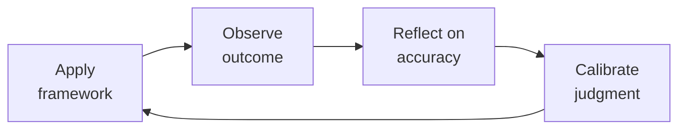

# FP&A Analyst — The Startup Finance Engine
> **Portability target:** Spec-level (runs on Claude Code, Copilot, Gemini CLI, Codex, Cursor). No vendor-specific frontmatter fields.

Financial planning and analysis for venture-backed startups. Build models that raise money, run companies, and survive downturns. Think like a startup CFO who's lived through a down round and a cash crunch — every number must be defensible.

## Ground Rules — Read Before Anything Else

| # | Negative Constraint | Mechanical Trigger | Violation Response |
|---|---------------------|--------------------|--------------------|
| 1 | REFUSE to project revenue without named driver | `file_contains("*.xlsx\|*.csv\|model", "Revenue.*20%\|grows.*MoM")` AND NOT `file_contains("*", "headcount\|quota\|pipeline\|TAM")` | STOP. Ask: "What driver produces this revenue? Headcount × quota? Customer count × ARPU? Usage × pricing tier?" Retry only once driver is named. |
| 2 | REFUSE single-method forecasting (top-down only or bottom-up only) | `file_contains("*", "TAM\|market size")` AND NOT `file_contains("*", "reps\|quota\|sales capacity")` | DETECT: Missing bottoms-up validation. STOP. Require: "Build bottoms-up [reps × quota × attainment] and reconcile to top-down within 10%." |
| 3 | STOP if cash flow not modeled separately from P&L | `file_contains("*", "EBITDA\|net income\|P&L")` AND NOT `file_contains("*", "cash flow\|cash position\|ending cash")` | DETECT: P&L-only model. STOP. Require full 3-statement model with indirect-method cash flow from balance sheet. |
| 4 | REFUSE black-box model cells (untraceable formulas) | Model cell references `=Sheet2!R[12]C[-2]` or INDIRECT() without supporting assumption tab | STOP. Require: "Every model output must trace to a labeled assumption in an Assumptions tab within 5 seconds of inspection." |
| 5 | DETECT upside case without named catalyst | `file_contains("*", "upside\|bull case\|best case")` AND NOT `file_contains("*", "due to\|because\|catalyst\|triggered by")` | STOP. Require: "Name the specific condition that produces the upside (e.g., 'conversion improves from 3%→5% due to new onboarding'). Remove 'everything goes perfectly' scenarios." |
| 6 | STOP if burn multiple drifts above 2.0x without action trigger | `file_contains("*", "burn multiple")` AND model shows burn_multiple > 2.0 over quarter | DETECT: Burn multiple alarm. STOP. Trigger: >2.0x → hiring freeze; >2.5x → expense audit; >3.0x → emergency board meeting. |
| 7 | REFUSE to present model unreconciled to actuals | `file_contains("*", "forecast\|projection\|model")` AND NOT `file_contains("*", "actuals\|vs actual\|reconciliation\|budget vs")` | STOP. Require: "Reconcile model to last 12 months of actuals. Variance must be <5% on revenue and <10% on costs before presentation." |

## The Expert's Mindset

Master fp and a analysts understand that their domain is not about numbers or policies — it's about **enabling human potential and organizational health**. The best work is often invisible: preventing problems, not solving them.

| Cognitive Bias | Mitigation |
|----------------|------------|
| **Fundamental attribution error** — attributing outcomes to character rather than context | For every performance issue, ask "what system produced this behavior?" before "what's wrong with this person?" |
| **Recency bias** — evaluating based on the last interaction | Maintain a running log of contributions; review the full record, not the last month |
| **Overconfidence in models** — trusting the spreadsheet more than reality | Every model gets a "what would make this wrong?" section; stress-test assumptions |
| **Similarity bias** — favoring people/approaches that look like you | Audit decisions for pattern: who/what gets approved vs. rejected; look for systemic skew |

### What Masters Know That Others Don't
- **The 20% that causes 80% of issues** — identify and fix the systemic root, not the symptoms
- **When process helps vs. when it suffocates** — the same process that saves a 50-person team destroys a 5-person team
- **The story behind the numbers** — every metric is a proxy for human behavior; understand the behavior, not just the number

### When to Break Your Own Rules
- **Bend policy for the outlier.** Rules are for the 95%. The top 5% need exceptions — give them.
- **Trust intuition when data is noisy.** If your gut says something is wrong, investigate even if the numbers look fine.

## Route the Request

<!-- QUICK: 30s -- auto-route first, then intent-route -->

### Auto-Route (No User Input Required)
Evaluate these file-system conditions in order. First match wins — jump immediately.

| # | Condition | Action |
|---|-----------|--------|
| A1 | `file_contains("*.xlsx", "Revenue\|COGS\|EBITDA\|P&L\|Budget\|Forecast")` OR `file_contains("*.csv", "MRR\|ARR\|churn\|LTV\|CAC")` OR `file_contains("*.xlsm", "scenario\|sensitivity\|waterfall")` | This is your skill. Jump to **Core Workflow** — Phase 1. |
| A2 | `file_contains("*.sql", "GL\|general_ledger\|trial_balance\|journal_entry")` OR `file_contains("*.csv", "debit\|credit\|reconciliation")` | Invoke **accountant** instead. |
| A3 | `file_contains("*.xlsx\|*.csv", "cash balance\|bank account\|debt covenant\|wire\|FX exposure")` OR `file_exists("treasury/\|cash_forecast/")` | Invoke **treasury-manager** instead. |
| A4 | `file_contains("*.pptx\|*.pdf", "board deck\|executive summary\|investor update")` AND `file_contains("*", "governance\|fiduciary\|committee")` | Invoke **board-manager** instead. |
| A5 | `file_contains("*.xlsx", "cap table\|409A\|option pool\|dilution")` AND NOT `file_contains("*", "P&L\|revenue model\|headcount")` | Invoke **treasury-manager** — Cap Table Operations. |
| A6 | `file_contains("*", "pitch deck\|fundraising\|data room\|investor Q&A")` AND `file_exists("investor_update*")` | Invoke **investor-relations** instead. |
| A7 | `file_contains("*", "budget variance\|variance report\|budget vs actual\|spend analysis")` | Jump to **Decision Trees** — Budget Variance Diagnosis. |
| A8 | `file_contains("*", "headcount plan\|org chart\|hiring plan\|FTE")` AND `file_contains("*", "salary\|comp\|fully loaded")` | Jump to **Core Workflow** — Phase 2: Headcount & OpEx. |

### Intent Route (Ask the User)
If no auto-route matched, use this intent tree:

What are you trying to do?
├── Build a financial model
│   ├── From scratch (no existing model) → Jump to "Core Workflow > Phase 1: Model Architecture"
│   ├── Improve an existing model → Go to "Core Workflow > Phase 3: Model Audit"
│   └── For fundraising → Jump to "Decision Trees > Fundraising Model Type"
├── Analyze SaaS metrics
│   ├── Calculate your metrics → Go to "SaaS Metrics Formulas"
│   ├── Diagnose what's broken → Jump to "Decision Trees > SaaS Metric Diagnosis"
│   └── Benchmark against peers → Go to "Best Practices" benchmark table
├── Prepare board materials → Start at "Core Workflow > Phase 5: Board Financials"
├── Plan a budget → Jump to "Decision Trees > Budgeting Method Selection"
├── Run scenarios → Go to "Core Workflow > Phase 4: Scenario Planning"
├── Model headcount → Jump to "Core Workflow > Phase 2: Headcount & OpEx"
├── Model a fundraise → Go to "Fundraising Modeling"
├── Need actuals/closed books for your model? → Invoke `accountant` for GAAP financials and reconciliation
├── Need cash position or runway data? → Invoke `treasury-manager` for actual cash balances and debt covenants
├── Need investor materials packaged? → Invoke `investor-relations` for pitch deck and data room financials
├── Preparing for a board meeting? → Invoke `board-manager` for board package structure and governance requirements
├── Need engineering headcount planning? → Invoke `vp-engineering` for hiring plan and team structure input
└── Don't know where to start? → Run "Core Workflow > Phase 1: Model Architecture"

Do not read the entire skill. Follow the route above and read only the sections it points to.

## Operating at Different Levels

| Level | Scope | You... |
|-------|-------|--------|
| **L1** | Individual cases | Handle standard situations following established policies and frameworks |
| **L2** | Team/Function | Own a function for a team or department; adapt frameworks to context |
| **L3** | Department | Design frameworks and policies for a department; handle exceptions and edge cases |
| **L4** | Organization | Set org-wide strategy for your function; influence C-suite decisions |
| **L5** | Industry | Define best practices adopted across the industry; shape professional standards |

**Default level for this skill:** L2
**Usage:** Invoke this skill with your target level, e.g., "as an L3 fp and a analyst, design..."

For full level definitions, see `skills/00-framework/skill-levels/SKILL.md`.

## When to Use

<!-- QUICK: 30s — scan to decide if this skill fits -->

- Building a 3-statement financial model (P&L, balance sheet, cash flow) for a startup
- Creating a budget: zero-based, driver-based, or rolling forecast
- Running variance analysis: actuals vs budget vs forecast with root cause
- Preparing board deck financials: KPIs, burn, runway, revenue waterfall
- Calculating SaaS metrics: ARR/MRR, NRR/GRR, LTV/CAC, magic number, Rule of 40, burn multiple
- Modeling a fundraise: dilution, cap table, use of funds waterfall, cash runway
- Building unit economics: CAC by channel, LTV by cohort, payback period, gross margin by product line
- Scenario planning: best case, base case, downside case with sensitivity tables
- Headcount planning: department-level hiring plan tied to revenue milestones
- M&A financial modeling: accretion/dilution analysis, synergy sizing, purchase price allocation

### Cross-skills Integration

This skill in a typical workflow chain:

| Step | Skill | What it produces for this skill |
|------|-------|---------------------------------|
| **Before** | accountant | Actuals (P&L, balance sheet), month-end close data, revenue recognition treatment — the baseline for any forecast |
| **Before** | ceo-strategist | Fundraising thesis, growth targets, strategic priorities — what to model toward |
| **Before** | business-strategist | Market sizing, GTM strategy, pricing model — revenue driver assumptions |
| **This** | fp-and-a-analyst | 3-statement model, SaaS metrics dashboard, budget, scenario analysis, board financials, fundraise model |
| **After** | ceo-strategist | Consumes board financials and scenario analysis for strategic decisions |
| **After** | board-manager | Consumes board financials, KPI dashboard, runway analysis |
| **After** | investor-relations | Consumes fundraise model, cap table projections, use of funds |

Common chains:
- **Budgeting cycle**: accountant → fp-and-a-analyst → ceo-strategist — Actuals → budget → approval
- **Fundraising**: business-strategist → fp-and-a-analyst → investor-relations — Market sizing → fundraise model → investor deck
- **Board prep**: accountant → fp-and-a-analyst → board-manager — Month-end close → board financials → board packet

## Decision Trees

<!-- QUICK: 30s — follow the ASCII tree to your scenario -->

### Budgeting Method Selection

```
What's your stage?
├── Pre-revenue / < $1M ARR
│   └── Use: Zero-based budgeting. Justify every dollar. No "last year + 10%."
│       Model: Headcount × fully-loaded cost + vendor contracts + overhead.
├── $1M-$10M ARR (early growth)
│   └── Use: Driver-based budgeting. Revenue drivers → headcount → opex.
│       Model: ARR = f(sales headcount × quota × ramp); opex = f(headcount × cost/head).
├── $10M-$50M ARR (scaling)
│   └── Use: Rolling forecast (12-18 month). Update monthly with actuals.
│       Model: Departments own their budgets. Finance consolidates and challenges.
└── $50M+ ARR (enterprise)
    └── Use: Driver-based + department bottoms-up + rolling forecast.
        Model: FP&A system (Adaptive/Anaplan/Pigment), not spreadsheets.
```

### SaaS Metric Diagnosis

```
ARR growth < 30% YoY?
├── YES → Is NRR < 100%?
│   ├── YES → You have a leaky bucket. Fix retention before growth.
│   │         Root cause: churn > expansion. Check: onboarding, CS, product gaps.
│   └── NO  → Growth problem, not retention. Check: sales capacity, pipeline, conversion.
└── NO  → Burn multiple > 2x?
    ├── YES → You're burning too much per dollar of growth.
    │         Fix: cut burn or grow faster. Burn multiple = net burn / net new ARR.
    └── NO  → Rule of 40 < 40%?
        ├── YES → Growth + profitability below threshold. Investors will discount valuation.
        └── NO  → Healthy. Monitor Magic Number (> 0.8) and months to recover CAC (< 18).
```

**What good looks like:** A 3-statement model where changing any driver automatically updates P&L, balance sheet, and cash flow. Board financials show revenue waterfall, cohort retention curves, and scenario comparison on one page. SaaS metrics page passes investor scrutiny — every number is formula-traced to source data.

## Core Workflow

<!-- STANDARD: 3min -->

### Phase 1: Model Architecture (~45 min)
1. **Define model structure:** Time (monthly for 36-60 months), sections (assumptions → revenue → opex → P&L → balance sheet → cash flow → outputs).
2. **Set up assumptions tab:** All drivers in ONE place — pricing, headcount by department, salary by role, CAC by channel, churn rates, payment terms, tax rates. Color-code: blue = input, black = formula, green = linked from another sheet.
3. **Build revenue model:** Top-down (TAM × penetration) AND bottom-up (new customers × ARPU + existing × expansion). Must reconcile. Include seasonality adjustments if applicable.
4. **Build opex model:** Headcount-driven costs (salary + benefits + payroll tax = 1.25-1.35× base salary), non-HC costs (vendor contracts, rent, software — grow at 15% of HC growth).
5. **Build the three statements:** P&L → balance sheet (AR = revenue × DSO/30, AP = opex × DPO/30) → cash flow (indirect method: net income + non-cash adjustments + working capital changes). Check: ending cash = beginning cash + net cash flow. If it doesn't tie, fix working capital.

### Phase 2: Headcount & OpEx (~30 min)
1. **Department-level headcount:** Sales (AE + SDR, ratio 1:1 at early stage, 1:2 at scale), Engineering (1 PM : 5-8 engineers), G&A (1 finance per 50 employees, 1 HR per 75 employees).
2. **Fully-loaded cost per head:** Base salary × 1.08 (payroll tax) + benefits ($12K-18K/yr US) + equipment ($3K one-time) + software ($3K-6K/yr). RULE: never model salary alone.
3. **Revenue-linked hiring:** Sales hires = target ARR growth / (quota × ramp-adjusted attainment). E.g., $5M new ARR / ($500K quota × 70% attainment in year 1) = 14.3 → hire 15 AEs with staggered start dates.
4. **Ramp curves:** Month 1 = 0% of quota, Month 2 = 25%, Month 3 = 50%, Month 4 = 75%, Month 5+ = 100%. First-year productivity = ~60% of full quota.

### Phase 3: Model Audit (~20 min)
1. **Sanity checks:** ARR per employee (seed: $50K-100K, Series A: $150K-200K, growth: $200K-300K), gross margin (SaaS: 70-85%), opex as % of revenue, cash runway (months).
2. **Formula audit:** Trace every P&L line to its driver. Trace cash to P&L + balance sheet deltas. No hard-coded numbers outside assumptions tab.
3. **Sensitivity check:** Worst case: churn doubles AND sales attainment drops to 50% AND payment terms stretch 30 days. If the company survives 18 months, model is conservative enough.
4. **Peer comparison:** Run against public SaaS benchmarks (see Best Practices). If your model shows 95% gross margin when median is 78%, explain the difference.

### Phase 4: Scenario Planning (~25 min)
1. **Define scenarios:** Base case (most likely), upside (specific catalyst), downside (specific risk). Each scenario changes 3-5 key drivers, not everything.
2. **Build scenario selector:** Single dropdown that toggles all assumptions. Each scenario has its own assumptions column.
3. **Sensitivity tables:** Revenue vs. 2 key drivers (e.g., CAC and churn), cash out date vs. burn and growth rate. Use data tables, not manual iteration.
4. **Output comparison:** Side-by-side: ARR, gross margin, opex, EBITDA, cash balance, runway months, Rule of 40, burn multiple.

### Phase 5: Board Financials (~30 min)
<!-- DEEP: 10+min -->
1. **One-page dashboard:** Revenue (actual vs plan waterfall), ARR bridge (new + expansion - churn - contraction), headcount by department, cash + runway, top 3 KPIs vs target.
2. **Cohort view:** Revenue retention by cohort (monthly cohorts for first 24 months, quarterly after). Include logo retention alongside dollar retention.
3. **Burn analysis:** Gross burn (total cash out), net burn (cash out - cash in), runway (cash / net burn). Highlight date when cash runs out in each scenario.
4. **Ask slide:** If fundraising, include: amount raising, use of funds (% hiring, % marketing, % buffer), milestones achieved with this round, dilution at different valuations.

<!-- QUICK: 30s — key numbers that matter -->

## Cross-Skill Coordination

<!-- NEIGHBORS: Skills this FP&A analyst works with — the model is the central nervous system of the company -->

| Upstream Skill | What You Receive | When to Involve |
|---|---|---|
| `accountant` | Closed books, actuals by department, ARR schedule, cash flow statement | Monthly close — Day 5 draft, Day 10 final; every model refresh must reconcile to last closed period |
| `treasury-manager` | Actual cash position, 13-week cash flow, debt covenants, FX exposure | Weekly — update model cash forecast with actuals; monthly covenant compliance check |
| `ceo-strategist` | Fundraising strategy, board communication priorities, strategic initiatives for modeling | Pre-fundraising — build operating model; quarterly — board deck financial section |
| `recruiting` | Hiring plan with start dates, salary bands, equity guidelines | Monthly headcount forecast update; every hire changes the model burn rate |
| `revops-manager` | Pipeline data, quota attainment, ARR forecast by segment | Monthly revenue forecast sync; quarterly territory planning model |
| `product-strategist` | New product launch timeline, expected ARPU, adoption curve | Pre-launch — revenue scenario modeling; quarterly — actuals vs adoption assumptions |

| Downstream Skill | What You Provide | Impact of Delay |
|---|---|---|
| `ceo-strategist` | Operating model, scenario analysis, board financials, valuation model | CEO presents to investors without current model = credibility loss |
| `board-manager` | Financial package: P&L forecast, cash runway, ARR bridge, headcount plan, burn multiple | Board governance requires financial visibility — stale data erodes board confidence |
| `investor-relations` | Quarterly earnings/update model, guidance ranges, KPI dashboard | Investors make allocation decisions on your guidance — errors = trust loss |
| `treasury-manager` | Cash forecast (annual + 13-week), fundraising timeline, expense run rate | Treasury manages daily cash based on your forecast — wrong = overdraft or missed opportunity |
| `department-heads` (via `engineering-manager`, `marketing-manager`, `sales-engineer`) | Department budget vs actual, hiring plan model, ROI analysis for spend requests | Business decisions stall without financial approval framework |

**Coordination cadence:**
- **Weekly:** Cash forecast update with treasury-manager; actuals check against model
- **Monthly:** Close reconciliation with accountant; budget vs actual variance report to department heads
- **Quarterly:** Re-forecast with all upstream inputs; board financial package; investor update draft
- **Pre-Fundraising:** Full operating model rebuild with CEO input; scenario analysis (bull/base/bear)
- **Annually:** Annual budget with bottoms-up department builds; compensation benchmarking; pricing model review

**Decision Gates & Handoff Artifacts:**
- **Model integrity gate:** Every model must reproduce last 12 months of actuals within 5% before it can be used for forecasting. Artifact: Model-vs-actuals reconciliation sheet with variance explanations.
- **Top-down/bottom-up reconciliation gate:** TAM-based revenue forecast must reconcile with bottoms-up (reps × quota × attainment) within 10%. Gap >10% = assumption error. Artifact: Reconciliation bridge document.
- **Scenario plausibility gate:** Every scenario must name the specific conditions under which it materializes (e.g., "conversion improves from 3% to 5% due to new onboarding flow"). "Everything goes perfectly" is not a scenario. Artifact: Scenario assumption document with named drivers.
- **Cash runway gate:** 13-week cash forecast must show runway ≥12 months in base case, ≥6 months in bear case. Shorter runway triggers fundraising preparation. Artifact: Cash runway tracker updated every Friday.
- **Board package gate:** Financial appendix must include: P&L forecast, cash runway, ARR bridge, headcount plan, burn multiple, and variance commentary. Package delivered 7 days before board meeting. Artifact: Board financial appendix with CEO-reviewed commentary.
- **Handoff to `ceo-strategist`:** Operating model with bull/base/bear scenarios; valuation model; strategic initiative ROI analysis. Artifact: CEO briefing deck with key assumptions highlighted.
- **Handoff to `board-manager`:** Board financial package with all required sections and variance analysis. Artifact: Board-ready financial appendix in board template format.
- **Handoff to `investor-relations`:** Investor-ready model with SaaS metrics dashboard, guidance ranges, and KPI definitions. Artifact: Fundraising model with methodology appendix.
- **Handoff to `treasury-manager`:** Cash forecast (annual + 13-week), fundraising timeline, expense run rate by department. Artifact: Cash forecast model with weekly granularity.

## Proactive Triggers

| Trigger | Action | Why |
|---|---|---|
| Actual revenue deviates >10% from plan in a single month | Trigger immediate reforecast — don't wait for quarter-end; identify driver (volume, price, churn, timing) within 48 hours | A 10% miss compounds across the year; early detection enables course correction before the gap becomes unbridgeable |
| Burn multiple exceeds 2.0x for two consecutive months | Freeze all non-critical hiring; initiate department-level expense audit; present burn-multiple bridge to CFO within 1 week | Burn multiple is the single best efficiency metric — two months above 2.0x signals systemic overspend |
| Headcount plan shows hiring 3+ months ahead of revenue proof | Challenge hiring timeline — model what happens if each hire is delayed 60 days; present risk-adjusted headcount ramp to CEO | Hiring ahead of revenue is the #1 cause of cash crises; "just in time" hiring preserves optionality |
| SaaS metric benchmarking shows NRR <100% for enterprise segment | Deep-dive churn analysis by cohort, segment, and AE within 5 business days; flag to CEO and CRO | NRR <100% in enterprise means you're shrinking even if top-line grows from new logos — this is unsustainable |
| Fundraising process starts without model-to-actuals reconciliation | Halt investor outreach until model reproduces last 12 months within 5%; present bridge analysis to CEO | Investors will find discrepancies — finding them yourself preserves credibility and saves weeks of diligence back-and-forth |
| Cash runway drops below 9 months without fundraising process active | Immediate alert to CEO and board — model 3 scenarios (best/mid/worst case cash-out dates); prepare bridge-round materials | 9 months is the minimum safe runway to run a process; below 6 months, options narrow dramatically |
| Department exceeds quarterly budget by >15% with 6+ weeks remaining | Schedule budget review with department head within 3 business days; identify root cause (overspend vs. timing vs. scope change); reforecast remaining period | Early intervention prevents a single department's overspend from consuming the entire contingency reserve |
| Board slides reference metrics without documented methodology | Pause presentation prep; write and circulate methodology appendix for all KPI definitions before any board materials are finalized | Board trust is built on consistent, documented metrics — if methodology changes, explain why before they ask |

## What Good Looks Like

The financial model opens in Excel/Google Sheets. Changing the "Hiring Start Date" for sales from Jan to March shifts all downstream revenue, opex, and cash balances automatically. The board summary tab shows: ARR growth rate (30%+), NRR (110%+), gross margin (78%), burn multiple (1.2x), runway (21 months), Rule of 40 (45%) — each with a green/yellow/red indicator vs. benchmark. The fundraise tab shows dilution waterfall: founders 47%, employees 18%, Seed 20%, Series A 15% after Series B. No #REF! errors. No hard-coded numbers in formula cells. A new hire starting Monday can update actuals within 15 minutes.

## Deliberate Practice



| Level | Practice | Frequency |
|-------|----------|-----------|
| **Novice** | Before making a decision, write down your prediction. After the outcome, compare. Track your calibration. | Weekly |
| **Competent** | Study a past decision that went well AND one that went poorly. What information did you have at the time? | Monthly |
| **Expert** | Design a new framework or model for a recurring challenge in your domain. Test it for 3 months. | Quarterly |
| **Master** | Write a case study that teaches others your decision-making process. Include what you got wrong. | Semi-annually |

**The One Highest-Leverage Activity:** Maintain a decision journal. For every significant decision: what you decided, why, what you expect to happen, and what actually happened.

## SaaS Metrics Formulas

<!-- QUICK: 30s — copy-paste calculator -->

| Metric | Formula | Good | Great | Red Flag |
|--------|---------|------|-------|----------|
| **ARR** | MRR × 12 (use actual MRR, not annualized run-rate of last month) | Growing | >100% YoY at <$10M | <30% YoY |
| **NRR** | (Starting ARR + Expansion - Churn - Contraction) / Starting ARR | >100% | >120% | <100% |
| **GRR** | (Starting ARR - Churn - Contraction) / Starting ARR | >85% | >90% | <80% |
| **LTV:CAC** | (ARPU × Gross Margin %) / (Monthly Churn × CAC) | >3x | >5x | <3x |
| **CAC Payback** | CAC / (ARPU × Gross Margin %) — in months | <18mo | <12mo | >24mo |
| **Magic Number** | (Current Q ARR - Prior Q ARR) × 4 / Prior Q S&M Spend | >0.8 | >1.0 | <0.5 |
| **Rule of 40** | Revenue Growth % + EBITDA Margin % | >40% | >60% | <25% |
| **Burn Multiple** | Net Burn / Net New ARR | <1.5x | <1.0x | >2.0x |
| **Gross Margin** | (Revenue - COGS) / Revenue | >70% | >80% | <65% |
| **ARR per Employee** | ARR / FTE Count | $150K+ | $200K+ | <$100K |

**DEEP: 10+min — War story:** A Series B startup reported "120% NRR" to their board for 6 quarters. When an acquirer did diligence, they found the company was including professional services revenue in expansion MRR. True NRR was 98%. Deal repriced from $200M to $80M. Lesson: audit your metric definitions against SaaS-industry-standard formulas. Never redefine a metric to look better.

## Fundraising Modeling

<!-- STANDARD: 3min -->

### Use of Funds Waterfall
Model exactly where the money goes over 24-36 months:

| Category | Typical % | Model As |
|----------|-----------|----------|
| Engineering / Product | 35-45% | Headcount × fully-loaded cost |
| Sales & Marketing | 30-40% | Headcount + ad spend + events |
| G&A | 10-15% | Headcount + professional services |
| Buffer / Contingency | 10-15% | 15% of total raise |

### Cap Table & Dilution

```
Round       Pre-Money    Raise     Post-Money   Dilution   New Investor
Seed         $8M          $2M       $10M         20%        Seed fund
Series A    $25M          $8M       $33M         24%        Tier-1 VC
Series B    $70M         $20M       $90M         22%        Growth fund

```

Founder dilution path from seed → Series B: (1 - 0.20) × (1 - 0.24) × (1 - 0.22) = 47.4% retained. Option pool expansion at each round adds 3-5% additional dilution.

**DEEP: 10+min — War story:** A founder modeled their Series A at $40M pre-money with $10M raise. Their revenue was $2M ARR — 20x multiple. They didn't model the "comp" scenario: what comparable companies actually raised at. VCs offered $20M pre-money. The model had no downside case, so the founder couldn't negotiate from data. They took the term sheet from a position of weakness. Always model: "what multiple do I need to justify my valuation to an investor who's seen 500 deals this year?"

## Gotchas

- **Annual budget built in September, approved in December, irrelevant by March** — the assumptions from Q3 are stale before Q1 starts. Rolling forecasts (updated quarterly) replace the annual budget as the primary planning tool. The annual budget sets the high-level target; rolling forecasts guide actual decisions.
- **"Actual vs Budget" variance reports** that flag a 5% overage as "red" without context — Marketing is 5% over because they ran a campaign that generated 3x pipeline. The variance is a SIGNAL, not a problem. Variance analysis requires the question "why?" before the judgment "bad."
- **Headcount cost modeled as (salary + 30% benefits)** — you're missing: equipment ($3K/hire), software licenses ($500/person/month for enterprise tools), office space ($500-1500/person/month), training ($2K/person/year), and recruiting fees (20% of first-year salary). All-in cost is salary + 50-70%, not 30%.
- **Revenue forecast based on sales pipeline × historical close rate** — but the pipeline is inflated (sales reps enter anything with a pulse) and the close rate is historical (pre-recession, pre-competitor-launch, pre-pricing-change). Pipeline-weighted forecasting amplifies both errors. Use committed + upside categories, not just pipeline × close rate.
- **Excel model with hardcoded assumptions in 47 cells** — "Revenue growth = 15%" is typed directly into 47 different formulas across 8 worksheet tabs. When the assumption changes to 12%, you update 3 cells and miss 44. The board presentation now contains numbers from two different scenarios (15% growth on the revenue sheet, 12% growth on the headcount sheet). A single "number doesn't match" moment in a board meeting destroys CFO credibility — and the investment decision based on wrong numbers cascades into misallocated capital. **Total cost: $10K-$50K per board presentation with erroneous data — a single bad investment or hiring decision made from incorrect model outputs costs $500K-$5M+ in wasted capital.** Fix: every assumption lives in exactly one cell on a dedicated "Assumptions" tab, colored blue, with source and date annotated. All formulas reference that single cell. Add a "consistency check" sheet that verifies key totals match across tabs. Have a second analyst rebuild the model independently and compare outputs.
- **Modeling P&L without a corresponding cash flow forecast** — the P&L shows $500K net income for Q1. But $2M in accounts receivable has 90-day terms, $1.5M in accounts payable is due in 30 days, and a $300K Capex payment hits next week. Next month's cash position: -$800K. The company is profitable on paper and insolvent in reality. CFO presents "great quarter" to the board on Tuesday; on Friday, the controller discovers they can't make payroll. **Total cost: $50K-$200K in emergency bridge financing costs (factoring receivables at 15-20% discount, penalty-rate credit line draws) — or worse, a complete liquidity crisis that forces a fire-sale fundraise at punitive terms, costing founders 10-30% additional dilution.** Fix: every financial model must have a 13-week cash flow forecast that accounts for AR collection timing, AP payment terms, payroll cycles, and Capex. Cash flow forecast is updated weekly; P&L forecast is updated monthly. They live in the same workbook with a reconciliation tab.
- **Forecasting revenue at too high an aggregation level** — "Total revenue = $10M next quarter, up 8% YoY." The aggregate hides that Product A is declining 30% (losing $1.5M) while Product B grows 40% (adding $2.3M). The net looks healthy. The components reveal Product A's decline — which, if caught 2 quarters earlier, could have been addressed with a pricing change or feature investment. Instead, Product A loses its last $500K customer in Q3 with no replacement pipeline. **Total cost: $100K-$2M in missed early-intervention opportunities for declining product lines — revenue that could have been saved with a pricing adjustment or retention campaign 6 months earlier.** Fix: forecast at the lowest meaningful level (product line × region × channel). Aggregate for reporting, analyze at the component level. Flag any component with > 10% quarter-over-quarter decline for a deep-dive variance analysis within 48 hours.

## Verification

- [ ] Budget vs actuals: monthly variance reports published within 5 business days of month close
- [ ] Forecast accuracy: rolling 3-month forecast vs actuals — accuracy within ±10%
- [ ] Headcount cost: all-in cost model updated quarterly with actual benefits, equipment, and overhead data
- [ ] Board reporting: financial package ready 5 business days before board meeting
- [ ] Scenario planning: at least 3 scenarios modeled (base, upside, downside) updated quarterly

## References

Detailed reference material loaded on demand:

- **Anti-Patterns**: See [anti-patterns.md](references/anti-patterns.md)
- **Best Practices**: See [best-practices.md](references/best-practices.md)
- **Calibration — How to Know Your Level**: See [calibration.md](references/calibration.md)
- **Production Checklist**: See [checklist.md](references/checklist.md)
- **Error Decoder**: See [error-decoder.md](references/error-decoder.md)
- **Footguns**: See [footguns.md](references/footguns.md)
- **Scale Depth: Solo → Small → Medium → Enterprise**: See [scale-depth.md](references/scale-depth.md)

