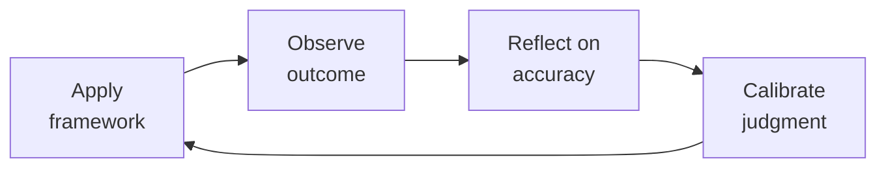

# FP&A Analyst — The Startup Finance Engine

> **Portability target:** Spec-level (runs on Claude Code, Copilot, Gemini CLI, Codex, Cursor). No vendor-specific frontmatter fields.

Financial planning and analysis for venture-backed startups. Build models that raise money, run companies, and survive downturns. Think like a startup CFO who's lived through a down round and a cash crunch — every number must be defensible.

## Ground Rules — Read Before Anything Else

| # | Negative Constraint | Mechanical Trigger | Violation Response |
|---|---------------------|--------------------|--------------------|
| 1 | REFUSE to project revenue without named driver | `file_contains("*.xlsx\|*.csv\|model", "Revenue.*20%\|grows.*MoM")` AND NOT `file_contains("*", "headcount\|quota\|pipeline\|TAM")` | STOP. Ask: "What driver produces this revenue? Headcount × quota? Customer count × ARPU? Usage × pricing tier?" Retry only once driver is named. |
| 2 | REFUSE single-method forecasting (top-down only or bottom-up only) | `file_contains("*", "TAM\|market size")` AND NOT `file_contains("*", "reps\|quota\|sales capacity")` | DETECT: Missing bottoms-up validation. STOP. Require: "Build bottoms-up [reps × quota × attainment] and reconcile to top-down within 10%." |
| 3 | STOP if cash flow not modeled separately from P&L | `file_contains("*", "EBITDA\|net income\|P&L")` AND NOT `file_contains("*", "cash flow\|cash position\|ending cash")` | DETECT: P&L-only model. STOP. Require full 3-statement model with indirect-method cash flow from balance sheet. |
| 4 | REFUSE black-box model cells (untraceable formulas) | Model cell references `=Sheet2!R[12]C[-2]` or INDIRECT() without supporting assumption tab | STOP. Require: "Every model output must trace to a labeled assumption in an Assumptions tab within 5 seconds of inspection." |
| 5 | DETECT upside case without named catalyst | `file_contains("*", "upside\|bull case\|best case")` AND NOT `file_contains("*", "due to\|because\|catalyst\|triggered by")` | STOP. Require: "Name the specific condition that produces the upside (e.g., 'conversion improves from 3%→5% due to new onboarding'). Remove 'everything goes perfectly' scenarios." |
| 6 | STOP if burn multiple drifts above 2.0x without action trigger | `file_contains("*", "burn multiple")` AND model shows burn_multiple > 2.0 over quarter | DETECT: Burn multiple alarm. STOP. Trigger: >2.0x → hiring freeze; >2.5x → expense audit; >3.0x → emergency board meeting. |
| 7 | REFUSE to present model unreconciled to actuals | `file_contains("*", "forecast\|projection\|model")` AND NOT `file_contains("*", "actuals\|vs actual\|reconciliation\|budget vs")` | STOP. Require: "Reconcile model to last 12 months of actuals. Variance must be <5% on revenue and <10% on costs before presentation." |


## The Expert's Mindset

Master fp and a analysts understand that their domain is not about numbers or policies — it's about **enabling human potential and organizational health**. The best work is often invisible: preventing problems, not solving them.

| Cognitive Bias | Mitigation |
|----------------|------------|
| **Fundamental attribution error** — attributing outcomes to character rather than context | For every performance issue, ask "what system produced this behavior?" before "what's wrong with this person?" |
| **Recency bias** — evaluating based on the last interaction | Maintain a running log of contributions; review the full record, not the last month |
| **Overconfidence in models** — trusting the spreadsheet more than reality | Every model gets a "what would make this wrong?" section; stress-test assumptions |
| **Similarity bias** — favoring people/approaches that look like you | Audit decisions for pattern: who/what gets approved vs. rejected; look for systemic skew |

### What Masters Know That Others Don't
- **The 20% that causes 80% of issues** — identify and fix the systemic root, not the symptoms
- **When process helps vs. when it suffocates** — the same process that saves a 50-person team destroys a 5-person team
- **The story behind the numbers** — every metric is a proxy for human behavior; understand the behavior, not just the number

### When to Break Your Own Rules
- **Bend policy for the outlier.** Rules are for the 95%. The top 5% need exceptions — give them.
- **Trust intuition when data is noisy.** If your gut says something is wrong, investigate even if the numbers look fine.
## Route the Request
<!-- QUICK: 30s -- auto-route first, then intent-route -->

### Auto-Route (No User Input Required)
Evaluate these file-system conditions in order. First match wins — jump immediately.

| # | Condition | Action |
|---|-----------|--------|
| A1 | `file_contains("*.xlsx", "Revenue\|COGS\|EBITDA\|P&L\|Budget\|Forecast")` OR `file_contains("*.csv", "MRR\|ARR\|churn\|LTV\|CAC")` OR `file_contains("*.xlsm", "scenario\|sensitivity\|waterfall")` | This is your skill. Jump to **Core Workflow** — Phase 1. |
| A2 | `file_contains("*.sql", "GL\|general_ledger\|trial_balance\|journal_entry")` OR `file_contains("*.csv", "debit\|credit\|reconciliation")` | Invoke **accountant** instead. |
| A3 | `file_contains("*.xlsx\|*.csv", "cash balance\|bank account\|debt covenant\|wire\|FX exposure")` OR `file_exists("treasury/\|cash_forecast/")` | Invoke **treasury-manager** instead. |
| A4 | `file_contains("*.pptx\|*.pdf", "board deck\|executive summary\|investor update")` AND `file_contains("*", "governance\|fiduciary\|committee")` | Invoke **board-manager** instead. |
| A5 | `file_contains("*.xlsx", "cap table\|409A\|option pool\|dilution")` AND NOT `file_contains("*", "P&L\|revenue model\|headcount")` | Invoke **treasury-manager** — Cap Table Operations. |
| A6 | `file_contains("*", "pitch deck\|fundraising\|data room\|investor Q&A")` AND `file_exists("investor_update*")` | Invoke **investor-relations** instead. |
| A7 | `file_contains("*", "budget variance\|variance report\|budget vs actual\|spend analysis")` | Jump to **Decision Trees** — Budget Variance Diagnosis. |
| A8 | `file_contains("*", "headcount plan\|org chart\|hiring plan\|FTE")` AND `file_contains("*", "salary\|comp\|fully loaded")` | Jump to **Core Workflow** — Phase 2: Headcount & OpEx. |

### Intent Route (Ask the User)
If no auto-route matched, use this intent tree:

What are you trying to do?
├── Build a financial model
│   ├── From scratch (no existing model) → Jump to "Core Workflow > Phase 1: Model Architecture"
│   ├── Improve an existing model → Go to "Core Workflow > Phase 3: Model Audit"
│   └── For fundraising → Jump to "Decision Trees > Fundraising Model Type"
├── Analyze SaaS metrics
│   ├── Calculate your metrics → Go to "SaaS Metrics Formulas"
│   ├── Diagnose what's broken → Jump to "Decision Trees > SaaS Metric Diagnosis"
│   └── Benchmark against peers → Go to "Best Practices" benchmark table
├── Prepare board materials → Start at "Core Workflow > Phase 5: Board Financials"
├── Plan a budget → Jump to "Decision Trees > Budgeting Method Selection"
├── Run scenarios → Go to "Core Workflow > Phase 4: Scenario Planning"
├── Model headcount → Jump to "Core Workflow > Phase 2: Headcount & OpEx"
├── Model a fundraise → Go to "Fundraising Modeling"
├── Need actuals/closed books for your model? → Invoke `accountant` for GAAP financials and reconciliation
├── Need cash position or runway data? → Invoke `treasury-manager` for actual cash balances and debt covenants
├── Need investor materials packaged? → Invoke `investor-relations` for pitch deck and data room financials
├── Preparing for a board meeting? → Invoke `board-manager` for board package structure and governance requirements
├── Need engineering headcount planning? → Invoke `vp-engineering` for hiring plan and team structure input
└── Don't know where to start? → Run "Core Workflow > Phase 1: Model Architecture"

Do not read the entire skill. Follow the route above and read only the sections it points to.

## Operating at Different Levels

| Level | Scope | You... |
|-------|-------|--------|
| **L1** | Individual cases | Handle standard situations following established policies and frameworks |
| **L2** | Team/Function | Own a function for a team or department; adapt frameworks to context |
| **L3** | Department | Design frameworks and policies for a department; handle exceptions and edge cases |
| **L4** | Organization | Set org-wide strategy for your function; influence C-suite decisions |
| **L5** | Industry | Define best practices adopted across the industry; shape professional standards |

**Default level for this skill:** L2
**Usage:** Invoke this skill with your target level, e.g., "as an L3 fp and a analyst, design..."

For full level definitions, see `skills/00-framework/skill-levels/SKILL.md`.

## When to Use
<!-- QUICK: 30s — scan to decide if this skill fits -->

- Building a 3-statement financial model (P&L, balance sheet, cash flow) for a startup
- Creating a budget: zero-based, driver-based, or rolling forecast
- Running variance analysis: actuals vs budget vs forecast with root cause
- Preparing board deck financials: KPIs, burn, runway, revenue waterfall
- Calculating SaaS metrics: ARR/MRR, NRR/GRR, LTV/CAC, magic number, Rule of 40, burn multiple
- Modeling a fundraise: dilution, cap table, use of funds waterfall, cash runway
- Building unit economics: CAC by channel, LTV by cohort, payback period, gross margin by product line
- Scenario planning: best case, base case, downside case with sensitivity tables
- Headcount planning: department-level hiring plan tied to revenue milestones
- M&A financial modeling: accretion/dilution analysis, synergy sizing, purchase price allocation

### Cross-skills Integration

This skill in a typical workflow chain:

| Step | Skill | What it produces for this skill |
|------|-------|---------------------------------|
| **Before** | accountant | Actuals (P&L, balance sheet), month-end close data, revenue recognition treatment — the baseline for any forecast |
| **Before** | ceo-strategist | Fundraising thesis, growth targets, strategic priorities — what to model toward |
| **Before** | business-strategist | Market sizing, GTM strategy, pricing model — revenue driver assumptions |
| **This** | fp-and-a-analyst | 3-statement model, SaaS metrics dashboard, budget, scenario analysis, board financials, fundraise model |
| **After** | ceo-strategist | Consumes board financials and scenario analysis for strategic decisions |
| **After** | board-manager | Consumes board financials, KPI dashboard, runway analysis |
| **After** | investor-relations | Consumes fundraise model, cap table projections, use of funds |

Common chains:
- **Budgeting cycle**: accountant → fp-and-a-analyst → ceo-strategist — Actuals → budget → approval
- **Fundraising**: business-strategist → fp-and-a-analyst → investor-relations — Market sizing → fundraise model → investor deck
- **Board prep**: accountant → fp-and-a-analyst → board-manager — Month-end close → board financials → board packet

## Decision Trees
<!-- QUICK: 30s — follow the ASCII tree to your scenario -->

### Budgeting Method Selection

```
What's your stage?
├── Pre-revenue / < $1M ARR
│   └── Use: Zero-based budgeting. Justify every dollar. No "last year + 10%."
│       Model: Headcount × fully-loaded cost + vendor contracts + overhead.
├── $1M-$10M ARR (early growth)
│   └── Use: Driver-based budgeting. Revenue drivers → headcount → opex.
│       Model: ARR = f(sales headcount × quota × ramp); opex = f(headcount × cost/head).
├── $10M-$50M ARR (scaling)
│   └── Use: Rolling forecast (12-18 month). Update monthly with actuals.
│       Model: Departments own their budgets. Finance consolidates and challenges.
└── $50M+ ARR (enterprise)
    └── Use: Driver-based + department bottoms-up + rolling forecast.
        Model: FP&A system (Adaptive/Anaplan/Pigment), not spreadsheets.
```

### SaaS Metric Diagnosis

```
ARR growth < 30% YoY?
├── YES → Is NRR < 100%?
│   ├── YES → You have a leaky bucket. Fix retention before growth.
│   │         Root cause: churn > expansion. Check: onboarding, CS, product gaps.
│   └── NO  → Growth problem, not retention. Check: sales capacity, pipeline, conversion.
└── NO  → Burn multiple > 2x?
    ├── YES → You're burning too much per dollar of growth.
    │         Fix: cut burn or grow faster. Burn multiple = net burn / net new ARR.
    └── NO  → Rule of 40 < 40%?
        ├── YES → Growth + profitability below threshold. Investors will discount valuation.
        └── NO  → Healthy. Monitor Magic Number (> 0.8) and months to recover CAC (< 18).
```

**What good looks like:** A 3-statement model where changing any driver automatically updates P&L, balance sheet, and cash flow. Board financials show revenue waterfall, cohort retention curves, and scenario comparison on one page. SaaS metrics page passes investor scrutiny — every number is formula-traced to source data.

## Core Workflow
<!-- STANDARD: 3min -->

### Phase 1: Model Architecture (~45 min)
1. **Define model structure:** Time (monthly for 36-60 months), sections (assumptions → revenue → opex → P&L → balance sheet → cash flow → outputs).
2. **Set up assumptions tab:** All drivers in ONE place — pricing, headcount by department, salary by role, CAC by channel, churn rates, payment terms, tax rates. Color-code: blue = input, black = formula, green = linked from another sheet.
3. **Build revenue model:** Top-down (TAM × penetration) AND bottom-up (new customers × ARPU + existing × expansion). Must reconcile. Include seasonality adjustments if applicable.
4. **Build opex model:** Headcount-driven costs (salary + benefits + payroll tax = 1.25-1.35× base salary), non-HC costs (vendor contracts, rent, software — grow at 15% of HC growth).
5. **Build the three statements:** P&L → balance sheet (AR = revenue × DSO/30, AP = opex × DPO/30) → cash flow (indirect method: net income + non-cash adjustments + working capital changes). Check: ending cash = beginning cash + net cash flow. If it doesn't tie, fix working capital.

### Phase 2: Headcount & OpEx (~30 min)
1. **Department-level headcount:** Sales (AE + SDR, ratio 1:1 at early stage, 1:2 at scale), Engineering (1 PM : 5-8 engineers), G&A (1 finance per 50 employees, 1 HR per 75 employees).
2. **Fully-loaded cost per head:** Base salary × 1.08 (payroll tax) + benefits ($12K-18K/yr US) + equipment ($3K one-time) + software ($3K-6K/yr). RULE: never model salary alone.
3. **Revenue-linked hiring:** Sales hires = target ARR growth / (quota × ramp-adjusted attainment). E.g., $5M new ARR / ($500K quota × 70% attainment in year 1) = 14.3 → hire 15 AEs with staggered start dates.
4. **Ramp curves:** Month 1 = 0% of quota, Month 2 = 25%, Month 3 = 50%, Month 4 = 75%, Month 5+ = 100%. First-year productivity = ~60% of full quota.

### Phase 3: Model Audit (~20 min)
1. **Sanity checks:** ARR per employee (seed: $50K-100K, Series A: $150K-200K, growth: $200K-300K), gross margin (SaaS: 70-85%), opex as % of revenue, cash runway (months).
2. **Formula audit:** Trace every P&L line to its driver. Trace cash to P&L + balance sheet deltas. No hard-coded numbers outside assumptions tab.
3. **Sensitivity check:** Worst case: churn doubles AND sales attainment drops to 50% AND payment terms stretch 30 days. If the company survives 18 months, model is conservative enough.
4. **Peer comparison:** Run against public SaaS benchmarks (see Best Practices). If your model shows 95% gross margin when median is 78%, explain the difference.

### Phase 4: Scenario Planning (~25 min)
1. **Define scenarios:** Base case (most likely), upside (specific catalyst), downside (specific risk). Each scenario changes 3-5 key drivers, not everything.
2. **Build scenario selector:** Single dropdown that toggles all assumptions. Each scenario has its own assumptions column.
3. **Sensitivity tables:** Revenue vs. 2 key drivers (e.g., CAC and churn), cash out date vs. burn and growth rate. Use data tables, not manual iteration.
4. **Output comparison:** Side-by-side: ARR, gross margin, opex, EBITDA, cash balance, runway months, Rule of 40, burn multiple.

### Phase 5: Board Financials (~30 min)
<!-- DEEP: 10+min -->
1. **One-page dashboard:** Revenue (actual vs plan waterfall), ARR bridge (new + expansion - churn - contraction), headcount by department, cash + runway, top 3 KPIs vs target.
2. **Cohort view:** Revenue retention by cohort (monthly cohorts for first 24 months, quarterly after). Include logo retention alongside dollar retention.
3. **Burn analysis:** Gross burn (total cash out), net burn (cash out - cash in), runway (cash / net burn). Highlight date when cash runs out in each scenario.
4. **Ask slide:** If fundraising, include: amount raising, use of funds (% hiring, % marketing, % buffer), milestones achieved with this round, dilution at different valuations.

<!-- QUICK: 30s — key numbers that matter -->

## SaaS Metrics Formulas
<!-- QUICK: 30s — copy-paste calculator -->

| Metric | Formula | Good | Great | Red Flag |
|--------|---------|------|-------|----------|
| **ARR** | MRR × 12 (use actual MRR, not annualized run-rate of last month) | Growing | >100% YoY at <$10M | <30% YoY |
| **NRR** | (Starting ARR + Expansion - Churn - Contraction) / Starting ARR | >100% | >120% | <100% |
| **GRR** | (Starting ARR - Churn - Contraction) / Starting ARR | >85% | >90% | <80% |
| **LTV:CAC** | (ARPU × Gross Margin %) / (Monthly Churn × CAC) | >3x | >5x | <3x |
| **CAC Payback** | CAC / (ARPU × Gross Margin %) — in months | <18mo | <12mo | >24mo |
| **Magic Number** | (Current Q ARR - Prior Q ARR) × 4 / Prior Q S&M Spend | >0.8 | >1.0 | <0.5 |
| **Rule of 40** | Revenue Growth % + EBITDA Margin % | >40% | >60% | <25% |
| **Burn Multiple** | Net Burn / Net New ARR | <1.5x | <1.0x | >2.0x |
| **Gross Margin** | (Revenue - COGS) / Revenue | >70% | >80% | <65% |
| **ARR per Employee** | ARR / FTE Count | $150K+ | $200K+ | <$100K |

**DEEP: 10+min — War story:** A Series B startup reported "120% NRR" to their board for 6 quarters. When an acquirer did diligence, they found the company was including professional services revenue in expansion MRR. True NRR was 98%. Deal repriced from $200M to $80M. Lesson: audit your metric definitions against SaaS-industry-standard formulas. Never redefine a metric to look better.

## Fundraising Modeling
<!-- STANDARD: 3min -->

### Use of Funds Waterfall
Model exactly where the money goes over 24-36 months:

| Category | Typical % | Model As |
|----------|-----------|----------|
| Engineering / Product | 35-45% | Headcount × fully-loaded cost |
| Sales & Marketing | 30-40% | Headcount + ad spend + events |
| G&A | 10-15% | Headcount + professional services |
| Buffer / Contingency | 10-15% | 15% of total raise |

### Cap Table & Dilution

```
Round       Pre-Money    Raise     Post-Money   Dilution   New Investor
Seed         $8M          $2M       $10M         20%        Seed fund
Series A    $25M          $8M       $33M         24%        Tier-1 VC
Series B    $70M         $20M       $90M         22%        Growth fund
```

Founder dilution path from seed → Series B: (1 - 0.20) × (1 - 0.24) × (1 - 0.22) = 47.4% retained. Option pool expansion at each round adds 3-5% additional dilution.

**DEEP: 10+min — War story:** A founder modeled their Series A at $40M pre-money with $10M raise. Their revenue was $2M ARR — 20x multiple. They didn't model the "comp" scenario: what comparable companies actually raised at. VCs offered $20M pre-money. The model had no downside case, so the founder couldn't negotiate from data. They took the term sheet from a position of weakness. Always model: "what multiple do I need to justify my valuation to an investor who's seen 500 deals this year?"

## Best Practices
<!-- STANDARD: 3min -->

- **One source of truth for assumptions.** Every driver lives in exactly one cell on the assumptions tab. No exceptions. When you debate a number, you debate that one cell.
- **Model in months, not years, through at least month 36.** Annual models hide seasonality, hiring timing, and cash flow gaps. A company that's fine on an annual basis can miss payroll in month 9.
- **Gross margin by product line, not blended.** High-margin software revenue subsidizing low-margin services revenue creates a ticking time bomb. As the mix shifts, blended margin deteriorates — and you won't see it coming.
- **Cash flow statement from the balance sheet, not the P&L.** Indirect method: start with net income, add back non-cash items (D&A, SBC, bad debt), then adjust for working capital changes (ΔAR, ΔAP, Δprepaid, Δdeferred revenue). The balance sheet must balance every period.
- **AR = Revenue × DSO / Days.** If your SaaS company bills annually and DSO is 45, you have a collections problem. SaaS DSO should be < 30 for monthly billing, < 15 for annual upfront.
- **Deferred revenue is a liability, not revenue.** SaaS companies that bill annually show high cash but low GAAP revenue. Model the unwinding: deferred revenue balance / monthly revenue recognition = months of booked-but-unrecognized revenue.
- **SBC is a real expense.** Stock-based compensation reduces your ownership and will dilute you. Model it on the P&L (ASC 718) and show diluted share count. Investors will calculate EBITDA - SBC anyway.
- **Never model to a desired outcome.** If the model shows you run out of cash in 14 months, don't adjust assumptions until it shows 24. Present the real number and plan the bridge (raise sooner, cut burn, grow faster).
- **Version your models.** `Company_Model_v12_final_FINAL.xlsx` is not a system. Use: `YYYY-MM-DD_Model_v[#]_[change description].xlsx`. Archive old versions, don't overwrite.
- **Peer benchmark every quarter.** Pull public SaaS comps: gross margin, opex ratios, Rule of 40, ARR per FTE. If your model diverges >20% from median, write a footnote explaining why.

<!-- QUICK: 30s — key rule-of-thumb benchmarks -->

| Stage | ARR | Gross Margin | OpEx % Rev | Rule of 40 | Burn Multiple |
|-------|-----|-------------|-----------|------------|---------------|
| Seed | $0-3M | 65-75% | 150-250% | N/A (negative) | N/A |
| Series A | $3-8M | 70-78% | 100-150% | 20-40% | 1.5-2.5x |
| Series B | $8-25M | 72-80% | 80-110% | 35-55% | 1.0-1.8x |
| Series C | $25-100M | 73-82% | 60-90% | 45-70% | 0.5-1.2x |
| Pre-IPO | $100M+ | 75-85% | 50-75% | 50%+ | <0.8x |

## Anti-Patterns

| ❌ | ✅ | 🔍 Detect (grep/lint) | 🛡️ Auto-Prevent |
|----|----|------------------------|------------------|
| Building model top-down from revenue without bottoms-up headcount validation | Build both top-down revenue AND bottoms-up headcount — reconcile the two; revenue drives hiring, not vice versa | `grep -L "headcount\|FTE\|quota.*attainment" *.xlsx` → missing bottoms-up | Pre-flight: require at least one worksheet named "Headcount" or "FTE Plan" before allowing model submission |
| Using best-month growth rate as forecast baseline | Use trailing 3-month or 6-month average for baseline growth; model bull/base/bear with probability weights | `grep -i "best month\|peak month\|record month" *` → single-month extrapolation | Auto-replace: `=AVERAGE(last_3_months)` not `=MAX(recent_months)` in growth assumptions |
| Treating ARR as a single number without cohort decomposition | Break ARR into new logo, expansion, contraction, and churn — each has different growth/risk characteristics | `grep -L "cohort\|new logo\|expansion\|contraction\|churn" model*` → monolithic ARR | Require 4-column ARR bridge (new + expansion - contraction - churn) before any ARR projection |
| Presenting model outputs without reconciling to actuals first | Reconcile model vs. actuals for the last 12 months before any presentation — model must reproduce history within 5% | `grep -v "actuals\|vs.*actual\|reconciliation\|budget.vs" *.xlsx` → no actuals comparison | Block output: if `|forecast - actual| / actual > 0.05` on any revenue line, refuse to present |
| Assuming constant gross margin as revenue scales | Model gross margin trajectory: hosting costs step-function at scale, support costs grow with customer count, payment processing scales linearly | `grep -i "gross margin.*constant\|gross margin.*flat\|gross margin.*same" *` → static GM assumption | Enforce: gross margin must be a formula referencing customer count tier, not a constant |
| Using "fully loaded" cost per employee that excludes benefits, payroll tax, equipment, and facilities | Build fully loaded cost: salary + bonus + 7.65% payroll tax + $12-20K benefits + $5K equipment + $15-30K facilities — add 20% buffer | `grep -P "cost.*per.*employee.*salary\b(?!.*benefit)" *` → salary-only headcount cost | Auto-multiply: all headcount cost cells ×1.30 minimum multiplier; flag if multiplier <1.25 |
| Letting burn multiple drift above 2.0x without triggering action | Set hard triggers: burn multiple >2.0x → hiring freeze; >2.5x → expense audit; >3.0x → emergency board meeting | `grep -i "burn multiple" *` and cell value >2.0 → silent alarm | Conditional-format cell red if burn_multiple >2.0; auto-append "⚠️ HIRING FREEZE THRESHOLD" to any output with burn >2.0 |
| Copying competitor SaaS metrics without verifying methodology | Always document methodology for every metric — "ARR growth" means different things at different companies; appendix with definitions is non-negotiable | `grep -i "compared to\|benchmark\|industry average" *` AND `grep -L "methodology\|definition\|appendix" *` → unverified comps | Append methodology footer to any benchmark output: "Definitions: ARR = [...]; NRR = [...]; Gross Margin = [...]" |

## Cross-Skill Coordination

<!-- NEIGHBORS: Skills this FP&A analyst works with — the model is the central nervous system of the company -->

| Upstream Skill | What You Receive | When to Involve |
|---|---|---|
| `accountant` | Closed books, actuals by department, ARR schedule, cash flow statement | Monthly close — Day 5 draft, Day 10 final; every model refresh must reconcile to last closed period |
| `treasury-manager` | Actual cash position, 13-week cash flow, debt covenants, FX exposure | Weekly — update model cash forecast with actuals; monthly covenant compliance check |
| `ceo-strategist` | Fundraising strategy, board communication priorities, strategic initiatives for modeling | Pre-fundraising — build operating model; quarterly — board deck financial section |
| `recruiting` | Hiring plan with start dates, salary bands, equity guidelines | Monthly headcount forecast update; every hire changes the model burn rate |
| `revops-manager` | Pipeline data, quota attainment, ARR forecast by segment | Monthly revenue forecast sync; quarterly territory planning model |
| `product-strategist` | New product launch timeline, expected ARPU, adoption curve | Pre-launch — revenue scenario modeling; quarterly — actuals vs adoption assumptions |

| Downstream Skill | What You Provide | Impact of Delay |
|---|---|---|
| `ceo-strategist` | Operating model, scenario analysis, board financials, valuation model | CEO presents to investors without current model = credibility loss |
| `board-manager` | Financial package: P&L forecast, cash runway, ARR bridge, headcount plan, burn multiple | Board governance requires financial visibility — stale data erodes board confidence |
| `investor-relations` | Quarterly earnings/update model, guidance ranges, KPI dashboard | Investors make allocation decisions on your guidance — errors = trust loss |
| `treasury-manager` | Cash forecast (annual + 13-week), fundraising timeline, expense run rate | Treasury manages daily cash based on your forecast — wrong = overdraft or missed opportunity |
| `department-heads` (via `engineering-manager`, `marketing-manager`, `sales-engineer`) | Department budget vs actual, hiring plan model, ROI analysis for spend requests | Business decisions stall without financial approval framework |

**Coordination cadence:**
- **Weekly:** Cash forecast update with treasury-manager; actuals check against model
- **Monthly:** Close reconciliation with accountant; budget vs actual variance report to department heads
- **Quarterly:** Re-forecast with all upstream inputs; board financial package; investor update draft
- **Pre-Fundraising:** Full operating model rebuild with CEO input; scenario analysis (bull/base/bear)
- **Annually:** Annual budget with bottoms-up department builds; compensation benchmarking; pricing model review

**Decision Gates & Handoff Artifacts:**
- **Model integrity gate:** Every model must reproduce last 12 months of actuals within 5% before it can be used for forecasting. Artifact: Model-vs-actuals reconciliation sheet with variance explanations.
- **Top-down/bottom-up reconciliation gate:** TAM-based revenue forecast must reconcile with bottoms-up (reps × quota × attainment) within 10%. Gap >10% = assumption error. Artifact: Reconciliation bridge document.
- **Scenario plausibility gate:** Every scenario must name the specific conditions under which it materializes (e.g., "conversion improves from 3% to 5% due to new onboarding flow"). "Everything goes perfectly" is not a scenario. Artifact: Scenario assumption document with named drivers.
- **Cash runway gate:** 13-week cash forecast must show runway ≥12 months in base case, ≥6 months in bear case. Shorter runway triggers fundraising preparation. Artifact: Cash runway tracker updated every Friday.
- **Board package gate:** Financial appendix must include: P&L forecast, cash runway, ARR bridge, headcount plan, burn multiple, and variance commentary. Package delivered 7 days before board meeting. Artifact: Board financial appendix with CEO-reviewed commentary.
- **Handoff to `ceo-strategist`:** Operating model with bull/base/bear scenarios; valuation model; strategic initiative ROI analysis. Artifact: CEO briefing deck with key assumptions highlighted.
- **Handoff to `board-manager`:** Board financial package with all required sections and variance analysis. Artifact: Board-ready financial appendix in board template format.
- **Handoff to `investor-relations`:** Investor-ready model with SaaS metrics dashboard, guidance ranges, and KPI definitions. Artifact: Fundraising model with methodology appendix.
- **Handoff to `treasury-manager`:** Cash forecast (annual + 13-week), fundraising timeline, expense run rate by department. Artifact: Cash forecast model with weekly granularity.

## Proactive Triggers

| Trigger | Action | Why |
|---|---|---|
| Actual revenue deviates >10% from plan in a single month | Trigger immediate reforecast — don't wait for quarter-end; identify driver (volume, price, churn, timing) within 48 hours | A 10% miss compounds across the year; early detection enables course correction before the gap becomes unbridgeable |
| Burn multiple exceeds 2.0x for two consecutive months | Freeze all non-critical hiring; initiate department-level expense audit; present burn-multiple bridge to CFO within 1 week | Burn multiple is the single best efficiency metric — two months above 2.0x signals systemic overspend |
| Headcount plan shows hiring 3+ months ahead of revenue proof | Challenge hiring timeline — model what happens if each hire is delayed 60 days; present risk-adjusted headcount ramp to CEO | Hiring ahead of revenue is the #1 cause of cash crises; "just in time" hiring preserves optionality |
| SaaS metric benchmarking shows NRR <100% for enterprise segment | Deep-dive churn analysis by cohort, segment, and AE within 5 business days; flag to CEO and CRO | NRR <100% in enterprise means you're shrinking even if top-line grows from new logos — this is unsustainable |
| Fundraising process starts without model-to-actuals reconciliation | Halt investor outreach until model reproduces last 12 months within 5%; present bridge analysis to CEO | Investors will find discrepancies — finding them yourself preserves credibility and saves weeks of diligence back-and-forth |
| Cash runway drops below 9 months without fundraising process active | Immediate alert to CEO and board — model 3 scenarios (best/mid/worst case cash-out dates); prepare bridge-round materials | 9 months is the minimum safe runway to run a process; below 6 months, options narrow dramatically |
| Department exceeds quarterly budget by >15% with 6+ weeks remaining | Schedule budget review with department head within 3 business days; identify root cause (overspend vs. timing vs. scope change); reforecast remaining period | Early intervention prevents a single department's overspend from consuming the entire contingency reserve |
| Board slides reference metrics without documented methodology | Pause presentation prep; write and circulate methodology appendix for all KPI definitions before any board materials are finalized | Board trust is built on consistent, documented metrics — if methodology changes, explain why before they ask |

## Error Decoder
<!-- QUICK: 30s — exact error → root cause → fix -->
<!-- DEEP: 10+min — each error is a model failure that burned real cash -->

| 🖥️ Console Match | Symptom | Root Cause | Fix | 🔄 Auto-Recovery Loop |
|---|---|---|---|---|
| `#REF!` or `#VALUE!` in model cells | Model doesn't balance (Assets ≠ Liabilities + Equity) | Working capital formula error or retained earnings not linked to P&L net income | Check: ΔRetained Earnings = Net Income (P&L) each period. Check: Cash = Prior Cash + Cash Flow Statement net change. Trace the plug line. | **Loop 1:** (1) Trace `#REF!` to broken link → (2) Restore reference to source assumption → (3) Verify Assets = Liabilities + Equity → (4) If still broken, rebuild formula tree from P&L → Balance Sheet bridge |
| `ARR / FTE < 100000` OR `ARR / FTE > 300000` | ARR per employee outside $100K-$300K range | Headcount ramped too fast relative to revenue, or revenue overstated | Audit: sales headcount vs. quota attainment. Check ARR includes only recurring subscription revenue. At seed stage, $50K-80K is normal. | **Loop 2:** (1) Compare actual headcount to model headcount → (2) Recalculate ARR excluding one-time revenue → (3) If >$300K: flag under-hiring risk → (4) If <$100K: trigger headcount audit with hiring freeze recommendation |
| `NRR > 1.20` OR cell displays `120%+` | NRR > 120% consistently | Expansion includes non-recurring revenue, price increases double-counted, or churn understated | Recalculate: NRR = (starting cohort ARR + true expansion - true churn - downgrades) / starting cohort ARR. Exclude: one-time services, new product lines sold only to existing customers. | **Loop 3:** (1) Isolate expansion revenue by category → (2) Remove non-recurring items → (3) Recalculate NRR per SaaS-standard definition → (4) If still >120%: mark as "Verify with auditor" and footnote methodology |
| `cash_balance < 0` while `net_income > 0` | Cash runs out while P&L shows profit | Deferred revenue timing mismatch — you spent the cash from annual prepays before earning the revenue | Model: monthly cash flow from balance sheet, not P&L. Add line: "cash collected but not yet earned" = Δ Deferred Revenue. This is the GAAP-vs-cash bridge. | **Loop 4:** (1) Rebuild indirect cash flow from balance sheet → (2) Add deferred revenue bridge row → (3) Verify ending cash = prior cash + net change → (4) If still negative: flag "Cash Crunch — see treasury-manager" and model 20% burn reduction |
| `burn_multiple > 2.0` in any period | Burn multiple spikes suddenly | Revenue growth slowed but burn stayed flat (hiring continued) | Freeze hiring until burn multiple < 2.0x. Model: what ARR growth is needed at current burn to get burn multiple < 1.5x? | **Loop 5:** (1) Compare current quarter burn to prior quarter → (2) Isolate fixed vs. variable burn → (3) Calculate ARR gap to reach <1.5x → (4) Auto-generate "Hiring Freeze + Expense Audit" action plan if gap >20% of ARR |
| `ebitda > 0` AND `cash_flow_from_ops < 0` | EBITDA looks great but bank account is shrinking | Working capital drain: AR growing faster than revenue, inventory build, prepaid expenses | Audit: DSO trend (rising = collection problem), DPO trend (falling = paying vendors faster), prepaid balance (lumpy annual software contracts). | **Loop 6:** (1) Calculate DSO, DPO, DIO → (2) Flag any >20% deterioration vs. prior quarter → (3) Build working capital waterfall → (4) If net working capital >30% of revenue: trigger AR collection acceleration and vendor payment deferral |
| `dilution_model_shows_founder > 0.60 after Series B` | Fundraise dilution model shows 60%+ founder ownership after Series B | Assumed valuations too high relative to stage benchmarks | Check: pre-money / ARR multiple vs. market. Series A: 15-25x, Series B: 10-20x, Series C: 8-15x. Use median, not top-decile. | **Loop 7:** (1) Replace top-decile valuation with median → (2) Recalculate dilution through Series C → (3) If founder <40% at Series C: flag "governance risk — invoke board-manager" → (4) Output dilution waterfall with median and cautious scenarios |
| `forecast_variance > 0.30` from actuals | Forecast missed by >30% due to wrong growth assumption | Assumed best-month growth rate instead of 3-month average | Use trailing 3-month average for baseline growth rate. Model 3 scenarios: base, upside, downside — with probability weights. | **Loop 8:** (1) Replace growth rate with trailing 3-month average → (2) Run 3-scenario model with probability weights → (3) Compare each scenario to actuals over prior 3 months → (4) Select scenario with lowest MAPE as new baseline |
| `budget_variance > 0.10` AND `review_date > last_day_of_month + 5` | Budget variance not flagged until too late | No monthly variance review process — budget vs actual run only at quarter end | Implement monthly budget vs actual review within 5 business days of month-end. Flag any line >10% variance. Escalate >20% variances to CFO. | **Loop 9:** (1) Check if current date > month-end + 5 business days → (2) If yes and no variance report exists: auto-generate variance report → (3) Flag all lines with >10% variance → (4) Auto-email: "[Line Item] variance: [X]% — review required within 24 hours" |
| `board_metrics != accounting_metrics` (reconciliation fail) | Board presentation with unreconciled numbers | Model was updated without reconciling to actuals — board saw forward projections that contradicted historical financials | Every board deck must reconcile model to actuals before presentation. Include a "model vs actuals" bridge page. Have finance team sign off on numbers. | **Loop 10:** (1) Compare board deck ARR/EBITDA to latest accounting close → (2) Build bridge: model output vs. accounting actual → (3) If variance >2%: block deck distribution → (4) Require CFO sign-off before release |
| `fully_loaded_cost_per_fte < base_salary * 1.20` | Headcount model shows breakeven but company keeps burning | Fully loaded cost per employee understated by 30% (no benefits, payroll tax, equipment, or facilities cost included) | Build fully loaded cost per employee: salary + bonus + payroll tax (7.65% employer) + benefits ($12-20K/yr) + equipment ($5K/yr) + facilities ($15-30K/yr). Add 20% buffer. | **Loop 11:** (1) Check multiplier on all headcount costs → (2) If any FTE line uses multiplier <1.25: auto-replace with 1.30 → (3) Recalculate total burn → (4) Compare new burn to revenue — flag if >20% delta from original model |


## Production Checklist
<!-- QUICK: 30s — all must pass before presenting to anyone -->

| ID | Checklist Item | Validation Command | Auto-Fix |
|----|---------------|--------------------|----------|
| S1 | Revenue model has both top-down AND bottom-up build — reconcile within 10% | `grep -L "top.down\|bottom.up\|TAM\|quota" model*` → missing dual build | Auto-append "⚠️ Missing dual method — add bottoms-up [reps × quota × attainment] tab" |
| S2 | Every cost line traces to a driver (headcount, customer count, usage) — no flat % growth | `grep -P "cost.*\d+%.*growth\|grows.*\d+%(?!.*headcount\|customer\|usage)" model*` → driverless cost | Auto-replace: insert "DRIVER: [specify]" comment on any flat-% cost line |
| S3 | Cash flow statement built from balance sheet (indirect method), not P&L — ending cash ties to balance sheet cash | `grep -L "indirect\|cash flow.*from.*balance\|Δ.*working capital" model*` → P&L-only cash flow | Auto-insert indirect cash flow bridge sheet with ΔAR, ΔAP, ΔDeferred Revenue rows |
| S4 | Headcount costs fully loaded: salary × 1.25-1.35× for benefits + taxes + equipment + software | `grep -P "headcount.*cost.*\d{4,}(?!.*1\.[2-9])" model*` → salary-only headcount cost | Auto-multiply all headcount cells ×1.30; flag cells where multiplier <1.25 |
| S5 | SaaS metrics calculated using SaaS-industry-standard formulas — no custom definitions | `grep -i "ARR\|NRR\|LTV\|CAC" *` AND missing `grep -i "ARR = \|NRR = \|definition" *` | Auto-append methodology appendix: "ARR = annualized GAAP subscription revenue; NRR = (start + expansion - churn - downgrade)/start" |
| S6 | Three scenarios modeled: base, upside (specific catalyst), downside (specific risk) | `ls *scenario* *case* 2>/dev/null \| wc -l` < 3 → insufficient scenarios | Auto-generate 3-tab scenario workbook: Base (50% weight), Upside (25% with named catalyst), Downside (25% with named risk) |
| S7 | Fundraise model includes: use of funds waterfall, dilution path through next 2 rounds, option pool refresh | `grep -L "use of funds\|dilution\|option pool" fundraise*` → incomplete fundraise model | Auto-add: use of funds tab, dilution waterfall through Series C, option pool refresh row |
| S8 | Sensitivity tables on at least 2 key drivers (CAC + churn, or growth + burn) | `grep -L "sensitivity\|data table\|what.if" model*` → no sensitivity analysis | Auto-generate 2-way data table: rows=CAC (80%-120%), cols=churn (80%-120%), output=ARR at Year 3 |
| S9 | Board financials fit on one printed page: revenue waterfall, KPI dashboard, cash + runway, headcount | `file_exists("board_deck*")` → check page count > 1 for financials section | Auto-consolidate: revenue waterfall + KPI dashboard + cash/runway + headcount into single-page executive summary |
| S10 | Model is version-controlled with date in filename — not `_vFinal_FINAL` | `ls model* \| grep -v "[0-9]\{4\}-[0-9]\{2\}"` → unversioned or ambiguous version | Auto-rename: `model_v7.xlsx` → `model_2026-07-23.xlsx` with ISO date stamp |
| S11 | Peer benchmarks included: gross margin, opex ratios, ARR/FTE vs. public SaaS comps | `grep -L "benchmark\|peer\|comparable\|comp set" model*` → no benchmark data | Auto-append benchmark table with public SaaS comp quartiles for gross margin, opex %, ARR/FTE |
| S12 | Deferred revenue modeled separately — cash collected ≠ GAAP revenue (ASC 606) | `grep -L "deferred revenue\|ASC 606\|unearned revenue\|cash collected" model*` → missing deferred rev | Auto-add deferred revenue schedule: cash collected this period, revenue recognized, Δ deferred balance |
| S13 | Gross margin split by product line if multiple revenue streams exist | `grep "revenue.*stream\|product.*line" *` AND `grep -L "gross margin.*by product\|GM.*split" *` → missing product-level GM | Auto-pivot: add product-line gross margin breakdown if >1 revenue stream detected |
| S14 | Runway shown in months at current burn AND at 20% burn reduction scenario | `grep -L "runway.*months\|cash.*runway\|months.*cash" model*` → missing runway calc | Auto-calculate: runway_months_current = cash / monthly_burn; runway_months_reduced = cash / (burn × 0.80) |

## Scale Depth: Solo → Small → Medium → Enterprise

### Solo
Freelance/outsourced bookkeeper, spreadsheets or QuickBooks Simple Start. Focus on accurate transaction recording and tax compliance. Skip: intercompany eliminations, deferred tax accounting, complex consolidations. Coordination: external CPA handles tax filings; founder reviews P&L quarterly.

### Small Team
First in-house accountant, QuickBooks/Xero, month-end close process. Focus: reliable monthly financials, basic internal controls. Coordination: with FP&A for budget vs actuals, with operations for inventory/COGS tracking.

### Medium Team
Finance team (staff accountant, AP/AR, payroll), ERP migration (NetSuite/Intacct). Focus: scalable close process, audit readiness. Coordination: with FP&A on flux analysis, with legal on equity administration, with sales on revenue recognition.

### Enterprise
Controller + audit committee, SOX/internal controls, SEC reporting. Focus: public-company readiness, audit defense. Coordination: with investor relations on earnings prep, with legal on SEC filings, with tax on provision calculations.

### Transition Triggers
| From → To | Trigger |
|-----------|---------|
| Solo → Small | Month-end close taking >10 business days; investor requests reliable financials |
| Small → Medium | First external audit; >50 employees; multiple legal entities |
| Medium → Enterprise | IPO filing; SOX compliance requirement; global operations |

## What Good Looks Like

The financial model opens in Excel/Google Sheets. Changing the "Hiring Start Date" for sales from Jan to March shifts all downstream revenue, opex, and cash balances automatically. The board summary tab shows: ARR growth rate (30%+), NRR (110%+), gross margin (78%), burn multiple (1.2x), runway (21 months), Rule of 40 (45%) — each with a green/yellow/red indicator vs. benchmark. The fundraise tab shows dilution waterfall: founders 47%, employees 18%, Seed 20%, Series A 15% after Series B. No #REF! errors. No hard-coded numbers in formula cells. A new hire starting Monday can update actuals within 15 minutes.

## Footguns
<!-- DEEP: 10+min — war stories from startup FP&A -->

| Footgun | What Happened | Root Cause | How to Prevent |
|---------|---------------|------------|----------------|
| Built an ARR model that calculated "this month's new MRR × 12" instead of total active MRR × 12 — the board dashboard showed $15M ARR when actual was $8.7M | A Series A startup presented their Q3 board deck with a headline "$15M ARR, 3.2× YoY growth." The lead investor asked for the MRR waterfall — 2 minutes of silence. The model was inflating ARR by 72% because it annualized only new bookings and ignored churned and downgraded accounts. The board lost confidence in management's ability to report numbers accurately, and the Series B round was delayed by 4 months while the finance team rebuilt every metric from raw data. | FP&A built the metric without reference accountant-provided actuals. "ARR" was calculated from the CRM pipeline, not from the billing system. No one had ever reconciled the model's ARR to the GL revenue plus deferred revenue change. | **Reconcile every SaaS metric to GAAP financials monthly.** ARR must tie to MRR × 12, where MRR is pulled from the billing system and reconciled to recognized revenue + change in deferred revenue. Build a SaaS metrics reconciliation tab in every model that shows: (a) billing system MRR, (b) implied ARR, (c) GAAP revenue, (d) implied ARR from GAAP, (e) variance explanation. If the variance is >2%, stop — don't present the numbers until they reconcile. |
| Modeled headcount costs at base salary only — forgot benefits (15%), payroll taxes (8%), equipment ($3K/hire), and software ($500/hire/month), understating opex by 28% | A 45-person startup built their 2024 budget with headcount costs = salary only. Actual fully-loaded cost: salary × 1.35. The budget showed 18 months of runway; actual was 13 months. The company had to freeze hiring in Q3 — right when they needed to accelerate engineering for a competitive launch. Three key hires they'd made offers to were rescinded. | The model used "salary" as the cost of a person. Fully-loaded cost includes: employer FICA (7.65%), health insurance ($8K–$15K/year/employee), 401(k) match (3–4%), workers' comp, equipment ($3K one-time), software ($3K–$6K/year), office/remote stipend, and recruiting fees. For a $150K salary engineer, the real cost is $195K–$210K. | **Every headcount cost = salary × fully-loaded multiplier.** Seed-stage: 1.20–1.25×. Series A+: 1.25–1.35×. Enterprise: 1.35–1.45×. Model the multiplier explicitly — salary in one column, fully-loaded in another. Include one-time costs separately: equipment ($3K in month 1), recruiting fee (15–20% of salary for agency hires, month 1). Reconcile to actual payroll data quarterly — if your multiplier is 1.25 but real costs are 1.32, update the model. |
| Presented a "conservative scenario" that was the base case minus 10% on every line — zero basis in specific, named risks | A CEO presented their Series B deck with three scenarios: Base, Upside (+20%), Downside (-10%). The lead investor asked: "What specific event causes the downside?" Answer: "We just took 10% off everything to be safe." The investor passed — "If you don't know what can break your business, I can't underwrite the risk." The company spent 3 extra months fundraising and closed $2M less than planned. | "Scenario planning" meant adjusting input cells by round percentages. Real scenario planning identifies specific catalysts and risks, then models their cascade effects through the financials. A 10% revenue haircut is not a scenario — "loss of top 2 customers representing 18% of revenue" is. | **Name your risks before you model them.** Downside scenario must cite specific, plausible events: "Customer concentration: top 3 customers (22% of revenue) reduce spend by 50%." "Regulatory: GDPR fine of 4% of annual revenue." "Competitive: new entrant at 40% lower price reduces win rate from 35% to 20%." Each scenario gets a probability estimate: "We think this has a 15% chance of occurring in the next 18 months." The model then shows the cascade effect on revenue, cash, and runway. |
| Modeled fundraising runway using a single blended churn rate of 3% — actual Month 1 churn was 12% because onboarding took 3 weeks | A seed-stage company raised $3M with a model showing 3% monthly logo churn and 24 months of runway. Reality: complex enterprise onboarding meant 12% of new customers churned before Month 2. Blended churn declined to 2% by Month 6 as the bad cohorts washed out. But the first 6 months burned cash at 1.4× the modeled rate. Runway hit 16 months, not 24. The company had to start their Series A process 5 months earlier than planned — while still at $1.2M ARR instead of the $2.5M target. | The model used the average of all cohorts, masking the fact that early cohorts had catastrophic churn. New customers were burning cash (CAC) and churning before they generated enough revenue to recover it. | **Model churn by cohort, not by average.** Month 1 churn (onboarding), Month 2–3 churn (activation), Month 4+ churn (mature). If Month 1 churn is >5%, your unit economics are negative on every new customer for at least 6 months. The runway model must reflect that new customer acquisition burns cash in the near term before it generates positive contribution margin. Fundraise based on the worst cohort, not the blended average. |

## Calibration — How to Know Your Level
<!-- STANDARD: 3min — honest self-assessment rubric -->

| You Know You're Stuck at L1 When... | You Know You've Reached L2 When... | You Know You're L3 When... |
|---|---|---|
| You can fill in a template model but can't explain why SaaS companies use ARR and NRR instead of GAAP revenue and retention, or why cash flow matters more than EBITDA | You can build a 3-statement model from a blank spreadsheet with driver-based assumptions for every line item — someone else can trace every number to its source without asking "where did this come from?" | An investor hands you a 30-tab model from a portfolio company and asks "what's wrong with this business?" — you identify the 2–3 fatal assumptions in under 20 minutes, and 12 months later the company's actuals prove you right |
| You use "industry benchmarks say 3% churn" without knowing the specific report, its methodology, or whether the companies surveyed look anything like yours | You present a model to the board where every SaaS metric reconciles to GAAP financials within 2%, and you can defend every assumption with either (a) company-specific historical data or (b) a named, relevant benchmark source | A CEO changes their hiring plan, pricing strategy, or fundraising amount based on your model's output — and 6 months later the variance between your model and actuals is under 10% on revenue and cash |
| You produce models that the CEO glances at once and never opens again because they're too complex to understand or too generic to be useful | Your model becomes the company's operating system — the CEO opens it before every board meeting, the VP of Sales references it for quota-setting, and the VP of Engineering uses it for headcount planning | You design the FP&A function and financial systems for a company going public — every model, forecast, and variance analysis survives SEC comment letters and analyst scrutiny without a material restatement |

**The Litmus Test:** Can you look at a SaaS P&L for 5 minutes and identify whether the company is growing efficiently or buying growth? If you need more than 5 minutes, or if you can't point to the specific line items (burn multiple, CAC payback, magic number) that tell the story, you're not L3 yet.

## Deliberate Practice



| Level | Practice | Frequency |
|-------|----------|-----------|
| **Novice** | Before making a decision, write down your prediction. After the outcome, compare. Track your calibration. | Weekly |
| **Competent** | Study a past decision that went well AND one that went poorly. What information did you have at the time? | Monthly |
| **Expert** | Design a new framework or model for a recurring challenge in your domain. Test it for 3 months. | Quarterly |
| **Master** | Write a case study that teaches others your decision-making process. Include what you got wrong. | Semi-annually |

**The One Highest-Leverage Activity:** Maintain a decision journal. For every significant decision: what you decided, why, what you expect to happen, and what actually happened.

## References
<!-- QUICK: 30s — deeper reading and templates -->

- **Templates:** `assets/three-statement-model-template.xlsx` — pre-built 3-statement model with SaaS revenue drivers and scenario selector
- **Templates:** `assets/saas-metrics-calculator.xlsx` — standalone SaaS metric calculator with cohort retention curves
- **References:** `references/saas-benchmarks-2026.md` — public SaaS comps by ARR range, updated quarterly
- **References:** `references/asc-606-saas-guide.md` — revenue recognition for SaaS: performance obligations, SSP, contract modifications
- **References:** `references/fundraising-model-guide.md` — dilution waterfalls, use of funds, cap table modeling
- **Books:** Financial Modeling (Simon Benninga), Venture Deals (Feld & Mendelson), SaaS Metrics 2.0 (David Skok)
- **Related skills:** `accountant` (actuals and month-end close), `treasury-manager` (cash management and banking), `ceo-strategist` (fundraising strategy), `business-strategist` (market sizing and GTM), `board-manager` (board meeting preparation)
