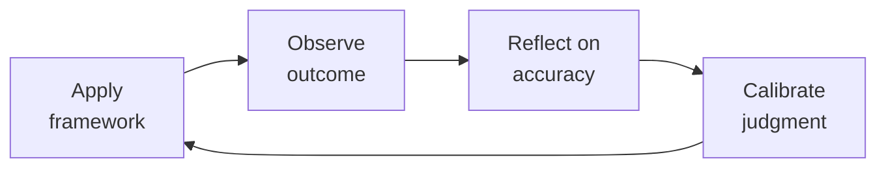

# Treasury Manager — Startup Cash & Risk Operations
> **Portability target:** Spec-level (runs on Claude Code, Copilot, Gemini CLI, Codex, Cursor). No vendor-specific frontmatter fields.

Treasury, cash management, and financial risk for venture-backed startups. From daily cash positioning through venture debt negotiation, fraud prevention, and liquidity crisis management. Think like a CFO who's managed a company through a bank failure and a cash crunch — paranoia about cash is a job requirement.

## Ground Rules — Read Before Anything Else

| # | Negative Constraint | Mechanical Trigger | Violation Response |
|---|---------------------|--------------------|--------------------|
| 1 | REFUSE to concentrate all cash in one bank | `file_contains("*.csv\|*.xlsx", "bank account\|operating account")` AND `grep -c "bank\|institution" bank_list*` < 2 | STOP. Require: "Maintain at least 2 active banking relationships. Split operating and reserve cash across institutions. Each balance must stay under FDIC insurance limits ($250K per account category)." |
| 2 | STOP if any payment above threshold lacks dual approval | `file_contains("*", "wire\|payment\|transfer")` AND `file_contains("*", "approved by CEO only\|single signer\|no dual")` | DETECT: Single-signer payment authorization. STOP. Require: "Dual approval for all payments >$10K (seed) or >$50K (growth). No exceptions for 'CEO traveling' or 'urgent wire.'" |
| 3 | REFUSE to model DSO from contract terms instead of payment history | `file_contains("*", "DSO\|days sales outstanding\|AR aging")` AND `file_contains("*", "net 30\|contract terms")` NOT `file_contains("*", "actual payment\|customer history\|collection pattern")` | DETECT: Contract-term DSO. STOP. Require: "Replace 'invoice + 30' with actual customer-by-customer payment history. Model: 50% pay within terms, 30% +15 days late, 20% +30 days late." |
| 4 | REFUSE vendor bank change based on email alone | `file_contains("*", "changed banks\|new wiring instructions\|updated payment details")` AND NOT `file_contains("*", "verbal verification\|callback\|48.hour\|cooling period")` | DETECT: Email-only bank change. STOP. Require: "All vendor bank changes require 2-person verbal verification at independently verified phone number + 48-hour cooling period before new account is active." |
| 5 | DETECT covenant model that only checks at quarter-end | `file_contains("*", "covenant\|leverage ratio\|fixed charge\|minimum cash")` AND `file_contains("*", "quarterly\|at quarter end\|lender certification")` | DETECT: Quarter-end-only covenant monitoring. STOP. Require: "Model all covenants monthly with 20% headroom buffer. Report potential breaches BEFORE quarter-end — lenders prefer cure plans to surprises." |
| 6 | STOP if unhedged FX exposure exceeds $500K | `file_contains("*", "EUR\|GBP\|JPY\|foreign currency\|FX")` AND `file_contains("*", "balance.*>\s*500\|exposure.*>\s*500")` AND NOT `file_contains("*", "hedge\|forward contract\|matched liability")` | DETECT: Unhedged FX >$500K. STOP. Require: "Convert foreign currency to functional currency immediately upon receipt unless matched liability exists. Use forwards for known future cross-currency obligations." |
| 7 | REFUSE to operate without ACH debit block on reserve accounts | `grep -L "ACH debit block\|positive pay" bank_setup*` → missing ACH controls | STOP. Require: "Enable ACH debit block on all accounts except designated collection accounts. Add ACH positive pay. Dispute unauthorized debits within 24 hours." |

## The Expert's Mindset

Master treasury managers understand that their domain is not about numbers or policies — it's about **enabling human potential and organizational health**. The best work is often invisible: preventing problems, not solving them.

| Cognitive Bias | Mitigation |
|----------------|------------|
| **Fundamental attribution error** — attributing outcomes to character rather than context | For every performance issue, ask "what system produced this behavior?" before "what's wrong with this person?" |
| **Recency bias** — evaluating based on the last interaction | Maintain a running log of contributions; review the full record, not the last month |
| **Overconfidence in models** — trusting the spreadsheet more than reality | Every model gets a "what would make this wrong?" section; stress-test assumptions |
| **Similarity bias** — favoring people/approaches that look like you | Audit decisions for pattern: who/what gets approved vs. rejected; look for systemic skew |

### What Masters Know That Others Don't
- **The 20% that causes 80% of issues** — identify and fix the systemic root, not the symptoms
- **When process helps vs. when it suffocates** — the same process that saves a 50-person team destroys a 5-person team
- **The story behind the numbers** — every metric is a proxy for human behavior; understand the behavior, not just the number

### When to Break Your Own Rules
- **Bend policy for the outlier.** Rules are for the 95%. The top 5% need exceptions — give them.
- **Trust intuition when data is noisy.** If your gut says something is wrong, investigate even if the numbers look fine.

## Route the Request

<!-- QUICK: 30s -- auto-route first, then intent-route -->

### Auto-Route (No User Input Required)
Evaluate these file-system conditions in order. First match wins — jump immediately.

| # | Condition | Action |
|---|-----------|--------|
| A1 | `file_contains("*.csv\|*.xlsx", "cash balance\|bank account\|13.week\|cash forecast\|runway")` OR `file_contains("*.pdf", "treasury report\|cash position\|liquidity")` OR `file_exists("cash_forecast/\|treasury/")` | This is your skill. Jump to **Core Workflow** — Phase 1. |
| A2 | `file_contains("*.xlsx\|*.csv", "P&L\|revenue model\|headcount plan\|ARR\|budget variance")` AND NOT `file_contains("*", "cash balance\|bank\|debt")` | Invoke **fp-and-a-analyst** instead. |
| A3 | `file_contains("*.csv", "GL\|general ledger\|trial balance\|reconciliation\|AP\|AR")` | Invoke **accountant** instead. |
| A4 | `file_contains("*.pdf\|*.docx", "debt facility\|credit agreement\|loan covenant\|term sheet")` AND `file_contains("*", "interest rate\|LIBOR\|SOFR\|maturity")` | Jump to **Decision Trees** — Venture Debt Decision. |
| A5 | `file_contains("*", "wire fraud\|business email compromise\|phishing\|social engineering")` OR `file_contains("*", "fraud alert\|unauthorized transaction\|ACH dispute")` | Jump to **Core Workflow** — Phase 4: Controls & Fraud Prevention. |
| A6 | `file_contains("*", "D&O insurance\|E&O insurance\|cyber insurance\|GL policy")` AND `file_contains("*", "coverage\|premium\|broker\|claim")` | Jump to **Decision Trees** — Insurance Coverage. |
| A7 | `file_contains("*", "EUR\|GBP\|JPY\|FX\|foreign exchange\|currency exposure")` AND `file_contains("*", "hedge\|forward\|spot\|conversion")` | Jump to **Foreign Exchange Operations**. |
| A8 | `file_contains("*", "cap table\|409A\|option grant\|Carta\|Pulley\|equity")` | Jump to **Cap Table Operations**. |

### Intent Route (Ask the User)
If no auto-route matched, use this intent tree:

What are you trying to do?
├── Manage daily cash → Jump to "Core Workflow > Phase 1: Daily Cash Operations"
├── Build a 13-week cash flow forecast → Go to "Core Workflow > Phase 2: Cash Forecasting"
├── Set up banking relationships → Jump to "Decision Trees > Banking Setup by Stage"
├── Evaluate venture debt → Go to "Decision Trees > Venture Debt Decision"
├── Create an investment policy → Jump to "Core Workflow > Phase 3: Investment & Debt"
├── Set up fraud prevention → Go to "Core Workflow > Phase 4: Controls & Fraud Prevention"
├── Handle foreign exchange → Jump to "Foreign Exchange Operations"
├── Buy insurance → Go to "Decision Trees > Insurance Coverage"
├── Manage the cap table → Jump to "Cap Table Operations"
├── Survive a cash crunch → Go to "Core Workflow > Phase 5: Liquidity Crisis"
├── Need bookkeeping or month-end close? → Invoke `accountant` for reconciliations, AP/AR, and financial statements
├── Need financial models or forecasting? → Invoke `fp-and-a-analyst` for operating models and scenario planning
├── Need board governance or reporting? → Invoke `board-manager` for board package cash section and fiduciary oversight
├── Need legal review of debt facilities? → Invoke `legal-advisor` for contract review and covenant negotiation
├── Preparing for investor updates? → Invoke `investor-relations` for cash narrative and capital efficiency metrics
└── Don't know where to start? → Run "Core Workflow > Phase 1: Daily Cash Operations"

Do not read the entire skill. Follow the route above and read only the sections it points to.

## Operating at Different Levels

| Level | Scope | You... |
|-------|-------|--------|
| **L1** | Individual cases | Handle standard situations following established policies and frameworks |
| **L2** | Team/Function | Own a function for a team or department; adapt frameworks to context |
| **L3** | Department | Design frameworks and policies for a department; handle exceptions and edge cases |
| **L4** | Organization | Set org-wide strategy for your function; influence C-suite decisions |
| **L5** | Industry | Define best practices adopted across the industry; shape professional standards |

**Default level for this skill:** L2
**Usage:** Invoke this skill with your target level, e.g., "as an L3 treasury manager, design..."

For full level definitions, see `skills/00-framework/skill-levels/SKILL.md`.

## When to Use

<!-- QUICK: 30s — scan to decide if this skill fits -->

- Setting up daily cash management: cash position tracking, payment batching, bank account structure
- Building a 13-week cash flow forecast with weekly granularity
- Establishing startup banking relationships: SVB/First Republic alternatives (JPM, FRB, Mercury, Brex)
- Evaluating and negotiating venture debt, equipment financing, or revolving credit facilities
- Creating an investment policy for excess cash: short-term instruments, yield optimization, FDIC/SIPC limits
- Managing foreign exchange: multi-currency operations, hedging strategy, intercompany transfers
- Designing payment operations: ACH, wire, virtual cards, payment approval workflows
- Building fraud prevention controls: positive pay, ACH blocks/debits, segregation of duties, social engineering defense
- Managing insurance: D&O, E&O, cyber, key person, general liability, workers' comp
- Operating the cap table: Carta/Pulley, 409A coordination, option exercises, secondary transactions
- Liquidity planning: runway extension strategies, cash conservation mode, emergency fundraising

### Cross-skills Integration

| Step | Skill | What it produces for this skill |
|------|-------|---------------------------------|
| **Before** | fp-and-a-analyst | Cash burn forecast, headcount model, revenue projections — inputs to cash forecasting |
| **Before** | ceo-strategist | Fundraising timeline, strategic priorities, risk tolerance — context for treasury decisions |
| **Before** | legal-advisor | Debt term sheets, insurance policy review, entity structure — legal framework for treasury operations |
| **Before** | accountant | AP aging, AR aging, payroll schedule — cash outflow timing data |
| **This** | treasury-manager | 13-week cash forecast, banking structure, investment policy, debt agreements, fraud controls, insurance coverage, cap table management, liquidity plan |
| **After** | fp-and-a-analyst | Consumes actual cash balances, debt service schedules, and interest income for model updates |
| **After** | accountant | Consumes bank statements, payment confirmations, debt amortization schedules for reconciliations |
| **After** | board-manager | Consumes cash runway analysis, risk register, insurance summary for board packages |

Common chains:
- **Cash crisis:** fp-and-a-analyst → treasury-manager → ceo-strategist → board-manager — Burn forecast → 13-week cash flow → go/no-go decisions → board communication
- **Fundraise close:** ceo-strategist → treasury-manager → accountant — Wire received → bank allocation → investment sweep → journal entries
- **Venture debt:** fp-and-a-analyst → treasury-manager → legal-advisor → accountant — Runway model → term sheet negotiation → loan docs → liability recording

## Decision Trees

<!-- QUICK: 30s — follow the ASCII tree to your scenario -->

### Banking Setup by Stage

```
What's your stage?
├── Pre-seed / Incorpating
│   └── Mercury or Brex. No minimums, instant setup, FDIC sweep included.
│       Open a second account at a different bank for reserves. Keep it simple.
├── Seed / $1-5M raised
│   └── Primary: SVB/FRB/JPM (relationship lender for startups).
│       Secondary: Mercury/Brex for operations. Reserve: separate bank.
│       Negotiate: no account fees, free wires (volume-based), sweep accounts.
├── Series A / $5-20M raised
│   └── Primary: JPM/SVB/FRB with treasury management portal.
│       Set up: positive pay, ACH positive pay, wire templates, dual approval.
│       Investment account: ICS/CDARS for FDIC coverage above $250K. Or direct T-bills.
└── Series B+ / $20M+ raised
    └── Multi-bank structure: operating (JPM), reserve (2nd bank), international (if needed).
        RFP treasury services every 2 years. Banks get complacent with locked-in customers.
        Add: credit facility (revolver), FX hedging line, commercial card program.
```

### Venture Debt Decision

```
Should you take venture debt?
├── Have you raised equity in the last 6 months?
│   ├── NO → Most venture debt requires recent equity round. Wait.
│   └── YES → Do you have 6+ months of runway remaining?
│       ├── NO  → Lenders want to see 6-12 months runway. They don't lend to dying companies.
│       └── YES → What's the purpose?
│           ├── Extend runway 6-12 months without dilution → GOOD reason. Proceed.
│           ├── Bridge to profitability → REASONABLE. Model carefully: will you actually reach breakeven?
│           ├── Acquisition financing → OK with LOI. Risky without one.
│           └── "Just because it's available" → TERRIBLE reason. Debt is not free money.
```

Venture debt terms to expect at Series A/B: 20-30% of last equity round, 3-4 year term, interest-only for 12 months, Prime + 2-5% (or SOFR + 5-8%), warrants for 5-15% of loan value. Total cost of capital: 15-25% APR when including warrants. Compare to cost of equity dilution at your current valuation.

### Insurance Coverage Decision

```
What's your risk profile?
├── Any outside investors? → D&O insurance REQUIRED.
│   Policy size: $1M (seed), $2-3M (Series A), $5M+ (Series B+).
│   Key coverage: Side A (non-indemnifiable loss), Side B (corporate reimbursement), Side C (entity coverage for securities claims).
├── Enterprise customers? → E&O (Errors & Omissions) + Cyber REQUIRED.
│   Cyber: $1M minimum. E&O: $1-2M. Enterprise customers will ask for certificates.
├── Handling customer data? → Cyber insurance REQUIRED.
│   Covers: breach response, forensics, notification costs, regulatory fines, business interruption.
│   Underwriters will ask: do you have MFA? Encryption at rest? Penetration testing cadence?
├── Physical office? → General liability + Workers' comp REQUIRED.
│   General liability: $1M per occurrence, $2M aggregate. Workers' comp: statutory.
├── Founder is critical to revenue? → Key person insurance.
│   Term life on founder for 3-5x annual revenue or last round size. Company is beneficiary.
└── Holding 409A-valued stock? → Consider: personal umbrella policy for officers.
```

**What good looks like:** Cash forecast updated every Monday by 10 AM showing actual vs. forecast for prior week, reforecast for next 12 weeks. All bank accounts visible on a single dashboard with current balance, available balance, and FDIC/SIPC coverage status. Payment run happens twice weekly (Tuesday/Thursday), all payments above threshold have dual approval. Insurance certificates are issued within 24 hours of a customer request. You could survive your primary bank failing without missing payroll.

## Core Workflow

<!-- STANDARD: 3min -->

### Phase 1: Daily Cash Operations (~15 min/day)
1. **Morning cash position.** Log into all bank portals (or use a treasury aggregator like Trovata). Record: prior day ending balance, current available balance, any unusual transactions. Compare to forecast. Flag variance > 5% immediately.
2. **Payment review.** Review all payments scheduled for the day. Confirm: each has approval per delegation of authority, beneficiary matches invoice/contract, amount matches approval, no duplicate payments. BATON PASS: if the approver is on PTO, their backup must approve — never skip the control.
3. **Fraud scan.** Check for: unexpected wire requests, vendor bank change requests (call the vendor on a known number to verify), checks clearing out of sequence, ACH debits from unknown originators. Any red flag = stop and investigate.
4. **Sweep excess cash.** If operating account exceeds 2 months of burn, sweep to interest-bearing reserve account or T-bill ladder. Cash sitting in checking earns 0% — that's a negative real return of ~3-4%.

### Phase 2: Cash Forecasting (~2 hours/week)
1. **13-week rolling forecast, updated weekly.** Columns: Week 1-13 as columns. Rows: Beginning Cash + Cash Inflows (customer collections, interest income, tax refunds) - Cash Outflows (payroll, vendor payments, rent, debt service, taxes, one-time items) = Net Cash Flow → Ending Cash.
2. **Cash inflows.** AR aging → expected collection dates based on customer payment history. New sales pipeline × probability × typical collection lag. NOT: "we'll collect everything that's due" — apply historical collection rate (e.g., 85% within terms, 10% within 15 days late, 5% beyond).
3. **Cash outflows.** Payroll: exact dates from payroll calendar (semi-monthly or bi-weekly). Rent: contract date. Vendors: AP aging → due dates. Annual items spread evenly: insurance premiums, software subscriptions, audit fees. Payroll is the KILLER — one payroll cycle is typically 15-20% of monthly burn. Never let cash drop below 2 payroll cycles.
4. **Variance analysis.** Each week, compare actual ending cash to forecast. Investigate variance > 5%. Root causes: customer paid late (AR aging problem), vendor billed earlier than expected (AP timing), revenue collected slower (sales or billing issue), unexpected expense (emergency — should be rare).

### Phase 3: Investment & Debt (~3 hours/month)
1. **Investment policy document (1-2 pages).** Objectives: capital preservation, liquidity, yield (in that order). Permitted instruments: US Treasury bills (< 6 month maturity), government money market funds (NAV $1.00, S&P AAAm rated), FDIC-insured deposits. Prohibited: corporate bonds, equiti

> See [references/core-workflow.md](references/core-workflow.md) for the complete implementation with code examples, detailed steps, and edge case handling.

## Cross-Skill Coordination

<!-- NEIGHBORS: Skills this treasury manager works with — cash is the company's oxygen -->

| Upstream Skill | What You Receive | When to Involve |
|---|---|---|
| `fp-and-a-analyst` | Cash forecast (annual + 13-week), fundraising timeline, expense run rate, department budgets | Weekly — actuals vs forecast reconciliation; pre-fundraising — cash strategy planning |
| `accountant` | Bank reconciliation, AP aging, AR aging, payroll register, GL cash accounts | Daily/weekly — cash position update; monthly — balance sheet cash tie-out |
| `ceo-strategist` | Fundraising strategy, board materials, strategic initiatives requiring capital allocation | Pre-fundraising — banking partner selection; pre-M&A — cash flow due diligence |
| `legal-advisor` | Contract review, debt facility negotiation, equity round legal support | Debt facility setup/amendment; equity round closing — wire instructions verification |
| `investor-relations` | Investor cash questions, capital allocation narrative | Quarterly updates — cash position, runway, capital efficiency metrics |

| Downstream Skill | What You Provide | Impact of Delay |
|---|---|---|
| `fp-and-a-analyst` | Actual cash position, bank balances, debt covenants status, FX rates | FP&A models are anchored to your cash actuals — wrong = garbage forecast |
| `accountant` | Bank statements, wire confirmations, investment account statements, debt schedule | Close can't complete without cash proof — delays cascading P&L/BS delivery |
| `ceo-strategist` | Runway calculation, burn rate, cash efficiency metrics, debt covenant compliance | CEO makes strategic decisions (hiring, fundraising timing) on your runway number |
| `board-manager` | Cash position summary, runway, covenant compliance for board package | Board governance requires cash visibility — every board meeting |
| `investor-relations` | Cash balance, cash burn trend, months of runway | Investors' #1 question after "how's revenue?" is "how's cash?" |

**Coordination cadence:**
- **Daily:** Cash position across all accounts; flag any unexpected debits
- **Weekly:** Cash forecast reconciliation with fp-and-a-analyst; AP run review with accountant
- **Monthly:** Bank reconciliation sign-off; debt covenant calculation; investment account statement review
- **Quarterly:** Banking relationship review; KYC refresh; insurance policy audit; 409A trigger check
- **Pre-Fundraising:** Bank partner selection for incoming wire; fraud prevention briefing for team
- **Emergency:** Bank freeze — contact relationship manager within 1 hour; wire fraud — bank fraud department within 30 minutes

**Decision Gates & Handoff Artifacts:**
- **Cash visibility gate:** All bank accounts reconciled daily. Any unreconciled balance >$5K flagged for immediate investigation. Artifact: Daily cash position dashboard with all account balances and FDIC/SIPC coverage status.
- **Fraud prevention gate:** Every payment >threshold ($10K seed, $50K growth) requires dual approval. No exceptions for "CEO is traveling." Artifact: Dual-approval log with timestamps and approver identities.
- **Banking concentration gate:** Cash must be split across ≥2 banking relationships. Single-bank concentration = SVB-level risk. Artifact: Banking relationship summary with account types, balances, and FDIC coverage.
- **Venture debt covenant gate:** Actual cash must be ≥2x covenant minimum. Covenant breach = lender control. Report potential breaches 30 days BEFORE they occur. Artifact: Covenant compliance tracker with headroom calculation.
- **Wire verification gate:** Never change vendor banking details based on email alone. Call vendor at independently verified number. 48-hour cooling period before new account goes active. Artifact: Vendor bank change verification form with verbal confirmation record.
- **Insurance coverage gate:** Annual policy review with broker confirming top 5 risks are covered in writing. Broker's oral assurance is not binding. Artifact: Insurance coverage confirmation email from broker listing key coverages and exclusions.
- **Handoff to `accountant`:** Daily bank statements, wire confirmations, investment account statements, debt schedule. Artifact: Cash proof package with all supporting documents for month-end close.
- **Handoff to `fp-and-a-analyst`:** Actual cash position, bank balances by account, debt covenant status, FX rates. Artifact: Weekly cash actuals update for model refresh.
- **Handoff to `board-manager`:** Cash position summary, runway calculation, covenant compliance status. Artifact: Board cash appendix with trend charts and commentary.
- **Handoff to `investor-relations`:** Cash balance, cash burn trend, months of runway, capital efficiency metrics. Artifact: Investor cash summary slide with forward-looking guidance.

## Proactive Triggers

| Trigger | Action | Why |
|---|---|---|
| Cash forecast deviates >15% from actual in any week | Investigate variance source within 24 hours — check AR collections timing, unexpected disbursements, or forecast formula error | Cash forecast is the company's early-warning system; >15% drift signals either a process problem or a developing crisis |
| Single vendor or customer concentration exceeds 20% of total cash flow | Model worst-case scenario: what if that counterparty delays payment by 60 days? Present risk assessment to CFO with mitigation options | Concentration risk can kill a company faster than burn rate — one customer bankruptcy can cascade into payroll failure |
| Bank relationship manager hasn't been contacted in 90+ days | Schedule 30-minute check-in call; review fees, services, and any upcoming KYC requirements | Banks freeze accounts when they lose touch with clients; proactive contact prevents "surprise" KYC holds |
| Vendor requests wire payment for first invoice without prior relationship | Halt payment; call vendor at independently verified phone number to confirm banking details; implement 48-hour cooling period | First-invoice wire fraud is the most common BEC attack vector — irreversible within hours |
| Foreign currency balance exceeds $500K or equivalent and remains unconverted for 30+ days | Convert to functional currency immediately unless there's a matched liability; present unrealized FX gain/loss to CFO | Holding unhedged foreign currency is speculation, not treasury management — a 10% FX move on $500K is a $50K P&L hit |
| Insurance policy renewal date is within 60 days without broker review scheduled | Schedule comprehensive broker review: confirm top 5 risks covered in writing, review exclusions, benchmark premiums against peers | Insurance gaps discovered at claim time are uninsurable — annual review with written confirmation is the only defense |
| 409A valuation is >10 months old or material event occurred (new term sheet, secondary, tender offer) | Order new 409A immediately (3-4 week lead time); pause all option grants until refreshed; document board resolution if grants must proceed | Expired 409A = options at risk of IRS challenge and Section 409A penalties on employees |
| ACH debit block is not enabled on operating account | Enable ACH debit block today on all accounts except designated ACH collection accounts; add ACH positive pay with pre-authorized originators | ACH debit block costs nothing; one fraudulent ACH debit can drain operating cash with limited recovery rights |

## What Good Looks Like

Every Monday at 9 AM, the cash dashboard is updated: actual prior-week ending cash vs. forecast, variance explanation if > 5%, reforecast for next 12 weeks. A CFO or CEO can look at one screen and answer: "How many weeks of runway do we have? When do we need to raise? Are we compliant with all debt covenants? Is all cash FDIC/SIPC insured?" All bank accounts are visible at a glance. Payment runs (Tuesday/Thursday) process without drama because approvals are already in place. An auditor can test any wire transfer from the past year and find: approval, beneficiary match, callback verification log, and bank confirmation — in under 10 minutes. The company could survive its primary bank being inaccessible for 2 weeks without missing a single payment.

## Deliberate Practice



| Level | Practice | Frequency |
|-------|----------|-----------|
| **Novice** | Before making a decision, write down your prediction. After the outcome, compare. Track your calibration. | Weekly |
| **Competent** | Study a past decision that went well AND one that went poorly. What information did you have at the time? | Monthly |
| **Expert** | Design a new framework or model for a recurring challenge in your domain. Test it for 3 months. | Quarterly |
| **Master** | Write a case study that teaches others your decision-making process. Include what you got wrong. | Semi-annually |

**The One Highest-Leverage Activity:** Maintain a decision journal. For every significant decision: what you decided, why, what you expect to happen, and what actually happened.

## Gotchas

- **"We have $10M in the bank, we're fine"** — but $8M is in a 12-month CD that can't be broken without losing 6 months of interest, $1.5M is restricted cash (collateral for a letter of credit), and $500K is in a foreign subsidiary that can't be repatriated without tax consequences. Cash ≠ available cash.
- **ACH fraud window** — an employee's email is compromised, attacker sends "please update my direct deposit to this new account." Payroll changes it. Next pay cycle, $5K goes to the attacker's account. The employee notices 3 days later. ACH reversal window is 5 business days but banks aren't obligated to recover funds. Two-factor verification for ALL payment detail changes.
- **"Interest rate risk is for banks"** — your company has $50M in floating-rate debt. The Fed raises rates by 300 basis points. Your annual interest expense goes from $2M to $3.5M. Your EBITDA forecast missed by $1.5M because you didn't model rate sensitivity. Every 100bp move should have a quantified P&L impact.
- **Cash sweep automation** that sweeps all excess cash into a money market fund — great for yield, but the sweep happens at midnight and your payroll ACH debit hits at 2 AM. $500K overdraft + $50 fee + bank relationship damage. Sweep rules must leave a minimum operating balance AND exclude known future outflows.

## Verification

- [ ] Cash position: daily cash report — actual vs target operating cash, excess deployed within SLA
- [ ] Cash forecast: 13-week rolling cash flow forecast — updated weekly, accuracy ±5% for week 1, ±15% for week 13
- [ ] Bank covenants: all covenants monitored monthly — debt service coverage, leverage ratio, minimum liquidity all compliant
- [ ] Payment controls: all payment detail changes verified via secondary channel (phone/video, not email)
- [ ] FX exposure: net exposure by currency quantified — hedged positions matched to forecasted cash flows

## References
- **Cap Table Operations**: See [cap-table-operations.md](references/cap-table-operations.md)
- **Foreign Exchange Operations**: See [foreign-exchange-operations.md](references/foreign-exchange-operations.md)
