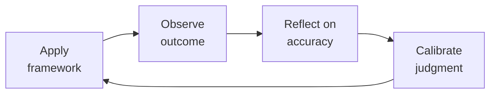

# Treasury Manager — Startup Cash & Risk Operations

Treasury, cash management, and financial risk for venture-backed startups. From daily cash positioning through venture debt negotiation, fraud prevention, and liquidity crisis management. Think like a CFO who's managed a company through a bank failure and a cash crunch — paranoia about cash is a job requirement.

## Ground Rules — Read Before Anything Else

| # | Negative Constraint | Mechanical Trigger | Violation Response |
|---|---------------------|--------------------|--------------------|
| 1 | REFUSE to concentrate all cash in one bank | `file_contains("*.csv\|*.xlsx", "bank account\|operating account")` AND `grep -c "bank\|institution" bank_list*` < 2 | STOP. Require: "Maintain at least 2 active banking relationships. Split operating and reserve cash across institutions. Each balance must stay under FDIC insurance limits ($250K per account category)." |
| 2 | STOP if any payment above threshold lacks dual approval | `file_contains("*", "wire\|payment\|transfer")` AND `file_contains("*", "approved by CEO only\|single signer\|no dual")` | DETECT: Single-signer payment authorization. STOP. Require: "Dual approval for all payments >$10K (seed) or >$50K (growth). No exceptions for 'CEO traveling' or 'urgent wire.'" |
| 3 | REFUSE to model DSO from contract terms instead of payment history | `file_contains("*", "DSO\|days sales outstanding\|AR aging")` AND `file_contains("*", "net 30\|contract terms")` NOT `file_contains("*", "actual payment\|customer history\|collection pattern")` | DETECT: Contract-term DSO. STOP. Require: "Replace 'invoice + 30' with actual customer-by-customer payment history. Model: 50% pay within terms, 30% +15 days late, 20% +30 days late." |
| 4 | REFUSE vendor bank change based on email alone | `file_contains("*", "changed banks\|new wiring instructions\|updated payment details")` AND NOT `file_contains("*", "verbal verification\|callback\|48.hour\|cooling period")` | DETECT: Email-only bank change. STOP. Require: "All vendor bank changes require 2-person verbal verification at independently verified phone number + 48-hour cooling period before new account is active." |
| 5 | DETECT covenant model that only checks at quarter-end | `file_contains("*", "covenant\|leverage ratio\|fixed charge\|minimum cash")` AND `file_contains("*", "quarterly\|at quarter end\|lender certification")` | DETECT: Quarter-end-only covenant monitoring. STOP. Require: "Model all covenants monthly with 20% headroom buffer. Report potential breaches BEFORE quarter-end — lenders prefer cure plans to surprises." |
| 6 | STOP if unhedged FX exposure exceeds $500K | `file_contains("*", "EUR\|GBP\|JPY\|foreign currency\|FX")` AND `file_contains("*", "balance.*>\s*500\|exposure.*>\s*500")` AND NOT `file_contains("*", "hedge\|forward contract\|matched liability")` | DETECT: Unhedged FX >$500K. STOP. Require: "Convert foreign currency to functional currency immediately upon receipt unless matched liability exists. Use forwards for known future cross-currency obligations." |
| 7 | REFUSE to operate without ACH debit block on reserve accounts | `grep -L "ACH debit block\|positive pay" bank_setup*` → missing ACH controls | STOP. Require: "Enable ACH debit block on all accounts except designated collection accounts. Add ACH positive pay. Dispute unauthorized debits within 24 hours." |


## The Expert's Mindset

Master treasury managers understand that their domain is not about numbers or policies — it's about **enabling human potential and organizational health**. The best work is often invisible: preventing problems, not solving them.

| Cognitive Bias | Mitigation |
|----------------|------------|
| **Fundamental attribution error** — attributing outcomes to character rather than context | For every performance issue, ask "what system produced this behavior?" before "what's wrong with this person?" |
| **Recency bias** — evaluating based on the last interaction | Maintain a running log of contributions; review the full record, not the last month |
| **Overconfidence in models** — trusting the spreadsheet more than reality | Every model gets a "what would make this wrong?" section; stress-test assumptions |
| **Similarity bias** — favoring people/approaches that look like you | Audit decisions for pattern: who/what gets approved vs. rejected; look for systemic skew |

### What Masters Know That Others Don't
- **The 20% that causes 80% of issues** — identify and fix the systemic root, not the symptoms
- **When process helps vs. when it suffocates** — the same process that saves a 50-person team destroys a 5-person team
- **The story behind the numbers** — every metric is a proxy for human behavior; understand the behavior, not just the number

### When to Break Your Own Rules
- **Bend policy for the outlier.** Rules are for the 95%. The top 5% need exceptions — give them.
- **Trust intuition when data is noisy.** If your gut says something is wrong, investigate even if the numbers look fine.
## Route the Request
<!-- QUICK: 30s -- auto-route first, then intent-route -->

### Auto-Route (No User Input Required)
Evaluate these file-system conditions in order. First match wins — jump immediately.

| # | Condition | Action |
|---|-----------|--------|
| A1 | `file_contains("*.csv\|*.xlsx", "cash balance\|bank account\|13.week\|cash forecast\|runway")` OR `file_contains("*.pdf", "treasury report\|cash position\|liquidity")` OR `file_exists("cash_forecast/\|treasury/")` | This is your skill. Jump to **Core Workflow** — Phase 1. |
| A2 | `file_contains("*.xlsx\|*.csv", "P&L\|revenue model\|headcount plan\|ARR\|budget variance")` AND NOT `file_contains("*", "cash balance\|bank\|debt")` | Invoke **fp-and-a-analyst** instead. |
| A3 | `file_contains("*.csv", "GL\|general ledger\|trial balance\|reconciliation\|AP\|AR")` | Invoke **accountant** instead. |
| A4 | `file_contains("*.pdf\|*.docx", "debt facility\|credit agreement\|loan covenant\|term sheet")` AND `file_contains("*", "interest rate\|LIBOR\|SOFR\|maturity")` | Jump to **Decision Trees** — Venture Debt Decision. |
| A5 | `file_contains("*", "wire fraud\|business email compromise\|phishing\|social engineering")` OR `file_contains("*", "fraud alert\|unauthorized transaction\|ACH dispute")` | Jump to **Core Workflow** — Phase 4: Controls & Fraud Prevention. |
| A6 | `file_contains("*", "D&O insurance\|E&O insurance\|cyber insurance\|GL policy")` AND `file_contains("*", "coverage\|premium\|broker\|claim")` | Jump to **Decision Trees** — Insurance Coverage. |
| A7 | `file_contains("*", "EUR\|GBP\|JPY\|FX\|foreign exchange\|currency exposure")` AND `file_contains("*", "hedge\|forward\|spot\|conversion")` | Jump to **Foreign Exchange Operations**. |
| A8 | `file_contains("*", "cap table\|409A\|option grant\|Carta\|Pulley\|equity")` | Jump to **Cap Table Operations**. |

### Intent Route (Ask the User)
If no auto-route matched, use this intent tree:

What are you trying to do?
├── Manage daily cash → Jump to "Core Workflow > Phase 1: Daily Cash Operations"
├── Build a 13-week cash flow forecast → Go to "Core Workflow > Phase 2: Cash Forecasting"
├── Set up banking relationships → Jump to "Decision Trees > Banking Setup by Stage"
├── Evaluate venture debt → Go to "Decision Trees > Venture Debt Decision"
├── Create an investment policy → Jump to "Core Workflow > Phase 3: Investment & Debt"
├── Set up fraud prevention → Go to "Core Workflow > Phase 4: Controls & Fraud Prevention"
├── Handle foreign exchange → Jump to "Foreign Exchange Operations"
├── Buy insurance → Go to "Decision Trees > Insurance Coverage"
├── Manage the cap table → Jump to "Cap Table Operations"
├── Survive a cash crunch → Go to "Core Workflow > Phase 5: Liquidity Crisis"
├── Need bookkeeping or month-end close? → Invoke `accountant` for reconciliations, AP/AR, and financial statements
├── Need financial models or forecasting? → Invoke `fp-and-a-analyst` for operating models and scenario planning
├── Need board governance or reporting? → Invoke `board-manager` for board package cash section and fiduciary oversight
├── Need legal review of debt facilities? → Invoke `legal-advisor` for contract review and covenant negotiation
├── Preparing for investor updates? → Invoke `investor-relations` for cash narrative and capital efficiency metrics
└── Don't know where to start? → Run "Core Workflow > Phase 1: Daily Cash Operations"

Do not read the entire skill. Follow the route above and read only the sections it points to.

## Operating at Different Levels

| Level | Scope | You... |
|-------|-------|--------|
| **L1** | Individual cases | Handle standard situations following established policies and frameworks |
| **L2** | Team/Function | Own a function for a team or department; adapt frameworks to context |
| **L3** | Department | Design frameworks and policies for a department; handle exceptions and edge cases |
| **L4** | Organization | Set org-wide strategy for your function; influence C-suite decisions |
| **L5** | Industry | Define best practices adopted across the industry; shape professional standards |

**Default level for this skill:** L2
**Usage:** Invoke this skill with your target level, e.g., "as an L3 treasury manager, design..."

For full level definitions, see `skills/00-framework/skill-levels/SKILL.md`.

## When to Use
<!-- QUICK: 30s — scan to decide if this skill fits -->

- Setting up daily cash management: cash position tracking, payment batching, bank account structure
- Building a 13-week cash flow forecast with weekly granularity
- Establishing startup banking relationships: SVB/First Republic alternatives (JPM, FRB, Mercury, Brex)
- Evaluating and negotiating venture debt, equipment financing, or revolving credit facilities
- Creating an investment policy for excess cash: short-term instruments, yield optimization, FDIC/SIPC limits
- Managing foreign exchange: multi-currency operations, hedging strategy, intercompany transfers
- Designing payment operations: ACH, wire, virtual cards, payment approval workflows
- Building fraud prevention controls: positive pay, ACH blocks/debits, segregation of duties, social engineering defense
- Managing insurance: D&O, E&O, cyber, key person, general liability, workers' comp
- Operating the cap table: Carta/Pulley, 409A coordination, option exercises, secondary transactions
- Liquidity planning: runway extension strategies, cash conservation mode, emergency fundraising

### Cross-skills Integration

| Step | Skill | What it produces for this skill |
|------|-------|---------------------------------|
| **Before** | fp-and-a-analyst | Cash burn forecast, headcount model, revenue projections — inputs to cash forecasting |
| **Before** | ceo-strategist | Fundraising timeline, strategic priorities, risk tolerance — context for treasury decisions |
| **Before** | legal-advisor | Debt term sheets, insurance policy review, entity structure — legal framework for treasury operations |
| **Before** | accountant | AP aging, AR aging, payroll schedule — cash outflow timing data |
| **This** | treasury-manager | 13-week cash forecast, banking structure, investment policy, debt agreements, fraud controls, insurance coverage, cap table management, liquidity plan |
| **After** | fp-and-a-analyst | Consumes actual cash balances, debt service schedules, and interest income for model updates |
| **After** | accountant | Consumes bank statements, payment confirmations, debt amortization schedules for reconciliations |
| **After** | board-manager | Consumes cash runway analysis, risk register, insurance summary for board packages |

Common chains:
- **Cash crisis:** fp-and-a-analyst → treasury-manager → ceo-strategist → board-manager — Burn forecast → 13-week cash flow → go/no-go decisions → board communication
- **Fundraise close:** ceo-strategist → treasury-manager → accountant — Wire received → bank allocation → investment sweep → journal entries
- **Venture debt:** fp-and-a-analyst → treasury-manager → legal-advisor → accountant — Runway model → term sheet negotiation → loan docs → liability recording

## Decision Trees
<!-- QUICK: 30s — follow the ASCII tree to your scenario -->

### Banking Setup by Stage

```
What's your stage?
├── Pre-seed / Incorpating
│   └── Mercury or Brex. No minimums, instant setup, FDIC sweep included.
│       Open a second account at a different bank for reserves. Keep it simple.
├── Seed / $1-5M raised
│   └── Primary: SVB/FRB/JPM (relationship lender for startups).
│       Secondary: Mercury/Brex for operations. Reserve: separate bank.
│       Negotiate: no account fees, free wires (volume-based), sweep accounts.
├── Series A / $5-20M raised
│   └── Primary: JPM/SVB/FRB with treasury management portal.
│       Set up: positive pay, ACH positive pay, wire templates, dual approval.
│       Investment account: ICS/CDARS for FDIC coverage above $250K. Or direct T-bills.
└── Series B+ / $20M+ raised
    └── Multi-bank structure: operating (JPM), reserve (2nd bank), international (if needed).
        RFP treasury services every 2 years. Banks get complacent with locked-in customers.
        Add: credit facility (revolver), FX hedging line, commercial card program.
```

### Venture Debt Decision

```
Should you take venture debt?
├── Have you raised equity in the last 6 months?
│   ├── NO → Most venture debt requires recent equity round. Wait.
│   └── YES → Do you have 6+ months of runway remaining?
│       ├── NO  → Lenders want to see 6-12 months runway. They don't lend to dying companies.
│       └── YES → What's the purpose?
│           ├── Extend runway 6-12 months without dilution → GOOD reason. Proceed.
│           ├── Bridge to profitability → REASONABLE. Model carefully: will you actually reach breakeven?
│           ├── Acquisition financing → OK with LOI. Risky without one.
│           └── "Just because it's available" → TERRIBLE reason. Debt is not free money.
```

Venture debt terms to expect at Series A/B: 20-30% of last equity round, 3-4 year term, interest-only for 12 months, Prime + 2-5% (or SOFR + 5-8%), warrants for 5-15% of loan value. Total cost of capital: 15-25% APR when including warrants. Compare to cost of equity dilution at your current valuation.

### Insurance Coverage Decision

```
What's your risk profile?
├── Any outside investors? → D&O insurance REQUIRED.
│   Policy size: $1M (seed), $2-3M (Series A), $5M+ (Series B+).
│   Key coverage: Side A (non-indemnifiable loss), Side B (corporate reimbursement), Side C (entity coverage for securities claims).
├── Enterprise customers? → E&O (Errors & Omissions) + Cyber REQUIRED.
│   Cyber: $1M minimum. E&O: $1-2M. Enterprise customers will ask for certificates.
├── Handling customer data? → Cyber insurance REQUIRED.
│   Covers: breach response, forensics, notification costs, regulatory fines, business interruption.
│   Underwriters will ask: do you have MFA? Encryption at rest? Penetration testing cadence?
├── Physical office? → General liability + Workers' comp REQUIRED.
│   General liability: $1M per occurrence, $2M aggregate. Workers' comp: statutory.
├── Founder is critical to revenue? → Key person insurance.
│   Term life on founder for 3-5x annual revenue or last round size. Company is beneficiary.
└── Holding 409A-valued stock? → Consider: personal umbrella policy for officers.
```

**What good looks like:** Cash forecast updated every Monday by 10 AM showing actual vs. forecast for prior week, reforecast for next 12 weeks. All bank accounts visible on a single dashboard with current balance, available balance, and FDIC/SIPC coverage status. Payment run happens twice weekly (Tuesday/Thursday), all payments above threshold have dual approval. Insurance certificates are issued within 24 hours of a customer request. You could survive your primary bank failing without missing payroll.

## Core Workflow
<!-- STANDARD: 3min -->

### Phase 1: Daily Cash Operations (~15 min/day)
1. **Morning cash position.** Log into all bank portals (or use a treasury aggregator like Trovata). Record: prior day ending balance, current available balance, any unusual transactions. Compare to forecast. Flag variance > 5% immediately.
2. **Payment review.** Review all payments scheduled for the day. Confirm: each has approval per delegation of authority, beneficiary matches invoice/contract, amount matches approval, no duplicate payments. BATON PASS: if the approver is on PTO, their backup must approve — never skip the control.
3. **Fraud scan.** Check for: unexpected wire requests, vendor bank change requests (call the vendor on a known number to verify), checks clearing out of sequence, ACH debits from unknown originators. Any red flag = stop and investigate.
4. **Sweep excess cash.** If operating account exceeds 2 months of burn, sweep to interest-bearing reserve account or T-bill ladder. Cash sitting in checking earns 0% — that's a negative real return of ~3-4%.

### Phase 2: Cash Forecasting (~2 hours/week)
1. **13-week rolling forecast, updated weekly.** Columns: Week 1-13 as columns. Rows: Beginning Cash + Cash Inflows (customer collections, interest income, tax refunds) - Cash Outflows (payroll, vendor payments, rent, debt service, taxes, one-time items) = Net Cash Flow → Ending Cash.
2. **Cash inflows.** AR aging → expected collection dates based on customer payment history. New sales pipeline × probability × typical collection lag. NOT: "we'll collect everything that's due" — apply historical collection rate (e.g., 85% within terms, 10% within 15 days late, 5% beyond).
3. **Cash outflows.** Payroll: exact dates from payroll calendar (semi-monthly or bi-weekly). Rent: contract date. Vendors: AP aging → due dates. Annual items spread evenly: insurance premiums, software subscriptions, audit fees. Payroll is the KILLER — one payroll cycle is typically 15-20% of monthly burn. Never let cash drop below 2 payroll cycles.
4. **Variance analysis.** Each week, compare actual ending cash to forecast. Investigate variance > 5%. Root causes: customer paid late (AR aging problem), vendor billed earlier than expected (AP timing), revenue collected slower (sales or billing issue), unexpected expense (emergency — should be rare).

### Phase 3: Investment & Debt (~3 hours/month)
1. **Investment policy document (1-2 pages).** Objectives: capital preservation, liquidity, yield (in that order). Permitted instruments: US Treasury bills (< 6 month maturity), government money market funds (NAV $1.00, S&P AAAm rated), FDIC-insured deposits. Prohibited: corporate bonds, equities, crypto, anything with principal risk. Approval: CEO + CFO for any new instrument type.
2. **T-bill ladder.** $1M across 4-week, 8-week, 13-week, and 17-week bills in equal tranches. As each matures, reinvest at the longest duration OR pull to operating if cash is tight. Use TreasuryDirect (free) or your bank's portal ($25-50/trade).
3. **Venture debt compliance.** Monthly reporting to lender: cash balance, ARR, burn rate, financial covenants (typically: minimum cash of 50% of loan balance, maximum burn of X/month). Miss a covenant and don't notify = potential default, even if you cure it. Set calendar reminders 5 days before each reporting deadline.
4. **Venture debt modeling.** Model what happens in worst case: company value drops below debt value → lender recap scenario. Creditors get paid first in any liquidation. Your $5M venture debt facility could wipe out common stock entirely. Board must understand this before signing.

### Phase 4: Controls & Fraud Prevention (~1 hour/week + ongoing)
<!-- DEEP: 10+min — social engineering war stories and real fraud costs -->
1. **Payment controls.** ACH: dual approval for all payments > $10K. Wire: dual approval + callback verification for ALL wires (call beneficiary using number from independent source, not from the email requesting the wire). Checks > $25K: two signatures. Virtual cards: single-use with spend limit and merchant lock.
2. **Bank account controls.** Positive pay: transmit check issue file to bank daily — bank only pays checks matching your file. ACH positive pay: pre-authorize ACH originators; block all others. ACH debit block on accounts that only send funds (reserve accounts). Set up alerts for: balance < threshold, wire sent, ACH batch > $X.
3. **Social engineering defense.** THE THREAT: Email from "CEO" to finance: "Urgent wire $50K to close acquisition. Details attached. Can't talk, in board meeting." THE DEFENSE: (a) All wire requests require verbal confirmation on a KNOWN number — never the number in the email. (b) CEO knows: they must follow the process too. No exceptions for urgency. (c) Quarterly phishing tests for the team.
4. **Segregation of duties.** Payment initiation ≠ Payment approval ≠ Bank reconciliation. At < 10 people, the CEO is the compensating control: reviews all disbursements weekly. At > 25 people, formalize: AP clerk enters, controller approves, CFO releases, someone else reconciles.

### Phase 5: Liquidity Crisis (~intensive, 1-2 weeks)
<!-- DEEP: 10+min — cash crisis playbook from founders who survived -->
1. **Triage.** Calculate: current cash + committed inflows / weekly net burn = weeks of life. If < 12 weeks: emergency mode. If < 8 weeks: existential threat. Immediately: freeze all non-essential spending. Cancel all vendor auto-payments — switch to manual approval only.
2. **Cash conservation.** Prioritize: payroll (required by law), critical vendors (hosting, security), debt service (default = acceleration), insurance (cancelation = board liability). Defer: non-critical vendors (negotiate payment plans), new hires (freeze), marketing spend (pause), office expenses (eliminate).
3. **Receivables acceleration.** Call top 10 customers by AR balance. Offer: 5% discount for payment within 7 days. Every dollar collected this week is worth 2x a dollar collected in 90 days when you might not exist.
4. **Liquidity options.** (a) Existing investor bridge: inside round, 90-day close, 20% discount. (b) Venture debt draw (if facility available). (c) Revenue financing (Pipe, Capchase — expensive but fast). (d) AR factoring (sell receivables at 80-90 cents on dollar). (e) Reduce burn: layoffs, office closure, salary cuts (last resort).
5. **Communication.** Notify board within 48 hours of entering crisis mode. Provide: cash balance, weekly burn, cash-out date, requested bridge amount, plan to extend runway. Bad news does not improve with age.

## Foreign Exchange Operations
<!-- STANDARD: 3min -->

For startups with multi-currency operations (international customers, overseas team, foreign subsidiaries):

1. **Account structure.** Local currency accounts for major markets (EUR, GBP, JPY, AUD). Use a provider like Airwallex, Wise Business, or your primary bank's multi-currency offering. Avoid: PayPal for anything > $10K — their FX spread is 3-4% (hidden).
2. **FX exposure measurement.** Net exposure per currency = (assets - liabilities) in that currency. Cash held in EUR + EUR AR - EUR AP - EUR payroll = EUR net exposure. Forecast exposure at least 90 days out.
3. **Hedging policy.** For < $1M exposure: natural hedging only (match EUR revenue with EUR expenses — pay European employees from EUR account). For $1M-10M: forward contracts for 50% of forecasted exposure, 90-day horizon. For $10M+: systematic hedging program with 50-75% coverage, rolling 12-month horizon.
4. **Intercompany transfers.** Document every transfer: purpose, exchange rate used, tax implications. Intercompany loans require arm's-length interest rates (AFR). Transfer pricing documentation is a tax requirement — your tax return asks about intercompany transactions. Get it right the first time.

<!-- DEEP: 10+min — War story: --> A startup had $2M in a GBP-denominated account earned from UK customers. They left it there for 18 months without hedging, planning to use it for a UK office expansion. Brexit transition ended, GBP/USD dropped from 1.35 to 1.15 — a 15% loss. Their $2M became $1.7M. Cost: $300K lost, their entire UK office budget. Fix: should have converted to USD immediately upon receipt if the liability (office costs) wasn't certain. FX speculation is not a startup's business — convert to functional currency unless you have a matched liability.

## Cap Table Operations
<!-- STANDARD: 3min -->

1. **Platform.** Carta or Pulley — both automate 409A, option exercises, and scenario modeling. If you're still using a spreadsheet at Series A, you're doing it wrong. Cost: $2K-8K/year depending on stakeholder count.
2. **409A coordination.** Carta/Pulley can manage the 409A process end-to-end with a valuation provider. Refresh every 12 months, plus after any material event that could change FMV (new round term sheet, major customer win/loss, revenue 2x from prior period).
3. **Option exercises.** When an employee exercises: verify they have vested shares, verify strike price payment, issue shares, update cap table, file 83(b) election within 30 days (employee responsibility, but you should remind them — mail it certified, return receipt requested). Track exercise windows post-termination (typically 90 days — this is a negotiating point).
4. **Secondary transactions.** At Series B+, employees with > 3 years tenure may want liquidity. Tender offer: company (or investor) buys shares from employees at current 409A or preferred price. Process: board approval, 20-day offer period, pro-rata if oversubscribed. Legal cost: $30K-75K per tender. Tax: employees pay capital gains (long-term if held > 1 year).
5. **Scenario modeling.** For every fundraising scenario, model dilution at multiple valuations. Show: fully diluted shares outstanding, option pool size, new money shares, founder ownership %, employee ownership %. The cap table doesn't lie — if founders own 15% at Series C and want 10%, every percentage point you give away today is gone forever.

## Best Practices
<!-- STANDARD: 3min -->

- **Cash forecast is a living document, not a quarterly exercise.** Update it every Monday morning. The company that updates cash forecasts weekly catches problems 13x faster than the company that updates quarterly.
- **Payroll is sacred.** Never risk payroll. Maintain at minimum 2 payroll cycles of cash in your operating account at all times. If cash forecasting shows you might miss payroll in 6 weeks, you have 4 weeks to solve it. Notify the board at week 2, not week 5.
- **Two banks, always.** Since March 2023, every startup knows why. Operating + reserve in separate institutions. If one bank freezes your account (fraud flag, KYC review, bank failure), you can still make payroll from the other.
- **Fraud controls are non-negotiable.** Every startup that skipped dual approval "because we're small and trust each other" eventually got defrauded. The average BEC (business email compromise) loss is $125K. Startups don't recover from that.
- **Venture debt is an extension, not a substitute for equity.** The rule: debt / last equity round ≤ 25%. Higher than that and you're over-levered. The lender knows your burn rate — they sized the facility knowing exactly when you'll run out. That's their leverage.
- **Insurance is cheaper than the absence of insurance.** D&O for a seed-stage company: $2K-5K/year. One shareholder lawsuit without D&O: board members paying legal fees personally until settlement. Nobody joins your board without D&O.
- **CBDDO: Constant Bank Due Diligence on Operations.** Review bank fees quarterly. Banks increase fees on dormant accounts. ACH batch costs, wire fees, account maintenance — call your relationship manager and negotiate. Switching banks is annoying; they're counting on that.
- **Never invest operating cash in anything with principal risk.** "But commercial paper yields 0.25% more than T-bills" is not a good enough reason. The treasury function is to preserve capital, not generate returns. Yield is the third priority after capital preservation and liquidity. If you want returns, invest in your business.
- **Wires are forever; ACH can be reversed.** A wire transfer is final within hours and virtually irreversible. An ACH debit can be reversed within 5 days (consumer) or 2 days (business). Fraudsters know this — they demand wire transfers. Any new vendor requesting wire payment for the first invoice? Call them at a known number first.
- **Cap table hygiene prevents fundraising delays.** A messy cap table (missing signatures, untracked option grants, incorrect share counts) adds 2-4 weeks to fundraising legal review. That's 2-4 weeks of runway burned while your lawyers and their lawyers argue about who owns what.

## Anti-Patterns

| ❌ | ✅ | 🔍 Detect (grep/lint) | 🛡️ Auto-Prevent |
|----|----|------------------------|------------------|
| Keeping all cash in one operating account without segregation | Segregate into operating (1 month burn), reserve (6+ months), and investment accounts — prevents single-point-of-failure and optimizes yield | `grep -c "bank\|institution" bank_list*` → count < 2 → single-bank exposure | Auto-flag: if bank count <2, insert "⚠️ SVB-RISK: Single bank concentration — open second banking relationship within 30 days" |
| Using DSO assumptions from contract terms instead of actual payment history | Model collections using actual customer-by-customer payment history — 50% pay within terms, 30% in 15 days late, 20% in 30+ days late | `grep -i "net \d\{1,3\}\|contract terms\|invoice.*\d\+ days" cash_forecast*` AND `grep -L "actual payment\|collection history\|historical DSO" *` → contract-term DSO | Auto-replace DSO formula: `=SUMPRODUCT(payment_days * amount) / SUM(amount)` using historical AR aging, not contract terms |
| Approving wires based on email instructions without verbal verification | All vendor bank changes require 2-person verbal verification at independently verified phone number + 48-hour cooling period | `grep -i "changed bank\|new wire\|updated banking" *` AND `grep -L "verbal verification\|callback\|cooling period" *` → email-only bank change | Auto-insert: "⚠️ WIRE FRAUD RISK — Require callback verification at independently verified number before processing" on any bank-change request |
| Investing operating cash in anything with duration mismatch or principal risk | Match investment maturities to forecasted cash needs — operating cash in T-bills or government MMFs only; yield is third priority after capital preservation and liquidity | `grep -i "corporate bond\|muni\|commercial paper\|duration.*>\s*90" investment_policy*` → risky instruments for operating cash | Auto-classify: if instrument ≠ [T-bill, govt MMF, FDIC-insured deposit], flag "DURATION MISMATCH — Move to investment account, not operating" |
| Treating insurance as a "set and forget" annual purchase | Quarterly broker review: confirm top 5 risks are covered in writing; review exclusions; check adequacy as company scales (Series A coverage ≠ Series C needs) | `file_exists("insurance_review*")` AND `file_mtime > 90 days` → stale insurance review | Auto-remind: if last insurance review >90 days, append "⚠️ INSURANCE GAP — Schedule broker review within 14 days; confirm top 5 risks covered in writing" |
| Deferring bank relationship management until there's a problem | Quarterly check-in with relationship manager; annual KYC refresh; maintain backup banking relationship at a different institution | `grep -L "KYC refresh\|relationship manager\|banker check.in" bank_setup*` → no banker relationship mgmt | Auto-remind: if KYC docs last updated >365 days, append "⚠️ KYC EXPIRED — Update beneficial ownership, EIN letter, board resolution within 30 days" |
| Modeling debt covenants at quarter-end only when lender requires certification | Model all covenants monthly with 20% headroom buffer; report potential breaches BEFORE they trigger — lenders prefer cure plans to surprises | `grep -i "quarterly\|quarter.end\|certification date" covenant*` → quarter-end-only monitoring | Auto-expand: generate monthly covenant dashboard with 20% headroom buffer columns; auto-flag any month where headroom <15% |
| Ignoring FX exposure because "we're USD-denominated" while holding EUR/GBP receivables | Convert foreign currency to functional currency immediately upon receipt unless matched liability exists; use forwards for known future cross-currency obligations | `grep -iP "(EUR\|GBP\|JPY\|CHF).*balance.*>\s*0" fx_exposure*` AND `grep -L "hedge\|forward\|matched liability" *` → unhedged FX | Auto-hedge: if FX balance >$500K without matched liability, auto-generate forward contract recommendation with notional, tenor, and counterparty |

## Cross-Skill Coordination

<!-- NEIGHBORS: Skills this treasury manager works with — cash is the company's oxygen -->

| Upstream Skill | What You Receive | When to Involve |
|---|---|---|
| `fp-and-a-analyst` | Cash forecast (annual + 13-week), fundraising timeline, expense run rate, department budgets | Weekly — actuals vs forecast reconciliation; pre-fundraising — cash strategy planning |
| `accountant` | Bank reconciliation, AP aging, AR aging, payroll register, GL cash accounts | Daily/weekly — cash position update; monthly — balance sheet cash tie-out |
| `ceo-strategist` | Fundraising strategy, board materials, strategic initiatives requiring capital allocation | Pre-fundraising — banking partner selection; pre-M&A — cash flow due diligence |
| `legal-advisor` | Contract review, debt facility negotiation, equity round legal support | Debt facility setup/amendment; equity round closing — wire instructions verification |
| `investor-relations` | Investor cash questions, capital allocation narrative | Quarterly updates — cash position, runway, capital efficiency metrics |

| Downstream Skill | What You Provide | Impact of Delay |
|---|---|---|
| `fp-and-a-analyst` | Actual cash position, bank balances, debt covenants status, FX rates | FP&A models are anchored to your cash actuals — wrong = garbage forecast |
| `accountant` | Bank statements, wire confirmations, investment account statements, debt schedule | Close can't complete without cash proof — delays cascading P&L/BS delivery |
| `ceo-strategist` | Runway calculation, burn rate, cash efficiency metrics, debt covenant compliance | CEO makes strategic decisions (hiring, fundraising timing) on your runway number |
| `board-manager` | Cash position summary, runway, covenant compliance for board package | Board governance requires cash visibility — every board meeting |
| `investor-relations` | Cash balance, cash burn trend, months of runway | Investors' #1 question after "how's revenue?" is "how's cash?" |

**Coordination cadence:**
- **Daily:** Cash position across all accounts; flag any unexpected debits
- **Weekly:** Cash forecast reconciliation with fp-and-a-analyst; AP run review with accountant
- **Monthly:** Bank reconciliation sign-off; debt covenant calculation; investment account statement review
- **Quarterly:** Banking relationship review; KYC refresh; insurance policy audit; 409A trigger check
- **Pre-Fundraising:** Bank partner selection for incoming wire; fraud prevention briefing for team
- **Emergency:** Bank freeze — contact relationship manager within 1 hour; wire fraud — bank fraud department within 30 minutes

**Decision Gates & Handoff Artifacts:**
- **Cash visibility gate:** All bank accounts reconciled daily. Any unreconciled balance >$5K flagged for immediate investigation. Artifact: Daily cash position dashboard with all account balances and FDIC/SIPC coverage status.
- **Fraud prevention gate:** Every payment >threshold ($10K seed, $50K growth) requires dual approval. No exceptions for "CEO is traveling." Artifact: Dual-approval log with timestamps and approver identities.
- **Banking concentration gate:** Cash must be split across ≥2 banking relationships. Single-bank concentration = SVB-level risk. Artifact: Banking relationship summary with account types, balances, and FDIC coverage.
- **Venture debt covenant gate:** Actual cash must be ≥2x covenant minimum. Covenant breach = lender control. Report potential breaches 30 days BEFORE they occur. Artifact: Covenant compliance tracker with headroom calculation.
- **Wire verification gate:** Never change vendor banking details based on email alone. Call vendor at independently verified number. 48-hour cooling period before new account goes active. Artifact: Vendor bank change verification form with verbal confirmation record.
- **Insurance coverage gate:** Annual policy review with broker confirming top 5 risks are covered in writing. Broker's oral assurance is not binding. Artifact: Insurance coverage confirmation email from broker listing key coverages and exclusions.
- **Handoff to `accountant`:** Daily bank statements, wire confirmations, investment account statements, debt schedule. Artifact: Cash proof package with all supporting documents for month-end close.
- **Handoff to `fp-and-a-analyst`:** Actual cash position, bank balances by account, debt covenant status, FX rates. Artifact: Weekly cash actuals update for model refresh.
- **Handoff to `board-manager`:** Cash position summary, runway calculation, covenant compliance status. Artifact: Board cash appendix with trend charts and commentary.
- **Handoff to `investor-relations`:** Cash balance, cash burn trend, months of runway, capital efficiency metrics. Artifact: Investor cash summary slide with forward-looking guidance.

## Proactive Triggers

| Trigger | Action | Why |
|---|---|---|
| Cash forecast deviates >15% from actual in any week | Investigate variance source within 24 hours — check AR collections timing, unexpected disbursements, or forecast formula error | Cash forecast is the company's early-warning system; >15% drift signals either a process problem or a developing crisis |
| Single vendor or customer concentration exceeds 20% of total cash flow | Model worst-case scenario: what if that counterparty delays payment by 60 days? Present risk assessment to CFO with mitigation options | Concentration risk can kill a company faster than burn rate — one customer bankruptcy can cascade into payroll failure |
| Bank relationship manager hasn't been contacted in 90+ days | Schedule 30-minute check-in call; review fees, services, and any upcoming KYC requirements | Banks freeze accounts when they lose touch with clients; proactive contact prevents "surprise" KYC holds |
| Vendor requests wire payment for first invoice without prior relationship | Halt payment; call vendor at independently verified phone number to confirm banking details; implement 48-hour cooling period | First-invoice wire fraud is the most common BEC attack vector — irreversible within hours |
| Foreign currency balance exceeds $500K or equivalent and remains unconverted for 30+ days | Convert to functional currency immediately unless there's a matched liability; present unrealized FX gain/loss to CFO | Holding unhedged foreign currency is speculation, not treasury management — a 10% FX move on $500K is a $50K P&L hit |
| Insurance policy renewal date is within 60 days without broker review scheduled | Schedule comprehensive broker review: confirm top 5 risks covered in writing, review exclusions, benchmark premiums against peers | Insurance gaps discovered at claim time are uninsurable — annual review with written confirmation is the only defense |
| 409A valuation is >10 months old or material event occurred (new term sheet, secondary, tender offer) | Order new 409A immediately (3-4 week lead time); pause all option grants until refreshed; document board resolution if grants must proceed | Expired 409A = options at risk of IRS challenge and Section 409A penalties on employees |
| ACH debit block is not enabled on operating account | Enable ACH debit block today on all accounts except designated ACH collection accounts; add ACH positive pay with pre-authorized originators | ACH debit block costs nothing; one fraudulent ACH debit can drain operating cash with limited recovery rights |

## Error Decoder
<!-- QUICK: 30s — exact error → root cause → fix -->
<!-- DEEP: 10+min — each error from real startup treasury failures -->

| 🖥️ Console Match | Symptom | Root Cause | Fix | 🔄 Auto-Recovery Loop |
|---|---|---|---|---|
| `forecast_vs_actual > 0.15` OR `cash_shortfall > burn * 0.5` | Cash forecast consistently 15-20% higher than actual | Customer collections lag assumed — you're modeling DSO at 30 days but actual is 45 days | Replace "invoice date + 30" with actual customer-by-customer payment history. Use average DSO from AR aging, not contract terms. Model: 50% pay within terms, 30% in 15 days late, 20% in 30+ days late. | **Loop 1:** (1) Pull AR aging report → (2) Calculate weighted-average DSO from actual payments → (3) Replace contract-term DSO with historical DSO in forecast → (4) Re-run 13-week forecast and compare variance — repeat until variance <5% |
| `account_status == "frozen"` OR `bank_error: "account restricted"` | Bank froze your account without warning | KYC refresh triggered (bank needs updated beneficial ownership info), unusual transaction pattern, or fraud algorithm flag | Immediately: contact relationship manager (banker, not 1-800 support). Have: EIN letter, certificate of incorporation, board resolution authorizing account signers, government ID for all signers. Proactively: update KYC docs annually before the bank asks. | **Loop 2:** (1) Contact relationship manager directly → (2) Submit KYC docs (EIN, cert of incorporation, board resolution, govt ID) → (3) Confirm unfreeze ETA → (4) If >48 hours: activate backup bank account for payroll and critical payments |
| `covenant_breach: minimum_cash < covenant_threshold` | Venture debt covenant violation — minimum cash breached | Company drew too much on debt facility, not accounting for interest payments that also reduce cash | Model debt service in weekly cash forecast. Add covenant headroom: actual cash must be 2x covenant minimum. If covenant is $2M minimum cash, manage to $4M. Report potential breaches BEFORE they happen — lenders prefer cure plans to surprises. | **Loop 3:** (1) Calculate actual cash vs. 2x covenant minimum → (2) If headroom <50%: freeze non-essential spending → (3) Contact lender with 13-week forecast showing cure path → (4) If breach unavoidable: negotiate waiver terms (rate increase, warrants, board observer) |
| `wire_sent_to: new_account NOT_IN verified_vendor_list` | Wire sent to fraudulent account after vendor "changed banks" | Business email compromise — attacker spoofed vendor email with new wire instructions | Never change vendor banking details based on email alone. Call vendor at independently verified number. Implement: vendor bank change = 2-person verbal verification + 48-hour cooling period before new account is active. | **Loop 4:** (1) Contact bank fraud department within 4 hours → (2) File FBI IC3 complaint → (3) Request SWIFT recall if international → (4) Recovery probability: <4 hours = 80%; 4-24 hours = 50%; >24 hours = <10%. Act immediately. |
| `unauthorized_ach: amount > 0 AND debit_block == "disabled"` | Unrecognized ACH debit draining operating account | ACH debit block not enabled; fraudster obtained account/routing numbers from a check | Enable ACH debit block on all accounts except those specifically designated for ACH collections. Add ACH positive pay: pre-authorize each originator. Dispute unauthorized debits within 24 hours for best chance of recovery. | **Loop 5:** (1) Enable ACH debit block immediately on all accounts → (2) Dispute unauthorized debit within 24 hours → (3) Add ACH positive pay with pre-authorized originator whitelist → (4) Audit: check all accounts for ACH debit block status weekly |
| `insurance_claim: "denied — exclusion clause §X.Y"` | Insurance claim denied — "not covered under your policy" | Policy has exclusions you didn't read. Common gaps: no cyber coverage on general liability, D&O excludes regulatory actions, E&O excludes patent infringement | Annual review with broker: "Here are our top 5 risks. Confirm in writing each is covered and list any exclusions." Broker's oral assurance is not binding — get it in email. | **Loop 6:** (1) Request written coverage confirmation for top 5 risks from broker → (2) Review policy exclusions section → (3) If gap found: obtain rider or separate policy → (4) Document broker email confirming coverage in corporate records |
| `409A_age_days > 365` OR `last_409A_date IS NULL` | 409A valuation expired, can't grant options | 12 months elapsed since last 409A without refresh; or material event occurred (new term sheet) and no new valuation | Order new 409A immediately (3-4 week process). Until received, all option grants are at risk of IRS challenge. If employees need grants now, board can grant with "strike price = greater of current 409A price or new 409A price when received" — but this is legal advice territory. | **Loop 7:** (1) Order new 409A valuation immediately → (2) Calendar 409A expiration 90 days before expiry → (3) If grants needed before new 409A: consult legal-advisor for "greater of" strike price provision → (4) Auto-remind at 365-90 = 275 days to start refresh process |
| `cash_position_error > 1000000` (timing gap >$1M) | Cash position inaccurate by $1M+ due to timing differences | ACH transfer initiated from operating account not reflected for 2 days; wire cut after bank cutoff processed next day | Implement daily cash sweep and reconciliation. Use positive pay for checks. Track all in-flight transfers with a "clearing" status. Reconcile bank accounts daily, not weekly. | **Loop 8:** (1) Reconcile all bank accounts to bank statement daily → (2) Add "in-flight" status column for all pending transfers → (3) Calculate true cash position = ledger balance - in-flight outflows + in-flight inflows → (4) If true cash < 2x payroll: alert CFO immediately |
| `debt_covenant: leverage_ratio > max_allowed` OR `fixed_charge < min_required` | Missed debt covenant — lender demanded immediate repayment | Company didn't model the covenant calculation accurately; interest expense was higher than projected, reducing EBITDA | Model all debt covenants monthly: leverage ratio, fixed-charge coverage, minimum liquidity. Build a covenant dashboard with 20% headroom buffer. Report pro-actively to lender. | **Loop 9:** (1) Recalculate all covenants using actual financials → (2) Build 13-week covenant forecast → (3) If breach projected within 4 weeks: contact lender with cure plan → (4) Prepare concession offer (rate increase, warrants, board observer) in case waiver needed |
| `wire_fraud: amount_lost > 0 AND recovery_probability < 0.10` | Wire fraud attempt caught too late — funds lost | Vendor payment redirected by spoofed email; no verbal verification process | Implement dual authorization for all wires >$10K. Require call-back to known number for all vendor bank changes. Use 48-hour cooling period for new vendor accounts. | **Loop 10:** (1) Report to FBI IC3 and local law enforcement within 4 hours → (2) Contact sending and receiving banks → (3) File insurance claim if cyber/fraud coverage exists → (4) Post-mortem: document control failure, implement dual-auth + callback policy, train all finance staff |
| `fx_loss > 100000 AND hedge_status == "none"` | FX loss on unhedged foreign currency position | Foreign currency held without hedging; exchange rate moved against position | Convert foreign currency to functional currency immediately upon receipt unless there's a matched liability in that currency. Use forward contracts for known future expenses in foreign currency. | **Loop 11:** (1) Calculate unrealized FX loss at current spot → (2) If >$50K: convert to functional currency immediately → (3) For future exposures: execute forward contracts at 30/60/90 day tenors → (4) Implement policy: auto-convert all FX receipts within 2 business days |
| `account_frozen: kyc_trigger == "rapid_transactions"` | Bank account frozen after rapid unusual transactions | Money-laundering algorithm flagged rapid inbound-outbound pattern from new investor jurisdiction | Notify bank in advance of large or unusual transactions. Keep beneficial ownership info current. Maintain relationship with bank manager. Have backup banking relationships. | **Loop 12:** (1) Contact relationship manager immediately → (2) Provide transaction explanation and supporting docs → (3) Activate backup bank for payroll → (4) Policy: pre-notify bank 5 business days before any transaction >$1M or from new jurisdiction |


## Production Checklist
<!-- QUICK: 30s — all must pass for treasury health -->

| ID | Checklist Item | Validation Command | Auto-Fix |
|----|---------------|--------------------|----------|
| S1 | 13-week cash flow forecast updated within last 5 business days — actuals reconciled for prior week | `find . -name "cash_forecast*" -mtime -5` → empty = stale forecast | Auto-generate: "⚠️ Cash forecast is >5 days old. Update with latest actuals before any treasury decision." |
| S2 | All bank accounts reconciled — operating, reserve, and any international accounts | `grep -L "reconciled\|balance per bank\|cleared" bank_recon*` → unreconciled accounts | Auto-insert reconciliation template with bank balance, book balance, outstanding items columns |
| S3 | Cash position dashboard shows: total cash, operating cash, reserve cash, FDIC/SIPC coverage status | `grep -c "FDIC\|SIPC\|coverage" cash_dashboard*` < 1 → missing coverage status | Auto-append: "FDIC Coverage: $[insured] of $[total] insured ([X]% uninsured) — SIPC Coverage: $500K per account" |
| S4 | Dual approval enabled for all payments > threshold ($10K seed, $50K growth) | `grep -i "single.*approval\|one.*signer\|CEO.*only" payment_policy*` → single-signer detected | Auto-insert: "⚠️ DUAL APPROVAL REQUIRED — All payments >$[threshold] require 2 independent approvals. No exceptions." |
| S5 | Positive pay enabled on all checking accounts — check issue files transmitted daily | `grep -L "positive pay\|check issue file" bank_setup*` → no positive pay | Auto-flag: "⚠️ POSITIVE PAY MISSING — Enable on all checking accounts. Transmit check issue files daily." |
| S6 | ACH debit block enabled on reserve accounts — only operating account can receive ACH debits | `grep -L "ACH debit block\|debit filter" bank_setup*` → no ACH block | Auto-flag: "⚠️ ACH DEBIT BLOCK MISSING — Enable on reserve accounts immediately. Dispute unauthorized debits within 24 hours." |
| S7 | Wire callback verification procedure documented and tested — all employees know the rule | `grep -L "callback\|verbal verification\|independently verified" wire_procedure*` → no callback policy | Auto-insert: "WIRE VERIFICATION POLICY: All vendor bank changes require 2-person verbal verification at independently verified number + 48-hour cooling period." |
| S8 | Vendor bank change policy: verbal verification + 48-hour cooling period — no exceptions | `grep -L "48.hour\|cooling period" vendor_policy*` → no cooling period | Auto-append: "⚠️ NEW VENDOR COOLING PERIOD: 48-hour mandatory wait before new bank account is active. Verbal verification required." |
| S9 | Investment policy documented and approved — permissible instruments, maturity limits, approval authority | `file_exists("investment_policy*")` → false | Auto-generate template: permissible instruments (T-bills, govt MMFs, FDIC CDs), max maturity (90d operating, 2yr reserve), approval tiers |
| S10 | Banking relationships: at least 2 active institutions with operating capacity at each | `grep -c "^bank\|^institution" bank_relationships*` < 2 → single bank | Auto-flag: "⚠️ SINGLE-BANK RISK — Open second banking relationship within 30 days. SVB (March 2023) proved this is existential." |
| S11 | Insurance certificates: D&O, E&O, Cyber, GL, Workers' Comp — all active, no gaps in coverage | `grep -L "D&O\|E&O\|cyber\|general liability\|workers comp" insurance_certs*` → missing coverage | Auto-generate insurance gap report: list missing policies, minimum coverage by stage, recommended brokers |
| S12 | Venture debt covenants monitored monthly — next reporting deadline on calendar | `grep -L "covenant.*dashboard\|leverage ratio\|fixed charge\|minimum liquidity" covenant*` → no covenant monitoring | Auto-generate monthly covenant dashboard with actual vs. covenant vs. 20% headroom columns; auto-flag breaches |
| S13 | Cap table on Carta/Pulley matches company records — last 409A < 12 months old | `curl -s "https://api.carta.com/..."` OR `file_contains("409A*", "valuation date")` AND date_diff < 365 | Auto-remind at 275 days: "⚠️ 409A EXPIRING IN 90 DAYS — Order new valuation immediately. 3-4 week process." |
| S14 | FX exposure > $500K is hedged or has an explicit board-approved policy for remaining unhedged | `grep -iP "(EUR\|GBP\|JPY).*>\s*500000" fx_exposure*` AND `grep -L "hedge\|forward\|board approved" *` | Auto-flag: "⚠️ UNHEDGED FX >$500K — Convert or hedge within 5 business days or obtain board approval for unhedged position." |
| S15 | Segregation of duties: payment initiation ≠ approval ≠ reconciliation — or CEO compensating control documented | `grep -i "same person.*initiat.*approv\|CEO.*initiates.*approves" payment_controls*` → segregation violation | Auto-flag: "⚠️ SEGREGATION VIOLATION — Payment initiation, approval, and reconciliation must be performed by 3 different people." |
| S16 | Quarterly bank fee review completed — fees benchmarked against 2 competitors | `find . -name "bank_fee_review*" -mtime -90` → empty = no recent review | Auto-remind: "⚠️ BANK FEE REVIEW OVERDUE — Last review >90 days. Compare fees against 2 competitors and negotiate reductions." |

## Scale Depth: Solo → Small → Medium → Enterprise

### Solo
Freelance/outsourced bookkeeper, spreadsheets or QuickBooks Simple Start. Focus on accurate transaction recording and tax compliance. Skip: intercompany eliminations, deferred tax accounting, complex consolidations. Coordination: external CPA handles tax filings; founder reviews P&L quarterly.

### Small Team
First in-house accountant, QuickBooks/Xero, month-end close process. Focus: reliable monthly financials, basic internal controls. Coordination: with FP&A for budget vs actuals, with operations for inventory/COGS tracking.

### Medium Team
Finance team (staff accountant, AP/AR, payroll), ERP migration (NetSuite/Intacct). Focus: scalable close process, audit readiness. Coordination: with FP&A on flux analysis, with legal on equity administration, with sales on revenue recognition.

### Enterprise
Controller + audit committee, SOX/internal controls, SEC reporting. Focus: public-company readiness, audit defense. Coordination: with investor relations on earnings prep, with legal on SEC filings, with tax on provision calculations.

### Transition Triggers
| From → To | Trigger |
|-----------|---------|
| Solo → Small | Month-end close taking >10 business days; investor requests reliable financials |
| Small → Medium | First external audit; >50 employees; multiple legal entities |
| Medium → Enterprise | IPO filing; SOX compliance requirement; global operations |

## What Good Looks Like

Every Monday at 9 AM, the cash dashboard is updated: actual prior-week ending cash vs. forecast, variance explanation if > 5%, reforecast for next 12 weeks. A CFO or CEO can look at one screen and answer: "How many weeks of runway do we have? When do we need to raise? Are we compliant with all debt covenants? Is all cash FDIC/SIPC insured?" All bank accounts are visible at a glance. Payment runs (Tuesday/Thursday) process without drama because approvals are already in place. An auditor can test any wire transfer from the past year and find: approval, beneficiary match, callback verification log, and bank confirmation — in under 10 minutes. The company could survive its primary bank being inaccessible for 2 weeks without missing a single payment.

## Footguns
<!-- DEEP: 10+min — war stories from startup treasury -->

| Footgun | What Happened | Root Cause | How to Prevent |
|---------|---------------|------------|----------------|
| Concentrated $8.2M in a single bank — when SVB collapsed on March 10, 2023, the company couldn't make payroll for 11 days | The startup kept all operating cash and reserves in one SVB account because "opening another bank account is a hassle." Friday morning, SVB was seized by the FDIC. Payroll was due Monday — $340K for 85 employees. The FDIC guaranteed deposits up to $250K, but the company had $8.2M. They couldn't access funds until the following Thursday. Employees missed payday. The CEO had to personally Venmo bridge loans to employees with rent due. | "All eggs in one basket" risk was known but dismissed as "that won't happen to us." No one had quantified the operational impact: the company was 11 days from payroll failure at any moment. | **Maintain at least 2 active banking relationships with operating capacity at each.** Split operating cash: 50% Bank A, 50% Bank B. Use sweep accounts and ICS/CDARS to extend FDIC coverage beyond $250K. Test the backup bank quarterly — actually run a $100 wire through it. Document the wire templates, authorized signers, and callback procedures at BOTH banks. The backup bank isn't real until you've made a payment from it. |
| Approved a $250K wire transfer based on an email from "the CEO" requesting urgent payment to a new vendor — the email was spoofed, and the money was gone in 48 hours | The office manager received an email from ceo@company-name.co (note: .co, not .com) at 4:45 PM Friday: "Urgent — wire $250K to our new supplier for the Q4 launch. Details attached. I'm on a flight, can't call." The wire was processed. Monday morning the real CEO asked "what's this $250K wire?" The receiving account had been opened 72 hours earlier with a stolen identity. The bank recovered $38K. The company's insurance (crime/fidelity bond) covered $100K after a $25K deductible. Net loss: $137K. | The company had no callback verification procedure. The office manager was trained to be "responsive to the CEO." The email domain was one character different — no one checked. The "urgency" framing bypassed critical thinking. | **Implement mandatory callback verification for ALL wire transfers regardless of amount or apparent sender.** The procedure: (1) receive wire request via any channel, (2) verbally call the requestor using a phone number on file (not the number in the email), (3) read back the amount, beneficiary name, and account number, (4) get explicit verbal confirmation, (5) log the date/time/person who confirmed. No exceptions. Test this: send a fake wire request to any employee who can initiate payments — if they don't call back, they fail the test and require retraining. |
| Invested $5M of Series A proceeds in 2-year T-bills at 4.8% to "maximize yield" — needed $3M for an acquisition 6 months later, took a 2.3% loss selling early, net loss $69K plus missed opportunity | A CFO wanted to demonstrate "prudent cash management" to the board by earning yield on idle cash. They bought $5M in 2-year Treasury notes yielding 4.8%. Six months later, a strategic acquisition opportunity emerged — purchase price $3M. Interest rates had risen 75 bps, so the T-bills were underwater. Selling early cost $69K in principal loss. Worse: the acquisition target walked because the 2-week delay to liquidate T-bills made them look unserious. | The CFO optimized for yield without modeling liquidity needs. 2-year T-bills are not cash equivalents for a startup that may need capital for acquisitions, down-round survival, or unexpected opportunities. The investment policy had no liquidity tiering. | **Tier your cash by liquidity need, not by yield.** Tier 1 (0–3 months of opex): operating cash in checking/sweep — instant access, zero duration risk. Tier 2 (3–12 months of opex): money market funds, 4-week T-bill ladders, ultra-short bond ETFs — liquid within 1 week. Tier 3 (12+ months of opex): 3–12 month T-bills, short-duration bond funds. Never invest Tier 1 or Tier 2 money in instruments with >3-month duration. Write an investment policy that says: "Cash needed within [X] months shall not be invested in instruments with duration exceeding [Y]." |
| Signed a venture debt term sheet with a 2× liquidation preference without understanding what it meant — the lender got $6M before common shareholders saw a dollar | A Series A startup raised $3M in venture debt alongside their $8M equity round as a "runway extension." The debt had a 2× non-participating liquidation preference. Two years later, the company was acquired for $22M. The venture debt lender received $6M off the top. After paying the Series A preferred return (1× participating), common shareholders — including the founders and 40 employees — split $4M. Expected outcome for the founding team: $8M. Actual: $1.2M. | The CEO viewed venture debt as "cheap dilution-free money" without modeling the downside scenario. Venture debt is senior to all equity — it gets paid first. Liquidation preferences multiply the hair cut to common. | **Model venture debt in your cap table waterfall before signing.** For every exit scenario ($10M, $25M, $50M, $100M, $500M), calculate: (1) venture debt repayment including any liquidation preference, (2) preferred stock liquidation preference, (3) remaining proceeds to common. If the waterfall shows common getting zero below $50M exit, the debt is too expensive — renegotiate or walk. Never sign debt with a liquidation preference above 1× without board discussion and legal review. |
| Operated without D&O insurance for 16 months post-Series A because "we're too small to get sued" — a shareholder derivative lawsuit cost the CEO and 2 directors $180K in personal legal defense before settlement | A disgruntled early employee-turned-shareholder alleged that the CEO and board breached fiduciary duty by approving a financing round that diluted early employees. The lawsuit named the CEO and 2 directors personally. Without D&O insurance, the company had to decide: indemnify the directors (draining $180K from operating cash) or let them defend themselves (guaranteeing board resignations). The company paid. The lawsuit settled for $50K, but legal fees were $180K. Total cost: $230K. D&O insurance would have cost $8K/year. | The CEO assumed "we don't have the kind of problems that generate lawsuits." But shareholder lawsuits don't require a valid claim — they require an unhappy shareholder and a lawyer working on contingency. | **Buy D&O insurance within 30 days of your first outside financing.** Series Seed/A: $1M–$3M coverage, $5K–$12K/year. Series B: $5M coverage minimum. Series C+: $10M+. D&O insurance covers legal defense costs, settlements, and judgments for claims against directors and officers. If you have outside investors, you have potential plaintiffs. Ensure the policy includes: (a) entity coverage, (b) non-rescindable coverage in the event of bankruptcy, (c) prior acts coverage back to company formation. |

## Calibration — How to Know Your Level
<!-- STANDARD: 3min — honest self-assessment rubric -->

| You Know You're Stuck at L1 When... | You Know You've Reached L2 When... | You Know You're L3 When... |
|---|---|---|
| You can reconcile bank accounts but don't understand FDIC sweep programs, ICS/CDARS, or how to extend insurance coverage beyond $250K per account | You maintain a 13-week cash flow forecast where weekly actuals land within 5% of forecast, all bank accounts are reconciled, dual controls are active on all payment rails, and insurance certificates are current with no gaps | Your primary bank fails on a Friday — by Monday 9 AM, payroll is running from the backup bank, all recurring payments are redirected, vendors are notified, and the board has a 4-week contingency plan with daily cash positioning |
| You know the company has venture debt but can't explain what a material adverse change clause means or what happens if you trip a covenant | You model venture debt into the cap table waterfall for every exit scenario, monitor all covenants monthly, and can tell the CEO within 5 minutes whether a down-round scenario triggers a default | An investor asks you to diligence a portfolio company's treasury function — within 90 minutes you identify: concentration risk (92% of cash in one bank), fraud control gaps (no callback verification), investment policy violations (Tier 1 cash in 3-year bonds), and insurance gaps (no cyber coverage) |
| You process wires when asked but don't have a written fraud prevention policy and haven't tested whether employees would fall for a social engineering attack | Your fraud controls survive an external penetration test — a professional social engineer tries 3 different impersonation attacks on 5 employees and all 5 follow the callback verification procedure | You design the treasury function for a company going public — the SOX auditor tests 40 wire transfers across 3 years and finds zero control exceptions, every transaction has complete documentation, and the audit opinion is unqualified |

**The Litmus Test:** Can you produce a complete cash position showing every dollar the company has, where each dollar sits, what insurance coverage applies, and how long it takes to access — and defend every number to a forensic accountant? If any cash account has a balance you can't verify independently (by logging into the bank portal right now), you're not L3.

## Deliberate Practice



| Level | Practice | Frequency |
|-------|----------|-----------|
| **Novice** | Before making a decision, write down your prediction. After the outcome, compare. Track your calibration. | Weekly |
| **Competent** | Study a past decision that went well AND one that went poorly. What information did you have at the time? | Monthly |
| **Expert** | Design a new framework or model for a recurring challenge in your domain. Test it for 3 months. | Quarterly |
| **Master** | Write a case study that teaches others your decision-making process. Include what you got wrong. | Semi-annually |

**The One Highest-Leverage Activity:** Maintain a decision journal. For every significant decision: what you decided, why, what you expect to happen, and what actually happened.

## References
<!-- QUICK: 30s — deeper reading and templates -->

- **Templates:** `assets/13-week-cash-forecast.xlsx` — Rolling 13-week cash forecast with variance tracking, payroll integration, and covenant monitoring
- **Templates:** `assets/investment-policy-template.md` — 2-page investment policy document: objectives, permitted instruments, maturity limits, approval authority
- **Templates:** `assets/payment-authorization-matrix.xlsx` — Delegation of authority matrix: role, payment type, approval limit, backup approver
- **Templates:** `assets/insurance-coverage-tracker.xlsx` — Insurance policy tracker: carrier, coverage type, limits, premium, renewal date, broker contact
- **References:** `references/banking-startup-guide.md` — Startup banking landscape post-SVB: bank comparison, account structures, FDIC sweep mechanics, KYC requirements
- **References:** `references/venture-debt-guide.md` — Venture debt term sheets: key terms, covenant structures, warrant math, lender comparison, negotiation tactics
- **References:** `references/fraud-prevention-playbook.md` — Social engineering defense, payment controls, incident response, real case studies with dollar amounts
- **References:** `references/foreign-exchange-guide.md` — FX for startups: exposure measurement, hedging instruments, provider comparison, intercompany transfer documentation
- **References:** `references/cap-table-operations.md` — Carta/Pulley workflows, 409A process, option exercise handling, secondary transaction mechanics
- **Books:** The Basics of Treasury Management (AFP), Venture Debt and Alternative Funding (David Spreng), Bank Director's Handbook
- **Related skills:** `fp-and-a-analyst` (cash burn forecasting and financial modeling), `accountant` (bank reconciliations and AP/AR), `ceo-strategist` (fundraising strategy and board management), `legal-advisor` (debt agreements and insurance contracts), `board-manager` (board reporting and fiduciary duties)
