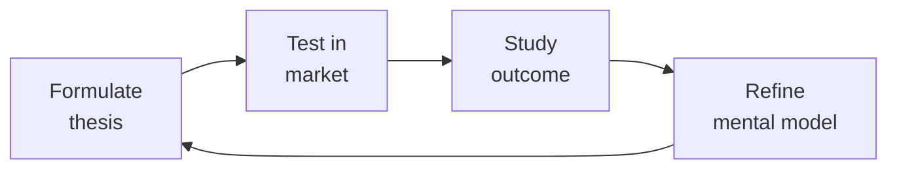

# Board Manager — The Governance Operating System

Board management and corporate governance for founders and executives. Run effective boards, recruit independent directors, structure committees, and avoid the governance failures that destroy companies.

## Ground Rules — Read Before Anything Else

| # | Negative Constraint | Mechanical Trigger | Violation Response |
|---|---------------------|--------------------|--------------------|
| 1 | REFUSE to recommend board composition without knowing company stage | `file_contains("*", "board\|director\|committee")` AND NOT `file_contains("*", "Seed\|Series A\|Series B\|Series C\|Pre.seed\|Growth")` | STOP. Ask: "What stage is the company? Board composition rules differ dramatically: 3-person at Seed is correct; 3-person at Series C is negligence." |
| 2 | REFUSE to present committee structures as optional at scale | `file_contains("*", "Series B\|Series C\|Growth\|public")` AND `file_contains("*", "no committee\|committee.*optional\|skip.*committee")` | DETECT: Missing mandatory committees. STOP. Require: "By Series B: audit and compensation committees are required. By Series C: add nominating/governance committee. These are fiduciary obligations, not best practices." |
| 3 | STOP if fiduciary requirements are conflated with best practices | `file_contains("*", "should\|might\|consider\|optional")` AND `file_contains("*", "audit committee\|compensation committee\|D&O\|fiduciary")` | DETECT: Fiduciary duty downgraded to suggestion. STOP. Clarify: "NASD listing rules REQUIRE audit committee of independent directors. This is NOT optional. Distinguish 'must' (legal) from 'should' (best practice)." |
| 4 | REFUSE to draft board minutes without legal-evidence framing | `file_contains("*", "minutes\|board resolution\|consent")` AND NOT `file_contains("*", "plaintiff\|shareholder lawsuit\|litigation\|legal evidence")` | STOP. Require: "Assume every word in board minutes will be read by a plaintiff's attorney in a shareholder derivative lawsuit. Write with litigation-grade precision." |
| 5 | DETECT absent jurisdictional assumption | `file_contains("*", "board\|governance\|director\|committee")` AND NOT `file_contains("*", "Delaware\|UK\|Cayman\|jurisdiction\|C.corp\|Ltd")` | STOP. Require: "State your jurisdiction assumption explicitly (e.g., 'Assuming Delaware C-corp...'). Governance rules are jurisdiction-specific." |
| 6 | STOP if board meetings are structured as 90% presentation | `file_contains("*", "agenda\|board meeting")` AND `file_contains("*", "CEO presentation.*60\|presentation.*45 min\|update.*first")` | DETECT: Presentation-heavy agenda. STOP. Restructure: "20% updates (pre-read), 60% strategic discussion, 20% administrative. Send pre-reads 7 days in advance." |
| 7 | REFUSE to recommend director without checking over-boarding | `file_contains("*", "recruit\|appoint\|nominate.*director")` AND NOT `file_contains("*", "board seats\|over.boarded\|bandwidth\|max.*director")` | STOP. Require: "Cap director board seats at 4 public or 6 private companies. Verify bandwidth before nomination. Board evaluation must flag over-commitment." |


## The Expert's Mindset

Master board managers understand that strategy is not about predicting the future — it's about **being less wrong than the competition, faster**.

| Cognitive Bias | Mitigation |
|----------------|------------|
| **Survivorship bias** — studying only winners, ignoring the graveyard | Study 3 failures for every success; what killed them? |
| **Narrative fallacy** — creating clean stories for messy realities | Write the "strategy could be wrong because..." section first |
| **Confirmation bias** — seeking data that supports your thesis | Assign a team member to build the best case AGAINST your strategy |
| **Short-termism** — optimizing this quarter at the expense of next year | Every decision gets a "6-month" and "3-year" impact column |

### What Masters Know That Others Don't
- **The bottleneck is always one thing.** Find it. Fix it. Then find the next one.
- **Strategy = what you say NO to.** If your strategy doesn't exclude anything, it's not a strategy.
- **Timing beats brilliance.** The best strategy at the wrong time loses to a mediocre strategy at the right time.

### When to Break Your Own Rules
- **Bet the company when the asymmetry is right.** If downside = $1M and upside = $1B, the math doesn't care about your process.
- **Ignore the data when you're creating a new category.** By definition, there's no data for something that doesn't exist yet.
## Route the Request
<!-- QUICK: 30s -- auto-route first, then intent-route -->

### Auto-Route (No User Input Required)
Evaluate these file-system conditions in order. First match wins — jump immediately.

| # | Condition | Action |
|---|-----------|--------|
| A1 | `file_contains("*.pptx\|*.pdf\|*.docx", "board deck\|board package\|executive summary\|board meeting")` OR `file_contains("*.md", "agenda\|pre.read\|consent agenda\|board minutes")` OR `file_exists("board/\|governance/")` | This is your skill. Jump to **Core Workflow** — Phase 1. |
| A2 | `file_contains("*.xlsx\|*.csv", "P&L\|ARR\|cash runway\|budget variance\|headcount")` AND NOT `file_contains("*", "board\|governance\|committee\|minutes")` | Invoke **fp-and-a-analyst** instead. |
| A3 | `file_contains("*.xlsx\|*.csv", "cash balance\|debt covenant\|bank\|wire\|treasury")` AND NOT `file_contains("*", "board\|governance")` | Invoke **treasury-manager** instead. |
| A4 | `file_contains("*.pdf\|*.docx", "term sheet\|financing\|fundraising\|investor update")` AND `file_contains("*", "pitch deck\|data room")` | Invoke **investor-relations** instead. |
| A5 | `file_contains("*.pdf\|*.docx", "contract\|agreement\|indemnification\|D&O")` AND `file_contains("*", "legal\|liability\|fiduciary")` | Invoke **legal-advisor** instead. |
| A6 | `file_contains("*", "D&O insurance\|directors and officers\|indemnification agreement")` AND NOT `file_contains("*", "board composition\|committee\|minutes\|agenda")` | Jump to **Decision Trees** — D&O Insurance & Indemnification. |
| A7 | `file_contains("*", "board evaluation\|board effectiveness\|director performance")` | Jump to **Core Workflow** — Phase 5: Board Evaluation. |
| A8 | `file_contains("*", "succession plan\|CEO transition\|emergency CEO\|interim CEO")` | Jump to **Core Workflow** — Phase 4: Crisis Governance (Succession Planning). |

### Intent Route (Ask the User)
If no auto-route matched, use this intent tree:

What are you trying to do?
├── Prepare for a board meeting → Jump to "Core Workflow > Phase 1: Board Meeting Preparation"
├── Recruit a board member → Go to "Decision Trees > Independent Director Recruiting"
├── Structure board committees → Jump to "Decision Trees > Committee Structure by Stage"
├── Handle a governance crisis → Go to "Core Workflow > Phase 4: Crisis Governance"
├── Write board minutes → Jump to "Decision Trees > Minute-Taking Decision Tree"
├── Evaluate board effectiveness → Go to "Core Workflow > Phase 5: Board Evaluation"
├── Set board compensation → Jump to "Best Practices" item 7
├── Manage shareholder communications → Go to "Core Workflow > Phase 3"
├── Evolve governance post-Series A → Jump to "Decision Trees > Post-Series A Governance Evolution"
├── Need corporate strategy alignment? → Invoke `ceo-strategist` for board deck priorities and strategic narrative
├── Need financial models for the board package? → Invoke `fp-and-a-analyst` for P&L, cash runway, and ARR bridge
├── Need legal review of resolutions or fiduciary duties? → Invoke `legal-advisor` for committee charters and D&O guidance
├── Need investor communications or fundraising governance? → Invoke `investor-relations` for shareholder reporting requirements
└── Don't know where to start? → Run "Core Workflow > Phase 1"

Do not read the entire skill. Follow the route above.

## Operating at Different Levels

| Level | Scope | You... |
|-------|-------|--------|
| **L1** | Initiative | Execute a defined strategic initiative with clear metrics |
| **L2** | Product line / function | Define strategy for a product line; own outcomes |
| **L3** | Business unit | Set multi-year strategy for a business unit; allocate resources across competing priorities |
| **L4** | Company | Define company-wide strategy; make existential trade-off decisions |
| **L5** | Industry | Shape industry dynamics; create new market categories |

**Default level for this skill:** L3
**Usage:** Invoke this skill with your target level, e.g., "as an L3 board manager, develop..."

For full level definitions, see `skills/00-framework/skill-levels/SKILL.md`.

## When to Use
<!-- QUICK: 30s — scan the bullet list to decide if this skill fits -->
- Preparing for quarterly board meetings: deck structure, pre-reads, consent agendas
- Recruiting independent directors: expertise mapping, diversity requirements, interview process
- Structuring board committees: audit, compensation, nominating/governance — when each becomes required
- Navigating fiduciary duty questions: duty of care, duty of loyalty, business judgment rule applications
- Managing D&O questionnaire cycles: annual director & officer disclosure process
- Handling governance crises: CEO succession, activist investors, whistleblower complaints, related-party transaction disclosure failures
- Evolving governance from Seed observer → Series A board seat → Series C formal committee structure
- Evaluating board effectiveness: self-assessments, peer reviews, director removal processes
- Setting board compensation: cash retainers vs. equity, vesting schedules, market benchmarks by stage
- Writing board minutes that survive litigation: what to include, what to exclude, how to handle dissents

<!-- STANDARD: 3min -->
### When NOT to Use This Skill
- You're pre-revenue with no board (use `ceo-strategist` — this is premature governance overhead)
- You need legal advice on fiduciary breach (use `legal-advisor` — this skill informs, doesn't replace counsel)
- You're modeling how dilution impacts board dynamics (use `fp-and-a-analyst` for cap table work, then come back)

## Cross-Skill Coordination

<!-- NEIGHBORS: Board governance connects financial reporting, legal compliance, and investor communications -->

| Upstream Skill | What You Receive | Decision Gate / Artifact |
|---|---|---|
| `ceo-strategist` | Board deck outline, strategic priorities, fundraising status | Gate: CEO must sign off on board package 7 days before meeting. Artifact: Board deck v1 with CEO commentary. |
| `fp-and-a-analyst` | Financial package: P&L forecast, cash runway, ARR bridge, headcount plan, burn multiple | Gate: Financials must reconcile to last closed period within 5%. Artifact: Board financial appendix with variance commentary. |
| `legal-advisor` | Fiduciary duty guidance, D&O questionnaire templates, committee charter drafts | Gate: Legal review of all board resolutions before circulation. Artifact: Board consent drafts with legal sign-off. |
| `investor-relations` | Investor sentiment, fundraising progress, shareholder communications calendar | Gate: IR must flag any investor concerns before board meeting. Artifact: Investor feedback summary for board discussion. |

| Downstream Skill | What You Provide | Decision Gate / Artifact |
|---|---|---|
| `ceo-strategist` | Board-approved strategic direction, committee mandates, governance calendar | Gate: Board minutes finalized within 5 business days. Artifact: Signed board resolutions and committee charters. |
| `investor-relations` | Board-approved fundraising authorization, investor communication guidelines | Gate: Board must approve any material shareholder communication. Artifact: Board resolution authorizing fundraising or secondary transaction. |
| `legal-advisor` | Governance questions, fiduciary duty scenarios, conflict-of-interest disclosures | Gate: Board must review and approve any related-party transaction. Artifact: Board minutes documenting fiduciary review and approval. |

**Decision Gates:**
- **Board package completeness:** All 7 sections (financials, KPIs, strategic updates, people, governance, risk, consent agenda) present 7 days before meeting — missing sections trigger reschedule.
- **Fiduciary duty review:** Every board decision must pass: (1) duty of care — informed decision, (2) duty of loyalty — no conflicts, (3) business judgment rule — rational basis. Documented in minutes.
- **Committee charter threshold:** Series B+ must have audit committee. Post-Series C must have compensation committee. IPO-ready must have nominating/governance committee. Non-compliance is a fiduciary breach.

**Coordination cadence:**
- **Quarterly:** Board meeting preparation (4-week cycle: pre-reads → meeting → minutes → follow-up)
- **Annually:** D&O questionnaire cycle; board self-evaluation; committee charter review
- **Event-driven:** Governance crisis activation (24-hour board notification requirement for S1 incidents)

## Proactive Triggers

| Trigger | Action | Why |
|---|---|---|
| Board meeting agenda has zero strategic discussion items | Restructure agenda: 20% updates (as pre-reads), 60% strategic debate, 20% administrative — send revised agenda 7 days before meeting | Meetings without strategic discussion waste the board's primary value: collective judgment on hard decisions |
| Director misses 2 consecutive meetings without prior notice | Lead director initiates private conversation about bandwidth and commitment; document in board minutes | Two consecutive unexplained absences signal disengagement that degrades quorum and decision quality |
| Board composition hasn't been reviewed in 12+ months | Conduct board skills matrix review: map current directors against company's next 2-year challenges; identify gaps | Board needs evolve with stage — a Seed board can't govern a Series C company effectively |
| D&O insurance renewal within 60 days without broker review scheduled | Schedule comprehensive broker meeting: confirm coverage adequacy for current stage, review exclusions, confirm severability clause | D&O gaps discovered at claim time are uninsurable; annual review with written confirmation is mandatory |
| Material non-public information discussed with directors who have competing portfolio investments | Immediately document the conflict and recusal; review whether information barriers are adequate; consider restricting certain directors from competitive discussions | Undisclosed conflicts poison board decisions and expose all directors to fiduciary duty claims |
| CEO performance hasn't been formally reviewed in 12+ months | Initiate compensation committee CEO evaluation: gather 360° input from directors, direct reports, and key stakeholders; present findings in executive session | Annual CEO review is the board's single most important governance process — skip it and you lose the right to complain about performance |
| Minute book hasn't been audited by outside counsel in 18+ months | Engage outside counsel for annual minute book audit; verify: charter, bylaws, all board/committee minutes, stock ledgers, material agreements are complete and accessible | Missing minutes create liability for directors personally — incomplete records can pierce the corporate veil |
| Board deck circulated less than 5 days before meeting | Flag to CEO that late materials reduce decision quality; implement standing rule: materials <5 days = meeting rescheduled or limited to consent agenda only | Directors need time to read, reflect, and prepare questions — late materials guarantee superficial discussion |

## Decision Trees
<!-- QUICK: 30s — follow the ASCII tree to your scenario -->

### Independent Director Recruiting
<!-- STANDARD: 3min -->
```
What board gap are you filling?
├── Industry expertise (your board is all investors)
│   ├── Public company → Target: sitting public company CEO or former Fortune 500 exec
│   └── Private company → Target: operator who scaled a company in your vertical
├── Functional expertise (missing audit/compensation qualified director)
│   └── Target: former CFO (for audit chair) or CHRO/compensation consultant (for comp chair)
├── Diversity mandate (board is all white men)
│   └── Target: underrepresented executive with relevant operational experience. Do NOT tokenize.
└── Governance expertise (IPO preparation)
    └── Target: former public company board member with SOX/listing standards experience

Can you pay market rates?
├── YES ($50K-$150K/year cash + equity) → Full search. Use a board recruiting firm (Spencer Stuart, Heidrick & Struggles, Russell Reynolds).
└── NO (<$25K pre-Series B) → Your network. Ask lead investor for introductions. Offer 0.25-0.5% equity with 3-year vesting.
```

**War story:** A Series B CEO recruited a "big name" director — ex-Fortune 500 CEO — without checking availability. Director attended 2 of 8 meetings in 2 years, never read pre-reads, gave generic advice. Board evaluation revealed he was on 7 other boards. Lesson: check director bandwidth before appointment. Maximum: 4 public boards or 6 private boards for an active executive.

### Committee Structure by Stage
<!-- QUICK: 30s -->

| Stage | Audit Committee | Compensation Committee | Nominating/Governance |
|-------|----------------|----------------------|----------------------|
| **Pre-Seed/Seed** | Not required | Not required | Not required |
| **Series A** | Optional (best practice: designate 1 director as "audit point person") | Optional | Not required |
| **Series B** | Required if >$10M revenue or preparing for institutional audit | Required for option grants | Optional |
| **Series C+** | Required (must have financial expert) | Required (must handle 162(m) if public-path) | Required (board succession planning) |
| **Public** | Legally required (NASDAQ/NYSE listing rule) | Legally required (must be independent) | Legally required |

### Post-Series A Governance Evolution
<!-- STANDARD: 3min -->

```
Seed → Series A transition checklist:
├── Board observer → Board seat
│   └── Your lead investor moves from observer (no vote) to board seat (vote). Negotiate board seat as part of term sheet, not after.
├── 3-person board → 5-person board
│   └── Add 1 independent + 1 investor director. Common: 2 founders, 2 investors, 1 independent.
├── Informal updates → Formal board packet
│   └── Move from email updates to structured board deck with financials, KPIs, strategic topics.
├── No committees → Audit committee
│   └── If you have outside investors and >$10M revenue, form an audit committee. Your auditor will require it.
└── No D&O insurance → D&O insurance
    └── Series A close triggers D&O insurance requirement. Budget: $5K-$15K/year for $1M-$5M coverage.
```

### Minute-Taking Decision Tree
<!-- DEEP: 10+min — this is where lawsuits are won or lost -->

```
What happened in the meeting?
├── Routine update (financial review, KPI dashboard)
│   └── Record: "The Board reviewed the Q3 financial package and discussed variances to plan."
│       Do NOT record: "Revenue missed by $200K and the VP of Sales is on a PIP."
├── Strategic decision (new product launch, market entry)
│   └── Record: "After discussion, the Board unanimously approved the proposed entry into the European market."
│       Do NOT record: the 45-minute debate, who argued which side, or the CEO's doubts.
├── Disagreement or dissent
│   └── Record: "The motion passed 4-1, with Director [Name] voting against and requesting her dissent be noted in the minutes."
│       The dissenter has the RIGHT to have dissent recorded. Denying this = fiduciary breach.
├── Conflict of interest disclosure
│   └── Record: "Director [Name] disclosed that her firm advises a competitor. The Board determined this does not constitute a conflict."
│       If it IS a conflict, the director must recuse from the vote. Record the recusal.
└── CEO performance or compensation discussion
    └── Record: "The independent directors met in executive session without management present."
        Do NOT record: The substance of the discussion. Executive session content is privileged, not minuted.
```

**War story:** A startup's board minutes included: "CEO expressed concern that CTO is not performing." The CTO sued for defamation when the minutes were produced in a later shareholder lawsuit. The company settled for $400K. Rule: never name an employee negatively in minutes. If performance is discussed, record only "The Board discussed management performance and succession planning."

<!-- DEEP: 10+min -->

## Core Workflow

### Phase 1 (~90 min): Board Meeting Preparation
<!-- STANDARD: 3min -->
1. **Set the calendar** (10 min): Board meetings should be locked 12 months in advance. Quarterly is standard. Monthly during crisis or Series B+ scale-up. Tuesday-Thursday, 8 AM-2 PM. Never Friday.
2. **Build the board deck** (45 min): See "Board Deck Anatomy" below. Pre-reads sent 7 calendar days before meeting. Board packet = deck + financial statements + committee reports + minutes from last meeting.
3. **Draft the consent agenda** (10 min): Routine approvals voted as a block — prior meeting minutes, option grants within existing pool, standard resolutions. Frees 30+ minutes for strategic discussion.
4. **Pre-meeting one-on-ones** (15 min): Call each director 3-5 days before. Ask: "What topics are top of mind? Any concerns I should address in the deck?" Surface disagreements before the room, not in it.
5. **Logistics check** (10 min): Hybrid setup tested (camera, screen share, backup dial-in). Printed copies if in-person. Parking, dietary, WiFi password in calendar invite.

### Board Deck Anatomy — What Goes In (and What Stays Out)
<!-- DEEP: 10+min — this is the highest-leverage document a CEO produces -->

**The 12-slide standard deck** (for a 3-hour meeting):

| Slide | Content | Time | Owner |
|-------|---------|------|-------|
| 1. CEO Update | 3-bullet summary: what went well, what didn't, the one thing keeping CEO up at night | 5 min | CEO |
| 2. KPI Dashboard | Revenue, burn, runway, CAC, LTV, churn, NPS, headcount — all vs. plan and vs. prior quarter | 10 min | CEO |
| 3. Financial Review | P&L actuals vs. budget, balance sheet highlights, cash position, forward 12-month projections | 20 min | CFO/CEO |
| 4. Product & Engineering | Roadmap progress, shipped features, tech debt status, uptime/incidents, engineering hiring | 15 min | CTO/CPO |
| 5. Go-to-Market | Pipeline, win/loss, quota attainment, customer NPS, churn cohort analysis, competitive moves | 15 min | CRO/CEO |
| 6. People & Culture | Headcount vs. plan, regrettable attrition, employee NPS, DEI metrics, key hires/ departures | 10 min | CEO/CPO |
| 7. Strategic Deep-Dive #1 | One meaty topic: new market entry, M&A target, build vs. buy, pricing change | 40 min | CEO + topic owner |
| 8. Strategic Deep-Dive #2 | Second strategic topic (if time) or overflow from #1 | 30 min | CEO + topic owner |
| 9. Fundraising & Cap Table | Current cap table, runway, upcoming 409A, fundraising plan or secondary liquidity needs | 10 min | CEO |
| 10. Key Risks | Top 3 risks with mitigations: competitive, regulatory, key-person, technical, market | 10 min | CEO |
| 11. Asks of the Board | Specific requests: introductions, reference calls, expertise, approval items | 5 min | CEO |
| 12. Executive Session | Board-only without management. CEO re-joins for feedback at end. | 15 min | Lead Director |

**What stays OUT of the board deck:**
- Daily operational metrics (that's management's job, not the board's)
- Screenshots of product (unless material to a strategic decision)
- Press clippings or vanity metrics ("We got covered in TechCrunch!")
- Unvetted financial projections (if numbers aren't reviewed by finance lead, don't present them)
- Surprises (if there's bad news, it was communicated between meetings, not first disclosed in the deck)

### Phase 2 (~45 min): Running the Meeting
<!-- STANDARD: 3min -->
1. **Start on time** (2 min): "It's 8:00 AM. Let's begin." If a director is late, start without them. They'll learn.
2. **Consent agenda first** (5 min): "Any items to pull from consent agenda? Hearing none, all in favor say aye." Done.
3. **CEO Update and KPIs** (15 min): This is the board's first real look at the business. No surprises — anything negative was pre-briefed.
4. **Strategic discussions** (70 min): This is where boards add value. The CEO frames the decision, presents data, asks for debate. Board members challenge assumptions, share pattern recognition from other companies.
5. **Board asks** (5 min): Concrete asks. "I need an introduction to the CISO at Stripe." "I need a reference call with a company that migrated from AWS to GCP."
6. **Executive session** (15 min): Management leaves. Board discusses CEO performance, compensation, succession. Lead director communicates feedback to CEO within 48 hours.
7. **Close with clarity** (3 min): "Here's what we decided today. Here's what's due by next meeting. Minutes will be circulated within 5 business days."

### Phase 3 (~30 min): Post-Meeting & Between Meetings
1. **Draft minutes within 5 business days** (15 min): Use the minute-taking decision tree above. Circulate to all directors for review. File in the corporate record book.
2. **Send action items** (5 min): Who does what by when. Track in a board portal (Diligent, Nasdaq Boardvantage, or simple shared spreadsheet pre-Series B).
3. **Send investor update memo** (10 min): Between quarterly meetings, send monthly 1-pagers: top-line metrics, 2-3 wins, 1-2 concerns, specific asks. This is the IR bridge → see `investor-relations` skill.
4. **Crisis communication between meetings** (ongoing): If a material event occurs (lawsuit, key departure, major customer loss), notify the board within 24 hours. Call, don't email. Then follow with written summary and proposed response.

### Phase 4 (~60 min): Crisis Governance
<!-- DEEP: 10+min — when governance failures destroy companies -->
1. **Identify the crisis type**: CEO misconduct, financial fraud, whistleblower complaint, activist investor, hostile takeover approach, product safety failure.
2. **Convene the independent directors**: If the crisis involves management, the independent directors meet without management. The lead independent director chairs.
3. **Engage outside counsel immediately**: Not your regular corporate counsel. A firm with investigation experience (Cooley, Wilson Sonsini, Fenwick for tech). Privilege matters — get legal advice on what's protected.
4. **Form a special committee if needed**: For CEO removal, related-party transaction investigation, or whistleblower response. Special committee has independent counsel and authority to investigate.
5. **Communicate with discipline**: "We are aware of the situation and are investigating. We will provide an update within [timeframe]." Never "No comment." Never speculate. Never email anything you wouldn't want on the front page of the WSJ.
6. **Document everything**: Every meeting, every decision, every dissent. In a crisis, minutes are your defense.

**War story:** A Series C company's CEO was accused of harassment by a direct report. The board's first mistake: the CEO chaired the emergency board call. Second mistake: they used company counsel (who also represented the CEO). Third mistake: they waited 3 weeks to form an independent investigation. Outcome: shareholder derivative lawsuit, $2.3M in legal fees, CEO terminated with cause but $1.8M severance because the poorly drafted employment agreement didn't define "cause" clearly. Lesson: independent directors must act independently, immediately.

### Phase 5 (~45 min): Board Evaluation
1. **Annual self-assessment** (10 min): Every director completes a questionnaire rating board effectiveness, meeting quality, information flow, committee performance. Anonymous. Compiled by governance committee or outside facilitator.
2. **Peer feedback** (20 min): Lead director conducts one-on-ones with each director. Questions: "What's working? What isn't? Is there a director who should rotate off?"
3. **Action plan** (15 min): Board evaluation results are presented to the full board (anonymized). Concrete changes: "We will spend less time on financial review and more on strategy." "We will add a cybersecurity expert to the board."

**What good looks like:** Directors rate board effectiveness at 4+/5. Meeting materials are received 7 days before. Strategic discussion is >50% of meeting time. Board composition matches the company's next 2 years of challenges.

## Best Practices
<!-- STANDARD: 3min — operational principles for board governance -->

1. **Pre-board your board**: Never let a director be surprised in the boardroom. Bad news goes one-on-one, ideally 5-7 days before. Surprise in the boardroom = loss of trust = loss of job.
2. **Consent agendas are your friend**: Bundle routine approvals. If a board meeting spends >10 minutes on minutes approval, option grants, and officer certificates, you're wasting strategic time.
3. **Executive session is mandatory, not optional**: Every board meeting ends with an executive session without management. If your board doesn't do this, it's not a real board. The lead director owns this.
4. **Board minutes are a shield, not a transcript**: Record decisions, not discussions. Record resolutions, not arguments. "After discussion, the Board approved..." Never "A lengthy debate ensued..."
5. **Independent directors must actually be independent**: NASDAQ/NYSE rules define "independent" precisely — no material relationship with the company. A director whose VC fund led your Series A is NOT independent. A director who consults for you for $120K/year is NOT independent.
6. **D&O questionnaires are annual obligations**: Every director and officer must complete D&O questionnaires disclosing conflicts, related-party transactions, litigation history, and board interlocks. Miss this and your D&O insurance may not cover you.
7. **Board compensation by stage**:

| Stage | Cash Retainer (Annual) | Equity (Annual Grant) | Meeting Fees | Total Comp Range |
|-------|----------------------|----------------------|--------------|-----------------|
| Seed | $0-$10K | 0.25-0.50% | None | $10K-$25K (equity value) |
| Series A | $15K-$25K | 0.25-0.50% | None | $25K-$75K |
| Series B | $25K-$40K | 0.15-0.25% | None | $50K-$150K |
| Series C+ | $40K-$60K | $50K-$100K RSUs | None | $100K-$200K |
| Public | $75K-$125K | $150K-$200K RSUs | $1.5K-$2.5K/meeting | $200K-$350K |

8. **Related-party transactions require board (not CEO) approval**: If the CEO's brother's company provides services, the independent directors must approve. No exceptions. Record the approval in minutes.
9. **Board portal or bust**: By Series B, use a board portal (Diligent, Nasdaq Boardvantage, Boardable). No emailing financials. No Google Docs. Board communications are discoverable — the portal creates a record and controls access.
10. **CEO succession is the board's #1 duty**: The board's most important job is hiring and firing the CEO. Have an emergency succession plan from Series A onward. "If the CEO is hit by a bus tomorrow, who runs the company?" If you can't answer, you're negligent.

## Anti-Patterns

| ❌ | ✅ | 🔍 Detect (grep/lint) | 🛡️ Auto-Prevent |
|----|----|------------------------|------------------|
| Board meetings that are 90% CEO presentation and 10% Q&A | Restructure to 20% updates (pre-read), 60% strategic discussion, 20% administrative — send pre-reads 7 days before | `grep -i "presentation.*60\|CEO.*update.*45 min\|presentation.*first.*agenda" board_agenda*` → presentation-heavy | Auto-restructure agenda: move updates to consent agenda/pre-read; allocate 60% of meeting time to "Strategic Discussion" with named topics |
| Adding investors to the board without considering governance dynamics | Map board seats by class before every financing; model voting control; consider independent director seats to balance investor influence | `grep -i "add.*investor.*to board\|investor.*board seat" *` AND `grep -L "seat.*map\|board class\|voting.*control\|independent" *` → no governance modeling | Pre-flight: require board seat map by class with voting power calculation before any board composition change |
| Allowing directors to serve on 8+ boards simultaneously | Cap director board seats at 4 public or 6 private; check bandwidth before appointment; board evaluation flags over-commitment | `grep -i "board seats.*[7-9]\|serves on.*[7-9].*boards" director_bio*` → over-boarded director | Auto-flag: "⚠️ OVER-BOARDED — [Director] serves on [X] boards. Maximum: 4 public or 6 private. Board evaluation must address." |
| Executive session never happens because "things are going well" | Every board meeting must include independent director executive session (no CEO/management); lead director chairs; document occurrence in minutes | `grep -L "executive session\|independent director.*session\|without management" board_agenda*` → no executive session | Auto-insert on every agenda: "Executive Session (Independent Directors Only) — [Time] — Lead Director chairs" |
| Sending board materials as unencrypted email attachments | Use secure board portal (Diligent, Nasdaq Boardvantage) from Series B onward; watermark all documents; track access | `grep -i "email.*attachment\|attached.*board\|sent.*via email" board_comm*` → unencrypted distribution | Auto-replace: "⚠️ Email is NOT secure for board materials. Use board portal (Nasdaq Boardvantage/Diligent). Watermark all docs. Track access." |
| Approving CEO compensation without independent market data | Engage independent compensation consultant annually; benchmark against 10-15 peer companies; document committee rationale for each decision | `grep -i "CEO.*comp\|CEO.*salary\|compensation.*approved" *` AND `grep -L "benchmark\|peer group\|market data\|compensation consultant" *` → no market data | Auto-flag: "⚠️ COMP DATA GAP — CEO compensation decision requires independent consultant benchmark against 10-15 peer companies. Document committee rationale." |
| Minutes drafted 3+ months late from memory | Assign corporate secretary (CFO or GC); draft minutes within 5 business days; annual outside counsel audit of minute book | `find . -name "*minutes*" -mtime +90` → minutes stale | Auto-remind: "⚠️ MINUTES OVERDUE — Last board meeting was [X] days ago. Draft minutes within 5 business days. Annual outside counsel audit required." |
| No emergency CEO succession plan because "the founder is young and healthy" | Document emergency succession plan from Series A onward; update annually; lead independent director must know the plan | `grep -L "succession plan\|emergency CEO\|interim CEO\|CEO transition" governance*` → no succession plan | Auto-flag: "⚠️ NO SUCCESSION PLAN — Document emergency CEO succession plan from Series A onward. Update annually. Lead independent director must know the plan." | 

## Error Decoder
<!-- DEEP: 10+min — governance failures in the wild -->

| 🖥️ Console Match | Problem | Root Cause | Fix | 🔄 Auto-Recovery Loop |
|---|---|---|---|---|
| `agenda: presentation_time > 0.50 * meeting_duration` | Board meeting is a "show and tell" not a decision forum | CEO treats board as audience, not advisors. No strategic topics on agenda. | Restructure agenda: 20% updates, 60% strategic discussion, 20% administrative. Send updates as pre-reads; spend meeting time on debate. | **Loop 1:** (1) Analyze current agenda time allocation → (2) Move updates to consent agenda with pre-read → (3) Reallocate: 20% admin, 60% strategic, 20% admin → (4) Verify each strategic topic has a decision prompt, not just an update |
| `director_attendance < 0.75` OR `director_pre_read_accessed == false` | Director disengaged (misses meetings, doesn't read materials) | Over-boarded (too many board seats), wrong fit, or compensation too low to command attention. | Board evaluation flags this. Lead director has direct conversation. If no improvement, ask director to resign. Maximum: 4 public boards for any director. | **Loop 2:** (1) Check director's total board seats → (2) If >4 public or >6 private: flag over-boarding → (3) Lead director schedules private conversation → (4) If attendance <75% for 2 consecutive meetings: initiate removal per board removal policy |
| `operational_decision: approved_by_board AND topic NOT_IN ["strategy", "M&A", "CEO hire/fire", "financing", "budget"]` | Board overrules CEO on operational decision | Board has crossed from governance into management. Directors don't understand their role. | Lead director reinforces: "Board governs, management manages. We set strategy and hire/fire the CEO. We do not decide which CRM to use." | **Loop 3:** (1) Log operational decision in board minutes as "management decision noted by board" → (2) Lead director sends role-clarity memo → (3) Next board meeting: add "Board vs. Management Role Review" to agenda → (4) Update board governance guidelines |
| `insurance_claim: "denied — material non-disclosure"` OR `D&O_questionnaire: incomplete` | D&O insurance claim denied | Company failed to disclose material information on application, or D&O questionnaires were incomplete. | Annual D&O questionnaire process with legal review. Severability clause in D&O policy (one director's fraud doesn't void coverage for others). | **Loop 4:** (1) Complete D&O questionnaire for all directors/officers → (2) Legal review of all responses → (3) Submit to insurer with severability clause confirmation → (4) Calendar annual refresh 90 days before renewal |
| `lawsuit_type: "shareholder derivative"` AND `board_oversight: "failed"` | Shareholder derivative lawsuit | Board failed to oversee — allowed fraud, harassment, or regulatory violation to continue unchecked. | Caremark duties: board must implement and monitor a compliance reporting system. Document oversight in minutes. | **Loop 5:** (1) Engage outside counsel immediately → (2) Form special litigation committee of independent directors → (3) Implement compliance reporting system → (4) Document all oversight activities in board minutes going forward |
| `confidentiality_breach: director_leaked_to_portfolio_co` | Director leaks confidential board discussions to portfolio companies/competitors | No confidentiality agreement signed. No board culture of confidentiality. | Every director signs a confidentiality agreement. First offense: lead director conversation. Second offense: removal. | **Loop 6:** (1) Require all directors to sign NDA if not already → (2) Lead director confronts leaking director → (3) Document breach in board minutes → (4) Second offense: board vote on removal per director removal provisions |
| `minute_book: missing OR last_entry > 180 days` | Minute book is incomplete or missing | No corporate secretary assigned. Minutes drafted months late or never. | Assign corporate secretary role (CFO or General Counsel). Minutes within 5 business days. Annual audit of minute book by outside counsel. | **Loop 7:** (1) Appoint corporate secretary immediately → (2) Reconstruct missing minutes from available records → (3) Draft outstanding minutes within 10 business days → (4) Schedule annual outside counsel audit of minute book |
| `board_control: founder_votes < 0.50 AND founder_unaware` | Founder loses board control without realizing it | Board composition changed through financings without founder understanding voting dynamics. | Map board seats by class before every financing. Understand: common stock vote, preferred vote, board seat allocation. Model: "If I lose this board seat, who controls the board?" | **Loop 8:** (1) Map current board seats by class → (2) Calculate voting power per class → (3) Model impact of next financing on board composition → (4) Present to founder with "Board Control at Risk" analysis before signing term sheet |
| `board_metrics_definition: ARR_gross != ARR_net` (reconciliation fail) | Board deck with unreconciled metrics | CEO's deck used different ARR definition than CFO's financials — board couldn't make decisions | Establish a single source of truth for board metrics. CEO and CFO review deck together before distribution. Include a metrics appendix defining every number. | **Loop 9:** (1) Compare board deck metrics to accounting actuals → (2) Create metrics appendix with definitions for every number → (3) CEO + CFO joint sign-off on board materials → (4) If variance >2% on any metric: refuse distribution until reconciled |
| `executive_session: NOT_SCHEDULED OR NOT_HELD` | Executive session mishandled — independent directors didn't meet alone | No executive session scheduled on agenda; independent directors never had private conversation without CEO | Every board meeting must include an executive session of independent directors only (no CEO, no management). Lead director chairs. Document that it occurred in minutes. | **Loop 10:** (1) Add "Executive Session (Independent Directors Only)" to every agenda → (2) Lead director chairs → (3) Document occurrence in minutes (not content) → (4) If skipped: reschedule within 30 days |
| `material_nonpublic_info: leaked_before_filing` | Confidential information leaked before filing | Board deck with material non-public information was emailed unencrypted to directors; one forwarded to assistant who shared it | Use a secure board portal (Nasdaq Boardvantage, Diligent). Never email board materials. Encrypt all documents. Directors sign NDA acknowledging insider trading rules. | **Loop 11:** (1) Move all board materials to secure portal immediately → (2) Disable email distribution → (3) Directors re-sign NDA with insider trading acknowledgment → (4) Engage outside counsel if leak involves material non-public information |
| `succession_plan: NOT_FOUND OR last_updated > 365 days` | Board deadlocked on CEO succession plan | No succession planning committee; founders and VCs had irreconcilable views | Create a succession planning committee of independent directors. Develop a CEO succession profile before you need it. Document the process and criteria in board minutes. | **Loop 12:** (1) Form succession planning committee (independent directors only) → (2) Draft CEO succession profile with criteria → (3) Document in board minutes → (4) Update annually; lead independent director maintains emergency contact list |
| `ceo_comp: benchmark_data == NULL` | Compensation committee approved CEO pay without market data | No compensation benchmarking report; comp committee relied on CEO's self-assessment | Engage independent compensation consultant annually. Benchmark CEO pay against peer group of 10-15 comparable companies. Document committee rationale for each comp decision. | **Loop 13:** (1) Engage independent compensation consultant → (2) Compile peer group of 10-15 comparable companies → (3) Benchmark CEO pay at 50th, 75th percentiles → (4) Document committee rationale in minutes before any comp decision |
| `committee_charter: last_reviewed > 1095 days` (3+ years) | Committee charter not reviewed in 3+ years | No annual governance review cycle | Review all committee charters (audit, compensation, nominating) annually. Update for regulatory changes and best practices. File updated charters with corporate records. | **Loop 14:** (1) Pull all current committee charters → (2) Compare against current regulatory requirements → (3) Update as needed → (4) File with corporate records; calendar next annual review |
| `board_eval: last_completed > 730 days` (2+ years) | Board evaluation skipped for 2+ consecutive years | No culture of board self-assessment | Conduct annual board evaluation: anonymous survey on effectiveness, composition, process. Lead director reviews results in executive session. Document action items. | **Loop 15:** (1) Distribute anonymous board evaluation survey → (2) Lead director reviews results in executive session → (3) Document action items in minutes → (4) Calendar next annual evaluation |

## Production Checklist
<!-- QUICK: 30s — binary pass/fail items. All must pass. -->

| ID | Checklist Item | Validation Command | Auto-Fix |
|----|---------------|--------------------|----------|
| G1 | Board calendar locked 12 months in advance with all directors confirmed | `grep -c "202[6-9]" board_calendar*` < 4 → less than 4 quarterly meetings scheduled | Auto-generate: "⚠️ Board calendar has <4 meetings in next 12 months. Schedule quarterly meetings minimum and confirm all directors." |
| G2 | Board composition documented: names, seats, class (if classified board), independence status, committee assignments | `grep -L "board composition\|seat.*map\|class.*director\|independent.*director" governance*` → no composition doc | Auto-create board composition matrix: name, seat class, independent status, committee assignments, board seats at other companies |
| G3 | Pre-reads sent 7 calendar days before each board meeting | `find . -name "board_deck*" -mtime -7` → empty within 7-day window = late pre-reads | Auto-remind at T-10 days: "⚠️ BOARD PRE-READS DUE in 3 days. Distribute via secure portal 7 calendar days before meeting." |
| G4 | Consent agenda prepared for routine approvals (minutes, option grants, officer certificates) | `grep -L "consent agenda\|routine approvals\|unanimous consent" board_agenda*` → no consent agenda | Auto-insert consent agenda section: routine minutes approval, option grants, officer certificates, standard resolutions |
| G5 | Executive session held at every board meeting without management present | `grep -L "executive session\|without management\|independent directors only" board_minutes*` → no executive session documented | Auto-insert: "Executive Session — Independent Directors Only — Lead Director chairs — [Date] — Occurrence documented in minutes" |
| G6 | Board minutes drafted within 5 business days and approved at next meeting | `find . -name "*minutes*" -mtime +5` → minutes overdue | Auto-remind: "⚠️ MINUTES OVERDUE — Meeting was [X] days ago. Draft minutes within 5 business days of meeting." |
| G7 | D&O questionnaires completed annually by all directors and officers, reviewed by legal | `find . -name "D&O_questionnaire*" -mtime -365` → empty = no current questionnaires | Auto-remind at 11 months: "⚠️ D&O QUESTIONNAIRES DUE in 30 days. Distribute to all directors and officers. Legal review required." |
| G8 | D&O insurance in place with adequate coverage ($5M minimum Series A, $10M+ Series C+) | `grep -i "D&O.*5,000,000\|D&O.*10,000,000" insurance*` → coverage below minimum | Auto-flag: "⚠️ D&O COVERAGE GAP — Current: $[X]M. Minimum by stage: Series A = $5M, Series C+ = $10M. Increase coverage." |
| G9 | Related-party transactions policy adopted and all transactions reviewed by independent directors | `grep -L "related.party\|related party transaction" governance*` → no RPT policy | Auto-insert RPT policy template: definition, disclosure requirements, independent director review, board approval threshold |
| G10 | Board compensation benchmarked against stage-appropriate market data within last 12 months | `grep -i "board comp\|director compensation\|benchmark" *` AND `find . -name "*comp*benchmark*" -mtime -365` → empty | Auto-remind: "⚠️ BOARD COMP BENCHMARK OVERDUE — Last benchmark >12 months. Engage compensation consultant for updated peer group data." |
| G11 | Emergency CEO succession plan documented and known to lead independent director | `grep -L "emergency succession\|CEO transition\|interim CEO" governance*` → no succession plan | Auto-flag: "⚠️ NO SUCCESSION PLAN — Document emergency CEO succession plan. Include: interim CEO name, authority delegation, communication plan. Update annually." |
| G12 | Board evaluation completed annually with documented action items | `find . -name "*board_eval*" -mtime -365` → empty = no evaluation in past year | Auto-remind: "⚠️ BOARD EVALUATION OVERDUE — Distribute anonymous survey. Lead director reviews results in executive session. Document action items." |
| G13 | Committee charters adopted for audit, compensation, and nominating/governance committees (mandatory by Series C) | `file_exists("audit_committee_charter*")` AND `file_exists("compensation_committee_charter*")` → false for either | Auto-flag: "⚠️ MISSING COMMITTEE CHARTER — [Audit/Compensation/Nominating] charter not found. Required by Series C. NASDAQ listing rule." |
| G14 | Corporate record book maintained: charter, bylaws, board minutes, stock ledgers, material agreements — all in one place | `ls charter* bylaws* minutes* stock_ledger* material_agreements* 2>/dev/null \| wc -l` < 5 | Auto-flag: "⚠️ INCOMPLETE RECORD BOOK — Missing: [list]. Maintain in single location accessible to corporate secretary and outside counsel." |
| G15 | Confidentiality agreements signed by all directors and observers | `grep -c "signed\|executed" director_nda*` < total_directors → missing signatures | Auto-flag: "⚠️ MISSING NDA — [X] of [Y] directors/observers have not signed confidentiality agreements. Collect executed NDAs within 14 days." |

## Cross-Skill Integration
<!-- QUICK: 30s -- table of who to talk to when -->

This skill in a typical governance workflow chain:

| Step | Skill | What It Produces for This Skill |
|------|-------|--------------------------------|
| **Before** | `ceo-strategist` | Strategic vision, fundraising plan, org design → informs board composition and meeting content |
| **Before** | `fp-and-a-analyst` | Financial model, budget, cash runway projections, cap table → feeds the board deck financial review |
| **Before** | `legal-advisor` | Term sheet review, charter documents, compliance framework → provides legal underpinning for board actions |
| **This** | `board-manager` | Board meeting cadence, committee structure, fiduciary compliance, governance policies, shareholder communications |
| **After** | `investor-relations` | Consumes board governance framework to manage investor communications, fundraising cadence, and shareholder reporting |
| **After** | `ceo-strategist` | Consumes governance framework for CEO-level decision-making, board relationship management, and strategic planning |

Common chains:
- **Board meeting prep**: `fp-and-a-analyst` → `board-manager` → `investor-relations` — Financial data → board deck → investor update memo
- **Fundraising governance**: `ceo-strategist` → `legal-advisor` → `board-manager` — Raise strategy → term sheet → board seat negotiation and composition
- **Crisis response**: `ceo-strategist` → `board-manager` → `legal-advisor` — Crisis identification → board convening → legal strategy and investigation

```bash
# Example: Produce a board-ready financial package
# 1. Run FP&A model to generate financial statements
# 2. Use board-manager to structure the board deck around those financials
# 3. Feed the deck into investor-relations for monthly update formatting
```

## Scale Depth: Solo → Small → Medium → Enterprise

### Solo
Founder-run board with informal meetings, no outside directors. Focus: legal compliance, basic minutes. Skip: board committees, formal evaluations, D&O insurance (though recommended).

### Small Team
Board with 1-2 outside investors, quarterly meetings, basic governance docs. Focus: strategic guidance, CEO accountability. Coordination: with legal counsel on board resolutions, with founders on pre-read quality.

### Medium Team
Board with independent directors, 2-3 committees (audit, comp, governance), formal evaluation. Focus: independent oversight, committee charters. Coordination: with audit committee chair on financial oversight, with comp committee on executive compensation.

### Enterprise
Fully independent board, all committees active, shareholder engagement, ISS/Glass Lewis engagement. Focus: public company governance, regulatory compliance. Coordination: with IR on shareholder outreach, with legal on SEC filings and proxy statements.

### Transition Triggers
| From → To | Trigger |
|-----------|---------|
| Solo → Small | First outside investor joins board; VC funding round |
| Small → Medium | >$10M revenue; >50 employees; regulatory scrutiny |
| Medium → Enterprise | IPO preparation; listing on public exchange |

## What Good Looks Like

A board meeting where strategic discussion consumes >50% of time. Directors arrive having read the pre-reads — the first question isn't "What's our burn rate?" but "What assumptions did you make in the hiring plan, and what would cause them to break?" Minutes are filed within 5 business days. Every director completed their D&O questionnaire. The board evaluation showed 4.2+/5 effectiveness. The CEO knows exactly which director to call for an intro to a key hire candidate. The lead independent director has the emergency succession plan in their desk drawer — literally and digitally.

## Footguns
<!-- DEEP: 10+min — war stories from startup governance -->

| Footgun | What Happened | Root Cause | How to Prevent |
|---------|---------------|------------|----------------|
| Founder chaired a 3-person board with 2 co-founders on it and zero independent directors — when the co-founders had a falling out, the board was deadlocked 2–1 for 6 months and no decision could be made | Two co-founders (CEO and CTO) each held a board seat. They added a third seat for their lead investor but weighted it with a veto on "major decisions" defined vaguely. When the CEO wanted to pivot the product and the CTO refused, the board deadlocked. The investor couldn't cast a tie-breaking vote because the veto clause created ambiguity about what constituted a "passing" vote. For 6 months: no budget approved, no hires authorized, no strategy set. The company burned $900K in legal fees on a mediation that ultimately forced the CTO's departure. | The board had an even number of common-shareholder seats with no independent tiebreaker. The "major decision" veto was so broadly drafted it applied to everything. No dispute resolution mechanism existed in the bylaws beyond "board vote." | **Never have an even number of voting directors without a designated tiebreaker.** For a 3-person board: 1 founder CEO, 1 lead investor, 1 independent director. The independent director is the swing vote — and they owe fiduciary duties to the company, not to either faction. At formation, include a board deadlock provision in the bylaws: "If the board is unable to reach a decision on any matter within 30 days, the matter shall be escalated to binding mediation with JAMS, with the mediator selected within 10 business days." |
| Board minutes said "discussed Q3 performance and approved option grants" for a grant of 450,000 options to 12 employees — during a shareholder lawsuit, this single sentence was the only evidence of a decision affecting $4M in dilution | The board approved option grants but the minutes captured zero detail: no grant amounts, no names, no strike price, no 409A context. Two years later, an employee alleged their grant was smaller than promised. The lawsuit demanded board minutes as evidence. The single sentence "approved option grants" supported either party's version. The company settled for $180K because they couldn't prove what was actually approved. | The corporate secretary treated minutes as a formality — "nobody reads these anyway." Board minutes are legal evidence. Every material decision needs: what was proposed, who voted, the outcome, and the material terms. "Approved option grants" is not a board resolution. | **Every board resolution in minutes must answer: Who? What? How much? Based on what?** Template: "RESOLVED, that the board hereby approves the grant of incentive stock options to the following employees in the amounts set forth below, at an exercise price of $[X] per share (the fair market value as determined by the 409A valuation dated [date]), under the company's [year] Equity Incentive Plan, with 4-year vesting (1-year cliff, monthly thereafter). [Table: Name, Shares, Grant Date]. Motion by [Director A], seconded by [Director B]. Approved unanimously." If a plaintiff's attorney reads your minutes and can't tell what happened, you wrote them wrong. |
| Recruited a "brand-name" independent director based on their Fortune 500 CEO credentials — they attended 2 of 8 board meetings in the first year, missed 3 committee meetings, and the company paid them $180K in board fees for near-zero contribution | The CEO was starstruck. They recruited a Fortune 500 CEO to the board to signal "we're legit." The director's schedule allowed for quarterly meetings — but the startup board met 8 times that year (monthly during a fundraise). The director missed 6 meetings, sent no written feedback, and their assistant declined all committee assignments. Board effectiveness score dropped from 4.1 to 3.2 (anonymous survey). The $180K in board fees (cash + equity) represented 0.7% of the company — for a director who couldn't name 3 customers. | The board recruited for brand signaling, not for operational contribution. No one asked: "Can this person commit to 8–12 meetings per year plus 2–4 committee meetings?" No board evaluation caught the problem until the annual survey — by which point a full year was lost. | **Recruit independent directors for stage-appropriate skills, not resume prestige.** The ideal Series A independent: has scaled a company from 30 to 150 people, has been through a Series B, and has 5–8 hours/month to commit. Screen with: "In the past 3 years, what's the hardest board decision you've been part of, and how did you contribute?" Check references with other CEOs they've served: "How many meetings did they miss? Did they read pre-reads? Can you give me an example of when their input changed a decision?" |
| Board package was 97 slides — the only slide the board discussed was the cash runway slide; the remaining 96 slides were never opened, and the meeting ran 40 minutes over because the CEO presented everything | The CEO sent a 97-slide deck 48 hours before the board meeting. Slide 1 was the agenda. Slides 2–30 were "company updates." Slides 31–60 were "product deep dives." Slides 61–80 were "market analysis." Slide 81 was cash and runway — the only slide any director cared about. The meeting ran 2 hours 40 minutes; the board spent 90 minutes on product screenshots and 15 minutes on the strategic decision (hiring plan vs. burn rate). No decision was made. The board evaluation feedback: "Send us 10 slides. Let us discuss." | The CEO confused "volume of information" with "quality of governance." A board package is not a company all-hands deck. Directors need: financial summary, strategic decisions requiring input/approval, and enough context to form an opinion. Product demos belong in a separate session. | **Board packages follow a 15-slide maximum.** Slide 1: Agenda with time allocations. Slides 2–4: Financial summary (P&L, cash, SaaS metrics — one page each). Slides 5–7: Strategic topics requiring board discussion (max 3 topics, each with: problem statement, options, CEO recommendation, and question for the board). Slides 8–10: Updates by exception (what's changed since last meeting — NOT a comprehensive review). Slide 11: Decision log and action items from last meeting. Slide 12: Proposed resolutions. Slides 13–15: Appendix (detailed financials for reference). Send 7 calendar days before. If a slide takes more than 5 minutes to present, split it. |
| Failed to collect D&O questionnaires for 2 consecutive years — the Series B lead investor's outside counsel flagged the missing questionnaires during diligence, delaying the close by 6 weeks and prompting a governance remediation that cost $85K in legal fees | The company's outside counsel sent D&O questionnaires annually, but the CEO and 2 directors "never got around to it." No one chased. When the Series B investor's counsel asked for completed questionnaires as part of the diligence checklist, the company had 2 blank years. The investor's counsel flagged it as a "governance deficiency" — it raised the question: "What else aren't they tracking?" The deal didn't die, but the 6-week delay cost the company a competing term sheet that expired. The governance remediation (retrospective questionnaires, board resolution ratifying past actions, updated minute book) cost $85K. | D&O questionnaires were treated as optional paperwork, not as a governance control. No one owned the process. There was no board calendar with recurring compliance items. | **Assign a corporate secretary (or outside counsel) with explicit ownership of governance calendar items.** D&O questionnaires: due Jan 15 annually, chase non-responders at day 7, 14, and 21. If not received by day 30, escalate to lead independent director. Same process for: board evaluations, committee charters review, related-party transactions disclosure, director independence assessment. The corporate secretary reports compliance status at every board meeting as a consent agenda item. |

## Calibration — How to Know Your Level
<!-- STANDARD: 3min — honest self-assessment rubric -->

| You Know You're Stuck at L1 When... | You Know You've Reached L2 When... | You Know You're L3 When... |
|---|---|---|
| You can schedule board meetings and take minutes but can't explain why an audit committee is required by Series C, what "independent director" means under NASDAQ rules, or when D&O insurance becomes non-negotiable | You run board meetings where >50% of time is strategic discussion, pre-reads go out 7 days before every meeting, minutes are filed within 5 business days, every director completes their D&O questionnaire annually, and the board evaluation scores >4.0/5 for 2 consecutive years | A lead independent director resigns 48 hours before a critical financing vote — you have a qualified replacement identified, vetted by both the CEO and lead investor, and ready for a vote within the same meeting cycle, with zero disruption to the governance calendar |
| You produce board packages that are 50+ slides, directors arrive having not read them, and the first 30 minutes of every meeting is spent catching people up on "what the company does" | You walk into a board meeting with a 15-slide pre-read sent 7 days prior — the first question isn't "what's our burn rate" but "walk me through the assumptions behind your hiring plan, and what would break them" | A company facing a shareholder derivative lawsuit retains you to review their board practices — within 2 weeks you deliver a report identifying 12 governance deficiencies ranked by legal exposure and a 90-day remediation plan that survives plaintiff's counsel scrutiny |
| You think "board management" means organizing dinner the night before and making sure the conference room has good coffee | You design the board composition for a company going from Seed (1 founder + 1 investor) to Series B (5 seats: CEO, 2 investors, 2 independents) — every seat has a written role description, the committee structure is documented, and the governance calendar is locked 12 months out | A public company CEO calls you after a 60 Minutes exposé about their governance practices — within 48 hours you produce a board communication, a governance remediation roadmap, and a shareholder letter that prevents a proxy fight |

**The Litmus Test:** Can you produce a complete board governance package — meeting calendar, composition rationale, committee charters, D&O insurance summary, annual evaluation process, emergency succession plan — that would survive a Delaware Chancery Court examination under the *Caremark* standard? If you don't know what *Caremark* is, you're not L3.

## Deliberate Practice



| Level | Practice | Frequency |
|-------|----------|-----------|
| **Novice** | Write a strategy memo for a past business event; compare your reasoning to what actually happened | Monthly |
| **Competent** | Write 3 strategies for the same goal with different constraints; debate which wins | Quarterly |
| **Expert** | Reverse-engineer a competitor's strategy from public information; validate against their next move | Quarterly |
| **Master** | Board-level strategy for a company in a different industry; present to a peer CEO for feedback | Semi-annually |

**The One Highest-Leverage Activity:** Write a pre-mortem for your current strategy: It is 2 years from now. Our strategy failed. Why?

## References
<!-- QUICK: 30s — links to deeper reading -->

- `references/committee-charters.md` — Sample charters for audit, compensation, and nominating/governance committees
- `references/do-questionnaire-template.md` — Annual D&O questionnaire template with common disclosure categories
- `references/board-evaluation-template.md` — Board self-assessment and peer evaluation forms
- `references/minutes-template.md` — Board and committee minutes template with do's and don'ts
- `assets/board-deck-template.pptx` — 12-slide board deck template with placeholder slides and speaker notes
- `assets/board-calendar-template.xlsx` — Annual board and committee calendar with meeting dates, deadlines, and deliverables
- `assets/independent-director-interview-guide.md` — Interview questions and evaluation rubric for board candidates
- Related skills: `ceo-strategist`, `investor-relations`, `legal-advisor`, `fp-and-a-analyst`
- Books: Startup Boards (Feld & Ramsinghani), The Board Book (Bowen), Corporate Governance (Larcker & Tayan)
- Governance resources: NASDAQ Listing Rules (5600 series), NYSE Listed Company Manual (Section 303A), Delaware General Corporation Law
