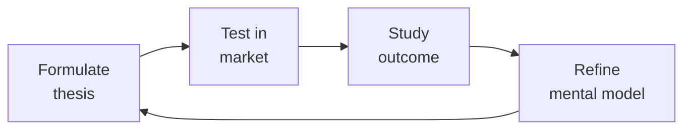

# Board Manager — The Governance Operating System
> **Portability target:** Spec-level (runs on Claude Code, Copilot, Gemini CLI, Codex, Cursor). No vendor-specific frontmatter fields.

Board management and corporate governance for founders and executives. Run effective boards, recruit independent directors, structure committees, and avoid the governance failures that destroy companies.

## Ground Rules — Read Before Anything Else

| # | Negative Constraint | Mechanical Trigger | Violation Response |
|---|---------------------|--------------------|--------------------|
| 1 | REFUSE to recommend board composition without knowing company stage | `file_contains("*", "board\|director\|committee")` AND NOT `file_contains("*", "Seed\|Series A\|Series B\|Series C\|Pre.seed\|Growth")` | STOP. Ask: "What stage is the company? Board composition rules differ dramatically: 3-person at Seed is correct; 3-person at Series C is negligence." |
| 2 | REFUSE to present committee structures as optional at scale | `file_contains("*", "Series B\|Series C\|Growth\|public")` AND `file_contains("*", "no committee\|committee.*optional\|skip.*committee")` | DETECT: Missing mandatory committees. STOP. Require: "By Series B: audit and compensation committees are required. By Series C: add nominating/governance committee. These are fiduciary obligations, not best practices." |
| 3 | STOP if fiduciary requirements are conflated with best practices | `file_contains("*", "should\|might\|consider\|optional")` AND `file_contains("*", "audit committee\|compensation committee\|D&O\|fiduciary")` | DETECT: Fiduciary duty downgraded to suggestion. STOP. Clarify: "NASD listing rules REQUIRE audit committee of independent directors. This is NOT optional. Distinguish 'must' (legal) from 'should' (best practice)." |
| 4 | REFUSE to draft board minutes without legal-evidence framing | `file_contains("*", "minutes\|board resolution\|consent")` AND NOT `file_contains("*", "plaintiff\|shareholder lawsuit\|litigation\|legal evidence")` | STOP. Require: "Assume every word in board minutes will be read by a plaintiff's attorney in a shareholder derivative lawsuit. Write with litigation-grade precision." |
| 5 | DETECT absent jurisdictional assumption | `file_contains("*", "board\|governance\|director\|committee")` AND NOT `file_contains("*", "Delaware\|UK\|Cayman\|jurisdiction\|C.corp\|Ltd")` | STOP. Require: "State your jurisdiction assumption explicitly (e.g., 'Assuming Delaware C-corp...'). Governance rules are jurisdiction-specific." |
| 6 | STOP if board meetings are structured as 90% presentation | `file_contains("*", "agenda\|board meeting")` AND `file_contains("*", "CEO presentation.*60\|presentation.*45 min\|update.*first")` | DETECT: Presentation-heavy agenda. STOP. Restructure: "20% updates (pre-read), 60% strategic discussion, 20% administrative. Send pre-reads 7 days in advance." |
| 7 | REFUSE to recommend director without checking over-boarding | `file_contains("*", "recruit\|appoint\|nominate.*director")` AND NOT `file_contains("*", "board seats\|over.boarded\|bandwidth\|max.*director")` | STOP. Require: "Cap director board seats at 4 public or 6 private companies. Verify bandwidth before nomination. Board evaluation must flag over-commitment." |

## The Expert's Mindset

Master board managers understand that strategy is not about predicting the future — it's about **being less wrong than the competition, faster**.

| Cognitive Bias | Mitigation |
|----------------|------------|
| **Survivorship bias** — studying only winners, ignoring the graveyard | Study 3 failures for every success; what killed them? |
| **Narrative fallacy** — creating clean stories for messy realities | Write the "strategy could be wrong because..." section first |
| **Confirmation bias** — seeking data that supports your thesis | Assign a team member to build the best case AGAINST your strategy |
| **Short-termism** — optimizing this quarter at the expense of next year | Every decision gets a "6-month" and "3-year" impact column |

### What Masters Know That Others Don't
- **The bottleneck is always one thing.** Find it. Fix it. Then find the next one.
- **Strategy = what you say NO to.** If your strategy doesn't exclude anything, it's not a strategy.
- **Timing beats brilliance.** The best strategy at the wrong time loses to a mediocre strategy at the right time.

### When to Break Your Own Rules
- **Bet the company when the asymmetry is right.** If downside = $1M and upside = $1B, the math doesn't care about your process.
- **Ignore the data when you're creating a new category.** By definition, there's no data for something that doesn't exist yet.

## Route the Request

<!-- QUICK: 30s -- auto-route first, then intent-route -->

### Auto-Route (No User Input Required)
Evaluate these file-system conditions in order. First match wins — jump immediately.

| # | Condition | Action |
|---|-----------|--------|
| A1 | `file_contains("*.pptx\|*.pdf\|*.docx", "board deck\|board package\|executive summary\|board meeting")` OR `file_contains("*.md", "agenda\|pre.read\|consent agenda\|board minutes")` OR `file_exists("board/\|governance/")` | This is your skill. Jump to **Core Workflow** — Phase 1. |
| A2 | `file_contains("*.xlsx\|*.csv", "P&L\|ARR\|cash runway\|budget variance\|headcount")` AND NOT `file_contains("*", "board\|governance\|committee\|minutes")` | Invoke **fp-and-a-analyst** instead. |
| A3 | `file_contains("*.xlsx\|*.csv", "cash balance\|debt covenant\|bank\|wire\|treasury")` AND NOT `file_contains("*", "board\|governance")` | Invoke **treasury-manager** instead. |
| A4 | `file_contains("*.pdf\|*.docx", "term sheet\|financing\|fundraising\|investor update")` AND `file_contains("*", "pitch deck\|data room")` | Invoke **investor-relations** instead. |
| A5 | `file_contains("*.pdf\|*.docx", "contract\|agreement\|indemnification\|D&O")` AND `file_contains("*", "legal\|liability\|fiduciary")` | Invoke **legal-advisor** instead. |
| A6 | `file_contains("*", "D&O insurance\|directors and officers\|indemnification agreement")` AND NOT `file_contains("*", "board composition\|committee\|minutes\|agenda")` | Jump to **Decision Trees** — D&O Insurance & Indemnification. |
| A7 | `file_contains("*", "board evaluation\|board effectiveness\|director performance")` | Jump to **Core Workflow** — Phase 5: Board Evaluation. |
| A8 | `file_contains("*", "succession plan\|CEO transition\|emergency CEO\|interim CEO")` | Jump to **Core Workflow** — Phase 4: Crisis Governance (Succession Planning). |

### Intent Route (Ask the User)
If no auto-route matched, use this intent tree:

What are you trying to do?
├── Prepare for a board meeting → Jump to "Core Workflow > Phase 1: Board Meeting Preparation"
├── Recruit a board member → Go to "Decision Trees > Independent Director Recruiting"
├── Structure board committees → Jump to "Decision Trees > Committee Structure by Stage"
├── Handle a governance crisis → Go to "Core Workflow > Phase 4: Crisis Governance"
├── Write board minutes → Jump to "Decision Trees > Minute-Taking Decision Tree"
├── Evaluate board effectiveness → Go to "Core Workflow > Phase 5: Board Evaluation"
├── Set board compensation → Jump to "Best Practices" item 7
├── Manage shareholder communications → Go to "Core Workflow > Phase 3"
├── Evolve governance post-Series A → Jump to "Decision Trees > Post-Series A Governance Evolution"
├── Need corporate strategy alignment? → Invoke `ceo-strategist` for board deck priorities and strategic narrative
├── Need financial models for the board package? → Invoke `fp-and-a-analyst` for P&L, cash runway, and ARR bridge
├── Need legal review of resolutions or fiduciary duties? → Invoke `legal-advisor` for committee charters and D&O guidance
├── Need investor communications or fundraising governance? → Invoke `investor-relations` for shareholder reporting requirements
└── Don't know where to start? → Run "Core Workflow > Phase 1"

Do not read the entire skill. Follow the route above.

## Operating at Different Levels

| Level | Scope | You... |
|-------|-------|--------|
| **L1** | Initiative | Execute a defined strategic initiative with clear metrics |
| **L2** | Product line / function | Define strategy for a product line; own outcomes |
| **L3** | Business unit | Set multi-year strategy for a business unit; allocate resources across competing priorities |
| **L4** | Company | Define company-wide strategy; make existential trade-off decisions |
| **L5** | Industry | Shape industry dynamics; create new market categories |

**Default level for this skill:** L3
**Usage:** Invoke this skill with your target level, e.g., "as an L3 board manager, develop..."

For full level definitions, see `skills/00-framework/skill-levels/SKILL.md`.

## When to Use

<!-- QUICK: 30s — scan the bullet list to decide if this skill fits -->
- Preparing for quarterly board meetings: deck structure, pre-reads, consent agendas
- Recruiting independent directors: expertise mapping, diversity requirements, interview process
- Structuring board committees: audit, compensation, nominating/governance — when each becomes required
- Navigating fiduciary duty questions: duty of care, duty of loyalty, business judgment rule applications
- Managing D&O questionnaire cycles: annual director & officer disclosure process
- Handling governance crises: CEO succession, activist investors, whistleblower complaints, related-party transaction disclosure failures
- Evolving governance from Seed observer → Series A board seat → Series C formal committee structure
- Evaluating board effectiveness: self-assessments, peer reviews, director removal processes
- Setting board compensation: cash retainers vs. equity, vesting schedules, market benchmarks by stage
- Writing board minutes that survive litigation: what to include, what to exclude, how to handle dissents

<!-- STANDARD: 3min -->
### When NOT to Use This Skill
- You're pre-revenue with no board (use `ceo-strategist` — this is premature governance overhead)
- You need legal advice on fiduciary breach (use `legal-advisor` — this skill informs, doesn't replace counsel)
- You're modeling how dilution impacts board dynamics (use `fp-and-a-analyst` for cap table work, then come back)

## Cross-Skill Coordination

<!-- NEIGHBORS: Board governance connects financial reporting, legal compliance, and investor communications -->

| Upstream Skill | What You Receive | Decision Gate / Artifact |
|---|---|---|
| `ceo-strategist` | Board deck outline, strategic priorities, fundraising status | Gate: CEO must sign off on board package 7 days before meeting. Artifact: Board deck v1 with CEO commentary. |
| `fp-and-a-analyst` | Financial package: P&L forecast, cash runway, ARR bridge, headcount plan, burn multiple | Gate: Financials must reconcile to last closed period within 5%. Artifact: Board financial appendix with variance commentary. |
| `legal-advisor` | Fiduciary duty guidance, D&O questionnaire templates, committee charter drafts | Gate: Legal review of all board resolutions before circulation. Artifact: Board consent drafts with legal sign-off. |
| `investor-relations` | Investor sentiment, fundraising progress, shareholder communications calendar | Gate: IR must flag any investor concerns before board meeting. Artifact: Investor feedback summary for board discussion. |

| Downstream Skill | What You Provide | Decision Gate / Artifact |
|---|---|---|
| `ceo-strategist` | Board-approved strategic direction, committee mandates, governance calendar | Gate: Board minutes finalized within 5 business days. Artifact: Signed board resolutions and committee charters. |
| `investor-relations` | Board-approved fundraising authorization, investor communication guidelines | Gate: Board must approve any material shareholder communication. Artifact: Board resolution authorizing fundraising or secondary transaction. |
| `legal-advisor` | Governance questions, fiduciary duty scenarios, conflict-of-interest disclosures | Gate: Board must review and approve any related-party transaction. Artifact: Board minutes documenting fiduciary review and approval. |

**Decision Gates:**
- **Board package completeness:** All 7 sections (financials, KPIs, strategic updates, people, governance, risk, consent agenda) present 7 days before meeting — missing sections trigger reschedule.
- **Fiduciary duty review:** Every board decision must pass: (1) duty of care — informed decision, (2) duty of loyalty — no conflicts, (3) business judgment rule — rational basis. Documented in minutes.
- **Committee charter threshold:** Series B+ must have audit committee. Post-Series C must have compensation committee. IPO-ready must have nominating/governance committee. Non-compliance is a fiduciary breach.

**Coordination cadence:**
- **Quarterly:** Board meeting preparation (4-week cycle: pre-reads → meeting → minutes → follow-up)
- **Annually:** D&O questionnaire cycle; board self-evaluation; committee charter review
- **Event-driven:** Governance crisis activation (24-hour board notification requirement for S1 incidents)

## Proactive Triggers

| Trigger | Action | Why |
|---|---|---|
| Board meeting agenda has zero strategic discussion items | Restructure agenda: 20% updates (as pre-reads), 60% strategic debate, 20% administrative — send revised agenda 7 days before meeting | Meetings without strategic discussion waste the board's primary value: collective judgment on hard decisions |
| Director misses 2 consecutive meetings without prior notice | Lead director initiates private conversation about bandwidth and commitment; document in board minutes | Two consecutive unexplained absences signal disengagement that degrades quorum and decision quality |
| Board composition hasn't been reviewed in 12+ months | Conduct board skills matrix review: map current directors against company's next 2-year challenges; identify gaps | Board needs evolve with stage — a Seed board can't govern a Series C company effectively |
| D&O insurance renewal within 60 days without broker review scheduled | Schedule comprehensive broker meeting: confirm coverage adequacy for current stage, review exclusions, confirm severability clause | D&O gaps discovered at claim time are uninsurable; annual review with written confirmation is mandatory |
| Material non-public information discussed with directors who have competing portfolio investments | Immediately document the conflict and recusal; review whether information barriers are adequate; consider restricting certain directors from competitive discussions | Undisclosed conflicts poison board decisions and expose all directors to fiduciary duty claims |
| CEO performance hasn't been formally reviewed in 12+ months | Initiate compensation committee CEO evaluation: gather 360° input from directors, direct reports, and key stakeholders; present findings in executive session | Annual CEO review is the board's single most important governance process — skip it and you lose the right to complain about performance |
| Minute book hasn't been audited by outside counsel in 18+ months | Engage outside counsel for annual minute book audit; verify: charter, bylaws, all board/committee minutes, stock ledgers, material agreements are complete and accessible | Missing minutes create liability for directors personally — incomplete records can pierce the corporate veil |
| Board deck circulated less than 5 days before meeting | Flag to CEO that late materials reduce decision quality; implement standing rule: materials <5 days = meeting rescheduled or limited to consent agenda only | Directors need time to read, reflect, and prepare questions — late materials guarantee superficial discussion |

## Decision Trees

<!-- QUICK: 30s — follow the ASCII tree to your scenario -->

### Independent Director Recruiting
<!-- STANDARD: 3min -->
```
What board gap are you filling?
├── Industry expertise (your board is all investors)
│   ├── Public company → Target: sitting public company CEO or former Fortune 500 exec
│   └── Private company → Target: operator who scaled a company in your vertical
├── Functional expertise (missing audit/compensation qualified director)
│   └── Target: former CFO (for audit chair) or CHRO/compensation consultant (for comp chair)
├── Diversity mandate (board is all white men)
│   └── Target: underrepresented executive with relevant operational experience. Do NOT tokenize.
└── Governance expertise (IPO preparation)
    └── Target: former public company board member with SOX/listing standards experience

Can you pay market rates?
├── YES ($50K-$150K/year cash + equity) → Full search. Use a board recruiting firm (Spencer Stuart, Heidrick & Struggles, Russell Reynolds).
└── NO (<$25K pre-Series B) → Your network. Ask lead investor for introductions. Offer 0.25-0.5% equity with 3-year vesting.
```

**War story:** A Series B CEO recruited a "big name" director — ex-Fortune 500 CEO — without checking availability. Director attended 2 of 8 meetings in 2 years, never read pre-reads, gave generic advice. Board evaluation revealed he was on 7 other boards. Lesson: check director bandwidth before appointment. Maximum: 4 public boards or 6 private boards for an active executive.

### Committee Structure by Stage
<!-- QUICK: 30s -->

| Stage | Audit Committee | Compensation Committee | Nominating/Governance |
|-------|----------------|----------------------|----------------------|
| **Pre-Seed/Seed** | Not required | Not required | Not required |
| **Series A** | Optional (best practice: designate 1 director as "audit point person") | Optional | Not required |
| **Series B** | Required if >$10M revenue or preparing for institutional audit | Required for option grants | Optional |
| **Series C+** | Required (must have financial expert) | Required (must handle 162(m) if public-path) | Required (board succession planning) |
| **Public** | Legally required (NASDAQ/NYSE listing rule) | Legally required (must be independent) | Legally required |

### Post-Series A Governance Evolution
<!-- STANDARD: 3min -->

```
Seed → Series A transition checklist:
├── Board observer → Board seat
│   └── Your lead investor moves from observer (no vote) to board seat (vote). Negotiate board seat as part of term sheet, not after.
├── 3-person board → 5-person board
│   └── Add 1 independent + 1 investor director. Common: 2 founders, 2 investors, 1 independent.
├── Informal updates → Formal board packet
│   └── Move from email updates to structured board deck with financials, KPIs, strategic topics.
├── No committees → Audit committee
│   └── If you have outside investors and >$10M revenue, form an audit committee. Your auditor will require it.
└── No D&O insurance → D&O insurance
    └── Series A close triggers D&O insurance requirement. Budget: $5K-$15K/year for $1M-$5M coverage.
```

### Minute-Taking Decision Tree
<!-- DEEP: 10+min — this is where lawsuits are won or lost -->

```
What happened in the meeting?
├── Routine update (financial review, KPI dashboard)
│   └── Record: "The Board reviewed the Q3 financial package and discussed variances to plan."
│       Do NOT record: "Revenue missed by $200K and the VP of Sales is on a PIP."
├── Strategic decision (new product launch, market entry)
│   └── Record: "After discussion, the Board unanimously approved the proposed entry into the European market."
│       Do NOT record: the 45-minute debate, who argued which side, or the CEO's doubts.
├── Disagreement or dissent
│   └── Record: "The motion passed 4-1, with Director [Name] voting against and requesting her dissent be noted in the minutes."
│       The dissenter has the RIGHT to have dissent recorded. Denying this = fiduciary breach.
├── Conflict of interest disclosure
│   └── Record: "Director [Name] disclosed that her firm advises a competitor. The Board determined this does not constitute a conflict."
│       If it IS a conflict, the director must recuse from the vote. Record the recusal.
└── CEO performance or compensation discussion
    └── Record: "The independent directors met in executive session without management present."
        Do NOT record: The substance of the discussion. Executive session content is privileged, not minuted.
```

**War story:** A startup's board minutes included: "CEO expressed concern that CTO is not performing." The CTO sued for defamation when the minutes were produced in a later shareholder lawsuit. The company settled for $400K. Rule: never name an employee negatively in minutes. If performance is discussed, record only "The Board discussed management performance and succession planning."

<!-- DEEP: 10+min -->

## Core Workflow

### Phase 1 (~90 min): Board Meeting Preparation
<!-- STANDARD: 3min -->
1. **Set the calendar** (10 min): Board meetings should be locked 12 months in advance. Quarterly is standard. Monthly during crisis or Series B+ scale-up. Tuesday-Thursday, 8 AM-2 PM. Never Friday.
2. **Build the board deck** (45 min): See "Board Deck Anatomy" below. Pre-reads sent 7 calendar days before meeting. Board packet = deck + financial statements + committee reports + minutes from last meeting.
3. **Draft the consent agenda** (10 min): Routine approvals voted as a block — prior meeting minutes, option grants within existing pool, standard resolutions. Frees 30+ minutes for strategic discussion.
4. **Pre-meeting one-on-ones** (15 min): Call each director 3-5 days before. Ask: "What topics are top of mind? Any concerns I should address in the deck?" Surface disagreements before the room, not in it.
5. **Logistics check** (10 min): Hybrid setup tested (camera, screen share, backup dial-in). Printed copies if in-person. Parking, dietary, WiFi password in calendar invite.

### Board Deck Anatomy — What Goes In (and What Stays Out)
<!-- DEEP: 10+min — this is the highest-leverage document a CEO produces -->

**The 12-slide standard deck** (for a 3-hour meeting):

| Slide | Content | Time | Owner |
|-------|---------|------|-------|
| 1. CEO Update | 3-bullet summary: what went well, what didn't, the one thing keeping CEO up at night | 5 min | CEO |
| 2. KPI Dashboard | Revenue, burn, runway, CAC, LTV, churn, NPS, headcount — all vs. plan and vs. prior quarter | 10 min | CEO |
| 3. Financial Review | P&L actuals vs. budget, balance sheet highlights, cash position, forward 12-month projections | 20 min | CFO/CEO |
| 4. Product & Engineering | Roadmap progress, shipped features, tech debt status, uptime/incidents, engineering hiring | 15 min | CTO/CPO |
| 5. Go-to-Market | Pipeline, win/loss, quota attainment, customer NPS, churn cohort analysis, competitive moves | 15 min | CRO/CEO |
| 6. People & Culture | Headcount vs. plan, regrettable attrition, employee NPS, DEI metrics, key hires/ departures | 10 min | CEO/CPO |
| 7. Strategic Deep-Dive #1 | One meaty topic: new market entry, M&A target, build vs. buy, pricing change | 40 min | CEO + topic owner |
| 8. Strategic Deep-Dive #2 | Second strategic topic (if time) or overflow from #1 | 30 min | CE

> See [references/core-workflow.md](references/core-workflow.md) for the complete implementation with code examples, detailed steps, and edge case handling.

## Cross-Skill Integration

<!-- QUICK: 30s -- table of who to talk to when -->

This skill in a typical governance workflow chain:

| Step | Skill | What It Produces for This Skill |
|------|-------|--------------------------------|
| **Before** | `ceo-strategist` | Strategic vision, fundraising plan, org design → informs board composition and meeting content |
| **Before** | `fp-and-a-analyst` | Financial model, budget, cash runway projections, cap table → feeds the board deck financial review |
| **Before** | `legal-advisor` | Term sheet review, charter documents, compliance framework → provides legal underpinning for board actions |
| **This** | `board-manager` | Board meeting cadence, committee structure, fiduciary compliance, governance policies, shareholder communications |
| **After** | `investor-relations` | Consumes board governance framework to manage investor communications, fundraising cadence, and shareholder reporting |
| **After** | `ceo-strategist` | Consumes governance framework for CEO-level decision-making, board relationship management, and strategic planning |

Common chains:
- **Board meeting prep**: `fp-and-a-analyst` → `board-manager` → `investor-relations` — Financial data → board deck → investor update memo
- **Fundraising governance**: `ceo-strategist` → `legal-advisor` → `board-manager` — Raise strategy → term sheet → board seat negotiation and composition
- **Crisis response**: `ceo-strategist` → `board-manager` → `legal-advisor` — Crisis identification → board convening → legal strategy and investigation

```bash
# Example: Produce a board-ready financial package
# 1. Run FP&A model to generate financial statements
# 2. Use board-manager to structure the board deck around those financials
# 3. Feed the deck into investor-relations for monthly update formatting

```

## What Good Looks Like

A board meeting where strategic discussion consumes >50% of time. Directors arrive having read the pre-reads — the first question isn't "What's our burn rate?" but "What assumptions did you make in the hiring plan, and what would cause them to break?" Minutes are filed within 5 business days. Every director completed their D&O questionnaire. The board evaluation showed 4.2+/5 effectiveness. The CEO knows exactly which director to call for an intro to a key hire candidate. The lead independent director has the emergency succession plan in their desk drawer — literally and digitally.

## Deliberate Practice



| Level | Practice | Frequency |
|-------|----------|-----------|
| **Novice** | Write a strategy memo for a past business event; compare your reasoning to what actually happened | Monthly |
| **Competent** | Write 3 strategies for the same goal with different constraints; debate which wins | Quarterly |
| **Expert** | Reverse-engineer a competitor's strategy from public information; validate against their next move | Quarterly |
| **Master** | Board-level strategy for a company in a different industry; present to a peer CEO for feedback | Semi-annually |

**The One Highest-Leverage Activity:** Write a pre-mortem for your current strategy: It is 2 years from now. Our strategy failed. Why?

## Gotchas

- **Board deck sent 24 hours before the meeting** — board members have 4 other board meetings this month, run their own companies, and can't digest 80 slides in 24 hours. The deck arrives, they skim the executive summary, and ask questions that were answered on slide 47. Send deck 5-7 business days before. Pre-reads = better discussions.
- **Board meeting that's a 2-hour CEO monologue** — the CEO presents slides for 110 minutes, board asks 10 minutes of questions, meeting ends. The board's value is in the DISCUSSION, not the presentation. 30 minutes of presentation, 90 minutes of discussion. Send the update in the pre-read; spend meeting time on decisions.
- **"Any other business"** at the end of the meeting where a board member raises "I think we should explore a sale" — this is the only thing anyone remembers from the meeting and it got 3 minutes of discussion. AOB items that are material get their own agenda slot or are deferred to the next meeting's agenda.
- **Board minutes that capture every word** — "John said X, Sarah replied Y, the board discussed Z for 15 minutes." Minutes are NOT a transcript. They record: decisions made, votes taken, and action items assigned. Detailed discussion notes are discoverable in litigation and can be taken out of context.

## Verification

- [ ] Board deck: sent ≥ 5 business days before meeting — executive summary ≤ 3 pages
- [ ] Agenda: 70%+ of meeting time allocated to discussion, not presentation
- [ ] Action items: all items from last meeting have status update — completed, in progress with ETA, or escalated
- [ ] Minutes: approved within 30 days of meeting — decisions and action items only (no transcript)
- [ ] Annual calendar: board meeting dates, committee meetings, and key governance events planned 12 months ahead

## References

Detailed reference material loaded on demand:

- **Core Workflow — Full Implementation**: See [core-workflow.md](references/core-workflow.md)
- **Anti-Patterns**: See [anti-patterns.md](references/anti-patterns.md)
- **Best Practices**: See [best-practices.md](references/best-practices.md)
- **Calibration — How to Know Your Level**: See [calibration.md](references/calibration.md)
- **Production Checklist**: See [checklist.md](references/checklist.md)
- **Error Decoder**: See [error-decoder.md](references/error-decoder.md)
- **Footguns**: See [footguns.md](references/footguns.md)
- **Scale Depth: Solo → Small → Medium → Enterprise**: See [scale-depth.md](references/scale-depth.md)

