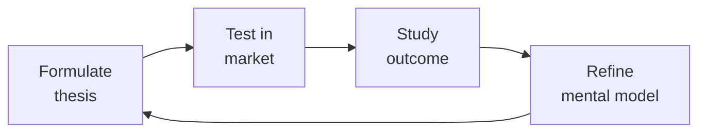

# Investor Relations — The Fundraising Operating System

Investor relations and fundraising operations for founders, CEOs, and CFOs. Run efficient fundraises, manage investor communications at scale, handle due diligence, model dilution scenarios, and navigate the hardest IR moments — down rounds, tender offers, and crisis disclosures.

## Ground Rules — Read Before Anything Else

- **Never recommend a raise amount without runway math.** "Raise $10M" without knowing burn rate, revenue, and growth rate is malpractice. You need: monthly burn, cash on hand, projected revenue, hiring plan, and time to next milestone.
- **Investor updates are not optional.** If you miss a monthly update, investors assume bad news. Silence = crisis in IR. Send updates even when the news is terrible — especially when it's terrible.
- **The data room IS the diligence process.** A disorganized data room adds 2-4 weeks to a fundraise and signals operational weakness. A tight data room closes faster.
- **Term sheets are not commitments.** A signed term sheet can still blow up. Never stop talking to other investors until the wire hits. The "no-shop" period between term sheet and close is when deals die.
- **Cap table errors compound.** A 1% error at Seed becomes a 5% error at Series C. Audit your cap table quarterly with a lawyer. Use Carta or Pulley — spreadsheets kill companies.
- **Assume every investor email will leak.** Don't put anything in writing you wouldn't want a competitor, a journalist, or a future acquirer to see.


## The Expert's Mindset

Master investor relationss understand that strategy is not about predicting the future — it's about **being less wrong than the competition, faster**.

| Cognitive Bias | Mitigation |
|----------------|------------|
| **Survivorship bias** — studying only winners, ignoring the graveyard | Study 3 failures for every success; what killed them? |
| **Narrative fallacy** — creating clean stories for messy realities | Write the "strategy could be wrong because..." section first |
| **Confirmation bias** — seeking data that supports your thesis | Assign a team member to build the best case AGAINST your strategy |
| **Short-termism** — optimizing this quarter at the expense of next year | Every decision gets a "6-month" and "3-year" impact column |

### What Masters Know That Others Don't
- **The bottleneck is always one thing.** Find it. Fix it. Then find the next one.
- **Strategy = what you say NO to.** If your strategy doesn't exclude anything, it's not a strategy.
- **Timing beats brilliance.** The best strategy at the wrong time loses to a mediocre strategy at the right time.

### When to Break Your Own Rules
- **Bet the company when the asymmetry is right.** If downside = $1M and upside = $1B, the math doesn't care about your process.
- **Ignore the data when you're creating a new category.** By definition, there's no data for something that doesn't exist yet.
## Route the Request
<!-- QUICK: 30s — pick your path, skip the rest -->

What are you trying to do?
├── Start a fundraise → Jump to "Core Workflow > Phase 1: Fundraising Preparation"
├── Build a data room → Go to "Decision Trees > Data Room Checklist"
├── Create a pitch deck → Jump to "Core Workflow > Phase 2: Pitch Deck Construction"
├── Manage investor pipeline → Go to "Core Workflow > Phase 3: Pipeline Management"
├── Compare term sheets → Jump to "Decision Trees > Term Sheet Comparison Framework"
├── Prepare for investor due diligence → Go to "Core Workflow > Phase 4: Due Diligence"
├── Model cap table scenarios → Jump to "Decision Trees > Cap Table Scenario Modeling"
├── Send an investor update → Go to "Core Workflow > Phase 5: Investor Communications"
├── Run a secondary transaction → Jump to "Decision Trees > Secondary Transaction Types"
├── Handle a down round → Go to "Error Decoder" — last row, then "Crisis IR Playbook"
├── Need fundraising strategy and narrative? → Invoke `ceo-strategist` for strategic positioning and investor targeting
├── Need the underlying financial model? → Invoke `fp-and-a-analyst` for operating model; return here to package for investors
├── Need legal review of term sheets or securities compliance? → Invoke `legal-advisor` for contract review and disclosure requirements
├── Need board authorization for fundraising? → Invoke `board-manager` for board resolution and governance requirements
└── Don't know where to start? → Run "Core Workflow > Phase 1"

Do not read the entire skill. Follow the route above.

## Operating at Different Levels

| Level | Scope | You... |
|-------|-------|--------|
| **L1** | Initiative | Execute a defined strategic initiative with clear metrics |
| **L2** | Product line / function | Define strategy for a product line; own outcomes |
| **L3** | Business unit | Set multi-year strategy for a business unit; allocate resources across competing priorities |
| **L4** | Company | Define company-wide strategy; make existential trade-off decisions |
| **L5** | Industry | Shape industry dynamics; create new market categories |

**Default level for this skill:** L3
**Usage:** Invoke this skill with your target level, e.g., "as an L3 investor relations, develop..."

For full level definitions, see `skills/00-framework/skill-levels/SKILL.md`.

## When to Use
<!-- QUICK: 30s — scan the bullet list to decide if this skill fits -->
- Launching a fundraising process: strategy, materials, pipeline, close
- Building and managing a data room: what goes in, what stays out, how to organize
- Creating or refining a pitch deck: story arc, traction slides, market sizing, competitive positioning
- Managing the investor pipeline: CRM setup, tracking conversations, follow-up cadence
- Comparing term sheets: price, liquidation preference, participation, anti-dilution, board seats, protective provisions
- Running investor due diligence: tech DD, financial DD, customer references, background checks
- Modeling cap table scenarios: dilution, option pool expansion, liquidation waterfalls
- Sending monthly/quarterly investor updates: metrics that matter, good news/bad news format
- Preparing for annual shareholder meetings and proxy statements
- Coordinating secondary transactions: tender offers, direct secondaries, founder liquidity
- Managing IR during crises: down rounds, layoffs, product incidents, co-founder departures

<!-- STANDARD: 3min -->
### When NOT to Use This Skill
- You're pre-revenue and raising from friends & family (use `ceo-strategist` — this is institutional fundraising infrastructure)
- You need legal review of a term sheet (use `legal-advisor` — this skill helps you compare terms, not negotiate them)
- You're building the underlying financial model (use `fp-and-a-analyst` for the model; come here to package it for investors)

## Cross-Skill Coordination

<!-- NEIGHBORS: IR connects fundraising strategy, financial reporting, and board governance -->

| Upstream Skill | What You Receive | Decision Gate / Artifact |
|---|---|---|
| `ceo-strategist` | Fundraising strategy, narrative positioning, target investor list | Gate: CEO must approve investor targeting before outreach begins. Artifact: Fundraising strategy memo with target raise amount, valuation range, and timeline. |
| `fp-and-a-analyst` | Operating model, SaaS metrics dashboard, scenario analysis, valuation model | Gate: Model must reproduce last 12 months of actuals within 5%. Artifact: Investor-ready financial model with bull/base/bear scenarios. |
| `board-manager` | Board-approved fundraising authorization, investor communication guidelines, governance requirements | Gate: Board must approve any new fundraising round or material secondary. Artifact: Board resolution authorizing fundraising. |
| `legal-advisor` | Term sheet review, securities law compliance, investor agreement drafting | Gate: Every investor communication must pass legal review before sending. Artifact: Legal-reviewed term sheet comparison and disclosure schedule. |

| Downstream Skill | What You Provide | Decision Gate / Artifact |
|---|---|---|
| `board-manager` | Fundraising progress, term sheet comparison, cap table scenarios | Gate: Board must be updated on fundraising status within 48 hours of material development. Artifact: Fundraising status dashboard with pipeline stage and term sheet summary. |
| `ceo-strategist` | Investor pipeline status, diligence findings, competitive fundraising intelligence | Gate: CEO must be briefed before any partner meeting. Artifact: Investor briefing memo with background, thesis fit, and potential concerns. |
| `fp-and-a-analyst` | Investor feedback on model assumptions, market comps, valuation benchmarks | Gate: Model assumptions must be updated after each investor meeting that surfaces new data. Artifact: Model assumption changelog with investor source attribution. |

**Decision Gates:**
- **Data room readiness:** All 14 folders complete and organized before sharing with first investor. Incomplete data room = 2-4 week fundraise delay.
- **Term sheet comparison:** Every term sheet evaluated against: (1) valuation vs market comps, (2) liquidation preference structure, (3) board seat provisions, (4) protective provisions, (5) option pool requirements. No term sheet signed without full comparison.
- **Investor update discipline:** Monthly updates sent by 5th business day. Silence >30 days = investor assumption of crisis. Every update must include: key metrics, good news, bad news, asks, and cash runway.

**Coordination cadence:**
- **Weekly:** Pipeline review with CEO; investor meeting prep and debrief
- **Monthly:** Investor update drafting and distribution
- **Quarterly:** Board meeting IR section; shareholder reporting
- **Fundraising:** Daily pipeline tracking; weekly strategy sync with CEO and legal
- **Crisis:** Immediate notification protocol — board and major investors within 24 hours

## Proactive Triggers

| Trigger | Action | Why |
|---|---|---|
| Monthly investor update is 3+ days late | Send update immediately even if incomplete — late is worse than imperfect; investors track consistency as a trust signal | Timeliness builds trust more than polish; a late update signals disorganization or hidden bad news |
| Investor hasn't engaged with updates for 3+ consecutive months | Move to quarterly update cadence; don't waste CEO time on disengaged investors; flag to board if lead investor is disengaged | Disengaged investors won't lead your next round — conserve energy for active supporters |
| Term sheet received with participating preferred structure | Model full exit waterfall at $50M, $100M, $500M, $1B — show CEO exactly how participation dilutes common at each exit value | Founders often focus on valuation and miss that participation preferred can leave common with $0 at moderate exits |
| Warm intro request for target investor sits unanswered for 5+ business days | Follow up once; if no response in 2 more days, find alternative intro path or deprioritize that investor | Fundraising timelines are tight — waiting 2+ weeks for one intro burns runway and momentum |
| Data room has 5+ unanswered diligence questions accumulating | Designate one person as "diligence quarterback" to triage, assign, and track every question within 24 hours; escalate anything >48 hours unanswered | Unanswered diligence questions create the impression you're hiding something — speed of response builds confidence |
| Pitch deck hasn't been updated in 3+ months or since last material metric change | Refresh deck within 1 week — update traction slide with latest numbers; remove stale references; ensure narrative matches current strategy | Outdated decks signal that fundraising isn't a priority or that metrics have gotten worse |
| Competitor raises significant round or announces product that directly competes | Draft reactive messaging within 24 hours: "Here's why this validates our market and why we're differentiated"; proactively send to existing investors | Investors will see the competitor news — your framing of it shapes whether they see threat or validation |
| Secondary transaction proposed without employee-wide communication plan | Insert communication design into process: who sells, how much, who's eligible next, rationale, impact on 409A — communicate before, not after | Secondaries create winners and losers; silence breeds resentment and attrition among those excluded |

## Decision Trees
<!-- QUICK: 30s — follow the ASCII tree to your scenario -->

### Data Room Checklist — The 14 Folders Every Fundraise Needs
<!-- STANDARD: 3min -->

```
data-room/
├── 01-corporate-docs/
│   ├── Certificate of Incorporation (and amendments)
│   ├── Bylaws
│   ├── Board consents and minutes (last 2 years)
│   ├── Stockholder consents
│   └── Subsidiary org charts (with jurisdictional notes)
├── 02-cap-table/
│   ├── Pro forma cap table (fully diluted, with ESOP)
│   ├── 409A valuation report (current, within 12 months)
│   ├── Option grant history (date, strike price, vesting schedule)
│   └── Convertible instruments (SAFEs, notes, warrants — conversion terms and amounts)
├── 03-financials/
│   ├── Audited financials (last 2 years, if applicable)
│   ├── Unaudited interim financials (current year, monthly)
│   ├── Annual budget and quarterly forecasts
│   ├── Revenue by customer (anonymized, top 20 accounts)
│   ├── Cohort analysis (retention by cohort, logo and dollar-based)
│   └── Gross margin by product line
├── 04-product-tech/
│   ├── Architecture diagram (high-level, 1 page)
│   ├── Product roadmap (current + next 4 quarters)
│   ├── Tech debt assessment (with remediation plan)
│   ├── Security certifications (SOC 2, ISO 27001, pen test reports)
│   └── IP portfolio (patents filed/granted, trademarks, key licenses)
├── 05-gtm-sales/
│   ├── ICP and buyer persona documentation
│   ├── Pricing and packaging (current and planned)
│   ├── Sales playbook and comp plan
│   ├── Pipeline data (by stage, rep, vertical — last 4 quarters)
│   └── Win/loss analysis (last 20 deals)
├── 06-customer-reference/
│   ├── Referenceable customer list (name, contact, relationship notes)
│   ├── Case studies (3-5, with metrics)
│   └── NPS/CSAT data (rolling 12 months)
├── 07-market-competitive/
│   ├── TAM/SAM/SOM analysis (bottoms-up, with sources)
│   ├── Competitive landscape (with differentiation matrix)
│   └── Industry analyst reports (Gartner, Forrester — if available)
├── 08-people-culture/
│   ├── Org chart (current + planned 12 months)
│   ├── Headcount by department (with hiring plan)
│   ├── Employee NPS and engagement data
│   └── Key employee retention agreements
├── 09-legal-compliance/
│   ├── Material contracts (customer >$100K, vendor >$50K, partnership)
│   ├── Litigation summary (pending, threatened, settled — with counsel letter)
│   ├── Employment and IP assignment agreements (templates)
│   └── Regulatory filings and correspondence
├── 10-board-investor/
│   ├── Board meeting minutes (last 2 years)
│   ├── Investor update history (last 8 quarters)
│   └── Current investor contact list with ownership percentages
├── 11-fundraising/
│   ├── Pitch deck (current version, PDF)
│   ├── Financial model (Excel/Google Sheets, not PDF — they will model with it)
│   ├── Management bios and LinkedIn profiles
│   └── FAQ document (pre-empt the top 20 diligence questions)
├── 12-customer-contracts/
│   ├── Master Services Agreement (template)
│   └── Top 10 customer contracts (redacted for confidentiality, with counsel approval)
├── 13-vendor-partnerships/
│   └── Key vendor and partnership agreements
└── 14-tax-compliance/
    ├── Federal and state tax returns (last 2 years)
    ├── R&D tax credit documentation
    └── Sales tax compliance status by jurisdiction
```

**War story:** A Series B company sent their data room link to 40 investors. One folder — "06-customer-reference" — contained an Excel file with customer names, contact info, AND annual contract values, unredacted. An associate at a VC firm shared it with a competitor's CEO (their portfolio company). The competitor used the pricing data to undercut renewals. The startup lost 3 of their top 10 accounts within 6 months. Lesson: every document in the data room goes through counsel review before investor access. Revenue data is never customer-attributed in a data room.

### Term Sheet Comparison Framework
<!-- STANDARD: 3min -->

When comparing two term sheets, rank these 6 dimensions. Valuation is #4 on this list — not #1.

| Priority | Term | What to Look For | Red Flag |
|----------|------|-----------------|----------|
| 1 | **Liquidation Preference** | 1x non-participating is market. >1x or participating = red flag. | 2x participating preferred — investor gets paid twice before common sees a dollar |
| 2 | **Board Control** | Common + investor balance. Independent director breaks ties. | Investors control majority of board seats without an independent director |
| 3 | **Protective Provisions** | Standard: approve new financing, amend charter, sell company, change board size | Veto over budget, hiring, or customer contracts — investors are managing, not governing |
| 4 | **Valuation** | Higher = less dilution. But a clean $40M cap is better than a dirty $60M with 3x participating. | Valuation so high it makes the next round unwinnable (the "valuation trap") |
| 5 | **Option Pool** | 10-20% unallocated post-money. Pool should be pre-money (investor shares dilution). | Pool is post-money and too small — founders get diluted again at next round to refresh |
| 6 | **Anti-Dilution** | Weighted average (broad-based). | Full ratchet — if you raise a down round, investors get repriced. This destroys founder equity. |

**What good looks like:** A term sheet matrix where you can explain, in one sentence, why Term Sheet A is better than Term Sheet B despite the lower valuation. "Term Sheet A has a 1x non-participating liquidation preference and board balance, while Term Sheet B has 2x participating and investor board control — A leaves us with 3x more equity in a $100M exit."

### Cap Table Scenario Modeling
<!-- DEEP: 10+min -- cap table errors are irreversible -->

```
Model these 4 scenarios before every fundraise:

Scenario 1: Base Case (the round you're raising)
├── Pre-money: $[X]M | Raise: $[Y]M | Post-money: $[Z]M
├── Dilution: [%] per existing shareholder
└── New option pool: [%] of post-money (pre-money refresh vs. post-money)

Scenario 2: Down Round (30% below current valuation)
├── Full ratchet anti-dilution impact on founders vs. weighted average
├── Pay-to-play provisions: who gets washed out?
└── Liquidation preference stack: do common shareholders get anything in a fire sale?

Scenario 3: Exit Waterfall ($50M, $100M, $500M, $1B)
├── Liquidation preference payout order: Series B → Series A → Seed → Common
├── Participation cap: at what exit value does participating preferred convert to common?
└── Option holder payout: what do employees actually make at each exit threshold?

Scenario 4: Acquisition (stock vs. cash deal)
├── Cash: simple waterfall. Stock: what's the acquirer's stock worth? (and lockup period)
├── Earnout: how much is contingent? Who stays to earn it?
└── Retention packages: key employee retention carve-outs (don't come from common pool)
```

**War story:** A founder sold her company for $40M thinking she'd walk away with $8M (20% ownership). She got $0. Her Series B investors had 2x participating preferred with no cap. The $40M went: $15M to Series B liquidation preference + $15M participation + $8M to Series A preference + $2M to Seed preference = $40M. Common shareholders (founders + employees) received nothing. She had never modeled the liquidation waterfall. The acquirer's lawyers presented it at closing. Too late to negotiate.

<!-- DEEP: 10+min -->

## Core Workflow

### Phase 1 (~120 min): Fundraising Preparation
<!-- STANDARD: 3min -->
1. **Decide if you should raise** (15 min): 18+ months of runway? Growing 3x+ YoY? Category is investable? If any answer is "no," fix the business first. Raising without momentum = down round or no round at all.
2. **Set the raise parameters** (15 min): How much? For what? From whom? Raise enough for 24 months to the next value-inflection milestone. If your next milestone is $5M ARR and you're at $1M ARR growing 10% month-over-month, you need ~18 months → raise $X based on burn × 24.
3. **Build the target investor list** (30 min): 30-50 firms. Tiered: Tier 1 (top 10, your dream investors), Tier 2 (20 good fits), Tier 3 (20 backups). Research: who invested in adjacent companies? Who led rounds at your stage and sector in the last 12 months? Who has capacity? (Check fund size — a $1B fund doesn't lead $5M Seeds.)
4. **Prepare materials** (45 min): Pitch deck (see Phase 2), financial model, data room (see Decision Trees), management bios, reference customer list, FAQ doc.
5. **Warm introductions only** (15 min): Cold emails have a <1% response rate. Warm intros: 40-60%. Map your network → target investors. Ask existing investors, advisors, and portfolio company CEOs for introductions. One intro request per investor, with a blurb they can forward.

### Phase 2 (~90 min): Pitch Deck Construction
<!-- STANDARD: 3min -->
**The 12-slide narrative arc.** Every slide answers one question. No slide has >5 bullet points. No bullet point is >2 lines.

| Slide | Question It Answers | Content |
|-------|-------------------|---------|
| 1. Title | Who are you? | Company name, logo, tagline: "We do X for Y" — 8 words max |
| 2. Problem | Why does this matter? | The pain you solve. Use a customer quote, not a market stat. "I spend 4 hours a week manually reconciling..." beats "The TAM is $50B." |
| 3. Solution | How do you solve it? | Product screenshot or 30-second demo GIF. Show, don't tell. |
| 4. Why Now? | Why hasn't this been done? | Technology shift, regulatory change, behavioral change. "APIs didn't exist before 2023." "Remote work made this a top-3 pain." |
| 5. Market Size | How big can this get? | Bottoms-up TAM: how many customers × your ASP × penetration rate. Tops-down is backup. Show the beachhead and expansion. |
| 6. Traction | Is this working? | Revenue graph (MRR/ARR, month-by-month for 18+ months). Logo count. Key logos. Retention (logo and dollar-based net retention). |
| 7. Product | What have you built? | Current product, roadmap highlights, key metrics (DAU/MAU, engagement). Not a feature list — show what's defensible. |
| 8. Business Model | How do you make money? | Pricing model, ASP, sales motion (PLG vs. enterprise sales), CAC, LTV, payback period. Unit economics must be on this slide. |
| 9. Competition | Why will you win? | Competitive matrix: you vs. incumbents vs. startups across key dimensions. Your unfair advantage: data, network effects, switching costs, brand. |
| 10. Team | Why you? | Founders' photos, titles, 1-line bio (previous company, relevant achievement). Key hires. Why this team uniquely can solve this problem. |
| 11. Financials | What do the numbers look like? | 3-year revenue projection with assumptions. Headcount plan. Burn rate. Key metrics: gross margin, CAC payback, LTV/CAC. |
| 12. The Ask | What do you need? | "We're raising $X on a $Y pre-money valuation to achieve [milestone]." Use of funds: 50% engineering, 30% GTM, 20% G&A. |

**What good looks like:** A partner at a VC firm forwards your deck to another partner with the note "Take a look at this — interesting team and traction." You know you have it when you get partner-level meetings (not associate screens) within 1 week of intro.

### Phase 3 (~60 min setup + ongoing): Pipeline Management
<!-- STANDARD: 3min -->
1. **Set up investor CRM** (15 min): Use Affinity, Streak (Gmail), or a Notion/Airtable tracker. Fields: firm, contact name, role, intro source, date contacted, meeting date, stage (outreach → meeting 1 → partner meeting → term sheet → diligence → close), notes, next step.
2. **Run the process in batches** (ongoing): Week 1-2: Tier 1 outreach (10 firms). Week 3-4: Tier 1 meetings + Tier 2 outreach. Week 5-6: Partner meetings and term sheet conversations. Never have >15 active conversations at once — you'll lose track.
3. **Follow-up cadence** (ongoing): After meeting 1, send thank-you + any promised materials within 24 hours. If no response in 5 business days, follow up once. If still no response, move to "passive" and focus on active conversations. Silence is a pass.
4. **Signal management** (ongoing): When one Tier 1 investor shows strong interest ("We'd like to meet the full partnership"), use it as leverage: "We're in active conversations with [Firm A] and [Firm B] and expect term sheets in the next 2 weeks. We'd love to include you in the process."
5. **The close** (10 min post-term sheet): Signed term sheet → no-shop period (30-45 days) → legal diligence → definitive agreements → wire transfer. During no-shop: respond to all diligence requests within 24 hours. The #1 cause of blown-up deals: slow diligence response signals disorganization.

### Phase 4 (~90 min): Due Diligence
<!-- STANDARD: 3min -->
1. **Financial DD preparation** (30 min): Unaudited monthly financials for the current year. Customer-level revenue data (anonymized). Cohort retention analysis. Gross margin by product. All material contracts >$50K. Tax returns.
2. **Technical DD preparation** (30 min): Architecture overview (1-pager for non-technical investors). Tech debt register with severity and remediation plan. Security posture (SOC 2 report, penetration test results). IP ownership documentation (all code written by employees/contractors with IP assignment).
3. **Customer reference preparation** (15 min): Identify 5-8 referenceable customers. Pre-brief each: "A potential investor may call. Here's what they'll ask. Here's what we'd love you to emphasize." Never put a customer on a reference call without pre-briefing them.
4. **Background check readiness** (15 min): Every founder will be background checked. Disclose anything that will surface before it surfaces: prior lawsuits, bankruptcies, regulatory actions, academic credential discrepancies. Surprise in background check = deal killer.

**War story:** A founder didn't disclose a prior startup that had failed and been sued by its investors. The VC's background check found the lawsuit (public record). The VC pulled the term sheet — not because of the failure, but because the founder hid it. The failure was defensible. The concealment was not.

### Phase 5 (~30 min/month): Investor Communications
<!-- STANDARD: 3min -->

**Monthly Investor Update Template:**

```
Subject: [Company Name] — [Month Year] Update

TL;DR (3 bullets):
- [Win: e.g., Revenue grew 12% MoM to $[X]K MRR]
- [Win: e.g., Closed [Customer Name], our largest deal at $[Y]K ACV]
- [Concern: e.g., Sales hiring is behind plan — 2 of 3 open roles unfilled]

KPIs:
| Metric | This Month | Last Month | Plan | YoY |
|--------|-----------|------------|------|-----|
| MRR | $[X]K | $[Y]K | $[Z]K | +[%] |
| ARR | $[X]M | $[Y]M | $[Z]M | +[%] |
| Customers | [N] | [N-1] | [P] | +[%] |
| Gross Margin | [X]% | [Y]% | [Z]% | - |
| Net Revenue Retention | [X]% | [Y]% | - | - |
| Burn | $[X]K | $[Y]K | $[Z]K | - |
| Cash in Bank | $[X]M | $[Y]M | - | - |
| Runway (months) | [N] | [N-1] | - | - |
| Headcount | [N] | [N-1] | [P] | - |

Wins (3-5):
- [Specific win with metric]

Challenges (2-3):
- [Specific challenge, what you're doing about it]

Asks (1-3):
- [Specific intro, advice, or resource request]

Thank you to [investor name] for [specific help they provided this month].
```

**What good looks like:** Investors reply "Great update, keep it coming" or offer specific help on your asks. Investors who never reply within 3 months get moved to a "passive" distribution list.

## Best Practices
<!-- STANDARD: 3min — operational principles for IR -->

1. **Fundraise when you don't need the money**: The best time to raise is when you have 12+ months of runway and accelerating growth. The worst time is when you have 3 months of cash. Desperation is a negotiable term — and it always works against you.
2. **Your data room is your resume**: Organized, complete, counsel-reviewed. A messy data room adds 2-4 weeks to diligence and invites deeper scrutiny. Every missing document raises a question: "What are they hiding?"
3. **Pitch the problem, not the product**: Investors buy market insight, not features. "We built a better CRM" gets a pass. "The CRM market hasn't innovated for the 40% of sales teams that are field-based" gets a meeting.
4. **Traction is the only real currency**: Revenue growth rate, net revenue retention, CAC payback, and gross margin. Everything else is narrative. If your metrics are weak, your pitch won't save you.
5. **Term sheet comparison is about structure, not valuation**: A $50M clean cap is worth more than an $80M dirty cap. Liquidation preference, participation, board control, and anti-dilution determine your outcome, not the headline number.
6. **Investor updates: always on time, always honest**: Same day every month. Bad news goes in the subject line ("Challenging month — revenue miss, plan to recover"). Investors fund lines of trust before lines of code. Breach trust once on an update and they'll never trust your projections again.
7. **Never stop fundraising until the wire hits**: Between term sheet and close, 10-15% of deals blow up. Silent period means no active outreach, but maintain warm backup conversations. You need a Plan B investor who's met you 2-3 times and has done preliminary diligence.
8. **Cap table hygiene is a monthly practice**: Reconcile your cap table monthly. Every option grant, every exercise, every transfer. One error discovered during Series B diligence will delay your close by 2-4 weeks and cost $20K+ in legal fees to fix.
9. **Pitch deck design matters**: Good design signals attention to detail. Bad design signals sloppiness. Use one font family. One accent color. No clip art. No memes. Maximum 5 bullet points per slide. If a slide takes >30 seconds to understand, it's too complex.
10. **References make or break your round**: A single bad customer reference kills a deal faster than any diligence finding. Pre-select your references. Pre-brief them. Know what each reference will say. If a reference is lukewarm, they're not a reference — they're a liability.
11. **Secondary transactions require board approval and careful communication**: Tender offers and founder secondaries create winners and losers. Employees who can't sell watch colleagues cash out. Design secondaries so every employee gets at least some liquidity. Communicate the rationale transparently.

## Anti-Patterns

| ❌ Anti-Pattern | ✅ Do This Instead |
|---|---|
| Fundraising with 6 months of runway and decelerating growth | Start fundraising process at 12+ months runway while growth is accelerating; desperation is priced into every term |
| Sending the same generic pitch deck to 50 investors without tailoring | Customize the first 3 slides for each investor: why this firm, why this partner, why now |
| Using a spreadsheet cap table beyond 10+ equity holders | Migrate to Carta or Pulley before Series A; reconcile monthly; outside counsel audit before every fundraise |
| Accepting a term sheet based on headline valuation alone | Build full term sheet comparison matrix: liquidation preference, participation, board control, anti-dilution, redemption, drag-along — structure beats price |
| Treating all investors equally in communication cadence | Tier investors: active leads (weekly), warm relationships (bi-weekly), passive (monthly updates), disengaged (quarterly); conserve CEO energy |
| Running a data room as a Dropbox folder shared via email | Build structured data room with 14 folders, indexed, counsel-reviewed, before first investor meeting; use Docsend or similar for access control |
| Disclosing bad news for the first time during diligence | Pre-disclose all material challenges before the term sheet: customer concentration, key person departures, litigation, revenue misses |
| Skipping investor updates during "quiet periods" because "there's nothing to report" | Send update every month regardless: "Steady progress this month — metrics attached. No major updates, but here's what we're focused on." Silence = suspicion | 

## Error Decoder
<!-- DEEP: 10+min -- IR failures that kill companies -->

| Problem | Root Cause | Fix | Lesson |
|---------|------------|-----|--------|
| Fundraise stalled — no term sheets after 30+ meetings | Weak traction metrics, unclear narrative, or wrong investor targeting. | Run a "no-term-sheet post-mortem": ask 3 friendly investors for honest feedback. Common answers: "Revenue too small for your valuation ask," "TAM not convincing," "Team doesn't have domain expertise." Fix the weakest link and re-approach in 3-6 months. | Run a no-term-sheet post-mortem with 3 friendly investors. Fix weakest link. |
| Term sheet pulled during no-shop | Material negative information surfaced in diligence that wasn't disclosed upfront. | Disclose all bad news before the term sheet: customer churn, key departures, pending litigation, revenue concentration. Surprise in diligence = pull. Pre-disclosed challenge = negotiated. | Disclose all bad news before the term sheet. Surprise in diligence = pull. |
| Data room requests overwhelm team (50+ follow-up items) | No data room structure before fundraise launch. | Build data room completely before first investor meeting. The "14-folders" checklist above. If an investor asks for something not in the room, it goes in the room for all future investors. | Build data room completely before first meeting. 14-folders checklist. |
| Investor update goes unanswered for 3+ months | Update is too long, too vague, or investor is disengaged. | Keep updates to 1 page. Lead with numbers, not narrative. If an investor never engages, move them to quarterly updates. Don't waste CEO time on disengaged investors. | 1-page update, lead with numbers. Move disengaged to quarterly. |
| Cap table error discovered during Series B diligence | Excel-based cap table with manual updates. No monthly reconciliation. | Migrate to Carta or Pulley. Reconcile monthly. Have outside counsel audit the cap table before every fundraise. Cost: $2K-$5K. Value: avoids $20K+ in legal fees and 2-4 weeks of delay. | Migrate to Carta/Pulley. Audit cap table before every fundraise. |
| Down round destroys founder equity | Anti-dilution provisions (full ratchet) + pay-to-play + option pool refresh combine to crush common. | Negotiate weighted-average anti-dilution. Model down-round scenarios before accepting terms. If facing a down round, negotiate: (1) recapitalization instead of priced round, (2) option pool refresh as part of the round, not after, (3) founder refresher grants for those who stay. | Negotiate weighted-average anti-dilution. Model down-round scenarios upfront. |
| Customer reference call goes badly | Customer wasn't pre-briefed or was selected without verifying enthusiasm. | Only put forward customers who would rate you 9+/10. Ask directly: "Would you be willing to take a call and be fully candid about your experience?" If they hesitate, they're not a reference. | Only put forward 9+/10 customers. If they hesitate, don't use them. |
| Pitch deck leaks to competitors | Sent to too many investors without watermarking or tracking. | Every deck has a unique watermark with the recipient firm name. Use Docsend or similar for view tracking. Never email the deck as an attachment — always a tracked link. | Watermark every deck. Use Docsend/tracked links. Never email attachments. |
| Fundraising process takes 6+ months with no clear timeline to close | No fundraising project plan or pipeline management | Create a fundraising project plan: target list, outreach schedule, meeting cadence, data room readiness, legal timeline. Update pipeline weekly. If no term sheet after 30+ first meetings, run a no-term-sheet post-mortem. | Fundraising without a project plan drifts. Pipeline management and weekly tracking are essential. |
| New investor asks for information already in the data room | Data room index not shared or investor didn't open it | Send investors a data room index (table of contents) with their access link. Reference it in every follow-up: "This is covered in folder 5 — Commercial Diligence." | Index the data room and reference it in every investor communication. |
| Earnings call with wrong numbers | CFO used preliminary Q3 numbers in script; final Q3 had different revenue recognition conclusion | Establish a "numbers freeze" 48 hours before earnings: all numbers are final, signed off by CFO and auditor. No last-minute substitutions. | A public company CEO read $48.2M revenue on the earnings call. The actual number was $46.8M due to a contract that missed ASC 606 cutoff. The stock dropped 8% on the "restatement" — even though $1.4M was within the normal variance range. |
| Investor day confused the market | Presented 5 different ARR metrics without explaining which one was the primary KPI | Pick ONE primary metric and define it clearly. Secondary metrics get context. Every slide that shows a number must define what's included and excluded. | A SaaS company presented "Commited ARR, Booked ARR, Billed ARR, Recognized ARR, and Cash ARR" at investor day. Analysts couldn't figure out which number to model. The stock was flat for 6 months until the next earnings clarified. |
| Material non-public information mishandled | CEO told a friendly analyst about a pending acquisition "off the record" — analyst traded on it | Implement a Reg FD training program for all executives and board members. No selective disclosure. If you say it to one analyst, you must say it to everyone. | The SEC fined a company $2.5M and the CEO was barred from serving as a public company officer for 2 years. The CEO thought "off the record" was a real thing. With Reg FD, there is no "off the record" for material information. |
| Fundraise oversubscribed but at wrong valuation | Company didn't run a competitive process; took the first term sheet at $40M pre; peer with similar metrics raised at $65M pre | Run a minimum 4-week fundraise process with 20+ investor meetings. Create competitive tension. Have a "no" price below which you'll walk. Use the last 3 comparable rounds to anchor valuation. | A founder was so excited to get a term sheet that they signed immediately at $40M pre. They later discovered a competitor with nearly identical metrics raised at $65M pre from the same VC. The difference: the competitor ran a process. |
| Director placed shares into a trust without verifying 10b5-1 compliance | Director's trust sold shares during blackout period; director was unaware of the trading restriction | All directors and executives must trade only through pre-cleared 10b5-1 plans. Company counsel maintains a trading calendar with blackout periods. No exceptions for trusts or family members. | An IPO company's director moved shares to a family trust, which immediately sold during a blackout period. The SEC investigation cost $1.2M in legal fees and the director was fined $150K personally. |

### Crisis IR Playbook
<!-- DEEP: 10+min -->

- **Down round**: Communicate before it leaks. Frame as "recapitalization to extend runway to profitability, with strong insider participation." Lead with the plan, not the valuation. Existing investors must re-invest or signal confidence, or new investors won't touch it.
- **Layoffs**: Three communications, in order: (1) internal all-hands — laid-off employees hear from CEO first, (2) investor update within 24 hours with rationale, numbers, and path to breakeven, (3) public blog post if >20% of company. Never let investors learn about layoffs from TechCrunch.
- **Product incident/breach**: Customer communication first, investor update second, public disclosure third (if material). Investor update: "On [date], we experienced [incident]. Here's what happened, what we're doing, and the customer impact. We will provide a post-mortem within [timeframe]."

## Production Checklist
<!-- QUICK: 30s — binary pass/fail items. All must pass. -->

- [ ] **[IR1]** Data room built with all 14 folders populated and counsel-reviewed before first investor contact
- [ ] **[IR2]** Pitch deck finalized: 12 slides, no slide >5 bullets, every slide answers one question
- [ ] **[IR3]** Financial model built with best/base/worst case scenarios, bottoms-up hiring plan, and 24-month projections
- [ ] **[IR4]** Target investor list: 30-50 firms, tiered, with warm intro path mapped for each
- [ ] **[IR5]** Investor CRM set up with pipeline stages and tracking fields (Affinity, Streak, or Airtable)
- [ ] **[IR6]** Reference customers identified (5-8), pre-briefed, and reference call logistics confirmed
- [ ] **[IR7]** Term sheet comparison matrix completed for any competing offers — structure ranked before valuation
- [ ] **[IR8]** Cap table modeled in 4 scenarios: base case, down round, exit waterfall ($50M/$100M/$500M/$1B), acquisition
- [ ] **[IR9]** Cap table reconciled and counsel-audited within 30 days of fundraise launch
- [ ] **[IR10]** Investor update template established and first monthly update sent (or schedule set)
- [ ] **[IR11]** Background check disclosures prepared: any litigation, regulatory actions, credential issues disclosed upfront
- [ ] **[IR12]** All material customer contracts (>$100K) collected and redacted for data room
- [ ] **[IR13]** Competitive differentiation matrix documented with specific evidence (win rates, customer quotes, product benchmarks)
- [ ] **[IR14]** Fundraising FAQ document created answering top 20 diligence questions before they're asked
- [ ] **[IR15]** No-shop period diligence response SLA established: all investor requests acknowledged within 4 hours, fulfilled within 24 hours

## Cross-Skill Integration
<!-- QUICK: 30s — table of who to talk to when -->

This skill in a typical IR and fundraising workflow chain:

| Step | Skill | What It Produces for This Skill |
|------|-------|--------------------------------|
| **Before** | `board-manager` | Board governance framework, investor communication cadence, fiduciary compliance → ensures IR aligns with board expectations |
| **Before** | `ceo-strategist` | Strategic vision, company narrative, fundraising amount and timing, organizational context → feeds the pitch deck story and raise parameters |
| **Before** | `fp-and-a-analyst` | Financial model (P&L, balance sheet, cash flow), cap table, dilution analysis, scenario modeling → provides the numbers behind every investor conversation |
| **This** | `investor-relations` | Data room, pitch deck, pipeline management, investor updates, due diligence coordination, term sheet comparison, secondary transaction management |
| **After** | `legal-advisor` | Consumes term sheet for legal review, definitive agreement drafting, and closing mechanics |
| **After** | `ceo-strategist` | Consumes fundraise outcomes to update strategic plan, org design, and board composition |

Common chains:
- **Full fundraise cycle**: `fp-and-a-analyst` → `investor-relations` → `legal-advisor` — Financial model → data room + deck + pipeline → term sheet negotiation and close
- **Quarterly IR cadence**: `board-manager` → `investor-relations` → `ceo-strategist` — Board deck and governance → investor update memo → strategic adjustments based on investor feedback
- **Down round navigation**: `ceo-strategist` → `investor-relations` → `board-manager` → `legal-advisor` — Crisis decision → investor communication → board approval → legal mechanics

```bash
# Example: Produce a fundraise-ready package from FP&A to IR
# 1. fp-and-a-analyst produces financial model and cap table
# 2. investor-relations structures data room, builds pitch deck, prepares pipeline
# 3. legal-advisor reviews term sheet and drafts definitive agreements
```

## Scale Depth: Solo → Small → Medium → Enterprise

### Solo
Founder-run board with informal meetings, no outside directors. Focus: legal compliance, basic minutes. Skip: board committees, formal evaluations, D&O insurance (though recommended).

### Small Team
Board with 1-2 outside investors, quarterly meetings, basic governance docs. Focus: strategic guidance, CEO accountability. Coordination: with legal counsel on board resolutions, with founders on pre-read quality.

### Medium Team
Board with independent directors, 2-3 committees (audit, comp, governance), formal evaluation. Focus: independent oversight, committee charters. Coordination: with audit committee chair on financial oversight, with comp committee on executive compensation.

### Enterprise
Fully independent board, all committees active, shareholder engagement, ISS/Glass Lewis engagement. Focus: public company governance, regulatory compliance. Coordination: with IR on shareholder outreach, with legal on SEC filings and proxy statements.

### Transition Triggers
| From → To | Trigger |
|-----------|---------|
| Solo → Small | First outside investor joins board; VC funding round |
| Small → Medium | >$10M revenue; >50 employees; regulatory scrutiny |
| Medium → Enterprise | IPO preparation; listing on public exchange |

## What Good Looks Like

A fundraise that goes from first meeting to term sheet in 6 weeks, diligence to close in 4 weeks. The data room has zero follow-up requests because everything was there on day one. The pitch deck gets partner-level meetings within 1 week of warm intro. Investor updates go out on the 5th of every month — investors reply "great update" or offer specific help. Cap table is audited and reconciled. Term sheet comparison matrix is one page with the winner highlighted — the founder can explain why in one sentence. Down-round scenarios are modeled and stress-tested. Customer references are pre-briefed and enthusiastic. The wire hits on schedule. There is a Plan B investor in the wings throughout.

## Deliberate Practice



| Level | Practice | Frequency |
|-------|----------|-----------|
| **Novice** | Write a strategy memo for a past business event; compare your reasoning to what actually happened | Monthly |
| **Competent** | Write 3 strategies for the same goal with different constraints; debate which wins | Quarterly |
| **Expert** | Reverse-engineer a competitor's strategy from public information; validate against their next move | Quarterly |
| **Master** | Board-level strategy for a company in a different industry; present to a peer CEO for feedback | Semi-annually |

**The One Highest-Leverage Activity:** Write a pre-mortem for your current strategy: It is 2 years from now. Our strategy failed. Why?

## References
<!-- QUICK: 30s — links to deeper reading -->

- `references/data-room-checklist-detailed.md` — Expanded 14-folder data room checklist with document descriptions and common red flags
- `references/term-sheet-anatomy.md` — Deep dive on every term sheet provision: liquidation preference math, anti-dilution formulas, protective provisions negotiation playbook
- `references/cap-table-waterfall-examples.md` — Worked examples of liquidation waterfalls at $10M, $50M, $100M, and $500M exit values
- `references/investor-pipeline-templates.md` — CRM setup guide for Affinity, Streak, Airtable, and Notion with pipeline stage definitions
- `references/due-diligence-response-playbook.md` — Common diligence requests organized by category with response templates
- `assets/pitch-deck-template.pptx` — 12-slide pitch deck template with layout, speaker notes, and design guide
- `assets/investor-update-template.md` — Monthly investor update template with KPI definitions and example updates
- `assets/data-room-index-template.xlsx` — Data room index with folder structure, document checklist, and status tracker
- `assets/term-sheet-comparison-matrix.xlsx` — Side-by-side term sheet comparison tool with weighted scoring
- Related skills: `ceo-strategist`, `board-manager`, `legal-advisor`, `fp-and-a-analyst`
- Books: Venture Deals (Feld & Mendelson), Secrets of Sand Hill Road (Kupor), The Art of Startup Fundraising (Cremades)
- Resources: NVCA model legal documents, YC Safe templates, Carta cap table benchmarks, PitchBook/NVCA Venture Monitor
