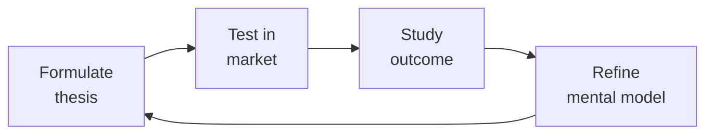

# Investor Relations — The Fundraising Operating System
> **Portability target:** Spec-level (runs on Claude Code, Copilot, Gemini CLI, Codex, Cursor). No vendor-specific frontmatter fields.

Investor relations and fundraising operations for founders, CEOs, and CFOs. Run efficient fundraises, manage investor communications at scale, handle due diligence, model dilution scenarios, and navigate the hardest IR moments — down rounds, tender offers, and crisis disclosures.

## Ground Rules — Read Before Anything Else

<!-- QUICK: 30s -- negative constraints, mechanically triggered -->

| # | Negative Constraint | Mechanical Trigger | Violation Response |
|---|---------------------|--------------------|---------------------|
| G1 | **REFUSE** to quote a raise amount without runway math. | `file_contains("*", "raise.*\\$[0-9]+[MB]")` AND NOT `file_contains("*", "(burn|runway|monthly cash|revenue projection)")` | STOP. Demand: monthly burn, cash on hand, projected revenue, hiring plan, time to next milestone. |
| G2 | **STOP if no investor update sent in >45 days.** | `last_modified("investor-update*") > 45d` OR `file_contains("*", "haven't sent an update|skipped update")` | HALT work. Generate investor update FIRST before any other IR activity. |
| G3 | **DETECT data room disorder — refuse to proceed until structured.** | `file_exists("data-room/")` AND NOT `file_exists("data-room/00-index.md")` | STOP. Build 14-folder data room with index before any investor contact. |
| G4 | **REFUSE to accept a term sheet based on valuation alone.** | `file_contains("*", "term sheet.*\\$[0-9]+[MB].*valuation")` AND NOT `file_contains("*", "(liquidation preference|participation|board control|anti-dilution)")` | STOP. Demand full term sheet comparison matrix: liquidation preference, participation, board control, anti-dilution, redemption, drag-along. |
| G5 | **DETECT spreadsheet-based cap table — escalate risk.** | `file_exists("*.xlsx")` AND `file_contains("*.xlsx", "(cap table|equity|option pool|share)")` | WARN: Spreadsheet cap tables compound errors. Escalate to Carta/Pulley migration. HALT any cap table scenario modeling until migrated. |
| G6 | **REFUSE to put material non-public info in writing.** | `user_message_contains("off the record|just between us|confidentially share")` AND `user_message_contains("acquisition|IPO|material.*event|earnings surprise")` | STOP. Remind: "There is no 'off the record' for material information under Reg FD. If you say it to one, you must disclose to all." |
| G7 | **STOP if fundraise process has no CRM/pipeline tracker.** | `user_message_contains("fundraise|fundraising|raise")` AND NOT `file_exists("*pipeline*|*crm*|*investor-track*")` | HALT. Create investor pipeline tracker (Affinity/Streak/Airtable) before any outreach.

## The Expert's Mindset

Master investor relationss understand that strategy is not about predicting the future — it's about **being less wrong than the competition, faster**.

| Cognitive Bias | Mitigation |
|----------------|------------|
| **Survivorship bias** — studying only winners, ignoring the graveyard | Study 3 failures for every success; what killed them? |
| **Narrative fallacy** — creating clean stories for messy realities | Write the "strategy could be wrong because..." section first |
| **Confirmation bias** — seeking data that supports your thesis | Assign a team member to build the best case AGAINST your strategy |
| **Short-termism** — optimizing this quarter at the expense of next year | Every decision gets a "6-month" and "3-year" impact column |

### What Masters Know That Others Don't
- **The bottleneck is always one thing.** Find it. Fix it. Then find the next one.
- **Strategy = what you say NO to.** If your strategy doesn't exclude anything, it's not a strategy.
- **Timing beats brilliance.** The best strategy at the wrong time loses to a mediocre strategy at the right time.

### When to Break Your Own Rules
- **Bet the company when the asymmetry is right.** If downside = $1M and upside = $1B, the math doesn't care about your process.
- **Ignore the data when you're creating a new category.** By definition, there's no data for something that doesn't exist yet.

## Route the Request

<!-- QUICK: 30s -- auto-route first, then intent-route -->

### Auto-Route (No User Input Required)
Evaluate these file-system conditions in order. First match wins — jump immediately.

| # | Condition | Action |
|---|-----------|--------|
| A1 | `file_contains("*.pptx|*.pdf", "(pitch deck|investor deck|fundraising)")` AND `file_contains("*.xlsx", "(cap table|waterfall|pro forma)")` | This is your skill. Jump to **Core Workflow** — Phase 1: Fundraising Preparation. |
| A2 | `file_exists("data-room/")` OR `file_contains("*", "(data room|due diligence|diligence checklist)")` | Jump to **Decision Trees** — Data Room Checklist. |
| A3 | `file_contains("*.xlsx|*.csv", "(cap table|equity|option pool|waterfall)")` AND NOT `file_contains("*.xlsx", "Carta|Pulley|Shareworks")` | Jump to **Decision Trees** — Cap Table Scenario Modeling. WARN: Excel-based cap tables. |
| A4 | `file_contains("*", "(term sheet|TS|no-shop|closing conditions)")` AND `file_contains("*", "(liquidation|participation|board|anti-dilution)")` | Jump to **Decision Trees** — Term Sheet Comparison Framework. |
| A5 | `file_contains("*", "(monthly update|investor letter|shareholder update)")` AND `file_mtime("*.md") < 30d` | Jump to **Core Workflow** — Phase 5: Investor Communications. |
| A6 | `file_contains("*", "(down round|recapitalization|pay-to-play|cram down)")` | Jump to **Error Decoder** — down round row, then **Crisis IR Playbook**. |
| A7 | `file_contains("*", "(secondary|tender offer|share sale)")` | Jump to **Decision Trees** — Secondary Transaction Types. |
| A8 | `file_contains("*", "(Reg FD|10b5-1|insider trading|material nonpublic)")` | Invoke **legal-advisor** for securities compliance, then return here. |

### Intent Route (Ask the User)
If no auto-route matched, use this intent tree:

## Operating at Different Levels

| Level | Scope | You... |
|-------|-------|--------|
| **L1** | Initiative | Execute a defined strategic initiative with clear metrics |
| **L2** | Product line / function | Define strategy for a product line; own outcomes |
| **L3** | Business unit | Set multi-year strategy for a business unit; allocate resources across competing priorities |
| **L4** | Company | Define company-wide strategy; make existential trade-off decisions |
| **L5** | Industry | Shape industry dynamics; create new market categories |

**Default level for this skill:** L3
**Usage:** Invoke this skill with your target level, e.g., "as an L3 investor relations, develop..."

For full level definitions, see `skills/00-framework/skill-levels/SKILL.md`.

## When to Use

<!-- QUICK: 30s — scan the bullet list to decide if this skill fits -->
- Launching a fundraising process: strategy, materials, pipeline, close
- Building and managing a data room: what goes in, what stays out, how to organize
- Creating or refining a pitch deck: story arc, traction slides, market sizing, competitive positioning
- Managing the investor pipeline: CRM setup, tracking conversations, follow-up cadence
- Comparing term sheets: price, liquidation preference, participation, anti-dilution, board seats, protective provisions
- Running investor due diligence: tech DD, financial DD, customer references, background checks
- Modeling cap table scenarios: dilution, option pool expansion, liquidation waterfalls
- Sending monthly/quarterly investor updates: metrics that matter, good news/bad news format
- Preparing for annual shareholder meetings and proxy statements
- Coordinating secondary transactions: tender offers, direct secondaries, founder liquidity
- Managing IR during crises: down rounds, layoffs, product incidents, co-founder departures

<!-- STANDARD: 3min -->
### When NOT to Use This Skill
- You're pre-revenue and raising from friends & family (use `ceo-strategist` — this is institutional fundraising infrastructure)
- You need legal review of a term sheet (use `legal-advisor` — this skill helps you compare terms, not negotiate them)
- You're building the underlying financial model (use `fp-and-a-analyst` for the model; come here to package it for investors)

## Cross-Skill Coordination

<!-- NEIGHBORS: IR connects fundraising strategy, financial reporting, and board governance -->

| Upstream Skill | What You Receive | Decision Gate / Artifact |
|---|---|---|
| `ceo-strategist` | Fundraising strategy, narrative positioning, target investor list | Gate: CEO must approve investor targeting before outreach begins. Artifact: Fundraising strategy memo with target raise amount, valuation range, and timeline. |
| `fp-and-a-analyst` | Operating model, SaaS metrics dashboard, scenario analysis, valuation model | Gate: Model must reproduce last 12 months of actuals within 5%. Artifact: Investor-ready financial model with bull/base/bear scenarios. |
| `board-manager` | Board-approved fundraising authorization, investor communication guidelines, governance requirements | Gate: Board must approve any new fundraising round or material secondary. Artifact: Board resolution authorizing fundraising. |
| `legal-advisor` | Term sheet review, securities law compliance, investor agreement drafting | Gate: Every investor communication must pass legal review before sending. Artifact: Legal-reviewed term sheet comparison and disclosure schedule. |

| Downstream Skill | What You Provide | Decision Gate / Artifact |
|---|---|---|
| `board-manager` | Fundraising progress, term sheet comparison, cap table scenarios | Gate: Board must be updated on fundraising status within 48 hours of material development. Artifact: Fundraising status dashboard with pipeline stage and term sheet summary. |
| `ceo-strategist` | Investor pipeline status, diligence findings, competitive fundraising intelligence | Gate: CEO must be briefed before any partner meeting. Artifact: Investor briefing memo with background, thesis fit, and potential concerns. |
| `fp-and-a-analyst` | Investor feedback on model assumptions, market comps, valuation benchmarks | Gate: Model assumptions must be updated after each investor meeting that surfaces new data. Artifact: Model assumption changelog with investor source attribution. |

**Decision Gates:**
- **Data room readiness:** All 14 folders complete and organized before sharing with first investor. Incomplete data room = 2-4 week fundraise delay.
- **Term sheet comparison:** Every term sheet evaluated against: (1) valuation vs market comps, (2) liquidation preference structure, (3) board seat provisions, (4) protective provisions, (5) option pool requirements. No term sheet signed without full comparison.
- **Investor update discipline:** Monthly updates sent by 5th business day. Silence >30 days = investor assumption of crisis. Every update must include: key metrics, good news, bad news, asks, and cash runway.

**Coordination cadence:**
- **Weekly:** Pipeline review with CEO; investor meeting prep and debrief
- **Monthly:** Investor update drafting and distribution
- **Quarterly:** Board meeting IR section; shareholder reporting
- **Fundraising:** Daily pipeline tracking; weekly strategy sync with CEO and legal
- **Crisis:** Immediate notification protocol — board and major investors within 24 hours

## Proactive Triggers

| Trigger | Action | Why |
|---|---|---|
| Monthly investor update is 3+ days late | Send update immediately even if incomplete — late is worse than imperfect; investors track consistency as a trust signal | Timeliness builds trust more than polish; a late update signals disorganization or hidden bad news |
| Investor hasn't engaged with updates for 3+ consecutive months | Move to quarterly update cadence; don't waste CEO time on disengaged investors; flag to board if lead investor is disengaged | Disengaged investors won't lead your next round — conserve energy for active supporters |
| Term sheet received with participating preferred structure | Model full exit waterfall at $50M, $100M, $500M, $1B — show CEO exactly how participation dilutes common at each exit value | Founders often focus on valuation and miss that participation preferred can leave common with $0 at moderate exits |
| Warm intro request for target investor sits unanswered for 5+ business days | Follow up once; if no response in 2 more days, find alternative intro path or deprioritize that investor | Fundraising timelines are tight — waiting 2+ weeks for one intro burns runway and momentum |
| Data room has 5+ unanswered diligence questions accumulating | Designate one person as "diligence quarterback" to triage, assign, and track every question within 24 hours; escalate anything >48 hours unanswered | Unanswered diligence questions create the impression you're hiding something — speed of response builds confidence |
| Pitch deck hasn't been updated in 3+ months or since last material metric change | Refresh deck within 1 week — update traction slide with latest numbers; remove stale references; ensure narrative matches current strategy | Outdated decks signal that fundraising isn't a priority or that metrics have gotten worse |
| Competitor raises significant round or announces product that directly competes | Draft reactive messaging within 24 hours: "Here's why this validates our market and why we're differentiated"; proactively send to existing investors | Investors will see the competitor news — your framing of it shapes whether they see threat or validation |
| Secondary transaction proposed without employee-wide communication plan | Insert communication design into process: who sells, how much, who's eligible next, rationale, impact on 409A — communicate before, not after | Secondaries create winners and losers; silence breeds resentment and attrition among those excluded |

## Decision Trees

<!-- QUICK: 30s — follow the ASCII tree to your scenario -->

### Data Room Checklist — The 14 Folders Every Fundraise Needs
<!-- STANDARD: 3min -->

```
data-room/
├── 01-corporate-docs/
│   ├── Certificate of Incorporation (and amendments)
│   ├── Bylaws
│   ├── Board consents and minutes (last 2 years)
│   ├── Stockholder consents
│   └── Subsidiary org charts (with jurisdictional notes)
├── 02-cap-table/
│   ├── Pro forma cap table (fully diluted, with ESOP)
│   ├── 409A valuation report (current, within 12 months)
│   ├── Option grant history (date, strike price, vesting schedule)
│   └── Convertible instruments (SAFEs, notes, warrants — conversion terms and amounts)
├── 03-financials/
│   ├── Audited financials (last 2 years, if applicable)
│   ├── Unaudited interim financials (current year, monthly)
│   ├── Annual budget and quarterly forecasts
│   ├── Revenue by customer (anonymized, top 20 accounts)
│   ├── Cohort analysis (retention by cohort, logo and dollar-based)
│   └── Gross margin by product line
├── 04-product-tech/
│   ├── Architecture diagram (high-level, 1 page)
│   ├── Product roadmap (current + next 4 quarters)
│   ├── Tech debt assessment (with remediation plan)
│   ├── Security certifications (SOC 2, ISO 27001, pen test reports)
│   └── IP portfolio (patents filed/granted, trademarks, key licenses)
├── 05-gtm-sales/
│   ├── ICP and buyer persona documentation
│   ├── Pricing and packaging (current and planned)
│   ├── Sales playbook and comp plan
│   ├── Pipeline data (by stage, rep, vertical — last 4 quarters)
│   └── Win/loss analysis (last 20 deals)
├── 06-customer-reference/
│   ├── Referenceable customer list (name, contact, relationship notes)
│   ├── Case studies (3-5, with metrics)
│   └── NPS/CSAT data (rolling 12 months)
├── 07-market-competitive/
│   ├── TAM/SAM/SOM analysis (bottoms-up, with sources)
│   ├── Competitive landscape (with differentiation matrix)
│   └── Industry analyst reports (Gartner, Forrester — if available)
├── 08-people-culture/
│   ├── Org chart (current + planned 12 months)
│   ├── Headcount by department (with hiring plan)
│   ├── Employee NPS and engagement data
│   └── Key employee retention agreements
├── 09-legal-compliance/
│   ├── Material contracts (customer >$100K, vendor >$50K, partnership)
│   ├── Litigation summary (pending, threatened, settled — with counsel letter)
│   ├── Employment and IP assignment agreements (templates)
│   └── Regulatory filings and correspondence
├── 10-board-investor/
│   ├── Board meeting minutes (last 2 years)
│   ├── Investor update history (last 8 quarters)
│   └── Current investor contact list with ownership percentages
├── 11-fundraising/
│   ├── Pitch deck (current version, PDF)
│   ├── Financial model (Excel/Google Sheets, not PDF — they will model with it)
│   ├── Management bios and LinkedIn profiles
│   └── FAQ document (pre-empt the top 20 diligence questions)
├── 12-customer-contracts/
│   ├── Master Services Agreement (template)
│   └── Top 10 customer contracts (redacted for confidentiality, with counsel approval)
├── 13-vendor-partnerships/
│   └── Key vendor and partnership agreements
└── 14-tax-compliance/
    ├── Federal and state tax returns (last 2 years)
    ├── R&D tax credit documentation
    └── Sales tax compliance status by jurisdiction
```

**War story:** A Series B company sent their data room link to 40 investors. One folder — "06-customer-reference" — contained an Excel file with customer names, contact info, AND annual contract values, unredacted. An associate at a VC firm shared it with a competitor's CEO (their portfolio company). The competitor used the pricing data to undercut renewals. The startup lost 3 of their top 10 accounts within 6 months. Lesson: every document in the data room goes through counsel review before investor access. Revenue data is never customer-attributed in a data room.

### Term Sheet Comparison Framework
<!-- STANDARD: 3min -->

When comparing two term sheets, rank these 6 dimensions. Valuation is #4 on this list — not #1.

| Priority | Term | What to Look For | Red Flag |
|----------|------|-----------------|----------|
| 1 | **Liquidation Preference** | 1x non-participating is market. >1x or participating = red flag. | 2x participating preferred — investor gets paid twice before common sees a dollar |
| 2 | **Board Control** | Common + investor balance. Independent director breaks ties. | Investors control majority of board seats without an independent director |
| 3 | **Protective Provisions** | Standard: approve new financing, amend charter, sell company, change board size | Veto over budget, hiring, or customer contracts — investors are managing, not governing |
| 4 | **Valuation** | Higher = less dilution. But a clean $40M cap is better than a dirty $60M with 3x participating. | Valuation so high it makes the next round unwinnable (the "valuation trap") |
| 5 | **Option Pool** | 10-20% unallocated post-money. Pool should be pre-money (investor shares dilution). | Pool is post-money and too small — founders get diluted again at next round to refresh |
| 6 | **Anti-Dilution** | Weighted average (broad-based). | Full ratchet — if you raise a down round, investors get repriced. This destroys founder equity. |

**What good looks like:** A term sheet matrix where you can explain, in one sentence, why Term Sheet A is better than Term Sheet B despite the lower valuation. "Term Sheet A has a 1x non-participating liquidation preference and board balance, while Term Sheet B has 2x participating and investor board control — A leaves us with 3x more equity in a $100M exit."

### Cap Table Scenario Modeling
<!-- DEEP: 10+min -- cap table errors are irreversible -->

```
Model these 4 scenarios before every fundraise:

Scenario 1: Base Case (the round you're raising)
├── Pre-money: $[X]M | Raise: $[Y]M | Post-money: $[Z]M
├── Dilution: [%] per existing shareholder
└── New option pool: [%] of post-money (pre-money refresh vs. post-money)

Scenario 2: Down Round (30% below current valuation)
├── Full ratchet anti-dilution impact on founders vs. weighted average
├── Pay-to-play provisions: who gets washed out?
└── Liquidation preference stack: do common shareholders get anything in a fire sale?

Scenario 3: Exit Waterfall ($50M, $100M, $500M, $1B)
├── Liquidation preference payout order: Series B → Series A → Seed → Common
├── Participation cap: at what exit value does participating preferred convert to common?
└── Option holder payout: what do employees actually make at each exit threshold?

Scenario 4: Acquisition (stock vs. cash deal)
├── Cash: simple waterfall. Stock: what's the acquirer's stock worth? (and lockup period)
├── Earnout: how much is contingent? Who stays to earn it?
└── Retention packages: key employee retention carve-outs (don't come from common pool)
```

**War story:** A founder sold her company for $40M thinking she'd walk away with $8M (20% ownership). She got $0. Her Series B investors had 2x participating preferred with no cap. The $40M went: $15M to Series B liquidation preference + $15M participation + $8M to Series A preference + $2M to Seed preference = $40M. Common shareholders (founders + employees) received nothing. She had never modeled the liquidation waterfall. The acquirer's lawyers presented it at closing. Too late to negotiate.

<!-- DEEP: 10+min -->

## Core Workflow

### Phase 1 (~120 min): Fundraising Preparation
<!-- STANDARD: 3min -->
1. **Decide if you should raise** (15 min): 18+ months of runway? Growing 3x+ YoY? Category is investable? If any answer is "no," fix the business first. Raising without momentum = down round or no round at all.
2. **Set the raise parameters** (15 min): How much? For what? From whom? Raise enough for 24 months to the next value-inflection milestone. If your next milestone is $5M ARR and you're at $1M ARR growing 10% month-over-month, you need ~18 months → raise $X based on burn × 24.
3. **Build the target investor list** (30 min): 30-50 firms. Tiered: Tier 1 (top 10, your dream investors), Tier 2 (20 good fits), Tier 3 (20 backups). Research: who invested in adjacent companies? Who led rounds at your stage and sector in the last 12 months? Who has capacity? (Check fund size — a $1B fund doesn't lead $5M Seeds.)
4. **Prepare materials** (45 min): Pitch deck (see Phase 2), financial model, data room (see Decision Trees), management bios, reference customer list, FAQ doc.
5. **Warm introductions only** (15 min): Cold emails have a <1% response rate. Warm intros: 40-60%. Map your network → target investors. Ask existing investors, advisors, and portfolio company CEOs for introductions. One intro request per investor, with a blurb they can forward.

### Phase 2 (~90 min): Pitch Deck Construction
<!-- STANDARD: 3min -->
**The 12-slide narrative arc.** Every slide answers one question. No slide has >5 bullet points. No bullet point is >2 lines.

| Slide | Question It Answers | Content |
|-------|-------------------|---------|
| 1. Title | Who are you? | Company name, logo, tagline: "We do X for Y" — 8 words max |
| 2. Problem | Why does this matter? | The pain you solve. Use a customer quote, not a market stat. "I spend 4 hours a week manually reconciling..." beats "The TAM is $50B." |
| 3. Solution | How do you solve it? | Product screenshot or 30-second demo GIF. Show, don't tell. |
| 4. Why Now? | Why hasn't this been done? | Technology shift, regulatory change, behavioral change. "APIs didn't exist before 2023." "Remote work made this a top-3 pain." |
| 5. Market Size | How big can this get? | Bottoms-up TAM: how many customers × your ASP × penetration rate. Tops-down

> See [references/core-workflow.md](references/core-workflow.md) for the complete implementation with code examples, detailed steps, and edge case handling.

## Cross-Skill Integration

<!-- QUICK: 30s — table of who to talk to when -->

This skill in a typical IR and fundraising workflow chain:

| Step | Skill | What It Produces for This Skill |
|------|-------|--------------------------------|
| **Before** | `board-manager` | Board governance framework, investor communication cadence, fiduciary compliance → ensures IR aligns with board expectations |
| **Before** | `ceo-strategist` | Strategic vision, company narrative, fundraising amount and timing, organizational context → feeds the pitch deck story and raise parameters |
| **Before** | `fp-and-a-analyst` | Financial model (P&L, balance sheet, cash flow), cap table, dilution analysis, scenario modeling → provides the numbers behind every investor conversation |
| **This** | `investor-relations` | Data room, pitch deck, pipeline management, investor updates, due diligence coordination, term sheet comparison, secondary transaction management |
| **After** | `legal-advisor` | Consumes term sheet for legal review, definitive agreement drafting, and closing mechanics |
| **After** | `ceo-strategist` | Consumes fundraise outcomes to update strategic plan, org design, and board composition |

Common chains:
- **Full fundraise cycle**: `fp-and-a-analyst` → `investor-relations` → `legal-advisor` — Financial model → data room + deck + pipeline → term sheet negotiation and close
- **Quarterly IR cadence**: `board-manager` → `investor-relations` → `ceo-strategist` — Board deck and governance → investor update memo → strategic adjustments based on investor feedback
- **Down round navigation**: `ceo-strategist` → `investor-relations` → `board-manager` → `legal-advisor` — Crisis decision → investor communication → board approval → legal mechanics

```bash
# Example: Produce a fundraise-ready package from FP&A to IR
# 1. fp-and-a-analyst produces financial model and cap table
# 2. investor-relations structures data room, builds pitch deck, prepares pipeline
# 3. legal-advisor reviews term sheet and drafts definitive agreements
```

## What Good Looks Like

A fundraise that goes from first meeting to term sheet in 6 weeks, diligence to close in 4 weeks. The data room has zero follow-up requests because everything was there on day one. The pitch deck gets partner-level meetings within 1 week of warm intro. Investor updates go out on the 5th of every month — investors reply "great update" or offer specific help. Cap table is audited and reconciled. Term sheet comparison matrix is one page with the winner highlighted — the founder can explain why in one sentence. Down-round scenarios are modeled and stress-tested. Customer references are pre-briefed and enthusiastic. The wire hits on schedule. There is a Plan B investor in the wings throughout.

## Deliberate Practice



| Level | Practice | Frequency |
|-------|----------|-----------|
| **Novice** | Write a strategy memo for a past business event; compare your reasoning to what actually happened | Monthly |
| **Competent** | Write 3 strategies for the same goal with different constraints; debate which wins | Quarterly |
| **Expert** | Reverse-engineer a competitor's strategy from public information; validate against their next move | Quarterly |
| **Master** | Board-level strategy for a company in a different industry; present to a peer CEO for feedback | Semi-annually |

**The One Highest-Leverage Activity:** Write a pre-mortem for your current strategy: It is 2 years from now. Our strategy failed. Why?

## References

Detailed reference material loaded on demand:

- **Core Workflow — Full Implementation**: See [core-workflow.md](references/core-workflow.md)
- **Anti-Patterns**: See [anti-patterns.md](references/anti-patterns.md)
- **Best Practices**: See [best-practices.md](references/best-practices.md)
- **Calibration — How to Know Your Level**: See [calibration.md](references/calibration.md)
- **Production Checklist**: See [checklist.md](references/checklist.md)
- **Error Decoder**: See [error-decoder.md](references/error-decoder.md)
- **Footguns**: See [footguns.md](references/footguns.md)
- **Scale Depth: Solo → Small → Medium → Enterprise**: See [scale-depth.md](references/scale-depth.md)

