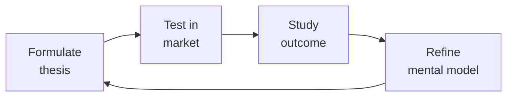

# Investor Relations — The Fundraising Operating System

> **Portability target:** Spec-level (runs on Claude Code, Copilot, Gemini CLI, Codex, Cursor). No vendor-specific frontmatter fields.

Investor relations and fundraising operations for founders, CEOs, and CFOs. Run efficient fundraises, manage investor communications at scale, handle due diligence, model dilution scenarios, and navigate the hardest IR moments — down rounds, tender offers, and crisis disclosures.

## Ground Rules — Read Before Anything Else
<!-- QUICK: 30s -- negative constraints, mechanically triggered -->

| # | Negative Constraint | Mechanical Trigger | Violation Response |
|---|---------------------|--------------------|---------------------|
| G1 | **REFUSE** to quote a raise amount without runway math. | `file_contains("*", "raise.*\\$[0-9]+[MB]")` AND NOT `file_contains("*", "(burn|runway|monthly cash|revenue projection)")` | STOP. Demand: monthly burn, cash on hand, projected revenue, hiring plan, time to next milestone. |
| G2 | **STOP if no investor update sent in >45 days.** | `last_modified("investor-update*") > 45d` OR `file_contains("*", "haven't sent an update|skipped update")` | HALT work. Generate investor update FIRST before any other IR activity. |
| G3 | **DETECT data room disorder — refuse to proceed until structured.** | `file_exists("data-room/")` AND NOT `file_exists("data-room/00-index.md")` | STOP. Build 14-folder data room with index before any investor contact. |
| G4 | **REFUSE to accept a term sheet based on valuation alone.** | `file_contains("*", "term sheet.*\\$[0-9]+[MB].*valuation")` AND NOT `file_contains("*", "(liquidation preference|participation|board control|anti-dilution)")` | STOP. Demand full term sheet comparison matrix: liquidation preference, participation, board control, anti-dilution, redemption, drag-along. |
| G5 | **DETECT spreadsheet-based cap table — escalate risk.** | `file_exists("*.xlsx")` AND `file_contains("*.xlsx", "(cap table|equity|option pool|share)")` | WARN: Spreadsheet cap tables compound errors. Escalate to Carta/Pulley migration. HALT any cap table scenario modeling until migrated. |
| G6 | **REFUSE to put material non-public info in writing.** | `user_message_contains("off the record|just between us|confidentially share")` AND `user_message_contains("acquisition|IPO|material.*event|earnings surprise")` | STOP. Remind: "There is no 'off the record' for material information under Reg FD. If you say it to one, you must disclose to all." |
| G7 | **STOP if fundraise process has no CRM/pipeline tracker.** | `user_message_contains("fundraise|fundraising|raise")` AND NOT `file_exists("*pipeline*|*crm*|*investor-track*")` | HALT. Create investor pipeline tracker (Affinity/Streak/Airtable) before any outreach.


## The Expert's Mindset

Master investor relationss understand that strategy is not about predicting the future — it's about **being less wrong than the competition, faster**.

| Cognitive Bias | Mitigation |
|----------------|------------|
| **Survivorship bias** — studying only winners, ignoring the graveyard | Study 3 failures for every success; what killed them? |
| **Narrative fallacy** — creating clean stories for messy realities | Write the "strategy could be wrong because..." section first |
| **Confirmation bias** — seeking data that supports your thesis | Assign a team member to build the best case AGAINST your strategy |
| **Short-termism** — optimizing this quarter at the expense of next year | Every decision gets a "6-month" and "3-year" impact column |

### What Masters Know That Others Don't
- **The bottleneck is always one thing.** Find it. Fix it. Then find the next one.
- **Strategy = what you say NO to.** If your strategy doesn't exclude anything, it's not a strategy.
- **Timing beats brilliance.** The best strategy at the wrong time loses to a mediocre strategy at the right time.

### When to Break Your Own Rules
- **Bet the company when the asymmetry is right.** If downside = $1M and upside = $1B, the math doesn't care about your process.
- **Ignore the data when you're creating a new category.** By definition, there's no data for something that doesn't exist yet.
## Route the Request
<!-- QUICK: 30s -- auto-route first, then intent-route -->

### Auto-Route (No User Input Required)
Evaluate these file-system conditions in order. First match wins — jump immediately.

| # | Condition | Action |
|---|-----------|--------|
| A1 | `file_contains("*.pptx|*.pdf", "(pitch deck|investor deck|fundraising)")` AND `file_contains("*.xlsx", "(cap table|waterfall|pro forma)")` | This is your skill. Jump to **Core Workflow** — Phase 1: Fundraising Preparation. |
| A2 | `file_exists("data-room/")` OR `file_contains("*", "(data room|due diligence|diligence checklist)")` | Jump to **Decision Trees** — Data Room Checklist. |
| A3 | `file_contains("*.xlsx|*.csv", "(cap table|equity|option pool|waterfall)")` AND NOT `file_contains("*.xlsx", "Carta|Pulley|Shareworks")` | Jump to **Decision Trees** — Cap Table Scenario Modeling. WARN: Excel-based cap tables. |
| A4 | `file_contains("*", "(term sheet|TS|no-shop|closing conditions)")` AND `file_contains("*", "(liquidation|participation|board|anti-dilution)")` | Jump to **Decision Trees** — Term Sheet Comparison Framework. |
| A5 | `file_contains("*", "(monthly update|investor letter|shareholder update)")` AND `file_mtime("*.md") < 30d` | Jump to **Core Workflow** — Phase 5: Investor Communications. |
| A6 | `file_contains("*", "(down round|recapitalization|pay-to-play|cram down)")` | Jump to **Error Decoder** — down round row, then **Crisis IR Playbook**. |
| A7 | `file_contains("*", "(secondary|tender offer|share sale)")` | Jump to **Decision Trees** — Secondary Transaction Types. |
| A8 | `file_contains("*", "(Reg FD|10b5-1|insider trading|material nonpublic)")` | Invoke **legal-advisor** for securities compliance, then return here. |

### Intent Route (Ask the User)
If no auto-route matched, use this intent tree:

## Operating at Different Levels

| Level | Scope | You... |
|-------|-------|--------|
| **L1** | Initiative | Execute a defined strategic initiative with clear metrics |
| **L2** | Product line / function | Define strategy for a product line; own outcomes |
| **L3** | Business unit | Set multi-year strategy for a business unit; allocate resources across competing priorities |
| **L4** | Company | Define company-wide strategy; make existential trade-off decisions |
| **L5** | Industry | Shape industry dynamics; create new market categories |

**Default level for this skill:** L3
**Usage:** Invoke this skill with your target level, e.g., "as an L3 investor relations, develop..."

For full level definitions, see `skills/00-framework/skill-levels/SKILL.md`.

## When to Use
<!-- QUICK: 30s — scan the bullet list to decide if this skill fits -->
- Launching a fundraising process: strategy, materials, pipeline, close
- Building and managing a data room: what goes in, what stays out, how to organize
- Creating or refining a pitch deck: story arc, traction slides, market sizing, competitive positioning
- Managing the investor pipeline: CRM setup, tracking conversations, follow-up cadence
- Comparing term sheets: price, liquidation preference, participation, anti-dilution, board seats, protective provisions
- Running investor due diligence: tech DD, financial DD, customer references, background checks
- Modeling cap table scenarios: dilution, option pool expansion, liquidation waterfalls
- Sending monthly/quarterly investor updates: metrics that matter, good news/bad news format
- Preparing for annual shareholder meetings and proxy statements
- Coordinating secondary transactions: tender offers, direct secondaries, founder liquidity
- Managing IR during crises: down rounds, layoffs, product incidents, co-founder departures

<!-- STANDARD: 3min -->
### When NOT to Use This Skill
- You're pre-revenue and raising from friends & family (use `ceo-strategist` — this is institutional fundraising infrastructure)
- You need legal review of a term sheet (use `legal-advisor` — this skill helps you compare terms, not negotiate them)
- You're building the underlying financial model (use `fp-and-a-analyst` for the model; come here to package it for investors)

## Cross-Skill Coordination

<!-- NEIGHBORS: IR connects fundraising strategy, financial reporting, and board governance -->

| Upstream Skill | What You Receive | Decision Gate / Artifact |
|---|---|---|
| `ceo-strategist` | Fundraising strategy, narrative positioning, target investor list | Gate: CEO must approve investor targeting before outreach begins. Artifact: Fundraising strategy memo with target raise amount, valuation range, and timeline. |
| `fp-and-a-analyst` | Operating model, SaaS metrics dashboard, scenario analysis, valuation model | Gate: Model must reproduce last 12 months of actuals within 5%. Artifact: Investor-ready financial model with bull/base/bear scenarios. |
| `board-manager` | Board-approved fundraising authorization, investor communication guidelines, governance requirements | Gate: Board must approve any new fundraising round or material secondary. Artifact: Board resolution authorizing fundraising. |
| `legal-advisor` | Term sheet review, securities law compliance, investor agreement drafting | Gate: Every investor communication must pass legal review before sending. Artifact: Legal-reviewed term sheet comparison and disclosure schedule. |

| Downstream Skill | What You Provide | Decision Gate / Artifact |
|---|---|---|
| `board-manager` | Fundraising progress, term sheet comparison, cap table scenarios | Gate: Board must be updated on fundraising status within 48 hours of material development. Artifact: Fundraising status dashboard with pipeline stage and term sheet summary. |
| `ceo-strategist` | Investor pipeline status, diligence findings, competitive fundraising intelligence | Gate: CEO must be briefed before any partner meeting. Artifact: Investor briefing memo with background, thesis fit, and potential concerns. |
| `fp-and-a-analyst` | Investor feedback on model assumptions, market comps, valuation benchmarks | Gate: Model assumptions must be updated after each investor meeting that surfaces new data. Artifact: Model assumption changelog with investor source attribution. |

**Decision Gates:**
- **Data room readiness:** All 14 folders complete and organized before sharing with first investor. Incomplete data room = 2-4 week fundraise delay.
- **Term sheet comparison:** Every term sheet evaluated against: (1) valuation vs market comps, (2) liquidation preference structure, (3) board seat provisions, (4) protective provisions, (5) option pool requirements. No term sheet signed without full comparison.
- **Investor update discipline:** Monthly updates sent by 5th business day. Silence >30 days = investor assumption of crisis. Every update must include: key metrics, good news, bad news, asks, and cash runway.

**Coordination cadence:**
- **Weekly:** Pipeline review with CEO; investor meeting prep and debrief
- **Monthly:** Investor update drafting and distribution
- **Quarterly:** Board meeting IR section; shareholder reporting
- **Fundraising:** Daily pipeline tracking; weekly strategy sync with CEO and legal
- **Crisis:** Immediate notification protocol — board and major investors within 24 hours

## Proactive Triggers

| Trigger | Action | Why |
|---|---|---|
| Monthly investor update is 3+ days late | Send update immediately even if incomplete — late is worse than imperfect; investors track consistency as a trust signal | Timeliness builds trust more than polish; a late update signals disorganization or hidden bad news |
| Investor hasn't engaged with updates for 3+ consecutive months | Move to quarterly update cadence; don't waste CEO time on disengaged investors; flag to board if lead investor is disengaged | Disengaged investors won't lead your next round — conserve energy for active supporters |
| Term sheet received with participating preferred structure | Model full exit waterfall at $50M, $100M, $500M, $1B — show CEO exactly how participation dilutes common at each exit value | Founders often focus on valuation and miss that participation preferred can leave common with $0 at moderate exits |
| Warm intro request for target investor sits unanswered for 5+ business days | Follow up once; if no response in 2 more days, find alternative intro path or deprioritize that investor | Fundraising timelines are tight — waiting 2+ weeks for one intro burns runway and momentum |
| Data room has 5+ unanswered diligence questions accumulating | Designate one person as "diligence quarterback" to triage, assign, and track every question within 24 hours; escalate anything >48 hours unanswered | Unanswered diligence questions create the impression you're hiding something — speed of response builds confidence |
| Pitch deck hasn't been updated in 3+ months or since last material metric change | Refresh deck within 1 week — update traction slide with latest numbers; remove stale references; ensure narrative matches current strategy | Outdated decks signal that fundraising isn't a priority or that metrics have gotten worse |
| Competitor raises significant round or announces product that directly competes | Draft reactive messaging within 24 hours: "Here's why this validates our market and why we're differentiated"; proactively send to existing investors | Investors will see the competitor news — your framing of it shapes whether they see threat or validation |
| Secondary transaction proposed without employee-wide communication plan | Insert communication design into process: who sells, how much, who's eligible next, rationale, impact on 409A — communicate before, not after | Secondaries create winners and losers; silence breeds resentment and attrition among those excluded |

## Decision Trees
<!-- QUICK: 30s — follow the ASCII tree to your scenario -->

### Data Room Checklist — The 14 Folders Every Fundraise Needs
<!-- STANDARD: 3min -->

```
data-room/
├── 01-corporate-docs/
│   ├── Certificate of Incorporation (and amendments)
│   ├── Bylaws
│   ├── Board consents and minutes (last 2 years)
│   ├── Stockholder consents
│   └── Subsidiary org charts (with jurisdictional notes)
├── 02-cap-table/
│   ├── Pro forma cap table (fully diluted, with ESOP)
│   ├── 409A valuation report (current, within 12 months)
│   ├── Option grant history (date, strike price, vesting schedule)
│   └── Convertible instruments (SAFEs, notes, warrants — conversion terms and amounts)
├── 03-financials/
│   ├── Audited financials (last 2 years, if applicable)
│   ├── Unaudited interim financials (current year, monthly)
│   ├── Annual budget and quarterly forecasts
│   ├── Revenue by customer (anonymized, top 20 accounts)
│   ├── Cohort analysis (retention by cohort, logo and dollar-based)
│   └── Gross margin by product line
├── 04-product-tech/
│   ├── Architecture diagram (high-level, 1 page)
│   ├── Product roadmap (current + next 4 quarters)
│   ├── Tech debt assessment (with remediation plan)
│   ├── Security certifications (SOC 2, ISO 27001, pen test reports)
│   └── IP portfolio (patents filed/granted, trademarks, key licenses)
├── 05-gtm-sales/
│   ├── ICP and buyer persona documentation
│   ├── Pricing and packaging (current and planned)
│   ├── Sales playbook and comp plan
│   ├── Pipeline data (by stage, rep, vertical — last 4 quarters)
│   └── Win/loss analysis (last 20 deals)
├── 06-customer-reference/
│   ├── Referenceable customer list (name, contact, relationship notes)
│   ├── Case studies (3-5, with metrics)
│   └── NPS/CSAT data (rolling 12 months)
├── 07-market-competitive/
│   ├── TAM/SAM/SOM analysis (bottoms-up, with sources)
│   ├── Competitive landscape (with differentiation matrix)
│   └── Industry analyst reports (Gartner, Forrester — if available)
├── 08-people-culture/
│   ├── Org chart (current + planned 12 months)
│   ├── Headcount by department (with hiring plan)
│   ├── Employee NPS and engagement data
│   └── Key employee retention agreements
├── 09-legal-compliance/
│   ├── Material contracts (customer >$100K, vendor >$50K, partnership)
│   ├── Litigation summary (pending, threatened, settled — with counsel letter)
│   ├── Employment and IP assignment agreements (templates)
│   └── Regulatory filings and correspondence
├── 10-board-investor/
│   ├── Board meeting minutes (last 2 years)
│   ├── Investor update history (last 8 quarters)
│   └── Current investor contact list with ownership percentages
├── 11-fundraising/
│   ├── Pitch deck (current version, PDF)
│   ├── Financial model (Excel/Google Sheets, not PDF — they will model with it)
│   ├── Management bios and LinkedIn profiles
│   └── FAQ document (pre-empt the top 20 diligence questions)
├── 12-customer-contracts/
│   ├── Master Services Agreement (template)
│   └── Top 10 customer contracts (redacted for confidentiality, with counsel approval)
├── 13-vendor-partnerships/
│   └── Key vendor and partnership agreements
└── 14-tax-compliance/
    ├── Federal and state tax returns (last 2 years)
    ├── R&D tax credit documentation
    └── Sales tax compliance status by jurisdiction
```

**War story:** A Series B company sent their data room link to 40 investors. One folder — "06-customer-reference" — contained an Excel file with customer names, contact info, AND annual contract values, unredacted. An associate at a VC firm shared it with a competitor's CEO (their portfolio company). The competitor used the pricing data to undercut renewals. The startup lost 3 of their top 10 accounts within 6 months. Lesson: every document in the data room goes through counsel review before investor access. Revenue data is never customer-attributed in a data room.

### Term Sheet Comparison Framework
<!-- STANDARD: 3min -->

When comparing two term sheets, rank these 6 dimensions. Valuation is #4 on this list — not #1.

| Priority | Term | What to Look For | Red Flag |
|----------|------|-----------------|----------|
| 1 | **Liquidation Preference** | 1x non-participating is market. >1x or participating = red flag. | 2x participating preferred — investor gets paid twice before common sees a dollar |
| 2 | **Board Control** | Common + investor balance. Independent director breaks ties. | Investors control majority of board seats without an independent director |
| 3 | **Protective Provisions** | Standard: approve new financing, amend charter, sell company, change board size | Veto over budget, hiring, or customer contracts — investors are managing, not governing |
| 4 | **Valuation** | Higher = less dilution. But a clean $40M cap is better than a dirty $60M with 3x participating. | Valuation so high it makes the next round unwinnable (the "valuation trap") |
| 5 | **Option Pool** | 10-20% unallocated post-money. Pool should be pre-money (investor shares dilution). | Pool is post-money and too small — founders get diluted again at next round to refresh |
| 6 | **Anti-Dilution** | Weighted average (broad-based). | Full ratchet — if you raise a down round, investors get repriced. This destroys founder equity. |

**What good looks like:** A term sheet matrix where you can explain, in one sentence, why Term Sheet A is better than Term Sheet B despite the lower valuation. "Term Sheet A has a 1x non-participating liquidation preference and board balance, while Term Sheet B has 2x participating and investor board control — A leaves us with 3x more equity in a $100M exit."

### Cap Table Scenario Modeling
<!-- DEEP: 10+min -- cap table errors are irreversible -->

```
Model these 4 scenarios before every fundraise:

Scenario 1: Base Case (the round you're raising)
├── Pre-money: $[X]M | Raise: $[Y]M | Post-money: $[Z]M
├── Dilution: [%] per existing shareholder
└── New option pool: [%] of post-money (pre-money refresh vs. post-money)

Scenario 2: Down Round (30% below current valuation)
├── Full ratchet anti-dilution impact on founders vs. weighted average
├── Pay-to-play provisions: who gets washed out?
└── Liquidation preference stack: do common shareholders get anything in a fire sale?

Scenario 3: Exit Waterfall ($50M, $100M, $500M, $1B)
├── Liquidation preference payout order: Series B → Series A → Seed → Common
├── Participation cap: at what exit value does participating preferred convert to common?
└── Option holder payout: what do employees actually make at each exit threshold?

Scenario 4: Acquisition (stock vs. cash deal)
├── Cash: simple waterfall. Stock: what's the acquirer's stock worth? (and lockup period)
├── Earnout: how much is contingent? Who stays to earn it?
└── Retention packages: key employee retention carve-outs (don't come from common pool)
```

**War story:** A founder sold her company for $40M thinking she'd walk away with $8M (20% ownership). She got $0. Her Series B investors had 2x participating preferred with no cap. The $40M went: $15M to Series B liquidation preference + $15M participation + $8M to Series A preference + $2M to Seed preference = $40M. Common shareholders (founders + employees) received nothing. She had never modeled the liquidation waterfall. The acquirer's lawyers presented it at closing. Too late to negotiate.

<!-- DEEP: 10+min -->

## Core Workflow

### Phase 1 (~120 min): Fundraising Preparation
<!-- STANDARD: 3min -->
1. **Decide if you should raise** (15 min): 18+ months of runway? Growing 3x+ YoY? Category is investable? If any answer is "no," fix the business first. Raising without momentum = down round or no round at all.
2. **Set the raise parameters** (15 min): How much? For what? From whom? Raise enough for 24 months to the next value-inflection milestone. If your next milestone is $5M ARR and you're at $1M ARR growing 10% month-over-month, you need ~18 months → raise $X based on burn × 24.
3. **Build the target investor list** (30 min): 30-50 firms. Tiered: Tier 1 (top 10, your dream investors), Tier 2 (20 good fits), Tier 3 (20 backups). Research: who invested in adjacent companies? Who led rounds at your stage and sector in the last 12 months? Who has capacity? (Check fund size — a $1B fund doesn't lead $5M Seeds.)
4. **Prepare materials** (45 min): Pitch deck (see Phase 2), financial model, data room (see Decision Trees), management bios, reference customer list, FAQ doc.
5. **Warm introductions only** (15 min): Cold emails have a <1% response rate. Warm intros: 40-60%. Map your network → target investors. Ask existing investors, advisors, and portfolio company CEOs for introductions. One intro request per investor, with a blurb they can forward.

### Phase 2 (~90 min): Pitch Deck Construction
<!-- STANDARD: 3min -->
**The 12-slide narrative arc.** Every slide answers one question. No slide has >5 bullet points. No bullet point is >2 lines.

| Slide | Question It Answers | Content |
|-------|-------------------|---------|
| 1. Title | Who are you? | Company name, logo, tagline: "We do X for Y" — 8 words max |
| 2. Problem | Why does this matter? | The pain you solve. Use a customer quote, not a market stat. "I spend 4 hours a week manually reconciling..." beats "The TAM is $50B." |
| 3. Solution | How do you solve it? | Product screenshot or 30-second demo GIF. Show, don't tell. |
| 4. Why Now? | Why hasn't this been done? | Technology shift, regulatory change, behavioral change. "APIs didn't exist before 2023." "Remote work made this a top-3 pain." |
| 5. Market Size | How big can this get? | Bottoms-up TAM: how many customers × your ASP × penetration rate. Tops-down is backup. Show the beachhead and expansion. |
| 6. Traction | Is this working? | Revenue graph (MRR/ARR, month-by-month for 18+ months). Logo count. Key logos. Retention (logo and dollar-based net retention). |
| 7. Product | What have you built? | Current product, roadmap highlights, key metrics (DAU/MAU, engagement). Not a feature list — show what's defensible. |
| 8. Business Model | How do you make money? | Pricing model, ASP, sales motion (PLG vs. enterprise sales), CAC, LTV, payback period. Unit economics must be on this slide. |
| 9. Competition | Why will you win? | Competitive matrix: you vs. incumbents vs. startups across key dimensions. Your unfair advantage: data, network effects, switching costs, brand. |
| 10. Team | Why you? | Founders' photos, titles, 1-line bio (previous company, relevant achievement). Key hires. Why this team uniquely can solve this problem. |
| 11. Financials | What do the numbers look like? | 3-year revenue projection with assumptions. Headcount plan. Burn rate. Key metrics: gross margin, CAC payback, LTV/CAC. |
| 12. The Ask | What do you need? | "We're raising $X on a $Y pre-money valuation to achieve [milestone]." Use of funds: 50% engineering, 30% GTM, 20% G&A. |

**What good looks like:** A partner at a VC firm forwards your deck to another partner with the note "Take a look at this — interesting team and traction." You know you have it when you get partner-level meetings (not associate screens) within 1 week of intro.

### Phase 3 (~60 min setup + ongoing): Pipeline Management
<!-- STANDARD: 3min -->
1. **Set up investor CRM** (15 min): Use Affinity, Streak (Gmail), or a Notion/Airtable tracker. Fields: firm, contact name, role, intro source, date contacted, meeting date, stage (outreach → meeting 1 → partner meeting → term sheet → diligence → close), notes, next step.
2. **Run the process in batches** (ongoing): Week 1-2: Tier 1 outreach (10 firms). Week 3-4: Tier 1 meetings + Tier 2 outreach. Week 5-6: Partner meetings and term sheet conversations. Never have >15 active conversations at once — you'll lose track.
3. **Follow-up cadence** (ongoing): After meeting 1, send thank-you + any promised materials within 24 hours. If no response in 5 business days, follow up once. If still no response, move to "passive" and focus on active conversations. Silence is a pass.
4. **Signal management** (ongoing): When one Tier 1 investor shows strong interest ("We'd like to meet the full partnership"), use it as leverage: "We're in active conversations with [Firm A] and [Firm B] and expect term sheets in the next 2 weeks. We'd love to include you in the process."
5. **The close** (10 min post-term sheet): Signed term sheet → no-shop period (30-45 days) → legal diligence → definitive agreements → wire transfer. During no-shop: respond to all diligence requests within 24 hours. The #1 cause of blown-up deals: slow diligence response signals disorganization.

### Phase 4 (~90 min): Due Diligence
<!-- STANDARD: 3min -->
1. **Financial DD preparation** (30 min): Unaudited monthly financials for the current year. Customer-level revenue data (anonymized). Cohort retention analysis. Gross margin by product. All material contracts >$50K. Tax returns.
2. **Technical DD preparation** (30 min): Architecture overview (1-pager for non-technical investors). Tech debt register with severity and remediation plan. Security posture (SOC 2 report, penetration test results). IP ownership documentation (all code written by employees/contractors with IP assignment).
3. **Customer reference preparation** (15 min): Identify 5-8 referenceable customers. Pre-brief each: "A potential investor may call. Here's what they'll ask. Here's what we'd love you to emphasize." Never put a customer on a reference call without pre-briefing them.
4. **Background check readiness** (15 min): Every founder will be background checked. Disclose anything that will surface before it surfaces: prior lawsuits, bankruptcies, regulatory actions, academic credential discrepancies. Surprise in background check = deal killer.

**War story:** A founder didn't disclose a prior startup that had failed and been sued by its investors. The VC's background check found the lawsuit (public record). The VC pulled the term sheet — not because of the failure, but because the founder hid it. The failure was defensible. The concealment was not.

### Phase 5 (~30 min/month): Investor Communications
<!-- STANDARD: 3min -->

**Monthly Investor Update Template:**

```
Subject: [Company Name] — [Month Year] Update

TL;DR (3 bullets):
- [Win: e.g., Revenue grew 12% MoM to $[X]K MRR]
- [Win: e.g., Closed [Customer Name], our largest deal at $[Y]K ACV]
- [Concern: e.g., Sales hiring is behind plan — 2 of 3 open roles unfilled]

KPIs:
| Metric | This Month | Last Month | Plan | YoY |
|--------|-----------|------------|------|-----|
| MRR | $[X]K | $[Y]K | $[Z]K | +[%] |
| ARR | $[X]M | $[Y]M | $[Z]M | +[%] |
| Customers | [N] | [N-1] | [P] | +[%] |
| Gross Margin | [X]% | [Y]% | [Z]% | - |
| Net Revenue Retention | [X]% | [Y]% | - | - |
| Burn | $[X]K | $[Y]K | $[Z]K | - |
| Cash in Bank | $[X]M | $[Y]M | - | - |
| Runway (months) | [N] | [N-1] | - | - |
| Headcount | [N] | [N-1] | [P] | - |

Wins (3-5):
- [Specific win with metric]

Challenges (2-3):
- [Specific challenge, what you're doing about it]

Asks (1-3):
- [Specific intro, advice, or resource request]

Thank you to [investor name] for [specific help they provided this month].
```

**What good looks like:** Investors reply "Great update, keep it coming" or offer specific help on your asks. Investors who never reply within 3 months get moved to a "passive" distribution list.

## Best Practices
<!-- STANDARD: 3min — operational principles for IR -->

1. **Fundraise when you don't need the money**: The best time to raise is when you have 12+ months of runway and accelerating growth. The worst time is when you have 3 months of cash. Desperation is a negotiable term — and it always works against you.
2. **Your data room is your resume**: Organized, complete, counsel-reviewed. A messy data room adds 2-4 weeks to diligence and invites deeper scrutiny. Every missing document raises a question: "What are they hiding?"
3. **Pitch the problem, not the product**: Investors buy market insight, not features. "We built a better CRM" gets a pass. "The CRM market hasn't innovated for the 40% of sales teams that are field-based" gets a meeting.
4. **Traction is the only real currency**: Revenue growth rate, net revenue retention, CAC payback, and gross margin. Everything else is narrative. If your metrics are weak, your pitch won't save you.
5. **Term sheet comparison is about structure, not valuation**: A $50M clean cap is worth more than an $80M dirty cap. Liquidation preference, participation, board control, and anti-dilution determine your outcome, not the headline number.
6. **Investor updates: always on time, always honest**: Same day every month. Bad news goes in the subject line ("Challenging month — revenue miss, plan to recover"). Investors fund lines of trust before lines of code. Breach trust once on an update and they'll never trust your projections again.
7. **Never stop fundraising until the wire hits**: Between term sheet and close, 10-15% of deals blow up. Silent period means no active outreach, but maintain warm backup conversations. You need a Plan B investor who's met you 2-3 times and has done preliminary diligence.
8. **Cap table hygiene is a monthly practice**: Reconcile your cap table monthly. Every option grant, every exercise, every transfer. One error discovered during Series B diligence will delay your close by 2-4 weeks and cost $20K+ in legal fees to fix.
9. **Pitch deck design matters**: Good design signals attention to detail. Bad design signals sloppiness. Use one font family. One accent color. No clip art. No memes. Maximum 5 bullet points per slide. If a slide takes >30 seconds to understand, it's too complex.
10. **References make or break your round**: A single bad customer reference kills a deal faster than any diligence finding. Pre-select your references. Pre-brief them. Know what each reference will say. If a reference is lukewarm, they're not a reference — they're a liability.
11. **Secondary transactions require board approval and careful communication**: Tender offers and founder secondaries create winners and losers. Employees who can't sell watch colleagues cash out. Design secondaries so every employee gets at least some liquidity. Communicate the rationale transparently.

## Anti-Patterns
<!-- QUICK: 30s -- machine-detectable anti-patterns with auto-prevention -->

| ❌ Anti-Pattern | ✅ Do This Instead | 🔍 Detect (grep/lint) | 🛡️ Auto-Prevent |
|---|---|---|---|
| Fundraising at 6 months runway with decelerating growth | Start at 12+ months runway while growth is accelerating | `file_contains("*", "runway.*[3-6] months")` AND `file_contains("*", "(declining|slowing|decelerating).*growth")` | STOP. Require 12+ month runway projection before any fundraising advice. |
| Sending generic pitch deck to 50 investors | Customize first 3 slides per investor: why this firm, this partner, now | `grep -rl "\.pptx" \| xargs grep -l "pitch deck"` with no `investor-tailoring.md` | WARN. Generate per-investor tailoring brief before distribution. |
| Accepting term sheet on valuation headline alone | Build full comparison: liq pref, participation, board, anti-dilution | `file_contains("*", "signed.*term sheet")` AND NOT `file_exists("*term-sheet-comparison*")` | STOP. Generate term sheet comparison matrix before signature. |
| Cap table via Excel beyond 10 equity holders | Migrate to Carta/Pulley; reconcile monthly; counsel audit | `file_exists("*.xlsx")` AND `file_contains("*.xlsx", "(option pool|warrant|convertible note)")` AND `wc -l shareholders.csv > 10` | REFUSE cap table operations on Excel. Escalate to Carta/Pulley. |
| Treating all investors equally in comms | Tier: active (weekly), warm (bi-weekly), passive (monthly), disengaged (quarterly) | `file_contains("*", "send.*update.*all.*investors")` AND NOT `file_contains("*", "(tier|segment).*investor")` | WARN. Generate investor tier list and cadence schedule. |
| Data room as unstructured Dropbox folder | 14-folder data room, indexed, counsel-reviewed, Docsend access control | `file_exists("data-room/")` AND NOT `file_exists("data-room/00-index.md")` | STOP. Build structured data room with index before investor access. |
| Disclosing bad news first time during diligence | Pre-disclose material challenges before term sheet | `file_mtime("*.md")` during diligence AND `grep "first time disclos"` in investor comms | STOP. Generate pre-disclosure memo for all material risks. |
| Skipping investor updates "nothing to report" | Send monthly regardless — silence = suspicion | `file_mtime("investor-update*.md") > 60d` | ALERT. Auto-generate "steady progress" investor update. | 

## Error Decoder
<!-- DEEP: 10+min -- IR failures that kill companies -->

| 🖥️ Console Match | Symptom | Root Cause | Fix | 🔄 Auto-Recovery Loop |
|---|---|---|---|---|
| `grep -c "term sheet" investor-log.md` returns 0 after 30 meetings | Fundraise stalled — no term sheets after 30+ meetings | Weak traction, unclear narrative, or wrong investor targeting | Run no-term-sheet post-mortem with 3 friendly investors. Fix weakest link. Re-approach in 3-6 months. | **Loop 1:** (1) Detect: count meetings with no progress > 30. (2) Auto-generate post-mortem questions. (3) Send to 3 friendly investors. (4) Compile feedback into fix plan. (5) Re-check: if < 30 new meetings without TS, repeat. |
| `grep -c "pulled\|withdrawn\|terminated" fundraise/*.md` > 0 | Term sheet pulled during no-shop | Material negative surfaced in diligence that wasn't pre-disclosed | Disclose all bad news before term sheet. Pre-disclosed challenge = negotiated. Surprise = pull. | **Loop 2:** (1) Detect: TS pull event. (2) Auto-generate full pre-disclosure memo. (3) Identify undisclosed items from diligence Q&A. (4) Re-approach investors with corrected disclosures. (5) Verify no new surprises before next TS. |
| `grep "request.*information\|follow.up\|missing" diligence/*.md \| wc -l` > 50 | Data room requests overwhelm team (50+ follow-ups) | No data room structure before fundraise launch | Build data room completely before first investor meeting. Follow the 14-folders checklist. | **Loop 3:** (1) Detect: pending diligence items > 50. (2) Auto-sort requests into 14-folder categories. (3) Generate fulfillment plan with assignees. (4) Add new items to data room index for all future investors. (5) Re-check: pending items < 10. |
| `grep -l "investor.*update" *.md \| xargs grep -c "reply\|response\|acknowledge"` returns 0 for 3+ months | Investor update goes unanswered for 3+ months | Update too long, too vague, or investor disengaged | Keep to 1 page. Lead with numbers. Move disengaged to quarterly. | **Loop 4:** (1) Detect: no investor engagement for 90 days. (2) Auto-trim update to 1-page bullet format. (3) Tag investor as "low-engagement" in pipeline. (4) Downgrade to quarterly updates. (5) Re-check engagement after 2 quarterly cycles. |
| `grep "Excel\|spreadsheet\|\.xlsx" cap-table/*.md` AND manual cap table | Cap table error discovered during Series B diligence | Excel-based cap table with manual updates. No monthly reconciliation. | Migrate to Carta/Pulley. Reconcile monthly. Counsel audit before every fundraise. | **Loop 5:** (1) Detect: spreadsheet-based cap table flagged. (2) Auto-generate migration plan to Carta/Pulley. (3) Export current Excel to migration template. (4) Reconcile first month in new system. (5) Verify: 0 discrepancies after third monthly reconciliation. |
| `grep "down round\|anti-dilution.*full.ratchet\|pay.to.play" *.md` | Down round destroys founder equity | Full ratchet anti-dilution + pay-to-play + option pool refresh crush common | Negotiate weighted-average anti-dilution. Model scenarios upfront. Negotiate recap or refresher grants. | **Loop 6:** (1) Detect: down round terms detected. (2) Auto-model 4 recap scenarios. (3) Generate weighted-average proposal. (4) Calculate founder refresher grant needs. (5) Verify: founder ownership post-round > dilution floor. |
| `grep "customer.*reference.*call\|customer.*call.*went.*bad" *.md` | Customer reference call goes badly | Customer wasn't pre-briefed or wasn't enthusiastic | Only forward 9+/10 customers. Ask directly: "Would you take a fully candid call?" | **Loop 7:** (1) Detect: negative reference call outcome. (2) Auto-survey all reference candidates via NPS question. (3) Remove any < 9 from reference list. (4) Pre-brief top 3 with call script. (5) Verify: all active references are 9+. |

## Production Checklist
<!-- QUICK: 30s -- binary pass/fail with validation commands and auto-fix -->

| ID | Checklist Item | Validation Command | Auto-Fix |
|----|----------------|--------------------|----------|
| IR1 | Data room built with all 14 folders populated and counsel-reviewed | `test -d data-room/ && test -f data-room/00-index.md && ls data-room/ | wc -l | awk '{exit $1<14}'` | Generate missing folder structure from 14-folder template. |
| IR2 | Pitch deck finalized: 12 slides, no slide >5 bullets | `test -f pitch-deck.pptx && python -c "from pptx import Presentation; p=Presentation('pitch-deck.pptx'); assert len(p.slides)==12"` | Trim to 12 slides. Flag slides with >5 bullets for reduction. |
| IR3 | Financial model with best/base/worst case scenarios, 24-month projections | `grep -l "best case\|base case\|worst case" *.xlsx && grep -c "202[6-9]" financial-model.csv` | Auto-generate scenario tabs and extend projections to 24 months. |
| IR4 | Target investor list: 30-50 firms, tiered, warm intro path mapped | `test -f investor-target-list.csv && wc -l < investor-target-list.csv | awk '{exit $1<30}'` | Generate investor-scoring template. Populate from Crunchbase/Pitchbook CSV export. |
| IR5 | Investor CRM set up with pipeline stages | `test -f pipeline-tracker.* && grep -q "stage\|status\|contacted\|responded\|meeting\|term sheet" pipeline-tracker.*` | Generate pipeline tracker template with standard stages. |
| IR6 | Reference customers identified (5-8), pre-briefed | `grep -c "reference\|9\/10\|NPS.*[89]" reference-customers.md | awk '{exit $1<5}'` | Generate reference survey script. Auto-score customers from NPS data. |
| IR7 | Term sheet comparison matrix completed for competing offers | `test -f term-sheet-comparison.md && grep -q "liquidation\|participation\|board\|anti-dilution" term-sheet-comparison.md` | Generate comparison matrix template with all 8 standard terms. |
| IR8 | Cap table modeled in 4 scenarios: base, down round, exit waterfall, acquisition | `test -d cap-table-scenarios/ && ls cap-table-scenarios/ | wc -l | awk '{exit $1<4}'` | Auto-generate 4 scenario tabs from current cap table. |
| IR9 | Cap table reconciled and counsel-audited within 30 days | `test -f cap-table-audit*.pdf && find cap-table-audit*.pdf -mtime -30 | grep -q .` | Alert: schedule counsel audit. Generate reconciliation workbook. |
| IR10 | First investor update sent or schedule set | `find . -name "investor-update*.md" -mtime -30 | grep -q .` | Auto-generate monthly update from CRM pipeline and financial milestones. |
| IR11 | Background check disclosures prepared upfront | `test -f background-disclosures.md && wc -l < background-disclosures.md | awk '{exit $1<5}'` | Generate disclosure checklist: litigation, regulatory, credential items. |
| IR12 | All material customer contracts (>$100K) collected and redacted | `find data-room/05-commercial/ -name "*.pdf" | wc -l | awk '{exit $1<1}'` | Generate contract collection checklist. Flag missing contracts. |
| IR13 | Competitive differentiation matrix with evidence | `test -f competitive-differentiation.md && grep -q "win.rate\|customer.quote\|benchmark\|evidence" competitive-differentiation.md` | Generate differentiation matrix template. Auto-extract win rates from CRM. |
| IR14 | Fundraising FAQ answering top 20 diligence questions | `test -f fundraising-faq.md && grep -c "^### " fundraising-faq.md | awk '{exit $1<20}'` | Auto-generate FAQ from data room content. Flag unanswered questions. |
| IR15 | No-shop diligence response SLA: 4h acknowledge, 24h fulfill | `grep "SLA\|acknowledge.*4.*hour\|fulfill.*24.*hour" diligence-process.md` | Generate SLA tracker template. Auto-log response times. |

## Cross-Skill Integration
<!-- QUICK: 30s — table of who to talk to when -->

This skill in a typical IR and fundraising workflow chain:

| Step | Skill | What It Produces for This Skill |
|------|-------|--------------------------------|
| **Before** | `board-manager` | Board governance framework, investor communication cadence, fiduciary compliance → ensures IR aligns with board expectations |
| **Before** | `ceo-strategist` | Strategic vision, company narrative, fundraising amount and timing, organizational context → feeds the pitch deck story and raise parameters |
| **Before** | `fp-and-a-analyst` | Financial model (P&L, balance sheet, cash flow), cap table, dilution analysis, scenario modeling → provides the numbers behind every investor conversation |
| **This** | `investor-relations` | Data room, pitch deck, pipeline management, investor updates, due diligence coordination, term sheet comparison, secondary transaction management |
| **After** | `legal-advisor` | Consumes term sheet for legal review, definitive agreement drafting, and closing mechanics |
| **After** | `ceo-strategist` | Consumes fundraise outcomes to update strategic plan, org design, and board composition |

Common chains:
- **Full fundraise cycle**: `fp-and-a-analyst` → `investor-relations` → `legal-advisor` — Financial model → data room + deck + pipeline → term sheet negotiation and close
- **Quarterly IR cadence**: `board-manager` → `investor-relations` → `ceo-strategist` — Board deck and governance → investor update memo → strategic adjustments based on investor feedback
- **Down round navigation**: `ceo-strategist` → `investor-relations` → `board-manager` → `legal-advisor` — Crisis decision → investor communication → board approval → legal mechanics

```bash
# Example: Produce a fundraise-ready package from FP&A to IR
# 1. fp-and-a-analyst produces financial model and cap table
# 2. investor-relations structures data room, builds pitch deck, prepares pipeline
# 3. legal-advisor reviews term sheet and drafts definitive agreements
```

## Scale Depth: Solo → Small → Medium → Enterprise

### Solo
Founder-run board with informal meetings, no outside directors. Focus: legal compliance, basic minutes. Skip: board committees, formal evaluations, D&O insurance (though recommended).

### Small Team
Board with 1-2 outside investors, quarterly meetings, basic governance docs. Focus: strategic guidance, CEO accountability. Coordination: with legal counsel on board resolutions, with founders on pre-read quality.

### Medium Team
Board with independent directors, 2-3 committees (audit, comp, governance), formal evaluation. Focus: independent oversight, committee charters. Coordination: with audit committee chair on financial oversight, with comp committee on executive compensation.

### Enterprise
Fully independent board, all committees active, shareholder engagement, ISS/Glass Lewis engagement. Focus: public company governance, regulatory compliance. Coordination: with IR on shareholder outreach, with legal on SEC filings and proxy statements.

### Transition Triggers
| From → To | Trigger |
|-----------|---------|
| Solo → Small | First outside investor joins board; VC funding round |
| Small → Medium | >$10M revenue; >50 employees; regulatory scrutiny |
| Medium → Enterprise | IPO preparation; listing on public exchange |

## What Good Looks Like

A fundraise that goes from first meeting to term sheet in 6 weeks, diligence to close in 4 weeks. The data room has zero follow-up requests because everything was there on day one. The pitch deck gets partner-level meetings within 1 week of warm intro. Investor updates go out on the 5th of every month — investors reply "great update" or offer specific help. Cap table is audited and reconciled. Term sheet comparison matrix is one page with the winner highlighted — the founder can explain why in one sentence. Down-round scenarios are modeled and stress-tested. Customer references are pre-briefed and enthusiastic. The wire hits on schedule. There is a Plan B investor in the wings throughout.

## Footguns
<!-- DEEP: 10+min — war stories from startup fundraising -->

| Footgun | What Happened | Root Cause | How to Prevent |
|---------|---------------|------------|----------------|
| Sent an investor update email with "pipeline grew 40% QoQ, on track for $12M ARR by Q4" — an investor forwarded it to a TechCrunch reporter, who published it verbatim; the SEC cited it as an unregistered general solicitation during the pre-IPO quiet period | A Series C company was 6 months from IPO filing. Their monthly investor update included detailed forward-looking metrics. One LP forwarded the email to a journalist friend saying "check out this rocketship." The article published with exact revenue projections. The SEC enforcement division opened an inquiry: did the company use investor communications to condition the market pre-IPO? The IPO was delayed 4 months. Legal costs: $340K. | The "assume every email leaks" rule was written but not enforced. The investor update template had no legal review gate for pre-IPO companies. Forward-looking metrics in writing during a quiet period are Exhibit A in a securities investigation. | **Create a two-track investor update protocol.** Track A (pre-IPO/quiet period): backward-looking metrics only — actuals, no projections, no forward-looking statements, legal review before send. Track B (normal operations): forward-looking allowed with disclaimers. All investor communications must include: "This update contains confidential information. Do not forward without permission." Before IPO filing, have outside counsel review the last 12 months of investor updates for anything that could be construed as conditioning the market. |
| Built the Series A data room in 48 hours after getting a term sheet — it had 3 conflicting versions of the cap table, customer contracts with unredacted pricing, and 2 contradictory financial models; the investor's counsel flagged 14 diligence items on day 1 and the deal died in week 3 | The CEO got a term sheet and thought "the hard part is done." They assigned an intern to build the data room over a weekend. The intern uploaded whatever they found in Google Drive: cap table v1 (spreadsheet), cap table v2 (from the last board deck), and cap table v3 (from Carta, but not reconciled). The investor's counsel spent 3 hours reconciling cap tables and gave up — "if they can't even track who owns the company, what else is broken?" The term sheet expired during the diligence extension. The company had to raise a bridge round at 30% lower valuation. | The data room was reactive — built AFTER the term sheet. Diligence is not about uploading files; it's about presenting a coherent, reconciled narrative. Conflicting documents signal operational chaos louder than any pitch deck signals opportunity. | **Build and maintain the data room BEFORE you start fundraising — update it quarterly, not when you need money.** All 14 standard folders (corporate docs, financials, cap table, customer contracts, IP, HR/employment, compliance, etc.) must be populated and reconciled. The cap table in the data room must match Carta/Pulley, the board deck, and the last 409A — one source of truth. Customer contracts must be redacted by counsel and organized by revenue. Have your own lawyer diligence the data room before investors see it — if they find 14 issues, investors will find 30. |
| Accepted a term sheet with a 45-day no-shop clause, stopped talking to 4 other interested funds — the lead investor's partnership committee killed the deal in week 5, and the company had to raise a bridge round at 40% lower valuation with no competing offers | The term sheet arrived from a top-tier fund. The no-shop clause said "company will not solicit, discuss, or entertain any alternative financing proposals for 45 days." The CEO went dark with 4 other funds who were mid-diligence. Week 4: the lead investor's partnership committee had concerns about TAM. Week 5: term sheet pulled. The CEO called the other 4 funds — "sorry, we went exclusive, but we're back." Three passed because "we've already reallocated our reserves." One offered a bridge at a 40% discount to the original term sheet. | The CEO treated a signed term sheet as a closed deal. Term sheets are non-binding (except no-shop and confidentiality). Until the wire hits, nothing is closed. The no-shop period is when deals most commonly die — and going dark with other investors during that window leaves you with no leverage if the lead pulls out. | **Never stop nurturing the pipeline during no-shop.** Tell other interested investors: "We've accepted a term sheet and are in an exclusivity period. I can't share details, but if anything changes I'll call you immediately. Can we keep the relationship warm?" Most investors understand. Have a written plan: if the lead pulls out, within 24 hours you call the top 3 backup investors with a specific ask ("we need a term sheet within 10 days, we'll honor the same terms the lead offered"). Never enter a no-shop without identifying your Plan B investors first. |
| Modeled the dilution waterfall in Excel with circular references — showed founders at 52% post-Series B; Carta showed 38% because the spreadsheet forgot the option pool refresh, outstanding warrants, and the secondary component of the raise | The founder built the cap table in a personal spreadsheet. When they imported to Carta before Series B, they discovered: (a) the option pool was modeled at 10% but needed to be refreshed to 15% (pre-money), (b) 50,000 warrants from an early advisor were never recorded, (c) a secondary component where 2 early employees sold $400K of shares to the new investors moved shares to preferred. The spreadsheet showed founders at 52%. Actual: 38%. The founder had told their spouse "we're worth $26M at a $50M valuation." Reality: $19M. The trust damage with the founder's family compounded the fundraising stress. | The cap table was maintained in a tool that couldn't handle dilution with multiple security classes. Spreadsheets with circular references for option pool refreshes are guaranteed to produce errors. Warrants, SAFEs, and convertible notes with discount rates and caps create complex dilution paths that spreadsheets handle badly. | **Use cap table software (Carta, Pulley) from day one and model dilution scenarios inside it, not in Excel.** Before every fundraise: (a) have outside counsel audit the cap table against board consents and option grant notices, (b) model the dilution in the cap table tool — not a spreadsheet — testing the option pool refresh pre-money vs. post-money, (c) include every security: common, preferred, SAFEs, convertible notes, warrants, option pool, RSUs. The cap table you present to investors must match the one your lawyer holds — if they differ by a single share, stop and reconcile. |
| Pitched a $50M Series B on a "TAM is $200B" slide — the lead investor asked "how do you get from $200B to $50M in 5 years?" and the answer was "0.025% penetration" with no bottoms-up build; the investor passed and told 3 other funds | The pitch deck had the standard TAM slide: "The market for [category] is $200B (Gartner 2024)." The lead investor's first question: "How many customers is that? What's the average contract value? How many do you need to hit $50M?" The CEO: "We only need 0.025% market share." The investor: "0.025% of what? How many buyers actually exist for a $29K/year product? Show me the list." The CEO couldn't. The partner meeting notes (which leaked): "CEO can't articulate their addressable market beyond industry report citation. Pass." | The TAM slide was a credibility destroyer dressed as a growth story. Top-down TAM from broad industry reports includes segments you can't serve. $200B "cloud infrastructure" includes AWS, Azure, and GCP — none of which are addressable for a $29K/year DevOps tool. The CEO couldn't bridge TAM → SAM → SOM → revenue with real numbers. | **Every TAM slide must include bottoms-up math.** "There are 18,500 companies in the US with 50–500 engineers using AWS. Our ACV is $29K. Our SOM (next 3 years) = 3,200 of those companies, or $92.8M. Our SAM = 12,000 companies, $348M. Our TAM = 18,500 companies, $536M." Each number must trace to a verifiable source: Bureau of Labor Statistics for company counts, G2/Capterra for competitor install bases, LinkedIn Sales Navigator for buyer counts. If you can't name the customer, don't count them in TAM. |

## Calibration — How to Know Your Level
<!-- STANDARD: 3min — honest self-assessment rubric -->

| You Know You're Stuck at L1 When... | You Know You've Reached L2 When... | You Know You're L3 When... |
|---|---|---|
| You can update an investor CRM and send monthly updates but can't explain how a participating preferred liquidation preference with a 3× cap changes the exit waterfall vs. non-participating preferred | You run a fundraise that goes from first meeting to term sheet in 6 weeks, diligence to close in 4 weeks; the data room generates zero follow-up requests; the cap table is modeled in 4 scenarios with no errors; and investor updates go out on the 5th of every month | A term sheet dies during no-shop — within 48 hours you have 3 alternative term sheets in hand because you never stopped nurturing the pipeline, and the CEO never knows how close the company came to a bridge round at a discount |
| You include a TAM slide that cites a Gartner report but can't answer "how many actual buyers are there at your price point for your specific product?" | You build a TAM model that reconciles bottoms-up (named customers × ACV) with top-down (market size × penetration rate) within 10%, and every number traces to a named source — BLS data, competitor install base, or LinkedIn Sales Navigator counts | An investor hands you a pitch deck from a company in a sector you've never covered and asks "should we take the meeting?" — within 20 minutes you identify the 3 questions that will determine whether the business has real traction or is selling a story |
| You think "fundraising" is about the pitch deck and stop preparing once the term sheet is signed | You manage a fundraise where the CEO spends 90% of their time on pipeline (meetings with investors) and 10% on deck tweaks — the deck is finalized before a single investor meeting happens | You're the person a Series C CFO calls at 10 PM when they discover the cap table in Carta doesn't match the board consents and the lead investor's counsel has flagged it — within 3 hours you have a reconciliation, a remediation plan, and a board communication drafted |

**The Litmus Test:** Can you take a raw cap table with common, 2 classes of preferred, outstanding SAFEs, a convertible note, and an unexercised option pool — model the dilution through 2 more rounds including option pool refresh and new investor stake — and produce an exit waterfall at 4 valuation scenarios? And can you do it in under an hour, with zero errors, in a tool that a VC's legal counsel can audit? If the answer is "I'd need to check the spreadsheet," you're not L3.

## Deliberate Practice



| Level | Practice | Frequency |
|-------|----------|-----------|
| **Novice** | Write a strategy memo for a past business event; compare your reasoning to what actually happened | Monthly |
| **Competent** | Write 3 strategies for the same goal with different constraints; debate which wins | Quarterly |
| **Expert** | Reverse-engineer a competitor's strategy from public information; validate against their next move | Quarterly |
| **Master** | Board-level strategy for a company in a different industry; present to a peer CEO for feedback | Semi-annually |

**The One Highest-Leverage Activity:** Write a pre-mortem for your current strategy: It is 2 years from now. Our strategy failed. Why?

## References
<!-- QUICK: 30s — links to deeper reading -->

- `references/data-room-checklist-detailed.md` — Expanded 14-folder data room checklist with document descriptions and common red flags
- `references/term-sheet-anatomy.md` — Deep dive on every term sheet provision: liquidation preference math, anti-dilution formulas, protective provisions negotiation playbook
- `references/cap-table-waterfall-examples.md` — Worked examples of liquidation waterfalls at $10M, $50M, $100M, and $500M exit values
- `references/investor-pipeline-templates.md` — CRM setup guide for Affinity, Streak, Airtable, and Notion with pipeline stage definitions
- `references/due-diligence-response-playbook.md` — Common diligence requests organized by category with response templates
- `assets/pitch-deck-template.pptx` — 12-slide pitch deck template with layout, speaker notes, and design guide
- `assets/investor-update-template.md` — Monthly investor update template with KPI definitions and example updates
- `assets/data-room-index-template.xlsx` — Data room index with folder structure, document checklist, and status tracker
- `assets/term-sheet-comparison-matrix.xlsx` — Side-by-side term sheet comparison tool with weighted scoring
- Related skills: `ceo-strategist`, `board-manager`, `legal-advisor`, `fp-and-a-analyst`
- Books: Venture Deals (Feld & Mendelson), Secrets of Sand Hill Road (Kupor), The Art of Startup Fundraising (Cremades)
- Resources: NVCA model legal documents, YC Safe templates, Carta cap table benchmarks, PitchBook/NVCA Venture Monitor
