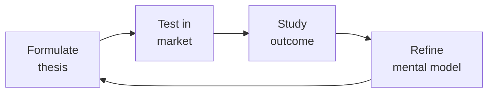

# Investor Relations — The Fundraising Operating System
> **Portability target:** Spec-level (runs on Claude Code, Copilot, Gemini CLI, Codex, Cursor). No vendor-specific frontmatter fields.

Investor relations and fundraising operations for founders, CEOs, and CFOs. Run efficient fundraises, manage investor communications at scale, handle due diligence, model dilution scenarios, and navigate the hardest IR moments — down rounds, tender offers, and crisis disclosures.
## <!-- DEEP: 5+min --> RESEARCH_PREREQUISITE — Execute Before Any Output

**This is a HARD GATE. Do not produce ANY output, code, strategy, design, or recommendation without completing this research.**

Before you act, you MUST execute every applicable research step. Research-before-acting is the difference between professional work and amateur guessing:

| # | Research Step | Why It Matters | Where to Look |
|---|--------------|----------------|----------------|
| **RP1** | **Verify domain currency.** Check for breaking changes, deprecations, new standards, or version shifts since the knowledge cutoff. | [STALE_RISK] Outdated advice breaks real systems. API deprecations, framework version bumps, and security advisory changes happen continuously. Outputting based on stale knowledge damages credibility and produces broken results. | Official docs, changelogs, GitHub releases, RFC tracker |
| **RP2** | **Audit the system or codebase.** Read relevant files. Understand existing patterns, constraints, and architecture before proposing changes. | [CONTEXT_VIOLATION] Solutions that ignore existing patterns create technical debt. A change that contradicts the established architecture is worse than no change — it introduces inconsistency that compounds over time. | Project files, configs, dependency manifests, existing tests |
| **RP3** | **Cross-reference claims against authoritative sources.** Every factual assertion needs a verifiable source. Mark each: [VERIFIED], [COMPUTED], or [ESTIMATED]. | [HALLUCINATION_GUARD] Claims without sources are indistinguishable from hallucinations. The #1 cause of incorrect output is treating assumptions as facts. Source tagging prevents this. | Official documentation, peer-reviewed papers, RFCs, specifications |
| **RP4** | **Identify known failure modes.** Before recommending, list what commonly breaks. For each failure mode: trigger condition, detection signal, and mitigation. | [FAILURE_BLINDNESS] Every domain has known failure patterns. Output that doesn't address them is dangerously incomplete. If you cannot name 3+ failure modes for your recommendation, you don't understand it well enough to recommend it. | Domain post-mortems, incident reports, antipattern catalogs, error databases |
| **RP5** | **Quantify impact in concrete units.** Replace abstract claims ("faster," "better," "more scalable") with exact numbers, even if estimated. | [VAGUENESS_PENALTY] "Faster" is unverifiable. "Reduces p95 latency from 340ms to 120ms (±15ms)" is verifiable. Abstract adjectives hide ignorance behind confidence. Concrete numbers expose gaps. | Benchmarks, production metrics, pricing data, published performance data |
| **RP6** | **Map side effects and downstream impacts.** What else breaks? Which dependencies are affected? Which downstream consumers need updating? | [CASCADE_BLINDNESS] Changes to one component ripple outward. A fix in module A can break module B that depends on A's old behavior. Map the blast radius before acting. | Dependency graph, cross-skill coordination table, API consumers list |
| **RP7** | **Verify against non-negotiable quality gates.** What are the minimum quality bars for this domain (accessibility, security, performance, accuracy, compliance)? | [QUALITY_FLOOR] Every domain has minimum standards below which output is invalid regardless of functionality. Missing WCAG AA = broken. Leaking credentials = broken. Silent data loss = broken. | Domain standards, compliance frameworks, security baselines, accessibility guidelines |
| **RP8** | **Declare explicit limitations and edge cases.** What does this NOT handle? What are the known boundaries? What scenarios are explicitly out of scope? | [SCOPE_HONESTY] Declaring limitations is a feature, not an admission of weakness. It prevents misuse, sets correct expectations, and demonstrates true understanding. Every solution has boundaries — naming them is professional. | This SKILL.md, domain literature, edge case databases |

**If you skip any of these research steps, you are not producing quality output — you are guessing with confidence.** Guessing wastes time, breaks systems, and destroys trust. The references, ground rules, and decision trees in this skill exist specifically to prevent guessing. Use them.

> **Compliance:** Research must be executed before any substantial output. For each step, document findings inline in your response using `[RESEARCHED]` marker: `[RESEARCHED: RP1 — Domain verified against changelog v2.4. No breaking changes since cutoff.]`. Partial research = partial quality. Zero research = zero credibility.


### 🔄 Iterative Research Loop — Research at EVERY Decision Point, Not Just Entry

**The RP1-RP8 cycle above is NOT a one-time gate.** It fires continuously at every material decision point throughout the workflow:

| Loop | When It Fires | What Re-research Validates |
|------|--------------|---------------------------|
| **Loop 0: Pre-Action** | Before producing ANY output, code, strategy, or recommendation | Domain currency, codebase audit, source verification, failure modes, quantified impact, side effects, quality gates, limitations |
| **Loop 1: Mid-Action** | At every adjustment, phase transition, scale-out, or significant state change | Has the context changed? Are the original assumptions still valid? Has new information invalidated the Loop 0 conclusions? |
| **Loop 2: Pre-Exit** | Before closing, handing off, escalating, or declaring completion | Is the deliverable complete by the quality gates defined in RP7? Are all limitations declared (RP8)? Have failure modes been addressed (RP4)? |
| **Loop 3: Post-Action** | After completion: compare expected vs. actual outcome | What was the efficiency ratio (actual / theoretical max)? What learnings emerged? What should be fed back into the pattern database for future decisions? |

**Integration into Core Workflow:**

Every decision point in a skill's Core Workflow must be marked with:
```
[RESEARCH LOOP: Re-execute RP1-RP8 before proceeding to next phase]
```

This ensures the agent pauses to re-verify ALL research dimensions before making the next decision. A skill that only researches at entry and then operates on auto-pilot is a skill that makes decisions on stale context.

**Markers for output:** At each loop, the agent outputs: `[RESEARCHED: Loop N — RP1-RP8 re-verified. Key delta from previous loop: ...]`

**Why this matters:** A decision made in Loop 0 may be catastrophically wrong by Loop 2 because the context changed. Markets move. Requirements shift. Dependencies update. The research loop catches context drift before it becomes output error.

> **Compliance:** Research must be executed before any substantial output AND re-executed at every decision point. For each research loop, document findings inline. Partial research = partial quality. Zero research = zero credibility. Stale research = dangerous confidence.


## Ground Rules — Read Before Anything Else

<!-- QUICK: 30s -- negative constraints, mechanically triggered -->

| # | Negative Constraint | Mechanical Trigger | Violation Response |
|---|---------------------|--------------------|---------------------|
| G1 | **REFUSE** to quote a raise amount without runway math. | `file_contains("*", "raise.*\\$[0-9]+[MB]")` AND NOT `file_contains("*", "(burn|runway|monthly cash|revenue projection)")` | STOP. Demand: monthly burn, cash on hand, projected revenue, hiring plan, time to next milestone. |
| G2 | **STOP if no investor update sent in >45 days.** | `last_modified("investor-update*") > 45d` OR `file_contains("*", "haven't sent an update|skipped update")` | HALT work. Generate investor update FIRST before any other IR activity. |
| G3 | **DETECT data room disorder — refuse to proceed until structured.** | `file_exists("data-room/")` AND NOT `file_exists("data-room/00-index.md")` | STOP. Build 14-folder data room with index before any investor contact. |
| G4 | **REFUSE to accept a term sheet based on valuation alone.** | `file_contains("*", "term sheet.*\\$[0-9]+[MB].*valuation")` AND NOT `file_contains("*", "(liquidation preference|participation|board control|anti-dilution)")` | STOP. Demand full term sheet comparison matrix: liquidation preference, participation, board control, anti-dilution, redemption, drag-along. |
| G5 | **DETECT spreadsheet-based cap table — escalate risk.** | `file_exists("*.xlsx")` AND `file_contains("*.xlsx", "(cap table|equity|option pool|share)")` | WARN: Spreadsheet cap tables compound errors. Escalate to Carta/Pulley migration. HALT any cap table scenario modeling until migrated. |
| G6 | **REFUSE to put material non-public info in writing.** | `user_message_contains("off the record|just between us|confidentially share")` AND `user_message_contains("acquisition|IPO|material.*event|earnings surprise")` | STOP. Remind: "There is no 'off the record' for material information under Reg FD. If you say it to one, you must disclose to all." |
| G7 | **STOP if fundraise process has no CRM/pipeline tracker.** | `user_message_contains("fundraise|fundraising|raise")` AND NOT `file_exists("*pipeline*|*crm*|*investor-track*")` | HALT. Create investor pipeline tracker (Affinity/Streak/Airtable) before any outreach.
| **R1** | **ANCHOR to runtime versions before generating framework-specific code.** Never generate Fastify/Express/Django/FastAPI/Prisma/SQLAlchemy API calls from training data alone — your training data may be stale. | Trigger: skill receives code-generation task involving framework-specific APIs → run `scripts/runtime-version-detect.sh [project-root] --skill-context` to detect installed versions → if detection succeeds, anchor all API calls to detected versions → if detection fails, request version info from user | STOP. Respond: "Detected: {runtime}@{version}, {frameworks}@{versions}. Anchoring all API calls to these versions. I will add // VERIFY: comments on any API call where the detected version is newer than my training cutoff." |
| **R2** | **RUN the ROI Gate before any non-emergency code change.** Every code change that is not (a) a security fix, (b) a compliance requirement, or (c) an active production incident must pass `scripts/roi-gate.sh`. If the gate returns negative, refuse to write the code. | Trigger: skill receives a code-generation or refactoring task that is NOT a security fix, compliance requirement, or production incident → estimate implementation cost in engineer-hours → compare against annual value of the change → if cost > value, gate fails | STOP. Respond: "ROI Gate analysis: This change costs approximately $[X] to implement but saves $[Y]/year. Payback period: [N] years. If payback > 2 years, I recommend declining this work. See `scripts/roi-gate.sh` for the full formula." |

- **Admit uncertainty — never fabricate.** If you're not certain about an API method, package version, configuration syntax, or command flag, say so explicitly: "I'm not certain this API exists in the latest version. Check the official docs at [URL]." Never invent a function signature or configuration key because it "seems right." Hallucinated code costs hours of debugging.
- **Flag your knowledge cutoff.** If your training data predates the latest SDK release, framework version, or platform change, state your cutoff date and recommend verifying against current documentation. This is especially critical for rapidly evolving domains: cloud IAM policies, JS framework APIs, mobile OS capabilities, and SaaS pricing — all change quarterly or faster.
- **Never guess security configurations.** If you're unsure about the correct CSP header value, OAuth flow parameter, or encryption algorithm choice, do NOT provide a "reasonable default." Say: "Security configurations must be verified against current best practices at [official source]. I cannot provide a definitive answer without current documentation."
- **Distinguish between what you know and what you infer.** Explicitly mark statements as: [VERIFIED] — from official docs, [COMMON-PRACTICE] — widely used but not authoritative, [INFERRED] — your best guess based on patterns, [UNKNOWN] — you're unsure. This helps the user calibrate trust in your output.
## The Expert's Mindset

Master investor relationss understand that strategy is not about predicting the future — it's about **being less wrong than the competition, faster**.

| Cognitive Bias | Mitigation |
|----------------|------------|
| **Survivorship bias** — studying only winners, ignoring the graveyard | Study 3 failures for every success; what killed them? |
| **Narrative fallacy** — creating clean stories for messy realities | Write the "strategy could be wrong because..." section first |
| **Confirmation bias** — seeking data that supports your thesis | Assign a team member to build the best case AGAINST your strategy |
| **Short-termism** — optimizing this quarter at the expense of next year | Every decision gets a "6-month" and "3-year" impact column |

### What Masters Know That Others Don't
- **The bottleneck is always one thing.** Find it. Fix it. Then find the next one.
- **Strategy = what you say NO to.** If your strategy doesn't exclude anything, it's not a strategy.
- **Timing beats brilliance.** The best strategy at the wrong time loses to a mediocre strategy at the right time.

### When to Break Your Own Rules
- **Bet the company when the asymmetry is right.** If downside = $1M and upside = $1B, the math doesn't care about your process.
- **Ignore the data when you're creating a new category.** By definition, there's no data for something that doesn't exist yet.

## Route the Request

<!-- QUICK: 30s -- auto-route first, then intent-route -->

### Auto-Route (No User Input Required)
Evaluate these file-system conditions in order. First match wins — jump immediately.

| # | Condition | Action |
|---|-----------|--------|
| A1 | `file_contains("*.pptx|*.pdf", "(pitch deck|investor deck|fundraising)")` AND `file_contains("*.xlsx", "(cap table|waterfall|pro forma)")` | This is your skill. Jump to **Core Workflow** — Phase 1: Fundraising Preparation. |
| A2 | `file_exists("data-room/")` OR `file_contains("*", "(data room|due diligence|diligence checklist)")` | Jump to **Decision Trees** — Data Room Checklist. |
| A3 | `file_contains("*.xlsx|*.csv", "(cap table|equity|option pool|waterfall)")` AND NOT `file_contains("*.xlsx", "Carta|Pulley|Shareworks")` | Jump to **Decision Trees** — Cap Table Scenario Modeling. WARN: Excel-based cap tables. |
| A4 | `file_contains("*", "(term sheet|TS|no-shop|closing conditions)")` AND `file_contains("*", "(liquidation|participation|board|anti-dilution)")` | Jump to **Decision Trees** — Term Sheet Comparison Framework. |
| A5 | `file_contains("*", "(monthly update|investor letter|shareholder update)")` AND `file_mtime("*.md") < 30d` | Jump to **Core Workflow** — Phase 5: Investor Communications. |
| A6 | `file_contains("*", "(down round|recapitalization|pay-to-play|cram down)")` | Jump to **Error Decoder** — down round row, then **Crisis IR Playbook**. |
| A7 | `file_contains("*", "(secondary|tender offer|share sale)")` | Jump to **Decision Trees** — Secondary Transaction Types. |
| A8 | `file_contains("*", "(Reg FD|10b5-1|insider trading|material nonpublic)")` | Invoke **legal-advisor** for securities compliance, then return here. |

### Intent Route (Ask the User)
If no auto-route matched, use this intent tree:

## Operating at Different Levels

| Level | Scope | You... |
|-------|-------|--------|
| **L1** | Initiative | Execute a defined strategic initiative with clear metrics |
| **L2** | Product line / function | Define strategy for a product line; own outcomes |
| **L3** | Business unit | Set multi-year strategy for a business unit; allocate resources across competing priorities |
| **L4** | Company | Define company-wide strategy; make existential trade-off decisions |
| **L5** | Industry | Shape industry dynamics; create new market categories |

**Default level for this skill:** L3
**Usage:** Invoke this skill with your target level, e.g., "as an L3 investor relations, develop..."

For full level definitions, see `skills/00-framework/skill-levels/SKILL.md`.

## When to Use

<!-- QUICK: 30s — scan the bullet list to decide if this skill fits -->
- Launching a fundraising process: strategy, materials, pipeline, close
- Building and managing a data room: what goes in, what stays out, how to organize
- Creating or refining a pitch deck: story arc, traction slides, market sizing, competitive positioning
- Managing the investor pipeline: CRM setup, tracking conversations, follow-up cadence
- Comparing term sheets: price, liquidation preference, participation, anti-dilution, board seats, protective provisions
- Running investor due diligence: tech DD, financial DD, customer references, background checks
- Modeling cap table scenarios: dilution, option pool expansion, liquidation waterfalls
- Sending monthly/quarterly investor updates: metrics that matter, good news/bad news format
- Preparing for annual shareholder meetings and proxy statements
- Coordinating secondary transactions: tender offers, direct secondaries, founder liquidity
- Managing IR during crises: down rounds, layoffs, product incidents, co-founder departures

<!-- STANDARD: 3min -->
### When NOT to Use This Skill
- You're pre-revenue and raising from friends & family (use `ceo-strategist` — this is institutional fundraising infrastructure)
- You need legal review of a term sheet (use `legal-advisor` — this skill helps you compare terms, not negotiate them)
- You're building the underlying financial model (use `fp-and-a-analyst` for the model; come here to package it for investors)

## Error Recovery
**(STANDARD)**

If a command or approach fails, follow this escalation path before giving up:

| Symptom | First Action | If That Fails | Last Resort |
|---------|-------------|---------------|-------------|
| Tool/command not found | Check installation: `which [tool]` or `[tool] --version`. Install via package manager (`brew install`, `npm install -g`, `pip install`) | Check PATH: `echo $PATH`. Verify the tool binary is in a PATH directory. Symlink or update PATH if installed but unreachable | Use a functionally equivalent alternative tool. If `rg` is unavailable, use `grep -r`. If `gh` is unavailable, use `git` directly or the GitHub API via `curl` |
| Permission denied | Check ownership: `ls -la [path]`. Fix with `chmod` or `sudo` if appropriate. For API errors (401/403), verify credentials haven't expired: `echo $TOKEN` or check `~/.netrc` | Refresh credentials: re-authenticate with the service. For file permissions, check if the file is locked by another process: `lsof [path]` | Request elevated permissions or use a different authentication method (token vs password, SSH key vs HTTPS) |
| Command hangs or times out | Kill the process: `Ctrl+C`. Re-run with a timeout: `timeout 30 [command]` or `gtimeout` on macOS. Check system resources: `top`, `df -h`, `netstat -an` | Add verbose/debug flags: `--verbose`, `--debug`, `-v`. Check logs: `tail -f [logfile]`. Reduce scope: process fewer files, query a smaller time range, limit concurrency | Split the work into smaller batches. Implement a retry loop with exponential backoff (1s, 2s, 4s, 8s). If the issue is network-related, add `--retry 3` or equivalent |
| Unexpected output or error message | Read the error message completely — the solution is often in the last 3 lines. Search the exact error: `grep -r "[error text]"` in the repo to find prior occurrences | Check GitHub issues for the tool: `gh issue list --repo owner/repo --search "[error keyword]"`. Check Stack Overflow | Simplify the approach. If the complex one-liner fails, break it into 3 sequential commands. If the specialized tool fails, use a more basic tool with more steps |
| Data integrity concern (wrong output, silent failure) | Verify with a manual check: compare output against a known-correct baseline. Add assertions: `[command] | grep -q "[expected]" && echo "OK" || echo "FAIL"` | Run the operation on a smaller subset first. Compare checksums: `shasum`, `md5`. Check for silent truncation: `wc -l` before and after | Abort and flag for human review. Do not proceed past data integrity failures — the cost of propagating bad data exceeds the cost of delay |

**Hard failure boundary:** If 3 different approaches all fail, STOP. Do not iterate infinitely. Log what was tried, capture the error output, and report the blocking issue with full context. Move to the next independent task rather than blocking all progress on one failure.

## Cross-Skill Coordination

<!-- NEIGHBORS: IR connects fundraising strategy, financial reporting, and board governance -->

| Upstream Skill | What You Receive | Decision Gate / Artifact |
|---|---|---|
| `ceo-strategist` | Fundraising strategy, narrative positioning, target investor list | Gate: CEO must approve investor targeting before outreach begins. Artifact: Fundraising strategy memo with target raise amount, valuation range, and timeline. |
| `fp-and-a-analyst` | Operating model, SaaS metrics dashboard, scenario analysis, valuation model | Gate: Model must reproduce last 12 months of actuals within 5%. Artifact: Investor-ready financial model with bull/base/bear scenarios. |
| `board-manager` | Board-approved fundraising authorization, investor communication guidelines, governance requirements | Gate: Board must approve any new fundraising round or material secondary. Artifact: Board resolution authorizing fundraising. |
| `legal-advisor` | Term sheet review, securities law compliance, investor agreement drafting | Gate: Every investor communication must pass legal review before sending. Artifact: Legal-reviewed term sheet comparison and disclosure schedule. |

| Downstream Skill | What You Provide | Decision Gate / Artifact |
|---|---|---|
| `board-manager` | Fundraising progress, term sheet comparison, cap table scenarios | Gate: Board must be updated on fundraising status within 48 hours of material development. Artifact: Fundraising status dashboard with pipeline stage and term sheet summary. |
| `ceo-strategist` | Investor pipeline status, diligence findings, competitive fundraising intelligence | Gate: CEO must be briefed before any partner meeting. Artifact: Investor briefing memo with background, thesis fit, and potential concerns. |
| `fp-and-a-analyst` | Investor feedback on model assumptions, market comps, valuation benchmarks | Gate: Model assumptions must be updated after each investor meeting that surfaces new data. Artifact: Model assumption changelog with investor source attribution. |

**Decision Gates:**
- **Data room readiness:** All 14 folders complete and organized before sharing with first investor. Incomplete data room = 2-4 week fundraise delay.
- **Term sheet comparison:** Every term sheet evaluated against: (1) valuation vs market comps, (2) liquidation preference structure, (3) board seat provisions, (4) protective provisions, (5) option pool requirements. No term sheet signed without full comparison.
- **Investor update discipline:** Monthly updates sent by 5th business day. Silence >30 days = investor assumption of crisis. Every update must include: key metrics, good news, bad news, asks, and cash runway.

**Coordination cadence:**
- **Weekly:** Pipeline review with CEO; investor meeting prep and debrief
- **Monthly:** Investor update drafting and distribution
- **Quarterly:** Board meeting IR section; shareholder reporting
- **Fundraising:** Daily pipeline tracking; weekly strategy sync with CEO and legal
- **Crisis:** Immediate notification protocol — board and major investors within 24 hours

## Proactive Triggers

| Trigger | Action | Why |
|---|---|---|
| Monthly investor update is 3+ days late | Send update immediately even if incomplete — late is worse than imperfect; investors track consistency as a trust signal | Timeliness builds trust more than polish; a late update signals disorganization or hidden bad news |
| Investor hasn't engaged with updates for 3+ consecutive months | Move to quarterly update cadence; don't waste CEO time on disengaged investors; flag to board if lead investor is disengaged | Disengaged investors won't lead your next round — conserve energy for active supporters |
| Term sheet received with participating preferred structure | Model full exit waterfall at $50M, $100M, $500M, $1B — show CEO exactly how participation dilutes common at each exit value | Founders often focus on valuation and miss that participation preferred can leave common with $0 at moderate exits |
| Warm intro request for target investor sits unanswered for 5+ business days | Follow up once; if no response in 2 more days, find alternative intro path or deprioritize that investor | Fundraising timelines are tight — waiting 2+ weeks for one intro burns runway and momentum |
| Data room has 5+ unanswered diligence questions accumulating | Designate one person as "diligence quarterback" to triage, assign, and track every question within 24 hours; escalate anything >48 hours unanswered | Unanswered diligence questions create the impression you're hiding something — speed of response builds confidence |
| Pitch deck hasn't been updated in 3+ months or since last material metric change | Refresh deck within 1 week — update traction slide with latest numbers; remove stale references; ensure narrative matches current strategy | Outdated decks signal that fundraising isn't a priority or that metrics have gotten worse |
| Competitor raises significant round or announces product that directly competes | Draft reactive messaging within 24 hours: "Here's why this validates our market and why we're differentiated"; proactively send to existing investors | Investors will see the competitor news — your framing of it shapes whether they see threat or validation |
| Secondary transaction proposed without employee-wide communication plan | Insert communication design into process: who sells, how much, who's eligible next, rationale, impact on 409A — communicate before, not after | Secondaries create winners and losers; silence breeds resentment and attrition among those excluded |

## Decision Trees
**(QUICK)**

<!-- QUICK: 30s — follow the ASCII tree to your scenario -->

### Data Room Checklist — The 14 Folders Every Fundraise Needs
<!-- STANDARD: 3min -->

```
data-room/
├── 01-corporate-docs/
│   ├── Certificate of Incorporation (and amendments)
│   ├── Bylaws
│   ├── Board consents and minutes (last 2 years)
│   ├── Stockholder consents
│   └── Subsidiary org charts (with jurisdictional notes)
├── 02-cap-table/
│   ├── Pro forma cap table (fully diluted, with ESOP)
│   ├── 409A valuation report (current, within 12 months)
│   ├── Option grant history (date, strike price, vesting schedule)
│   └── Convertible instruments (SAFEs, notes, warrants — conversion terms and amounts)
├── 03-financials/
│   ├── Audited financials (last 2 years, if applicable)
│   ├── Unaudited interim financials (current year, monthly)
│   ├── Annual budget and quarterly forecasts
│   ├── Revenue by customer (anonymized, top 20 accounts)
│   ├── Cohort analysis (retention by cohort, logo and dollar-based)
│   └── Gross margin by product line
├── 04-product-tech/
│   ├── Architecture diagram (high-level, 1 page)
│   ├── Product roadmap (current + next 4 quarters)
│   ├── Tech debt assessment (with remediation plan)
│   ├── Security certifications (SOC 2, ISO 27001, pen test reports)
│   └── IP portfolio (patents filed/granted, trademarks, key licenses)
├── 05-gtm-sales/
│   ├── ICP and buyer persona documentation
│   ├── Pricing and packaging (current and planned)
│   ├── Sales playbook and comp plan
│   ├── Pipeline data (by stage, rep, vertical — last 4 quarters)
│   └── Win/loss analysis (last 20 deals)
├── 06-customer-reference/
│   ├── Referenceable customer list (name, contact, relationship notes)
│   ├── Case studies (3-5, with metrics)
│   └── NPS/CSAT data (rolling 12 months)
├── 07-market-competitive/
│   ├── TAM/SAM/SOM analysis (bottoms-up, with sources)
│   ├── Competitive landscape (with differentiation matrix)
│   └── Industry analyst reports (Gartner, Forrester — if available)
├── 08-people-culture/
│   ├── Org chart (current + planned 12 months)
│   ├── Headcount by department (with hiring plan)
│   ├── Employee NPS and engagement data
│   └── Key employee retention agreements
├── 09-legal-compliance/
│   ├── Material contracts (customer >$100K, vendor >$50K, partnership)
│   ├── Litigation summary (pending, threatened, settled — with counsel letter)
│   ├── Employment and IP assignment agreements (templates)
│   └── Regulatory filings and correspondence
├── 10-board-investor/
│   ├── Board meeting minutes (last 2 years)
│   ├── Investor update history (last 8 quarters)
│   └── Current investor contact list with ownership percentages
├── 11-fundraising/
│   ├── Pitch deck (current version, PDF)
│   ├── Financial model (Excel/Google Sheets, not PDF — they will model with it)
│   ├── Management bios and LinkedIn profiles
│   └── FAQ document (pre-empt the top 20 diligence questions)
├── 12-customer-contracts/
│   ├── Master Services Agreement (template)
│   └── Top 10 customer contracts (redacted for confidentiality, with counsel approval)
├── 13-vendor-partnerships/
│   └── Key vendor and partnership agreements
└── 14-tax-compliance/
    ├── Federal and state tax returns (last 2 years)
    ├── R&D tax credit documentation
    └── Sales tax compliance status by jurisdiction

```

**War story:** A Series B company sent their data room link to 40 investors. One folder — "06-customer-reference" — contained an Excel file with customer names, contact info, AND annual contract values, unredacted. An associate at a VC firm shared it with a competitor's CEO (their portfolio company). The competitor used the pricing data to undercut renewals. The startup lost 3 of their top 10 accounts within 6 months. Lesson: every document in the data room goes through counsel review before investor access. Revenue data is never customer-attributed in a data room.

### Term Sheet Comparison Framework
<!-- STANDARD: 3min -->

When comparing two term sheets, rank these 6 dimensions. Valuation is #4 on this list — not #1.

| Priority | Term | What to Look For | Red Flag |
|----------|------|-----------------|----------|
| 1 | **Liquidation Preference** | 1x non-participating is market. >1x or participating = red flag. | 2x participating preferred — investor gets paid twice before common sees a dollar |
| 2 | **Board Control** | Common + investor balance. Independent director breaks ties. | Investors control majority of board seats without an independent director |
| 3 | **Protective Provisions** | Standard: approve new financing, amend charter, sell company, change board size | Veto over budget, hiring, or customer contracts — investors are managing, not governing |
| 4 | **Valuation** | Higher = less dilution. But a clean $40M cap is better than a dirty $60M with 3x participating. | Valuation so high it makes the next round unwinnable (the "valuation trap") |
| 5 | **Option Pool** | 10-20% unallocated post-money. Pool should be pre-money (investor shares dilution). | Pool is post-money and too small — founders get diluted again at next round to refresh |
| 6 | **Anti-Dilution** | Weighted average (broad-based). | Full ratchet — if you raise a down round, investors get repriced. This destroys founder equity. |

**What good looks like:** A term sheet matrix where you can explain, in one sentence, why Term Sheet A is better than Term Sheet B despite the lower valuation. "Term Sheet A has a 1x non-participating liquidation preference and board balance, while Term Sheet B has 2x participating and investor board control — A leaves us with 3x more equity in a $100M exit."

### Cap Table Scenario Modeling
<!-- DEEP: 10+min -- cap table errors are irreversible -->

```
Model these 4 scenarios before every fundraise:

Scenario 1: Base Case (the round you're raising)
├── Pre-money: $[X]M | Raise: $[Y]M | Post-money: $[Z]M
├── Dilution: [%] per existing shareholder
└── New option pool: [%] of post-money (pre-money refresh vs. post-money)

Scenario 2: Down Round (30% below current valuation)
├── Full ratchet anti-dilution impact on founders vs. weighted average
├── Pay-to-play provisions: who gets washed out?
└── Liquidation preference stack: do common shareholders get anything in a fire sale?

Scenario 3: Exit Waterfall ($50M, $100M, $500M, $1B)
├── Liquidation preference payout order: Series B → Series A → Seed → Common
├── Participation cap: at what exit value does participating preferred convert to common?
└── Option holder payout: what do employees actually make at each exit threshold?

Scenario 4: Acquisition (stock vs. cash deal)
├── Cash: simple waterfall. Stock: what's the acquirer's stock worth? (and lockup period)
├── Earnout: how much is contingent? Who stays to earn it?
└── Retention packages: key employee retention carve-outs (don't come from common pool)
```

**War story:** A founder sold her company for $40M thinking she'd walk away with $8M (20% ownership). She got $0. Her Series B investors had 2x participating preferred with no cap. The $40M went: $15M to Series B liquidation preference + $15M participation + $8M to Series A preference + $2M to Seed preference = $40M. Common shareholders (founders + employees) received nothing. She had never modeled the liquidation waterfall. The acquirer's lawyers presented it at closing. Too late to negotiate.

<!-- DEEP: 10+min -->

## Core Workflow
**(STANDARD)**

### Phase 1 (~120 min): Fundraising Preparation
<!-- STANDARD: 3min -->
1. **Decide if you should raise** (15 min): 18+ months of runway? Growing 3x+ YoY? Category is investable? If any answer is "no," fix the business first. Raising without momentum = down round or no round at all.
2. **Set the raise parameters** (15 min): How much? For what? From whom? Raise enough for 24 months to the next value-inflection milestone. If your next milestone is $5M ARR and you're at $1M ARR growing 10% month-over-month, you need ~18 months → raise $X based on burn × 24.
3. **Build the target investor list** (30 min): 30-50 firms. Tiered: Tier 1 (top 10, your dream investors), Tier 2 (20 good fits), Tier 3 (20 backups). Research: who invested in adjacent companies? Who led rounds at your stage and sector in the last 12 months? Who has capacity? (Check fund size — a $1B fund doesn't lead $5M Seeds.)
4. **Prepare materials** (45 min): Pitch deck (see Phase 2), financial model, data room (see Decision Trees), management bios, reference customer list, FAQ doc.
5. **Warm introductions only** (15 min): Cold emails have a <1% response rate. Warm intros: 40-60%. Map your network → target investors. Ask existing investors, advisors, and portfolio company CEOs for introductions. One intro request per investor, with a blurb they can forward.

  Complete when: Raise/no-raise decision with supporting metrics (runway, growth rate, category investability) is documented; raise parameters (amount, milestone target, timeline) are defined; tiered investor target list (30-50 firms) with research per firm is complete; warm introduction mapping (network → investors) is prepared; all fundraising materials (deck, financial model, data room, bios) are ready.

### Phase 2 (~90 min): Pitch Deck Construction
<!-- STANDARD: 3min -->
**The 12-slide narrative arc.** Every slide answers one question. No slide has >5 bullet points. No bullet point is >2 lines.

| Slide | Question It Answers | Content |
|-------|-------------------|---------|
| 1. Title | Who are you? | Company name, logo, tagline: "We do X for Y" — 8 words max |
| 2. Problem | Why does this matter? | The pain you solve. Use a customer quote, not a market stat. "I spend 4 hours a week manually reconciling..." beats "The TAM is $50B." |
| 3. Solution | How do you solve it? | Product screenshot or 30-second demo GIF. Show, don't tell. |
| 4. Why Now? | Why hasn't this been done? | Technology shift, regulatory change, behavioral change. "APIs didn't exist before 2023." "Remote work made this a top-3 pain." |
| 5. Market Size | How big can this get? | Bottoms-up TAM: how many customers × your ASP × penetration rate. Tops-down

  Complete when: 12-slide narrative arc deck with one question answered per slide is complete; financial model with bottoms-up TAM and unit economics is validated; data room with all 14 standard folders is populated; management bios and reference customer list are finalized; FAQ document anticipating top 20 investor questions is prepared.
Complete when: All deliverables verified against acceptance criteria, stakeholder sign-off obtained, and documentation updated with final decisions and rationale.
Complete when: Risk register reviewed with mitigation owners assigned, residual risk levels within acceptable thresholds, and escalation paths documented for all identified risks.
Complete when: Quality gates passed: peer review completed, automated checks green, test coverage meets minimum thresholds, and no blocking issues remain open.
Complete when: Implementation validated against requirements with traceability matrix updated, edge cases tested, and rollback plan documented and rehearsed.
Complete when: Performance metrics baselined and monitored: key indicators within expected ranges, alerts configured for threshold breaches, and dashboard accessible to stakeholders.
Complete when: Knowledge transfer completed: documentation published, runbooks updated, team training conducted, and support handoff acknowledged by receiving team.

> See [references/core-workflow.md](references/core-workflow.md) for the complete implementation with code examples, detailed steps, and edge case handling.

## Cross-Skill Integration

<!-- QUICK: 30s — table of who to talk to when -->

This skill in a typical IR and fundraising workflow chain:

| Step | Skill | What It Produces for This Skill |
|------|-------|--------------------------------|
| **Before** | `board-manager` | Board governance framework, investor communication cadence, fiduciary compliance → ensures IR aligns with board expectations |
| **Before** | `ceo-strategist` | Strategic vision, company narrative, fundraising amount and timing, organizational context → feeds the pitch deck story and raise parameters |
| **Before** | `fp-and-a-analyst` | Financial model (P&L, balance sheet, cash flow), cap table, dilution analysis, scenario modeling → provides the numbers behind every investor conversation |
| **This** | `investor-relations` | Data room, pitch deck, pipeline management, investor updates, due diligence coordination, term sheet comparison, secondary transaction management |
| **After** | `legal-advisor` | Consumes term sheet for legal review, definitive agreement drafting, and closing mechanics |
| **After** | `ceo-strategist` | Consumes fundraise outcomes to update strategic plan, org design, and board composition |

Common chains:
- **Full fundraise cycle**: `fp-and-a-analyst` → `investor-relations` → `legal-advisor` — Financial model → data room + deck + pipeline → term sheet negotiation and close
- **Quarterly IR cadence**: `board-manager` → `investor-relations` → `ceo-strategist` — Board deck and governance → investor update memo → strategic adjustments based on investor feedback
- **Down round navigation**: `ceo-strategist` → `investor-relations` → `board-manager` → `legal-advisor` — Crisis decision → investor communication → board approval → legal mechanics

```bash
# Example: Produce a fundraise-ready package from FP&A to IR
# 1. fp-and-a-analyst produces financial model and cap table
# 2. investor-relations structures data room, builds pitch deck, prepares pipeline
# 3. legal-advisor reviews term sheet and drafts definitive agreements

```

## State Log

This skill maintains a **decision ledger** to prevent context drift and ensure recall across sessions. Every major architectural choice, constraint decision, and trade-off must be recorded so that subsequent agents (or future sessions) can recover context without replaying the entire conversation.
## What Good Looks Like

A fundraise that goes from first meeting to term sheet in 6 weeks, diligence to close in 4 weeks. The data room has zero follow-up requests because everything was there on day one. The pitch deck gets partner-level meetings within 1 week of warm intro. Investor updates go out on the 5th of every month — investors reply "great update" or offer specific help. Cap table is audited and reconciled. Term sheet comparison matrix is one page with the winner highlighted — the founder can explain why in one sentence. Down-round scenarios are modeled and stress-tested. Customer references are pre-briefed and enthusiastic. The wire hits on schedule. There is a Plan B investor in the wings throughout.

## Deliberate Practice


```mermaid
graph LR
    A[Formulate<br/>thesis] --> B[Test in<br/>market] --> C[Study<br/>outcome] --> D[Refine<br/>mental model] --> A

```

| Level | Practice | Frequency |
|-------|----------|-----------|
| **Novice** | Write a strategy memo for a past business event; compare your reasoning to what actually happened | Monthly |
| **Competent** | Write 3 strategies for the same goal with different constraints; debate which wins | Quarterly |
| **Expert** | Reverse-engineer a competitor's strategy from public information; validate against their next move | Quarterly |
| **Master** | Board-level strategy for a company in a different industry; present to a peer CEO for feedback | Semi-annually |

**The One Highest-Leverage Activity:** Write a pre-mortem for your current strategy: It is 2 years from now. Our strategy failed. Why?

## Anti-Patterns

1. **Corporate-speak in investor communications.** Scripting earnings calls like press releases — "robust top-line growth driven by strategic initiatives." Investors tune out in 8 seconds. Use plain language: what grew, why it grew, what you're worried about, what you're doing about it.

2. **Sandbagging guidance to manufacture beats.** Guiding to the 25th percentile forecast so you can consistently beat by 5%+. The market prices in the pattern, and when you eventually miss, the stock drops 3x more than the beats ever lifted it. The credibility premium evaporates permanently.

3. **Casual MNPI leakage in 1-on-1 investor meetings.** An offhand comment about supply chain improvements during a private investor meeting triggers a Regulation FD violation when the fund trades on it. Every investor meeting needs pre-approved talking points referencing only publicly disclosed guidance.

4. **"One-time charges" that recur every quarter.** Labeling restructuring, acquisition costs, legal settlements, and impairments as "extraordinary" quarter after quarter. After four quarters, investors price them as recurring operational noise, and the credibility of your non-GAAP adjustments is destroyed.

5. **Silence during quiet periods without published calendars.** An executive mentions "Q3 is looking great" at a conference during the quiet period. That's selective disclosure. Publish the quiet period calendar, notify all insiders of trading and communication restrictions, and enforce compliance.

6. **No activist defense playbook.** An activist fund accumulates 7% and files a 13D with a 50-slide attack deck. The company has no response for 72 hours while the stock drops 15%. Proactive preparation costs 3-5x less than reactive defense and preserves market cap during the response window.

7. **Data room disorder during fundraising.** Sending investors to a Dropbox folder with no index, customer-attributed revenue data, and mixed document versions. This signals operational chaos and kills deal momentum. A structured 14-folder data room with legal-reviewed content is fundraise table stakes.

## Anti-Hallucination

| Rationalization | Reality |
|---|---|
| "We'll prep the earnings call the week before" | Earnings prep requires 3+ weeks for mature IR functions — script drafting, Q&A scenario modeling, messaging alignment with CFO/CEO, and dry runs; last-minute prep produces script errors, unprepared answers to obvious questions, and messaging inconsistencies that analysts exploit in their notes. |
| "The quiet period rules are common sense — everyone knows them" | Quiet period violations from casual conversations destroy credibility overnight; one executive's offhand comment to a journalist about "a strong quarter shaping up" triggers an SEC inquiry and a 10-15% stock price decline when the investigation is disclosed. |
| "Our shareholder base is stable — no need for proactive engagement" | Passive shareholder bases attract activists precisely because management hasn't built relationships; investors who haven't heard from IR or management in 12 months are 3x more likely to support an activist campaign when approached. |
| "The guidance model can wait for FP&A to update" | Stale guidance models produce earnings surprises that should have been visible 6 weeks earlier; IR must own the live guidance model independently and flag divergence from current quarter projections within 48 hours of month-end close. |
| "We don't need an investor day — our quarterly calls are sufficient" | Quarterly earnings calls are 45 minutes of scripted theater with 3 analysts asking pre-vetted questions; investor days provide the deep-dive context — product demos, segment economics, multi-year strategy — that makes analysts and portfolio managers comfortable holding through volatility, reducing stock beta by 15-20%. |

## Production Checklist
**(STANDARD)**

- [ ] Data room: 14-folder structure complete with 00-index.md — all documents legal-reviewed before investor access
- [ ] Pitch deck: updated within last 30 days — traction slide current, narrative consistent with latest strategy
- [ ] Cap table: migrated from spreadsheet to purpose-built platform (Carta/Pulley) — pro forma fully diluted with ESOP
- [ ] Investor pipeline tracker: CRM active with stage, last contact, and next steps for every target investor
- [ ] Term sheet comparison matrix: one-page comparison of valuation, liquidation preference, board control, anti-dilution, participation, and protective provisions
- [ ] Liquidation waterfall: modeled at $50M, $100M, $500M, and $1B exits — all shareholders understand payout at each level
- [ ] Monthly investor update: sent by 5th business day — metrics, good news, bad news, asks, and cash runway
- [ ] Guidance model: updated with actuals monthly — current quarter projection tracked against guidance range
- [ ] Quiet period calendar: published for the year — all insiders notified of trading and communication restrictions
- [ ] Consensus tracking: analyst estimates monitored — guidance range overlaps consensus, no sustained beat pattern
- [ ] Shareholder engagement log: top 20 investors met within last 12 months — feedback documented and shared with board
- [ ] Activist vulnerability assessment: conducted annually — fight deck prepared for 5 most likely theses
- [ ] Reg FD compliance: talking points document for every investor meeting — no forward-looking statements beyond public guidance
- [ ] Secondary transaction plan: employee communication strategy designed before any tender offer — impact on 409A assessed
- [ ] Earnings prep: script, press release, and Q&A prep completed ≥ 1 week before earnings — 2+ dry runs completed
- [ ] Guidance model: updated within 48 hours of month-end actuals — current quarter projection vs. guidance range tracked
- [ ] Consensus: analyst estimates tracked — guidance range overlaps consensus, no hidden beats/raises strategy
- [ ] Talking points: pre-approved for every investor meeting — no ad-libbing about forward-looking financials
- [ ] Quiet period: calendar published, all insiders notified of trading and communication restrictions — enforced
- [ ] Shareholder engagement: top 20 investors met within last 12 months — feedback documented in CRM
- [ ] Activist preparedness: annual vulnerability assessment completed — fight deck updated, advisors on standby
- [ ] Non-GAAP policy: documented and reviewed quarterly — recurring items reclassified as operating
- [ ] Investor day: planned every 18-24 months — product demos, segment economics, multi-year strategy, unstructured Q&A
- [ ] Reg FD compliance: 8-K template ready for inadvertent MNPI disclosure — file within 24 hours
- [ ] IR website: current investor deck, earnings materials, SEC filings, governance docs, ESG report — all accessible
- [ ] Shareholder targeting: buy-side and sell-side target lists maintained — engagement prioritized by ownership/AUM
- [ ] Crisis communications: IR crisis protocol documented — who speaks, when, through which channels for material events

## Error Decoder
**(STANDARD)**

| Symptom | Root Cause | Fix | Prevention |
|---------|------------|-----|------------|
| Fundraise stalls after 10 investor meetings — no term sheets | Pitch deck lacks clear "why now" or addresses too small a market; pipeline is cold outreach instead of warm intros | Rebuild pitch narrative with compelling "why now" slide; switch to 100% warm intro strategy via existing investors | Cold emails have <1% response rate; warm intros are 40-60% — a stalled raise is almost always narrative or pipeline |
| Term sheet signed but diligence uncovers 2-week data room gap | Data room was incomplete — missing financials, customer contracts, or IP documentation | Build 14-folder data room BEFORE first investor meeting; have counsel pre-review all documents; maintain index with version dates | Incomplete data rooms cause 2-4 week fundraise delays — every day burns runway and signals disorganization |
| Founder receives $0 from $40M exit | 2x participating preferred with no cap — investor liquidation preference consumed entire proceeds | Immediately: model all exit scenarios. Future: negotiate 1x non-participating as market standard for term sheets | Valuation is #4 on the term sheet priority list — liquidation preference structure determines who actually gets paid |
| Stock drops 25% on guidance miss after 8 consecutive beats | Company guided to 25th percentile to manufacture beats; market priced in the pattern | Guide to 50th percentile forecast; narrow ranges over time; publicly commit to honest forecasting | Beat streaks that end in a miss destroy 3x more value than the beats created — credibility risk premium becomes permanent |
| SEC investigation opened after CEO's casual conference comment | Reg FD violation — CEO mentioned "Q3 is looking great" during quiet period to a journalist | File 8-K within 24 hours; implement pre-approved talking points for all executive appearances | There is no "off the record" for material information — one sentence can trigger $2M-$10M in SEC fines |
| Activist files 13D — company has no response for 72 hours | No activist preparedness plan; no fight deck; no pre-retained advisors | Activate proxy solicitor and defense counsel; release initial statement within 24 hours; deploy pre-built rebuttal deck | Proactive prep costs 3-5x less than reactive defense — annual vulnerability assessment is insurance, not overhead |
| Excel cap table has accumulated errors over 4 funding rounds | Manual spreadsheet tracking across SAFEs, notes, option grants, and priced rounds — no audit trail | Migrate to Carta/Pulley immediately; backfill all transactions; reconcile against legal documents | Spreadsheet cap tables compound errors exponentially — a single conversion math error can cost $500K+ at exit |
| Stock drops 25% on earnings despite "meeting guidance" | Market priced in a beat because you've beaten 8 quarters in a row; guidance was the floor, not the midpoint | Acknowledge forecasting process failure on call; commit to narrower, more accurate guidance; reset expectations with mid-quarter update | Guide to 50th percentile; narrow range as forecasting improves; never let "beat streak" become the goal |
| SEC Reg FD inquiry after CEO's conference comment | CEO ad-libbed "Q3 is looking great so far" during panel; selective disclosure of MNPI to non-shareholders present | Engage SEC counsel immediately; file 8-K within 24 hours broadly disseminating the information; review insider communication policy | Pre-approved talking points for ALL external appearances; no discussion of forward-looking financials outside earnings calls |
| Activist fund accumulates 7% and publishes 50-slide attack deck — no response for 72 hours | No activist preparedness plan; legal scrambles, PR drafts reactive statement, narrative set by activist in the vacuum | Activate pre-established response protocol: legal + PR + banker calls within 4 hours; CEO/board statement within 24 hours; substantive rebuttal deck within 48 hours | Annual activist vulnerability assessment; fight deck rebutting top 5 theses; proxy solicitor and defense counsel on standby |
| Analyst consensus drifts outside guidance range — discovered week of earnings | IR dependent on FP&A for guidance model; month-2 actuals posted but IR didn't update; earnings surprise was "unexpected" | Flag during earnings prep; determine if guidance revision or pre-release needed; prepare explanation for call | IR owns independent guidance model; current-quarter projection vs. guidance range updated within 48 hours of month-end close |
| Top-3 shareholder supports activist campaign — has never met management | No proactive engagement program; investor hadn't heard from IR or management in 18 months; activist approached first | Request meeting with investor to present strategy; understand their concerns; assess if settlement (board seat) is preferable to proxy fight | Meet top 20 shareholders twice/year minimum; document all engagement; track sentiment; flag declining confidence early |
| "One-time charge" appears 5th consecutive quarter → analysts ignore all adjustments | Non-GAAP policy too permissive; restructuring, acquisition costs, legal settlements classified as non-recurring despite being predictable | Reclassify recurring items as operating; clean up non-GAAP policy; announce simplified reporting going forward | Non-GAAP policy: item qualifies only if not in prior 2 years AND not expected in next 2 years; external auditor reviews classification |

## Error Decoder — War Stories from the Trenches

**(STANDARD)**

When this domain goes wrong, it goes wrong in predictable ways. Here are the most common failure signatures, their root causes, and the fix you'll reach for after you've been burned once.

| Symptom | Root Cause | Fix | Lesson |
|---------|-----------|-----|--------|
| SEC Reg FD inquiry after CEO ad-libs "Q3 is looking great so far" during conference panel discussion | Selective disclosure of material non-public information to a room with non-shareholders present (press, analysts, competitors). CEO's casual optimism was a Reg FD violation — the information wasn't simultaneously disseminated to all shareholders via 8-K or press release. | Engage SEC counsel immediately. File 8-K within 24 hours broadly disseminating the disclosed information. Review insider communication policy: pre-approved talking points for ALL external appearances; no discussion of forward-looking financials outside earnings calls; CEO media training includes Reg FD scenarios. | "Things are going well" can be a securities law violation if you're a public company CEO and the room has non-shareholders. Every external appearance is a potential disclosure event — if you wouldn't put it in an 8-K, don't say it at a conference. |
| Activist fund accumulates 7%, publishes 50-slide attack deck at 6 AM — company has no response for 72 hours, media narrative set by activist | No activist preparedness plan. Legal scrambles to find defense counsel, PR drafts reactive statement, investment bank not on retainer. In the 72-hour vacuum, the activist's thesis becomes the accepted narrative. Stock down 12%, proxy advisory firms begin drafting reports based solely on activist's deck. | Activate pre-established response protocol within 4 hours: legal + PR + banker on single call. CEO/board statement within 24 hours acknowledging investor input while defending strategy. Substantive rebuttal deck within 48 hours addressing each thesis point-by-point. Annual activist vulnerability assessment with fight deck rebutting top 5 theses. | The first 48 hours of an activist campaign determines who controls the narrative. Without a pre-built response protocol, the company is drafting press releases while the activist is on CNBC. The fight deck must exist BEFORE the fight starts. |
| Non-GAAP adjustments: "one-time restructuring charge" appears 5th consecutive quarter — analysts ignore ALL company adjustments, apply 2× discount to guidance | Non-GAAP policy too permissive. Restructuring, acquisition costs, legal settlements classified as "non-recurring" despite being predictable annual expenses. Analysts lose trust in adjusted numbers — "if everything is one-time, nothing is." The non-GAAP reconciliation becomes a red flag instead of a disclosure tool. | Non-GAAP policy: item qualifies as non-recurring only if NOT in prior 2 years AND NOT expected in next 2 years. External auditor reviews classification. Present GAAP numbers first in every release, non-GAAP as supplementary. If an adjustment appears 3+ quarters, reclassify as operating — it's recurring regardless of what you call it. | Non-GAAP metrics are a privilege, not a right. Abuse them and analysts stop trusting any number you report. The test: would an objective third party agree this is "one-time"? If you have to explain why, it probably isn't. |
| Analyst consensus drifts to $0.42 EPS — guidance range is $0.38-$0.42 — discovered week of earnings, too late to guide down | IR dependent on FP&A for consensus model; month-2 actuals posted but IR didn't reconcile against guidance. Consensus drifted above the top of the range, meaning the company is about to "miss" consensus despite being within its own guidance range. Stock drops 8% on the "miss." | IR owns independent consensus model updated within 48 hours of month-end close. Current-quarter projection vs guidance range reviewed weekly during earnings season, biweekly otherwise. If consensus drifts outside range, assess: guidance revision, pre-release, or earnings call script addressing the disconnect. | Consensus is the de facto guidance — if it drifts outside your range, the market will punish you for "missing" regardless of what your official guidance said. IR can't outsource consensus tracking to FP&A — it's an IR-owned metric. |
| Top-3 institutional shareholder supports activist campaign — has never met management in 18 months of ownership | No proactive shareholder engagement program. Investor accumulated 7% position over 18 months without a single call, meeting, or outreach from IR or management. Activist approached first with a compelling thesis. By the time IR called, the investor had already signed the activist's consent solicitation. | Meet top 20 shareholders twice/year minimum. Document all engagement: date, attendees, topics discussed, investor sentiment (1-5 scale), follow-up items. Flag declining sentiment scores for CEO/CFO attention. If a top-10 shareholder hasn't heard from you in 6 months, they're hearing from someone else. | Shareholders who never hear from management become activists' easiest targets. The engagement program isn't investor relations theater — it's the difference between an investor who calls you with concerns and one who signs the activist's card. |
| Earnings call: management reads prepared remarks flawlessly — Q&A destroys the story because nobody practiced hostile questions | Earnings prep focused on script, zero Q&A rehearsal. First analyst question: "Your competitor just announced a product that does this at half the price — why aren't you losing?" CEO fumbles, pivots to unrelated strength, validates the analyst's concern by avoiding it. Stock drops 5% during the call. | Practice Q&A as rigorously as the script. Pre-identify top 15 hostile questions: competitive threats, margin pressure, customer churn, macro headwinds, M&A speculation. Rehearse answers with CFO and IR — answers must be 60-90 seconds, bridge to positive message, and never sound defensive. The script gets you through the first 20 minutes; Q&A determines the next 90 days. | The earnings call script is the appetizer — Q&A is the main course. A flawless prepared statement followed by an evasive Q&A tells the market you're hiding something. If you can't answer the hardest question confidently in 90 seconds, don't get on the call. |

## Gotchas

| Gotcha | Cost | Fix |
|--------|------|-----|
| Selective disclosure — CEO shares material non-public information with a select group of investors at a conference dinner without simultaneous broad dissemination. A casual "Q3 is tracking ahead of plan" or "we're seeing really strong enterprise pipeline" becomes a Regulation FD violation the moment it's shared with non-shareholders or selectively with one investor. | $500K-$5M in SEC penalties + reputational damage that depresses valuation multiples for 12-24 months + potential class action liability from shareholders who traded without the information | All material information goes through an 8-K filing or broadly distributed press release BEFORE any selective communication. Pre-approved talking points for every external appearance — no ad-libbing forward-looking statements outside earnings calls. Train every executive who speaks externally on Reg FD: if it could move the stock price, it goes to everyone simultaneously or not at all. |
| Guiding too aggressively on earnings — management provides overly precise annual guidance ("$1.42-$1.44 EPS"), then misses by $0.02 because a single large customer deal slipped by three days past quarter-end. Stock drops 15% on the "miss" despite the business being fundamentally unchanged and the deal closing in Q1. | $50M-$500M in market cap loss from a single guidance miss + 3-4 quarters of discounted valuation while the market rebuilds trust in management's forecasting credibility | Guide on ranges with adequate buffer, not aspirational precision. If a single deal or one-week delay can cause a miss, the range is too tight. Consider withdrawing guidance entirely if visibility is low — "no guidance" is better than wrong guidance. The market forgives conservative guidance that's beaten far more than aggressive guidance that's missed. |
| Ghosting investors after a bad quarter — earnings miss, stock drops 20%, and IR goes completely silent. No proactive outreach calls, no interim update, no CEO letter to shareholders. Investors fill the information vacuum with worst-case assumptions. Top-3 institutional holder quietly liquidates 40% of their position before the next earnings call. | $100M-$500M in sustained valuation discount — investors who sell during the silence rarely return at the same cost basis + activist vulnerability increases 3x when large holders exit | Overcommunicate after misses: CEO letter to shareholders within 48 hours acknowledging the miss with root cause analysis and corrective actions. IR calls every top-20 shareholder within 2 weeks with a consistent message. Interim business update 45-60 days post-earnings with progress against the recovery plan. The worst time to go silent is exactly when investors most need to hear from you. |

## Best Practices
**(STANDARD)**

1. **Build the data room before the first investor meeting.** A structured 14-folder data room with a 00-index.md signals operational maturity. Investors who find everything on day one move faster. Incomplete data rooms cause 2-4 week delays — each week burns $50K-$200K in runway.

2. **Write the pitch deck to answer one question per slide with a clear "why now."** No slide has more than 5 bullets; no bullet more than 2 lines. The "Why Now?" slide is most important — it answers: "Why hasn't someone already done this?" Technology shifts, regulatory changes, or behavioral shifts are the only acceptable answers.

3. **Compare term sheets on a one-page matrix ranked by liquidation preference first, valuation fourth.** The founder who only looks at valuation signs participating preferred with no cap and walks with $0 from a $40M exit. Liquidation preference, board control, and protective provisions matter more than headline price.

4. **Model the liquidation waterfall before signing any term sheet.** Run exits at $50M, $100M, $500M, and $1B. Show every shareholder class exactly what they receive. If you can't explain in one sentence who gets paid first and how much, you don't understand the deal you're signing.

5. **Send investor updates by the 5th business day of every month — no exceptions.** Silence > 30 days triggers investor assumption of crisis. Every update includes: key metrics, good news, bad news, asks, and cash runway. A late update signals disorganization; a missing update signals hidden bad news.

6. **Never put material non-public information in writing during 1-on-1 investor meetings.** Every investor conversation references only publicly disclosed guidance ranges. Pre-approved talking points for every meeting. Legal counsel reviews notes from top-20 shareholder meetings. One casual sentence = $2M-$10M SEC fine.

7. **Guide to your 50th percentile forecast, not your 25th percentile.** Consistently beating by 5%+ means either your forecasting is broken or you're sandbagging — both destroy credibility when discovered. The goal is honest forecasting, not beat streaks. Narrow ranges as forecasting improves.

8. **Migrate from spreadsheet cap tables to a purpose-built platform before your next fundraise.** Excel cap tables across SAFEs, convertible notes, option grants, and priced rounds accumulate errors exponentially. Carta or Pulley provide audit trails, reconciliation, and scenario modeling without formula errors.

9. **Maintain an investor pipeline CRM with stage tracking from day one of a fundraise.** Every target investor has: introduction source, last contact date, meeting stage, follow-up due date, and notes. Without a CRM, you lose track of 30%+ of your pipeline within 3 weeks — fundraise momentum is perishable.

10. **Prepare an activist defense playbook before you need one.** Annual vulnerability assessment: analyze shareholder base, voting patterns, governance profile, and underperformance relative to peers. Pre-build a fight deck rebutting the 5 most likely activist theses. Retain proxy solicitor and defense counsel on standby.

11. **Earnings prep starts 3-4 weeks before the call — not the week before.** Script drafting, Q&A scenario modeling with 20+ "worst questions," messaging alignment with CFO/CEO, and 2+ dry runs. Last-minute prep produces script errors, rambling answers, and messaging inconsistencies that analysts exploit in their notes.

12. **Guide to your 50th percentile forecast, not your 25th percentile.** Consistently beating guidance by 5%+ signals sandbagging — not competence. When the streak breaks (and it always does), the credibility premium evaporates. Narrow guidance ranges as forecasting improves. The goal is honest forecasting, not a beat streak.

13. **Every investor meeting has pre-approved talking points — no ad-libbing about forward-looking financials.** A CEO's casual "supply chain costs are coming down faster than expected" to a top-5 shareholder is selective disclosure (Reg FD violation). Pre-approved talking points reference only publicly disclosed information. If MNPI is inadvertently disclosed, file an 8-K within 24 hours.

14. **IR owns the live guidance model independently — not dependent on FP&A's schedule.** When month-end actuals post, IR updates the current-quarter projection vs. guidance range within 48 hours. A guidance miss should never be a "surprise" at earnings — it should be flagged the day month-2 actuals close and put you outside the range.

15. **Meet top-20 shareholders at least twice per year and document feedback.** Investors who haven't heard from management in 12 months are 3× more likely to support an activist campaign. Structured engagement: 30-minute calls with prepared agenda, Q&A, and post-meeting feedback memo filed in CRM. Track sentiment trends over time.

16. **Earnings call scripts are conversational, not corporate-speak.** "We are pleased to announce robust top-line growth driven by strategic initiatives" loses investors in 8 seconds. "Revenue grew 32%. Here are the 3 things that drove it. Here's what we're worried about. Here's what we're doing about it." Specific, honest, self-aware.

17. **Prepare an activist defense plan BEFORE an activist accumulates a position.** Annual activist vulnerability assessment: analyze shareholder base, voting patterns, governance profile, underperformance relative to peers. Prepare a "fight deck" rebutting the 5 most likely activist theses. Retain proxy solicitor and activist-defense counsel on standby at pre-negotiated rates.

18. **Non-GAAP adjustments must be truly extraordinary — not recurring operational noise.** "One-time" restructuring, acquisition costs, legal settlements, and impairments appearing every quarter train investors to ignore your adjustments entirely. Policy: an item qualifies as non-recurring only if it hasn't occurred in the prior 2 years AND is not expected to recur in the next 2 years.

19. **Quiet period rules are enforced with a published calendar and mandatory insider training.** All insiders receive written notification of quiet period start/end dates, trading restrictions, and communication prohibitions. One executive's offhand comment at a conference triggers an SEC inquiry and 10-15% stock decline. Quiet period policies are worthless if only legal knows about them.

20. **Investor days (every 18-24 months) provide the deep-dive context quarterly calls cannot.** 45-minute earnings calls with 3 analysts asking pre-vetted questions don't build conviction. Investor days with product demos, segment economics, multi-year strategy, and unstructured Q&A make analysts comfortable holding through volatility — reducing stock beta by 15-20%.

## Verification

- [ ] Earnings materials: press release, script, and Q&A prep completed 1 week before earnings
- [ ] Guidance model: updated with actuals monthly — current quarter projection vs guidance range
- [ ] Quiet period: calendar published, all insiders notified of trading and communication restrictions
- [ ] Consensus: analyst estimates tracked — your guidance range overlaps consensus range (no surprising beats)
- [ ] Shareholder engagement: top 20 investors met within last 12 months, feedback documented

## Verification Guardrails

Before delivering work, verify: self-check against What Good Looks Like, no broken references, continuity with State Log, no fabricated APIs/versions/capabilities, Error Recovery paths exercised, cross-skill dependencies satisfied. If any fail, revise before delivering.

## References

Detailed reference material loaded on demand:

- **Core Workflow — Full Implementation**: See [core-workflow.md](references/core-workflow.md)
- **Anti-Patterns**: See [anti-patterns.md](references/anti-patterns.md)
- **Best Practices**: See [best-practices.md](references/best-practices.md)
- **Calibration — How to Know Your Level**: See [calibration.md](references/calibration.md)
- **Production Checklist**: See [checklist.md](references/checklist.md)
- **Error Decoder**: See [error-decoder.md](references/error-decoder.md)
- **Footguns**: See [footguns.md](references/footguns.md)
