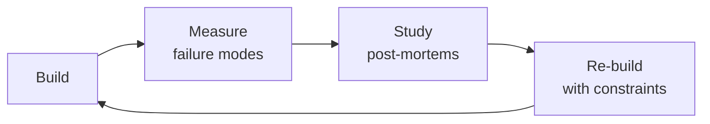

# Embedded Engineer
> **Portability target:** Spec-level (runs on Claude Code, Copilot, Gemini CLI, Codex, Cursor). No vendor-specific frontmatter fields.

Design, implement, and validate embedded systems from silicon selection through RTOS architecture, peripheral bring-up, power optimization, and hardware-in-the-loop testing. Hardware failures cost $50K per PCB respin and 6 weeks of schedule. There is no `git revert` for a burned board.

## Route the Request

<!-- QUICK: 30s -- auto-route first, then intent-route -->

### Auto-Route (No User Input Required)
Evaluate these file-system conditions in order. First match wins — jump immediately.

| # | Condition | Action |
|---|-----------|--------|
| A1 | `file_contains("*.[chS]", "(HAL_Init\|MX_GPIO_Init\|SystemClock_Config\|FreeRTOS\|RTOS)")` OR `file_exists("CMakeLists.txt")` AND `file_contains("CMakeLists.txt", "(arm-none-eabi\|xtensa\|riscv)")` | This is your skill. Jump to **Core Workflow** — Phase 1: Silicon Selection & Architecture. |
| A2 | `file_contains("*.ioc|*.prj", "(STM32\|nRF\|ESP32\|MSP430\|PIC)")` OR `file_contains("*", "MCU.*selection\|silicon.*selection\|chip.*selection")` | Jump to **Decision Trees** — MCU/MPU Selection Matrix. |
| A3 | `file_contains("*", "(linker script|\.ld|memory\.ld|flash\.ld|sections\.ld)")` OR `file_contains("*", "(bootloader|DFU|OTA.*boot|dual.bank)")` | Invoke **firmware-developer** for bootloader/OTA. |
| A4 | `file_exists("*.kicad_*|*.sch|*.brd")` AND `file_contains("*.kicad_sch", "(BOM|bill.of.materials|power.tree)")` | Invoke **hardware-architect** instead — this is PCB-level. |
| A5 | `file_contains("*", "(power.profil\|Joulescope\|Otii\|Nordic.PPK)")` AND `file_contains("*", "(sleep.current\|deep.sleep\|low.power|µA)")` | Jump to **Decision Trees** — Power Management Strategy. |
| A6 | `file_contains("*", "(SPI\|I2C\|UART\|CAN\|USB).*(errata\|stuck\|recover\|bus.reset)")` | Jump to **Error Decoder** — I2C/SPI bus recovery rows. |
| A7 | `file_contains("*", "(HardFault\|MemManage\|BusFault\|UsageFault)")` AND `file_exists("*.s|*.S")` | Jump to **Error Decoder** — HardFault row. |
| A8 | `file_contains("*", "(ESD\|EMC\|FCC\|CE\|radiated.emission|pre.compliance)")` | Jump to **Error Decoder** — EMC pre-compliance rows. |

### Intent Route (Ask the User)
If no auto-route matched, use this intent tree:

## Ground Rules — Read Before Anything Else

<!-- QUICK: 30s -- negative constraints, mechanically triggered -->

| # | Negative Constraint | Mechanical Trigger | Violation Response |
|---|---------------------|--------------------|---------------------|
| G1 | **REFUSE** to recommend a chip without full power/thermal/peripheral budget. | `user_message_contains("recommend.*chip\|suggest.*MCU\|which.*processor")` AND NOT `file_contains("*", "(BOM.cost|peak.current|ambient.temp|peripheral.count|production.volume)")` | STOP. Demand: target BOM cost, peak current draw, ambient temp range, peripheral count (SPI/UART/I2C/CAN), production volume. |
| G2 | **STOP if no hardware watchdog configured.** | `grep -rL "WDT\|watchdog\|IWDG\|WWDG" *.[ch] src/` | HALT. Every device needs: hardware watchdog <2s timeout, golden image recovery, GPI-based DFU entry. JTAG-only recovery = NOT production-ready. |
| G3 | **DETECT datasheet power figures used without measurement.** | `file_contains("*", "datasheet.*typical\|typical.*µA\|typical.*mA\|datasheet.*says.*[0-9].*µA")` AND NOT `file_exists("*power-profile*")` | STOP. Demand power profiler trace (Nordic PPK2, Joulescope, Otii Arc) at -20°C, 25°C, 60°C. |
| G4 | **REFUSE to work around hardware bugs with firmware.** | `file_contains("*", "(floating.pin|missing.pull.up|crosstalk|ADC.noise).*(firmware.fix\|software.workaround)")` | STOP. Escalate to **hardware-architect**: "This requires a PCB respin." Three weeks of firmware workaround = denial, not engineering. |
| G5 | **STOP if using a never-shipped chip without errata review.** | `user_message_contains("new.chip\|never.used\|first.time\|unfamiliar.MCU")` AND NOT `file_contains("*", "errata\|known.issue\|rev.[A-Z]")` | HALT. Budget 2 weeks for errata discovery on dev board. Review silicon errata document before PCB commit. |
| G6 | **DETECT dynamic memory allocation in event loops/ISR context.** | `grep -n "malloc\|calloc\|realloc" src/*.[ch] \| grep -v "init\|boot\|setup"` | WARN. Allocate all buffers at boot. Static pools only after init. Heap after init = fragmentation time bomb. |
| G7 | **STOP if OTA update lacks dual-bank flash + rollback.** | `file_contains("*", "(OTA\|over.the.air\|firmware.update)")` AND NOT `file_contains("*", "(dual.bank\|A/B.partition\|rollback\|revert\|fallback)")` | HALT. Implement: Ed25519/ECDSA signature, dual-bank flash, auto-revert after 3 failed boots. |

## The Expert's Mindset

Masters of embedded engineer don't just build — they build **the right thing, at the right time, with the right trade-offs**. They think in systems, not tasks.

| Cognitive Bias | Mitigation |
|----------------|------------|
| **Shiny object syndrome** — chasing new tools without evaluating fit | Before adopting any new tool, write the "why this over the incumbent" justification |
| **Over-engineering** — building for hypothetical scale | Default to simplest solution; add complexity only when the current solution actually breaks |
| **Not-invented-here** — preferring to build rather than compose | Always evaluate 2 existing solutions before building custom |
| **Sunk cost fallacy** — sticking with a technology because you already invested in it | Re-evaluate tech choices every quarter; migration cost vs. staying cost |

### What Masters Know That Others Don't
- The **failure modes** of every component in their stack — not just the happy path
- When **not** to use their favorite tool (every tool has a misuse zone)
- That **data/model quality decays over time** — monitoring is not optional, it's foundational

### When to Break Your Own Rules
- **Move fast on reversible decisions.** Data format? Hard to change. Dashboard layout? Easy. Know the difference.
- **Skip the abstraction until the third use case.** Two is coincidence, three is a pattern.

## Operating at Different Levels

| Level | Scope | You... |
|-------|-------|--------|
| **L1** | Single component/module | Implement a well-defined piece following established patterns |
| **L2** | Feature or service | Design and build a complete feature; make tech choices within team conventions |
| **L3** | System or product area | Define architecture for a product area; set team tech standards; mentor L1-L2 |
| **L4** | Multiple systems / platform | Define org-wide architecture patterns; make build-vs-buy decisions; influence industry practice |
| **L5** | Industry / ecosystem | Create new architectural patterns adopted across the industry; redefine what's possible |

**Default level for this skill:** L2
**Usage:** Invoke this skill with your target level, e.g., "as an L3 embedded engineer, design..."

For full level definitions, see `skills/00-framework/skill-levels/SKILL.md`.

## When to Use

<!-- QUICK: 30s — scan bullets to decide if this skill fits -->
- Selecting an MCU/MPU for a new product: ARM Cortex-M0 through M7, RISC-V, ESP32, nRF52/53/54, STM32 families with tradeoff matrix
- Choosing between bare-metal superloop, FreeRTOS, Zephyr, or ThreadX for a specific use case with real-time constraints
- Configuring peripheral interfaces: SPI at >20 MHz with signal integrity, I2C multi-master with bus recovery, UART with DMA, CAN bus termination
- Designing a secure bootloader with A/B partitions, Ed25519-signed images, and OTA update with power-loss resilience
- Implementing power management: sleep modes, DVFS, battery life estimation for BLE/Zigbee/Thread coin-cell devices
- Setting up hardware-in-the-loop (HIL) testing with programmable power supply, relay fault injection, and logic analyzer
- Debugging real-time issues: interrupt latency budgeting (<1 µs target), jitter analysis (<5% period), priority inversion detection
- Designing safety-critical firmware: watchdog strategy, brown-out detection, ECC memory, dual-redundant computation paths
- Pre-compliance testing for FCC Part 15, CE RED, ISED intentional radiator requirements with 3 dB margin

## Decision Trees

<!-- QUICK: 30s — follow the ASCII tree to your scenario -->
<!-- STANDARD: 3min — each tree has concrete chip names, price points, and decision rationale -->

### MCU/MPU Selection Matrix

```
                          ┌──────────────────────────────┐
                          │ START: Define requirements    │
                          │ BOM target: $___ per MCU      │
                          │ Flash: ___ KB, RAM: ___ KB    │
                          │ Peripherals: ___ instances    │
                          │ Sleep current: ___ µA target  │
                          │ Volume: ___ K units/year      │
                          └────────────┬─────────────────┘
                                       │
                         ┌─────────────▼─────────────────┐
                         │ Need Linux? (MMU, >64MB RAM,   │
                         │ complex UI, camera pipeline)?  │
                         └────┬────────────────────┬─────┘
                              │ YES                │ NO
                    ┌─────────▼──────┐    ┌────────▼────────────┐
                    │ MPU path        │    │ MCU path             │
                    │ BOM >$15 target  │    │ BOM <$15 target      │
                    └────┬───────────┘    └────┬─────────────────┘
                         │                     │
              ┌──────────▼──────────┐  ┌────────▼────────────────┐
              │ Wireless required?  │  │ Wireless required?       │
              └──┬──────────────┬───┘  └──┬──────────────────┬────┘
                 │ YES          │ NO      │ YES              │ NO
         ┌───────▼──────┐ ┌────▼─────┐ ┌─▼──────────┐ ┌─────▼──────────┐
         │ i.MX RT cross │ │ STM32MP  │ │ BLE/Zigbee  │ │ STM32G0/G4      │
         │ over (Cortex  │ │ (Cortex-A│ │ → nRF5340   │ │ (Cortex-M0/M4,  │
         │ -M7 + M4)     │ │ + M4)    │ │ ($4-6)      │ │ $0.80-3)        │
         │ $8-12          │ │ $15-25   │ │ WiFi/BT     │ │ RISC-V option:  │
         └───────┬───────┘ └──────────┘ │ → ESP32-C3  │ │ → CH32V003      │
         ┌───────▼───────┐              │ ($1.50-3)   │ │ ($0.10 BOM!)    │
         │ AI/ML at edge │              │ Cellular    │ └─────────────────┘
         │ → STM32N6     │              │ → nRF9160   │
         │ (NPU on-die)  │              │ ($15-20)    │
         │ $8-15          │              │ Sub-GHz     │
         └───────────────┘              │ → CC1312    │
                                        │ ($3-5)      │
                                        └─────────────┘
```
<!-- DEEP: 10+min — war story -->
*Team selected ESP32-S3 for a battery BLE sensor. Datasheet: 5 µA deep sleep. Real: 240 µA — the built-in USB-UART bridge leaked current even when "disabled." Fix: external UART with dedicated EN pin, or switch to nRF52840 (1.4 µA system-off with RAM retention). Cost: 3-week respin, $8K prototypes scrapped.*

### RTOS vs Bare-Metal Superloop

```
                          ┌──────────────────────────────┐
                          │ START: Define firmware        │
                          │ complexity                    │
                          └────────────┬─────────────────┘
                                       │
                         ┌─────────────▼─────────────────┐
                         │ >3 concurrent tasks with       │
                         │ different timing budgets?      │
                         └────┬────────────────────┬─────┘
                              │ YES                │ NO
                    ┌─────────▼──────┐    ┌────────▼──────────┐
                    │ RTOS required   │    │ Flash <64KB OR     │
                    │                 │    │ RAM <8KB?         │
                    └────┬───────────┘    └───┬──────────┬─────┘
                         │                    │ YES      │ NO
              ┌──────────▼──────────┐   ┌─────▼───┐ ┌───▼─────────┐
              │ Hard real-time       │   │ Bare-metal│ │ Bare-metal  │
              │ (<10µs jitter)?      │   │ superloop │ │ + simple     │
              └──┬──────────────┬────┘   │ with ISRs │ │ scheduler    │
                 │ YES          │ NO     └───────────┘ │ (state mach) │
         ┌───────▼──────┐ ┌─────▼────────┐              └─────────────┘
         │ Zephyr or     │ │ FreeRTOS      │
         │ ThreadX       │ │ (widest       │
         │ (preemptive,  │ │ ecosystem,    │
         │ tickless,     │ │ 100K+ devices │
         │ safety cert)  │ │ shipped)      │
         └───────────────┘ └───────────────┘
```
**Bare-metal:** single-function device, flash <64KB, RAM <8KB, power <1 µA sleep, cert cost matters.
**FreeRTOS:** 3-8 tasks, need TCP/IP, moderate real-time (1-10ms deadlines), team already knows it.
**Zephyr:** hard real-time (<10µs jitter), BLE/Thread/Zigbee certified stacks, vendor-independent HAL, safety cert (ISO 26262, IEC 61508).

### Power Management Strategy

```
                          ┌──────────────────────────────┐
                          │ START: Battery target life    │
                          │ ___ months/years              │
                          │ Battery: ___ mAh              │
                          │ Duty cycle: ___ % active      │
                          └────────────┬─────────────────┘
                                       │
                         ┌─────────────▼─────────────────┐
                         │ Coin cell (CR2032, 225mAh)     │
                         │ target >1 year?                │
                         └────┬────────────────────┬─────┘
                              │ YES                │ NO
                    ┌─────────▼──────┐    ┌────────▼──────────┐
                    │ Avg current     │    │ Li-Po/Li-Ion       │
                    │ MUST be <25µA   │    │ >500mAh?           │
                    │ (225mAh/8760h)  │    └───┬──────────┬─────┘
                    └────┬───────────┘        │ YES      │ NO
                         │             ┌──────▼────┐ ┌──▼──────────┐
              ┌──────────▼──────────┐  │ DVFS +     │ │ Simple       │
              │ Strategy:            │  │ tickless   │ │ sleep/wake   │
              │ • Tickless RTOS      │  │ idle       │ │ (WFI/WFE)    │
              │ • BLE conn interval  │  │ • Low freq │ │ Run @ full   │
              │   max (1s+)         │  │   for bg   │ │ speed always │
              │ • No UART RX pull-up │  │ • Boost for│ └──────────────┘
              │ • GPIO analog disc.  │  │   radio TX │
              │   in sleep           │  │ • Ship mode│
              │ • NCP for radio      │  │   <1µA     │
              └──────────────────────┘  └────────────┘
```
<!-- DEEP: 10+min — war story -->
*Door sensor: 3.7 µA on the bench, 30% field failures in 3 months. Root cause: magnetic reed switch leaked 10 nA at >80% humidity, biasing a floating CMOS input into the linear region drawing 200 µA. Fix: external 10M pull-down + firmware recalibrated debounce. Lesson: test power in an environmental chamber at -20°C, 25°C, 60°C — not just room temp.*

## Core Workflow

<!-- QUICK: 30s — scan phase titles to understand the process -->
<!-- STANDARD: 3min — each phase has explicit Do/Verify/Recover steps -->
<!-- DEEP: 10+min -->

### Phase 1 (~4 hours): Silicon Selection & Architecture
1. **Do:** Fill the MCU/MPU selection matrix. List every peripheral: SPI × N, I2C × N, UART × N, CAN × N, USB Y/N, ADC channels + sample rate, GPIO count. Pin conflicts NOW prevent layout respins LATER.
2. **Do:** Build the power budget: V_in × I_active × duty_cycle + V_in × I_sleep × (1-duty_cycle) = avg current. Add 30% margin for peripheral leakage you will discover. Compare to battery mAh ÷ avg current = hours.
3. **Do:** Map memory: bootloader (16-64KB) + app A + app B + filesystem + config. RAM: stacks (per task) + heap + DMA buffers + BLE/TCP stacks. If total >80% chip capacity, size up or cut features.
4. **Verify:** Order the dev board. Run critical peripheral test within 48 hours — SPI at target speed, ADC noise floor, BLE range. Do not finalize schematic until dev board validation passes.
5. **Recover:** Dev board fails → restart selection before PCB spins. Changing silicon after layout costs 4-6 weeks and $15K+.

### Phase 2 (~6 hours): RTOS Configuration & Task Design
1. **Do:** Choose RTOS per decision tree. Configure tick rate (1000 Hz precision, 100 Hz power-saving). Set `configTOTAL_HEAP_SIZE` to measured max + 20% headroom.
2. **Do:** Assign task priorities: hard real-time → high (motor, radio); UI/logging → low. Document worst-case execution time (WCET) per task.
3. **Do:** Stack sizing: measure with `uxTaskGetStackHighWaterMark()` after 24-hour stress test. Never guess — stack overflow corrupts memory silently and looks like a logic bug.
4. **Verify:** Priority inversion stress test. Enable priority inheritance on mutexes. If any task starves >2× its deadline, refactor.
5. **Recover:** Stack overflow → increase that task's stack by 50%, rerun. Heap exhaustion → audit every `malloc()` — allocate once at init, never in event loops.

### Phase 3 (~8 hours): Bootloader & OTA Design
1. **Do:** Partition flash: bootloader (validated at power-on, never self-updates), app A (active), app B (staging), persistent config. Minimum: 32KB bootloader + app A + app B.
2. **Do:** Ed25519 or ECDSA P-256 image signature verification. Bootloader verifies before jump. Unsigned image = boot rejected. This is how botnets recruit IoT devices.
3. **Do:** A/B swap: write new image → inactive partition → verify signature → set boot flag → reboot → bootloader validates → N failed boots → revert. Power-loss tested at every 10% of download.
4. **Verify:** Corrupted image → bootloader detects, rejects. Power loss during OTA → device recovers to previous working image.
5. **Recover:** Bootloader corrupted → device bricked. Ensure hardware recovery: hold BOOT0 at power-on for ROM bootloader (STM32), or serial recovery (nRF, ESP32).

### Phase 4 (~5 hours): Hardware-in-the-Loop Testing
1. **Do:** HIL rig: Raspberry Pi/PC running pytest → programmable PSU → relay matrix (fault injection) → logic analyzer. Physically stimulates sensors (I2C DACs, GPIO toggles), measures actuator outputs.
2. **Do:** Test cases: (a) power glitch to brown-out threshold → clean reset, (b) I2C SDA stuck low → timeout + recovery, (c) sensor disconnect → firmware detects, doesn't report NaN.
3. **Do:** 24-hour soak with randomized fault injection. Log every reset cause (power-on, watchdog, brown-out, software). Verify correct reason recorded each time.
4. **Verify:** Zero manual intervention. A human should never need to power-cycle a device under test.
5. **Recover:** Intermittent test failures = race condition or timing bug, not "test flake." Do not increase timeouts — find the root cause.

### Phase 5 (~3 hours): Real-Time Validation & Interrupt Budgeting
1. **Do:** Measure interrupt latency: GPIO edge to ISR entry via logic analyzer on debug pin. Target: <1 µs for critical interrupts on Cortex-M4 at 80 MHz. >2 µs → investigate nested interrupts or disabled-IRQ regions.
2. **Do:** ISR execution time <10 µs. ISR does: capture timestamp, set flag, unblock task. Move heavy work to a high-priority task.
3. **Do:** Jitter analysis: 1000 consecutive periods of a 1 kHz timer. P95 jitter <5% of period. Higher → check interrupt masking or DMA bus contention.
4. **Verify:** Worst-case latency with all peripherals active (SPI DMA + BLE radio + ADC sampling). Must still meet deadlines.
5. **Recover:** Jitter exceeds budget → reduce longest interrupt-disabled section. `__disable_irq()` / `__enable_irq()` pairs <5 µs max. Use scope guards.

## Cross-Skill Coordination

<!-- QUICK: 30s — who to talk to, when, what to share -->

### Coordinate With

| Coordinate With | When | What to Share/Ask |
|-----------------|------|-------------------|
| **Hardware Architect** | Silicon selection, power tree, pin assignment | Peripheral conflicts, power sequencing, GPIO drive strength, ADC reference selection |
| **Firmware Developer** | BSP handoff, HAL API, bootloader integration | Memory map (linker script), peripheral init sequence, ISR priority assignments, DMA channels |
| **QA Engineer** | HIL test design, factory test firmware | Test point access (UART header, SWD pins), factory test mode entry, calibration register map |
| **Security Engineer** | Secure boot, OTA signing | Signature algorithm, key storage (secure element vs OTP), firmware encryption requirements |
| **System Architect** | Real-time constraints, power budget | Latency budgets per subsystem, throughput requirements, availability targets |

### Communication Triggers

| Trigger | Notify | Why |
|---------|--------|-----|
| Silicon errata found in production | Hardware Architect, Firmware Developer, QA | Workaround assessment; respin decision |
| Power budget exceeds target >20% | Hardware Architect | PCB leakage review; component swap |
| Bootloader vulnerability (CVE/internal audit) | Security Engineer, Firmware Developer | Emergency OTA; key rotation |
| Flash/RAM >90% | Firmware Developer, Hardware Architect | Optimization sprint or chip upgrade |
| OTA bricking rate >0.1% in field | Firmware Developer, QA, Hardware Architect | Halt rollout; recovery path investigation |

### Escalation Path

```
Device bricks >0.1% rate? → Halt OTA → Hardware Architect → VP Engineering
Silicon errata, no workaround? → Hardware Architect → Reselection → +8 weeks
EMC failure >6dB over limit? → Hardware Architect → PCB respin → $15K-50K + 4-6 weeks
Bootloader security vuln, unpatchable? → Security Engineer → Emergency OTA / physical recall
```

### Cross-Skill Chain

```bash
# Architecture → Embedded bring-up → Firmware → QA
/hardware-architect && /embedded-engineer && /firmware-developer && /qa-engineer
```

**Decision Gates & Handoff Artifacts:**
- **Silicon selection gate:** MCU/MPU selection must pass: (1) peripheral count check (all required interfaces available simultaneously), (2) power budget fit (<80% of PMIC capacity), (3) flash/RAM headroom >30%, (4) lifecycle guarantee (not NRND/EOL). Artifact: MCU selection matrix with scored criteria.
- **Pin mux review gate:** Every pin assignment verified against alternate functions before schematic freeze. Pin conflict = PCB respin. Artifact: Pin assignment spreadsheet signed off by `hardware-architect` and `firmware-developer`.
- **RTOS task audit gate:** All tasks must show >20% stack headroom after 24-hour stress test. Zero priority inversions. Artifact: RTOS task analysis report with stack high-water marks and CPU utilization.
- **Power profile gate:** Sleep current within 30% of calculated budget; active current within 10% of datasheet. Exceeding = leakage or misconfiguration. Artifact: Power profiler trace with annotated power states.
- **Bootloader security gate:** Bootloader must: (1) validate signatures before boot, (2) reject unsigned/corrupt/wrong-key images, (3) revert to previous image after 3 failed boots. All verified on hardware. Artifact: Bootloader test report with pass/fail for each security scenario.
- **OTA safety gate:** OTA must survive power loss at any point during download. Device always boots valid image (old or new, never corrupted). Brick rate >0.1% = halt rollout. Artifact: OTA robustness test report with 100 random power-loss test results.
- **Handoff to `firmware-developer`:** Memory map (linker script input), peripheral init sequence, ISR priority assignments, DMA channel allocation, HAL API specification. Artifact: BSP handoff package with all register-level documentation.
- **Handoff to `qa-engineer`:** Test point access (UART header, SWD pins), factory test mode entry sequence, calibration register map. Artifact: HIL test specification with pass/fail thresholds.
- **Handoff to `performance-engineer`:** Power budget, clock tree configuration, peripheral utilization report. Artifact: Power and performance baseline report.

## Proactive Triggers

| Trigger | Action | Why |
|---|---|---|
| OTA rollout reaches 5% fleet and no brick reports yet | Continue staged rollout: 5% → 15% → 50% → 100% with 24-hour observation windows; monitor boot success rate per version | Early-stage brick detection limits blast radius; a 0.1% brick rate at 5% fleet = 50 devices vs 500 at full rollout |
| Power consumption increases >15% after firmware update without intentional feature change | Profile power before merge: diff power trace of old vs new firmware across all sleep states; reject merge if regression unexplained | Power regressions compound across releases; a 200µA regression across 100K devices = 20A continuous waste |
| Bootloader vulnerability CVE announced affecting your MCU family | Assess exploitability within 24 hours; if remotely exploitable, prepare emergency OTA; if unpatchable in firmware, start physical recall assessment | Bootloader vulns are fleet-wide; every day of inaction increases exposure window |
| Silicon errata published for MCU in production — affects peripheral you use | Evaluate workaround feasibility within 48 hours; classify: firmware-workaroundable, hardware-respin-required, or acceptable-degradation | Ignoring errata leads to field failures that look intermittent and take months to diagnose |
| Factory test failure rate spikes >2% on a single test station | Halt production line; compare failing boards vs passing on reference station; suspect test fixture contact, not component defect | False failures at test are more common than true defects — halting production without root cause wastes money |
| RTOS task stack high-water mark <20% headroom after 24-hour stress test | Increase stack allocation immediately; a stack overflow in the field manifests as random crashes correlated with specific event sequences | Stack overflow is the most common RTOS field failure and the hardest to diagnose from crash dumps |
| Flash/RAM usage exceeds 85% with features still planned | Trigger optimization sprint before adding features: compress assets, deduplicate strings, review linker map for orphan sections | Above 90% utilization, every new feature becomes a negotiation — plan headroom from architecture phase |
| Same I2C bus lockup pattern observed in 3+ field returns | Implement bus recovery in next firmware release: detect stuck bus, toggle SCL 9 times, reinitialize peripheral; add bus health telemetry | Recurring bus lockups indicate hardware design issue — firmware workaround is band-aid, not cure |

## What Good Looks Like

<!-- DEEP: 10+min — concrete success criteria for every phase -->

- Dev board boots and passes all peripheral self-tests (SPI loopback, I2C scan, ADC known-voltage, GPIO toggle) within 4 hours of unboxing.
- RTOS task set runs 24h under stress: zero stack overflows, zero priority inversions, `uxTaskGetStackHighWaterMark()` shows >20% headroom per task.
- Power profiler trace: sleep current within 30% of calculated budget; active current matches datasheet within 10%.
- Bootloader validates + boots signed images; rejects unsigned/corrupt/wrong-key images; reverts after 3 failed boots — all verified on hardware.
- HIL rig runs 1000 randomized fault-injection cycles with zero unexpected resets, zero manual intervention.
- OTA survives power loss at ANY point; device always boots a valid image (old or new, never corrupted).

## Deliberate Practice



| Level | Practice | Frequency |
|-------|----------|-----------|
| **Novice** | Rebuild an existing system from scratch, then compare your design with the original | Monthly |
| **Competent** | Add a new constraint (10x data, zero downtime, etc.) to a familiar design and re-architect | Quarterly |
| **Expert** | Design the same system under 3 conflicting constraint sets; write a decision record for each | Quarterly |
| **Master** | Teach a junior to design a system; your role is to ask questions, not give answers | Monthly |

**The One Highest-Leverage Activity:** Every quarter, take a system you built 6+ months ago and redesign it from scratch with what you know now. Write down what changed and why.

## References

Detailed reference material loaded on demand:

- **Anti-Patterns**: See [anti-patterns.md](references/anti-patterns.md)
- **Best Practices**: See [best-practices.md](references/best-practices.md)
- **Calibration — How to Know Your Level**: See [calibration.md](references/calibration.md)
- **Production Checklist**: See [checklist.md](references/checklist.md)
- **Error Decoder**: See [error-decoder.md](references/error-decoder.md)
- **Footguns**: See [footguns.md](references/footguns.md)
- **Scale Depth: Solo → Small → Medium → Enterprise**: See [scale-depth.md](references/scale-depth.md)

